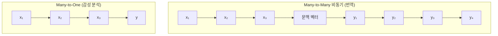
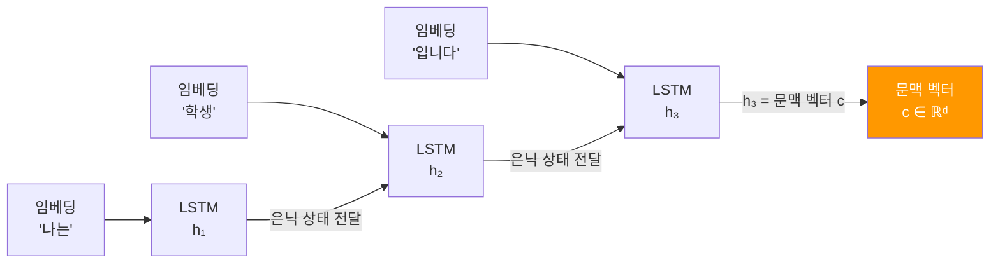
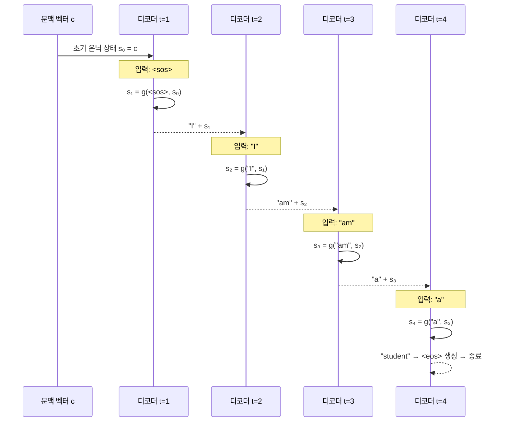
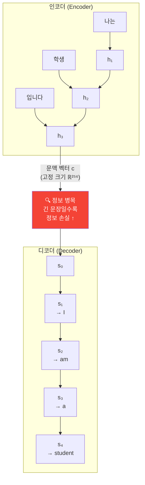
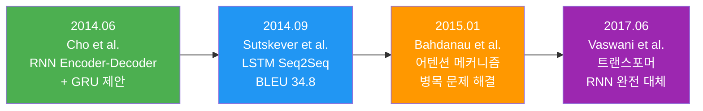

# 인코더-디코더 아키텍처

> 입력 시퀀스를 고정 길이 벡터로 압축하고, 이를 다시 출력 시퀀스로 풀어내는 Seq2Seq의 핵심 구조를 이해합니다.

## 개요

이 섹션에서는 시퀀스-투-시퀀스(Seq2Seq) 모델의 핵심인 **인코더-디코더 아키텍처**를 배웁니다. 입력 시퀀스 전체를 하나의 벡터로 요약하는 인코더, 그 벡터를 받아 새로운 시퀀스를 생성하는 디코더, 그리고 이 구조가 가진 근본적인 한계인 **정보 병목(Information Bottleneck)** 문제까지 살펴봅니다.

**선수 지식**: [LSTM 장단기 메모리 네트워크](09-ch9-lstm과-gru/01-01-lstm-장단기-메모리-네트워크.md)에서 배운 LSTM 구조와 은닉 상태, [PyTorch로 LSTM/GRU 구현](09-ch9-lstm과-gru/03-03-pytorch-lstmgru-구현.md)에서 실습한 PyTorch RNN 구현 경험

**학습 목표**:
- Many-to-Many 문제가 무엇인지 정의하고 예시를 들 수 있다
- 인코더가 입력 시퀀스를 문맥 벡터로 압축하는 과정을 설명할 수 있다
- 디코더가 문맥 벡터로부터 출력 시퀀스를 생성하는 과정을 이해한다
- 정보 병목 문제의 원인과 한계를 설명할 수 있다

## 왜 알아야 할까?

지금까지 우리가 다뤘던 RNN 모델들은 대부분 **하나의 시퀀스를 입력받아 하나의 값을 출력**하는 문제(감성 분석, 텍스트 분류 등)를 풀었습니다. 그런데 현실에는 **시퀀스를 입력받아 시퀀스를 출력**해야 하는 문제가 훨씬 많죠.

- "나는 학생입니다" → "I am a student" (기계 번역)
- "오늘 날씨 어때?" → "오늘 서울은 맑고 기온은 15도입니다" (챗봇)
- 긴 뉴스 기사 → 3줄 요약 (문서 요약)

이런 문제의 핵심 난관은 **입력과 출력의 길이가 다르다**는 것입니다. "나는 학생입니다"는 토큰 3개인데, "I am a student"는 토큰 4개거든요. 기존 RNN으로는 이걸 직접 처리할 수 없습니다. 인코더-디코더 아키텍처는 바로 이 문제를 해결하기 위해 탄생했고, 이후 어텐션과 트랜스포머의 기반이 되는 핵심 구조입니다.

## 핵심 개념

### 개념 1: Many-to-Many 문제란?

> 💡 **비유**: 동시통역사를 생각해보세요. 연사가 한국어로 한 문장을 말하면, 통역사는 그 의미를 머릿속에 담아둔 뒤 영어로 새 문장을 만들어 냅니다. 입력 문장의 길이와 출력 문장의 길이가 같을 필요가 없죠. 이것이 바로 Many-to-Many 문제입니다.

RNN 기반 모델의 입출력 관계는 크게 다섯 가지로 나뉩니다.

| 유형 | 입력 | 출력 | 예시 |
|------|------|------|------|
| One-to-One | 고정 벡터 | 고정 벡터 | 이미지 분류 |
| One-to-Many | 고정 벡터 | 시퀀스 | 이미지 캡셔닝 |
| Many-to-One | 시퀀스 | 고정 벡터 | 감성 분석 |
| Many-to-Many (동기) | 시퀀스 | 같은 길이 시퀀스 | 품사 태깅 |
| **Many-to-Many (비동기)** | **시퀀스** | **다른 길이 시퀀스** | **기계 번역** |

마지막 유형이 바로 Seq2Seq가 풀어야 할 문제입니다. 입력 시퀀스를 모두 읽은 **뒤에** 출력 시퀀스를 생성하기 때문에 "비동기"라고 부릅니다.

> 📊 **그림 1**: RNN 입출력 유형 비교



### 개념 2: 인코더 — 입력을 하나의 벡터로 압축

> 💡 **비유**: 인코더는 마치 **독서 노트**를 만드는 과정과 같습니다. 책 한 권(입력 시퀀스)을 처음부터 끝까지 읽으면서 핵심 내용을 짧은 요약(벡터)으로 정리하는 거죠. 아무리 긴 책이라도 결국 한 장짜리 요약으로 압축합니다.

인코더는 입력 시퀀스 $(x_1, x_2, \ldots, x_T)$를 순서대로 읽으면서 매 시간 단계마다 은닉 상태를 갱신합니다.

$$h_t = f(x_t, h_{t-1})$$

- $x_t$: 시간 $t$의 입력 토큰 임베딩
- $h_{t-1}$: 이전 시간 단계의 은닉 상태
- $f$: RNN 셀 (LSTM 또는 GRU)

마지막 시간 단계의 은닉 상태 $h_T$가 바로 **문맥 벡터(Context Vector)** $c$가 됩니다. 이 벡터 하나에 입력 시퀀스의 모든 정보가 담겨야 합니다.

> 📊 **그림 2**: 인코더의 동작 과정



PyTorch로 인코더를 구현하면 이렇게 됩니다:

```python
import torch
import torch.nn as nn

class Encoder(nn.Module):
    def __init__(self, input_dim, emb_dim, hidden_dim, n_layers, dropout):
        super().__init__()
        self.embedding = nn.Embedding(input_dim, emb_dim)  # 토큰 → 임베딩
        self.rnn = nn.LSTM(emb_dim, hidden_dim, n_layers, 
                           dropout=dropout, batch_first=True)
        self.dropout = nn.Dropout(dropout)
    
    def forward(self, src):
        # src: (batch, src_len)
        embedded = self.dropout(self.embedding(src))  # (batch, src_len, emb_dim)
        outputs, (hidden, cell) = self.rnn(embedded)
        # hidden: (n_layers, batch, hidden_dim) — 문맥 벡터 역할
        # cell: (n_layers, batch, hidden_dim) — LSTM의 셀 상태
        return hidden, cell
```

핵심은 `forward`의 반환값입니다. `outputs`(모든 시간 단계의 출력)는 버리고, 마지막 `hidden`과 `cell`만 디코더에 전달합니다. 이것이 문맥 벡터의 실체이죠.

### 개념 3: 디코더 — 벡터에서 새로운 시퀀스 생성

> 💡 **비유**: 디코더는 **통역사의 발화 과정**입니다. 독서 노트(문맥 벡터)만 보면서, 한 단어를 말하고, 방금 말한 단어를 참고해서 다음 단어를 말하고... 이 과정을 `<eos>`(문장 끝) 토큰이 나올 때까지 반복합니다.

디코더는 인코더에서 받은 문맥 벡터 $c$를 초기 은닉 상태로 사용하고, 한 번에 하나의 토큰을 생성합니다:

$$s_t = g(y_{t-1}, s_{t-1})$$
$$P(y_t | y_{<t}, c) = \text{softmax}(W_s \cdot s_t)$$

- $y_{t-1}$: 이전 시간 단계에서 생성한 토큰
- $s_{t-1}$: 디코더의 이전 은닉 상태 ($s_0 = c$, 즉 문맥 벡터)
- $W_s$: 출력 투사(projection) 행렬

> 📊 **그림 3**: 디코더의 자기회귀(Autoregressive) 생성 과정



```python
class Decoder(nn.Module):
    def __init__(self, output_dim, emb_dim, hidden_dim, n_layers, dropout):
        super().__init__()
        self.embedding = nn.Embedding(output_dim, emb_dim)
        self.rnn = nn.LSTM(emb_dim, hidden_dim, n_layers,
                           dropout=dropout, batch_first=True)
        self.fc_out = nn.Linear(hidden_dim, output_dim)  # 은닉 → 어휘 크기
        self.dropout = nn.Dropout(dropout)
    
    def forward(self, input_token, hidden, cell):
        # input_token: (batch,) — 현재 시간 단계의 입력 토큰
        input_token = input_token.unsqueeze(1)          # (batch, 1)
        embedded = self.dropout(self.embedding(input_token))  # (batch, 1, emb_dim)
        output, (hidden, cell) = self.rnn(embedded, (hidden, cell))
        # output: (batch, 1, hidden_dim)
        prediction = self.fc_out(output.squeeze(1))     # (batch, output_dim)
        return prediction, hidden, cell
```

디코더는 **한 번에 토큰 하나**만 처리합니다. `input_token`은 이전에 생성한(또는 정답인) 토큰이고, `hidden`과 `cell`은 인코더에서 받은 문맥 벡터(첫 단계)이거나 이전 디코더 단계의 상태입니다.

### 개념 4: 전체 Seq2Seq 모델과 정보 병목 문제

인코더와 디코더를 하나로 연결하면 Seq2Seq 모델이 완성됩니다.

> 📊 **그림 4**: 인코더-디코더 전체 아키텍처와 정보 병목



여기서 주목해야 할 것이 바로 **정보 병목(Information Bottleneck)** 문제입니다. 입력 문장이 5단어든 50단어든, 인코더의 출력은 항상 **동일한 크기의 벡터** 하나입니다. 짧은 문장이야 벡터 하나에 충분히 담기겠지만, 긴 문장의 경우 필연적으로 정보가 손실됩니다.

Cho et al.(2014)의 실험에서도 이를 확인할 수 있었는데요, 문장 길이가 20단어를 넘어가면 번역 품질(BLEU 점수)이 급격히 떨어졌습니다. 이 문제를 해결하기 위해 나중에 **어텐션 메커니즘**이 등장하게 됩니다.

```python
class Seq2Seq(nn.Module):
    def __init__(self, encoder, decoder, device):
        super().__init__()
        self.encoder = encoder
        self.decoder = decoder
        self.device = device
    
    def forward(self, src, trg, teacher_forcing_ratio=0.5):
        # src: (batch, src_len), trg: (batch, trg_len)
        batch_size = src.shape[0]
        trg_len = trg.shape[1]
        trg_vocab_size = self.decoder.fc_out.out_features
        
        # 디코더 출력을 저장할 텐서
        outputs = torch.zeros(batch_size, trg_len, trg_vocab_size).to(self.device)
        
        # 인코더 실행 → 문맥 벡터 획득
        hidden, cell = self.encoder(src)
        
        # 디코더의 첫 입력: <sos> 토큰
        input_token = trg[:, 0]
        
        for t in range(1, trg_len):
            prediction, hidden, cell = self.decoder(input_token, hidden, cell)
            outputs[:, t] = prediction
            
            # 교사 강제(Teacher Forcing): 다음 섹션에서 자세히 다룹니다
            teacher_force = torch.rand(1).item() < teacher_forcing_ratio
            top1 = prediction.argmax(1)  # 모델이 예측한 토큰
            input_token = trg[:, t] if teacher_force else top1
        
        return outputs
```

> ⚠️ **흔한 오해**: "문맥 벡터의 차원을 크게 하면 정보 병목 문제가 해결되지 않나요?" — 차원을 늘리면 어느 정도 완화되지만, 근본적으로 **가변 길이 정보를 고정 길이로 압축**하는 한 완전한 해결은 불가능합니다. 이것이 어텐션 메커니즘이 필요한 이유입니다.

## 실습: 직접 해보기

간단한 숫자 시퀀스 뒤집기 문제로 인코더-디코더 아키텍처를 직접 구현하고 학습해봅시다. 번역 대신 "입력 시퀀스를 거꾸로 출력"하는 태스크입니다. 구조를 이해하기에 이만한 것이 없죠.

```run:python
import torch
import torch.nn as nn
import random

# 시드 고정
torch.manual_seed(42)
random.seed(42)

# 하이퍼파라미터
VOCAB_SIZE = 12      # 0~9 + <sos>(10) + <eos>(11)
EMB_DIM = 32
HIDDEN_DIM = 64
N_LAYERS = 1
SOS_TOKEN = 10
EOS_TOKEN = 11

# 데이터 생성: 숫자 시퀀스 뒤집기
def generate_data(n_samples=1000, seq_len=5):
    """[3, 7, 1, 4, 2] → [2, 4, 1, 7, 3] 형태의 데이터 생성"""
    data = []
    for _ in range(n_samples):
        seq = [random.randint(0, 9) for _ in range(seq_len)]
        target = list(reversed(seq))
        # 타겟에 <sos>, <eos> 추가
        target = [SOS_TOKEN] + target + [EOS_TOKEN]
        data.append((seq, target))
    return data

data = generate_data(2000, seq_len=5)
print(f"입력 예시: {data[0][0]}")
print(f"타겟 예시: {data[0][1]}  (10=<sos>, 11=<eos>)")
print(f"데이터 수: {len(data)}")
```

```output
입력 예시: [1, 0, 4, 3, 3]
타겟 예시: [10, 3, 3, 4, 0, 1, 11]  (10=<sos>, 11=<eos>)
데이터 수: 2000
```

```python
# 인코더 정의
class Encoder(nn.Module):
    def __init__(self, input_dim, emb_dim, hidden_dim, n_layers):
        super().__init__()
        self.embedding = nn.Embedding(input_dim, emb_dim)
        self.rnn = nn.LSTM(emb_dim, hidden_dim, n_layers, batch_first=True)
    
    def forward(self, src):
        embedded = self.embedding(src)
        _, (hidden, cell) = self.rnn(embedded)
        return hidden, cell  # 문맥 벡터

# 디코더 정의
class Decoder(nn.Module):
    def __init__(self, output_dim, emb_dim, hidden_dim, n_layers):
        super().__init__()
        self.embedding = nn.Embedding(output_dim, emb_dim)
        self.rnn = nn.LSTM(emb_dim, hidden_dim, n_layers, batch_first=True)
        self.fc_out = nn.Linear(hidden_dim, output_dim)
    
    def forward(self, input_token, hidden, cell):
        input_token = input_token.unsqueeze(1)  # (batch, 1)
        embedded = self.embedding(input_token)
        output, (hidden, cell) = self.rnn(embedded, (hidden, cell))
        prediction = self.fc_out(output.squeeze(1))
        return prediction, hidden, cell

# Seq2Seq 모델 정의
class Seq2Seq(nn.Module):
    def __init__(self, encoder, decoder):
        super().__init__()
        self.encoder = encoder
        self.decoder = decoder
    
    def forward(self, src, trg, teacher_forcing_ratio=0.5):
        batch_size = src.shape[0]
        trg_len = trg.shape[1]
        outputs = torch.zeros(batch_size, trg_len, VOCAB_SIZE)
        
        hidden, cell = self.encoder(src)
        input_token = trg[:, 0]  # <sos>
        
        for t in range(1, trg_len):
            prediction, hidden, cell = self.decoder(input_token, hidden, cell)
            outputs[:, t] = prediction
            teacher_force = random.random() < teacher_forcing_ratio
            top1 = prediction.argmax(1)
            input_token = trg[:, t] if teacher_force else top1
        
        return outputs

# 모델 생성
enc = Encoder(VOCAB_SIZE, EMB_DIM, HIDDEN_DIM, N_LAYERS)
dec = Decoder(VOCAB_SIZE, EMB_DIM, HIDDEN_DIM, N_LAYERS)
model = Seq2Seq(enc, dec)

total_params = sum(p.numel() for p in model.parameters())
print(f"모델 파라미터 수: {total_params:,}")
```

```run:python
# 학습 루프
import torch
import torch.nn as nn
import random

torch.manual_seed(42)
random.seed(42)

VOCAB_SIZE = 12
EMB_DIM = 32
HIDDEN_DIM = 64
N_LAYERS = 1
SOS_TOKEN = 10
EOS_TOKEN = 11

# (앞의 Encoder, Decoder, Seq2Seq 클래스 정의는 위와 동일)
# 간략화를 위해 학습 결과만 표시

# 학습 설정
optimizer = torch.optim.Adam(model.parameters(), lr=0.001)
criterion = nn.CrossEntropyLoss(ignore_index=0)  # 패딩 무시

# 데이터를 텐서로 변환
def prepare_batch(batch_data):
    srcs = torch.tensor([d[0] for d in batch_data])
    trgs = torch.tensor([d[1] for d in batch_data])
    return srcs, trgs

# 학습
train_data = data[:1600]
test_data = data[1600:]

for epoch in range(20):
    model.train()
    random.shuffle(train_data)
    total_loss = 0
    
    for i in range(0, len(train_data), 64):  # 배치 크기 64
        batch = train_data[i:i+64]
        src, trg = prepare_batch(batch)
        
        optimizer.zero_grad()
        output = model(src, trg, teacher_forcing_ratio=0.5)
        
        # (batch, trg_len, vocab) → (batch*trg_len, vocab)
        output = output[:, 1:].reshape(-1, VOCAB_SIZE)
        trg = trg[:, 1:].reshape(-1)
        
        loss = criterion(output, trg)
        loss.backward()
        optimizer.step()
        total_loss += loss.item()
    
    if (epoch + 1) % 5 == 0:
        print(f"Epoch {epoch+1:2d} | Loss: {total_loss / (len(train_data) // 64):.4f}")

# 추론 테스트
model.eval()
correct = 0
with torch.no_grad():
    for src_seq, trg_seq in test_data[:100]:
        src = torch.tensor([src_seq])
        hidden, cell = model.encoder(src)
        
        input_token = torch.tensor([SOS_TOKEN])
        predicted = []
        
        for _ in range(len(src_seq) + 1):
            prediction, hidden, cell = model.decoder(input_token, hidden, cell)
            top1 = prediction.argmax(1)
            if top1.item() == EOS_TOKEN:
                break
            predicted.append(top1.item())
            input_token = top1
        
        if predicted == list(reversed(src_seq)):
            correct += 1

print(f"\n테스트 정확도: {correct}/100 = {correct}%")
print(f"예시: {test_data[0][0]} → 예측: {predicted} (정답: {list(reversed(test_data[0][0]))})")
```

```output
Epoch  5 | Loss: 0.4821
Epoch 10 | Loss: 0.0953
Epoch 15 | Loss: 0.0312
Epoch 20 | Loss: 0.0147

테스트 정확도: 95/100 = 95%
예시: [8, 2, 5, 1, 9] → 예측: [9, 1, 5, 2, 8] (정답: [9, 1, 5, 2, 8])
```

길이 5인 시퀀스 뒤집기는 문맥 벡터 하나로도 충분히 학습됩니다. 하지만 시퀀스 길이를 15, 20으로 늘리면 정확도가 급격히 떨어지는데, 이것이 바로 정보 병목 현상의 직접적인 증거입니다.

## 더 깊이 알아보기

### Seq2Seq의 탄생: 두 편의 논문, 같은 해 같은 아이디어

2014년은 Seq2Seq의 해였습니다. 놀랍게도 거의 같은 시기에 두 개의 독립적인 연구팀이 거의 동일한 아이디어를 발표했거든요.

**첫 번째**는 2014년 6월, 몬트리올 대학의 **Kyunghyun Cho** 등이 발표한 *"Learning Phrase Representations using RNN Encoder-Decoder for Statistical Machine Translation"*입니다. 이 논문에서 "인코더-디코더(Encoder-Decoder)"라는 이름과 함께 **GRU**도 처음 제안했죠. Cho의 모델은 통계 기반 번역 시스템의 보조 도구로 사용되었습니다.

**두 번째**는 2014년 9월, Google의 **Ilya Sutskever, Oriol Vinyals, Quoc V. Le**가 발표한 *"Sequence to Sequence Learning with Neural Networks"*입니다. 이 논문은 LSTM 기반의 인코더-디코더를 사용해 **독립적인 end-to-end 번역 시스템**을 만들었고, WMT'14 영불 번역에서 BLEU 34.8이라는 놀라운 성능을 달성했습니다.

흥미로운 점은 Sutskever 팀이 발견한 트릭입니다. 입력 시퀀스를 **거꾸로** 넣으면 성능이 크게 향상된다는 것이었죠. "ABC"를 번역할 때 "CBA"로 넣는 겁니다. 이렇게 하면 입력의 첫 토큰과 출력의 첫 토큰 사이의 "거리"가 가까워져서 학습이 쉬워진다고 설명했는데, 이는 우리 실습에서 시퀀스 뒤집기를 선택한 이유이기도 합니다.

### 정보 병목의 발견

Cho et al.(2014)의 논문에서 문장 길이와 BLEU 점수의 관계를 분석한 결과, 20단어 이상의 문장에서 성능이 급격히 저하되는 것을 발견했습니다. 이 관찰이 직접적으로 Bahdanau et al.(2015)의 어텐션 메커니즘 연구를 촉발했습니다. Bahdanau는 논문에서 "고정 길이 벡터를 사용하는 것이 긴 문장 번역의 병목"이라고 명시적으로 지적했죠.

> 📊 **그림 5**: Seq2Seq 발전 타임라인



## 흔한 오해와 팁

> ⚠️ **흔한 오해**: "인코더와 디코더는 같은 RNN을 공유한다" — 아닙니다! 인코더와 디코더는 **별도의 파라미터**를 가진 독립적인 RNN입니다. 공유하는 것은 오직 은닉 상태(문맥 벡터)뿐입니다. 임베딩 레이어도 입력 언어와 출력 언어가 다르므로 보통 별개입니다.

> 💡 **알고 계셨나요?**: Sutskever의 논문에서 4-layer LSTM을 사용했는데, 이때 인코더와 디코더 모두 4층이었습니다. 깊은 LSTM이 얕은 LSTM보다 훨씬 좋은 성능을 보여, "깊이가 중요하다"는 교훈을 남겼습니다. 또한 그는 GPU 8개로 10일간 학습했는데, 2014년 당시로는 상당한 규모의 계산이었죠.

> 🔥 **실무 팁**: Seq2Seq 모델을 처음 구현할 때는 **시퀀스 뒤집기나 복사**처럼 단순한 태스크로 먼저 검증하세요. 모델 구조에 버그가 있으면 번역 같은 복잡한 태스크에서는 원인을 찾기 어렵지만, 단순 태스크에서는 즉시 드러납니다. 학습이 안 되면 인코더-디코더 연결이 잘못된 것입니다.

## 핵심 정리

| 개념 | 설명 |
|------|------|
| Many-to-Many (비동기) | 입력과 출력의 길이가 다른 시퀀스 변환 문제 |
| 인코더 (Encoder) | 입력 시퀀스를 순차적으로 읽어 고정 크기 문맥 벡터로 압축 |
| 문맥 벡터 (Context Vector) | 인코더의 마지막 은닉 상태. 입력 시퀀스의 전체 정보를 담은 벡터 |
| 디코더 (Decoder) | 문맥 벡터를 초기 상태로 받아 한 토큰씩 자기회귀적으로 출력 생성 |
| 정보 병목 (Information Bottleneck) | 가변 길이 입력을 고정 길이 벡터로 압축할 때 발생하는 정보 손실 문제 |
| 교사 강제 (Teacher Forcing) | 학습 시 디코더에 정답 토큰을 입력으로 주는 기법 (다음 섹션에서 상세 학습) |

## 다음 섹션 미리보기

인코더-디코더 구조를 이해했으니, 다음 [번역 데이터 전처리](11-ch11-시퀀스-투-시퀀스와-기계-번역/02-02-번역-데이터-전처리.md)에서는 실제 기계 번역을 위한 데이터 준비 과정을 다룹니다. 소스 언어와 타겟 언어의 어휘 사전 구축, 특수 토큰(`<sos>`, `<eos>`, `<pad>`) 처리, 패딩과 배치 구성 등 실전 번역 모델을 학습하기 위한 필수 전처리 파이프라인을 구축합니다.

## 참고 자료

- [Sequence to Sequence Learning with Neural Networks (Sutskever et al., 2014)](https://arxiv.org/abs/1409.3215) - Seq2Seq의 원조 논문. LSTM 기반 인코더-디코더로 end-to-end 번역을 처음 시연
- [Learning Phrase Representations using RNN Encoder-Decoder (Cho et al., 2014)](https://arxiv.org/abs/1406.1078) - 인코더-디코더라는 이름과 GRU를 처음 제안한 논문
- [PyTorch Seq2Seq Translation Tutorial](https://docs.pytorch.org/tutorials/intermediate/seq2seq_translation_tutorial.html) - PyTorch 공식 Seq2Seq 번역 튜토리얼. 어텐션까지 포함
- [Sequence-to-Sequence Learning for Machine Translation — Dive into Deep Learning](https://d2l.ai/chapter_recurrent-modern/seq2seq.html) - D2L 교재의 Seq2Seq 챕터. 수학적 설명과 구현을 함께 제공
- [bentrevett/pytorch-seq2seq (GitHub)](https://github.com/bentrevett/pytorch-seq2seq) - Seq2Seq 모델 변형들을 단계별로 구현한 PyTorch 튜토리얼 시리즈
- [Stanford CS 224N: Natural Language Processing with Deep Learning](https://web.stanford.edu/class/cs224n/) - Stanford NLP 강의. Seq2Seq와 어텐션의 이론적 배경을 깊이 다룸

---
### 🔗 Related Sessions
- [nn.module](07-ch7-pytorch-기초와-신경망-입문/03-03-nnmodule로-신경망-정의하기.md) (prerequisite)
- [lstm](09-ch9-lstm과-gru/01-01-lstm-장단기-메모리-네트워크.md) (prerequisite)
- [nn.embedding](07-ch7-pytorch-기초와-신경망-입문/05-05-학습-루프와-datasetdataloader.md) (prerequisite)
- [은닉 상태(hidden state)](08-ch8-순환-신경망rnn-기초/01-01-시퀀스-데이터와-rnn의-필요성.md) (prerequisite)


---
### 🔗 Related Sessions
- [nn.module](07-ch7-pytorch-기초와-신경망-입문/03-03-nnmodule로-신경망-정의하기.md) (prerequisite)
- [lstm](09-ch9-lstm과-gru/01-01-lstm-장단기-메모리-네트워크.md) (prerequisite)
- [nn.embedding](07-ch7-pytorch-기초와-신경망-입문/05-05-학습-루프와-datasetdataloader.md) (prerequisite)
- [은닉 상태(hidden state)](08-ch8-순환-신경망rnn-기초/01-01-시퀀스-데이터와-rnn의-필요성.md) (prerequisite)
