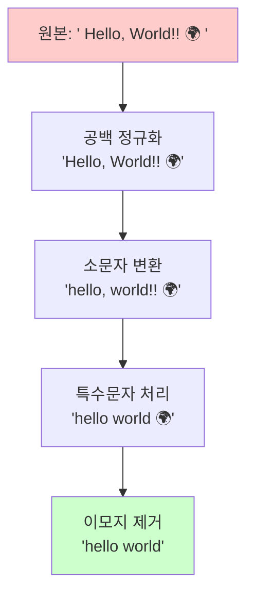
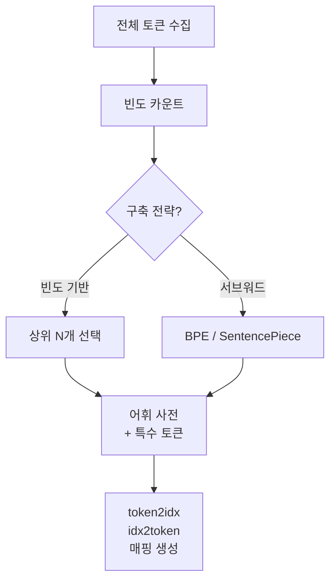
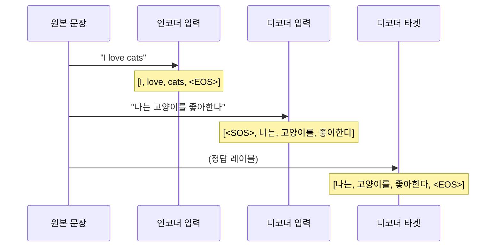
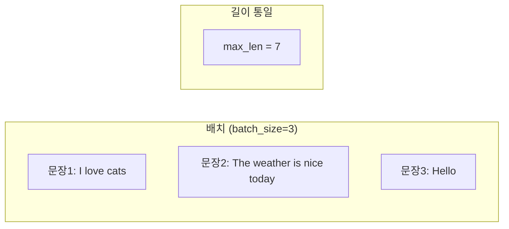

# 번역 데이터 전처리

> 병렬 코퍼스에서 모델이 학습할 수 있는 숫자 시퀀스까지 — 번역 파이프라인의 첫 관문을 완전 정복합니다.

## 개요

이 섹션에서는 기계 번역 모델에 데이터를 공급하기 전, **원시 텍스트를 깨끗한 토큰 시퀀스로 변환**하는 전처리 파이프라인 전체를 다룹니다. 아무리 정교한 Seq2Seq 모델이라도 "쓰레기가 들어가면 쓰레기가 나온다(Garbage In, Garbage Out)"는 원칙에서 벗어날 수 없거든요.

**선수 지식**: [01. Seq2Seq 모델 구조: 인코더-디코더 패러다임](11-ch11-시퀀스-투-시퀀스와-기계-번역/01-seq2seq-모델-구조-인코더-디코더-패러다임.md)에서 배운 인코더-디코더 구조
**학습 목표**:
- 병렬 코퍼스의 구조를 이해하고 품질 기준을 설명할 수 있다
- 텍스트 정규화, 토큰화, 어휘 사전 구축의 전체 흐름을 구현할 수 있다
- `<SOS>`, `<EOS>`, `<PAD>`, `<UNK>` 특수 토큰의 역할과 배치 위치를 정확히 설명할 수 있다

## 왜 알아야 할까?

실무에서 번역 모델을 학습시킬 때 **코드 작성 시간의 60-70%가 전처리**에 들어간다는 말이 있을 정도입니다. 전처리를 제대로 하지 않으면 아무리 최신 아키텍처를 쓰더라도 성능이 나오지 않죠.

"영어를 한국어로 번역하는 모델을 만든다"고 가정해 봅시다. 원본 데이터에는 HTML 태그, 이모지, 중복 문장, 길이가 100배 차이 나는 문장 쌍이 뒤섞여 있습니다. 이걸 그대로 모델에 넣으면 어떤 일이 벌어질까요? 모델은 번역 패턴이 아닌 **노이즈 패턴**을 학습하게 됩니다.

> 📊 **그림 1**: 번역 전처리 파이프라인 전체 흐름


## 핵심 개념

### 개념 1: 병렬 코퍼스 — 번역의 원재료

> 💡 **비유**: 병렬 코퍼스는 **외국어 학습 교재의 좌우 페이지**와 같습니다. 왼쪽에는 영어 문장, 오른쪽에는 한국어 번역이 나란히 적혀 있죠. 한쪽만 있으면 스스로 답을 확인할 수 없듯, 기계 번역 모델도 "원문-번역문" 쌍이 있어야 정답을 배울 수 있습니다.

**병렬 코퍼스(Parallel Corpus)**는 동일한 의미의 문장이 두 언어로 정렬된 데이터셋입니다. 대표적인 공개 데이터셋으로는 다음이 있습니다:

| 데이터셋 | 규모 | 특징 |
|----------|------|------|
| WMT (Workshop on MT) | 수백만~수천만 쌍 | 뉴스, 의회 데이터 중심 |
| OPUS (Open Parallel Corpus) | 수십억 문장 | 영화 자막, EU 문서 등 다양 |
| Tatoeba | 40만+ 쌍 | 커뮤니티 기반, 일상 회화 |
| AI Hub 한-영 | 160만 쌍 | 한국어 특화, 뉴스/구어/기술 |

병렬 코퍼스의 품질은 곧 모델 성능입니다. 핵심 품질 기준 세 가지를 살펴보죠:

1. **정렬 정확도**: 원문과 번역문이 실제로 같은 의미인가?
2. **길이 비율**: 원문 대비 번역문 길이가 극단적으로 차이나지 않는가? (보통 1:0.5~1:2.0)
3. **도메인 일치**: 학습 데이터의 도메인이 실제 번역 대상과 일치하는가?

```run:python
# 병렬 코퍼스 예시 — 영한 문장 쌍
parallel_data = [
    ("The cat sat on the mat.", "고양이가 매트 위에 앉았다."),
    ("I love machine learning.", "나는 머신러닝을 좋아한다."),
    ("Neural networks are powerful.", "신경망은 강력하다."),
]

# 길이 비율 검사 (품질 필터링)
for src, tgt in parallel_data:
    ratio = len(tgt) / len(src)
    status = "✅ 정상" if 0.3 <= ratio <= 3.0 else "⚠️ 이상"
    print(f"EN({len(src)}) → KO({len(tgt)}) | 비율: {ratio:.2f} | {status}")
```

```output
EN(27) → KO(16) | 비율: 0.59 | ✅ 정상
EN(27) → KO(16) | 비율: 0.59 | ✅ 정상
EN(33) → KO(10) | 비율: 0.30 | ✅ 정상
```

### 개념 2: 텍스트 정규화 — 노이즈 제거

> 💡 **비유**: 요리를 하기 전에 재료를 씻고 손질하는 것처럼, 모델에 텍스트를 넣기 전에 **불필요한 것을 제거하고 일관된 형태로 통일**하는 과정이 텍스트 정규화입니다.

정규화에서 주로 수행하는 작업들입니다:

| 작업 | Before | After |
|------|--------|-------|
| 소문자 변환 | `"Hello World"` | `"hello world"` |
| 유니코드 정규화 | `"café"` (NFD) | `"café"` (NFC) |
| 특수문자 제거 | `"Price: $5.99!!!"` | `"price 5.99"` |
| 공백 정규화 | `"hello   world"` | `"hello world"` |
| HTML 태그 제거 | `"<b>bold</b>"` | `"bold"` |

> 📊 **그림 2**: 정규화 단계별 텍스트 변화



> ⚠️ **흔한 오해**: "정규화는 무조건 많이 할수록 좋다"고 생각하기 쉽지만, 과도한 정규화는 오히려 **정보 손실**을 일으킵니다. 예를 들어, 독일어에서 대문자는 명사를 구분하는 문법적 기능이 있으므로 무조건 소문자로 바꾸면 의미가 달라질 수 있죠. 언어별 특성을 고려한 "적절한 수준"의 정규화가 핵심입니다.

### 개념 3: 어휘 사전(Vocabulary) 구축

> 💡 **비유**: 어휘 사전은 모델 세계의 **사전(辭典)**입니다. 사전에 수록되지 않은 단어는 모델이 이해할 수 없거든요. 그런데 세상의 모든 단어를 사전에 넣을 수는 없으니, **어떤 단어를 넣고 뺄지** 결정하는 것이 곧 어휘 사전 구축입니다.

어휘 사전 구축의 핵심 결정은 **사전 크기(vocabulary size)**입니다:

| 사전 크기 | 장점 | 단점 |
|-----------|------|------|
| 작음 (5K~10K) | 학습 빠름, 메모리 절약 | `<UNK>` 비율 높음 |
| 보통 (30K~50K) | 균형적 | 일반적 선택 |
| 큼 (100K+) | 희귀 단어 커버 | 학습 느림, 임베딩 커짐 |

> 📊 **그림 3**: 어휘 사전 구축 과정



현대 기계 번역에서는 **서브워드(Subword) 토큰화**가 사실상 표준입니다. BPE(Byte Pair Encoding)나 SentencePiece가 대표적이죠. "unbreakable" 같은 미등록 단어도 "un" + "break" + "able"로 분해할 수 있어 `<UNK>` 문제를 크게 줄여줍니다.

```run:python
from collections import Counter

# 간단한 빈도 기반 어휘 사전 구축
sentences = [
    "i love machine learning",
    "machine learning is powerful",
    "i love deep learning",
    "deep learning is a subset of machine learning",
]

# 모든 토큰의 빈도 카운트
token_counts = Counter()
for sent in sentences:
    token_counts.update(sent.split())

# 상위 8개만 어휘 사전에 포함
VOCAB_SIZE = 8
SPECIAL_TOKENS = ["<PAD>", "<UNK>", "<SOS>", "<EOS>"]

# 특수 토큰 + 빈도 순 일반 토큰
most_common = [word for word, _ in token_counts.most_common(VOCAB_SIZE)]
vocab = SPECIAL_TOKENS + most_common
token2idx = {token: idx for idx, token in enumerate(vocab)}

print(f"어휘 사전 크기: {len(vocab)}")
print(f"특수 토큰: {SPECIAL_TOKENS}")
print(f"일반 토큰 (빈도순): {most_common}")
print(f"\n토큰→인덱스 매핑:")
for token, idx in token2idx.items():
    print(f"  {token:>10} → {idx}")
```

```output
어휘 사전 크기: 12
특수 토큰: ['<PAD>', '<UNK>', '<SOS>', '<EOS>']
일반 토큰 (빈도순): ['learning', 'machine', 'i', 'love', 'is', 'deep', 'a', 'of']

토큰→인덱스 매핑:
      <PAD> → 0
      <UNK> → 1
      <SOS> → 2
      <EOS> → 3
  learning → 4
   machine → 5
         i → 6
      love → 7
        is → 8
      deep → 9
         a → 10
        of → 11
```

### 개념 4: 특수 토큰 — 모델에게 보내는 신호

> 💡 **비유**: 특수 토큰은 **교통 신호등**과 같습니다. 🟢 초록불(`<SOS>`)은 "출발!", 🔴 빨간불(`<EOS>`)은 "정지!", 그리고 빈 차로(`<PAD>`)는 "여기는 무시해"라는 신호를 모델에게 보내는 거죠.

네 가지 핵심 특수 토큰을 정리해 봅시다:

| 토큰 | 의미 | 위치 | 역할 |
|------|------|------|------|
| `<SOS>` | Start of Sequence | 디코더 입력 맨 앞 | "번역 시작" 신호 |
| `<EOS>` | End of Sequence | 소스/타겟 문장 끝 | "문장 끝" 신호 |
| `<PAD>` | Padding | 짧은 문장 뒤 | 배치 길이 통일 |
| `<UNK>` | Unknown | 미등록 단어 위치 | OOV 처리 |

> 📊 **그림 4**: 특수 토큰이 삽입된 실제 입출력 예시



디코더 입력과 타겟이 **한 칸 어긋나 있다**는 점에 주목하세요! 디코더는 `<SOS>`를 받아 첫 단어를 예측하고, 첫 단어를 받아 두 번째 단어를 예측하는 **자기회귀(Autoregressive)** 방식으로 작동합니다.

### 개념 5: 패딩과 배치 구성

> 💡 **비유**: 택배 상자를 생각해 보세요. 크기가 다른 물건들을 같은 상자에 넣으려면 **빈 공간을 완충재로 채워야** 합니다. GPU가 한 번에 처리하는 배치(batch)도 마찬가지로, 길이가 다른 문장들을 같은 텐서에 넣으려면 짧은 문장 뒤를 `<PAD>`로 채워야 합니다.

패딩의 핵심은 **패딩 토큰은 손실 계산에서 무시해야 한다**는 점입니다. 그렇지 않으면 모델이 `<PAD>`를 예측하는 방향으로 학습되어 번역 품질이 떨어지죠.

> 📊 **그림 5**: 패딩이 적용된 배치 구조



```run:python
# 패딩 & 배치 구성 예시
PAD_IDX = 0
SOS_IDX = 2
EOS_IDX = 3

def encode_and_pad(sentence, token2idx, max_len):
    """문장을 인코딩하고 패딩을 추가합니다."""
    tokens = sentence.lower().split()
    # 토큰 → 인덱스 변환 (미등록 → UNK)
    indices = [token2idx.get(t, 1) for t in tokens]
    # EOS 추가
    indices.append(EOS_IDX)
    # 패딩 추가
    padded = indices + [PAD_IDX] * (max_len - len(indices))
    return padded[:max_len]

# 예시 문장들
sentences = ["i love machine learning", "deep learning is powerful", "i love deep"]
max_len = 7

print("패딩된 배치:")
for sent in sentences:
    encoded = encode_and_pad(sent, token2idx, max_len)
    # 인덱스를 토큰으로 다시 변환 (확인용)
    idx2token = {v: k for k, v in token2idx.items()}
    tokens = [idx2token.get(i, "?") for i in encoded]
    print(f"  {sent:30s} → {encoded}")
    print(f"  {'':30s}   {tokens}")
```

```output
패딩된 배치:
  i love machine learning        → [6, 7, 5, 4, 3, 0, 0]
                                   ['i', 'love', 'machine', 'learning', '<EOS>', '<PAD>', '<PAD>']
  deep learning is powerful      → [9, 4, 8, 1, 3, 0, 0]
                                   ['deep', 'learning', 'is', '<UNK>', '<EOS>', '<PAD>', '<PAD>']
  i love deep                    → [6, 7, 9, 3, 0, 0, 0]
                                   ['i', 'love', 'deep', '<EOS>', '<PAD>', '<PAD>', '<PAD>']
```

"powerful"이 `<UNK>`(1)으로 바뀐 것을 확인할 수 있습니다. 어휘 사전에 없는 단어이기 때문이죠!

> 💡 **알고 계셨나요?**: PyTorch의 `pad_sequence` 함수는 기본적으로 `batch_first=False`로 설정되어 있어 `(seq_len, batch_size)` 형태의 텐서를 반환합니다. 대부분의 튜토리얼이 `batch_first=True`를 사용하므로, 설정을 빼먹으면 차원이 뒤바뀌어 디버깅에 시간을 낭비하게 됩니다.

## 실습: 직접 해보기

전체 전처리 파이프라인을 하나의 클래스로 통합해 봅시다:

```python
import re
import unicodedata
from collections import Counter

class TranslationPreprocessor:
    """번역 데이터 전처리 파이프라인"""
    
    SPECIAL_TOKENS = ["<PAD>", "<UNK>", "<SOS>", "<EOS>"]
    PAD_IDX, UNK_IDX, SOS_IDX, EOS_IDX = 0, 1, 2, 3
    
    def __init__(self, vocab_size=10000):
        self.vocab_size = vocab_size
        self.src_token2idx = {}
        self.tgt_token2idx = {}
    
    def normalize(self, text, lang="en"):
        """텍스트 정규화"""
        # 유니코드 NFC 정규화
        text = unicodedata.normalize("NFC", text)
        # 소문자 변환 (영어)
        if lang == "en":
            text = text.lower()
        # HTML 태그 제거
        text = re.sub(r"<[^>]+>", "", text)
        # 연속 공백 → 단일 공백
        text = re.sub(r"\s+", " ", text).strip()
        return text
    
    def build_vocab(self, sentences):
        """빈도 기반 어휘 사전 구축"""
        counter = Counter()
        for sent in sentences:
            counter.update(sent.split())
        
        # 특수 토큰 + 상위 빈도 토큰
        most_common = [w for w, _ in counter.most_common(self.vocab_size)]
        vocab = self.SPECIAL_TOKENS + most_common
        return {token: idx for idx, token in enumerate(vocab)}
    
    def encode(self, sentence, token2idx, add_special=True):
        """문장을 인덱스 시퀀스로 변환"""
        indices = [token2idx.get(t, self.UNK_IDX) for t in sentence.split()]
        if add_special:
            indices = [self.SOS_IDX] + indices + [self.EOS_IDX]
        return indices
    
    def pad_batch(self, sequences, max_len=None):
        """배치 내 시퀀스 길이를 통일"""
        if max_len is None:
            max_len = max(len(s) for s in sequences)
        padded = []
        for seq in sequences:
            padded.append(seq[:max_len] + [self.PAD_IDX] * max(0, max_len - len(seq)))
        return padded
    
    def fit_transform(self, parallel_data):
        """전체 파이프라인 실행"""
        # 1. 정규화
        src_normalized = [self.normalize(s, "en") for s, _ in parallel_data]
        tgt_normalized = [self.normalize(t, "ko") for _, t in parallel_data]
        
        # 2. 어휘 사전 구축
        self.src_token2idx = self.build_vocab(src_normalized)
        self.tgt_token2idx = self.build_vocab(tgt_normalized)
        
        # 3. 인코딩 + 특수 토큰
        src_encoded = [self.encode(s, self.src_token2idx) for s in src_normalized]
        tgt_encoded = [self.encode(t, self.tgt_token2idx) for t in tgt_normalized]
        
        # 4. 패딩
        src_padded = self.pad_batch(src_encoded)
        tgt_padded = self.pad_batch(tgt_encoded)
        
        return src_padded, tgt_padded

# 사용 예시
data = [
    ("I love cats.", "나는 고양이를 좋아한다."),
    ("The cat sat on the mat.", "고양이가 매트 위에 앉았다."),
    ("I love dogs too.", "나는 개도 좋아한다."),
]

preprocessor = TranslationPreprocessor(vocab_size=50)
src_batch, tgt_batch = preprocessor.fit_transform(data)

print("소스 배치 (인코더 입력):")
for i, seq in enumerate(src_batch):
    print(f"  문장 {i+1}: {seq}")

print("\n타겟 배치 (디코더 입력):")
for i, seq in enumerate(tgt_batch):
    print(f"  문장 {i+1}: {seq}")

print(f"\n소스 어휘 크기: {len(preprocessor.src_token2idx)}")
print(f"타겟 어휘 크기: {len(preprocessor.tgt_token2idx)}")
```

> 🔥 **실무 팁**: 실제 프로젝트에서는 PyTorch의 `CrossEntropyLoss`에 `ignore_index=0`을 설정하여 `<PAD>` 토큰이 손실 계산에 포함되지 않도록 해야 합니다. 이 한 줄을 빼먹으면 모델이 패딩을 "예측해야 할 정답"으로 학습하여 성능이 크게 떨어집니다.

## 더 깊이 알아보기

### 로제타 스톤에서 Tatoeba까지 — 병렬 텍스트의 역사

병렬 텍스트의 역사는 기원전 196년 **로제타 스톤**까지 거슬러 올라갑니다. 이집트 상형문자, 민중문자, 그리스어로 동일한 내용이 새겨진 이 돌이 바로 인류 최초의 "병렬 코퍼스"였던 셈이죠.

현대 기계 번역의 데이터 혁명은 1990년대 **캐나다 의회 기록(Hansard)**에서 시작되었습니다. 캐나다는 영어와 프랑스어가 공용어이므로 모든 의회 발언이 두 언어로 기록되었고, IBM의 연구팀은 이 데이터를 활용하여 통계 기반 기계 번역의 초석을 놓았습니다.

2000년대에는 인터넷의 등장과 함께 데이터 규모가 폭발적으로 증가합니다. 영화 자막 사이트 OpenSubtitles, EU 의회 기록 Europarl, 그리고 자원봉사자들이 문장을 번역하는 **Tatoeba 프로젝트**까지. 특히 Tatoeba는 2006년 시작된 이래 400개 이상의 언어에 걸쳐 수백만 문장 쌍을 축적했으며, 소수 언어 번역 연구에 중요한 자원이 되고 있습니다.

### 서브워드 토큰화의 탄생

2015년, Rico Sennrich 등이 발표한 논문 *"Neural Machine Translation of Rare Words with Subword Units"*는 번역 전처리의 패러다임을 바꿨습니다. 기존의 단어 단위 토큰화는 어휘 사전에 없는 단어를 `<UNK>`로 처리할 수밖에 없었는데, BPE를 적용하면 "unbelievable"을 "un" + "believ" + "able"로 분해하여 미등록 단어 문제를 해결할 수 있었거든요.

재미있는 점은 BPE 자체가 원래 1994년에 Philip Gage가 **데이터 압축** 알고리즘으로 발명했다는 것입니다. 20년 넘게 잠자던 알고리즘이 NLP에서 새 생명을 얻은 셈이죠.

## 흔한 오해와 팁

> ⚠️ **흔한 오해**: "소스와 타겟이 같은 어휘 사전을 공유해야 한다"고 생각하기 쉽지만, 영어-한국어처럼 **문자 체계가 완전히 다른 언어 쌍**에서는 별도의 어휘 사전을 사용하는 것이 일반적입니다. 반면, 영어-독일어처럼 문자가 비슷한 유럽 언어 쌍에서는 **공유 어휘 사전(Shared Vocabulary)**이 전이 학습 효과를 높여줍니다.

> 💡 **알고 계셨나요?**: Google의 다국어 번역 시스템은 100개 이상의 언어를 하나의 모델로 처리하는데, 이를 위해 SentencePiece로 구축한 **32,000개짜리 공유 어휘 사전** 하나만 사용합니다. 언어마다 별도 사전을 만드는 대신 서브워드 수준에서 공유하는 전략이죠.

> 🔥 **실무 팁**: 전처리 파이프라인을 구축할 때는 반드시 **역변환(decode) 함수**도 함께 만들어 두세요. "인덱스 → 토큰" 변환으로 전처리 결과를 사람이 읽을 수 있는 형태로 확인하지 않으면, 버그를 발견하기가 매우 어렵습니다.

## 핵심 정리

| 개념 | 설명 |
|------|------|
| 병렬 코퍼스 | 원문-번역문 쌍으로 구성된 학습 데이터 |
| 텍스트 정규화 | 대소문자, 유니코드, 특수문자 등을 일관되게 통일 |
| 어휘 사전 | 토큰을 정수 인덱스에 매핑하는 사전 (빈도 기반 또는 서브워드) |
| 특수 토큰 | `<SOS>`, `<EOS>`, `<PAD>`, `<UNK>` — 모델에게 구조적 신호 전달 |
| 패딩 | 배치 내 시퀀스 길이를 통일하고, 손실 계산에서 제외 |

## 다음 섹션 미리보기

데이터 전처리를 마쳤으니, 이제 이 데이터를 모델에 어떻게 먹이는지가 중요합니다. [03. Teacher Forcing과 학습 전략](11-ch11-시퀀스-투-시퀀스와-기계-번역/03-teacher-forcing과-학습-전략.md)에서는 디코더 학습의 핵심 기법인 Teacher Forcing의 원리와, 이를 점진적으로 줄여가는 Scheduled Sampling 전략을 다룹니다.

## 참고 자료

- [Neural Machine Translation of Rare Words with Subword Units (Sennrich et al., 2016)](https://aclanthology.org/P16-1162/) - BPE를 NMT에 적용한 핵심 논문, 서브워드 토큰화의 시작
- [SentencePiece: A simple and language independent subword tokenizer (Kudo & Richardson, 2018)](https://aclanthology.org/D18-2012/) - 언어 독립적 서브워드 토큰화 도구, 실무 표준
- [OPUS — Open Parallel Corpus](https://opus.nlpl.eu/) - 세계 최대 공개 병렬 코퍼스 모음, 실습 데이터 확보에 필수
- [Tatoeba Project](https://tatoeba.org/) - 커뮤니티 기반 병렬 문장 데이터베이스
- [PyTorch Seq2Seq Tutorial — Preprocessing](https://pytorch.org/tutorials/intermediate/seq2seq_translation_tutorial.html) - PyTorch 공식 번역 튜토리얼의 전처리 부분