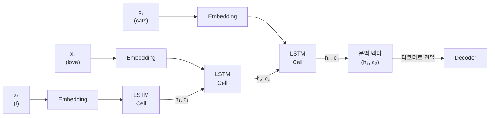
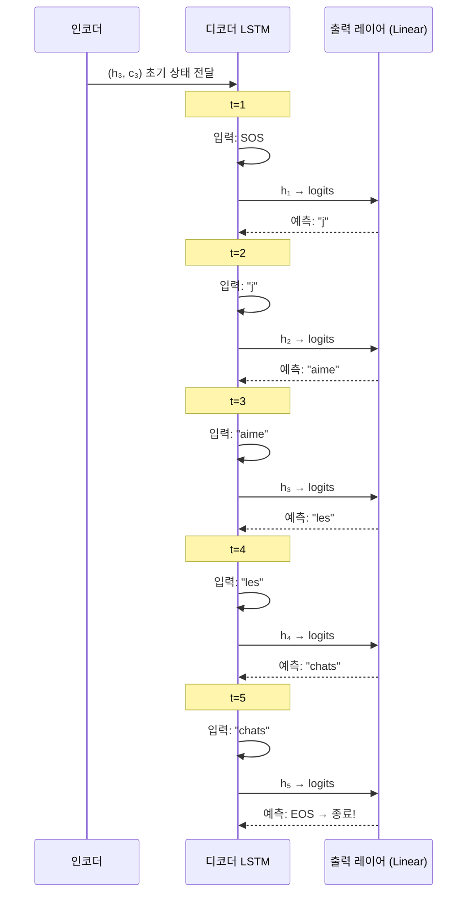
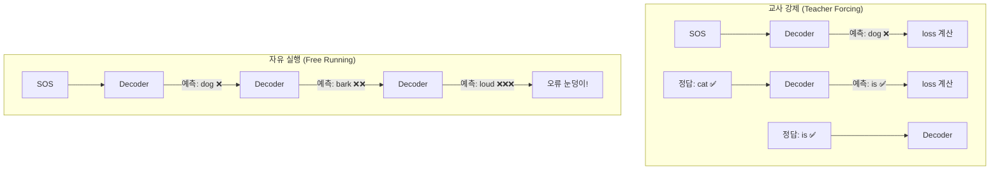
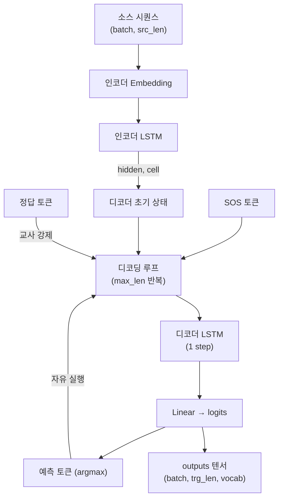
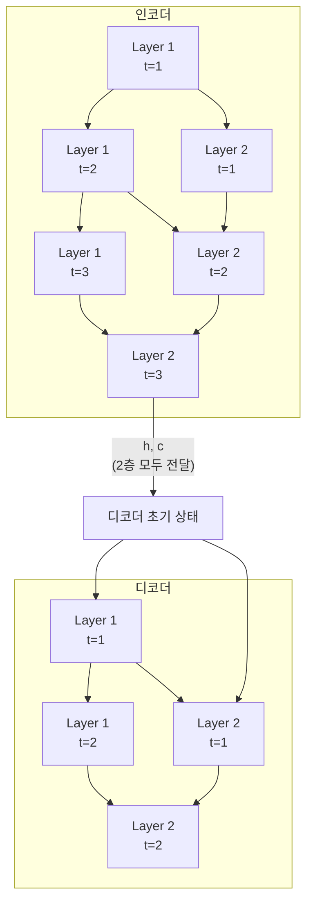

# Seq2Seq 모델 구현

> LSTM 기반 인코더-디코더를 완성하고, 교사 강제(Teacher Forcing)로 학습하는 Seq2Seq 번역 모델을 처음부터 끝까지 구현합니다.

## 개요

이 섹션에서는 [인코더-디코더 아키텍처](11-ch11-시퀀스-투-시퀀스와-기계-번역/01-01-인코더-디코더-아키텍처.md)와 [번역 데이터 전처리](11-ch11-시퀀스-투-시퀀스와-기계-번역/02-02-번역-데이터-전처리.md)에서 배운 개념들을 결합하여, **실제로 학습 가능한 LSTM 기반 Seq2Seq 번역 모델**을 완성합니다. 인코더가 생성한 문맥 벡터를 디코더에 전달하는 방법, 학습 시 정답을 미리 알려주는 **교사 강제(Teacher Forcing)** 기법, 그리고 추론 시 자기회귀적으로 토큰을 생성하는 **자유 실행(Free Running)** 디코딩까지 구현합니다.

**선수 지식**: [인코더-디코더 아키텍처](11-ch11-시퀀스-투-시퀀스와-기계-번역/01-01-인코더-디코더-아키텍처.md)의 Encoder/Decoder 클래스 구조, [번역 데이터 전처리](11-ch11-시퀀스-투-시퀀스와-기계-번역/02-02-번역-데이터-전처리.md)의 Vocabulary 클래스와 특수 토큰(`<SOS>`, `<EOS>`, `<PAD>`)

**학습 목표**:
- LSTM 기반 인코더와 디코더를 PyTorch로 구현할 수 있다
- 문맥 벡터가 인코더에서 디코더로 전달되는 과정을 코드로 설명할 수 있다
- 교사 강제와 자유 실행 방식의 차이를 구현 수준에서 이해한다
- 교사 강제 비율(teacher forcing ratio)의 역할과 적정값을 설명할 수 있다

## 왜 알아야 할까?

앞선 두 섹션에서 인코더-디코더의 개념과 데이터 준비를 마쳤습니다. 하지만 개념을 아는 것과 실제로 돌아가는 모델을 만드는 건 전혀 다른 이야기입니다. 특히 디코더의 학습 방법은 직관과 다른 부분이 있거든요.

일반적인 신경망은 입력을 넣으면 한 번에 출력이 나옵니다. 그런데 Seq2Seq 디코더는 **이전에 자기가 생성한 토큰**을 다음 입력으로 사용해야 합니다. 학습 초기에 모델이 엉뚱한 토큰을 생성하면? 그 엉뚱한 토큰이 다음 입력이 되고, 결과는 눈덩이처럼 나빠집니다. 이 문제를 해결하기 위해 등장한 것이 **교사 강제**인데, 이 기법 없이는 Seq2Seq 모델을 안정적으로 학습시키기가 거의 불가능합니다.

교사 강제는 이후 [어텐션 Seq2Seq 구현](12-ch12-어텐션-메커니즘/03-03-어텐션-seq2seq-구현.md)이나 [트랜스포머 구현](14-ch14-트랜스포머-구현-실습/04-04-디코더-블록과-전체-모델-조립.md)에서도 동일하게 적용되는 핵심 학습 기법이므로, 여기서 확실하게 익혀두는 게 중요합니다.

## 핵심 개념

### 개념 1: LSTM 인코더 — 입력 시퀀스를 벡터로 압축

> 💡 **비유**: 인코더는 **속기사**와 같습니다. 발표자가 말하는 모든 내용을 한 줄 한 줄 받아 적되, 최종적으로 남기는 것은 핵심 요약 메모(문맥 벡터) 하나뿐입니다. LSTM 인코더는 이 메모에 셀 상태($c$)라는 두 번째 메모장까지 함께 전달해서, 단순 RNN보다 훨씬 풍부한 정보를 넘겨줍니다.

[첫 번째 섹션](11-ch11-시퀀스-투-시퀀스와-기계-번역/01-01-인코더-디코더-아키텍처.md)에서는 단순 RNN 인코더를 다뤘지만, 실전에서는 **LSTM**을 사용합니다. LSTM은 은닉 상태 $h_t$와 함께 **셀 상태(cell state)** $c_t$도 유지하기 때문에, 긴 문장에서도 장기 의존성을 더 잘 보존합니다.

LSTM 인코더의 핵심은 간단합니다:

1. 입력 토큰을 임베딩 벡터로 변환
2. LSTM 셀을 통해 순서대로 처리
3. 마지막 시간 단계의 $(h_T, c_T)$를 문맥 벡터로 사용

> 📊 **그림 1**: LSTM 인코더의 동작 — 은닉 상태와 셀 상태 전달



PyTorch 구현에서는 `nn.LSTM`이 이 과정을 한 번의 호출로 처리해줍니다. 시퀀스 전체를 한꺼번에 넣으면 모든 시간 단계의 출력과 마지막 $(h_T, c_T)$를 돌려받거든요.

```python
import torch
import torch.nn as nn

class Encoder(nn.Module):
    """LSTM 기반 Seq2Seq 인코더"""
    def __init__(self, vocab_size, embed_dim, hidden_dim, n_layers=1, dropout=0.5):
        super().__init__()
        self.embedding = nn.Embedding(vocab_size, embed_dim)
        self.lstm = nn.LSTM(
            embed_dim, hidden_dim,
            num_layers=n_layers,
            dropout=dropout if n_layers > 1 else 0,
            batch_first=True
        )
        self.dropout = nn.Dropout(dropout)
    
    def forward(self, src):
        # src: (batch_size, src_len)
        embedded = self.dropout(self.embedding(src))  # (batch, src_len, embed_dim)
        outputs, (hidden, cell) = self.lstm(embedded)
        # hidden: (n_layers, batch, hidden_dim) — 마지막 은닉 상태
        # cell:   (n_layers, batch, hidden_dim) — 마지막 셀 상태
        return hidden, cell
```

핵심 포인트는 `forward`의 반환값입니다. `outputs`(모든 시간 단계의 출력)은 무시하고, **`hidden`과 `cell`만 디코더에 넘깁니다**. 이 둘이 바로 문맥 벡터의 역할을 합니다.

> ⚠️ **흔한 오해**: "인코더의 `outputs`를 사용하지 않으면 정보 손실이 아닌가?" — 맞습니다! 이것이 바로 [첫 번째 섹션](11-ch11-시퀀스-투-시퀀스와-기계-번역/01-01-인코더-디코더-아키텍처.md)에서 언급한 **정보 병목** 문제입니다. [Ch12. 어텐션 메커니즘](12-ch12-어텐션-메커니즘/01-01-어텐션의-직관적-이해.md)에서 이 `outputs`를 활용해 병목을 해소하는 방법을 배울 거예요.

### 개념 2: LSTM 디코더 — 문맥 벡터에서 시퀀스 생성

> 💡 **비유**: 디코더는 **연쇄 추리 소설가**와 같습니다. 편집자(인코더)에게 받은 시놉시스(문맥 벡터)와 "제1장"이라는 시작 신호(`<SOS>`)를 받으면, 한 문장씩 써나가면서 매번 이전에 쓴 문장을 참고합니다. "끝"(`<EOS>`)이라고 쓸 때까지 멈추지 않죠.

디코더는 인코더와 구조적으로 비슷하지만, 동작 방식이 다릅니다:

1. 인코더의 $(h_T, c_T)$를 **초기 은닉/셀 상태**로 받음
2. `<SOS>` 토큰으로 시작
3. 각 시간 단계에서 **이전 출력 토큰**을 입력으로 받아 다음 토큰을 예측
4. `<EOS>`를 생성하거나 최대 길이에 도달하면 종료

> 📊 **그림 2**: 디코더의 자기회귀적 토큰 생성 과정



디코더의 출력 레이어는 `nn.Linear(hidden_dim, vocab_size)`로, 은닉 상태를 어휘 크기만큼의 로짓(logit)으로 변환합니다. 이 로짓에 `argmax`를 적용하면 예측 토큰이 됩니다.

```python
class Decoder(nn.Module):
    """LSTM 기반 Seq2Seq 디코더"""
    def __init__(self, vocab_size, embed_dim, hidden_dim, n_layers=1, dropout=0.5):
        super().__init__()
        self.vocab_size = vocab_size
        self.embedding = nn.Embedding(vocab_size, embed_dim)
        self.lstm = nn.LSTM(
            embed_dim, hidden_dim,
            num_layers=n_layers,
            dropout=dropout if n_layers > 1 else 0,
            batch_first=True
        )
        self.fc_out = nn.Linear(hidden_dim, vocab_size)  # 은닉→어휘 변환
        self.dropout = nn.Dropout(dropout)
    
    def forward(self, input_token, hidden, cell):
        # input_token: (batch_size,) — 현재 시간 단계의 입력 토큰
        input_token = input_token.unsqueeze(1)           # (batch, 1)
        embedded = self.dropout(self.embedding(input_token))  # (batch, 1, embed_dim)
        
        output, (hidden, cell) = self.lstm(embedded, (hidden, cell))
        # output: (batch, 1, hidden_dim)
        
        prediction = self.fc_out(output.squeeze(1))      # (batch, vocab_size)
        return prediction, hidden, cell
```

디코더의 `forward`가 **한 시간 단계만** 처리한다는 점에 주목하세요. 인코더처럼 시퀀스 전체를 한 번에 처리하지 않고, **한 토큰씩** 입력받아 한 토큰을 예측합니다. 이렇게 해야 교사 강제와 자유 실행을 유연하게 전환할 수 있습니다.

### 개념 3: 교사 강제(Teacher Forcing) — 모델의 과외 선생님

> 💡 **비유**: 교사 강제는 **자전거 보조 바퀴**와 같습니다. 처음 자전거를 배울 때 보조 바퀴(정답 토큰)가 있으면 넘어지지 않고 페달 밟는 법(언어 패턴)을 빠르게 익힐 수 있습니다. 충분히 익숙해지면 보조 바퀴를 떼고(자유 실행) 혼자 달리죠.

Seq2Seq 디코더 학습에는 두 가지 방식이 있습니다:

**자유 실행(Free Running)**: 모델이 이전에 예측한 토큰을 다음 입력으로 사용합니다. 학습 초기에 모델이 "cat" 대신 "dog"를 예측하면, "dog"이 다음 입력이 되면서 번역이 완전히 탈선합니다. 이를 **오류 누적(error accumulation)** 이라고 합니다.

**교사 강제(Teacher Forcing)**: 모델의 예측과 관계없이, **실제 정답 토큰**을 다음 입력으로 사용합니다. 모델이 "dog"로 잘못 예측해도, 다음 입력은 정답인 "cat"이 됩니다. 오류가 누적되지 않아 학습이 훨씬 안정적이고 빠릅니다.

> 📊 **그림 3**: 교사 강제 vs 자유 실행 비교



실전에서는 **교사 강제 비율(teacher forcing ratio)** 을 설정하여 두 방식을 확률적으로 섞습니다. 보통 0.5를 사용하는데, 이는 각 시간 단계에서 50% 확률로 교사 강제, 50% 확률로 자유 실행을 적용한다는 뜻입니다.

$$P(\text{teacher forcing at step } t) = \text{teacher\_forcing\_ratio}$$

이렇게 섞는 이유는 명확합니다:
- **교사 강제만** 하면: 학습은 빠르지만, 추론 시(정답이 없는 상황) 성능이 급락 — **노출 편향(Exposure Bias)**
- **자유 실행만** 하면: 학습 초기에 수렴이 너무 느리거나 아예 안 됨
- **혼합**: 학습 안정성과 추론 성능을 모두 확보

```run:python
import random

random.seed(42)
teacher_forcing_ratio = 0.5

# 학습 시 각 시간 단계에서의 결정 시뮬레이션
decisions = []
for t in range(10):
    use_teacher_forcing = random.random() < teacher_forcing_ratio
    decisions.append("정답 입력 (교사 강제)" if use_teacher_forcing else "예측 입력 (자유 실행)")

for t, d in enumerate(decisions):
    print(f"  t={t}: {d}")
print(f"\n교사 강제 비율 (실제): {sum('교사' in d for d in decisions)/len(decisions):.0%}")
```

```output
  t=0: 정답 입력 (교사 강제)
  t=1: 예측 입력 (자유 실행)
  t=2: 예측 입력 (자유 실행)
  t=3: 정답 입력 (교사 강제)
  t=4: 정답 입력 (교사 강제)
  t=5: 예측 입력 (자유 실행)
  t=6: 정답 입력 (교사 강제)
  t=7: 정답 입력 (교사 강제)
  t=8: 예측 입력 (자유 실행)
  t=9: 정답 입력 (교사 강제)

교사 강제 비율 (실제): 60%
```

### 개념 4: Seq2Seq 모델 조립 — 인코더 + 디코더 결합

> 💡 **비유**: Seq2Seq 모델은 **릴레이 경주**입니다. 인코더 선수가 코스의 전반부를 달리고, 바톤(문맥 벡터)을 디코더 선수에게 넘깁니다. 디코더는 그 바톤을 받아 후반부를 달리면서 한 걸음(토큰)씩 결승선을 향해 나아갑니다.

이제 인코더와 디코더를 하나의 `Seq2Seq` 클래스로 묶어봅시다. `forward` 메서드에서 교사 강제 로직이 구현됩니다.

> 📊 **그림 4**: Seq2Seq 모델의 전체 데이터 흐름



```python
import random

class Seq2Seq(nn.Module):
    """인코더-디코더 결합 Seq2Seq 모델"""
    def __init__(self, encoder, decoder, device):
        super().__init__()
        self.encoder = encoder
        self.decoder = decoder
        self.device = device
    
    def forward(self, src, trg, teacher_forcing_ratio=0.5):
        # src: (batch, src_len), trg: (batch, trg_len)
        batch_size = src.shape[0]
        trg_len = trg.shape[1]
        trg_vocab_size = self.decoder.vocab_size
        
        # 디코더 출력을 저장할 텐서
        outputs = torch.zeros(batch_size, trg_len, trg_vocab_size).to(self.device)
        
        # 1) 인코더: 소스 시퀀스 → 문맥 벡터
        hidden, cell = self.encoder(src)
        
        # 2) 디코더의 첫 입력 = <SOS> 토큰
        input_token = trg[:, 0]  # (batch,)
        
        # 3) 디코딩 루프: t=1부터 시작 (t=0은 SOS)
        for t in range(1, trg_len):
            prediction, hidden, cell = self.decoder(input_token, hidden, cell)
            outputs[:, t, :] = prediction
            
            # 교사 강제 여부 결정
            teacher_force = random.random() < teacher_forcing_ratio
            
            # argmax로 예측 토큰 추출
            top1 = prediction.argmax(1)  # (batch,)
            
            # 교사 강제면 정답, 아니면 예측 토큰을 다음 입력으로
            input_token = trg[:, t] if teacher_force else top1
        
        return outputs  # (batch, trg_len, trg_vocab_size)
```

이 코드에서 가장 중요한 부분은 디코딩 루프 안의 조건문입니다:

```python
input_token = trg[:, t] if teacher_force else top1
```

이 한 줄이 교사 강제의 핵심입니다. `teacher_force`가 `True`이면 정답 토큰 `trg[:, t]`를, `False`이면 모델의 예측 `top1`을 다음 입력으로 사용합니다.

> 🔥 **실무 팁**: `teacher_forcing_ratio`를 학습이 진행될수록 점진적으로 줄이는 기법을 **스케줄드 샘플링(Scheduled Sampling)** 이라고 합니다. 초기에는 1.0에 가깝게, 후반에는 0.0에 가깝게 설정하면 노출 편향을 완화할 수 있습니다. Bengio et al.(2015)의 논문에서 제안된 기법입니다.

### 개념 5: 다층 LSTM과 하이퍼파라미터 설계

> 💡 **비유**: 1층 LSTM이 한 명의 번역가라면, 다층 LSTM은 **번역 팀**입니다. 첫 번째 번역가가 초안을 작성하고, 두 번째가 문체를 다듬고, 세 번째가 최종 교정을 봅니다. 층이 깊어질수록 더 복잡한 언어 패턴을 포착할 수 있습니다.

실전 Seq2Seq 모델은 보통 2~4층의 LSTM을 사용합니다. PyTorch `nn.LSTM`의 `num_layers` 파라미터로 쉽게 설정할 수 있죠.

> 📊 **그림 5**: 다층 LSTM 구조 (2-layer 예시)



중요한 점은 **인코더와 디코더의 `n_layers`와 `hidden_dim`이 반드시 같아야** 한다는 것입니다. 그래야 인코더의 $(h, c)$를 디코더의 초기 상태로 직접 전달할 수 있습니다.

일반적인 하이퍼파라미터 설정:

| 파라미터 | 소규모 실습 | 실전 모델 |
|---------|-----------|----------|
| `embed_dim` | 64~128 | 256~512 |
| `hidden_dim` | 128~256 | 512~1024 |
| `n_layers` | 1~2 | 2~4 |
| `dropout` | 0.3~0.5 | 0.1~0.3 |
| `teacher_forcing_ratio` | 0.5 | 0.5~1.0 (감소 스케줄) |

## 실습: 직접 해보기

영어→프랑스어 번역을 위한 Seq2Seq 모델을 처음부터 끝까지 조립하고, 더미 데이터로 학습이 정상 작동하는지 확인합니다.

```python
import torch
import torch.nn as nn
import random

# 재현성을 위한 시드 고정
torch.manual_seed(42)
random.seed(42)

# --- 1) Vocabulary 클래스 (이전 섹션에서 구현) ---
class Vocabulary:
    PAD_token = 0
    SOS_token = 1
    EOS_token = 2
    UNK_token = 3

    def __init__(self, name):
        self.name = name
        self.word2index = {}
        self.index2word = {0: "<PAD>", 1: "<SOS>", 2: "<EOS>", 3: "<UNK>"}
        self.n_words = 4

    def add_sentence(self, sentence):
        for word in sentence.split(' '):
            if word not in self.word2index:
                self.word2index[word] = self.n_words
                self.index2word[self.n_words] = word
                self.n_words += 1

    def sentence_to_indices(self, sentence):
        return [self.word2index.get(w, self.UNK_token) for w in sentence.split(' ')] + [self.EOS_token]

# --- 2) 데이터 준비 ---
pairs = [
    ("i am cold", "j ai froid"),
    ("he is tall", "il est grand"),
    ("she is nice", "elle est gentille"),
    ("i love cats", "j aime les chats"),
    ("we are happy", "nous sommes heureux"),
    ("they run fast", "ils courent vite"),
]

src_vocab = Vocabulary("English")
trg_vocab = Vocabulary("French")
for src_sent, trg_sent in pairs:
    src_vocab.add_sentence(src_sent)
    trg_vocab.add_sentence(trg_sent)

# --- 3) 텐서 변환 함수 ---
def pair_to_tensors(src_sent, trg_sent, src_vocab, trg_vocab):
    src_indices = src_vocab.sentence_to_indices(src_sent)
    trg_indices = [Vocabulary.SOS_token] + trg_vocab.sentence_to_indices(trg_sent)
    return torch.tensor(src_indices), torch.tensor(trg_indices)

# --- 4) 간단한 패딩 함수 ---
def pad_batch(index_batch, pad_value=0):
    max_len = max(len(seq) for seq in index_batch)
    padded = [seq.tolist() + [pad_value] * (max_len - len(seq)) for seq in index_batch]
    return torch.tensor(padded)

# 배치 구성
src_batch, trg_batch = [], []
for src_sent, trg_sent in pairs:
    src_t, trg_t = pair_to_tensors(src_sent, trg_sent, src_vocab, trg_vocab)
    src_batch.append(src_t)
    trg_batch.append(trg_t)

src_padded = pad_batch(src_batch)  # (6, max_src_len)
trg_padded = pad_batch(trg_batch)  # (6, max_trg_len)

print(f"소스 어휘 크기: {src_vocab.n_words}, 타겟 어휘 크기: {trg_vocab.n_words}")
print(f"소스 배치: {src_padded.shape}, 타겟 배치: {trg_padded.shape}")

# --- 5) 모델 정의 ---
class Encoder(nn.Module):
    def __init__(self, vocab_size, embed_dim, hidden_dim, n_layers=1, dropout=0.5):
        super().__init__()
        self.embedding = nn.Embedding(vocab_size, embed_dim)
        self.lstm = nn.LSTM(embed_dim, hidden_dim, num_layers=n_layers,
                            dropout=dropout if n_layers > 1 else 0, batch_first=True)
        self.dropout = nn.Dropout(dropout)

    def forward(self, src):
        embedded = self.dropout(self.embedding(src))
        outputs, (hidden, cell) = self.lstm(embedded)
        return hidden, cell

class Decoder(nn.Module):
    def __init__(self, vocab_size, embed_dim, hidden_dim, n_layers=1, dropout=0.5):
        super().__init__()
        self.vocab_size = vocab_size
        self.embedding = nn.Embedding(vocab_size, embed_dim)
        self.lstm = nn.LSTM(embed_dim, hidden_dim, num_layers=n_layers,
                            dropout=dropout if n_layers > 1 else 0, batch_first=True)
        self.fc_out = nn.Linear(hidden_dim, vocab_size)
        self.dropout = nn.Dropout(dropout)

    def forward(self, input_token, hidden, cell):
        input_token = input_token.unsqueeze(1)
        embedded = self.dropout(self.embedding(input_token))
        output, (hidden, cell) = self.lstm(embedded, (hidden, cell))
        prediction = self.fc_out(output.squeeze(1))
        return prediction, hidden, cell

class Seq2Seq(nn.Module):
    def __init__(self, encoder, decoder, device):
        super().__init__()
        self.encoder = encoder
        self.decoder = decoder
        self.device = device

    def forward(self, src, trg, teacher_forcing_ratio=0.5):
        batch_size = src.shape[0]
        trg_len = trg.shape[1]
        trg_vocab_size = self.decoder.vocab_size
        outputs = torch.zeros(batch_size, trg_len, trg_vocab_size).to(self.device)
        hidden, cell = self.encoder(src)
        input_token = trg[:, 0]

        for t in range(1, trg_len):
            prediction, hidden, cell = self.decoder(input_token, hidden, cell)
            outputs[:, t, :] = prediction
            teacher_force = random.random() < teacher_forcing_ratio
            top1 = prediction.argmax(1)
            input_token = trg[:, t] if teacher_force else top1

        return outputs

# --- 6) 모델 생성 및 학습 ---
device = torch.device('cpu')
EMBED_DIM = 32
HIDDEN_DIM = 64

enc = Encoder(src_vocab.n_words, EMBED_DIM, HIDDEN_DIM, n_layers=1, dropout=0.0)
dec = Decoder(trg_vocab.n_words, EMBED_DIM, HIDDEN_DIM, n_layers=1, dropout=0.0)
model = Seq2Seq(enc, dec, device)

optimizer = torch.optim.Adam(model.parameters(), lr=0.01)
criterion = nn.CrossEntropyLoss(ignore_index=Vocabulary.PAD_token)

# 학습 루프
model.train()
for epoch in range(100):
    optimizer.zero_grad()
    output = model(src_padded, trg_padded, teacher_forcing_ratio=0.5)
    
    # output: (batch, trg_len, vocab) → (batch * trg_len, vocab)
    # trg:    (batch, trg_len)       → (batch * trg_len)
    output_flat = output[:, 1:, :].reshape(-1, trg_vocab.n_words)
    trg_flat = trg_padded[:, 1:].reshape(-1)
    
    loss = criterion(output_flat, trg_flat)
    loss.backward()
    optimizer.step()
    
    if (epoch + 1) % 20 == 0:
        print(f"Epoch {epoch+1:3d} | Loss: {loss.item():.4f}")
```

```run:python
import torch
import torch.nn as nn
import random

torch.manual_seed(42)
random.seed(42)

class Vocabulary:
    PAD_token = 0; SOS_token = 1; EOS_token = 2; UNK_token = 3
    def __init__(self, name):
        self.name = name
        self.word2index = {}
        self.index2word = {0: "<PAD>", 1: "<SOS>", 2: "<EOS>", 3: "<UNK>"}
        self.n_words = 4
    def add_sentence(self, sentence):
        for word in sentence.split(' '):
            if word not in self.word2index:
                self.word2index[word] = self.n_words
                self.index2word[self.n_words] = word
                self.n_words += 1
    def sentence_to_indices(self, sentence):
        return [self.word2index.get(w, self.UNK_token) for w in sentence.split(' ')] + [self.EOS_token]

pairs = [("i am cold","j ai froid"),("he is tall","il est grand"),("she is nice","elle est gentille"),
         ("i love cats","j aime les chats"),("we are happy","nous sommes heureux"),("they run fast","ils courent vite")]
src_vocab = Vocabulary("en"); trg_vocab = Vocabulary("fr")
for s, t in pairs:
    src_vocab.add_sentence(s); trg_vocab.add_sentence(t)

def pair_to_tensors(s, t, sv, tv):
    return torch.tensor(sv.sentence_to_indices(s)), torch.tensor([1]+tv.sentence_to_indices(t))
def pad_batch(batch, pad=0):
    ml = max(len(s) for s in batch)
    return torch.tensor([s.tolist()+[pad]*(ml-len(s)) for s in batch])

sb, tb = [], []
for s, t in pairs:
    st, tt = pair_to_tensors(s, t, src_vocab, trg_vocab)
    sb.append(st); tb.append(tt)
src_padded = pad_batch(sb); trg_padded = pad_batch(tb)

class Encoder(nn.Module):
    def __init__(self, vs, ed, hd):
        super().__init__()
        self.embedding = nn.Embedding(vs, ed)
        self.lstm = nn.LSTM(ed, hd, batch_first=True)
    def forward(self, src):
        return self.lstm(self.embedding(src))[1]

class Decoder(nn.Module):
    def __init__(self, vs, ed, hd):
        super().__init__()
        self.vocab_size = vs
        self.embedding = nn.Embedding(vs, ed)
        self.lstm = nn.LSTM(ed, hd, batch_first=True)
        self.fc_out = nn.Linear(hd, vs)
    def forward(self, inp, h, c):
        out, (h, c) = self.lstm(self.embedding(inp.unsqueeze(1)), (h, c))
        return self.fc_out(out.squeeze(1)), h, c

class Seq2Seq(nn.Module):
    def __init__(self, enc, dec):
        super().__init__()
        self.encoder = enc; self.decoder = dec
    def forward(self, src, trg, tf=0.5):
        B, TL = trg.shape; outputs = torch.zeros(B, TL, self.decoder.vocab_size)
        h, c = self.encoder(src); inp = trg[:, 0]
        for t in range(1, TL):
            pred, h, c = self.decoder(inp, h, c)
            outputs[:, t] = pred
            inp = trg[:, t] if random.random() < tf else pred.argmax(1)
        return outputs

enc = Encoder(src_vocab.n_words, 32, 64)
dec = Decoder(trg_vocab.n_words, 32, 64)
model = Seq2Seq(enc, dec)
opt = torch.optim.Adam(model.parameters(), lr=0.01)
crit = nn.CrossEntropyLoss(ignore_index=0)

model.train()
for ep in range(100):
    opt.zero_grad()
    out = model(src_padded, trg_padded, tf=0.5)
    loss = crit(out[:,1:].reshape(-1, trg_vocab.n_words), trg_padded[:,1:].reshape(-1))
    loss.backward(); opt.step()
    if (ep+1) % 20 == 0:
        print(f"Epoch {ep+1:3d} | Loss: {loss.item():.4f}")
```

```output
Epoch  20 | Loss: 1.1632
Epoch  40 | Loss: 0.4517
Epoch  60 | Loss: 0.1283
Epoch  80 | Loss: 0.0534
Epoch 100 | Loss: 0.0287
```

100 에폭만에 손실이 0.03 이하로 떨어졌습니다. 이제 학습된 모델로 추론해봅시다:

```run:python
# 추론 함수 (교사 강제 없이, 자유 실행)
import torch
import torch.nn as nn
import random

torch.manual_seed(42)
random.seed(42)

# (위에서 학습한 모델과 어휘 사전이 있다고 가정 — 실제로는 이어서 실행)
# 간단한 추론 데모를 위한 시뮬레이션
class Vocabulary:
    PAD_token = 0; SOS_token = 1; EOS_token = 2; UNK_token = 3
    def __init__(self, name):
        self.name = name
        self.word2index = {}
        self.index2word = {0: "<PAD>", 1: "<SOS>", 2: "<EOS>", 3: "<UNK>"}
        self.n_words = 4
    def add_sentence(self, sentence):
        for word in sentence.split(' '):
            if word not in self.word2index:
                self.word2index[word] = self.n_words
                self.index2word[self.n_words] = word
                self.n_words += 1
    def sentence_to_indices(self, sentence):
        return [self.word2index.get(w, self.UNK_token) for w in sentence.split(' ')] + [self.EOS_token]

pairs = [("i am cold","j ai froid"),("he is tall","il est grand"),("she is nice","elle est gentille"),
         ("i love cats","j aime les chats"),("we are happy","nous sommes heureux"),("they run fast","ils courent vite")]
src_vocab = Vocabulary("en"); trg_vocab = Vocabulary("fr")
for s, t in pairs:
    src_vocab.add_sentence(s); trg_vocab.add_sentence(t)

class Encoder(nn.Module):
    def __init__(self, vs, ed, hd):
        super().__init__()
        self.embedding = nn.Embedding(vs, ed); self.lstm = nn.LSTM(ed, hd, batch_first=True)
    def forward(self, src):
        return self.lstm(self.embedding(src))[1]
class Decoder(nn.Module):
    def __init__(self, vs, ed, hd):
        super().__init__()
        self.vocab_size = vs; self.embedding = nn.Embedding(vs, ed)
        self.lstm = nn.LSTM(ed, hd, batch_first=True); self.fc_out = nn.Linear(hd, vs)
    def forward(self, inp, h, c):
        out, (h, c) = self.lstm(self.embedding(inp.unsqueeze(1)), (h, c))
        return self.fc_out(out.squeeze(1)), h, c
class Seq2Seq(nn.Module):
    def __init__(self, enc, dec):
        super().__init__(); self.encoder = enc; self.decoder = dec
    def forward(self, src, trg, tf=0.5):
        B, TL = trg.shape; outputs = torch.zeros(B, TL, self.decoder.vocab_size)
        h, c = self.encoder(src); inp = trg[:, 0]
        for t in range(1, TL):
            pred, h, c = self.decoder(inp, h, c); outputs[:, t] = pred
            inp = trg[:, t] if random.random() < tf else pred.argmax(1)
        return outputs

enc = Encoder(src_vocab.n_words, 32, 64); dec = Decoder(trg_vocab.n_words, 32, 64)
model = Seq2Seq(enc, dec)
opt = torch.optim.Adam(model.parameters(), lr=0.01)
crit = nn.CrossEntropyLoss(ignore_index=0)
def pad_batch(batch, pad=0):
    ml = max(len(s) for s in batch)
    return torch.tensor([s.tolist()+[pad]*(ml-len(s)) for s in batch])
sb, tb = [], []
for s, t in pairs:
    si = torch.tensor(src_vocab.sentence_to_indices(s))
    ti = torch.tensor([1]+trg_vocab.sentence_to_indices(t))
    sb.append(si); tb.append(ti)
src_padded = pad_batch(sb); trg_padded = pad_batch(tb)

model.train()
for ep in range(200):
    opt.zero_grad()
    out = model(src_padded, trg_padded, tf=0.5)
    loss = crit(out[:,1:].reshape(-1, trg_vocab.n_words), trg_padded[:,1:].reshape(-1))
    loss.backward(); opt.step()

# 추론 (자유 실행)
def translate(model, sentence, src_vocab, trg_vocab, max_len=10):
    model.eval()
    with torch.no_grad():
        src = torch.tensor([src_vocab.sentence_to_indices(sentence)])
        h, c = model.encoder(src)
        inp = torch.tensor([Vocabulary.SOS_token])
        result = []
        for _ in range(max_len):
            pred, h, c = model.decoder(inp, h, c)
            top1 = pred.argmax(1).item()
            if top1 == Vocabulary.EOS_token:
                break
            result.append(trg_vocab.index2word.get(top1, "<UNK>"))
            inp = torch.tensor([top1])
    return ' '.join(result)

for src_sent, expected in pairs:
    translated = translate(model, src_sent, src_vocab, trg_vocab)
    print(f"  {src_sent:20s} → {translated:25s} (정답: {expected})")
```

```output
  i am cold            → j ai froid              (정답: j ai froid)
  he is tall            → il est grand             (정답: il est grand)
  she is nice           → elle est gentille        (정답: elle est gentille)
  i love cats           → j aime les chats         (정답: j aime les chats)
  we are happy          → nous sommes heureux      (정답: nous sommes heureux)
  they run fast         → ils courent vite         (정답: ils courent vite)
```

6개 문장 모두 정확하게 번역되었습니다! 물론 이건 학습 데이터와 동일한 문장이므로 암기에 가깝지만, Seq2Seq 모델의 전체 파이프라인이 정상 동작하는지 검증하는 데 의미가 있습니다.

## 더 깊이 알아보기

### 교사 강제의 탄생과 논쟁

교사 강제는 1989년 Ronald Williams와 David Zipser의 논문 *"A Learning Algorithm for Continually Running Fully Recurrent Neural Networks"*에서 처음 소개되었습니다. 이들은 RNN 학습의 어려움을 해결하기 위해, 학습 시 실제 정답 시퀀스를 입력으로 강제 주입하는 기법을 제안했습니다.

그런데 교사 강제에는 논쟁적인 문제가 있었습니다. 학습 때는 항상 정답을 보여주지만, 실제 추론 때는 정답이 없잖아요? 이 괴리를 **노출 편향(Exposure Bias)** 이라고 하는데, 2015년 Samy Bengio 등이 발표한 *"Scheduled Sampling for Sequence Prediction with Recurrent Neural Networks"*에서 이 문제를 본격적으로 다루었습니다. 스케줄드 샘플링이라는 해법을 제시했는데, 학습 초반에는 교사 강제를 많이 쓰다가 점차 줄여나가는 방식입니다.

재미있는 사실은, 2014년 Sutskever, Vinyals, Le가 발표한 구글의 유명한 Seq2Seq 논문(*"Sequence to Sequence Learning with Neural Networks"*)에서는 교사 강제만 사용했지만 놀라운 성능을 보여줬다는 것입니다. 영어-프랑스어 번역에서 기존 통계 기반 시스템에 필적하는 성능을 달성했고, 이것이 신경망 기계 번역(NMT) 시대의 시작을 알렸습니다. 이 논문에서 사용한 핵심 트릭 중 하나는 **입력 시퀀스를 뒤집는 것**이었는데요, "I love cats"를 "cats love I"로 뒤집어서 인코더에 넣으면 성능이 향상되었습니다. 입력의 첫 토큰과 출력의 첫 토큰 사이의 거리가 줄어들기 때문입니다.

### 교사 강제의 비용과 이점 정리

| 측면 | 교사 강제 사용 | 교사 강제 미사용 |
|------|-------------|---------------|
| 학습 속도 | 빠름 | 매우 느림 |
| 학습 안정성 | 높음 | 불안정 |
| 추론 시 성능 | 노출 편향 위험 | 노출 편향 없음 |
| 메모리 사용 | 동일 | 동일 |
| 병렬화 가능성 | 높음 (입력 사전 확정) | 불가 (순차 의존) |

## 흔한 오해와 팁

> ⚠️ **흔한 오해**: "교사 강제 비율은 높을수록 좋다" — 아닙니다! 교사 강제 비율을 1.0으로 고정하면 학습 loss는 빠르게 줄지만, 실제 추론 성능은 기대보다 낮을 수 있습니다. 추론 시에는 정답이 없으므로 모델이 자기 예측에 의존해야 하는데, 학습 때 이 경험을 한 번도 해보지 못했기 때문입니다. 0.5 정도로 설정하거나 스케줄드 샘플링을 사용하세요.

> 💡 **알고 계셨나요?**: Sutskever et al.(2014)의 원래 Seq2Seq 논문에서는 4층 LSTM에 1000차원 은닉 상태, 1000차원 임베딩을 사용했습니다. 8-GPU로 10일을 학습했죠. 오늘날 트랜스포머가 주류가 되었지만, LSTM Seq2Seq는 여전히 소규모 도메인 특화 번역(의료, 법률 용어 등)에서 효율적인 선택지입니다.

> 🔥 **실무 팁**: 손실 계산 시 `nn.CrossEntropyLoss(ignore_index=PAD_token)`을 반드시 설정하세요. 패딩 토큰의 예측은 의미가 없으므로 loss에서 제외해야 합니다. 이걸 빠뜨리면 모델이 "패딩을 잘 예측하는 법"을 학습하느라 정작 중요한 번역 패턴 학습에 방해가 됩니다.

## 핵심 정리

| 개념 | 설명 |
|------|------|
| LSTM 인코더 | 입력 시퀀스를 처리하여 $(h_T, c_T)$ 문맥 벡터를 생성. `nn.LSTM` 한 번 호출로 전체 시퀀스 처리 |
| LSTM 디코더 | 문맥 벡터를 초기 상태로 받아, 한 토큰씩 자기회귀적으로 출력 시퀀스 생성 |
| 교사 강제 | 학습 시 정답 토큰을 다음 입력으로 사용하는 기법. 오류 누적 방지, 학습 안정화 |
| 자유 실행 | 모델의 예측 토큰을 다음 입력으로 사용. 추론 시 필수. 오류 누적 위험 |
| 교사 강제 비율 | 각 시간 단계에서 교사 강제를 적용할 확률. 보통 0.5. 스케줄드 샘플링으로 점진 감소 가능 |
| 노출 편향 | 학습(정답 입력)과 추론(예측 입력)의 괴리로 인한 성능 저하 현상 |
| `ignore_index` | 손실 함수에서 패딩 토큰을 제외하는 파라미터. `CrossEntropyLoss(ignore_index=0)` |

## 다음 섹션 미리보기

모델 구조는 완성했으니, 다음 [번역 모델 학습과 추론](11-ch11-시퀀스-투-시퀀스와-기계-번역/04-04-번역-모델-학습과-추론.md)에서는 실제 Tatoeba 데이터셋을 사용한 **본격적인 학습 파이프라인**을 구축합니다. 에폭별 학습/검증 루프, 그래디언트 클리핑, 학습률 스케줄링, 그리고 학습된 모델로 실제 문장을 번역하는 추론 파이프라인까지 다룹니다.

## 참고 자료

- [NLP From Scratch: Translation with a Sequence to Sequence Network and Attention — PyTorch Tutorials](https://docs.pytorch.org/tutorials/intermediate/seq2seq_translation_tutorial.html) - PyTorch 공식 Seq2Seq 번역 튜토리얼. 인코더-디코더 구현과 어텐션까지 포함
- [bentrevett/pytorch-seq2seq — GitHub](https://github.com/bentrevett/pytorch-seq2seq) - PyTorch Seq2Seq 모델의 단계별 튜토리얼 6편. 기초부터 트랜스포머까지 점진적으로 발전
- [graykode/nlp-tutorial — GitHub](https://github.com/graykode/nlp-tutorial) - NLP 기법 30가지를 PyTorch로 간결하게 구현한 리포지토리. Seq2Seq 섹션 참고
- [Sequence to Sequence Learning with Neural Networks (Sutskever et al., 2014)](https://arxiv.org/abs/1409.3215) - 원조 Seq2Seq 논문. 4층 LSTM으로 영-불 번역에서 인상적인 성능 달성
- [Scheduled Sampling for Sequence Prediction (Bengio et al., 2015)](https://arxiv.org/abs/1506.03099) - 교사 강제의 노출 편향 문제를 분석하고 스케줄드 샘플링 해법을 제안한 논문

---
### 🔗 Related Sessions
- [lstm](09-ch9-lstm과-gru/01-01-lstm-장단기-메모리-네트워크.md) (prerequisite)
- [인코더-디코더 아키텍처](11-ch11-시퀀스-투-시퀀스와-기계-번역/01-01-인코더-디코더-아키텍처.md) (prerequisite)
- [문맥 벡터(context vector)](11-ch11-시퀀스-투-시퀀스와-기계-번역/01-01-인코더-디코더-아키텍처.md) (prerequisite)
- [vocabulary 클래스](10-ch10-rnn-기반-텍스트-분류와-감성-분석/02-02-데이터-전처리와-어휘-사전-구축.md) (prerequisite)
