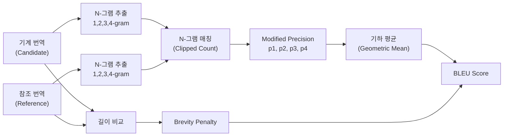
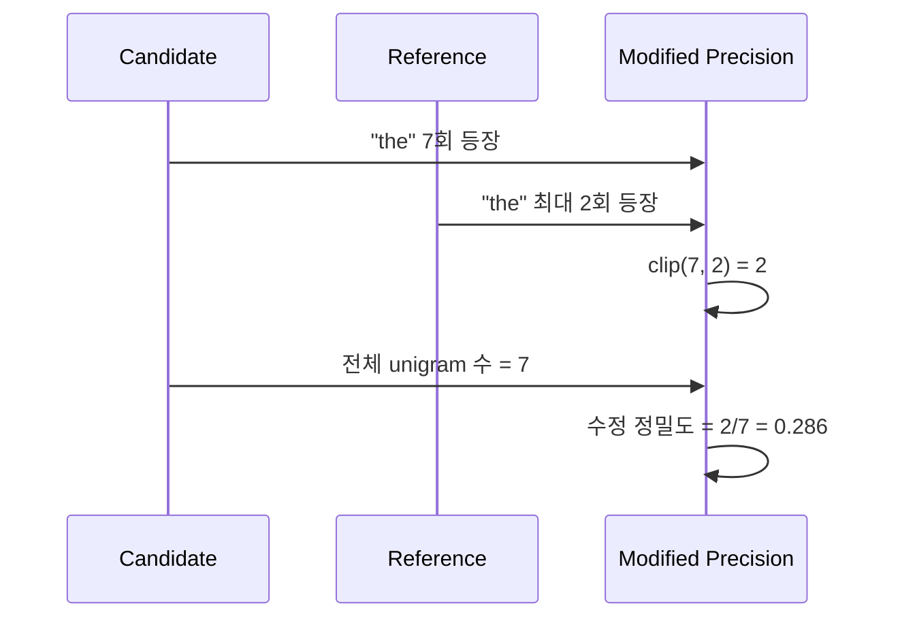
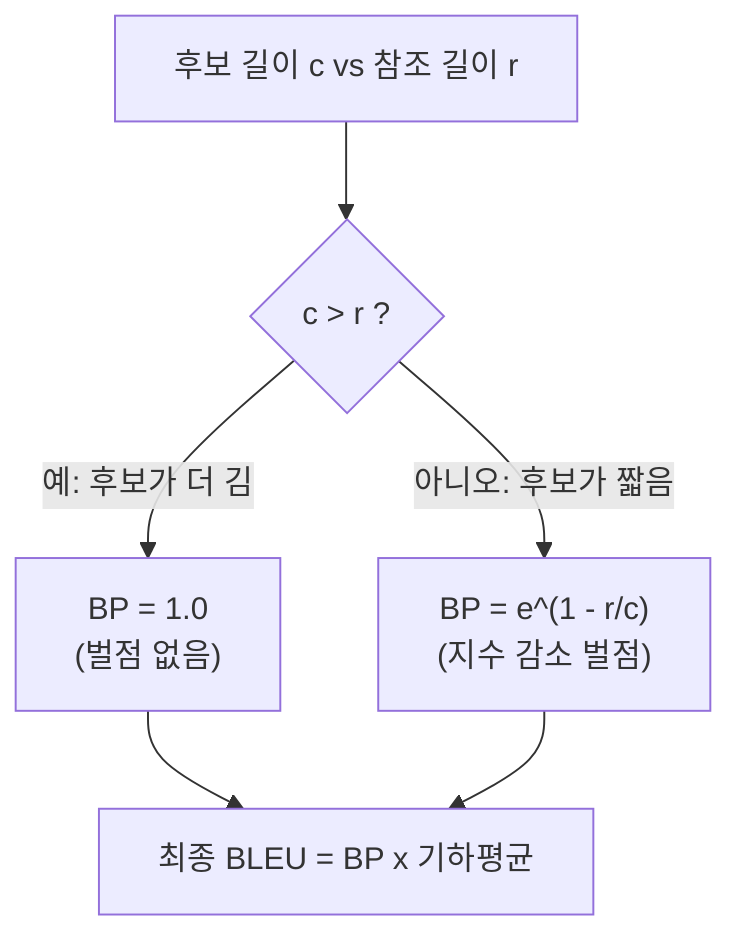
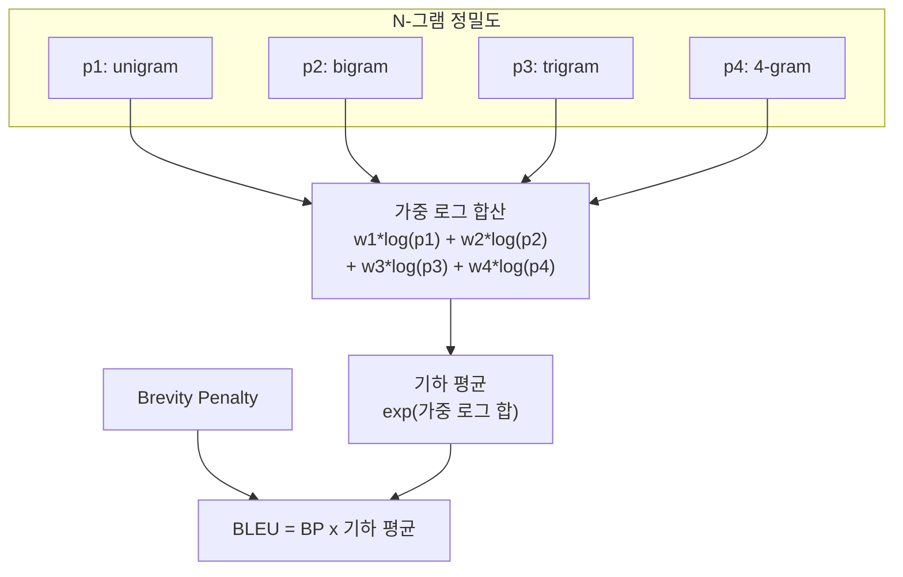
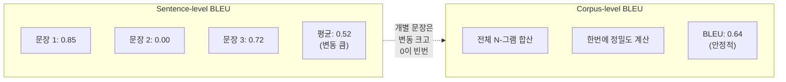

# 05. BLEU 점수와 번역 품질 평가

> 기계 번역의 품질을 수치로 측정하는 BLEU 점수의 원리를 이해하고, Seq2Seq 모델의 한계를 진단합니다.

## 개요

이 섹션에서는 기계 번역 결과를 **정량적으로 평가**하는 대표 지표인 BLEU 점수를 깊이 있게 다룹니다. 앞서 [번역 모델 학습과 추론](11-시퀀스-투-시퀀스와-기계-번역/04-04-번역-모델-학습과-추론.md)에서 그리디 디코딩과 빔 서치로 번역 결과를 생성했는데, "이 번역이 얼마나 좋은가?"를 객관적으로 판단할 방법이 필요합니다.

**선수 지식**: N-그램의 개념([N-gram과 CountVectorizer](03-텍스트-표현-bow와-tf-idf/02-02-n-gram과-countvectorizer.md)), 그리디/빔 서치 디코딩([번역 모델 학습과 추론](11-시퀀스-투-시퀀스와-기계-번역/04-04-번역-모델-학습과-추론.md))

**학습 목표**:
- BLEU 점수의 수학적 정의와 각 구성 요소(N-그램 정밀도, Brevity Penalty)를 이해한다
- Python으로 BLEU 점수를 직접 구현하고 NLTK를 활용하여 계산한다
- BLEU의 한계를 인식하고 대안 메트릭(METEOR, chrF, BERTScore)을 파악한다
- Ch11 전체를 종합하여 Seq2Seq 모델의 근본적 한계를 정리한다

## 왜 알아야 할까?

번역 모델을 만들었다고 끝이 아닙니다. "이 모델이 저 모델보다 나은가?"를 판단하려면 **재현 가능한 숫자**가 필요하거든요. 사람이 일일이 번역 품질을 평가하면 비용도 비용이지만, 평가자마다 기준이 달라서 일관성을 유지하기 어렵습니다.

BLEU 점수는 2002년 IBM 연구팀이 제안한 이래 20년 넘게 기계 번역 분야의 **사실상 표준(de facto standard)** 메트릭으로 군림해왔습니다. 논문을 읽든, 모델을 비교하든, 대회에 참가하든 — BLEU를 모르면 번역 연구의 언어 자체를 이해할 수 없죠. 동시에 BLEU의 한계를 아는 것도 중요합니다. BLEU만 맹신하면 실제 번역 품질과 동떨어진 결론에 도달할 수 있으니까요.

## 핵심 개념

### 개념 1: BLEU 점수의 직관 — "정답과 얼마나 겹치는가"

> 💡 **비유**: 시험 채점을 생각해보세요. 학생이 쓴 답안(기계 번역)과 모범 답안(참조 번역)을 놓고, 모범 답안에 나오는 단어나 표현이 학생 답안에 얼마나 등장하는지 세는 겁니다. 단어 하나짜리 일치(unigram)만 보면 단어를 마구 나열해도 높은 점수를 받을 수 있으니, 두 단어 연속(bigram), 세 단어 연속(trigram)까지 체크합니다. 그리고 답안이 너무 짧으면 감점(Brevity Penalty)을 줍니다.

BLEU는 **Bilingual Evaluation Understudy**의 약자입니다. "이중 언어 평가 대리인"이라는 뜻인데, 사람 대신 자동으로 번역 품질을 평가하겠다는 의미를 담고 있죠.

핵심 아이디어는 단순합니다:

1. **기계 번역 결과**(candidate)와 **사람이 번역한 정답**(reference)을 비교
2. N-그램 단위로 얼마나 겹치는지 **정밀도(precision)**를 계산
3. 번역이 너무 짧으면 **Brevity Penalty**로 벌점 부여
4. 이 모든 것을 하나의 점수(0~1)로 종합

> 📊 **그림 1**: BLEU 점수 계산의 전체 흐름



### 개념 2: N-그램 정밀도와 Clipping

단순히 "기계 번역에 나온 단어가 참조 번역에 있는가?"를 세면 문제가 생깁니다. 극단적인 예를 보죠:

- **참조 번역**: "The cat is on the mat"
- **기계 번역**: "the the the the the the the"

단순 unigram 정밀도를 계산하면 "the"가 참조에 있으니 7/7 = 1.0, 만점입니다! 분명 엉터리 번역인데 말이죠.

이 문제를 해결하기 위해 BLEU는 **Modified Precision(수정 정밀도)**을 사용합니다. 참조 번역에서 각 N-그램이 등장하는 **최대 횟수**로 클리핑(clipping)하는 거예요.

- "the"는 참조에 2번 등장 → 클리핑하면 2
- 수정 정밀도 = 2/7 ≈ 0.286

수식으로 표현하면:

$$p_n = \frac{\sum_{C \in \text{Candidates}} \sum_{\text{n-gram} \in C} Count_{clip}(\text{n-gram})}{\sum_{C \in \text{Candidates}} \sum_{\text{n-gram} \in C} Count(\text{n-gram})}$$

여기서:
- $Count_{clip}(\text{n-gram})$ = $\min(Count_{candidate}(\text{n-gram}), Max\_Ref\_Count(\text{n-gram}))$
- $Count_{candidate}$: 기계 번역에서의 N-그램 등장 횟수
- $Max\_Ref\_Count$: 모든 참조 번역 중 해당 N-그램의 최대 등장 횟수

> 📊 **그림 2**: Clipping을 통한 수정 정밀도 계산 과정



```run:python
from collections import Counter

def count_ngrams(tokens, n):
    """토큰 리스트에서 n-gram 카운트를 반환"""
    return Counter(tuple(tokens[i:i+n]) for i in range(len(tokens) - n + 1))

def modified_precision(candidate, references, n):
    """수정 정밀도(Modified Precision) 계산"""
    cand_ngrams = count_ngrams(candidate, n)
    
    # 각 참조에서 n-gram의 최대 등장 횟수
    max_ref_counts = Counter()
    for ref in references:
        ref_ngrams = count_ngrams(ref, n)
        for ngram, count in ref_ngrams.items():
            max_ref_counts[ngram] = max(max_ref_counts[ngram], count)
    
    # 클리핑: 후보의 n-gram 카운트를 참조 최대값으로 제한
    clipped_counts = {
        ngram: min(count, max_ref_counts.get(ngram, 0))
        for ngram, count in cand_ngrams.items()
    }
    
    numerator = sum(clipped_counts.values())
    denominator = sum(cand_ngrams.values())
    
    return numerator / denominator if denominator > 0 else 0

# 예시: 엉터리 번역
candidate = "the the the the the the the".split()
reference = "The cat is on the mat".lower().split()

for n in range(1, 5):
    p = modified_precision(candidate, [reference], n)
    print(f"{n}-gram 수정 정밀도: {p:.4f}")
```

```output
1-gram 수정 정밀도: 0.2857
2-gram 수정 정밀도: 0.0000
3-gram 수정 정밀도: 0.0000
4-gram 수정 정밀도: 0.0000
```

클리핑 덕분에 엉터리 번역은 unigram에서도 0.29로 낮아지고, bigram 이상에서는 0이 됩니다.

### 개념 3: Brevity Penalty — 짧은 번역에 벌점

N-그램 정밀도만 쓰면 또 다른 함정이 있습니다. 아주 확신 있는 단어 하나만 출력하면 정밀도가 1.0이 될 수 있거든요. 예를 들어:

- **참조**: "The cat is on the mat"
- **기계 번역**: "The cat"

unigram 정밀도 = 2/2 = 1.0, bigram 정밀도 = 1/1 = 1.0... 하지만 절반이나 빠졌잖아요!

BLEU는 이를 방지하기 위해 **Brevity Penalty(BP)**를 도입합니다:

$$BP = \begin{cases} 1 & \text{if } c > r \\ e^{(1 - r/c)} & \text{if } c \leq r \end{cases}$$

여기서:
- $c$ = 기계 번역의 길이 (candidate length)
- $r$ = 참조 번역의 길이 (reference length)

기계 번역이 참조보다 짧으면 $e^{(1-r/c)}$, 즉 지수적으로 감소하는 벌점을 줍니다. 참조와 같거나 더 길면 벌점 없이 1.0입니다.

> 📊 **그림 3**: Brevity Penalty의 작동 원리



```run:python
import math

def brevity_penalty(candidate_len, reference_len):
    """Brevity Penalty 계산"""
    if candidate_len > reference_len:
        return 1.0
    elif candidate_len == 0:
        return 0.0
    else:
        return math.exp(1 - reference_len / candidate_len)

# 다양한 길이 비율에서 BP 확인
ref_len = 20
for cand_len in [5, 10, 15, 18, 20, 25, 30]:
    bp = brevity_penalty(cand_len, ref_len)
    ratio = cand_len / ref_len
    print(f"후보={cand_len:2d}, 참조={ref_len} (비율={ratio:.2f}) → BP={bp:.4f}")
```

```output
후보= 5, 참조=20 (비율=0.25) → BP=0.0498
후보=10, 참조=20 (비율=0.50) → BP=0.3679
후보=15, 참조=20 (비율=0.75) → BP=0.7165
후보=18, 참조=20 (비율=0.90) → BP=0.8948
후보=20, 참조=20 (비율=1.00) → BP=1.0000
후보=25, 참조=20 (비율=1.25) → BP=1.0000
후보=30, 참조=20 (비율=1.50) → BP=1.0000
```

길이 비율이 0.5이면 BP가 약 0.37로 크게 감점되고, 0.75가 되어야 0.72 정도로 회복됩니다. 참조와 같거나 더 길면 벌점이 없죠.

### 개념 4: 최종 BLEU 점수 공식

모든 조각을 합치면 BLEU 점수의 최종 공식이 완성됩니다:

$$BLEU = BP \cdot \exp\left(\sum_{n=1}^{N} w_n \log p_n\right)$$

여기서:
- $BP$: Brevity Penalty
- $p_n$: N-그램 수정 정밀도
- $w_n$: 각 N-그램의 가중치 (보통 $w_n = 1/N$, 즉 균등 가중치)
- $N$: 최대 N-그램 차수 (표준은 4)

$\exp(\sum w_n \log p_n)$은 **가중 기하 평균(weighted geometric mean)**입니다. 기하 평균을 쓰는 이유는, 어느 하나의 N-그램 정밀도라도 0이면 전체 점수가 0이 되어야 하기 때문이에요. 단어는 많이 맞췄지만 어순이 엉망인(bigram 이상이 0인) 번역에 높은 점수를 줄 수 없으니까요.

> 📊 **그림 4**: BLEU 점수 최종 합산 구조



```run:python
import math
from collections import Counter

def compute_bleu(candidate, references, max_n=4, weights=None):
    """BLEU 점수를 처음부터 직접 구현"""
    if weights is None:
        weights = [1.0 / max_n] * max_n  # 균등 가중치
    
    # 1. 각 n-gram의 수정 정밀도 계산
    precisions = []
    for n in range(1, max_n + 1):
        p = modified_precision(candidate, references, n)
        precisions.append(p)
    
    # 2. 기하 평균 (log 공간에서 계산)
    log_avg = 0.0
    for w, p in zip(weights, precisions):
        if p == 0:
            return 0.0  # 하나라도 0이면 BLEU = 0
        log_avg += w * math.log(p)
    
    # 3. Brevity Penalty
    c = len(candidate)
    # 가장 가까운 참조 길이 사용 (여러 참조 시)
    ref_lens = [len(ref) for ref in references]
    r = min(ref_lens, key=lambda ref_len: (abs(ref_len - c), ref_len))
    bp = brevity_penalty(c, r)
    
    bleu = bp * math.exp(log_avg)
    return bleu

# 예시 번역 평가
reference1 = "the cat is on the mat".split()
reference2 = "there is a cat on the mat".split()

# 좋은 번역
good_candidate = "the cat is on the mat".split()
# 괜찮은 번역
ok_candidate = "the the cat is on mat".split()
# 나쁜 번역
bad_candidate = "cat mat the".split()

for name, cand in [("완벽한 번역", good_candidate), 
                    ("괜찮은 번역", ok_candidate),
                    ("나쁜 번역", bad_candidate)]:
    score = compute_bleu(cand, [reference1, reference2])
    print(f"{name}: BLEU = {score:.4f}")
```

```output
완벽한 번역: BLEU = 1.0000
괜찮은 번역: BLEU = 0.5946
나쁜 번역: BLEU = 0.0000
```

### 개념 5: Corpus-level vs. Sentence-level BLEU

BLEU는 원래 **코퍼스 수준(corpus-level)**에서 계산하도록 설계되었습니다. 개별 문장에 적용하면 N-그램 카운트가 적어서 점수 변동이 크고, 특히 4-gram이 하나도 매칭되지 않으면 바로 0이 되는 문제가 있어요.

이를 완화하기 위해 **스무딩(smoothing)** 기법을 사용합니다. NLTK는 7가지 스무딩 방법을 제공하는데, 가장 흔히 쓰이는 건:

- **Method 1**: 0인 카운트에 작은 엡실론(ε) 추가
- **Method 4**: 문장 길이에 비례하여 스무딩 강도 조절

> 📊 **그림 5**: Corpus-level vs Sentence-level BLEU 비교



## 실습: 직접 해보기

NLTK를 활용해 Seq2Seq 모델의 번역 결과를 체계적으로 평가하는 전체 파이프라인을 구현해봅시다.

```python
import math
from collections import Counter
from nltk.translate.bleu_score import sentence_bleu, corpus_bleu, SmoothingFunction

# ──────────────────────────────────────
# 1. BLEU 직접 구현 (교육용)
# ──────────────────────────────────────

def count_ngrams(tokens, n):
    """토큰 리스트에서 n-gram 빈도 딕셔너리 반환"""
    return Counter(tuple(tokens[i:i+n]) for i in range(len(tokens) - n + 1))

def modified_precision(candidate, references, n):
    """수정 정밀도: 클리핑을 적용한 n-gram 정밀도"""
    cand_ngrams = count_ngrams(candidate, n)
    
    max_ref_counts = Counter()
    for ref in references:
        ref_ngrams = count_ngrams(ref, n)
        for ngram, count in ref_ngrams.items():
            max_ref_counts[ngram] = max(max_ref_counts[ngram], count)
    
    clipped = sum(
        min(count, max_ref_counts.get(ngram, 0))
        for ngram, count in cand_ngrams.items()
    )
    total = sum(cand_ngrams.values())
    
    return clipped / total if total > 0 else 0

def compute_bleu(candidate, references, max_n=4):
    """BLEU-4 점수 계산 (직접 구현)"""
    weights = [1.0 / max_n] * max_n
    
    precisions = []
    for n in range(1, max_n + 1):
        p = modified_precision(candidate, references, n)
        precisions.append(p)
        print(f"  {n}-gram precision: {p:.4f}")
    
    # 기하 평균
    if any(p == 0 for p in precisions):
        print("  → 0인 정밀도 존재 → BLEU = 0")
        return 0.0
    
    log_avg = sum(w * math.log(p) for w, p in zip(weights, precisions))
    
    # Brevity Penalty
    c = len(candidate)
    r = min((len(ref) for ref in references), 
            key=lambda rl: (abs(rl - c), rl))
    
    if c > r:
        bp = 1.0
    elif c == 0:
        bp = 0.0
    else:
        bp = math.exp(1 - r / c)
    print(f"  BP: {bp:.4f} (c={c}, r={r})")
    
    return bp * math.exp(log_avg)


# ──────────────────────────────────────
# 2. 번역 샘플 평가
# ──────────────────────────────────────

# 영→불 번역 시나리오 (간소화)
test_pairs = [
    {
        "source": "I love machine learning",
        "reference": ["j' aime l' apprentissage automatique"],
        "candidates": {
            "좋은 번역": "j' aime l' apprentissage automatique",
            "어순 다름": "l' apprentissage automatique j' aime",
            "불완전": "j' aime",
            "과잉 번역": "j' aime beaucoup l' apprentissage automatique et profond",
        }
    }
]

for pair in test_pairs:
    print(f"원문: {pair['source']}")
    refs = [ref.split() for ref in pair["reference"]]
    print(f"참조: {pair['reference'][0]}\n")
    
    for label, cand_str in pair["candidates"].items():
        cand = cand_str.split()
        print(f"[{label}] \"{cand_str}\"")
        score = compute_bleu(cand, refs)
        print(f"  ★ BLEU-4 = {score:.4f}\n")


# ──────────────────────────────────────
# 3. NLTK로 검증 + 스무딩 비교
# ──────────────────────────────────────

print("=" * 50)
print("NLTK 스무딩 방법 비교")
print("=" * 50)

reference = "the cat sat on the mat".split()
hypothesis = "the cat on the mat".split()

smoother = SmoothingFunction()
methods = [
    ("스무딩 없음 (method0)", smoother.method0),
    ("엡실론 추가 (method1)", smoother.method1),
    ("카운트+1 (method2)", smoother.method2),
    ("NIST 기하 (method3)", smoother.method3),
]

for name, method in methods:
    score = sentence_bleu([reference], hypothesis, 
                          smoothing_function=method)
    print(f"  {name}: {score:.4f}")


# ──────────────────────────────────────
# 4. Corpus-level BLEU
# ──────────────────────────────────────

print("\n" + "=" * 50)
print("Corpus-level BLEU 계산")
print("=" * 50)

# 여러 문장 쌍
references_corpus = [
    ["the cat is on the mat".split()],
    ["there is a cat on the mat".split()],
    ["it is a nice day today".split()],
]

hypotheses_corpus = [
    "the cat is on the mat".split(),       # 완벽
    "a cat is on the mat".split(),          # 거의 완벽
    "it is a nice day".split(),             # 약간 짧음
]

corpus_score = corpus_bleu(references_corpus, hypotheses_corpus)
print(f"  Corpus BLEU-4: {corpus_score:.4f}")

# 개별 문장 BLEU도 비교
for i, (refs, hyp) in enumerate(zip(references_corpus, hypotheses_corpus)):
    s_score = sentence_bleu(refs, hyp, smoothing_function=smoother.method1)
    print(f"  문장 {i+1} BLEU-4 (smoothed): {s_score:.4f}")
```

> 🔥 **실무 팁**: 논문에서 BLEU 점수를 보고할 때는 반드시 **토크나이저**, **대소문자 처리**, **참조 번역 수** 등의 설정을 명시해야 합니다. 같은 번역이라도 토크나이저가 다르면 BLEU가 달라지거든요. 이 문제를 해결하기 위해 **SacreBLEU** 라이브러리가 만들어졌습니다.

## 더 깊이 알아보기

### BLEU의 탄생 이야기

2002년, IBM의 키쇼어 파피네니(Kishore Papineni), 살림 루코스(Salim Roukos), 토드 워드(Todd Ward), 웨이징 주(Wei-Jing Zhu)는 기계 번역 연구의 근본적 병목을 해결하려 했습니다. 당시 번역 품질 평가는 전적으로 사람에게 의존했는데, 비용도 비쌀 뿐 아니라 평가에 **며칠에서 몇 주**가 걸렸죠.

그들의 핵심 통찰은 "좋은 번역은 참조 번역과 N-그램이 많이 겹칠 것"이라는 단순한 가정이었습니다. 이 아이디어를 ACL 2002에서 발표한 논문 *"BLEU: a Method for Automatic Evaluation of Machine Translation"*은 2025년 기준 **인용 수 20,000회 이상**으로, NLP 역사상 가장 많이 인용된 논문 중 하나가 되었습니다.

흥미로운 점은, BLEU가 원래 IBM의 통계적 기계 번역 시스템 개발을 가속하기 위한 **내부 도구**로 만들어졌다는 거예요. 모델을 수정할 때마다 사람을 불러 평가할 수 없으니, 빠른 자동 점수가 필요했던 겁니다. 연구용 도구가 전 세계 표준이 된 셈이죠.

### BLEU의 한계와 대안 메트릭

BLEU가 20년 넘게 표준으로 쓰이고 있지만, 알려진 한계도 분명합니다:

| 한계 | 설명 | 대안 |
|------|------|------|
| 의미 무시 | 동의어/패러프레이즈를 인식 못함 | METEOR (동의어 매칭) |
| 재현율 부재 | 정밀도만 측정, 빠진 내용 무시 | chrF (문자 수준 F-score) |
| 문장 수준 불안정 | 짧은 문장에서 점수 변동 큼 | SacreBLEU (표준화) |
| 의미적 유사도 | 표면 형태만 비교 | BERTScore (임베딩 유사도) |
| 유창성 | 문법 오류 감지 불가 | COMET (학습 기반) |

### Seq2Seq의 근본적 한계 — 다음 장으로의 다리

이 챕터에서 구현한 Seq2Seq 모델은 기계 번역의 기본기를 보여주지만, 실전에서는 심각한 한계가 있습니다:

1. **정보 병목(Information Bottleneck)**: 인코더의 마지막 hidden state 하나로 전체 입력을 압축하므로, 긴 문장에서 정보 손실이 심합니다.
2. **장거리 의존성**: LSTM이 Vanilla RNN보다 낫지만, 30단어 이상의 긴 문장에서는 여전히 초반 정보를 잘 기억하지 못합니다.
3. **고정 크기 문맥 벡터**: 입력 길이와 무관하게 문맥 벡터 크기가 고정되어, 입력이 길수록 압축 비율이 올라갑니다.

이 모든 한계의 해법이 바로 다음 챕터에서 배울 **어텐션 메커니즘(Attention Mechanism)**입니다. 디코더가 매 시점마다 인코더의 **모든 hidden state**를 참조할 수 있게 하여, 정보 병목 문제를 근본적으로 해결합니다.

## 흔한 오해와 팁

> ⚠️ **흔한 오해**: "BLEU 점수가 높으면 번역 품질이 좋다"고 단정짓는 것은 위험합니다. BLEU는 N-그램 표면 매칭만 보기 때문에, 의미는 완벽하지만 다른 단어를 쓴 번역은 낮은 점수를 받고, 의미 없이 단어만 우연히 맞춘 번역은 높은 점수를 받을 수 있습니다. 항상 **정성적 평가**를 병행하세요.

> 💡 **알고 계셨나요?**: BLEU 논문에서 파피네니 등은 BLEU 점수와 사람 평가의 상관관계가 0.99 이상이라고 보고했습니다. 하지만 이는 **시스템 수준(system-level)** 비교에서의 상관관계였고, 개별 문장 수준에서는 상관관계가 훨씬 낮다는 것이 이후 연구에서 밝혀졌습니다. 2015년 이후로는 WMT 대회에서도 BLEU 외에 다양한 메트릭을 함께 사용하고 있어요.

> 🔥 **실무 팁**: BLEU 점수를 보고할 때는 **SacreBLEU** 라이브러리의 시그니처 문자열을 함께 기재하세요. `sacrebleu`는 토크나이저, 대소문자 처리, N-그램 차수 등 모든 설정을 해시로 기록하여, 다른 연구자가 **정확히 같은 조건**으로 재현할 수 있게 해줍니다. `pip install sacrebleu`로 설치하고, `sacrebleu --test` 명령으로 표준 테스트셋에 대한 BLEU를 바로 계산할 수 있습니다.

## 핵심 정리

| 개념 | 설명 |
|------|------|
| BLEU | Bilingual Evaluation Understudy. N-그램 정밀도 기반 자동 번역 평가 지표 |
| Modified Precision | 참조 번역의 최대 등장 횟수로 클리핑한 수정 정밀도 |
| Brevity Penalty | 기계 번역이 참조보다 짧을 때 부여하는 지수 벌점 ($e^{1-r/c}$) |
| BLEU-4 | 1~4-gram 균등 가중 기하 평균 (가장 표준적 설정) |
| Corpus-level BLEU | 전체 코퍼스의 N-그램을 합산하여 계산 (문장별보다 안정적) |
| 스무딩(Smoothing) | 문장 수준 BLEU에서 0 카운트 문제를 완화하는 기법 |
| SacreBLEU | 토크나이저까지 표준화한 재현 가능 BLEU 라이브러리 |
| Seq2Seq 한계 | 정보 병목, 장거리 의존성, 고정 크기 문맥 벡터 → 어텐션으로 해결 |

## 다음 섹션 미리보기

이번 챕터에서 Seq2Seq 모델의 구조, 학습, 추론, 평가까지 전체 파이프라인을 완성했습니다. 하지만 고정 크기 문맥 벡터라는 근본적 한계가 남아있죠. 다음 챕터 [어텐션의 직관적 이해](12-어텐션-메커니즘/01-01-어텐션의-직관적-이해.md)에서는 디코더가 인코더의 **모든 타임스텝**을 동적으로 참조하는 어텐션 메커니즘을 배우며, 이 한계를 정면으로 돌파합니다. 어텐션은 이후 트랜스포머, BERT, GPT로 이어지는 현대 NLP 혁명의 출발점이기도 합니다.

## 참고 자료

- [BLEU: a Method for Automatic Evaluation of Machine Translation (Papineni et al., 2002)](https://aclanthology.org/P02-1040/) - BLEU 점수를 제안한 원본 논문. 모든 번역 평가 연구의 출발점
- [NLTK BLEU Score 모듈 소스 코드](https://www.nltk.org/_modules/nltk/translate/bleu_score.html) - NLTK의 BLEU 구현. 7가지 스무딩 방법의 상세 구현을 확인 가능
- [SacreBLEU — PyTorch-Metrics Documentation](https://lightning.ai/docs/torchmetrics/stable/text/sacre_bleu_score.html) - 재현 가능한 BLEU 계산을 위한 SacreBLEU의 PyTorch-Metrics 통합 문서
- [A Survey on Evaluation Metrics for Machine Translation (2023)](https://www.mdpi.com/2227-7390/11/4/1006) - BLEU를 넘어 METEOR, chrF, BERTScore, COMET 등 현대 메트릭을 종합 비교한 서베이 논문

---
### 🔗 Related Sessions
- [seq2seq_model](11-시퀀스-투-시퀀스와-기계-번역/01-01-인코더-디코더-아키텍처.md) (prerequisite)
- [information_bottleneck](12-어텐션-메커니즘/01-01-어텐션의-직관적-이해.md) (prerequisite)
- [teacher_forcing](11-시퀀스-투-시퀀스와-기계-번역/01-01-인코더-디코더-아키텍처.md) (prerequisite)
- [greedy_decode](11-시퀀스-투-시퀀스와-기계-번역/04-04-번역-모델-학습과-추론.md) (prerequisite)
- [beam_search_decode](11-시퀀스-투-시퀀스와-기계-번역/04-04-번역-모델-학습과-추론.md) (prerequisite)
- [training_loop](11-시퀀스-투-시퀀스와-기계-번역/04-04-번역-모델-학습과-추론.md) (prerequisite)
