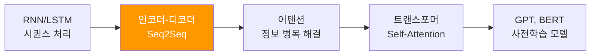
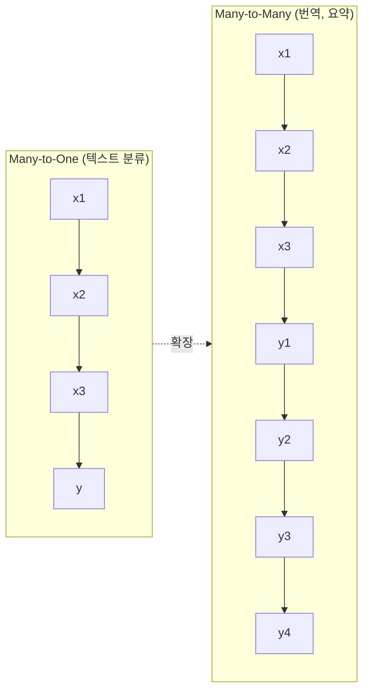
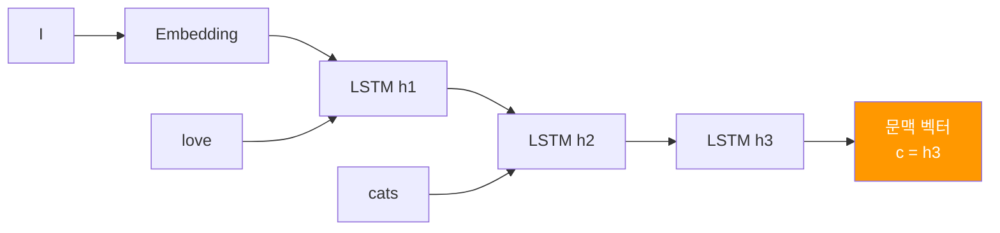
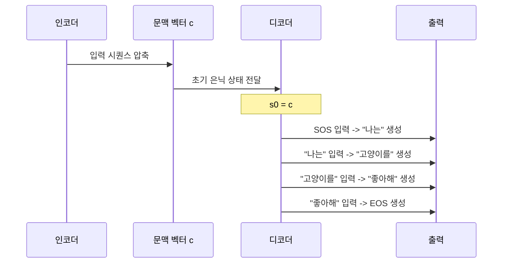
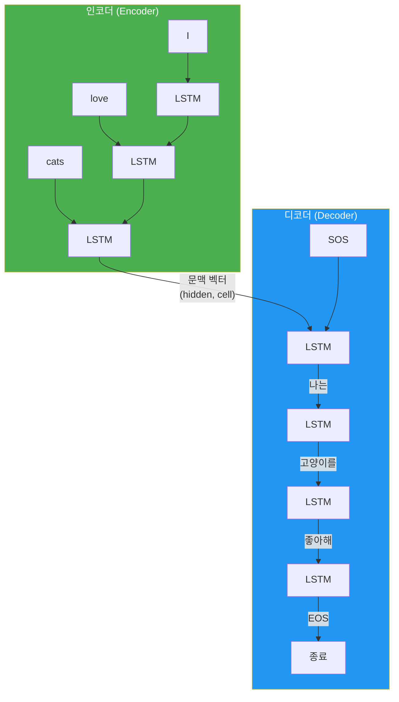
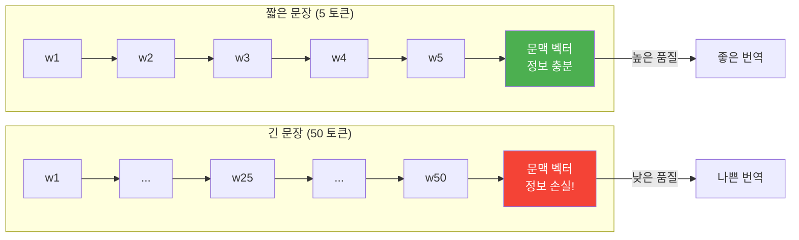

# 인코더-디코더 아키텍처

> 가변 길이 입력을 가변 길이 출력으로 변환하는 Seq2Seq 모델의 근간, 인코더-디코더 구조를 파헤칩니다.

## 개요

이 섹션에서는 시퀀스-투-시퀀스(Seq2Seq) 모델의 핵심 골격인 **인코더-디코더 아키텍처**를 학습합니다. 지금까지 RNN과 LSTM으로 텍스트 분류나 감성 분석 같은 "입력 시퀀스 → 하나의 출력" 문제를 다뤘다면, 이번 챕터부터는 **"입력 시퀀스 → 출력 시퀀스"** 문제로 넘어갑니다.

**선수 지식**:
- [LSTM의 구조와 게이트 동작 원리](09-lstm과-gru/01-01-lstm-장단기-메모리-네트워크.md)
- [PyTorch `nn.Module`로 모델 정의하기](07-pytorch-기초와-신경망-입문/03-03-nnmodule로-신경망-정의하기.md)
- [RNN 기반 텍스트 분류 아키텍처](10-rnn-기반-텍스트-분류와-감성-분석/01-01-rnn-텍스트-분류-아키텍처.md)

**학습 목표**:
- Many-to-Many 문제가 무엇인지 정의하고, 기존 RNN과의 차이를 이해한다
- 인코더가 입력 시퀀스를 문맥 벡터(Context Vector)로 압축하는 과정을 설명할 수 있다
- 디코더가 문맥 벡터를 받아 자기회귀적으로 출력을 생성하는 방식을 이해한다
- 고정 크기 문맥 벡터로 인한 정보 병목(Information Bottleneck) 문제를 인식한다
- Teacher Forcing 학습 전략의 원리와 장단점을 파악한다

## 왜 알아야 할까?

"I love cats"를 "나는 고양이를 좋아해"로 번역하는 문제를 생각해볼까요? 입력은 3개 단어, 출력은 4개 단어입니다. 챗봇도 마찬가지예요 — 질문 길이와 답변 길이가 다릅니다. 요약, 번역, 대화, 코드 생성... 현대 NLP의 핵심 과제들은 대부분 **"가변 길이 입력 → 가변 길이 출력"** 문제입니다.

지금까지 배운 RNN 분류 모델은 시퀀스를 읽고 **하나의 라벨**을 내놓았죠. 하지만 번역이나 요약은 **시퀀스를 출력**해야 합니다. 이 간극을 메우는 것이 바로 인코더-디코더 아키텍처이고, 이 구조는 2017년 트랜스포머, 그리고 GPT와 BERT까지 이어지는 현대 NLP의 출발점입니다.

> 📊 **그림 1**: 인코더-디코더의 위치 — RNN에서 트랜스포머까지의 진화 경로



## 핵심 개념

### 개념 1: Many-to-Many 문제란?

> 💡 **비유**: 동시통역사를 떠올려보세요. 연사의 말을 끝까지 듣고(입력 시퀀스), 머릿속에서 정리한 뒤(문맥 벡터), 다른 언어로 풀어서 말합니다(출력 시퀀스). 입력 언어의 문장 길이와 출력 언어의 문장 길이는 다를 수 있죠.

RNN의 입출력 구조를 정리하면 크게 네 가지로 나뉩니다:

| 유형 | 입력 | 출력 | 예시 |
|------|------|------|------|
| One-to-One | 고정 | 고정 | 이미지 분류 |
| One-to-Many | 고정 | 시퀀스 | 이미지 캡셔닝 |
| Many-to-One | 시퀀스 | 고정 | 감성 분석, 텍스트 분류 |
| **Many-to-Many** | **시퀀스** | **시퀀스** | **번역, 요약, 대화** |

Ch10까지 우리가 다룬 텍스트 분류는 Many-to-One이었습니다. 이번 챕터에서 다루는 **Many-to-Many**가 바로 Seq2Seq의 영역인데요, 여기서 핵심 제약은 입력 길이와 출력 길이가 **서로 다를 수 있다**는 점입니다.

> 📊 **그림 2**: RNN 입출력 유형 비교



Many-to-Many 문제를 풀기 위해 고안된 것이 바로 **인코더-디코더(Encoder-Decoder)** 구조입니다. 두 개의 독립된 RNN을 연결하는 아이디어죠.

### 개념 2: 인코더 — 입력을 압축하는 독해가

> 💡 **비유**: 인코더는 책 전체를 읽고 **한 장의 요약 노트**를 만드는 독서광과 같습니다. 아무리 긴 책이라도 정해진 크기의 노트에 핵심을 담아야 하죠.

인코더(Encoder)는 입력 시퀀스 $x_1, x_2, \ldots, x_T$를 한 토큰씩 순서대로 읽으며 은닉 상태(hidden state)를 업데이트합니다. 마지막 시점의 은닉 상태 $h_T$가 바로 **문맥 벡터(Context Vector)**가 됩니다.

$$c = h_T = f_{\text{enc}}(x_1, x_2, \ldots, x_T)$$

- $c$: 문맥 벡터 (Context Vector) — 입력 시퀀스 전체의 정보를 담은 고정 크기 벡터
- $h_T$: 인코더 RNN의 마지막 은닉 상태
- $f_{\text{enc}}$: 인코더 RNN (LSTM 또는 GRU)

핵심은 **가변 길이 입력이 고정 크기 벡터로 변환**된다는 점입니다. 입력이 5개 토큰이든 50개 토큰이든, 문맥 벡터의 차원은 동일합니다.

> 📊 **그림 3**: 인코더의 동작 흐름



```python
import torch
import torch.nn as nn

class Encoder(nn.Module):
    def __init__(self, input_dim, emb_dim, hidden_dim, n_layers, dropout):
        super().__init__()
        self.embedding = nn.Embedding(input_dim, emb_dim)
        self.rnn = nn.LSTM(emb_dim, hidden_dim, n_layers, dropout=dropout)
        self.dropout = nn.Dropout(dropout)

    def forward(self, src):
        # src: (src_len, batch_size)
        embedded = self.dropout(self.embedding(src))  # (src_len, batch, emb_dim)
        outputs, (hidden, cell) = self.rnn(embedded)   # hidden: (n_layers, batch, hidden_dim)
        # hidden, cell이 문맥 벡터 역할
        return hidden, cell
```

LSTM을 사용하면 문맥 벡터는 `hidden`과 `cell` 두 가지 상태로 구성됩니다. 이 두 텐서가 인코더가 읽은 입력의 "요약본"이 되는 거죠.

### 개념 3: 디코더 — 문맥을 풀어쓰는 작가

> 💡 **비유**: 디코더는 요약 노트만 받아서 **새로운 언어로 글을 쓰는 작가**입니다. 한 단어를 쓰고, 방금 쓴 단어를 참고해서 다음 단어를 쓰고... 이렇게 `<EOS>`(문장 끝) 토큰이 나올 때까지 반복합니다.

디코더(Decoder)는 인코더가 만든 문맥 벡터를 **초기 은닉 상태**로 받아, 한 토큰씩 자기회귀적(autoregressive)으로 출력을 생성합니다.

$$s_t = f_{\text{dec}}(y_{t-1}, s_{t-1})$$
$$P(y_t | y_{<t}, c) = g(y_{t-1}, s_t)$$

- $s_t$: 디코더의 시점 $t$에서의 은닉 상태
- $y_{t-1}$: 이전 시점에 생성된 출력 토큰
- $g$: 출력 확률 분포를 계산하는 함수 (보통 Linear + Softmax)
- $s_0 = c$: 디코더의 초기 은닉 상태는 인코더의 문맥 벡터

**자기회귀(Autoregressive)**란 이전 출력이 다음 입력이 되는 방식입니다. "나는"을 생성했으면 "나는"을 입력으로 넣어 다음 단어 "고양이를"을 생성하는 식이죠.

> 📊 **그림 4**: 디코더의 자기회귀 생성 과정



```python
class Decoder(nn.Module):
    def __init__(self, output_dim, emb_dim, hidden_dim, n_layers, dropout):
        super().__init__()
        self.embedding = nn.Embedding(output_dim, emb_dim)
        self.rnn = nn.LSTM(emb_dim, hidden_dim, n_layers, dropout=dropout)
        self.fc_out = nn.Linear(hidden_dim, output_dim)  # 어휘 크기만큼 출력
        self.dropout = nn.Dropout(dropout)

    def forward(self, input, hidden, cell):
        # input: (batch_size) — 현재 시점의 입력 토큰
        input = input.unsqueeze(0)               # (1, batch_size)
        embedded = self.dropout(self.embedding(input))  # (1, batch, emb_dim)
        output, (hidden, cell) = self.rnn(embedded, (hidden, cell))
        prediction = self.fc_out(output.squeeze(0))     # (batch, output_dim)
        return prediction, hidden, cell
```

디코더는 **한 시점에 하나의 토큰만 처리**합니다. 루프를 돌면서 반복 호출하는 것은 상위 Seq2Seq 모델의 역할이에요.

### 개념 4: Seq2Seq — 인코더와 디코더의 결합

이제 인코더와 디코더를 하나로 연결해볼까요?

> 📊 **그림 5**: 전체 Seq2Seq 아키텍처



```python
import random

class Seq2Seq(nn.Module):
    def __init__(self, encoder, decoder, device):
        super().__init__()
        self.encoder = encoder
        self.decoder = decoder
        self.device = device

    def forward(self, src, trg, teacher_forcing_ratio=0.5):
        # src: (src_len, batch), trg: (trg_len, batch)
        trg_len = trg.shape[0]
        batch_size = trg.shape[1]
        trg_vocab_size = self.decoder.fc_out.out_features

        # 출력을 저장할 텐서
        outputs = torch.zeros(trg_len, batch_size, trg_vocab_size).to(self.device)

        # 인코더에 입력 시퀀스 전달 → 문맥 벡터 획득
        hidden, cell = self.encoder(src)

        # 디코더의 첫 입력은 <SOS> 토큰
        input = trg[0, :]  # SOS 토큰

        for t in range(1, trg_len):
            # 디코더에 한 토큰씩 전달
            output, hidden, cell = self.decoder(input, hidden, cell)
            outputs[t] = output

            # Teacher Forcing: 확률적으로 정답 or 예측값 사용
            teacher_force = random.random() < teacher_forcing_ratio
            top1 = output.argmax(1)  # 모델의 예측
            input = trg[t] if teacher_force else top1

        return outputs
```

### 개념 5: Teacher Forcing — 학습을 안정시키는 전략

> 💡 **비유**: 자전거를 배울 때 처음에는 보조 바퀴를 달고 연습하죠? Teacher Forcing은 **학습 중에 보조 바퀴를 달아주는 것**과 같습니다. 디코더가 실수로 엉뚱한 단어를 생성해도, 다음 입력으로 **정답 단어를 넣어줘서** 학습이 탈선하지 않게 합니다.

Teacher Forcing 없이 학습하면 어떻게 될까요? 디코더가 첫 단어를 틀리면, 틀린 단어가 다음 입력이 되고, 그 다음도 틀리고... **오류가 눈덩이처럼 커집니다**. 이를 **노출 편향(Exposure Bias)** 문제라고 하는데요, Teacher Forcing은 학습을 안정시키되, 추론 시에는 사용할 수 없다는 한계가 있습니다.

> 📊 **그림 6**: Teacher Forcing vs Free Running 비교

```mermaid
flowchart TD
    subgraph TF["Teacher Forcing (학습)"]
        TF1["SOS"] --> TFD1["디코더"]
        TFD1 -->|"예측: 나는"| TF2["정답: 나는"]
        TF2 --> TFD2["디코더"]
        TFD2 -->|"예측: 강아지를"| TF3["정답: 고양이를"]
        TF3 --> TFD3["디코더"]
        TFD3 -->|"예측: 좋아해"| TF4["정답 입력으로 교정"]
    end

    subgraph FR["Free Running (추론)"]
        FR1["SOS"] --> FRD1["디코더"]
        FRD1 -->|"예측: 나는"| FR2["나는"]
        FR2 --> FRD2["디코더"]
        FRD2 -->|"예측: 강아지를"| FR3["강아지를 (오류)"]
        FR3 --> FRD3["디코더"]
        FRD3 -->|"예측: 싫어해"| FR4["오류 누적!"]
    end

    style TF4 fill:#4CAF50,color:#fff
    style FR4 fill:#F44336,color:#fff
```



| 학습 방식 | 장점 | 단점 |
|-----------|------|------|
| Teacher Forcing (정답 입력) | 빠른 수렴, 안정적 학습 | 노출 편향 (학습-추론 불일치) |
| Free Running (예측값 입력) | 추론 환경과 동일 | 느린 수렴, 학습 불안정 |
| Scheduled Sampling (혼합) | 점진적 전환 | 구현 복잡, 하이퍼파라미터 추가 |

위 `Seq2Seq` 코드의 `teacher_forcing_ratio=0.5`는 50% 확률로 정답을 사용하는 절충안입니다.

### 개념 6: 정보 병목 — 이 구조의 치명적 한계

> 💡 **비유**: 100페이지짜리 논문을 읽고 **포스트잇 한 장**에 요약해야 한다면? 짧은 논문은 괜찮겠지만, 길어질수록 중요한 내용이 빠질 수밖에 없겠죠. 이것이 바로 정보 병목 문제입니다.

인코더가 아무리 긴 시퀀스를 읽어도, 결국 **고정 크기 벡터 하나**로 압축해야 합니다. 이로 인해:

1. **긴 문장 성능 저하**: 입력이 20~30 토큰을 넘으면 번역 품질이 급격히 떨어집니다
2. **초반 정보 손실**: RNN 특성상 뒷부분 토큰의 정보가 더 잘 보존되고, 앞부분은 희미해집니다
3. **Sutskever의 발견**: 입력 시퀀스를 **뒤집으면** 성능이 좋아진다! 뒤집으면 소스의 앞부분 단어와 타겟의 앞부분 단어 사이의 거리가 가까워지기 때문입니다

> 📊 **그림 7**: 정보 병목 문제와 문장 길이에 따른 성능 저하



여기서는 정보 병목 현상이 **왜 발생하는지** 직관적으로 이해하는 것이 목표입니다. 이 문제를 본격적으로 해결하는 방법은 [어텐션의 직관적 이해](12-어텐션-메커니즘/01-01-어텐션의-직관적-이해.md)에서 다룹니다. Ch12에서는 "디코더가 매 시점마다 인코더의 모든 은닉 상태를 참조하면 어떨까?"라는 아이디어로, 고정 벡터 하나에 의존하는 병목을 근본적으로 해소하는 어텐션 메커니즘을 학습하게 됩니다.

## 실습: 직접 해보기

간단한 숫자 시퀀스 뒤집기 태스크로 Seq2Seq 모델을 구성하고 동작을 확인해봅시다. 번역 데이터 전처리는 다음 섹션에서 다루므로, 여기서는 아키텍처의 동작 원리에 집중합니다.

```run:python
import torch
import torch.nn as nn

# 인코더 정의
class Encoder(nn.Module):
    def __init__(self, input_dim, emb_dim, hidden_dim, n_layers, dropout):
        super().__init__()
        self.embedding = nn.Embedding(input_dim, emb_dim)
        self.rnn = nn.LSTM(emb_dim, hidden_dim, n_layers, dropout=dropout)
        self.dropout = nn.Dropout(dropout)

    def forward(self, src):
        embedded = self.dropout(self.embedding(src))
        outputs, (hidden, cell) = self.rnn(embedded)
        return hidden, cell

# 디코더 정의
class Decoder(nn.Module):
    def __init__(self, output_dim, emb_dim, hidden_dim, n_layers, dropout):
        super().__init__()
        self.embedding = nn.Embedding(output_dim, emb_dim)
        self.rnn = nn.LSTM(emb_dim, hidden_dim, n_layers, dropout=dropout)
        self.fc_out = nn.Linear(hidden_dim, output_dim)
        self.dropout = nn.Dropout(dropout)

    def forward(self, input, hidden, cell):
        input = input.unsqueeze(0)
        embedded = self.dropout(self.embedding(input))
        output, (hidden, cell) = self.rnn(embedded, (hidden, cell))
        prediction = self.fc_out(output.squeeze(0))
        return prediction, hidden, cell

# Seq2Seq 조립
class Seq2Seq(nn.Module):
    def __init__(self, encoder, decoder, device):
        super().__init__()
        self.encoder = encoder
        self.decoder = decoder
        self.device = device

    def forward(self, src, trg, teacher_forcing_ratio=0.5):
        trg_len, batch_size = trg.shape
        trg_vocab_size = self.decoder.fc_out.out_features
        outputs = torch.zeros(trg_len, batch_size, trg_vocab_size).to(self.device)
        hidden, cell = self.encoder(src)
        input = trg[0, :]
        for t in range(1, trg_len):
            output, hidden, cell = self.decoder(input, hidden, cell)
            outputs[t] = output
            top1 = output.argmax(1)
            input = trg[t] if torch.rand(1).item() < teacher_forcing_ratio else top1
        return outputs

# 모델 초기화
device = torch.device('cpu')
VOCAB_SIZE = 12  # 0~9 + SOS(10) + EOS(11)
EMB_DIM = 32
HIDDEN_DIM = 64
N_LAYERS = 2
DROPOUT = 0.5

enc = Encoder(VOCAB_SIZE, EMB_DIM, HIDDEN_DIM, N_LAYERS, DROPOUT)
dec = Decoder(VOCAB_SIZE, EMB_DIM, HIDDEN_DIM, N_LAYERS, DROPOUT)
model = Seq2Seq(enc, dec, device)

# 파라미터 수 확인
total_params = sum(p.numel() for p in model.parameters())
enc_params = sum(p.numel() for p in enc.parameters())
dec_params = sum(p.numel() for p in dec.parameters())

print(f"인코더 파라미터: {enc_params:,}")
print(f"디코더 파라미터: {dec_params:,}")
print(f"전체 파라미터:   {total_params:,}")
print(f"\n모델 구조:")
print(f"  입력 어휘 크기: {VOCAB_SIZE}")
print(f"  임베딩 차원:    {EMB_DIM}")
print(f"  은닉 차원:      {HIDDEN_DIM}")
print(f"  LSTM 레이어:    {N_LAYERS}")

# 더미 데이터로 순전파 테스트
src = torch.tensor([[1, 2, 3], [4, 5, 6], [7, 8, 9]]).long()   # (src_len=3, batch=3)
trg = torch.tensor([[10,10,10], [9,8,7], [6,5,4], [11,11,11]]).long()  # (trg_len=4, batch=3)

model.eval()
with torch.no_grad():
    output = model(src, trg, teacher_forcing_ratio=0)

print(f"\n입력 크기:  {src.shape}  (src_len=3, batch=3)")
print(f"타겟 크기:  {trg.shape}  (trg_len=4, batch=3)")
print(f"출력 크기:  {output.shape}  (trg_len=4, batch=3, vocab={VOCAB_SIZE})")
print(f"예측 토큰:  {output.argmax(2)[1:].T.tolist()}")
```

```output
인코더 파라미터: 26,112
디코더 파라미터: 26,892
전체 파라미터:   53,004

모델 구조:
  입력 어휘 크기: 12
  임베딩 차원:    32
  은닉 차원:      64
  LSTM 레이어:    2

입력 크기:  torch.Size([3, 3])  (src_len=3, batch=3)
타겟 크기:  torch.Size([4, 3])  (trg_len=4, batch=3)
출력 크기:  torch.Size([4, 3, 12])  (trg_len=4, batch=3, vocab=12)
예측 토큰:  [[5, 5, 5], [5, 5, 5], [5, 5, 5]]
```

아직 학습하지 않았기 때문에 예측이 무의미하지만, 핵심은 **입력 (3, 3)이 출력 (4, 3, 12)로 변환**되었다는 점입니다. 입력 길이 3, 출력 길이 4 — Many-to-Many가 동작하고 있죠! 실제 학습은 [03. Seq2Seq 모델 구현](11-시퀀스-투-시퀀스와-기계-번역/03-03-seq2seq-모델-구현.md)에서 진행합니다.

## 더 깊이 알아보기

### 2014년의 놀라운 동시 발견

Seq2Seq 아키텍처는 2014년에 두 그룹이 **거의 동시에** 독립적으로 발표했습니다.

**첫 번째 발표 (2014년 6월)**: 몬트리올 대학교의 Yoshua Bengio 연구실에서 Kyunghyun Cho, Dzmitry Bahdanau 등이 **"Learning Phrase Representations using RNN Encoder-Decoder"** 논문을 발표했습니다. 이 논문은 인코더-디코더 프레임워크를 제안하면서, 부산물로 **GRU(Gated Recurrent Unit)**까지 발명했죠!

**두 번째 발표 (2014년 9월)**: Google Brain의 Ilya Sutskever, Oriol Vinyals, Quoc V. Le가 **"Sequence to Sequence Learning with Neural Networks"**를 발표했습니다. 4층 Deep LSTM을 사용해 영어→프랑스어 번역에서 BLEU 34.8이라는 놀라운 성과를 냈는데, 특히 **입력 시퀀스를 뒤집으면 성능이 좋아진다**는 의외의 발견이 큰 화제였습니다.

그리고 같은 해 9월 1일, Cho 논문의 공저자였던 Bahdanau가 정보 병목 문제를 해결하는 **어텐션 메커니즘** 논문을 발표합니다. 같은 연구실에서 문제를 만들고 해결책까지 내놓은 셈이죠. 이 연구의 연쇄 반응이 2017년 트랜스포머, 그리고 GPT와 BERT로 이어지게 됩니다.

### Teacher Forcing의 기원

Teacher Forcing이라는 용어는 1989년 Ronald Williams와 David Zipser의 논문에서 처음 등장했습니다. "선생님이 강제로(forcing) 정답을 알려준다"는 직관적인 이름이죠. 30년이 지난 지금도 Seq2Seq 계열 모델 학습의 표준 기법으로 사용되고 있습니다.

## 흔한 오해와 팁

> ⚠️ **흔한 오해**: "인코더와 디코더는 같은 RNN을 공유한다" — 아닙니다! 인코더와 디코더는 **완전히 별개의 RNN**입니다. 파라미터를 공유하지 않으며, 심지어 어휘 사전도 다를 수 있습니다 (소스 언어 vs 타겟 언어). 유일한 연결 고리는 문맥 벡터뿐입니다.

> 💡 **알고 계셨나요?**: Sutskever et al.은 입력을 뒤집는 단순한 트릭으로 BLEU 점수를 5점이나 올렸습니다. "I love cats"를 "cats love I"로 뒤집으면, 소스의 첫 단어 "I"가 인코더의 마지막에 처리되어 문맥 벡터에 가장 잘 보존됩니다. 이것이 타겟의 첫 단어 "나는"과 가까워지는 효과를 낸 거죠.

> 🔥 **실무 팁**: LSTM의 `n_layers`를 늘리면 표현력은 올라가지만, 과적합과 학습 시간이 급증합니다. Sutskever 논문에서 4층을 사용했지만, 실무에서는 **2층이면 충분**한 경우가 많습니다. 대신 hidden_dim을 키우는 것이 더 효과적일 수 있어요.

## 핵심 정리

| 개념 | 설명 |
|------|------|
| Seq2Seq | 가변 길이 입력 → 가변 길이 출력을 처리하는 Many-to-Many 모델 |
| 인코더 (Encoder) | 입력 시퀀스를 순차적으로 읽어 고정 크기 문맥 벡터로 압축하는 RNN |
| 디코더 (Decoder) | 문맥 벡터를 초기 상태로 받아 한 토큰씩 자기회귀적으로 출력을 생성하는 RNN |
| 문맥 벡터 (Context Vector) | 인코더의 최종 은닉 상태로, 입력 시퀀스 전체 정보를 담은 고정 크기 벡터 |
| Teacher Forcing | 학습 시 디코더에 정답 토큰을 입력으로 제공하여 학습을 안정시키는 기법 |
| 정보 병목 (Information Bottleneck) | 고정 크기 벡터로 인해 긴 시퀀스의 정보가 손실되는 구조적 한계 |
| 자기회귀 (Autoregressive) | 이전 출력이 다음 입력이 되는 순차적 생성 방식 |

## 다음 섹션 미리보기

아키텍처를 이해했으니, 이제 실제 번역 데이터를 준비할 차례입니다. [02. 번역 데이터 전처리](11-시퀀스-투-시퀀스와-기계-번역/02-02-번역-데이터-전처리.md)에서는 병렬 코퍼스를 로딩하고, 소스/타겟 언어별 어휘 사전을 구축하며, 가변 길이 시퀀스를 미니배치로 묶는 패딩과 collate 함수를 구현합니다.

## 참고 자료

- [Sequence to Sequence Learning with Neural Networks (Sutskever et al., 2014)](https://arxiv.org/abs/1409.3215) - Seq2Seq의 근간이 되는 Google Brain 논문. Deep LSTM 인코더-디코더와 입력 뒤집기 기법 제안
- [Learning Phrase Representations using RNN Encoder-Decoder (Cho et al., 2014)](https://arxiv.org/abs/1406.1078) - 인코더-디코더 프레임워크와 GRU를 동시에 제안한 몬트리올 대학 논문
- [Neural Machine Translation by Jointly Learning to Align and Translate (Bahdanau et al., 2014)](https://arxiv.org/abs/1409.0473) - 정보 병목 문제를 해결하는 어텐션 메커니즘 최초 제안
- [PyTorch Seq2Seq Tutorial — NLP From Scratch: Translation with Attention](https://docs.pytorch.org/tutorials/intermediate/seq2seq_translation_tutorial.html) - PyTorch 공식 Seq2Seq 번역 튜토리얼
- [Dive into Deep Learning — Seq2Seq Chapter](https://d2l.ai/chapter_recurrent-modern/seq2seq.html) - 수식과 코드로 Seq2Seq를 단계적으로 설명하는 교재