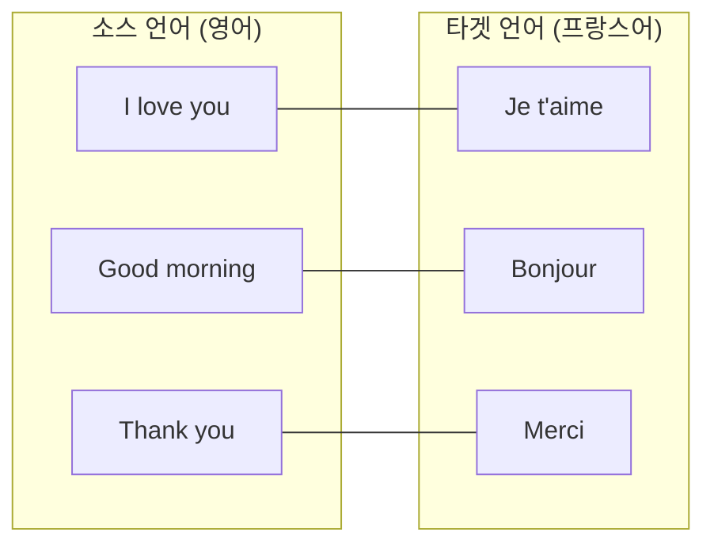
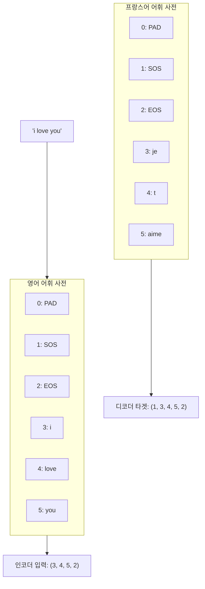
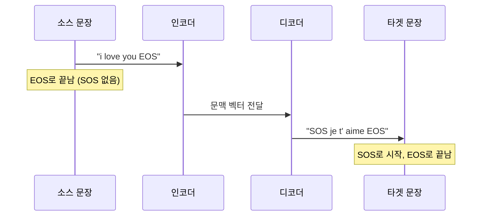
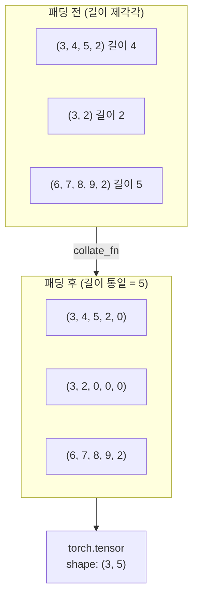
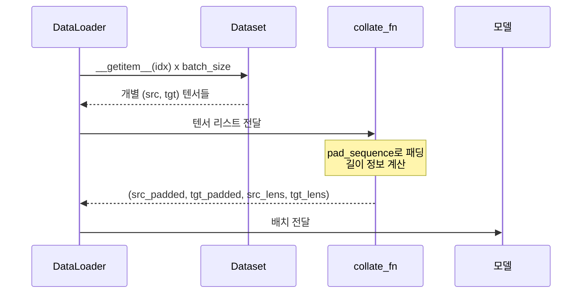
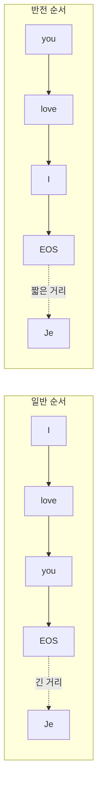

# 번역 데이터 전처리

> 병렬 코퍼스를 로딩하고, 소스/타겟 언어별 어휘 사전을 구축하며, 특수 토큰과 미니배치를 다루는 전처리 파이프라인을 완성합니다.

## 개요

이 섹션에서는 Seq2Seq 모델이 실제로 학습하려면 "정리된 데이터"가 필수라는 점을 배웁니다. [이전 섹션](11-시퀀스-투-시퀀스와-기계-번역/01-01-인코더-디코더-아키텍처.md)에서 만든 인코더-디코더 구조에 데이터를 먹이려면, 문자열을 숫자로 바꾸고, 길이를 맞추고, 배치로 묶는 작업이 선행되어야 합니다.

**선수 지식**: Ch11.1의 인코더-디코더 구조, [Ch7.5의 Dataset/DataLoader 기초](07-pytorch-기초와-신경망-입문/05-05-학습-루프와-datasetdataloader.md), [Ch10.2의 어휘 사전 구축](10-rnn-기반-텍스트-분류와-감성-분석/02-02-데이터-전처리와-어휘-사전-구축.md)

**학습 목표**:
- 병렬 코퍼스의 구조와 특성을 이해한다
- 소스/타겟 언어별 독립 어휘 사전(Lang 클래스)을 구축한다
- SOS, EOS, PAD 특수 토큰의 역할과 배치 위치를 파악한다
- `collate_fn`을 활용해 가변 길이 시퀀스를 미니배치로 처리한다

## 왜 알아야 할까?

딥러닝 모델은 문자열을 직접 처리하지 못합니다. "I love you" → "나는 너를 사랑해"를 학습시키려면, 각 단어를 숫자 ID로 변환하고, 문장마다 다른 길이를 하나의 텐서로 통일하고, "여기서부터 시작", "여기서 끝"이라는 신호까지 넣어줘야 하죠. 이 전처리 과정이 엉망이면, 아무리 훌륭한 모델 아키텍처도 쓸모없습니다.

실제로 기계 번역 연구에서 전처리가 번역 품질에 미치는 영향은 BLEU 점수 기준 5~10점까지 차이를 만들 수 있거든요. 데이터 전처리는 "잡일"이 아니라, 번역 품질을 좌우하는 **핵심 엔지니어링**입니다.

## 핵심 개념

### 개념 1: 병렬 코퍼스(Parallel Corpus)

> 💡 **비유**: 병렬 코퍼스는 **외국어 단어장**과 비슷합니다. 왼쪽 페이지에는 영어, 오른쪽 페이지에는 같은 의미의 프랑스어가 적혀 있죠. 한 쌍(pair)이 곧 하나의 학습 샘플이 됩니다.

병렬 코퍼스(Parallel Corpus)란 소스 언어와 타겟 언어의 문장이 **1:1로 정렬**된 데이터셋입니다. 기계 번역 모델은 이 쌍을 보고 "이 소스 문장이 들어오면, 이 타겟 문장을 출력해야 해"라는 매핑을 학습합니다.

> 📊 **그림 1**: 병렬 코퍼스의 구조



대표적인 병렬 코퍼스로는 다음이 있습니다:

| 데이터셋 | 언어 쌍 | 규모 | 특징 |
|----------|---------|------|------|
| Tatoeba | 400+ 언어 | 수백만 문장 | 커뮤니티 기반, 짧은 문장 |
| Multi30k | 영-독 | 3만 쌍 | 이미지 캡션 기반 |
| WMT | 다양 | 수천만 쌍 | 공식 번역 대회용 |
| Europarl | EU 24개 언어 | 수천만 쌍 | 유럽 의회 회의록 |

이번 실습에서는 PyTorch 공식 튜토리얼에서도 사용하는 **Tatoeba 영어-프랑스어** 데이터를 활용합니다. 짧고 깔끔한 문장 쌍이라 Seq2Seq 학습의 기본기를 익히기에 딱 좋거든요.

데이터 파일은 탭(TAB)으로 구분된 형식입니다:

```
I am cold.	J'ai froid.
```

### 개념 2: 텍스트 정규화(Text Normalization)

> 💡 **비유**: 텍스트 정규화는 **도서관 서가 정리**와 같습니다. 같은 책이 "Python 입문", "python 입문", "PYTHON 입문"이라는 세 가지 라벨로 꽂혀 있으면 찾기 어렵죠. 하나의 표준 형태로 통일해야 효율적으로 관리할 수 있습니다.

전처리에서 가장 먼저 해야 할 일은 텍스트 정규화입니다. 원본 데이터에는 대소문자 혼용, 악센트 부호, 불규칙한 구두점 등이 섞여 있어서, 이대로 어휘 사전을 구축하면 같은 단어가 여러 ID를 차지하게 됩니다.

> 📊 **그림 2**: 정규화 파이프라인


정규화에서 수행하는 각 단계를 자세히 살펴보겠습니다:

1. **유니코드 NFD 분해**: 프랑스어의 `é`를 `e` + 결합 악센트 부호로 분리합니다. 유니코드에는 같은 글자를 표현하는 방식이 여러 가지인데, NFD(Normalization Form Decomposition)는 문자를 기본 문자와 결합 부호로 분해하는 표준 방식입니다.
2. **악센트 제거**: 분해된 결합 부호(`Mn` 카테고리)를 제거하여 ASCII 범위로 변환합니다. `café` → `cafe`가 되는 거죠.
3. **소문자 변환**: "Thank"와 "thank"를 같은 단어로 통합합니다.
4. **구두점 분리**: `.!?` 앞에 공백을 삽입하여 구두점을 독립 토큰으로 만듭니다. "Hello!" → "Hello !"
5. **비문자 제거**: 알파벳과 `.!?` 외의 문자(숫자, 특수기호 등)를 공백으로 치환합니다.

```python
import unicodedata
import re

def normalize_string(s):
    """유니코드 정규화 + 소문자 + 구두점 분리"""
    # 유니코드 → ASCII (악센트 제거)
    s = unicodedata.normalize('NFD', s)
    s = ''.join(c for c in s if unicodedata.category(c) != 'Mn')
    # 소문자 변환 + 앞뒤 공백 제거
    s = s.lower().strip()
    # 구두점 앞에 공백 삽입 (.!? → " ." " !" " ?")
    s = re.sub(r"([.!?])", r" \1", s)
    # 알파벳과 .!? 외의 문자 제거
    s = re.sub(r"[^a-zA-Z.!?]+", r" ", s)
    return s
```

> ⚠️ **흔한 오해**: "데이터가 많으면 전처리를 대충 해도 된다"고 생각하기 쉽지만, 정규화 없이 "Thank you", "thank you", "Thank You"가 모두 다른 단어로 인식되면 어휘 사전이 불필요하게 커지고, 학습 효율이 급격히 떨어집니다.

> 🔥 **실무 팁**: 프랑스어처럼 악센트가 의미를 구분하는 언어(예: `ou`=또는 vs `où`=어디)에서는 악센트 제거가 정보 손실을 유발할 수 있습니다. 대규모 프로젝트에서는 악센트를 유지하되 BPE(Byte Pair Encoding) 같은 서브워드 토크나이저를 사용하는 것이 일반적입니다. 여기서는 학습 목적으로 간단한 공백 기반 토크나이징을 사용합니다.

### 개념 3: 어휘 사전(Vocabulary) 구축 — Lang 클래스

> 💡 **비유**: 어휘 사전은 **전화번호부**와 같습니다. "사과" → 42번, 42번 → "사과"처럼 단어와 숫자를 양방향으로 변환해주는 매핑 테이블이죠. 번역에서는 영어 전화번호부, 프랑스어 전화번호부가 각각 필요합니다.

Seq2Seq에서 소스 언어와 타겟 언어는 **완전히 다른 어휘 공간**을 가집니다. 영어의 "dog"과 프랑스어의 "chien"은 같은 뜻이지만, 각각 자기 언어의 어휘 사전에서 독립적인 ID를 받아야 합니다. 그래서 언어별로 별도의 어휘 사전 객체를 만듭니다.

[Ch10.2의 어휘 사전 구축](10-rnn-기반-텍스트-분류와-감성-분석/02-02-데이터-전처리와-어휘-사전-구축.md)에서 단일 언어 어휘 사전을 만들어본 적이 있는데요, 번역에서는 이를 **언어별로 독립적으로** 두 개 만든다는 점이 핵심 차이입니다.

> 📊 **그림 3**: 소스/타겟 독립 어휘 사전 구조



`Lang` 클래스는 이 양방향 매핑을 관리합니다:

```python
class Lang:
    """언어별 어휘 사전 관리 클래스"""
    
    def __init__(self, name):
        self.name = name
        self.word2index = {}           # 단어 → ID
        self.index2word = {0: "PAD", 1: "SOS", 2: "EOS"}  # ID → 단어
        self.word2count = {}           # 단어별 등장 횟수
        self.n_words = 3               # PAD, SOS, EOS로 시작
    
    def add_sentence(self, sentence):
        """문장의 모든 단어를 어휘 사전에 등록"""
        for word in sentence.split(' '):
            self.add_word(word)
    
    def add_word(self, word):
        """새로운 단어를 어휘 사전에 추가"""
        if word not in self.word2index:
            self.word2index[word] = self.n_words
            self.index2word[self.n_words] = word
            self.word2count[word] = 1
            self.n_words += 1
        else:
            self.word2count[word] += 1
```

핵심 포인트는 `n_words`가 **3부터 시작**한다는 점입니다. 0, 1, 2번은 특수 토큰이 이미 차지하고 있으니까요. 이 점을 놓치면 ID 충돌이 발생해서 학습이 엉망이 됩니다.

### 개념 4: 특수 토큰 — SOS, EOS, PAD

> 💡 **비유**: 특수 토큰은 **교통 신호**와 같습니다. SOS는 초록불("출발!"), EOS는 빨간불("정지!"), PAD는 도로 위의 안전 구간 표시("여기는 비어 있으니 무시하세요")에 해당합니다.

기계 번역 모델에서 특수 토큰은 단순한 관례가 아니라, 모델이 올바르게 동작하기 위한 **필수 신호**입니다.

| 토큰 | ID | 위치 | 역할 |
|------|-----|------|------|
| **PAD** | 0 | 시퀀스 뒤쪽 | 짧은 문장을 배치 내 최대 길이에 맞춰 채움. 손실 계산에서 무시됨 |
| **SOS** | 1 | 타겟 시퀀스 맨 앞 | 디코더에 "이제 생성을 시작해"라는 시작 신호 |
| **EOS** | 2 | 소스/타겟 시퀀스 맨 뒤 | "문장이 여기서 끝났어"라는 종료 신호 |

> 📊 **그림 4**: 특수 토큰의 배치 위치



왜 인코더 입력에는 SOS가 없을까요? 인코더는 **전체 문장을 한꺼번에 읽는** 역할이라 "시작" 신호가 필요 없습니다. 반면 디코더는 **한 단어씩 순차적으로 생성**하기 때문에, 첫 번째 타임스텝에 "뭘 입력으로 넣을지"가 필요하고, 그게 바로 SOS 토큰입니다.

EOS는 양쪽 모두에 있습니다. 인코더는 EOS를 보고 "입력이 끝났구나"를 인식하고, 디코더는 EOS를 출력하면 "생성을 멈춰야 하는구나"를 학습합니다.

```python
# 문장 → 텐서 변환
PAD_token = 0
SOS_token = 1
EOS_token = 2

def indexes_from_sentence(lang, sentence):
    """문장을 단어 ID 리스트로 변환"""
    return [lang.word2index[word] for word in sentence.split(' ')]

def tensor_from_sentence(lang, sentence):
    """문장을 텐서로 변환 (EOS 추가)"""
    indexes = indexes_from_sentence(lang, sentence)
    indexes.append(EOS_token)  # 문장 끝에 EOS 추가
    return torch.tensor(indexes, dtype=torch.long)
```

### 개념 5: 배치 처리와 collate_fn

> 💡 **비유**: 배치 처리는 **택배 상자에 물건 포장하기**와 비슷합니다. 물건(문장)마다 크기(길이)가 다르지만, 상자(텐서)는 직사각형이어야 하죠. 빈 공간은 완충재(PAD)로 채웁니다.

신경망은 미니배치 단위로 학습합니다. 그런데 번역 데이터에서 문장 길이는 제각각이죠. "Hi" (1단어)와 "I really love this beautiful city" (6단어)를 같은 배치에 넣으려면, 짧은 문장 뒤를 PAD 토큰으로 채워 길이를 맞춰야 합니다.

[Ch7.5](07-pytorch-기초와-신경망-입문/05-05-학습-루프와-datasetdataloader.md)에서 `Dataset`과 `DataLoader`의 기본 사용법을 배웠는데요, 그때는 모든 샘플의 크기가 동일한 정형 데이터(예: MNIST 이미지)를 다뤘죠. 하지만 NLP에서는 문장 길이가 제각각이라, DataLoader가 배치를 만들 때 **추가 처리**가 필요합니다. 이때 사용하는 것이 `collate_fn`입니다.

`collate_fn`은 DataLoader가 개별 샘플들을 하나의 배치로 합칠 때 호출하는 **커스텀 배치 조립 함수**입니다. 기본 `collate_fn`은 단순히 텐서를 스택하지만, 가변 길이 시퀀스에서는 패딩 로직이 필요하므로 직접 정의해야 합니다.

> 📊 **그림 5**: 패딩을 통한 배치 구성



> 📊 **그림 6**: collate_fn의 동작 흐름



PyTorch의 `DataLoader`는 `collate_fn` 인자를 통해 이 패딩 로직을 커스터마이즈할 수 있습니다:

```python
from torch.nn.utils.rnn import pad_sequence

def collate_fn(batch):
    """가변 길이 문장 쌍을 패딩하여 배치로 묶기"""
    # batch: [(src_tensor, tgt_tensor), ...]
    src_batch, tgt_batch = zip(*batch)
    
    # 각 언어별로 배치 내 최대 길이에 맞춰 PAD(0)로 채움
    src_padded = pad_sequence(src_batch, batch_first=True, padding_value=PAD_token)
    tgt_padded = pad_sequence(tgt_batch, batch_first=True, padding_value=PAD_token)
    
    # 원래 길이도 함께 반환 (pack_padded_sequence에 필요)
    src_lengths = torch.tensor([len(s) for s in src_batch])
    tgt_lengths = torch.tensor([len(t) for t in tgt_batch])
    
    return src_padded, tgt_padded, src_lengths, tgt_lengths
```

`pad_sequence`는 PyTorch가 제공하는 유틸리티로, 리스트 안의 텐서들을 가장 긴 텐서 기준으로 자동 패딩합니다. `batch_first=True`로 설정하면 출력 shape이 `(batch_size, max_len)`이 되어 직관적이에요.

원래 길이(`src_lengths`, `tgt_lengths`)를 함께 반환하는 이유가 뭘까요? 나중에 `pack_padded_sequence`를 사용하면 RNN이 PAD 토큰을 무시하고 실제 데이터만 처리할 수 있거든요. 이 기법은 [다음 섹션](11-시퀀스-투-시퀀스와-기계-번역/03-03-seq2seq-모델-구현.md)에서 Seq2Seq 모델을 구현할 때 활용합니다.

> 🔥 **실무 팁**: 실제 프로젝트에서는 비슷한 길이의 문장끼리 묶는 **버킷 배칭(Bucket Batching)**을 사용합니다. PAD 토큰이 줄어들어 메모리와 연산 효율이 크게 올라가거든요. `torchtext`의 `BucketIterator`가 이를 자동으로 해줍니다.

### 개념 6: 데이터 필터링과 소스 반전

번역 데이터를 그대로 쓰면 어휘 사전이 너무 커지고 학습이 느려집니다. 실습 규모에 맞게 **필터링**하는 것이 일반적인데요:

```python
MAX_LENGTH = 10  # 10단어 이하 문장만 사용

# "I am", "I was" 등 간단한 패턴으로 시작하는 문장만 필터
eng_prefixes = (
    "i am ", "i m ", "he is", "he s ",
    "she is", "she s ", "you are", "you re ",
    "we are", "we re ", "they are", "they re "
)

def filter_pair(pair):
    """문장 쌍 필터 조건"""
    return (len(pair[0].split(' ')) < MAX_LENGTH and
            len(pair[1].split(' ')) < MAX_LENGTH and
            pair[0].startswith(eng_prefixes))
```

한 가지 흥미로운 트릭이 있습니다. Sutskever et al.(2014)은 소스 문장을 **뒤집어서** 인코더에 넣으면 성능이 올라간다는 것을 발견했습니다. "I love you" → "you love I"로 바꾸는 거죠.

> 📊 **그림 7**: 소스 반전(Source Reversal)의 효과



왜 효과가 있을까요? "I love you" → "Je t'aime"에서, "I"와 "Je"는 의미적으로 대응됩니다. 일반 순서에서 "I"는 인코더 첫 타임스텝에 입력되어 문맥 벡터에 도달하기까지 거리가 멀지만, 반전하면 "I"가 마지막에 입력되어 디코더가 "Je"를 생성할 때 더 가까운 정보를 활용할 수 있습니다.

## 실습: 직접 해보기

이제 모든 개념을 조합하여, 영어-프랑스어 번역 데이터 전처리 파이프라인을 완성합니다. 이전 섹션에서 만든 인코더-디코더에 바로 연결할 수 있는 `DataLoader`를 만드는 것이 목표입니다.

```python
import torch
from torch.utils.data import Dataset, DataLoader
from torch.nn.utils.rnn import pad_sequence
import unicodedata
import re
import random

# ── 상수 정의 ──
PAD_token = 0
SOS_token = 1
EOS_token = 2
MAX_LENGTH = 10

# ── Lang 클래스: 언어별 어휘 사전 ──
class Lang:
    def __init__(self, name):
        self.name = name
        self.word2index = {}
        self.index2word = {0: "PAD", 1: "SOS", 2: "EOS"}
        self.word2count = {}
        self.n_words = 3  # 특수 토큰 3개로 시작
    
    def add_sentence(self, sentence):
        for word in sentence.split(' '):
            self.add_word(word)
    
    def add_word(self, word):
        if word not in self.word2index:
            self.word2index[word] = self.n_words
            self.index2word[self.n_words] = word
            self.word2count[word] = 1
            self.n_words += 1
        else:
            self.word2count[word] += 1

# ── 텍스트 정규화 ──
def normalize_string(s):
    s = unicodedata.normalize('NFD', s)
    s = ''.join(c for c in s if unicodedata.category(c) != 'Mn')
    s = s.lower().strip()
    s = re.sub(r"([.!?])", r" \1", s)
    s = re.sub(r"[^a-zA-Z.!?]+", r" ", s)
    return s

# ── 데이터 필터링 ──
eng_prefixes = (
    "i am ", "i m ", "he is", "he s ",
    "she is", "she s ", "you are", "you re ",
    "we are", "we re ", "they are", "they re "
)

def filter_pair(pair):
    return (len(pair[0].split(' ')) < MAX_LENGTH and
            len(pair[1].split(' ')) < MAX_LENGTH and
            pair[0].startswith(eng_prefixes))

# ── 데이터 로딩 및 전처리 ──
def read_langs(lang1, lang2, reverse=False):
    """데이터 파일에서 문장 쌍 읽기"""
    # 실습용 샘플 데이터 (실제로는 파일에서 로드)
    raw_pairs = [
        ("I am cold.", "J'ai froid."),
        ("I am happy.", "Je suis heureux."),
        ("He is tall.", "Il est grand."),
        ("She is smart.", "Elle est intelligente."),
        ("You are kind.", "Vous etes gentil."),
        ("We are here.", "Nous sommes ici."),
        ("They are students.", "Ils sont etudiants."),
        ("I am a teacher.", "Je suis professeur."),
        ("He is my friend.", "Il est mon ami."),
        ("She is a doctor.", "Elle est medecin."),
        ("I am not tired.", "Je ne suis pas fatigue."),
        ("You are very nice.", "Vous etes tres gentil."),
    ]
    
    # 정규화 적용
    pairs = [[normalize_string(s) for s in pair] for pair in raw_pairs]
    
    if reverse:
        pairs = [list(reversed(p)) for p in pairs]
        input_lang = Lang(lang2)
        output_lang = Lang(lang1)
    else:
        input_lang = Lang(lang1)
        output_lang = Lang(lang2)
    
    return input_lang, output_lang, pairs

def prepare_data(lang1, lang2, reverse=False):
    """전체 전처리 파이프라인 실행"""
    input_lang, output_lang, pairs = read_langs(lang1, lang2, reverse)
    
    # 필터링
    pairs = [p for p in pairs if filter_pair(p)]
    
    # 어휘 사전 구축
    for pair in pairs:
        input_lang.add_sentence(pair[0])
        output_lang.add_sentence(pair[1])
    
    return input_lang, output_lang, pairs

# ── Dataset 클래스 ──
class TranslationDataset(Dataset):
    def __init__(self, pairs, input_lang, output_lang):
        self.pairs = pairs
        self.input_lang = input_lang
        self.output_lang = output_lang
    
    def __len__(self):
        return len(self.pairs)
    
    def __getitem__(self, idx):
        pair = self.pairs[idx]
        # 소스: 단어 ID + EOS
        src_ids = [self.input_lang.word2index[w] for w in pair[0].split(' ')]
        src_ids.append(EOS_token)
        # 타겟: SOS + 단어 ID + EOS
        tgt_ids = [SOS_token]
        tgt_ids.extend([self.output_lang.word2index[w] for w in pair[1].split(' ')])
        tgt_ids.append(EOS_token)
        
        return torch.tensor(src_ids, dtype=torch.long), \
               torch.tensor(tgt_ids, dtype=torch.long)

# ── collate_fn: 가변 길이 배치 처리 ──
def translation_collate_fn(batch):
    src_batch, tgt_batch = zip(*batch)
    src_padded = pad_sequence(src_batch, batch_first=True, padding_value=PAD_token)
    tgt_padded = pad_sequence(tgt_batch, batch_first=True, padding_value=PAD_token)
    src_lengths = torch.tensor([len(s) for s in src_batch])
    tgt_lengths = torch.tensor([len(t) for t in tgt_batch])
    return src_padded, tgt_padded, src_lengths, tgt_lengths
```

전처리 파이프라인을 실행하고 결과를 확인해봅시다:

```run:python
# ── 파이프라인 실행 ──
input_lang, output_lang, pairs = prepare_data('eng', 'fra')

print(f"문장 쌍 수: {len(pairs)}")
print(f"영어 어휘 수: {input_lang.n_words}")
print(f"프랑스어 어휘 수: {output_lang.n_words}")
print(f"\n샘플 문장 쌍:")
for i in range(3):
    print(f"  영어: {pairs[i][0]}")
    print(f"  프랑스어: {pairs[i][1]}")
    print()
```

```output
문장 쌍 수: 12
영어 어휘 수: 27
프랑스어 어휘 수: 28

샘플 문장 쌍:
  영어: i am cold .
  프랑스어: j ai froid .

  영어: i am happy .
  프랑스어: je suis heureux .

  영어: he is tall .
  프랑스어: il est grand .
```

DataLoader까지 만들어서 배치 출력을 확인합니다:

```run:python
# ── DataLoader 생성 ──
dataset = TranslationDataset(pairs, input_lang, output_lang)
dataloader = DataLoader(
    dataset,
    batch_size=4,
    shuffle=True,
    collate_fn=translation_collate_fn
)

# ── 첫 배치 확인 ──
src_batch, tgt_batch, src_lens, tgt_lens = next(iter(dataloader))
print(f"소스 배치 shape: {src_batch.shape}")
print(f"타겟 배치 shape: {tgt_batch.shape}")
print(f"소스 길이: {src_lens.tolist()}")
print(f"타겟 길이: {tgt_lens.tolist()}")
print(f"\n소스 배치 (숫자):\n{src_batch}")
print(f"\n타겟 배치 (숫자):\n{tgt_batch}")
```

```output
소스 배치 shape: torch.Size([4, 5])
타겟 배치 shape: torch.Size([4, 7])
소스 길이: [5, 4, 5, 5]
타겟 길이: [6, 5, 7, 6]

소스 배치 (숫자):
tensor([[ 3,  4,  5,  6,  2],
        [ 7,  8,  9,  2,  0],
        [10, 11, 12, 13,  2],
        [14, 15, 16, 17,  2]])

타겟 배치 (숫자):
tensor([[ 1,  3,  4,  5,  6,  2,  0],
        [ 1,  7,  8,  9,  2,  0,  0],
        [ 1, 10, 11, 12, 13, 14,  2],
        [ 1, 15, 16, 17, 18, 19,  2]])
```

배치 결과를 보면, 타겟은 모두 `1`(SOS)로 시작하고, 문장 끝에 `2`(EOS)가 있으며, 짧은 문장은 `0`(PAD)로 채워져 있습니다. 이 DataLoader를 [다음 섹션](11-시퀀스-투-시퀀스와-기계-번역/03-03-seq2seq-모델-구현.md)에서 Seq2Seq 모델에 연결합니다.

## 더 깊이 알아보기

### 병렬 코퍼스의 역사 — 로제타 스톤에서 Tatoeba까지

기계 번역을 위한 병렬 텍스트의 역사는 놀랍도록 오래되었습니다. 1799년 이집트에서 발견된 **로제타 스톤**은 같은 내용을 고대 이집트 상형문자, 민중문자, 고대 그리스어로 기록한 "병렬 코퍼스"의 원조라고 할 수 있죠. 이 돌판 덕분에 인류는 잃어버린 이집트 문자를 해독할 수 있었습니다.

현대 기계 번역에서 병렬 코퍼스의 중요성이 부각된 것은 1990년대 **통계적 기계 번역(SMT)** 시대입니다. IBM의 연구팀은 캐나다 의회의 영어-프랑스어 의사록(Hansard corpus)을 사용하여 통계 모델을 학습했는데, 이것이 **Europarl 코퍼스**의 전신이 되었습니다.

Sutskever et al.(2014)이 Seq2Seq 논문에서 소스 문장 반전 트릭을 소개했을 때, 많은 연구자들이 놀랐습니다. 이론적 근거 없이 "그냥 해봤더니 잘 된다"는 실험적 발견이었거든요. 논문에서는 BLEU 점수가 약 5점 향상되었다고 보고했습니다. 이 트릭은 나중에 어텐션 메커니즘이 등장하면서 필요성이 줄어들었지만, 딥러닝 연구에서 경험적 발견의 힘을 보여주는 좋은 사례로 남아 있습니다.

### 특수 토큰의 기원

SOS/EOS 토큰의 개념은 통신 프로토콜에서 왔습니다. RS-232 직렬 통신에서 데이터 프레임의 시작(STX, Start of Text)과 끝(ETX, End of Text)을 표시하던 제어 문자가 그 기원이죠. NLP에서는 이를 차용하여, 시퀀스의 경계를 모델에 알려주는 "메타 정보"로 활용하게 되었습니다.

## 흔한 오해와 팁

> ⚠️ **흔한 오해**: "SOS 토큰은 인코더에도 넣어야 한다"고 생각하는 분이 많습니다. 하지만 인코더는 전체 문장을 한꺼번에 읽으므로 시작 신호가 불필요합니다. SOS는 디코더의 첫 입력에만 사용하세요.

> 💡 **알고 계셨나요?**: PyTorch 공식 Seq2Seq 튜토리얼에서는 `SOS_token = 0`, `EOS_token = 1`로 정의합니다. 하지만 많은 실무 코드에서는 `PAD_token = 0`으로 두는데요, 이는 `nn.Embedding`의 `padding_idx=0` 기능과 맞추기 위해서입니다. PAD를 0으로 두면 해당 인덱스의 임베딩 벡터가 항상 0벡터로 유지되어 그래디언트가 흐르지 않아요.

> 🔥 **실무 팁**: 어휘 사전 크기를 제한하고 싶다면, `word2count`를 활용하여 등장 횟수가 N번 미만인 단어를 `<UNK>` 토큰으로 대체하세요. 일반적으로 등장 횟수 2~3회 미만을 기준으로 합니다. 이렇게 하면 어휘 크기를 30~50% 줄이면서도 성능 저하는 미미합니다.

## 핵심 정리

| 개념 | 설명 |
|------|------|
| **병렬 코퍼스** | 소스-타겟 문장이 1:1 정렬된 번역 학습 데이터 |
| **텍스트 정규화** | 유니코드 NFD 분해, 악센트 제거, 소문자 변환, 구두점 분리로 어휘 크기 관리 |
| **Lang 클래스** | 언어별 양방향 매핑(word↔index)을 관리하는 어휘 사전 객체 |
| **PAD (ID=0)** | 배치 내 가변 길이를 통일하기 위한 채움 토큰. 손실 계산에서 무시 |
| **SOS (ID=1)** | 디코더의 첫 입력으로 들어가는 시작 신호 토큰 |
| **EOS (ID=2)** | 문장 끝을 표시하는 종료 신호. 인코더/디코더 양쪽에 사용 |
| **collate_fn** | DataLoader가 배치를 만들 때 가변 길이 시퀀스를 패딩하는 커스텀 배치 조립 함수 |
| **소스 반전** | 인코더 입력을 뒤집어 디코더와의 정보 거리를 줄이는 트릭 |

## 다음 섹션 미리보기

어휘 사전과 DataLoader가 준비되었으니, [다음 섹션](11-시퀀스-투-시퀀스와-기계-번역/03-03-seq2seq-모델-구현.md)에서는 이것들을 [Ch11.1의 인코더-디코더](11-시퀀스-투-시퀀스와-기계-번역/01-01-인코더-디코더-아키텍처.md)에 연결하여 실제 학습 가능한 Seq2Seq 모델을 PyTorch로 조립합니다. Encoder, Decoder, Seq2Seq 클래스를 완성하고, 이번에 만든 DataLoader에서 배치를 꺼내 모델에 통과시키는 전체 흐름을 구현하게 됩니다.

## 참고 자료

- [PyTorch Seq2Seq Translation Tutorial](https://docs.pytorch.org/tutorials/intermediate/seq2seq_translation_tutorial.html) - PyTorch 공식 Seq2Seq 튜토리얼. Lang 클래스와 데이터 전처리의 원본 코드
- [Sutskever et al. (2014) - Sequence to Sequence Learning with Neural Networks](https://arxiv.org/abs/1409.3215) - 소스 반전 트릭을 소개한 원본 Seq2Seq 논문
- [PyTorch Dataset and DataLoader Tutorial](https://docs.pytorch.org/tutorials/beginner/basics/data_tutorial.html) - Dataset, DataLoader, collate_fn의 공식 사용 가이드
- [Tatoeba - 다국어 문장 쌍 데이터](https://tatoeba.org/en) - 400개 이상 언어의 커뮤니티 기반 병렬 코퍼스
- [Unicode Normalization Forms (unicode.org)](https://unicode.org/reports/tr15/) - NFD/NFC 등 유니코드 정규화 표준 문서

---
### 🔗 Related Sessions
- [seq2seq_model](11-시퀀스-투-시퀀스와-기계-번역/01-01-인코더-디코더-아키텍처.md) (prerequisite)
- [seq2seq_model](11-시퀀스-투-시퀀스와-기계-번역/01-01-인코더-디코더-아키텍처.md) (prerequisite)
- [encoder](11-시퀀스-투-시퀀스와-기계-번역/01-01-인코더-디코더-아키텍처.md) (prerequisite)
- [encoder](11-시퀀스-투-시퀀스와-기계-번역/01-01-인코더-디코더-아키텍처.md) (prerequisite)
- [decoder](11-시퀀스-투-시퀀스와-기계-번역/01-01-인코더-디코더-아키텍처.md) (prerequisite)
- [decoder](11-시퀀스-투-시퀀스와-기계-번역/01-01-인코더-디코더-아키텍처.md) (prerequisite)
