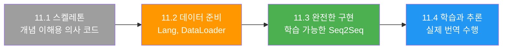
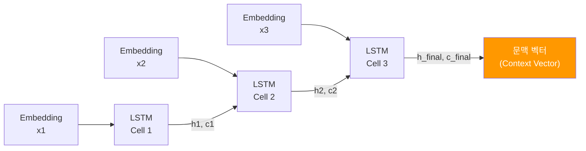
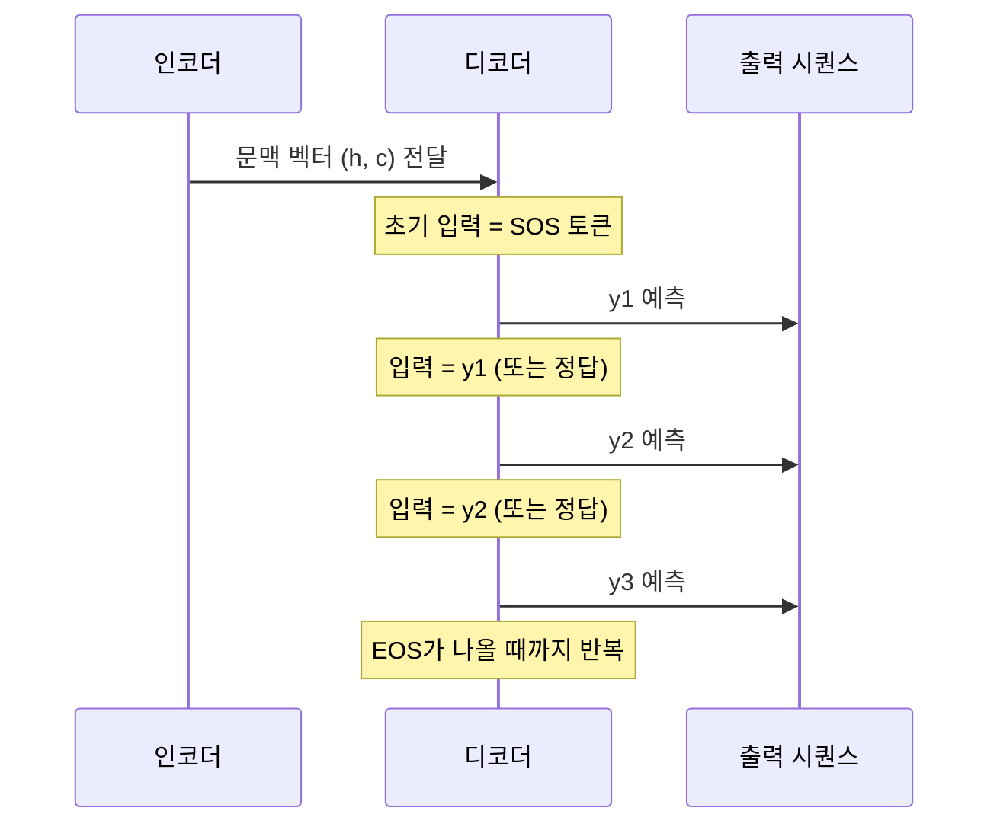
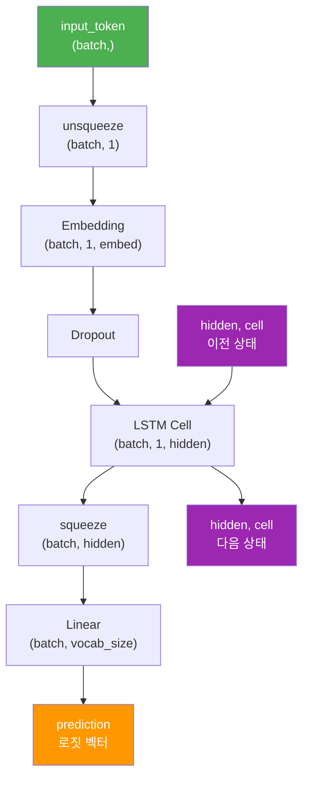
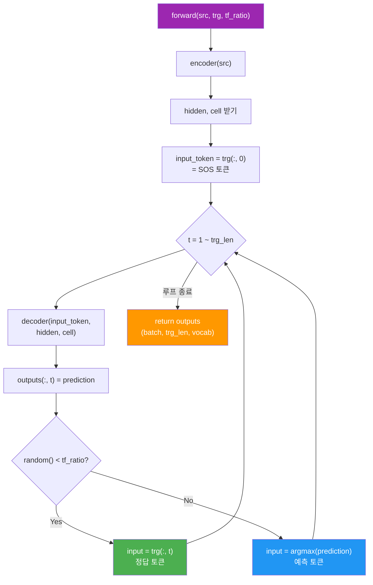
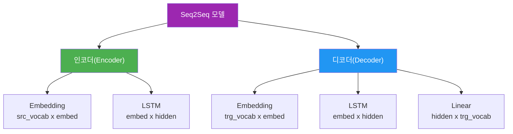

# 03. Seq2Seq 모델 구현

> LSTM 기반 인코더-디코더를 PyTorch로 조립하고, 교사 강제(Teacher Forcing)로 학습하는 완전한 Seq2Seq 모델을 구현합니다.

## 개요

이 섹션에서는 앞서 배운 인코더-디코더 아키텍처와 번역 데이터 전처리를 결합하여, **실제로 학습 가능한 Seq2Seq 모델**을 PyTorch로 구현합니다. [01. 인코더-디코더 아키텍처](11-시퀀스-투-시퀀스와-기계-번역/01-01-인코더-디코더-아키텍처.md)에서 Encoder/Decoder의 **개념적 스켈레톤**을 살펴봤다면, 이번 섹션에서는 그 스켈레톤을 **학습 가능한 완전한 구현체**로 완성합니다. 인코더가 소스 문장을 압축한 문맥 벡터를 디코더에 전달하는 과정, 그리고 학습 시 정답을 힌트로 제공하는 교사 강제(Teacher Forcing) 기법까지 코드 레벨에서 완전히 이해하게 됩니다.

**선수 지식**: [01. 인코더-디코더 아키텍처](11-시퀀스-투-시퀀스와-기계-번역/01-01-인코더-디코더-아키텍처.md)의 Encoder/Decoder 개념, [02. 번역 데이터 전처리](11-시퀀스-투-시퀀스와-기계-번역/02-02-번역-데이터-전처리.md)의 Lang 클래스와 DataLoader, [03. nn.Module로 신경망 정의하기](07-pytorch-기초와-신경망-입문/03-03-nnmodule로-신경망-정의하기.md)의 PyTorch 모듈 구조

**학습 목표**:
- LSTM 기반 인코더와 디코더를 `nn.Module`로 구현할 수 있다
- 문맥 벡터가 인코더에서 디코더로 전달되는 과정을 코드로 이해한다
- 교사 강제의 원리와 `teacher_forcing_ratio` 파라미터의 역할을 설명할 수 있다
- 전체 Seq2Seq 모델의 `forward()` 메서드에서 디코딩 루프를 구현할 수 있다

## 왜 알아야 할까?

[01. 인코더-디코더 아키텍처](11-시퀀스-투-시퀀스와-기계-번역/01-01-인코더-디코더-아키텍처.md)에서 Seq2Seq의 **개념**을 배웠고, [02. 번역 데이터 전처리](11-시퀀스-투-시퀀스와-기계-번역/02-02-번역-데이터-전처리.md)에서 **데이터**를 준비했습니다. 이제 남은 것은 이 둘을 연결하는 **코드**입니다.

Seq2Seq 구현은 단순히 "LSTM 두 개를 이어 붙이는 것"이 아닙니다. 인코더의 마지막 은닉 상태를 디코더의 초기 상태로 전달하고, 디코더가 한 토큰씩 자기회귀적(autoregressive)으로 출력을 생성하는 루프를 설계해야 합니다. 특히 학습 시에는 **교사 강제**를, 추론 시에는 **자유 실행(free running)**을 사용해야 하는데, 이 두 모드를 하나의 `forward()` 메서드 안에서 깔끔하게 처리하는 것이 핵심 설계 포인트입니다.

> 📊 **그림 0**: 11.1의 개념 스켈레톤에서 11.3의 완전한 구현으로



이 구현 경험은 이후 [어텐션 메커니즘](12-어텐션-메커니즘/01-01-어텐션의-직관적-이해.md)과 [트랜스포머](13-트랜스포머-아키텍처-심층-분석/01-01-트랜스포머-아키텍처-전체-조망.md)를 이해하는 기반이 됩니다.

## 핵심 개념

### 개념 1: LSTM 인코더 — 문장을 벡터로 압축하기

> 💡 **비유**: 인코더는 **동시통역사의 메모장**과 같습니다. 화자의 발언을 처음부터 끝까지 들으면서 핵심 내용을 메모장에 기록하고, 마지막에 메모장 전체를 통역사에게 넘기는 겁니다. 이 메모장이 바로 문맥 벡터(context vector)이고, 통역사가 디코더입니다.

인코더는 소스 문장의 각 토큰을 순차적으로 처리하여 최종 은닉 상태(hidden state)와 셀 상태(cell state)를 생성합니다. LSTM을 사용하면 은닉 상태 `h`와 셀 상태 `c` 두 가지를 모두 디코더에 전달합니다.

> 📊 **그림 1**: LSTM 인코더의 토큰별 처리 흐름



11.1에서는 인코더의 역할을 개념적으로 살펴봤는데요, 이제 `nn.Module`을 상속한 **완전한 PyTorch 클래스**로 구현해봅시다.

```python
import torch
import torch.nn as nn

class Encoder(nn.Module):
    def __init__(self, input_size, embed_size, hidden_size, num_layers=1, dropout=0.5):
        super().__init__()
        self.hidden_size = hidden_size
        self.num_layers = num_layers
        
        # 토큰 인덱스 → 밀집 벡터 변환
        self.embedding = nn.Embedding(input_size, embed_size)
        self.dropout = nn.Dropout(dropout)
        
        # LSTM: 시퀀스를 순차 처리
        self.lstm = nn.LSTM(
            embed_size, hidden_size,
            num_layers=num_layers,
            dropout=dropout if num_layers > 1 else 0,
            batch_first=True
        )
    
    def forward(self, src):
        # src: (batch_size, src_len)
        embedded = self.dropout(self.embedding(src))  # (batch, src_len, embed_size)
        
        # outputs: 모든 타임스텝의 출력 (어텐션에서 사용, 지금은 무시)
        # hidden: (h_n, c_n) — 마지막 타임스텝의 은닉/셀 상태
        outputs, (hidden, cell) = self.lstm(embedded)
        
        # 문맥 벡터 = (hidden, cell) → 디코더 초기 상태로 전달
        return hidden, cell
```

주목할 점은 `outputs`를 반환하지 않는다는 것입니다. 기본 Seq2Seq에서는 **마지막 은닉 상태만** 디코더에 전달합니다. 이것이 바로 11.1에서 다뤘던 **정보 병목(information bottleneck)** 문제의 근원이죠. 이 한계는 [어텐션 메커니즘](12-어텐션-메커니즘/01-01-어텐션의-직관적-이해.md)에서 해결합니다.

### 개념 2: LSTM 디코더 — 한 토큰씩 풀어내기

> 💡 **비유**: 디코더는 **릴레이 주자**와 같습니다. 첫 주자(SOS 토큰)가 출발하면, 각 주자가 바통(이전 출력)을 다음 주자에게 넘기며 결승선(EOS 토큰)에 도달할 때까지 달립니다. 인코더가 넘겨준 메모장(문맥 벡터)은 코스 전체의 지도 역할을 합니다.

디코더는 인코더의 은닉 상태를 초기값으로 받고, **한 번에 하나의 토큰씩** 생성합니다. 각 스텝에서 이전 출력을 입력으로 받아 다음 토큰의 확률 분포를 예측합니다.

> 📊 **그림 2**: 디코더의 자기회귀적 토큰 생성 과정



```python
class Decoder(nn.Module):
    def __init__(self, output_size, embed_size, hidden_size, num_layers=1, dropout=0.5):
        super().__init__()
        self.output_size = output_size
        self.hidden_size = hidden_size
        
        self.embedding = nn.Embedding(output_size, embed_size)
        self.dropout = nn.Dropout(dropout)
        
        self.lstm = nn.LSTM(
            embed_size, hidden_size,
            num_layers=num_layers,
            dropout=dropout if num_layers > 1 else 0,
            batch_first=True
        )
        
        # LSTM 출력 → 어휘 크기만큼의 로짓(logits) 변환
        self.fc_out = nn.Linear(hidden_size, output_size)
    
    def forward(self, input_token, hidden, cell):
        # input_token: (batch_size,) → 한 타임스텝의 토큰
        input_token = input_token.unsqueeze(1)  # (batch, 1)
        
        embedded = self.dropout(self.embedding(input_token))  # (batch, 1, embed_size)
        
        # LSTM 한 스텝 실행
        output, (hidden, cell) = self.lstm(embedded, (hidden, cell))
        
        # output: (batch, 1, hidden_size) → 예측 로짓
        prediction = self.fc_out(output.squeeze(1))  # (batch, output_size)
        
        return prediction, hidden, cell
```

여기서 핵심은 디코더의 `forward()`가 **단일 타임스텝**만 처리한다는 점입니다. 전체 시퀀스에 대한 루프는 Seq2Seq 모델이 관리합니다.

> 📊 **그림 3**: 디코더 내부의 텐서 흐름 (한 타임스텝)



### 개념 3: 교사 강제(Teacher Forcing) — 학습의 안내 바퀴

> 💡 **비유**: 자전거를 처음 배우는 아이를 떠올려 보세요. **교사 강제**는 보조 바퀴를 달아주는 것과 같습니다. 아이가 넘어지더라도(잘못된 토큰을 예측하더라도) 보조 바퀴(정답 토큰)가 다음 스텝을 바로잡아 줍니다. 학습이 진행되면 보조 바퀴를 점점 떼고(teacher_forcing_ratio를 낮추고) 스스로 달리게 합니다.

교사 강제가 왜 필요할까요? 디코더가 한 스텝에서 잘못된 토큰을 예측하면, 그 잘못된 토큰이 다음 스텝의 입력이 됩니다. 이렇게 오류가 눈덩이처럼 쌓이면 학습이 매우 느려지거든요. 교사 강제는 일정 확률로 **실제 정답 토큰**을 다음 입력으로 넣어서 이 문제를 완화합니다.

> 📊 **그림 4**: 교사 강제 vs 자유 실행 비교

```mermaid
flowchart TD
    subgraph TF["교사 강제 (학습)"]
        direction LR
        T1["SOS"] --> TD1["디코더"]
        TD1 -->|"예측: I"| T2["정답: I"]
        T2 --> TD2["디코더"]
        TD2 -->|"예측: like"| T3["정답: am"]
        T3 --> TD3["디코더"]
        TD3 -->|"예측: am"| T4["정답 사용"]
    end

    subgraph FR["자유 실행 (추론)"]
        direction LR
        F1["SOS"] --> FD1["디코더"]
        FD1 -->|"예측: I"| F2["I"]
        F2 --> FD2["디코더"]
        FD2 -->|"예측: like"| F3["like"]
        F3 --> FD3["디코더"]
        FD3 -->|"예측: cats"| F4["예측값 사용"]
    end

    style TF fill:#4CAF50,color:#fff
    style FR fill:#2196F3,color:#fff
```



### 개념 4: Seq2Seq — 인코더와 디코더를 하나로 조립하기

이제 가장 중요한 부분입니다. 인코더와 디코더를 하나의 `Seq2Seq` 모델로 조립하고, `forward()` 메서드 안에서 디코딩 루프와 교사 강제 로직을 구현합니다.

```python
import random

class Seq2Seq(nn.Module):
    def __init__(self, encoder, decoder, device):
        super().__init__()
        self.encoder = encoder
        self.decoder = decoder
        self.device = device
    
    def forward(self, src, trg, teacher_forcing_ratio=0.5):
        # src: (batch, src_len), trg: (batch, trg_len)
        batch_size = src.shape[0]
        trg_len = trg.shape[1]
        trg_vocab_size = self.decoder.output_size
        
        # 디코더 출력을 저장할 텐서
        outputs = torch.zeros(batch_size, trg_len, trg_vocab_size).to(self.device)
        
        # 인코더: 소스 문장 → 문맥 벡터
        hidden, cell = self.encoder(src)
        
        # 디코더의 첫 입력 = SOS 토큰 (trg의 첫 번째 열)
        input_token = trg[:, 0]  # (batch_size,)
        
        # 타겟 시퀀스 길이만큼 디코딩 루프 실행
        for t in range(1, trg_len):
            # 디코더 한 스텝 실행
            prediction, hidden, cell = self.decoder(input_token, hidden, cell)
            
            # 예측 결과 저장
            outputs[:, t, :] = prediction
            
            # 교사 강제 결정: 정답을 쓸까, 예측값을 쓸까?
            use_teacher_forcing = random.random() < teacher_forcing_ratio
            
            # argmax로 가장 확률 높은 토큰 선택
            top1 = prediction.argmax(dim=1)
            
            # 다음 입력 결정
            input_token = trg[:, t] if use_teacher_forcing else top1
        
        return outputs
```

`forward()` 메서드의 흐름을 다이어그램으로 정리하면 더 명확합니다.

> 📊 **그림 5**: Seq2Seq forward() 메서드의 실행 흐름



### 개념 5: 모델 조립과 초기화

인코더, 디코더, Seq2Seq를 조립하고 적절한 하이퍼파라미터로 초기화하는 것도 중요한 실전 스킬입니다.

> 📊 **그림 6**: 전체 Seq2Seq 모델의 모듈 구성



```python
def build_model(src_vocab_size, trg_vocab_size, device,
                embed_size=256, hidden_size=512, num_layers=2, dropout=0.5):
    """Seq2Seq 모델을 조립하고 가중치를 초기화합니다."""
    
    encoder = Encoder(src_vocab_size, embed_size, hidden_size, num_layers, dropout)
    decoder = Decoder(trg_vocab_size, embed_size, hidden_size, num_layers, dropout)
    
    model = Seq2Seq(encoder, decoder, device).to(device)
    
    # Xavier 균일 분포로 가중치 초기화
    def init_weights(m):
        if isinstance(m, nn.Linear):
            nn.init.xavier_uniform_(m.weight)
            if m.bias is not None:
                nn.init.zeros_(m.bias)
        elif isinstance(m, nn.Embedding):
            nn.init.uniform_(m.weight, -0.08, 0.08)
        elif isinstance(m, nn.LSTM):
            for name, param in m.named_parameters():
                if 'weight' in name:
                    nn.init.xavier_uniform_(param)
                elif 'bias' in name:
                    nn.init.zeros_(param)
    
    model.apply(init_weights)
    return model
```

> ⚠️ **흔한 오해**: "인코더와 디코더의 `hidden_size`가 달라도 된다"고 생각하기 쉽습니다. 기본 Seq2Seq에서는 인코더의 은닉 상태를 디코더의 초기 상태로 **직접 전달**하므로, 양쪽의 `hidden_size`와 `num_layers`가 **반드시 같아야** 합니다. 다르게 하려면 변환 레이어(projection layer)가 필요합니다.

## 실습: 직접 해보기

앞서 만든 `Lang`, `TranslationDataset`, `collate_fn`을 사용하여 완전한 Seq2Seq 모델을 조립하고, 하나의 배치에 대해 순전파(forward pass)를 실행해봅시다.

```run:python
import torch
import torch.nn as nn
import random

# ── 1. 이전 세션에서 만든 어휘 사전 (간소화 버전) ──
class Lang:
    def __init__(self, name):
        self.name = name
        self.word2index = {"<PAD>": 0, "<SOS>": 1, "<EOS>": 2}
        self.index2word = {0: "<PAD>", 1: "<SOS>", 2: "<EOS>"}
        self.n_words = 3
    
    def add_sentence(self, sentence):
        for word in sentence.split():
            if word not in self.word2index:
                self.word2index[word] = self.n_words
                self.index2word[self.n_words] = word
                self.n_words += 1

# 간단한 영어-프랑스어 페어
pairs = [
    ("i am a student", "je suis un etudiant"),
    ("she is a teacher", "elle est une enseignante"),
    ("we are happy", "nous sommes heureux"),
]

src_lang = Lang("en")
trg_lang = Lang("fr")
for src, trg in pairs:
    src_lang.add_sentence(src)
    trg_lang.add_sentence(trg)

print(f"소스 어휘 크기: {src_lang.n_words}")
print(f"타겟 어휘 크기: {trg_lang.n_words}")

# ── 2. 미니 배치 생성 ──
def sentence_to_tensor(lang, sentence):
    indices = [lang.word2index[w] for w in sentence.split()]
    indices = [lang.word2index["<SOS>"]] + indices + [lang.word2index["<EOS>"]]
    return torch.tensor(indices, dtype=torch.long)

# 배치 만들기 (패딩 포함)
src_tensors = [sentence_to_tensor(src_lang, s) for s, _ in pairs]
trg_tensors = [sentence_to_tensor(trg_lang, t) for _, t in pairs]

src_batch = nn.utils.rnn.pad_sequence(src_tensors, batch_first=True, padding_value=0)
trg_batch = nn.utils.rnn.pad_sequence(trg_tensors, batch_first=True, padding_value=0)

print(f"소스 배치 크기: {src_batch.shape}")  # (3, max_src_len)
print(f"타겟 배치 크기: {trg_batch.shape}")  # (3, max_trg_len)

# ── 3. 모델 조립 ──
device = torch.device("cpu")
EMBED_SIZE = 32
HIDDEN_SIZE = 64
NUM_LAYERS = 1

encoder = Encoder(src_lang.n_words, EMBED_SIZE, HIDDEN_SIZE, NUM_LAYERS, dropout=0.0)
decoder = Decoder(trg_lang.n_words, EMBED_SIZE, HIDDEN_SIZE, NUM_LAYERS, dropout=0.0)
model = Seq2Seq(encoder, decoder, device)

# ── 4. 순전파 실행 ──
model.eval()
with torch.no_grad():
    output = model(src_batch, trg_batch, teacher_forcing_ratio=0.0)

print(f"출력 텐서 크기: {output.shape}")  # (batch, trg_len, trg_vocab)
print(f"첫 번째 문장의 예측 토큰 인덱스: {output[0].argmax(dim=1).tolist()}")

# 파라미터 수 계산
total_params = sum(p.numel() for p in model.parameters())
print(f"총 파라미터 수: {total_params:,}")
```

```output
소스 어휘 크기: 11
타겟 어휘 크기: 12
소스 배치 크기: torch.Size([3, 6])
타겟 배치 크기: torch.Size([3, 7])
출력 텐서 크기: torch.Size([3, 7, 12])
첫 번째 문장의 예측 토큰 인덱스: [0, 8, 8, 7, 3, 7, 10]
총 파라미터 수: 37,516
```

아직 학습 전이라 예측이 엉뚱하지만, 모델 구조가 올바르게 동작하는 것을 확인할 수 있습니다. 다음으로 교사 강제 비율에 따른 차이를 살펴봅시다.

```run:python
# ── 교사 강제 비율에 따른 디코더 입력 추적 ──
random.seed(42)

print("=== Teacher Forcing Ratio = 1.0 (항상 정답 사용) ===")
for t in range(1, 5):
    use_tf = random.random() < 1.0
    print(f"  스텝 {t}: {'정답 토큰 사용' if use_tf else '예측 토큰 사용'}")

random.seed(42)
print("\n=== Teacher Forcing Ratio = 0.5 (50% 확률) ===")
for t in range(1, 5):
    use_tf = random.random() < 0.5
    print(f"  스텝 {t}: {'정답 토큰 사용' if use_tf else '예측 토큰 사용'}")

random.seed(42)
print("\n=== Teacher Forcing Ratio = 0.0 (항상 예측 사용 = 추론 모드) ===")
for t in range(1, 5):
    use_tf = random.random() < 0.0
    print(f"  스텝 {t}: {'정답 토큰 사용' if use_tf else '예측 토큰 사용'}")
```

```output
=== Teacher Forcing Ratio = 1.0 (항상 정답 사용) ===
  스텝 1: 정답 토큰 사용
  스텝 2: 정답 토큰 사용
  스텝 3: 정답 토큰 사용
  스텝 4: 정답 토큰 사용

=== Teacher Forcing Ratio = 0.5 (50% 확률) ===
  스텝 1: 예측 토큰 사용
  스텝 2: 정답 토큰 사용
  스텝 3: 예측 토큰 사용
  스텝 4: 예측 토큰 사용

=== Teacher Forcing Ratio = 0.0 (항상 예측 사용 = 추론 모드) ===
  스텝 1: 예측 토큰 사용
  스텝 2: 예측 토큰 사용
  스텝 3: 예측 토큰 사용
  스텝 4: 예측 토큰 사용
```

## 더 깊이 알아보기

### Sutskever의 놀라운 발견 — 입력 순서를 뒤집어라!

2014년, Google의 **Ilya Sutskever, Oriol Vinyals, Quoc V. Le**가 발표한 논문 *"Sequence to Sequence Learning with Neural Networks"*는 Seq2Seq의 시작을 알린 기념비적 논문입니다. 이 논문에서 가장 의외의 발견 중 하나는 **소스 문장의 단어 순서를 뒤집으면** 성능이 크게 올라간다는 것이었습니다.

왜 그럴까요? 영어 "A B C"를 프랑스어 "X Y Z"로 번역한다고 해봅시다. 정순으로 넣으면 A와 X 사이의 거리가 가장 멀지만, 역순("C B A")으로 넣으면 A가 디코더와 가장 가깝게 됩니다. 많은 언어 쌍에서 문장의 앞부분이 서로 대응하는 경향이 있기 때문에, 이 "트릭"이 정보 병목 문제를 부분적으로 완화한 것입니다.

이 논문은 4-layer LSTM으로 영어-프랑스어 번역에서 BLEU 34.8을 달성했는데, 당시 통계 기반 기계 번역의 최고 성능에 근접한 결과였습니다.

### 교사 강제의 기원 — Ronald Williams와 David Zipser

교사 강제(Teacher Forcing)라는 개념은 1989년 **Ronald Williams와 David Zipser**의 논문 *"A Learning Algorithm for Continually Running Fully Recurrent Neural Networks"*에서 처음 제안되었습니다. 원래는 RNN 학습의 안정성을 위한 기법이었는데, Seq2Seq 시대에 와서 디코더 학습의 핵심 기법으로 자리 잡았습니다. "교사(teacher)"라는 이름은 실제 정답이 학생(디코더)을 "강제(forcing)"로 올바른 방향으로 이끈다는 의미에서 붙여졌습니다.

### Exposure Bias 문제

교사 강제에는 **노출 편향(Exposure Bias)**이라는 근본적인 한계가 있습니다. 학습 시에는 항상 정답 토큰을 보지만, 추론 시에는 자기 자신의 예측만 봅니다. 이 "학습-추론 불일치"가 오류 누적의 원인이 됩니다. 이를 해결하려는 시도로 **Scheduled Sampling**(Bengio et al., 2015)이 제안되었는데, teacher_forcing_ratio를 학습이 진행될수록 점차 낮추는 방식입니다.

## 흔한 오해와 팁

> ⚠️ **흔한 오해**: "교사 강제 비율은 항상 1.0이 최고다"라고 생각할 수 있습니다. 하지만 비율이 너무 높으면 모델이 **자기 자신의 예측에 의존하는 법**을 배우지 못합니다. 실무에서는 0.5~0.7 사이에서 시작하여, 학습이 진행됨에 따라 점차 낮추는 **Scheduled Sampling** 전략이 효과적입니다.

> 💡 **알고 계셨나요?**: Sutskever의 2014년 논문에서 사용한 LSTM은 4-layer, hidden_size 1000이었고, 학습에 GPU 8대로 **10일**이 걸렸습니다. 지금 우리가 구현한 것과 같은 구조이지만 규모가 완전히 다르죠. 이후 어텐션 메커니즘이 등장하면서 이보다 적은 파라미터로도 더 나은 성능을 달성할 수 있게 되었습니다.

> 🔥 **실무 팁**: `num_layers`를 늘릴 때는 반드시 `dropout`도 함께 설정하세요. 다층 LSTM에서 드롭아웃 없이 학습하면 과적합이 빠르게 발생합니다. 또한 인코더와 디코더의 `num_layers`가 다르면 은닉 상태 전달 시 차원 불일치 에러가 발생하니, 반드시 같은 값을 사용하거나 변환 레이어를 추가하세요.

> 🔥 **실무 팁**: 디코더의 `forward()`에서 `input_token.unsqueeze(1)`을 빠뜨리는 실수가 매우 흔합니다. LSTM은 `(batch, seq_len, features)` 형태를 기대하는데, 디코더는 한 토큰씩 처리하므로 `seq_len=1` 차원을 명시적으로 추가해야 합니다.

## 핵심 정리

| 개념 | 설명 |
|------|------|
| **인코더** | 소스 시퀀스를 LSTM으로 처리하여 `(hidden, cell)` 문맥 벡터 생성 |
| **디코더** | 문맥 벡터를 초기 상태로 받아 한 토큰씩 자기회귀적으로 생성 |
| **문맥 벡터 전달** | 인코더의 `(h_n, c_n)`을 디코더의 `(h_0, c_0)`로 직접 전달 |
| **교사 강제** | 학습 시 일정 확률로 정답 토큰을 디코더 입력으로 사용 |
| **teacher_forcing_ratio** | 1.0 = 항상 정답, 0.0 = 항상 예측값 (추론 모드) |
| **디코딩 루프** | `Seq2Seq.forward()`에서 `for t in range(1, trg_len)` 반복 |
| **Exposure Bias** | 교사 강제의 한계 — 학습/추론 불일치로 인한 오류 누적 |
| **가중치 초기화** | Xavier 초기화로 학습 안정성 확보, 특히 LSTM에서 중요 |
| **11.1 vs 11.3** | 11.1은 개념 이해용 스켈레톤, 11.3은 학습 가능한 완전 구현 |

## 다음 섹션 미리보기

모델 구조가 완성되었으니, 다음 [04. 번역 모델 학습과 추론](11-시퀀스-투-시퀀스와-기계-번역/04-04-번역-모델-학습과-추론.md)에서는 이 Seq2Seq 모델을 실제로 학습시킵니다. 손실 함수 설정(PAD 토큰 무시), 그래디언트 클리핑, 에폭별 학습 루프, 그리고 학습된 모델로 새로운 문장을 번역하는 **추론(inference)** 과정까지 다룹니다.

## 참고 자료

- [Sequence to Sequence Learning with Neural Networks (Sutskever et al., 2014)](https://arxiv.org/abs/1409.3215) - Seq2Seq의 원조 논문. LSTM 기반 인코더-디코더 아키텍처와 소스 역순 트릭을 제안
- [PyTorch 공식 Seq2Seq 번역 튜토리얼](https://docs.pytorch.org/tutorials/intermediate/seq2seq_translation_tutorial.html) - PyTorch 공식 사이트의 Seq2Seq + Attention 구현 튜토리얼
- [bentrevett/pytorch-seq2seq - Notebook 1](https://github.com/bentrevett/pytorch-seq2seq/blob/main/1%20-%20Sequence%20to%20Sequence%20Learning%20with%20Neural%20Networks.ipynb) - Sutskever 논문을 PyTorch로 단계별 재구현한 교육용 노트북
- [A Learning Algorithm for Continually Running Fully Recurrent Neural Networks (Williams & Zipser, 1989)](https://doi.org/10.1162/neco.1989.1.2.270) - Teacher Forcing 개념이 처음 제안된 원조 논문

---
### 🔗 Related Sessions
- [seq2seq_model](11-시퀀스-투-시퀀스와-기계-번역/01-01-인코더-디코더-아키텍처.md) (prerequisite)
- [encoder](11-시퀀스-투-시퀀스와-기계-번역/01-01-인코더-디코더-아키텍처.md) (prerequisite)
- [decoder](11-시퀀스-투-시퀀스와-기계-번역/01-01-인코더-디코더-아키텍처.md) (prerequisite)
- [context_vector](11-시퀀스-투-시퀀스와-기계-번역/01-01-인코더-디코더-아키텍처.md) (prerequisite)
- [teacher_forcing](11-시퀀스-투-시퀀스와-기계-번역/01-01-인코더-디코더-아키텍처.md) (prerequisite)
- [parallel_corpus](11-시퀀스-투-시퀀스와-기계-번역/02-02-번역-데이터-전처리.md) (prerequisite)
- [lang_class](11-시퀀스-투-시퀀스와-기계-번역/02-02-번역-데이터-전처리.md) (prerequisite)
- [pad_token](11-시퀀스-투-시퀀스와-기계-번역/02-02-번역-데이터-전처리.md) (prerequisite)
- [sos_token](11-시퀀스-투-시퀀스와-기계-번역/02-02-번역-데이터-전처리.md) (prerequisite)
- [eos_token](11-시퀀스-투-시퀀스와-기계-번역/02-02-번역-데이터-전처리.md) (prerequisite)
- [collate_fn](11-시퀀스-투-시퀀스와-기계-번역/02-02-번역-데이터-전처리.md) (prerequisite)
