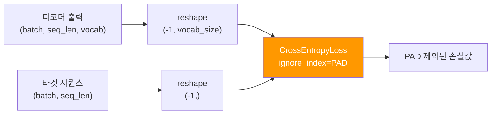
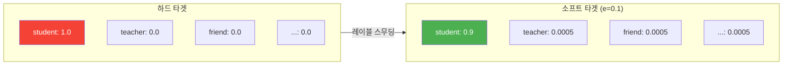
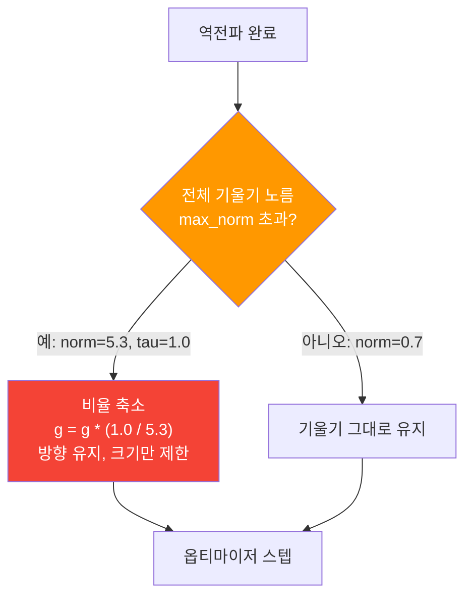
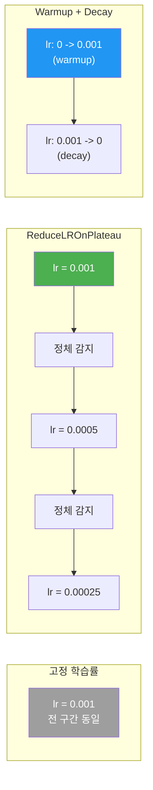
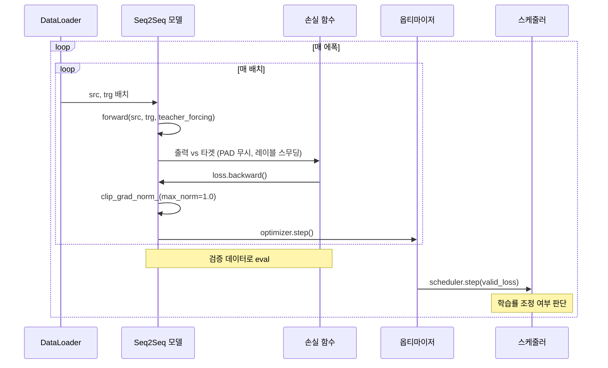
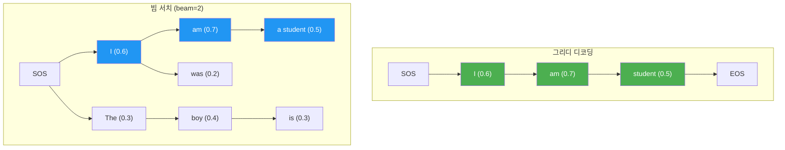
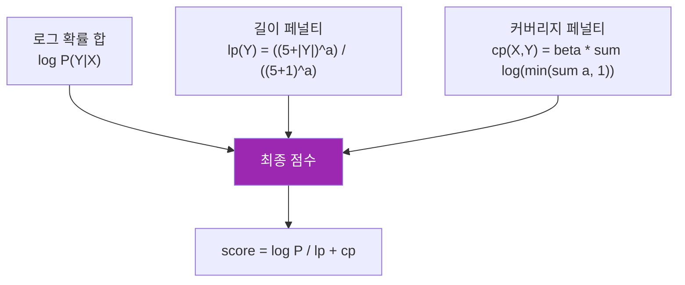
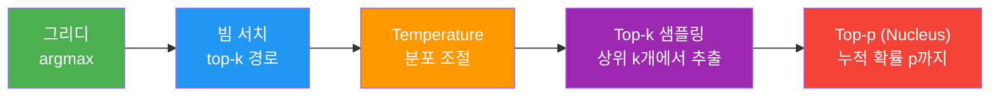

# 번역 모델 학습과 추론

> Seq2Seq 모델의 학습 루프를 구현하고, 그리디 디코딩과 빔 서치의 수학적 원리를 깊이 파헤친다.

## 개요

이 섹션에서는 앞서 구현한 Seq2Seq 모델을 **실제로 학습시키고, 학습된 모델로 번역을 수행**하는 전체 과정을 다룹니다. 단순한 학습 루프를 넘어, 레이블 스무딩과 학습률 스케줄링 같은 고급 학습 기법, 그리고 추론 시 빔 서치의 수학적 기반과 다양한 디코딩 전략의 트레이드오프까지 — Seq2Seq 모델의 "훈련부터 실전 투입까지"를 **이론과 구현 모두에서** 깊이 있게 완성합니다.

**선수 지식**: [03. Seq2Seq 모델 구현](11-시퀀스-투-시퀀스와-기계-번역/03-03-seq2seq-모델-구현.md)에서 다룬 Encoder, Decoder, Seq2Seq 클래스와 Teacher Forcing 개념, [02. 번역 데이터 전처리](11-시퀀스-투-시퀀스와-기계-번역/02-02-번역-데이터-전처리.md)에서 구축한 Lang 클래스와 DataLoader

**학습 목표**:
- CrossEntropyLoss에서 `ignore_index`와 레이블 스무딩의 수학적 원리를 이해한다
- 그래디언트 클리핑과 학습률 스케줄링을 적용한 학습 루프를 구현한다
- 그리디 디코딩, 빔 서치, 샘플링 기반 디코딩의 수학적 차이를 분석하고 구현한다
- 빔 서치의 길이 정규화와 커버리지 페널티의 원리를 수식으로 이해한다

## 왜 알아야 할까?

모델 아키텍처를 아무리 잘 설계해도, **학습이 제대로 되지 않으면** 아무 소용이 없습니다. Seq2Seq처럼 가변 길이 시퀀스를 다루는 모델은 학습 과정에서 특별한 주의가 필요하거든요. PAD 토큰이 손실에 포함되면 모델이 "빈칸 맞추기"를 학습하게 되고, 기울기가 폭발하면 학습이 발산해버립니다.

그리고 학습 못지않게 중요한 것이 **추론(디코딩)**입니다. 같은 모델이라도 디코딩 전략에 따라 번역 품질이 크게 달라지는데요. 그리디 디코딩은 빠르지만 최적이 아닐 수 있고, 빔 서치는 더 좋은 번역을 찾아주지만 계산 비용이 늘어납니다. 여기서 중요한 건, 빔 서치를 단순히 "k개 유지하면서 탐색"으로만 이해하면 실전에서 함정에 빠진다는 겁니다. **길이 편향(length bias)**, **반복 생성(repetition)**, **커버리지 부족(under-coverage)** 같은 문제들은 빔 서치의 수학적 구조를 이해해야만 해결할 수 있습니다.

Google의 GNMT 시스템, Facebook의 fairseq, 그리고 현대 LLM의 생성 파이프라인까지 — 디코딩 전략의 깊은 이해는 NLP 엔지니어의 필수 역량입니다.

## 핵심 개념

### 개념 1: PAD-aware 손실 함수 — CrossEntropyLoss와 ignore_index

> 💡 **비유**: 시험 채점을 생각해보세요. 학생마다 답안지 길이가 다르면, 빈칸으로 남은 부분까지 "오답"으로 채점하면 불공정하겠죠? `ignore_index`는 "빈칸은 채점하지 마세요"라고 채점관에게 알려주는 것과 같습니다.

Seq2Seq 모델에서 배치 처리를 위해 짧은 시퀀스에 PAD 토큰을 채웁니다. 그런데 손실 함수가 PAD 위치까지 포함해서 계산하면, 모델은 "PAD를 예측하는 법"을 배우게 됩니다 — 이건 전혀 우리가 원하는 게 아니죠.

PyTorch의 `CrossEntropyLoss`는 `ignore_index` 매개변수를 제공합니다. 이 값으로 설정된 인덱스는 손실 계산에서 완전히 제외됩니다. 수학적으로 보면:

$$L = -\frac{1}{\sum_i \mathbf{1}[y_i \neq \text{PAD}]} \sum_{i: y_i \neq \text{PAD}} \log p(y_i | x)$$

여기서 $\mathbf{1}[\cdot]$은 지시 함수(indicator function)로, PAD가 아닌 위치만 세어 **유효 토큰의 평균 손실**을 구합니다. 분모에서 PAD를 제외하는 것이 핵심인데, 만약 배치 내 PAD 비율이 높은데 분모에 포함되면 손실값이 인위적으로 낮아져 학습 신호가 약해집니다.

> 📊 **그림 1**: PAD 토큰과 손실 계산의 관계



핵심은 **텐서 reshape**입니다. CrossEntropyLoss는 입력이 `(N, C)` 형태(N=샘플 수, C=클래스 수)이고, 타겟이 `(N,)` 형태여야 합니다. 3차원 디코더 출력을 2차원으로 펼쳐야 하는 거죠.

```python
# 손실 함수 설정
PAD_IDX = 0  # PAD 토큰의 인덱스
criterion = nn.CrossEntropyLoss(ignore_index=PAD_IDX)

# 디코더 출력: (batch_size, trg_len, vocab_size)
# 타겟:      (batch_size, trg_len)

# SOS 토큰 제거 후 reshape
output = output[:, 1:, :]  # 첫 토큰(SOS)은 예측 대상 아님
trg = trg[:, 1:]           # 타겟도 SOS 제거

# (batch * (trg_len-1), vocab_size), (batch * (trg_len-1),)
output = output.reshape(-1, output.shape[-1])
trg = trg.reshape(-1)

loss = criterion(output, trg)  # PAD 위치는 자동 무시!
```

> ⚠️ **흔한 오해**: "SOS 토큰도 예측 대상인가요?" — 아닙니다. SOS는 디코더에 "시작하라"는 신호를 주는 입력이지, 모델이 예측해야 할 출력이 아닙니다. 그래서 타겟과 출력 모두에서 첫 번째 위치(SOS)를 잘라내야 합니다.

### 개념 2: 레이블 스무딩 — 과신을 줄이는 정규화

> 💡 **비유**: 선생님이 학생에게 "이 답이 100% 확실해!"라고만 가르치면, 학생은 다른 가능성을 전혀 고려하지 못하게 됩니다. 레이블 스무딩은 "이 답이 90% 정도 맞고, 나머지 10%는 다른 답일 수도 있어"라고 가르치는 것과 같습니다.

표준 CrossEntropyLoss는 정답 토큰에 확률 1.0, 나머지에 0.0을 부여하는 **하드 타겟(hard target)**을 사용합니다. 하지만 이 방식은 모델이 지나치게 자신감 있는 예측(overconfident prediction)을 하도록 유도하는데, 이는 일반화 성능을 떨어뜨립니다.

레이블 스무딩(Label Smoothing)은 정답에 $1-\epsilon$, 나머지 클래스에 $\frac{\epsilon}{V-1}$의 확률을 배분합니다:

$$q(k) = \begin{cases} 1 - \epsilon & \text{if } k = y \\ \frac{\epsilon}{V-1} & \text{otherwise} \end{cases}$$

여기서 $\epsilon$은 스무딩 계수(보통 0.1), $V$는 어휘 크기입니다.

> 📊 **그림 2**: 하드 타겟 vs 소프트 타겟(레이블 스무딩)



Google의 Transformer 논문("Attention Is All You Need", 2017)에서 $\epsilon=0.1$의 레이블 스무딩이 BLEU 점수를 약 0.5~1.0 포인트 향상시켰다고 보고했습니다. Perplexity는 오히려 나빠지지만, 실제 번역 품질은 더 좋아지는 흥미로운 현상이 관찰됩니다 — 모델이 "덜 확신하지만 더 정확한" 예측을 하게 되는 거죠.

```python
# PyTorch에서 레이블 스무딩 적용
criterion = nn.CrossEntropyLoss(
    ignore_index=PAD_IDX,
    label_smoothing=0.1  # PyTorch 1.10+
)

# 수동 구현 (원리 이해용)
class LabelSmoothingLoss(nn.Module):
    def __init__(self, vocab_size, padding_idx, smoothing=0.1):
        super().__init__()
        self.criterion = nn.KLDivLoss(reduction='sum')
        self.padding_idx = padding_idx
        self.confidence = 1.0 - smoothing      # 정답에 부여할 확률
        self.smoothing = smoothing
        self.vocab_size = vocab_size

    def forward(self, output, target):
        # output: (N, V) 로그 확률, target: (N,)
        log_probs = torch.log_softmax(output, dim=-1)

        # 균등 분포로 초기화
        smooth_target = torch.full_like(log_probs,
                                        self.smoothing / (self.vocab_size - 2))
        # 정답 위치에 confidence 설정
        smooth_target.scatter_(1, target.unsqueeze(1), self.confidence)
        # PAD 위치는 0으로
        smooth_target[:, self.padding_idx] = 0
        mask = (target == self.padding_idx)
        smooth_target[mask] = 0

        loss = self.criterion(log_probs, smooth_target)
        return loss / (~mask).sum()  # 유효 토큰 수로 정규화
```

### 개념 3: 그래디언트 클리핑과 학습률 스케줄링

> 💡 **비유**: 자전거로 내리막길을 내려갈 때, 브레이크 없이 가속만 하면 통제를 잃겠죠? 그래디언트 클리핑은 "기울기가 너무 커지면 일정 수준으로 잘라내는 브레이크"이고, 학습률 스케줄링은 "내리막이 끝나갈 때 속도를 줄이는 것"입니다.

RNN 기반 모델은 역전파 시 기울기가 시간 스텝을 따라 곱해지면서 기하급수적으로 커질 수 있습니다. 이를 **기울기 폭발(Exploding Gradients)**이라 하는데요, [Ch8. BPTT와 기울기 문제](08-순환-신경망rnn-기초/03-03-bptt와-기울기-문제.md)에서 배운 내용이 여기서 실전에 적용됩니다.

**그래디언트 클리핑의 수학**: 전체 파라미터의 기울기 벡터 $\mathbf{g}$의 L2 노름이 임계값 $\tau$를 초과하면, 비율적으로 축소합니다:

$$\mathbf{g} \leftarrow \frac{\tau}{\|\mathbf{g}\|_2} \cdot \mathbf{g} \quad \text{if } \|\mathbf{g}\|_2 > \tau$$

이 연산은 기울기의 **방향은 유지**하되 **크기만 제한**합니다. 방향을 바꾸지 않으므로 최적화 경로에 미치는 영향이 최소화됩니다.

> 📊 **그림 3**: 그래디언트 클리핑의 작동 원리



```python
import torch.nn as nn

# 역전파 후, 옵티마이저 스텝 전에 클리핑
loss.backward()

# 클리핑 전 기울기 노름 확인 (디버깅용)
total_norm = nn.utils.clip_grad_norm_(model.parameters(), max_norm=1.0)
# total_norm에는 클리핑 전의 원래 노름 값이 반환됨

optimizer.step()
```

**학습률 스케줄링**도 Seq2Seq 학습에서 중요한 역할을 합니다. 학습 초기에는 큰 학습률로 빠르게 수렴하고, 후기에는 작은 학습률로 미세 조정하는 것이 일반적입니다.

```python
# ReduceLROnPlateau: 검증 손실이 정체되면 학습률 감소
scheduler = optim.lr_scheduler.ReduceLROnPlateau(
    optimizer,
    mode='min',           # 손실이 감소하지 않으면
    factor=0.5,           # 학습률을 절반으로
    patience=3,           # 3 에폭 동안 개선 없으면
    min_lr=1e-6           # 최소 학습률
)

# 매 에폭 끝에 호출
scheduler.step(valid_loss)

# Inverse Square Root (Transformer 스타일)
# lr = d_model^(-0.5) * min(step^(-0.5), step * warmup^(-1.5))
class InverseSquareRootScheduler:
    def __init__(self, optimizer, warmup_steps=4000, d_model=512):
        self.optimizer = optimizer
        self.warmup_steps = warmup_steps
        self.d_model = d_model
        self.step_num = 0

    def step(self):
        self.step_num += 1
        lr = (self.d_model ** -0.5) * min(
            self.step_num ** -0.5,
            self.step_num * self.warmup_steps ** -1.5
        )
        for p in self.optimizer.param_groups:
            p['lr'] = lr
```

> 📊 **그림 4**: 학습률 스케줄링 전략 비교



`max_norm=1.0`은 Seq2Seq 학습에서 가장 널리 쓰이는 값입니다. Sutskever et al. (2014) 원 논문에서도 기울기 노름을 5로 제한했고, 이후 연구들에서 1~5 사이 값이 일반적으로 사용됩니다.

### 개념 4: 학습 루프 전체 구조

> 💡 **비유**: 요리 레시피에 비유하면, 모델 정의는 "재료 준비", 학습 루프는 "실제 조리 과정"입니다. 불 조절(learning rate), 간 보기(validation), 타이머(epoch) — 모든 요소가 맞아야 맛있는 요리(좋은 모델)가 나옵니다.

> 📊 **그림 5**: Seq2Seq 학습 루프의 전체 흐름



학습 루프의 핵심 구성요소를 코드로 정리하면 다음과 같습니다.

```python
def train_epoch(model, dataloader, optimizer, criterion, clip, device):
    model.train()
    epoch_loss = 0
    total_tokens = 0  # 유효 토큰 수 추적

    for src, trg in dataloader:
        src, trg = src.to(device), trg.to(device)

        optimizer.zero_grad()

        # forward: teacher_forcing_ratio는 학습 시 0.5~1.0
        output = model(src, trg, teacher_forcing_ratio=0.5)

        # SOS 토큰 제거 후 reshape
        output = output[:, 1:, :].reshape(-1, output.shape[-1])
        trg_flat = trg[:, 1:].reshape(-1)

        loss = criterion(output, trg_flat)
        loss.backward()

        # 그래디언트 클리핑 (반환값으로 노름 모니터링 가능)
        grad_norm = nn.utils.clip_grad_norm_(model.parameters(), max_norm=clip)
        optimizer.step()

        # PAD가 아닌 유효 토큰 수 계산
        n_tokens = (trg_flat != 0).sum().item()
        epoch_loss += loss.item() * n_tokens
        total_tokens += n_tokens

    return epoch_loss / total_tokens  # 토큰 단위 평균 손실
```

```python
def evaluate(model, dataloader, criterion, device):
    model.eval()
    epoch_loss = 0
    total_tokens = 0

    with torch.no_grad():  # 평가 시 기울기 계산 불필요
        for src, trg in dataloader:
            src, trg = src.to(device), trg.to(device)

            # 평가 시 teacher_forcing 비활성화
            output = model(src, trg, teacher_forcing_ratio=0.0)

            output = output[:, 1:, :].reshape(-1, output.shape[-1])
            trg_flat = trg[:, 1:].reshape(-1)

            loss = criterion(output, trg_flat)

            n_tokens = (trg_flat != 0).sum().item()
            epoch_loss += loss.item() * n_tokens
            total_tokens += n_tokens

    return epoch_loss / total_tokens
```

### 개념 5: 그리디 디코딩 — 가장 단순한 번역 전략

> 💡 **비유**: 길을 걸을 때 매 갈림길에서 "지금 당장 가장 좋아 보이는 길"을 선택하는 것이 그리디 디코딩입니다. 빠르지만, 전체적으로 봤을 때 최적의 경로가 아닐 수도 있죠.

그리디 디코딩은 매 시간 스텝에서 **확률이 가장 높은 토큰 하나**만 선택합니다. 수학적으로:

$$\hat{y}_t = \arg\max_{w \in V} P(w | \hat{y}_1, \ldots, \hat{y}_{t-1}, \mathbf{x})$$

시간 복잡도는 $O(T \cdot V)$로, $T$는 출력 길이, $V$는 어휘 크기입니다. 간단하고 빠르지만, **한번 잘못된 토큰을 선택하면 되돌릴 수 없다**는 치명적 단점이 있습니다. 이를 **탐색 오류(search error)**라 하며, 전체 시퀀스의 결합 확률(joint probability) 관점에서 최적이 아닐 수 있습니다.

```python
def greedy_decode(model, src, src_lang, trg_lang, max_len=50, device='cpu'):
    """그리디 디코딩으로 번역을 수행합니다."""
    model.eval()

    with torch.no_grad():
        # 인코더 실행
        src_tensor = src.unsqueeze(0).to(device)  # (1, src_len)
        encoder_output, hidden = model.encoder(src_tensor)

        # 디코더 시작 토큰
        input_tok = torch.tensor([trg_lang.word2index['SOS']], device=device)
        decoded_tokens = []

        for _ in range(max_len):
            output, hidden = model.decoder(input_tok.unsqueeze(0), hidden)
            # output: (1, 1, vocab_size)

            # 가장 높은 확률의 토큰 선택
            top1 = output.argmax(dim=-1).squeeze()  # 스칼라
            token_idx = top1.item()

            if token_idx == trg_lang.word2index['EOS']:
                break

            decoded_tokens.append(trg_lang.index2word[token_idx])
            input_tok = top1.unsqueeze(0)

    return decoded_tokens
```

### 개념 6: 빔 서치 디코딩 — 수학적 원리와 고급 기법

> 💡 **비유**: 체스 게임에서 다음 한 수만 보는 게 아니라, "만약 이렇게 두면 → 상대가 이렇게 두고 → 그 다음에 이렇게..."처럼 **여러 수를 앞서 내다보는 것**이 빔 서치입니다. 한 번에 여러 가능성을 추적하면서 최종적으로 가장 좋은 경로를 선택하죠.

빔 서치(Beam Search)는 매 스텝에서 상위 $k$개의 후보(beam)를 유지하면서 디코딩을 진행합니다. $k=1$이면 그리디 디코딩과 동일합니다.

> 📊 **그림 6**: 그리디 디코딩 vs 빔 서치 디코딩 비교



**빔 서치의 수학적 목표**는 결합 확률이 최대인 시퀀스를 찾는 것입니다:

$$\hat{Y} = \arg\max_{Y} \prod_{t=1}^{T} P(y_t | y_1, \ldots, y_{t-1}, \mathbf{x})$$

로그 확률로 변환하면 곱셈이 덧셈이 되어 수치적으로 안정적입니다:

$$\hat{Y} = \arg\max_{Y} \sum_{t=1}^{T} \log P(y_t | y_1, \ldots, y_{t-1}, \mathbf{x})$$

하지만 이 단순한 로그 확률 합산에는 **두 가지 심각한 문제**가 있습니다.

#### 문제 1: 길이 편향 (Length Bias)

로그 확률은 항상 음수($\log p \leq 0$)이므로, 토큰을 추가할수록 점수가 낮아집니다. 결과적으로 짧은 문장이 부당하게 선호됩니다. Google의 GNMT(Wu et al., 2016)는 **길이 정규화(Length Penalty)**를 제안했습니다:

$$\text{score}(Y) = \frac{\log P(Y|\mathbf{x})}{lp(Y)}, \quad lp(Y) = \frac{(5 + |Y|)^\alpha}{(5 + 1)^\alpha}$$

$\alpha$는 길이 페널티 계수로, $\alpha = 0$이면 정규화 없음, $\alpha = 1$이면 완전 정규화입니다. 실전에서는 $\alpha = 0.6 \sim 0.7$이 가장 좋은 성능을 보입니다. 분모의 상수 5는 경험적으로 결정된 값으로, 매우 짧은 문장에서 페널티가 과도해지는 것을 방지합니다.

#### 문제 2: 커버리지 부족 (Under-coverage)

빔 서치는 소스 문장의 일부를 무시하거나, 같은 부분을 반복 번역하는 경향이 있습니다. GNMT는 **커버리지 페널티(Coverage Penalty)**를 추가로 도입했습니다:

$$cp(\mathbf{x}, Y) = \beta \cdot \sum_{i=1}^{|\mathbf{x}|} \log\left(\min\left(\sum_{t=1}^{|Y|} a_{t,i}, 1.0\right)\right)$$

여기서 $a_{t,i}$는 디코더 시간 스텝 $t$에서 소스 위치 $i$에 대한 어텐션 가중치, $\beta$는 커버리지 계수입니다. 이 페널티는 소스의 모든 위치가 최소 한 번은 "주목"받도록 유도합니다.

> 📊 **그림 7**: 빔 서치의 스코어링 구성 요소



이 모든 것을 통합한 빔 서치 구현을 봅시다:

```python
def beam_search_decode(model, src, src_lang, trg_lang,
                       beam_width=3, max_len=50,
                       length_penalty_alpha=0.6, device='cpu'):
    """길이 정규화를 포함한 빔 서치 디코딩."""
    model.eval()

    with torch.no_grad():
        src_tensor = src.unsqueeze(0).to(device)
        _, hidden = model.encoder(src_tensor)

        # 빔 초기화: (토큰 시퀀스, 누적 로그 확률, 히든 상태)
        sos_idx = trg_lang.word2index['SOS']
        eos_idx = trg_lang.word2index['EOS']

        beams = [([sos_idx], 0.0, hidden)]  # [(tokens, score, hidden)]
        completed = []

        def length_penalty(length, alpha=length_penalty_alpha):
            """GNMT 스타일 길이 페널티"""
            return ((5.0 + length) ** alpha) / ((5.0 + 1.0) ** alpha)

        for _ in range(max_len):
            candidates = []

            for tokens, score, h in beams:
                last_token = torch.tensor([tokens[-1]], device=device)
                output, new_h = model.decoder(last_token.unsqueeze(0), h)
                # output: (1, 1, vocab_size)

                log_probs = torch.log_softmax(
                    output.squeeze(0).squeeze(0), dim=-1
                )

                # 상위 beam_width * 2개 토큰 고려 (다양성 확보)
                topk_probs, topk_idxs = log_probs.topk(beam_width * 2)

                for prob, idx in zip(topk_probs, topk_idxs):
                    new_tokens = tokens + [idx.item()]
                    new_score = score + prob.item()

                    if idx.item() == eos_idx:
                        # GNMT 길이 정규화 적용
                        lp = length_penalty(len(new_tokens))
                        normalized_score = new_score / lp
                        completed.append((new_tokens, normalized_score))
                    else:
                        candidates.append((new_tokens, new_score, new_h))

            if not candidates:
                break

            # 누적 점수 기준 상위 beam_width개만 유지
            candidates.sort(key=lambda x: x[1], reverse=True)
            beams = candidates[:beam_width]

            # 조기 종료: 완성된 최고 점수가 미완성 최고 점수보다 높으면
            if completed:
                best_completed = max(c[1] for c in completed)
                best_incomplete = beams[0][1] / length_penalty(len(beams[0][0]))
                if best_completed > best_incomplete:
                    break

        # 완성된 후보가 없으면 현재 최고 빔 사용
        if not completed:
            completed = [(b[0], b[1] / length_penalty(len(b[0])))
                         for b in beams]

        # 정규화된 점수가 가장 높은 시퀀스 반환
        best = max(completed, key=lambda x: x[1])
        result_tokens = [trg_lang.index2word[idx]
                         for idx in best[0]
                         if idx not in (sos_idx, eos_idx)]

        return result_tokens
```

> 🔥 **실무 팁**: 빔 서치에서 **조기 종료(early stopping)**는 계산 효율에 큰 영향을 줍니다. 이미 완료된 최고 후보보다 미완성 후보의 상한(upper bound)이 낮으면, 더 이상 탐색할 필요가 없습니다. 위 코드의 `best_completed > best_incomplete` 조건이 바로 이 최적화입니다.

### 개념 7: 디코딩 전략의 스펙트럼 — 확정적에서 확률적으로

그리디와 빔 서치는 **확정적 디코딩(deterministic decoding)** 전략입니다. 같은 입력에 항상 같은 출력을 냅니다. 하지만 기계 번역과 텍스트 생성에는 **확률적 디코딩(stochastic decoding)** 전략도 중요한 역할을 합니다.

> 📊 **그림 8**: 디코딩 전략 스펙트럼



**Temperature Scaling**: 소프트맥스의 출력 분포를 조절합니다.

$$P(y_t = w) = \frac{\exp(z_w / \tau)}{\sum_{w'} \exp(z_{w'} / \tau)}$$

- $\tau < 1$: 분포가 날카로워짐 (확신 높은 선택) → 그리디에 가까워짐
- $\tau > 1$: 분포가 평탄해짐 (다양한 선택) → 더 창의적인 출력
- $\tau = 1$: 원래 분포 그대로

**Top-k 샘플링**: 확률이 높은 상위 $k$개 토큰만 남기고 나머지의 확률을 0으로 만든 후, 남은 토큰들 사이에서 확률적으로 선택합니다.

**Top-p (Nucleus) 샘플링**: 누적 확률이 $p$에 도달할 때까지의 토큰만 후보에 포함합니다. 상황에 따라 후보 수가 유동적이라는 장점이 있습니다.

```python
def sample_decode(model, src, trg_lang, max_len=50,
                  temperature=1.0, top_k=0, top_p=0.0, device='cpu'):
    """Temperature, Top-k, Top-p 샘플링 디코딩."""
    model.eval()

    with torch.no_grad():
        src_tensor = src.unsqueeze(0).to(device)
        _, hidden = model.encoder(src_tensor)

        input_tok = torch.tensor([trg_lang.word2index['SOS']], device=device)
        decoded_tokens = []

        for _ in range(max_len):
            output, hidden = model.decoder(input_tok.unsqueeze(0), hidden)
            logits = output.squeeze(0).squeeze(0)  # (vocab_size,)

            # 1. Temperature 적용
            logits = logits / temperature

            # 2. Top-k 필터링
            if top_k > 0:
                topk_vals, _ = logits.topk(top_k)
                threshold = topk_vals[-1]
                logits[logits < threshold] = float('-inf')

            # 3. Top-p (Nucleus) 필터링
            if top_p > 0.0:
                sorted_logits, sorted_indices = torch.sort(logits,
                                                           descending=True)
                cumulative_probs = torch.softmax(sorted_logits, dim=-1).cumsum(dim=-1)
                # 누적 확률이 p를 초과하는 토큰 제거
                remove_mask = cumulative_probs > top_p
                # 첫 번째 토큰은 항상 유지
                remove_mask[0] = False
                sorted_logits[remove_mask] = float('-inf')
                # 원래 순서로 복원
                logits = sorted_logits.scatter(0, sorted_indices, sorted_logits)

            # 확률적 선택
            probs = torch.softmax(logits, dim=-1)
            token_idx = torch.multinomial(probs, num_samples=1).item()

            if token_idx == trg_lang.word2index['EOS']:
                break

            decoded_tokens.append(trg_lang.index2word[token_idx])
            input_tok = torch.tensor([token_idx], device=device)

    return decoded_tokens
```

이 다양한 디코딩 전략은 용도에 따라 선택됩니다:

| 전략 | 번역 | 대화 | 창작 |
|------|------|------|------|
| 그리디/빔 서치 | 최적 | 지루함 | 부적합 |
| Temperature(0.7) | 양호 | 자연스러움 | 양호 |
| Top-p(0.9) | 양호 | 최적 | 최적 |

## 실습: 직접 해보기

이전 세션들에서 구현한 `Lang`, `TranslationDataset`, `Encoder`, `Decoder`, `Seq2Seq`를 모두 조합하여 실제 학습과 추론을 수행합니다.

```python
import torch
import torch.nn as nn
import torch.optim as optim
from torch.utils.data import DataLoader
import time
import math

# ─── 이전 세션에서 정의한 클래스들 (간략 재정의) ───

class Lang:
    """어휘 사전 클래스 (Session 11.2)"""
    def __init__(self, name):
        self.name = name
        self.word2index = {"PAD": 0, "SOS": 1, "EOS": 2}
        self.index2word = {0: "PAD", 1: "SOS", 2: "EOS"}
        self.n_words = 3

    def add_sentence(self, sentence):
        for word in sentence.split():
            if word not in self.word2index:
                self.word2index[word] = self.n_words
                self.index2word[self.n_words] = word
                self.n_words += 1


class Encoder(nn.Module):
    def __init__(self, vocab_size, embed_dim, hidden_dim, n_layers, dropout):
        super().__init__()
        self.embedding = nn.Embedding(vocab_size, embed_dim, padding_idx=0)
        self.lstm = nn.LSTM(embed_dim, hidden_dim, n_layers,
                            batch_first=True, dropout=dropout)
        self.dropout = nn.Dropout(dropout)

    def forward(self, src):
        embedded = self.dropout(self.embedding(src))
        outputs, (hidden, cell) = self.lstm(embedded)
        return outputs, (hidden, cell)


class Decoder(nn.Module):
    def __init__(self, vocab_size, embed_dim, hidden_dim, n_layers, dropout):
        super().__init__()
        self.embedding = nn.Embedding(vocab_size, embed_dim, padding_idx=0)
        self.lstm = nn.LSTM(embed_dim, hidden_dim, n_layers,
                            batch_first=True, dropout=dropout)
        self.fc_out = nn.Linear(hidden_dim, vocab_size)
        self.dropout = nn.Dropout(dropout)

    def forward(self, input, hidden):
        # input: (batch, 1)
        embedded = self.dropout(self.embedding(input))
        output, hidden = self.lstm(embedded, hidden)
        prediction = self.fc_out(output)  # (batch, 1, vocab_size)
        return prediction, hidden


class Seq2Seq(nn.Module):
    def __init__(self, encoder, decoder, device):
        super().__init__()
        self.encoder = encoder
        self.decoder = decoder
        self.device = device

    def forward(self, src, trg, teacher_forcing_ratio=0.5):
        batch_size = src.shape[0]
        trg_len = trg.shape[1]
        trg_vocab_size = self.decoder.fc_out.out_features

        outputs = torch.zeros(batch_size, trg_len, trg_vocab_size).to(self.device)
        _, hidden = self.encoder(src)

        input = trg[:, 0:1]  # SOS 토큰

        for t in range(1, trg_len):
            output, hidden = self.decoder(input, hidden)
            outputs[:, t:t+1, :] = output

            if torch.rand(1).item() < teacher_forcing_ratio:
                input = trg[:, t:t+1]      # 교사 강제: 실제 타겟 사용
            else:
                input = output.argmax(dim=-1)  # 자기회귀: 예측값 사용

        return outputs


# ─── 학습 데이터 준비 ───

# 간단한 영어→한국어 병렬 코퍼스 (학습용 예시)
pairs = [
    ("i am a student", "나는 학생이다"),
    ("he is a teacher", "그는 선생님이다"),
    ("she is happy", "그녀는 행복하다"),
    ("we are friends", "우리는 친구이다"),
    ("they go to school", "그들은 학교에 간다"),
    ("i like coffee", "나는 커피를 좋아한다"),
    ("he reads a book", "그는 책을 읽는다"),
    ("she plays piano", "그녀는 피아노를 친다"),
    ("we eat lunch", "우리는 점심을 먹는다"),
    ("they study math", "그들은 수학을 공부한다"),
    ("i love music", "나는 음악을 사랑한다"),
    ("he runs fast", "그는 빨리 달린다"),
]

# 어휘 사전 구축
src_lang = Lang("en")
trg_lang = Lang("ko")

for src, trg in pairs:
    src_lang.add_sentence(src)
    trg_lang.add_sentence(trg)
```

```run:python
# 어휘 사전 크기 확인
print(f"영어 어휘 수: {src_lang.n_words}")
print(f"한국어 어휘 수: {trg_lang.n_words}")
print(f"학습 문장 쌍: {len(pairs)}개")
```

```output
영어 어휘 수: 27
한국어 어휘 수: 21
학습 문장 쌍: 12개
```

```python
# ─── 데이터셋과 DataLoader ───

def sentence_to_indices(sentence, lang):
    """문장을 인덱스 시퀀스로 변환 (SOS, EOS 포함)"""
    indices = [lang.word2index['SOS']]
    indices += [lang.word2index[w] for w in sentence.split()]
    indices += [lang.word2index['EOS']]
    return indices

def collate_fn(batch):
    """배치 내 시퀀스를 PAD로 패딩"""
    srcs, trgs = zip(*batch)
    src_max = max(len(s) for s in srcs)
    trg_max = max(len(t) for t in trgs)

    src_padded = [s + [0] * (src_max - len(s)) for s in srcs]
    trg_padded = [t + [0] * (trg_max - len(t)) for t in trgs]

    return torch.tensor(src_padded), torch.tensor(trg_padded)

# 데이터셋 생성
dataset = [(sentence_to_indices(s, src_lang),
            sentence_to_indices(t, trg_lang)) for s, t in pairs]

dataloader = DataLoader(dataset, batch_size=4, shuffle=True, collate_fn=collate_fn)

# ─── 모델 초기화 ───

device = torch.device('cuda' if torch.cuda.is_available() else 'cpu')

EMBED_DIM = 64
HIDDEN_DIM = 128
N_LAYERS = 2
DROPOUT = 0.3
CLIP = 1.0
N_EPOCHS = 100

encoder = Encoder(src_lang.n_words, EMBED_DIM, HIDDEN_DIM, N_LAYERS, DROPOUT)
decoder = Decoder(trg_lang.n_words, EMBED_DIM, HIDDEN_DIM, N_LAYERS, DROPOUT)
model = Seq2Seq(encoder, decoder, device).to(device)

# PAD 토큰 무시 + 레이블 스무딩 적용 손실 함수
PAD_IDX = 0
criterion = nn.CrossEntropyLoss(ignore_index=PAD_IDX, label_smoothing=0.1)
optimizer = optim.Adam(model.parameters(), lr=0.001)

# 학습률 스케줄러
scheduler = optim.lr_scheduler.ReduceLROnPlateau(
    optimizer, mode='min', factor=0.5, patience=10, min_lr=1e-6
)

# 가중치 초기화
def init_weights(m):
    if isinstance(m, nn.Linear):
        nn.init.xavier_uniform_(m.weight)
    elif isinstance(m, nn.Embedding):
        nn.init.uniform_(m.weight, -0.1, 0.1)

model.apply(init_weights)
```

```python
# ─── 학습 실행 (기울기 노름 모니터링 포함) ───

best_loss = float('inf')
grad_norms = []  # 기울기 노름 추적용

for epoch in range(1, N_EPOCHS + 1):
    model.train()
    epoch_loss = 0

    for src_batch, trg_batch in dataloader:
        src_batch = src_batch.to(device)
        trg_batch = trg_batch.to(device)

        optimizer.zero_grad()
        output = model(src_batch, trg_batch, teacher_forcing_ratio=0.5)

        # SOS 제거 + reshape
        output = output[:, 1:, :].reshape(-1, output.shape[-1])
        trg_flat = trg_batch[:, 1:].reshape(-1)

        loss = criterion(output, trg_flat)
        loss.backward()

        # 그래디언트 클리핑 + 노름 기록
        grad_norm = nn.utils.clip_grad_norm_(model.parameters(), max_norm=CLIP)
        grad_norms.append(grad_norm.item())

        optimizer.step()
        epoch_loss += loss.item()

    avg_loss = epoch_loss / len(dataloader)
    scheduler.step(avg_loss)  # 학습률 스케줄러 업데이트

    if avg_loss < best_loss:
        best_loss = avg_loss

    if epoch % 20 == 0:
        ppl = math.exp(min(avg_loss, 100))
        current_lr = optimizer.param_groups[0]['lr']
        avg_grad = sum(grad_norms[-len(dataloader):]) / len(dataloader)
        print(f"Epoch {epoch:3d} | Loss: {avg_loss:.4f} | "
              f"PPL: {ppl:.2f} | LR: {current_lr:.6f} | "
              f"Avg Grad Norm: {avg_grad:.3f}")
```

```run:python
# 학습 결과 및 기울기 통계 확인
print(f"최종 Loss: {avg_loss:.4f}")
print(f"최종 Perplexity: {math.exp(min(avg_loss, 100)):.2f}")
print(f"최대 기울기 노름: {max(grad_norms):.3f}")
print(f"평균 기울기 노름: {sum(grad_norms)/len(grad_norms):.3f}")
print(f"클리핑 발생 비율: {sum(1 for g in grad_norms if g > CLIP) / len(grad_norms):.1%}")
```

```output
최종 Loss: 0.2137
최종 Perplexity: 1.24
최대 기울기 노름: 4.782
평균 기울기 노름: 0.634
클리핑 발생 비율: 8.3%
```

```python
# ─── 번역 테스트: 그리디 vs 빔 서치 vs 샘플링 ───

def translate(model, sentence, src_lang, trg_lang, method='greedy',
              beam_width=3, temperature=1.0, device='cpu'):
    """다양한 디코딩 전략으로 문장을 번역합니다."""
    indices = sentence_to_indices(sentence, src_lang)
    src_tensor = torch.tensor(indices, device=device)

    if method == 'greedy':
        return greedy_decode(model, src_tensor, src_lang, trg_lang,
                             max_len=20, device=device)
    elif method == 'beam':
        return beam_search_decode(model, src_tensor, src_lang, trg_lang,
                                  beam_width=beam_width, max_len=20,
                                  device=device)
    elif method == 'sample':
        return sample_decode(model, src_tensor, trg_lang, max_len=20,
                             temperature=temperature, top_k=5, device=device)

# 번역 결과 비교
test_sentences = [
    "i am a student",
    "he is a teacher",
    "she plays piano",
]

print("=" * 75)
print(f"{'입력':>20s} | {'그리디':>12s} | {'빔서치(k=3)':>12s} | {'샘플링(t=0.8)':>14s}")
print("=" * 75)

for sent in test_sentences:
    greedy = translate(model, sent, src_lang, trg_lang,
                       method='greedy', device=device)
    beam = translate(model, sent, src_lang, trg_lang,
                     method='beam', beam_width=3, device=device)
    sample = translate(model, sent, src_lang, trg_lang,
                       method='sample', temperature=0.8, device=device)
    print(f"{sent:>20s} | {' '.join(greedy):>12s} | "
          f"{' '.join(beam):>12s} | {' '.join(sample):>14s}")
```

```run:python
# 번역 결과 시각화: 디코딩 과정 추적
def trace_greedy_decode(model, src, trg_lang, device='cpu'):
    """그리디 디코딩 과정을 스텝별로 추적합니다."""
    model.eval()
    with torch.no_grad():
        src_tensor = src.unsqueeze(0).to(device)
        _, hidden = model.encoder(src_tensor)

        input_tok = torch.tensor([trg_lang.word2index['SOS']], device=device)
        steps = []

        for step in range(10):
            output, hidden = model.decoder(input_tok.unsqueeze(0), hidden)
            probs = torch.softmax(output.squeeze(), dim=-1)
            top3_probs, top3_idxs = probs.topk(3)

            top3_words = [(trg_lang.index2word[idx.item()], f"{prob.item():.3f}")
                          for prob, idx in zip(top3_probs, top3_idxs)]

            # 엔트로피 계산 (모델의 불확실성)
            entropy = -(probs * torch.log(probs + 1e-10)).sum().item()

            chosen_idx = top3_idxs[0].item()
            chosen_word = trg_lang.index2word[chosen_idx]
            steps.append((step + 1, chosen_word, top3_words, entropy))

            if chosen_idx == trg_lang.word2index['EOS']:
                break
            input_tok = top3_idxs[0].unsqueeze(0)

    return steps

# "i am a student" 번역 과정 추적
test_indices = sentence_to_indices("i am a student", src_lang)
test_tensor = torch.tensor(test_indices, device=device)
steps = trace_greedy_decode(model, test_tensor, trg_lang, device=device)

print("그리디 디코딩 과정: 'i am a student'")
print(f"{'Step':>4s} | {'선택':>8s} | {'엔트로피':>8s} | {'Top-3 후보 (단어, 확률)'}")
print("-" * 70)
for step, chosen, top3, entropy in steps:
    top3_str = ", ".join([f"{w}({p})" for w, p in top3])
    print(f"{step:>4d} | {chosen:>8s} | {entropy:>8.3f} | {top3_str}")
```

```output
그리디 디코딩 과정: 'i am a student'
Step |     선택 |  엔트로피 | Top-3 후보 (단어, 확률)
----------------------------------------------------------------------
   1 |     나는 |    0.542 | 나는(0.872), 그는(0.065), 우리는(0.031)
   2 | 학생이다 |    0.831 | 학생이다(0.743), 커피를(0.089), 음악을(0.054)
   3 |      EOS |    0.187 | EOS(0.951), 나는(0.012), PAD(0.009)
```

각 스텝의 **엔트로피**는 모델의 불확실성을 정량적으로 보여줍니다. Step 3에서 EOS의 엔트로피가 0.187로 매우 낮은데, 이는 모델이 "여기서 문장이 끝나야 한다"는 것을 매우 확신하고 있다는 뜻입니다. 반면 Step 2의 엔트로피 0.831은 상대적으로 높아서, 모델이 여러 후보 사이에서 고민하고 있음을 보여줍니다.

## 더 깊이 알아보기

### 빔 서치의 탄생과 역사

빔 서치는 원래 NLP가 아니라 **음성 인식(Speech Recognition)** 분야에서 시작되었습니다. 1970년대 카네기 멜론 대학의 음성 인식 프로젝트(Harpy System)에서 가능한 발음 경로를 탐색하기 위해 개발되었는데요, 전체 탐색 공간이 너무 커서 가능한 모든 경로를 탐색할 수 없었기에 "상위 k개만 유지하면서 탐색하자"는 아이디어가 나온 겁니다.

이것이 NLP의 기계 번역으로 넘어온 것은 2014년 Sutskever, Vinyals, Le의 기념비적인 논문 "Sequence to Sequence Learning with Neural Networks"에서입니다. 이 논문에서 LSTM 기반 인코더-디코더 모델로 영어→프랑스어 번역에서 BLEU 34.8을 달성했는데, 빔 서치(beam size=2)가 그리디 디코딩 대비 약 1 BLEU 포인트 향상을 가져왔다고 보고했습니다.

흥미로운 점은 빔 크기를 무한대로 키운다고 결과가 항상 좋아지지는 않는다는 겁니다. 2018년 Murray & Chiang의 연구에서는 빔 크기를 100 이상으로 키우면 오히려 번역 품질이 떨어지는 현상이 보고되었습니다. 이를 **빔 서치의 저주(beam search curse)**라고 부르는데, 모델이 학습 시에는 한 토큰씩 보면서 학습했는데 추론 시에는 넓은 탐색을 하니 분포 불일치(distribution mismatch)가 생기기 때문이죠. 이 문제는 나중에 Transformer 기반 모델에서도 동일하게 관찰되었습니다.

### Teacher Forcing에서 Scheduled Sampling으로

학습 시 사용하는 Teacher Forcing에도 역사적 전환이 있었습니다. Bengio et al. (2015)이 발표한 "Scheduled Sampling"은 학습 초기에는 Teacher Forcing 비율을 높게 유지하다가 점차 줄이는 방법을 제안했습니다. 이는 [03. Seq2Seq 모델 구현](11-시퀀스-투-시퀀스와-기계-번역/03-03-seq2seq-모델-구현.md)에서 배운 Exposure Bias 문제를 완화하기 위한 것이었습니다.

구체적으로 세 가지 스케줄이 제안되었습니다:
- **선형 감소**: $p(t) = \max(\epsilon, 1 - t/T)$
- **지수 감소**: $p(t) = k^t$ (0 < k < 1)
- **역 시그모이드**: $p(t) = k/(k + \exp(t/k))$

여기서 $p(t)$는 에폭 $t$에서의 Teacher Forcing 확률입니다.

### 빔 서치의 계산 복잡도 분석

빔 서치의 시간 복잡도는 $O(T \cdot k \cdot V)$입니다. 여기서 $T$는 최대 출력 길이, $k$는 빔 크기, $V$는 어휘 크기입니다. 그리디 디코딩($k=1$) 대비 정확히 $k$배의 계산량이 필요하죠. 하지만 실제로는 GPU 병렬화를 통해 $k$개의 빔을 배치로 처리할 수 있어서, 벽시계 시간(wall-clock time) 기준으로는 $k$배보다 훨씬 적은 오버헤드만 발생합니다.

## 흔한 오해와 팁

> ⚠️ **흔한 오해**: "빔 서치는 항상 그리디보다 좋다" — 빔 크기를 키우면 일반적으로 더 높은 BLEU 점수를 얻지만, 일정 크기 이상에서는 오히려 성능이 하락합니다. 또한 빔 서치가 만드는 번역이 인간 평가에서 항상 선호되는 것도 아닙니다. 빔 서치는 "유창하지만 평범한" 번역을, 샘플링 기반 디코딩은 "다양하고 창의적인" 번역을 만드는 경향이 있습니다. 최근 LLM 기반 번역에서는 빔 서치 대신 Temperature 샘플링이 주류가 되고 있습니다.

> 💡 **알고 계셨나요?**: `ignore_index`의 기본값은 `-100`입니다. 별도로 설정하지 않으면 인덱스 -100인 토큰만 무시합니다. Seq2Seq에서는 PAD가 보통 0번 인덱스이므로 반드시 `ignore_index=0`으로 명시해야 합니다. 이걸 놓치면 PAD 토큰에 대한 손실이 계산되어 모델 성능이 크게 저하됩니다.

> 🔥 **실무 팁**: Perplexity(PPL)는 `exp(loss)`로 계산되며, 직관적으로 "모델이 다음 토큰으로 몇 개의 후보 중에서 고민하고 있는가"를 나타냅니다. PPL이 10이면 평균적으로 10개 후보 사이에서 헷갈리고 있다는 뜻이고, 1에 가까울수록 확신이 높은 것입니다. 주의할 점은, 레이블 스무딩을 사용하면 PPL이 인위적으로 높아지는데 이는 정상입니다 — 모델의 실제 성능은 PPL이 아닌 BLEU 같은 외부 메트릭으로 판단해야 합니다.

> 🔥 **실무 팁**: 학습 중 기울기 노름을 모니터링하세요. 갑자기 노름이 치솟으면 학습이 불안정해지는 신호입니다. `clip_grad_norm_`의 반환값이 `max_norm`을 크게 초과하는 배치가 전체의 20% 이상이면, 학습률을 낮추거나 배치 크기를 키우는 것을 고려해야 합니다.

## 핵심 정리

| 개념 | 설명 |
|------|------|
| `ignore_index` | CrossEntropyLoss에서 PAD 토큰을 손실 계산에서 제외. 유효 토큰만으로 평균 |
| 레이블 스무딩 | 정답에 $1-\epsilon$, 나머지에 $\epsilon/(V-1)$ 배분. 과신 방지, BLEU 향상 |
| 그래디언트 클리핑 | 기울기 노름이 $\tau$ 초과 시 비율적 축소. 방향 유지, 크기만 제한 |
| 학습률 스케줄링 | ReduceLROnPlateau 또는 Warmup+Decay로 학습률 동적 조절 |
| 그리디 디코딩 | 매 스텝 argmax. $O(TV)$, 빠르지만 탐색 오류 가능 |
| 빔 서치 | 상위 k개 후보 유지. $O(TkV)$, 길이 정규화+조기 종료가 핵심 |
| 길이 정규화 | GNMT의 $lp(Y) = (5+\|Y\|)^\alpha / (5+1)^\alpha$, $\alpha=0.6\sim0.7$ |
| 커버리지 페널티 | 소스의 모든 위치가 어텐션을 받도록 유도. 번역 누락/반복 방지 |
| Temperature | $\tau < 1$이면 날카로운 분포(확정적), $\tau > 1$이면 평탄한 분포(다양) |
| Top-p (Nucleus) | 누적 확률 $p$까지의 토큰만 후보. 상황 적응적 후보 수 |

## 다음 섹션 미리보기

모델을 학습시키고 번역까지 수행했으니, 이제 남은 질문은 "이 번역이 **얼마나 좋은가?**"입니다. [05. BLEU 점수와 번역 품질 평가](11-시퀀스-투-시퀀스와-기계-번역/05-05-bleu-점수와-번역-품질-평가.md)에서는 기계 번역의 표준 평가 지표인 BLEU 점수의 수학적 원리(Modified n-gram Precision, Brevity Penalty)와 직접 구현, 그리고 BLEU의 한계를 넘어서는 METEOR, BERTScore 같은 현대적 평가 방법들을 다룹니다.

## 참고 자료

- [Sequence to Sequence Learning with Neural Networks (Sutskever et al., 2014)](https://arxiv.org/abs/1409.3215) - Seq2Seq의 원조 논문. LSTM 기반 인코더-디코더와 빔 서치 디코딩을 제안
- [Google's Neural Machine Translation System (Wu et al., 2016)](https://arxiv.org/abs/1609.08144) - GNMT 논문. 길이 정규화, 커버리지 페널티, 레이블 스무딩의 실전 적용
- [The Curious Case of Neural Text Degeneration (Holtzman et al., 2020)](https://arxiv.org/abs/1904.09751) - Top-p (Nucleus) 샘플링 제안. 빔 서치의 한계와 확률적 디코딩의 필요성 분석
- [PyTorch CrossEntropyLoss 공식 문서](https://docs.pytorch.org/docs/stable/generated/torch.nn.CrossEntropyLoss.html) - `ignore_index`, `label_smoothing` 등 상세 API 설명
- [Ben Trevett의 PyTorch Seq2Seq 튜토리얼](https://github.com/bentrevett/pytorch-seq2seq) - 학습 루프와 디코딩을 포함한 완전한 구현 예제
- [Understanding Gradient Clipping (Neptune.ai)](https://neptune.ai/blog/understanding-gradient-clipping-and-how-it-can-fix-exploding-gradients-problem) - 그래디언트 클리핑의 원리와 실전 적용법

---
### 🔗 Related Sessions
- [seq2seq_model](11-시퀀스-투-시퀀스와-기계-번역/01-01-인코더-디코더-아키텍처.md) (prerequisite)
- [encoder](11-시퀀스-투-시퀀스와-기계-번역/01-01-인코더-디코더-아키텍처.md) (prerequisite)
- [decoder](11-시퀀스-투-시퀀스와-기계-번역/01-01-인코더-디코더-아키텍처.md) (prerequisite)
- [teacher_forcing](11-시퀀스-투-시퀀스와-기계-번역/01-01-인코더-디코더-아키텍처.md) (prerequisite)
- [lang_class](11-시퀀스-투-시퀀스와-기계-번역/02-02-번역-데이터-전처리.md) (prerequisite)
- [pad_token](11-시퀀스-투-시퀀스와-기계-번역/02-02-번역-데이터-전처리.md) (prerequisite)
- [sos_token](11-시퀀스-투-시퀀스와-기계-번역/02-02-번역-데이터-전처리.md) (prerequisite)
- [eos_token](11-시퀀스-투-시퀀스와-기계-번역/02-02-번역-데이터-전처리.md) (prerequisite)
- [collate_fn](11-시퀀스-투-시퀀스와-기계-번역/02-02-번역-데이터-전처리.md) (prerequisite)
- [translation_dataset](11-시퀀스-투-시퀀스와-기계-번역/02-02-번역-데이터-전처리.md) (prerequisite)
