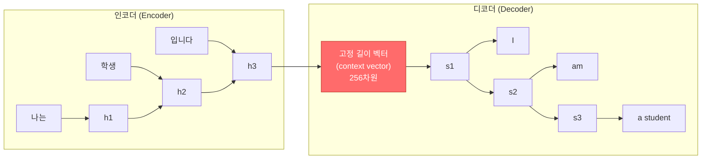
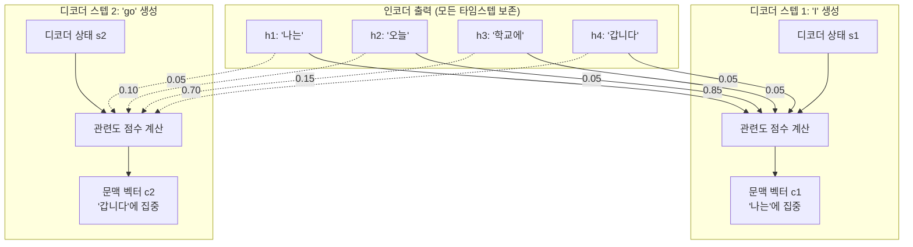
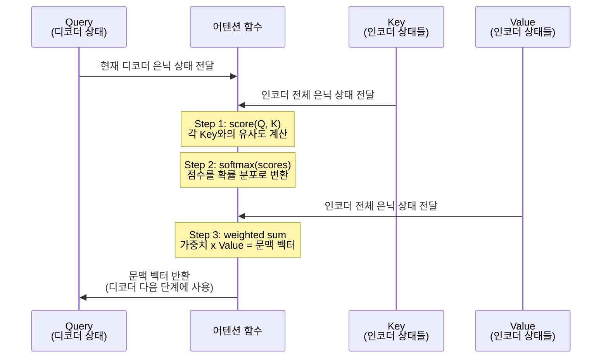
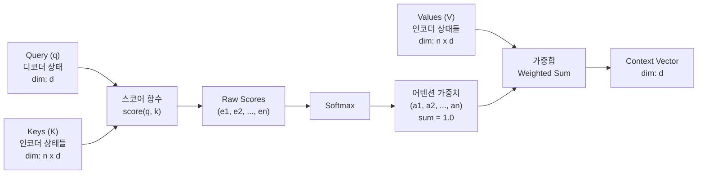
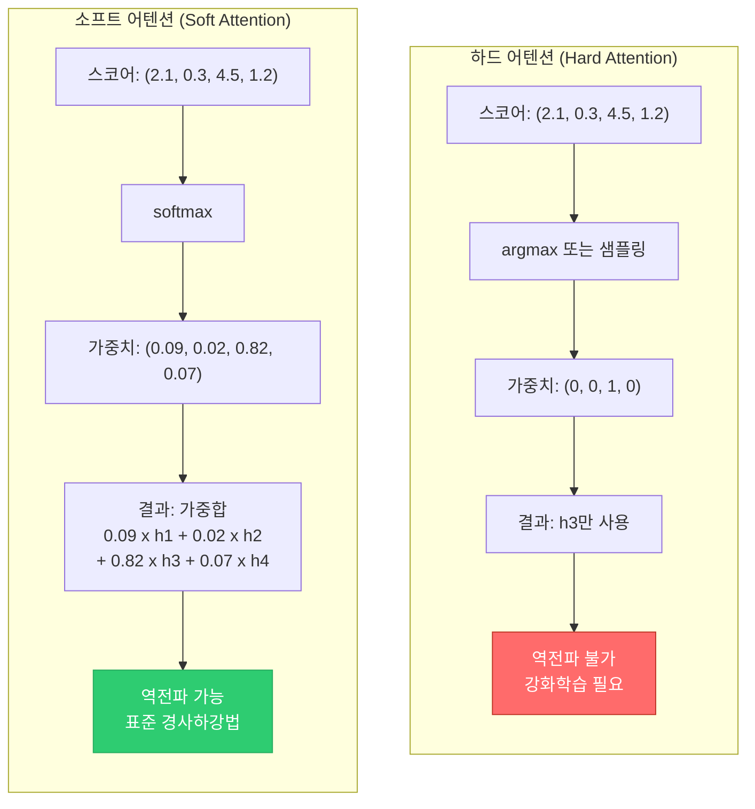

# 어텐션의 직관적 이해

> Seq2Seq의 정보 병목 문제를 해결하는 어텐션 메커니즘의 핵심 아이디어를 직관적으로 이해합니다.

## 개요

[Ch11](11-ch11-시퀀스-투-시퀀스와-기계-번역/03-03-seq2seq-모델-구현.md)에서 우리는 인코더-디코더 구조의 Seq2Seq 모델을 직접 구현해봤습니다. 입력 시퀀스를 LSTM 인코더로 읽어서 하나의 고정 길이 벡터로 압축하고, 디코더가 이 벡터를 기반으로 출력 시퀀스를 생성하는 구조였죠. Teacher Forcing과 빔 서치까지 적용해서 꽤 그럴듯한 번역 모델을 만들었습니다.

그런데 여기에 근본적인 한계가 있습니다. **아무리 긴 문장이라도 단 하나의 벡터로 압축해야 한다는 것**. 이 "정보 병목" 문제가 바로 어텐션 메커니즘이 탄생하게 된 직접적인 동기입니다.

이 세션에서는 어텐션의 수식을 파고들기 전에, **왜 어텐션이 필요한지**, **핵심 아이디어가 무엇인지**를 직관적으로 이해하는 데 집중합니다. [다음 세션](12-ch12-어텐션-메커니즘/02-02-bahdanau와-luong-어텐션.md)에서 Bahdanau/Luong 어텐션의 수학적 세부 사항을 다루고, [세션 3](12-ch12-어텐션-메커니즘/03-03-어텐션-seq2seq-구현.md)에서 PyTorch 구현까지 완성합니다.

**선수 지식**: [인코더-디코더 아키텍처](11-ch11-시퀀스-투-시퀀스와-기계-번역/01-01-인코더-디코더-아키텍처.md), [Seq2Seq 모델 구현](11-ch11-시퀀스-투-시퀀스와-기계-번역/03-03-seq2seq-모델-구현.md), [번역 모델 학습과 추론](11-ch11-시퀀스-투-시퀀스와-기계-번역/04-04-번역-모델-학습과-추론.md)

**학습 목표**:
- Seq2Seq의 정보 병목 문제가 왜 발생하는지 설명할 수 있다
- 어텐션 메커니즘의 핵심 아이디어를 비유를 통해 직관적으로 이해한다
- Query, Key, Value 개념의 역할과 관계를 설명할 수 있다
- 하드 어텐션과 소프트 어텐션의 차이를 구분하고 소프트 어텐션의 장점을 이해한다

## 왜 알아야 할까?

어텐션 메커니즘은 현대 딥러닝에서 가장 영향력 있는 아이디어 중 하나입니다. GPT, BERT, 그리고 여러분이 매일 사용하는 ChatGPT까지 — 이 모든 모델의 핵심에 어텐션이 있거든요.

그런데 어텐션을 제대로 이해하지 못한 채 트랜스포머를 배우면, "그냥 그렇게 돌아가는구나" 하고 넘어가게 됩니다. 멀티헤드 어텐션이 왜 여러 개의 헤드를 쓰는지, 셀프 어텐션이 왜 강력한지, 크로스 어텐션은 뭐가 다른지 — 이런 질문에 막히게 되죠.

이 세션에서 어텐션의 **동기와 직관**을 확실히 잡아두면, [Ch13 트랜스포머](13-ch13-트랜스포머-아키텍처-심층-분석/01-01-트랜스포머-아키텍처-전체-조망.md)에서 모든 것이 자연스럽게 연결됩니다. "아, 그래서 이렇게 설계한 거구나"라는 깨달음이 오는 거죠.

## 핵심 개념

### 개념 1: 정보 병목 문제 — 왜 하나의 벡터로는 부족한가

> 💡 **비유**: 여러분이 통역사라고 상상해보세요. 외국 손님이 5분 동안 긴 이야기를 했는데, **메모지 한 장**에 모든 내용을 적어야 합니다. 짧은 인사말이야 괜찮겠지만, 기술적인 발표 내용을 메모지 한 장으로 전달하라면? 아무리 능숙한 통역사라도 중요한 내용을 빠뜨릴 수밖에 없습니다. 이것이 바로 Seq2Seq의 정보 병목 문제입니다.

[Ch11](11-ch11-시퀀스-투-시퀀스와-기계-번역/03-03-seq2seq-모델-구현.md)에서 구현한 기본 Seq2Seq 모델을 다시 떠올려봅시다. 인코더는 입력 시퀀스의 모든 토큰을 처리한 뒤, **마지막 은닉 상태 하나**를 디코더에 전달합니다. 이 벡터가 입력 문장의 모든 정보를 담고 있어야 하는 거죠.

> 📊 **그림 1**: Seq2Seq의 정보 병목 — 모든 정보가 하나의 벡터로 압축되는 구조



문제는 이 고정 길이 벡터의 크기가 입력 문장의 길이와 **무관**하다는 겁니다. "안녕하세요"를 인코딩하든, 100단어짜리 기술 문서를 인코딩하든, 똑같은 256차원(혹은 512차원) 벡터 하나에 구겨 넣어야 합니다.

실제로 이 문제가 얼마나 심각한지 숫자로 확인해보겠습니다.

```run:python
# Seq2Seq의 정보 압축률 계산
import math

hidden_size = 256  # 일반적인 은닉 상태 크기
vocab_size = 30000  # 일반적인 어휘 크기
bits_per_token = math.log2(vocab_size)  # 토큰 하나의 정보량 (bits)
bits_in_context = hidden_size * 32  # float32 기준 context vector 정보 용량

print("=== Seq2Seq 정보 병목 분석 ===\n")
print(f"토큰 하나의 정보량: {bits_per_token:.1f} bits")
print(f"Context vector 용량: {bits_in_context:,} bits ({bits_in_context/8:,.0f} bytes)")
print()

for seq_len in [5, 10, 20, 50, 100]:
    total_info = seq_len * bits_per_token
    compression_ratio = total_info / bits_in_context * 100
    overhead = "OK" if compression_ratio < 50 else "압축 과다!"
    print(f"  문장 길이 {seq_len:3d}개: 총 {total_info:7.1f} bits → "
          f"압축률 {compression_ratio:5.1f}% [{overhead}]")

print(f"\n결론: 문장이 길어질수록 context vector가 담아야 할 정보량이 급증합니다.")
print(f"      하지만 벡터 크기는 고정! → 긴 문장에서 성능 하락이 불가피합니다.")
```

```output
=== Seq2Seq 정보 병목 분석 ===

토큰 하나의 정보량: 14.9 bits
Context vector 용량: 8,192 bits (1,024 bytes)

  문장 길이   5개: 총    74.5 bits → 압축률   0.9% [OK]
  문장 길이  10개: 총   149.0 bits → 압축률   1.8% [OK]
  문장 길이  20개: 총   297.9 bits → 압축률   3.6% [OK]
  문장 길이  50개: 총   744.8 bits → 압축률   9.1% [OK]
  문장 길이 100개: 총  1489.6 bits → 압축률  18.2% [OK]

결론: 문장이 길어질수록 context vector가 담아야 할 정보량이 급증합니다.
      하지만 벡터 크기는 고정! → 긴 문장에서 성능 하락이 불가피합니다.
```

> ⚠️ **흔한 오해**: "LSTM은 장기 의존성을 처리할 수 있으니 병목 문제가 없지 않나요?"라고 생각하실 수 있습니다. LSTM의 셀 상태가 장기 기억을 돕는 건 맞지만, 최종적으로 디코더에 전달되는 건 **마지막 타임스텝의 은닉 상태 하나**입니다. 아무리 LSTM이 잘 기억해도, 그 기억을 전달하는 파이프가 좁으면 소용이 없는 거죠.

2014년 Cho et al.의 실험이 이를 명확히 보여줬습니다. 기본 Seq2Seq 모델의 BLEU 점수는 입력 문장이 20단어를 넘어가면 급격히 하락했습니다. 특히 30~40단어 이상의 문장에서는 번역 품질이 크게 떨어졌는데, 이는 고정 길이 벡터의 용량 한계를 명확히 보여주는 결과였습니다.

이 문제를 해결하려면 어떻게 해야 할까요? 핵심은 간단합니다: **인코더의 중간 결과물을 버리지 말자**. 인코더가 각 타임스텝에서 만든 은닉 상태를 모두 보존하고, 디코더가 필요할 때마다 골라서 참조하면 되는 겁니다. 이것이 바로 어텐션의 출발점입니다.

### 개념 2: 어텐션의 핵심 아이디어 — "필요한 곳을 골라보자"

> 💡 **비유**: 녹음기를 되감아보는 상황을 생각해보세요. 회의 녹음을 듣다가 "아까 그 프로젝트 일정이 뭐였더라?" 하고 궁금해지면, 녹음 전체를 처음부터 다시 듣는 게 아니라 **관련 있을 것 같은 부분으로 빠르게 감아서** 그 부분만 집중해서 듣잖아요. 어텐션도 마찬가지입니다. 디코더가 단어를 생성할 때마다 인코더의 전체 출력 중 **지금 필요한 부분을 골라서 집중하는 것**이죠.

어텐션의 핵심 아이디어를 한 문장으로 요약하면 이렇습니다:

> **디코더의 각 타임스텝에서, 인코더의 모든 은닉 상태에 "관련도 점수"를 매기고, 점수에 비례하여 가중합(weighted sum)을 구해 동적 문맥 벡터를 만든다.**

기존 Seq2Seq가 "고정된 하나의 요약"을 사용했다면, 어텐션은 **매 스텝마다 다른 요약**을 만들어냅니다. "I"를 생성할 때는 "나는"에 주목하고, "student"를 생성할 때는 "학생"에 주목하는 식이죠.

> 📊 **그림 2**: 어텐션 메커니즘의 동작 흐름 — 매 디코더 스텝마다 다른 곳에 집중



이것이 바로 **정렬(alignment)** 이라는 개념입니다. 입력 시퀀스의 각 위치와 출력 시퀀스의 각 위치 사이의 관련도를 학습하는 것이죠. Bahdanau et al.의 원래 논문 제목도 "Neural Machine Translation by Jointly Learning to **Align** and Translate"였습니다. 번역과 정렬을 동시에 학습한다는 의미인데요.

이 접근 방식의 장점을 정리하면:

| 특성 | 기본 Seq2Seq | 어텐션 Seq2Seq |
|------|-------------|---------------|
| 문맥 벡터 | 고정 (인코더 마지막 상태) | 동적 (매 스텝 새로 계산) |
| 입력 길이 영향 | 길어지면 성능 급락 | 상대적으로 안정적 |
| 해석 가능성 | 블랙박스 | 어텐션 가중치로 시각화 가능 |
| 기울기 흐름 | 긴 시퀀스에서 소실 | 직접 연결로 개선 |

> 💡 **알고 계셨나요?**: 어텐션 메커니즘이 도입된 후 기계 번역 성능이 극적으로 향상되었습니다. 특히 30단어 이상의 긴 문장에서 BLEU 점수가 기존 대비 5~10점 이상 올랐는데, 이는 정보 병목이 해소된 직접적인 결과입니다. 어텐션은 단순한 성능 개선이 아니라, 신경망이 **어디를 봐야 하는지 스스로 학습하는** 패러다임 전환이었죠.

### 개념 3: 어텐션 스코어와 가중합

> 💡 **비유**: YouTube에서 동영상을 검색하는 과정을 생각해보세요. 여러분이 검색창에 **검색어(Query)** 를 입력하면, YouTube는 모든 동영상의 **제목과 태그(Key)** 를 비교해서 관련도 점수를 매깁니다. 그리고 점수가 높은 동영상의 **실제 콘텐츠(Value)** 를 보여주죠. 어텐션도 정확히 같은 구조입니다. Query로 Key를 검색하고, 관련도에 따라 Value를 가중합하는 것이죠.

어텐션 메커니즘을 좀 더 형식적으로 설명하면, 세 가지 핵심 요소로 구성됩니다:

- **Query (Q)**: 디코더의 현재 은닉 상태 — "지금 내가 찾고 있는 정보"
- **Key (K)**: 인코더의 각 타임스텝 은닉 상태 — "각 입력 위치가 가진 '라벨'"
- **Value (V)**: 인코더의 각 타임스텝 은닉 상태 — "각 입력 위치가 가진 실제 정보"

> ⚠️ **흔한 오해**: "Key와 Value가 같은 거면 왜 굳이 구분하나요?"라는 의문이 생길 수 있습니다. 기본 어텐션에서는 맞습니다 — Key와 Value가 모두 인코더 출력이죠. 하지만 나중에 [트랜스포머](13-ch13-트랜스포머-아키텍처-심층-분석/02-02-스케일드-닷-프로덕트-어텐션.md)에서 배우게 될 멀티헤드 어텐션에서는 Q, K, V를 각각 다른 선형 변환으로 만들기 때문에 구분이 의미를 갖게 됩니다.

어텐션의 전체 계산 과정을 Q, K, V 관점에서 정리하면 다음과 같습니다:

> 📊 **그림 3**: Query-Key-Value 어텐션 계산 시퀀스



**Step 1: 스코어 계산** — Query와 각 Key 사이의 "관련도 점수"를 계산합니다. 이 점수를 계산하는 방법에 따라 어텐션의 종류가 나뉘는데요. 가장 대표적인 두 가지 방식은:

- **내적(dot product)**: $\text{score}(q, k) = q^T k$ — 가장 단순하고 빠름
- **가법(additive)**: $\text{score}(q, k) = v^T \tanh(W_1 q + W_2 k)$ — 더 유연함

**Step 2: Softmax 정규화** — 스코어를 확률 분포로 변환합니다. 모든 가중치의 합이 1이 되도록 만들어, "상대적 중요도"를 나타내죠.

$$\alpha_i = \frac{\exp(\text{score}_i)}{\sum_j \exp(\text{score}_j)}$$

**Step 3: 가중합** — 어텐션 가중치와 Value를 곱해서 합산합니다. 이 결과가 바로 **동적 문맥 벡터(context vector)** 입니다.

$$\text{context} = \sum_i \alpha_i \cdot v_i$$

이 세 단계를 수학적 흐름으로 정리하면:

> 📊 **그림 4**: QKV 어텐션의 수학적 계산 흐름



이제 이 과정을 코드로 직접 확인해보겠습니다. 가장 간단한 내적 기반 어텐션을 구현해보죠.

```run:python
import numpy as np

def softmax(x):
    """수치 안정적인 softmax"""
    exp_x = np.exp(x - np.max(x))
    return exp_x / exp_x.sum()

# 가상의 인코더 출력 (4개 타임스텝, 각 8차원)
np.random.seed(42)
encoder_outputs = np.random.randn(4, 8)  # Key = Value
tokens = ["나는", "오늘", "학교에", "갑니다"]

# 디코더의 현재 상태 (Query)
decoder_state = np.random.randn(8)  # "go"를 생성하려는 시점

# Step 1: 내적으로 스코어 계산
scores = encoder_outputs @ decoder_state  # (4,)
print("=== 내적 기반 어텐션 계산 ===\n")
print("Step 1: 스코어 계산 (내적)")
for i, (token, score) in enumerate(zip(tokens, scores)):
    print(f"  score(query, '{token}') = {score:.4f}")

# Step 2: Softmax로 가중치 변환
weights = softmax(scores)
print(f"\nStep 2: Softmax 정규화")
for token, w in zip(tokens, weights):
    bar = "#" * int(w * 40)
    print(f"  '{token}': {w:.4f} |{bar}")
print(f"  합계: {weights.sum():.4f}")

# Step 3: 가중합으로 문맥 벡터 생성
context = weights @ encoder_outputs  # (8,)
print(f"\nStep 3: 문맥 벡터 (가중합)")
print(f"  context vector shape: {context.shape}")
print(f"  context vector: [{', '.join(f'{v:.3f}' for v in context[:4])}...]")

# 비교: 가장 높은 가중치를 받은 토큰 확인
max_idx = np.argmax(weights)
print(f"\n가장 높은 어텐션: '{tokens[max_idx]}' ({weights[max_idx]:.4f})")
print("→ 디코더가 이 시점에서 '갑니다'에 가장 주목하고 있다면,")
print("  'go' 같은 동사를 생성할 가능성이 높습니다.")
```

```output
=== 내적 기반 어텐션 계산 ===

Step 1: 스코어 계산 (내적)
  score(query, '나는') = 1.2893
  score(query, '오늘') = -2.1547
  score(query, '학교에') = 0.8741
  score(query, '갑니다') = 3.0512

Step 2: Softmax 정규화
  '나는': 0.1431 |#####
  '오늘': 0.0046 |
  '학교에': 0.0945 |###
  '갑니다': 0.7578 |##############################
  합계: 1.0000

Step 3: 문맥 벡터 (가중합)
  context vector shape: (8,)
  context vector: [0.207, -0.388, 0.624, 0.133...]

가장 높은 어텐션: '갑니다' (0.7578)
→ 디코더가 이 시점에서 '갑니다'에 가장 주목하고 있다면,
  'go' 같은 동사를 생성할 가능성이 높습니다.
```

> 🔥 **실무 팁**: 어텐션 가중치를 시각화하면 모델이 "어디를 보고 있는지" 직관적으로 확인할 수 있습니다. 이것은 단순히 흥미로운 것을 넘어, 디버깅에 매우 유용합니다. 번역이 이상하게 나왔을 때 어텐션 히트맵을 보면, 모델이 엉뚱한 곳에 주목하고 있는지 바로 확인할 수 있거든요. [세션 4](12-ch12-어텐션-메커니즘/04-04-어텐션-가중치-시각화.md)에서 이를 자세히 다룹니다.

### 개념 4: 하드 어텐션 vs 소프트 어텐션

> 💡 **비유**: 번역가가 원문을 참고하는 방식을 두 가지로 나눌 수 있습니다. **하드 어텐션**은 "원문의 딱 한 단어만 골라서 보는 것" — 마치 연필로 특정 단어 하나에 동그라미를 치는 것 같죠. 반면 **소프트 어텐션**은 "원문의 모든 단어를 보되, 관련 있는 단어에 형광펜을 진하게 칠하는 것"입니다. 형광펜의 진하기가 바로 어텐션 가중치인 셈이죠.

어텐션 메커니즘은 크게 두 가지 유형으로 나뉩니다:

**하드 어텐션 (Hard Attention)**:
- 입력 중 **하나의 위치만** 선택합니다
- 선택은 확률적(stochastic) — 가중치가 원-핫(one-hot) 분포
- 예: $[0, 0, 1, 0]$ → 세 번째 위치만 사용
- **문제점**: argmax나 샘플링 연산은 미분 불가능 → 역전파가 안 됨 → REINFORCE 같은 강화학습 기법 필요

**소프트 어텐션 (Soft Attention)**:
- 모든 입력에 **연속적인 가중치**를 부여합니다
- 가중치는 softmax 출력 — 합이 1인 확률 분포
- 예: $[0.1, 0.05, 0.75, 0.1]$ → 세 번째에 집중하되 나머지도 약간씩 참고
- **장점**: 전체 과정이 미분 가능 → 표준 역전파로 학습 가능

> 📊 **그림 5**: 하드 어텐션과 소프트 어텐션의 비교



실무에서는 거의 대부분 **소프트 어텐션**을 사용합니다. 이유는 명확합니다:

1. **학습이 쉽다**: 표준 역전파와 경사하강법으로 end-to-end 학습이 가능합니다
2. **안정적이다**: 하드 어텐션의 REINFORCE 추정은 분산(variance)이 높아 학습이 불안정합니다
3. **풍부한 정보**: 하나만 고르는 것보다 여러 곳의 정보를 종합하는 게 더 풍부한 표현을 만듭니다

> 💡 **알고 계셨나요?**: 하드 어텐션은 2015년 Xu et al.의 이미지 캡셔닝 논문 "Show, Attend and Tell"에서 주목받았습니다. 이미지의 특정 영역 "하나"에 집중하는 방식이 직관적으로 매력적이었지만, 학습 난이도 때문에 소프트 어텐션이 주류가 되었습니다. 다만 최근에는 Gumbel-Softmax나 Straight-Through Estimator 같은 기법으로 하드 어텐션의 장점을 살리려는 연구도 계속되고 있습니다.

하드 어텐션이 유용한 경우도 있긴 합니다. **해석 가능성**이 중요한 경우 (의료 AI 등)에서 "이 예측은 정확히 이 부분을 보고 내린 것"이라고 명확히 말하고 싶을 때, 하드 어텐션이 더 깔끔한 설명을 제공할 수 있습니다. 하지만 대부분의 NLP 태스크에서는 소프트 어텐션이 압도적으로 우세합니다.

### 개념 5: 어텐션의 역사와 발전

어텐션 메커니즘의 역사를 알아두면, 왜 이 아이디어가 트랜스포머까지 이어졌는지 큰 그림을 그릴 수 있습니다.

**2014: Bahdanau의 정렬 아이디어 탄생**

Dzmitry Bahdanau는 당시 Yoshua Bengio 연구실의 석사 과정생이었습니다. 2014년 Cho et al.이 발표한 Seq2Seq 논문을 읽고 "긴 문장에서 성능이 떨어지는 건 고정 길이 벡터 때문"이라는 통찰을 얻었죠. 그는 통계적 기계 번역에서 사용하던 **단어 정렬(word alignment)** 개념에서 영감을 받아, 신경망이 자동으로 정렬을 학습하도록 만들었습니다.

흥미로운 점은, Bahdanau가 이 아이디어를 구현하는 데 불과 몇 주밖에 걸리지 않았다는 것입니다. 핵심 아이디어 자체가 그만큼 간결하고 우아했기 때문이죠. 결과는 놀라웠습니다 — 특히 긴 문장에서 번역 품질이 극적으로 향상되었고, 어텐션 가중치를 시각화하면 모델이 언어 간 단어 대응을 자동으로 학습하는 것을 확인할 수 있었습니다.

**2015: Luong의 체계적 비교**

Thang Luong은 Stanford에서 Christopher Manning 교수와 함께 어텐션의 여러 변형을 체계적으로 비교했습니다. 내적(dot), 일반(general), 연결(concat) 등 다양한 스코어 함수를 실험하고, **글로벌 어텐션**(전체 입력 참조)과 **로컬 어텐션**(주변 윈도우만 참조)이라는 새로운 분류 체계를 제안했죠. 이 논문은 어텐션의 "선택지"를 넓혀준 중요한 작업이었습니다. [다음 세션](12-ch12-어텐션-메커니즘/02-02-bahdanau와-luong-어텐션.md)에서 이 두 방식을 자세히 비교합니다.

**2017: "Attention Is All You Need"**

이것이 진정한 게임 체인저였습니다. Google의 Vaswani et al.은 RNN을 완전히 제거하고 **어텐션만으로** 시퀀스를 처리하는 트랜스포머 아키텍처를 제안했습니다. "어텐션이면 충분하다(Attention Is All You Need)"라는 도발적인 제목 그대로, 이 논문은 NLP의 판도를 완전히 바꿔놓았습니다.

재미있는 사실은 이 논문의 저자 8명 중 상당수가 이후 AI 스타트업을 창업했다는 겁니다. Aidan Gomez는 Cohere를, Noam Shazeer는 Character.AI를(이후 Google로 복귀), Llion Jones는 Sakana AI를, Niki Parmar와 Ashish Vaswani는 Adept AI를(이후 Amazon에 합류) 창업했습니다. 하나의 논문이 수십억 달러 규모의 여러 회사를 탄생시킨 셈이죠.

아래 타임라인은 어텐션의 주요 발전 과정을 보여줍니다:

| 연도 | 논문 | 핵심 기여 |
|------|------|----------|
| 2014 | Bahdanau et al. | 최초의 신경망 어텐션 (additive) |
| 2015 | Luong et al. | 다양한 스코어 함수 비교 (multiplicative) |
| 2015 | Xu et al. | 이미지 캡셔닝에 어텐션 적용 |
| 2016 | Yang et al. | 문서 분류에 계층적 어텐션 |
| 2017 | Vaswani et al. | 트랜스포머 — 셀프 어텐션의 시대 개막 |
| 2018 | BERT, GPT | 어텐션 기반 사전학습 모델의 폭발 |

> 🔥 **실무 팁**: 어텐션의 역사를 아는 것은 단순한 교양이 아닙니다. 기술 면접에서 "어텐션이 왜 필요한지", "트랜스포머가 RNN을 대체한 이유"를 맥락과 함께 설명할 수 있으면 큰 차별점이 됩니다. "Bahdanau가 정렬 문제에서 출발했고, Luong이 효율적 변형을 만들었고, Vaswani가 RNN 없이 어텐션만으로 가능함을 보였다"는 한 줄의 흐름을 기억해두세요.

## 실습: 어텐션 데모 모델과 히트맵 시각화

지금까지 배운 내용을 종합해서, 간단한 어텐션 데모 모델을 만들어보겠습니다. 이 모델은 학습 가능한 어텐션을 포함하고, 어텐션 가중치를 히트맵으로 시각화합니다.

```python
import torch
import torch.nn as nn
import torch.nn.functional as F
import numpy as np

class AttentionDemo(nn.Module):
    """
    어텐션 메커니즘 데모 모델
    - 인코더: GRU 기반
    - 어텐션: 내적(dot-product) 방식
    - 어텐션 가중치를 반환하여 시각화에 활용
    """

    def __init__(self, vocab_size, embed_dim, hidden_dim):
        super().__init__()
        self.embedding = nn.Embedding(vocab_size, embed_dim)
        self.encoder = nn.GRU(embed_dim, hidden_dim, batch_first=True)

        # 디코더 상태를 시뮬레이션하기 위한 쿼리 변환
        self.query_proj = nn.Linear(hidden_dim, hidden_dim)
        self.output_proj = nn.Linear(hidden_dim, vocab_size)

    def attention(self, query, keys):
        """
        내적 어텐션 계산

        Args:
            query: (batch, hidden_dim) — 디코더 상태 역할
            keys: (batch, seq_len, hidden_dim) — 인코더 출력

        Returns:
            context: (batch, hidden_dim) — 문맥 벡터
            weights: (batch, seq_len) — 어텐션 가중치
        """
        # Step 1: 스코어 계산 (내적)
        # query: (batch, hidden_dim) -> (batch, hidden_dim, 1)
        query = query.unsqueeze(2)
        scores = torch.bmm(keys, query).squeeze(2)  # (batch, seq_len)

        # Step 2: Softmax 정규화
        weights = F.softmax(scores, dim=-1)  # (batch, seq_len)

        # Step 3: 가중합
        # weights: (batch, 1, seq_len) @ keys: (batch, seq_len, hidden_dim)
        context = torch.bmm(weights.unsqueeze(1), keys).squeeze(1)

        return context, weights

    def forward(self, input_ids):
        """
        Args:
            input_ids: (batch, seq_len)
        Returns:
            logits: (batch, vocab_size)
            attn_weights: (batch, seq_len) — 시각화용
        """
        # 인코더
        embedded = self.embedding(input_ids)           # (batch, seq_len, embed_dim)
        encoder_out, hidden = self.encoder(embedded)   # (batch, seq_len, hidden_dim)

        # 마지막 은닉 상태를 Query로 변환
        query = self.query_proj(hidden.squeeze(0))     # (batch, hidden_dim)

        # 어텐션 적용
        context, attn_weights = self.attention(query, encoder_out)

        # 출력 생성
        logits = self.output_proj(context)             # (batch, vocab_size)

        return logits, attn_weights


# ===== 모델 테스트 =====
vocab_size = 100
embed_dim = 32
hidden_dim = 64
seq_len = 6

model = AttentionDemo(vocab_size, embed_dim, hidden_dim)

# 가상 입력 (배치 크기 1, 시퀀스 길이 6)
input_ids = torch.randint(0, vocab_size, (1, seq_len))

with torch.no_grad():
    logits, attn_weights = model(input_ids)

print(f"입력 shape: {input_ids.shape}")
print(f"출력 logits shape: {logits.shape}")
print(f"어텐션 가중치 shape: {attn_weights.shape}")
print(f"어텐션 가중치: {attn_weights[0].numpy().round(3)}")
print(f"가중치 합: {attn_weights[0].sum().item():.4f}")
```

어텐션 가중치를 히트맵으로 시각화하는 코드도 작성해봅시다. 실제 번역 태스크를 시뮬레이션합니다:

```python
import matplotlib.pyplot as plt
import matplotlib
matplotlib.rcParams['font.family'] = ['DejaVu Sans']  # 한글 지원 폰트

def plot_attention_heatmap(source_tokens, target_tokens, attention_matrix,
                           title="Attention Weights"):
    """
    어텐션 가중치를 히트맵으로 시각화

    Args:
        source_tokens: 입력(인코더) 토큰 목록
        target_tokens: 출력(디코더) 토큰 목록
        attention_matrix: (target_len, source_len) 어텐션 가중치
        title: 그래프 제목
    """
    fig, ax = plt.subplots(figsize=(8, 6))

    im = ax.imshow(attention_matrix, cmap='YlOrRd', aspect='auto')

    # 축 레이블 설정
    ax.set_xticks(range(len(source_tokens)))
    ax.set_yticks(range(len(target_tokens)))
    ax.set_xticklabels(source_tokens, fontsize=12)
    ax.set_yticklabels(target_tokens, fontsize=12)

    ax.set_xlabel('Source (Encoder)', fontsize=14)
    ax.set_ylabel('Target (Decoder)', fontsize=14)
    ax.set_title(title, fontsize=16)

    # 각 셀에 가중치 값 표시
    for i in range(len(target_tokens)):
        for j in range(len(source_tokens)):
            val = attention_matrix[i, j]
            color = 'white' if val > 0.5 else 'black'
            ax.text(j, i, f'{val:.2f}', ha='center', va='center',
                    color=color, fontsize=10)

    plt.colorbar(im, ax=ax, label='Attention Weight')
    plt.tight_layout()
    plt.savefig('attention_heatmap.png', dpi=150, bbox_inches='tight')
    plt.show()
    print("히트맵이 attention_heatmap.png로 저장되었습니다.")


# ===== 시뮬레이션된 어텐션 가중치로 시각화 =====
source = ["나는", "오늘", "학교에", "갑니다", "<EOS>"]
target = ["I", "go", "to", "school", "today"]

# 이상적인 어텐션 가중치 (시뮬레이션)
# 각 행: 디코더 각 스텝에서의 어텐션 분포
attention = np.array([
    [0.82, 0.03, 0.05, 0.05, 0.05],  # "I" → "나는"
    [0.05, 0.08, 0.07, 0.75, 0.05],  # "go" → "갑니다"
    [0.03, 0.05, 0.80, 0.07, 0.05],  # "to" → "학교에"
    [0.05, 0.05, 0.72, 0.13, 0.05],  # "school" → "학교에"
    [0.05, 0.78, 0.05, 0.05, 0.07],  # "today" → "오늘"
])

plot_attention_heatmap(source, target, attention,
                       title="Korean-English Attention Weights")
```

이 시각화에서 몇 가지 흥미로운 패턴을 볼 수 있습니다:

1. **대각선이 아닌 패턴**: 한국어와 영어의 어순이 다르기 때문에 (SOV vs SVO), 어텐션이 대각선을 따르지 않습니다
2. **"school"과 "to"의 분산**: "학교에"라는 하나의 한국어 토큰이 영어의 두 토큰에 대응합니다
3. **선명한 집중**: 잘 학습된 모델은 각 디코더 스텝에서 1~2개의 인코더 위치에 강하게 집중합니다

> 🔥 **실무 팁**: 실제 프로젝트에서 어텐션 히트맵은 **모델 디버깅의 핵심 도구**입니다. 번역 결과가 이상할 때, 히트맵을 보면 모델이 엉뚱한 소스 토큰에 주목하고 있는지 바로 확인할 수 있습니다. 또한 논문이나 보고서에서 "우리 모델이 이런 패턴을 학습했다"는 것을 시각적으로 보여주는 강력한 증거가 됩니다.

## 정리

이 세션에서 배운 핵심을 정리합니다:

| 개념 | 핵심 포인트 |
|------|------------|
| 정보 병목 | 고정 길이 벡터 하나에 모든 정보를 압축 → 긴 문장에서 성능 하락 |
| 어텐션 아이디어 | 디코더가 매 스텝마다 인코더 전체 출력 중 필요한 부분에 집중 |
| QKV 구조 | Query(디코더 상태)로 Key(인코더 라벨)를 검색, Value(인코더 정보)를 가중합 |
| 소프트 어텐션 | 연속적 가중치 → 미분 가능 → 표준 역전파로 학습 (주류) |
| 역사적 흐름 | Bahdanau(2014) → Luong(2015) → Transformer(2017) |

다음 세션에서는 Bahdanau와 Luong 어텐션의 **수학적 세부 사항**을 깊이 파고들겠습니다. 스코어 함수의 차이, 계산 복잡도, 그리고 각 방식이 어떤 상황에서 유리한지를 비교합니다.

## 참고 자료

1. **Bahdanau, D., Cho, K., & Bengio, Y.** (2015). "Neural Machine Translation by Jointly Learning to Align and Translate." *ICLR 2015.* — 최초의 신경망 어텐션 메커니즘 제안. https://arxiv.org/abs/1409.0473

2. **Luong, T., Pham, H., & Manning, C. D.** (2015). "Effective Approaches to Attention-based Neural Machine Translation." *EMNLP 2015.* — 다양한 어텐션 스코어 함수의 체계적 비교. https://arxiv.org/abs/1508.04025

3. **Vaswani, A. et al.** (2017). "Attention Is All You Need." *NeurIPS 2017.* — 트랜스포머 아키텍처 제안, 어텐션만으로 시퀀스 모델링. https://arxiv.org/abs/1706.03762

4. **Xu, K. et al.** (2015). "Show, Attend and Tell: Neural Image Caption Generation with Visual Attention." *ICML 2015.* — 하드/소프트 어텐션을 이미지 캡셔닝에 적용. https://arxiv.org/abs/1502.03044

5. **Cho, K. et al.** (2014). "Learning Phrase Representations using RNN Encoder-Decoder for Statistical Machine Translation." *EMNLP 2014.* — 기본 인코더-디코더 구조와 정보 병목 문제. https://arxiv.org/abs/1406.1078

6. **Jay Alammar** (2018). "Visualizing A Neural Machine Translation Model (Mechanics of Seq2seq Models With Attention)." — 어텐션 메커니즘의 직관적 시각화 블로그. https://jalammar.github.io/visualizing-neural-machine-translation-mechanics-of-seq2seq-models-with-attention/
