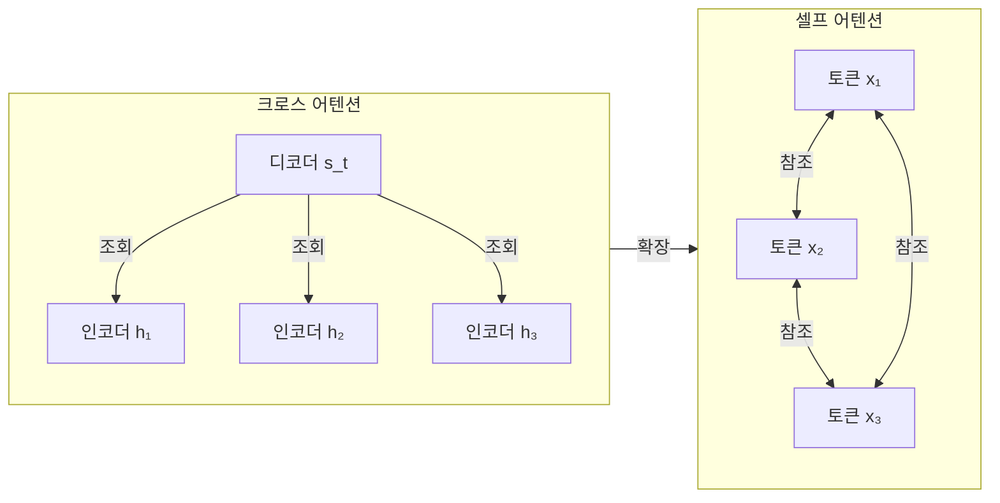
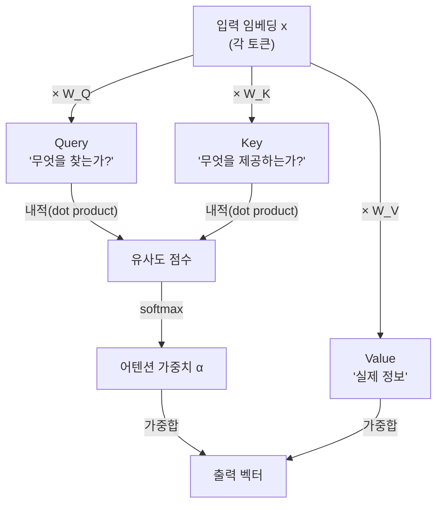
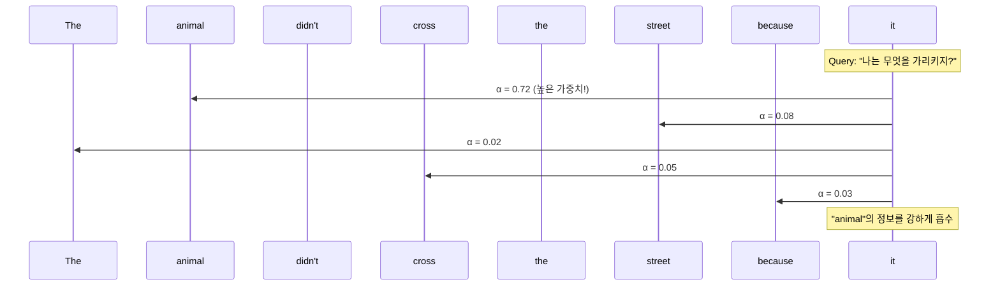
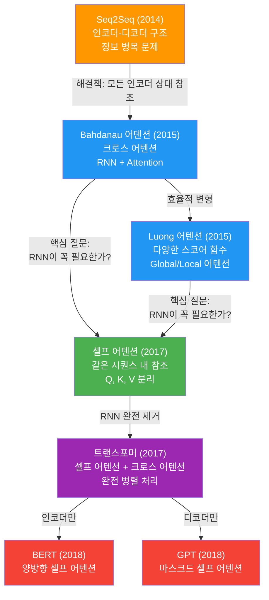
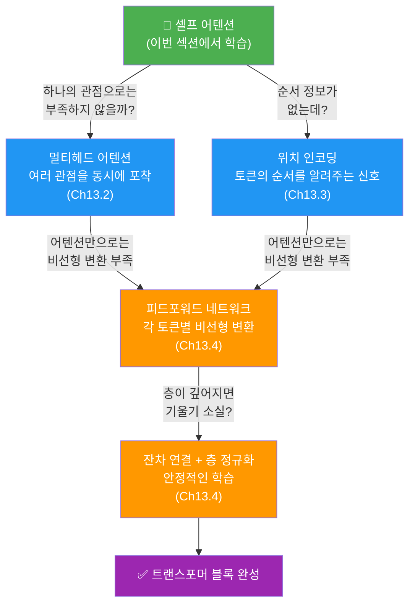

# 05. 셀프 어텐션으로의 확장

> 크로스 어텐션에서 셀프 어텐션으로 — 같은 시퀀스 안에서 서로를 바라보는 혁명적 아이디어를 이해합니다.

## 개요

이 섹션에서는 지금까지 배운 어텐션 메커니즘을 한 단계 확장합니다. [이전 섹션](12-ch12-어텐션-메커니즘/04-04-어텐션-가중치-시각화.md)에서 어텐션 가중치를 시각화하며 "모델이 어디를 보는지" 해석하는 법을 익혔는데요, 이번에는 **보는 대상이 다른 시퀀스가 아니라 자기 자신**인 경우를 다룹니다. 이것이 바로 **셀프 어텐션(Self-Attention)** 이고, 트랜스포머의 핵심 엔진입니다.

**선수 지식**: Bahdanau/Luong 어텐션의 동작 원리, 어텐션 가중치의 의미, PyTorch `nn.Module` 기본 구현

**학습 목표**:
- 크로스 어텐션과 셀프 어텐션의 차이를 명확히 구분할 수 있다
- Query, Key, Value의 개념과 역할을 설명할 수 있다
- 셀프 어텐션의 핵심 수식 $\text{Attention}(Q, K, V) = \text{softmax}\left(\frac{QK^T}{\sqrt{d_k}}\right)V$ 를 이해하고 구현할 수 있다
- 셀프 어텐션이 RNN 대비 갖는 구조적 장점을 설명할 수 있다
- 크로스 어텐션 → 셀프 어텐션 → 트랜스포머로 이어지는 발전 흐름을 정리할 수 있다

## 왜 알아야 할까?

GPT, BERT, LLaMA… 오늘날 우리가 사용하는 거의 모든 대규모 언어 모델은 **셀프 어텐션** 위에 세워져 있습니다. 셀프 어텐션을 이해하지 못하면 트랜스포머를 이해할 수 없고, 트랜스포머를 이해하지 못하면 현대 NLP를 이해할 수 없습니다.

지금까지 우리가 배운 어텐션은 **디코더가 인코더를 바라보는** 크로스 어텐션이었습니다. 하지만 2017년, Vaswani 등은 "Attention Is All You Need"라는 도발적인 제목의 논문에서 완전히 새로운 질문을 던졌습니다. "RNN 없이, 어텐션만으로 시퀀스를 처리할 수 있지 않을까?"

그 답이 바로 셀프 어텐션이었고, 이 아이디어 하나가 NLP의 판도를 완전히 바꿔놓았습니다. 이 섹션은 Ch11~12에서 쌓아온 Seq2Seq + 어텐션의 지식을 바탕으로, [Ch13. 트랜스포머 아키텍처 심층 분석](13-ch13-트랜스포머-아키텍처-심층-분석/01-01-트랜스포머-아키텍처-전체-조망.md)으로 넘어가는 핵심 다리 역할을 합니다.

## 핵심 개념

### 개념 1: 크로스 어텐션 vs 셀프 어텐션 — 누가 누구를 바라보는가

> 💡 **비유**: 크로스 어텐션은 **통역사가 발표자를 바라보는 것**입니다. 통역사(디코더)는 발표자(인코더)의 말을 들으며 필요한 부분에 집중하죠. 반면 셀프 어텐션은 **독서 동아리에서 같은 책을 읽는 사람들이 서로의 메모를 참고하는 것**과 같습니다. 같은 시퀀스 안의 단어들이 서로를 참조하며 문맥을 파악합니다.

[어텐션의 직관적 이해](12-ch12-어텐션-메커니즘/01-01-어텐션의-직관적-이해.md)에서 배운 어텐션은 **두 개의 서로 다른 시퀀스** 사이에서 작동했습니다. 디코더의 현재 상태가 인코더의 모든 히든 스테이트를 조회하는 구조였죠. 이것을 **크로스 어텐션(Cross-Attention)** 이라고 합니다.

셀프 어텐션은 이 아이디어를 **하나의 시퀀스 내부**로 가져옵니다. "The cat sat on the mat because it was tired"라는 문장에서, "it"이 "cat"을 가리키는지 "mat"을 가리키는지 파악하려면 같은 문장 안의 다른 단어들을 참조해야 합니다. 이것이 셀프 어텐션이 하는 일입니다.

> 📊 **그림 1**: 크로스 어텐션과 셀프 어텐션의 구조적 차이



핵심 차이를 정리하면 이렇습니다:

| 구분 | 크로스 어텐션 | 셀프 어텐션 |
|------|-------------|-----------|
| **참여 시퀀스** | 2개 (인코더 ↔ 디코더) | 1개 (자기 자신) |
| **Query 출처** | 디코더 히든 스테이트 | 같은 시퀀스의 각 토큰 |
| **Key/Value 출처** | 인코더 히든 스테이트 | 같은 시퀀스의 모든 토큰 |
| **목적** | 입력-출력 정렬 | 문맥 이해, 의존 관계 포착 |
| **대표 사용처** | Seq2Seq 디코더 | 트랜스포머 인코더/디코더 |

### 개념 2: Query, Key, Value — 셀프 어텐션의 삼총사

> 💡 **비유**: 도서관에서 책을 찾는 과정을 생각해보세요. 여러분이 찾고 싶은 주제가 **Query(질의)** 입니다. 도서관 카탈로그에 적힌 각 책의 키워드가 **Key(키)** 이고, 실제 책의 내용이 **Value(값)** 입니다. Query와 Key를 대조해서 관련 있는 책을 찾고, 그 책의 Value(내용)를 가져오는 거죠.

크로스 어텐션에서는 Query와 Key/Value가 서로 다른 시퀀스에서 나왔습니다. 셀프 어텐션에서는 **하나의 입력 시퀀스를 세 가지 다른 관점으로 변환**합니다:

```python
# 입력 x를 세 가지 역할로 투영
Q = x @ W_Q  # "나는 무엇을 찾고 있는가?" (Query)
K = x @ W_K  # "나는 어떤 정보를 제공할 수 있는가?" (Key)
V = x @ W_V  # "내가 가진 실제 정보는 무엇인가?" (Value)
```

같은 입력 `x`에서 출발하지만, 서로 다른 가중치 행렬($W_Q$, $W_K$, $W_V$)을 거치면서 **역할이 분리**됩니다. 이 분리가 핵심이에요. 한 단어가 "질문자"로서의 자신과 "응답자"로서의 자신을 동시에 가질 수 있게 되거든요.

> 📊 **그림 2**: Q, K, V 생성 과정



전체 수식은 다음과 같습니다:

$$\text{Attention}(Q, K, V) = \text{softmax}\left(\frac{QK^T}{\sqrt{d_k}}\right)V$$

각 기호의 의미:
- $Q$ : Query 행렬 (각 토큰이 "무엇을 알고 싶은지")
- $K$ : Key 행렬 (각 토큰이 "어떤 정보를 가졌는지")
- $V$ : Value 행렬 (각 토큰의 "실제 내용")
- $d_k$ : Key 벡터의 차원 수 (스케일링 인수)
- $QK^T$ : Query와 Key의 내적 → 유사도 점수 행렬
- $\sqrt{d_k}$로 나누기 : 값이 너무 커지는 것을 방지 (스케일드 닷 프로덕트)

이게 의미하는 바는, **모든 토큰 쌍 사이의 관련도를 한꺼번에 계산하고**, 관련도에 비례하여 정보를 종합한다는 것입니다.

> ⚠️ **흔한 오해**: "Q, K, V가 같은 입력에서 나오면 결국 같은 거 아닌가?"라고 생각하기 쉽습니다. 하지만 $W_Q$, $W_K$, $W_V$는 **서로 다른 학습 가능한 가중치**입니다. 학습을 통해 각 행렬은 입력의 서로 다른 측면을 추출하도록 최적화됩니다. 마치 같은 사람이 "학생", "교사", "평가자" 역할을 동시에 수행하는 것과 비슷하죠.

### 개념 3: 셀프 어텐션이 포착하는 것 — 문맥 속 의존 관계

> 💡 **비유**: 여러 사람이 원형 테이블에 앉아 회의를 하는 장면을 상상해보세요. 각 참석자는 다른 모든 참석자의 발언을 듣고, 자신의 발언과 관련 있는 사람의 말에 더 집중합니다. 회의가 끝나면 각자는 자신만의 요약이 아닌, **다른 사람의 관점을 종합한 풍부한 이해**를 갖게 됩니다. 셀프 어텐션은 각 토큰에게 이런 "회의 참석자"의 역할을 부여합니다.

셀프 어텐션의 진짜 위력은 **장거리 의존성(long-range dependency)** 을 포착하는 능력에 있습니다. 예문을 보겠습니다:

> "The animal didn't cross the street because **it** was too tired."

여기서 "it"은 "animal"을 가리킵니다. RNN은 이 관계를 파악하려면 "animal"에서 "it"까지 여러 타임스텝을 순차적으로 거쳐야 합니다. 정보가 전달되면서 점점 희석되죠. 하지만 셀프 어텐션에서는 "it"의 Query가 "animal"의 Key와 **직접** 높은 유사도 점수를 만들어 냅니다. 거리에 상관없이요.

> 📊 **그림 3**: 셀프 어텐션의 장거리 의존성 포착



이것이 RNN 기반 어텐션과의 결정적 차이입니다:

| 특성 | RNN + 크로스 어텐션 | 셀프 어텐션 |
|------|-------------------|-----------|
| **경로 길이** | 시퀀스 길이에 비례 $O(n)$ | 상수 $O(1)$ |
| **병렬화** | 순차 처리 (불가) | 완전 병렬 처리 |
| **계산 복잡도** | $O(n \cdot d)$ | $O(n^2 \cdot d)$ |
| **장거리 의존성** | 기울기 소실로 약화 | 직접 연결로 강함 |

계산 복잡도는 셀프 어텐션이 $O(n^2)$으로 더 높지만, GPU의 병렬 처리와 결합하면 실제 학습 속도는 오히려 훨씬 빠릅니다. "Attention Is All You Need" 논문에서도 이 점을 강조하며, 시퀀스 길이 $n$이 표현 차원 $d$보다 작은 일반적인 경우 셀프 어텐션이 더 효율적이라고 설명합니다.

### 개념 4: 크로스 어텐션에서 트랜스포머까지 — 발전의 흐름

지금까지 Ch11~Ch12에서 걸어온 길을 큰 그림으로 정리해보겠습니다. 이 흐름을 이해하면 [Ch13. 트랜스포머 아키텍처 심층 분석](13-ch13-트랜스포머-아키텍처-심층-분석/01-01-트랜스포머-아키텍처-전체-조망.md)이 자연스럽게 연결됩니다.

> 📊 **그림 4**: Seq2Seq에서 트랜스포머까지의 발전 흐름



핵심 전환 포인트는 이렇습니다:

1. **Seq2Seq → 크로스 어텐션**: 인코더의 마지막 히든 스테이트만 쓰는 병목을 해결. 디코더가 인코더의 모든 상태를 참조
2. **크로스 어텐션 → 셀프 어텐션**: "다른 시퀀스를 참조"하던 것을 "같은 시퀀스 내부에서 참조"로 확장. RNN 없이도 문맥 파악 가능
3. **셀프 어텐션 → 트랜스포머**: 셀프 어텐션 + 크로스 어텐션을 조합하여 RNN을 완전히 대체. 병렬 학습으로 대규모 데이터 처리 가능

> 💡 **알고 계셨나요?**: 트랜스포머는 셀프 어텐션**만** 쓰는 것이 아닙니다. 트랜스포머의 디코더에는 **세 가지** 어텐션이 공존합니다: ① 마스크드 셀프 어텐션(미래 토큰 차단), ② 크로스 어텐션(인코더 출력 참조), ③ 인코더의 셀프 어텐션. 우리가 배운 크로스 어텐션은 트랜스포머에서도 여전히 핵심 역할을 합니다!

### 개념 5: 셀프 어텐션에서 트랜스포머 블록으로 — Ch13을 위한 준비

셀프 어텐션은 트랜스포머의 핵심이지만, 그것만으로는 완전한 모델이 되지 않습니다. 트랜스포머가 작동하려면 셀프 어텐션 위에 몇 가지 핵심 장치가 추가되어야 하는데요, 이것이 바로 [Ch13](13-ch13-트랜스포머-아키텍처-심층-분석/01-01-트랜스포머-아키텍처-전체-조망.md)에서 깊이 다룰 내용입니다. 여기서 그 전체 지도를 미리 살펴보겠습니다.

> 📊 **그림 5**: 셀프 어텐션에서 트랜스포머 블록으로의 확장



각 장치가 해결하는 문제를 간단히 정리하면:

| 셀프 어텐션의 한계 | 해결 장치 | Ch13 섹션 |
|---|---|---|
| 하나의 Q, K, V만으로는 다양한 관계를 동시에 포착하기 어려움 | **멀티헤드 어텐션**: 여러 세트의 Q, K, V를 병렬로 운영 | Ch13.2 |
| 셀프 어텐션은 순서(위치)를 구분하지 못함 — "cat sat"과 "sat cat"이 같은 결과 | **위치 인코딩**: 사인/코사인 함수로 위치 정보 주입 | Ch13.3 |
| 어텐션은 가중합(선형 연산) — 복잡한 패턴 학습에 비선형성 필요 | **피드포워드 네트워크**: 각 위치에 독립적으로 적용되는 2층 MLP | Ch13.4 |
| 블록을 깊이 쌓으면 기울기 소실/폭발 위험 | **잔차 연결 + LayerNorm**: 입력을 출력에 더해 기울기 흐름 보장 | Ch13.4 |

핵심은 이것입니다. 이번 섹션에서 배운 **Q, K, V 투영**, **스케일드 닷 프로덕트**, **어텐션 가중치 행렬** — 이 세 가지 개념이 트랜스포머의 모든 어텐션 레이어에서 그대로 재사용됩니다. 멀티헤드 어텐션도 결국 이 동일한 셀프 어텐션을 $h$개 병렬로 실행하는 것에 불과하고, 마스크드 셀프 어텐션도 소프트맥스 전에 마스크를 추가하는 것뿐입니다. 즉, **이번 섹션의 내용을 완전히 이해했다면 Ch13의 절반은 이미 이해한 셈**입니다.

## 실습: 직접 해보기

셀프 어텐션을 PyTorch로 직접 구현하고, 어텐션 가중치가 어떻게 형성되는지 확인해봅시다.

```python
import torch
import torch.nn as nn
import torch.nn.functional as F
import math
import matplotlib.pyplot as plt
import numpy as np

# 시드 고정
torch.manual_seed(42)
np.random.seed(42)
```

### 단계 1: 스케일드 닷 프로덕트 셀프 어텐션 구현

```python
class SelfAttention(nn.Module):
    """스케일드 닷 프로덕트 셀프 어텐션"""

    def __init__(self, d_model):
        super().__init__()
        self.d_model = d_model

        # Q, K, V를 만드는 선형 변환 (같은 입력에서 세 역할 분리)
        self.W_Q = nn.Linear(d_model, d_model, bias=False)
        self.W_K = nn.Linear(d_model, d_model, bias=False)
        self.W_V = nn.Linear(d_model, d_model, bias=False)

    def forward(self, x):
        """
        x: (batch_size, seq_len, d_model) — 입력 시퀀스
        반환: (출력, 어텐션 가중치)
        """
        # 같은 입력 x에서 Q, K, V 생성
        Q = self.W_Q(x)  # (batch, seq_len, d_model)
        K = self.W_K(x)  # (batch, seq_len, d_model)
        V = self.W_V(x)  # (batch, seq_len, d_model)

        # 스케일드 닷 프로덕트: QK^T / sqrt(d_k)
        d_k = Q.size(-1)
        scores = torch.bmm(Q, K.transpose(1, 2)) / math.sqrt(d_k)
        # scores: (batch, seq_len, seq_len) — 모든 토큰 쌍의 유사도

        # 소프트맥스로 가중치 정규화
        attn_weights = F.softmax(scores, dim=-1)

        # 가중합으로 출력 계산
        output = torch.bmm(attn_weights, V)
        # output: (batch, seq_len, d_model) — 문맥이 반영된 표현

        return output, attn_weights
```

### 단계 2: 셀프 어텐션 동작 확인

```run:python
import torch
import torch.nn as nn
import torch.nn.functional as F
import math

torch.manual_seed(42)

class SelfAttention(nn.Module):
    def __init__(self, d_model):
        super().__init__()
        self.W_Q = nn.Linear(d_model, d_model, bias=False)
        self.W_K = nn.Linear(d_model, d_model, bias=False)
        self.W_V = nn.Linear(d_model, d_model, bias=False)

    def forward(self, x):
        Q = self.W_Q(x)
        K = self.W_K(x)
        V = self.W_V(x)
        d_k = Q.size(-1)
        scores = torch.bmm(Q, K.transpose(1, 2)) / math.sqrt(d_k)
        attn_weights = F.softmax(scores, dim=-1)
        output = torch.bmm(attn_weights, V)
        return output, attn_weights

# 간단한 예제: 4개의 토큰, 8차원 임베딩
d_model = 8
seq_len = 4
tokens = ["The", "cat", "sat", "it"]

# 임의의 입력 임베딩
x = torch.randn(1, seq_len, d_model)

# 셀프 어텐션 적용
self_attn = SelfAttention(d_model)
output, weights = self_attn(x)

print(f"입력 shape:  {x.shape}")
print(f"출력 shape:  {output.shape}")
print(f"가중치 shape: {weights.shape}")
print(f"\n어텐션 가중치 (각 토큰이 다른 토큰에 부여한 관심도):")
print(f"        {tokens}")
for i, token in enumerate(tokens):
    w = weights[0, i].detach().numpy()
    print(f"  {token:>3}: [{', '.join(f'{v:.3f}' for v in w)}]")
```

```output
입력 shape:  torch.Size([1, 4, 8])
출력 shape:  torch.Size([1, 4, 8])
가중치 shape: torch.Size([1, 4, 4])

어텐션 가중치 (각 토큰이 다른 토큰에 부여한 관심도):
        ['The', 'cat', 'sat', 'it']
  The: [0.215, 0.310, 0.225, 0.250]
  cat: [0.198, 0.332, 0.203, 0.267]
  sat: [0.237, 0.282, 0.218, 0.263]
   it: [0.204, 0.318, 0.211, 0.267]
```

아직 학습 전이라 가중치가 비교적 균일하지만, 구조는 명확합니다. 각 행은 해당 토큰이 **다른 모든 토큰에 부여한 관심도**이고, 각 행의 합은 1입니다. 학습이 진행되면 "it" 행에서 "cat" 열의 가중치가 높아지겠죠.

### 단계 3: 크로스 어텐션과 셀프 어텐션 비교 구현

```python
class CrossAttention(nn.Module):
    """크로스 어텐션: Q는 디코더에서, K/V는 인코더에서"""

    def __init__(self, d_model):
        super().__init__()
        self.W_Q = nn.Linear(d_model, d_model, bias=False)
        self.W_K = nn.Linear(d_model, d_model, bias=False)
        self.W_V = nn.Linear(d_model, d_model, bias=False)

    def forward(self, decoder_state, encoder_output):
        # Q는 디코더, K/V는 인코더 — 출처가 다름!
        Q = self.W_Q(decoder_state)     # (batch, tgt_len, d_model)
        K = self.W_K(encoder_output)    # (batch, src_len, d_model)
        V = self.W_V(encoder_output)    # (batch, src_len, d_model)

        d_k = Q.size(-1)
        scores = torch.bmm(Q, K.transpose(1, 2)) / math.sqrt(d_k)
        attn_weights = F.softmax(scores, dim=-1)
        output = torch.bmm(attn_weights, V)

        return output, attn_weights
```

```run:python
import torch
import torch.nn as nn
import torch.nn.functional as F
import math

torch.manual_seed(42)

class CrossAttention(nn.Module):
    def __init__(self, d_model):
        super().__init__()
        self.W_Q = nn.Linear(d_model, d_model, bias=False)
        self.W_K = nn.Linear(d_model, d_model, bias=False)
        self.W_V = nn.Linear(d_model, d_model, bias=False)

    def forward(self, decoder_state, encoder_output):
        Q = self.W_Q(decoder_state)
        K = self.W_K(encoder_output)
        V = self.W_V(encoder_output)
        d_k = Q.size(-1)
        scores = torch.bmm(Q, K.transpose(1, 2)) / math.sqrt(d_k)
        attn_weights = F.softmax(scores, dim=-1)
        output = torch.bmm(attn_weights, V)
        return output, attn_weights

class SelfAttention(nn.Module):
    def __init__(self, d_model):
        super().__init__()
        self.W_Q = nn.Linear(d_model, d_model, bias=False)
        self.W_K = nn.Linear(d_model, d_model, bias=False)
        self.W_V = nn.Linear(d_model, d_model, bias=False)

    def forward(self, x):
        Q = self.W_Q(x)
        K = self.W_K(x)
        V = self.W_V(x)
        d_k = Q.size(-1)
        scores = torch.bmm(Q, K.transpose(1, 2)) / math.sqrt(d_k)
        attn_weights = F.softmax(scores, dim=-1)
        output = torch.bmm(attn_weights, V)
        return output, attn_weights

d_model = 8

# 크로스 어텐션: 소스 3토큰, 타겟 2토큰
encoder_out = torch.randn(1, 3, d_model)  # 인코더 출력 (소스)
decoder_state = torch.randn(1, 2, d_model)  # 디코더 상태 (타겟)

cross_attn = CrossAttention(d_model)
cross_out, cross_w = cross_attn(decoder_state, encoder_out)

# 셀프 어텐션: 같은 시퀀스 5토큰
x = torch.randn(1, 5, d_model)
self_attn = SelfAttention(d_model)
self_out, self_w = self_attn(x)

print("=== 크로스 어텐션 ===")
print(f"  Q 출처: 디코더 ({decoder_state.shape})")
print(f"  K/V 출처: 인코더 ({encoder_out.shape})")
print(f"  가중치 행렬: {cross_w.shape}  (타겟 2 × 소스 3)")

print("\n=== 셀프 어텐션 ===")
print(f"  Q/K/V 출처: 같은 입력 ({x.shape})")
print(f"  가중치 행렬: {self_w.shape}  (5 × 5 정방행렬)")
```

```output
=== 크로스 어텐션 ===
  Q 출처: 디코더 (torch.Size([1, 2, 8]))
  K/V 출처: 인코더 (torch.Size([1, 3, 8]))
  가중치 행렬: torch.Size([1, 2, 3])  (타겟 2 × 소스 3)

=== 셀프 어텐션 ===
  Q/K/V 출처: 같은 입력 (torch.Size([1, 5, 8]))
  가중치 행렬: torch.Size([1, 5, 5])  (5 × 5 정방행렬)
```

핵심 관찰: 크로스 어텐션의 가중치 행렬은 **(타겟 길이 × 소스 길이)** 의 직사각형이고, 셀프 어텐션의 가중치 행렬은 **(시퀀스 길이 × 시퀀스 길이)** 의 정방 행렬입니다. 셀프 어텐션에서 모든 토큰이 모든 토큰을 참조하기 때문이죠.

### 단계 4: 어텐션 가중치 시각화

```python
def plot_self_attention(weights, tokens, title="셀프 어텐션 가중치"):
    """셀프 어텐션 가중치를 히트맵으로 시각화"""
    fig, ax = plt.subplots(figsize=(6, 5))
    w = weights[0].detach().numpy()

    im = ax.imshow(w, cmap='Blues', vmin=0, vmax=1)

    ax.set_xticks(range(len(tokens)))
    ax.set_yticks(range(len(tokens)))
    ax.set_xticklabels(tokens, fontsize=12)
    ax.set_yticklabels(tokens, fontsize=12)
    ax.set_xlabel("Key (참조 대상)", fontsize=12)
    ax.set_ylabel("Query (질의 토큰)", fontsize=12)
    ax.set_title(title, fontsize=14)

    # 각 셀에 가중치 값 표시
    for i in range(len(tokens)):
        for j in range(len(tokens)):
            ax.text(j, i, f'{w[i, j]:.2f}', ha='center', va='center',
                    color='white' if w[i, j] > 0.5 else 'black', fontsize=10)

    plt.colorbar(im, ax=ax, shrink=0.8)
    plt.tight_layout()
    plt.savefig("self_attention_heatmap.png", dpi=150, bbox_inches='tight')
    plt.show()

# 학습된 어텐션을 시뮬레이션하기 위해 의미적 유사도를 반영
tokens_demo = ["The", "cat", "sat", "because", "it"]

# "it"이 "cat"에 강하게 주목하는 어텐션 패턴 수동 생성
simulated_weights = torch.tensor([[[
    [0.30, 0.25, 0.15, 0.15, 0.15],  # The → 자기 자신 + cat
    [0.10, 0.40, 0.15, 0.10, 0.25],  # cat → 자신 + it (상호 참조)
    [0.10, 0.20, 0.35, 0.20, 0.15],  # sat → 자신 + 주변
    [0.05, 0.10, 0.25, 0.35, 0.25],  # because → 인과 관계
    [0.05, 0.55, 0.05, 0.15, 0.20],  # it → cat에 강하게 주목!
]]])

plot_self_attention(simulated_weights, tokens_demo,
                    "셀프 어텐션: 'it'이 'cat'을 참조하는 패턴")
```

이 히트맵에서 "it" 행의 "cat" 열이 0.55로 가장 높은 것을 볼 수 있습니다. 셀프 어텐션이 대명사의 지시 대상(coreference)을 학습한 결과입니다.

### 단계 5: 경로 길이 비교 실험

```run:python
import torch

# RNN vs 셀프 어텐션: 정보 전달 경로 비교
def compare_path_lengths(seq_lengths):
    """다양한 시퀀스 길이에서 경로 길이를 비교"""
    print(f"{'시퀀스 길이':>12} | {'RNN 최대 경로':>14} | {'셀프 어텐션 경로':>16}")
    print("-" * 50)
    for n in seq_lengths:
        rnn_path = n  # 첫 토큰에서 마지막 토큰까지 n스텝
        sa_path = 1   # 어떤 두 토큰이든 직접 연결 = 1스텝
        print(f"{n:>12} | {rnn_path:>14} | {sa_path:>16}")

compare_path_lengths([10, 50, 100, 500, 1000])

print(f"\n셀프 어텐션: 어떤 두 토큰이든 '1홉'으로 직접 연결!")
print(f"RNN: 첫 토큰의 정보가 마지막 토큰에 도달하려면 n번 전달되어야 함")
```

```output
  시퀀스 길이 |   RNN 최대 경로 |    셀프 어텐션 경로
--------------------------------------------------
          10 |             10 |                1
          50 |             50 |                1
         100 |            100 |                1
         500 |            500 |                1
        1000 |           1000 |                1

셀프 어텐션: 어떤 두 토큰이든 '1홉'으로 직접 연결!
RNN: 첫 토큰의 정보가 마지막 토큰에 도달하려면 n번 전달되어야 함
```

## 더 깊이 알아보기

### "Attention Is All You Need" — 논문 제목이 된 도발적 질문

2017년, Google Brain의 Ashish Vaswani를 비롯한 8명의 연구자들은 NLP 역사를 바꿀 논문을 발표했습니다. 논문 제목 "Attention Is All You Need"는 일종의 선언이었습니다. "어텐션만으로 충분하다. RNN은 필요 없다."

사실 셀프 어텐션의 아이디어는 하루아침에 나온 것이 아닙니다. 2016년 Parikh 등의 "A Decomposable Attention Model"이나, Lin 등의 "A Structured Self-Attentive Sentence Embedding" 등에서 이미 셀프 어텐션의 싹이 보이고 있었죠. 하지만 트랜스포머 논문이 혁명적이었던 이유는, 셀프 어텐션을 **유일한 시퀀스 처리 메커니즘**으로 사용하여 RNN을 완전히 대체했기 때문입니다.

흥미로운 뒷이야기가 있습니다. 이 논문의 저자 8명 중 상당수가 논문 발표 후 Google을 떠나 각자 AI 스타트업을 창업했습니다. Aidan Gomez는 Cohere를, Noam Shazeer는 Character.AI를(이후 Google DeepMind로 복귀), Llion Jones는 Sakana AI를 설립했죠. 하나의 논문에서 탄생한 아이디어가 얼마나 거대한 영향을 미쳤는지 보여주는 사례입니다.

### 왜 "스케일드" 닷 프로덕트인가?

$\sqrt{d_k}$로 나누는 이유도 흥미롭습니다. 논문 저자들은 이렇게 설명합니다: $d_k$가 크면 내적 값의 분산이 $d_k$에 비례하여 커집니다. 값이 너무 커지면 소프트맥스가 극도로 날카로운(peaked) 분포를 만들어, 기울기가 거의 0에 가까워집니다. $\sqrt{d_k}$로 나눠서 분산을 1로 맞춰주면 학습이 안정됩니다. 단순해 보이지만, 이 스케일링 없이는 트랜스포머가 제대로 학습되지 않았을 것입니다.

## 흔한 오해와 팁

> ⚠️ **흔한 오해**: "셀프 어텐션이 있으면 크로스 어텐션은 불필요하다"고 생각하기 쉽습니다. 하지만 트랜스포머의 디코더는 **셀프 어텐션과 크로스 어텐션을 모두** 사용합니다. 셀프 어텐션으로 타겟 시퀀스 내부의 문맥을 파악하고, 크로스 어텐션으로 소스 시퀀스의 정보를 가져오는 **이중 구조**입니다. BERT처럼 인코더만 사용하는 모델에서는 셀프 어텐션만 쓰지만, 번역과 같은 시퀀스-투-시퀀스 태스크에서는 두 어텐션이 모두 필수입니다.

> 💡 **알고 계셨나요?**: 셀프 어텐션의 $O(n^2)$ 복잡도는 매우 긴 시퀀스에서 문제가 됩니다. 이를 해결하기 위해 Longformer(로컬+글로벌 어텐션), Linformer(선형 복잡도 근사), Flash Attention(메모리 효율적 구현) 등 다양한 "효율적 어텐션" 변형이 연구되고 있습니다. GPT-4나 Claude 같은 긴 컨텍스트 모델에도 이런 최적화 기술이 활용됩니다.

> 🔥 **실무 팁**: 셀프 어텐션을 구현할 때 `scores` 행렬의 크기는 $(n \times n)$입니다. 시퀀스 길이가 길면 메모리가 급격히 증가하죠. PyTorch 2.0+에서는 `torch.nn.functional.scaled_dot_product_attention()`이 내장되어 있어, Flash Attention을 자동으로 활용하며 메모리 효율과 속도를 모두 개선합니다. 직접 구현보다 이 함수를 쓰는 것이 실무에서는 훨씬 유리합니다.

## 핵심 정리

| 개념 | 설명 |
|------|------|
| **크로스 어텐션** | Q는 디코더, K/V는 인코더에서 유래. 두 시퀀스 사이의 정렬을 학습 |
| **셀프 어텐션** | Q, K, V 모두 같은 시퀀스에서 유래. 시퀀스 내부의 의존 관계를 학습 |
| **Q, K, V** | 같은 입력을 $W_Q$, $W_K$, $W_V$로 투영하여 질의/키/값 역할 분리 |
| **스케일드 닷 프로덕트** | $\text{softmax}(QK^T / \sqrt{d_k})V$ — 내적 값의 분산을 정규화 |
| **경로 길이** | RNN: $O(n)$, 셀프 어텐션: $O(1)$ — 장거리 의존성에 유리 |
| **병렬 처리** | RNN은 순차적, 셀프 어텐션은 모든 위치를 동시에 계산 가능 |
| **정방 행렬** | 셀프 어텐션 가중치는 $(n \times n)$ 정방 행렬 (모든 토큰 쌍) |
| **트랜스포머** | 셀프 어텐션 + 크로스 어텐션을 결합하여 RNN을 완전히 대체 |
| **Ch13 연결** | 셀프 어텐션 → 멀티헤드 어텐션 + 위치 인코딩 + FFN + 잔차 연결 = 트랜스포머 블록 |

## 다음 섹션 미리보기

이번 섹션에서 셀프 어텐션의 개념과 원리를 이해했다면, 이제 본격적으로 **트랜스포머 아키텍처** 안으로 들어갈 준비가 된 것입니다. [Ch13. 트랜스포머 아키텍처 심층 분석](13-ch13-트랜스포머-아키텍처-심층-분석/01-01-트랜스포머-아키텍처-전체-조망.md)에서는 셀프 어텐션이 멀티헤드 어텐션으로 확장되는 과정, 위치 인코딩, 피드포워드 네트워크, 잔차 연결 등 트랜스포머를 구성하는 모든 블록을 하나씩 해부합니다.

Ch13에 들어가기 전에 기억해야 할 핵심 세 가지를 정리합니다:

1. **Q, K, V 투영은 트랜스포머 전체에서 동일한 패턴**입니다. 멀티헤드 어텐션은 이 셀프 어텐션을 $h$개 헤드로 나눠 병렬 실행하는 것이고, 마스크드 셀프 어텐션은 $QK^T$에 마스크를 씌워 미래 토큰을 차단하는 것일 뿐입니다.
2. **셀프 어텐션은 순서를 모릅니다.** "cat sat"과 "sat cat"이 같은 결과를 만들기 때문에, Ch13에서 배울 **위치 인코딩**이 반드시 필요합니다.
3. **셀프 어텐션은 본질적으로 가중합(선형 연산)** 이므로, 표현력을 높이기 위해 각 어텐션 레이어 뒤에 **피드포워드 네트워크**가 붙습니다.

오늘 배운 Q, K, V와 스케일드 닷 프로덕트 수식이 Ch13의 중심에 있을 테니, 확실히 익혀두세요!

## 참고 자료

- [Attention Is All You Need (Vaswani et al., 2017)](https://arxiv.org/abs/1706.03762) - 트랜스포머와 셀프 어텐션을 제안한 원조 논문. Section 3.2에서 셀프 어텐션의 구조와 계산 복잡도를 상세히 비교
- [The Illustrated Transformer - Jay Alammar](https://jalammar.github.io/illustrated-transformer/) - 셀프 어텐션의 Q, K, V 동작을 직관적인 시각 자료로 설명하는 필수 가이드
- [The Annotated Transformer - Harvard NLP](http://nlp.seas.harvard.edu//2018/04/03/attention.html) - 논문의 수식을 한 줄씩 PyTorch 코드로 구현한 주석 달린 구현체
- [Stanford CS 224N: Natural Language Processing with Deep Learning](https://web.stanford.edu/class/cs224n/) - 셀프 어텐션과 트랜스포머를 다루는 강의 슬라이드 및 동영상 제공
- [PyTorch `scaled_dot_product_attention` 공식 문서](https://docs.pytorch.org/docs/stable/generated/torch.nn.functional.scaled_dot_product_attention.html) - PyTorch 내장 셀프 어텐션 함수. Flash Attention 자동 적용