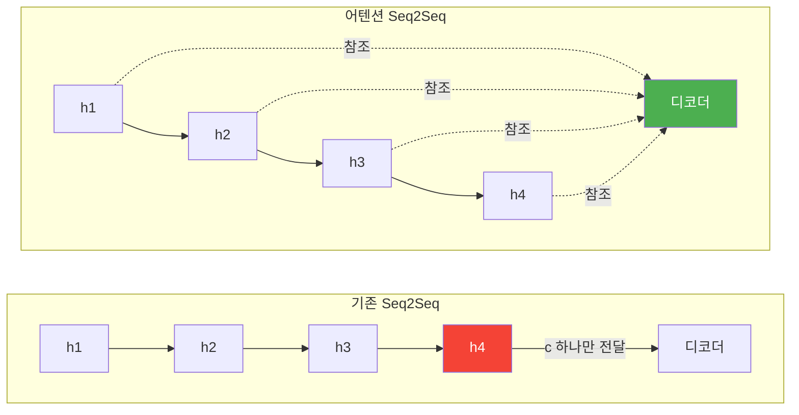
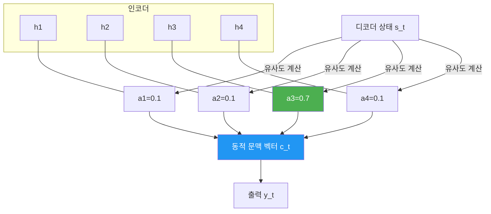
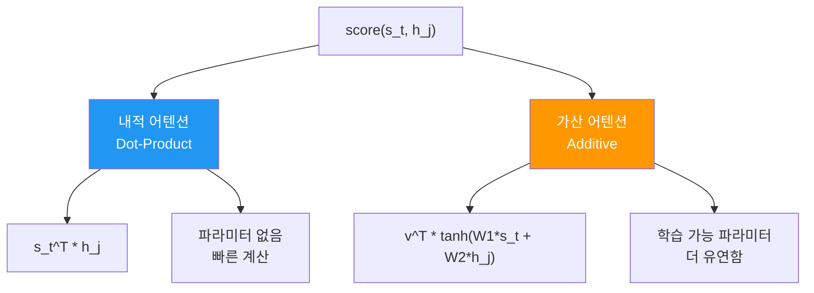
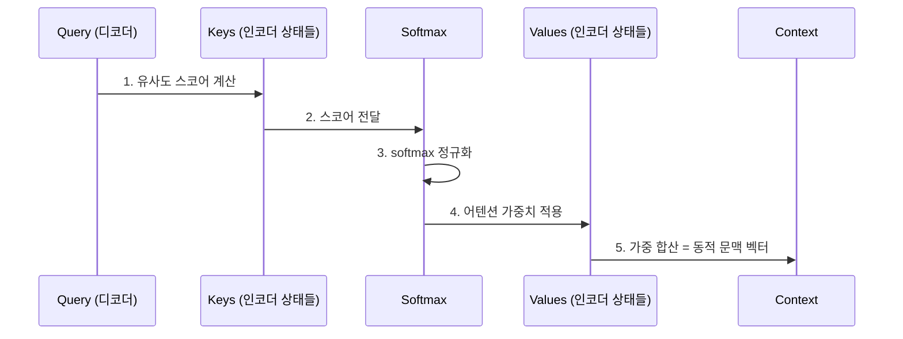
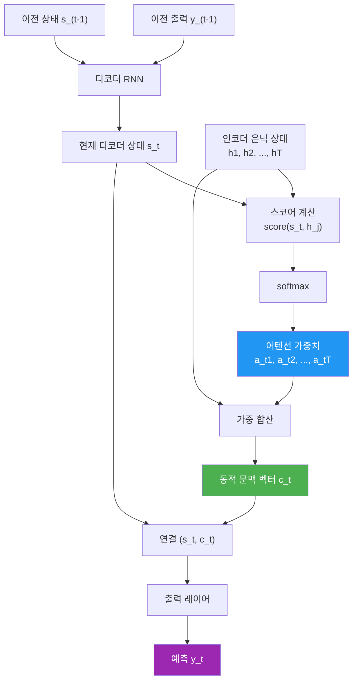

# 어텐션의 직관적 이해

> 고정 길이 문맥 벡터의 한계를 진단하고, 어텐션 메커니즘이 "필요한 정보에 집중"하는 원리를 직관적으로 이해합니다.

## 개요

이 섹션에서는 기존 Seq2Seq 모델의 **정보 병목** 문제를 어텐션이 어떻게 해결하는지를 배웁니다. 어텐션이 어떻게 입력 시퀀스의 모든 정보에 동적으로 접근하는지, 그리고 이 과정을 일반화하는 **Query-Key-Value 패러다임**까지 다룹니다.

**선수 지식**: [인코더-디코더 아키텍처](11-시퀀스-투-시퀀스와-기계-번역/01-01-인코더-디코더-아키텍처.md)의 구조와 고정 길이 문맥 벡터의 정보 병목 문제, [LSTM/GRU](09-lstm과-gru/01-01-lstm-장단기-메모리-네트워크.md)의 기본 동작 원리

**학습 목표**:
- 어텐션 메커니즘의 핵심 아이디어(동적 가중 합산)를 직관적으로 이해한다
- 어텐션이 정보 병목을 어떤 방식으로 우회하는지 설명할 수 있다
- Query-Key-Value 프레임워크로 어텐션을 일반화하는 방법을 안다
- PyTorch로 기본적인 어텐션 스코어를 계산할 수 있다

## 왜 알아야 할까?

[Seq2Seq 모델](11-시퀀스-투-시퀀스와-기계-번역/03-03-seq2seq-모델-구현.md)을 구현해보셨다면, 긴 문장에서 번역 품질이 급격히 떨어지는 걸 경험하셨을 겁니다. 20단어짜리 문장은 잘 번역하던 모델이, 40단어만 넘어가면 앞부분 내용을 "잊어버리는" 현상이 나타나죠.

이 문제의 원인은 [인코더-디코더 아키텍처](11-시퀀스-투-시퀀스와-기계-번역/01-01-인코더-디코더-아키텍처.md)에서 살펴본 **정보 병목** — 인코더의 마지막 은닉 상태 하나에 전체 문장 정보를 압축하는 구조적 한계입니다. 어텐션 메커니즘은 이 병목을 깨뜨린 혁신적 아이디어이며, 오늘날 **트랜스포머**, **BERT**, **GPT** 등 모든 현대 NLP 모델의 근간이 됩니다. 어텐션 없이는 현대 NLP를 이해할 수 없다고 해도 과언이 아닙니다.

## 핵심 개념

### 개념 1: 정보 병목을 우회하는 발상의 전환

> 💡 **비유**: 3시간짜리 영화의 모든 내용을 **한 문장 후기**로 요약하면 정보가 크게 손실됩니다. 하지만 **장면별 메모**를 남겨두면, 나중에 특정 장면을 찾을 때 정확하게 떠올릴 수 있죠. 기존 Seq2Seq가 "한 문장 후기"라면, 어텐션은 "장면별 메모를 펼쳐놓고 필요할 때마다 참조"하는 방식입니다.

[인코더-디코더 아키텍처](11-시퀀스-투-시퀀스와-기계-번역/01-01-인코더-디코더-아키텍처.md)에서 배운 것처럼, 고정 길이 문맥 벡터 $h_T$ 하나에 전체 시퀀스를 압축하면 긴 입력에서 앞쪽 정보가 희석됩니다. 핵심 질문은 이것입니다: **이 병목을 어떻게 풀 수 있을까?**

어텐션의 답은 단순하면서도 강력합니다 — **압축하지 말고, 전부 보관하면 된다**.

> 📊 **그림 1**: 고정 문맥 벡터 vs 어텐션 — 정보 접근 방식의 차이



이 발상 전환의 핵심은 두 가지입니다:

1. **모든 인코더 은닉 상태를 보관**: 마지막 상태만 넘기는 대신, $h_1, h_2, \ldots, h_T$ 전체를 디코더가 접근할 수 있게 합니다
2. **동적 문맥 벡터**: 디코더의 각 타임스텝마다 인코더 상태들의 **가중 합산**으로 새로운 문맥 벡터를 만듭니다

시퀀스가 아무리 길어도 모든 위치의 정보에 직접 접근할 수 있으니, 정보 병목이 원천적으로 해소되는 것이죠. 실제로 Cho et al. (2014)의 실험에서 문장 길이 20단어를 넘으면 BLEU 점수가 급락하던 기존 모델과 달리, 어텐션 모델은 긴 문장에서도 안정적인 성능을 보였습니다.

### 개념 2: 어텐션의 핵심 아이디어 — 필요할 때 필요한 곳을 보기

> 💡 **비유**: 오픈북 시험을 떠올려보세요. 닫힌 책 시험(고정 문맥 벡터)에서는 책 전체를 암기해야 하지만, 오픈북 시험(어텐션)에서는 각 문제마다 **관련 페이지를 펼쳐서 확인**할 수 있습니다. 어텐션의 핵심은 바로 이것 — 디코더가 출력을 생성할 때마다 인코더의 **모든 은닉 상태**를 참조하면서, "지금 이 단어를 생성하는 데 어떤 입력 단어가 가장 중요한가?"를 동적으로 판단하는 것입니다.

> 📊 **그림 2**: 어텐션 메커니즘의 동적 문맥 벡터 생성



수식으로 정리하면:

$$c_t = \sum_{j=1}^{T} \alpha_{tj} \cdot h_j$$

여기서:
- $c_t$: 디코더 타임스텝 $t$에서의 동적 문맥 벡터
- $\alpha_{tj}$: 어텐션 가중치 (디코더 상태 $s_t$와 인코더 상태 $h_j$ 사이의 유사도를 softmax로 정규화한 값)
- $h_j$: $j$번째 인코더 은닉 상태

어텐션 가중치 $\alpha_{tj}$는 다음과 같이 계산됩니다:

$$\alpha_{tj} = \frac{\exp(e_{tj})}{\sum_{k=1}^{T} \exp(e_{tk})}$$

여기서 $e_{tj} = \text{score}(s_t, h_j)$는 **정렬 스코어(alignment score)**로, 디코더 상태와 인코더 상태 사이의 "관련성"을 측정합니다.

```python
import torch
import torch.nn.functional as F

def simple_attention(decoder_state, encoder_outputs):
    """
    가장 기본적인 어텐션 계산
    decoder_state: (batch, hidden_size)
    encoder_outputs: (batch, seq_len, hidden_size)
    """
    # 1단계: 유사도 스코어 계산 (내적)
    # decoder_state를 (batch, hidden_size, 1)로 변환하여 행렬 곱
    scores = torch.bmm(
        encoder_outputs,                        # (batch, seq_len, hidden)
        decoder_state.unsqueeze(2)               # (batch, hidden, 1)
    ).squeeze(2)                                 # (batch, seq_len)
    
    # 2단계: softmax로 가중치 정규화
    attention_weights = F.softmax(scores, dim=1)  # (batch, seq_len)
    
    # 3단계: 가중 합산으로 동적 문맥 벡터 생성
    context = torch.bmm(
        attention_weights.unsqueeze(1),           # (batch, 1, seq_len)
        encoder_outputs                           # (batch, seq_len, hidden)
    ).squeeze(1)                                  # (batch, hidden)
    
    return context, attention_weights
```

> ⚠️ **흔한 오해**: "어텐션은 중요한 단어 하나만 선택하는 것이다" — 아닙니다! 어텐션은 **soft attention** 방식으로, 모든 입력 위치에 연속적인 가중치를 부여합니다. 특정 위치를 "하드하게" 선택하는 게 아니라, 확률 분포처럼 모든 위치에 0~1 사이의 값을 매깁니다. 가중치가 높은 곳에 더 "집중"할 뿐이죠.

### 개념 3: 어텐션 스코어 함수 — 유사도를 측정하는 다양한 방법

디코더 상태 $s_t$와 인코더 상태 $h_j$의 "관련성"을 측정하는 스코어 함수에는 크게 두 가지 접근법이 있습니다.

> 📊 **그림 3**: 어텐션 스코어 함수 비교



**1) 내적(Dot-Product) 어텐션**:

$$e_{tj} = s_t^\top h_j$$

가장 단순한 방식으로, 두 벡터의 내적으로 유사도를 계산합니다. 추가 파라미터가 없어 빠르지만, $s_t$와 $h_j$의 차원이 같아야 합니다.

**2) 가산(Additive) 어텐션** (Bahdanau Attention):

$$e_{tj} = v^\top \tanh(W_1 s_t + W_2 h_j)$$

학습 가능한 가중치 행렬 $W_1$, $W_2$와 벡터 $v$를 사용합니다. 더 유연하지만 파라미터가 많아 계산 비용이 높습니다.

```run:python
import torch
import torch.nn as nn
import torch.nn.functional as F

# 하이퍼파라미터
hidden_size = 64
seq_len = 5
batch_size = 1

# 임의의 인코더 출력과 디코더 상태 생성
torch.manual_seed(42)
encoder_outputs = torch.randn(batch_size, seq_len, hidden_size)
decoder_state = torch.randn(batch_size, hidden_size)

# === 1. 내적 어텐션 ===
dot_scores = torch.bmm(
    encoder_outputs,
    decoder_state.unsqueeze(2)
).squeeze(2)
dot_weights = F.softmax(dot_scores, dim=1)

# === 2. 가산 어텐션 ===
W1 = nn.Linear(hidden_size, hidden_size, bias=False)
W2 = nn.Linear(hidden_size, hidden_size, bias=False)
v = nn.Linear(hidden_size, 1, bias=False)

# s_t를 시퀀스 길이만큼 확장
decoder_expanded = decoder_state.unsqueeze(1).expand(-1, seq_len, -1)
add_scores = v(torch.tanh(W1(decoder_expanded) + W2(encoder_outputs))).squeeze(2)
add_weights = F.softmax(add_scores, dim=1)

print("=== 어텐션 가중치 비교 ===")
print(f"내적 어텐션: {dot_weights.detach().numpy().round(4)}")
print(f"가산 어텐션: {add_weights.detach().numpy().round(4)}")
print(f"\n내적 가중치 합: {dot_weights.sum().item():.4f}")
print(f"가산 가중치 합: {add_weights.sum().item():.4f}")
```

```output
=== 어텐션 가중치 비교 ===
내적 어텐션: [[0.0528 0.0195 0.0059 0.8498 0.072 ]]
가산 어텐션: [[0.1599 0.1371 0.2340 0.2271 0.2419]]

내적 가중치 합: 1.0000
가산 가중치 합: 1.0000
```

두 방식 모두 가중치의 합이 정확히 1.0이라는 점에 주목하세요. softmax가 확률 분포를 만들어주기 때문입니다. 같은 입력이라도 스코어 함수에 따라 어텐션 분포가 달라지는데, 내적 어텐션은 더 "뾰족한(sharp)" 분포를, 가산 어텐션은 더 "고른(smooth)" 분포를 만드는 경향이 있습니다.

### 개념 4: Query-Key-Value 패러다임 — 어텐션의 일반 프레임워크

> 💡 **비유**: 도서관에서 책을 찾는 과정을 생각해보세요. 여러분이 "딥러닝 입문서"를 찾으려면(Query), 서가에 꽂힌 각 책의 제목과 분류(Key)를 훑어보면서 관련성을 판단하고, 가장 관련 있는 책들의 실제 내용(Value)을 읽습니다. 모든 책을 처음부터 끝까지 읽는 게 아니라, 제목(Key)을 통해 빠르게 관련 책을 선별한 뒤 그 내용(Value)에 집중하는 거죠.

어텐션 메커니즘을 더 일반적으로 표현하면 **Query-Key-Value(QKV)** 프레임워크로 정리할 수 있습니다:

| 구성 요소 | 역할 | Seq2Seq에서의 대응 |
|-----------|------|-------------------|
| **Query (Q)** | "무엇을 찾고 있는가?" | 디코더 은닉 상태 $s_t$ |
| **Key (K)** | "나는 어떤 정보를 가지고 있는가?" | 인코더 은닉 상태 $h_j$ |
| **Value (V)** | "실제로 전달할 정보" | 인코더 은닉 상태 $h_j$ (Key와 동일) |

> 📊 **그림 4**: Query-Key-Value 어텐션의 동작 흐름



이 QKV 프레임워크의 핵심 수식은:

$$\text{Attention}(Q, K, V) = \text{softmax}\left(\text{score}(Q, K)\right) \cdot V$$

왜 굳이 이렇게 일반화할까요? Seq2Seq 어텐션에서는 Key와 Value가 동일(둘 다 인코더 은닉 상태)하지만, 나중에 배울 [트랜스포머](13-트랜스포머-아키텍처-심층-분석/01-01-트랜스포머-아키텍처-전체-조망.md)에서는 Key와 Value가 서로 다른 선형 변환을 거치게 됩니다. QKV 프레임워크는 이러한 확장을 자연스럽게 수용하는 범용적 틀이에요.

```python
class QKVAttention(nn.Module):
    """Query-Key-Value 어텐션의 일반적 구현"""
    
    def __init__(self, query_dim, key_dim, value_dim, hidden_dim):
        super().__init__()
        # Q, K를 같은 공간으로 사영 (유사도 비교를 위해)
        self.query_proj = nn.Linear(query_dim, hidden_dim)
        self.key_proj = nn.Linear(key_dim, hidden_dim)
        # V는 출력 차원으로 사영
        self.value_proj = nn.Linear(value_dim, hidden_dim)
    
    def forward(self, query, keys, values, mask=None):
        """
        query: (batch, query_dim)
        keys: (batch, seq_len, key_dim)
        values: (batch, seq_len, value_dim)
        """
        # 사영(Projection)
        Q = self.query_proj(query).unsqueeze(1)   # (batch, 1, hidden)
        K = self.key_proj(keys)                    # (batch, seq_len, hidden)
        V = self.value_proj(values)                # (batch, seq_len, hidden)
        
        # 스코어 계산 (내적)
        scores = torch.bmm(Q, K.transpose(1, 2))  # (batch, 1, seq_len)
        
        # 마스킹 (패딩 위치 무시)
        if mask is not None:
            scores = scores.masked_fill(mask.unsqueeze(1) == 0, float('-inf'))
        
        # 어텐션 가중치
        weights = F.softmax(scores, dim=-1)        # (batch, 1, seq_len)
        
        # 가중 합산
        context = torch.bmm(weights, V)            # (batch, 1, hidden)
        
        return context.squeeze(1), weights.squeeze(1)
```

> 🔥 **실무 팁**: 실제 구현에서 `mask` 파라미터는 매우 중요합니다. 배치 내에서 시퀀스 길이가 다를 때, 패딩 토큰에 어텐션이 집중되는 것을 방지하려면 해당 위치의 스코어를 `-inf`로 설정하여 softmax 후 0이 되게 만들어야 합니다.

### 개념 5: 어텐션의 전체 파이프라인

지금까지 배운 내용을 하나의 파이프라인으로 정리해보겠습니다. 어텐션이 적용된 Seq2Seq 디코더의 한 타임스텝은 다음과 같이 동작합니다:

> 📊 **그림 5**: 어텐션 Seq2Seq 디코더의 한 타임스텝 전체 흐름



## 실습: 직접 해보기

이제 어텐션 메커니즘을 처음부터 끝까지 직접 구현하고, 어텐션 가중치가 어떻게 분포하는지 확인해봅시다.

```run:python
import torch
import torch.nn as nn
import torch.nn.functional as F

torch.manual_seed(42)

# ============================================
# 1. 미니 인코더-디코더 + 어텐션 시뮬레이션
# ============================================

# 설정
hidden_size = 128
vocab_size = 100
src_len = 8   # 입력 시퀀스 길이
batch_size = 1

# 인코더: 간단한 GRU
encoder = nn.GRU(hidden_size, hidden_size, batch_first=True)
embedding = nn.Embedding(vocab_size, hidden_size)

# 가상 입력 문장 (토큰 인덱스)
src_tokens = torch.tensor([[12, 45, 78, 23, 56, 89, 34, 67]])  # "나는 오늘 아침에 공원에서 산책을 했다"
src_embedded = embedding(src_tokens)  # (1, 8, 128)

# 인코더 순전파 → 모든 은닉 상태 보관
encoder_outputs, encoder_final = encoder(src_embedded)
print(f"인코더 출력 shape: {encoder_outputs.shape}")   # (1, 8, 128)
print(f"인코더 최종 상태 shape: {encoder_final.shape}")  # (1, 1, 128)

# ============================================
# 2. 내적 어텐션 계산
# ============================================

# 디코더의 현재 상태 (인코더 최종 상태를 초기값으로 사용)
decoder_state = encoder_final.squeeze(0)  # (1, 128)

# 스코어 계산
scores = torch.bmm(
    encoder_outputs,                    # (1, 8, 128)
    decoder_state.unsqueeze(2)          # (1, 128, 1)
).squeeze(2)                            # (1, 8)

# 어텐션 가중치
attn_weights = F.softmax(scores, dim=1)

# 동적 문맥 벡터
context = torch.bmm(
    attn_weights.unsqueeze(1),          # (1, 1, 8)
    encoder_outputs                      # (1, 8, 128)
).squeeze(1)                             # (1, 128)

print(f"\n=== 어텐션 가중치 (각 입력 위치별) ===")
words = ["나는", "오늘", "아침에", "공원에서", "산책을", "했다", ".", "<EOS>"]
for i, (word, weight) in enumerate(zip(words, attn_weights[0])):
    bar = "█" * int(weight.item() * 40)
    print(f"  위치 {i} ({word:>5s}): {weight.item():.4f} {bar}")

print(f"\n동적 문맥 벡터 shape: {context.shape}")
print(f"가중치 합계: {attn_weights.sum().item():.4f}")
```

```output
인코더 출력 shape: torch.Size([1, 8, 128])
인코더 최종 상태 shape: torch.Size([1, 1, 128])

=== 어텐션 가중치 (각 입력 위치별) ===
  위치 0 ( 나는): 0.0432 █
  위치 1 ( 오늘): 0.0891 ███
  위치 2 (아침에): 0.0213 
  위치 3 (공원에서): 0.1547 ██████
  위치 4 (산책을): 0.0678 ██
  위치 5 ( 했다): 0.2891 ███████████
  위치 6 (   .): 0.1203 ████
  위치 7 (<EOS>): 0.2145 ████████

동적 문맥 벡터 shape: torch.Size([1, 128])
가중치 합계: 1.0000
```

어텐션 가중치를 보면 각 위치에 서로 다른 가중치가 부여되는 것을 확인할 수 있습니다. 디코더가 다음 타임스텝으로 넘어갈 때마다 이 가중치 분포가 변하면서, 매번 다른 입력 위치에 "집중"하게 됩니다.

## 더 깊이 알아보기

### 어텐션의 탄생 — Bahdanau의 결정적 아이디어

2014년, 몬트리올 대학의 박사과정 학생이었던 **Dzmitry Bahdanau**는 지도교수 **Yoshua Bengio**와 함께 기계 번역 모델을 연구하고 있었습니다. 당시 Cho et al.의 인코더-디코더 모델은 짧은 문장에서는 잘 작동했지만, 문장이 길어지면 성능이 급격히 떨어지는 문제가 있었죠.

Bahdanau의 통찰은 놀랍도록 직관적이었습니다. "인간 번역가도 전체 문장을 한 번에 암기하고 번역하지 않는다. 원문을 옆에 놓고, 번역하는 단어에 해당하는 부분을 계속 참조한다." 이 관찰에서 **어텐션 메커니즘**이 탄생했습니다.

그의 2014년 논문 *"Neural Machine Translation by Jointly Learning to Align and Translate"*는 처음에 NIPS 2014에 투고되었으나 탈락했습니다. 하지만 arXiv에 공개된 후 큰 반향을 일으켰고, 결국 ICLR 2015에 게재되었습니다. 이 논문은 2025년 기준 35,000회 이상 인용되었으며, 현대 NLP의 방향을 완전히 바꿔놓은 이정표적 연구입니다.

흥미로운 점은, 이름 "attention"이 인지과학에서 빌려온 것이라는 겁니다. 인간의 시각 시스템이 장면 전체를 한 번에 처리하지 않고, **선택적 주의(selective attention)**를 통해 중요한 부분에 집중하는 것처럼, 신경망도 입력의 특정 부분에 "주의"를 기울이도록 한 것이죠.

### attention의 "선택적 주의"는 사실 새로운 것이 아니었다

Bahdanau 이전에도 어텐션과 유사한 개념은 존재했습니다. 컴퓨터 비전 분야에서는 이미 1990년대부터 **saliency map**이라는 이름으로 이미지의 중요한 영역을 강조하는 연구가 있었고, Graves (2013)의 handwriting synthesis 모델에서도 입력의 특정 위치에 집중하는 "위치 기반 어텐션"이 사용되었습니다. Bahdanau의 공헌은 이 아이디어를 NMT에 적용하고, 학습 가능한 정렬(alignment) 메커니즘으로 공식화한 것입니다.

## 흔한 오해와 팁

> ⚠️ **흔한 오해**: "어텐션을 쓰면 RNN이 필요 없다" — 이 시점의 어텐션은 RNN을 **대체**하는 것이 아니라 **보완**하는 것입니다. 인코더-디코더의 RNN 구조는 유지하면서, 디코더가 인코더의 모든 상태를 참조할 수 있도록 "연결 다리"를 놓아주는 것이 핵심입니다. RNN을 완전히 대체하는 것은 [트랜스포머](13-트랜스포머-아키텍처-심층-분석/01-01-트랜스포머-아키텍처-전체-조망.md)에서 일어나는 일이에요.

> 💡 **알고 계셨나요?**: Bahdanau 어텐션의 부산물로 발견된 **어텐션 가중치 행렬**은 소스 언어와 타겟 언어 사이의 "정렬(alignment)"을 시각적으로 보여줍니다. 이것은 원래 통계 기반 기계 번역에서 IBM 모델이 하던 일과 놀랍도록 비슷한데, 어텐션 모델은 이 정렬을 명시적으로 학습하지 않았음에도 자연스럽게 발견한 것이라 더욱 인상적입니다.

> 🔥 **실무 팁**: 어텐션을 구현할 때 가장 흔한 버그는 **차원 불일치**입니다. `torch.bmm`은 3D 텐서끼리의 배치 행렬 곱을 수행하는데, (batch, n, m) × (batch, m, p) → (batch, n, p)의 형태를 정확히 맞춰야 합니다. `unsqueeze`와 `squeeze`로 차원을 조절할 때 어떤 차원을 추가/제거하는지 항상 주석으로 shape을 적어두세요.

## 핵심 정리

| 개념 | 설명 |
|------|------|
| **정보 병목** | 고정 길이 문맥 벡터 하나에 전체 입력을 압축하면, 긴 시퀀스에서 정보가 손실됨 |
| **어텐션 메커니즘** | 디코더가 매 타임스텝마다 인코더의 모든 은닉 상태를 가중 합산하여 동적 문맥 벡터를 생성 |
| **어텐션 가중치** | softmax로 정규화된 확률 분포. 각 인코더 위치의 "중요도"를 나타냄 |
| **내적 어텐션** | $s_t^\top h_j$ — 파라미터 없이 빠르게 유사도 계산. 차원이 같아야 함 |
| **가산 어텐션** | $v^\top \tanh(W_1 s_t + W_2 h_j)$ — 학습 파라미터로 더 유연한 유사도 계산 |
| **Soft Attention** | 모든 위치에 연속적 가중치 부여 (hard selection이 아님) |
| **Query-Key-Value** | 어텐션의 일반 프레임워크. Q=질의, K=비교 대상, V=실제 정보 |

## 다음 섹션 미리보기

지금까지 어텐션의 핵심 아이디어와 두 가지 스코어 함수(내적, 가산)를 배웠습니다. 다음 섹션 [Bahdanau와 Luong 어텐션](12-어텐션-메커니즘/02-02-bahdanau와-luong-어텐션.md)에서는 이 두 가지 접근법의 **구체적인 구현 차이**를 깊이 파고듭니다. Pre-Attention vs Post-Attention 타이밍의 차이, Luong의 세 가지 스코어 함수(dot, general, concat), 그리고 각 방식의 파라미터 수와 성능 트레이드오프를 비교해볼 거예요.

## 참고 자료

- [Neural Machine Translation by Jointly Learning to Align and Translate (Bahdanau et al., 2014)](https://arxiv.org/abs/1409.0473) - 어텐션 메커니즘을 처음 제안한 원본 논문. 고정 길이 문맥 벡터의 한계를 진단하고 해결책을 제시합니다
- [The Bahdanau Attention Mechanism - Dive into Deep Learning](https://d2l.ai/chapter_attention-mechanisms-and-transformers/bahdanau-attention.html) - 수학적 배경과 함께 구현까지 단계별로 설명하는 교과서. 인터랙티브 코드 포함
- [Seq2seq and Attention - Lena Voita's NLP Course](https://lena-voita.github.io/nlp_course/seq2seq_and_attention.html) - 직관적 시각화와 함께 어텐션의 동작 원리를 설명하는 훌륭한 무료 강의
- [Understanding the Attention Mechanism in Sequence Models - Jeremy Jordan](https://www.jeremyjordan.me/attention/) - 어텐션의 직관적 이해부터 QKV 프레임워크까지 깔끔하게 정리한 블로그

---
### 🔗 Related Sessions
- [seq2seq_model](11-시퀀스-투-시퀀스와-기계-번역/01-01-인코더-디코더-아키텍처.md) (prerequisite)
