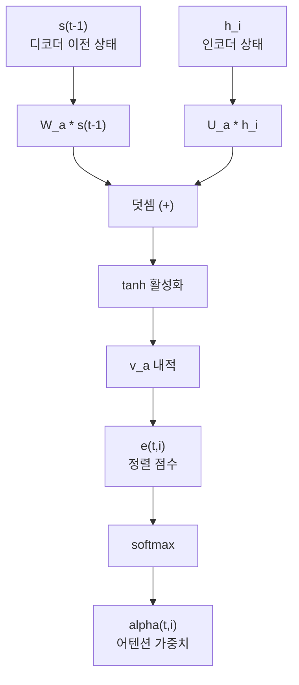
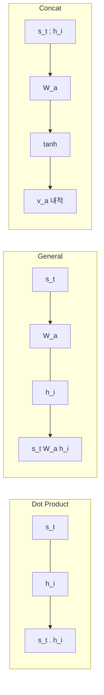
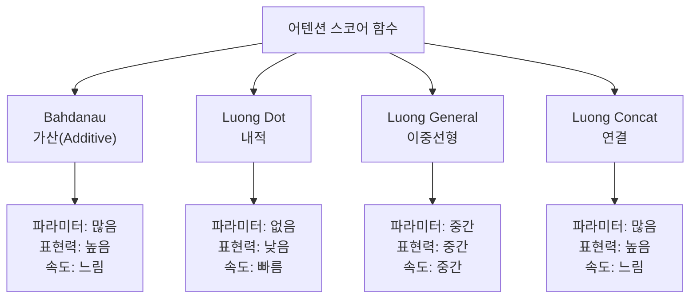
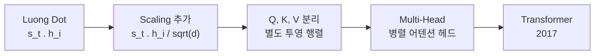

# Bahdanau와 Luong 어텐션

> 어텐션 메커니즘의 두 거장 — Bahdanau(가산) 어텐션과 Luong(곱셈) 어텐션의 수학적 정의와 구조적 차이를 깊이 비교합니다.

## 개요

이 섹션에서는 어텐션 메커니즘의 양대 산맥인 **Bahdanau 어텐션**과 **Luong 어텐션**을 수학적으로 정의하고, PyTorch로 직접 구현하며, 두 방식의 구조적 차이를 실험적으로 비교합니다.

**선수 지식**: [01. 어텐션의 직관적 이해](12-어텐션-메커니즘/01-01-어텐션의-직관적-이해.md)에서 배운 Query-Key-Value 패러다임, 내적 어텐션과 가산 어텐션의 기본 개념

**학습 목표**:
- Bahdanau(Additive) 어텐션의 수학적 정의와 동작 원리를 설명할 수 있다
- Luong(Multiplicative) 어텐션의 세 가지 스코어 함수(dot, general, concat)를 구분하고 구현할 수 있다
- Pre-Attention과 Post-Attention 타이밍의 차이를 이해하고, 각 방식이 디코딩에 미치는 영향을 설명할 수 있다

## 왜 알아야 할까?

[이전 섹션](12-어텐션-메커니즘/01-01-어텐션의-직관적-이해.md)에서 어텐션의 "왜"를 이해했다면, 이제 "어떻게"를 파고들 차례입니다. 2014년 Bahdanau의 논문과 2015년 Luong의 논문은 어텐션 메커니즘을 실용적으로 정립한 두 이정표인데요, 이 두 논문의 설계 철학을 이해하면 나중에 [트랜스포머](13-트랜스포머-아키텍처-심층-분석/01-01-트랜스포머-아키텍처-전체-조망.md)의 Scaled Dot-Product Attention이 왜 그런 형태가 되었는지 자연스럽게 이해할 수 있습니다.

실무적으로도 Luong의 dot-product 방식은 트랜스포머의 직계 조상이고, Bahdanau의 가산 방식은 소규모 모델에서 여전히 경쟁력이 있어서 두 가지 모두 알아둘 가치가 충분합니다.

## 핵심 개념

### 개념 1: Bahdanau(가산) 어텐션 — 신경망으로 유사도를 계산하다

> 💡 **비유**: Bahdanau 어텐션은 마치 **면접관**과 같습니다. 지원자의 이력서(인코더 은닉 상태)와 현재 필요한 역할(디코더 상태)을 각각 분석한 뒤, 두 정보를 종합적으로 평가해서 점수를 매기는 거죠. 단순히 "비슷한가?"가 아니라, 학습된 기준으로 깊이 있게 평가합니다.

Bahdanau 어텐션은 2014년 Dzmitry Bahdanau가 제안한 방식으로, **가산(Additive)** 어텐션이라고도 부릅니다. 핵심은 두 벡터의 유사도를 단순한 내적이 아닌 **작은 신경망(feed-forward network)**으로 계산한다는 점입니다.

수학적 정의를 보겠습니다:

$$e_{t,i} = \mathbf{v}_a^\top \tanh(\mathbf{W}_a \mathbf{s}_{t-1} + \mathbf{U}_a \mathbf{h}_i)$$

여기서:
- $\mathbf{s}_{t-1}$: 디코더의 **이전** 은닉 상태 (시점 $t-1$)
- $\mathbf{h}_i$: 인코더의 $i$번째 은닉 상태
- $\mathbf{W}_a$, $\mathbf{U}_a$: 학습 가능한 가중치 행렬
- $\mathbf{v}_a$: 스칼라 점수를 만드는 학습 가능한 벡터
- $\tanh$: 비선형 활성화 함수

> 📊 **그림 1**: Bahdanau 어텐션의 계산 흐름



주목할 점은 디코더 상태로 $\mathbf{s}_{t-1}$, 즉 **이전 시점**의 상태를 사용한다는 것입니다. 현재 시점 $t$의 디코더 상태가 아직 생성되기 전에 어텐션을 계산하기 때문이죠. 이를 **Pre-Attention**이라고 합니다.

어텐션 가중치와 문맥 벡터는 이전 섹션에서 배운 것과 동일합니다:

$$\alpha_{t,i} = \frac{\exp(e_{t,i})}{\sum_{j=1}^{T_x} \exp(e_{t,j})}$$

$$\mathbf{c}_t = \sum_{i=1}^{T_x} \alpha_{t,i} \mathbf{h}_i$$

PyTorch로 구현해보겠습니다:

```python
import torch
import torch.nn as nn
import torch.nn.functional as F

class BahdanauAttention(nn.Module):
    """Bahdanau(가산) 어텐션 메커니즘"""
    
    def __init__(self, hidden_size):
        super().__init__()
        # 디코더 상태를 변환하는 가중치 W_a
        self.W_a = nn.Linear(hidden_size, hidden_size, bias=False)
        # 인코더 상태를 변환하는 가중치 U_a
        self.U_a = nn.Linear(hidden_size, hidden_size, bias=False)
        # 스칼라 점수를 만드는 벡터 v_a
        self.v_a = nn.Linear(hidden_size, 1, bias=False)
    
    def forward(self, decoder_hidden, encoder_outputs):
        """
        Args:
            decoder_hidden: (batch, hidden_size) — s_{t-1}
            encoder_outputs: (batch, src_len, hidden_size) — 모든 h_i
        Returns:
            context: (batch, hidden_size) — 문맥 벡터
            weights: (batch, src_len) — 어텐션 가중치
        """
        # decoder_hidden을 (batch, 1, hidden_size)로 확장
        query = decoder_hidden.unsqueeze(1)  # (batch, 1, hidden)
        
        # 정렬 점수 계산: v_a * tanh(W_a * s + U_a * h)
        scores = self.v_a(
            torch.tanh(self.W_a(query) + self.U_a(encoder_outputs))
        )  # (batch, src_len, 1)
        scores = scores.squeeze(-1)  # (batch, src_len)
        
        # softmax로 가중치 정규화
        weights = F.softmax(scores, dim=-1)  # (batch, src_len)
        
        # 가중 합산으로 문맥 벡터 생성
        context = torch.bmm(
            weights.unsqueeze(1), encoder_outputs
        ).squeeze(1)  # (batch, hidden)
        
        return context, weights
```

### 개념 2: Luong(곱셈) 어텐션 — 더 단순하고, 더 다양하게

> 💡 **비유**: Luong 어텐션은 마치 **직감적인 매칭 시스템**입니다. Bahdanau가 면접관처럼 깊이 평가했다면, Luong은 "이 두 벡터가 같은 방향을 가리키고 있나?"를 직접 비교합니다. 마치 나침반 두 개를 놓고 방향이 얼마나 일치하는지 보는 것처럼요.

2015년 Minh-Thang Luong은 Bahdanau의 아이디어를 발전시켜 세 가지 스코어 함수를 제안했습니다. **곱셈(Multiplicative)** 어텐션이라 불리는 이유는 핵심 스코어 함수가 행렬 곱셈 기반이기 때문입니다.

> 📊 **그림 2**: Luong 어텐션의 세 가지 스코어 함수 비교



#### 1. Dot Product (내적)

$$e_{t,i} = \mathbf{s}_t^\top \mathbf{h}_i$$

가장 단순합니다. **학습 파라미터가 전혀 없고**, 두 벡터의 내적만으로 유사도를 측정합니다. 단, 디코더와 인코더의 은닉 차원이 같아야 합니다.

#### 2. General (이중선형)

$$e_{t,i} = \mathbf{s}_t^\top \mathbf{W}_a \mathbf{h}_i$$

가중치 행렬 $\mathbf{W}_a$를 사이에 끼워 두 벡터 공간 사이의 "번역"을 학습합니다. 차원이 달라도 사용 가능하고, 어떤 차원 조합이 중요한지를 학습합니다.

#### 3. Concat (연결)

$$e_{t,i} = \mathbf{v}_a^\top \tanh(\mathbf{W}_a [\mathbf{s}_t ; \mathbf{h}_i])$$

사실 Bahdanau의 가산 방식과 매우 유사한데요, 두 벡터를 연결(concatenate)한 뒤 신경망을 통과시킵니다. Luong 논문에서는 이를 세 번째 대안으로 제시했습니다.

가장 중요한 차이점 — Luong은 디코더의 **현재** 상태 $\mathbf{s}_t$를 사용합니다. 이를 **Post-Attention**이라고 합니다.

```python
class LuongAttention(nn.Module):
    """Luong(곱셈) 어텐션 — 세 가지 스코어 함수 지원"""
    
    def __init__(self, hidden_size, method="dot"):
        super().__init__()
        self.method = method
        self.hidden_size = hidden_size
        
        if method == "general":
            # General: s^T W_a h
            self.W_a = nn.Linear(hidden_size, hidden_size, bias=False)
        elif method == "concat":
            # Concat: v^T tanh(W_a [s; h])
            self.W_a = nn.Linear(hidden_size * 2, hidden_size, bias=False)
            self.v_a = nn.Linear(hidden_size, 1, bias=False)
    
    def _score(self, decoder_hidden, encoder_outputs):
        """스코어 함수 선택"""
        if self.method == "dot":
            # (batch, src_len, hidden) @ (batch, hidden, 1) → (batch, src_len)
            return torch.bmm(
                encoder_outputs, decoder_hidden.unsqueeze(2)
            ).squeeze(-1)
        
        elif self.method == "general":
            # W_a를 디코더 상태에 적용 후 내적
            energy = self.W_a(decoder_hidden)  # (batch, hidden)
            return torch.bmm(
                encoder_outputs, energy.unsqueeze(2)
            ).squeeze(-1)
        
        elif self.method == "concat":
            # s_t를 src_len만큼 복제하여 h_i와 연결
            src_len = encoder_outputs.size(1)
            query = decoder_hidden.unsqueeze(1).expand(-1, src_len, -1)
            concat = torch.cat([query, encoder_outputs], dim=-1)
            return self.v_a(torch.tanh(self.W_a(concat))).squeeze(-1)
    
    def forward(self, decoder_hidden, encoder_outputs):
        """
        Args:
            decoder_hidden: (batch, hidden_size) — s_t (현재 상태!)
            encoder_outputs: (batch, src_len, hidden_size)
        """
        scores = self._score(decoder_hidden, encoder_outputs)
        weights = F.softmax(scores, dim=-1)
        context = torch.bmm(weights.unsqueeze(1), encoder_outputs).squeeze(1)
        return context, weights
```

### 개념 3: Pre-Attention vs Post-Attention — 타이밍이 모든 것을 바꾼다

> 💡 **비유**: 시험을 볼 때 참고 자료를 **문제를 읽기 전에** 훑어보는 것(Pre-Attention)과 **문제를 읽은 후에** 필요한 부분만 찾아보는 것(Post-Attention)의 차이입니다. Post-Attention이 더 효율적이겠죠? 무엇을 찾아야 할지 이미 알고 있으니까요.

이 타이밍 차이는 단순한 구현 세부사항이 아니라, 디코딩 파이프라인 전체 구조를 결정짓는 핵심 설계 결정입니다.

> 📊 **그림 3**: Pre-Attention(Bahdanau) vs Post-Attention(Luong) 디코딩 흐름

```mermaid
sequenceDiagram
    participant E as 인코더 출력
    participant A as 어텐션
    participant D as 디코더 RNN
    participant O as 출력층
    
    Note over E,O: Bahdanau (Pre-Attention)
    A->>E: s(t-1)로 어텐션 계산
    E-->>A: c(t) 문맥 벡터
    A->>D: [y(t-1); c(t)] 입력
    D->>O: s(t) → 예측
    
    Note over E,O: Luong (Post-Attention)
    D->>D: y(t-1) → s(t) 먼저 계산
    D->>A: s(t)로 어텐션 계산
    A->>E: 유사도 스코어
    E-->>A: c(t) 문맥 벡터
    A->>O: concat(s(t), c(t)) → 예측
```

**Bahdanau (Pre-Attention)**:
1. 이전 디코더 상태 $\mathbf{s}_{t-1}$로 어텐션 계산 → 문맥 벡터 $\mathbf{c}_t$
2. 이전 출력 $y_{t-1}$과 $\mathbf{c}_t$를 **함께** 디코더 RNN에 입력
3. 디코더가 $\mathbf{s}_t$ 생성 → 출력 예측

**Luong (Post-Attention)**:
1. 디코더 RNN이 먼저 $\mathbf{s}_t$ 생성
2. $\mathbf{s}_t$로 어텐션 계산 → 문맥 벡터 $\mathbf{c}_t$
3. $[\mathbf{s}_t ; \mathbf{c}_t]$를 연결하여 **어텐셔널 히든 상태** 생성:

$$\tilde{\mathbf{s}}_t = \tanh(\mathbf{W}_c [\mathbf{c}_t ; \mathbf{s}_t])$$

이 $\tilde{\mathbf{s}}_t$가 최종 출력 예측에 사용됩니다.

### 개념 4: 세 방식의 종합 비교 — 파라미터, 속도, 성능

> 📊 **그림 4**: 어텐션 방식별 특성 비교 요약



각 방식의 파라미터 수를 은닉 차원 $d$로 비교하면:

| 방식 | 수식 | 학습 파라미터 수 | 디코더 상태 |
|------|------|------------------|-------------|
| Bahdanau | $\mathbf{v}^\top \tanh(\mathbf{W}\mathbf{s}_{t-1} + \mathbf{U}\mathbf{h}_i)$ | $2d^2 + d$ | $\mathbf{s}_{t-1}$ (이전) |
| Luong Dot | $\mathbf{s}_t^\top \mathbf{h}_i$ | $0$ | $\mathbf{s}_t$ (현재) |
| Luong General | $\mathbf{s}_t^\top \mathbf{W}_a \mathbf{h}_i$ | $d^2$ | $\mathbf{s}_t$ (현재) |
| Luong Concat | $\mathbf{v}^\top \tanh(\mathbf{W}_a [\mathbf{s}_t ; \mathbf{h}_i])$ | $2d^2 + d$ | $\mathbf{s}_t$ (현재) |

> ⚠️ **흔한 오해**: "Bahdanau는 항상 Luong보다 성능이 떨어진다"고 생각하기 쉽지만, 그렇지 않습니다. 소규모 데이터셋에서는 Bahdanau의 비선형 스코어 함수가 오히려 더 풍부한 관계를 학습할 수 있거든요. Luong Dot은 파라미터가 0개라서 빠르지만 표현력이 제한적이고, General은 좋은 절충안입니다.

## 실습: 직접 해보기

세 가지 어텐션 방식을 동일 조건에서 비교하는 실험을 진행합니다. 어텐션 가중치의 분포가 어떻게 다른지, 파라미터 수는 얼마나 차이 나는지 확인해보겠습니다.

```run:python
import torch
import torch.nn as nn
import torch.nn.functional as F

# ── 시드 고정 ──
torch.manual_seed(42)

# ── 하이퍼파라미터 ──
batch_size = 2
src_len = 6      # 소스 시퀀스 길이 (인코더)
hidden_size = 8  # 은닉 차원

# ── 가상 데이터 생성 ──
encoder_outputs = torch.randn(batch_size, src_len, hidden_size)
decoder_hidden = torch.randn(batch_size, hidden_size)

# ── 1. Bahdanau Attention ──
class BahdanauAttention(nn.Module):
    def __init__(self, hidden_size):
        super().__init__()
        self.W_a = nn.Linear(hidden_size, hidden_size, bias=False)
        self.U_a = nn.Linear(hidden_size, hidden_size, bias=False)
        self.v_a = nn.Linear(hidden_size, 1, bias=False)
    
    def forward(self, decoder_hidden, encoder_outputs):
        query = decoder_hidden.unsqueeze(1)
        scores = self.v_a(torch.tanh(self.W_a(query) + self.U_a(encoder_outputs)))
        scores = scores.squeeze(-1)
        weights = F.softmax(scores, dim=-1)
        context = torch.bmm(weights.unsqueeze(1), encoder_outputs).squeeze(1)
        return context, weights

# ── 2. Luong Attention (3가지 방식) ──
class LuongAttention(nn.Module):
    def __init__(self, hidden_size, method="dot"):
        super().__init__()
        self.method = method
        if method == "general":
            self.W_a = nn.Linear(hidden_size, hidden_size, bias=False)
        elif method == "concat":
            self.W_a = nn.Linear(hidden_size * 2, hidden_size, bias=False)
            self.v_a = nn.Linear(hidden_size, 1, bias=False)
    
    def forward(self, decoder_hidden, encoder_outputs):
        if self.method == "dot":
            scores = torch.bmm(encoder_outputs, decoder_hidden.unsqueeze(2)).squeeze(-1)
        elif self.method == "general":
            energy = self.W_a(decoder_hidden)
            scores = torch.bmm(encoder_outputs, energy.unsqueeze(2)).squeeze(-1)
        elif self.method == "concat":
            src_len = encoder_outputs.size(1)
            query = decoder_hidden.unsqueeze(1).expand(-1, src_len, -1)
            concat = torch.cat([query, encoder_outputs], dim=-1)
            scores = self.v_a(torch.tanh(self.W_a(concat))).squeeze(-1)
        
        weights = F.softmax(scores, dim=-1)
        context = torch.bmm(weights.unsqueeze(1), encoder_outputs).squeeze(1)
        return context, weights

# ── 각 방식 비교 ──
attn_bahdanau = BahdanauAttention(hidden_size)
attn_dot = LuongAttention(hidden_size, "dot")
attn_general = LuongAttention(hidden_size, "general")
attn_concat = LuongAttention(hidden_size, "concat")

methods = {
    "Bahdanau": attn_bahdanau,
    "Luong-Dot": attn_dot,
    "Luong-General": attn_general,
    "Luong-Concat": attn_concat,
}

print(f"입력 크기: encoder=({batch_size}, {src_len}, {hidden_size}), "
      f"decoder=({batch_size}, {hidden_size})")
print("=" * 60)

for name, attn in methods.items():
    ctx, w = attn(decoder_hidden, encoder_outputs)
    n_params = sum(p.numel() for p in attn.parameters())
    print(f"\n[{name}]")
    print(f"  파라미터 수: {n_params}")
    print(f"  가중치 (batch 0): {w[0].detach().numpy().round(3)}")
    print(f"  문맥 벡터 크기: {ctx.shape}")
```

```output
입력 크기: encoder=(2, 6, 8), decoder=(2, 8)
============================================================

[Bahdanau]
  파라미터 수: 136
  가중치 (batch 0): [0.225 0.195 0.175 0.126 0.128 0.151]
  문맥 벡터 크기: torch.Size([2, 8])

[Luong-Dot]
  파라미터 수: 0
  가중치 (batch 0): [0.061 0.033 0.026 0.437 0.055 0.388]
  문맥 벡터 크기: torch.Size([2, 8])

[Luong-General]
  파라미터 수: 64
  가중치 (batch 0): [0.073 0.151 0.094 0.071 0.349 0.261]
  문맥 벡터 크기: torch.Size([2, 8])

[Luong-Concat]
  파라미터 수: 136
  가중치 (batch 0): [0.169 0.180 0.162 0.164 0.166 0.158]
  문맥 벡터 크기: torch.Size([2, 8])
```

결과를 보면 몇 가지 흥미로운 패턴이 보입니다:

- **Bahdanau**와 **Luong-Concat**은 파라미터 수가 동일합니다 ($2d^2 + d = 2 \times 64 + 8 = 136$). 구조가 유사하기 때문이죠.
- **Luong-Dot**은 파라미터가 0개이면서도 가중치 분포가 더 **뾰족(sharp)**합니다. 내적은 벡터 방향이 비슷한 곳에 강하게 집중하는 경향이 있거든요.
- **Luong-Concat**의 가중치는 비교적 **균등(flat)**한데, 이는 초기화 상태에서 tanh 비선형성이 값을 압축하기 때문입니다.

```run:python
# ── 파라미터 수 수식 검증 ──
d = hidden_size  # 8

bahdanau_params = d * d + d * d + d  # W_a + U_a + v_a
luong_dot_params = 0
luong_general_params = d * d          # W_a만
luong_concat_params = 2 * d * d + d   # W_a (2d→d) + v_a

print("파라미터 수 공식 검증 (hidden_size=8):")
print(f"  Bahdanau:      2*d^2 + d = {bahdanau_params}")
print(f"  Luong-Dot:     0 = {luong_dot_params}")
print(f"  Luong-General: d^2 = {luong_general_params}")
print(f"  Luong-Concat:  2*d^2 + d = {luong_concat_params}")
print(f"\n실제 hidden_size=512라면:")
d2 = 512
print(f"  Bahdanau:      {2*d2**2 + d2:,} 파라미터")
print(f"  Luong-Dot:     0 파라미터")
print(f"  Luong-General: {d2**2:,} 파라미터")
```

```output
파라미터 수 공식 검증 (hidden_size=8):
  Bahdanau:      2*d^2 + d = 136
  Luong-Dot:     0 = 0
  Luong-General: d^2 = 64
  Luong-Concat:  2*d^2 + d = 136

실제 hidden_size=512라면:
  Bahdanau:      524,800 파라미터
  Luong-Dot:     0 파라미터
  Luong-General: 262,144 파라미터
```

실제 모델에서 사용하는 512 차원으로 계산하면, Bahdanau는 약 52만 개의 추가 파라미터를 도입하는 반면 Luong-Dot은 추가 파라미터가 전혀 없습니다. 이 효율성이 트랜스포머가 dot-product 방식을 선택한 핵심 이유 중 하나입니다.

## 더 깊이 알아보기

### 두 논문의 탄생 스토리

Bahdanau 어텐션의 탄생에는 흥미로운 배경이 있습니다. 2014년, 몬트리올 대학의 Yoshua Bengio 연구실에서 박사과정이었던 Dzmitry Bahdanau는 Cho et al.의 기본 인코더-디코더 모델이 긴 문장에서 급격하게 성능이 떨어지는 현상을 관찰했습니다. "긴 문장의 모든 정보를 하나의 고정된 벡터에 우겨넣는 건 말이 안 된다"는 직관에서 출발하여, **"정렬(alignment)"**이라는 개념을 도입했습니다. 놀랍게도, 이 논문의 원래 제목에는 "attention"이라는 단어가 없었습니다 — "Jointly Learning to **Align** and Translate"였죠. "어텐션"이라는 용어가 널리 쓰이게 된 것은 이후의 일입니다.

약 1년 뒤, 스탠포드 대학의 Minh-Thang Luong은 Bahdanau의 가산 방식이 너무 복잡하다고 느꼈습니다. "행렬 곱셈만으로도 충분히 좋은 유사도를 측정할 수 있지 않을까?"라는 질문에서 출발하여, 세 가지 스코어 함수를 체계적으로 비교한 논문을 발표했습니다. 이 논문에서 제안한 dot-product 방식은 2017년 "Attention Is All You Need" 논문에서 **Scaled Dot-Product Attention**으로 발전하며 트랜스포머의 핵심이 됩니다.

> 💡 **알고 계셨나요?**: Luong의 논문에서는 Global Attention(모든 소스 위치에 주목)과 Local Attention(일부 소스 위치만 선택)도 구분했는데요, Local Attention은 컴퓨터 비전의 "Hard Attention"에서 영감을 받았지만 미분 가능하게 설계한 것입니다. 이 아이디어는 나중에 Sparse Attention과 같은 효율적 어텐션 연구로 이어지게 됩니다.

### Dot-Product에서 트랜스포머까지

Luong의 dot-product 스코어가 트랜스포머로 진화한 과정을 정리하면:

> 📊 **그림 5**: Dot-Product 어텐션에서 트랜스포머까지의 진화



Vaswani et al.(2017)은 Luong의 dot-product에 $\sqrt{d_k}$로 스케일링을 추가하여 소프트맥스의 기울기 소실 문제를 해결했습니다. 이 내용은 [스케일드 닷-프로덕트 어텐션](13-트랜스포머-아키텍처-심층-분석/02-02-스케일드-닷-프로덕트-어텐션.md)에서 자세히 다룹니다.

## 흔한 오해와 팁

> ⚠️ **흔한 오해**: "Bahdanau = 가산, Luong = 곱셈"이라고 단순히 외우기 쉽지만, Luong의 세 번째 방식(Concat)은 사실상 가산 방식입니다. 정확하게는 "Bahdanau 논문은 가산 방식만 제안했고, Luong 논문은 곱셈 + 가산을 포함한 세 가지를 비교했다"가 맞습니다.

> 🔥 **실무 팁**: 어떤 어텐션 방식을 선택해야 할까요? 빠른 가이드라인입니다:
> - **데이터가 충분하고 모델이 클 때**: Luong-Dot 또는 Luong-General (계산 효율)
> - **소규모 데이터셋, 복잡한 정렬이 필요할 때**: Bahdanau (비선형 학습 능력)
> - **트랜스포머 계열**: Scaled Dot-Product (Luong-Dot의 직계 후손)
> - 현대 실무에서는 대부분 트랜스포머를 쓰므로, 두 방식을 "역사적 맥락"으로 이해하되 Dot-Product의 효율성이 왜 선택되었는지를 체화하는 것이 핵심입니다.

> 💡 **알고 계셨나요?**: Bahdanau 어텐션은 양방향(Bidirectional) RNN 인코더를 사용한 최초의 번역 모델이기도 합니다. 순방향과 역방향 은닉 상태를 연결하여 각 단어가 전체 문맥을 반영하도록 했는데, 이 아이디어는 나중에 BERT의 양방향 인코딩 철학으로 이어집니다.

## 핵심 정리

| 개념 | 설명 |
|------|------|
| Bahdanau 어텐션 | $\mathbf{v}^\top \tanh(\mathbf{W}\mathbf{s}_{t-1} + \mathbf{U}\mathbf{h}_i)$ — 가산 방식, 이전 디코더 상태 사용 |
| Pre-Attention | 어텐션을 먼저 계산 → 문맥 벡터를 디코더 입력에 포함 (Bahdanau) |
| Luong Dot | $\mathbf{s}_t^\top \mathbf{h}_i$ — 파라미터 0, 가장 빠르고 단순 |
| Luong General | $\mathbf{s}_t^\top \mathbf{W}_a \mathbf{h}_i$ — 학습 가능한 유사도 변환 |
| Luong Concat | $\mathbf{v}^\top \tanh(\mathbf{W}_a [\mathbf{s}_t ; \mathbf{h}_i])$ — Bahdanau와 유사 |
| Post-Attention | 디코더 RNN 먼저 실행 → 현재 상태로 어텐션 계산 (Luong) |
| 어텐셔널 히든 상태 | $\tilde{\mathbf{s}}_t = \tanh(\mathbf{W}_c [\mathbf{c}_t ; \mathbf{s}_t])$ — Luong의 최종 출력 |
| Dot → Transformer | Luong의 dot-product가 스케일링 + QKV 분리를 거쳐 트랜스포머로 발전 |

## 다음 섹션 미리보기

이제 Bahdanau와 Luong 어텐션의 수학과 구현을 이해했으니, [03. 어텐션 Seq2Seq 구현](12-어텐션-메커니즘/03-03-어텐션-seq2seq-구현.md)에서 이 어텐션 모듈을 실제 Seq2Seq 번역 모델에 통합합니다. 인코더, 디코더, 어텐션을 하나로 조립하여 실제 번역 데이터로 학습시키는 전체 파이프라인을 구축하게 됩니다.

## 참고 자료

- [Neural Machine Translation by Jointly Learning to Align and Translate (Bahdanau et al., 2014)](https://arxiv.org/abs/1409.0473) - 가산 어텐션을 최초로 제안한 원본 논문, ICLR 2015 발표
- [Effective Approaches to Attention-based Neural Machine Translation (Luong et al., 2015)](https://arxiv.org/abs/1508.04025) - 세 가지 스코어 함수와 Global/Local 어텐션을 체계적으로 비교한 논문
- [The Luong Attention Mechanism — Machine Learning Mastery](https://machinelearningmastery.com/the-luong-attention-mechanism/) - Luong 어텐션의 수학적 정의와 구현을 단계별로 설명하는 튜토리얼
- [Attention and Self-Attention for NLP — LMU Munich](https://slds-lmu.github.io/seminar_nlp_ss20/attention-and-self-attention-for-nlp.html) - Bahdanau/Luong 비교와 셀프 어텐션으로의 발전을 정리한 학술 자료
- [Implementing Attention in PyTorch — Tomek Korbak](https://tomekkorbak.com/2020/06/26/implementing-attention-in-pytorch/) - 가산/곱셈 어텐션의 PyTorch 구현을 명확하게 비교한 블로그

---
### 🔗 Related Sessions
- [attention_mechanism](12-어텐션-메커니즘/01-01-어텐션의-직관적-이해.md) (prerequisite)
- [attention_mechanism](12-어텐션-메커니즘/01-01-어텐션의-직관적-이해.md) (prerequisite)
- [context_vector_dynamic](12-어텐션-메커니즘/01-01-어텐션의-직관적-이해.md) (prerequisite)
- [context_vector_dynamic](12-어텐션-메커니즘/01-01-어텐션의-직관적-이해.md) (prerequisite)
- [attention_weights](12-어텐션-메커니즘/01-01-어텐션의-직관적-이해.md) (prerequisite)
- [attention_weights](12-어텐션-메커니즘/01-01-어텐션의-직관적-이해.md) (prerequisite)
- [query_key_value](12-어텐션-메커니즘/01-01-어텐션의-직관적-이해.md) (prerequisite)
- [query_key_value](12-어텐션-메커니즘/01-01-어텐션의-직관적-이해.md) (prerequisite)
- [dot_product_attention](12-어텐션-메커니즘/01-01-어텐션의-직관적-이해.md) (prerequisite)
- [dot_product_attention](12-어텐션-메커니즘/01-01-어텐션의-직관적-이해.md) (prerequisite)
- [additive_attention](12-어텐션-메커니즘/01-01-어텐션의-직관적-이해.md) (prerequisite)
- [additive_attention](12-어텐션-메커니즘/01-01-어텐션의-직관적-이해.md) (prerequisite)
- [information_bottleneck](12-어텐션-메커니즘/01-01-어텐션의-직관적-이해.md) (prerequisite)
- [information_bottleneck](12-어텐션-메커니즘/01-01-어텐션의-직관적-이해.md) (prerequisite)
- [soft_attention](12-어텐션-메커니즘/01-01-어텐션의-직관적-이해.md) (prerequisite)
