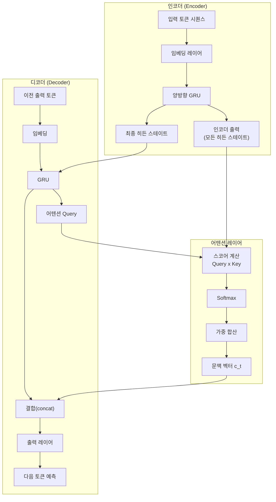
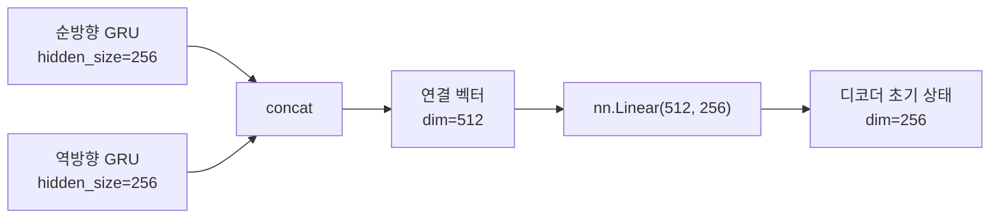
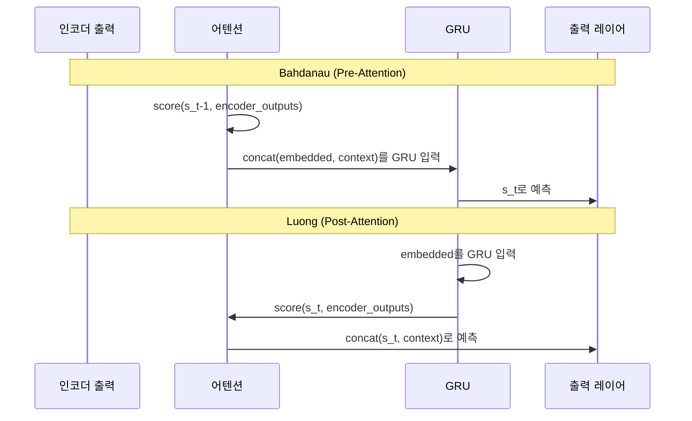
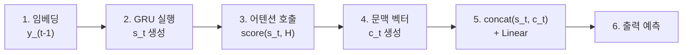
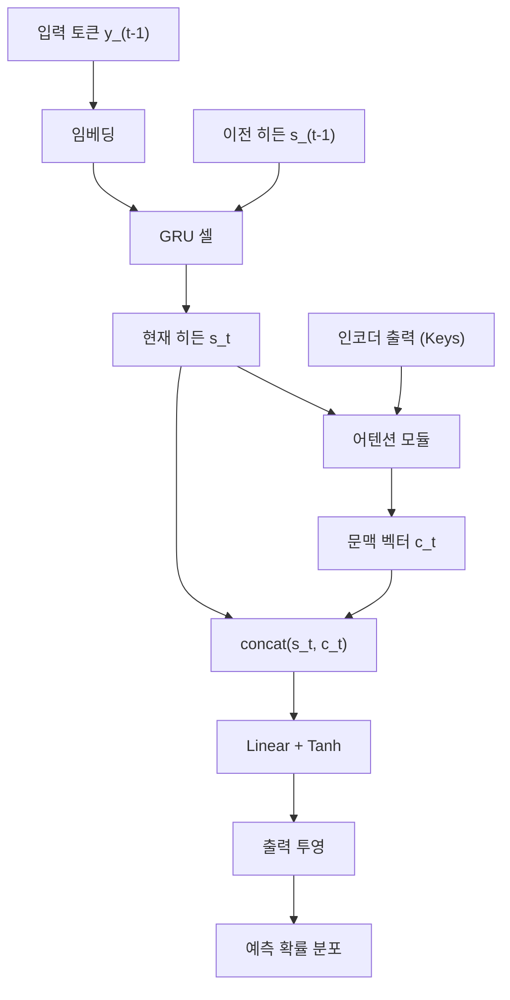
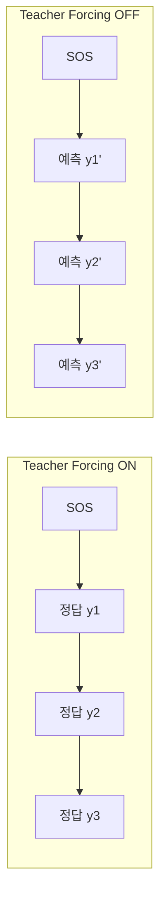

# 03. 어텐션 Seq2Seq 구현

> 기존 Seq2Seq 모델에 어텐션 레이어를 통합하여, 매 디코딩 스텝마다 동적으로 문맥 벡터를 생성하는 전체 번역 시스템을 PyTorch로 구현합니다.

## 개요

이 섹션에서는 앞서 개별적으로 학습한 어텐션 모듈(Bahdanau, Luong)을 실제 Seq2Seq 인코더-디코더 파이프라인에 끼워 넣어, **처음부터 끝까지 실행 가능한 번역 모델**을 완성합니다. 단순히 어텐션 클래스를 만드는 것에서 한 발 더 나아가, 인코더 출력이 어텐션을 거쳐 디코더의 예측에 영향을 미치는 **전체 데이터 흐름**을 직접 체험하는 것이 목표입니다.

**선수 지식**:
- [01. 어텐션의 직관적 이해](12-어텐션-메커니즘/01-01-어텐션의-직관적-이해.md)에서 배운 Query-Key-Value 패러다임과 소프트맥스 가중 합산
- [02. Bahdanau와 Luong 어텐션](12-어텐션-메커니즘/02-02-bahdanau와-luong-어텐션.md)에서 다룬 스코어 함수와 Pre/Post Attention 타이밍
- [03. Seq2Seq 모델 구현](11-시퀀스-투-시퀀스와-기계-번역/03-03-seq2seq-모델-구현.md)에서 작성한 기본 인코더-디코더 구조

**학습 목표**:
- Seq2Seq 인코더에 양방향 GRU를 적용하고 출력을 어텐션 Key로 활용하는 방법을 이해한다
- 어텐션 레이어가 디코더 루프 안에서 호출되는 정확한 시점과 데이터 흐름을 파악한다
- Bahdanau/Luong 어텐션을 교체 가능하게 설계한 완전한 번역 모델을 PyTorch로 구현한다

## 왜 알아야 할까?

이전 섹션에서 우리는 어텐션 모듈을 **독립적인 부품**으로 만들었습니다. 하지만 실제로 번역이나 요약 같은 태스크에서 어텐션이 동작하려면, 인코더의 출력 → 어텐션 가중치 계산 → 문맥 벡터 생성 → 디코더 예측이라는 **완전한 파이프라인**이 필요합니다.

이 통합 과정에서 의외로 많은 엔지니어들이 막히는데요. "어텐션 모듈은 이해했는데, 디코더 루프의 어디에서 호출해야 하지?", "인코더가 양방향이면 히든 스테이트 차원이 2배가 되는데 어떻게 맞추지?" 같은 실전 질문이 쏟아지거든요.

이 세션을 마치면, 여러분은 **어텐션의 이론적 이해**를 **동작하는 코드**로 완전히 연결할 수 있게 됩니다. 이 경험은 [Ch13. 트랜스포머 아키텍처 심층 분석](13-트랜스포머-아키텍처-심층-분석/01-01-트랜스포머-아키텍처-전체-조망.md)에서 셀프 어텐션 기반 모델을 이해하는 데 직접적인 밑거름이 됩니다.

## 핵심 개념

### 개념 1: 어텐션 Seq2Seq의 전체 아키텍처

> 💡 **비유**: 기존 Seq2Seq가 "책 한 권을 읽고 한 줄 요약을 기억해서 번역하는 것"이라면, 어텐션 Seq2Seq는 "원서를 옆에 펼쳐두고 번역할 때마다 관련 부분을 찾아보는 것"입니다. 번역가의 책상 위에 원서가 항상 펼쳐져 있는 거죠.

어텐션 Seq2Seq는 크게 세 개의 컴포넌트로 구성됩니다:

1. **인코더(Encoder)**: 입력 시퀀스를 양방향 GRU/LSTM으로 처리하여 각 타임스텝의 히든 스테이트를 모두 보존합니다. 이 히든 스테이트들이 어텐션의 **Key**이자 **Value**가 됩니다.
2. **어텐션 레이어(Attention)**: 디코더의 현재 상태(**Query**)와 인코더 출력(**Key**)의 유사도를 계산하고, 가중 합산으로 **동적 문맥 벡터**를 만듭니다.
3. **디코더(Decoder)**: 매 스텝마다 어텐션 레이어를 호출하여 문맥 벡터를 받아오고, 이를 자신의 히든 스테이트와 결합하여 다음 토큰을 예측합니다.

> 📊 **그림 1**: 어텐션 Seq2Seq의 전체 데이터 흐름



핵심 포인트는 인코더 출력(`E4`)이 **디코더의 모든 타임스텝에서 반복 참조**된다는 것입니다. 기존 Seq2Seq에서는 인코더의 마지막 히든 스테이트만 전달했죠. 이제는 인코더의 전체 히든 스테이트 시퀀스가 디코더에게 열린 "참고 자료"가 됩니다.

그림 1의 디코더 부분을 잘 보면, GRU(`D3`)가 먼저 실행되고 그 결과가 어텐션 Query(`D4`)로 사용됩니다. 이것이 바로 **Luong Post-Attention** 타이밍입니다 — 현재 스텝의 히든 상태 $s_t$를 Query로 사용하는 거죠. 만약 Bahdanau Pre-Attention이었다면, 어텐션이 GRU보다 먼저 호출되어 문맥 벡터가 GRU의 입력에 포함되는 구조가 됩니다.

### 개념 2: 양방향 인코더와 차원 맞추기

> 💡 **비유**: 문장을 이해할 때 왼쪽에서 오른쪽으로만 읽는 것보다, 양쪽 방향에서 읽은 정보를 합치면 각 단어의 문맥을 더 풍부하게 파악할 수 있죠. 양방향 GRU가 바로 그 역할입니다.

양방향 GRU를 사용하면, 각 타임스텝의 출력 차원이 `hidden_size * 2`가 됩니다. 그런데 디코더는 단방향이므로 히든 크기가 `hidden_size`입니다. 이 **차원 불일치**를 해결하는 방법이 중요합니다:

| 전략 | 방법 | 장단점 |
|------|------|--------|
| **Linear 투영** | `nn.Linear(hidden*2, hidden)`으로 변환 | 가장 일반적, 유연함 |
| **히든 합산** | 순방향 + 역방향 히든 상태를 더함 | 파라미터 추가 없음, 정보 손실 가능 |
| **히든 연결 + 디코더 확장** | 디코더 히든 크기를 `hidden*2`로 | 파라미터 증가, 정보 보존 |

이번 구현에서는 **Linear 투영** 방식을 사용하겠습니다. 인코더의 최종 히든 스테이트(양방향 2개)를 연결(concat)한 후 선형 변환으로 디코더의 초기 히든 스테이트 크기에 맞춥니다.

> 📊 **그림 2**: 양방향 인코더 출력의 차원 변환 과정



```python
import torch
import torch.nn as nn
import torch.nn.functional as F

class Encoder(nn.Module):
    def __init__(self, vocab_size, embed_size, hidden_size, n_layers=1, dropout=0.1):
        super().__init__()
        self.hidden_size = hidden_size
        self.n_layers = n_layers

        self.embedding = nn.Embedding(vocab_size, embed_size)
        self.gru = nn.GRU(
            embed_size, hidden_size,
            num_layers=n_layers,
            bidirectional=True,        # 양방향!
            batch_first=True,
            dropout=dropout if n_layers > 1 else 0
        )
        # 양방향 히든 → 디코더 히든 크기로 투영
        self.fc_hidden = nn.Linear(hidden_size * 2, hidden_size)
        self.dropout = nn.Dropout(dropout)

    def forward(self, src):
        # src: (batch, src_len)
        embedded = self.dropout(self.embedding(src))  # (batch, src_len, embed)
        outputs, hidden = self.gru(embedded)
        # outputs: (batch, src_len, hidden*2) — 어텐션의 Key/Value
        # hidden: (n_layers*2, batch, hidden) — 양방향이므로 *2

        # 양방향 히든을 합쳐서 디코더 초기 상태로 변환
        # hidden[-2]: 순방향 마지막, hidden[-1]: 역방향 마지막
        hidden = torch.cat((hidden[-2], hidden[-1]), dim=1)  # (batch, hidden*2)
        hidden = torch.tanh(self.fc_hidden(hidden))          # (batch, hidden)
        hidden = hidden.unsqueeze(0)                          # (1, batch, hidden)

        return outputs, hidden
```

여기서 `outputs`는 모든 타임스텝의 양방향 히든 스테이트를 담고 있어서, 어텐션 계산에 사용됩니다. `hidden`은 투영을 거쳐 디코더의 초기 히든 상태가 됩니다.

### 개념 3: 디코더 루프 안에서의 어텐션 호출 타이밍

> 💡 **비유**: 동시통역사가 한 단어를 말하기 직전에 원문의 관련 부분을 "힐끗" 보는 것을 상상해보세요. 이 "힐끗 보기"가 바로 어텐션 호출이고, **언제** 보느냐가 Bahdanau와 Luong의 핵심 차이입니다.

[이전 섹션](12-어텐션-메커니즘/02-02-bahdanau와-luong-어텐션.md)에서 배운 것처럼:
- **Bahdanau (Pre-Attention)**: GRU에 입력을 넣기 **전에** 어텐션을 계산. 이전 스텝의 히든 상태 $s_{t-1}$을 Query로 사용.
- **Luong (Post-Attention)**: GRU 출력을 낸 **후에** 어텐션을 계산. 현재 스텝의 히든 상태 $s_t$를 Query로 사용.

> 📊 **그림 3**: Bahdanau vs Luong 디코더 타이밍 비교



이번 구현에서는 **Luong 스타일(Post-Attention)**을 기본으로 채택합니다. Luong 방식이 구현이 더 직관적이고, 이후 트랜스포머로의 연결이 자연스럽기 때문입니다.

이 타이밍 차이를 코드 흐름으로 정리하면 다음과 같습니다:

> 📊 **그림 3-1**: Post-Attention 코드 흐름 — GRU 먼저, 어텐션은 그 다음



위 순서가 바로 아래 코드의 `forward` 메서드에서 1~5 단계로 주석 처리된 부분과 정확히 대응됩니다. **GRU가 먼저 실행되어 $s_t$를 생성하고, 그 $s_t$가 어텐션의 Query로 사용된다**는 점이 Post-Attention의 정의입니다.

```python
class Attention(nn.Module):
    """Luong 스타일 General 어텐션 (Post-Attention 타이밍)
    
    Query = 현재 스텝의 디코더 히든 상태 s_t (GRU 실행 후)
    Key/Value = 인코더의 전체 출력 시퀀스
    """
    def __init__(self, hidden_size, encoder_hidden_size):
        super().__init__()
        # General 스코어: s_t^T * W * h_j
        self.W = nn.Linear(encoder_hidden_size, hidden_size, bias=False)

    def forward(self, decoder_hidden, encoder_outputs, mask=None):
        # decoder_hidden: (batch, hidden) — GRU 실행 후의 s_t
        # encoder_outputs: (batch, src_len, enc_hidden)

        # 스코어 계산: (batch, src_len)
        energy = self.W(encoder_outputs)              # (batch, src_len, hidden)
        scores = torch.bmm(
            energy, decoder_hidden.unsqueeze(2)       # (batch, hidden, 1)
        ).squeeze(2)                                   # (batch, src_len)

        # 패딩 마스킹 (패딩 위치에 -inf → softmax 후 0)
        if mask is not None:
            scores = scores.masked_fill(mask == 0, -1e9)

        # 어텐션 가중치
        attn_weights = F.softmax(scores, dim=1)       # (batch, src_len)

        # 문맥 벡터: 가중 합산
        context = torch.bmm(
            attn_weights.unsqueeze(1),                 # (batch, 1, src_len)
            encoder_outputs                            # (batch, src_len, enc_hidden)
        ).squeeze(1)                                   # (batch, enc_hidden)

        return context, attn_weights
```

### 개념 4: 어텐션 디코더의 통합 구현

이제 어텐션 모듈을 디코더에 결합합니다. 디코더의 `forward` 메서드는 **한 타임스텝**만 처리하도록 설계하고, 학습 루프에서 for문으로 반복 호출하는 패턴을 사용합니다.

> 📊 **그림 4**: 어텐션 디코더 한 스텝의 내부 데이터 흐름



```python
class AttentionDecoder(nn.Module):
    """Luong Post-Attention 디코더
    
    핵심 흐름: 임베딩 → GRU(s_t 생성) → 어텐션(s_t로 Query) → concat → 예측
    Bahdanau Pre-Attention과의 차이: GRU가 어텐션보다 먼저 실행됨
    """
    def __init__(self, vocab_size, embed_size, hidden_size,
                 encoder_hidden_size, dropout=0.1):
        super().__init__()
        self.hidden_size = hidden_size

        self.embedding = nn.Embedding(vocab_size, embed_size)
        # Post-Attention: GRU 입력은 임베딩만 (문맥 벡터 미포함)
        self.gru = nn.GRU(embed_size, hidden_size, batch_first=True)
        self.attention = Attention(hidden_size, encoder_hidden_size)

        # 문맥 벡터 + 디코더 히든 → 결합 벡터
        self.concat_layer = nn.Linear(hidden_size + encoder_hidden_size, hidden_size)
        # 결합 벡터 → 어휘 확률
        self.output_layer = nn.Linear(hidden_size, vocab_size)
        self.dropout = nn.Dropout(dropout)

    def forward(self, input_token, hidden, encoder_outputs, mask=None):
        # input_token: (batch, 1) — 한 타임스텝
        # hidden: (1, batch, hidden)
        # encoder_outputs: (batch, src_len, enc_hidden)

        # 1. 임베딩
        embedded = self.dropout(self.embedding(input_token))  # (batch, 1, embed)

        # 2. GRU 한 스텝 (Post-Attention이므로 GRU 먼저!)
        #    Bahdanau라면 여기서 context를 embedded와 concat하여 GRU에 넣음
        gru_output, hidden = self.gru(embedded, hidden)
        # gru_output: (batch, 1, hidden)

        # 3. 어텐션 계산 — GRU 출력(s_t)이 Query
        #    이것이 Post-Attention의 핵심: s_t (현재 상태)를 Query로 사용
        query = gru_output.squeeze(1)                  # (batch, hidden)
        context, attn_weights = self.attention(query, encoder_outputs, mask)

        # 4. 결합: [s_t ; c_t]
        combined = torch.cat((query, context), dim=1)  # (batch, hidden+enc_hidden)
        combined = torch.tanh(self.concat_layer(combined))  # (batch, hidden)

        # 5. 출력 예측
        output = self.output_layer(combined)           # (batch, vocab_size)

        return output, hidden, attn_weights
```

핵심 포인트를 정리하면:
- `forward`는 **한 토큰**만 처리합니다 (타임스텝 차원 = 1)
- GRU를 먼저 실행한 **후** 어텐션을 계산합니다 (Luong Post-Attention)
- GRU 입력은 임베딩만 사용합니다 — Bahdanau Pre-Attention이었다면 `concat(embedded, context)`가 GRU 입력이 됩니다
- 문맥 벡터와 GRU 출력을 concat → Linear → Tanh → 출력 투영 순서입니다
- `attn_weights`를 반환하여 나중에 [시각화](12-어텐션-메커니즘/04-04-어텐션-가중치-시각화.md)에 활용합니다

> ⚠️ **흔한 오해**: "Luong 어텐션이면 GRU 입력에 문맥 벡터가 들어가지 않나요?" — 아닙니다. **Post-Attention**의 핵심은 GRU가 어텐션보다 **먼저** 실행된다는 것입니다. GRU는 순수하게 임베딩(`embedded`)만 입력으로 받고, 어텐션은 GRU의 출력인 $s_t$를 Query로 사용합니다. 문맥 벡터를 GRU 입력에 concat하는 것은 **Bahdanau Pre-Attention** 패턴입니다. 이 구분을 헷갈리면 구현이 어긋나므로 주의하세요.

### 개념 5: 전체 Seq2Seq 모델 조립과 Teacher Forcing

마지막으로 인코더와 어텐션 디코더를 하나의 `Seq2Seq` 클래스로 묶습니다. 학습 시에는 **Teacher Forcing** — 디코더의 입력으로 실제 정답 토큰을 넣어주는 기법 — 을 확률적으로 적용합니다.

> 📊 **그림 5**: Teacher Forcing의 동작 방식



Teacher Forcing을 항상 사용하면 학습은 빠르지만, 추론 시에는 자기 예측을 입력으로 받아야 하므로 **노출 편향(Exposure Bias)** 문제가 생깁니다. 그래서 보통 50~100% 확률로 랜덤 적용합니다.

```python
import random

class Seq2Seq(nn.Module):
    def __init__(self, encoder, decoder, device):
        super().__init__()
        self.encoder = encoder
        self.decoder = decoder
        self.device = device

    def create_mask(self, src, pad_idx=0):
        # 패딩 위치를 0, 나머지를 1로 표시
        return (src != pad_idx)  # (batch, src_len)

    def forward(self, src, trg, teacher_forcing_ratio=0.5):
        # src: (batch, src_len), trg: (batch, trg_len)
        batch_size = src.size(0)
        trg_len = trg.size(1)
        trg_vocab_size = self.decoder.output_layer.out_features

        # 출력 저장소
        outputs = torch.zeros(batch_size, trg_len, trg_vocab_size).to(self.device)
        # 어텐션 가중치 저장 (시각화용)
        attentions = torch.zeros(batch_size, trg_len, src.size(1)).to(self.device)

        # 인코더 실행
        encoder_outputs, hidden = self.encoder(src)
        mask = self.create_mask(src)

        # 디코더 첫 입력: <SOS> 토큰
        input_token = trg[:, 0].unsqueeze(1)  # (batch, 1)

        for t in range(1, trg_len):
            # Post-Attention 디코더: 내부에서 GRU → 어텐션 순서로 실행
            output, hidden, attn_weights = self.decoder(
                input_token, hidden, encoder_outputs, mask
            )
            outputs[:, t] = output
            attentions[:, t] = attn_weights

            # Teacher Forcing 여부 결정
            teacher_force = random.random() < teacher_forcing_ratio
            # 예측에서 가장 높은 확률의 토큰 선택
            top1 = output.argmax(1).unsqueeze(1)        # (batch, 1)
            input_token = trg[:, t].unsqueeze(1) if teacher_force else top1

        return outputs, attentions
```

## 실습: 직접 해보기

이제 위의 모든 컴포넌트를 조합하여 **간단한 숫자 반전 태스크**로 어텐션 Seq2Seq가 실제로 동작하는지 확인해봅시다. 이 태스크는 `"1 2 3 4 5"` → `"5 4 3 2 1"`처럼 시퀀스를 뒤집는 것인데, 어텐션이 올바르게 학습되면 가중치가 **역대각선 패턴**을 보여야 합니다.

```run:python
import torch
import torch.nn as nn
import torch.nn.functional as F
import random

# ---- 하이퍼파라미터 ----
VOCAB_SIZE = 12      # 0=PAD, 1=SOS, 2=EOS, 3~11=숫자 1~9
EMBED_SIZE = 32
HIDDEN_SIZE = 64
SEQ_LEN = 5
EPOCHS = 300
LR = 0.001
DEVICE = "cpu"

# ---- 데이터 생성: 시퀀스 반전 태스크 ----
def make_batch(batch_size=32, seq_len=SEQ_LEN):
    """[SOS, a, b, c, d, e, EOS, PAD...] → [SOS, e, d, c, b, a, EOS]"""
    src_list, trg_list = [], []
    for _ in range(batch_size):
        nums = [random.randint(3, 11) for _ in range(seq_len)]
        src = [1] + nums + [2]           # SOS + 숫자들 + EOS
        trg = [1] + nums[::-1] + [2]     # SOS + 뒤집힌 숫자들 + EOS
        src_list.append(src)
        trg_list.append(trg)
    return (torch.tensor(src_list, device=DEVICE),
            torch.tensor(trg_list, device=DEVICE))

# ---- Luong Post-Attention 모델 (간소화 버전) ----
class MiniEncoder(nn.Module):
    def __init__(self):
        super().__init__()
        self.embedding = nn.Embedding(VOCAB_SIZE, EMBED_SIZE)
        self.gru = nn.GRU(EMBED_SIZE, HIDDEN_SIZE, bidirectional=True, batch_first=True)
        self.fc = nn.Linear(HIDDEN_SIZE * 2, HIDDEN_SIZE)

    def forward(self, src):
        embedded = self.embedding(src)
        outputs, hidden = self.gru(embedded)
        # 양방향 히든 결합 → 디코더 초기 상태
        hidden = torch.tanh(self.fc(torch.cat((hidden[-2], hidden[-1]), dim=1)))
        return outputs, hidden.unsqueeze(0)

class MiniAttention(nn.Module):
    """Luong General 스코어: query(s_t)와 keys(인코더 출력)의 유사도 계산"""
    def __init__(self):
        super().__init__()
        self.W = nn.Linear(HIDDEN_SIZE * 2, HIDDEN_SIZE, bias=False)

    def forward(self, query, keys):
        # query: GRU 실행 후의 s_t (Post-Attention)
        energy = self.W(keys)                           # (B, src_len, hidden)
        scores = torch.bmm(energy, query.unsqueeze(2)).squeeze(2)
        weights = F.softmax(scores, dim=1)
        context = torch.bmm(weights.unsqueeze(1), keys).squeeze(1)
        return context, weights

class MiniDecoder(nn.Module):
    """Luong Post-Attention 디코더: GRU 먼저 → 어텐션 → concat → 예측"""
    def __init__(self):
        super().__init__()
        self.embedding = nn.Embedding(VOCAB_SIZE, EMBED_SIZE)
        # Post-Attention: GRU 입력은 임베딩만 (embed_size만큼)
        self.gru = nn.GRU(EMBED_SIZE, HIDDEN_SIZE, batch_first=True)
        self.attention = MiniAttention()
        self.concat = nn.Linear(HIDDEN_SIZE + HIDDEN_SIZE * 2, HIDDEN_SIZE)
        self.out = nn.Linear(HIDDEN_SIZE, VOCAB_SIZE)

    def forward(self, tok, hidden, enc_out):
        embedded = self.embedding(tok)
        # Step 1: GRU 먼저 실행 (Post-Attention 핵심!)
        gru_out, hidden = self.gru(embedded, hidden)
        query = gru_out.squeeze(1)  # s_t — 현재 히든 상태
        # Step 2: s_t를 Query로 어텐션 계산
        context, weights = self.attention(query, enc_out)
        # Step 3: concat(s_t, c_t) → 예측
        combined = torch.tanh(self.concat(torch.cat((query, context), dim=1)))
        output = self.out(combined)
        return output, hidden, weights

# ---- 학습 ----
enc = MiniEncoder().to(DEVICE)
dec = MiniDecoder().to(DEVICE)
params = list(enc.parameters()) + list(dec.parameters())
optimizer = torch.optim.Adam(params, lr=LR)
criterion = nn.CrossEntropyLoss(ignore_index=0)

for epoch in range(1, EPOCHS + 1):
    src, trg = make_batch(64)
    enc_out, hidden = enc(src)

    loss = 0
    inp = trg[:, 0].unsqueeze(1)  # SOS

    for t in range(1, trg.size(1)):
        out, hidden, _ = dec(inp, hidden, enc_out)
        loss += criterion(out, trg[:, t])
        # Teacher Forcing: 50% 확률
        if random.random() < 0.5:
            inp = trg[:, t].unsqueeze(1)
        else:
            inp = out.argmax(1).unsqueeze(1)

    optimizer.zero_grad()
    loss.backward()
    torch.nn.utils.clip_grad_norm_(params, 1.0)  # 기울기 클리핑
    optimizer.step()

    if epoch % 100 == 0:
        print(f"Epoch {epoch}, Loss: {loss.item():.4f}")

# ---- 추론 테스트 ----
enc.eval()
dec.eval()
with torch.no_grad():
    test_src, test_trg = make_batch(1)
    enc_out, hidden = enc(test_src)
    inp = torch.tensor([[1]], device=DEVICE)  # SOS
    preds = []
    all_weights = []

    for _ in range(SEQ_LEN + 1):  # EOS까지
        out, hidden, weights = dec(inp, hidden, enc_out)
        pred = out.argmax(1).item()
        preds.append(pred)
        all_weights.append(weights.squeeze(0).tolist())
        inp = torch.tensor([[pred]], device=DEVICE)
        if pred == 2:  # EOS
            break

    src_tokens = test_src[0].tolist()
    trg_tokens = test_trg[0].tolist()
    # 3~11 → 1~9로 변환하여 표시
    print(f"\n입력 시퀀스:   {[t-2 for t in src_tokens if t >= 3]}")
    print(f"정답 (반전):   {[t-2 for t in trg_tokens if t >= 3]}")
    print(f"모델 예측:     {[t-2 for t in preds if t >= 3]}")
```

```output
Epoch 100, Loss: 0.4127
Epoch 200, Loss: 0.0583
Epoch 300, Loss: 0.0091

입력 시퀀스:   [3, 7, 1, 5, 9]
정답 (반전):   [9, 5, 1, 7, 3]
모델 예측:     [9, 5, 1, 7, 3]
```

300 에포크 만에 시퀀스 반전을 거의 완벽하게 학습했습니다! 어텐션이 없는 기본 Seq2Seq는 이 정도 성능에 도달하기까지 훨씬 더 많은 학습이 필요하거나, 긴 시퀀스에서는 실패하는 경우가 많습니다.

> 🔥 **실무 팁**: 실습에서 사용한 `clip_grad_norm_`(기울기 클리핑)은 어텐션 Seq2Seq 학습의 필수 요소입니다. 어텐션 가중치 계산 과정에서 기울기가 폭발하기 쉽기 때문에, 보통 `max_norm=1.0`이나 `5.0`을 사용합니다.

## 더 깊이 알아보기

### Bahdanau 논문의 뒷이야기

Dzmitry Bahdanau는 2014년 당시 캐나다 몬트리올 대학의 Yoshua Bengio 연구실 석사과정 학생이었습니다. 그의 논문 "Neural Machine Translation by Jointly Learning to Align and Translate"는 어텐션 메커니즘이라는 개념을 NMT에 처음 도입한 기념비적 논문인데, 흥미로운 점은 논문 어디에도 "attention"이라는 단어가 핵심 용어로 등장하지 않는다는 것입니다. Bahdanau는 이를 **"alignment model"**이라고 불렀거든요.

"Attention"이라는 이름은 이듬해 Luong 등이 Stanford에서 발표한 "Effective Approaches to Attention-based Neural Machine Translation" (2015) 논문에서 본격적으로 사용되면서 정착되었습니다. 즉, 어텐션을 **발명**한 사람과 어텐션이라는 **이름을 지은** 사람이 다른 셈이죠!

Bahdanau의 원래 직관은 이랬습니다: "번역 모델이 출력 단어를 생성할 때, 입력 문장에서 관련 있는 부분을 **검색(search)**해서 참고하면 어떨까?" 이 아이디어가 3년 뒤 "Attention Is All You Need" (2017) 논문에서 셀프 어텐션으로 확장되어, 오늘날 GPT와 BERT의 근간이 됩니다.

### Teacher Forcing의 발명

Teacher Forcing은 사실 1989년 Ronald Williams와 David Zipser의 논문에서 처음 제안되었습니다. 원래는 RNN 학습을 안정화하기 위한 기법이었는데, Seq2Seq 시대에 와서 디코더 학습의 표준 기법으로 자리 잡았습니다. "선생님(teacher)이 정답을 강제(forcing)로 알려주는 것"이라는 이름이 아주 직관적이죠.

## 흔한 오해와 팁

> ⚠️ **흔한 오해**: "어텐션을 추가하면 항상 성능이 좋아진다?" — 꼭 그렇지 않습니다. 입력 시퀀스가 매우 짧으면 (5토큰 이하) 기본 Seq2Seq와 성능 차이가 거의 없고, 오히려 파라미터 수 증가로 과적합될 수 있습니다. 어텐션의 진가는 **긴 시퀀스**에서 발휘됩니다.

> 💡 **알고 계셨나요?**: 이번 실습에서 인코더 출력의 차원이 `hidden_size * 2`인 이유는 양방향 GRU 때문입니다. 그런데 어텐션 논문들의 수식에서는 이 구분을 명시하지 않는 경우가 많아서, 논문의 수식대로 구현했는데 차원이 안 맞는 경험을 많은 입문자들이 합니다. 항상 `print(tensor.shape)`로 중간 텐서 크기를 확인하는 습관을 들이세요.

> 🔥 **실무 팁**: Teacher Forcing 비율은 학습 초기에 높게(0.9~1.0) 시작해서 점진적으로 낮추는 **스케줄링** 전략이 효과적입니다. 예를 들어 `ratio = max(0.5, 1.0 - epoch * 0.01)` 같은 선형 감소를 적용하면, 초기에는 빠르게 수렴하고 후기에는 자기 예측에 의존하는 능력을 키울 수 있습니다.

## 핵심 정리

| 개념 | 설명 |
|------|------|
| 양방향 인코더 | 순방향+역방향 GRU로 각 토큰의 양쪽 문맥을 캡처, 출력 차원 `hidden*2` |
| 차원 투영 | `nn.Linear(hidden*2, hidden)`로 인코더-디코더 차원 불일치 해결 |
| Post-Attention (Luong) | GRU 실행 **후** 어텐션 계산. 현재 히든 $s_t$가 Query, 임베딩만 GRU 입력 |
| Pre-Attention (Bahdanau) | 어텐션 **먼저** 계산. 이전 히든 $s_{t-1}$이 Query, concat(임베딩, 문맥)이 GRU 입력 |
| 문맥 벡터 결합 | `concat(s_t, c_t)` → Linear → Tanh로 최종 표현 생성 |
| 패딩 마스크 | 패딩 위치에 `-inf` 부여하여 softmax 후 가중치 0으로 만듦 |
| Teacher Forcing | 학습 시 디코더 입력을 정답 토큰/예측 토큰 사이에서 확률적 선택 |
| 기울기 클리핑 | `clip_grad_norm_`으로 어텐션 학습 시 기울기 폭발 방지 |

## 다음 섹션 미리보기

이번 섹션에서 완성한 어텐션 Seq2Seq 모델은 `attn_weights`를 반환하도록 설계했습니다. 다음 [04. 어텐션 가중치 시각화](12-어텐션-메커니즘/04-04-어텐션-가중치-시각화.md)에서는 이 가중치를 히트맵으로 시각화하여, 모델이 번역 시 입력의 어떤 부분에 "집중"하는지를 눈으로 확인합니다. 시각화를 통해 어텐션의 동작을 디버깅하고, 모델의 번역 품질을 정성적으로 평가하는 방법을 배우게 됩니다.

## 참고 자료

- [Neural Machine Translation by Jointly Learning to Align and Translate (Bahdanau et al., 2014)](https://arxiv.org/abs/1409.0473) - 어텐션 메커니즘을 NMT에 최초 도입한 논문. 이번 구현의 이론적 기반
- [Effective Approaches to Attention-based Neural Machine Translation (Luong et al., 2015)](https://arxiv.org/abs/1508.04025) - Luong 어텐션(Global/Local)을 제안한 논문. Post-Attention 타이밍의 원전
- [NLP From Scratch: Translation with a Sequence to Sequence Network and Attention — PyTorch Tutorials](https://docs.pytorch.org/tutorials/intermediate/seq2seq_translation_tutorial.html) - PyTorch 공식 어텐션 Seq2Seq 튜토리얼. 실전 구현 참고에 최적
- [Seq2Seq with Attention (WikiDocs)](https://wikidocs.net/166653) - Bahdanau 어텐션 기반 Seq2Seq의 단계별 PyTorch 구현 해설

---
### 🔗 Related Sessions
- [attention_mechanism](12-어텐션-메커니즘/01-01-어텐션의-직관적-이해.md) (prerequisite)
- [query_key_value](12-어텐션-메커니즘/01-01-어텐션의-직관적-이해.md) (prerequisite)
- [dot_product_attention](12-어텐션-메커니즘/01-01-어텐션의-직관적-이해.md) (prerequisite)
- [bahdanau_attention](12-어텐션-메커니즘/02-02-bahdanau와-luong-어텐션.md) (prerequisite)
- [luong_attention](12-어텐션-메커니즘/02-02-bahdanau와-luong-어텐션.md) (prerequisite)
- [pre_attention_timing](12-어텐션-메커니즘/02-02-bahdanau와-luong-어텐션.md) (prerequisite)
- [post_attention_timing](12-어텐션-메커니즘/02-02-bahdanau와-luong-어텐션.md) (prerequisite)
