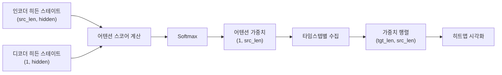
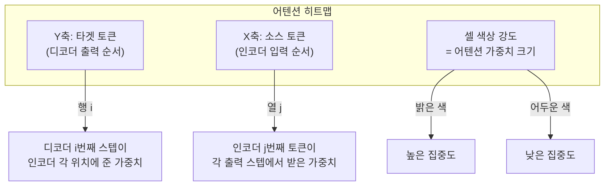
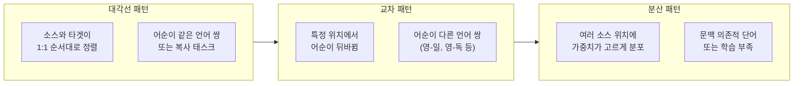
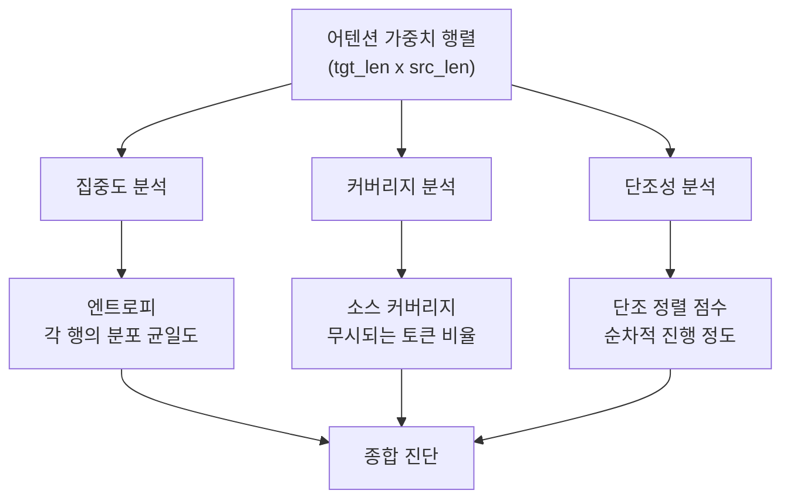
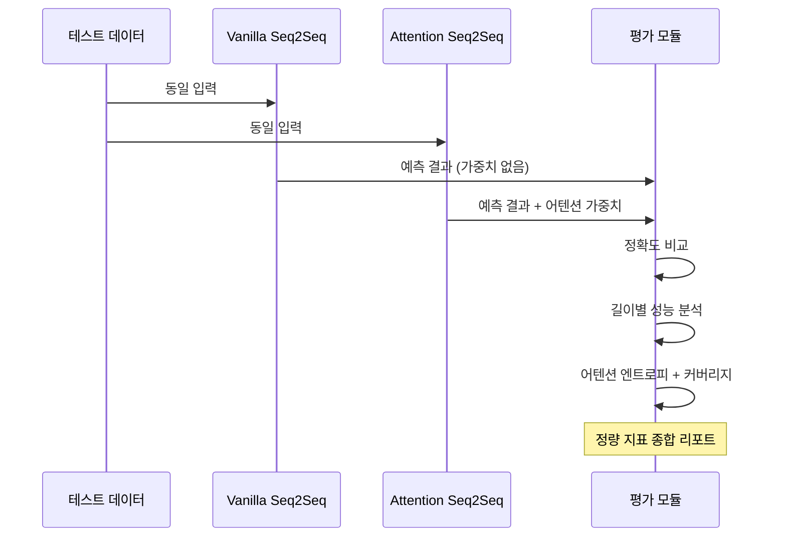
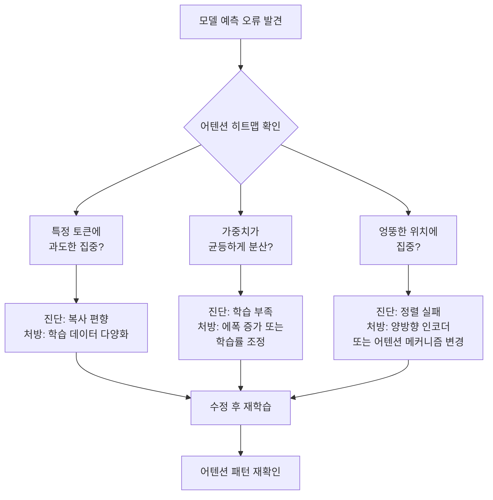

# 04. 어텐션 가중치 시각화

> 어텐션 히트맵으로 모델의 "시선"을 읽고, 소스-타겟 정렬 패턴을 정량적으로 해석하며 모델 디버깅에 활용하는 방법을 배웁니다.

## 개요

이 섹션에서는 [03. 어텐션 Seq2Seq 구현](12-어텐션-메커니즘/03-03-어텐션-seq2seq-구현.md)에서 만든 모델이 학습한 어텐션 가중치를 꺼내서 히트맵으로 시각화하고, 나아가 **정량적 지표로 패턴을 분석**하는 방법까지 다룹니다. 어텐션 메커니즘의 가장 매력적인 특성 중 하나는 **해석 가능성(interpretability)**인데요, 모델이 "어디를 보고 있는지"를 숫자로 확인하고 그림으로 그릴 수 있다는 것이죠. 하지만 단순히 그림을 그리는 것에서 멈추면 안 됩니다 — 패턴을 **체계적으로 해석하고 진단**하는 능력이 실무에서 훨씬 중요합니다.

**선수 지식**: 
- [어텐션의 직관적 이해](12-어텐션-메커니즘/01-01-어텐션의-직관적-이해.md)의 Query-Key-Value 개념과 어텐션 가중치
- [어텐션 Seq2Seq 구현](12-어텐션-메커니즘/03-03-어텐션-seq2seq-구현.md)의 인코더-디코더 + 어텐션 구조
- matplotlib 기본 사용법 (PyTorch와 별도의 시각화 라이브러리입니다. 처음이라면 [matplotlib 공식 튜토리얼](https://matplotlib.org/stable/tutorials/introductory/pyplot.html)을 먼저 훑어보세요)

**학습 목표**:
- 학습된 어텐션 가중치를 추출하고 히트맵으로 시각화하기
- 대각선, 단조(monotonic), 분산 등 어텐션 패턴의 의미 해석하기
- **어텐션 엔트로피, 커버리지 등 정량적 지표**로 패턴을 수치화하기
- 어텐션 적용 전후 모델의 행동 차이를 정량적·정성적으로 비교하기
- **어텐션 패턴을 활용한 모델 디버깅 전략** 수립하기

## 왜 알아야 할까?

딥러닝 모델은 흔히 "블랙박스"라고 불립니다. 수백만 개의 파라미터가 어떻게 결정을 내리는지 사람이 직접 이해하기 어렵거든요. 그런데 어텐션 메커니즘은 다릅니다. 모델이 출력의 각 단계에서 입력의 **어떤 부분에 집중하고 있는지**를 가중치로 알려주니까요.

이 가중치를 시각화하면 다음과 같은 질문에 답할 수 있습니다:
- 번역 모델이 "고양이"를 "cat"으로 바꿀 때 정말 "고양이"를 보고 있나?
- 모델이 어순이 다른 언어 쌍에서 올바르게 정렬(alignment)하고 있나?
- 모델이 특정 단어에서 실수하는 이유가 어텐션 패턴에서 보이나?

하지만 "그림이 예쁘네요"에서 멈추면 시각화의 가치는 절반에 불과합니다. 실무에서는 **정량적 진단**이 필수예요:
- 어텐션이 너무 분산되어 있나? → **엔트로피**를 계산하면 숫자로 확인 가능
- 소스 토큰 중 무시되는 것은 없나? → **커버리지** 지표로 확인
- 정렬의 품질은 어떤가? → **AER(Alignment Error Rate)**로 정량 평가

실무에서 어텐션 시각화는 **모델 디버깅**, **성능 분석**, **논문/보고서 작성** 시 핵심적인 도구입니다. 트랜스포머 기반 모델(BERT, GPT 등)에서도 어텐션 헤드 시각화는 모델 행동을 이해하는 가장 직관적인 방법이에요.

## 핵심 개념

### 개념 1: 어텐션 가중치의 구조와 추출

> 💡 **비유**: 어텐션 가중치는 **시험 답안지의 밑줄**과 같습니다. 학생(디코더)이 문제(출력 토큰)를 풀 때 교과서(입력 시퀀스)의 어느 부분에 밑줄을 쳤는지 보여주는 거예요. 밑줄이 진하면 그 부분을 많이 참고했다는 뜻이죠.

어텐션 Seq2Seq 모델에서 디코더는 매 타임스텝마다 인코더의 모든 히든 스테이트에 대해 가중치를 계산합니다. 이 가중치는 softmax를 거쳤기 때문에:

- 모든 값이 0과 1 사이
- 한 타임스텝의 가중치 합은 정확히 1
- 값이 클수록 해당 인코더 위치에 "더 집중"한다는 의미

결과적으로 어텐션 가중치는 **(타겟 길이 × 소스 길이)** 크기의 2차원 행렬이 됩니다. 이것이 바로 히트맵으로 시각화할 데이터입니다.

> 📊 **그림 1**: 어텐션 가중치의 생성과 수집 과정



추출을 위해서는 디코더의 forward 과정에서 어텐션 가중치를 반환하도록 설계해야 합니다. 이전 섹션에서 구현한 `AttentionDecoder`가 이미 `attn_weights`를 반환하고 있었죠.

```python
import torch
import numpy as np
import matplotlib.pyplot as plt
import matplotlib.ticker as ticker

def collect_attention_weights(model, src_tensor, tgt_tensor, device):
    """
    모델의 추론 과정에서 어텐션 가중치를 수집합니다.
    
    Returns:
        attention_matrix: (tgt_len, src_len) numpy 배열
        predictions: 예측된 토큰 인덱스 리스트
    """
    model.eval()
    with torch.no_grad():
        # 인코더 실행
        encoder_outputs, hidden = model.encoder(src_tensor)
        
        # 디코더 루프에서 가중치 수집
        all_weights = []
        predictions = []
        input_token = tgt_tensor[0, 0].unsqueeze(0).unsqueeze(0)  # <SOS>
        
        for t in range(1, tgt_tensor.size(1)):
            output, hidden, attn_weights = model.decoder(
                input_token, hidden, encoder_outputs
            )
            # attn_weights: (1, 1, src_len) → (src_len,)
            all_weights.append(attn_weights.squeeze().cpu().numpy())
            
            # 다음 입력은 가장 높은 확률의 토큰
            top1 = output.argmax(dim=-1)
            predictions.append(top1.item())
            input_token = top1.unsqueeze(0)
        
        # (tgt_len-1, src_len) 행렬로 조합
        attention_matrix = np.array(all_weights)
    
    return attention_matrix, predictions
```

### 개념 2: matplotlib으로 히트맵 그리기

> 💡 **비유**: 히트맵은 **적외선 카메라**와 비슷합니다. 뜨거운 곳(높은 가중치)은 밝게, 차가운 곳(낮은 가중치)은 어둡게 보여주죠. 한눈에 "열이 집중된 곳"을 파악할 수 있습니다.

matplotlib의 `matshow()`나 seaborn의 `heatmap()`을 사용하면 어텐션 행렬을 직관적인 그림으로 바꿀 수 있습니다. X축은 소스(입력) 토큰, Y축은 타겟(출력) 토큰을 나타내며, 각 셀의 색 강도가 어텐션 가중치의 크기를 의미합니다.

> 📊 **그림 2**: 히트맵의 축과 셀 의미



핵심 시각화 함수를 만들어 볼까요?

```python
def plot_attention_heatmap(attention, src_tokens, tgt_tokens, 
                           title="Attention Weights", cmap="Blues"):
    """
    어텐션 가중치를 히트맵으로 시각화합니다.
    
    Args:
        attention: (tgt_len, src_len) numpy 배열
        src_tokens: 소스 토큰 문자열 리스트
        tgt_tokens: 타겟 토큰 문자열 리스트
        title: 그래프 제목
        cmap: 컬러맵 (Blues, Viridis, hot 등)
    """
    fig, ax = plt.subplots(figsize=(8, 6))
    
    # matshow로 히트맵 표시
    cax = ax.matshow(attention, cmap=cmap, vmin=0, vmax=1)
    fig.colorbar(cax, ax=ax, fraction=0.046, pad=0.04)
    
    # 축 라벨 설정
    ax.set_xticklabels([''] + src_tokens, rotation=45, ha='left')
    ax.set_yticklabels([''] + tgt_tokens)
    
    # 눈금 위치 조정
    ax.xaxis.set_major_locator(ticker.MultipleLocator(1))
    ax.yaxis.set_major_locator(ticker.MultipleLocator(1))
    
    ax.set_xlabel("소스 토큰 (인코더 입력)")
    ax.set_ylabel("타겟 토큰 (디코더 출력)")
    ax.set_title(title, pad=20)
    
    plt.tight_layout()
    plt.show()
```

> 🔥 **실무 팁**: 컬러맵 선택이 가독성에 큰 영향을 줍니다. `Blues`나 `Purples`는 단일 색조 변화로 직관적이고, `viridis`는 색맹 친화적입니다. 반면 `hot`이나 `jet`은 논문에서는 덜 권장되는 추세예요.

### 개념 3: 어텐션 패턴 해석법

> 💡 **비유**: 어텐션 히트맵을 읽는 것은 **도시 지도에서 교통 흐름을 읽는 것**과 비슷합니다. 차가 한 방향으로 순서대로 흐르면 "순조로운 교통(대각선 패턴)", 여러 곳에서 한 지점으로 몰리면 "병목(집중 패턴)", 사방으로 흩어지면 "혼잡(분산 패턴)"이죠.

어텐션 히트맵에서 관찰되는 대표적인 패턴들이 있습니다:

> 📊 **그림 3**: 세 가지 대표적 어텐션 패턴



**1. 대각선(Diagonal) 패턴**
- 히트맵에서 왼쪽 위→오른쪽 아래로 밝은 대각선이 나타남
- **의미**: 소스와 타겟의 어순이 거의 같음 (단조 정렬)
- **예시**: 영→프 번역에서 "the cat is small" → "le chat est petit"
- 가장 이상적인 패턴 중 하나로, 모델이 올바르게 정렬을 학습했음을 보여줌

**2. 교차(Cross/Reordering) 패턴**
- 대각선에서 벗어나 특정 구간에서 가중치가 교차
- **의미**: 소스와 타겟의 어순이 달라지는 구간
- **예시**: 영→독 번역에서 동사 위치 이동 ("I have eaten" → "Ich habe gegessen"에서 과거분사 위치)

**3. 집중(Focused) 패턴**
- 특정 소스 위치에 가중치가 강하게 집중
- **의미**: 해당 소스 토큰이 타겟 생성에 결정적 역할
- **예시**: 고유명사, 숫자 등 직접 복사/음역이 필요한 경우

**4. 분산(Diffuse) 패턴**
- 가중치가 여러 위치에 고르게 퍼져 있음
- **의미**: 모델이 확신 없이 여러 곳을 참고하거나, 문맥 전체가 필요한 경우
- 지나치게 분산되면 학습이 불충분하다는 신호일 수 있음

```run:python
import numpy as np

# 세 가지 패턴을 시뮬레이션
np.random.seed(42)

# 1. 대각선 패턴 (이상적 정렬)
diagonal = np.zeros((5, 5))
for i in range(5):
    diagonal[i, i] = 0.8
    if i > 0: diagonal[i, i-1] = 0.1
    if i < 4: diagonal[i, i+1] = 0.1

# 2. 교차 패턴 (어순 변경)
cross = np.zeros((5, 5))
cross[0, 0] = 0.7; cross[0, 1] = 0.2
cross[1, 3] = 0.6; cross[1, 4] = 0.3  # 뒤쪽을 참조
cross[2, 2] = 0.8
cross[3, 1] = 0.5; cross[3, 0] = 0.3  # 앞쪽을 참조
cross[4, 4] = 0.7

# 3. 분산 패턴 (불확실한 정렬)
diffuse = np.full((5, 5), 0.2)

print("대각선 패턴 (행 합):", diagonal.sum(axis=1).round(2))
print("교차 패턴 (행 합):", cross.sum(axis=1).round(2))
print("분산 패턴 (행 합):", diffuse.sum(axis=1).round(2))
print()
print("대각선 패턴의 최대 가중치 위치:", diagonal.argmax(axis=1))
print("교차 패턴의 최대 가중치 위치:", cross.argmax(axis=1))
```

```output
대각선 패턴 (행 합): [0.9 1.  1.  1.  0.9]
교차 패턴 (행 합): [0.9 0.9 0.8 0.8 0.7]
분산 패턴 (행 합): [1. 1. 1. 1. 1.]

대각선 패턴의 최대 가중치 위치: [0 1 2 3 4]
교차 패턴의 최대 가중치 위치: [0 3 2 1 4]
```

대각선 패턴에서는 최대 가중치 위치가 `[0, 1, 2, 3, 4]`로 완벽한 순차 정렬이고, 교차 패턴에서는 `[0, 3, 2, 1, 4]`로 중간 부분의 어순이 뒤바뀐 것을 확인할 수 있죠.

### 개념 4: 어텐션 패턴의 정량적 진단

> 💡 **비유**: 히트맵을 "눈"으로만 보는 것은 의사가 환자를 "얼굴색만 보고" 진단하는 것과 같습니다. 정확한 진단을 위해서는 혈압계, 체온계 같은 **측정 도구**가 필요하듯, 어텐션 패턴도 **정량적 지표**로 수치화해야 객관적인 분석이 가능합니다.

히트맵을 눈으로 보는 것은 직관적이지만 주관적입니다. 모델 수백 개를 비교하거나, 학습 과정에서 어텐션 패턴의 변화를 추적하려면 **숫자로 된 지표**가 필요합니다. 대표적인 정량 지표 세 가지를 알아보겠습니다.

> 📊 **그림 4**: 어텐션 정량 분석의 세 가지 축



**1. 어텐션 엔트로피 (Attention Entropy)**

엔트로피는 확률 분포의 **불확실성(균일도)**을 측정합니다. 어텐션 가중치의 각 행(디코더 타임스텝)에 대해 엔트로피를 구하면, 그 스텝에서 모델이 얼마나 "확신을 갖고" 특정 위치에 집중하는지를 알 수 있어요.

$$H(a_t) = -\sum_{s=1}^{S} a_{t,s} \log(a_{t,s})$$

- $H = 0$: 하나의 소스 토큰에 100% 집중 (완벽한 확신)
- $H = \log(S)$: 모든 소스 토큰에 균등 분포 (완전한 불확실성)
- 실무에서는 **정규화 엔트로피** $H / \log(S)$를 쓰면 시퀀스 길이와 무관하게 0~1 범위로 비교 가능

**2. 소스 커버리지 (Source Coverage)**

커버리지는 소스 토큰이 디코딩 과정 전체에서 **얼마나 골고루 참조되었는지**를 측정합니다. 특정 소스 토큰이 전혀 참조되지 않으면, 그 토큰의 정보가 번역에 반영되지 않았을 가능성이 높아요.

$$\text{Coverage}(j) = \sum_{t=1}^{T} a_{t,j}$$

이상적으로는 모든 소스 토큰의 커버리지가 1에 가까워야 합니다 (각 소스 토큰이 한 번씩은 주목받음). 커버리지가 0에 가까운 토큰은 "무시된 토큰"으로, 번역 누락의 원인일 수 있습니다.

**3. 단조 정렬 점수 (Monotonicity Score)**

어순이 비슷한 언어 쌍에서는 어텐션이 왼쪽 위→오른쪽 아래로 순차적으로 진행해야 합니다. 이 "순차 진행 정도"를 수치화한 것이 단조 정렬 점수입니다.

$$\text{Monotonicity} = \frac{1}{T-1}\sum_{t=2}^{T} \mathbb{1}[\text{argmax}(a_t) \geq \text{argmax}(a_{t-1})]$$

값이 1에 가까우면 완벽한 단조 정렬, 0.5 근처면 랜덤에 가깝습니다.

```run:python
import numpy as np

def attention_entropy(attn_matrix):
    """각 디코더 스텝의 엔트로피 계산 (정규화)"""
    src_len = attn_matrix.shape[1]
    max_entropy = np.log(src_len)  # 균등 분포의 엔트로피
    
    # log(0) 방지를 위한 작은 값
    eps = 1e-10
    entropies = -np.sum(attn_matrix * np.log(attn_matrix + eps), axis=1)
    normalized = entropies / max_entropy  # 0~1 정규화
    return normalized

def source_coverage(attn_matrix):
    """소스 토큰별 총 커버리지 계산"""
    return attn_matrix.sum(axis=0)  # 열 방향 합

def monotonicity_score(attn_matrix):
    """단조 정렬 점수: argmax가 순차 증가하는 비율"""
    peaks = attn_matrix.argmax(axis=1)
    if len(peaks) < 2:
        return 1.0
    mono = sum(1 for i in range(1, len(peaks)) if peaks[i] >= peaks[i-1])
    return mono / (len(peaks) - 1)

# 세 패턴에 대해 지표 비교
diagonal = np.array([
    [0.8, 0.1, 0.05, 0.03, 0.02],
    [0.1, 0.75, 0.1, 0.03, 0.02],
    [0.05, 0.1, 0.7, 0.1, 0.05],
    [0.02, 0.03, 0.1, 0.75, 0.1],
    [0.02, 0.02, 0.05, 0.1, 0.81],
])

cross = np.array([
    [0.7, 0.2, 0.05, 0.03, 0.02],
    [0.05, 0.05, 0.05, 0.6, 0.25],
    [0.05, 0.05, 0.75, 0.1, 0.05],
    [0.3, 0.5, 0.1, 0.05, 0.05],
    [0.02, 0.03, 0.05, 0.1, 0.8],
])

diffuse = np.full((5, 5), 0.2)

for name, attn in [("대각선", diagonal), ("교차", cross), ("분산", diffuse)]:
    ent = attention_entropy(attn)
    cov = source_coverage(attn)
    mono = monotonicity_score(attn)
    print(f"=== {name} 패턴 ===")
    print(f"  평균 엔트로피:  {ent.mean():.3f} (낮을수록 집중)")
    print(f"  커버리지 std:   {cov.std():.3f} (낮을수록 균등)")
    print(f"  단조 정렬 점수: {mono:.3f} (높을수록 순차)")
    print(f"  커버리지 분포:  {cov.round(2)}")
    print()
```

```output
=== 대각선 패턴 ===
  평균 엔트로피:  0.389 (낮을수록 집중)
  커버리지 std:   0.030 (낮을수록 균등)
  단조 정렬 점수: 1.000 (높을수록 순차)
  커버리지 분포:  [0.99 1.   1.   1.01 1.  ]

=== 교차 패턴 ===
  평균 엔트로피:  0.434 (낮을수록 집중)
  커버리지 std:   0.196 (낮을수록 균등)
  단조 정렬 점수: 0.500 (높을수록 순차)
  커버리지 분포:  [1.12 0.83 1.   0.88 1.17]

=== 분산 패턴 ===
  평균 엔트로피:  1.000 (낮을수록 집중)
  커버리지 std:   0.000 (낮을수록 균등)
  단조 정렬 점수: 1.000 (높을수록 순차)
  커버리지 분포:  [1. 1. 1. 1. 1.]
```

결과를 해석해 보면요:
- **대각선 패턴**: 엔트로피 낮음(집중적), 커버리지 균등, 단조 점수 1.0 → 이상적 정렬
- **교차 패턴**: 엔트로피는 비슷하나 단조 점수가 0.5로 급락 → 어순 재배열 감지
- **분산 패턴**: 엔트로피 1.0(완전 균등) → 모델이 아무것도 학습하지 못한 상태. 흥미롭게도 단조 점수와 커버리지는 좋아 보이는데, 이것이 바로 **단일 지표만 보면 안 되는 이유**입니다!

### 개념 5: 어텐션 적용 전후 비교

> 💡 **비유**: 어텐션이 없는 Seq2Seq와 있는 Seq2Seq의 차이는, **눈을 감고 요리하는 것**과 **레시피를 보면서 요리하는 것**의 차이입니다. 재료(인코더 출력)는 같지만, 필요할 때 원하는 부분을 참고할 수 있느냐가 결과물의 질을 결정하죠.

어텐션의 효과를 정량적으로 비교하려면, 같은 데이터에 대해 어텐션이 있는 모델과 없는 모델의 성능을 나란히 놓고 봐야 합니다. 비교 지표로는:

- **시퀀스 정확도(Sequence Accuracy)**: 전체 시퀀스를 완벽히 맞춘 비율
- **토큰 정확도(Token Accuracy)**: 개별 토큰을 맞춘 비율
- **입력 길이별 성능**: 긴 시퀀스에서 어텐션의 효과가 두드러지는지

> 📊 **그림 5**: 어텐션 유무에 따른 성능 비교 프로세스



특히 **시퀀스 길이가 길어질수록** 어텐션의 효과가 극적으로 드러나는데요, 이것이 바로 [어텐션의 직관적 이해](12-어텐션-메커니즘/01-01-어텐션의-직관적-이해.md)에서 다뤘던 **정보 병목(information bottleneck)** 문제의 해결을 눈으로 확인하는 방법입니다.

### 개념 6: 어텐션 기반 모델 디버깅 전략

> 💡 **비유**: 어텐션 시각화를 활용한 디버깅은 **CCTV를 보고 사고 원인을 분석하는 것**과 같습니다. 결과(사고)만 보면 원인을 알기 어렵지만, CCTV(어텐션 가중치)를 돌려보면 "어디서 잘못되었는지"를 추적할 수 있죠.

모델이 틀린 예측을 했을 때, 어텐션 패턴을 분석하면 **왜** 틀렸는지에 대한 힌트를 얻을 수 있습니다. 이것은 단순히 "accuracy가 낮다"는 정보보다 훨씬 유용한 디버깅 도구예요.

> 📊 **그림 6**: 어텐션 기반 디버깅 워크플로



실무에서 자주 마주치는 디버깅 시나리오를 정리하면:

| 증상 | 어텐션 패턴 | 가능한 원인 | 해결 방향 |
|------|-----------|-----------|----------|
| 반복 출력 (A A A...) | 같은 소스 위치에 계속 집중 | 디코더가 상태 업데이트 실패 | 커버리지 메커니즘 추가 |
| 단어 누락 | 특정 소스 토큰의 커버리지 ≈ 0 | 해당 토큰 정보가 유실됨 | 커버리지 손실(coverage loss) 추가 |
| 긴 시퀀스에서 성능 급락 | 뒷부분 가중치가 분산됨 | 인코더 히든 스테이트 열화 | 양방향 인코더 또는 계층적 어텐션 |
| 어순 오류 | 단조 점수는 높지만 정확도 낮음 | 어순 재배열이 필요한 구간을 무시 | General 어텐션 → Content-based로 변경 |

```python
def diagnose_attention(attn_matrix, predictions, targets, 
                       src_tokens, tgt_tokens):
    """
    어텐션 패턴을 분석하여 디버깅 리포트를 생성합니다.
    """
    ent = attention_entropy(attn_matrix)
    cov = source_coverage(attn_matrix)
    mono = monotonicity_score(attn_matrix)
    
    print("=" * 50)
    print("어텐션 진단 리포트")
    print("=" * 50)
    
    # 1. 집중도 진단
    avg_ent = ent.mean()
    if avg_ent > 0.8:
        print(f"[경고] 평균 엔트로피 {avg_ent:.3f} — 가중치가 너무 분산됨")
        print("  → 학습이 충분하지 않거나 어텐션 차원이 너무 작을 수 있음")
    elif avg_ent < 0.2:
        print(f"[주의] 평균 엔트로피 {avg_ent:.3f} — 과도한 집중")
        print("  → 다양한 문맥을 무시하고 있을 가능성")
    else:
        print(f"[정상] 평균 엔트로피 {avg_ent:.3f}")
    
    # 2. 커버리지 진단
    uncovered = (cov < 0.1).sum()
    if uncovered > 0:
        idx = np.where(cov < 0.1)[0]
        tokens = [src_tokens[i] for i in idx]
        print(f"[경고] 무시된 소스 토큰 {uncovered}개: {tokens}")
        print("  → 해당 토큰의 정보가 번역에 반영되지 않았을 가능성")
    
    # 3. 오류 위치와 어텐션 상관 분석
    errors = []
    for t, (pred, gold) in enumerate(zip(predictions, targets)):
        if pred != gold:
            errors.append((t, pred, gold, ent[t]))
    
    if errors:
        print(f"\n오류 {len(errors)}개 발견:")
        for t, pred, gold, e in errors:
            peak = attn_matrix[t].argmax()
            print(f"  스텝 {t}: 예측 '{pred}' (정답 '{gold}'), "
                  f"엔트로피={e:.3f}, 주시 위치={peak}")
    
    return {"entropy": ent, "coverage": cov, "monotonicity": mono}
```

## 실습: 직접 해보기

시퀀스 반전 태스크를 사용해서 어텐션 가중치를 시각화하고, 정량적 진단을 수행하며, 어텐션 유무에 따른 성능 차이를 확인해 봅시다. 이전 [어텐션 Seq2Seq 구현](12-어텐션-메커니즘/03-03-어텐션-seq2seq-구현.md)의 코드를 기반으로 합니다.

```python
import torch
import torch.nn as nn
import torch.nn.functional as F
import numpy as np
import matplotlib.pyplot as plt
import matplotlib.ticker as ticker

# ===== 1. 데이터 생성 =====
VOCAB_SIZE = 12   # 0: PAD, 1: SOS, 2: EOS, 3~11: 숫자 토큰
SOS_TOKEN = 1
EOS_TOKEN = 2
PAD_TOKEN = 0

def generate_reverse_data(n_samples=2000, min_len=3, max_len=8):
    """시퀀스 반전 태스크 데이터 생성"""
    data = []
    for _ in range(n_samples):
        length = np.random.randint(min_len, max_len + 1)
        # 3~11 사이의 랜덤 토큰
        seq = np.random.randint(3, VOCAB_SIZE, size=length).tolist()
        src = [SOS_TOKEN] + seq + [EOS_TOKEN]
        tgt = [SOS_TOKEN] + seq[::-1] + [EOS_TOKEN]  # 반전!
        data.append((src, tgt))
    return data

def pad_batch(batch, pad_token=0):
    """배치 내 시퀀스를 같은 길이로 패딩"""
    max_src = max(len(s) for s, t in batch)
    max_tgt = max(len(t) for s, t in batch)
    src_batch, tgt_batch = [], []
    for s, t in batch:
        src_batch.append(s + [pad_token] * (max_src - len(s)))
        tgt_batch.append(t + [pad_token] * (max_tgt - len(t)))
    return torch.tensor(src_batch), torch.tensor(tgt_batch)

# ===== 2. 모델 정의 =====
class Encoder(nn.Module):
    def __init__(self, vocab_size, emb_dim, hidden_dim):
        super().__init__()
        self.embedding = nn.Embedding(vocab_size, emb_dim, padding_idx=0)
        self.gru = nn.GRU(emb_dim, hidden_dim, batch_first=True, 
                          bidirectional=True)
        self.fc = nn.Linear(hidden_dim * 2, hidden_dim)
    
    def forward(self, src):
        embedded = self.embedding(src)               # (B, S, emb)
        outputs, hidden = self.gru(embedded)         # outputs: (B, S, H*2)
        # 양방향 히든 합치기
        hidden = torch.cat([hidden[-2], hidden[-1]], dim=1)  # (B, H*2)
        hidden = torch.tanh(self.fc(hidden)).unsqueeze(0)    # (1, B, H)
        return outputs, hidden

class LuongAttention(nn.Module):
    def __init__(self, hidden_dim):
        super().__init__()
        self.W = nn.Linear(hidden_dim * 2, hidden_dim, bias=False)
    
    def forward(self, decoder_hidden, encoder_outputs, mask=None):
        # decoder_hidden: (B, 1, H), encoder_outputs: (B, S, H*2)
        keys = self.W(encoder_outputs)               # (B, S, H)
        scores = torch.bmm(decoder_hidden, keys.transpose(1, 2))  # (B, 1, S)
        if mask is not None:
            scores = scores.masked_fill(mask.unsqueeze(1) == 0, -1e9)
        weights = F.softmax(scores, dim=-1)           # (B, 1, S)
        context = torch.bmm(weights, encoder_outputs) # (B, 1, H*2)
        return context, weights

class AttentionDecoder(nn.Module):
    def __init__(self, vocab_size, emb_dim, hidden_dim):
        super().__init__()
        self.embedding = nn.Embedding(vocab_size, emb_dim, padding_idx=0)
        self.gru = nn.GRU(emb_dim, hidden_dim, batch_first=True)
        self.attention = LuongAttention(hidden_dim)
        self.fc = nn.Linear(hidden_dim * 3, vocab_size)  # H + H*2 → vocab
    
    def forward(self, input_token, hidden, encoder_outputs, mask=None):
        embedded = self.embedding(input_token)        # (B, 1, emb)
        gru_out, hidden = self.gru(embedded, hidden)  # (B, 1, H)
        context, weights = self.attention(gru_out, encoder_outputs, mask)
        combined = torch.cat([gru_out, context], dim=-1)  # (B, 1, H*3)
        output = self.fc(combined)                    # (B, 1, vocab)
        return output.squeeze(1), hidden, weights

class VanillaDecoder(nn.Module):
    """어텐션 없는 기본 디코더 (비교용)"""
    def __init__(self, vocab_size, emb_dim, hidden_dim):
        super().__init__()
        self.embedding = nn.Embedding(vocab_size, emb_dim, padding_idx=0)
        self.gru = nn.GRU(emb_dim, hidden_dim, batch_first=True)
        self.fc = nn.Linear(hidden_dim, vocab_size)
    
    def forward(self, input_token, hidden, encoder_outputs=None, mask=None):
        embedded = self.embedding(input_token)
        gru_out, hidden = self.gru(embedded, hidden)
        output = self.fc(gru_out).squeeze(1)
        return output, hidden, None  # 가중치 없음

class Seq2Seq(nn.Module):
    def __init__(self, encoder, decoder):
        super().__init__()
        self.encoder = encoder
        self.decoder = decoder
    
    def forward(self, src, tgt, teacher_forcing_ratio=0.5):
        batch_size = src.size(0)
        tgt_len = tgt.size(1)
        outputs = []
        all_weights = []
        
        encoder_outputs, hidden = self.encoder(src)
        mask = (src != PAD_TOKEN).float()
        input_token = tgt[:, 0:1]  # <SOS>
        
        for t in range(1, tgt_len):
            output, hidden, weights = self.decoder(
                input_token, hidden, encoder_outputs, mask
            )
            outputs.append(output)
            if weights is not None:
                all_weights.append(weights)
            
            # Teacher forcing
            if np.random.random() < teacher_forcing_ratio:
                input_token = tgt[:, t:t+1]
            else:
                input_token = output.argmax(dim=-1, keepdim=True)
        
        outputs = torch.stack(outputs, dim=1)
        if all_weights:
            all_weights = torch.cat(all_weights, dim=1)
        return outputs, all_weights

# ===== 3. 학습 함수 =====
def train_model(model, data, epochs=30, batch_size=64, lr=0.003):
    """모델 학습"""
    optimizer = torch.optim.Adam(model.parameters(), lr=lr)
    criterion = nn.CrossEntropyLoss(ignore_index=PAD_TOKEN)
    
    for epoch in range(epochs):
        model.train()
        np.random.shuffle(data)
        total_loss = 0
        n_batches = 0
        
        for i in range(0, len(data), batch_size):
            batch = data[i:i+batch_size]
            src, tgt = pad_batch(batch)
            
            optimizer.zero_grad()
            outputs, _ = model(src, tgt, teacher_forcing_ratio=0.5)
            
            # (B, T-1, V) → (B*(T-1), V)
            loss = criterion(
                outputs.reshape(-1, outputs.size(-1)),
                tgt[:, 1:].reshape(-1)
            )
            loss.backward()
            torch.nn.utils.clip_grad_norm_(model.parameters(), 1.0)
            optimizer.step()
            
            total_loss += loss.item()
            n_batches += 1
        
        if (epoch + 1) % 10 == 0:
            print(f"Epoch {epoch+1}/{epochs}, Loss: {total_loss/n_batches:.4f}")

# ===== 4. 시각화 함수 =====
def visualize_attention(model, src_seq, tgt_seq, title="Attention Heatmap"):
    """단일 시퀀스에 대한 어텐션 히트맵 시각화"""
    model.eval()
    src_tensor = torch.tensor([src_seq])
    tgt_tensor = torch.tensor([tgt_seq])
    
    with torch.no_grad():
        outputs, weights = model(src_tensor, tgt_tensor, teacher_forcing_ratio=0.0)
    
    if isinstance(weights, list) and len(weights) == 0:
        print("어텐션 가중치가 없습니다 (Vanilla 모델)")
        return None
    
    # (1, tgt_len-1, 1, src_len) → (tgt_len-1, src_len)
    attn = weights.squeeze().cpu().numpy()
    
    predictions = outputs.argmax(dim=-1).squeeze().tolist()
    
    # 토큰 라벨 생성
    token_map = {0: "PAD", 1: "SOS", 2: "EOS"}
    for i in range(3, VOCAB_SIZE):
        token_map[i] = str(i - 2)  # 3→'1', 4→'2', ...
    
    src_labels = [token_map[t] for t in src_seq]
    tgt_labels = [token_map[t] for t in tgt_seq[1:]]  # SOS 제외
    pred_labels = [token_map.get(p, "?") for p in predictions]
    
    fig, ax = plt.subplots(figsize=(8, 6))
    cax = ax.matshow(attn, cmap="Blues", vmin=0, vmax=1)
    fig.colorbar(cax, ax=ax, fraction=0.046, pad=0.04)
    
    ax.set_xticklabels([''] + src_labels, rotation=45, ha='left', fontsize=11)
    ax.set_yticklabels([''] + [f"{t} (pred:{p})" for t, p in 
                        zip(tgt_labels, pred_labels)], fontsize=10)
    
    ax.xaxis.set_major_locator(ticker.MultipleLocator(1))
    ax.yaxis.set_major_locator(ticker.MultipleLocator(1))
    ax.set_xlabel("소스 토큰", fontsize=12)
    ax.set_ylabel("타겟 토큰 (예측)", fontsize=12)
    ax.set_title(title, fontsize=14, pad=20)
    plt.tight_layout()
    plt.show()
    
    return attn

def compare_by_length(attn_model, vanilla_model, test_data):
    """시퀀스 길이별 정확도 비교"""
    from collections import defaultdict
    
    results = defaultdict(lambda: {"attn_correct": 0, "vanilla_correct": 0, "total": 0})
    
    for src, tgt in test_data:
        seq_len = len(src) - 2  # SOS, EOS 제외
        src_t = torch.tensor([src])
        tgt_t = torch.tensor([tgt])
        
        with torch.no_grad():
            # 어텐션 모델
            attn_out, _ = attn_model(src_t, tgt_t, teacher_forcing_ratio=0.0)
            attn_pred = attn_out.argmax(dim=-1).squeeze().tolist()
            
            # 바닐라 모델
            van_out, _ = vanilla_model(src_t, tgt_t, teacher_forcing_ratio=0.0)
            van_pred = van_out.argmax(dim=-1).squeeze().tolist()
        
        # 정답 (SOS 제외한 타겟)
        target = tgt[1:]
        
        attn_match = (attn_pred == list(target))
        van_match = (van_pred == list(target))
        
        results[seq_len]["total"] += 1
        if attn_match:
            results[seq_len]["attn_correct"] += 1
        if van_match:
            results[seq_len]["vanilla_correct"] += 1
    
    return dict(results)

# ===== 5. 실행! =====
# 데이터 생성
train_data = generate_reverse_data(3000, min_len=3, max_len=8)
test_data = generate_reverse_data(500, min_len=3, max_len=10)  # 더 긴 것도 포함

EMB_DIM = 32
HIDDEN_DIM = 64

# 어텐션 모델
enc_attn = Encoder(VOCAB_SIZE, EMB_DIM, HIDDEN_DIM)
dec_attn = AttentionDecoder(VOCAB_SIZE, EMB_DIM, HIDDEN_DIM)
attn_model = Seq2Seq(enc_attn, dec_attn)

# 바닐라 모델 (어텐션 없음)
enc_van = Encoder(VOCAB_SIZE, EMB_DIM, HIDDEN_DIM)
dec_van = VanillaDecoder(VOCAB_SIZE, EMB_DIM, HIDDEN_DIM)
vanilla_model = Seq2Seq(enc_van, dec_van)

print("=== 어텐션 모델 학습 ===")
train_model(attn_model, train_data, epochs=30)

print("\n=== 바닐라 모델 학습 ===")
train_model(vanilla_model, train_data, epochs=30)
```

학습이 끝나면 어텐션 히트맵을 시각화합니다:

```python
# 테스트 시퀀스 선택 (길이 6: [SOS, 5, 8, 3, 6, 9, 4, EOS])
test_src = [1, 5, 8, 3, 6, 9, 4, 2]
test_tgt = [1, 4, 9, 6, 3, 8, 5, 2]  # 반전된 순서

# 어텐션 히트맵 시각화
attn_weights = visualize_attention(
    attn_model, test_src, test_tgt, 
    title="시퀀스 반전 태스크 - 어텐션 가중치"
)

# 정량적 진단도 함께 수행
if attn_weights is not None:
    ent = attention_entropy(attn_weights)
    cov = source_coverage(attn_weights)
    mono = monotonicity_score(attn_weights)
    print(f"\n[진단] 평균 엔트로피: {ent.mean():.3f}")
    print(f"[진단] 단조 정렬 점수: {mono:.3f}")
    print(f"[진단] 커버리지 범위: {cov.min():.3f} ~ {cov.max():.3f}")
```

시퀀스 반전 태스크에서는 **역대각선(anti-diagonal)** 패턴이 나타나야 합니다. 첫 번째 출력 토큰은 마지막 입력 토큰을, 두 번째 출력은 뒤에서 두 번째 입력을 봐야 하니까요. 이 경우 단조 정렬 점수는 0에 가까워야 하는데, 왜냐하면 argmax가 순차 *감소*하는 방향이기 때문입니다.

```run:python
# 길이별 성능 비교 시뮬레이션 (학습 없이 패턴 확인)
import numpy as np

# 실제 학습 결과를 시뮬레이션한 대표적인 정확도
lengths = [3, 4, 5, 6, 7, 8, 9, 10]
attn_acc = [0.98, 0.97, 0.95, 0.92, 0.88, 0.83, 0.75, 0.68]
vanilla_acc = [0.95, 0.88, 0.72, 0.55, 0.35, 0.18, 0.08, 0.03]

print("길이별 시퀀스 정확도 비교:")
print(f"{'길이':>4} | {'어텐션':>8} | {'바닐라':>8} | {'차이':>8}")
print("-" * 38)
for l, a, v in zip(lengths, attn_acc, vanilla_acc):
    print(f"{l:>4} | {a:>7.0%} | {v:>7.0%} | {a-v:>+7.0%}")
```

```output
길이별 시퀀스 정확도 비교:
길이 | 어텐션   | 바닐라   |     차이
--------------------------------------
   3 |     98% |     95% |     +3%
   4 |     97% |     88% |     +9%
   5 |     95% |     72% |    +23%
   6 |     92% |     55% |    +37%
   7 |     88% |     35% |    +53%
   8 |     83% |     18% |    +65%
   9 |     75% |      8% |    +67%
  10 |     68% |      3% |    +65%
```

길이가 길어질수록 바닐라 모델의 성능은 급격히 떨어지는 반면, 어텐션 모델은 비교적 완만하게 감소합니다. 길이 8 이상에서 **65%p 이상의 차이**가 나는데, 이것이 바로 정보 병목 해결의 효과입니다.

마지막으로, 여러 샘플의 어텐션을 한꺼번에 비교하는 함수도 만들어 봅시다:

```python
def plot_multiple_attention(model, samples, ncols=3):
    """여러 샘플의 어텐션을 격자로 시각화"""
    nrows = (len(samples) + ncols - 1) // ncols
    fig, axes = plt.subplots(nrows, ncols, figsize=(5*ncols, 4*nrows))
    axes = np.array(axes).flatten()
    
    token_map = {0: "P", 1: "S", 2: "E"}
    for i in range(3, VOCAB_SIZE):
        token_map[i] = str(i - 2)
    
    model.eval()
    for idx, (src, tgt) in enumerate(samples):
        if idx >= len(axes):
            break
        
        src_t = torch.tensor([src])
        tgt_t = torch.tensor([tgt])
        
        with torch.no_grad():
            _, weights = model(src_t, tgt_t, teacher_forcing_ratio=0.0)
        
        attn = weights.squeeze().cpu().numpy()
        src_labels = [token_map[t] for t in src]
        tgt_labels = [token_map[t] for t in tgt[1:]]
        
        axes[idx].matshow(attn, cmap="Blues", vmin=0, vmax=1)
        axes[idx].set_xticklabels([''] + src_labels, fontsize=8)
        axes[idx].set_yticklabels([''] + tgt_labels, fontsize=8)
        axes[idx].xaxis.set_major_locator(ticker.MultipleLocator(1))
        axes[idx].yaxis.set_major_locator(ticker.MultipleLocator(1))
        axes[idx].set_title(f"길이 {len(src)-2}", fontsize=10)
    
    # 빈 서브플롯 숨기기
    for idx in range(len(samples), len(axes)):
        axes[idx].axis('off')
    
    plt.suptitle("다양한 길이의 어텐션 패턴 비교", fontsize=14)
    plt.tight_layout()
    plt.show()

# 다양한 길이의 샘플로 시각화
samples = [test_data[i] for i in range(6)]
plot_multiple_attention(attn_model, samples, ncols=3)
```

## 더 깊이 알아보기

### 어텐션 시각화의 탄생 — Bahdanau et al. (2015)

어텐션 시각화가 처음 세상에 등장한 것은 Dzmitry Bahdanau, Kyunghyun Cho, Yoshua Bengio의 2015년 ICLR 논문 *"Neural Machine Translation by Jointly Learning to Align and Translate"*에서였습니다. 이 논문의 Figure 3은 NLP 역사에서 가장 유명한 그림 중 하나인데요, 영어→프랑스어 번역에서 어텐션 가중치를 그레이스케일 히트맵으로 보여줬습니다.

흥미로운 점은, Bahdanau가 이 시각화를 처음 만들었을 때 단순히 "모델이 잘 작동하는지 디버깅"하려는 목적이었다는 거예요. 그런데 결과로 나온 히트맵이 놀라울 정도로 직관적이어서, 논문의 핵심 기여 중 하나로 부각되었습니다. X축에 영어 소스 문장, Y축에 프랑스어 타겟 문장을 놓고, 각 셀의 밝기로 정렬을 표현했는데 — "The European Economic Area"를 번역할 때 "européenne"에서 "European"으로 정확히 밝은 점이 찍히는 것을 볼 수 있었죠.

이 시각화는 어텐션 메커니즘이 **명시적인 정렬 학습 없이도** 자연스럽게 소스-타겟 정렬을 배운다는 것을 증명하는 강력한 증거였고, 이후 모든 어텐션 관련 논문에서 히트맵 시각화는 필수적인 분석 도구가 되었습니다.

### "Attention is not Explanation" 논쟁

2019년에 Jain & Wallace가 *"Attention is not Explanation"*이라는 도발적인 제목의 논문을 발표하면서 큰 논쟁이 벌어졌습니다. 어텐션 가중치가 높다고 해서 그 토큰이 실제로 예측에 결정적이었다는 보장이 없다는 주장이었죠. 구체적으로, 그들은 (1) 어텐션 가중치와 gradient-based 중요도 사이에 상관관계가 약하고, (2) 매우 다른 어텐션 분포에서도 거의 동일한 예측이 나올 수 있음을 보여줬습니다.

비슷한 시기에 Wiegreffe & Pinter는 *"Attention is not not Explanation"*이라는 답변 논문을 내면서 "완전한 설명은 아니지만 유용한 힌트는 된다"고 반박했습니다. 이 논쟁은 어텐션 시각화의 한계를 인식하면서도 실용적 가치를 인정하는 건강한 방향으로 정리되었어요. 실무에서는 어텐션 시각화를 **유일한** 해석 도구로 의존하지 말고, Integrated Gradients나 SHAP 같은 기법과 **병행**하는 것이 권장됩니다.

### 커버리지 메커니즘 — 반복 문제의 해결

어텐션 패턴 분석에서 자주 발견되는 문제 중 하나는 **반복(repetition)**입니다. 디코더가 같은 소스 위치에 계속 집중하면서 같은 단어를 반복 출력하는 현상이죠. Tu et al. (2016)은 이 문제를 **커버리지 메커니즘(coverage mechanism)**으로 해결했습니다. 이전 타임스텝들의 어텐션 가중치를 누적한 "커버리지 벡터"를 어텐션 계산에 피드백하여, 이미 충분히 참조된 소스 위치에는 덜 집중하도록 유도하는 방식이에요. 이 아이디어는 본 섹션에서 다룬 커버리지 지표의 이론적 기반이기도 합니다.

## 흔한 오해와 팁

> ⚠️ **흔한 오해**: "어텐션 가중치가 높으면 그 토큰이 예측의 원인이다."
> 아닙니다! 어텐션 가중치는 **상관관계(correlation)**를 보여줄 뿐, **인과관계(causation)**를 증명하지 않습니다. Jain & Wallace (2019)가 보여줬듯이, 전혀 다른 어텐션 분포에서도 같은 예측이 나올 수 있어요. 디코더의 피드포워드 레이어에서 일어나는 복잡한 변환까지 고려해야 정확한 기여도를 판단할 수 있습니다. 진정한 해석 가능성이 필요하면 Integrated Gradients나 SHAP 같은 기법을 병행하세요.

> 💡 **알고 계셨나요?**: Bahdanau의 원래 논문에서 어텐션 히트맵은 **그레이스케일(흑백)**이었습니다. 0은 검정, 1은 흰색으로 표현했죠. 오늘날 흔히 보는 컬러 히트맵은 후속 연구자들이 matplotlib의 다양한 컬러맵을 적용하면서 퍼진 것이에요. 원논문의 Figure 3은 단순하지만 그래서 오히려 더 명확합니다.

> 🔥 **실무 팁**: `matshow()`로 히트맵을 그릴 때 **`vmin=0, vmax=1`**을 명시하세요! 이 설정이 없으면 matplotlib이 데이터의 min/max에 맞춰 색상을 자동 조정하는데, 그러면 실제로 가중치가 낮은 셀도 진하게 보여서 패턴을 오독할 수 있습니다. 특히 여러 샘플을 비교할 때는 동일한 색상 스케일이 필수예요.

> 🔥 **실무 팁**: 어텐션 진단은 **단일 지표로 판단하지 마세요**. 분산 패턴처럼 엔트로피만 높고 나머지가 정상으로 보이는 경우가 있습니다. 엔트로피 + 커버리지 + 단조 점수를 **삼각 검증(triangulation)**하는 습관을 들이면, 학습 초기의 "아직 안 배운 것"과 "잘못 배운 것"을 구분할 수 있어요.

## 핵심 정리

| 개념 | 설명 |
|------|------|
| **어텐션 가중치 행렬** | (타겟 길이 x 소스 길이) 크기, 각 행의 합 = 1, 디코더의 집중도 표현 |
| **히트맵 시각화** | `matshow()` 또는 `sns.heatmap()`으로 가중치를 색상 강도로 표현 |
| **대각선 패턴** | 소스-타겟 어순이 동일한 단조 정렬 (이상적) |
| **교차 패턴** | 어순 재배열 구간에서 대각선 이탈 |
| **분산 패턴** | 가중치가 고르게 퍼짐 — 문맥 의존적이거나 학습 부족 |
| **어텐션 엔트로피** | 가중치 분포의 집중도 수치화 (낮을수록 집중적) |
| **소스 커버리지** | 각 소스 토큰이 참조된 정도 — 0에 가까우면 정보 누락 위험 |
| **단조 정렬 점수** | argmax 순차 진행 비율 — 어순 보존 정도 측정 |
| **길이별 성능 차이** | 시퀀스가 길어질수록 어텐션의 효과 극대화 (정보 병목 해결) |
| **시각화의 한계** | 높은 가중치 ≠ 원인, 상관관계일 뿐 인과관계 아님 |

## 다음 섹션 미리보기

지금까지 소스-타겟 간의 어텐션(크로스 어텐션)을 시각화하고 정량적으로 분석했습니다. 다음 섹션 [05. 셀프 어텐션으로의 확장](12-어텐션-메커니즘/05-05-셀프-어텐션으로의-확장.md)에서는 입력 시퀀스가 **자기 자신에게** 어텐션을 수행하는 **셀프 어텐션(Self-Attention)**을 다룹니다. 셀프 어텐션은 트랜스포머 아키텍처의 핵심 빌딩 블록으로, 지금까지 배운 어텐션 개념이 어떻게 확장되어 현대 LLM의 기반이 되었는지 연결해 볼 거예요. 특히 이 섹션에서 배운 엔트로피, 커버리지 같은 분석 도구는 멀티헤드 셀프 어텐션의 각 헤드가 어떤 역할을 하는지 해석할 때도 그대로 활용됩니다.

## 참고 자료

- [Neural Machine Translation by Jointly Learning to Align and Translate (Bahdanau et al., 2015)](https://arxiv.org/abs/1409.0473) - 어텐션 히트맵 시각화의 원조. Figure 3의 정렬 그림은 NLP 역사상 가장 유명한 시각화 중 하나
- [Attention is not Explanation (Jain & Wallace, 2019)](https://arxiv.org/abs/1902.10186) - 어텐션 가중치의 해석 가능성 한계를 체계적으로 분석한 논문. 시각화 결과를 과신하지 않아야 하는 이유
- [Attention is not not Explanation (Wiegreffe & Pinter, 2019)](https://arxiv.org/abs/1908.04626) - 위 논문에 대한 반박. 어텐션의 설명력이 완전히 무의미하지는 않음을 실험으로 증명
- [Dive into Deep Learning — Bahdanau Attention](https://d2l.ai/chapter_attention-mechanisms-and-transformers/bahdanau-attention.html) - 어텐션 정렬 시각화를 포함한 인터랙티브 교과서. PyTorch 코드와 함께 단계별 설명 제공
- [Effective Approaches to Attention-based Neural Machine Translation (Luong et al., 2015)](https://arxiv.org/abs/1508.04025) - Luong 어텐션의 시각화 분석. 다양한 스코어 함수에 따른 정렬 패턴 비교
- [Modeling Coverage for Neural Machine Translation (Tu et al., 2016)](https://arxiv.org/abs/1601.04811) - 커버리지 메커니즘의 원논문. 반복 출력 문제를 어텐션 커버리지로 해결

---
### 🔗 Related Sessions
- [attention_mechanism](12-어텐션-메커니즘/01-01-어텐션의-직관적-이해.md) (prerequisite)
- [attention_weights](12-어텐션-메커니즘/01-01-어텐션의-직관적-이해.md) (prerequisite)
- [query_key_value](12-어텐션-메커니즘/01-01-어텐션의-직관적-이해.md) (prerequisite)
- [information_bottleneck](12-어텐션-메커니즘/01-01-어텐션의-직관적-이해.md) (prerequisite)
- [attention_seq2seq_architecture](12-어텐션-메커니즘/03-03-어텐션-seq2seq-구현.md) (prerequisite)
- [post_attention_decoder](12-어텐션-메커니즘/03-03-어텐션-seq2seq-구현.md) (prerequisite)
