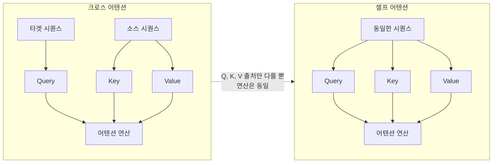
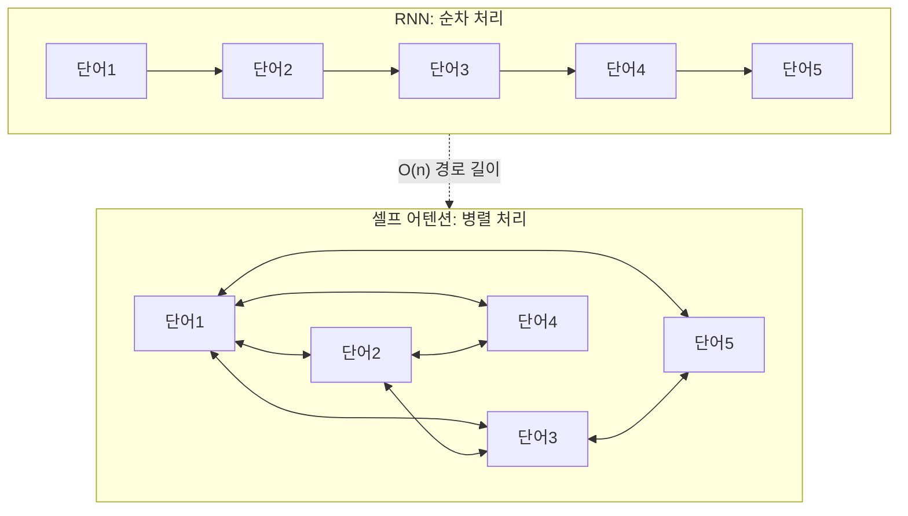
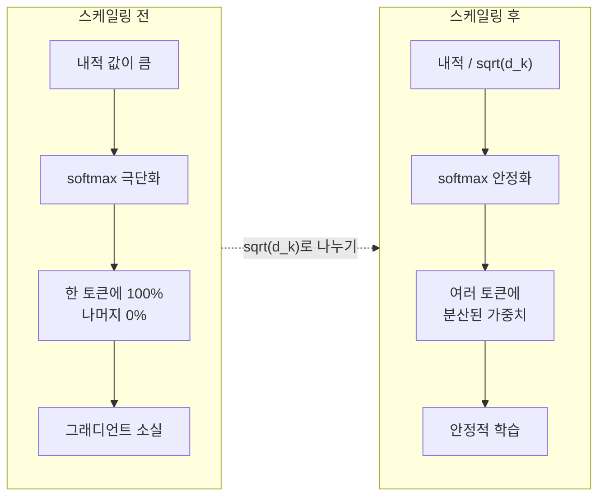
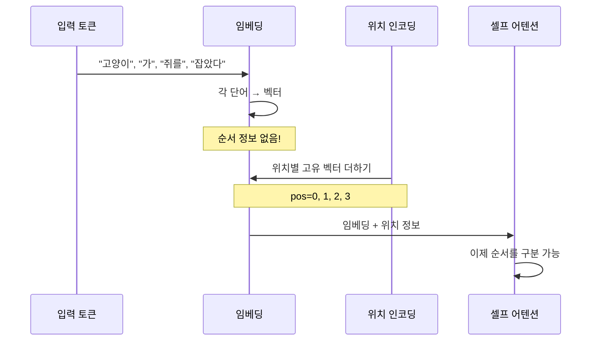

# 셀프 어텐션으로의 확장

> 크로스 어텐션에서 셀프 어텐션으로 — 시퀀스가 스스로를 바라보는 혁명적 전환

## 개요

이 섹션에서는 지금까지 배운 크로스 어텐션(소스→타겟 간 어텐션)을 넘어, **시퀀스가 자기 자신에게 어텐션을 수행하는 셀프 어텐션(Self-Attention)**으로 개념을 확장합니다. 셀프 어텐션은 트랜스포머 아키텍처의 핵심 빌딩 블록이며, BERT와 GPT를 포함한 모든 현대 LLM의 기반이 되는 메커니즘입니다.

**선수 지식**:
- [어텐션의 직관적 이해](12-어텐션-메커니즘/01-01-어텐션의-직관적-이해.md)에서 배운 Query-Key-Value 패러다임
- [Bahdanau와 Luong 어텐션](12-어텐션-메커니즘/02-02-bahdanau와-luong-어텐션.md)의 스코어 함수 개념
- [어텐션 Seq2Seq 구현](12-어텐션-메커니즘/03-03-어텐션-seq2seq-구현.md)에서 다룬 실제 어텐션 적용 경험

**학습 목표**:
- 크로스 어텐션과 셀프 어텐션의 구조적 차이를 명확히 구분할 수 있다
- 셀프 어텐션이 RNN 대비 갖는 세 가지 핵심 장점을 설명할 수 있다
- PyTorch로 셀프 어텐션 레이어를 직접 구현할 수 있다
- 어텐션 → 셀프 어텐션 → 트랜스포머로 이어지는 발전 흐름을 정리할 수 있다

## 왜 알아야 할까?

지금까지 우리는 Seq2Seq에서 **디코더가 인코더의 출력을 바라보는** 크로스 어텐션을 배웠습니다. 그런데 한 가지 질문이 남아 있죠 — "인코더 내부에서도 단어들끼리 서로를 바라볼 수 있다면 어떨까?"

"나는 은행에 갔다"라는 문장을 생각해보세요. "은행"이 금융기관인지 강둑인지 파악하려면, 같은 문장 안의 다른 단어들("갔다", "돈" 등)과의 관계를 봐야 합니다. RNN은 이 관계를 순차적으로 하나씩 전파해야 하지만, 셀프 어텐션은 **모든 단어가 동시에 서로를 바라볼 수 있습니다**. 이 단순하면서도 강력한 아이디어가 2017년 트랜스포머의 탄생으로 이어졌고, 오늘날 GPT-4, Claude, Llama 등 모든 LLM의 핵심 엔진이 되었습니다.

## 핵심 개념

### 개념 1: 크로스 어텐션 vs 셀프 어텐션 — Q, K, V의 출처가 다르다

> 💡 **비유**: 크로스 어텐션은 **통역사**와 같습니다. 영어 발표자(소스)의 말을 듣고, 한국어 청중(타겟)에게 전달하죠 — 서로 다른 두 그룹 사이의 소통입니다. 반면 셀프 어텐션은 **독서 모임**과 같습니다. 같은 책(같은 시퀀스)을 읽은 사람들이 서로의 해석을 참고하면서 각자의 이해를 깊게 만드는 거죠.

크로스 어텐션과 셀프 어텐션의 핵심 차이는 딱 하나입니다: **Q, K, V가 어디서 오는가?**

> 📊 **그림 1**: 크로스 어텐션 vs 셀프 어텐션의 입력 흐름



| 구분 | 크로스 어텐션 | 셀프 어텐션 |
|------|-------------|------------|
| **Query 출처** | 타겟 시퀀스 (디코더) | 자기 자신 |
| **Key, Value 출처** | 소스 시퀀스 (인코더) | 자기 자신 |
| **목적** | "소스의 어디를 볼까?" | "나 자신의 어디가 중요할까?" |
| **대표 사용처** | Seq2Seq 디코더 | 트랜스포머 인코더/디코더 내부 |

수식으로 보면 차이가 더 명확합니다. 크로스 어텐션에서는:

$$Q = H_{\text{target}} W^Q, \quad K = H_{\text{source}} W^K, \quad V = H_{\text{source}} W^V$$

셀프 어텐션에서는 **모두 같은 시퀀스** $X$에서 나옵니다:

$$Q = X W^Q, \quad K = X W^K, \quad V = X W^V$$

- $X \in \mathbb{R}^{n \times d}$: 입력 시퀀스 (n개 토큰, d차원)
- $W^Q, W^K, W^V \in \mathbb{R}^{d \times d_k}$: 학습 가능한 투영 행렬

같은 입력에서 Q, K, V를 만들지만, **서로 다른 가중치 행렬**로 투영하기 때문에 각각 다른 "역할"을 수행하게 됩니다. Query는 "나는 무엇을 찾고 있는가?", Key는 "나는 어떤 정보를 갖고 있는가?", Value는 "내가 전달할 실제 정보"를 나타내죠.

```python
import torch
import torch.nn as nn

# 크로스 어텐션: Q는 타겟, K/V는 소스
class CrossAttention(nn.Module):
    def __init__(self, d_model):
        super().__init__()
        self.W_q = nn.Linear(d_model, d_model)  # 타겟 → Query
        self.W_k = nn.Linear(d_model, d_model)  # 소스 → Key
        self.W_v = nn.Linear(d_model, d_model)  # 소스 → Value
    
    def forward(self, target, source):
        Q = self.W_q(target)   # 타겟에서 Query 생성
        K = self.W_k(source)   # 소스에서 Key 생성
        V = self.W_v(source)   # 소스에서 Value 생성
        return Q, K, V

# 셀프 어텐션: Q, K, V 모두 같은 입력에서
class SelfAttention(nn.Module):
    def __init__(self, d_model):
        super().__init__()
        self.W_q = nn.Linear(d_model, d_model)
        self.W_k = nn.Linear(d_model, d_model)
        self.W_v = nn.Linear(d_model, d_model)
    
    def forward(self, x):
        Q = self.W_q(x)  # 같은 x에서 Query
        K = self.W_k(x)  # 같은 x에서 Key
        V = self.W_v(x)  # 같은 x에서 Value
        return Q, K, V
```

> ⚠️ **흔한 오해**: "셀프 어텐션은 Q, K, V가 모두 같으니까 결국 같은 값 아닌가요?" — 아닙니다! Q, K, V는 **서로 다른 가중치 행렬** $W^Q$, $W^K$, $W^V$로 투영됩니다. 같은 단어라도 Query로서의 역할과 Key로서의 역할이 다르게 학습됩니다. "은행"이라는 단어가 Query로 작용할 때는 "나의 의미를 명확히 해줄 단서를 찾겠다"이고, Key로 작용할 때는 "나는 금융/자연 문맥의 단서가 될 수 있다"인 식이죠.

### 개념 2: 셀프 어텐션이 RNN을 대체하는 세 가지 이유

> 💡 **비유**: RNN으로 문장을 처리하는 것은 **전화 돌리기 게임**과 같습니다. 첫 번째 사람이 두 번째에게, 두 번째가 세 번째에게... 메시지가 전달될수록 원래 내용이 왜곡되죠. 셀프 어텐션은 **화상 회의**입니다. 모든 참가자가 동시에 서로의 말을 직접 듣고, 누구의 말이 가장 관련 있는지 스스로 판단합니다.

> 📊 **그림 2**: RNN vs 셀프 어텐션의 정보 흐름 비교



셀프 어텐션이 RNN을 대체하게 된 세 가지 핵심 이유를 정리하면:

**1. 병렬화(Parallelization)**

RNN은 $t$ 시점의 출력을 계산하려면 $t-1$까지의 결과가 필요합니다. GPU의 수천 개 코어가 있어도 순차적으로 기다려야 하죠. 셀프 어텐션은 모든 위치 쌍의 어텐션 스코어를 **행렬 곱 한 번**으로 동시에 계산합니다.

**2. 장거리 의존성(Long-Range Dependencies)**

RNN에서 첫 번째 토큰의 정보가 마지막 토큰에 도달하려면 $O(n)$ 스텝을 거쳐야 합니다. 셀프 어텐션에서는 어떤 두 토큰이든 **$O(1)$** — 단 한 번의 어텐션 연산으로 직접 연결됩니다.

**3. 해석 가능성(Interpretability)**

[어텐션 가중치 시각화](12-어텐션-메커니즘/04-04-어텐션-가중치-시각화.md)에서 배웠듯이, 어텐션 가중치는 히트맵으로 시각화할 수 있습니다. 셀프 어텐션에서는 "이 단어가 문장 내 어떤 단어에 주목했는지"를 직접 확인할 수 있어, 모델의 추론 과정을 들여다볼 수 있습니다.

| 기준 | RNN | 셀프 어텐션 |
|------|-----|-----------|
| **시간 복잡도 (레이어당)** | $O(n \cdot d^2)$ | $O(n^2 \cdot d)$ |
| **순차 연산 수** | $O(n)$ | $O(1)$ |
| **최대 경로 길이** | $O(n)$ | $O(1)$ |
| **병렬화** | 불가 | 완전 병렬 |

> 💡 **알고 계셨나요?**: 셀프 어텐션의 시간 복잡도 $O(n^2 \cdot d)$는 시퀀스 길이 $n$이 매우 길어지면 RNN보다 비효율적일 수 있습니다. 이것이 바로 최근 "효율적 어텐션(Efficient Attention)" 연구가 활발한 이유입니다 — Linformer, Performer, Flash Attention 등이 $O(n^2)$를 $O(n)$이나 $O(n \log n)$으로 줄이려는 시도죠. 하지만 실제 대부분의 NLP 태스크에서 시퀀스 길이는 512~4096 정도이므로, 셀프 어텐션의 병렬화 이점이 $O(n^2)$ 비용을 충분히 상쇄합니다.

### 개념 3: 스케일링은 왜 필요한가? — 내적의 함정

> 💡 **비유**: 시험 채점을 생각해보세요. 100점 만점 시험에서 95점과 90점의 차이는 크게 느껴지지 않습니다. 하지만 10000점 만점이라면? 9500점과 9000점은 숫자가 커서 차이가 더 극적으로 보이죠. 내적(dot product)도 차원이 높아질수록 값이 커져서, softmax가 극단적인 분포(하나에 거의 100%)를 만들어버립니다.

셀프 어텐션에서 유사도를 계산할 때 Q와 K의 내적을 사용하는데, 여기에 숨겨진 함정이 있습니다. 차원 $d_k$가 커질수록 내적 값의 **분산이 $d_k$에 비례해서 커진다**는 것이죠. 코드로 직접 확인해봅시다:

```run:python
import torch
import torch.nn.functional as F

torch.manual_seed(42)

# 차원이 커질수록 내적 값의 분산이 커짐
for d_k in [8, 64, 512]:
    q = torch.randn(1, d_k)  # 정규분포 ~ N(0, 1)
    k = torch.randn(1, d_k)
    
    dot = torch.sum(q * k)  # 내적
    # 내적의 기대 분산 = d_k (각 원소가 독립 N(0,1)이므로)
    print(f"d_k={d_k:3d} | 내적={dot.item():7.2f} | 이론적 표준편차={d_k**0.5:.2f}")
```

```output
d_k=  8 | 내적=  -1.66 | 이론적 표준편차=2.83
d_k= 64 | 내적=  -3.35 | 이론적 표준편차=8.00
d_k=512 | 내적= -13.96 | 이론적 표준편차=22.63
```

내적 값이 커지면 softmax 출력이 극단적으로 편향됩니다 — 거의 하나의 토큰에만 100% 가중치가 쏠리는 거죠. 이러면 그래디언트가 거의 0에 가까워져서 학습이 제대로 되지 않습니다. $\sqrt{d_k}$로 나누면 분산이 약 1로 안정화되어 softmax가 부드러운 분포를 유지하게 됩니다.

> 📊 **그림 3**: 스케일링이 softmax 분포에 미치는 영향



이 스케일링을 포함한 전체 수식, 즉 **스케일드 닷-프로덕트 어텐션(Scaled Dot-Product Attention)**의 수학적 분석과 각 연산 단계의 상세 해부는 [스케일드 닷-프로덕트 어텐션](13-트랜스포머-아키텍처-심층-분석/02-02-스케일드-닷-프로덕트-어텐션.md)에서 본격적으로 다룹니다. 여기서 기억할 핵심은 "차원이 높으면 내적이 커지고, 그래서 $\sqrt{d_k}$로 나눠야 한다"는 직관입니다.

### 개념 4: 셀프 어텐션의 위치 불변성 — 순서 정보의 부재

> 💡 **비유**: 셀프 어텐션은 **단어들의 이름표만 보고 관계를 파악하는 것**과 같습니다. "고양이가 쥐를 잡았다"와 "쥐가 고양이를 잡았다"에서 단어의 이름표(임베딩)는 같지만, 순서가 달라서 의미가 완전히 바뀌죠. 셀프 어텐션은 순서를 모르기 때문에, **위치 인코딩(Positional Encoding)**이라는 "좌석 번호표"를 추가해야 합니다.

RNN은 구조 자체가 시퀀스의 순서를 반영합니다 — $h_t$는 반드시 $h_{t-1}$ 이후에 계산되니까요. 하지만 셀프 어텐션의 행렬 곱 $QK^T$는 **토큰의 순서를 전혀 고려하지 않습니다**. 입력 토큰을 섞어도 (각 토큰의 출력도 같이 섞이는 것을 제외하면) 어텐션 가중치 자체는 동일합니다. 이것을 **순열 등변성(permutation equivariance)**이라고 합니다.

> 📊 **그림 4**: 위치 인코딩이 필요한 이유



이 문제를 해결하기 위해 트랜스포머는 사인/코사인 기반의 위치 인코딩을 추가합니다. 이 내용은 [위치 인코딩](13-트랜스포머-아키텍처-심층-분석/04-04-위치-인코딩.md)에서 자세히 다룹니다.

```python
import torch
import math

def positional_encoding(seq_len, d_model):
    """사인/코사인 위치 인코딩 생성"""
    pe = torch.zeros(seq_len, d_model)
    position = torch.arange(0, seq_len).unsqueeze(1).float()
    div_term = torch.exp(
        torch.arange(0, d_model, 2).float() * -(math.log(10000.0) / d_model)
    )
    pe[:, 0::2] = torch.sin(position * div_term)  # 짝수 인덱스: sin
    pe[:, 1::2] = torch.cos(position * div_term)  # 홀수 인덱스: cos
    return pe

# 임베딩 + 위치 인코딩
# x = word_embedding(tokens) + positional_encoding(seq_len, d_model)
```

### 개념 5: 어텐션에서 트랜스포머까지 — 발전 흐름 정리

> 📊 **그림 5**: 어텐션 메커니즘의 진화 타임라인


이 챕터에서 배운 내용을 발전 흐름으로 정리하면:

1. **정보 병목 문제** → 고정 길이 문맥 벡터로는 긴 문장을 압축할 수 없다
2. **Bahdanau 어텐션 (2014)** → 디코더가 인코더의 모든 히든 상태를 동적으로 참조
3. **Luong 어텐션 (2015)** → 더 효율적인 곱셈 기반 스코어, Post-Attention 타이밍
4. **셀프 어텐션 (2016~)** → 같은 시퀀스 내부에서도 어텐션 적용
5. **트랜스포머 (2017)** → RNN을 완전히 제거하고, 셀프 어텐션만으로 아키텍처 구성

트랜스포머는 셀프 어텐션을 세 가지 형태로 사용합니다:

| 위치 | 어텐션 유형 | Q 출처 | K, V 출처 |
|------|-----------|--------|----------|
| 인코더 내부 | 셀프 어텐션 | 인코더 입력 | 인코더 입력 |
| 디코더 내부 | 마스크드 셀프 어텐션 | 디코더 입력 | 디코더 입력 (미래 마스킹) |
| 디코더-인코더 간 | 크로스 어텐션 | 디코더 상태 | 인코더 출력 |

이 세 가지 어텐션의 구체적인 상호작용은 [트랜스포머 아키텍처 전체 조망](13-트랜스포머-아키텍처-심층-분석/01-01-트랜스포머-아키텍처-전체-조망.md)에서 본격적으로 다룹니다.

## 실습: 직접 해보기

셀프 어텐션 레이어를 PyTorch로 처음부터 구현하고, 단어 간 어텐션 패턴을 관찰해봅시다.

```run:python
import torch
import torch.nn as nn
import torch.nn.functional as F

torch.manual_seed(42)

class ScaledDotProductSelfAttention(nn.Module):
    """Scaled Dot-Product Self-Attention 구현"""
    
    def __init__(self, d_model):
        super().__init__()
        self.d_model = d_model
        # Q, K, V 투영 행렬 (각각 다른 가중치)
        self.W_q = nn.Linear(d_model, d_model, bias=False)
        self.W_k = nn.Linear(d_model, d_model, bias=False)
        self.W_v = nn.Linear(d_model, d_model, bias=False)
    
    def forward(self, x):
        """
        x: (batch, seq_len, d_model) — 입력 시퀀스
        반환: (출력, 어텐션 가중치)
        """
        Q = self.W_q(x)  # (batch, seq_len, d_model)
        K = self.W_k(x)
        V = self.W_v(x)
        
        # 스케일드 닷-프로덕트 어텐션
        d_k = Q.size(-1)
        scores = torch.bmm(Q, K.transpose(1, 2)) / (d_k ** 0.5)
        # scores: (batch, seq_len, seq_len) — 모든 토큰 쌍의 유사도
        
        attn_weights = F.softmax(scores, dim=-1)
        # attn_weights[i][j] = "토큰 i가 토큰 j에 얼마나 주목하는가"
        
        output = torch.bmm(attn_weights, V)
        # output: (batch, seq_len, d_model) — 문맥화된 표현
        
        return output, attn_weights


# === 실험: 간단한 문장으로 셀프 어텐션 테스트 ===
vocab = {"나는": 0, "은행에": 1, "돈을": 2, "입금했다": 3}
seq_len = len(vocab)
d_model = 16  # 임베딩 차원

# 임베딩 레이어 + 셀프 어텐션
embedding = nn.Embedding(len(vocab), d_model)
self_attn = ScaledDotProductSelfAttention(d_model)

# 입력: "나는 은행에 돈을 입금했다"
tokens = torch.tensor([[0, 1, 2, 3]])  # (1, 4)
x = embedding(tokens)                   # (1, 4, 16)

# 셀프 어텐션 수행
output, weights = self_attn(x)

print("입력 shape:", x.shape)
print("출력 shape:", output.shape)
print("어텐션 가중치 shape:", weights.shape)
print()

# 어텐션 가중치 시각화 (텍스트 히트맵)
words = list(vocab.keys())
print("셀프 어텐션 가중치 행렬:")
print(f"{'':>8}", end="")
for w in words:
    print(f"{w:>8}", end="")
print()
for i, w in enumerate(words):
    print(f"{w:>8}", end="")
    for j in range(seq_len):
        val = weights[0, i, j].item()
        print(f"{val:8.3f}", end="")
    print()
```

```output
입력 shape: torch.Size([1, 4, 16])
출력 shape: torch.Size([1, 4, 16])
어텐션 가중치 shape: torch.Size([1, 4, 4])

셀프 어텐션 가중치 행렬:
             나는    은행에      돈을  입금했다
      나는   0.299   0.219   0.218   0.264
    은행에   0.203   0.298   0.196   0.304
      돈을   0.282   0.212   0.256   0.251
  입금했다   0.239   0.282   0.215   0.264
```

초기화 직후라 어텐션 가중치가 거의 균일하게 분포되어 있습니다. 학습이 진행되면 "은행에"가 "돈을"과 "입금했다"에 높은 가중치를 갖게 될 것입니다 — 이 두 단어가 "은행"의 의미(금융기관)를 결정하는 문맥 단서니까요.

이제 크로스 어텐션과 셀프 어텐션을 나란히 비교하는 실험을 해봅시다:

```run:python
import torch
import torch.nn as nn
import torch.nn.functional as F

torch.manual_seed(42)

d_model = 16

def attention_forward(Q, K, V):
    """범용 어텐션 연산 (크로스/셀프 모두 사용 가능)"""
    d_k = Q.size(-1)
    scores = torch.bmm(Q, K.transpose(1, 2)) / (d_k ** 0.5)
    weights = F.softmax(scores, dim=-1)
    output = torch.bmm(weights, V)
    return output, weights

# 투영 레이어
W_q = nn.Linear(d_model, d_model, bias=False)
W_k = nn.Linear(d_model, d_model, bias=False)
W_v = nn.Linear(d_model, d_model, bias=False)

source = torch.randn(1, 5, d_model)  # 소스: 5개 토큰
target = torch.randn(1, 3, d_model)  # 타겟: 3개 토큰

# 크로스 어텐션: Q=타겟, K/V=소스
Q_cross = W_q(target)
K_cross = W_k(source)
V_cross = W_v(source)
out_cross, w_cross = attention_forward(Q_cross, K_cross, V_cross)

# 셀프 어텐션: Q/K/V 모두 소스
Q_self = W_q(source)
K_self = W_k(source)
V_self = W_v(source)
out_self, w_self = attention_forward(Q_self, K_self, V_self)

print("=== 크로스 어텐션 ===")
print(f"  가중치 shape: {w_cross.shape}  (타겟3 x 소스5)")
print(f"  출력 shape:   {out_cross.shape}")

print("\n=== 셀프 어텐션 ===")
print(f"  가중치 shape: {w_self.shape}  (소스5 x 소스5)")
print(f"  출력 shape:   {out_self.shape}")

# 셀프 어텐션 가중치 행은 확률 분포 (합=1)
print(f"\n셀프 어텐션 첫 행 합: {w_self[0, 0].sum().item():.4f}")
```

```output
=== 크로스 어텐션 ===
  가중치 shape: torch.Size([1, 3, 5])  (타겟3 x 소스5)
  출력 shape:   torch.Size([1, 3, 16])

=== 셀프 어텐션 ===
  가중치 shape: torch.Size([1, 5, 5])  (소스5 x 소스5)
  출력 shape:   torch.Size([1, 5, 16])

셀프 어텐션 첫 행 합: 1.0000
```

핵심 관찰: 크로스 어텐션의 가중치는 $(3 \times 5)$ — 타겟의 각 토큰이 소스의 5개 토큰에 주목합니다. 셀프 어텐션의 가중치는 $(5 \times 5)$ — 자기 자신의 모든 토큰이 서로에게 주목하는 정사각 행렬입니다.

## 더 깊이 알아보기

### "Attention Is All You Need" — 제목에 담긴 혁명

2017년, Google Brain과 Google Research의 8명의 연구자가 NeurIPS에 제출한 논문의 제목은 도발적이었습니다: **"Attention Is All You Need"** — "어텐션이면 충분하다." 이 제목은 당시 NLP를 지배하던 RNN/LSTM/GRU 없이도, 어텐션(특히 셀프 어텐션)만으로 최고 성능을 낼 수 있다는 주장이었습니다.

논문의 공동 1저자인 Ashish Vaswani와 동료들은 기계 번역 태스크에서 RNN 기반 모델을 완전히 대체하는 순수 어텐션 아키텍처를 제안했습니다. 놀랍게도, 이 모델은 기존 최고 성능을 경신했을 뿐 아니라 **학습 시간도 획기적으로 단축**했습니다. 영어→독일어 번역에서 8개 GPU로 단 3.5일 만에 SOTA를 달성했는데, 이는 당시 최고 모델 대비 학습 비용의 극히 일부에 불과했죠.

흥미로운 사실은, 셀프 어텐션이라는 아이디어 자체는 트랜스포머 논문이 처음이 아니었다는 점입니다. 2016년의 "A Decomposable Attention Model for Natural Language Inference"(Parikh et al.)나 "Long Short-Term Memory-Networks for Machine Reading"(Cheng et al.) 등에서 이미 셀프 어텐션을 사용했습니다. 트랜스포머의 진짜 혁신은 셀프 어텐션을 **유일한 시퀀스 처리 메커니즘으로 승격**시킨 것이었습니다.

> 💡 **알고 계셨나요?**: "Attention Is All You Need" 논문의 8명 저자 중 대부분이 이후 Google을 떠나 각각의 AI 스타트업을 창업했습니다. Aidan Gomez는 Cohere를, Niki Parmar와 Ashish Vaswani는 Adept AI를, Llion Jones는 Sakana AI를 설립했죠. 한 편의 논문에서 시작된 연구가 현재 수조 달러 규모의 AI 산업을 만들어낸 셈입니다.

## 흔한 오해와 팁

> ⚠️ **흔한 오해**: "셀프 어텐션이 RNN보다 항상 좋다" — 그렇지 않습니다. 셀프 어텐션의 메모리는 시퀀스 길이의 제곱($O(n^2)$)에 비례합니다. 시퀀스가 매우 긴 경우(예: 전체 책, 유전자 서열) RNN 계열이나 선형 어텐션이 더 효율적일 수 있습니다. 최근의 Mamba 같은 상태 공간 모델(SSM)은 이런 관점에서 RNN의 아이디어를 현대적으로 부활시킨 것이기도 합니다.

> 🔥 **실무 팁**: PyTorch에서 셀프 어텐션을 구현할 때, `nn.MultiheadAttention`을 사용하면 Q=K=V로 같은 텐서를 넣어 셀프 어텐션을, Q와 K/V를 다르게 넣어 크로스 어텐션을 쉽게 전환할 수 있습니다. 실무에서는 직접 구현보다 이 내장 모듈을 사용하는 것이 GPU 최적화 면에서 유리합니다.

> 💡 **알고 계셨나요?**: 트랜스포머 논문의 원래 목표는 "기계 번역"이었지만, 셀프 어텐션의 범용성 덕분에 텍스트(BERT, GPT), 이미지(ViT), 음성(Whisper), 단백질 구조(AlphaFold), 심지어 게임 플레이(Gato)까지 — 거의 모든 시퀀스 데이터에 적용되고 있습니다. 하나의 메커니즘이 이토록 범용적으로 쓰이는 것은 딥러닝 역사에서 매우 이례적입니다.

## 핵심 정리

| 개념 | 설명 |
|------|------|
| **셀프 어텐션** | Q, K, V가 모두 같은 시퀀스에서 생성 — 시퀀스 내부의 관계를 모델링 |
| **크로스 어텐션** | Q는 타겟, K/V는 소스 — 두 시퀀스 간의 관계를 모델링 |
| **$\sqrt{d_k}$ 스케일링** | 차원이 커질수록 내적 값이 커지는 문제를 방지, softmax 안정화 |
| **병렬화 이점** | 순차 연산 $O(1)$, 모든 토큰 쌍을 동시에 계산 |
| **장거리 의존성** | 어떤 두 토큰이든 $O(1)$ 경로로 직접 연결 |
| **위치 불변성** | 셀프 어텐션 자체는 순서를 모름 → 위치 인코딩 필수 |
| **트랜스포머 내 3가지 어텐션** | 인코더 셀프, 디코더 마스크드 셀프, 디코더-인코더 크로스 |

## 다음 섹션 미리보기

Ch12에서 어텐션 메커니즘의 직관적 이해부터 셀프 어텐션까지 전체 여정을 완주했습니다! 다음 챕터 [트랜스포머 아키텍처 전체 조망](13-트랜스포머-아키텍처-심층-분석/01-01-트랜스포머-아키텍처-전체-조망.md)에서는 셀프 어텐션을 핵심 빌딩 블록으로 사용하는 **트랜스포머 아키텍처의 전체 구조** — 멀티헤드 어텐션, 위치 인코딩, 피드포워드 네트워크, 잔차 연결, 레이어 정규화까지 — 를 심층 분석합니다. 어텐션의 기초를 탄탄히 다진 지금이야말로, 현대 NLP의 심장부로 들어갈 준비가 된 시점입니다.

## 참고 자료

- [Attention Is All You Need (Vaswani et al., 2017)](https://arxiv.org/abs/1706.03762) - 트랜스포머를 제안한 원본 논문. 셀프 어텐션의 공식적 정의와 스케일링 근거를 확인할 수 있습니다
- [Understanding and Coding Self-Attention, Multi-Head Attention, Cross-Attention in LLMs — Sebastian Raschka](https://magazine.sebastianraschka.com/p/understanding-and-coding-self-attention) - 셀프/크로스/마스크드 어텐션의 PyTorch 구현을 단계별로 설명하는 실용적 튜토리얼
- [Attention (machine learning) — Wikipedia](https://en.wikipedia.org/wiki/Attention_(machine_learning)) - 어텐션 메커니즘의 역사와 변형들을 종합적으로 정리한 참고 문서
- [Cross-Attention vs Self-Attention Explained — AIML.com](https://aiml.com/explain-cross-attention-and-how-is-it-different-from-self-attention/) - 크로스 어텐션과 셀프 어텐션의 차이를 도식으로 명쾌하게 비교한 해설

---
### 🔗 Related Sessions
- [attention_mechanism](12-어텐션-메커니즘/01-01-어텐션의-직관적-이해.md) (prerequisite)
- [attention_weights](12-어텐션-메커니즘/01-01-어텐션의-직관적-이해.md) (prerequisite)
- [query_key_value](12-어텐션-메커니즘/01-01-어텐션의-직관적-이해.md) (prerequisite)
- [dot_product_attention](12-어텐션-메커니즘/01-01-어텐션의-직관적-이해.md) (prerequisite)
- [information_bottleneck](12-어텐션-메커니즘/01-01-어텐션의-직관적-이해.md) (prerequisite)
- [bahdanau_attention](12-어텐션-메커니즘/02-02-bahdanau와-luong-어텐션.md) (prerequisite)
- [luong_attention](12-어텐션-메커니즘/02-02-bahdanau와-luong-어텐션.md) (prerequisite)
