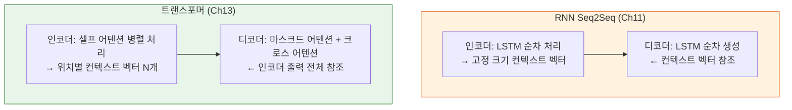
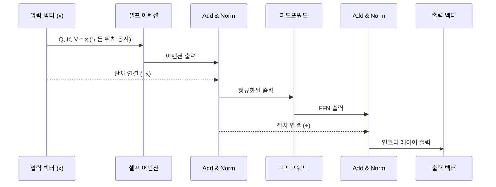
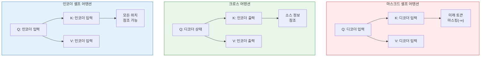
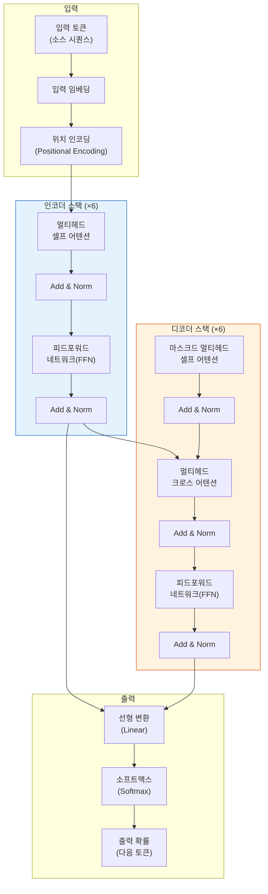
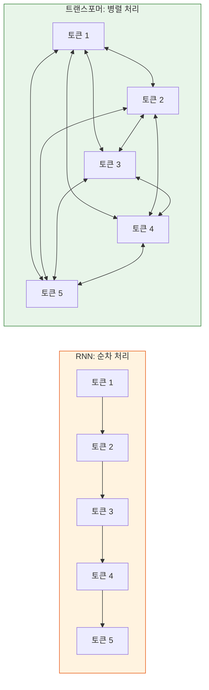

# 01. 트랜스포머 아키텍처 전체 조망

> 'Attention Is All You Need' 논문이 제안한 트랜스포머의 전체 구조를 한눈에 이해하고, RNN을 대체한 이유를 파악합니다.

## 개요

이 섹션에서는 2017년 구글 연구팀이 발표한 트랜스포머(Transformer) 아키텍처의 전체 그림을 살펴봅니다. [Ch11에서 배운 RNN 기반 인코더-디코더](11-ch11-시퀀스-투-시퀀스와-기계-번역/01-01-인코더-디코더-아키텍처.md)와 같은 큰 틀을 공유하지만, 내부 메커니즘은 완전히 다릅니다. 이 섹션에서는 **무엇이 같고, 무엇이 달라졌는지**에 초점을 맞춰 트랜스포머만의 구조적 혁신을 이해하는 것이 목표입니다.

**선수 지식**: [어텐션의 직관적 이해](12-ch12-어텐션-메커니즘/01-01-어텐션의-직관적-이해.md)에서 배운 어텐션 메커니즘의 기본 개념, [셀프 어텐션으로의 확장](12-ch12-어텐션-메커니즘/05-05-셀프-어텐션으로의-확장.md)에서 다룬 셀프 어텐션 개념

**학습 목표**:
- 'Attention Is All You Need' 논문의 핵심 동기와 기여를 설명할 수 있다
- RNN 기반 Seq2Seq와 트랜스포머의 인코더-디코더가 **구조적으로 어떻게 다른지** 비교할 수 있다
- 트랜스포머가 RNN을 대체한 핵심 이유(병렬 처리, 장거리 의존성)를 설명할 수 있다

## 왜 알아야 할까?

여러분이 지금 사용하는 ChatGPT, Claude, Gemini — 이 모든 AI의 심장에는 트랜스포머가 뛰고 있습니다. 2017년에 등장한 이 아키텍처는 NLP뿐 아니라 컴퓨터 비전, 음성 인식, 단백질 구조 예측까지 거의 모든 AI 분야를 혁신했죠. "Attention Is All You Need"라는 논문 제목 그대로, 순환(recurrence)도 합성곱(convolution)도 없이 **어텐션만으로** 시퀀스를 처리할 수 있다는 것을 증명한 논문입니다.

[Ch11](11-ch11-시퀀스-투-시퀀스와-기계-번역/01-01-인코더-디코더-아키텍처.md)에서 우리는 "인코더가 입력을 압축하고, 디코더가 출력을 생성한다"는 Seq2Seq의 큰 그림을 배웠고, [Ch12](12-ch12-어텐션-메커니즘/01-01-어텐션의-직관적-이해.md)에서 어텐션으로 병목 현상을 완화하는 법을 배웠습니다. 트랜스포머는 그 다음 단계입니다 — 인코더-디코더라는 **큰 틀은 유지**하면서, 내부의 RNN을 완전히 걷어내고 셀프 어텐션으로 교체한 것이죠. 같은 집의 골격에 완전히 새로운 배관과 전기 시스템을 넣은 셈입니다.

이 챕터의 나머지 섹션에서 각 구성 요소를 깊이 파고들 텐데, 먼저 전체 지도를 머릿속에 그리는 것이 중요합니다.

## 핵심 개념

### 개념 1: 'Attention Is All You Need' — 논문의 핵심 메시지

> 💡 **비유**: 자동차의 발전 과정을 떠올려보세요. 마차(규칙 기반) → 증기 자동차(RNN) → 내연기관(LSTM/GRU+어텐션) → 전기차(트랜스포머). 전기차가 엔진이라는 핵심 부품 자체를 바꿔버린 것처럼, 트랜스포머는 시퀀스 처리의 핵심 메커니즘을 순환에서 어텐션으로 완전히 교체했습니다.

2017년 6월, 구글 브레인과 구글 리서치 소속의 Ashish Vaswani를 포함한 8명의 연구자가 "Attention Is All You Need"라는 논문을 발표했습니다. 이 논문의 핵심 주장은 명쾌합니다:

**"순환(recurrence)도 합성곱(convolution)도 필요 없다. 어텐션만 있으면 된다."**

당시 기계 번역의 최고 성능 모델은 모두 인코더-디코더 RNN에 어텐션을 더한 구조였습니다. 트랜스포머는 이 RNN을 완전히 제거하고, 셀프 어텐션(Self-Attention)만으로 입력 시퀀스의 모든 위치 간 관계를 한 번에 계산하는 방식을 제안했죠.

> 📊 **그림 1**: NLP 모델 아키텍처의 진화


논문의 결과는 놀라웠습니다. WMT 2014 영어→독일어 번역에서 **28.4 BLEU**를 달성하여 기존 최고 기록을 2 BLEU 이상 경신했고, 영어→프랑스어에서는 **41.8 BLEU**라는 단일 모델 최고 기록을 세웠습니다. 더 놀라운 건 학습 시간이었는데, 8개 GPU로 **3.5일**만에 이 성능을 달성했거든요. 기존 최고 모델들이 수 주간 학습한 것에 비하면 엄청난 효율성이었습니다.

```run:python
# 트랜스포머 논문의 핵심 수치 정리
results = {
    "영어→독일어 BLEU": {"이전 최고": 26.36, "트랜스포머": 28.4},
    "영어→프랑스어 BLEU": {"이전 최고": 40.46, "트랜스포머": 41.8},
}

for task, scores in results.items():
    improvement = scores["트랜스포머"] - scores["이전 최고"]
    print(f"{task}: {scores['이전 최고']} → {scores['트랜스포머']} (+{improvement:.2f})")

# 학습 비용 비교
print(f"\n학습 시간: 기존 수 주 → 트랜스포머 3.5일 (8 GPU)")
print(f"인용 수 (2025년 기준): 173,000+ 회")
```

```output
영어→독일어 BLEU: 26.36 → 28.4 (+2.04)
영어→프랑스어 BLEU: 40.46 → 41.8 (+1.34)

학습 시간: 기존 수 주 → 트랜스포머 3.5일 (8 GPU)
인용 수 (2025년 기준): 173,000+ 회
```

### 개념 2: RNN Seq2Seq에서 트랜스포머로 — 무엇이 바뀌었나

> 💡 **비유**: RNN 기반 Seq2Seq가 **릴레이 경기**였다면, 트랜스포머는 **단체 줄넘기**입니다. 릴레이에서는 바통을 한 사람씩 넘기며(순차 처리) 정보가 전달되지만, 단체 줄넘기에서는 모든 참가자가 동시에 줄의 움직임을 보고 타이밍을 맞춥니다(병렬 처리). 두 경기 모두 "팀원들이 협력한다"는 큰 틀은 같지만, 협력하는 방식이 근본적으로 다르죠.

[Ch11](11-ch11-시퀀스-투-시퀀스와-기계-번역/01-01-인코더-디코더-아키텍처.md)에서 배운 인코더-디코더의 핵심 아이디어 — "인코더가 입력을 이해하고, 디코더가 출력을 생성한다" — 는 트랜스포머에서도 그대로 유지됩니다. 달라진 것은 그 **안에서 정보를 처리하는 방식**입니다.

> 📊 **그림 2**: RNN Seq2Seq vs 트랜스포머 — 같은 틀, 다른 엔진



핵심 차이를 정리하면:

| 구성 요소 | RNN Seq2Seq (Ch11) | 트랜스포머 (Ch13) |
|-----------|-------------------|-------------------|
| **정보 전달** | 고정 크기 컨텍스트 벡터 1개 | 모든 위치의 컨텍스트 벡터 N개 |
| **인코더 처리** | LSTM/GRU 순차 처리 | 셀프 어텐션 병렬 처리 |
| **디코더 처리** | LSTM + (선택적) 어텐션 | 마스크드 셀프 어텐션 + 크로스 어텐션 |
| **순서 정보** | RNN 구조에 내재 | 위치 인코딩으로 명시적 주입 |
| **레이어 구성** | RNN 셀 반복 | 어텐션 + FFN + Add&Norm 블록 반복 |

가장 결정적인 차이는 **순서 정보 처리 방식**입니다. RNN은 토큰을 순서대로 처리하는 것 자체가 순서 정보를 인코딩하는 방법이었죠. 하지만 트랜스포머는 모든 토큰을 동시에 처리하기 때문에, 순서 정보를 별도로 주입해야 합니다. 이것이 **위치 인코딩(Positional Encoding)**이 필요한 이유이고, 이후 섹션에서 자세히 다루게 됩니다.

### 개념 3: 트랜스포머 인코더 — RNN과 무엇이 다른가

> 💡 **비유**: RNN 인코더가 **소설을 한 페이지씩 넘기며 읽는 독자**라면, 트랜스포머 인코더는 **소설 전체를 한눈에 펼쳐놓고 형광펜으로 관계를 표시하는 독자**입니다. 한 페이지씩 읽으면 앞부분 내용이 희미해지지만, 전체를 펼쳐놓으면 첫 페이지와 마지막 페이지의 연결도 즉시 파악할 수 있죠.

트랜스포머 인코더 스택은 동일한 구조의 레이어를 N=6개 쌓은 것입니다. 각 인코더 레이어는 두 개의 서브레이어로 구성됩니다:

1. **멀티헤드 셀프 어텐션(Multi-Head Self-Attention)**: 입력 시퀀스의 각 토큰이 다른 모든 토큰과의 관계를 **동시에** 계산
2. **위치별 피드포워드 네트워크(Position-wise FFN)**: 각 위치에 독립적으로 적용되는 2층 신경망

RNN 인코더와의 결정적 차이는 **잔차 연결(Residual Connection)**과 **레이어 정규화(Layer Normalization)**의 적용입니다. 수식으로 표현하면:

$$\text{output} = \text{LayerNorm}(x + \text{SubLayer}(x))$$

여기서:
- $x$: 서브레이어 입력
- $\text{SubLayer}(x)$: 셀프 어텐션 또는 FFN의 출력
- 잔차 연결($x + ...$)은 기울기 흐름을 원활하게 유지 — RNN의 고질적 문제였던 기울기 소실을 구조적으로 해결

> 📊 **그림 3**: 트랜스포머 인코더 레이어의 데이터 흐름



RNN 인코더에서는 마지막 시간 단계의 은닉 상태 하나가 전체 문장을 대표했습니다. 반면 트랜스포머 인코더는 **각 위치마다 컨텍스트가 반영된 벡터를 출력**합니다. 10개 토큰이 입력되면 10개의 풍부한 표현 벡터가 나오는 것이죠. 이 차이가 디코더의 크로스 어텐션에서 큰 힘을 발휘합니다.

### 개념 4: 트랜스포머 디코더 — 세 가지 어텐션의 협업

> 💡 **비유**: 트랜스포머 디코더는 **동시통역사**와 비슷합니다. RNN 디코더가 "앞 단어의 기억"에만 의존했다면, 트랜스포머 디코더는 세 가지 도구를 씁니다: ① 지금까지 번역한 내용 점검(마스크드 셀프 어텐션), ② 원문 전체를 다시 참조(크로스 어텐션), ③ 종합 판단(FFN). 이 세 단계가 매 레이어마다 반복됩니다.

디코더 스택은 인코더보다 하나의 서브레이어가 더 있어 총 세 개의 서브레이어로 구성됩니다:

1. **마스크드 멀티헤드 셀프 어텐션**: 미래 위치를 $-\infty$로 마스킹하여 자기회귀(autoregressive) 특성 보장
2. **멀티헤드 크로스 어텐션**: 인코더의 출력을 K, V로, 디코더의 현재 상태를 Q로 사용
3. **위치별 피드포워드 네트워크**: 인코더와 동일한 구조

> 📊 **그림 4**: 디코더의 세 가지 어텐션 — Q, K, V의 출처 비교



RNN 디코더와 비교하면, 크로스 어텐션은 Ch12에서 배운 Bahdanau 어텐션과 역할이 같습니다 — 인코더 출력을 참조하는 것이죠. 차이점은 RNN에서는 은닉 상태를 통해 순차적으로 이뤄졌던 "이전 출력 참조"가, 트랜스포머에서는 마스크드 셀프 어텐션이라는 별도의 메커니즘으로 분리되었다는 것입니다. 이 분리 덕분에 각 역할에 더 특화된 학습이 가능해졌습니다.

### 개념 5: 트랜스포머의 전체 구조 한눈에 보기

지금까지의 내용을 하나의 구조도로 종합하겠습니다. 원래 논문에서는 각 스택을 N=6개 쌓았고, 핵심 하이퍼파라미터는 다음과 같습니다:

> 📊 **그림 5**: 트랜스포머 인코더-디코더 전체 구조



| 구성 요소 | 위치 | 역할 | RNN 대비 변화 |
|-----------|------|------|--------------|
| **입력 임베딩** | 입력부 | 토큰을 $d_{model}$=512 차원 벡터로 변환 | 동일 |
| **위치 인코딩** | 입력부 | 순서 정보를 사인/코사인 함수로 주입 | ⭐ 신규 (RNN에서는 불필요) |
| **셀프 어텐션** | 인코더/디코더 | 시퀀스 내 모든 위치 간 관계 계산 | ⭐ RNN 셀 대체 |
| **마스크드 셀프 어텐션** | 디코더 | 미래 토큰을 가리고 이전 토큰만 참조 | ⭐ RNN 순차성 대체 |
| **크로스 어텐션** | 디코더 | 인코더 출력을 참조하여 소스 정보 활용 | Bahdanau 어텐션과 유사 |
| **피드포워드 네트워크** | 인코더/디코더 | 비선형 변환으로 표현력 강화 | ⭐ 신규 |
| **Add & Norm** | 모든 서브레이어 | 잔차 연결 + 레이어 정규화 | ⭐ 신규 (기울기 소실 해결) |

```run:python
# 트랜스포머 논문의 주요 하이퍼파라미터 (base 모델)
config = {
    "d_model (모델 차원)": 512,
    "N (인코더/디코더 레이어 수)": 6,
    "h (어텐션 헤드 수)": 8,
    "d_k (키/쿼리 차원)": 64,       # d_model / h = 512 / 8
    "d_v (값 차원)": 64,
    "d_ff (FFN 내부 차원)": 2048,
    "dropout": 0.1,
}

print("=== Transformer Base 모델 설정 ===")
for name, value in config.items():
    print(f"  {name}: {value}")

total_params = "65M"  # 약 6,500만 파라미터
print(f"\n총 파라미터 수 (base): ~{total_params}")
print(f"총 파라미터 수 (big):  ~213M")
```

```output
=== Transformer Base 모델 설정 ===
  d_model (모델 차원): 512
  N (인코더/디코더 레이어 수): 6
  h (어텐션 헤드 수): 8
  d_k (키/쿼리 차원): 64
  d_v (값 차원): 64
  d_ff (FFN 내부 차원): 2048
  dropout: 0.1

총 파라미터 수 (base): ~65M
총 파라미터 수 (big):  ~213M
```

### 개념 6: RNN 대비 트랜스포머의 핵심 장점

> 💡 **비유**: RNN이 **줄 서서 한 명씩 통과하는 톨게이트**라면, 트랜스포머는 **하이패스 다차선 도로**입니다. RNN은 첫 번째 단어를 처리해야 두 번째 단어를 처리할 수 있지만, 트랜스포머는 모든 단어를 동시에 처리합니다.

같은 인코더-디코더 틀을 공유하면서도, 내부 엔진을 바꾼 것이 왜 그토록 혁명적이었을까요? 세 가지 핵심 차이를 살펴보겠습니다.

**1. 병렬 처리(Parallelization)**

RNN은 시간 단계 $t$의 은닉 상태 $h_t$가 $h_{t-1}$에 의존하므로 본질적으로 순차적입니다. 트랜스포머의 셀프 어텐션은 모든 위치 쌍을 **한 번에** 계산하므로 GPU의 병렬 연산 능력을 최대한 활용합니다.

**2. 장거리 의존성(Long-range Dependencies)**

RNN에서 100번째 단어가 1번째 단어의 정보를 참조하려면 99번의 은닉 상태 전달이 필요합니다. 정보가 전달되면서 점점 희석되죠. 트랜스포머에서는 어텐션이 **직접 연결**하므로 경로 길이가 항상 $O(1)$입니다.

**3. 계산 복잡도 비교**

$$\text{셀프 어텐션}: O(n^2 \cdot d), \quad \text{RNN}: O(n \cdot d^2)$$

여기서 $n$은 시퀀스 길이, $d$는 표현 차원입니다. 시퀀스가 짧을 때($n < d$)는 셀프 어텐션이 더 효율적이고, 시퀀스가 매우 길어지면 셀프 어텐션의 $O(n^2)$이 부담이 됩니다(이것이 이후 Efficient Transformer 연구의 동기가 되었죠).

> 📊 **그림 6**: RNN vs 트랜스포머 — 정보 흐름 비교



| 특성 | RNN/LSTM | 트랜스포머 |
|------|----------|-----------|
| 처리 방식 | 순차적 (한 토큰씩) | 병렬 (모든 토큰 동시) |
| 최대 경로 길이 | $O(n)$ | $O(1)$ |
| 레이어당 계산량 | $O(n \cdot d^2)$ | $O(n^2 \cdot d)$ |
| GPU 활용도 | 낮음 | 높음 |
| 기울기 소실 | 심각 (LSTM으로 완화) | 잔차 연결로 해결 |
| 장거리 의존성 | 약함 | 강함 |

## 실습: 직접 해보기

트랜스포머의 전체 구조를 PyTorch로 확인해봅시다. 아직 각 구성 요소의 세부 구현은 다루지 않고, `nn.Transformer`를 사용하여 전체 구조를 탐색합니다.

```python
import torch
import torch.nn as nn

# PyTorch의 내장 트랜스포머로 구조 살펴보기
transformer = nn.Transformer(
    d_model=512,       # 모델 차원
    nhead=8,           # 어텐션 헤드 수
    num_encoder_layers=6,  # 인코더 레이어 수
    num_decoder_layers=6,  # 디코더 레이어 수
    dim_feedforward=2048,  # FFN 내부 차원
    dropout=0.1,
    batch_first=True,  # (배치, 시퀀스, 특성) 순서 사용
)

# 모델 구조 확인
print("=== 트랜스포머 전체 구조 ===\n")

# 인코더 첫 번째 레이어 구조 확인
encoder_layer = transformer.encoder.layers[0]
print("인코더 레이어 구성:")
for name, module in encoder_layer.named_children():
    print(f"  {name}: {module.__class__.__name__}")

print()

# 디코더 첫 번째 레이어 구조 확인
decoder_layer = transformer.decoder.layers[0]
print("디코더 레이어 구성:")
for name, module in decoder_layer.named_children():
    print(f"  {name}: {module.__class__.__name__}")
```

```run:python
import torch
import torch.nn as nn

# 트랜스포머의 파라미터 수 계산
d_model = 512
n_heads = 8
d_ff = 2048
n_layers = 6

# 셀프 어텐션 파라미터: Q, K, V 투영 + 출력 투영
attn_params = 4 * d_model * d_model  # W_Q, W_K, W_V, W_O

# FFN 파라미터: 2개의 선형 층
ffn_params = d_model * d_ff + d_ff * d_model  # W_1, W_2

# 레이어 정규화 파라미터: 2개 (각 γ, β)
norm_params = 2 * d_model * 2  # 2개의 LayerNorm, 각각 γ와 β

# 인코더 레이어 1개
encoder_layer_params = attn_params + ffn_params + norm_params
print(f"인코더 레이어 1개 파라미터 수:")
print(f"  셀프 어텐션: {attn_params:,}")
print(f"  FFN: {ffn_params:,}")
print(f"  LayerNorm: {norm_params:,}")
print(f"  합계: {encoder_layer_params:,}")

# 디코더 레이어 1개 (셀프 어텐션 + 크로스 어텐션 + FFN)
decoder_layer_params = 2 * attn_params + ffn_params + 3 * d_model * 2
print(f"\n디코더 레이어 1개 파라미터 수:")
print(f"  마스크드 셀프 어텐션: {attn_params:,}")
print(f"  크로스 어텐션: {attn_params:,}")
print(f"  FFN: {ffn_params:,}")
print(f"  합계: {decoder_layer_params:,}")

# 전체 모델 (바이어스 제외한 근사치)
total = n_layers * (encoder_layer_params + decoder_layer_params)
print(f"\n전체 트랜스포머 (약): {total:,} 파라미터")
print(f"  = 약 {total / 1e6:.1f}M 파라미터")
```

```output
인코더 레이어 1개 파라미터 수:
  셀프 어텐션: 1,048,576
  FFN: 2,097,152
  LayerNorm: 2,048
  합계: 3,147,776

디코더 레이어 1개 파라미터 수:
  마스크드 셀프 어텐션: 1,048,576
  크로스 어텐션: 1,048,576
  FFN: 2,097,152
  합계: 4,197,376

전체 트랜스포머 (약): 44,070,912 파라미터
  = 약 44.1M 파라미터
```

```python
# 실제로 데이터를 통과시켜 보기
batch_size = 2
src_len = 10  # 소스 시퀀스 길이
tgt_len = 8   # 타겟 시퀀스 길이

# 임의의 입력 생성 (이미 임베딩된 것으로 가정)
src = torch.randn(batch_size, src_len, d_model)  # 인코더 입력
tgt = torch.randn(batch_size, tgt_len, d_model)  # 디코더 입력

# 디코더의 미래 토큰 마스크 생성
tgt_mask = nn.Transformer.generate_square_subsequent_mask(tgt_len)

# 트랜스포머 통과
transformer = nn.Transformer(
    d_model=d_model, nhead=n_heads,
    num_encoder_layers=n_layers, num_decoder_layers=n_layers,
    dim_feedforward=d_ff, batch_first=True
)

output = transformer(src, tgt, tgt_mask=tgt_mask)
print(f"입력 소스 크기: {src.shape}")      # [2, 10, 512]
print(f"입력 타겟 크기: {tgt.shape}")      # [2, 8, 512]
print(f"출력 크기:     {output.shape}")     # [2, 8, 512]
print(f"\n디코더 마스크 (미래 토큰 차단):")
print(tgt_mask[:5, :5].int())  # 상삼각이 -inf로 마스킹됨
```

## 더 깊이 알아보기

### "Attention Is All You Need" 탄생 비화

이 논문의 탄생 배경에는 흥미로운 이야기가 있습니다. 2017년 구글에서는 여러 팀이 독립적으로 비슷한 아이디어를 탐구하고 있었는데, Ashish Vaswani와 동료들이 기존 Seq2Seq 모델의 학습 속도에 불만을 품고 "RNN을 완전히 제거하면 어떨까?"라는 대담한 질문을 던진 것이 시작이었습니다.

논문 제목 "Attention Is All You Need"는 비틀즈의 "All You Need Is Love"에서 영감을 받았다는 설이 있는데요, 이 간결하고 도발적인 제목이 논문의 핵심 메시지를 완벽하게 전달했습니다. 재미있는 것은, 8명의 공동 저자 중 상당수가 논문 발표 직후 구글을 떠나 각자의 AI 스타트업을 창업했다는 점입니다. Aidan Gomez는 Cohere를, Noam Shazeer는 Character.AI를(이후 구글로 복귀), Niki Parmar와 Ashish Vaswani는 Adept AI를 설립했죠. 하나의 논문이 얼마나 큰 파장을 일으켰는지 보여주는 사례입니다.

### 왜 하필 "트랜스포머"인가?

"Transformer"라는 이름은 입력 시퀀스를 출력 시퀀스로 **변환(transform)**한다는 의미에서 붙여졌습니다. 전기공학의 변압기(transformer)가 전압을 변환하듯, 이 모델은 한 형태의 표현을 다른 형태로 변환하죠. 단순하면서도 본질을 잘 담은 이름이었고, 이후 BERT, GPT, T5 등 수많은 후속 모델의 기반이 되면서 AI 역사에서 가장 영향력 있는 아키텍처 이름이 되었습니다.

## 흔한 오해와 팁

> ⚠️ **흔한 오해**: "트랜스포머는 항상 인코더와 디코더를 함께 사용한다."
> 사실 원래 논문은 인코더-디코더 구조이지만, 이후 **인코더만** 사용하는 모델(BERT), **디코더만** 사용하는 모델(GPT)이 더 큰 성공을 거뒀습니다. 목적에 따라 구조를 선택하는 거죠.

> 💡 **알고 계셨나요?**: "인코더-디코더"라는 이름은 같지만, [Ch11의 RNN Seq2Seq](11-ch11-시퀀스-투-시퀀스와-기계-번역/01-01-인코더-디코더-아키텍처.md)와 트랜스포머의 내부는 완전히 다릅니다. RNN 버전은 은닉 상태를 순차적으로 전달하는 "릴레이 방식"이고, 트랜스포머 버전은 어텐션으로 모든 위치를 동시에 연결하는 "그물망 방식"입니다. 같은 설계 패턴의 두 가지 구현이라고 볼 수 있죠.

> 🔥 **실무 팁**: PyTorch의 `nn.Transformer`를 사용할 때, `batch_first=True`를 명시하세요. 기본값은 `False`(시퀀스 차원이 먼저)인데, 대부분의 다른 모듈과 일관성을 위해 `True`(배치 차원이 먼저)로 설정하는 것이 편합니다.

## 핵심 정리

| 개념 | 설명 |
|------|------|
| 트랜스포머 | 셀프 어텐션만으로 시퀀스를 처리하는 아키텍처 (RNN 완전 제거) |
| RNN과의 관계 | 인코더-디코더 틀은 동일, 내부 처리 메커니즘이 순환→어텐션으로 교체 |
| 인코더 스택 | 셀프 어텐션 + FFN × N개 레이어, 모든 위치의 컨텍스트 벡터를 병렬 생성 |
| 디코더 스택 | 마스크드 셀프 어텐션 + 크로스 어텐션 + FFN × N개 레이어 |
| 병렬 처리 | 모든 위치를 동시에 처리하여 학습 속도 비약적 향상 |
| 장거리 의존성 | 어텐션으로 임의의 두 위치를 $O(1)$에 직접 연결 |
| 위치 인코딩 | RNN의 순차 처리를 대체하여 순서 정보를 명시적으로 주입 |
| 핵심 설정 | $d_{model}$=512, $h$=8, $N$=6, $d_{ff}$=2048 (base 모델) |

## 다음 섹션 미리보기

이번 섹션에서 트랜스포머의 전체 지도를 그려봤습니다. 다음 섹션 [스케일드 닷-프로덕트 어텐션](13-ch13-트랜스포머-아키텍처-심층-분석/02-02-스케일드-닷-프로덕트-어텐션.md)에서는 트랜스포머의 가장 핵심 연산인 $\text{Attention}(Q, K, V) = \text{softmax}\left(\frac{QK^T}{\sqrt{d_k}}\right)V$ 수식을 하나하나 분해하고, 왜 $\sqrt{d_k}$로 스케일링하는지, Query·Key·Value가 정확히 무엇을 의미하는지 깊이 파고들겠습니다.

## 참고 자료

- [Attention Is All You Need (Vaswani et al., 2017)](https://arxiv.org/abs/1706.03762) - 트랜스포머의 원본 논문. 이 챕터 전체의 기반이 되는 필수 읽기 자료
- [The Illustrated Transformer - Jay Alammar](https://jalammar.github.io/illustrated-transformer/) - 트랜스포머 아키텍처를 시각적으로 가장 잘 설명한 블로그. Stanford, Harvard 등 유수 대학 강의에서도 인용
- [The Annotated Transformer - Harvard NLP](http://nlp.seas.harvard.edu//2018/04/03/attention.html) - 논문의 모든 수식을 PyTorch 코드로 한 줄씩 구현한 튜토리얼
- [Transformer Explainer - Georgia Tech](https://poloclub.github.io/transformer-explainer/) - 인터랙티브 시각화로 트랜스포머의 동작을 직접 체험할 수 있는 도구
- [Stanford CS 224N: NLP with Deep Learning](https://web.stanford.edu/class/cs224n/) - 트랜스포머를 포함한 NLP 전반을 다루는 스탠포드 대학 강의

---
### 🔗 Related Sessions
- [인코더-디코더 아키텍처](11-ch11-시퀀스-투-시퀀스와-기계-번역/01-01-인코더-디코더-아키텍처.md) (prerequisite)
