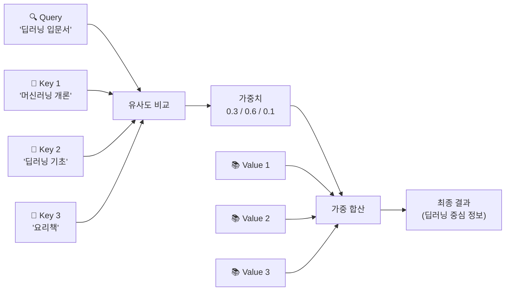
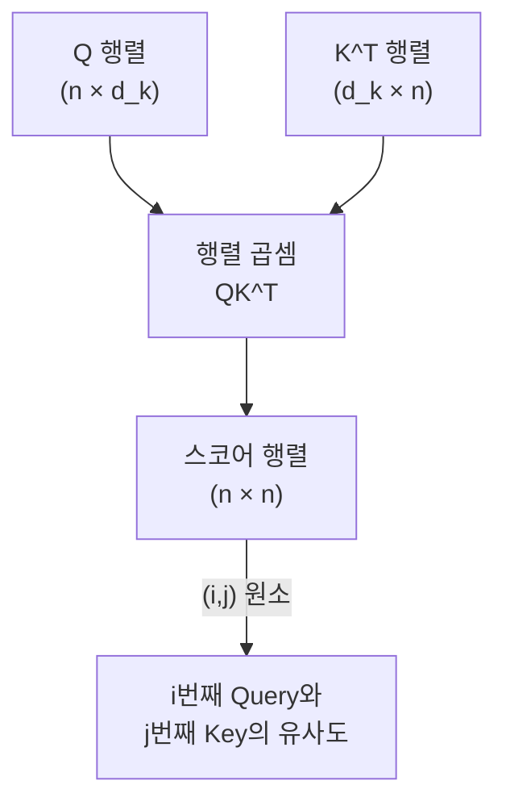
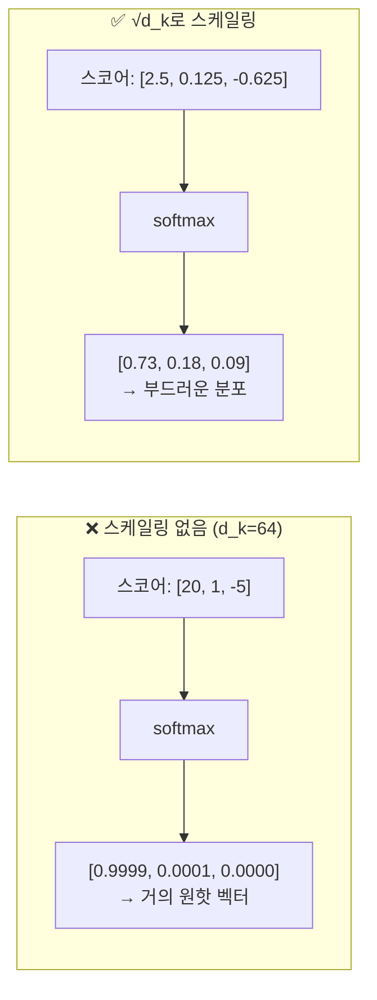
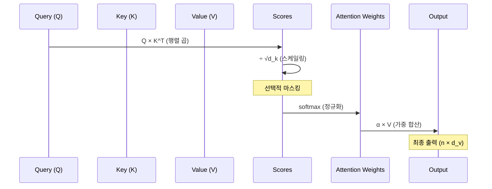
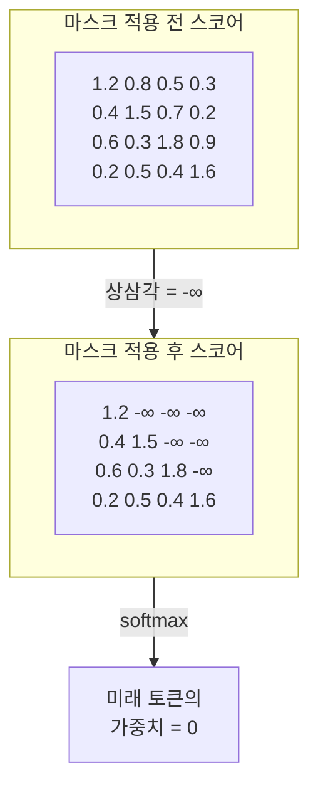

# 스케일드 닷-프로덕트 어텐션

> Query, Key, Value의 삼위일체로 작동하는 트랜스포머의 핵심 연산을 수식부터 코드까지 파헤칩니다.

## 개요

이 섹션에서는 트랜스포머의 심장부인 **스케일드 닷-프로덕트 어텐션(Scaled Dot-Product Attention)** 연산을 수학적으로 해부합니다. 앞서 [트랜스포머 아키텍처 전체 조망](13-ch13-트랜스포머-아키텍처-심층-분석/01-01-트랜스포머-아키텍처-전체-조망.md)에서 셀프 어텐션이 트랜스포머의 핵심이라는 것을 살펴봤는데요, 이번에는 그 내부를 들여다봅니다.

**선수 지식**: Ch12에서 배운 어텐션 메커니즘의 기본 개념, 행렬 곱셈의 이해
**학습 목표**:
- Query, Key, Value 행렬의 역할과 의미를 직관적으로 설명할 수 있다
- $\sqrt{d_k}$ 스케일링 팩터가 왜 필요한지 수학적으로 이해한다
- 어텐션 마스킹의 종류와 목적을 구분할 수 있다
- PyTorch로 스케일드 닷-프로덕트 어텐션을 직접 구현할 수 있다

## 왜 알아야 할까?

트랜스포머 기반 모델(BERT, GPT, T5 등)은 모두 스케일드 닷-프로덕트 어텐션 위에 세워져 있습니다. 이 연산 하나를 정확히 이해하면, 이후에 배울 멀티헤드 어텐션, BERT의 마스크드 언어 모델링, GPT의 자기회귀 생성까지 자연스럽게 연결되죠.

"Attention Is All You Need" 논문의 가장 유명한 수식이 바로 이것입니다:

$$\text{Attention}(Q, K, V) = \text{softmax}\left(\frac{QK^T}{\sqrt{d_k}}\right)V$$

이 한 줄의 수식 안에 **유사도 계산**, **스케일링**, **확률 정규화**, **가중 합산**이라는 네 가지 핵심 연산이 압축되어 있습니다. 하나씩 풀어보겠습니다.

## 핵심 개념

### Query, Key, Value: 도서관 비유

> 💡 **비유**: 도서관에서 책을 찾는 과정을 떠올려 보세요.

여러분이 도서관에 가서 "딥러닝 입문서"를 찾는다고 해봅시다.

- **Query(질의)**: 여러분이 찾고 싶은 것 — "딥러닝 입문서 있나요?"
- **Key(키)**: 각 책의 라벨 — "머신러닝 개론", "딥러닝 기초", "요리책", "파이썬 프로그래밍"...
- **Value(값)**: 실제 책의 내용 — 각 라벨에 대응하는 진짜 정보

여러분의 Query와 각 책의 Key를 비교해서 **관련도(유사도)**를 매깁니다. "딥러닝 기초"는 높은 점수, "요리책"은 낮은 점수를 받겠죠. 그 점수를 가중치로 삼아 각 책의 Value(내용)를 가중 합산하면 — 딥러닝 관련 내용이 압도적으로 많고, 요리 내용은 거의 없는 결과를 얻게 됩니다.

> 📊 **그림 1**: Query, Key, Value의 도서관 비유



셀프 어텐션에서는 **같은 문장의 각 단어가 동시에 Query이자 Key이자 Value** 역할을 합니다. "나는 어제 서울에서 맛있는 피자를 먹었다"라는 문장에서 "먹었다"라는 단어가 Query가 되면, 이 단어는 "피자를", "맛있는", "서울에서" 같은 다른 단어들(Key)과의 관련성을 계산하고, 그에 따라 정보를 가져오는 거죠.

실제로 Q, K, V는 입력 임베딩에 **학습 가능한 가중치 행렬**을 곱해서 만듭니다:

$$Q = XW^Q, \quad K = XW^K, \quad V = XW^V$$

여기서 $X$는 입력 시퀀스의 임베딩 행렬 $(n \times d_{model})$이고, $W^Q, W^K \in \mathbb{R}^{d_{model} \times d_k}$, $W^V \in \mathbb{R}^{d_{model} \times d_v}$는 학습되는 투영(projection) 행렬입니다.

```python
import torch
import torch.nn as nn

d_model = 512   # 모델 차원
d_k = 64        # Key/Query 차원
d_v = 64        # Value 차원
seq_len = 10    # 시퀀스 길이

# 학습 가능한 투영 행렬
W_Q = nn.Linear(d_model, d_k, bias=False)
W_K = nn.Linear(d_model, d_k, bias=False)
W_V = nn.Linear(d_model, d_v, bias=False)

# 입력 임베딩 (배치 1, 시퀀스 10, 차원 512)
X = torch.randn(1, seq_len, d_model)

# Q, K, V 생성
Q = W_Q(X)  # (1, 10, 64)
K = W_K(X)  # (1, 10, 64)
V = W_V(X)  # (1, 10, 64)
```

왜 같은 입력 $X$에서 세 가지 다른 행렬을 만들까요? **역할 분리** 때문입니다. 한 단어가 "질문할 때의 표현"과 "응답할 때의 표현"이 달라야 더 풍부한 관계를 포착할 수 있거든요. 실제로 $W^Q$, $W^K$, $W^V$가 같으면 어텐션의 표현력이 크게 떨어집니다.

### 닷-프로덕트: 유사도 측정의 핵심

> 💡 **비유**: 두 화살표(벡터)가 같은 방향을 가리키면 닷-프로덕트가 크고, 직각이면 0, 반대면 음수입니다. 마치 두 사람의 취향이 얼마나 비슷한지를 숫자로 나타내는 것과 같죠.

어텐션의 첫 번째 단계는 Query와 Key의 **내적(dot product)**입니다:

$$\text{scores} = QK^T$$

$Q$가 $(n \times d_k)$이고 $K^T$가 $(d_k \times n)$이므로, 결과는 $(n \times n)$ 행렬이 됩니다. 이 행렬의 $(i, j)$ 원소는 **$i$번째 토큰의 Query와 $j$번째 토큰의 Key 사이의 유사도**를 나타냅니다.

> 📊 **그림 2**: 닷-프로덕트 어텐션 스코어 계산 과정



예를 들어 "The cat sat" 세 단어에 대한 스코어 행렬은 이렇게 생겼습니다:

|  | The | cat | sat |
|---|---|---|---|
| **The** | 0.8 | 0.2 | 0.1 |
| **cat** | 0.3 | 0.9 | 0.5 |
| **sat** | 0.1 | 0.7 | 0.6 |

"cat"의 행을 보면, "cat" 자신과의 유사도(0.9)가 가장 높고, "sat"과의 유사도(0.5)가 그 다음이죠. 이건 직관적으로도 말이 됩니다 — "고양이가 앉았다"에서 "앉다"는 "고양이"와 밀접하니까요.

```run:python
import torch

# 간단한 예시: 3개 토큰, 차원 4
Q = torch.tensor([[1.0, 0.0, 1.0, 0.0],   # "The"
                   [0.0, 1.0, 0.0, 1.0],   # "cat"
                   [1.0, 1.0, 0.0, 0.0]])  # "sat"

K = torch.tensor([[1.0, 0.0, 1.0, 0.0],   # "The"
                   [0.0, 1.0, 0.0, 1.0],   # "cat"
                   [1.0, 1.0, 0.0, 0.0]])  # "sat"

# 닷-프로덕트 스코어 계산
scores = torch.matmul(Q, K.transpose(-2, -1))
print("어텐션 스코어 행렬:")
print(scores)
```

```output
어텐션 스코어 행렬:
tensor([[2., 0., 1.],
        [0., 2., 1.],
        [1., 1., 2.]])
```

### 스케일링: √d_k의 비밀

여기서 핵심적인 질문이 등장합니다. 왜 닷-프로덕트 결과를 $\sqrt{d_k}$로 나누는 걸까요?

> 💡 **비유**: 시험 점수로 비유해 봅시다. 10문제짜리 시험에서 8점이면 "잘 했네"라고 느끼지만, 1000문제짜리 시험에서 800점이면 숫자는 크지만 비율은 같죠. 스케일링은 이렇게 **차원이 달라도 유사도의 크기를 일정하게** 유지해주는 역할을 합니다.

수학적으로 설명하면 이렇습니다. $Q$와 $K$의 각 원소가 평균 0, 분산 1인 독립 확률 변수라고 가정하면:

$$q \cdot k = \sum_{i=1}^{d_k} q_i \cdot k_i$$

이 합의 **평균은 0**, **분산은 $d_k$**가 됩니다. 즉 $d_k = 64$이면 닷-프로덕트의 표준편차가 $\sqrt{64} = 8$이 되어, 스코어 값이 $-20$에서 $+20$ 사이로 퍼질 수 있습니다.

이렇게 큰 값이 softmax에 들어가면 어떻게 될까요?

> 📊 **그림 3**: 스케일링 유무에 따른 softmax 출력 비교



softmax 함수는 입력값 차이가 커지면 **거의 원핫 벡터**처럼 극단적인 분포를 만들어 냅니다. 이러면 기울기(gradient)가 사실상 0에 가까워져서 학습이 멈추는 **기울기 소실(vanishing gradient)** 문제가 발생합니다.

$\sqrt{d_k}$로 나누면 닷-프로덕트의 분산이 다시 1로 정규화되어, softmax가 **부드러운 확률 분포**를 출력하게 됩니다. 부드러운 분포 → 의미 있는 기울기 → 안정적인 학습. 이것이 스케일링의 핵심입니다.

```run:python
import torch
import torch.nn.functional as F

# 스케일링의 효과를 직접 확인
d_k = 64
scores_unscaled = torch.tensor([20.0, 1.0, -5.0])  # 큰 값의 스코어
scores_scaled = scores_unscaled / (d_k ** 0.5)      # √64 = 8로 나눔

print(f"스케일링 전: {F.softmax(scores_unscaled, dim=-1).tolist()}")
print(f"스케일링 후: {F.softmax(scores_scaled, dim=-1).tolist()}")
print(f"\n스케일링 팩터 (√d_k): {d_k ** 0.5}")
```

```output
스케일링 전: [0.9999938011169434, 5.602796186483558e-09, 2.0611536921837902e-11]
스케일링 후: [0.7327529788017273, 0.17980138957500458, 0.08744563162326813]

스케일링 팩터 (√d_k): 8.0
```

보이시나요? 스케일링 전에는 첫 번째 토큰이 거의 100%의 어텐션을 독차지하지만, 스케일링 후에는 73%, 18%, 9%로 훨씬 균형 잡힌 분포가 됩니다.

### 어텐션 가중치: softmax와 가중 합산

스케일링된 스코어에 softmax를 적용하면 **어텐션 가중치(attention weights)**가 됩니다:

$$\alpha = \text{softmax}\left(\frac{QK^T}{\sqrt{d_k}}\right)$$

이 가중치 행렬 $\alpha$의 각 행은 확률 분포(합이 1)입니다. 그리고 이 가중치로 $V$를 가중 합산하면 최종 출력이 됩니다:

$$\text{Output} = \alpha V$$

> 📊 **그림 4**: 스케일드 닷-프로덕트 어텐션의 전체 흐름



이 과정을 함수로 구현하면:

```python
import torch
import torch.nn.functional as F
import math

def scaled_dot_product_attention(Q, K, V, mask=None):
    """
    스케일드 닷-프로덕트 어텐션 구현

    Args:
        Q: Query 행렬 (batch, seq_len, d_k)
        K: Key 행렬   (batch, seq_len, d_k)
        V: Value 행렬 (batch, seq_len, d_v)
        mask: 어텐션 마스크 (선택)
    Returns:
        output: 어텐션 출력 (batch, seq_len, d_v)
        attention_weights: 어텐션 가중치 (batch, seq_len, seq_len)
    """
    d_k = Q.size(-1)

    # 1단계: 닷-프로덕트 스코어 계산
    scores = torch.matmul(Q, K.transpose(-2, -1))  # (batch, n, n)

    # 2단계: √d_k로 스케일링
    scores = scores / math.sqrt(d_k)

    # 3단계: 마스킹 (선택)
    if mask is not None:
        scores = scores.masked_fill(mask == 0, float('-inf'))

    # 4단계: softmax로 확률 분포 변환
    attention_weights = F.softmax(scores, dim=-1)

    # 5단계: Value에 가중치 적용
    output = torch.matmul(attention_weights, V)

    return output, attention_weights
```

### 마스킹: 미래를 가리는 기술

어텐션 마스킹은 **특정 위치의 정보를 차단**하는 기법입니다. 트랜스포머에서 두 가지 주요 마스킹이 사용됩니다.

**1. 패딩 마스크(Padding Mask)**
배치 처리를 위해 짧은 문장에 추가된 패딩 토큰(`[PAD]`)은 어텐션 계산에서 제외해야 합니다. 패딩 위치의 스코어를 $-\infty$로 설정하면, softmax 후 가중치가 0이 됩니다.

**2. 룩어헤드 마스크(Look-ahead Mask, Causal Mask)**
디코더에서 사용하는 마스크로, 각 위치가 **자기 이전 위치만** 참조할 수 있게 합니다. GPT 같은 자기회귀 모델에서 필수적이죠. "I love"까지 생성했을 때, 아직 생성하지 않은 미래의 토큰을 참조하면 안 되니까요.

> 📊 **그림 5**: 룩어헤드 마스크의 동작 원리



```run:python
import torch

# 룩어헤드 마스크 생성
seq_len = 4
causal_mask = torch.tril(torch.ones(seq_len, seq_len))
print("Causal Mask (하삼각 행렬):")
print(causal_mask)
print("\n1 = 참조 가능, 0 = 차단")
print(f"\n위치 2는 위치 0, 1, 2만 볼 수 있음: {causal_mask[2].tolist()}")
```

```output
Causal Mask (하삼각 행렬):
tensor([[1., 0., 0., 0.],
        [1., 1., 0., 0.],
        [1., 1., 1., 0.],
        [1., 1., 1., 1.]])

1 = 참조 가능, 0 = 차단

위치 2는 위치 0, 1, 2만 볼 수 있음: [1.0, 1.0, 1.0, 0.0]
```

## 실습: 직접 해보기

전체 스케일드 닷-프로덕트 어텐션을 처음부터 구현하고, PyTorch 내장 함수와 결과를 비교해 봅시다.

```python
import torch
import torch.nn as nn
import torch.nn.functional as F
import math

# ===== 1. 직접 구현 =====
def scaled_dot_product_attention(Q, K, V, mask=None, dropout_p=0.0):
    """스케일드 닷-프로덕트 어텐션 (직접 구현)"""
    d_k = Q.size(-1)

    # QK^T / √d_k
    scores = torch.matmul(Q, K.transpose(-2, -1)) / math.sqrt(d_k)

    # 마스킹
    if mask is not None:
        scores = scores.masked_fill(mask == 0, float('-inf'))

    # softmax → 어텐션 가중치
    attn_weights = F.softmax(scores, dim=-1)

    # 드롭아웃 (학습 시)
    if dropout_p > 0.0:
        attn_weights = F.dropout(attn_weights, p=dropout_p)

    # 가중 합산
    output = torch.matmul(attn_weights, V)
    return output, attn_weights


# ===== 2. 테스트 =====
torch.manual_seed(42)

batch_size = 2
seq_len = 5
d_model = 512
d_k = 64

# 입력 임베딩
X = torch.randn(batch_size, seq_len, d_model)

# Q, K, V 투영
W_Q = nn.Linear(d_model, d_k, bias=False)
W_K = nn.Linear(d_model, d_k, bias=False)
W_V = nn.Linear(d_model, d_k, bias=False)

Q = W_Q(X)  # (2, 5, 64)
K = W_K(X)
V = W_V(X)

# 직접 구현한 어텐션 실행
output, attn_weights = scaled_dot_product_attention(Q, K, V)
print(f"출력 shape: {output.shape}")           # (2, 5, 64)
print(f"어텐션 가중치 shape: {attn_weights.shape}")  # (2, 5, 5)
print(f"가중치 행 합 (=1): {attn_weights[0, 0].sum().item():.4f}")

# ===== 3. PyTorch 내장 함수와 비교 =====
# PyTorch 2.0+ 내장 SDPA
output_pytorch = F.scaled_dot_product_attention(Q, K, V)
print(f"\n직접 구현 vs PyTorch 내장 — 차이: {(output - output_pytorch).abs().max().item():.10f}")

# ===== 4. 인과적 마스크 적용 =====
causal_mask = torch.tril(torch.ones(seq_len, seq_len)).unsqueeze(0)  # (1, 5, 5)
output_masked, attn_masked = scaled_dot_product_attention(Q, K, V, mask=causal_mask)

print(f"\n인과적 마스크 적용 후 어텐션 가중치 (첫 번째 행):")
print(f"  위치 0: {attn_masked[0, 0].tolist()}")
print(f"  위치 2: {[f'{x:.3f}' for x in attn_masked[0, 2].tolist()]}")
```

> 🔥 **실무 팁**: PyTorch 2.0부터 제공되는 `F.scaled_dot_product_attention`은 FlashAttention, Memory-Efficient Attention 등의 최적화된 커널을 자동으로 선택합니다. 직접 구현은 학습용으로 좋지만, 실제 프로젝트에서는 내장 함수를 사용하세요. `is_causal=True` 파라미터 하나로 인과적 마스크를 자동 적용할 수도 있습니다.

## 더 깊이 알아보기

### "Attention Is All You Need"의 탄생 뒷이야기

2017년 Vaswani 등이 발표한 이 논문은 Google Brain과 Google Research의 합작품이었습니다. 사실 이 논문의 초기 제목은 훨씬 평범했다고 하는데, 저자 중 한 명인 **Llion Jones**가 대담하게 "Attention Is All You Need"라는 제목을 제안했죠. 처음에는 너무 도발적이라는 의견도 있었지만, 결과적으로 이 제목은 AI 역사상 가장 아이코닉한 논문 제목 중 하나가 되었습니다.

닷-프로덕트 어텐션 자체는 사실 트랜스포머 이전에도 존재했습니다. **Luong 어텐션**(2015)이 이미 닷-프로덕트 기반이었고, 트랜스포머의 기여는 **스케일링 + 셀프 어텐션 + 멀티헤드**라는 조합을 통해 RNN 없이도 시퀀스를 처리할 수 있음을 보인 것이었습니다.

### 왜 Additive Attention이 아닌 Dot-Product인가?

[Bahdanau와 Luong 어텐션](12-ch12-어텐션-메커니즘/02-02-bahdanau와-luong-어텐션.md)에서 배웠듯이, 어텐션에는 두 가지 대표적인 스코어링 방식이 있습니다:

- **Additive(가산적)**: $\text{score}(q, k) = v^T \tanh(W_1 q + W_2 k)$ — Bahdanau 방식
- **Dot-Product(곱셈적)**: $\text{score}(q, k) = q \cdot k$ — Luong 방식

논문 저자들은 두 방식의 이론적 복잡도는 비슷하지만, **닷-프로덕트가 고도로 최적화된 행렬 곱 라이브러리를 활용**할 수 있어 실제로 훨씬 빠르고 메모리 효율적이라고 밝혔습니다. 단, $d_k$가 클 때 기울기 소실 문제가 발생하므로 스케일링이 필요한 것이죠.

## 흔한 오해와 팁

> ⚠️ **흔한 오해**: "Q, K, V가 항상 같은 입력에서 나온다"고 생각하기 쉬운데, 이는 **셀프 어텐션의 경우만** 해당합니다. 디코더의 **크로스 어텐션**에서는 Q는 디코더 입력에서, K와 V는 인코더 출력에서 옵니다. Q/K/V의 출처가 같으면 셀프 어텐션, 다르면 크로스 어텐션입니다.

> 💡 **알고 계셨나요?**: 스케일링 팩터로 $\sqrt{d_k}$ 대신 학습 가능한 파라미터를 사용하는 연구도 있습니다. 하지만 원본 트랜스포머의 $\sqrt{d_k}$가 대부분의 경우 충분히 잘 작동하기 때문에, 최신 모델들도 여전히 이 방식을 사용합니다.

> 🔥 **실무 팁**: 어텐션 가중치를 시각화할 때는 `attn_weights.detach().numpy()`로 변환 후 `matplotlib`의 `imshow`를 사용하세요. 어떤 토큰이 어떤 토큰에 주목하는지 한눈에 볼 수 있어 디버깅에 매우 유용합니다.

## 핵심 정리

| 개념 | 설명 |
|------|------|
| **Query (Q)** | "무엇을 찾고 있는가" — 현재 위치의 질의 벡터 |
| **Key (K)** | "나는 이런 정보를 가지고 있다" — 각 위치의 식별 벡터 |
| **Value (V)** | "실제 전달할 정보" — 각 위치의 콘텐츠 벡터 |
| **스케일링 (÷√d_k)** | 닷-프로덕트의 분산을 1로 정규화하여 softmax 기울기 소실 방지 |
| **softmax** | 스코어를 확률 분포로 변환 (합 = 1) |
| **패딩 마스크** | `[PAD]` 토큰의 어텐션 가중치를 0으로 만듦 |
| **룩어헤드 마스크** | 미래 토큰 참조를 차단 (디코더/GPT에서 사용) |
| **전체 수식** | $\text{Attention}(Q,K,V) = \text{softmax}(QK^T / \sqrt{d_k})V$ |

## 다음 섹션 미리보기

하나의 어텐션 헤드로는 한 가지 유형의 관계만 포착할 수 있습니다. "주어-동사 관계"에 집중하면 "형용사-명사 관계"를 놓칠 수 있죠. 다음 섹션 [멀티헤드 어텐션](13-ch13-트랜스포머-아키텍처-심층-분석/03-03-멀티헤드-어텐션.md)에서는 여러 개의 어텐션 헤드를 **병렬로** 운영하여 다양한 관계를 동시에 포착하는 방법을 배웁니다.

## 참고 자료

- [Attention Is All You Need (Vaswani et al., 2017)](https://arxiv.org/abs/1706.03762) - 트랜스포머 원본 논문. Section 3.2.1에서 스케일드 닷-프로덕트 어텐션을 정의
- [The Illustrated Transformer — Jay Alammar](https://jalammar.github.io/illustrated-transformer/) - Q, K, V의 동작을 직관적인 시각 자료로 설명하는 최고의 가이드
- [PyTorch `F.scaled_dot_product_attention` 공식 문서](https://docs.pytorch.org/docs/stable/generated/torch.nn.functional.scaled_dot_product_attention.html) - PyTorch 2.0+ 내장 SDPA 함수의 API 레퍼런스와 최적화 백엔드 설명
- [Attention Scoring Functions — Dive into Deep Learning](https://d2l.ai/chapter_attention-mechanisms-and-transformers/attention-scoring-functions.html) - 가산적 어텐션과 닷-프로덕트 어텐션의 수학적 비교
- [The Annotated Transformer](http://nlp.seas.harvard.edu//2018/04/03/attention.html) - Harvard NLP의 트랜스포머 논문 코드 구현과 상세 주석

---
### 🔗 Related Sessions
- [트랜스포머 아키텍처](13-ch13-트랜스포머-아키텍처-심층-분석/01-01-트랜스포머-아키텍처-전체-조망.md) (prerequisite)
