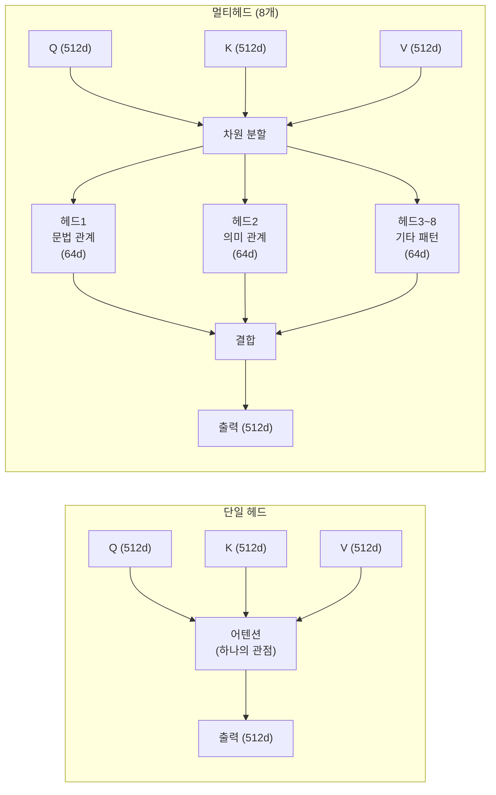
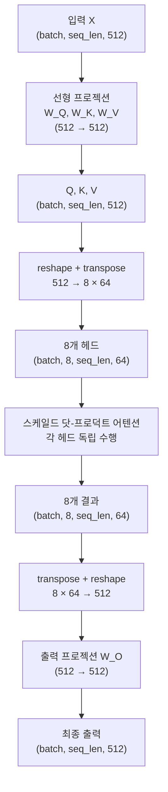
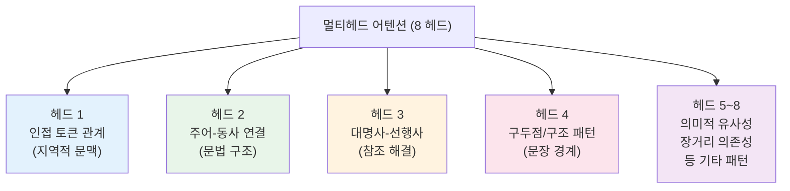

# 멀티헤드 어텐션

> 하나의 시선이 아닌 여러 관점으로 동시에 바라보는 어텐션의 확장

## 개요

이 섹션에서는 트랜스포머의 핵심 메커니즘인 **멀티헤드 어텐션(Multi-Head Attention)**을 배웁니다. [이전 섹션](13-ch13-트랜스포머-아키텍처-심층-분석/02-02-스케일드-닷-프로덕트-어텐션.md)에서 배운 스케일드 닷-프로덕트 어텐션은 **하나의 관점**으로 유사도를 계산하는 단일 연산이었죠. 멀티헤드 어텐션은 이 단일 연산을 **여러 개 병렬로 수행**하여, 데이터의 다양한 측면을 동시에 포착하는 구조입니다.

**선수 지식**: 스케일드 닷-프로덕트 어텐션의 Q, K, V 개념과 Softmax 계산 흐름
**학습 목표**:
- 단일 어텐션 헤드의 한계를 이해하고, 멀티헤드가 왜 필요한지 설명할 수 있다
- 멀티헤드 어텐션의 차원 분할(split) → 병렬 어텐션 → 결합(concat) 과정을 설명할 수 있다
- PyTorch로 멀티헤드 어텐션을 직접 구현하고 `nn.MultiheadAttention`과 비교할 수 있다

## 왜 알아야 할까?

이전 섹션에서 스케일드 닷-프로덕트 어텐션이 어떻게 "어디에 집중할지"를 결정하는지 배웠습니다. 하나의 어텐션 연산만으로도 꽤 잘 작동하는데, 왜 굳이 여러 개를 쓸까요?

"The cat sat on the mat because **it** was tired."라는 문장을 생각해보세요. "it"이 가리키는 대상을 이해하려면 **문법적 관계**(주어-동사)와 **의미적 관계**(피곤한 존재 = cat)를 **동시에** 파악해야 합니다. 하나의 어텐션 헤드는 이 중 한 가지 패턴에 특화되기 쉬운데, 멀티헤드 어텐션은 여러 헤드가 **각기 다른 관계**를 담당하여 더 풍부한 표현을 만들어냅니다.

GPT, BERT, 그리고 최신 LLM까지 — 트랜스포머 기반 모델은 예외 없이 멀티헤드 어텐션을 사용합니다. 이 구조를 이해하는 것이 곧 현대 LLM의 핵심을 이해하는 것이에요.

## 단일 어텐션에서 멀티헤드로: 브릿지

멀티헤드 어텐션을 바로 보기 전에, 이전 섹션에서 배운 내용을 간단히 복습하고 그 한계를 짚어보겠습니다.

### 복습: 스케일드 닷-프로덕트 어텐션

[이전 섹션](13-ch13-트랜스포머-아키텍처-심층-분석/02-02-스케일드-닷-프로덕트-어텐션.md)에서 배운 핵심 공식은 이렇습니다:

$$\text{Attention}(Q, K, V) = \text{softmax}\left(\frac{QK^T}{\sqrt{d_k}}\right)V$$

Q(질문), K(키), V(값)을 받아서, Q와 K의 유사도를 구한 뒤 V를 가중합하는 구조였죠. 이 연산 하나가 **하나의 어텐션 헤드**입니다.

### 단일 헤드의 한계: 왜 하나로는 부족할까?

> 💡 **비유**: 축구 경기를 한 명의 카메라맨이 촬영한다고 상상해보세요. 아무리 실력이 좋아도, 한 번에 볼을 가진 선수 **또는** 수비 진형 **또는** 관중 반응 중 하나만 잡을 수 있습니다. 멀티 카메라 시스템이라면? 각 카메라가 다른 앵글을 동시에 촬영해서 훨씬 풍부한 중계가 가능하겠죠.

단일 어텐션 헤드는 Q, K, V를 **하나의 공간**에서 변환합니다. 이는 모든 종류의 관계를 **하나의 유사도 점수**로 압축해야 한다는 뜻이에요.

```python
# 단일 헤드: 512차원 전체를 한 번에 처리
Q = X @ W_Q  # (seq_len, 512)
K = X @ W_K  # (seq_len, 512)
scores = Q @ K.T / sqrt(512)  # 하나의 유사도 행렬
```

이 하나의 유사도 행렬에 문법적 관계, 의미적 관계, 위치적 근접성 등 **모든 정보를 담아야** 합니다. 이건 너무 많은 짐을 하나의 연산에 지우는 셈이죠.

> 📊 **그림 1**: 단일 헤드 vs 멀티헤드 어텐션 비교



이 차이가 핵심입니다. 같은 512차원이라도, **8개로 나눠서 각각 다른 관점을 학습**하면 훨씬 풍부한 표현이 가능해집니다.

## 핵심 개념

### 개념 1: 멀티헤드 어텐션의 구조

> 💡 **비유**: 번역가 팀을 상상해보세요. 8명의 전문 번역가가 같은 문서를 받지만, 각자 **다른 측면**에 집중합니다. 한 명은 문법 구조, 다른 한 명은 감정 뉘앙스, 또 다른 한 명은 전문 용어에 주목하죠. 최종 번역은 이 8명의 분석을 **종합**해서 만듭니다.

멀티헤드 어텐션의 수식은 다음과 같습니다:

$$\text{MultiHead}(Q, K, V) = \text{Concat}(\text{head}_1, ..., \text{head}_h)W^O$$

$$\text{where head}_i = \text{Attention}(QW_i^Q, KW_i^K, VW_i^V)$$

각 기호의 의미:
- $h$: 헤드 수 (보통 8 또는 16)
- $W_i^Q, W_i^K, W_i^V$: 각 헤드의 프로젝션 행렬 ($d_{model} \times d_k$)
- $W^O$: 최종 출력 프로젝션 행렬 ($hd_v \times d_{model}$)
- $d_k = d_v = d_{model} / h$: 각 헤드의 차원

이게 의미하는 바는 — 원본 차원을 $h$등분해서 각 헤드가 **독립적으로** 어텐션을 수행한 뒤, 결과를 이어붙이고 다시 원래 차원으로 변환한다는 겁니다.

### 개념 2: 차원 분할과 재결합 과정

> 💡 **비유**: 빛이 프리즘을 통과하면 무지개 색으로 분해되었다가, 다시 합치면 원래의 백색광이 됩니다. 멀티헤드 어텐션도 마찬가지예요 — 임베딩을 여러 "색"으로 분해하여 각각을 분석한 뒤, 다시 합칩니다.

구체적인 차원 변환을 단계별로 따라가 보겠습니다. $d_{model} = 512$, $h = 8$인 경우:

> 📊 **그림 2**: 멀티헤드 어텐션의 차원 변환 과정



핵심 포인트가 있습니다: **입력 차원과 출력 차원이 같다**는 것이죠 (512 → 512). 이 덕분에 멀티헤드 어텐션 블록을 여러 층으로 쌓을 수 있습니다. 이전 층의 출력이 바로 다음 층의 입력이 되니까요.

### 개념 3: 각 헤드는 무엇을 학습하나?

학습된 트랜스포머를 분석해보면, 각 헤드가 놀라울 정도로 **다른 패턴**에 특화된다는 걸 발견할 수 있습니다.

> 📊 **그림 3**: 학습된 헤드별 특화 패턴 예시



> 💡 **알고 계셨나요?** 2019년 Google의 연구(Voita et al.)에서 학습된 트랜스포머의 헤드를 분석했더니, 일부 헤드는 **위치 관계**(바로 옆 토큰에 주목), 일부는 **문법 관계**(주어↔동사), 일부는 **희귀 토큰**에 특화되어 있었습니다. 마치 팀의 각 멤버가 자연스럽게 역할 분담을 한 것처럼요.

### 개념 4: 계산 효율성 — 공짜 점심?

멀티헤드 어텐션의 가장 멋진 점 중 하나는 **계산량이 단일 헤드와 거의 같다**는 것입니다.

| 구성 | 차원 | 어텐션 연산량 |
|------|------|-------------|
| 단일 헤드 | $d_k = 512$ | $O(n^2 \times 512)$ |
| 8헤드 | $d_k = 64$ × 8개 | $8 \times O(n^2 \times 64) = O(n^2 \times 512)$ |

차원을 나눈 만큼 각 헤드의 연산이 가벼워지므로, 전체 연산량은 동일합니다. 하지만 표현력은 훨씬 풍부해지죠 — 사실상 **공짜로 다양성을 얻는** 셈입니다.

## 더 깊이 알아보기

### CNN 다중 필터에서 영감받은 멀티헤드 설계

멀티헤드 어텐션의 아이디어는 사실 CNN의 **다중 필터(multiple filters)**에서 영감을 받았습니다. CNN에서 하나의 합성곱 레이어가 여러 필터를 사용해 엣지, 텍스처, 색상 등 **다양한 특징**을 동시에 추출하잖아요?

Vaswani 등이 2017년 "Attention Is All You Need" 논문을 쓸 때, 이 아이디어를 어텐션에 적용했습니다. 논문 원문에서도 이렇게 설명합니다:

> *"Multi-head attention allows the model to jointly attend to information from different representation subspaces at different positions."*

하나의 어텐션이 **하나의 필터**라면, 멀티헤드는 **필터 뱅크** — 여러 필터를 동시에 적용하는 것과 같습니다. 이 단순하지만 강력한 아이디어가 트랜스포머의 성공에 결정적 역할을 했습니다.

## 실습: 직접 해보기

### 실습 1: 멀티헤드 어텐션 직접 구현

이전 섹션에서 배운 `scaled_dot_product_attention`을 활용하여 멀티헤드 어텐션을 직접 만들어봅시다.

```run:python
import torch
import torch.nn as nn
import math

class MultiHeadAttention(nn.Module):
    def __init__(self, d_model=512, num_heads=8):
        super().__init__()
        self.d_model = d_model
        self.num_heads = num_heads
        self.d_k = d_model // num_heads  # 각 헤드의 차원: 512/8 = 64

        # Q, K, V 프로젝션을 하나의 행렬로 합침 (효율성)
        self.W_q = nn.Linear(d_model, d_model, bias=False)
        self.W_k = nn.Linear(d_model, d_model, bias=False)
        self.W_v = nn.Linear(d_model, d_model, bias=False)
        # 출력 프로젝션
        self.W_o = nn.Linear(d_model, d_model, bias=False)

    def forward(self, Q, K, V):
        batch_size, seq_len, _ = Q.size()

        # 1단계: 선형 프로젝션
        Q = self.W_q(Q)  # (batch, seq_len, 512)
        K = self.W_k(K)
        V = self.W_v(V)

        # 2단계: 헤드 분할 (reshape + transpose)
        # (batch, seq_len, 512) → (batch, seq_len, 8, 64) → (batch, 8, seq_len, 64)
        Q = Q.view(batch_size, seq_len, self.num_heads, self.d_k).transpose(1, 2)
        K = K.view(batch_size, seq_len, self.num_heads, self.d_k).transpose(1, 2)
        V = V.view(batch_size, seq_len, self.num_heads, self.d_k).transpose(1, 2)

        # 3단계: 스케일드 닷-프로덕트 어텐션 (각 헤드 독립)
        scores = torch.matmul(Q, K.transpose(-2, -1)) / math.sqrt(self.d_k)
        attn_weights = torch.softmax(scores, dim=-1)
        context = torch.matmul(attn_weights, V)  # (batch, 8, seq_len, 64)

        # 4단계: 헤드 결합 (transpose + reshape)
        # (batch, 8, seq_len, 64) → (batch, seq_len, 8, 64) → (batch, seq_len, 512)
        context = context.transpose(1, 2).contiguous().view(batch_size, seq_len, self.d_model)

        # 5단계: 출력 프로젝션
        output = self.W_o(context)
        return output, attn_weights

# 테스트
torch.manual_seed(42)
mha = MultiHeadAttention(d_model=64, num_heads=4)  # 작은 크기로 테스트
x = torch.randn(2, 5, 64)  # batch=2, seq_len=5, d_model=64

output, weights = mha(x, x, x)  # Self-Attention
print(f"입력 shape:  {x.shape}")
print(f"출력 shape:  {output.shape}")
print(f"어텐션 가중치 shape: {weights.shape}")
print(f"어텐션 가중치 합 (헤드0, 토큰0): {weights[0, 0, 0].sum().item():.4f}")
```

```output
입력 shape:  torch.Size([2, 5, 64])
출력 shape:  torch.Size([2, 5, 64])
어텐션 가중치 shape: torch.Size([2, 4, 5, 5])
어텐션 가중치 합 (헤드0, 토큰0): 1.0000
```

출력 shape를 확인해보세요: 입력과 동일한 `(2, 5, 64)`입니다. 어텐션 가중치는 `(batch, num_heads, seq_len, seq_len)` — 4개 헤드가 각각 5×5 어텐션 맵을 만들었고, 각 행의 합은 정확히 1.0이죠 (softmax 결과니까요).

### 실습 2: PyTorch 내장 모듈과 비교

실무에서는 직접 구현보다 PyTorch의 `nn.MultiheadAttention`을 사용합니다. 우리 구현과 비교해볼까요?

```run:python
import torch
import torch.nn as nn

# PyTorch 내장 멀티헤드 어텐션
d_model, num_heads = 64, 4
pytorch_mha = nn.MultiheadAttention(
    embed_dim=d_model,
    num_heads=num_heads,
    batch_first=True  # (batch, seq, dim) 형식 사용
)

torch.manual_seed(42)
x = torch.randn(2, 5, d_model)

# PyTorch MHA는 (출력, 어텐션 가중치) 반환
output, attn_weights = pytorch_mha(x, x, x)  # Self-Attention

print(f"입력 shape: {x.shape}")
print(f"출력 shape: {output.shape}")
print(f"가중치 shape: {attn_weights.shape}")

# 파라미터 수 비교
custom_params = sum(p.numel() for p in MultiHeadAttention(d_model, num_heads).parameters())
pytorch_params = sum(p.numel() for p in pytorch_mha.parameters())
print(f"\n커스텀 구현 파라미터: {custom_params:,}")
print(f"PyTorch 내장 파라미터: {pytorch_params:,}")
print(f"차이 원인: PyTorch는 bias 포함 (기본값)")
```

```output
입력 shape: torch.Size([2, 5, 64])
출력 shape: torch.Size([2, 5, 64])
가중치 shape: torch.Size([2, 5, 5])

커스텀 구현 파라미터: 16,384
PyTorch 내장 파라미터: 16,960
차이 원인: PyTorch는 bias 포함 (기본값)
```

> 🔥 **실무 팁**: PyTorch의 `nn.MultiheadAttention`은 내부적으로 Q, K, V 프로젝션을 **하나의 큰 행렬(`in_proj_weight`)**로 합쳐서 처리합니다. 이렇게 하면 GPU에서 행렬 곱셈을 한 번만 호출하므로 더 효율적이에요. 우리 구현에서 `W_q`, `W_k`, `W_v`를 따로 둔 건 이해를 위한 것이고, 실무에서는 합치는 게 일반적입니다.

## 흔한 오해와 팁

> ⚠️ **흔한 오해**: "멀티헤드는 같은 어텐션을 여러 번 반복하는 것이다"
> 아닙니다! 각 헤드는 **서로 다른 프로젝션 행렬** ($W_i^Q, W_i^K, W_i^V$)을 가집니다. 같은 입력을 받더라도 **서로 다른 부분공간**에서 관계를 분석하기 때문에, 각 헤드는 다른 패턴을 학습하게 됩니다.

> ⚠️ **흔한 오해**: "헤드 수가 많을수록 무조건 좋다"
> 꼭 그렇지 않습니다. 헤드를 늘리면 각 헤드의 차원($d_k = d_{model}/h$)이 줄어듭니다. 헤드당 차원이 너무 작아지면 각 헤드의 표현력이 부족해질 수 있어요. 원 논문에서는 $d_{model}=512$에 $h=8$ ($d_k=64$)을 사용했고, 이 비율이 좋은 균형점으로 알려져 있습니다.

> 🔥 **실무 팁**: 학습된 모델을 디버깅할 때, 어텐션 가중치를 **헤드별로** 시각화해보세요. 특정 헤드가 항상 uniform한 분포를 보인다면 "죽은 헤드"일 수 있습니다. 이런 현상은 학습률이 너무 높거나 헤드 수가 과도할 때 나타나며, 해당 헤드를 pruning해도 성능 저하가 거의 없을 수 있습니다.

> 📊 **그림 4**: 멀티헤드 어텐션의 Concat + 출력 프로젝션 과정

```mermaid
sequenceDiagram
    participant Input as 입력 (512d)
    participant Split as 차원 분할
    participant H1 as 헤드 1 (64d)
    participant H2 as 헤드 2 (64d)
    participant H8 as 헤드 8 (64d)
    participant Concat as Concat
    participant WO as W_O 프로젝션
    participant Output as 출력 (512d)

    Input->>Split: Q, K, V 프로젝션
    Split->>H1: Q₁, K₁, V₁
    Split->>H2: Q₂, K₂, V₂
    Split->>H8: Q₈, K₈, V₈

    Note over H1,H8: 병렬 어텐션 수행

    H1->>Concat: context₁ (64d)
    H2->>Concat: context₂ (64d)
    H8->>Concat: context₈ (64d)

    Concat->>WO: [c₁; c₂; ...; c₈] (512d)
    WO->>Output: 최종 변환 (512d)
```

## 핵심 정리

| 개념 | 설명 |
|------|------|
| 멀티헤드 어텐션 | 여러 개의 어텐션 헤드가 **다른 부분공간**에서 병렬로 어텐션 수행 |
| 차원 분할 | $d_{model}$을 $h$등분 → 각 헤드 차원 $d_k = d_{model} / h$ |
| Concat + W_O | 헤드 출력을 이어붙인 뒤 출력 프로젝션으로 원래 차원 복원 |
| 계산 효율성 | 전체 연산량은 단일 헤드와 동일 (차원 분할 덕분) |
| 헤드 특화 | 학습 후 각 헤드가 문법, 의미, 위치 등 **다른 패턴**에 특화됨 |
| 핵심 하이퍼파라미터 | 헤드 수 $h$ — 원 논문 기준 8~16개가 적절 |

## 다음 섹션 미리보기

멀티헤드 어텐션이 트랜스포머의 **눈**이라면, 다음으로 배울 [포지션-와이즈 FFN](13-ch13-트랜스포머-아키텍처-심층-분석/04-04-포지션-와이즈-ffn과-잔차-연결.md)은 트랜스포머의 **뇌**에 해당합니다. 어텐션이 "어디를 볼지"를 결정했다면, FFN은 그 정보를 **비선형 변환**하여 더 깊은 의미를 추출하는 역할을 합니다. 또한 잔차 연결(Residual Connection)과 레이어 정규화가 어떻게 안정적인 학습을 가능하게 하는지도 함께 살펴보겠습니다.

## 참고 자료

- [Attention Is All You Need (Vaswani et al., 2017)](https://arxiv.org/abs/1706.03762) - 멀티헤드 어텐션을 처음 제안한 원 논문. Section 3.2.2 참조
- [Analyzing Multi-Head Self-Attention (Voita et al., 2019)](https://arxiv.org/abs/1905.09418) - 각 헤드가 어떤 역할을 학습하는지 체계적으로 분석한 연구
- [The Illustrated Transformer (Jay Alammar)](http://jalammar.github.io/illustrated-transformer/) - 멀티헤드 어텐션의 차원 변환을 직관적 그림으로 설명
- [PyTorch nn.MultiheadAttention 공식 문서](https://pytorch.org/docs/stable/generated/torch.nn.MultiheadAttention.html) - API 레퍼런스와 파라미터 설명

---
### 🔗 Related Sessions
- [nn.module](07-ch7-pytorch-기초와-신경망-입문/03-03-nnmodule로-신경망-정의하기.md) (prerequisite)
- [스케일드 닷-프로덕트 어텐션](13-ch13-트랜스포머-아키텍처-심층-분석/02-02-스케일드-닷-프로덕트-어텐션.md) (prerequisite)
