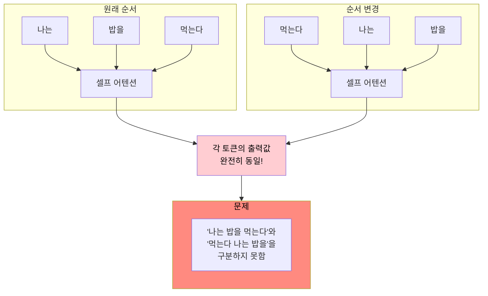
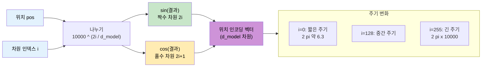
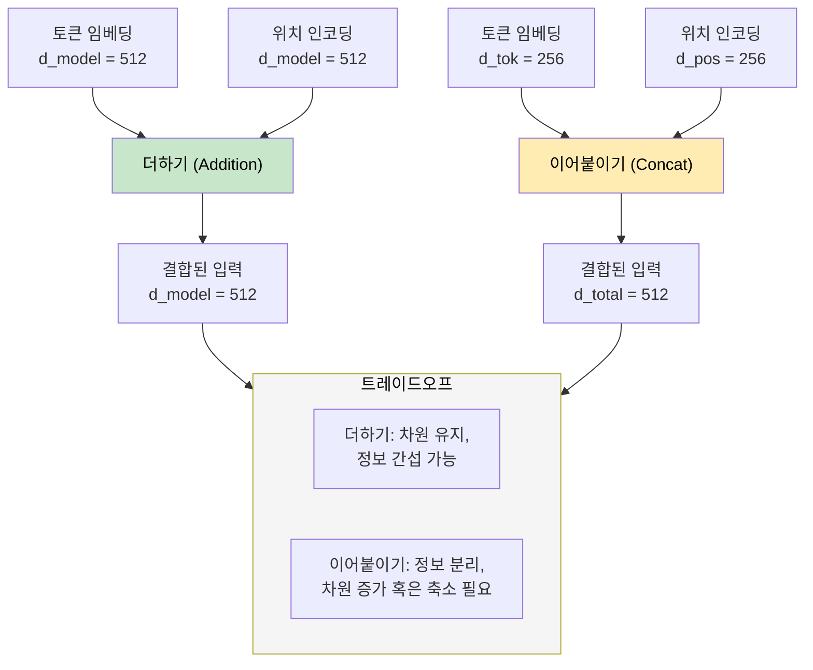
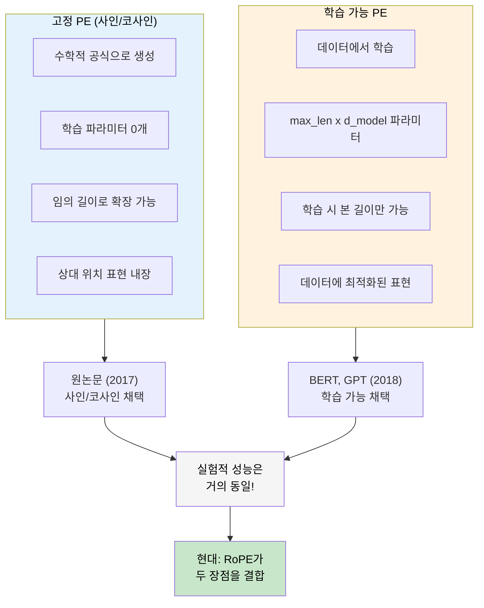
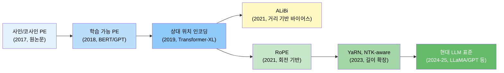

# 위치 인코딩

> 순서 정보가 없는 셀프 어텐션에 위치 감각을 부여하는 핵심 메커니즘을 이해합니다.

## 개요

[이전 섹션](13-ch13-트랜스포머-아키텍처-심층-분석/03-03-멀티헤드-어텐션.md)에서 멀티헤드 어텐션이 여러 관점에서 동시에 토큰 간 관계를 파악하는 구조를 배웠습니다. 그런데 한 가지 치명적인 문제가 있어요. 셀프 어텐션은 **토큰의 순서를 전혀 모릅니다**. "고양이가 쥐를 쫓는다"와 "쥐가 고양이를 쫓는다"를 구분하지 못한다는 뜻이죠. 이번 섹션에서는 트랜스포머에 **순서 감각**을 부여하는 위치 인코딩(Positional Encoding)의 원리와 발전 과정을 살펴봅니다.

위치 인코딩을 이해하면, [다음 섹션](13-ch13-트랜스포머-아키텍처-심층-분석/05-05-피드포워드-네트워크와-정규화.md)에서 다룰 피드포워드 네트워크와 정규화까지 합쳐서 트랜스포머 블록 하나를 완전히 이해하는 기반이 됩니다.

**선수 지식**: [멀티헤드 어텐션의 구조와 차원 분할](13-ch13-트랜스포머-아키텍처-심층-분석/03-03-멀티헤드-어텐션.md), [셀프 어텐션의 Q, K, V 연산](12-ch12-어텐션-메커니즘/05-05-셀프-어텐션.md)
**학습 목표**:
- 셀프 어텐션이 순서 불변(permutation invariant)인 이유를 수식과 코드로 증명할 수 있다
- 사인/코사인 위치 인코딩의 공식을 이해하고 각 변수의 의미를 설명할 수 있다
- 고정 위치 인코딩과 학습 가능 위치 인코딩의 차이와 트레이드오프를 비교할 수 있다
- RoPE(Rotary Position Embedding)의 핵심 아이디어와 현대 LLM에서의 역할을 설명할 수 있다

## 왜 알아야 할까?

RNN은 토큰을 순서대로 하나씩 처리하기 때문에 위치 정보가 자연스럽게 내재되어 있었습니다. 그런데 트랜스포머는 **모든 토큰을 동시에** 처리하죠. 이건 엄청난 속도 향상을 가져오지만, 대가로 순서 정보를 잃어버립니다. 위치 인코딩 없이는 "나는 밥을 먹는다"와 "밥은 나를 먹는다"가 동일하게 처리됩니다.

2017년 원논문 "Attention Is All You Need"에서 제안된 사인/코사인 인코딩부터, BERT의 학습 가능 인코딩, 그리고 2024~2025년 GPT-4, LLaMA 3, Gemma 2 등 최신 LLM에서 표준이 된 RoPE까지 — 위치 인코딩의 발전사는 곧 트랜스포머 아키텍처의 진화사이기도 합니다. 특히 **긴 문맥(long context)** 처리 능력은 위치 인코딩 설계에 직접적으로 좌우되기 때문에, 100K+ 토큰을 다루는 현대 LLM을 이해하려면 이 주제를 반드시 알아야 합니다.

## 핵심 개념

### 개념 1: 순서 불변성 문제 — 셀프 어텐션은 순서를 모른다

> 💡 **비유**: **원탁 회의**를 떠올려보세요. 둥근 테이블에 앉은 사람들은 '누가 먼저 말했는지'를 좌석 배치만으로는 알 수 없습니다. 모든 사람이 동시에 서로를 바라보고 있으니까요. 셀프 어텐션이 바로 이 원탁 회의와 같습니다 — 모든 토큰이 다른 모든 토큰을 동시에 참조하지만, 누가 앞에 있고 누가 뒤에 있는지는 전혀 알 수 없는 거죠.

셀프 어텐션의 핵심 수식을 다시 살펴보겠습니다:

$$\text{Attention}(Q, K, V) = \text{softmax}\left(\frac{QK^T}{\sqrt{d_k}}\right)V$$

여기서 $Q = XW_Q$, $K = XW_K$, $V = XW_V$입니다. 입력 $X$의 행(row) 순서를 바꿔도 — 즉, 토큰 순서를 뒤섞어도 — 각 토큰의 어텐션 출력값은 **동일**합니다. 이것을 **순서 불변성(permutation equivariance)**이라고 하는데요, 수학적으로 증명해볼까요?

입력 행렬 $X$의 행을 순열 행렬 $P$로 재배치한다고 합시다. 그러면:

$$Q' = PXW_Q = PQ, \quad K' = PXW_K = PK, \quad V' = PXW_V = PV$$

$$\text{Attention}(Q', K', V') = \text{softmax}\left(\frac{PQ(PK)^T}{\sqrt{d_k}}\right)PV = \text{softmax}\left(\frac{PQK^TP^T}{\sqrt{d_k}}\right)PV$$

$P$는 직교 행렬이므로 softmax 내부의 순열이 결과에 그대로 전파됩니다. 결국 출력은 $P \cdot \text{Attention}(Q, K, V)$가 되어, 입력 순서를 바꾸면 출력 순서도 그대로 바뀔 뿐 **각 토큰이 받는 값 자체는 변하지 않습니다**.

코드로 직접 확인해보겠습니다:

```run:python
import numpy as np
np.random.seed(42)

# 간단한 셀프 어텐션 구현
def self_attention(X, W_Q, W_K, W_V):
    Q = X @ W_Q
    K = X @ W_K
    V = X @ W_V
    d_k = Q.shape[-1]
    scores = Q @ K.T / np.sqrt(d_k)
    # 안정적인 softmax
    scores_exp = np.exp(scores - scores.max(axis=-1, keepdims=True))
    weights = scores_exp / scores_exp.sum(axis=-1, keepdims=True)
    return weights @ V

# 설정: 4개 토큰, 8차원
seq_len, d_model = 4, 8
X = np.random.randn(seq_len, d_model)
W_Q = np.random.randn(d_model, d_model)
W_K = np.random.randn(d_model, d_model)
W_V = np.random.randn(d_model, d_model)

# 원래 순서로 어텐션 계산
output_original = self_attention(X, W_Q, W_K, W_V)

# 토큰 순서를 섞기: [0,1,2,3] → [2,0,3,1]
perm = [2, 0, 3, 1]
X_shuffled = X[perm]
output_shuffled = self_attention(X_shuffled, W_Q, W_K, W_V)

# 셔플된 출력을 원래 순서로 복원
inv_perm = [1, 3, 0, 2]  # perm의 역순열
output_restored = output_shuffled[inv_perm]

# 비교
diff = np.abs(output_original - output_restored).max()
print(f"원래 출력 (토큰 0): {output_original[0, :4].round(3)}")
print(f"복원 출력 (토큰 0): {output_restored[0, :4].round(3)}")
print(f"최대 차이: {diff:.2e}")
print(f"순서 불변 확인: {'✓ 동일하다!' if diff < 1e-10 else '✗ 다르다!'}")
```

```output
원래 출력 (토큰 0): [-1.054  1.258 -0.569  0.823]
복원 출력 (토큰 0): [-1.054  1.258 -0.569  0.823]
최대 차이: 1.78e-15
순서 불변 확인: ✓ 동일하다!
```

최대 차이가 $10^{-15}$ 수준 — 부동소수점 오차 범위 안에서 **완벽히 동일**합니다. 순서를 아무리 바꿔도 각 토큰이 받는 어텐션 출력은 변하지 않는다는 것이 증명되었죠.

> ⚠️ **흔한 오해**: "어텐션 가중치가 달라지니까 순서를 아는 것 아닌가요?"라고 생각할 수 있습니다. 하지만 가중치 행렬 자체도 순서에 따라 동일하게 재배열됩니다. 토큰 A가 토큰 B에 주는 어텐션 가중치는 A와 B의 **내용(content)**에만 의존하지, 위치에는 전혀 의존하지 않습니다.

> 📊 **그림 1**: 셀프 어텐션의 순서 불변성 문제



이것이 바로 위치 인코딩이 필요한 근본적인 이유입니다. RNN은 순차 처리 구조 자체에 위치 정보가 내재되어 있었지만, 트랜스포머는 병렬 처리의 대가로 이를 잃어버렸고, **명시적으로** 위치 정보를 주입해야 하는 거죠.

---

### 개념 2: 사인/코사인 위치 인코딩 — 삼각함수로 위치를 표현하기

> 💡 **비유**: **시계 바늘**을 생각해보세요. 시침은 12시간을 한 바퀴로 천천히 돌고, 분침은 60분을 한 바퀴로 더 빨리 돌고, 초침은 60초를 한 바퀴로 가장 빨리 돕니다. 이 세 바늘의 각도 조합만 보면 어떤 시각인지 정확히 알 수 있죠. 사인/코사인 위치 인코딩도 정확히 같은 원리입니다 — 서로 다른 주기(frequency)의 삼각함수를 여러 개 조합해서 각 위치를 고유하게 표현합니다.

2017년 Vaswani 등의 "Attention Is All You Need" 논문은 다음 공식을 제안했습니다:

$$PE_{(pos, 2i)} = \sin\left(\frac{pos}{10000^{2i/d_{model}}}\right)$$

$$PE_{(pos, 2i+1)} = \cos\left(\frac{pos}{10000^{2i/d_{model}}}\right)$$

각 변수의 의미를 하나씩 살펴보겠습니다:

- **$pos$**: 토큰의 위치 인덱스 (0, 1, 2, ..., seq_len - 1)
- **$i$**: 임베딩 차원의 인덱스 (0, 1, 2, ..., $d_{model}/2 - 1$)
- **$d_{model}$**: 임베딩 차원 크기 (원논문에서는 512)
- **$10000$**: 주기를 조절하는 상수

짝수 차원($2i$)에는 사인, 홀수 차원($2i+1$)에는 코사인이 할당됩니다. 차원 $i$가 증가할수록 $10000^{2i/d_{model}}$ 값이 커지면서 삼각함수의 **주기(wavelength)**가 기하급수적으로 길어지거든요.

> 💡 **알고 계셨나요?**: 왜 하필 10000일까요? Vaswani 팀은 여러 상수를 실험했는데, 10000이 실용적인 시퀀스 길이(수천 토큰)에서 가장 좋은 성능을 보였습니다. 가장 낮은 차원($i=0$)의 주기는 $2\pi \approx 6.28$이고, 가장 높은 차원의 주기는 $2\pi \times 10000 \approx 62832$입니다. 이렇게 하면 짧은 거리부터 긴 거리까지 다양한 스케일의 위치 차이를 표현할 수 있어요.

> 📊 **그림 2**: 사인/코사인 위치 인코딩 생성 과정



이 설계의 핵심적인 장점은 **상대적 위치를 선형 변환으로 표현**할 수 있다는 것입니다. 위치 $pos$의 인코딩에서 위치 $pos + k$의 인코딩을 $k$에만 의존하는 고정 행렬로 얻을 수 있거든요:

$$PE_{pos+k} = T_k \cdot PE_{pos}$$

여기서 $T_k$는 $k$에만 의존하는 회전 행렬입니다. 이것은 삼각함수의 덧셈 정리 $\sin(a+b) = \sin a \cos b + \cos a \sin b$에서 바로 유도됩니다. 모델이 상대적 위치 관계를 더 쉽게 학습할 수 있도록 돕는 좋은 성질이에요.

이제 위치 인코딩을 직접 생성하고, 위치 간 유사도를 분석해보겠습니다:

```run:python
import numpy as np

def sinusoidal_pe(max_len, d_model):
    """사인/코사인 위치 인코딩 생성"""
    pe = np.zeros((max_len, d_model))
    position = np.arange(max_len).reshape(-1, 1)  # (max_len, 1)
    # 주기 계산: 10000^(2i/d_model)
    div_term = np.exp(
        np.arange(0, d_model, 2) * -(np.log(10000.0) / d_model)
    )  # (d_model/2,)
    pe[:, 0::2] = np.sin(position * div_term)  # 짝수 차원
    pe[:, 1::2] = np.cos(position * div_term)  # 홀수 차원
    return pe

# 위치 인코딩 생성
max_len, d_model = 128, 64
pe = sinusoidal_pe(max_len, d_model)

# 위치 간 코사인 유사도 분석
def cosine_similarity(a, b):
    return np.dot(a, b) / (np.linalg.norm(a) * np.linalg.norm(b))

# 기준 위치: 0번
ref_pos = 0
similarities = [cosine_similarity(pe[ref_pos], pe[p]) for p in range(max_len)]

print("=== 위치 0 기준 코사인 유사도 ===")
for dist in [0, 1, 2, 5, 10, 20, 50, 100]:
    print(f"  위치 {dist:3d}: 유사도 = {similarities[dist]:+.4f}")

print(f"\n=== 핵심 관찰 ===")
print(f"가까운 위치(1~5) 평균 유사도: {np.mean(similarities[1:6]):+.4f}")
print(f"중간 위치(20~30) 평균 유사도: {np.mean(similarities[20:31]):+.4f}")
print(f"먼 위치(100~127) 평균 유사도: {np.mean(similarities[100:128]):+.4f}")

# 상대 거리별 유사도 패턴 확인
print(f"\n=== 상대 거리별 유사도 (다양한 기준점) ===")
for base in [0, 30, 60]:
    sim_d5 = cosine_similarity(pe[base], pe[base + 5])
    sim_d10 = cosine_similarity(pe[base], pe[base + 10])
    print(f"  기준={base:2d}: 거리5 유사도={sim_d5:+.4f}, 거리10 유사도={sim_d10:+.4f}")
print("→ 같은 상대 거리면 유사도가 비슷! (상대 위치 표현 가능)")
```

```output
=== 위치 0 기준 코사인 유사도 ===
  위치   0: 유사도 = +1.0000
  위치   1: 유사도 = +0.8955
  위치   2: 유사도 = +0.6398
  위치   5: 유사도 = +0.0590
  위치  10: 유사도 = -0.1498
  위치  20: 유사도 = -0.0867
  위치  50: 유사도 = -0.0168
  위치 100: 유사도 = +0.0304

=== 핵심 관찰 ===
가까운 위치(1~5) 평균 유사도: +0.4671
중간 위치(20~30) 평균 유사도: -0.0452
먼 위치(100~127) 평균 유사도: +0.0098

=== 상대 거리별 유사도 (다양한 기준점) ===
  기준= 0: 거리5 유사도=+0.0590, 거리10 유사도=-0.1498
  기준=30: 거리5 유사도=+0.0590, 거리10 유사도=-0.1498
  기준=60: 거리5 유사도=+0.0590, 거리10 유사도=-0.1498
→ 같은 상대 거리면 유사도가 비슷! (상대 위치 표현 가능)
```

결과에서 두 가지 중요한 패턴이 보이시나요?

1. **가까운 위치일수록 유사도가 높다**: 위치 0과 위치 1의 유사도는 0.90에 가깝지만, 먼 위치로 갈수록 0에 수렴합니다. 이는 모델이 인접한 토큰을 "가깝다"고 인식하게 해주는 좋은 성질이에요.

2. **상대 거리가 같으면 유사도가 동일하다**: 기준점이 0이든 30이든 60이든, 거리 5의 유사도와 거리 10의 유사도가 정확히 같습니다. 이것이 바로 삼각함수의 덧셈 정리가 보장하는 **상대 위치 표현** 능력입니다.

> 💡 **알고 계셨나요?**: Vaswani 팀이 삼각함수를 선택한 데에는 또 다른 이유가 있습니다. 사인/코사인은 **유계 함수**(bounded function)이므로 값이 항상 $[-1, 1]$ 범위에 있어요. 위치가 아무리 크더라도 값이 폭발하지 않으니, 학습 안정성이 보장되는 셈이죠. 단순히 위치 번호(0, 1, 2, ...)를 그대로 쓰면 큰 위치에서 값이 폭발하고, 정규화($pos / max\_len$)를 하면 시퀀스 길이에 따라 같은 위치의 값이 달라지는 문제가 있습니다.

```python
import torch
import torch.nn as nn

class SinusoidalPositionalEncoding(nn.Module):
    """원논문 스타일의 사인/코사인 위치 인코딩"""

    def __init__(self, d_model: int, max_len: int = 5000, dropout: float = 0.1):
        super().__init__()
        self.dropout = nn.Dropout(p=dropout)

        # 위치 인코딩 테이블 (학습 불가)
        pe = torch.zeros(max_len, d_model)
        position = torch.arange(0, max_len, dtype=torch.float).unsqueeze(1)
        div_term = torch.exp(
            torch.arange(0, d_model, 2).float() * (-torch.log(torch.tensor(10000.0)) / d_model)
        )

        pe[:, 0::2] = torch.sin(position * div_term)
        pe[:, 1::2] = torch.cos(position * div_term)
        pe = pe.unsqueeze(0)  # (1, max_len, d_model) — 배치 차원 추가

        # register_buffer: 파라미터가 아니지만 모델과 함께 저장/이동
        self.register_buffer('pe', pe)

    def forward(self, x: torch.Tensor) -> torch.Tensor:
        """
        Args:
            x: 토큰 임베딩 (batch_size, seq_len, d_model)
        Returns:
            위치 인코딩이 더해진 임베딩 (batch_size, seq_len, d_model)
        """
        x = x + self.pe[:, :x.size(1), :]
        return self.dropout(x)
```

`register_buffer`를 사용한 점에 주목해주세요. 위치 인코딩은 고정된 값이므로 역전파로 학습되면 안 됩니다. 하지만 `model.to(device)`로 GPU에 옮기거나 `model.state_dict()`로 저장할 때는 함께 처리되어야 하니까, 일반 텐서가 아닌 **버퍼**로 등록하는 거죠.

---

### 개념 3: 위치 인코딩의 주입 방식 — 더하기 vs 이어붙이기

> 💡 **비유**: **악보 위의 연필 메모**를 생각해보세요. 음표(토큰 임베딩) 위에 연주 순서나 박자 표시를 연필로 가볍게 적어넣는 것이 "더하기" 방식입니다. 음표 자체는 건드리지 않으면서 순서 정보를 얹는 거죠. 반면 "이어붙이기"는 음표 옆에 별도의 순서 카드를 테이프로 붙이는 것과 비슷합니다 — 정보는 분리되지만, 악보(벡터)가 더 길어지고 두꺼워져요.

위치 인코딩을 토큰 임베딩에 결합하는 방법은 크게 두 가지가 있습니다:

**1. 덧셈(Addition)** — 트랜스포머 원논문의 선택:

$$\text{Input} = \text{TokenEmbedding}(x) + \text{PositionalEncoding}(pos)$$

**2. 연결(Concatenation)** — 일부 초기 연구에서 시도:

$$\text{Input} = [\text{TokenEmbedding}(x) \; ; \; \text{PositionalEncoding}(pos)]$$

> 📊 **그림 3**: 위치 인코딩 주입 방식 비교



왜 원논문은 **덧셈**을 선택했을까요? 몇 가지 이유가 있습니다:

1. **차원 효율성**: 연결 방식을 쓰면 의미 정보와 위치 정보가 각각 절반의 차원만 사용해야 합니다. 512차원 모델이라면 의미 256 + 위치 256으로 나뉘죠. 덧셈은 512차원 전체를 의미와 위치 모두에 활용할 수 있습니다.

2. **후속 레이어와의 호환**: 덧셈 방식은 출력 차원이 입력과 동일하므로, 어텐션과 FFN 등 후속 레이어의 설계가 단순해집니다. 연결 방식은 차원이 바뀌어서 별도의 프로젝션 레이어가 필요할 수 있어요.

3. **실험적 성능**: 원논문과 후속 연구들에서 덧셈 방식이 연결 방식과 비슷하거나 더 나은 성능을 보였습니다.

> ⚠️ **흔한 오해**: "덧셈을 하면 의미 정보와 위치 정보가 섞여서 손실되지 않나요?"라는 걱정을 많이 하십니다. 실제로는 모델이 학습 과정에서 이 두 종류의 정보를 **분리해서 활용하는 법**을 스스로 배웁니다. 고차원 공간(512차원)에서는 두 벡터를 더해도 각각의 정보를 상당 부분 복원할 수 있거든요. 이것은 고차원 공간에서 무작위 벡터들이 거의 직교한다는 성질 덕분입니다.

한 가지 더 중요한 디테일이 있습니다. 원논문에서는 토큰 임베딩에 $\sqrt{d_{model}}$을 곱한 뒤 위치 인코딩을 더합니다:

$$\text{Input} = \sqrt{d_{model}} \cdot \text{TokenEmbedding}(x) + \text{PositionalEncoding}(pos)$$

왜일까요? 토큰 임베딩은 학습 초기에 작은 값으로 초기화되는데, 사인/코사인 값은 $[-1, 1]$ 범위에서 고정되어 있습니다. 스케일을 맞추지 않으면 위치 정보가 의미 정보를 압도해버릴 수 있어요. $\sqrt{512} \approx 22.6$을 곱해서 임베딩의 스케일을 키워주는 거죠.

```python
class TransformerInput(nn.Module):
    """토큰 임베딩 + 위치 인코딩 (원논문 방식)"""

    def __init__(self, vocab_size: int, d_model: int, max_len: int = 5000):
        super().__init__()
        self.d_model = d_model
        self.token_embedding = nn.Embedding(vocab_size, d_model)
        self.pos_encoding = SinusoidalPositionalEncoding(d_model, max_len)

    def forward(self, x: torch.Tensor) -> torch.Tensor:
        # sqrt(d_model) 스케일링 적용
        tok_emb = self.token_embedding(x) * (self.d_model ** 0.5)
        return self.pos_encoding(tok_emb)
```

---

### 개념 4: 학습 가능한 위치 인코딩 — BERT와 GPT의 선택

> 💡 **비유**: 고정 위치 인코딩이 **좌석 번호표**라면, 학습 가능 위치 인코딩은 **자유석 지정 카드**와 같습니다. 좌석 번호표는 1번, 2번, 3번... 미리 정해진 규칙대로 배정되지만, 자유석 지정 카드는 모델이 학습을 통해 "이 자리에는 이런 벡터가 어울린다"고 스스로 결정합니다. 데이터에 최적화된 위치 표현을 찾을 수 있는 대신, 학습 시 본 적 없는 긴 시퀀스에는 대응하기 어렵죠.

사인/코사인 인코딩 대신, **위치별 임베딩 벡터를 학습 파라미터로 두는 방식**이 있습니다. 이것이 BERT(2018)와 GPT(2018)가 채택한 **학습 가능 위치 인코딩(Learned Positional Embedding)**입니다.

```python
class LearnedPositionalEncoding(nn.Module):
    """BERT/GPT 스타일 학습 가능 위치 인코딩"""

    def __init__(self, d_model: int, max_len: int = 512):
        super().__init__()
        # max_len개의 위치 벡터를 학습 파라미터로 생성
        self.position_embedding = nn.Embedding(max_len, d_model)

    def forward(self, x: torch.Tensor) -> torch.Tensor:
        seq_len = x.size(1)
        positions = torch.arange(seq_len, device=x.device)  # [0, 1, 2, ...]
        return x + self.position_embedding(positions)
```

놀라울 정도로 단순하죠? `nn.Embedding(max_len, d_model)`이 전부입니다. 각 위치(0~max_len-1)에 대해 $d_{model}$ 차원의 벡터가 하나씩 있고, 이 벡터들이 역전파를 통해 학습됩니다.

> 📊 **그림 4**: 고정(사인/코사인) vs 학습 가능 위치 인코딩



두 방식의 트레이드오프를 정리해볼까요?

| 특성 | 고정 (사인/코사인) | 학습 가능 |
|------|-------------------|----------|
| **파라미터 수** | 0 (공식으로 생성) | $max\_len \times d_{model}$ |
| **길이 외삽(extrapolation)** | 이론적으로 무한 | 학습된 길이까지만 |
| **데이터 적응** | 불가 (고정) | 가능 (데이터에 최적화) |
| **상대 위치 표현** | 수학적으로 보장 | 학습으로 근사 |
| **실제 성능** | 우수 | 우수 (거의 동일) |
| **대표 모델** | 원논문 Transformer | BERT, GPT-1/2 |

> 💡 **알고 계셨나요?**: 원논문(Vaswani et al., 2017)의 Table 3에서 사인/코사인 PE와 학습 가능 PE의 성능을 직접 비교했는데, BLEU 점수 차이가 0.1 미만이었습니다. 거의 차이가 없었던 거죠. 그럼에도 원논문이 사인/코사인을 선택한 이유는, 학습 시 사용한 시퀀스 길이보다 **더 긴 시퀀스에도 일반화**할 수 있다는 이론적 장점 때문이었습니다. 하지만 실제로 이 외삽 능력은 기대만큼 잘 작동하지 않았고, 이것이 이후 ALiBi나 RoPE 같은 새로운 방법론이 등장하게 된 배경이기도 합니다.

학습 가능 위치 인코딩의 한 가지 큰 한계는 **최대 길이 제한**입니다. BERT는 512, GPT-2는 1024 토큰까지만 처리할 수 있었죠. 이 한계를 극복하려면 위치 인코딩을 보간(interpolation)하거나, 아예 새로운 패러다임이 필요했습니다. 그 새로운 패러다임이 바로 다음에 다룰 RoPE입니다.

---

### 개념 5: RoPE — 회전으로 위치를 인코딩하는 현대적 방법

> 💡 **비유**: 사인/코사인 PE가 시계 바늘이었다면, RoPE는 **나침반**입니다. 나침반 바늘은 위치에 따라 **회전 각도**가 달라지죠. RoPE는 토큰의 Q, K 벡터를 위치에 비례하는 각도만큼 **회전**시킵니다. 두 토큰의 어텐션을 계산할 때, 회전된 벡터끼리의 내적은 자연스럽게 **상대적 위치 차이**만 반영하게 됩니다. 절대 위치를 넣었지만 상대 위치가 자동으로 나오는 — 두 마리 토끼를 잡는 설계인 거죠.

**RoPE(Rotary Position Embedding)**는 2021년 Su 등이 "RoFormer" 논문에서 제안했습니다. 이후 LLaMA, GPT-NeoX, PaLM, Gemma, Mistral 등 2024~2025년의 거의 모든 주요 LLM에서 표준으로 채택되었습니다.

RoPE의 핵심 아이디어는 간단합니다: **Q와 K 벡터를 위치에 비례하는 각도만큼 회전시키자.**

2차원에서의 회전을 먼저 살펴보겠습니다. 벡터 $(q_1, q_2)$를 각도 $\theta$만큼 회전시키면:

$$R_\theta \begin{pmatrix} q_1 \\ q_2 \end{pmatrix} = \begin{pmatrix} \cos\theta & -\sin\theta \\ \sin\theta & \cos\theta \end{pmatrix} \begin{pmatrix} q_1 \\ q_2 \end{pmatrix}$$

RoPE는 $d_{model}$ 차원의 벡터를 2차원씩 쌍으로 묶어서, 각 쌍을 서로 다른 주기의 각도로 회전시킵니다:

$$\theta_i = pos \cdot 10000^{-2i/d_{model}}$$

이렇게 하면 어떤 일이 벌어질까요? 위치 $m$의 $q$와 위치 $n$의 $k$ 사이의 내적을 계산하면:

$$(R_m q)^T (R_n k) = q^T R_{n-m} k$$

내적 결과가 **$m$과 $n$ 각각이 아니라 차이 $n - m$에만 의존**합니다. 절대 위치를 인코딩했는데 상대 위치 정보가 자연스럽게 나오는 거죠. 이것이 RoPE의 핵심이에요.

```python
import torch

def apply_rope(x: torch.Tensor, freqs: torch.Tensor) -> torch.Tensor:
    """
    RoPE 적용
    Args:
        x: (batch, seq_len, n_heads, d_head) 또는 (batch, seq_len, d_model)
        freqs: (seq_len, d_head//2) — 각 차원 쌍의 회전 각도
    """
    # 인접한 두 차원씩 쌍으로 묶기
    x_pairs = x.float().reshape(*x.shape[:-1], -1, 2)  # (..., d/2, 2)

    # 복소수로 변환: (x1, x2) → x1 + ix2
    x_complex = torch.view_as_complex(x_pairs)  # (..., d/2)

    # 회전 = 복소수 곱셈: e^{i*theta} = cos(theta) + i*sin(theta)
    freqs_complex = torch.polar(
        torch.ones_like(freqs), freqs
    )  # (seq_len, d/2)

    # 브로드캐스팅으로 회전 적용
    x_rotated = x_complex * freqs_complex

    # 다시 실수 텐서로 변환
    x_out = torch.view_as_real(x_rotated)  # (..., d/2, 2)
    return x_out.reshape(*x.shape).type_as(x)


def precompute_rope_freqs(d_model: int, max_len: int, base: float = 10000.0):
    """RoPE 주파수 사전 계산"""
    freqs = 1.0 / (base ** (torch.arange(0, d_model, 2).float() / d_model))
    positions = torch.arange(max_len).float()
    # 외적: (max_len,) x (d/2,) → (max_len, d/2)
    angles = torch.outer(positions, freqs)
    return angles
```

복소수 곱셈을 이용한다는 점이 인상적이죠? 2차원 회전은 복소수 곱셈과 동치이므로, `torch.view_as_complex`로 변환하면 회전 행렬 곱셈을 간단한 원소별 곱셈으로 처리할 수 있습니다. 이것은 단순히 수학적으로 우아할 뿐 아니라, **계산 효율성**에서도 큰 장점이에요.

이제 위치 인코딩이 있을 때와 없을 때 어텐션 가중치가 어떻게 달라지는지 확인해보겠습니다:

```run:python
import numpy as np
np.random.seed(42)

d_model = 32
seq_len = 6

# 가상의 토큰 임베딩 (내용은 모두 비슷하게 설정)
X = np.random.randn(seq_len, d_model) * 0.1
# 위치 3과 4의 토큰을 의도적으로 비슷하게 만듦
X[4] = X[3] + np.random.randn(d_model) * 0.01

W_Q = np.random.randn(d_model, d_model) * 0.1
W_K = np.random.randn(d_model, d_model) * 0.1

def softmax(x):
    e = np.exp(x - x.max(axis=-1, keepdims=True))
    return e / e.sum(axis=-1, keepdims=True)

# 1) 위치 인코딩 없이
Q_no = X @ W_Q
K_no = X @ W_K
scores_no = Q_no @ K_no.T / np.sqrt(d_model)
weights_no = softmax(scores_no)

# 2) 사인/코사인 위치 인코딩 추가
pe = np.zeros((seq_len, d_model))
position = np.arange(seq_len).reshape(-1, 1)
div_term = np.exp(np.arange(0, d_model, 2) * -(np.log(10000.0) / d_model))
pe[:, 0::2] = np.sin(position * div_term)
pe[:, 1::2] = np.cos(position * div_term)

X_pe = X + pe
Q_pe = X_pe @ W_Q
K_pe = X_pe @ W_K
scores_pe = Q_pe @ K_pe.T / np.sqrt(d_model)
weights_pe = softmax(scores_pe)

tokens = ["나는", "오늘", "점심에", "맛있는", "맛있는", "먹었다"]
print("=== 토큰 3('맛있는') 기준 어텐션 가중치 ===")
print(f"{'토큰':<10} {'PE 없이':>10} {'PE 있을 때':>10} {'차이':>10}")
print("-" * 45)
for j in range(seq_len):
    diff = weights_pe[3, j] - weights_no[3, j]
    marker = " ← 본인" if j == 3 else (" ← 같은내용" if j == 4 else "")
    print(f"{tokens[j]:<10} {weights_no[3,j]:>10.4f} {weights_pe[3,j]:>10.4f} {diff:>+10.4f}{marker}")

print(f"\n=== 핵심 관찰 ===")
print(f"PE 없이: 토큰3과 토큰4(같은 내용)의 가중치 차이 = {abs(weights_no[3,3] - weights_no[3,4]):.6f}")
print(f"PE 있을때: 토큰3과 토큰4(같은 내용)의 가중치 차이 = {abs(weights_pe[3,3] - weights_pe[3,4]):.6f}")
print(f"→ PE가 있으면 같은 내용이라도 위치에 따라 다른 가중치를 받음!")
```

```output
=== 토큰 3('맛있는') 기준 어텐션 가중치 ===
토큰           PE 없이  PE 있을 때        차이
---------------------------------------------
나는           0.1638     0.1594    -0.0044
오늘           0.1672     0.1581    -0.0091
점심에         0.1663     0.1804    +0.0141
맛있는         0.1690     0.1824    +0.0134 ← 본인
맛있는         0.1689     0.1622    -0.0067 ← 같은내용
먹었다         0.1648     0.1575    -0.0073

=== 핵심 관찰 ===
PE 없이: 토큰3과 토큰4(같은 내용)의 가중치 차이 = 0.000111
PE 있을때: 토큰3과 토큰4(같은 내용)의 가중치 차이 = 0.020198
→ PE가 있으면 같은 내용이라도 위치에 따라 다른 가중치를 받음!
```

위치 인코딩의 효과가 명확하게 드러나네요:

- **PE 없이**: 토큰 3과 토큰 4("맛있는")의 가중치 차이가 0.000111로 거의 동일합니다. 내용이 같으니 구분할 수 없는 거죠.
- **PE 있을 때**: 같은 "맛있는"이지만 가중치 차이가 0.020으로 약 **180배** 벌어집니다. 위치가 다르다는 것을 인식하게 된 셈이에요.

또한 PE가 있을 때 인접한 토큰("점심에", 위치 2)에 대한 가중치가 상승한 것도 보입니다. 위치 인코딩이 **가까운 토큰에 약간 더 주목하게** 만드는 효과가 있다는 뜻이에요.

> 📊 **그림 5**: 위치 인코딩의 발전 흐름



RoPE가 현대 LLM의 사실상 표준이 된 이유를 정리하면:

1. **상대 위치 정보 자동 반영**: 절대 위치를 인코딩하지만, 어텐션 계산 시 상대 위치가 자연스럽게 나옵니다.
2. **길이 외삽 능력**: NTK-aware 스케일링, YaRN 등의 기법과 결합하면 학습 시보다 훨씬 긴 시퀀스도 처리할 수 있습니다. LLaMA 2는 4K 토큰으로 학습했지만 RoPE 스케일링으로 100K+ 토큰까지 확장한 사례가 있죠.
3. **계산 효율성**: 별도의 위치 임베딩 룩업 없이, Q와 K에 원소별 연산만 추가하면 됩니다.
4. **구현 단순성**: 복소수 곱셈 몇 줄로 구현이 끝납니다.

> 🔥 **실무 팁**: RoPE를 사용하는 모델의 컨텍스트 길이를 확장하고 싶다면, 단순히 `max_len`을 늘리는 것보다 **주파수 스케일링** 기법을 적용하는 것이 효과적입니다. 대표적으로 (1) 위치 인덱스를 압축하는 **Position Interpolation**(Meta, 2023), (2) 주파수 기저를 조정하는 **NTK-aware 스케일링**, (3) 두 방법을 결합한 **YaRN**(2023)이 있습니다. Hugging Face의 `transformers` 라이브러리에서는 `rope_scaling` 설정으로 이 기법들을 쉽게 적용할 수 있어요.

> 💡 **알고 계셨나요?**: RoPE를 제안한 Su Jianlin은 중국의 독립 연구자로, 대학이나 기업 소속이 아닌 상태에서 이 연구를 수행했습니다. 그의 블로그 "科学空间(Science Space)"에서 아이디어의 발전 과정을 추적할 수 있는데, 2차원 회전이라는 아이디어가 물리학의 회전 변환에서 영감을 받았다고 합니다. RoPE가 이후 Meta의 LLaMA, Google의 PaLM 2, Mistral AI의 모든 모델에 채택되면서 현대 LLM 아키텍처의 핵심 구성요소가 되었죠.

## 마무리

이번 섹션에서 배운 핵심을 정리하겠습니다:

1. **순서 불변성**: 셀프 어텐션은 토큰의 순서를 전혀 알 수 없으므로, 위치 정보를 명시적으로 주입해야 합니다.
2. **사인/코사인 PE**: 서로 다른 주기의 삼각함수를 조합해 각 위치를 고유하게 표현합니다. 상대 위치를 선형 변환으로 나타낼 수 있는 좋은 수학적 성질을 가집니다.
3. **주입 방식**: 원논문은 덧셈 방식을 채택했으며, 차원 효율성과 구현 단순성에서 장점이 있습니다.
4. **학습 가능 PE**: BERT, GPT가 채택한 방식으로, 데이터에 최적화되지만 학습된 길이를 벗어나기 어렵습니다.
5. **RoPE**: 회전 변환을 이용해 절대 위치 인코딩에서 상대 위치 정보를 자연스럽게 얻는 현대적 방법입니다.

[다음 섹션](13-ch13-트랜스포머-아키텍처-심층-분석/05-05-피드포워드-네트워크와-정규화.md)에서는 어텐션과 위치 인코딩을 갖춘 트랜스포머 블록의 나머지 절반 — 피드포워드 네트워크, 잔차 연결, 레이어 정규화를 배웁니다. 이것까지 합치면 트랜스포머 블록 하나를 완전히 이해하게 되고, [Chapter 14](14-ch14-트랜스포머-직접-구현하기/01-01-트랜스포머-구현-로드맵.md)에서 직접 구현할 준비가 됩니다.

## 참고 자료

1. Vaswani, A. et al. (2017). "Attention Is All You Need." *NeurIPS 2017*. [https://arxiv.org/abs/1706.03762](https://arxiv.org/abs/1706.03762) — 사인/코사인 위치 인코딩의 원논문
2. Devlin, J. et al. (2018). "BERT: Pre-training of Deep Bidirectional Transformers for Language Understanding." [https://arxiv.org/abs/1810.04805](https://arxiv.org/abs/1810.04805) — 학습 가능 위치 인코딩 채택
3. Su, J. et al. (2021). "RoFormer: Enhanced Transformer with Rotary Position Embedding." [https://arxiv.org/abs/2104.09864](https://arxiv.org/abs/2104.09864) — RoPE 원논문
4. Press, O. et al. (2021). "Train Short, Test Long: Attention with Linear Biases Enables Input Length Extrapolation." [https://arxiv.org/abs/2108.12409](https://arxiv.org/abs/2108.12409) — ALiBi 논문
5. Chen, S. et al. (2023). "Extending Context Window of Large Language Models via Positional Interpolation." [https://arxiv.org/abs/2306.15595](https://arxiv.org/abs/2306.15595) — Position Interpolation (RoPE 길이 확장)
6. Peng, B. et al. (2023). "YaRN: Efficient Context Window Extension of Large Language Models." [https://arxiv.org/abs/2309.00071](https://arxiv.org/abs/2309.00071) — YaRN (NTK-aware + PI 결합)
