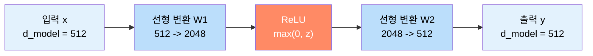
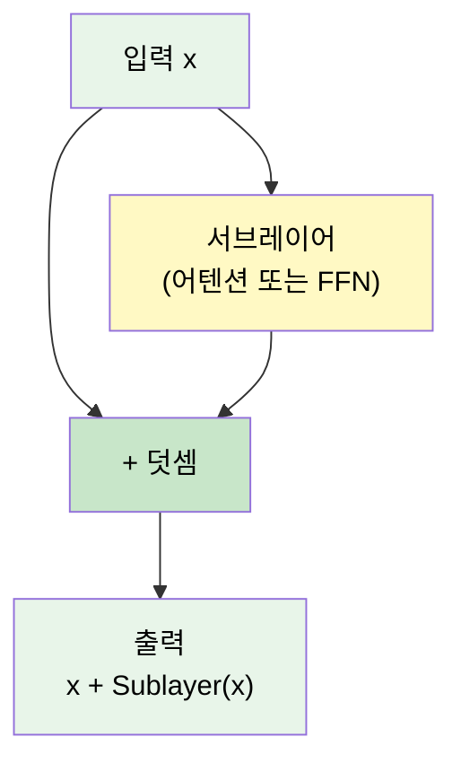
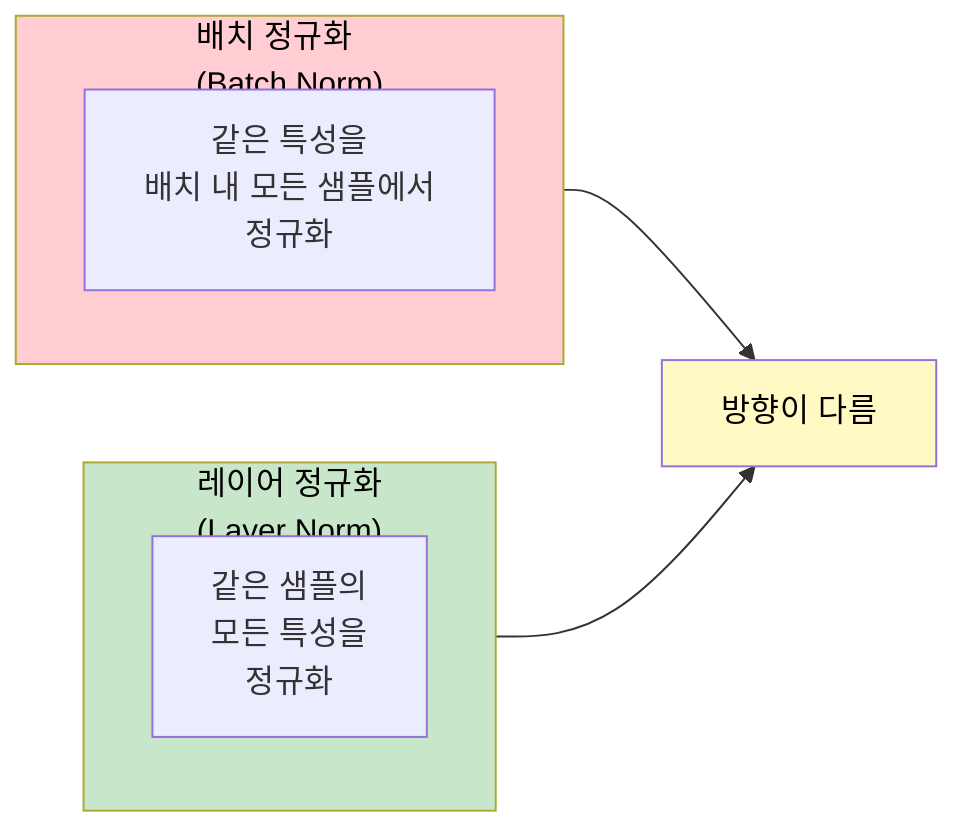
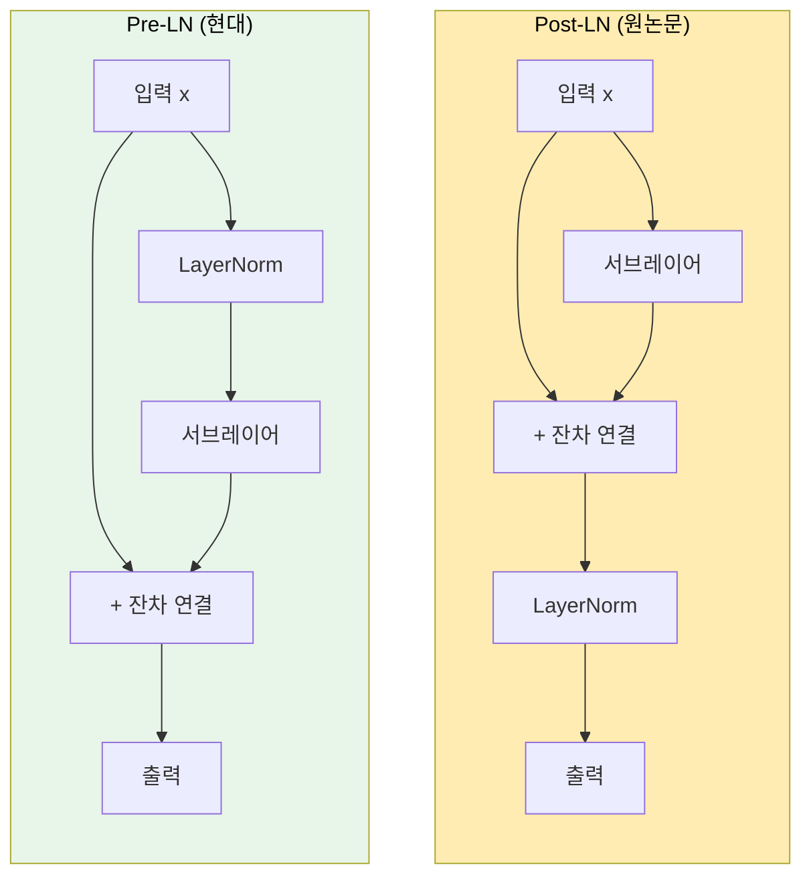
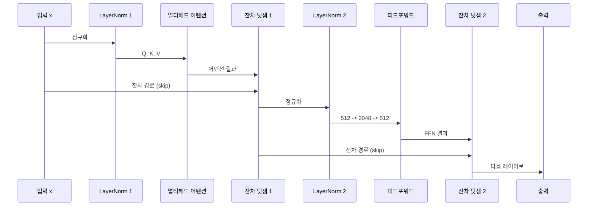

# 피드포워드 네트워크와 정규화

> 트랜스포머 서브레이어의 나머지 절반 — 포지션별 FFN, 잔차 연결, 레이어 정규화, 그리고 Pre-LN vs Post-LN 구조를 완전히 이해합니다.

## 개요

앞서 [멀티헤드 어텐션](13-트랜스포머-아키텍처-심층-분석/03-03-멀티헤드-어텐션.md)과 [위치 인코딩](13-트랜스포머-아키텍처-심층-분석/04-04-위치-인코딩.md)을 통해 트랜스포머가 "어떤 토큰에 주목할지"와 "순서 정보를 어떻게 주입하는지"를 배웠습니다. 하지만 어텐션만으로는 충분하지 않습니다. 각 위치에서 추출한 문맥 정보를 **비선형적으로 변환**하고, 깊은 레이어를 안정적으로 학습시키는 장치가 필요합니다. 이번 섹션에서는 바로 그 역할을 담당하는 피드포워드 네트워크(FFN), 잔차 연결, 레이어 정규화를 다룹니다.

**선수 지식**: 멀티헤드 어텐션 구조(13.3), 위치 인코딩(13.4), PyTorch `nn.Module` 기초(7.3)
**학습 목표**:
- 포지션별 피드포워드 네트워크(Position-wise FFN)의 구조와 역할을 설명할 수 있다
- 잔차 연결(Residual Connection)이 깊은 네트워크 학습에 필수적인 이유를 이해한다
- 레이어 정규화(Layer Normalization)의 수식과 구현을 작성할 수 있다
- Pre-LN과 Post-LN의 차이를 이해하고, 현대 LLM이 Pre-LN을 선호하는 이유를 설명할 수 있다

## 왜 알아야 할까?

트랜스포머를 처음 접하면 "Attention Is All You Need"라는 제목에 이끌려 어텐션에만 집중하기 쉽습니다. 하지만 실제로 트랜스포머 파라미터의 **약 2/3는 피드포워드 네트워크**에 있습니다. 원논문 기준으로 멀티헤드 어텐션은 $d_{model} \times d_{model} \times 4 = 512 \times 512 \times 4 \approx 1M$ 파라미터인 반면, FFN은 $512 \times 2048 \times 2 \approx 2M$ 파라미터를 차지하죠.

최근 연구(2025)에서는 FFN이 단순 변환을 넘어 **"지식 저장소"** 역할을 한다는 증거가 계속 발견되고 있습니다. GPT 계열 모델에서 특정 사실을 "기억하는" 뉴런이 FFN 레이어에 집중되어 있다는 거죠. 그리고 잔차 연결과 레이어 정규화 없이는 6개 레이어조차 학습이 불안정해집니다 — 현대 LLM의 96개 이상 레이어는 상상도 할 수 없겠죠.

이 세 가지 컴포넌트는 트랜스포머의 **안정적인 깊이 확장**을 가능하게 하는 핵심 인프라입니다.

## 핵심 개념

### 개념 1: 포지션별 피드포워드 네트워크(Position-wise FFN)

> 💡 **비유**: 멀티헤드 어텐션이 **회의실에서 여러 동료의 의견을 수집하는 과정**이라면, FFN은 **자기 책상으로 돌아와 그 정보를 정리하고 깊이 사고하는 과정**입니다. 회의에서 들은 이야기를 자신만의 관점으로 재해석하고 새로운 통찰을 도출하는 거죠. 중요한 점은 각 직원(토큰)이 **같은 사고 프레임워크(같은 가중치)**를 사용하되, **독립적으로** 사고한다는 것입니다.

"Attention Is All You Need" 논문의 Section 3.3에서 정의된 FFN은 놀라울 정도로 단순합니다:

$$\text{FFN}(x) = \max(0, \, xW_1 + b_1) \, W_2 + b_2$$

- $x$: 입력 벡터 ($d_{model} = 512$)
- $W_1 \in \mathbb{R}^{d_{model} \times d_{ff}}$: 확장 행렬 ($512 \times 2048$)
- $W_2 \in \mathbb{R}^{d_{ff} \times d_{model}}$: 축소 행렬 ($2048 \times 512$)
- $\max(0, \cdot)$: ReLU 활성화 함수
- $d_{ff} = 2048$: 내부 확장 차원 (보통 $4 \times d_{model}$)

"Position-wise"라는 이름은 이 FFN이 시퀀스의 **각 위치에 독립적으로, 동일한 가중치로** 적용된다는 뜻입니다. 위치 1의 토큰과 위치 100의 토큰이 같은 $W_1, W_2$를 공유하지만, 서로의 계산에 전혀 영향을 주지 않습니다.

> 📊 **그림 1**: 포지션별 FFN의 확장-축소 구조



왜 $d_{ff} = 4 \times d_{model}$로 확장할까요? 512차원에서 직접 비선형 변환을 하면 표현력이 부족합니다. 2048차원으로 **한번 넓혀서** 고차원 공간에서 비선형 변환을 수행한 후 다시 원래 차원으로 압축하면, 더 풍부한 특징을 포착할 수 있거든요. 이것은 오토인코더의 **병목(bottleneck) 구조의 반대** — **역병목(inverted bottleneck)** 패턴입니다.

```python
import torch
import torch.nn as nn

class PositionwiseFFN(nn.Module):
    """포지션별 피드포워드 네트워크 (원논문 구현)"""
    def __init__(self, d_model: int = 512, d_ff: int = 2048, dropout: float = 0.1):
        super().__init__()
        self.w1 = nn.Linear(d_model, d_ff)    # 확장: 512 → 2048
        self.w2 = nn.Linear(d_ff, d_model)    # 축소: 2048 → 512
        self.dropout = nn.Dropout(dropout)

    def forward(self, x: torch.Tensor) -> torch.Tensor:
        # x: (batch, seq_len, d_model)
        return self.w2(self.dropout(torch.relu(self.w1(x))))
```

> ⚠️ **흔한 오해**: "FFN은 각 토큰에 독립적으로 적용되니까 CNN의 1×1 컨볼루션과 같다"는 말을 들어보셨을 겁니다. 사실 이것은 **정확한 비유**입니다! 시퀀스 길이를 공간 차원, $d_{model}$을 채널로 보면, 포지션별 FFN은 커널 크기 1의 1D 컨볼루션 두 번과 수학적으로 동일합니다.

#### 현대적 FFN 변형: SwiGLU

원논문의 ReLU FFN은 단순하지만, 현대 LLM에서는 더 발전된 활성화 함수를 사용합니다. LLaMA, PaLM 등이 채택한 **SwiGLU**는 게이트 메커니즘을 도입합니다:

$$\text{SwiGLU}(x) = (\text{Swish}(xW_1) \odot xV) \, W_2$$

여기서 $\odot$는 원소별 곱셈이고, $V$는 추가 가중치 행렬입니다. SwiGLU는 가중치 행렬이 2개에서 3개로 늘어나지만, 같은 파라미터 수 대비 더 좋은 성능을 보여줍니다.

```python
class SwiGLU_FFN(nn.Module):
    """SwiGLU 활성화를 사용하는 현대적 FFN (LLaMA 스타일)"""
    def __init__(self, d_model: int = 512, d_ff: int = 2048, dropout: float = 0.1):
        super().__init__()
        self.w1 = nn.Linear(d_model, d_ff, bias=False)  # 게이트 경로
        self.v = nn.Linear(d_model, d_ff, bias=False)    # 값 경로
        self.w2 = nn.Linear(d_ff, d_model, bias=False)   # 축소
        self.dropout = nn.Dropout(dropout)

    def forward(self, x: torch.Tensor) -> torch.Tensor:
        # Swish(xW1) ⊙ xV → 게이트된 비선형 변환
        gate = torch.nn.functional.silu(self.w1(x))  # Swish = SiLU
        value = self.v(x)
        return self.w2(self.dropout(gate * value))
```

### 개념 2: 잔차 연결(Residual Connection)

> 💡 **비유**: 잔차 연결은 **고속도로의 바이패스 도로**와 같습니다. 도심(서브레이어)을 통과하는 길과 함께, 도심을 우회하는 **고속도로(skip connection)**가 병렬로 존재합니다. 만약 도심 경로가 공사 중(기울기 소실)이더라도 고속도로를 통해 정보가 직접 전달되죠. 최종 출력은 두 경로의 합산입니다.

> 📊 **그림 2**: 잔차 연결의 동작 원리



수식으로 표현하면 매우 간단합니다:

$$\text{output} = x + \text{Sublayer}(x)$$

2015년 He et al.의 ResNet 논문에서 영감을 받은 이 기법은 트랜스포머에서 **두 곳**에 적용됩니다:
1. **멀티헤드 어텐션 주변**: $x + \text{MultiHead}(x)$
2. **FFN 주변**: $x + \text{FFN}(x)$

잔차 연결이 핵심적인 이유는 **기울기 흐름** 때문입니다. 역전파 시 기울기는 덧셈 노드에서 **분기**되어, 서브레이어를 통과하는 경로와 항등(identity) 경로 두 갈래로 흐릅니다. 항등 경로의 기울기는 항상 1이므로, 아무리 깊은 레이어라도 기울기가 "고속도로"를 타고 안정적으로 전달됩니다.

$$\frac{\partial \mathcal{L}}{\partial x} = \frac{\partial \mathcal{L}}{\partial \text{output}} \cdot \left(1 + \frac{\partial \text{Sublayer}(x)}{\partial x}\right)$$

$\frac{\partial \text{Sublayer}(x)}{\partial x}$가 0에 가까워져도, 1이라는 항이 항상 남아있어 기울기가 소실되지 않습니다. 이것이 [BPTT와 기울기 문제](08-순환-신경망rnn-기초/03-03-bptt와-기울기-문제.md)에서 배운 RNN의 기울기 소실 문제가 트랜스포머에서는 발생하지 않는 핵심 이유입니다.

> 🔥 **실무 팁**: 잔차 연결이 동작하려면 **입력과 서브레이어 출력의 차원이 동일**해야 합니다. 이것이 트랜스포머 전체에서 $d_{model} = 512$를 일관되게 유지하는 이유입니다. 임베딩, 어텐션, FFN 출력 모두 같은 차원이어야 덧셈이 가능하거든요.

### 개념 3: 레이어 정규화(Layer Normalization)

> 💡 **비유**: 학교 시험을 생각해보세요. 각 과목(특성 차원)마다 평균과 표준편차가 다릅니다 — 수학은 평균 70점인데 영어는 평균 85점이죠. **레이어 정규화**는 각 학생(토큰)의 성적을 **자기 자신의 전 과목 평균과 분산으로 표준화**하는 것입니다. "이 학생이 자신의 평균 대비 어떤 과목을 잘하는가"를 드러내는 거죠. 배치 정규화(Batch Norm)가 "이 과목에서 전교생 기준 몇 등인가"를 보는 것과 대조적입니다.

> 📊 **그림 3**: 배치 정규화 vs 레이어 정규화 비교



레이어 정규화의 수식은 다음과 같습니다:

$$\text{LayerNorm}(x) = \gamma \odot \frac{x - \mu}{\sqrt{\sigma^2 + \epsilon}} + \beta$$

- $\mu = \frac{1}{d} \sum_{i=1}^{d} x_i$: 해당 토큰의 $d_{model}$개 특성에 대한 평균
- $\sigma^2 = \frac{1}{d} \sum_{i=1}^{d} (x_i - \mu)^2$: 분산
- $\gamma, \beta \in \mathbb{R}^{d}$: 학습 가능한 스케일/시프트 파라미터
- $\epsilon$: 수치 안정성을 위한 작은 값 (보통 $10^{-5}$)

왜 NLP에서 배치 정규화 대신 레이어 정규화를 쓸까요? 핵심 이유는 **가변 길이 시퀀스** 때문입니다. 배치 내에서 문장 길이가 다르면, 패딩된 위치까지 포함하여 통계를 계산하게 되어 정규화가 왜곡됩니다. 레이어 정규화는 각 토큰 벡터 **내부에서만** 통계를 계산하므로 시퀀스 길이에 독립적입니다.

```python
class LayerNorm(nn.Module):
    """레이어 정규화 직접 구현"""
    def __init__(self, d_model: int, eps: float = 1e-5):
        super().__init__()
        self.gamma = nn.Parameter(torch.ones(d_model))   # 스케일
        self.beta = nn.Parameter(torch.zeros(d_model))    # 시프트
        self.eps = eps

    def forward(self, x: torch.Tensor) -> torch.Tensor:
        # x: (batch, seq_len, d_model)
        mean = x.mean(dim=-1, keepdim=True)        # 마지막 차원(d_model)에 대한 평균
        var = x.var(dim=-1, keepdim=True, unbiased=False)  # 분산
        x_norm = (x - mean) / torch.sqrt(var + self.eps)   # 표준화
        return self.gamma * x_norm + self.beta              # 스케일 + 시프트
```

#### 현대적 변형: RMSNorm

LLaMA, Gemma 등 현대 LLM에서는 LayerNorm 대신 **RMSNorm**을 사용합니다. 평균을 빼는 연산을 생략하고 RMS(Root Mean Square)만으로 정규화합니다:

$$\text{RMSNorm}(x) = \gamma \odot \frac{x}{\sqrt{\frac{1}{d}\sum_{i=1}^{d}x_i^2 + \epsilon}}$$

RMSNorm은 LayerNorm 대비 7~64% 빠르면서도 동등한 성능을 보여줍니다. 평균 중심화(mean centering)가 성능에 큰 기여를 하지 않는다는 발견이 이 단순화를 가능하게 했죠.

### 개념 4: Post-LN vs Pre-LN — 정규화 위치의 중요성

> 💡 **비유**: 요리에 비유하면, **Post-LN**은 모든 재료를 섞은 **뒤에** 간을 보는 것이고, **Pre-LN**은 각 재료에 **미리** 간을 해서 넣는 것입니다. 재료가 2~3개(얕은 네트워크)면 둘 다 괜찮지만, 재료가 수십 개(깊은 네트워크)가 되면 미리 간을 맞추는 Pre-LN이 훨씬 안정적이에요.

> 📊 **그림 4**: Post-LN(원논문) vs Pre-LN(현대) 아키텍처 비교



**Post-LN** (원논문, Vaswani et al. 2017):
$$\text{output} = \text{LayerNorm}(x + \text{Sublayer}(x))$$

**Pre-LN** (현대 표준):
$$\text{output} = x + \text{Sublayer}(\text{LayerNorm}(x))$$

차이가 단순해 보이지만, 학습 안정성에 **결정적인** 영향을 미칩니다.

Xiong et al. (2020)의 논문 "On Layer Normalization in the Transformer Architecture"에서 이론적으로 증명한 핵심은 다음과 같습니다:

1. **Post-LN**: 출력층 근처 파라미터의 기울기가 매우 크기 때문에, **학습률 워밍업(warmup)**이 필수적입니다. 워밍업 없이 큰 학습률을 사용하면 학습이 발산합니다.
2. **Pre-LN**: 초기화 시점부터 기울기가 안정적이므로, **워밍업 없이도** 안정적 학습이 가능합니다. IWSLT14 De-En 태스크에서 Pre-LN의 9번째 체크포인트가 Post-LN의 15번째 체크포인트와 비슷한 성능을 달성했습니다.

```python
class PostLNEncoderLayer(nn.Module):
    """Post-LN: 원논문 스타일"""
    def __init__(self, d_model, d_ff, num_heads, dropout=0.1):
        super().__init__()
        self.self_attn = nn.MultiheadAttention(d_model, num_heads, dropout=dropout, batch_first=True)
        self.ffn = PositionwiseFFN(d_model, d_ff, dropout)
        self.norm1 = nn.LayerNorm(d_model)
        self.norm2 = nn.LayerNorm(d_model)
        self.dropout = nn.Dropout(dropout)

    def forward(self, x, mask=None):
        # 서브레이어 1: 셀프 어텐션 + Add & Norm
        attn_out, _ = self.self_attn(x, x, x, attn_mask=mask)
        x = self.norm1(x + self.dropout(attn_out))       # Norm AFTER add

        # 서브레이어 2: FFN + Add & Norm
        ffn_out = self.ffn(x)
        x = self.norm2(x + self.dropout(ffn_out))         # Norm AFTER add
        return x


class PreLNEncoderLayer(nn.Module):
    """Pre-LN: 현대 LLM 스타일"""
    def __init__(self, d_model, d_ff, num_heads, dropout=0.1):
        super().__init__()
        self.self_attn = nn.MultiheadAttention(d_model, num_heads, dropout=dropout, batch_first=True)
        self.ffn = PositionwiseFFN(d_model, d_ff, dropout)
        self.norm1 = nn.LayerNorm(d_model)
        self.norm2 = nn.LayerNorm(d_model)
        self.dropout = nn.Dropout(dropout)

    def forward(self, x, mask=None):
        # 서브레이어 1: Norm → 셀프 어텐션 → Add
        normed = self.norm1(x)                            # Norm BEFORE sublayer
        attn_out, _ = self.self_attn(normed, normed, normed, attn_mask=mask)
        x = x + self.dropout(attn_out)

        # 서브레이어 2: Norm → FFN → Add
        normed = self.norm2(x)                            # Norm BEFORE sublayer
        ffn_out = self.ffn(normed)
        x = x + self.dropout(ffn_out)
        return x
```

> 📊 **그림 5**: 트랜스포머 인코더 레이어 전체 데이터 흐름 (Pre-LN)



참고로 PyTorch의 `nn.TransformerEncoderLayer`도 `norm_first` 파라미터로 Pre-LN/Post-LN을 선택할 수 있습니다:

```python
# PyTorch 공식 API 활용
encoder_layer = nn.TransformerEncoderLayer(
    d_model=512,
    nhead=8,
    dim_feedforward=2048,
    dropout=0.1,
    norm_first=True,    # True: Pre-LN, False(기본): Post-LN
    batch_first=True,
)
```

## 실습: 직접 해보기

Pre-LN 인코더 레이어를 직접 구현하고, 각 컴포넌트의 출력 형상과 정규화 효과를 확인해봅시다.

```run:python
import torch
import torch.nn as nn
import math

# === 1. 컴포넌트별 구현 ===
class PositionwiseFFN(nn.Module):
    def __init__(self, d_model, d_ff, dropout=0.1):
        super().__init__()
        self.w1 = nn.Linear(d_model, d_ff)
        self.w2 = nn.Linear(d_ff, d_model)
        self.dropout = nn.Dropout(dropout)

    def forward(self, x):
        return self.w2(self.dropout(torch.relu(self.w1(x))))

class PreLNEncoderLayer(nn.Module):
    def __init__(self, d_model=512, d_ff=2048, num_heads=8, dropout=0.1):
        super().__init__()
        self.self_attn = nn.MultiheadAttention(
            d_model, num_heads, dropout=dropout, batch_first=True
        )
        self.ffn = PositionwiseFFN(d_model, d_ff, dropout)
        self.norm1 = nn.LayerNorm(d_model)
        self.norm2 = nn.LayerNorm(d_model)
        self.dropout = nn.Dropout(dropout)

    def forward(self, x):
        # Pre-LN: Norm → Attention → Add
        normed = self.norm1(x)
        attn_out, _ = self.self_attn(normed, normed, normed)
        x = x + self.dropout(attn_out)

        # Pre-LN: Norm → FFN → Add
        normed = self.norm2(x)
        ffn_out = self.ffn(normed)
        x = x + self.dropout(ffn_out)
        return x

# === 2. 동작 확인 ===
torch.manual_seed(42)
d_model, seq_len, batch = 512, 10, 2

layer = PreLNEncoderLayer(d_model=d_model, d_ff=2048, num_heads=8, dropout=0.0)
layer.eval()  # 드롭아웃 비활성화

x = torch.randn(batch, seq_len, d_model)
output = layer(x)

print(f"입력 형상:  {x.shape}")
print(f"출력 형상:  {output.shape}")
print(f"입력 평균:  {x.mean():.4f}, 표준편차: {x.std():.4f}")
print(f"출력 평균:  {output.mean():.4f}, 표준편차: {output.std():.4f}")

# LayerNorm 효과 확인
norm = nn.LayerNorm(d_model)
normed_x = norm(x)
print(f"\nLayerNorm 후 (토큰 0):")
print(f"  평균: {normed_x[0, 0].mean():.6f}")
print(f"  분산: {normed_x[0, 0].var():.6f}")

# 파라미터 수 비교
attn_params = sum(p.numel() for p in layer.self_attn.parameters())
ffn_params = sum(p.numel() for p in layer.ffn.parameters())
total = sum(p.numel() for p in layer.parameters())
print(f"\n파라미터 수:")
print(f"  어텐션:     {attn_params:,} ({attn_params/total*100:.1f}%)")
print(f"  FFN:        {ffn_params:,} ({ffn_params/total*100:.1f}%)")
print(f"  전체:       {total:,}")
```

```output
입력 형상:  torch.Size([2, 10, 512])
출력 형상:  torch.Size([2, 10, 512])
입력 평균:  0.0005, 표준편차: 1.0005
출력 평균:  -0.0015, 표준편차: 1.0565

LayerNorm 후 (토큰 0):
  평균: 0.000000
  분산: 1.001957

파라미터 수:
  어텐션:     1,050,624 (33.4%)
  FFN:        2,098,176 (66.6%)
  전체:       3,150,848
```

FFN이 전체 파라미터의 약 66.6%를 차지하는 것을 직접 확인할 수 있습니다! 그리고 LayerNorm 후에는 각 토큰 벡터의 평균이 거의 0, 분산이 거의 1로 정규화되는 것을 볼 수 있죠.

## 더 깊이 알아보기

### 잔차 연결의 탄생 — Kaiming He의 직관

잔차 연결은 2015년 Microsoft Research의 Kaiming He가 발표한 ResNet에서 시작되었습니다. 당시 딥러닝 커뮤니티는 "네트워크가 깊으면 깊을수록 좋다"는 믿음을 갖고 있었는데, 실제로 56층 네트워크가 20층보다 학습과 테스트 **모두에서** 성능이 떨어지는 현상이 발견되었습니다. 과적합이 아니라 **최적화 자체의 실패**였죠.

He의 핵심 통찰은 이랬습니다: "20층이면 충분한 문제에 56층을 쓴다면, 추가 36층은 **항등 함수(identity mapping)**를 학습하면 되잖아?" 하지만 일반적인 레이어가 항등 함수를 학습하는 것은 의외로 어렵습니다. 그래서 **기본값을 항등 함수로 만들고**, 레이어는 **잔차(변화량)**만 학습하도록 구조를 바꾼 것입니다. ResNet은 그해 ImageNet 경쟁에서 3.57% 에러율로 인간 수준을 뛰어넘었고, 이 아이디어는 트랜스포머를 포함한 거의 모든 딥러닝 아키텍처에 흡수되었습니다.

### LayerNorm의 탄생 — Ba, Kiros, Hinton (2016)

배치 정규화(Batch Normalization, 2015)는 학습을 극적으로 가속시켰지만, RNN 같은 시퀀스 모델에는 적용하기 어려웠습니다. 배치 내 시퀀스 길이가 다르고, 각 시간 스텝마다 다른 통계량을 유지해야 했거든요. Jimmy Ba, Jamie Kiros, Geoffrey Hinton은 2016년 논문에서 "배치 차원이 아닌 **특성 차원**에서 정규화하자"는 아이디어로 LayerNorm을 제안했습니다. 배치 크기에 독립적이고 시퀀스 모델에도 자연스럽게 적용할 수 있었죠. 이 논문은 처음에는 큰 주목을 받지 못했지만, 트랜스포머가 등장하면서 **핵심 컴포넌트**로 자리잡게 되었습니다.

### Pre-LN의 재발견

흥미롭게도, 원래 "Attention Is All You Need" 논문의 공식 구현 코드(`tensor2tensor`)는 실제로 **Pre-LN**을 사용했습니다. 논문의 수식은 Post-LN이었지만요! 이 불일치는 오랫동안 혼란을 일으켰고, 2020년 Xiong et al.이 "On Layer Normalization in the Transformer Architecture"에서 체계적으로 두 방식을 비교하여 Pre-LN의 이론적 우위를 증명했습니다. 현재 GPT, LLaMA 등 거의 모든 대형 모델은 Pre-LN(또는 그 변형)을 사용합니다.

## 흔한 오해와 팁

> ⚠️ **흔한 오해**: "FFN은 단순한 두 개의 선형 레이어니까 별로 중요하지 않다"고 생각하기 쉽습니다. 하지만 최근 연구에 따르면 FFN의 뉴런은 **키-값 메모리**처럼 동작합니다. $W_1$의 각 행이 특정 패턴(키)에 반응하고, $W_2$의 대응하는 열이 그 패턴에 대한 출력(값)을 생성합니다. FFN을 제거하면 사실 관련 지식이 급격히 손실됩니다.

> 💡 **알고 계셨나요?**: PyTorch의 `nn.TransformerEncoderLayer`의 기본 설정은 아직도 Post-LN (`norm_first=False`)입니다. 이는 원논문과의 호환성 때문인데, 실무에서는 대부분 `norm_first=True`로 변경하여 사용합니다. 또한 2025년의 `Peri-LN` 논문은 Pre-LN과 Post-LN의 장점을 결합한 새로운 방식을 제안하기도 했습니다.

> 🔥 **실무 팁**: Pre-LN 모델에서는 **마지막 레이어 뒤에 추가 LayerNorm**을 넣는 것이 일반적입니다. Pre-LN은 서브레이어 입력만 정규화하므로, 최종 출력은 정규화되지 않은 상태거든요. GPT-2, LLaMA 모두 모델 끝에 `final_layer_norm`을 두고 있습니다.

## 핵심 정리

| 개념 | 설명 |
|------|------|
| **포지션별 FFN** | 각 위치에 독립적으로 적용되는 2층 MLP. $d_{model} \rightarrow d_{ff} \rightarrow d_{model}$ 확장-축소 구조 |
| **$d_{ff}$** | FFN 내부 확장 차원. 원논문 $4 \times d_{model} = 2048$ |
| **SwiGLU** | LLaMA 등이 채택한 게이트 활성화. 가중치 3개, ReLU 대비 성능 향상 |
| **잔차 연결** | $x + \text{Sublayer}(x)$. 항등 경로로 기울기 소실 방지, 깊은 네트워크 학습 가능 |
| **레이어 정규화** | 각 토큰 벡터의 특성 차원에서 평균 0, 분산 1로 표준화. $\gamma, \beta$ 학습 |
| **RMSNorm** | 평균 중심화 생략, RMS만으로 정규화. LayerNorm 대비 7~64% 빠름 |
| **Post-LN** | $\text{LN}(x + \text{Sub}(x))$ — 원논문 방식. 깊은 모델에서 워밍업 필수 |
| **Pre-LN** | $x + \text{Sub}(\text{LN}(x))$ — 현대 표준. 안정적 학습, 워밍업 불필요 |

## 다음 섹션 미리보기

이번 섹션에서 인코더 레이어의 모든 구성 요소를 개별적으로 이해했습니다. 다음 섹션 [인코더와 디코더의 상호작용](13-트랜스포머-아키텍처-심층-분석/06-06-인코더와-디코더의-상호작용.md)에서는 이 컴포넌트들이 어떻게 조합되어 **인코더 스택과 디코더 스택**을 이루는지, 그리고 디코더의 **크로스 어텐션**이 인코더 출력을 어떻게 활용하는지를 살펴봅니다. 트랜스포머의 전체 그림이 완성되는 순간입니다.

## 참고 자료

- [Attention Is All You Need (Vaswani et al., 2017)](https://arxiv.org/abs/1706.03762) - Section 3.3의 Position-wise FFN 정의와 Section 5.4의 드롭아웃 적용 위치를 직접 확인할 수 있는 원논문
- [On Layer Normalization in the Transformer Architecture (Xiong et al., 2020)](https://arxiv.org/abs/2002.04745) - Pre-LN이 Post-LN보다 학습이 안정적인 이유를 이론적으로 증명한 ICML 2020 논문
- [The Annotated Transformer (Harvard NLP)](http://nlp.seas.harvard.edu/2018/04/01/attention.html) - 트랜스포머 원논문의 전체 구현을 코드와 함께 한 줄씩 설명하는 클래식 튜토리얼
- [PyTorch TransformerEncoderLayer 공식 문서](https://docs.pytorch.org/docs/stable/generated/torch.nn.TransformerEncoderLayer.html) - `norm_first` 파라미터와 Pre-LN/Post-LN 구현 레퍼런스
- [Normalization Techniques in Transformer-Based LLMs](https://sushant-kumar.com/blog/normalization-in-transformer-based-llms) - LayerNorm, RMSNorm 등 정규화 기법을 2025년 관점에서 종합 비교한 글

---
### 🔗 Related Sessions
- [scaled_dot_product_attention](13-트랜스포머-아키텍처-심층-분석/02-02-스케일드-닷-프로덕트-어텐션.md) (prerequisite)
- [multi_head_attention](13-트랜스포머-아키텍처-심층-분석/03-03-멀티헤드-어텐션.md) (prerequisite)
- [d_model](13-트랜스포머-아키텍처-심층-분석/01-01-트랜스포머-아키텍처-전체-조망.md) (prerequisite)
