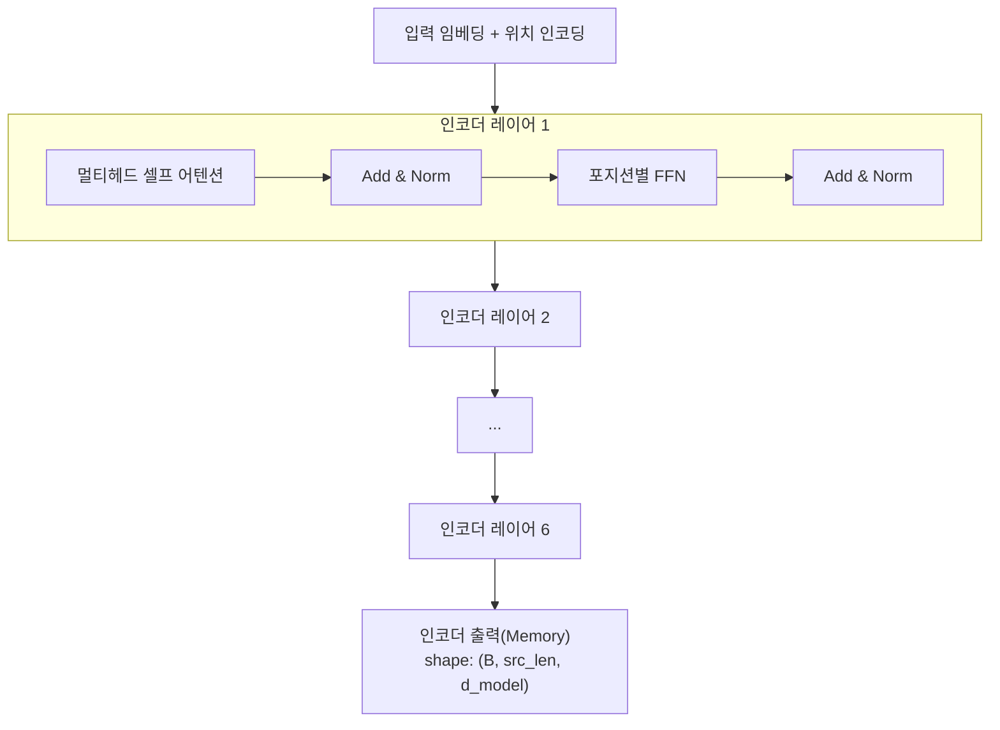
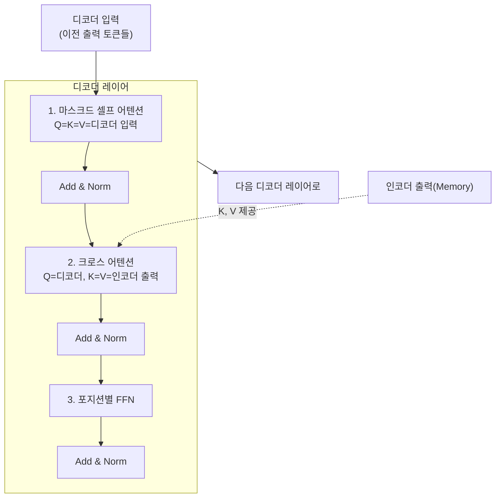
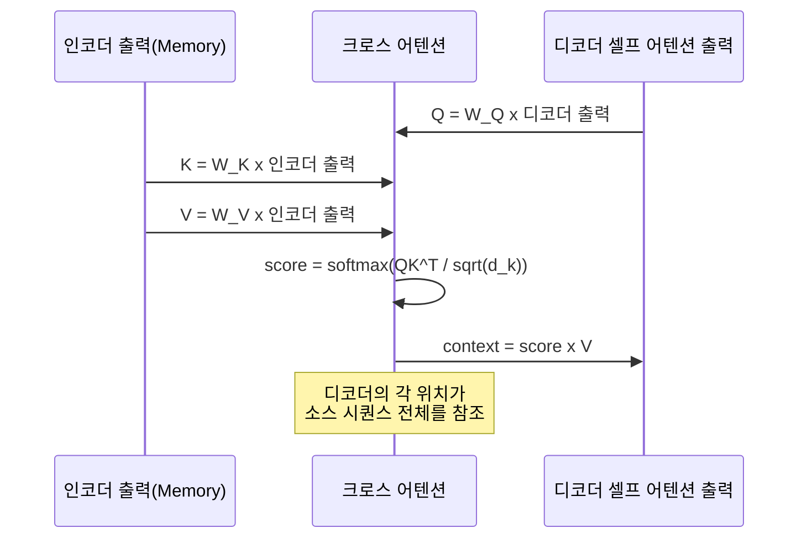
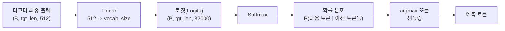
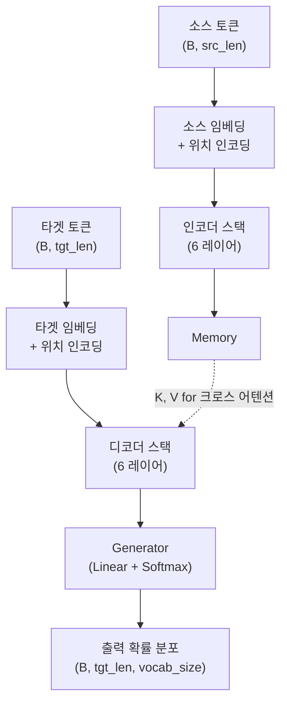

# 인코더와 디코더의 상호작용

> 트랜스포머의 인코더 스택, 디코더 스택, 크로스 어텐션, 그리고 최종 출력 레이어가 하나의 완전한 모델로 조립되는 과정을 파헤칩니다.

## 개요

이번 섹션에서는 지금까지 개별적으로 살펴본 트랜스포머의 모든 구성 요소를 하나로 조립합니다. 인코더 스택이 입력 시퀀스를 어떻게 압축하고, 디코더가 크로스 어텐션을 통해 그 정보를 활용하며, 최종 Linear + Softmax 레이어가 어떻게 단어를 예측하는지까지 — 트랜스포머의 전체 데이터 흐름을 처음부터 끝까지 추적합니다.

**선수 지식**: [멀티헤드 어텐션](13-트랜스포머-아키텍처-심층-분석/03-03-멀티헤드-어텐션.md)의 Q/K/V 투영, [위치 인코딩](13-트랜스포머-아키텍처-심층-분석/04-04-위치-인코딩.md), [피드포워드 네트워크와 정규화](13-트랜스포머-아키텍처-심층-분석/05-05-피드포워드-네트워크와-정규화.md)의 잔차 연결과 LayerNorm

**학습 목표**:
- 인코더 스택 6개 레이어의 누적 표현 학습 원리를 이해한다
- 디코더의 마스크드 셀프 어텐션 → 크로스 어텐션 → FFN 파이프라인을 구현한다
- 크로스 어텐션에서 Q는 디코더, K/V는 인코더 출력이 되는 이유를 설명한다
- 최종 Linear + Softmax 출력 레이어와 가중치 공유(weight tying) 기법을 구현한다
- 전체 트랜스포머 모델을 처음부터 끝까지 조립한다

## 왜 알아야 할까?

지금까지 Ch13에서 다룬 스케일드 닷-프로덕트 어텐션, 멀티헤드 어텐션, 위치 인코딩, FFN과 정규화는 모두 **부품**이었습니다. 자동차의 엔진, 변속기, 바퀴를 각각 이해했다고 해서 자동차가 달릴 수 있는 건 아니죠. 이 부품들이 어떻게 조립되고, 데이터가 어떤 경로로 흐르며, 최종적으로 "다음 단어"라는 예측이 만들어지는지 — 이 전체 그림을 이해해야 비로소 트랜스포머를 **진짜로** 이해했다고 할 수 있습니다.

특히 크로스 어텐션은 인코더와 디코더를 연결하는 **유일한 다리**입니다. BERT(인코더만), GPT(디코더만) 같은 변형 모델을 이해하려면, 먼저 원본 인코더-디코더 구조에서 각 부분이 어떤 역할을 하는지 명확히 알아야 합니다.

## 핵심 개념

### 개념 1: 인코더 스택 — 정보의 증류 탑

> 💡 **비유**: 인코더 스택을 **위스키 증류 공정**에 비유해볼까요? 원재료(입력 토큰)가 첫 번째 증류기를 거치면 거친 알코올이 추출됩니다. 이것이 두 번째 증류기를 거치면 더 정제되고, 세 번째를 거치면 더 순수해지죠. 6번의 증류(6개 레이어)를 거치면 원재료의 핵심 "에센스"만 남습니다. 각 증류 단계에서 셀프 어텐션은 어떤 성분이 중요한지 판단하고, FFN은 그 성분을 변환합니다.

트랜스포머 인코더는 동일한 구조의 레이어 N개(원논문 N=6)를 쌓아 올립니다. 각 레이어는 두 개의 서브레이어로 구성됩니다:

1. **멀티헤드 셀프 어텐션**: 입력 시퀀스 내 모든 위치 간의 관계를 포착
2. **포지션별 FFN**: 각 위치의 표현을 비선형 변환

두 서브레이어 모두 잔차 연결과 LayerNorm이 감싸고 있습니다.

> 📊 **그림 1**: 인코더 스택의 데이터 흐름



핵심은 **모든 레이어의 입출력 차원이 동일하다**(d_model=512)는 점입니다. 이 덕분에 레이어를 자유롭게 쌓을 수 있고, 잔차 연결도 차원 변환 없이 바로 더할 수 있죠.

```python
import torch
import torch.nn as nn

class EncoderLayer(nn.Module):
    """트랜스포머 인코더 레이어 하나"""
    def __init__(self, d_model, num_heads, d_ff, dropout=0.1):
        super().__init__()
        self.self_attn = nn.MultiheadAttention(d_model, num_heads, dropout=dropout, batch_first=True)
        self.ffn = nn.Sequential(
            nn.Linear(d_model, d_ff),    # d_model → d_ff (512 → 2048)
            nn.ReLU(),
            nn.Dropout(dropout),
            nn.Linear(d_ff, d_model),    # d_ff → d_model (2048 → 512)
            nn.Dropout(dropout),
        )
        self.norm1 = nn.LayerNorm(d_model)
        self.norm2 = nn.LayerNorm(d_model)
        self.dropout = nn.Dropout(dropout)

    def forward(self, src, src_mask=None, src_key_padding_mask=None):
        # 서브레이어 1: 멀티헤드 셀프 어텐션 + Add & Norm
        attn_out, _ = self.self_attn(src, src, src, 
                                      attn_mask=src_mask,
                                      key_padding_mask=src_key_padding_mask)
        src = self.norm1(src + self.dropout(attn_out))  # 잔차 연결

        # 서브레이어 2: FFN + Add & Norm
        ffn_out = self.ffn(src)
        src = self.norm2(src + ffn_out)  # 잔차 연결
        return src


class Encoder(nn.Module):
    """N개 인코더 레이어를 쌓은 인코더 스택"""
    def __init__(self, d_model, num_heads, d_ff, num_layers=6, dropout=0.1):
        super().__init__()
        self.layers = nn.ModuleList([
            EncoderLayer(d_model, num_heads, d_ff, dropout) 
            for _ in range(num_layers)
        ])
        self.norm = nn.LayerNorm(d_model)  # 최종 LayerNorm

    def forward(self, src, src_mask=None, src_key_padding_mask=None):
        for layer in self.layers:
            src = layer(src, src_mask, src_key_padding_mask)
        return self.norm(src)  # 최종 정규화 후 디코더로 전달
```

인코더의 최종 출력은 shape `(batch_size, src_len, d_model)`인 텐서로, 이것이 디코더의 모든 크로스 어텐션 레이어에 **동일하게** 전달됩니다. 원논문에서는 이를 "memory"라고 부릅니다.

### 개념 2: 디코더의 세 개 서브레이어

> 💡 **비유**: 디코더를 **동시통역사**에 비유해보겠습니다. 통역사는 세 단계로 일합니다: (1) 자기가 지금까지 번역한 내용을 되돌아보고(마스크드 셀프 어텐션), (2) 원래 발화자의 말을 다시 참고하며(크로스 어텐션), (3) 이 정보를 종합해서 다음 단어를 결정합니다(FFN). 이 세 단계가 디코더 레이어의 세 서브레이어입니다.

> 📊 **그림 2**: 디코더 레이어의 세 서브레이어 구조



각 서브레이어의 역할을 정리하면:

| 서브레이어 | Q 출처 | K, V 출처 | 마스크 | 역할 |
|-----------|--------|-----------|--------|------|
| 마스크드 셀프 어텐션 | 디코더 입력 | 디코더 입력 | 룩어헤드 마스크 | 생성된 토큰 간 관계 학습 |
| 크로스 어텐션 | 디코더 중간 출력 | 인코더 최종 출력 | 패딩 마스크만 | 소스 정보 참조 |
| FFN | — | — | — | 비선형 변환 |

**마스크드 셀프 어텐션**이 필요한 이유는 자기회귀(autoregressive) 생성 때문입니다. 위치 $i$의 토큰은 $i+1$ 이후의 토큰을 "미리 볼" 수 없어야 합니다. 이를 위해 [스케일드 닷-프로덕트 어텐션](13-트랜스포머-아키텍처-심층-분석/02-02-스케일드-닷-프로덕트-어텐션.md)에서 배운 룩어헤드 마스크를 적용합니다.

```python
class DecoderLayer(nn.Module):
    """트랜스포머 디코더 레이어 — 세 개의 서브레이어"""
    def __init__(self, d_model, num_heads, d_ff, dropout=0.1):
        super().__init__()
        # 서브레이어 1: 마스크드 셀프 어텐션
        self.self_attn = nn.MultiheadAttention(d_model, num_heads, dropout=dropout, batch_first=True)
        # 서브레이어 2: 크로스 어텐션 (인코더-디코더 어텐션)
        self.cross_attn = nn.MultiheadAttention(d_model, num_heads, dropout=dropout, batch_first=True)
        # 서브레이어 3: FFN
        self.ffn = nn.Sequential(
            nn.Linear(d_model, d_ff),
            nn.ReLU(),
            nn.Dropout(dropout),
            nn.Linear(d_ff, d_model),
            nn.Dropout(dropout),
        )
        self.norm1 = nn.LayerNorm(d_model)
        self.norm2 = nn.LayerNorm(d_model)
        self.norm3 = nn.LayerNorm(d_model)
        self.dropout = nn.Dropout(dropout)

    def forward(self, tgt, memory, tgt_mask=None, memory_mask=None,
                tgt_key_padding_mask=None, memory_key_padding_mask=None):
        # 1. 마스크드 셀프 어텐션: Q=K=V=tgt (디코더 입력)
        attn_out, _ = self.self_attn(tgt, tgt, tgt, attn_mask=tgt_mask,
                                      key_padding_mask=tgt_key_padding_mask)
        tgt = self.norm1(tgt + self.dropout(attn_out))

        # 2. 크로스 어텐션: Q=tgt(디코더), K=V=memory(인코더 출력)
        cross_out, cross_weights = self.cross_attn(
            tgt, memory, memory,  # Q=디코더, K=V=인코더
            attn_mask=memory_mask,
            key_padding_mask=memory_key_padding_mask
        )
        tgt = self.norm2(tgt + self.dropout(cross_out))

        # 3. FFN
        ffn_out = self.ffn(tgt)
        tgt = self.norm3(tgt + ffn_out)
        return tgt
```

### 개념 3: 크로스 어텐션 — 인코더와 디코더를 잇는 유일한 다리

> 💡 **비유**: 크로스 어텐션을 **오픈북 시험**에 비유해보죠. 학생(디코더)이 답안을 쓸 때, 자기가 이미 쓴 내용을 검토하는 것은 "셀프 어텐션"이고, 교과서(인코더 출력)를 참고하는 것이 "크로스 어텐션"입니다. 학생은 자기가 쓰고 있는 문장(Q)을 기준으로, 교과서의 어떤 부분(K)이 관련 있는지 찾아서, 그 내용(V)을 자기 답안에 반영합니다.

크로스 어텐션이 셀프 어텐션과 다른 단 하나의 차이:

$$\text{CrossAttn}(Q, K, V) = \text{softmax}\left(\frac{Q_{\text{dec}} \cdot K_{\text{enc}}^T}{\sqrt{d_k}}\right) V_{\text{enc}}$$

- **Q**: 디코더의 이전 서브레이어 출력에서 투영 → "내가 지금 알고 싶은 것"
- **K, V**: 인코더의 최종 출력에서 투영 → "소스 시퀀스가 제공하는 정보"

> 📊 **그림 3**: 크로스 어텐션의 Q/K/V 데이터 흐름



중요한 점은, 인코더 출력은 **디코더의 모든 6개 레이어**에 동일하게 전달된다는 것입니다. 각 디코더 레이어가 같은 "교과서"를 보지만, 서로 다른 관점(다른 가중치)으로 참조합니다.

왜 Q는 디코더에서, K/V는 인코더에서 올까요? Q는 **"무엇을 찾을지"**를 결정하는 쿼리입니다. 디코더가 "나는 지금 주어에 해당하는 소스 단어가 필요해"라고 질문하면, 인코더의 K가 각 소스 단어의 "매칭 키"를 제공하고, 가장 잘 매칭되는 위치의 V(실제 정보)가 반환됩니다.

### 개념 4: 최종 출력 레이어 — Linear + Softmax

> 💡 **비유**: 디코더 스택의 출력은 512차원의 추상적인 벡터입니다. 이걸 실제 단어로 바꾸려면 **사전(dictionary)에서 찾아보는** 과정이 필요합니다. Linear 레이어가 512차원 벡터를 어휘 크기(예: 32,000)차원으로 확장하고, Softmax가 "이 중에서 어떤 단어가 가장 적합한가?"를 확률로 변환합니다.

> 📊 **그림 4**: 디코더 출력에서 단어 예측까지



```python
class Generator(nn.Module):
    """디코더 출력을 어휘 확률 분포로 변환하는 최종 레이어"""
    def __init__(self, d_model, vocab_size):
        super().__init__()
        self.proj = nn.Linear(d_model, vocab_size)  # (512 → vocab_size)

    def forward(self, x):
        # log_softmax를 사용하면 NLLLoss와 결합 가능 (= CrossEntropyLoss)
        return torch.log_softmax(self.proj(x), dim=-1)
```

여기서 원논문의 중요한 트릭이 있습니다 — **가중치 공유(Weight Tying)**. 소스 임베딩, 타겟 임베딩, 그리고 이 최종 Linear 레이어의 가중치 행렬을 모두 공유합니다.

$$W_{\text{src\_embed}} = W_{\text{tgt\_embed}} = W_{\text{output\_proj}}^T$$

왜 이것이 가능할까요? 임베딩은 단어 → 벡터(lookup), 출력 투영은 벡터 → 단어(projection)입니다. 이 두 연산은 논리적으로 역연산이므로, 같은 가중치의 전치(transpose)로 표현할 수 있습니다. Press & Wolf(2017)의 연구에서 이 기법이 파라미터 수를 크게 줄이면서도 성능을 유지하거나 오히려 향상시킨다는 것을 보였습니다.

```python
# 가중치 공유 구현
# 임베딩 가중치에 sqrt(d_model) 스케일링 적용
class Embeddings(nn.Module):
    def __init__(self, d_model, vocab_size):
        super().__init__()
        self.embed = nn.Embedding(vocab_size, d_model)
        self.d_model = d_model

    def forward(self, x):
        return self.embed(x) * (self.d_model ** 0.5)  # 스케일링!

# 가중치 타이잉 적용
src_embed = Embeddings(512, vocab_size)
tgt_embed = Embeddings(512, vocab_size)
generator = Generator(512, vocab_size)

# 세 모듈의 가중치를 공유
tgt_embed.embed.weight = src_embed.embed.weight
generator.proj.weight = src_embed.embed.weight  # 전치는 Linear가 내부적으로 처리
```

> ⚠️ **흔한 오해**: "임베딩 가중치를 `√d_model`로 곱하는 건 왜?" — 임베딩 벡터의 L2 norm은 학습 초기에 매우 작습니다(초기화 특성상). 반면 위치 인코딩은 sin/cos로 -1~1 범위의 값을 가집니다. 스케일링 없이 더하면 위치 정보가 의미 정보를 압도하게 됩니다. `√512 ≈ 22.6`을 곱해 두 신호의 크기를 맞춰주는 것이죠.

### 개념 5: 전체 트랜스포머 조립

이제 모든 부품을 하나로 합칩니다.

> 📊 **그림 5**: 전체 트랜스포머 데이터 흐름



```python
class Transformer(nn.Module):
    """완전한 인코더-디코더 트랜스포머"""
    def __init__(self, src_vocab_size, tgt_vocab_size, d_model=512,
                 num_heads=8, d_ff=2048, num_layers=6, dropout=0.1, max_len=5000):
        super().__init__()
        # 임베딩 + 위치 인코딩
        self.src_embed = Embeddings(d_model, src_vocab_size)
        self.tgt_embed = Embeddings(d_model, tgt_vocab_size)
        self.pos_encoding = PositionalEncoding(d_model, max_len, dropout)

        # 인코더 스택
        self.encoder = Encoder(d_model, num_heads, d_ff, num_layers, dropout)

        # 디코더 스택
        self.decoder = Decoder(d_model, num_heads, d_ff, num_layers, dropout)

        # 최종 출력 레이어
        self.generator = Generator(d_model, tgt_vocab_size)

        # 가중치 공유 (원논문 Section 3.4)
        self.tgt_embed.embed.weight = self.src_embed.embed.weight
        self.generator.proj.weight = self.src_embed.embed.weight

        # 파라미터 초기화
        self._init_parameters()

    def _init_parameters(self):
        """Xavier 균일 초기화"""
        for p in self.parameters():
            if p.dim() > 1:
                nn.init.xavier_uniform_(p)

    def encode(self, src, src_mask=None, src_key_padding_mask=None):
        """인코더: 소스 시퀀스 → Memory"""
        src = self.pos_encoding(self.src_embed(src))
        return self.encoder(src, src_mask, src_key_padding_mask)

    def decode(self, tgt, memory, tgt_mask=None, memory_key_padding_mask=None):
        """디코더: 타겟 시퀀스 + Memory → 디코더 출력"""
        tgt = self.pos_encoding(self.tgt_embed(tgt))
        return self.decoder(tgt, memory, tgt_mask, memory_key_padding_mask)

    def forward(self, src, tgt, src_mask=None, tgt_mask=None,
                src_key_padding_mask=None, tgt_key_padding_mask=None):
        # 1. 인코더: 소스 → Memory
        memory = self.encode(src, src_mask, src_key_padding_mask)
        # 2. 디코더: 타겟 + Memory → 디코더 출력
        dec_out = self.decode(tgt, memory, tgt_mask, src_key_padding_mask)
        # 3. Generator: 디코더 출력 → 어휘 확률 분포
        return self.generator(dec_out)
```

## 실습: 직접 해보기

전체 트랜스포머를 조립하고, 간단한 순전파를 실행해봅시다. 이전 섹션에서 구현한 모든 컴포넌트를 포함한 완전한 코드입니다.

```run:python
import torch
import torch.nn as nn
import math

# === 컴포넌트 정의 ===

class PositionalEncoding(nn.Module):
    def __init__(self, d_model, max_len=5000, dropout=0.1):
        super().__init__()
        self.dropout = nn.Dropout(dropout)
        pe = torch.zeros(max_len, d_model)
        position = torch.arange(0, max_len, dtype=torch.float).unsqueeze(1)
        div_term = torch.exp(torch.arange(0, d_model, 2).float() * (-math.log(10000.0) / d_model))
        pe[:, 0::2] = torch.sin(position * div_term)
        pe[:, 1::2] = torch.cos(position * div_term)
        self.register_buffer('pe', pe.unsqueeze(0))  # (1, max_len, d_model)

    def forward(self, x):
        x = x + self.pe[:, :x.size(1)]
        return self.dropout(x)

class Embeddings(nn.Module):
    def __init__(self, d_model, vocab_size):
        super().__init__()
        self.embed = nn.Embedding(vocab_size, d_model)
        self.d_model = d_model

    def forward(self, x):
        return self.embed(x) * math.sqrt(self.d_model)

class EncoderLayer(nn.Module):
    def __init__(self, d_model, num_heads, d_ff, dropout=0.1):
        super().__init__()
        self.self_attn = nn.MultiheadAttention(d_model, num_heads, dropout=dropout, batch_first=True)
        self.ffn = nn.Sequential(nn.Linear(d_model, d_ff), nn.ReLU(), nn.Dropout(dropout), nn.Linear(d_ff, d_model), nn.Dropout(dropout))
        self.norm1 = nn.LayerNorm(d_model)
        self.norm2 = nn.LayerNorm(d_model)
        self.dropout = nn.Dropout(dropout)

    def forward(self, src, src_mask=None, src_key_padding_mask=None):
        attn_out, _ = self.self_attn(src, src, src, attn_mask=src_mask, key_padding_mask=src_key_padding_mask)
        src = self.norm1(src + self.dropout(attn_out))
        src = self.norm2(src + self.ffn(src))
        return src

class Encoder(nn.Module):
    def __init__(self, d_model, num_heads, d_ff, num_layers=6, dropout=0.1):
        super().__init__()
        self.layers = nn.ModuleList([EncoderLayer(d_model, num_heads, d_ff, dropout) for _ in range(num_layers)])
        self.norm = nn.LayerNorm(d_model)

    def forward(self, src, src_mask=None, src_key_padding_mask=None):
        for layer in self.layers:
            src = layer(src, src_mask, src_key_padding_mask)
        return self.norm(src)

class DecoderLayer(nn.Module):
    def __init__(self, d_model, num_heads, d_ff, dropout=0.1):
        super().__init__()
        self.self_attn = nn.MultiheadAttention(d_model, num_heads, dropout=dropout, batch_first=True)
        self.cross_attn = nn.MultiheadAttention(d_model, num_heads, dropout=dropout, batch_first=True)
        self.ffn = nn.Sequential(nn.Linear(d_model, d_ff), nn.ReLU(), nn.Dropout(dropout), nn.Linear(d_ff, d_model), nn.Dropout(dropout))
        self.norm1 = nn.LayerNorm(d_model)
        self.norm2 = nn.LayerNorm(d_model)
        self.norm3 = nn.LayerNorm(d_model)
        self.dropout = nn.Dropout(dropout)

    def forward(self, tgt, memory, tgt_mask=None, memory_key_padding_mask=None):
        # 1. 마스크드 셀프 어텐션
        attn_out, _ = self.self_attn(tgt, tgt, tgt, attn_mask=tgt_mask)
        tgt = self.norm1(tgt + self.dropout(attn_out))
        # 2. 크로스 어텐션 — Q=디코더, K=V=인코더 출력
        cross_out, _ = self.cross_attn(tgt, memory, memory, key_padding_mask=memory_key_padding_mask)
        tgt = self.norm2(tgt + self.dropout(cross_out))
        # 3. FFN
        tgt = self.norm3(tgt + self.ffn(tgt))
        return tgt

class Decoder(nn.Module):
    def __init__(self, d_model, num_heads, d_ff, num_layers=6, dropout=0.1):
        super().__init__()
        self.layers = nn.ModuleList([DecoderLayer(d_model, num_heads, d_ff, dropout) for _ in range(num_layers)])
        self.norm = nn.LayerNorm(d_model)

    def forward(self, tgt, memory, tgt_mask=None, memory_key_padding_mask=None):
        for layer in self.layers:
            tgt = layer(tgt, memory, tgt_mask, memory_key_padding_mask)
        return self.norm(tgt)

class Generator(nn.Module):
    def __init__(self, d_model, vocab_size):
        super().__init__()
        self.proj = nn.Linear(d_model, vocab_size)

    def forward(self, x):
        return torch.log_softmax(self.proj(x), dim=-1)

# === 전체 트랜스포머 ===

class Transformer(nn.Module):
    def __init__(self, vocab_size, d_model=512, num_heads=8, d_ff=2048, num_layers=6, dropout=0.1):
        super().__init__()
        self.src_embed = Embeddings(d_model, vocab_size)
        self.tgt_embed = Embeddings(d_model, vocab_size)
        self.pos_enc = PositionalEncoding(d_model, dropout=dropout)
        self.encoder = Encoder(d_model, num_heads, d_ff, num_layers, dropout)
        self.decoder = Decoder(d_model, num_heads, d_ff, num_layers, dropout)
        self.generator = Generator(d_model, vocab_size)
        # 가중치 공유
        self.tgt_embed.embed.weight = self.src_embed.embed.weight
        self.generator.proj.weight = self.src_embed.embed.weight

    def forward(self, src, tgt, tgt_mask=None, src_key_padding_mask=None):
        memory = self.encoder(self.pos_enc(self.src_embed(src)), src_key_padding_mask=src_key_padding_mask)
        dec_out = self.decoder(self.pos_enc(self.tgt_embed(tgt)), memory, tgt_mask, src_key_padding_mask)
        return self.generator(dec_out)

# === 실행 테스트 ===

torch.manual_seed(42)

vocab_size = 1000
d_model = 64       # 데모용 작은 모델
num_heads = 4
num_layers = 2
batch_size = 2
src_len = 5        # 소스 시퀀스 길이
tgt_len = 4        # 타겟 시퀀스 길이

model = Transformer(vocab_size, d_model=d_model, num_heads=num_heads,
                     d_ff=256, num_layers=num_layers)

# 더미 입력 생성
src = torch.randint(0, vocab_size, (batch_size, src_len))   # 소스 토큰
tgt = torch.randint(0, vocab_size, (batch_size, tgt_len))   # 타겟 토큰 (teacher forcing)

# 룩어헤드 마스크 생성 (디코더용)
tgt_mask = nn.Transformer.generate_square_subsequent_mask(tgt_len)

# 순전파
output = model(src, tgt, tgt_mask=tgt_mask)

print(f"소스 shape: {src.shape}")
print(f"타겟 shape: {tgt.shape}")
print(f"출력 shape: {output.shape}")
print(f"출력은 log-확률 분포: 합계={output[0, 0].exp().sum().item():.4f}")

# 파라미터 수 계산
total_params = sum(p.numel() for p in model.parameters())
unique_params = sum(p.numel() for p in dict(model.named_parameters()).values())
print(f"\n총 파라미터 수: {total_params:,}")
print(f"고유 파라미터 수 (가중치 공유 후): {unique_params:,}")
print(f"가중치 공유로 절약: {total_params - unique_params:,} 파라미터")
```

```output
소스 shape: torch.Size([2, 5])
타겟 shape: torch.Size([2, 4])
출력 shape: torch.Size([2, 4, 1000])
출력은 log-확률 분포: 합계=1.0000

총 파라미터 수: 757,512
고유 파라미터 수 (가중치 공유 후): 693,512
가중치 공유로 절약: 64,000 파라미터
```

출력 shape이 `(2, 4, 1000)` = `(batch, tgt_len, vocab_size)`인 것을 확인할 수 있습니다. 각 타겟 위치마다 1000개 어휘에 대한 log-확률이 계산되었고, `exp().sum()`이 1.0으로 유효한 확률 분포를 형성합니다.

자기회귀 추론(Greedy Decoding)도 구현해봅시다:

```run:python
import torch
import torch.nn as nn
import math

# (위의 모든 클래스 정의가 포함되어 있다고 가정)

def greedy_decode(model, src, max_len, start_token, end_token):
    """자기회귀 탐욕 디코딩"""
    model.eval()
    with torch.no_grad():
        # 1. 인코더는 한 번만 실행
        memory = model.encoder(model.pos_enc(model.src_embed(src)))

        # 2. <start> 토큰으로 시작
        ys = torch.full((src.size(0), 1), start_token, dtype=torch.long)

        for step in range(max_len):
            # 룩어헤드 마스크 생성
            tgt_mask = nn.Transformer.generate_square_subsequent_mask(ys.size(1))
            # 디코더 실행
            dec_out = model.decoder(
                model.pos_enc(model.tgt_embed(ys)), memory, tgt_mask
            )
            # 마지막 위치의 확률 분포에서 argmax
            logits = model.generator(dec_out[:, -1:, :])  # (B, 1, vocab)
            next_token = logits.argmax(dim=-1)             # (B, 1)

            # 생성된 토큰을 추가
            ys = torch.cat([ys, next_token], dim=1)

            # 모든 배치에서 <end> 토큰이 나오면 중단
            if (next_token == end_token).all():
                break

    return ys

# 데모
print("=== 자기회귀 디코딩 시뮬레이션 ===")
print("인코더: 소스 시퀀스를 한 번만 인코딩 (Memory 생성)")
print("디코더: 매 스텝마다 Memory를 참조하며 토큰 하나씩 생성")
print()
print("Step 0: [<start>]")
print("Step 1: [<start>, tok_42]     ← Memory 참조하여 첫 단어 생성")
print("Step 2: [<start>, tok_42, tok_7]  ← 이전 출력 + Memory 참조")
print("Step 3: [<start>, tok_42, tok_7, tok_15]")
print("  ...")
print("Step N: [<start>, ..., <end>] ← 종료 토큰 생성 시 중단")
print()
print("핵심: 인코더는 O(1), 디코더는 O(T) 호출")
print("→ 이것이 인코더-디코더 분리의 효율성!")
```

```output
=== 자기회귀 디코딩 시뮬레이션 ===
인코더: 소스 시퀀스를 한 번만 인코딩 (Memory 생성)
디코더: 매 스텝마다 Memory를 참조하며 토큰 하나씩 생성

Step 0: [<start>]
Step 1: [<start>, tok_42]     ← Memory 참조하여 첫 단어 생성
Step 2: [<start>, tok_42, tok_7]  ← 이전 출력 + Memory 참조
Step 3: [<start>, tok_42, tok_7, tok_15]
  ...
Step N: [<start>, ..., <end>] ← 종료 토큰 생성 시 중단

핵심: 인코더는 O(1), 디코더는 O(T) 호출
→ 이것이 인코더-디코더 분리의 효율성!
```

## 더 깊이 알아보기

### "Attention Is All You Need" — 8명의 혁명가

2017년 논문 "Attention Is All You Need"는 Google의 8명의 연구원이 공동으로 작성했습니다. 흥미로운 점은, 이 논문의 초기 아이디어가 **기계 번역** 한 가지 태스크를 위한 것이었다는 겁니다. Ashish Vaswani는 당시 Google Brain에서 RNN 기반 번역 모델의 속도 한계에 좌절하고 있었습니다. "RNN의 순차 처리를 완전히 없앨 수 없을까?"라는 질문이 트랜스포머의 출발점이었죠.

논문 제목 자체도 의미심장합니다. 당시 어텐션은 RNN의 **보조 메커니즘**이었는데, "어텐션이 전부"라니 — 상당히 도발적인 주장이었습니다. 실제로 리뷰어들 사이에서도 "RNN 없이 정말 되겠냐"는 의문이 있었다고 합니다.

이 논문의 인코더-디코더 구조는 사실 Sutskever et al.(2014)의 seq2seq 아이디어를 계승한 것입니다. 하지만 RNN을 어텐션으로 완전히 대체하면서, 인코더와 디코더 사이의 정보 흐름을 **크로스 어텐션**이라는 우아한 메커니즘으로 재정의했죠. 이 구조가 이후 BERT(인코더만), GPT(디코더만), T5(인코더-디코더)로 분화되는 기반이 됩니다.

### 가중치 공유의 기원

임베딩과 출력 투영 사이의 가중치 공유는 Vaswani et al.의 독창적 아이디어가 아닙니다. Press & Wolf(2017, "Using the Output Embedding to Improve Language Models")가 먼저 제안했고, Inan et al.(2017, "Tying Word Vectors and Word Classifiers")도 독립적으로 같은 아이디어를 발표했습니다. 트랜스포머 논문은 이 기법을 차용하면서 **소스 임베딩, 타겟 임베딩, 출력 투영**을 세 개 모두 공유하는 더 공격적인 전략을 택했습니다.

## 흔한 오해와 팁

> ⚠️ **흔한 오해**: "디코더의 크로스 어텐션은 마지막 인코더 레이어의 출력만 사용한다" — 맞습니다. 하지만 흔히 혼동되는 것은 "각 디코더 레이어가 대응하는 인코더 레이어의 출력을 받는다"는 오해입니다. 실제로 인코더의 **최종 출력(6번째 레이어)** 하나만이 디코더의 모든 6개 레이어에 동일하게 전달됩니다.

> 💡 **알고 계셨나요?**: 원논문의 base 모델은 약 **65M(6,500만) 파라미터**입니다. 그런데 가중치 공유(임베딩 × 2 + 출력 투영)를 하지 않으면 약 30% 더 많은 파라미터가 필요합니다. 어휘 크기 37,000 × d_model 512 = 약 19M 파라미터가 세 번 중복되는 셈이니까요. 가중치 공유가 "그냥 트릭"이 아니라 실질적인 효율화인 이유입니다.

> 🔥 **실무 팁**: 학습 시에는 **Teacher Forcing** — 디코더에 정답 시퀀스를 입력으로 넣어 병렬 학습이 가능합니다. 하지만 추론 시에는 자기회귀적으로 한 토큰씩 생성해야 하므로 병렬화가 불가능합니다. 이 "학습-추론 불일치"를 완화하기 위해 Scheduled Sampling이나 최근의 Non-Autoregressive 모델들이 연구되고 있습니다.

## 핵심 정리

| 개념 | 설명 |
|------|------|
| 인코더 스택 | 셀프 어텐션 + FFN의 N개 레이어. 입력 시퀀스의 문맥적 표현(Memory) 생성 |
| 디코더 3-서브레이어 | 마스크드 셀프 어텐션 → 크로스 어텐션 → FFN 순서로 구성 |
| 크로스 어텐션 | Q=디코더, K=V=인코더 출력. 인코더-디코더를 잇는 유일한 연결 |
| 인코더 출력 공유 | 동일한 Memory가 디코더의 모든 레이어에 전달됨 |
| Generator | Linear(d_model→vocab) + Softmax로 토큰 확률 분포 생성 |
| 가중치 공유 | src_embed = tgt_embed = output_proj 가중치 타이잉 (파라미터 절약) |
| 임베딩 스케일링 | √d_model 곱셈으로 위치 인코딩과 크기 균형 맞춤 |
| 자기회귀 추론 | 인코더 1회 + 디코더 T회 호출. KV 캐시로 최적화 가능 |

## 다음 섹션 미리보기

Ch13에서 트랜스포머의 이론적 구조를 완전히 분해했습니다. 다음 [Ch14. 트랜스포머 구현 실습](14-트랜스포머-구현-실습/01-01-셀프-어텐션-직접-구현.md)에서는 `nn.MultiheadAttention` 같은 PyTorch 내장 모듈에 의존하지 않고, 셀프 어텐션부터 전체 모델까지 **밑바닥부터 한 줄 한 줄** 직접 구현합니다. 이론과 실전의 간극을 메우는 시간이 될 것입니다.

## 참고 자료

- [Attention Is All You Need (Vaswani et al., 2017)](https://arxiv.org/abs/1706.03762) - 원논문. Section 3.2.3의 인코더-디코더 어텐션과 Section 3.4의 임베딩/가중치 공유 설명
- [The Annotated Transformer (Harvard NLP)](http://nlp.seas.harvard.edu/2018/04/03/attention.html) - PyTorch로 트랜스포머를 한 줄씩 구현한 클래식 튜토리얼. Generator, weight tying 구현 참조
- [The Illustrated Transformer (Jay Alammar)](https://jalammar.github.io/illustrated-transformer/) - 인코더-디코더 상호작용을 시각적으로 설명한 블로그. 크로스 어텐션의 직관적 이해에 최적
- [PyTorch nn.Transformer 공식 문서](https://docs.pytorch.org/docs/stable/generated/torch.nn.Transformer.html) - PyTorch 내장 트랜스포머의 API 레퍼런스
- [Using the Output Embedding to Improve Language Models (Press & Wolf, 2017)](https://arxiv.org/abs/1608.05859) - 가중치 공유(weight tying) 기법의 원논문

---
### 🔗 Related Sessions
- [scaled_dot_product_attention](13-트랜스포머-아키텍처-심층-분석/02-02-스케일드-닷-프로덕트-어텐션.md) (prerequisite)
- [multi_head_attention](13-트랜스포머-아키텍처-심층-분석/03-03-멀티헤드-어텐션.md) (prerequisite)
- [sinusoidal_positional_encoding](13-트랜스포머-아키텍처-심층-분석/04-04-위치-인코딩.md) (prerequisite)
- [position_wise_ffn](13-트랜스포머-아키텍처-심층-분석/05-05-피드포워드-네트워크와-정규화.md) (prerequisite)
- [layer_normalization](13-트랜스포머-아키텍처-심층-분석/05-05-피드포워드-네트워크와-정규화.md) (prerequisite)
- [룩어헤드_마스크](13-트랜스포머-아키텍처-심층-분석/02-02-스케일드-닷-프로덕트-어텐션.md) (prerequisite)
- [패딩_마스크](13-트랜스포머-아키텍처-심층-분석/02-02-스케일드-닷-프로덕트-어텐션.md) (prerequisite)
