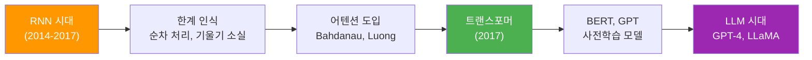
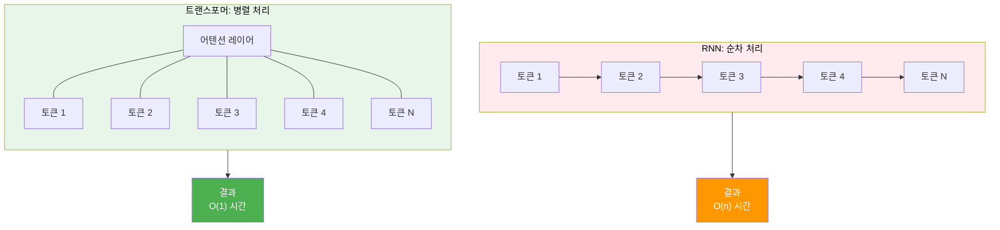
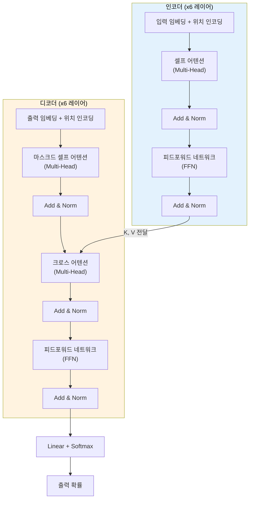
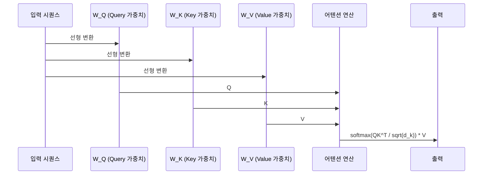
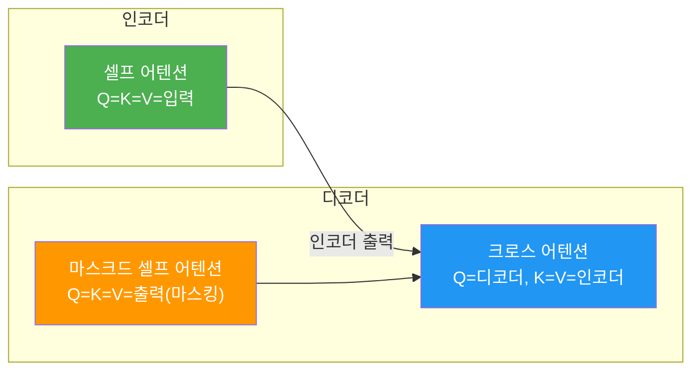

# 트랜스포머 아키텍처 전체 조망

> 2017년 등장해 AI의 판도를 바꾼 트랜스포머 — 그 전체 구조를 한눈에 파악합니다

## 개요

이 섹션에서는 "Attention Is All You Need" 논문이 제시한 트랜스포머(Transformer) 아키텍처의 전체 그림을 조망합니다. RNN 기반 시퀀스 모델의 한계를 이해하고, 트랜스포머가 어떤 구조로 이를 극복했는지 큰 틀에서 살펴보겠습니다.

**선수 지식**: [셀프 어텐션으로의 확장](12-어텐션-메커니즘/05-05-셀프-어텐션으로의-확장.md)에서 배운 셀프 어텐션의 기본 개념, [인코더-디코더 아키텍처](11-시퀀스-투-시퀀스와-기계-번역/01-01-인코더-디코더-아키텍처.md)의 전반적 이해

**학습 목표**:
- 트랜스포머 아키텍처의 전체 구조(인코더-디코더)를 설명할 수 있다
- RNN 대비 트랜스포머의 핵심 장점(병렬 처리, 장거리 의존성)을 이해한다
- 인코더와 디코더를 구성하는 서브 레이어들의 역할을 구분할 수 있다

## 왜 알아야 할까?

2017년 이후 NLP에서 일어난 거의 모든 혁신 — BERT, GPT, T5, LLaMA — 은 트랜스포머 아키텍처 위에 세워졌습니다. 이 구조를 이해하지 못하면 현대 NLP의 어떤 모델도 제대로 파악할 수 없죠.

[어텐션 메커니즘](12-어텐션-메커니즘/01-01-어텐션의-직관적-이해.md)에서 우리는 어텐션이 시퀀스의 중요한 부분에 집중하는 방법을 배웠습니다. 트랜스포머는 여기서 한 발 더 나아가 **"어텐션만으로 모든 것을 해결할 수 있다"**는 대담한 주장을 실현한 모델입니다. RNN이라는 오래된 틀을 완전히 벗어던지고, 어텐션만으로 시퀀스를 처리하는 새로운 패러다임을 열었거든요.

> 📊 **그림 1**: RNN에서 트랜스포머로의 패러다임 전환



## 핵심 개념

### 개념 1: RNN의 한계 — 왜 새로운 구조가 필요했을까?

> 💡 **비유**: RNN은 한 줄로 늘어선 도미노와 같습니다. 첫 번째 도미노를 쓰러뜨려야 두 번째가, 두 번째가 쓰러져야 세 번째가 넘어가죠. 100번째 도미노가 넘어지려면 앞의 99개가 순서대로 넘어져야 합니다. 반면 트랜스포머는 100개의 도미노를 **동시에** 바라보면서 각각의 관계를 파악합니다. 순서대로 기다릴 필요가 없죠.

[LSTM과 GRU](09-lstm과-gru/01-01-lstm-장단기-메모리-네트워크.md)에서 배웠듯이, RNN 계열 모델에는 근본적인 한계가 있습니다:

1. **순차적 처리(Sequential Processing)**: 토큰을 하나씩 순서대로 처리해야 하므로 GPU의 병렬 처리 능력을 충분히 활용할 수 없습니다
2. **장거리 의존성(Long-range Dependencies)**: 문장이 길어질수록 앞쪽 정보가 희석됩니다. LSTM의 게이트가 이를 완화하지만, 완벽하지 않죠
3. **학습 속도**: 순차 처리 때문에 학습 시간이 시퀀스 길이에 비례하여 증가합니다

> 📊 **그림 2**: RNN vs 트랜스포머의 처리 방식 비교



RNN은 토큰을 하나씩 순서대로 전달해야 하므로 시퀀스 길이 n에 비례하는 시간이 걸립니다. 반면 트랜스포머의 어텐션 레이어는 모든 토큰을 동시에 바라보며 관계를 계산하므로, 경로 길이가 O(1)입니다.

이 한계들을 정리하면 다음과 같습니다:

| 문제 | RNN/LSTM | 트랜스포머 |
|------|----------|-----------|
| 연산 방식 | 순차적 (t=1 → t=2 → ...) | 모든 위치 동시 처리 |
| 장거리 의존성 | 거리에 따라 정보 손실 | 모든 위치 간 직접 연결 (O(1)) |
| 학습 병렬화 | 불가능 | GPU로 완전 병렬화 |
| 최대 경로 길이 | O(n) | O(1) |

### 개념 2: 트랜스포머의 전체 구조 — 인코더와 디코더

> 💡 **비유**: 트랜스포머는 **동시통역 시스템**과 비슷합니다. 인코더는 원문을 읽고 의미를 완전히 이해하는 "분석팀"이고, 디코더는 그 이해를 바탕으로 번역문을 한 단어씩 생성하는 "통역팀"입니다. 핵심은, 분석팀의 6명(6개 레이어)이 각자 다른 관점에서 원문을 분석하고, 통역팀의 6명도 이전 번역 결과와 분석팀의 정보를 모두 참고하여 번역한다는 점이죠.

원래 트랜스포머는 기계 번역을 위해 설계되었습니다. 구조는 크게 **인코더(Encoder)**와 **디코더(Decoder)**로 나뉘며, 각각 6개의 동일한 레이어가 쌓여 있습니다.

> 📊 **그림 3**: 트랜스포머 인코더-디코더 전체 구조



**인코더** 각 레이어의 구성:
- **멀티헤드 셀프 어텐션(Multi-Head Self-Attention)**: 입력 시퀀스의 모든 위치가 서로를 참조
- **피드포워드 네트워크(FFN)**: 위치별 독립 처리. 두 개의 선형 변환 사이에 ReLU 활성화
- **잔차 연결(Residual Connection) + 레이어 정규화**: 각 서브 레이어 뒤에 적용

**디코더** 각 레이어의 구성:
- **마스크드 셀프 어텐션(Masked Self-Attention)**: 미래 토큰을 보지 못하도록 마스킹
- **크로스 어텐션(Cross-Attention)**: 인코더 출력을 참조하여 원문 정보 활용
- **피드포워드 네트워크(FFN)**: 인코더와 동일 구조

모든 서브 레이어의 출력 차원은 **d_model = 512**로 통일됩니다. 이 일관된 차원 덕분에 레이어를 깔끔하게 쌓을 수 있죠.

### 개념 3: 셀프 어텐션 — 트랜스포머의 심장

> 💡 **비유**: 독서 동아리를 생각해보세요. 책의 한 문장을 이해하려면, 그 문장만 보는 게 아니라 책의 다른 문장들과의 관계를 파악해야 합니다. 셀프 어텐션은 마치 **독서 동아리 멤버들이 한 문장에 대해 토론하면서, 관련된 다른 모든 문장을 동시에 참조하는 것**과 같습니다.

[셀프 어텐션](12-어텐션-메커니즘/05-05-셀프-어텐션으로의-확장.md)에서 배운 개념을 떠올려보면, 셀프 어텐션은 시퀀스 내의 각 위치가 **같은 시퀀스의 모든 다른 위치**를 참조하는 메커니즘입니다.

트랜스포머에서는 이를 **Query(Q)**, **Key(K)**, **Value(V)**로 구현합니다:

$$\text{Attention}(Q, K, V) = \text{softmax}\left(\frac{QK^T}{\sqrt{d_k}}\right)V$$

- **Q(Query)**: "나는 어떤 정보를 찾고 있나?"
- **K(Key)**: "나는 어떤 정보를 가지고 있나?"
- **V(Value)**: "실제로 전달할 정보"

셀프 어텐션에서는 Q, K, V 모두 **같은 입력**에서 서로 다른 선형 변환을 통해 만들어집니다. 이 부분은 [다음 섹션](13-트랜스포머-아키텍처-심층-분석/02-02-스케일드-닷-프로덕트-어텐션.md)에서 수식과 함께 자세히 다루겠습니다.

> 📊 **그림 4**: 셀프 어텐션에서 Q, K, V의 생성과 흐름



### 개념 4: 세 가지 어텐션의 차이

트랜스포머에는 어텐션이 **세 군데**에서 쓰이는데, 각각 역할이 다릅니다:

| 어텐션 종류 | 위치 | Q 출처 | K, V 출처 | 목적 |
|------------|------|--------|-----------|------|
| 셀프 어텐션 | 인코더 | 인코더 입력 | 인코더 입력 | 입력 문장 내부 관계 파악 |
| 마스크드 셀프 어텐션 | 디코더 | 디코더 입력 | 디코더 입력 | 미래 토큰 차단 (자기회귀) |
| 크로스 어텐션 | 디코더 | 디코더 상태 | 인코더 출력 | 원문 정보 참조 |

**마스크드 셀프 어텐션**이 특히 중요한데, 디코더는 번역문을 왼쪽에서 오른쪽으로 생성하므로 아직 생성되지 않은 미래 토큰을 참조하면 안 되거든요. 이를 위해 어텐션 스코어 행렬의 미래 위치에 $-\infty$를 넣어 softmax 후 0이 되게 만듭니다.

> 📊 **그림 5**: 세 가지 어텐션이 트랜스포머 내에서 작동하는 방식



### 개념 5: 잔차 연결과 레이어 정규화

트랜스포머의 각 서브 레이어는 **잔차 연결(Residual Connection)**과 **레이어 정규화(Layer Normalization)**로 감싸져 있습니다:

$$\text{output} = \text{LayerNorm}(x + \text{SubLayer}(x))$$

왜 이게 필요할까요? 6개 레이어를 쌓으면 기울기가 소실되거나 폭발할 수 있습니다. 잔차 연결은 [ResNet에서 처음 도입된 아이디어](07-pytorch-기초와-신경망-입문/03-03-nnmodule로-신경망-정의하기.md)로, 입력을 출력에 직접 더해줌으로써 기울기가 "지름길"을 통해 흐를 수 있게 합니다.

레이어 정규화는 각 위치의 은닉 벡터를 평균 0, 분산 1로 정규화하여 학습을 안정시킵니다. 배치 정규화와 달리 **시퀀스 길이나 배치 크기에 독립적**이라 가변 길이 시퀀스에 적합하죠.

## 실습: 직접 해보기

PyTorch의 `nn.Transformer`를 사용해 트랜스포머의 전체 구조를 코드로 확인해봅시다.

```run:python
import torch
import torch.nn as nn

# 트랜스포머 하이퍼파라미터 (논문 원본 설정)
d_model = 512       # 모델 차원 (모든 서브 레이어의 출력 차원)
nhead = 8           # 어텐션 헤드 수
num_encoder_layers = 6  # 인코더 레이어 수
num_decoder_layers = 6  # 디코더 레이어 수
dim_feedforward = 2048  # FFN 내부 차원

# PyTorch 내장 트랜스포머 생성
transformer = nn.Transformer(
    d_model=d_model,
    nhead=nhead,
    num_encoder_layers=num_encoder_layers,
    num_decoder_layers=num_decoder_layers,
    dim_feedforward=dim_feedforward,
    dropout=0.1,
    batch_first=True  # (배치, 시퀀스, 차원) 순서 사용
)

# 모델 구조 확인
print(f"트랜스포머 전체 파라미터 수: {sum(p.numel() for p in transformer.parameters()):,}")
print(f"인코더 레이어 수: {len(transformer.encoder.layers)}")
print(f"디코더 레이어 수: {len(transformer.decoder.layers)}")
```

```output
트랜스포머 전체 파라미터 수: 44,140,544
인코더 레이어 수: 6
디코더 레이어 수: 6
```

약 4400만 개의 파라미터 — 요즘 수십억 파라미터 모델에 비하면 소박하지만, 2017년 당시에는 이것만으로도 번역 SOTA를 달성했습니다.

이제 실제로 데이터를 넣어봅시다:

```run:python
import torch
import torch.nn as nn

d_model = 512
nhead = 8
transformer = nn.Transformer(
    d_model=d_model, nhead=nhead,
    num_encoder_layers=6, num_decoder_layers=6,
    dim_feedforward=2048, dropout=0.1, batch_first=True
)

# 입력 데이터 준비 (배치=2, 소스 시퀀스 길이=10, 타겟 시퀀스 길이=8)
batch_size = 2
src_seq_len = 10  # 원문 길이
tgt_seq_len = 8   # 번역문 길이

# 임베딩된 입력 시뮬레이션 (실제로는 nn.Embedding + 위치 인코딩)
src = torch.randn(batch_size, src_seq_len, d_model)  # 인코더 입력
tgt = torch.randn(batch_size, tgt_seq_len, d_model)  # 디코더 입력

# 디코더의 룩어헤드 마스크 생성 (미래 토큰 차단)
tgt_mask = nn.Transformer.generate_square_subsequent_mask(tgt_seq_len)

# 순전파
output = transformer(src, tgt, tgt_mask=tgt_mask)

print(f"인코더 입력 크기: {src.shape}")    # (배치, 소스 길이, d_model)
print(f"디코더 입력 크기: {tgt.shape}")    # (배치, 타겟 길이, d_model)
print(f"트랜스포머 출력 크기: {output.shape}")  # (배치, 타겟 길이, d_model)
print(f"룩어헤드 마스크 크기: {tgt_mask.shape}")
print(f"\n룩어헤드 마스크 (처음 5x5):")
print(tgt_mask[:5, :5].int())
```

```output
인코더 입력 크기: torch.Size([2, 10, 512])
디코더 입력 크기: torch.Size([2, 8, 512])
트랜스포머 출력 크기: torch.Size([2, 8, 512])
룩어헤드 마스크 크기: torch.Size([8, 8])

룩어헤드 마스크 (처음 5x5):
tensor([[0, 1, 1, 1, 1],
        [0, 0, 1, 1, 1],
        [0, 0, 0, 1, 1],
        [0, 0, 0, 0, 1],
        [0, 0, 0, 0, 0]])
```

마스크에서 `1`(True)인 위치가 **차단**되는 위치입니다. 첫 번째 토큰은 자기 자신만, 두 번째 토큰은 첫 번째와 자기 자신만 볼 수 있죠. 이렇게 미래 정보의 유출을 방지합니다.

인코더 레이어 하나의 내부 구조도 들여다봅시다:

```run:python
import torch.nn as nn

d_model = 512
nhead = 8
transformer = nn.Transformer(
    d_model=d_model, nhead=nhead,
    num_encoder_layers=6, num_decoder_layers=6,
    dim_feedforward=2048, dropout=0.1, batch_first=True
)

# 인코더 레이어 하나의 구조
encoder_layer = transformer.encoder.layers[0]
print("=== 인코더 레이어 구조 ===")
print(encoder_layer)

print(f"\n--- 서브 레이어별 파라미터 수 ---")
# 셀프 어텐션
attn_params = sum(p.numel() for p in encoder_layer.self_attn.parameters())
print(f"셀프 어텐션: {attn_params:,}")

# 피드포워드 네트워크
ffn_params = sum(p.numel() for p in encoder_layer.linear1.parameters()) + \
             sum(p.numel() for p in encoder_layer.linear2.parameters())
print(f"피드포워드 네트워크: {ffn_params:,}")

# 레이어 정규화
norm_params = sum(p.numel() for p in encoder_layer.norm1.parameters()) + \
              sum(p.numel() for p in encoder_layer.norm2.parameters())
print(f"레이어 정규화: {norm_params:,}")
```

```output
=== 인코더 레이어 구조 ===
TransformerEncoderLayer(
  (self_attn): MultiheadAttention(
    (out_proj): NonDynamicallyQuantizableLinear(in_features=512, out_features=512, bias=True)
  )
  (linear1): Linear(in_features=512, out_features=2048, bias=True)
  (dropout): Dropout(p=0.1, inplace=False)
  (linear2): Linear(in_features=2048, out_features=512, bias=True)
  (norm1): LayerNorm((512,), eps=1e-05, elementwise_affine=True)
  (norm2): LayerNorm((512,), eps=1e-05, elementwise_affine=True)
  (dropout1): Dropout(p=0.1, inplace=False)
  (dropout2): Dropout(p=0.1, inplace=False)
)

--- 서브 레이어별 파라미터 수 ---
셀프 어텐션: 1,050,624
피드포워드 네트워크: 2,099,712
레이어 정규화: 2,048
```

흥미로운 점을 발견하셨나요? **피드포워드 네트워크의 파라미터가 셀프 어텐션의 약 2배**입니다. 어텐션이 주인공처럼 보이지만, 실제 파라미터의 대부분은 FFN에 있습니다. FFN이 모델의 "지식 저장소" 역할을 한다는 최근 연구 결과와도 일치하는 부분이죠.

## 더 깊이 알아보기

### 트랜스포머 탄생의 뒷이야기

2017년 Google Brain과 Google Research의 연구원 8명이 "Attention Is All You Need"라는 도발적인 제목의 논문을 NeurIPS에 발표했습니다. 저자 중 한 명인 **Ashish Vaswani**에 따르면, 이 이름은 당시 RNN과 CNN이 지배하던 분야에서 순수 어텐션 모델의 가능성을 강조하기 위해 의도적으로 선택되었다고 합니다.

놀라운 사실은, 이 논문의 원래 목표가 **기계 번역 성능 향상**이었다는 것입니다. 저자들은 범용 언어 모델을 만들겠다는 원대한 목표가 아니라, WMT 영어-독일어 번역에서 BLEU 점수를 높이고 싶었을 뿐이죠. 결과적으로 영어-독일어에서 **28.4 BLEU**, 영어-프랑스어에서 **41.8 BLEU**라는 당시 최고 성능을 달성했습니다. 하지만 이 모델의 진짜 혁명적 가치는 번역이 아닌 **다른 모든 NLP 태스크에서의 범용성**에 있었습니다.

저자 8명 중 여러 명이 이후 AI 역사에 큰 족적을 남겼는데, **Aidan Gomez**는 Cohere를 공동 창업했고, **Illia Polosukhin**은 블록체인 프로젝트 NEAR Protocol을 만들었으며, **Noam Shazeer**는 Character.AI를 창업한 뒤 다시 Google로 돌아왔습니다. 하나의 논문에서 출발한 아이디어가 이렇게 다양한 방향으로 뻗어나간 경우는 드물죠.

### "Attention Is All You Need"라는 이름의 유래

사실 이 제목은 The Beatles의 노래 "All You Need Is Love"를 패러디한 것이기도 합니다. AI 연구자들 사이에서 대중문화를 인용한 논문 제목은 종종 있는데, 이 경우에는 "Love(사랑)"를 "Attention(어텐션)"으로 바꾼 셈이죠. 연구의 핵심 메시지 — CNN도 RNN도 필요 없고, 어텐션만 있으면 된다 — 를 이보다 간결하게 전달할 수 없었을 겁니다.

## 흔한 오해와 팁

> ⚠️ **흔한 오해**: "트랜스포머는 항상 인코더-디코더 구조다"라고 생각하기 쉽지만, 사실 인코더만(BERT), 디코더만(GPT) 사용하는 변형이 더 널리 쓰입니다. 원래 논문의 인코더-디코더 구조는 번역처럼 입출력 시퀀스가 다른 태스크에 최적화된 것이죠. 이 부분은 [BERT](16-bert-양방향-사전학습-모델/02-02-bert의-아키텍처와-사전학습.md)와 [GPT](17-gpt-생성적-사전학습-모델/02-02-gpt-아키텍처-상세-분석.md)에서 자세히 다룹니다.

> 💡 **알고 계셨나요?**: 트랜스포머 논문의 학습에는 8개의 NVIDIA P100 GPU로 약 3.5일이 걸렸습니다. 오늘날 GPT-4 수준의 모델은 수천 개의 GPU로 수개월을 학습하는데, 이 차이가 불과 7년 사이에 벌어진 겁니다. 트랜스포머의 확장성(Scalability)이 이런 스케일업을 가능하게 한 핵심 요인이죠.

> 🔥 **실무 팁**: PyTorch의 `nn.Transformer`를 사용할 때 `batch_first=True`를 꼭 설정하세요. 기본값은 `False`라서 텐서 차원이 `(시퀀스, 배치, 차원)` 순서가 되는데, 이는 대부분의 다른 모델과 반대여서 혼동을 일으킵니다. PyTorch 1.9부터 `batch_first` 옵션이 추가되었으니, `True`로 설정하면 `(배치, 시퀀스, 차원)` 순서를 사용할 수 있습니다.

## 핵심 정리

| 개념 | 설명 |
|------|------|
| 트랜스포머(Transformer) | 어텐션만으로 시퀀스를 처리하는 아키텍처 (2017, Vaswani et al.) |
| 인코더-디코더 구조 | 인코더 6레이어 + 디코더 6레이어, 각 레이어는 어텐션 + FFN으로 구성 |
| d_model | 모든 서브 레이어의 출력 차원 (논문에서는 512) |
| 셀프 어텐션 | 시퀀스 내 모든 위치가 서로를 참조하는 메커니즘 (Q, K, V) |
| 마스크드 셀프 어텐션 | 디코더에서 미래 토큰을 차단하는 어텐션 |
| 크로스 어텐션 | 디코더가 인코더 출력을 참조하는 어텐션 (Q=디코더, K=V=인코더) |
| 잔차 연결 + LayerNorm | 기울기 흐름을 보장하고 학습을 안정시키는 기법 |
| 병렬 처리 | RNN과 달리 모든 위치를 동시에 처리 → GPU 활용 극대화 |
| 장거리 의존성 | 어텐션으로 모든 위치 간 O(1) 직접 연결 → 정보 손실 없음 |

## 다음 섹션 미리보기

이번 섹션에서 트랜스포머의 전체 지도를 그려봤으니, 다음 섹션에서는 그 심장부로 들어갑니다. [스케일드 닷-프로덕트 어텐션](13-트랜스포머-아키텍처-심층-분석/02-02-스케일드-닷-프로덕트-어텐션.md)에서는 $\text{softmax}\left(\frac{QK^T}{\sqrt{d_k}}\right)V$ 수식을 한 줄 한 줄 분해하며, 왜 $\sqrt{d_k}$로 나누는지, 마스킹이 정확히 어떻게 구현되는지를 코드와 함께 깊이 파고들겠습니다.

## 참고 자료

- [Attention Is All You Need (Vaswani et al., 2017)](https://arxiv.org/abs/1706.03762) - 트랜스포머를 처음 제안한 원본 논문. 모든 것의 시작점
- [The Illustrated Transformer (Jay Alammar)](https://jalammar.github.io/illustrated-transformer/) - 트랜스포머를 시각적으로 가장 잘 설명한 블로그 포스트
- [PyTorch nn.Transformer 공식 문서](https://docs.pytorch.org/docs/stable/generated/torch.nn.Transformer.html) - PyTorch 내장 트랜스포머 API 레퍼런스
- [Dive into Deep Learning — Transformer Architecture](https://d2l.ai/chapter_attention-mechanisms-and-transformers/transformer.html) - 수식과 코드를 함께 다루는 교과서급 자료
- [How Transformers Work (DataCamp)](https://www.datacamp.com/tutorial/how-transformers-work) - 2024년 업데이트된 트랜스포머 상세 튜토리얼

---
### 🔗 Related Sessions
- [attention_mechanism](12-어텐션-메커니즘/01-01-어텐션의-직관적-이해.md) (prerequisite)
- [context_vector_dynamic](12-어텐션-메커니즘/01-01-어텐션의-직관적-이해.md) (prerequisite)
- [query_key_value](12-어텐션-메커니즘/01-01-어텐션의-직관적-이해.md) (prerequisite)
