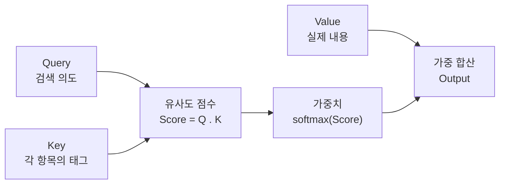
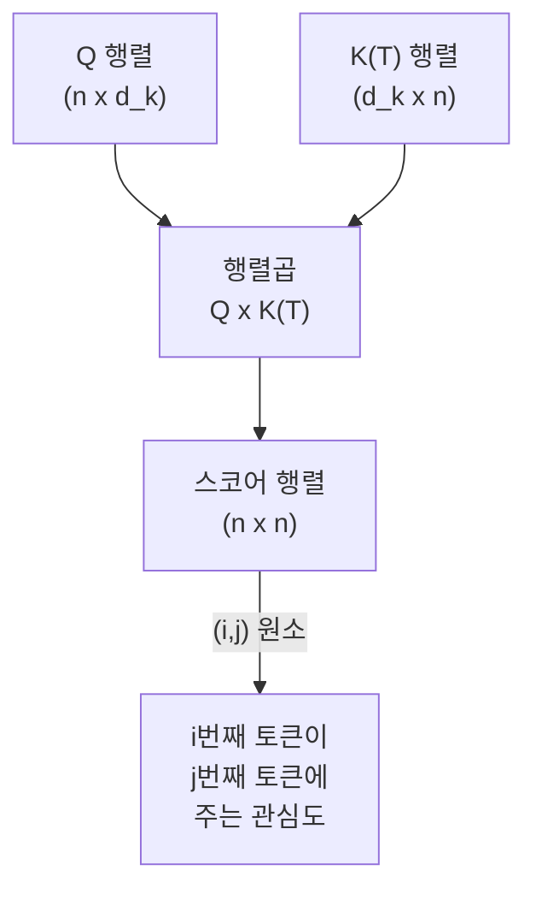
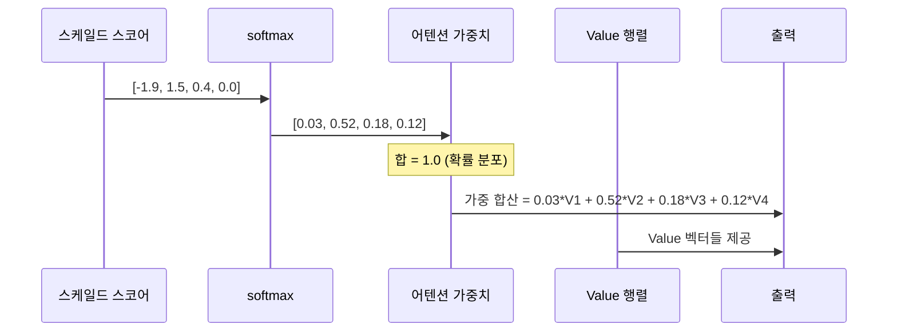
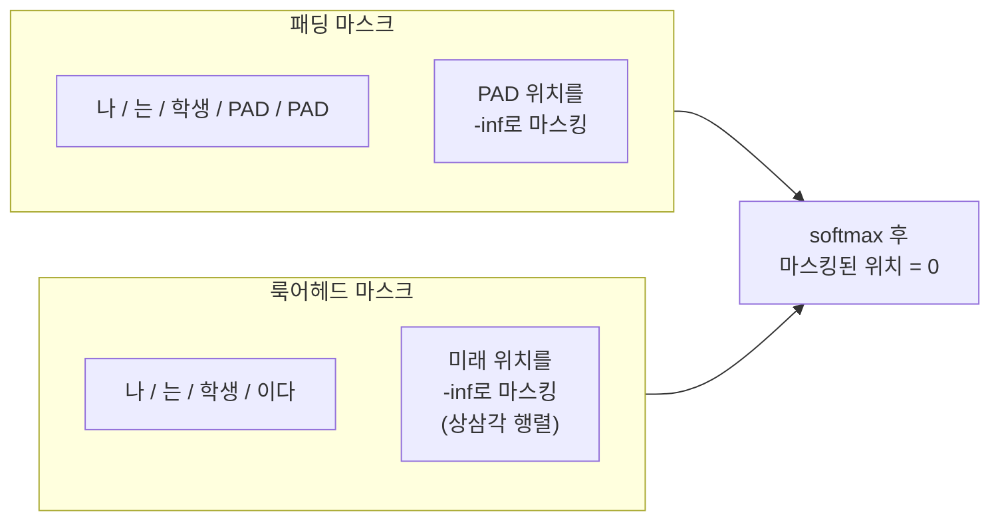
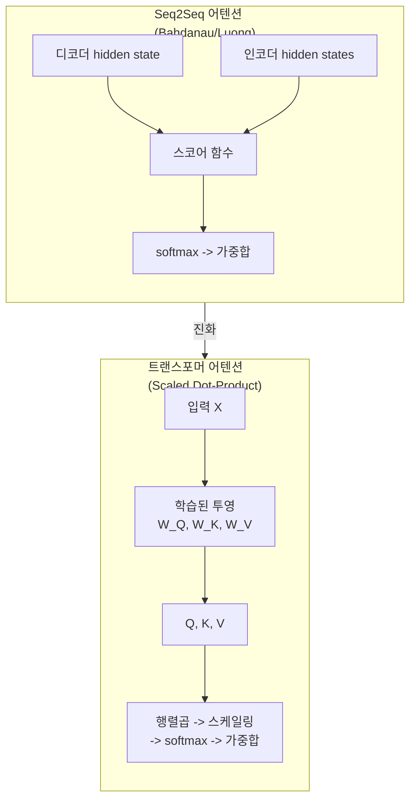

# 02. 스케일드 닷-프로덕트 어텐션

> 트랜스포머의 심장부 — Query, Key, Value 행렬의 역할과 스케일링의 수학적 근거를 완전히 이해합니다.

## 개요

이 섹션에서는 트랜스포머 아키텍처의 가장 핵심적인 연산인 **스케일드 닷-프로덕트 어텐션(Scaled Dot-Product Attention)**을 수식 하나하나까지 분해하여 이해합니다. [이전 섹션](13-트랜스포머-아키텍처-심층-분석/01-01-트랜스포머-아키텍처-전체-조망.md)에서 트랜스포머의 전체 구조를 조망했다면, 이제 그 내부를 구동하는 **엔진**을 열어보는 시간입니다.

**선수 지식**: [어텐션의 직관적 이해](12-어텐션-메커니즘/01-01-어텐션의-직관적-이해.md)에서 다룬 어텐션 개념, [셀프 어텐션과 트랜스포머로의 길](12-어텐션-메커니즘/05-05-셀프-어텐션과-트랜스포머로의-길.md)에서 다룬 Q=K=V 원리, [PyTorch 텐서와 연산](07-pytorch-기초와-신경망-입문/01-01-pytorch-텐서와-연산.md)의 행렬 연산 기초

**학습 목표**:
- Query, Key, Value가 무엇이고 왜 이렇게 분리하는지 직관적으로 이해한다
- 스케일링 팩터 $\sqrt{d_k}$가 필요한 수학적 이유를 설명할 수 있다
- Bahdanau/Luong 어텐션과 Scaled Dot-Product 어텐션의 핵심 차이를 설명할 수 있다
- 패딩 마스크와 룩어헤드 마스크의 차이와 구현 방법을 안다
- PyTorch로 스케일드 닷-프로덕트 어텐션을 처음부터 구현할 수 있다

## 왜 알아야 할까?

트랜스포머 기반 모델 — BERT, GPT, T5, LLaMA — 이 모든 것의 가장 기본적인 연산 단위가 바로 스케일드 닷-프로덕트 어텐션입니다. 이 연산 하나를 제대로 이해하면, 멀티헤드 어텐션도, 셀프 어텐션도, 크로스 어텐션도 모두 이 연산의 **변형**에 불과하다는 것을 알게 됩니다.

모델을 "사용"만 한다면 API 호출로 충분하겠지만, 모델을 디버깅하거나, 커스텀 어텐션 메커니즘을 설계하거나, 어텐션 가중치를 해석하려면 이 수식의 각 부분이 **왜** 그렇게 설계되었는지를 알아야 합니다.

## 핵심 개념

### 개념 1: Query, Key, Value — 도서관 비유

> 💡 **비유**: 도서관에서 책을 찾는 상황을 떠올려 보세요.

여러분이 "딥러닝 입문서"를 찾고 있다고 해봅시다.

- **Query(질의)**: 여러분이 머릿속에 품고 있는 검색 의도 — "딥러닝 입문서 찾아줘"
- **Key(키)**: 도서관 카탈로그에 적힌 각 책의 태그/분류 — "딥러닝", "입문", "파이썬", "요리", "소설" ...
- **Value(값)**: 실제 책의 내용 — 태그가 아니라 책 자체

여러분(Query)은 모든 책의 태그(Key)를 훑어보면서, 자신의 검색 의도와 **얼마나 관련 있는지** 점수를 매깁니다. 그 점수에 비례해서 각 책의 내용(Value)을 가져오는 거죠. "딥러닝 입문" 태그가 붙은 책은 많이 참조하고, "요리" 태그가 붙은 책은 거의 무시하는 식입니다.

> 📊 **그림 1**: Query-Key-Value의 도서관 비유



수식으로 보면, 입력 시퀀스 $X$에서 세 개의 서로 다른 선형 투영(linear projection)을 통해 Q, K, V를 만듭니다:

$$Q = XW^Q, \quad K = XW^K, \quad V = XW^V$$

여기서 $W^Q, W^K \in \mathbb{R}^{d_{model} \times d_k}$, $W^V \in \mathbb{R}^{d_{model} \times d_v}$입니다.

왜 같은 입력에서 **세 개의 서로 다른 투영**을 만들까요? 하나의 토큰이 "무엇을 찾는지(Q)", "자신이 무엇인지(K)", "자신이 제공하는 정보(V)"는 서로 다른 관점이기 때문입니다. [셀프 어텐션과 트랜스포머로의 길](12-어텐션-메커니즘/05-05-셀프-어텐션과-트랜스포머로의-길.md)에서 이미 Q=K=V가 같은 입력에서 나온다는 원리를 배웠는데요, 트랜스포머에서는 여기에 **학습 가능한 투영 행렬**을 도입하여 각 역할을 독립적인 부분공간(subspace)에서 수행하도록 합니다. 이것이 Ch12의 셀프 어텐션과 트랜스포머 어텐션의 핵심적인 차이입니다 — 투영 없이 입력을 직접 사용하던 것에서, 학습된 $W^Q, W^K, W^V$를 통해 역할별 최적의 표현을 만드는 것으로 진화한 거죠.

```python
import torch
import torch.nn as nn

d_model = 512  # 모델 차원
d_k = 64       # Key/Query 차원
d_v = 64       # Value 차원

# 세 개의 투영 행렬
W_Q = nn.Linear(d_model, d_k, bias=False)  # Query 투영
W_K = nn.Linear(d_model, d_k, bias=False)  # Key 투영
W_V = nn.Linear(d_model, d_v, bias=False)  # Value 투영

# 입력: (batch_size, seq_len, d_model)
X = torch.randn(2, 10, d_model)

Q = W_Q(X)  # (2, 10, 64)
K = W_K(X)  # (2, 10, 64)
V = W_V(X)  # (2, 10, 64)
```

### 개념 2: 어텐션 스코어 계산 — 내적의 의미

Q와 K를 만들었으니, 이제 "얼마나 관련 있는지"를 계산할 차례입니다. 가장 직관적인 방법은 **내적(dot product)**이죠.

> 💡 **비유**: 두 사람이 같은 방향을 바라보고 있으면 "관심사가 비슷하다"고 볼 수 있겠죠? 벡터의 내적이 바로 그 "방향의 유사도"입니다. 같은 방향이면 큰 양수, 반대 방향이면 큰 음수, 직교하면 0입니다.

Query 벡터 하나와 모든 Key 벡터의 내적을 구하면, 각 위치에 대한 **관련성 점수**가 나옵니다:

$$\text{score}(Q, K) = QK^T$$

시퀀스 길이가 $n$이고 Key 차원이 $d_k$일 때, $Q \in \mathbb{R}^{n \times d_k}$와 $K^T \in \mathbb{R}^{d_k \times n}$의 행렬곱은 $n \times n$ 크기의 **어텐션 스코어 행렬**을 만듭니다.

> 📊 **그림 2**: 어텐션 스코어 행렬 계산 과정



이 $n \times n$ 행렬의 $(i, j)$ 원소는 "i번째 토큰이 j번째 토큰에 얼마나 주의를 기울이는가"를 나타냅니다.

```run:python
import torch

# 간단한 예: 4개 토큰, 차원 3
Q = torch.tensor([[1.0, 0.0, 1.0],
                  [0.0, 1.0, 0.0],
                  [1.0, 1.0, 0.0],
                  [0.0, 0.0, 1.0]])

K = torch.tensor([[1.0, 0.0, 0.0],
                  [0.0, 1.0, 0.0],
                  [0.0, 0.0, 1.0],
                  [1.0, 1.0, 1.0]])

# 어텐션 스코어 = Q @ K^T
scores = torch.matmul(Q, K.transpose(-2, -1))
print("어텐션 스코어 행렬:")
print(scores)
print(f"\n행렬 크기: {scores.shape}")  # (4, 4)
```

```output
어텐션 스코어 행렬:
tensor([[1., 0., 1., 2.],
        [0., 1., 0., 1.],
        [1., 1., 0., 2.],
        [0., 0., 1., 1.]])

행렬 크기: torch.Size([4, 4])
```

### 개념 3: 스케일링 팩터 — 왜 $\sqrt{d_k}$로 나누는가?

여기서 핵심적인 질문이 등장합니다. 왜 단순히 $QK^T$를 쓰지 않고, $\frac{QK^T}{\sqrt{d_k}}$로 **스케일링**할까요?

> 💡 **비유**: 교실에서 시험을 본다고 생각해 보세요. 5문제짜리 시험과 100문제짜리 시험이 있습니다. 5문제짜리는 총점이 0~5점이지만, 100문제짜리는 총점이 0~100점이죠. 학생들의 실력 차이가 비슷해도 100문제짜리 시험에서는 점수 차이가 훨씬 크게 벌어집니다. 이걸 공정하게 비교하려면 문제 수로 정규화해야 하겠죠?

수학적으로 설명하면 이렇습니다. Q와 K의 각 원소가 평균 0, 분산 1인 독립적 확률변수라고 가정하면:

$$\text{Var}(q \cdot k) = \text{Var}\left(\sum_{i=1}^{d_k} q_i k_i\right) = d_k$$

내적의 분산이 $d_k$에 비례해서 커집니다! $d_k = 64$이면 내적 값이 대략 $-16 \sim +16$ 범위로 커질 수 있는데, 이렇게 큰 값이 softmax에 들어가면 어떻게 될까요?

> 📊 **그림 3**: 스케일링이 softmax에 미치는 영향


softmax 함수의 특성상, 입력값의 차이가 크면 가장 큰 값에 거의 모든 확률이 몰리게 됩니다. 이른바 **"원-핫(one-hot)"에 가까운 분포**가 되어버리는 거죠. 이렇게 되면:

1. **기울기가 거의 0**이 되어 학습이 멈춥니다 (gradient vanishing)
2. 어텐션이 **하나의 토큰만** 보게 되어 다양한 정보를 종합할 수 없습니다

$\sqrt{d_k}$로 나누면 분산이 다시 1로 정규화되어, softmax가 **부드럽고 유의미한 확률 분포**를 만들어냅니다.

```run:python
import torch
import torch.nn.functional as F

# 스케일링 전후 softmax 비교
d_k = 64
scores_raw = torch.tensor([[-15.0, 12.0, 3.0, 0.0]])  # 큰 차이

# 스케일링 없이
probs_no_scale = F.softmax(scores_raw, dim=-1)
print("스케일링 없이:", probs_no_scale.round(decimals=4))

# 스케일링 후
import math
scores_scaled = scores_raw / math.sqrt(d_k)
probs_scaled = F.softmax(scores_scaled, dim=-1)
print("스케일링 후:  ", probs_scaled.round(decimals=4))
```

```output
스케일링 없이: tensor([[0.0000, 1.0000, 0.0000, 0.0000]])
스케일링 후:   tensor([[0.0808, 0.4061, 0.2825, 0.2306]])
```

### 개념 4: Softmax로 확률 분포 변환

스케일링된 스코어에 softmax를 적용하면, 각 행이 **확률 분포**(합이 1)가 됩니다:

$$\alpha_{ij} = \frac{\exp(s_{ij})}{\sum_{k=1}^{n} \exp(s_{ik})}$$

여기서 $s_{ij} = \frac{Q_i \cdot K_j}{\sqrt{d_k}}$이고, $\alpha_{ij}$가 바로 **어텐션 가중치(attention weight)**입니다.

> 📊 **그림 4**: softmax를 통한 확률 분포 변환



최종 출력은 Value 벡터들의 **가중 합산**입니다:

$$\text{Attention}(Q, K, V) = \text{softmax}\left(\frac{QK^T}{\sqrt{d_k}}\right)V$$

이것이 바로 논문 "Attention Is All You Need"의 **Equation 1** — 트랜스포머의 심장입니다.

### 개념 5: 마스킹 — 보면 안 되는 것을 가리기

어텐션에서 "특정 위치를 무시해야 하는" 상황이 두 가지 있습니다.

**1. 패딩 마스크 (Padding Mask)**

배치 처리를 위해 짧은 문장에 `<PAD>` 토큰을 채우는데, 이 패딩 토큰에는 의미가 없으므로 어텐션을 주면 안 됩니다.

**2. 룩어헤드 마스크 (Look-ahead Mask / Causal Mask)**

디코더에서 "나는 학생이다"를 생성할 때, "학생"을 예측하는 시점에서 "이다"를 미리 볼 수 없어야 합니다. 미래 토큰을 **가리는** 것이죠.

> 📊 **그림 5**: 패딩 마스크 vs 룩어헤드 마스크



구현은 간단합니다. softmax **이전에** 마스킹할 위치에 $-\infty$ (실제로는 `-1e9` 같은 매우 큰 음수)를 더하면, softmax 후 해당 위치의 확률이 거의 0이 됩니다:

$$\text{softmax}(-\infty) = \frac{e^{-\infty}}{\sum} \approx 0$$

```python
import torch

seq_len = 4

# 패딩 마스크: PAD 위치가 True
# 예: 시퀀스 [토큰, 토큰, PAD, PAD]
pad_mask = torch.tensor([[False, False, True, True]])  # (1, 4)
# -> (1, 1, 1, 4)로 확장하여 스코어에 브로드캐스팅

# 룩어헤드 마스크: 상삼각 행렬
look_ahead_mask = torch.triu(
    torch.ones(seq_len, seq_len), diagonal=1
).bool()
# tensor([[False,  True,  True,  True],   ← 첫 토큰은 자기만 봄
#         [False, False,  True,  True],   ← 둘째는 1,2만
#         [False, False, False,  True],   ← 셋째는 1,2,3만
#         [False, False, False, False]])  ← 넷째는 전부 봄
```

### 개념 6: Seq2Seq 어텐션에서 트랜스포머 어텐션으로 — 패러다임의 전환

[Ch12](12-어텐션-메커니즘/01-01-어텐션의-직관적-이해.md)에서 배운 Bahdanau/Luong 어텐션과, 지금 다루고 있는 트랜스포머의 Scaled Dot-Product 어텐션은 "관련성을 계산하여 가중 합산한다"는 큰 틀은 같지만, 설계 철학과 구현 방식에서 중요한 차이가 있습니다. 이 차이를 명확히 이해해야 트랜스포머가 왜 Seq2Seq를 대체하게 되었는지 감이 옵니다.

> 📊 **그림 6**: Seq2Seq 어텐션 vs 트랜스포머 어텐션 비교



| 비교 항목 | Bahdanau (Additive) | Luong (Dot-Product) | Scaled Dot-Product (트랜스포머) |
|-----------|-------------------|-------------------|-------------------------------|
| **스코어 함수** | $v^T \tanh(W_1 s_t + W_2 h_j)$ | $s_t^T h_j$ 또는 $s_t^T W h_j$ | $\frac{QK^T}{\sqrt{d_k}}$ |
| **Query 출처** | 디코더 hidden state $s_t$ | 디코더 hidden state $s_t$ | 학습된 투영 $XW^Q$ |
| **Key/Value 출처** | 인코더 hidden states $h_j$ (K=V 동일) | 인코더 hidden states $h_j$ (K=V 동일) | 학습된 투영 $XW^K$, $XW^V$ (분리) |
| **학습 파라미터** | $W_1, W_2, v$ (스코어 자체에 파라미터) | 없음 또는 $W$ 하나 | $W^Q, W^K, W^V$ (투영에 파라미터) |
| **스케일링** | 불필요 (tanh가 범위 제한) | 없음 (차원 작아서 문제 적음) | $\sqrt{d_k}$ (고차원 필수) |
| **병렬화** | RNN 의존 → 순차 처리 | RNN 의존 → 순차 처리 | **완전 병렬** (행렬곱 한 번) |
| **셀프 어텐션** | 미지원 (인코더→디코더 전용) | 미지원 | **지원** (Q=K=V 같은 시퀀스) |

핵심적인 차이가 세 가지 있습니다:

1. **투영의 분리**: Bahdanau/Luong에서는 인코더의 hidden state가 Key와 Value를 겸했지만, 트랜스포머는 $W^K$와 $W^V$를 **별도로 학습**합니다. "자신을 알리는 정보"와 "제공하는 정보"를 분리한 거죠.

2. **스코어 함수의 단순화**: Bahdanau의 가산 어텐션은 MLP를 통과하므로 이론적 표현력은 높지만 느립니다. 트랜스포머는 내적 + 스케일링이라는 단순한 연산으로 **GPU 행렬곱 하드웨어**를 최대한 활용합니다.

3. **RNN으로부터의 해방**: Seq2Seq 어텐션은 RNN의 hidden state에 의존하므로 순차 처리가 불가피했지만, 트랜스포머는 위치 인코딩(Positional Encoding)으로 순서 정보를 주입하고 어텐션만으로 모든 관계를 **병렬** 계산합니다.

> 🔥 **실무 팁**: Bahdanau 어텐션이 완전히 사라진 것은 아닙니다. 작은 모델이나 스트리밍 환경에서는 여전히 RNN+Attention 조합이 쓰이기도 합니다. 하지만 대규모 언어 모델의 세계에서는 트랜스포머의 병렬성과 확장성이 압도적이죠.

## 실습: 직접 해보기

이제 모든 개념을 합쳐서, 스케일드 닷-프로덕트 어텐션을 **처음부터** 구현해봅시다.

```run:python
import torch
import torch.nn as nn
import torch.nn.functional as F
import math

def scaled_dot_product_attention(Q, K, V, mask=None):
    """
    스케일드 닷-프로덕트 어텐션 구현
    
    Args:
        Q: Query (batch, ..., seq_len, d_k)
        K: Key   (batch, ..., seq_len, d_k)
        V: Value (batch, ..., seq_len, d_v)
        mask: 마스킹할 위치가 True인 텐서
    
    Returns:
        output: 어텐션 출력 (batch, ..., seq_len, d_v)
        weights: 어텐션 가중치 (batch, ..., seq_len, seq_len)
    """
    d_k = Q.size(-1)  # Key 차원
    
    # 1단계: Q와 K의 내적 → 스코어 행렬
    scores = torch.matmul(Q, K.transpose(-2, -1))  # (..., seq_len, seq_len)
    
    # 2단계: √d_k로 스케일링
    scores = scores / math.sqrt(d_k)
    
    # 3단계: 마스킹 (선택적)
    if mask is not None:
        scores = scores.masked_fill(mask, float('-inf'))
    
    # 4단계: softmax → 확률 분포
    weights = F.softmax(scores, dim=-1)  # 각 행의 합 = 1
    
    # 5단계: 가중 합산 → 출력
    output = torch.matmul(weights, V)  # (..., seq_len, d_v)
    
    return output, weights

# --- 테스트 ---
torch.manual_seed(42)

batch_size = 1
seq_len = 4
d_model = 8
d_k = d_v = 4

# 입력 시퀀스
X = torch.randn(batch_size, seq_len, d_model)

# 투영 행렬
W_Q = nn.Linear(d_model, d_k, bias=False)
W_K = nn.Linear(d_model, d_k, bias=False)
W_V = nn.Linear(d_model, d_v, bias=False)

# Q, K, V 생성
Q = W_Q(X)
K = W_K(X)
V = W_V(X)

# 마스크 없이 실행
output, weights = scaled_dot_product_attention(Q, K, V)
print("=== 마스크 없이 ===")
print(f"출력 shape: {output.shape}")
print(f"어텐션 가중치:\n{weights.squeeze().round(decimals=3)}")
print(f"가중치 행 합: {weights.squeeze().sum(dim=-1).round(decimals=3)}")

# 룩어헤드 마스크 적용
causal_mask = torch.triu(torch.ones(seq_len, seq_len), diagonal=1).bool()
output_masked, weights_masked = scaled_dot_product_attention(Q, K, V, mask=causal_mask)
print("\n=== 룩어헤드 마스크 적용 ===")
print(f"어텐션 가중치:\n{weights_masked.squeeze().round(decimals=3)}")
```

```output
=== 마스크 없이 ===
출력 shape: torch.Size([1, 4, 4])
어텐션 가중치:
tensor([[0.191, 0.235, 0.336, 0.239],
        [0.197, 0.268, 0.250, 0.285],
        [0.287, 0.199, 0.318, 0.196],
        [0.230, 0.264, 0.264, 0.242]])
가중치 행 합: tensor([1., 1., 1., 1.])

=== 룩어헤드 마스크 적용 ===
어텐션 가중치:
tensor([[1.000, 0.000, 0.000, 0.000],
        [0.424, 0.576, 0.000, 0.000],
        [0.353, 0.245, 0.402, 0.000],
        [0.230, 0.264, 0.264, 0.242]])
```

마스크가 적용되면 상삼각 부분(미래 토큰)의 가중치가 정확히 0이 되는 것을 확인할 수 있습니다. 첫 번째 토큰은 자기 자신만 볼 수 있어 가중치가 1.0이고, 마지막 토큰은 모든 토큰을 볼 수 있어 마스크 없는 경우와 동일합니다.

이번엔 PyTorch 내장 함수 `F.scaled_dot_product_attention`과 비교해봅시다:

```run:python
import torch
import torch.nn.functional as F
import math

torch.manual_seed(42)

# 동일한 Q, K, V 준비
Q = torch.randn(1, 4, 8)
K = torch.randn(1, 4, 8)
V = torch.randn(1, 4, 8)

# 직접 구현
d_k = Q.size(-1)
scores = torch.matmul(Q, K.transpose(-2, -1)) / math.sqrt(d_k)
weights = F.softmax(scores, dim=-1)
our_output = torch.matmul(weights, V)

# PyTorch 내장 함수 (2.0+)
pt_output = F.scaled_dot_product_attention(Q, K, V)

# 결과 비교
diff = (our_output - pt_output).abs().max().item()
print(f"최대 오차: {diff:.2e}")
print(f"결과 일치: {torch.allclose(our_output, pt_output, atol=1e-6)}")
```

```output
최대 오차: 0.00e+00
결과 일치: True
```

> 🔥 **실무 팁**: 실제 프로젝트에서는 직접 구현 대신 `torch.nn.functional.scaled_dot_product_attention`을 사용하세요. 이 함수는 하드웨어에 따라 FlashAttention, Memory-Efficient Attention 등 최적화된 커널을 자동으로 선택합니다. 직접 구현은 학습과 디버깅 목적에서만 사용하는 것이 좋습니다.

## 더 깊이 알아보기

### "Attention Is All You Need" — 이름의 탄생

2017년 Google Brain 팀이 발표한 논문 "Attention Is All You Need"의 제목은 상당히 도발적이었습니다. 당시 NLP의 주류였던 RNN, LSTM, CNN을 모두 걷어내고 **어텐션만으로** 최고 성능을 달성했다는 선언이었거든요.

논문의 제1저자 Ashish Vaswani는 이후 인터뷰에서, 초기에는 어텐션을 RNN의 **보조 메커니즘**으로만 생각했다가, 실험 과정에서 RNN 없이 어텐션만으로도 충분하다는 것을 발견했다고 밝혔습니다.

### 왜 내적(Dot-Product)인가?

원래 어텐션 메커니즘에는 두 가지 계열이 있었습니다:

1. **가산 어텐션(Additive Attention)** — Bahdanau et al. (2014): 작은 신경망으로 스코어 계산. $\text{score}(q, k) = v^T \tanh(W_1 q + W_2 k)$
2. **내적 어텐션(Dot-Product Attention)** — Luong et al. (2015): 단순 내적. $\text{score}(q, k) = q^T k$

가산 어텐션이 이론적으로 더 표현력이 높지만, 내적 어텐션이 **행렬곱 한 번**으로 모든 스코어를 병렬 계산할 수 있어 훨씬 빠릅니다. 문제는 $d_k$가 커지면 내적 값도 커져서 softmax가 포화된다는 것이었고, Vaswani 팀이 $\sqrt{d_k}$ 스케일링으로 이 문제를 우아하게 해결한 것입니다. 그래서 "Scaled" Dot-Product Attention이라는 이름이 붙었죠.

### Additive vs Dot-Product: 논문의 직접 비교

논문 Section 3.2.1에서 저자들은 이렇게 설명합니다: "두 방법의 이론적 복잡도는 비슷하지만, 실제로는 내적 어텐션이 고도로 최적화된 행렬곱 코드를 활용할 수 있어 훨씬 빠르고 공간 효율적이다." 작은 $d_k$에서는 가산 어텐션이 더 좋은 성능을 보이지만, 스케일링을 적용하면 큰 $d_k$에서도 동등한 성능을 보인다는 실험 결과도 제시했습니다.

## 흔한 오해와 팁

> ⚠️ **흔한 오해**: "셀프 어텐션에서는 Q, K, V가 완전히 같다" — Q, K, V가 **같은 입력 $X$에서 출발**하는 것은 맞지만, 서로 다른 투영 행렬 $W^Q, W^K, W^V$를 거치므로 **결과 벡터는 전혀 다릅니다**. 셀프 어텐션의 기본 원리는 [Ch12.5](12-어텐션-메커니즘/05-05-셀프-어텐션과-트랜스포머로의-길.md)를 참조하세요. 다만 크로스 어텐션(디코더가 인코더를 참조할 때)에서는 Q는 디코더에서, K와 V는 인코더에서 오는 것이 맞습니다.

> 💡 **알고 계셨나요?**: 트랜스포머 원 논문에서 $d_k = d_v = 64$를 사용했는데, 이는 $d_{model} = 512$를 8개 헤드로 나눈 값입니다. 하나의 헤드가 보는 차원이 64인 셈이죠. 이 설계는 [다음 섹션](13-트랜스포머-아키텍처-심층-분석/03-03-멀티헤드-어텐션.md)에서 자세히 다룹니다.

> 🔥 **실무 팁**: 마스킹 시 `-float('inf')` 대신 `-1e9` 같은 큰 음수를 쓰는 경우도 많습니다. `float('inf')`는 float16에서 오버플로를 일으킬 수 있기 때문입니다. PyTorch 내장 `F.scaled_dot_product_attention`은 `is_causal=True` 파라미터로 룩어헤드 마스크를 자동 적용할 수 있어 더 편리합니다.

## 핵심 정리

| 개념 | 설명 |
|------|------|
| **Query, Key, Value** | 같은 입력에서 서로 다른 선형 투영으로 생성. Q는 "무엇을 찾는지", K는 "자신이 무엇인지", V는 "제공하는 정보" |
| **어텐션 스코어** | $QK^T$ — Query와 Key의 내적으로 관련성 점수 계산. $n \times n$ 행렬 |
| **스케일링 팩터** | $1/\sqrt{d_k}$ — 내적 분산이 $d_k$에 비례하여 커지는 것을 보정. softmax 포화 방지 |
| **softmax** | 스코어를 확률 분포로 변환. 각 행의 합이 1 |
| **패딩 마스크** | PAD 토큰 위치를 $-\infty$로 마스킹하여 무시 |
| **룩어헤드 마스크** | 미래 토큰 위치를 $-\infty$로 마스킹. 디코더 자기회귀 생성에 필수 |
| **Seq2Seq → 트랜스포머** | 가산/내적 스코어 → 스케일드 내적, RNN 의존 → 완전 병렬, K=V 공유 → K/V 분리 투영 |
| **전체 수식** | $\text{Attention}(Q,K,V) = \text{softmax}(QK^T/\sqrt{d_k})V$ |

## 다음 섹션 미리보기

하나의 어텐션 헤드는 하나의 관점에서만 관계를 파악합니다. "주어-동사" 관계를 잘 잡는 헤드가 "형용사-명사" 관계까지 잡기는 어렵겠죠? [다음 섹션: 멀티헤드 어텐션](13-트랜스포머-아키텍처-심층-분석/03-03-멀티헤드-어텐션.md)에서는 이 스케일드 닷-프로덕트 어텐션을 **여러 개 병렬로** 실행하여, 다양한 관계 패턴을 동시에 학습하는 멀티헤드 어텐션 구조를 깊이 파헤칩니다.

## 참고 자료

- [Attention Is All You Need (Vaswani et al., 2017)](https://arxiv.org/abs/1706.03762) - 트랜스포머 원 논문. Section 3.2.1이 스케일드 닷-프로덕트 어텐션의 정의
- [Neural Machine Translation by Jointly Learning to Align and Translate (Bahdanau et al., 2014)](https://arxiv.org/abs/1409.0473) - 가산 어텐션의 원 논문. 트랜스포머 어텐션과 비교하며 읽으면 진화 과정이 보임
- [Effective Approaches to Attention-based Neural Machine Translation (Luong et al., 2015)](https://arxiv.org/abs/1508.04025) - 내적 어텐션을 체계화한 논문. Scaled Dot-Product의 직접적 선조
- [The Illustrated Transformer — Jay Alammar](https://jalammar.github.io/illustrated-transformer/) - 트랜스포머 아키텍처를 시각적으로 가장 잘 설명한 포스트. 스탠포드, MIT 등에서 참고 자료로 활용
- [PyTorch scaled_dot_product_attention 공식 문서](https://docs.pytorch.org/docs/stable/generated/torch.nn.functional.scaled_dot_product_attention.html) - PyTorch 내장 SDPA 함수의 파라미터와 최적화 백엔드 설명
- [Dive into Deep Learning — Attention Scoring Functions](https://d2l.ai/chapter_attention-mechanisms-and-transformers/attention-scoring-functions.html) - 내적 어텐션과 가산 어텐션의 수학적 비교, 마스크드 softmax 구현

---
### 🔗 Related Sessions
- [attention_mechanism](12-어텐션-메커니즘/01-01-어텐션의-직관적-이해.md) (prerequisite)
- [attention_mechanism](12-어텐션-메커니즘/01-01-어텐션의-직관적-이해.md) (prerequisite)
- [context_vector_dynamic](12-어텐션-메커니즘/01-01-어텐션의-직관적-이해.md) (prerequisite)
- [query_key_value](12-어텐션-메커니즘/01-01-어텐션의-직관적-이해.md) (prerequisite)
- [query_key_value](12-어텐션-메커니즘/01-01-어텐션의-직관적-이해.md) (prerequisite)
- [dot_product_attention](12-어텐션-메커니즘/01-01-어텐션의-직관적-이해.md) (prerequisite)
- [dot_product_attention](12-어텐션-메커니즘/01-01-어텐션의-직관적-이해.md) (prerequisite)
- [soft_attention](12-어텐션-메커니즘/01-01-어텐션의-직관적-이해.md) (prerequisite)
- [transformer 아키텍처](13-트랜스포머-아키텍처-심층-분석/01-01-트랜스포머-아키텍처-전체-조망.md) (prerequisite)
