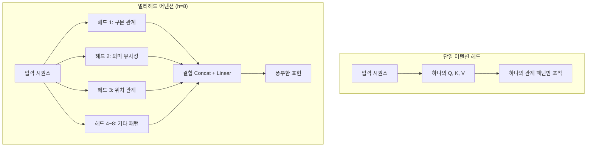
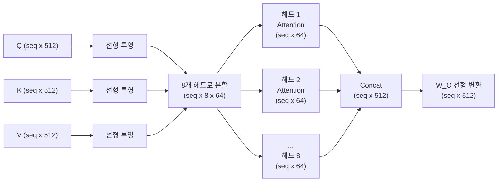
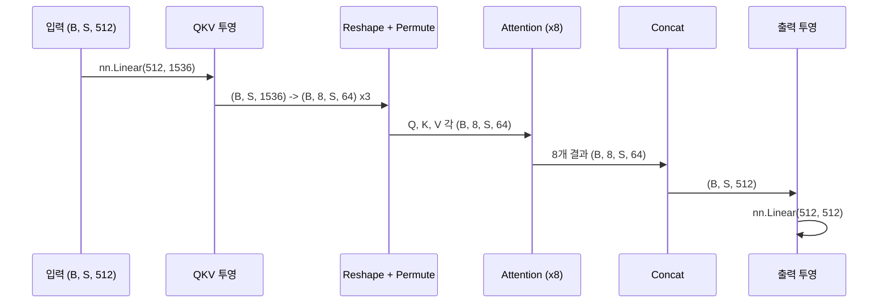
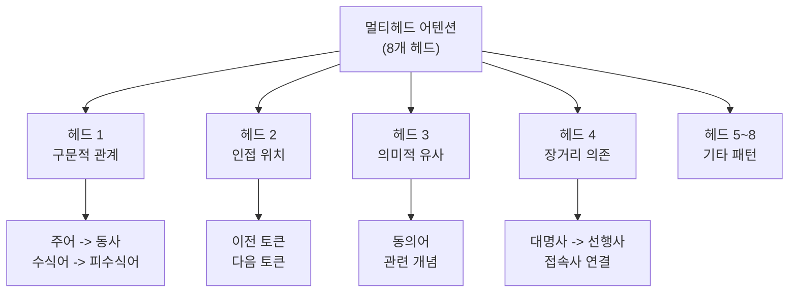
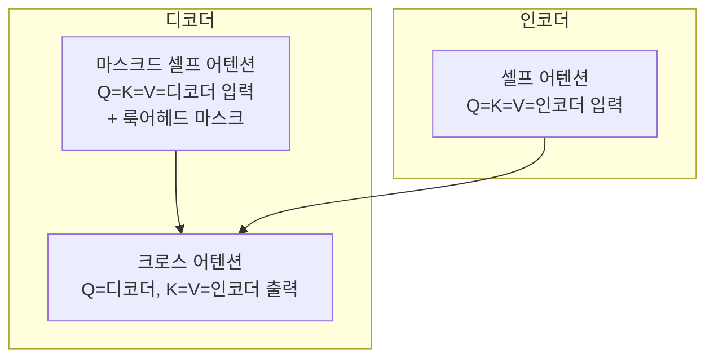

# 03. 멀티헤드 어텐션

> 하나의 시선이 아닌 여러 시선으로 문장을 동시에 바라보는 트랜스포머의 핵심 구조

## 개요

이 섹션에서는 트랜스포머의 핵심 구성 요소인 **멀티헤드 어텐션(Multi-Head Attention)**의 동기, 구조, 그리고 PyTorch 구현을 깊이 있게 다룹니다. 앞서 [02. 스케일드 닷-프로덕트 어텐션](13-트랜스포머-아키텍처-심층-분석/02-02-스케일드-닷-프로덕트-어텐션.md)에서 배운 단일 어텐션 연산을 **여러 개 병렬로 실행**하여, 문장 속 다양한 관계 패턴을 동시에 포착하는 방법을 살펴봅니다.

**선수 지식**: 스케일드 닷-프로덕트 어텐션의 수식과 Q, K, V 개념, PyTorch `nn.Linear` 기초
**학습 목표**:
- 단일 어텐션 헤드의 한계와 멀티헤드 어텐션의 동기를 이해한다
- 멀티헤드 어텐션의 수학적 정의와 차원 분할 전략을 설명할 수 있다
- 각 헤드가 학습하는 다양한 언어적 패턴을 이해한다
- PyTorch로 멀티헤드 어텐션을 처음부터 구현한다

## 왜 알아야 할까?

단일 어텐션 헤드만으로도 문장의 관계를 파악할 수 있긴 하죠. 하지만 한 가지 관점만으로 언어를 이해하려 하면, 놓치는 것이 너무 많습니다.

"나는 **은행**에서 **돈**을 찾았다"와 "나는 **은행**에 앉아 **물고기**를 잡았다"를 생각해보세요. "은행"이라는 단어를 이해하려면, 하나의 헤드는 주변 명사("돈" vs "물고기")와의 관계를, 다른 헤드는 동사("찾다" vs "앉다")와의 관계를 동시에 봐야 합니다. 멀티헤드 어텐션은 바로 이 **다중 관점 동시 분석**을 가능하게 하는 구조이며, 트랜스포머가 BERT, GPT 등 현대 LLM의 기반이 될 수 있었던 핵심 이유 중 하나입니다.

## 핵심 개념

### 개념 1: 단일 어텐션 헤드의 한계

> 💡 **비유**: 미술 감상에서 한 가지 관점만으로 그림을 보는 것과 같습니다. 색채 전문가는 색감을, 구도 전문가는 배치를, 미술사학자는 시대적 맥락을 각각 다르게 봅니다. 한 사람의 시선만으로는 그림의 풍부함을 모두 포착할 수 없죠.

[이전 섹션](13-트랜스포머-아키텍처-심층-분석/02-02-스케일드-닷-프로덕트-어텐션.md)에서 배운 스케일드 닷-프로덕트 어텐션은 하나의 Q, K, V 세트로 어텐션 가중치를 계산합니다. 문제는, 하나의 어텐션 연산이 생성하는 가중치는 **하나의 관계 패턴만 포착**한다는 점입니다.

원논문에서는 이를 이렇게 설명합니다: 단일 어텐션은 가중치를 **평균화(averaging)**하기 때문에, 여러 표현 부분공간(representation subspaces)의 정보를 동시에 포착하는 것이 어렵다고요.

> 📊 **그림 1**: 단일 어텐션 vs 멀티헤드 어텐션의 정보 포착 범위



### 개념 2: 멀티헤드 어텐션의 수학적 정의

> 💡 **비유**: 8명의 전문가가 같은 문서를 각자의 전문 분야 관점에서 읽고, 최종적으로 의견을 종합하는 회의를 떠올려보세요. 각 전문가는 자기만의 렌즈(투영 행렬)로 문서를 분석하고, 회의 진행자(출력 투영)가 이를 하나의 결론으로 통합합니다.

멀티헤드 어텐션의 전체 수식을 단계별로 살펴보겠습니다. 먼저, 최종 출력은 각 헤드의 결과를 이어 붙인 뒤 출력 투영 행렬을 곱하는 구조입니다:

$$\text{MultiHead}(Q, K, V) = \text{Concat}(\text{head}_1, \text{head}_2, \dots, \text{head}_h) \, W^O$$

여기서 각 헤드는 입력을 자신만의 부분공간으로 투영한 뒤 스케일드 닷-프로덕트 어텐션을 적용합니다:

$$\text{head}_i = \text{Attention}(Q W_i^Q, \; K W_i^K, \; V W_i^V)$$

그리고 각 헤드 내부의 어텐션 연산은 이전 섹션에서 배운 공식 그대로입니다:

$$\text{Attention}(Q, K, V) = \text{softmax}\!\left(\frac{Q K^\top}{\sqrt{d_k}}\right) V$$

이 세 수식을 하나로 연결하면, 멀티헤드 어텐션의 완전한 계산 과정이 됩니다:

$$\text{MultiHead}(Q, K, V) = \text{Concat}\!\left(\text{softmax}\!\left(\frac{Q W_1^Q (K W_1^K)^\top}{\sqrt{d_k}}\right) V W_1^V, \;\dots\;, \;\text{softmax}\!\left(\frac{Q W_h^Q (K W_h^K)^\top}{\sqrt{d_k}}\right) V W_h^V\right) W^O$$

각 기호의 의미를 정리하면:

- $W_i^Q \in \mathbb{R}^{d_{model} \times d_k}$ : i번째 헤드의 Query 투영 행렬
- $W_i^K \in \mathbb{R}^{d_{model} \times d_k}$ : i번째 헤드의 Key 투영 행렬
- $W_i^V \in \mathbb{R}^{d_{model} \times d_v}$ : i번째 헤드의 Value 투영 행렬
- $W^O \in \mathbb{R}^{hd_v \times d_{model}}$ : 출력 투영 행렬 — $h$개 헤드의 출력을 다시 $d_{model}$ 차원으로 매핑
- $h = 8$ : 헤드 수 (원논문 기본값)
- $d_k = d_v = d_{model} / h = 512 / 8 = 64$ : 각 헤드의 차원

이게 의미하는 바는 이렇습니다: 512차원의 임베딩 공간을 8개의 64차원 부분공간으로 나누어, 각각이 독립적으로 어텐션을 수행한 뒤 다시 512차원으로 합치는 거죠. Concat 연산은 8개의 $(seq \times 64)$ 텐서를 $(seq \times 512)$로 이어 붙이고, $W^O$가 이를 최종 $(seq \times 512)$ 출력으로 변환합니다.

> 📊 **그림 2**: 멀티헤드 어텐션의 차원 분할과 결합 흐름



핵심 통찰은 **계산 비용**에 있습니다. 각 헤드의 차원이 $d_k = d_{model}/h$이므로, 8개 헤드의 총 계산량은 $d_{model}$ 차원의 단일 헤드 어텐션과 거의 동일합니다. 공짜로 다양성을 얻는 셈이죠!

### 개념 3: 효율적 구현 — 투영 행렬 결합

> 💡 **비유**: 8명의 전문가에게 각각 따로 문서 사본을 만들어주는 대신, 한 번에 복사해서 나눠주는 것이 훨씬 효율적이겠죠? 실제 구현에서도 8개의 투영 행렬을 하나로 합쳐서 한 번에 연산합니다.

실제 구현에서는 8개의 $W_i^Q$를 개별 연산하지 않습니다. 대신 **하나의 큰 투영 행렬**로 합쳐서 한 번에 계산한 뒤, reshape으로 헤드를 분리합니다.

```python
import torch
import torch.nn as nn
import math

class MultiHeadAttention(nn.Module):
    def __init__(self, d_model: int, num_heads: int):
        super().__init__()
        assert d_model % num_heads == 0, "d_model must be divisible by num_heads"
        
        self.d_model = d_model
        self.num_heads = num_heads
        self.d_k = d_model // num_heads  # 각 헤드의 차원
        
        # Q, K, V를 하나의 행렬로 묶어서 투영 (효율성!)
        self.qkv_proj = nn.Linear(d_model, 3 * d_model)
        # 출력 투영 W^O
        self.o_proj = nn.Linear(d_model, d_model)
    
    def forward(self, x, mask=None):
        batch_size, seq_len, _ = x.shape
        
        # 1) Q, K, V 한번에 투영
        qkv = self.qkv_proj(x)  # (batch, seq, 3*d_model)
        
        # 2) 헤드 분할: reshape + permute
        qkv = qkv.reshape(batch_size, seq_len, self.num_heads, 3 * self.d_k)
        qkv = qkv.permute(0, 2, 1, 3)  # (batch, heads, seq, 3*d_k)
        q, k, v = qkv.chunk(3, dim=-1)  # 각각 (batch, heads, seq, d_k)
        
        # 3) 스케일드 닷-프로덕트 어텐션
        scores = torch.matmul(q, k.transpose(-2, -1)) / math.sqrt(self.d_k)
        if mask is not None:
            scores = scores.masked_fill(mask == 0, float('-inf'))
        attn_weights = torch.softmax(scores, dim=-1)
        attn_output = torch.matmul(attn_weights, v)  # (batch, heads, seq, d_k)
        
        # 4) 헤드 결합: permute + reshape
        attn_output = attn_output.permute(0, 2, 1, 3)  # (batch, seq, heads, d_k)
        attn_output = attn_output.reshape(batch_size, seq_len, self.d_model)
        
        # 5) 출력 투영 W^O
        output = self.o_proj(attn_output)  # (batch, seq, d_model)
        
        return output, attn_weights
```

> 📊 **그림 3**: 구현 단계별 텐서 차원 변화



이 방식이 왜 효율적인지 확인해볼까요?

```run:python
import torch
import torch.nn as nn

d_model, num_heads = 512, 8
d_k = d_model // num_heads

# 방법 1: 개별 투영 (비효율적)
separate_params = sum(
    d_model * d_k * 3  # Q, K, V 각각
    for _ in range(num_heads)
)

# 방법 2: 결합 투영 (효율적)
combined_params = d_model * (3 * d_model)  # 하나의 큰 행렬

print(f"개별 투영 파라미터 수: {separate_params:,}")
print(f"결합 투영 파라미터 수: {combined_params:,}")
print(f"동일한가? {separate_params == combined_params}")
print(f"d_k (헤드당 차원): {d_k}")
print(f"총 파라미터 (W^O 포함): {combined_params + d_model * d_model:,}")
```

```output
개별 투영 파라미터 수: 786,432
결합 투영 파라미터 수: 786,432
동일한가? True
d_k (헤드당 차원): 64
총 파라미터 (W^O 포함): 1,048,576
```

### 개념 4: 각 헤드가 학습하는 패턴

> 💡 **비유**: 오케스트라에서 바이올린은 멜로디를, 첼로는 베이스를, 플루트는 장식음을 담당하듯, 각 어텐션 헤드도 언어의 서로 다른 "악기 파트"를 맡게 됩니다. 누가 어떤 파트를 맡을지 미리 정하지 않아도, 학습을 통해 자연스럽게 역할이 분화되죠.

연구자들이 학습된 트랜스포머의 각 헤드를 분석한 결과, 흥미로운 패턴이 발견되었습니다:

| 헤드 유형 | 포착하는 패턴 | 예시 |
|-----------|-------------|------|
| **구문적 헤드** | 주어-동사, 수식어 관계 | "고양이가" → "잡았다" |
| **위치적 헤드** | 인접 토큰 관계 | 바로 앞/뒤 단어에 집중 |
| **의미적 헤드** | 동의어, 관련 개념 | "은행" ↔ "금융", "강변" |
| **장거리 헤드** | 먼 거리의 의존 관계 | 문장 시작과 끝의 연결 |
| **구분 기호 헤드** | 쉼표, 마침표에 집중 | 문장 경계 파악 |

> 📊 **그림 4**: 학습된 헤드별 어텐션 패턴 유형



중요한 점은, 이런 역할 분담이 **명시적으로 프로그래밍된 것이 아니라** 학습 과정에서 자연스럽게 발생한다는 사실입니다. 각 헤드의 투영 행렬 $W_i^Q, W_i^K, W_i^V$가 서로 다른 초기값에서 출발하여, 역전파 과정에서 각자 유용한 패턴을 포착하는 방향으로 특화되는 것이죠.

### 개념 5: 트랜스포머에서의 세 가지 멀티헤드 어텐션

[01. 트랜스포머 아키텍처 전체 조망](13-트랜스포머-아키텍처-심층-분석/01-01-트랜스포머-아키텍처-전체-조망.md)에서 언급했듯, 트랜스포머에서 멀티헤드 어텐션은 **세 곳**에서 서로 다른 방식으로 사용됩니다.

> 📊 **그림 5**: 트랜스포머 내 세 가지 멀티헤드 어텐션의 역할



| 유형 | Q 출처 | K, V 출처 | 마스크 | 목적 |
|------|--------|-----------|--------|------|
| 인코더 셀프 어텐션 | 인코더 입력 | 인코더 입력 | 패딩만 | 입력 문장 내 관계 파악 |
| 디코더 마스크드 셀프 어텐션 | 디코더 입력 | 디코더 입력 | 룩어헤드 + 패딩 | 미래 토큰 참조 방지 |
| 크로스 어텐션 | 디코더 상태 | 인코더 출력 | 패딩만 | 입력-출력 정렬 |

세 곳 모두 동일한 멀티헤드 어텐션 구조를 사용하지만, Q, K, V의 출처와 마스크가 다릅니다. 이 유연함이 트랜스포머 설계의 우아한 점이에요.

## 실습: 직접 해보기

멀티헤드 어텐션을 처음부터 구현하고, 실제 문장에 적용하여 헤드별 어텐션 패턴을 확인해봅시다.

```run:python
import torch
import torch.nn as nn
import torch.nn.functional as F
import math

class MultiHeadAttention(nn.Module):
    """멀티헤드 어텐션 from scratch"""
    
    def __init__(self, d_model, num_heads, dropout=0.1):
        super().__init__()
        assert d_model % num_heads == 0
        
        self.d_model = d_model
        self.num_heads = num_heads
        self.d_k = d_model // num_heads
        
        # Q, K, V 결합 투영
        self.qkv_proj = nn.Linear(d_model, 3 * d_model)
        self.o_proj = nn.Linear(d_model, d_model)
        self.dropout = nn.Dropout(dropout)
    
    def scaled_dot_product_attention(self, q, k, v, mask=None):
        """스케일드 닷-프로덕트 어텐션 (이전 섹션 복습)"""
        scores = torch.matmul(q, k.transpose(-2, -1)) / math.sqrt(self.d_k)
        if mask is not None:
            scores = scores.masked_fill(mask == 0, float('-inf'))
        weights = F.softmax(scores, dim=-1)
        weights = self.dropout(weights)
        return torch.matmul(weights, v), weights
    
    def forward(self, x, mask=None):
        B, S, _ = x.shape
        
        # 1단계: Q, K, V 투영 + 헤드 분할
        qkv = self.qkv_proj(x)
        qkv = qkv.reshape(B, S, self.num_heads, 3 * self.d_k)
        qkv = qkv.permute(0, 2, 1, 3)  # (B, H, S, 3*d_k)
        q, k, v = qkv.chunk(3, dim=-1)
        
        # 2단계: 각 헤드에서 어텐션 계산
        attn_out, attn_weights = self.scaled_dot_product_attention(q, k, v, mask)
        
        # 3단계: 헤드 결합 + 출력 투영
        attn_out = attn_out.permute(0, 2, 1, 3).reshape(B, S, self.d_model)
        output = self.o_proj(attn_out)
        
        return output, attn_weights

# 테스트: 4개 토큰, d_model=32, 4개 헤드
torch.manual_seed(42)
d_model, num_heads = 32, 4
mha = MultiHeadAttention(d_model, num_heads, dropout=0.0)

# 가상 입력: 배치 1, 시퀀스 길이 4
x = torch.randn(1, 4, d_model)
output, weights = mha(x)

print(f"입력 크기:     {x.shape}")
print(f"출력 크기:     {output.shape}")
print(f"어텐션 가중치: {weights.shape}")
print(f"  -> (batch={weights.shape[0]}, heads={weights.shape[1]}, "
      f"seq={weights.shape[2]}, seq={weights.shape[3]})")

# 각 헤드의 어텐션 패턴 확인
print("\n--- 헤드별 어텐션 패턴 (토큰 0이 다른 토큰에 주는 가중치) ---")
for h in range(num_heads):
    w = weights[0, h, 0].detach().numpy()
    bar = " ".join(f"t{i}:{v:.2f}" for i, v in enumerate(w))
    print(f"  헤드 {h}: {bar}")
```

```output
입력 크기:     torch.Size([1, 4, 32])
출력 크기:     torch.Size([1, 4, 32])
어텐션 가중치: torch.Size([1, 4, 4])
  -> (batch=1, heads=4, seq=4, seq=4)

--- 헤드별 어텐션 패턴 (토큰 0이 다른 토큰에 주는 가중치) ---
  헤드 0: t0:0.26 t1:0.22 t2:0.30 t3:0.22
  헤드 1: t0:0.18 t1:0.35 t2:0.23 t3:0.24
  헤드 2: t0:0.31 t1:0.19 t2:0.27 t3:0.23
  헤드 3: t0:0.24 t1:0.28 t2:0.20 t3:0.28
```

각 헤드가 같은 입력에 대해 **서로 다른 어텐션 분포**를 생성하는 것을 확인할 수 있습니다. 학습이 진행되면 이 차이는 더욱 뚜렷해지며, 각 헤드가 특정 패턴에 특화됩니다.

이번에는 PyTorch의 공식 `nn.MultiheadAttention`과 직접 비교해봅시다:

```run:python
import torch
import torch.nn as nn

d_model, num_heads = 64, 8
seq_len, batch_size = 10, 2

# PyTorch 공식 멀티헤드 어텐션
official_mha = nn.MultiheadAttention(
    embed_dim=d_model,
    num_heads=num_heads,
    batch_first=True  # (batch, seq, feature) 순서
)

x = torch.randn(batch_size, seq_len, d_model)

# 셀프 어텐션: Q=K=V=x
output, attn_weights = official_mha(x, x, x)

print(f"nn.MultiheadAttention 결과:")
print(f"  입력:     {x.shape}")
print(f"  출력:     {output.shape}")
print(f"  가중치:   {attn_weights.shape}")
print(f"  파라미터: {sum(p.numel() for p in official_mha.parameters()):,}")
```

```output
nn.MultiheadAttention 결과:
  입력:     torch.Size([2, 10, 64])
  출력:     torch.Size([2, 10, 64])
  가중치:   torch.Size([2, 10, 10])
  파라미터: 16,768
```

## 더 깊이 알아보기

### 멀티헤드 어텐션의 탄생 비화

멀티헤드 어텐션이라는 아이디어는 사실 완전히 새로운 것이 아니었습니다. Vaswani 등의 Google Brain 팀이 2017년 "Attention Is All You Need"를 발표하기 전, **앙상블(ensemble)**의 개념은 머신러닝에서 이미 오래된 전통이었거든요. 랜덤 포레스트가 여러 결정 트리의 의견을 종합하듯, 멀티헤드 어텐션도 여러 어텐션 "전문가"의 의견을 종합합니다.

흥미로운 건, 초기에 연구팀이 헤드 수를 실험할 때 h=1에서 h=256까지 테스트했다는 점입니다. 논문의 Table 3을 보면, h=8일 때 최적의 성능을 보였고, h=1(단일 헤드)은 BLEU 점수가 0.9점 하락했습니다. 반대로 h=32로 너무 많아지면 각 헤드의 차원($d_k = 16$)이 너무 작아져 성능이 떨어졌죠. "너무 많은 요리사가 국을 망친다"는 격언이 딱 들어맞는 셈입니다.

### 헤드 수의 의미에 대한 후속 연구

2019년 Michel 등의 논문 "Are Sixteen Heads Really Better than One?"은 충격적인 발견을 보고했습니다. 학습된 트랜스포머에서 많은 헤드를 제거(pruning)해도 성능이 크게 떨어지지 않았다는 거예요. 심지어 일부 레이어에서는 **하나의 헤드만 남겨도** 성능이 유지되었습니다. 이는 학습 과정에서 헤드 간 상당한 중복이 발생한다는 것을 의미하며, 이후 **효율적 트랜스포머** 연구의 중요한 동기가 됩니다.

## 흔한 오해와 팁

> ⚠️ **흔한 오해**: "헤드가 많을수록 무조건 좋다"고 생각하기 쉽지만, 각 헤드의 차원 $d_k = d_{model}/h$가 너무 작아지면 개별 헤드가 충분한 정보를 표현하지 못합니다. 원논문에서도 h=32, $d_k$=16일 때 성능이 h=8보다 낮았습니다. 핵심은 전체 차원과 헤드 수의 **균형**이에요.

> 💡 **알고 계셨나요?**: GPT-3는 96개의 헤드($d_{model}$=12288, $d_k$=128)를, BERT-base는 12개의 헤드($d_{model}$=768, $d_k$=64)를 사용합니다. 모델이 커질수록 헤드 수도 늘어나지만, $d_k$는 64~128 사이를 유지하는 경향이 있습니다.

> 🔥 **실무 팁**: PyTorch의 `nn.MultiheadAttention`을 사용할 때 `batch_first=True`를 설정하는 것을 잊지 마세요. 기본값은 `False`로, 입력 형태가 `(seq, batch, d_model)`이 되어 혼란을 일으키는 흔한 버그 원인입니다. PyTorch 2.0+에서는 `scaled_dot_product_attention`을 내부적으로 사용하여 FlashAttention 등 최적화를 자동 적용합니다.

## 핵심 정리

| 개념 | 설명 |
|------|------|
| 멀티헤드 어텐션 | 여러 어텐션 헤드가 서로 다른 부분공간에서 독립적으로 관계를 포착 |
| 수식 | $\text{MultiHead}(Q,K,V) = \text{Concat}(\text{head}_1, \dots, \text{head}_h) W^O$ |
| 각 헤드 | $\text{head}_i = \text{Attention}(QW_i^Q, KW_i^K, VW_i^V)$ |
| 차원 분할 | $d_k = d_v = d_{model} / h$ (원논문: 512/8 = 64) |
| 계산 효율 | 8헤드 총 비용 ≈ 1헤드(풀 차원) 비용 |
| 구현 핵심 | QKV 결합 투영 → reshape → 병렬 어텐션 → concat → 출력 투영 |
| 헤드별 패턴 | 구문적, 위치적, 의미적 관계를 각 헤드가 자연스럽게 분담 |
| 세 가지 용도 | 인코더 셀프, 디코더 마스크드 셀프, 크로스 어텐션 |

## 다음 섹션 미리보기

멀티헤드 어텐션이 "무엇을" 봐야 하는지를 학습한다면, 다음에 배울 [04. 위치 인코딩](13-트랜스포머-아키텍처-심층-분석/04-04-위치-인코딩.md)은 "어디에" 있는지를 알려주는 역할을 합니다. 어텐션 연산 자체는 토큰의 순서를 전혀 알지 못하거든요. 사인/코사인 함수를 이용한 위치 정보 주입이 어떻게 이 문제를 해결하는지 알아보겠습니다.

## 참고 자료

- [Attention Is All You Need (Vaswani et al., 2017)](https://arxiv.org/abs/1706.03762) - 트랜스포머와 멀티헤드 어텐션을 처음 제안한 원논문. Section 3.2.2를 특히 참고
- [The Illustrated Transformer — Jay Alammar](https://jalammar.github.io/illustrated-transformer/) - 멀티헤드 어텐션을 직관적인 시각 자료로 설명하는 최고의 블로그 포스트
- [Tutorial 6: Transformers and Multi-Head Attention — UvA DL Notebooks](https://uvadlc-notebooks.readthedocs.io/en/latest/tutorial_notebooks/tutorial6/Transformers_and_MHAttention.html) - PyTorch 기반 멀티헤드 어텐션 from-scratch 구현과 상세 설명
- [PyTorch nn.MultiheadAttention 공식 문서](https://docs.pytorch.org/docs/stable/generated/torch.nn.MultiheadAttention.html) - PyTorch 공식 API 레퍼런스와 파라미터 설명
- [Understanding and Coding Self-Attention, Multi-Head Attention — Sebastian Raschka](https://magazine.sebastianraschka.com/p/understanding-and-coding-self-attention) - 셀프 어텐션부터 멀티헤드 어텐션까지 단계별 코딩 가이드

---
### 🔗 Related Sessions
- [scaled_dot_product_attention](13-트랜스포머-아키텍처-심층-분석/02-02-스케일드-닷-프로덕트-어텐션.md) (prerequisite)
- [query_key_value](12-어텐션-메커니즘/01-01-어텐션의-직관적-이해.md) (prerequisite)
- [transformer 아키텍처](13-트랜스포머-아키텍처-심층-분석/01-01-트랜스포머-아키텍처-전체-조망.md) (prerequisite)
- [인코더-디코더 구조](13-트랜스포머-아키텍처-심층-분석/01-01-트랜스포머-아키텍처-전체-조망.md) (prerequisite)
