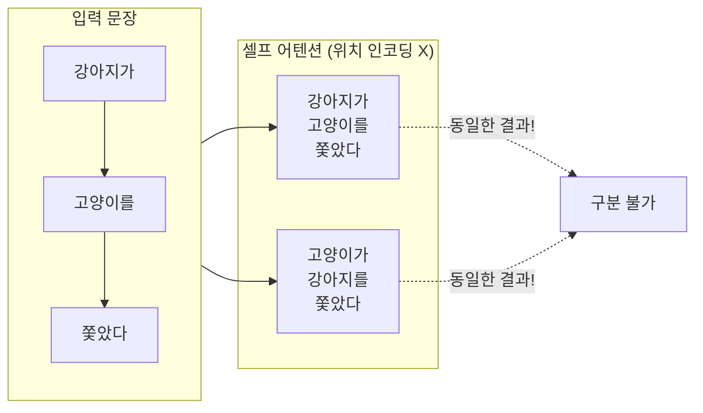
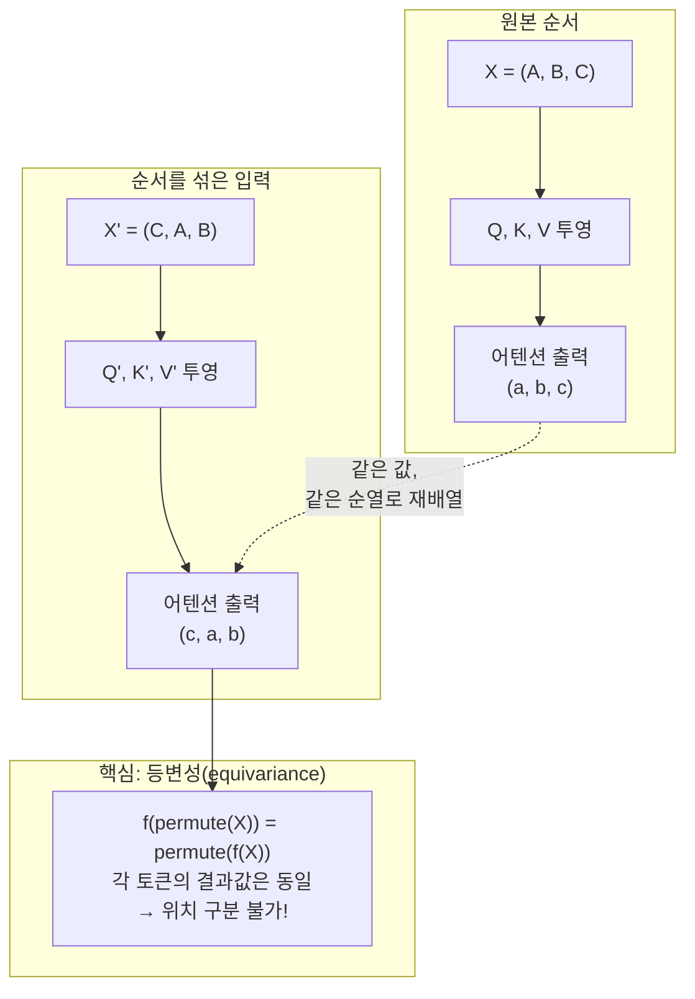
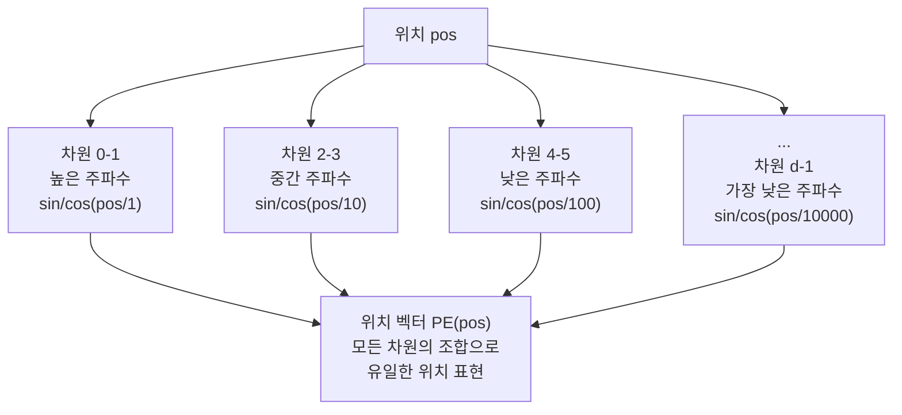
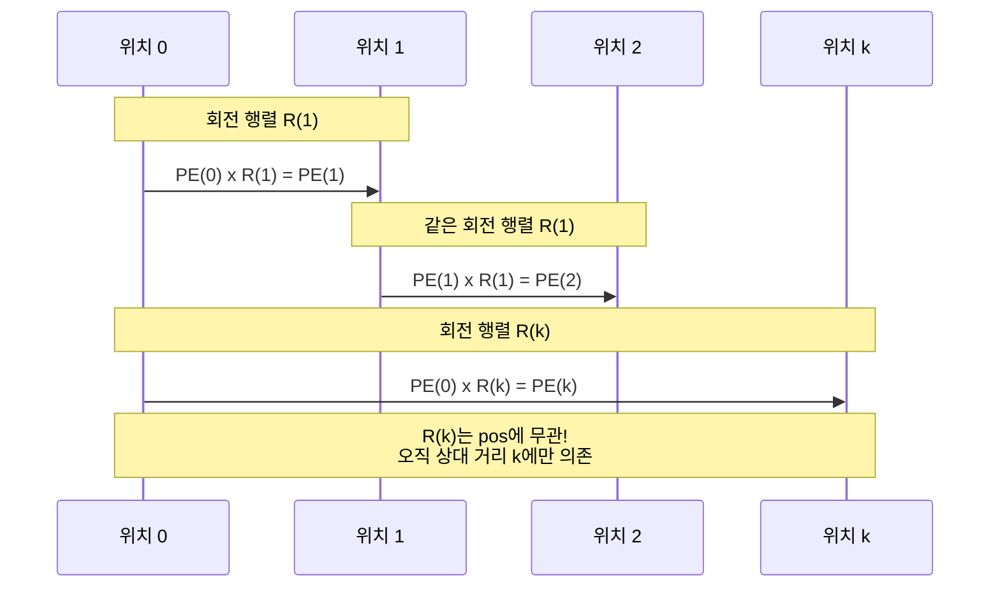
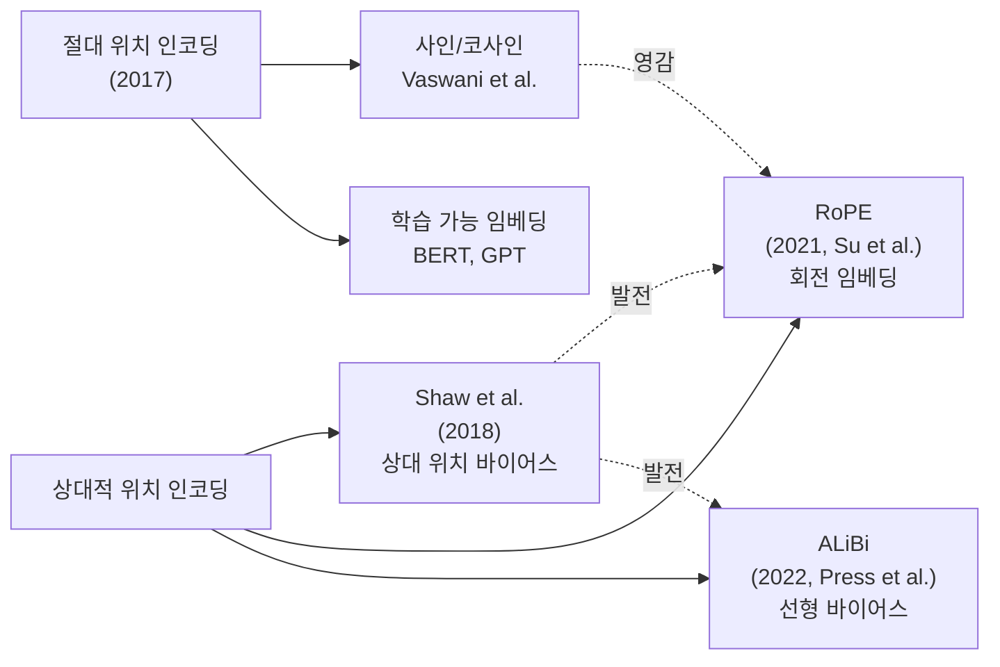

# 위치 인코딩

> 트랜스포머가 토큰의 순서를 인식하는 비밀 — 사인/코사인 함수로 위치 정보를 주입하는 원리

## 개요

이 섹션에서는 트랜스포머 아키텍처의 근본적인 특성 — **순열 등변성(permutation equivariance)** — 이 왜 위치 인코딩(Positional Encoding)을 필요로 하는지를 다룹니다. 셀프 어텐션은 토큰의 "내용"만 보지, "어디에 있는지"는 모릅니다. 입력 순서를 바꾸면 출력도 같은 순서로 바뀔 뿐, 각 토큰이 받는 정보는 동일하죠. 위치 인코딩이 없다면 "강아지가 고양이를 쫓았다"와 "고양이가 강아지를 쫓았다"를 구분할 수 없습니다.

**선수 지식**: [멀티헤드 어텐션](13-트랜스포머-아키텍처-심층-분석/03-03-멀티헤드-어텐션.md)에서 배운 Q, K, V 투영과 어텐션 연산 과정

**학습 목표**:
- 셀프 어텐션이 왜 위치 정보를 잃는지 수학적으로 이해한다
- 사인/코사인 위치 인코딩의 공식과 직관을 파악한다
- 학습 가능한 위치 임베딩과의 차이를 비교한다
- 상대적 위치 인코딩(RoPE, ALiBi)의 핵심 아이디어를 이해한다

## 왜 알아야 할까?

"나는 너를 사랑해"와 "너는 나를 사랑해"는 같은 단어 집합이지만 의미가 완전히 다릅니다. 인간은 어순을 자연스럽게 인식하지만, [셀프 어텐션](12-어텐션-메커니즘/05-05-셀프-어텐션으로의-확장.md)은 본질적으로 **집합(set) 연산**입니다. 입력 토큰의 순서를 바꾸면 출력도 같은 순서로 재배열될 뿐, 각 토큰이 받는 어텐션 가중치 자체는 동일하죠.

RNN은 시간 축을 따라 순차적으로 처리하니 자연스럽게 순서를 알았습니다. 하지만 트랜스포머는 모든 토큰을 **동시에** 처리하기에, 별도의 위치 신호를 주입하지 않으면 문장이 아니라 "단어 주머니"를 처리하는 셈이 됩니다. 위치 인코딩은 트랜스포머가 **시퀀스**를 다룰 수 있게 만드는 핵심 장치입니다.

> 📊 **그림 1**: 위치 인코딩이 없으면 트랜스포머가 겪는 문제



## 핵심 개념

### 개념 1: 셀프 어텐션의 순열 등변성

> 💡 **비유**: 셀프 어텐션은 "이름표만 보고 관계를 파악하는 파티 호스트"와 같습니다. 손님들이 어떤 순서로 들어왔는지는 모르고, 이름표(토큰 임베딩)만 보고 누가 누구와 어울릴지 결정하죠. "1번 테이블의 철수"와 "5번 테이블의 철수"를 구분하려면, 테이블 번호(위치 정보)를 이름표에 적어줘야 합니다.

수학적으로 확인해 봅시다. 어텐션 함수는 다음과 같죠:

$$\text{Attention}(Q, K, V) = \text{softmax}\left(\frac{QK^T}{\sqrt{d_k}}\right)V$$

입력 시퀀스 $X = [x_1, x_2, \ldots, x_n]$의 순서를 임의로 바꾼 $X' = [x_{\pi(1)}, x_{\pi(2)}, \ldots, x_{\pi(n)}]$에 대해, Q, K, V는 선형 변환이므로:

$$Q' = X'W_Q, \quad K' = X'W_K, \quad V' = X'W_V$$

결과적으로 어텐션 출력도 같은 순열(permutation)이 적용됩니다. 이것이 **순열 등변성(permutation equivariance)** 입니다. 등변성은 불변성(invariance)과 다릅니다:

- **불변성(invariance)**: 입력 순서를 바꿔도 출력이 **완전히 동일** — $f(\pi X) = f(X)$
- **등변성(equivariance)**: 입력 순서를 바꾸면 출력도 **같은 순서로 재배열** — $f(\pi X) = \pi f(X)$

셀프 어텐션은 등변(equivariant)합니다. 입력을 (A, B, C)에서 (C, A, B)로 섞으면, 출력도 (c, a, b)로 같은 순서로 섞이죠. 각 토큰이 받는 어텐션 가중치 자체는 변하지 않습니다. 즉, 순서를 바꿔도 모델이 학습하는 토큰 간 관계에는 아무런 차이가 없는 것입니다.

> 📊 **그림 2**: 순열 등변성의 수학적 의미 — 입력을 섞으면 출력도 같은 패턴으로 섞인다



이 문제를 해결하는 가장 직관적인 방법은 **입력 임베딩에 위치 정보를 더해주는 것**입니다:

$$\text{input}_i = \text{token\_embedding}_i + \text{positional\_encoding}_i$$

```python
import torch
import torch.nn as nn

# 위치 인코딩의 기본 아이디어: 토큰 임베딩 + 위치 정보
d_model = 512
seq_len = 10

token_embedding = nn.Embedding(1000, d_model)  # 토큰 임베딩
# 위치 인코딩은 각 위치마다 고유한 d_model 차원 벡터
# 이 벡터를 토큰 임베딩에 "더해서" 위치 정보 주입
```

### 개념 2: 사인/코사인 위치 인코딩

> 💡 **비유**: 시계를 떠올려 보세요. 초침은 60초마다 한 바퀴, 분침은 60분마다 한 바퀴, 시침은 12시간마다 한 바퀴 돕니다. 현재 시각은 이 세 바늘의 **조합**으로 유일하게 결정되죠. 사인/코사인 위치 인코딩도 같은 원리입니다 — 서로 다른 주파수의 사인파를 조합하여 각 위치를 유일하게 표현합니다.

Vaswani et al.(2017)이 "Attention Is All You Need"에서 제안한 공식은 다음과 같습니다:

$$PE_{(pos, 2i)} = \sin\left(\frac{pos}{10000^{2i/d_{model}}}\right)$$

$$PE_{(pos, 2i+1)} = \cos\left(\frac{pos}{10000^{2i/d_{model}}}\right)$$

여기서:
- $pos$: 시퀀스에서 토큰의 위치 (0, 1, 2, ...)
- $i$: 임베딩 벡터의 차원 인덱스 (0, 1, ..., $d_{model}/2 - 1$)
- $d_{model}$: 임베딩 차원 (원논문에서 512)

**핵심 직관**: 차원 인덱스 $i$가 커질수록 $10000^{2i/d_{model}}$이 커지면서 파동의 **주기가 길어집니다**. 낮은 차원은 빠르게 진동하여 인접 위치를 구분하고, 높은 차원은 느리게 진동하여 먼 위치 간 관계를 포착합니다.

> 📊 **그림 3**: 사인/코사인 위치 인코딩의 다중 주파수 구조



PyTorch로 구현해 봅시다:

```run:python
import torch
import math

def sinusoidal_positional_encoding(max_len, d_model):
    """사인/코사인 위치 인코딩 생성"""
    pe = torch.zeros(max_len, d_model)
    position = torch.arange(0, max_len, dtype=torch.float).unsqueeze(1)  # (max_len, 1)
    
    # 분모 계산: 10000^(2i/d_model) → exp(2i * -log(10000) / d_model)
    div_term = torch.exp(
        torch.arange(0, d_model, 2).float() * (-math.log(10000.0) / d_model)
    )  # (d_model/2,)
    
    pe[:, 0::2] = torch.sin(position * div_term)  # 짝수 차원: sin
    pe[:, 1::2] = torch.cos(position * div_term)  # 홀수 차원: cos
    
    return pe

# d_model=16으로 작은 예제
pe = sinusoidal_positional_encoding(max_len=8, d_model=16)
print(f"위치 인코딩 크기: {pe.shape}")
print(f"\n위치 0 벡터 (앞 8차원): {pe[0, :8].tolist()}")
print(f"위치 1 벡터 (앞 8차원): {pe[1, :8].tolist()}")
print(f"\n위치 0과 1의 코사인 유사도: {torch.cosine_similarity(pe[0], pe[1], dim=0):.4f}")
print(f"위치 0과 7의 코사인 유사도: {torch.cosine_similarity(pe[0], pe[7], dim=0):.4f}")
```

```output
위치 인코딩 크기: torch.Size([8, 16])

위치 0 벡터 (앞 8차원): [0.0, 1.0, 0.0, 1.0, 0.0, 1.0, 0.0, 1.0]
위치 1 벡터 (앞 8차원): [0.8414709568023682, 0.5403022766113281, 0.38268342614173889, 0.9238795042037964, 0.14943812787532806, 0.9887710809707642, 0.056070491671562195, 0.9984266757965088]

위치 0과 1의 코사인 유사도: 0.8577
위치 0과 7의 코사인 유사도: 0.5498
```

인접한 위치(0과 1)의 유사도가 먼 위치(0과 7)보다 높다는 것을 확인할 수 있습니다. 위치 인코딩이 "거리 감각"을 자연스럽게 부여하는 거죠.

### 개념 3: 상대적 위치를 표현하는 수학적 마법

> 💡 **비유**: GPS 좌표로 비유하면, 절대 위치 인코딩은 "서울시 강남구 역삼동 123번지"처럼 절대 주소를 부여하는 것이고, 사인/코사인의 특별한 성질은 "여기서 동쪽으로 3블록"처럼 **상대적 이동**도 표현할 수 있다는 뜻입니다.

사인/코사인 위치 인코딩의 가장 중요한 성질은 다음과 같습니다:

$$PE_{pos+k}$$는 $PE_{pos}$의 **선형 변환**으로 표현할 수 있다.

구체적으로, 임의의 고정 오프셋 $k$에 대해:

$$\begin{bmatrix} \sin(\omega_i(pos+k)) \\ \cos(\omega_i(pos+k)) \end{bmatrix} = \begin{bmatrix} \cos(\omega_i k) & \sin(\omega_i k) \\ -\sin(\omega_i k) & \cos(\omega_i k) \end{bmatrix} \begin{bmatrix} \sin(\omega_i \cdot pos) \\ \cos(\omega_i \cdot pos) \end{bmatrix}$$

여기서 $\omega_i = 1/10000^{2i/d_{model}}$입니다.

이것은 **회전 행렬**입니다! 고정된 오프셋 $k$에 대한 변환 행렬은 위치 $pos$에 의존하지 않으므로, 모델이 상대적 위치 관계를 학습하기 쉽습니다.

> 📊 **그림 4**: 사인/코사인의 상대적 위치 표현 원리



```run:python
import torch
import math

def verify_rotation_property(pos, k, dim_i, d_model=512):
    """사인/코사인의 회전 행렬 성질을 검증"""
    omega = 1.0 / (10000 ** (2 * dim_i / d_model))
    
    # 직접 계산: PE(pos+k)
    direct_sin = math.sin(omega * (pos + k))
    direct_cos = math.cos(omega * (pos + k))
    
    # 회전 행렬로 계산: R(k) @ PE(pos)
    pe_sin = math.sin(omega * pos)
    pe_cos = math.cos(omega * pos)
    
    rot_sin = math.cos(omega * k) * pe_sin + math.sin(omega * k) * pe_cos
    rot_cos = -math.sin(omega * k) * pe_sin + math.cos(omega * k) * pe_cos
    
    print(f"차원 i={dim_i}, pos={pos}, k={k}")
    print(f"  직접 계산  : sin={direct_sin:.6f}, cos={direct_cos:.6f}")
    print(f"  회전 행렬  : sin={rot_sin:.6f}, cos={rot_cos:.6f}")
    print(f"  일치 여부  : {abs(direct_sin - rot_sin) < 1e-10 and abs(direct_cos - rot_cos) < 1e-10}")

verify_rotation_property(pos=5, k=3, dim_i=0)
verify_rotation_property(pos=5, k=3, dim_i=100)
verify_rotation_property(pos=42, k=7, dim_i=50)
```

```output
차원 i=0, pos=5, k=3
  직접 계산  : sin=0.989358, cos=-0.145500
  회전 행렬  : sin=0.989358, cos=-0.145500
  일치 여부  : True
차원 i=100, pos=5, k=3
  직접 계산  : sin=0.003030, cos=0.999995
  회전 행렬  : sin=0.003030, cos=0.999995
  일치 여부  : True
차원 i=50, pos=42, k=7
  직접 계산  : sin=0.178948, cos=0.983862
  회전 행렬  : sin=0.178948, cos=0.983862
  일치 여부  : True
```

### 개념 4: 학습 가능한 위치 임베딩

> 💡 **비유**: 사인/코사인 위치 인코딩이 "미리 정해진 좌석 번호"라면, 학습 가능한 위치 임베딩은 "파티에서 자연스럽게 정해지는 자리"와 같습니다. 처음엔 아무 자리나 앉지만, 여러 번 파티를 겪으면서 최적의 자리 배치가 학습되는 거죠.

학습 가능한 위치 임베딩은 각 위치에 대한 벡터를 **파라미터로 직접 학습**합니다. BERT, GPT 계열이 이 방식을 채택했죠.

```python
import torch.nn as nn

class LearnedPositionalEmbedding(nn.Module):
    def __init__(self, max_len, d_model):
        super().__init__()
        # 각 위치에 대한 임베딩을 학습 가능한 파라미터로 정의
        self.embedding = nn.Embedding(max_len, d_model)
    
    def forward(self, x):
        # x: (batch_size, seq_len, d_model)
        seq_len = x.size(1)
        positions = torch.arange(seq_len, device=x.device)  # [0, 1, 2, ..., seq_len-1]
        return x + self.embedding(positions)  # 토큰 임베딩 + 위치 임베딩
```

두 방식의 핵심 차이를 정리하면:

| 특성 | 사인/코사인 (고정) | 학습 가능 (Learned) |
|------|-------------------|-------------------|
| 파라미터 수 | 0 (수식으로 생성) | max_len × d_model |
| 학습 시 미본 길이 | 자연스럽게 외삽 가능 | 외삽 불가 (학습 범위 초과 시 실패) |
| 상대 위치 표현 | 회전 행렬로 내재 | 명시적이지 않음 |
| 태스크 적응성 | 고정 (태스크 무관) | 태스크에 맞게 최적화 |
| 실제 성능 | 원논문에서 학습 가능과 거의 동일 | BERT, GPT에서 채택 |

> ⚠️ **흔한 오해**: "학습 가능한 위치 임베딩이 항상 더 좋다"고 생각하기 쉽지만, 원논문에서도 두 방식의 성능 차이는 거의 없었습니다. 학습 가능한 임베딩은 학습 시 본 최대 길이를 넘는 시퀀스에 대해서는 무력해진다는 치명적 단점이 있습니다.

### 개념 5: 상대적 위치 인코딩 — RoPE와 ALiBi

사인/코사인과 학습 가능 임베딩 모두 **절대 위치**(absolute position)를 입력에 더하는 방식입니다. 그런데 언어에서 중요한 것은 종종 "3번째 토큰"이라는 절대 위치보다 "현재 토큰에서 2칸 앞"이라는 **상대 거리**입니다. 이 발상에서 상대적 위치 인코딩이 탄생했습니다.

> 📊 **그림 5**: 위치 인코딩 방식의 진화



**RoPE (Rotary Position Embedding)**: 사인/코사인의 회전 행렬 아이디어를 발전시킨 방식입니다. 위치 정보를 입력에 더하는 대신, Q와 K 벡터를 위치에 비례한 각도만큼 **회전**시킵니다. 두 토큰의 어텐션 스코어 $q_m^T k_n$이 자동으로 상대 거리 $m - n$에만 의존하게 됩니다. LLaMA, Gemma 등 최신 LLM의 표준으로 자리잡았습니다.

**ALiBi (Attention with Linear Biases)**: 위치 인코딩을 입력이 아닌 **어텐션 스코어에** 직접 추가합니다. $\text{score}_{ij} = q_i^T k_j - m \cdot |i - j|$ 형태로, 거리에 비례하는 선형 페널티를 주는 것이죠. 학습 파라미터가 전혀 없으면서도 긴 시퀀스 외삽 성능이 뛰어납니다.

```python
# RoPE의 핵심 아이디어 (간소화)
def apply_rope(x, positions, d_model):
    """Rotary Position Embedding 적용 (개념 코드)"""
    # 각 차원 쌍 (2i, 2i+1)에 대해 위치별 각도 계산
    freqs = 1.0 / (10000 ** (torch.arange(0, d_model, 2).float() / d_model))
    angles = positions.unsqueeze(-1) * freqs  # (seq_len, d_model/2)
    
    # 벡터를 회전: (x_2i, x_2i+1) 쌍을 angle만큼 회전
    cos_angles = torch.cos(angles)
    sin_angles = torch.sin(angles)
    
    x_even = x[..., 0::2] * cos_angles - x[..., 1::2] * sin_angles
    x_odd  = x[..., 0::2] * sin_angles + x[..., 1::2] * cos_angles
    
    return torch.stack([x_even, x_odd], dim=-1).flatten(-2)
```

## 실습: 직접 해보기

사인/코사인 위치 인코딩을 완전한 PyTorch 모듈로 구현하고, 그 특성을 분석해 봅시다.

```run:python
import torch
import torch.nn as nn
import math

class PositionalEncoding(nn.Module):
    """트랜스포머용 사인/코사인 위치 인코딩"""
    
    def __init__(self, d_model, max_len=5000, dropout=0.1):
        super().__init__()
        self.dropout = nn.Dropout(p=dropout)
        
        # 위치 인코딩 행렬 생성 (학습되지 않는 고정 버퍼)
        pe = torch.zeros(max_len, d_model)
        position = torch.arange(0, max_len, dtype=torch.float).unsqueeze(1)
        div_term = torch.exp(
            torch.arange(0, d_model, 2).float() * (-math.log(10000.0) / d_model)
        )
        
        pe[:, 0::2] = torch.sin(position * div_term)
        pe[:, 1::2] = torch.cos(position * div_term)
        pe = pe.unsqueeze(0)  # (1, max_len, d_model) — 배치 차원 추가
        
        # register_buffer: 학습 파라미터가 아닌 상수 텐서로 등록
        self.register_buffer('pe', pe)
    
    def forward(self, x):
        """x: (batch_size, seq_len, d_model)"""
        x = x + self.pe[:, :x.size(1), :]
        return self.dropout(x)

# 모듈 테스트
d_model = 64
pos_enc = PositionalEncoding(d_model=d_model, max_len=100, dropout=0.0)

# 더미 토큰 임베딩
dummy_input = torch.zeros(1, 10, d_model)
output = pos_enc(dummy_input)

print(f"입력 크기: {dummy_input.shape}")
print(f"출력 크기: {output.shape}")
print(f"위치 0의 L2 노름: {output[0, 0].norm():.4f}")
print(f"위치 9의 L2 노름: {output[0, 9].norm():.4f}")

# 위치 간 유사도 패턴 분석
pe_matrix = pos_enc.pe[0, :10, :]  # 첫 10개 위치
similarity = torch.cosine_similarity(
    pe_matrix.unsqueeze(0), pe_matrix.unsqueeze(1), dim=-1
)
print(f"\n위치 간 코사인 유사도 (10x10 행렬의 첫 5행):")
for i in range(5):
    row = [f"{similarity[i, j]:.2f}" for j in range(5)]
    print(f"  위치 {i}: {row}")
```

```output
입력 크기: torch.Size([1, 10, 64])
출력 크기: torch.Size([1, 10, 64])
위치 0의 L2 노름: 5.6569
위치 9의 L2 노름: 5.6569
위치 간 코사인 유사도 (10x10 행렬의 첫 5행):
  위치 0: ['1.00', '0.86', '0.57', '0.28', '0.05']
  위치 1: ['0.86', '1.00', '0.86', '0.57', '0.28']
  위치 2: ['0.57', '0.86', '1.00', '0.86', '0.57']
  위치 3: ['0.28', '0.57', '0.86', '1.00', '0.86']
  위치 4: ['0.05', '0.28', '0.57', '0.86', '1.00']
```

결과를 보면 두 가지 중요한 패턴이 보입니다:

1. **L2 노름 일정**: 모든 위치의 인코딩 벡터 크기가 동일합니다. 특정 위치가 과도한 영향을 미치지 않죠.
2. **유사도 대칭 감소**: 대각선(자기 자신)에서 멀어질수록 유사도가 줄어들고, 같은 거리면 같은 유사도입니다 (Toeplitz 행렬). 이것이 바로 상대적 위치를 표현하는 성질입니다.

## 더 깊이 알아보기

### 왜 사인/코사인이었을까? — 위치 인코딩의 탄생 이야기

Vaswani et al.이 사인/코사인을 선택한 배경에는 흥미로운 아이디어가 있습니다. 이진수 카운터를 생각해 보세요:

| 위치 | bit 3 | bit 2 | bit 1 | bit 0 |
|------|-------|-------|-------|-------|
| 0 | 0 | 0 | 0 | 0 |
| 1 | 0 | 0 | 0 | 1 |
| 2 | 0 | 0 | 1 | 0 |
| 3 | 0 | 0 | 1 | 1 |
| 4 | 0 | 1 | 0 | 0 |

각 비트는 서로 다른 주기로 0과 1을 반복합니다 — bit 0은 매번, bit 1은 2번마다, bit 2는 4번마다. 사인/코사인 위치 인코딩은 이 이진 카운터의 **연속 버전(continuous analog)** 입니다. 불연속적인 0/1 대신 부드러운 사인파를 사용하여 신경망이 학습하기 쉬운 형태로 만든 것이죠.

> 💡 **알고 계셨나요?**: "Attention Is All You Need" 논문의 원래 제목 후보 중 하나는 "Transformers: Iterative Self-Attention and Processing for Various NLP Tasks"였다고 합니다. 최종 제목은 당시로서는 대담한 주장이었지만, 결과적으로 NLP 역사상 가장 유명한 논문 제목이 되었죠. 2024년 기준 이 논문의 인용 수는 13만 건을 넘어섰습니다.

### 푸리에 변환과의 연결

사인/코사인 위치 인코딩은 본질적으로 **푸리에 기저(Fourier basis)** 의 아이디어와 맥닿아 있습니다. 푸리에 분석에서 임의의 신호를 서로 다른 주파수의 사인/코사인 합으로 분해하듯, 위치 인코딩도 각 위치를 다양한 주파수 성분의 조합으로 표현합니다. 이를 통해 $d_{model}$ 차원 안에서 최대 $10000 \cdot 2\pi$ 길이까지의 시퀀스를 이론적으로 구분할 수 있습니다.

## 흔한 오해와 팁

> ⚠️ **흔한 오해**: "위치 인코딩은 곱하는 거 아닌가요?" — 아닙니다. 위치 인코딩은 토큰 임베딩에 **더하는(additive)** 방식입니다. 곱셈이 아닌 덧셈인 이유는, 덧셈이 원래 임베딩 정보를 더 잘 보존하면서도 위치 신호를 효과적으로 주입하기 때문입니다. 다만 RoPE처럼 회전(곱셈)을 사용하는 최신 방식도 있습니다.

> ⚠️ **흔한 오해**: "셀프 어텐션은 순서 **불변(invariant)** 이다"라는 설명을 종종 볼 수 있는데, 엄밀히 말하면 **등변(equivariant)** 입니다. 불변은 출력이 아예 바뀌지 않는 것이고($f(\pi X) = f(X)$), 등변은 입력을 섞은 만큼 출력도 섞이는 것입니다($f(\pi X) = \pi f(X)$). 평균 풀링처럼 집계 연산을 거치면 비로소 불변이 되죠. 실무에서는 둘 다 "순서를 모른다"는 같은 문제를 일으키지만, 논문을 읽을 때 구분해 두면 도움이 됩니다.

> 💡 **알고 계셨나요?**: 원논문에서 `register_buffer`를 사용한 이유가 있습니다. 위치 인코딩은 학습하지 않는 상수이지만, 모델이 GPU로 이동할 때 함께 이동해야 하고, `state_dict`에 저장되어야 합니다. `nn.Parameter`로 등록하면 역전파 시 불필요하게 그래디언트가 계산되므로, `register_buffer`가 정답입니다.

> 🔥 **실무 팁**: 위치 인코딩 뒤에 **Dropout**을 적용하는 것이 원논문의 설계입니다. 이는 모델이 특정 위치에 과도하게 의존하는 것을 방지합니다. 원논문에서는 0.1의 dropout rate를 사용했으며, 이 작은 수치가 일반화 성능에 꽤 큰 기여를 합니다.

## 핵심 정리

| 개념 | 설명 |
|------|------|
| 순열 등변성 | 셀프 어텐션은 입력 순서를 바꾸면 출력도 같은 순서로 재배열 → 위치 정보 주입 필수 |
| 사인/코사인 PE | $\sin(pos/10000^{2i/d})$, $\cos(pos/10000^{2i/d})$ — 다중 주파수로 위치를 유일하게 표현 |
| 상대 위치 표현 | $PE_{pos+k}$가 $PE_{pos}$의 회전 변환 → 모델이 상대 거리를 쉽게 학습 |
| 학습 가능 임베딩 | `nn.Embedding(max_len, d_model)` — 유연하지만 미본 길이에 외삽 불가 |
| RoPE | Q, K를 위치 비례 각도로 회전 — 상대 위치 인코딩의 현대적 표준 |
| ALiBi | 어텐션 스코어에 거리 비례 선형 바이어스 추가 — 파라미터 없이 외삽 우수 |

## 다음 섹션 미리보기

위치 인코딩으로 토큰의 순서를 알게 된 트랜스포머는, 이제 어텐션 출력을 더 풍부한 표현으로 변환해야 합니다. [피드포워드 네트워크와 정규화](13-트랜스포머-아키텍처-심층-분석/05-05-피드포워드-네트워크와-정규화.md)에서는 각 레이어의 FFN(Feed-Forward Network)이 어텐션이 포착한 관계를 비선형 변환으로 강화하는 과정, 그리고 레이어 정규화와 잔차 연결이 깊은 트랜스포머의 안정적 학습을 가능케 하는 원리를 다룹니다.

## 참고 자료

- [Attention Is All You Need (Vaswani et al., 2017)](https://arxiv.org/abs/1706.03762) - 트랜스포머와 사인/코사인 위치 인코딩을 제안한 원논문
- [A Gentle Introduction to Positional Encoding in Transformer Models - Machine Learning Mastery](https://machinelearningmastery.com/a-gentle-introduction-to-positional-encoding-in-transformer-models-part-1/) - 위치 인코딩의 수학적 직관을 시각적으로 설명한 튜토리얼
- [RoFormer: Enhanced Transformer with Rotary Position Embedding (Su et al., 2021)](https://arxiv.org/abs/2104.09864) - RoPE를 제안한 원논문, LLaMA 등 최신 LLM의 위치 인코딩 표준
- [You Could Have Designed State of the Art Positional Encoding - Hugging Face Blog](https://huggingface.co/blog/designing-positional-encoding) - 다양한 위치 인코딩 방식의 직관적 비교와 설계 원리
- [Positional Embeddings in Transformers: A Math Guide to RoPE & ALiBi - Towards Data Science](https://towardsdatascience.com/positional-embeddings-in-transformers-a-math-guide-to-rope-alibi/) - RoPE와 ALiBi의 수학적 원리를 상세히 다룬 가이드

---
### 🔗 Related Sessions
- [scaled_dot_product_attention](13-트랜스포머-아키텍처-심층-분석/02-02-스케일드-닷-프로덕트-어텐션.md) (prerequisite)
- [query_key_value](12-어텐션-메커니즘/01-01-어텐션의-직관적-이해.md) (prerequisite)
- [multi_head_attention](13-트랜스포머-아키텍처-심층-분석/03-03-멀티헤드-어텐션.md) (prerequisite)
- [d_model](13-트랜스포머-아키텍처-심층-분석/01-01-트랜스포머-아키텍처-전체-조망.md) (prerequisite)
