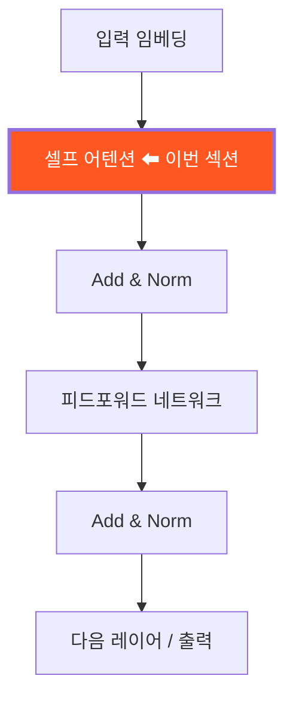
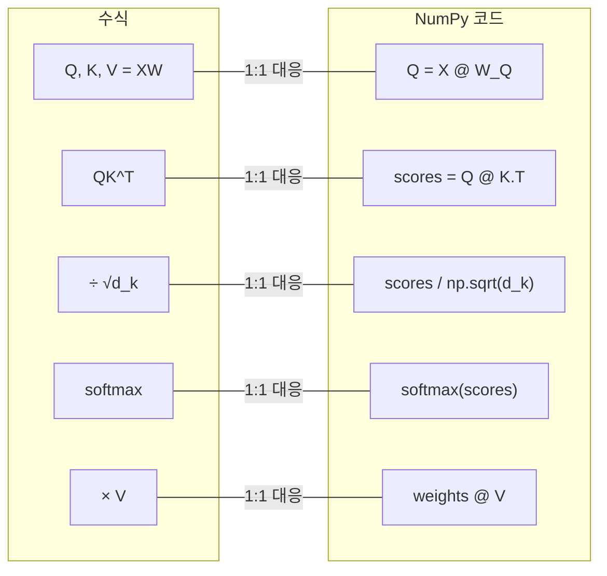
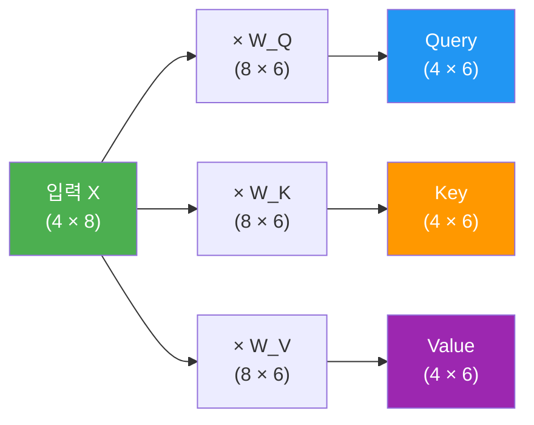
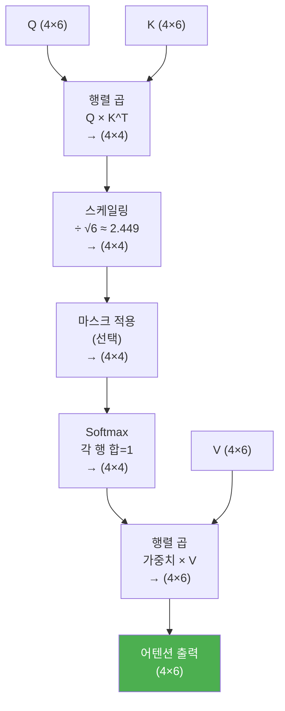
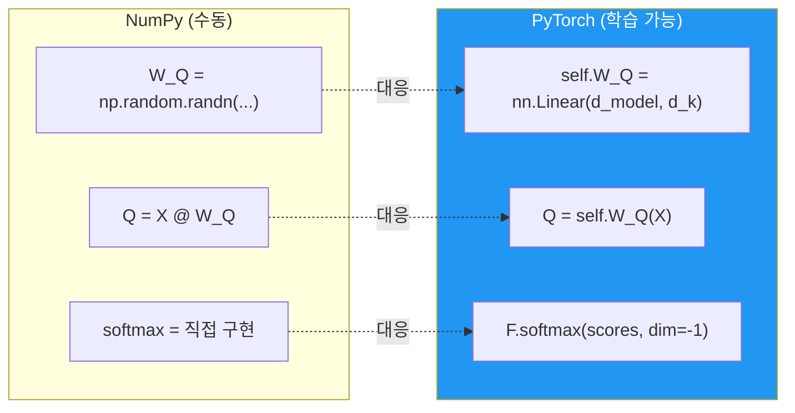

# 셀프 어텐션 직접 구현

> NumPy와 PyTorch로 Scaled Dot-Product Attention을 한 줄 한 줄 직접 구현하며 어텐션의 내부 동작을 체화합니다.

## 개요

이 섹션에서는 [스케일드 닷-프로덕트 어텐션](13-ch13-트랜스포머-아키텍처-심층-분석/02-02-스케일드-닷-프로덕트-어텐션.md)에서 배운 수식을 **실제 코드로 옮기는 데** 집중합니다. NumPy로 단계별 구현을 거쳐 PyTorch `nn.Module`로 변환하는 과정을 통해, 수식의 각 기호가 코드의 어떤 라인에 대응하는지 손으로 직접 확인하는 시간입니다.

**선수 지식**: [스케일드 닷-프로덕트 어텐션](13-ch13-트랜스포머-아키텍처-심층-분석/02-02-스케일드-닷-프로덕트-어텐션.md)의 수식 이해, [PyTorch 텐서와 연산](07-ch7-pytorch-기초와-신경망-입문/01-01-pytorch-텐서와-연산.md) 기초

**학습 목표**:
- Q, K, V 행렬이 입력 임베딩에서 어떻게 생성되는지 코드로 이해한다
- Scaled Dot-Product Attention의 각 단계를 NumPy로 구현할 수 있다
- NumPy 구현을 PyTorch `nn.Module`로 변환할 수 있다

## 왜 알아야 할까?

트랜스포머를 "사용"하는 것과 "이해"하는 것은 완전히 다른 차원이에요. Hugging Face에서 `BertModel.from_pretrained()`를 호출하면 어텐션이 자동으로 돌아가지만, 모델이 이상하게 동작할 때 디버깅하려면 내부를 알아야 합니다.

셀프 어텐션을 직접 구현하면 세 가지를 얻습니다:

1. **논문 읽기 능력** — "Attention Is All You Need" 논문의 수식이 코드와 1:1로 대응됨을 체감합니다
2. **디버깅 직관** — 어텐션 가중치가 왜 특정 토큰에 집중하는지, 중간 텐서의 shape을 추적할 수 있습니다
3. **커스텀 능력** — 표준 어텐션을 변형한 Sparse Attention, Linear Attention 등을 직접 만들 수 있는 기반이 됩니다

> 📊 **그림 1**: 셀프 어텐션이 트랜스포머에서 차지하는 위치



## 핵심 개념

### 개념 1: 수식에서 코드로 — 대응 관계 파악

[이전 섹션](13-ch13-트랜스포머-아키텍처-심층-분석/02-02-스케일드-닷-프로덕트-어텐션.md)에서 Scaled Dot-Product Attention의 수식을 상세히 다뤘습니다. 이번에는 그 수식을 코드로 번역하는 데 집중할 텐데요, 핵심 수식을 한 번만 상기하고 바로 구현으로 넘어가겠습니다:

$$\text{Attention}(Q, K, V) = \text{softmax}\left(\frac{QK^T}{\sqrt{d_k}}\right) V$$

이 한 줄의 수식이 코드로 어떻게 펼쳐지는지가 이번 섹션의 핵심이에요.

> 📊 **그림 2**: 수식의 각 부분이 코드 라인에 대응하는 관계



보시다시피 수식의 각 기호가 코드 한 줄에 정확히 매핑됩니다. 이것이 어텐션이 구현하기 "의외로 간단한" 이유예요.

### 개념 2: Q, K, V 생성 구현

> 💡 **비유**: 도서관에서 책을 찾는 과정을 떠올려보세요. 여러분이 "딥러닝 입문서"를 찾고 싶다면:
> - **Query(Q)**: "딥러닝 입문서 어디 있지?" — 여러분의 질문
> - **Key(K)**: 각 책꽂이의 분류 라벨 — "인공지능", "수학", "프로그래밍"
> - **Value(V)**: 실제 책꽂이에 꽂힌 책들 — 실제 정보
>
> Query와 Key를 비교해서 가장 관련 높은 책꽂이를 찾고(어텐션 가중치), 그 책꽂이의 책(Value)을 가져오는 겁니다.

셀프 어텐션에서 Q, K, V는 모두 **같은 입력**에서 만들어집니다. 코드로 보면 단순한 행렬 곱이에요:

```python
import numpy as np

np.random.seed(42)

# 설정: 시퀀스 길이 4, 임베딩 차원 8, 어텐션 차원 6
seq_len = 4
d_model = 8
d_k = 6  # Query, Key 차원
d_v = 6  # Value 차원

# 입력 임베딩 (실제로는 토큰 임베딩 + 위치 인코딩)
X = np.random.randn(seq_len, d_model)

# 가중치 행렬 초기화 (실제로는 학습으로 최적화됨)
W_Q = np.random.randn(d_model, d_k) * 0.1  # Xavier-like 스케일링
W_K = np.random.randn(d_model, d_k) * 0.1
W_V = np.random.randn(d_model, d_v) * 0.1

# Q, K, V 생성 — 수식의 Q=XW^Q, K=XW^K, V=XW^V
Q = X @ W_Q  # (4, 6) - 각 토큰의 "질문"
K = X @ W_K  # (4, 6) - 각 토큰의 "열쇠"
V = X @ W_V  # (4, 6) - 각 토큰의 "정보"
```

```run:python
import numpy as np
np.random.seed(42)

seq_len, d_model, d_k, d_v = 4, 8, 6, 6
X = np.random.randn(seq_len, d_model)
W_Q = np.random.randn(d_model, d_k) * 0.1
W_K = np.random.randn(d_model, d_k) * 0.1
W_V = np.random.randn(d_model, d_v) * 0.1

Q = X @ W_Q
K = X @ W_K
V = X @ W_V

print(f"X shape: {X.shape}")
print(f"Q shape: {Q.shape}")
print(f"K shape: {K.shape}")
print(f"V shape: {V.shape}")
print(f"\n입력 X → 세 가지 다른 '관점'으로 변환 완료!")
```

```output
X shape: (4, 8)
Q shape: (4, 6)
K shape: (4, 6)
V shape: (4, 6)

입력 X → 세 가지 다른 '관점'으로 변환 완료!
```

> 📊 **그림 3**: Q, K, V 행렬 생성 과정과 shape 변화



핵심은 이겁니다: **같은 입력 X에서 세 가지 다른 "관점"을 만든다**는 것. 가중치 행렬이 다르기 때문에 Q, K, V는 서로 다른 정보를 담게 됩니다. shape 추적이 중요한데 — `(seq_len, d_model) @ (d_model, d_k)` → `(seq_len, d_k)`로 차원이 변환되는 과정을 코드에서 직접 확인할 수 있죠.

### 개념 3: 어텐션 스코어와 softmax — 핵심 연산 구현

> 💡 **비유**: SNS에서 게시글(Query)을 올리면, 팔로워들(Key)이 각자 얼마나 관심 있는지 "좋아요 점수"를 매기는 것과 비슷합니다. 점수가 높을수록 그 사람의 댓글(Value)이 더 눈에 띄게 표시되죠.

스코어 계산부터 softmax까지를 한 번에 구현해봅시다. 스케일링이 왜 필요한지는 [이전 섹션](13-ch13-트랜스포머-아키텍처-심층-분석/02-02-스케일드-닷-프로덕트-어텐션.md)에서 자세히 다뤘으니, 여기서는 **구현 시 주의할 점**에 집중합니다:

```python
# 1단계: 스코어 = Q × K^T, 스케일링
scores = Q @ K.T / np.sqrt(d_k)  # (4, 4) - 한 줄로 끝!

# 2단계: softmax (수치 안정성 버전)
def softmax(x):
    """max를 빼서 오버플로 방지 — 구현 시 반드시 필요한 트릭"""
    exp_x = np.exp(x - np.max(x, axis=-1, keepdims=True))
    return exp_x / np.sum(exp_x, axis=-1, keepdims=True)

attention_weights = softmax(scores)

# 3단계: 가중 합산
output = attention_weights @ V  # (4, 6)
```

수식의 $\text{softmax}\left(\frac{QK^T}{\sqrt{d_k}}\right) V$가 코드 3줄로 완성되었습니다. 놀라울 정도로 간결하죠?

> ⚠️ **흔한 오해**: softmax 구현 시 `np.exp(x)`만 쓰면 큰 값에서 **오버플로**가 발생합니다. 반드시 `x - max(x)`를 빼서 수치 안정성을 확보해야 합니다. 수학적으로 결과는 동일하지만, 이 트릭 없이는 실제로 `NaN`이 뜹니다.

### 개념 4: 전체 파이프라인 조립과 중간 텐서 검증

이제 전체를 하나로 합치고, 각 단계의 shape과 값을 꼼꼼히 확인해봅시다. 구현 시 가장 중요한 습관은 **중간 텐서의 shape을 항상 확인**하는 것입니다.

> 📊 **그림 4**: Scaled Dot-Product Attention 전체 파이프라인과 shape 변화



```run:python
import numpy as np

np.random.seed(42)

# --- 전체 Scaled Dot-Product Attention (NumPy) ---
seq_len, d_model, d_k, d_v = 4, 8, 6, 6
X = np.random.randn(seq_len, d_model)
W_Q = np.random.randn(d_model, d_k) * 0.1
W_K = np.random.randn(d_model, d_k) * 0.1
W_V = np.random.randn(d_model, d_v) * 0.1

Q = X @ W_Q
K = X @ W_K
V = X @ W_V

# 1. 스코어 계산 + 스케일링
scores = Q @ K.T / np.sqrt(d_k)

# 2. Softmax
def softmax(x):
    exp_x = np.exp(x - np.max(x, axis=-1, keepdims=True))
    return exp_x / np.sum(exp_x, axis=-1, keepdims=True)

attention_weights = softmax(scores)

# 3. 가중 합산
output = attention_weights @ V

print(f"어텐션 가중치 (토큰 0이 다른 토큰에 주는 관심):")
print(f"  토큰0→토큰0: {attention_weights[0,0]:.3f}")
print(f"  토큰0→토큰1: {attention_weights[0,1]:.3f}")
print(f"  토큰0→토큰2: {attention_weights[0,2]:.3f}")
print(f"  토큰0→토큰3: {attention_weights[0,3]:.3f}")
print(f"  합계: {attention_weights[0].sum():.3f}")
print(f"\n최종 출력 shape: {output.shape}")
```

```output
어텐션 가중치 (토큰 0이 다른 토큰에 주는 관심):
  토큰0→토큰0: 0.260
  토큰0→토큰1: 0.196
  토큰0→토큰2: 0.283
  토큰0→토큰3: 0.261
  합계: 1.000

최종 출력 shape: (4, 6)
```

각 토큰의 어텐션 가중치 합이 정확히 1.0인 것을 확인할 수 있습니다. 이것은 "각 토큰이 다른 토큰들의 정보를 얼마나 참조할지"를 확률적으로 결정한 결과입니다. 이 랜덤 초기화 상태에서는 가중치가 비교적 균등한데, 학습이 진행되면 특정 토큰에 가중치가 집중되는 패턴이 나타납니다.

### 개념 5: PyTorch `nn.Module`로 변환 — 학습 가능하게 만들기

NumPy로 원리를 확인했으니, 이제 학습 가능한 PyTorch 모듈로 변환합니다. 핵심 차이점은 단 하나 — 가중치 행렬이 `nn.Linear` 레이어가 된다는 것입니다.

> 📊 **그림 5**: NumPy 구현과 PyTorch 모듈의 대응 관계



`nn.Linear`는 내부적으로 `X @ W.T`를 수행합니다. NumPy에서 `X @ W_Q`와 동일한 연산이지만, PyTorch가 자동으로 기울기를 추적하고 역전파 시 가중치를 업데이트해줍니다.

```python
import torch
import torch.nn as nn
import torch.nn.functional as F
import math

class ScaledDotProductAttention(nn.Module):
    """Scaled Dot-Product Attention (단일 헤드)"""

    def __init__(self, d_model, d_k, d_v):
        super().__init__()
        # 학습 가능한 선형 변환 (bias=False는 원 논문 설정)
        self.W_Q = nn.Linear(d_model, d_k, bias=False)
        self.W_K = nn.Linear(d_model, d_k, bias=False)
        self.W_V = nn.Linear(d_model, d_v, bias=False)
        self.d_k = d_k

    def forward(self, x, mask=None):
        """
        x: (batch_size, seq_len, d_model)
        mask: (batch_size, 1, seq_len) or None
        """
        # NumPy의 X @ W_Q → self.W_Q(x)로 대응
        Q = self.W_Q(x)  # (batch, seq_len, d_k)
        K = self.W_K(x)  # (batch, seq_len, d_k)
        V = self.W_V(x)  # (batch, seq_len, d_v)

        # NumPy의 Q @ K.T / sqrt(d_k) → 동일하지만 배치 차원 처리
        scores = torch.matmul(Q, K.transpose(-2, -1)) / math.sqrt(self.d_k)

        # 마스킹 (디코더에서 미래 토큰 차단 용도)
        if mask is not None:
            scores = scores.masked_fill(mask == 0, float('-inf'))

        # NumPy의 수동 softmax → F.softmax로 대응
        attention_weights = F.softmax(scores, dim=-1)

        # NumPy의 weights @ V → 동일
        output = torch.matmul(attention_weights, V)
        return output, attention_weights
```

NumPy 버전과 비교해보면 구조가 거의 동일하죠? 차이점은 `nn.Linear`가 가중치의 생성·초기화·기울기 추적을 모두 자동으로 해준다는 것뿐입니다.

## 실습: 직접 해보기

전체 코드를 합쳐서 PyTorch 모듈을 생성하고, 배치 입력과 마스킹까지 테스트해봅시다.

```run:python
import torch
import torch.nn as nn
import torch.nn.functional as F
import math

class ScaledDotProductAttention(nn.Module):
    def __init__(self, d_model, d_k, d_v):
        super().__init__()
        self.W_Q = nn.Linear(d_model, d_k, bias=False)
        self.W_K = nn.Linear(d_model, d_k, bias=False)
        self.W_V = nn.Linear(d_model, d_v, bias=False)
        self.d_k = d_k

    def forward(self, x, mask=None):
        Q = self.W_Q(x)
        K = self.W_K(x)
        V = self.W_V(x)

        scores = torch.matmul(Q, K.transpose(-2, -1)) / math.sqrt(self.d_k)

        if mask is not None:
            scores = scores.masked_fill(mask == 0, float('-inf'))

        attn_weights = F.softmax(scores, dim=-1)
        output = torch.matmul(attn_weights, V)
        return output, attn_weights

# --- 테스트 ---
torch.manual_seed(42)

d_model = 16   # 임베딩 차원
d_k = d_v = 8  # 어텐션 차원
batch_size = 2
seq_len = 5

# 모델 생성
attn = ScaledDotProductAttention(d_model, d_k, d_v)

# 랜덤 입력 (배치 2, 시퀀스 5, 임베딩 16)
x = torch.randn(batch_size, seq_len, d_model)

# 순전파
output, weights = attn(x)

print(f"입력 shape:       {x.shape}")
print(f"출력 shape:       {output.shape}")
print(f"가중치 shape:     {weights.shape}")
print(f"\n배치 0, 토큰 0의 어텐션 가중치:")
print(f"  {weights[0, 0].detach().numpy().round(3)}")
print(f"  합계: {weights[0, 0].sum().item():.4f}")

# 학습 가능한 파라미터 수 확인
total_params = sum(p.numel() for p in attn.parameters())
print(f"\n학습 가능한 파라미터 수: {total_params}")
print(f"  W_Q: {d_model}×{d_k} = {d_model*d_k}")
print(f"  W_K: {d_model}×{d_k} = {d_model*d_k}")
print(f"  W_V: {d_model}×{d_v} = {d_model*d_v}")
```

```output
입력 shape:       torch.Size([2, 5, 16])
출력 shape:       torch.Size([2, 5, 8])
가중치 shape:     torch.Size([2, 5, 5])

배치 0, 토큰 0의 어텐션 가중치:
  [0.147 0.128 0.224 0.34  0.161]
  합계: 1.0000

학습 가능한 파라미터 수: 384
  W_Q: 16×8 = 128
  W_K: 16×8 = 128
  W_V: 16×8 = 128
```

이제 **인과적 마스킹(causal mask)**도 테스트해봅시다. 디코더에서는 현재 위치 이후의 토큰을 볼 수 없도록 차단해야 합니다:

```python
# 인과적 마스크: 하삼각 = 1 (볼 수 있는 위치), 상삼각 = 0 (차단)
causal_mask = torch.tril(torch.ones(seq_len, seq_len))
print("인과적 마스크:")
print(causal_mask)
# tensor([[1., 0., 0., 0., 0.],
#         [1., 1., 0., 0., 0.],
#         [1., 1., 1., 0., 0.],
#         [1., 1., 1., 1., 0.],
#         [1., 1., 1., 1., 1.]])

# 마스크 적용하여 순전파
masked_output, masked_weights = attn(x, mask=causal_mask)
print(f"\n마스크 적용 후 토큰 0의 가중치: {masked_weights[0, 0].detach().numpy().round(3)}")
# 토큰 0은 자기 자신만 참조 → [1.0, 0.0, 0.0, 0.0, 0.0]
```

마스크를 적용하면 토큰 0은 자기 자신에게만 어텐션 가중치 1.0을 부여합니다. `masked_fill`이 0인 위치를 `-inf`로 채우고, softmax가 이를 0으로 만들기 때문이에요. 이 메커니즘이 GPT 같은 디코더 모델에서 자기회귀 생성을 가능하게 합니다.

## 더 깊이 알아보기

### The Annotated Transformer — 구현의 원조

Harvard NLP 그룹의 Alexander Rush가 2018년에 공개한 [The Annotated Transformer](http://nlp.seas.harvard.edu//2018/04/03/attention.html)는 "Attention Is All You Need" 논문의 모든 수식을 PyTorch 코드로 한 줄씩 구현한 교육 자료입니다. 이 자료는 트랜스포머 구현의 "교과서"로 자리잡았으며, 우리가 이번 챕터에서 따르는 구현 스타일의 원조이기도 합니다.

특히 `attention()` 함수의 구현은 놀라울 정도로 간결합니다 — 핵심 연산이 단 6줄로 표현되거든요. Rush는 이 자료를 만들면서 "논문의 수식과 코드 사이의 간극을 없애고 싶었다"고 밝혔는데, 실제로 이 프로젝트 이후 "논문 + 코드 병행 설명" 스타일이 AI 교육의 표준으로 자리잡았습니다.

재미있는 점은, 원래 논문의 공동 저자 8명 중에서 "Attention Is All You Need"라는 제목을 제안한 사람은 따로 있었고, 초기 제목 후보 중에는 훨씬 무난한 것들도 있었다고 합니다. 하지만 이 도발적인 제목이 RNN 없이 어텐션만으로 충분하다는 메시지를 완벽하게 전달했죠.

### PyTorch 내장 SDPA와의 비교

우리가 직접 구현한 `ScaledDotProductAttention`과 PyTorch 2.0+의 `F.scaled_dot_product_attention()`은 수학적으로 동일합니다. 하지만 내장 함수는 FlashAttention 커널을 자동으로 활용하여 GPU 메모리 접근을 최적화합니다. 직접 구현으로 원리를 체화한 뒤, 실제 프로젝트에서는 내장 함수를 쓰는 것이 올바른 워크플로입니다.

## 흔한 오해와 팁

> ⚠️ **흔한 오해**: "Q, K, V는 서로 다른 입력에서 온다" — 아닙니다! **셀프** 어텐션에서는 Q, K, V가 모두 같은 입력 X에서 생성됩니다. 서로 다른 가중치 행렬(W_Q, W_K, W_V)이 같은 입력을 다른 "관점"으로 변환하는 것입니다. (단, **크로스 어텐션**에서는 Q가 디코더에서, K와 V가 인코더에서 오는 것이 맞습니다.)

> 💡 **알고 계셨나요?**: PyTorch 2.0부터 `F.scaled_dot_product_attention()`이 내장되어 FlashAttention을 자동으로 활용합니다. 우리가 직접 구현한 것과 수학적으로 동일하지만, GPU 메모리 접근을 최적화하여 최대 3-5배 빠릅니다.

> 🔥 **실무 팁**: 구현 디버깅 시 가장 많이 하는 실수는 **shape 불일치**입니다. 매 연산 후에 `print(tensor.shape)`로 확인하는 습관을 들이세요. 특히 `K.transpose(-2, -1)`에서 `-2, -1`을 `0, 1`로 쓰면 배치 차원이 뒤집어져 미묘한 버그가 생깁니다. 또한 어텐션 가중치를 시각화할 때는 `attention_weights.detach().numpy()`로 변환하세요. `detach()`를 빠뜨리면 계산 그래프가 유지되어 메모리 누수가 발생합니다.

## 핵심 정리

| 개념 | 수식 | 코드 |
|------|------|------|
| Q, K, V 생성 | $Q = XW^Q$ | `Q = X @ W_Q` 또는 `self.W_Q(x)` |
| 스코어 계산 | $QK^T / \sqrt{d_k}$ | `Q @ K.T / np.sqrt(d_k)` |
| 확률 변환 | $\text{softmax}(\cdot)$ | `softmax(scores)` — max 빼기 필수 |
| 가중 합산 | $\text{weights} \times V$ | `attention_weights @ V` |
| 마스킹 | $-\infty$ 적용 | `scores.masked_fill(mask == 0, -inf)` |
| PyTorch 변환 | — | `nn.Linear` + `F.softmax` + 자동 미분 |

## 다음 섹션 미리보기

이번에 구현한 것은 **단일 헤드** 어텐션입니다. 하지만 실제 트랜스포머는 여러 개의 어텐션 헤드를 병렬로 실행하는 **멀티헤드 어텐션**을 사용합니다. 다음 섹션 [멀티헤드 어텐션 구현](14-ch14-트랜스포머-구현-실습/02-02-멀티헤드-어텐션-구현.md)에서는 이번에 만든 `ScaledDotProductAttention`을 확장하여 여러 헤드가 서로 다른 표현 공간에서 어텐션을 수행하도록 구현합니다.

## 참고 자료

- [Attention Is All You Need (Vaswani et al., 2017)](https://arxiv.org/abs/1706.03762) - 트랜스포머 원 논문. Section 3.2.1에서 Scaled Dot-Product Attention 수식과 스케일링 근거를 설명
- [The Annotated Transformer (Harvard NLP)](http://nlp.seas.harvard.edu//2018/04/03/attention.html) - 논문의 모든 수식을 PyTorch 코드로 한 줄씩 구현한 교육 자료. `attention()` 함수 구현의 원조
- [PyTorch `scaled_dot_product_attention` 공식 문서](https://docs.pytorch.org/docs/stable/generated/torch.nn.functional.scaled_dot_product_attention.html) - PyTorch 내장 SDPA 함수의 API와 FlashAttention 지원 설명
- [The Illustrated Transformer (Jay Alammar)](https://jalammar.github.io/illustrated-transformer/) - 셀프 어텐션과 Q/K/V 개념을 시각적 다이어그램으로 설명한 블로그
- [Implementing High-Performance Transformers with SDPA (PyTorch Tutorial)](https://docs.pytorch.org/tutorials/intermediate/scaled_dot_product_attention_tutorial.html) - PyTorch의 최적화된 SDPA 구현 튜토리얼