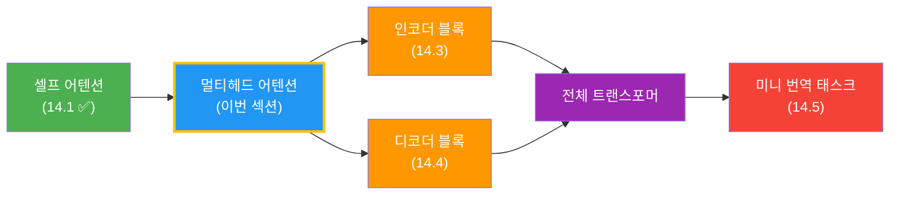
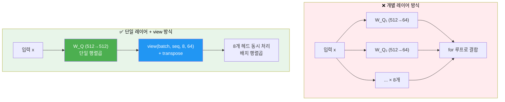
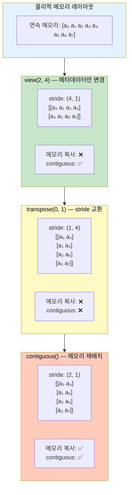
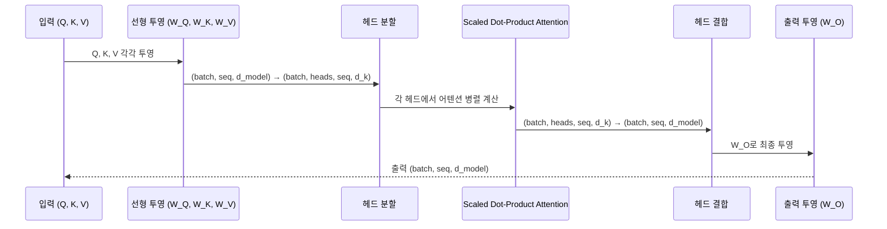
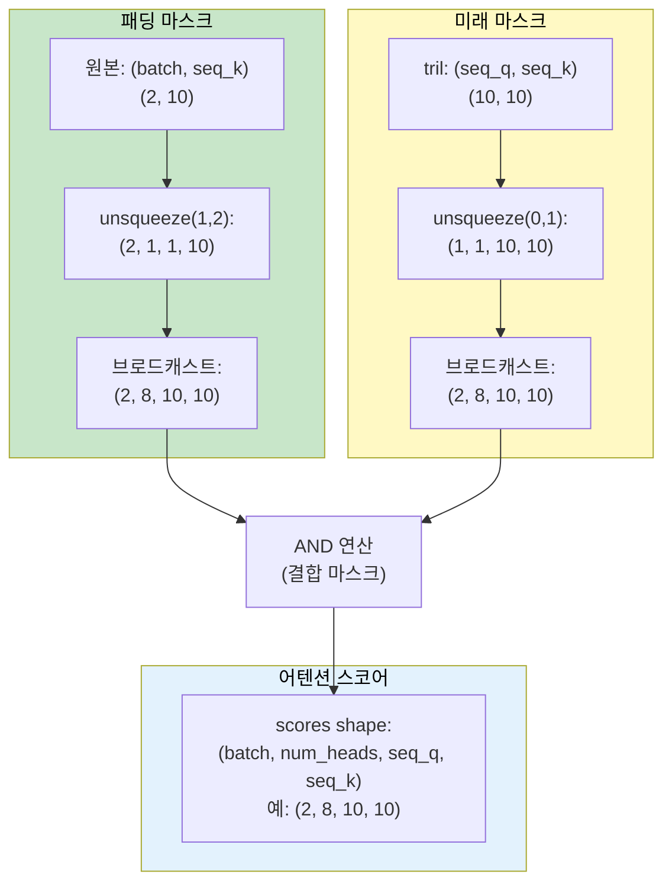

# 멀티헤드 어텐션 구현

> 이전 섹션의 Scaled Dot-Product Attention을 여러 헤드로 병렬 실행하는 MultiHeadAttention 클래스를 PyTorch로 직접 구현합니다.

## 개요

이 섹션에서는 트랜스포머의 핵심 구성 요소인 **멀티헤드 어텐션(Multi-Head Attention)**을 밑바닥부터 구현합니다. [멀티헤드 어텐션 이론](13-ch13-트랜스포머-아키텍처-심층-분석/03-03-멀티헤드-어텐션.md)에서 "왜 여러 헤드가 필요한지, 각 헤드가 어떤 역할을 하는지"를 배웠다면, 이번 섹션은 **그 이론을 실제 텐서 연산으로 옮기는 데 집중**합니다. 특히 `view`, `transpose`, `contiguous` 같은 차원 조작이 왜 필요한지, 메모리 레이아웃과 어떤 관계인지를 깊이 다룹니다.

**선수 지식**: [셀프 어텐션 직접 구현](14-ch14-트랜스포머-구현-실습/01-01-셀프-어텐션-직접-구현.md)의 `ScaledDotProductAttention` 클래스, [멀티헤드 어텐션 이론](13-ch13-트랜스포머-아키텍처-심층-분석/03-03-멀티헤드-어텐션.md), [nn.Module로 신경망 정의하기](07-ch7-pytorch-기초와-신경망-입문/03-03-nnmodule로-신경망-정의하기.md)

**학습 목표**:
- `view`와 `transpose`의 메모리 레이아웃 차이를 이해하고, 헤드 분할/결합에 왜 `contiguous()`가 필요한지 설명할 수 있다
- 하나의 큰 `nn.Linear`로 투영한 뒤 `view`로 분할하는 방식이 개별 헤드 `nn.Linear`보다 효율적인 이유를 이해한다
- PyTorch `nn.Module`로 완전한 `MultiHeadAttention` 클래스를 구현할 수 있다
- 패딩 마스크와 인과적 마스크를 멀티헤드 환경에서 올바르게 적용할 수 있다

## 왜 알아야 할까?

[멀티헤드 어텐션 이론](13-ch13-트랜스포머-아키텍처-심층-분석/03-03-멀티헤드-어텐션.md)에서 배운 수식 $\text{MultiHead}(Q, K, V) = \text{Concat}(\text{head}_1, \dots, \text{head}_h) \cdot W^O$을 코드로 옮기려면, 한 가지 핵심 질문에 답해야 합니다: **8개의 어텐션 헤드를 정말로 for 루프로 하나씩 돌려야 할까요?**

답은 "아니오"입니다. 실제 구현에서는 **하나의 큰 행렬곱 + 텐서 차원 재배치**로 모든 헤드를 동시에 처리합니다. 이 "차원 마술"이 멀티헤드 구현의 진짜 핵심이에요. 수식은 간단해 보이지만, `(batch, seq_len, d_model)` → `(batch, num_heads, seq_len, d_k)` → 다시 원래로 되돌리는 과정에서 `view`, `transpose`, `contiguous`의 동작 원리를 정확히 이해하지 못하면 디버깅 지옥에 빠지기 쉽습니다.

다음 섹션 [인코더 블록 구현](14-ch14-트랜스포머-구현-실습/03-03-인코더-블록-구현.md)과 [디코더 블록과 전체 모델 조립](14-ch14-트랜스포머-구현-실습/04-04-디코더-블록과-전체-모델-조립.md)에서 이 `MultiHeadAttention` 클래스를 그대로 가져다 쓰게 되니, 이번 구현이 탄탄해야 뒤가 편합니다.

> 📊 **그림 1**: 멀티헤드 어텐션의 위치 — 트랜스포머 구현 로드맵



## 핵심 개념

### 개념 1: 구현 전략 — 하나의 큰 행렬 vs 여러 작은 행렬

> 💡 **비유**: 8명에게 각각 다른 색연필을 주고 따로따로 그림을 그리게 하는 것(개별 `nn.Linear` 8개)과, 8색 색연필 세트를 한 통에 넣고 한 번에 쥐어주는 것(하나의 큰 `nn.Linear` + `view`로 분할). 결과물은 같지만, 후자가 훨씬 빠르겠죠?

멀티헤드 어텐션의 수식([Ch13.3 참고](13-ch13-트랜스포머-아키텍처-심층-분석/03-03-멀티헤드-어텐션.md))에서 각 헤드 $i$는 독자적인 투영 행렬 $W_i^Q \in \mathbb{R}^{d_{\text{model}} \times d_k}$를 갖습니다. 이걸 순진하게 구현하면:

```python
# ❌ 비효율적인 방식 — for 루프 + 개별 레이어
self.W_Qs = nn.ModuleList([nn.Linear(d_model, d_k) for _ in range(num_heads)])
# forward에서:
heads = [attention(W_Q(x), W_K(x), W_V(x)) for W_Q, W_K, W_V in zip(...)]
```

하지만 실제로는 **하나의 큰 행렬**로 한 번에 투영한 뒤, `view`로 헤드 차원을 꺼냅니다:

```python
# ✅ 효율적인 방식 — 단일 행렬곱 + view 분할
self.W_Q = nn.Linear(d_model, d_model)  # d_model = num_heads × d_k
# forward에서:
Q = self.W_Q(x)                                        # (batch, seq, d_model)
Q = Q.view(batch, seq, num_heads, d_k).transpose(1, 2)  # (batch, heads, seq, d_k)
```

> 📊 **그림 2**: 두 가지 구현 전략 비교



수학적으로 두 방식은 완전히 동등합니다. 큰 $W_Q \in \mathbb{R}^{d_{\text{model}} \times d_{\text{model}}}$ 행렬을 세로로 $h$등분하면 각각이 $W_i^Q$가 되니까요. 하지만 GPU에서는 큰 행렬곱 1번이 작은 행렬곱 8번보다 압도적으로 빠릅니다 — CUDA 커널 런칭 오버헤드도 줄고, 텐서 코어 활용률도 높아집니다.

### 개념 2: 텐서 차원 변환 — view, transpose, contiguous의 메모리 이야기

멀티헤드 구현에서 가장 까다롭고 버그가 나기 쉬운 부분이 **텐서 reshape**입니다. `view`, `transpose`, `contiguous` 세 연산이 메모리 수준에서 어떻게 다른지 제대로 이해해야 합니다.

> 💡 **비유**: 책장에 꽂힌 책 8권을 생각해 보세요. `view`는 "4권씩 2단으로 진열 방식만 바꿔라" (물리적 위치 그대로, 라벨만 변경). `transpose`는 "1번과 5번, 2번과 6번... 위치를 교환해라" (실제로 책을 옮기지 않고 **참조 인덱스만 바꿈**). `contiguous()`는 "바뀐 순서대로 실제로 책을 재배치해라" (메모리 복사 발생).

> 📊 **그림 3**: view, transpose, contiguous의 메모리 동작



코드로 이 차이를 확인해 봅시다:

```run:python
import torch

# 파라미터
batch_size = 2
seq_len = 4
d_model = 512
num_heads = 8
d_k = d_model // num_heads  # 64

# 가상 입력 (Linear 투영 후의 결과라고 가정)
x = torch.randn(batch_size, seq_len, d_model)
print(f"원본 shape: {x.shape}, stride: {x.stride()}")

# --- 헤드 분할 (split_heads) ---
# view: 메타데이터만 변경, 메모리 그대로
x_split = x.view(batch_size, seq_len, num_heads, d_k)
print(f"view 후:      {x_split.shape}, stride: {x_split.stride()}, contiguous: {x_split.is_contiguous()}")

# transpose: stride 교환, 메모리 그대로 — 여기서 non-contiguous!
x_heads = x_split.transpose(1, 2)
print(f"transpose 후: {x_heads.shape}, stride: {x_heads.stride()}, contiguous: {x_heads.is_contiguous()}")

# --- 어텐션 수행 (생략) → 결과도 같은 shape ---

# --- 헤드 결합 (concat_heads) ---
x_back = x_heads.transpose(1, 2)
print(f"\n역 transpose:  {x_back.shape}, contiguous: {x_back.is_contiguous()}")

# contiguous() 없이 view 시도 → 에러!
try:
    x_back.view(batch_size, seq_len, d_model)
    print("view 성공 (이 메시지는 안 나옵니다)")
except RuntimeError as e:
    print(f"view 에러: {str(e)[:60]}...")

# contiguous() 후 view → 성공
x_contig = x_back.contiguous()
print(f"contiguous 후: contiguous: {x_contig.is_contiguous()}")
x_out = x_contig.view(batch_size, seq_len, d_model)
print(f"최종 shape:    {x_out.shape}")
print(f"원본과 동일?   {torch.allclose(x, x_out)}")
```

```output
원본 shape: torch.Size([2, 4, 512]), stride: (2048, 512, 1)
view 후:      torch.Size([2, 4, 8, 64]), stride: (2048, 512, 64, 1), contiguous: True
transpose 후: torch.Size([2, 8, 4, 64]), stride: (2048, 64, 512, 1), contiguous: False

역 transpose:  torch.Size([2, 4, 8, 64]), contiguous: False
view 에러: view size is not compatible with input tensor's...
contiguous 후: contiguous: True
최종 shape:    torch.Size([2, 4, 512])
원본과 동일?   True
```

stride를 주목해 보세요. `transpose` 후 stride가 `(2048, 64, 512, 1)`이 되었는데, 두 번째(64)와 세 번째(512)가 **역전**되어 있습니다. 이 상태에서 `view`를 호출하면 "이 stride로는 연속 메모리로 해석할 수 없다"는 에러가 나는 거예요. `contiguous()`가 메모리를 실제로 재배열해서 stride를 정상화합니다.

> ⚠️ **흔한 오해**: "`view`와 `reshape`는 같은 거 아닌가요?" — 거의 같지만, `view`는 텐서가 contiguous할 때만 작동하고, `reshape`는 필요 시 자동으로 복사합니다. 명시적으로 `.contiguous().view()`를 쓰면 의도가 드러나고, 불필요한 복사를 피할 수 있어요.

### 개념 3: MultiHeadAttention 클래스 구현

이제 모든 조각을 합쳐서 완전한 `MultiHeadAttention`을 만들어 봅시다. Harvard NLP의 Annotated Transformer 스타일을 참고하되, 이해하기 쉽게 단계별로 작성합니다.

> 📊 **그림 4**: MultiHeadAttention 순전파 시퀀스



```python
import torch
import torch.nn as nn
import torch.nn.functional as F
import math


class MultiHeadAttention(nn.Module):
    """멀티헤드 어텐션 — Annotated Transformer 스타일 구현"""

    def __init__(self, d_model: int, num_heads: int):
        super().__init__()
        assert d_model % num_heads == 0, "d_model은 num_heads로 나누어떨어져야 합니다"

        self.d_model = d_model
        self.num_heads = num_heads
        self.d_k = d_model // num_heads  # 각 헤드의 차원

        # Q, K, V 투영용 선형 레이어 (하나의 큰 행렬로 한 번에 투영)
        self.W_Q = nn.Linear(d_model, d_model, bias=False)
        self.W_K = nn.Linear(d_model, d_model, bias=False)
        self.W_V = nn.Linear(d_model, d_model, bias=False)

        # 출력 투영
        self.W_O = nn.Linear(d_model, d_model, bias=False)

        # 어텐션 가중치 저장 (시각화용)
        self.attn_weights = None

    def split_heads(self, x):
        """(batch, seq_len, d_model) → (batch, num_heads, seq_len, d_k)
        
        view: (batch, seq, d_model) → (batch, seq, heads, d_k)  ← 메타데이터만 변경
        transpose(1,2): heads 차원을 seq 앞으로 이동 ← stride만 변경, non-contiguous
        """
        batch_size, seq_len, _ = x.size()
        x = x.view(batch_size, seq_len, self.num_heads, self.d_k)
        return x.transpose(1, 2)  # (batch, heads, seq, d_k)

    def concat_heads(self, x):
        """(batch, num_heads, seq_len, d_k) → (batch, seq_len, d_model)
        
        transpose(1,2): heads를 seq 뒤로 복원 ← non-contiguous
        contiguous(): 메모리 재배치 ← view를 위한 필수 전처리
        view: (batch, seq, heads*d_k) = (batch, seq, d_model) ← 메타데이터만 변경
        """
        batch_size, _, seq_len, _ = x.size()
        x = x.transpose(1, 2).contiguous()  # (batch, seq, heads, d_k)
        return x.view(batch_size, seq_len, self.d_model)

    def scaled_dot_product_attention(self, Q, K, V, mask=None):
        """
        Scaled Dot-Product Attention (14.1에서 구현한 것과 동일)
        
        Args:
            Q: (batch, heads, seq_len_q, d_k)
            K: (batch, heads, seq_len_k, d_k)
            V: (batch, heads, seq_len_k, d_k)
            mask: (batch, 1, 1, seq_len_k) 또는 (batch, 1, seq_len_q, seq_len_k)
        """
        # 유사도 점수 + 스케일링
        scores = torch.matmul(Q, K.transpose(-2, -1)) / math.sqrt(self.d_k)

        # 마스크 적용
        if mask is not None:
            scores = scores.masked_fill(mask == 0, float('-inf'))

        # 소프트맥스 → 어텐션 가중치
        attn_weights = F.softmax(scores, dim=-1)

        # 가중 합산
        output = torch.matmul(attn_weights, V)
        return output, attn_weights

    def forward(self, query, key, value, mask=None):
        """
        Args:
            query: (batch, seq_len_q, d_model)
            key:   (batch, seq_len_k, d_model)
            value: (batch, seq_len_k, d_model)
            mask:  어텐션 마스크
        Returns:
            output: (batch, seq_len_q, d_model)
        """
        # 1. 선형 투영
        Q = self.W_Q(query)  # (batch, seq_q, d_model)
        K = self.W_K(key)
        V = self.W_V(value)

        # 2. 헤드 분할 — view + transpose
        Q = self.split_heads(Q)  # (batch, heads, seq_q, d_k)
        K = self.split_heads(K)
        V = self.split_heads(V)

        # 3. 어텐션 계산 (모든 헤드 동시에 — 배치 행렬곱)
        attn_output, self.attn_weights = self.scaled_dot_product_attention(
            Q, K, V, mask
        )

        # 4. 헤드 결합 — transpose + contiguous + view
        concat_output = self.concat_heads(attn_output)  # (batch, seq_q, d_model)

        # 5. 출력 투영
        output = self.W_O(concat_output)  # (batch, seq_q, d_model)

        return output
```

구현상 주목할 설계 결정들:

- **`forward`의 인자가 `query, key, value`로 분리**되어 있습니다. 셀프 어텐션에서는 세 개 모두 같은 입력을 넣지만, 크로스 어텐션에서는 `key`와 `value`에 인코더 출력을 넣게 됩니다. 이렇게 범용적으로 설계해야 [디코더 블록](14-ch14-트랜스포머-구현-실습/04-04-디코더-블록과-전체-모델-조립.md)에서 재사용할 수 있어요.
- **`split_heads`와 `concat_heads`를 메서드로 분리**했습니다. Annotated Transformer에서도 유사한 분리 구조를 사용하는데, 차원 변환 로직이 `forward` 안에 인라인되면 가독성이 급격히 떨어지거든요.
- **어텐션 가중치를 `self.attn_weights`에 저장**합니다. 디버깅과 시각화에 유용하죠.

> 📊 **그림 5**: 전체 데이터 흐름의 shape 변환 추적


### 개념 4: 마스킹 — 패딩 마스크와 미래 마스크

멀티헤드 어텐션에서 마스크는 두 종류가 있습니다. 이전 섹션에서 인과적 마스크를 잠깐 다뤘는데, 여기서 체계적으로 정리합니다. 멀티헤드에서 핵심은 **마스크의 shape과 브로드캐스팅**입니다.

> 💡 **비유**: 영화관에서 스크린을 볼 때, **패딩 마스크**는 "빈 좌석은 아예 없는 것으로 취급"하는 것이고, **미래 마스크**는 "스포일러 방지를 위해 아직 안 나온 장면은 가려놓는 것"입니다.

> 📊 **그림 6**: 마스크의 shape과 브로드캐스팅 흐름



코드로 구현해 볼까요?

```run:python
import torch

seq_len = 5

# === 1. 패딩 마스크 ===
# 실제 토큰 길이가 3이고, 뒤 2개가 PAD인 경우
# 토큰: ["나는", "고양이", "좋아", "<PAD>", "<PAD>"]
lengths = torch.tensor([3])  # 실제 길이
padding_mask = torch.arange(seq_len).unsqueeze(0) < lengths.unsqueeze(1)
print("패딩 마스크:")
print(padding_mask.int())
# → (batch, 1, 1, seq_len)으로 확장하여 어텐션에 적용
padding_mask_4d = padding_mask.unsqueeze(1).unsqueeze(2)
print(f"4D 패딩 마스크 shape: {padding_mask_4d.shape}")

# === 2. 미래 마스크 (인과적 마스크) ===
causal_mask = torch.tril(torch.ones(seq_len, seq_len)).bool()
print(f"\n미래 마스크 (하삼각행렬):")
print(causal_mask.int())

# === 3. 결합 마스크 (디코더용) ===
combined_mask = causal_mask.unsqueeze(0) & padding_mask.unsqueeze(-1)
print(f"\n결합 마스크:")
print(combined_mask.int())
```

```output
패딩 마스크:
tensor([[1, 1, 1, 0, 0]])
4D 패딩 마스크 shape: torch.Size([1, 1, 1, 5])

미래 마스크 (하삼각행렬):
tensor([[1, 0, 0, 0, 0],
        [1, 1, 0, 0, 0],
        [1, 1, 1, 0, 0],
        [1, 1, 1, 1, 0],
        [1, 1, 1, 1, 1]])

결합 마스크:
tensor([[[1, 0, 0, 0, 0],
         [1, 1, 0, 0, 0],
         [1, 1, 1, 0, 0],
         [0, 0, 0, 0, 0],
         [0, 0, 0, 0, 0]]])
```

결합 마스크를 보면, PAD 위치(4, 5번째 행/열)가 완전히 차단되고, 미래 토큰도 가려진 것이 보이시죠? 이 마스크를 `MultiHeadAttention`에 넘기면 됩니다.

마스크의 shape 규칙을 정리하면:

| 마스크 종류 | shape | 브로드캐스팅 대상 |
|------------|-------|-----------------|
| 패딩 마스크 | `(batch, 1, 1, seq_len_k)` | 모든 헤드, 모든 쿼리 위치에 동일 적용 |
| 미래 마스크 | `(1, 1, seq_len_q, seq_len_k)` | 모든 배치, 모든 헤드에 동일 적용 |
| 결합 마스크 | `(batch, 1, seq_len_q, seq_len_k)` | 모든 헤드에 동일 적용 |

`1`인 차원은 PyTorch의 브로드캐스팅으로 자동 확장됩니다. `(batch, num_heads, seq_q, seq_k)` 크기의 어텐션 점수에 마스크를 적용할 때, 헤드 차원이 1이면 모든 헤드에 같은 마스크가 적용되는 거죠.

## 실습: 직접 해보기

전체 `MultiHeadAttention` 클래스를 사용해서, 실제 문장에 멀티헤드 어텐션을 적용하고 각 헤드의 어텐션 패턴을 확인해 봅시다.

```python
import torch
import torch.nn as nn
import torch.nn.functional as F
import math


class MultiHeadAttention(nn.Module):
    """멀티헤드 어텐션 — 완전한 구현"""

    def __init__(self, d_model: int, num_heads: int):
        super().__init__()
        assert d_model % num_heads == 0, "d_model은 num_heads로 나누어떨어져야 합니다"

        self.d_model = d_model
        self.num_heads = num_heads
        self.d_k = d_model // num_heads

        self.W_Q = nn.Linear(d_model, d_model, bias=False)
        self.W_K = nn.Linear(d_model, d_model, bias=False)
        self.W_V = nn.Linear(d_model, d_model, bias=False)
        self.W_O = nn.Linear(d_model, d_model, bias=False)

        self.attn_weights = None

    def split_heads(self, x):
        """(batch, seq_len, d_model) → (batch, num_heads, seq_len, d_k)"""
        batch_size, seq_len, _ = x.size()
        return x.view(batch_size, seq_len, self.num_heads, self.d_k).transpose(1, 2)

    def concat_heads(self, x):
        """(batch, num_heads, seq_len, d_k) → (batch, seq_len, d_model)"""
        batch_size, _, seq_len, _ = x.size()
        return x.transpose(1, 2).contiguous().view(batch_size, seq_len, self.d_model)

    def scaled_dot_product_attention(self, Q, K, V, mask=None):
        scores = torch.matmul(Q, K.transpose(-2, -1)) / math.sqrt(self.d_k)
        if mask is not None:
            scores = scores.masked_fill(mask == 0, float('-inf'))
        attn_weights = F.softmax(scores, dim=-1)
        output = torch.matmul(attn_weights, V)
        return output, attn_weights

    def forward(self, query, key, value, mask=None):
        Q = self.split_heads(self.W_Q(query))
        K = self.split_heads(self.W_K(key))
        V = self.split_heads(self.W_V(value))

        attn_output, self.attn_weights = self.scaled_dot_product_attention(
            Q, K, V, mask
        )

        output = self.W_O(self.concat_heads(attn_output))
        return output


# === 실습 ===
torch.manual_seed(42)

# 하이퍼파라미터
d_model = 64     # 실습용으로 작은 값
num_heads = 4    # 4개 헤드 (d_k = 64/4 = 16)
seq_len = 6
batch_size = 1

# 가상 임베딩 입력
tokens = ["The", "cat", "sat", "on", "the", "mat"]
x = torch.randn(batch_size, seq_len, d_model)

# 멀티헤드 어텐션 생성 및 순전파
mha = MultiHeadAttention(d_model, num_heads)
output = mha(x, x, x)  # 셀프 어텐션: Q=K=V=x

print(f"입력 shape:   {x.shape}")
print(f"출력 shape:   {output.shape}")
print(f"가중치 shape: {mha.attn_weights.shape}")

# 각 헤드의 어텐션 패턴 비교
print(f"\n=== 각 헤드별 어텐션 패턴 (첫 번째 토큰 'The'의 시선) ===")
w = mha.attn_weights[0].detach()  # (num_heads, seq_len, seq_len)
for head_idx in range(num_heads):
    head_attn = w[head_idx, 0]  # 첫 번째 토큰이 다른 토큰을 보는 가중치
    top_idx = head_attn.argmax().item()
    print(f"Head {head_idx}: {[f'{v:.3f}' for v in head_attn.tolist()]}"
          f"  → 가장 주목: '{tokens[top_idx]}'")

# === 마스크 적용 테스트 ===
print(f"\n=== 인과적 마스크 적용 후 ===")
causal_mask = torch.tril(torch.ones(seq_len, seq_len)).unsqueeze(0).unsqueeze(0)
output_causal = mha(x, x, x, mask=causal_mask)

w_causal = mha.attn_weights[0].detach()
print(f"Head 0, 'on'(idx=3)의 어텐션:")
attn_on = w_causal[0, 3]
for i, (token, weight) in enumerate(zip(tokens, attn_on)):
    marker = "✓" if i <= 3 else "✗(미래)"
    print(f"  → '{token}': {weight:.4f}  {marker}")

# === 크로스 어텐션 데모 ===
print(f"\n=== 크로스 어텐션 (Q ≠ K, V) ===")
# 디코더 입력 (길이 3)과 인코더 출력 (길이 6)
decoder_input = torch.randn(1, 3, d_model)
encoder_output = torch.randn(1, 6, d_model)

# Q는 디코더, K/V는 인코더에서
cross_output = mha(decoder_input, encoder_output, encoder_output)
print(f"디코더 입력:   {decoder_input.shape}")
print(f"인코더 출력:   {encoder_output.shape}")
print(f"크로스 어텐션: {cross_output.shape}")
print(f"가중치 shape:  {mha.attn_weights.shape}  "
      f"(3개 디코더 토큰이 6개 인코더 토큰을 참조)")
```

이 코드를 실행하면 세 가지를 확인할 수 있습니다:

1. **각 헤드가 서로 다른 패턴을 보인다**: Head 0은 자기 자신에 집중하고, Head 2는 먼 토큰에 주목하는 식으로, 각 헤드가 다른 "관점"을 학습합니다 (학습 전이라 랜덤이지만, 패턴 자체가 다른 걸 확인할 수 있어요).
2. **인과적 마스크가 정확히 작동한다**: `on`(인덱스 3)은 `The`, `cat`, `sat`, `on`만 볼 수 있고, `the`, `mat`의 가중치는 정확히 0.0000이 됩니다.
3. **크로스 어텐션도 같은 클래스로 작동한다**: Q의 시퀀스 길이(3)와 K/V의 시퀀스 길이(6)가 달라도 문제없이 작동합니다.

## 더 깊이 알아보기

### Annotated Transformer의 구현 선택들

Alexander Rush가 2018년에 작성한 Annotated Transformer는 원 논문의 PyTorch 구현을 줄 단위로 주석한 프로젝트인데, 이 프로젝트가 사실상 **트랜스포머 구현의 사실 표준(de facto standard)**이 되었습니다. 수천 개의 후속 구현이 이 코드를 참고했죠.

흥미로운 구현 선택이 있습니다. Annotated Transformer는 `nn.Linear`를 4개(Q, K, V, O) 만드는 대신 `clones(nn.Linear(d_model, d_model), 4)` 헬퍼 함수를 사용합니다. `clones`는 `nn.ModuleList([copy.deepcopy(module) for _ in range(N)])`인데, 이렇게 하면 네 개의 레이어가 같은 구조를 공유하되 **독립적인 파라미터**를 가집니다. 우리는 명시적으로 `W_Q`, `W_K`, `W_V`, `W_O`로 이름을 붙여서 각각의 역할을 분명히 했어요.

또 한 가지, Annotated Transformer는 `attention`이라는 독립 함수를 정의하고 `MultiHeadedAttention.forward`에서 호출합니다. 우리의 `scaled_dot_product_attention` 메서드가 이에 해당하죠. 이런 **분리된 설계** 덕분에 어텐션 로직을 FlashAttention 같은 최적화 버전으로 교체하기가 수월합니다.

### $d_k$의 선택 — 하드웨어를 고려한 하이퍼파라미터

> 💡 **알고 계셨나요?**: 원 논문에서 BERT-base($d_{\text{model}}=768$, $h=12$, $d_k=64$)와 GPT-2는 같은 멀티헤드 설정을 씁니다. GPT-3는 $d_{\text{model}}=12288$, $h=96$으로 $d_k=128$인데, 이 128이라는 숫자는 GPU 텐서 코어의 타일 크기(tile size)와 맞아떨어져서 최적 성능을 내도록 설계된 것입니다. 하이퍼파라미터 하나도 하드웨어를 고려해서 정해지는 셈이죠.

## 흔한 오해와 팁

> ⚠️ **흔한 오해**: "각 헤드마다 별도의 `nn.Linear`를 만들어야 하는 것 아닌가요?" — 수학적으로는 동일하지만, 실무에서는 하나의 큰 `nn.Linear(d_model, d_model)`을 사용한 뒤 `view`로 분할합니다. 8개의 작은 `nn.Linear(d_model, d_k)`를 따로 만들면 for 루프가 필요하고, GPU 병렬성을 활용하지 못해 느려집니다.

> 🔥 **실무 팁**: PyTorch에는 `nn.MultiheadAttention`이 내장되어 있습니다. API가 조금 다른데, `forward(query, key, value, key_padding_mask, attn_mask)`를 받고, 기본적으로 `(seq_len, batch, d_model)` 순서를 기대합니다 (`batch_first=True`로 변경 가능). 프로덕션에서는 내장 모듈을 쓰세요 — FlashAttention 등의 최적화가 자동 적용됩니다. 직접 구현은 이해와 커스터마이징 목적으로만 사용하세요.

> ⚠️ **흔한 오해**: "마스크를 `num_heads` 차원에도 맞춰서 만들어야 하나요?" — 아닙니다. 마스크의 헤드 차원을 1로 두면 PyTorch 브로드캐스팅이 자동으로 모든 헤드에 동일한 마스크를 적용합니다. 헤드별로 다른 마스크를 쓸 일은 매우 드물어요.

## 핵심 정리

| 개념 | 설명 |
|------|------|
| 구현 전략 | 하나의 큰 `nn.Linear(d_model, d_model)` + `view` 분할이 개별 헤드 레이어보다 GPU 효율적 |
| 헤드 분할 | `view` + `transpose(1,2)` → stride만 변경, 메모리 복사 없음 (non-contiguous) |
| 헤드 결합 | `transpose(1,2)` + `contiguous()` + `view` → 메모리 재배치 후 차원 통합 |
| `contiguous()` | `transpose` 후 stride가 역전되어 `view` 불가 → 메모리 재배치로 해결 |
| `W_O` 출력 투영 | concat된 헤드 출력을 $d_{\text{model}}$로 재투영하여 정보 통합 |
| 패딩 마스크 | `(batch, 1, 1, seq_k)` — 브로드캐스팅으로 모든 헤드·쿼리에 적용 |
| 미래 마스크 | `(1, 1, seq_q, seq_k)` 하삼각행렬 — 브로드캐스팅으로 모든 배치·헤드에 적용 |
| `forward(q, k, v)` | Q=K=V면 셀프 어텐션, Q≠K,V면 크로스 어텐션 — 같은 클래스로 처리 |

## 다음 섹션 미리보기

멀티헤드 어텐션이 완성되었으니, 다음은 이것을 감싸는 **인코더 블록**을 만들 차례입니다. [인코더 블록 구현](14-ch14-트랜스포머-구현-실습/03-03-인코더-블록-구현.md)에서는 멀티헤드 어텐션 + 피드포워드 네트워크 + 잔차 연결(Residual Connection) + 레이어 정규화를 하나의 블록으로 조립합니다. [피드포워드 네트워크와 정규화](13-ch13-트랜스포머-아키텍처-심층-분석/05-05-피드포워드-네트워크와-정규화.md)에서 배운 이론이 코드로 구현되는 과정을 보게 될 거예요.

## 참고 자료

- [Attention Is All You Need (Vaswani et al., 2017)](https://arxiv.org/abs/1706.03762) - 멀티헤드 어텐션이 처음 제안된 원 논문. Section 3.2.2가 핵심
- [The Annotated Transformer (Harvard NLP)](https://nlp.seas.harvard.edu/annotated-transformer/) - MultiHeadedAttention 클래스의 줄 단위 주석이 달린 참조 구현
- [The Illustrated Transformer (Jay Alammar)](https://jalammar.github.io/illustrated-transformer/) - 멀티헤드 어텐션의 시각적 설명이 탁월한 블로그 포스트
- [PyTorch `nn.MultiheadAttention` 공식 문서](https://docs.pytorch.org/docs/stable/generated/torch.nn.MultiheadAttention.html) - PyTorch 내장 멀티헤드 어텐션 모듈의 API 레퍼런스
- [PyTorch Tensor Views 문서](https://docs.pytorch.org/docs/stable/tensor_view.html) - view, reshape, transpose 등 텐서 뷰 연산의 공식 가이드

---
### 🔗 Related Sessions
- [nn.module](07-ch7-pytorch-기초와-신경망-입문/03-03-nnmodule로-신경망-정의하기.md) (prerequisite)
- [nn.linear](07-ch7-pytorch-기초와-신경망-입문/03-03-nnmodule로-신경망-정의하기.md) (prerequisite)
- [scaleddotproductattention](14-ch14-트랜스포머-구현-실습/01-01-셀프-어텐션-직접-구현.md) (prerequisite)
- [브로드캐스팅](07-ch7-pytorch-기초와-신경망-입문/01-01-pytorch-텐서와-연산.md) (prerequisite)
- [멀티헤드 어텐션 이론](13-ch13-트랜스포머-아키텍처-심층-분석/03-03-멀티헤드-어텐션.md) (prerequisite)

---
### 🔗 Related Sessions
- [nn.module](07-ch7-pytorch-기초와-신경망-입문/03-03-nnmodule로-신경망-정의하기.md) (prerequisite)
- [nn.linear](07-ch7-pytorch-기초와-신경망-입문/03-03-nnmodule로-신경망-정의하기.md) (prerequisite)
- [scaleddotproductattention](14-ch14-트랜스포머-구현-실습/01-01-셀프-어텐션-직접-구현.md) (prerequisite)
- [브로드캐스팅](07-ch7-pytorch-기초와-신경망-입문/01-01-pytorch-텐서와-연산.md) (prerequisite)
