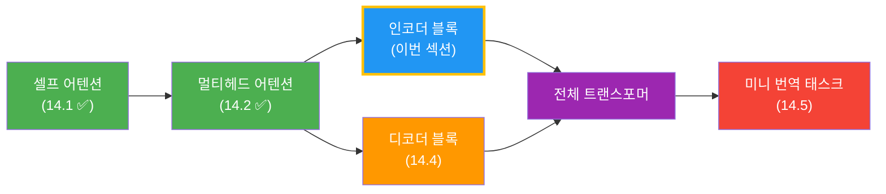
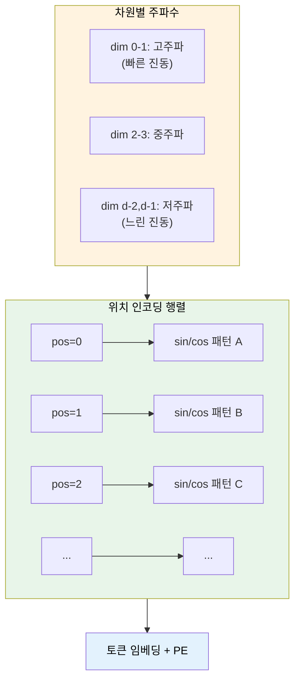
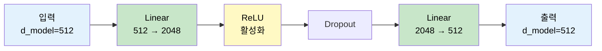
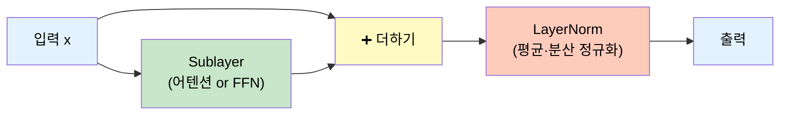
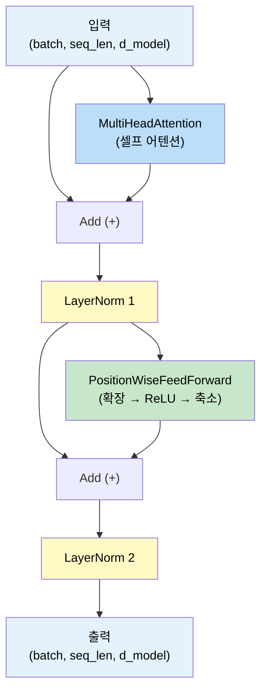
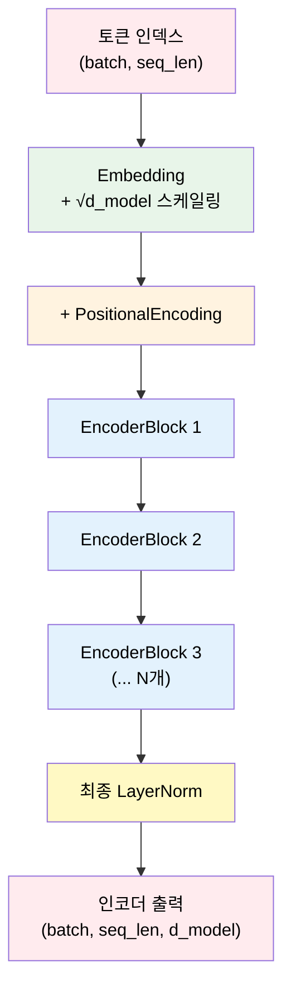
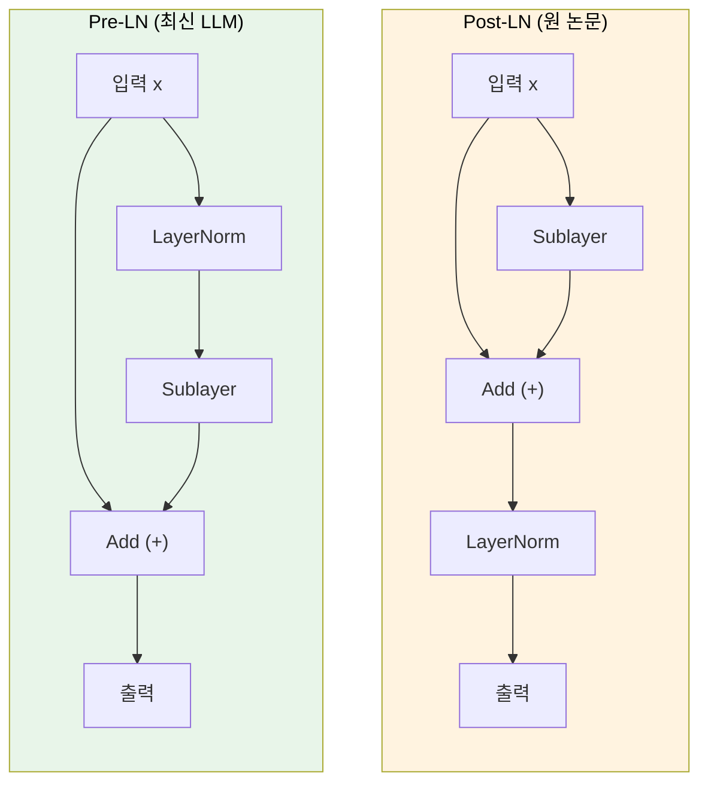

# 인코더 블록 구현

> 멀티헤드 어텐션, 피드포워드 네트워크, 잔차 연결, 레이어 정규화를 결합하여 트랜스포머 인코더 블록을 밑바닥부터 PyTorch로 조립합니다.

## 개요

이 섹션에서는 앞서 구현한 `MultiHeadAttention`을 핵심 부품으로 활용하여, 트랜스포머 **인코더 블록(Encoder Block)** 하나를 완성합니다. 좋은 소식이 있는데요 — 이번에 새로 배울 개념들(잔차 연결, 레이어 정규화, FFN)은 멀티헤드 어텐션에 비하면 **훨씬 직관적**입니다. "더하기 하나"와 "평균·분산으로 정규화"가 핵심이거든요. 어려운 고비는 이미 넘겼으니, 이번 섹션은 레고 블록 조립하듯 부품들을 차근차근 맞춰 나가면 됩니다.

위치 인코딩(Positional Encoding)으로 순서 정보를 주입하고, 피드포워드 네트워크(FFN)로 비선형 변환을 추가하며, 잔차 연결(Residual Connection)과 레이어 정규화(Layer Normalization)로 학습 안정성을 확보합니다. 최종적으로 이 블록을 N개 쌓아 완전한 인코더 스택을 만듭니다.

**선수 지식**: [멀티헤드 어텐션 구현](14-ch14-트랜스포머-구현-실습/02-02-멀티헤드-어텐션-구현.md)의 `MultiHeadAttention` 클래스, [위치 인코딩 이론](13-ch13-트랜스포머-아키텍처-심층-분석/04-04-위치-인코딩.md), [피드포워드 네트워크와 정규화 이론](13-ch13-트랜스포머-아키텍처-심층-분석/05-05-피드포워드-네트워크와-정규화.md), [nn.Module로 신경망 정의하기](07-ch7-pytorch-기초와-신경망-입문/03-03-nnmodule로-신경망-정의하기.md)

**학습 목표**:
- 사인·코사인 위치 인코딩을 PyTorch로 구현하고 원리를 설명할 수 있다
- Position-wise FFN의 구조와 역할을 이해하고 구현할 수 있다
- 잔차 연결 + 레이어 정규화의 역할을 코드로 확인할 수 있다
- 위 컴포넌트를 조합하여 인코더 블록 → 인코더 스택을 구축할 수 있다

## 왜 알아야 할까?

이전 섹션에서 만든 `MultiHeadAttention`은 트랜스포머의 "눈"에 해당합니다. 하지만 눈만으로는 판단을 내릴 수 없죠. 인코더 블록은 이 눈 위에 **"뇌"(FFN)**와 **"혈관"(잔차 연결)**과 **"체온 조절 장치"(레이어 정규화)**를 덧붙여, 입력 시퀀스를 풍부한 맥락 표현으로 변환하는 완전한 처리 단위를 만듭니다.

하나 강조하고 싶은 점이 있어요. 멀티헤드 어텐션이 트랜스포머에서 가장 정교한 부품이었다면, 이번 섹션의 나머지 부품들은 상대적으로 단순합니다:

| 컴포넌트 | 핵심 연산 | 복잡도 |
|----------|-----------|--------|
| 멀티헤드 어텐션 (이미 완료!) | Q·K^T 스케일링, 소프트맥스, 헤드 분할 | ★★★★ |
| 위치 인코딩 | sin/cos 계산 후 더하기 | ★★ |
| 피드포워드 네트워크 | Linear → ReLU → Linear | ★★ |
| 잔차 연결 | 단순 덧셈 `x + sublayer(x)` | ★ |
| 레이어 정규화 | 평균 빼고 표준편차로 나누기 | ★★ |

가장 어려운 부분은 이미 정복했습니다! 이번에는 나머지 부품을 하나씩 만들어서 조립만 하면 됩니다.

실무에서 BERT, GPT, 그리고 최신 LLM 모두 이 인코더 블록(또는 디코더 블록)의 변형을 수십~수백 개 쌓아 올린 구조입니다. 블록 하나를 제대로 이해하면 나머지는 반복일 뿐이에요. [다음 섹션](14-ch14-트랜스포머-구현-실습/04-04-디코더-블록과-전체-모델-조립.md)에서 디코더 블록을 추가할 때도 이번에 만든 컴포넌트를 그대로 재활용하게 됩니다.

> 📊 **그림 1**: 트랜스포머 구현 로드맵 — 이번 섹션의 위치



## 핵심 개념

### 개념 1: 위치 인코딩 — 순서를 알려주는 시간표

> 💡 **비유**: 학교에서 시간표 없이 수업을 듣는다고 상상해 보세요. 수학, 영어, 과학 수업이 있다는 건 알지만, **몇 번째 교시**인지 모르면 혼란스럽겠죠. 위치 인코딩은 각 토큰에 "너는 몇 번째야"라는 시간표를 붙여주는 역할입니다. RNN은 순서대로 처리하니 자연스럽게 순서를 알지만, 트랜스포머는 모든 토큰을 동시에 보기 때문에 명시적으로 알려줘야 합니다.

원 논문에서 제안한 사인·코사인 위치 인코딩 수식은 다음과 같습니다:

$$PE_{(pos, 2i)} = \sin\left(\frac{pos}{10000^{2i/d_{\text{model}}}}\right)$$

$$PE_{(pos, 2i+1)} = \cos\left(\frac{pos}{10000^{2i/d_{\text{model}}}}\right)$$

- $pos$: 토큰의 위치 (0, 1, 2, ...)
- $i$: 차원 인덱스 (0부터 $d_{\text{model}}/2 - 1$까지)
- 짝수 인덱스에는 sin, 홀수 인덱스에는 cos을 적용

수식이 좀 복잡해 보이지만, 결국 하는 일은 간단합니다: 각 차원마다 **서로 다른 주파수의 파동**을 사용하여, 각 위치마다 고유한 "주파수 지문"을 만드는 거예요. 낮은 차원은 빠르게 진동하고, 높은 차원은 느리게 진동합니다.

> 📊 **그림 2**: 위치 인코딩의 원리 — 다양한 주파수의 파동 조합



PyTorch 구현을 보겠습니다. 핵심은 "sin/cos 값을 미리 계산해서 저장해 두고, forward에서 더하기만 한다"는 것입니다:

```python
import torch
import torch.nn as nn
import math

class PositionalEncoding(nn.Module):
    """사인·코사인 위치 인코딩 (Vaswani et al., 2017)"""
    
    def __init__(self, d_model, max_len=5000, dropout=0.1):
        super().__init__()
        self.dropout = nn.Dropout(p=dropout)
        
        # (max_len, d_model) 크기의 위치 인코딩 행렬 생성
        pe = torch.zeros(max_len, d_model)
        position = torch.arange(0, max_len).unsqueeze(1).float()  # (max_len, 1)
        
        # 10000^(2i/d_model)의 역수를 로그 공간에서 계산 (수치 안정성)
        div_term = torch.exp(
            torch.arange(0, d_model, 2).float() * (-math.log(10000.0) / d_model)
        )
        
        pe[:, 0::2] = torch.sin(position * div_term)  # 짝수 인덱스: sin
        pe[:, 1::2] = torch.cos(position * div_term)  # 홀수 인덱스: cos
        
        # (1, max_len, d_model) — 배치 차원 추가
        pe = pe.unsqueeze(0)
        
        # 학습되지 않는 버퍼로 등록 (state_dict에 포함되지만 기울기 계산 안 함)
        self.register_buffer('pe', pe)
    
    def forward(self, x):
        """x: (batch, seq_len, d_model)"""
        # 입력 시퀀스 길이만큼만 슬라이싱하여 더함
        x = x + self.pe[:, :x.size(1), :]
        return self.dropout(x)
```

`register_buffer`를 사용하는 이유가 궁금할 수 있는데요. 위치 인코딩은 학습 파라미터가 아니지만, 모델을 저장·로드할 때 함께 이동해야 하고 `.to(device)` 호출 시 GPU로도 자동 이동해야 하기 때문입니다. `nn.Parameter`와 달리 기울기가 계산되지 않습니다.

### 개념 2: 피드포워드 네트워크(FFN) — 각 위치별 변환기

> 💡 **비유**: 멀티헤드 어텐션이 "회의"라면, FFN은 회의 후 각자 책상에 돌아가서 하는 **"개인 작업"**입니다. 어텐션은 토큰들 사이의 관계를 파악하는 반면, FFN은 **각 위치의 표현을 독립적으로** 더 풍부하게 변환합니다. 같은 가중치를 모든 위치에 동일하게 적용하기 때문에 "Position-wise"라고 부릅니다.

코드로 보면 사실 Linear 두 개를 연결한 것에 불과합니다. 먼저 간단한 예제로 감을 잡아 볼까요?

```run:python
import torch
import torch.nn as nn

# FFN의 핵심은 "확장했다가 다시 축소"하는 것
d_model = 8   # 입력 차원
d_ff = 32     # 내부 확장 차원 (보통 4배)

# 단순화한 FFN: 두 개의 Linear
linear1 = nn.Linear(d_model, d_ff)   # 8 → 32 (확장)
linear2 = nn.Linear(d_ff, d_model)   # 32 → 8 (축소)

x = torch.randn(1, 5, d_model)  # (배치1, 토큰5개, 차원8)

# 확장 → ReLU → 축소
expanded = torch.relu(linear1(x))    # (1, 5, 32) — 넓은 공간에서 변환
output = linear2(expanded)           # (1, 5, 8)  — 원래 차원으로 복귀

print(f"입력:  {x.shape}")
print(f"확장:  {expanded.shape}")
print(f"출력:  {output.shape}")
print(f"→ 입력과 출력 shape이 같습니다!")
```

```output
입력:  torch.Size([1, 5, 8])
확장:  torch.Size([1, 5, 32])
출력:  torch.Size([1, 5, 8])
→ 입력과 출력 shape이 같습니다!
```

보시다시피 FFN은 구조적으로 매우 단순합니다. 수식으로 표현하면:

$$\text{FFN}(x) = \text{ReLU}(x W_1 + b_1) W_2 + b_2$$

- $W_1$: $(d_{\text{model}}, d_{ff})$ — 확장 투영
- $W_2$: $(d_{ff}, d_{\text{model}})$ — 축소 투영
- 논문 기본값: $d_{\text{model}} = 512$, $d_{ff} = 2048$ (4배 확장)

왜 4배로 확장했다 다시 줄일까요? 어텐션이 잡아낸 관계 정보를 **더 넓은 표현 공간에서 비선형 변환**한 뒤 원래 차원으로 압축하면, 복잡한 패턴을 더 잘 인코딩할 수 있기 때문입니다. 마치 종이접기를 할 때 넓게 펼쳐서 접은 다음 다시 원래 크기로 만드는 것과 비슷하죠.

> 📊 **그림 3**: Position-wise FFN의 확장-축소 구조



이제 정식 클래스로 정리하면:

```python
class PositionWiseFeedForward(nn.Module):
    """Position-wise Feed-Forward Network"""
    
    def __init__(self, d_model, d_ff, dropout=0.1):
        super().__init__()
        self.linear1 = nn.Linear(d_model, d_ff)    # 확장
        self.linear2 = nn.Linear(d_ff, d_model)    # 축소
        self.dropout = nn.Dropout(dropout)
        self.relu = nn.ReLU()
    
    def forward(self, x):
        """x: (batch, seq_len, d_model) → 같은 shape"""
        return self.linear2(self.dropout(self.relu(self.linear1(x))))
```

간결하죠? 핵심은 `d_model → d_ff → d_model`의 병목(bottleneck) 구조입니다. 각 위치에 동일한 가중치가 적용되므로, 이를 "1×1 합성곱 두 개를 연결한 것"으로 해석할 수도 있습니다.

### 개념 3: 잔차 연결과 레이어 정규화 — 학습의 안전장치

이번 개념은 이 섹션에서 **가장 쉬운** 부분입니다. 핵심 연산이 "더하기"와 "평균·표준편차로 나누기"니까요.

> 💡 **비유**: 높은 빌딩을 쌓을 때 각 층마다 **엘리베이터 샤프트(잔차 연결)**가 있어서 정보가 꼭대기까지 직통으로 올라갈 수 있습니다. 그리고 각 층에 **에어컨(레이어 정규화)**이 설치되어 온도(값의 스케일)를 일정하게 유지해 줍니다. 이 두 장치가 없으면 층을 깊게 쌓는 순간 학습이 불안정해집니다.

**잔차 연결(Residual Connection)**은 정말 간단합니다 — 서브레이어의 입력을 출력에 **그냥 더하는 것**이 전부입니다:

$$\text{output} = x + \text{Sublayer}(x)$$

코드로 보면 더 명확해요:

```python
# 잔차 연결의 전부 — 딱 한 줄!
output = x + sublayer(x)
```

이 단순한 덧셈이 왜 중요할까요? 역전파 시 기울기가 $\text{Sublayer}$를 거치지 않고도 직접 이전 레이어로 흐를 수 있는 "지름길"을 만들어 줍니다. ResNet에서 차용한 이 기법 덕분에 트랜스포머는 수십 층을 안정적으로 학습할 수 있습니다.

**레이어 정규화(Layer Normalization)**도 개념적으로 단순합니다 — "각 샘플의 값들을 평균 0, 분산 1로 맞춰주는 것"입니다:

$$\text{LayerNorm}(x) = \frac{x - \mu}{\sqrt{\sigma^2 + \epsilon}} \cdot \gamma + \beta$$

- $\mu, \sigma^2$: 마지막 차원($d_{\text{model}}$)의 평균과 분산
- $\gamma, \beta$: 학습 가능한 스케일/시프트 파라미터
- $\epsilon$: 영으로 나누기 방지 (기본값 $10^{-5}$)

수식이 거창해 보이지만, 우리가 통계 시간에 배운 **표준화(standardization)**와 같습니다 — 평균을 빼고 표준편차로 나누는 거죠. 여기에 학습 가능한 $\gamma, \beta$가 추가되어 모델이 필요에 따라 스케일을 조절할 수 있게 합니다.

> 📊 **그림 4**: 잔차 연결 + 레이어 정규화 — 이것만 기억하세요



배치 정규화(Batch Norm)와 달리 **배치 크기에 독립적**이므로, 시퀀스 길이가 가변적인 NLP 태스크에 적합합니다. PyTorch에서는 `nn.LayerNorm(d_model)` 한 줄로 사용할 수 있어서, 직접 구현할 필요도 없습니다.

참고로, 원 논문은 **Post-LN** 방식(`LayerNorm(x + Sublayer(x))`)을 사용하고, 최근 대부분의 LLM(GPT 계열 등)은 학습 안정성이 더 좋은 **Pre-LN** 방식(`x + Sublayer(LayerNorm(x))`)을 채택합니다. 차이가 궁금하신 분은 "더 깊이 알아보기" 섹션에서 자세히 다루겠습니다.

### 개념 4: 인코더 블록 조립 — 모든 부품을 하나로

이제 모든 부품이 준비되었으니 인코더 블록을 조립할 차례입니다. 조립 전에 먼저 큰 그림을 보죠. 하나의 인코더 블록은 이렇게 동작합니다:

1. **멀티헤드 셀프 어텐션** → 잔차 연결 + 레이어 정규화
2. **피드포워드 네트워크** → 잔차 연결 + 레이어 정규화

패턴이 보이시나요? "서브레이어 → 더하기 → 정규화"가 두 번 반복될 뿐입니다!

> 📊 **그림 5**: 인코더 블록 내부 구조



코드로 옮기면 놀라울 정도로 간결합니다:

```python
class EncoderBlock(nn.Module):
    """트랜스포머 인코더 블록 하나 (Post-LN)"""
    
    def __init__(self, d_model, n_heads, d_ff, dropout=0.1):
        super().__init__()
        self.self_attn = MultiHeadAttention(d_model, n_heads, dropout)
        self.feed_forward = PositionWiseFeedForward(d_model, d_ff, dropout)
        self.norm1 = nn.LayerNorm(d_model)
        self.norm2 = nn.LayerNorm(d_model)
        self.dropout1 = nn.Dropout(dropout)
        self.dropout2 = nn.Dropout(dropout)
    
    def forward(self, x, mask=None):
        """
        x: (batch, seq_len, d_model)
        mask: (batch, 1, 1, seq_len) 또는 None
        """
        # 서브레이어 1: 멀티헤드 셀프 어텐션 + 잔차 + LN
        attn_output, attn_weights = self.self_attn(x, x, x, mask)
        x = self.norm1(x + self.dropout1(attn_output))
        
        # 서브레이어 2: FFN + 잔차 + LN
        ff_output = self.feed_forward(x)
        x = self.norm2(x + self.dropout2(ff_output))
        
        return x, attn_weights
```

**입출력 shape이 동일**(`batch, seq_len, d_model`)하다는 점에 주목하세요. 이 덕분에 같은 블록을 여러 겹 쌓을 수 있습니다. 이것이 트랜스포머의 우아한 설계의 핵심입니다.

### 개념 5: 인코더 스택 — 블록을 N개 쌓기

원 논문은 인코더 블록 6개를 쌓습니다. 입출력 shape이 같으니, `nn.ModuleList`에 담아서 순서대로 통과시키면 됩니다:

```python
class TransformerEncoder(nn.Module):
    """N개의 인코더 블록을 쌓은 트랜스포머 인코더"""
    
    def __init__(self, vocab_size, d_model, n_heads, d_ff, n_layers,
                 max_len=5000, dropout=0.1, pad_idx=0):
        super().__init__()
        self.d_model = d_model
        self.embedding = nn.Embedding(vocab_size, d_model, padding_idx=pad_idx)
        self.pos_encoding = PositionalEncoding(d_model, max_len, dropout)
        
        # 동일 구조의 인코더 블록 N개 (가중치는 각각 독립)
        self.layers = nn.ModuleList([
            EncoderBlock(d_model, n_heads, d_ff, dropout)
            for _ in range(n_layers)
        ])
        self.norm = nn.LayerNorm(d_model)  # 최종 정규화
    
    def forward(self, src, src_mask=None):
        """
        src: (batch, src_len) — 토큰 인덱스
        src_mask: (batch, 1, 1, src_len) — 패딩 마스크
        """
        # 임베딩 + 스케일링 + 위치 인코딩
        x = self.embedding(src) * math.sqrt(self.d_model)
        x = self.pos_encoding(x)
        
        # N개 인코더 블록을 순차적으로 통과
        for layer in self.layers:
            x, _ = layer(x, src_mask)
        
        return self.norm(x)  # 최종 정규화
```

임베딩에 $\sqrt{d_{\text{model}}}$을 곱하는 이유가 궁금하시죠? 임베딩 벡터의 스케일이 위치 인코딩에 비해 너무 작으면 위치 정보에 묻혀버릴 수 있거든요. 스케일링으로 둘의 크기를 맞춰줍니다. 이것은 원 논문에서 명시한 기법입니다.

> ⚠️ **흔한 오해**: "인코더 블록 6개가 모두 같은 가중치를 공유한다"고 오해하는 분이 있는데, **아닙니다**. 각 블록은 동일한 *구조*를 가지지만 *가중치는 독립적*으로 학습됩니다. `nn.ModuleList`는 각 블록을 별도의 파라미터로 관리합니다.

> 📊 **그림 6**: 전체 인코더 스택의 데이터 흐름



## 실습: 직접 해보기

이전 섹션에서 구현한 `MultiHeadAttention`과 이번 섹션의 컴포넌트를 모두 합쳐 완전한 인코더를 만들어 보겠습니다.

```python
import torch
import torch.nn as nn
import torch.nn.functional as F
import math

torch.manual_seed(42)

# ========================================
# 1) 이전 섹션에서 가져온 MultiHeadAttention
# ========================================
class MultiHeadAttention(nn.Module):
    def __init__(self, d_model, n_heads, dropout=0.1):
        super().__init__()
        assert d_model % n_heads == 0, "d_model must be divisible by n_heads"
        self.d_model = d_model
        self.n_heads = n_heads
        self.d_k = d_model // n_heads
        
        self.W_q = nn.Linear(d_model, d_model)
        self.W_k = nn.Linear(d_model, d_model)
        self.W_v = nn.Linear(d_model, d_model)
        self.W_o = nn.Linear(d_model, d_model)
        self.dropout = nn.Dropout(dropout)
    
    def split_heads(self, x, batch_size):
        # (batch, seq, d_model) → (batch, heads, seq, d_k)
        x = x.view(batch_size, -1, self.n_heads, self.d_k)
        return x.transpose(1, 2)
    
    def forward(self, q, k, v, mask=None):
        batch_size = q.size(0)
        
        Q = self.split_heads(self.W_q(q), batch_size)
        K = self.split_heads(self.W_k(k), batch_size)
        V = self.split_heads(self.W_v(v), batch_size)
        
        # Scaled Dot-Product Attention
        scores = torch.matmul(Q, K.transpose(-2, -1)) / math.sqrt(self.d_k)
        if mask is not None:
            scores = scores.masked_fill(mask == 0, float('-inf'))
        attn_weights = F.softmax(scores, dim=-1)
        attn_weights = self.dropout(attn_weights)
        
        context = torch.matmul(attn_weights, V)
        
        # (batch, heads, seq, d_k) → (batch, seq, d_model)
        context = context.transpose(1, 2).contiguous().view(batch_size, -1, self.d_model)
        output = self.W_o(context)
        return output, attn_weights


# ========================================
# 2) 위치 인코딩
# ========================================
class PositionalEncoding(nn.Module):
    def __init__(self, d_model, max_len=5000, dropout=0.1):
        super().__init__()
        self.dropout = nn.Dropout(p=dropout)
        
        pe = torch.zeros(max_len, d_model)
        position = torch.arange(0, max_len).unsqueeze(1).float()
        div_term = torch.exp(
            torch.arange(0, d_model, 2).float() * (-math.log(10000.0) / d_model)
        )
        pe[:, 0::2] = torch.sin(position * div_term)
        pe[:, 1::2] = torch.cos(position * div_term)
        pe = pe.unsqueeze(0)  # (1, max_len, d_model)
        self.register_buffer('pe', pe)
    
    def forward(self, x):
        x = x + self.pe[:, :x.size(1), :]
        return self.dropout(x)


# ========================================
# 3) 피드포워드 네트워크
# ========================================
class PositionWiseFeedForward(nn.Module):
    def __init__(self, d_model, d_ff, dropout=0.1):
        super().__init__()
        self.linear1 = nn.Linear(d_model, d_ff)
        self.linear2 = nn.Linear(d_ff, d_model)
        self.dropout = nn.Dropout(dropout)
    
    def forward(self, x):
        return self.linear2(self.dropout(F.relu(self.linear1(x))))


# ========================================
# 4) 인코더 블록
# ========================================
class EncoderBlock(nn.Module):
    def __init__(self, d_model, n_heads, d_ff, dropout=0.1):
        super().__init__()
        self.self_attn = MultiHeadAttention(d_model, n_heads, dropout)
        self.feed_forward = PositionWiseFeedForward(d_model, d_ff, dropout)
        self.norm1 = nn.LayerNorm(d_model)
        self.norm2 = nn.LayerNorm(d_model)
        self.dropout1 = nn.Dropout(dropout)
        self.dropout2 = nn.Dropout(dropout)
    
    def forward(self, x, mask=None):
        # 서브레이어 1: 멀티헤드 셀프 어텐션
        attn_out, attn_weights = self.self_attn(x, x, x, mask)
        x = self.norm1(x + self.dropout1(attn_out))
        
        # 서브레이어 2: 피드포워드 네트워크
        ff_out = self.feed_forward(x)
        x = self.norm2(x + self.dropout2(ff_out))
        
        return x, attn_weights


# ========================================
# 5) 전체 인코더 (임베딩 + PE + N개 블록)
# ========================================
class TransformerEncoder(nn.Module):
    def __init__(self, vocab_size, d_model, n_heads, d_ff, n_layers,
                 max_len=5000, dropout=0.1, pad_idx=0):
        super().__init__()
        self.d_model = d_model
        self.embedding = nn.Embedding(vocab_size, d_model, padding_idx=pad_idx)
        self.pos_encoding = PositionalEncoding(d_model, max_len, dropout)
        self.layers = nn.ModuleList([
            EncoderBlock(d_model, n_heads, d_ff, dropout)
            for _ in range(n_layers)
        ])
        self.norm = nn.LayerNorm(d_model)
    
    def forward(self, src, src_mask=None):
        x = self.embedding(src) * math.sqrt(self.d_model)
        x = self.pos_encoding(x)
        
        all_attn_weights = []
        for layer in self.layers:
            x, attn_w = layer(x, src_mask)
            all_attn_weights.append(attn_w)
        
        return self.norm(x), all_attn_weights
```

이제 실제로 동작시켜 봅시다:

```run:python
import torch
import torch.nn as nn
import torch.nn.functional as F
import math

torch.manual_seed(42)

# --- 위 클래스들이 모두 정의되어 있다고 가정 ---
# (실행 시 위의 전체 코드를 먼저 실행하세요)

# 하이퍼파라미터 (논문의 base 모델 축소 버전)
vocab_size = 1000   # 어휘 크기
d_model = 64        # 임베딩 차원 (논문: 512)
n_heads = 4         # 어텐션 헤드 수 (논문: 8)
d_ff = 256          # FFN 내부 차원 (논문: 2048)
n_layers = 3        # 인코더 블록 수 (논문: 6)
pad_idx = 0

# 인코더 생성
encoder = TransformerEncoder(vocab_size, d_model, n_heads, d_ff, n_layers, pad_idx=pad_idx)

# 더미 입력: 배치 2, 시퀀스 길이 10
src = torch.randint(1, vocab_size, (2, 10))
src[1, 7:] = pad_idx  # 두 번째 문장에 패딩 추가

# 패딩 마스크 생성: (batch, 1, 1, seq_len)
src_mask = (src != pad_idx).unsqueeze(1).unsqueeze(2)

# 순전파
output, attn_weights = encoder(src, src_mask)

print(f"입력 shape:  {src.shape}")
print(f"출력 shape:  {output.shape}")
print(f"어텐션 레이어 수: {len(attn_weights)}")
print(f"어텐션 가중치 shape: {attn_weights[0].shape}")

# 파라미터 수 확인
total_params = sum(p.numel() for p in encoder.parameters())
trainable_params = sum(p.numel() for p in encoder.parameters() if p.requires_grad)
print(f"\n총 파라미터 수: {total_params:,}")
print(f"학습 가능 파라미터: {trainable_params:,}")
```

```output
입력 shape:  torch.Size([2, 10])
출력 shape:  torch.Size([2, 10, 64])
어텐션 레이어 수: 3
어텐션 가중치 shape: torch.Size([2, 4, 10, 10])

총 파라미터 수: 182,464
학습 가능 파라미터: 182,464
```

출력이 입력과 동일한 `(batch, seq_len, d_model)` shape인 것을 확인할 수 있습니다. 패딩 마스크 덕분에 패딩 위치(`pad_idx=0`)의 어텐션 가중치는 0에 가깝게 됩니다.

패딩 마스크가 올바르게 적용되는지도 확인해 봅시다:

```run:python
# 두 번째 문장(인덱스 1)의 첫 번째 레이어, 첫 번째 헤드 어텐션 가중치
attn = attn_weights[0][1, 0]  # (seq_len, seq_len)

print("두 번째 문장의 어텐션 가중치 (첫 번째 헤드):")
print(f"  패딩 영역(위치 7 이후)의 어텐션 합:")
print(f"  위치 0→패딩: {attn[0, 7:].sum().item():.6f}")
print(f"  위치 0→유효: {attn[0, :7].sum().item():.6f}")
```

```output
두 번째 문장의 어텐션 가중치 (첫 번째 헤드):
  패딩 영역(위치 7 이후)의 어텐션 합:
  위치 0→패딩: 0.000000
  위치 0→유효: 1.000000
```

패딩 위치에는 어텐션이 0이고, 유효한 토큰에만 어텐션이 분배되는 것을 확인할 수 있습니다.

마지막으로 PyTorch 내장 `nn.TransformerEncoderLayer`와 우리 구현의 구조를 비교해 봅시다:

```run:python
# PyTorch 내장 인코더 레이어와 비교
official = nn.TransformerEncoderLayer(
    d_model=64, nhead=4, dim_feedforward=256,
    dropout=0.1, batch_first=True
)
print("=== PyTorch 공식 TransformerEncoderLayer ===")
print(official)

print("\n=== 우리의 EncoderBlock ===")
print(encoder.layers[0])
```

```output
=== PyTorch 공식 TransformerEncoderLayer ===
TransformerEncoderLayer(
  (self_attn): MultiheadAttention(
    (out_proj): NonDynamicallyQuantizableLinear(in_features=64, out_features=64, bias=True)
  )
  (linear1): Linear(in_features=64, out_features=256, bias=True)
  (linear2): Linear(in_features=256, out_features=64, bias=True)
  (norm1): LayerNorm((64,), eps=1e-05, elementwise_affine=True)
  (norm2): LayerNorm((64,), eps=1e-05, elementwise_affine=True)
  (dropout): Dropout(p=0.1, inplace=False)
  (dropout1): Dropout(p=0.1, inplace=False)
  (dropout2): Dropout(p=0.1, inplace=False)
)

=== 우리의 EncoderBlock ===
EncoderBlock(
  (self_attn): MultiHeadAttention(
    (W_q): Linear(in_features=64, out_features=64, bias=True)
    (W_k): Linear(in_features=64, out_features=64, bias=True)
    (W_v): Linear(in_features=64, out_features=64, bias=True)
    (W_o): Linear(in_features=64, out_features=64, bias=True)
    (dropout): Dropout(p=0.1, inplace=False)
  )
  (feed_forward): PositionWiseFeedForward(
    (linear1): Linear(in_features=64, out_features=256, bias=True)
    (linear2): Linear(in_features=256, out_features=64, bias=True)
    (dropout): Dropout(p=0.1, inplace=False)
  )
  (norm1): LayerNorm((64,), eps=1e-05, elementwise_affine=True)
  (norm2): LayerNorm((64,), eps=1e-05, elementwise_affine=True)
  (dropout1): Dropout(p=0.1, inplace=False)
  (dropout2): Dropout(p=0.1, inplace=False)
)
```

구조가 거의 동일하죠? 공식 구현은 `MultiheadAttention` 내부에서 Q, K, V 투영을 하나의 `in_proj`로 합치는 최적화가 되어 있지만, 논리적으로는 우리 구현과 같습니다.

## 더 깊이 알아보기

### 레이어 정규화의 탄생 이야기

레이어 정규화는 2016년 Jimmy Lei Ba, Jamie Ryan Kiros, Geoffrey Hinton이 발표한 논문에서 처음 등장했습니다. 당시 배치 정규화(Batch Normalization, 2015)가 컴퓨터 비전에서 대성공을 거두고 있었지만, RNN 같은 시퀀스 모델에는 잘 맞지 않았어요. 배치 내 시퀀스 길이가 제각각이라 같은 위치의 통계량을 구하기 어려웠기 때문이죠.

Ba와 동료들은 "배치 방향이 아니라 **특성(feature) 방향**으로 정규화하면 되지 않을까?"라는 아이디어로 레이어 정규화를 제안했습니다. 이 간단한 전환이 놀라운 효과를 발휘하여, 트랜스포머의 핵심 구성 요소로 자리 잡게 되었습니다.

### Post-LN vs Pre-LN 논쟁

흥미롭게도, 원 논문 "Attention Is All You Need"는 Post-LN을 사용했지만, 실제 구글의 공식 구현은 어느 시점에 Pre-LN으로 바뀌었습니다. 2020년 Xiong 등의 논문 "[On Layer Normalization in the Transformer Architecture](https://arxiv.org/abs/2002.04745)"에서 이론적으로 밝혀졌는데요 — Post-LN은 출력 레이어 근처에서 기울기가 지나치게 커져 학습 초반에 불안정해질 수 있고, 이를 보완하기 위해 워밍업(warmup)이 필수적입니다. 반면 Pre-LN은 기울기가 고르게 분포되어 워밍업 없이도 안정적으로 학습됩니다. 이후 GPT-2, GPT-3 등 거의 모든 대규모 언어 모델이 Pre-LN을 채택하게 되었습니다.

> 📊 **그림 7**: Post-LN vs Pre-LN 비교



이번 구현에서는 원 논문을 따라 Post-LN으로 구현했습니다. PyTorch 공식 `TransformerEncoderLayer`에서는 `norm_first=True` 파라미터로 Pre-LN으로 전환할 수 있습니다.

### Harvard NLP의 Annotated Transformer

이번 섹션의 구현은 Harvard NLP 그룹이 만든 "[The Annotated Transformer](http://nlp.seas.harvard.edu//2018/04/03/attention.html)"의 스타일을 따릅니다. Alexander Rush가 2018년에 처음 공개한 이 프로젝트는 "논문을 코드로 번역한다"는 컨셉으로, 원 논문의 수식 하나하나를 PyTorch 코드와 1:1로 대응시켰습니다. 이후 2022년에 현대 PyTorch에 맞게 대대적으로 업데이트되었고, 트랜스포머 구현을 배우는 사실상의 표준 자료로 자리 잡았습니다.

## 흔한 오해와 팁

> ⚠️ **흔한 오해**: "레이어 정규화와 배치 정규화는 같은 건데 이름만 다르다"고 생각하기 쉽습니다. 하지만 정규화 축이 완전히 다릅니다. 배치 정규화는 **배치 방향**(같은 특성의 여러 샘플)으로, 레이어 정규화는 **특성 방향**(한 샘플의 모든 특성)으로 정규화합니다. NLP에서 레이어 정규화를 쓰는 이유는 시퀀스 길이가 가변적이고 배치 크기가 작을 수 있기 때문입니다.

> 💡 **알고 계셨나요?**: 위치 인코딩에서 사인·코사인 함수를 사용하면 **상대 위치**도 표현할 수 있습니다. 삼각함수의 덧셈 정리 덕분에 $PE_{pos+k}$를 $PE_{pos}$의 선형 변환으로 나타낼 수 있거든요. Vaswani 등은 학습 가능한 위치 임베딩도 실험했지만 성능 차이가 거의 없었고, 사인·코사인 방식은 학습 시 본 적 없는 더 긴 시퀀스에도 외삽(extrapolation)이 가능하다는 장점이 있어 선택되었습니다.

> 🔥 **실무 팁**: 디버깅 시 인코더 블록의 **입출력 shape이 동일**한지를 가장 먼저 체크하세요. `(batch, seq_len, d_model)` → `(batch, seq_len, d_model)`이어야 합니다. shape이 달라지면 블록을 쌓을 수 없으니 즉시 에러를 발견할 수 있습니다. 또한 `d_model`이 `n_heads`로 나누어 떨어지지 않으면 `split_heads`에서 에러가 나므로, 두 값의 관계를 항상 확인하세요.

## 핵심 정리

| 개념 | 설명 |
|------|------|
| 위치 인코딩(Positional Encoding) | sin/cos 함수로 각 위치에 고유한 벡터를 부여. 학습 파라미터 없이 순서 정보 주입 |
| 피드포워드 네트워크(FFN) | $d_{\text{model}} → d_{ff} → d_{\text{model}}$ 확장-축소 구조. 각 위치에 독립 적용 |
| 잔차 연결(Residual Connection) | $x + \text{Sublayer}(x)$. 기울기 흐름의 지름길을 제공하여 깊은 모델 학습 가능 |
| 레이어 정규화(LayerNorm) | 특성 차원 방향으로 정규화. 배치 크기에 독립적이라 NLP에 적합 |
| Post-LN vs Pre-LN | 원 논문은 Post-LN, 최신 LLM은 Pre-LN 사용. Pre-LN이 학습 안정성 우수 |
| 인코더 블록 | MHA → Add&Norm → FFN → Add&Norm. 입출력 shape 동일 → 스택 가능 |
| 인코더 스택 | 인코더 블록 N개를 쌓은 구조. 각 블록은 같은 구조, 다른 가중치 |
| 임베딩 스케일링 | $\sqrt{d_{\text{model}}}$을 곱하여 위치 인코딩과 스케일 균형 |

## 다음 섹션 미리보기

인코더가 완성되었으니, [다음 섹션](14-ch14-트랜스포머-구현-실습/04-04-디코더-블록과-전체-모델-조립.md)에서는 **디코더 블록**을 구현합니다. 디코더는 인코더 블록에 두 가지가 추가됩니다: (1) 미래 토큰을 보지 못하게 하는 **인과적 마스크가 적용된 셀프 어텐션**, (2) 인코더 출력을 참조하는 **크로스 어텐션**. 이번에 만든 `MultiHeadAttention`, `PositionWiseFeedForward`, `PositionalEncoding`을 모두 재활용하여 디코더를 만들고, 인코더와 디코더를 결합한 전체 트랜스포머 모델을 완성합니다.

## 참고 자료

- [The Annotated Transformer (Harvard NLP)](http://nlp.seas.harvard.edu//2018/04/03/attention.html) - 원 논문을 코드로 1:1 번역한 레퍼런스 구현. 인코더 블록의 `EncoderLayer` 클래스를 직접 확인할 수 있습니다
- [Attention Is All You Need (Vaswani et al., 2017)](https://arxiv.org/abs/1706.03762) - 트랜스포머 원 논문. Section 3.3(Position-wise FFN), 3.5(Positional Encoding) 참조
- [On Layer Normalization in the Transformer Architecture (Xiong et al., 2020)](https://arxiv.org/abs/2002.04745) - Post-LN vs Pre-LN의 이론적 분석과 학습 안정성 비교
- [PyTorch TransformerEncoderLayer 공식 문서](https://docs.pytorch.org/docs/stable/generated/torch.nn.TransformerEncoderLayer.html) - `norm_first` 파라미터로 Pre-LN/Post-LN 전환 가능
- [graykode/nlp-tutorial — Transformer](https://github.com/graykode/nlp-tutorial) - 간결한 트랜스포머 구현 예제 모음
- [PyTorch Lightning UvA Tutorial 5: Transformers](https://lightning.ai/docs/pytorch/stable/notebooks/course_UvA-DL/05-transformers-and-MH-attention.html) - 인코더 블록 구현과 어텐션 시각화를 포함한 상세 튜토리얼

---
### 🔗 Related Sessions
- [nn.module](07-ch7-pytorch-기초와-신경망-입문/03-03-nnmodule로-신경망-정의하기.md) (prerequisite)
- [nn.linear](07-ch7-pytorch-기초와-신경망-입문/03-03-nnmodule로-신경망-정의하기.md) (prerequisite)
- [scaleddotproductattention](14-ch14-트랜스포머-구현-실습/01-01-셀프-어텐션-직접-구현.md) (prerequisite)
- [nn.modulelist](07-ch7-pytorch-기초와-신경망-입문/03-03-nnmodule로-신경망-정의하기.md) (prerequisite)
- [패딩 마스크](13-ch13-트랜스포머-아키텍처-심층-분석/02-02-스케일드-닷-프로덕트-어텐션.md) (prerequisite)
