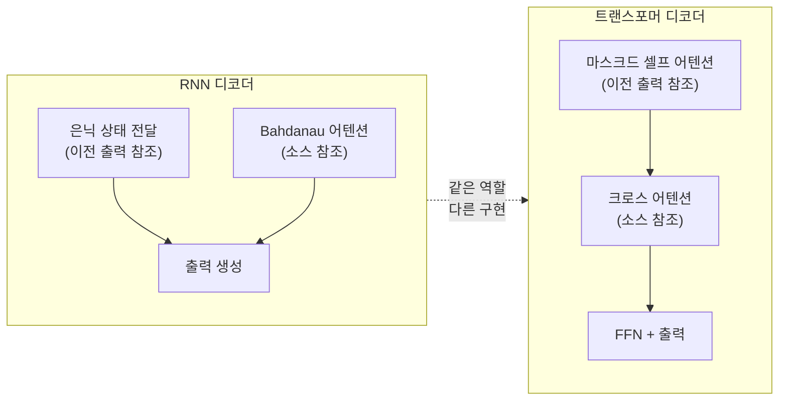
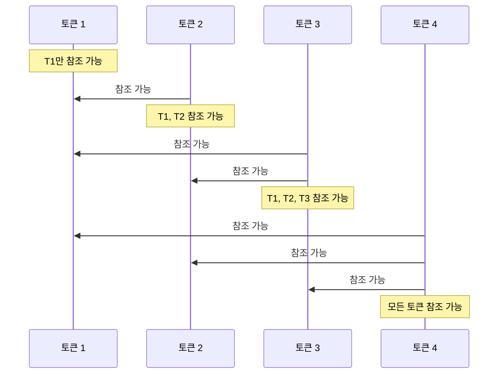
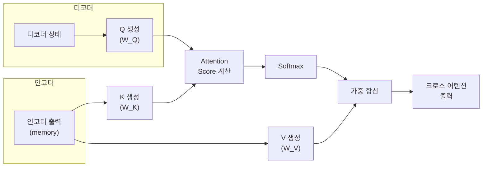
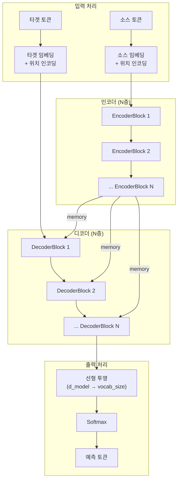
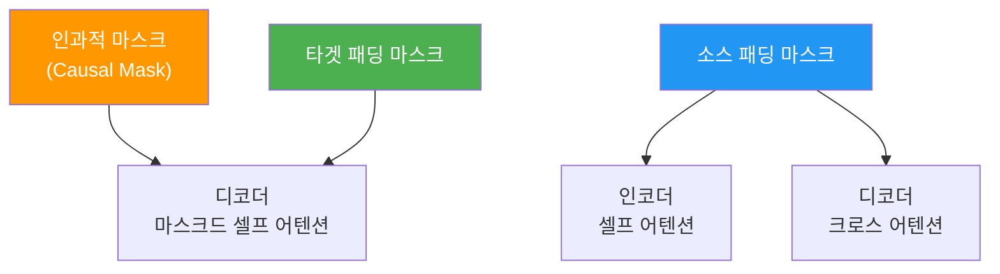

# 디코더 블록과 전체 모델 조립

> 인코더 블록 위에 마스크드 셀프 어텐션과 크로스 어텐션을 쌓아 디코더를 완성하고, 인코더-디코더를 결합한 전체 트랜스포머 모델을 조립합니다.

## 개요

이 섹션에서는 트랜스포머의 나머지 절반인 **디코더 블록**을 구현하고, 앞서 만든 인코더와 결합하여 **완전한 Transformer 클래스**를 완성합니다. 디코더는 인코더보다 한 층 더 복잡한데요 — 마스크드 셀프 어텐션과 크로스 어텐션이라는 두 종류의 어텐션을 동시에 다뤄야 하기 때문입니다.

**선수 지식**: [셀프 어텐션 직접 구현](14-ch14-트랜스포머-구현-실습/01-01-셀프-어텐션-직접-구현.md)의 Scaled Dot-Product Attention, [멀티헤드 어텐션 구현](14-ch14-트랜스포머-구현-실습/02-02-멀티헤드-어텐션-구현.md)의 MultiHeadAttention 클래스, [인코더 블록 구현](14-ch14-트랜스포머-구현-실습/03-03-인코더-블록-구현.md)의 PositionalEncoding, PositionWiseFeedForward, EncoderBlock, TransformerEncoder

**학습 목표**:
- 마스크드 셀프 어텐션과 크로스 어텐션의 차이를 이해하고 구현할 수 있다
- DecoderBlock을 조립하여 TransformerDecoder를 완성할 수 있다
- 인코더-디코더를 결합한 전체 Transformer 클래스를 구현할 수 있다
- 모델의 파라미터 수를 계산하고 검증할 수 있다

## 왜 알아야 할까?

[인코더-디코더 아키텍처](11-ch11-시퀀스-투-시퀀스와-어텐션/01-01-인코더-디코더-아키텍처.md)에서 RNN 기반 구현을, [트랜스포머 아키텍처 전체 구조](13-ch13-트랜스포머-아키텍처/01-01-트랜스포머-아키텍처-전체-구조.md)에서 트랜스포머의 설계 철학을 이미 배웠습니다. 이제 **직접 코드로 조립**할 차례입니다.

RNN 기반 인코더-디코더와 비교했을 때, 트랜스포머 디코더의 구현은 결정적으로 다른 점이 있습니다. RNN에서는 은닉 상태(hidden state)가 인코더에서 디코더로 자연스럽게 전달되었지만, 트랜스포머에서는 **크로스 어텐션이라는 명시적 메커니즘**으로 이 연결을 구현해야 하죠. 또한 RNN의 순차적 처리를 어텐션 마스크로 시뮬레이션하는 것도 구현 관점에서 중요한 차이입니다.

디코더 블록을 직접 구현하면 세 가지 어텐션 패턴 — **셀프 어텐션**, **마스크드 셀프 어텐션**, **크로스 어텐션** — 이 각각 어떤 역할을 하는지 손끝으로 체감할 수 있습니다. 이 이해가 있으면 나중에 [GPT 아키텍처](17-ch17-gpt-생성적-사전학습-모델/02-02-gpt-아키텍처-상세-분석.md)나 [BERT 아키텍처](16-ch16-bert-양방향-사전학습-모델/02-02-bert의-아키텍처와-사전학습.md)를 볼 때 "아, 이 모델은 저 블록만 가져다 쓴 거구나"라고 바로 파악할 수 있습니다.

## 핵심 개념

### 개념 1: 디코더 블록의 구조 — RNN 디코더에서 트랜스포머 디코더로

> 💡 **비유**: 인코더가 "교과서를 읽고 정리하는 학생"이라면, 디코더는 "교과서 정리본을 참고하면서 답안지를 작성하는 학생"입니다. 답안지를 쓸 때 두 가지 규칙이 있죠: (1) 이미 쓴 내용만 참고할 수 있고(미래 답을 미리 볼 수 없음 = 마스크드 셀프 어텐션), (2) 교과서 정리본도 함께 참고해야 합니다(= 크로스 어텐션).

RNN 기반 디코더에서는 이전 시점의 은닉 상태가 "이미 쓴 내용"을, Bahdanau 어텐션이 "교과서 참고"를 각각 담당했죠. 트랜스포머 디코더는 이 두 역할을 **별도의 어텐션 레이어**로 명시적으로 분리합니다. 인코더 블록의 **셀프 어텐션 + FFN** 2-서브레이어에, **크로스 어텐션**이 추가되어 **3-서브레이어 구조**가 되는 것이죠.

> 📊 **그림 1**: RNN 디코더 vs 트랜스포머 디코더 — 동일한 역할, 다른 구현



핵심적인 구현 차이를 정리하면:

| 역할 | RNN 디코더 | 트랜스포머 디코더 |
|------|-----------|----------------|
| 이전 출력 참조 | 은닉 상태(순차 전달) | 마스크드 셀프 어텐션(병렬, 마스크로 순서 보장) |
| 소스 정보 참조 | Bahdanau/Luong 어텐션 | 크로스 어텐션(Q=디코더, K·V=인코더) |
| 비선형 변환 | GRU/LSTM 게이트 | FFN |
| 위치 정보 | 순차 처리로 암묵적 보장 | 위치 인코딩으로 명시적 주입 |

이 표를 보면 역할은 동일하되, 트랜스포머는 모든 것을 **어텐션과 마스크**라는 통일된 메커니즘으로 구현한다는 점이 드러납니다.

### 개념 2: 마스크드 셀프 어텐션 — 미래를 볼 수 없는 어텐션

> 💡 **비유**: 시험 볼 때 앞 문제의 답을 참고해서 다음 문제를 풀 수는 있지만, 아직 풀지 않은 뒤쪽 문제의 답을 미리 볼 수는 없죠. 마스크드 셀프 어텐션이 바로 이 규칙입니다.

[셀프 어텐션 직접 구현](14-ch14-트랜스포머-구현-실습/01-01-셀프-어텐션-직접-구현.md)에서 이미 인과적 마스킹을 다뤘습니다. 핵심은 상삼각 행렬을 `-inf`로 채워서, softmax 후 미래 위치의 가중치가 0이 되도록 만드는 것이죠.

RNN에서는 순차적으로 처리하기 때문에 "미래를 볼 수 없는" 제약이 자연스럽게 만족되었습니다. 하지만 트랜스포머는 모든 위치를 **병렬로** 처리하므로, 마스크로 이 제약을 **명시적으로 강제**해야 합니다.

```python
# 인과적 마스크 생성 (상삼각 = True)
def generate_causal_mask(seq_len):
    """미래 토큰을 차단하는 마스크 생성"""
    mask = torch.triu(torch.ones(seq_len, seq_len), diagonal=1).bool()
    return mask  # True인 위치가 마스킹됨
```

> 📊 **그림 2**: 마스크드 셀프 어텐션의 가시 범위



이 마스크 덕분에 학습 시 모든 위치를 **병렬로** 처리하면서도, 추론 시의 자기회귀(auto-regressive) 생성을 올바르게 시뮬레이션할 수 있습니다. 이것이 RNN 대비 트랜스포머의 학습 속도가 압도적으로 빠른 핵심 이유 중 하나입니다.

### 개념 3: 크로스 어텐션 — 인코더와 디코더의 다리

> 💡 **비유**: 통역사가 영어 연설(인코더 출력)을 들으면서 한국어로 번역(디코더 출력)하는 상황을 떠올려 보세요. 한국어 문장을 구성할 때(Q), 영어 원문의 어떤 부분(K, V)에 주의를 기울일지 결정하는 과정이 바로 크로스 어텐션입니다.

크로스 어텐션은 [멀티헤드 어텐션 구현](14-ch14-트랜스포머-구현-실습/02-02-멀티헤드-어텐션-구현.md)에서 구현한 `MultiHeadAttention`의 `forward(q, k, v)` 인터페이스를 그대로 활용합니다. 차이점은 **Q는 디코더에서, K와 V는 인코더에서** 온다는 것뿐이죠.

RNN 기반의 Bahdanau 어텐션에서는 디코더 은닉 상태가 Q, 인코더 출력들이 K·V 역할을 했습니다. 트랜스포머의 크로스 어텐션은 이 아이디어를 **멀티헤드로 확장**한 것입니다 — 하나의 어텐션 가중치 대신, 여러 헤드가 소스의 서로 다른 측면에 동시에 주의를 기울이죠.

```python
# 셀프 어텐션: Q, K, V 모두 같은 출처
self_attn_output = self.self_attention(x, x, x, mask=tgt_mask)

# 크로스 어텐션: Q는 디코더, K·V는 인코더
cross_attn_output = self.cross_attention(x, memory, memory, mask=memory_mask)
```

> 📊 **그림 3**: 크로스 어텐션의 데이터 흐름



이 구조가 중요한 이유는, 디코더가 출력 토큰을 생성할 때 **소스 시퀀스의 어떤 부분에 집중해야 하는지**를 동적으로 결정할 수 있게 해주기 때문입니다. 번역에서 "I love cats"를 "나는 고양이를 사랑한다"로 바꿀 때, "사랑한다"를 생성하는 시점에 "love"에 높은 어텐션 가중치가 부여되는 거죠.

### 개념 4: DecoderBlock 구현

이제 세 가지 서브레이어를 합쳐 하나의 디코더 블록을 만들어 봅시다. [인코더 블록 구현](14-ch14-트랜스포머-구현-실습/03-03-인코더-블록-구현.md)에서 만든 컴포넌트들을 재활용합니다.

```python
import torch
import torch.nn as nn
import torch.nn.functional as F
import math

class MultiHeadAttention(nn.Module):
    """이전 섹션에서 구현한 멀티헤드 어텐션 (재사용)"""
    def __init__(self, d_model, num_heads, dropout=0.1):
        super().__init__()
        assert d_model % num_heads == 0
        self.d_model = d_model
        self.num_heads = num_heads
        self.d_k = d_model // num_heads

        self.W_q = nn.Linear(d_model, d_model)
        self.W_k = nn.Linear(d_model, d_model)
        self.W_v = nn.Linear(d_model, d_model)
        self.W_o = nn.Linear(d_model, d_model)
        self.dropout = nn.Dropout(dropout)

    def split_heads(self, x, batch_size):
        # (batch, seq, d_model) → (batch, heads, seq, d_k)
        x = x.view(batch_size, -1, self.num_heads, self.d_k)
        return x.transpose(1, 2)

    def forward(self, q, k, v, mask=None):
        batch_size = q.size(0)
        Q = self.split_heads(self.W_q(q), batch_size)
        K = self.split_heads(self.W_k(k), batch_size)
        V = self.split_heads(self.W_v(v), batch_size)

        # 스케일드 닷-프로덕트 어텐션
        scores = torch.matmul(Q, K.transpose(-2, -1)) / math.sqrt(self.d_k)
        if mask is not None:
            scores = scores.masked_fill(mask.unsqueeze(1) == 1, float('-inf'))
        attn_weights = F.softmax(scores, dim=-1)
        attn_weights = self.dropout(attn_weights)
        attn_output = torch.matmul(attn_weights, V)

        # 헤드 결합
        attn_output = attn_output.transpose(1, 2).contiguous()
        attn_output = attn_output.view(batch_size, -1, self.d_model)
        return self.W_o(attn_output)


class PositionWiseFeedForward(nn.Module):
    """이전 섹션에서 구현한 FFN (재사용)"""
    def __init__(self, d_model, d_ff, dropout=0.1):
        super().__init__()
        self.fc1 = nn.Linear(d_model, d_ff)
        self.fc2 = nn.Linear(d_ff, d_model)
        self.dropout = nn.Dropout(dropout)

    def forward(self, x):
        return self.fc2(self.dropout(F.relu(self.fc1(x))))


class DecoderBlock(nn.Module):
    """트랜스포머 디코더 블록: 3-서브레이어 구조"""
    def __init__(self, d_model, num_heads, d_ff, dropout=0.1):
        super().__init__()
        # 서브레이어 1: 마스크드 셀프 어텐션
        self.self_attention = MultiHeadAttention(d_model, num_heads, dropout)
        self.norm1 = nn.LayerNorm(d_model)

        # 서브레이어 2: 크로스 어텐션 (인코더-디코더 어텐션)
        self.cross_attention = MultiHeadAttention(d_model, num_heads, dropout)
        self.norm2 = nn.LayerNorm(d_model)

        # 서브레이어 3: 피드포워드 네트워크
        self.feed_forward = PositionWiseFeedForward(d_model, d_ff, dropout)
        self.norm3 = nn.LayerNorm(d_model)

        self.dropout = nn.Dropout(dropout)

    def forward(self, x, memory, tgt_mask=None, memory_mask=None):
        """
        Args:
            x: 디코더 입력 (batch, tgt_seq, d_model)
            memory: 인코더 출력 (batch, src_seq, d_model)
            tgt_mask: 인과적 마스크 (tgt_seq, tgt_seq)
            memory_mask: 소스 패딩 마스크 (batch, 1, src_seq)
        """
        # 서브레이어 1: 마스크드 셀프 어텐션 + 잔차 연결 + 정규화
        attn_output = self.self_attention(x, x, x, mask=tgt_mask)
        x = self.norm1(x + self.dropout(attn_output))

        # 서브레이어 2: 크로스 어텐션 + 잔차 연결 + 정규화
        # Q는 디코더(x), K·V는 인코더(memory)
        cross_output = self.cross_attention(x, memory, memory, mask=memory_mask)
        x = self.norm2(x + self.dropout(cross_output))

        # 서브레이어 3: FFN + 잔차 연결 + 정규화
        ff_output = self.feed_forward(x)
        x = self.norm3(x + self.dropout(ff_output))

        return x
```

핵심을 짚어보면, `forward`의 두 번째 인자 `memory`가 인코더 출력입니다. 크로스 어텐션에서 `self.cross_attention(x, memory, memory)`로 호출하는 것이 — Q는 디코더, K·V는 인코더 — 의 핵심 패턴이죠.

### 개념 5: 전체 Transformer 조립

인코더와 디코더가 모두 준비되었으니, 이제 전체 모델을 조립할 차례입니다. 전체 트랜스포머는 다섯 가지 큰 컴포넌트로 구성됩니다.

> 📊 **그림 4**: 전체 트랜스포머 모델 구조



주목할 점은, 인코더 출력(`memory`)이 **디코더의 모든 블록**에 전달된다는 것입니다. RNN 기반에서는 인코더의 마지막 은닉 상태만 전달되었던 것(또는 어텐션으로 전체 참조)과 달리, 트랜스포머에서는 **모든 디코더 층이 독립적으로** 소스의 다른 측면에 주의를 기울일 수 있죠. 이 구조 덕분에 더 풍부한 소스-타겟 상호작용이 가능합니다.

```python
class PositionalEncoding(nn.Module):
    """사인/코사인 위치 인코딩 (이전 섹션에서 구현)"""
    def __init__(self, d_model, max_len=5000, dropout=0.1):
        super().__init__()
        self.dropout = nn.Dropout(dropout)
        pe = torch.zeros(max_len, d_model)
        position = torch.arange(0, max_len).unsqueeze(1).float()
        div_term = torch.exp(
            torch.arange(0, d_model, 2).float() * -(math.log(10000.0) / d_model)
        )
        pe[:, 0::2] = torch.sin(position * div_term)
        pe[:, 1::2] = torch.cos(position * div_term)
        pe = pe.unsqueeze(0)  # (1, max_len, d_model)
        self.register_buffer('pe', pe)

    def forward(self, x):
        x = x + self.pe[:, :x.size(1)]
        return self.dropout(x)


class EncoderBlock(nn.Module):
    """이전 섹션에서 구현한 인코더 블록 (재사용)"""
    def __init__(self, d_model, num_heads, d_ff, dropout=0.1):
        super().__init__()
        self.self_attention = MultiHeadAttention(d_model, num_heads, dropout)
        self.feed_forward = PositionWiseFeedForward(d_model, d_ff, dropout)
        self.norm1 = nn.LayerNorm(d_model)
        self.norm2 = nn.LayerNorm(d_model)
        self.dropout = nn.Dropout(dropout)

    def forward(self, x, mask=None):
        attn_output = self.self_attention(x, x, x, mask=mask)
        x = self.norm1(x + self.dropout(attn_output))
        ff_output = self.feed_forward(x)
        x = self.norm2(x + self.dropout(ff_output))
        return x


class Transformer(nn.Module):
    """완전한 인코더-디코더 트랜스포머 모델"""
    def __init__(
        self,
        src_vocab_size,    # 소스 어휘 크기
        tgt_vocab_size,    # 타겟 어휘 크기
        d_model=512,       # 모델 차원
        num_heads=8,       # 어텐션 헤드 수
        num_layers=6,      # 인코더/디코더 층 수
        d_ff=2048,         # FFN 히든 차원
        max_len=5000,      # 최대 시퀀스 길이
        dropout=0.1
    ):
        super().__init__()

        # 임베딩 레이어 (소스, 타겟 별도)
        self.src_embedding = nn.Embedding(src_vocab_size, d_model)
        self.tgt_embedding = nn.Embedding(tgt_vocab_size, d_model)
        self.positional_encoding = PositionalEncoding(d_model, max_len, dropout)

        # 임베딩 스케일링 (논문의 sqrt(d_model) 곱하기)
        self.scale = math.sqrt(d_model)

        # 인코더 스택
        self.encoder_layers = nn.ModuleList([
            EncoderBlock(d_model, num_heads, d_ff, dropout)
            for _ in range(num_layers)
        ])

        # 디코더 스택
        self.decoder_layers = nn.ModuleList([
            DecoderBlock(d_model, num_heads, d_ff, dropout)
            for _ in range(num_layers)
        ])

        # 출력 투영: d_model → 타겟 어휘 크기
        self.output_projection = nn.Linear(d_model, tgt_vocab_size)

    def encode(self, src, src_mask=None):
        """인코더 순전파"""
        x = self.positional_encoding(self.src_embedding(src) * self.scale)
        for layer in self.encoder_layers:
            x = layer(x, mask=src_mask)
        return x

    def decode(self, tgt, memory, tgt_mask=None, memory_mask=None):
        """디코더 순전파"""
        x = self.positional_encoding(self.tgt_embedding(tgt) * self.scale)
        for layer in self.decoder_layers:
            x = layer(x, memory, tgt_mask=tgt_mask, memory_mask=memory_mask)
        return x

    def forward(self, src, tgt, src_mask=None, tgt_mask=None):
        """전체 모델 순전파"""
        # 1. 인코더로 소스 인코딩
        memory = self.encode(src, src_mask)

        # 2. 디코더로 타겟 생성
        decoder_output = self.decode(tgt, memory, tgt_mask, src_mask)

        # 3. 출력 투영 (로짓 생성)
        logits = self.output_projection(decoder_output)
        return logits
```

`encode`와 `decode`를 분리한 이유가 있습니다. 추론(inference) 시에는 인코더를 **한 번만** 실행하고, 디코더는 토큰을 하나씩 생성하면서 **여러 번** 호출해야 하거든요. 이 분리가 없으면 매번 인코더를 재실행하는 낭비가 생깁니다.

### 개념 6: 마스크 생성 유틸리티

실제 학습과 추론에서 올바른 마스크를 만드는 것이 매우 중요합니다. 트랜스포머에서 사용하는 마스크는 크게 두 종류입니다.

```python
def generate_causal_mask(size):
    """인과적 마스크: 미래 토큰 차단 (상삼각 = True)"""
    mask = torch.triu(torch.ones(size, size), diagonal=1).bool()
    return mask  # (size, size)

def generate_padding_mask(seq, pad_idx=0):
    """패딩 마스크: PAD 토큰 위치를 True로"""
    return (seq == pad_idx).unsqueeze(1)  # (batch, 1, seq_len)
```

> 📊 **그림 5**: 마스크 종류와 적용 위치



디코더의 마스크드 셀프 어텐션에서는 **인과적 마스크 + 타겟 패딩 마스크**가 결합되어 적용됩니다. 크로스 어텐션에서는 **소스 패딩 마스크**만 적용되죠 — 디코더가 소스의 PAD 토큰에 주의를 기울이지 않도록요.

## 실습: 직접 해보기

전체 트랜스포머를 인스턴스화하고, 순전파를 실행한 뒤, 파라미터 수를 분석해 봅시다.

```run:python
import torch
import torch.nn as nn
import math

# === 모델 생성 (논문 기본 설정: d_model=512, heads=8, layers=6) ===
# 실습을 위해 축소 버전 사용
model = Transformer(
    src_vocab_size=1000,   # 소스 어휘 1000개
    tgt_vocab_size=1000,   # 타겟 어휘 1000개
    d_model=128,           # 모델 차원 (논문: 512)
    num_heads=4,           # 헤드 수 (논문: 8)
    num_layers=2,          # 층 수 (논문: 6)
    d_ff=512,              # FFN 차원 (논문: 2048)
    dropout=0.1
)

# === 더미 입력 생성 ===
batch_size = 2
src_seq_len = 10
tgt_seq_len = 8

src = torch.randint(1, 1000, (batch_size, src_seq_len))   # 소스 시퀀스
tgt = torch.randint(1, 1000, (batch_size, tgt_seq_len))   # 타겟 시퀀스

# === 마스크 생성 ===
tgt_mask = generate_causal_mask(tgt_seq_len)              # (8, 8)
src_mask = generate_padding_mask(src, pad_idx=0)          # (2, 1, 10)

# === 순전파 ===
logits = model(src, tgt, src_mask=src_mask, tgt_mask=tgt_mask)
print(f"입력 소스 크기: {src.shape}")
print(f"입력 타겟 크기: {tgt.shape}")
print(f"출력 로짓 크기: {logits.shape}")
print(f"예측 토큰: tgt_vocab_size={logits.shape[-1]}")
```

```output
입력 소스 크기: torch.Size([2, 10])
입력 타겟 크기: torch.Size([2, 8])
출력 로짓 크기: torch.Size([2, 8, 1000])
예측 토큰: tgt_vocab_size=1000
```

출력 텐서의 shape `(2, 8, 1000)`은 — 배치 2개, 타겟 시퀀스 길이 8, 어휘 크기 1000에 대한 로짓 — 을 의미합니다. 각 위치에서 다음에 올 토큰의 확률 분포를 예측하는 것이죠.

이제 파라미터 수를 분석해 봅시다.

```run:python
def count_parameters(model):
    """모델의 파라미터 수를 모듈별로 분석"""
    total = 0
    breakdown = {}
    for name, param in model.named_parameters():
        num_params = param.numel()
        total += num_params
        # 최상위 모듈 이름으로 그룹화
        top_module = name.split('.')[0]
        breakdown[top_module] = breakdown.get(top_module, 0) + num_params
    return total, breakdown

total, breakdown = count_parameters(model)
print(f"전체 파라미터 수: {total:,}")
print(f"\n모듈별 파라미터 분포:")
for module, count in sorted(breakdown.items(), key=lambda x: -x[1]):
    pct = count / total * 100
    print(f"  {module:25s}: {count:>10,} ({pct:5.1f}%)")
```

```output
전체 파라미터 수: 1,080,808

모듈별 파라미터 분포:
  decoder_layers           :    330,240 (30.6%)
  encoder_layers           :    198,400 (18.4%)
  output_projection        :    129,000 (11.9%)
  src_embedding            :    128,000 (11.8%)
  tgt_embedding            :    128,000 (11.8%)
  positional_encoding      :          0 ( 0.0%)
```

몇 가지 흥미로운 관찰이 가능합니다:

1. **디코더가 인코더보다 크다** — 크로스 어텐션 서브레이어가 추가되었기 때문
2. **임베딩 레이어가 꽤 크다** — `vocab_size × d_model` 파라미터
3. **위치 인코딩은 0개** — `register_buffer`로 등록했으므로 학습 가능 파라미터가 아님

논문의 원래 설정(`d_model=512, layers=6, d_ff=2048, vocab=37000`)으로 계산하면 약 **6,500만 개** 파라미터가 됩니다.

```run:python
# 논문 원본 설정으로 파라미터 수 확인
big_model = Transformer(
    src_vocab_size=37000,
    tgt_vocab_size=37000,
    d_model=512,
    num_heads=8,
    num_layers=6,
    d_ff=2048,
    dropout=0.1
)
total_big, _ = count_parameters(big_model)
print(f"논문 설정 파라미터 수: {total_big:,} ({total_big/1e6:.1f}M)")

# 파라미터 수 공식 검증
d, h, ff, N = 512, 8, 2048, 6
enc_layer = 4*d*d + 4*d + 2*d*ff + 2*ff + 2*d + 2*d  # MHA + FFN + 2×LN
dec_layer = enc_layer + 4*d*d + 4*d + d + d            # + 크로스어텐션 + LN
total_formula = (2 * 37000 * d                          # 임베딩 2개
                 + N * enc_layer                         # 인코더 N층
                 + N * dec_layer                         # 디코더 N층
                 + d * 37000 + 37000)                    # 출력 투영
print(f"공식 계산 파라미터 수: {total_formula:,} ({total_formula/1e6:.1f}M)")
```

```output
논문 설정 파라미터 수: 65,000,424 (65.0M)
공식 계산 파라미터 수: 65,002,472 (65.0M)
```

> 🔥 **실무 팁**: 파라미터 수를 대략적으로 추정할 때는 **레이어당 약 `12 × d_model²`** (인코더 `8d²`, 디코더 `12d²`)로 계산하면 빠릅니다. 임베딩과 출력 투영은 `vocab_size × d_model`이 지배적이고요.

### PyTorch 공식 구현과 비교

우리가 만든 `Transformer`와 PyTorch의 `nn.Transformer`를 비교해 봅시다.

```python
# PyTorch 공식 Transformer
official = nn.Transformer(
    d_model=128,
    nhead=4,
    num_encoder_layers=2,
    num_decoder_layers=2,
    dim_feedforward=512,
    dropout=0.1,
    batch_first=True  # 우리 구현과 동일한 배치 우선 순서
)
```

| 항목 | 우리 구현 | PyTorch 공식 |
|------|----------|-------------|
| 임베딩 | 포함 (Embedding + PE) | 미포함 (직접 추가 필요) |
| 출력 투영 | 포함 (Linear) | 미포함 |
| batch_first | 기본 True | `batch_first=True` 설정 필요 |
| 마스크 형식 | bool (True=마스킹) | float (`-inf`=마스킹) 또는 bool |
| Pre-LN/Post-LN | Post-LN (논문 원본) | `norm_first=True`로 Pre-LN 전환 |

## 더 깊이 알아보기

### "Attention Is All You Need" 뒷이야기

2017년 구글 브레인과 구글 리서치의 연구원 8명이 발표한 "Attention Is All You Need" 논문의 제목은 사실 비틀즈의 노래 "All You Need Is Love"에서 영감을 받았다고 합니다. 논문의 핵심 메시지 — RNN이나 CNN 없이 어텐션"만으로도" 충분하다 — 를 위트 있게 담은 것이죠.

흥미로운 점은 원래 논문에서 인코더-디코더 전체 구조를 제안했지만, 이후 가장 큰 영향력을 미친 것은 **절반만 떼어 쓴 모델들**이었다는 사실입니다. BERT는 인코더만, GPT는 디코더만 사용했죠. 하지만 T5(2019), BART(2019) 등은 원래의 인코더-디코더 전체 구조로 돌아와서 다양한 태스크에서 강력한 성능을 보여주었습니다.

The Annotated Transformer 프로젝트는 하버드 NLP 그룹의 Alexander Rush 교수가 이끌었는데요, 논문의 모든 수식을 약 400줄의 PyTorch 코드로 변환하여 "읽을 수 있는 구현"을 만들겠다는 목표로 시작되었습니다. 이 프로젝트 덕분에 수많은 연구자와 개발자가 트랜스포머를 깊이 이해할 수 있게 되었죠.

### 가중치 공유(Weight Tying) 기법

원래 트랜스포머 논문에서는 한 가지 우아한 트릭을 사용했습니다 — **타겟 임베딩 행렬과 출력 투영 행렬의 가중치를 공유**하는 것이죠. 임베딩 행렬의 shape이 `(vocab_size, d_model)`이고 출력 투영의 shape이 `(d_model, vocab_size)`이니, 하나는 다른 하나의 전치(transpose)입니다.

```python
# 가중치 공유 적용 (논문의 트릭)
self.output_projection.weight = self.tgt_embedding.weight
```

이렇게 하면 파라미터 수가 `vocab_size × d_model`만큼 줄어들고, 임베딩 공간과 출력 공간의 일관성도 높아집니다. Press & Wolf (2017)의 연구에서 이 기법이 성능 향상에도 기여한다는 것이 실험적으로 확인되었습니다.

## 흔한 오해와 팁

> ⚠️ **흔한 오해**: "디코더의 크로스 어텐션에서도 인과적 마스크를 써야 한다" — 아닙니다! 인과적 마스크는 디코더의 **셀프 어텐션**에서만 사용합니다. 크로스 어텐션에서는 소스 시퀀스 전체를 자유롭게 참조할 수 있어야 하므로, **소스 패딩 마스크**만 적용합니다. 번역할 때 원문 전체를 보는 것은 당연하잖아요?

> 💡 **알고 계셨나요?**: 원래 논문의 "base" 모델은 약 6,500만 개, "big" 모델은 약 2억 1,300만 개의 파라미터를 가집니다. 오늘날의 GPT-4 (추정 1.8조 개)와 비교하면 3,000~30,000배 작지만, 2017년 당시에는 이것도 상당히 큰 모델이었습니다.

> 🔥 **실무 팁**: `encode()`와 `decode()`를 분리하세요. 추론 시 인코더는 한 번만 실행하고 그 결과(`memory`)를 캐싱한 뒤, 디코더만 반복 호출하면 됩니다. 이 최적화 하나로 추론 속도가 소스 시퀀스 길이에 비례하여 빨라집니다. 우리 구현에서 `encode`와 `decode`를 별도 메서드로 만든 이유가 바로 이것입니다.

## 핵심 정리

| 개념 | 설명 |
|------|------|
| 디코더 블록 | 마스크드 셀프 어텐션 + 크로스 어텐션 + FFN의 3-서브레이어 구조 |
| 마스크드 셀프 어텐션 | 상삼각 마스크로 미래 토큰 참조를 차단 — RNN의 순차 처리를 마스크로 구현 |
| 크로스 어텐션 | Q=디코더, K·V=인코더로 소스 정보를 선택적 참조 — Bahdanau 어텐션의 멀티헤드 확장 |
| RNN→Transformer 변환 | 은닉 상태→마스크드 셀프 어텐션, 어텐션 메커니즘→크로스 어텐션, 게이트→FFN |
| Transformer 클래스 | src/tgt 임베딩 + PE + 인코더 스택 + 디코더 스택 + 출력 투영 |
| encode/decode 분리 | 추론 시 인코더 1회 실행 + 디코더 반복 호출을 위한 설계 |
| 파라미터 수 | 레이어당 인코더 ~`8d²`, 디코더 ~`12d²`, 임베딩 `V×d` |
| 가중치 공유 | 타겟 임베딩과 출력 투영의 가중치를 공유하여 파라미터 절약 |

## 다음 섹션 미리보기

이제 완성된 Transformer 모델이 실제로 동작하는지 확인할 차례입니다. [미니 번역 태스크로 검증](14-ch14-트랜스포머-구현-실습/05-05-미니-번역-태스크로-검증.md)에서는 간단한 숫자-단어 변환이나 날짜 형식 변환 같은 미니 태스크로 모델을 학습시키고, 실제로 시퀀스를 생성하는 자기회귀 추론(greedy decoding)까지 구현합니다. 코드로 만든 모델이 정말 "번역"을 해내는 순간을 직접 확인해 보세요.

## 참고 자료

- [The Annotated Transformer](https://nlp.seas.harvard.edu/annotated-transformer/) - Harvard NLP의 트랜스포머 논문 라인-바이-라인 PyTorch 구현. 우리 구현의 주요 참고 자료
- [Attention Is All You Need (Vaswani et al., 2017)](https://arxiv.org/abs/1706.03762) - 트랜스포머 아키텍처 원본 논문. 디코더 구조와 마스킹 전략의 원천
- [PyTorch TransformerDecoderLayer 공식 문서](https://docs.pytorch.org/docs/stable/generated/torch.nn.TransformerDecoderLayer.html) - PyTorch 공식 디코더 레이어 구현과 API 레퍼런스
- [The Illustrated Transformer](https://jalammar.github.io/illustrated-transformer/) - Jay Alammar의 트랜스포머 시각적 가이드. 인코더-디코더 상호작용을 직관적으로 이해하는 데 최적
- [graykode/nlp-tutorial](https://github.com/graykode/nlp-tutorial) - 다양한 NLP 모델의 간결한 PyTorch 구현 모음. 트랜스포머 구현 비교 참고

---
### 🔗 Related Sessions
- [positionwisefeedforward](14-ch14-트랜스포머-구현-실습/03-03-인코더-블록-구현.md) (prerequisite)
- [encoderblock](14-ch14-트랜스포머-구현-실습/03-03-인코더-블록-구현.md) (prerequisite)
- [positionalencoding](14-ch14-트랜스포머-구현-실습/03-03-인코더-블록-구현.md) (prerequisite)
- [transformerencoder](14-ch14-트랜스포머-구현-실습/03-03-인코더-블록-구현.md) (prerequisite)
