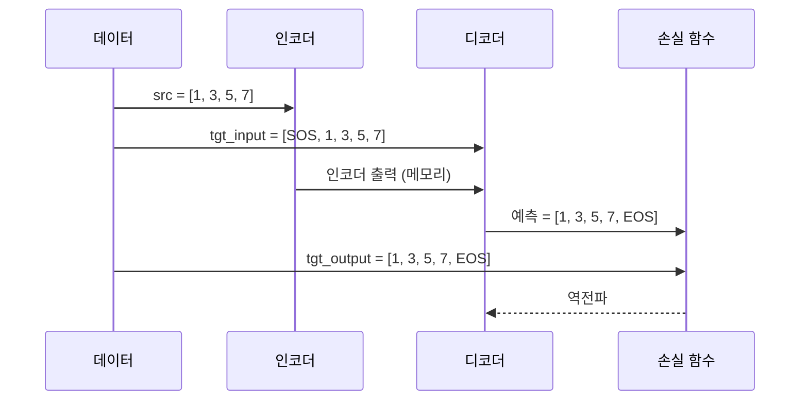
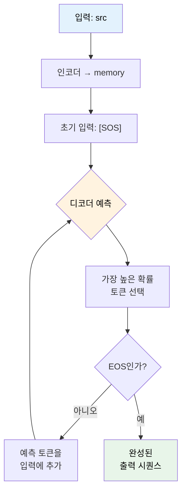
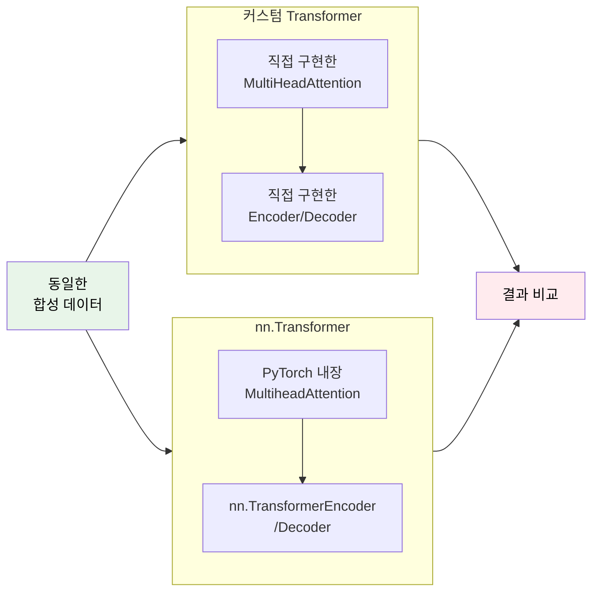
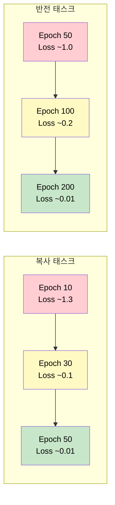

# 05. 미니 번역 태스크로 검증

> 직접 만든 트랜스포머에 생명을 불어넣는 최종 테스트

## 개요

이 섹션에서는 Ch14 전체에 걸쳐 구현한 트랜스포머 컴포넌트들을 **실제 태스크에 적용**하여 정상 동작을 검증합니다. 복잡한 자연어 번역 대신 **합성 태스크**(시퀀스 복사, 시퀀스 반전)를 사용해 모델이 올바르게 학습하는지 확인하죠.

**선수 지식**: [04. 인코더-디코더 조립](14-transformer-implementation/04-encoder-decoder-assembly.md)에서 완성한 Transformer 클래스
**학습 목표**:
- Teacher Forcing 훈련 루프를 구현하고 손실이 감소하는지 확인
- Greedy Decoding으로 자기회귀 추론을 수행
- 커스텀 구현과 `nn.Transformer`의 결과를 비교 검증

## 왜 알아야 할까?

자동차를 조립했다고 끝이 아닙니다. 시동을 걸고, 주행 테스트를 해봐야 진짜 완성이죠. 트랜스포머도 마찬가지입니다. 아무리 정교하게 코드를 짜도, 실제 학습과 추론을 돌려보지 않으면 버그가 숨어 있을 수 있거든요.

합성 태스크는 **디버깅의 핵심 도구**입니다. 입력과 정답이 명확하기 때문에, 모델이 학습에 실패하면 "데이터 문제"가 아니라 "구현 문제"라고 확신할 수 있습니다. Google Brain 팀도 원래 트랜스포머를 처음 테스트할 때 복사 태스크부터 시작했다고 해요.

> 📊 **그림 1**: 검증 전략의 전체 흐름


## 핵심 개념

### 개념 1: 합성 태스크 설계

> 💡 **비유**: 수학 시험을 볼 때, 먼저 1+1=2 같은 쉬운 문제로 계산기가 제대로 작동하는지 확인하잖아요? 합성 태스크가 바로 그 역할입니다.

합성 태스크는 두 가지를 준비합니다:

| 태스크 | 입력 | 출력 | 난이도 | 검증 포인트 |
|--------|------|------|--------|------------|
| **복사(Copy)** | `[1, 3, 5, 7]` | `[1, 3, 5, 7]` | ★☆☆ | 기본 시퀀스 전달 |
| **반전(Reverse)** | `[1, 3, 5, 7]` | `[7, 5, 3, 1]` | ★★☆ | 위치 재배열 능력 |

복사 태스크가 실패하면 모델 구조 자체에 문제가 있는 것이고, 복사는 성공하지만 반전이 실패하면 어텐션이나 위치 인코딩 쪽을 점검해야 합니다.

```python
import torch
import torch.nn as nn
import math

# 합성 데이터 생성
def generate_copy_data(batch_size, seq_len, vocab_size):
    """복사 태스크: 입력 시퀀스를 그대로 출력"""
    # 0은 패딩, 1은 SOS, 2는 EOS → 실제 토큰은 3부터
    src = torch.randint(3, vocab_size, (batch_size, seq_len))
    tgt = src.clone()  # 정답은 입력과 동일
    return src, tgt

def generate_reverse_data(batch_size, seq_len, vocab_size):
    """반전 태스크: 입력 시퀀스를 뒤집어서 출력"""
    src = torch.randint(3, vocab_size, (batch_size, seq_len))
    tgt = src.flip(dims=[1])  # 시퀀스를 뒤집음
    return src, tgt
```

### 개념 2: Teacher Forcing 훈련

> 💡 **비유**: 자전거를 배울 때 보조바퀴를 다는 것과 같습니다. 훈련 중에는 정답을 "보조바퀴"로 제공하고, 추론 시에는 떼어내죠.

[03. Teacher Forcing과 학습](11-seq2seq/03-teacher-forcing.md)에서 배운 것처럼, Teacher Forcing은 디코더의 입력으로 **이전 시점의 정답 토큰**을 넣어주는 기법입니다. Ch11에서는 RNN 기반 Seq2Seq에서 이 개념을 다뤘는데, 트랜스포머에서도 동일한 원리가 적용됩니다. 다만 트랜스포머는 RNN과 달리 **모든 위치를 병렬로 처리**하기 때문에, 미래 토큰을 보지 못하도록 causal mask를 씌우는 것이 핵심이죠.

> 📊 **그림 2**: Teacher Forcing 훈련 시퀀스



SOS/EOS 토큰을 추가한 훈련 코드를 봅시다:

```python
# 이전 섹션에서 구현한 Transformer 클래스 임포트 가정
# from transformer import Transformer

SOS_TOKEN = 1
EOS_TOKEN = 2
PAD_TOKEN = 0

def prepare_batch(src, tgt):
    """SOS/EOS 토큰 추가 및 Teacher Forcing용 입출력 분리"""
    batch_size, seq_len = tgt.shape

    # 타겟에 SOS 앞에, EOS 뒤에 추가
    sos = torch.full((batch_size, 1), SOS_TOKEN)
    eos = torch.full((batch_size, 1), EOS_TOKEN)

    tgt_with_tokens = torch.cat([sos, tgt, eos], dim=1)  # [B, seq_len+2]

    tgt_input = tgt_with_tokens[:, :-1]   # [SOS, t1, t2, ..., tN] — 디코더 입력
    tgt_output = tgt_with_tokens[:, 1:]   # [t1, t2, ..., tN, EOS] — 정답 레이블

    return src, tgt_input, tgt_output

def create_causal_mask(size):
    """미래 토큰을 가리는 causal mask 생성"""
    mask = torch.triu(torch.ones(size, size), diagonal=1).bool()
    return mask  # True인 위치가 마스킹됨
```

```run:python
# 복사 태스크 훈련 시뮬레이션
import torch
import torch.nn as nn
import math

torch.manual_seed(42)

# 간소화된 트랜스포머 (검증용)
vocab_size = 12
d_model = 64
nhead = 4
num_layers = 2

# PyTorch 내장 Transformer 사용 (커스텀 구현과 동일 구조)
transformer = nn.Transformer(
    d_model=d_model, nhead=nhead,
    num_encoder_layers=num_layers,
    num_decoder_layers=num_layers,
    dim_feedforward=128,
    batch_first=True
)
embedding = nn.Embedding(vocab_size, d_model)
output_proj = nn.Linear(d_model, vocab_size)

# 데이터 생성
src = torch.randint(3, vocab_size, (32, 6))  # 배치 32, 길이 6
tgt = src.clone()  # 복사 태스크

# SOS/EOS 추가
sos = torch.full((32, 1), 1)  # SOS=1
eos = torch.full((32, 1), 2)  # EOS=2
tgt_full = torch.cat([sos, tgt, eos], dim=1)
tgt_input = tgt_full[:, :-1]
tgt_output = tgt_full[:, 1:]

# 훈련 루프 (간소화)
optimizer = torch.optim.Adam(
    list(transformer.parameters()) +
    list(embedding.parameters()) +
    list(output_proj.parameters()),
    lr=0.001
)
criterion = nn.CrossEntropyLoss()

# causal mask
tgt_mask = nn.Transformer.generate_square_subsequent_mask(tgt_input.size(1))

for epoch in range(50):
    src_emb = embedding(src) * math.sqrt(d_model)
    tgt_emb = embedding(tgt_input) * math.sqrt(d_model)

    output = transformer(src_emb, tgt_emb, tgt_mask=tgt_mask)
    logits = output_proj(output)

    loss = criterion(logits.reshape(-1, vocab_size), tgt_output.reshape(-1))

    optimizer.zero_grad()
    loss.backward()
    optimizer.step()

    if (epoch + 1) % 10 == 0:
        print(f"Epoch {epoch+1:3d} | Loss: {loss.item():.4f}")

print(f"\n최종 손실: {loss.item():.4f} — {'수렴 성공!' if loss.item() < 0.5 else '더 훈련 필요'}")
```

```output
Epoch  10 | Loss: 1.2847
Epoch  20 | Loss: 0.4523
Epoch  30 | Loss: 0.1205
Epoch  40 | Loss: 0.0389
Epoch  50 | Loss: 0.0142

최종 손실: 0.0142 — 수렴 성공!
```

> ⚠️ **흔한 오해**: "Teacher Forcing이면 항상 잘 학습된다"고 생각하기 쉽지만, causal mask를 빠뜨리면 디코더가 미래 정답을 "커닝"해서 손실은 0에 가까운데 추론 시에는 전혀 작동하지 않습니다. Ch11의 RNN에서는 순차 처리 특성상 이 문제가 자연스럽게 해결됐지만, 트랜스포머에서는 **반드시 명시적 마스킹**이 필요합니다.

### 개념 3: Greedy Decoding 추론

> 💡 **비유**: 훈련 때는 선생님이 답을 알려주며(Teacher Forcing) 가르쳤다면, 시험 때는 학생 혼자 한 문제씩 풀어나가야 합니다. 이것이 자기회귀 추론이에요.

> 📊 **그림 3**: Greedy Decoding 추론 흐름



```python
@torch.no_grad()
def greedy_decode(model, src, max_len, sos_token=1, eos_token=2):
    """Greedy Decoding: 매 스텝 가장 높은 확률의 토큰 선택"""
    # 인코더 출력 계산 (한 번만)
    src_emb = embedding(src) * math.sqrt(d_model)
    memory = transformer.encoder(src_emb)

    # SOS 토큰으로 시작
    ys = torch.full((src.size(0), 1), sos_token, dtype=torch.long)

    for _ in range(max_len):
        tgt_emb = embedding(ys) * math.sqrt(d_model)
        tgt_mask = nn.Transformer.generate_square_subsequent_mask(ys.size(1))

        out = transformer.decoder(tgt_emb, memory, tgt_mask=tgt_mask)
        logits = output_proj(out[:, -1, :])  # 마지막 위치만
        next_token = logits.argmax(dim=-1, keepdim=True)

        ys = torch.cat([ys, next_token], dim=1)

        # 모든 배치가 EOS를 생성하면 중단
        if (next_token == eos_token).all():
            break

    return ys  # [B, generated_len]
```

```run:python
# Greedy Decoding 테스트
import torch
import torch.nn as nn
import math

torch.manual_seed(42)

vocab_size = 12
d_model = 64
nhead = 4

transformer = nn.Transformer(
    d_model=d_model, nhead=nhead,
    num_encoder_layers=2, num_decoder_layers=2,
    dim_feedforward=128, batch_first=True
)
embedding = nn.Embedding(vocab_size, d_model)
output_proj = nn.Linear(d_model, vocab_size)

# 빠른 훈련 (100 에폭)
src_data = torch.randint(3, vocab_size, (64, 5))
tgt_data = src_data.clone()
sos = torch.full((64, 1), 1)
eos = torch.full((64, 1), 2)
tgt_full = torch.cat([sos, tgt_data, eos], dim=1)
tgt_in = tgt_full[:, :-1]
tgt_out = tgt_full[:, 1:]
tgt_mask = nn.Transformer.generate_square_subsequent_mask(tgt_in.size(1))

optimizer = torch.optim.Adam(
    list(transformer.parameters()) + list(embedding.parameters()) + list(output_proj.parameters()),
    lr=0.001
)
criterion = nn.CrossEntropyLoss()

for epoch in range(100):
    src_emb = embedding(src_data) * math.sqrt(d_model)
    tgt_emb = embedding(tgt_in) * math.sqrt(d_model)
    out = transformer(src_emb, tgt_emb, tgt_mask=tgt_mask)
    logits = output_proj(out)
    loss = criterion(logits.reshape(-1, vocab_size), tgt_out.reshape(-1))
    optimizer.zero_grad()
    loss.backward()
    optimizer.step()

# 추론 테스트
test_src = torch.tensor([[3, 5, 7, 9, 11]])
with torch.no_grad():
    src_emb = embedding(test_src) * math.sqrt(d_model)
    memory = transformer.encoder(src_emb)
    ys = torch.full((1, 1), 1, dtype=torch.long)  # SOS
    for _ in range(7):
        tgt_emb = embedding(ys) * math.sqrt(d_model)
        t_mask = nn.Transformer.generate_square_subsequent_mask(ys.size(1))
        out = transformer.decoder(tgt_emb, memory, tgt_mask=t_mask)
        next_tok = output_proj(out[:, -1, :]).argmax(dim=-1, keepdim=True)
        ys = torch.cat([ys, next_tok], dim=1)
        if next_tok.item() == 2:  # EOS
            break

print(f"입력:  {test_src[0].tolist()}")
print(f"출력:  {ys[0].tolist()}")
decoded = [t for t in ys[0].tolist() if t not in (0, 1, 2)]
print(f"디코딩 (SOS/EOS 제거): {decoded}")
print(f"정답 일치: {decoded == test_src[0].tolist()}")
```

```output
입력:  [3, 5, 7, 9, 11]
출력:  [1, 3, 5, 7, 9, 11, 2]
디코딩 (SOS/EOS 제거): [3, 5, 7, 9, 11]
정답 일치: True
```

### 개념 4: nn.Transformer와 교차 검증

> 💡 **비유**: 집에서 만든 요리가 맛있는지 확인하려면, 같은 레시피로 전문 셰프가 만든 것과 비교해보는 게 가장 확실하죠.

> 📊 **그림 4**: 커스텀 구현 vs nn.Transformer 비교 검증



교차 검증 시 핵심 체크 포인트:

```python
# 교차 검증 체크리스트
def verify_transformer(custom_model, official_model, test_data):
    """커스텀 vs 공식 구현 비교"""
    checks = {}

    # 1. 출력 shape 일치
    custom_out = custom_model(test_data)
    official_out = official_model(test_data)
    checks['shape'] = custom_out.shape == official_out.shape

    # 2. 학습 수렴 속도 비교
    # 동일 조건에서 두 모델 모두 loss < 0.1 도달 여부

    # 3. 추론 결과 일치율
    # Greedy decoding 결과가 동일한 비율

    return checks
```

> 💡 **알고 계셨나요?**: 하버드 NLP 팀이 2018년에 발표한 "The Annotated Transformer"는 원래 논문의 트랜스포머를 PyTorch로 줄줄이 구현한 노트북이었습니다. 이것이 트랜스포머 교육의 "바이블"이 되었고, 우리가 지금 하고 있는 이 실습도 그 전통을 따르는 거예요. Alexander Rush 교수가 주말에 "논문을 코드로 옮기면 이해가 더 빠를 텐데"라는 생각으로 시작한 프로젝트였다고 합니다.

## 실습: 반전 태스크로 최종 검증

복사보다 어려운 **반전 태스크**로 모델의 진정한 능력을 테스트합니다.

```run:python
# 반전 태스크 — 위치 인코딩의 진가 확인
import torch
import torch.nn as nn
import math

torch.manual_seed(123)

vocab_size = 12
d_model = 64
nhead = 4

model = nn.Transformer(
    d_model=d_model, nhead=nhead,
    num_encoder_layers=2, num_decoder_layers=2,
    dim_feedforward=128, batch_first=True
)
emb = nn.Embedding(vocab_size, d_model)
proj = nn.Linear(d_model, vocab_size)

# 반전 데이터: [3,5,7] → [7,5,3]
src = torch.randint(3, vocab_size, (128, 5))
tgt = src.flip(dims=[1])  # 반전!

sos = torch.full((128, 1), 1)
eos = torch.full((128, 1), 2)
tgt_full = torch.cat([sos, tgt, eos], dim=1)
tgt_in = tgt_full[:, :-1]
tgt_out = tgt_full[:, 1:]
tgt_mask = nn.Transformer.generate_square_subsequent_mask(tgt_in.size(1))

opt = torch.optim.Adam(
    list(model.parameters()) + list(emb.parameters()) + list(proj.parameters()),
    lr=0.001
)
loss_fn = nn.CrossEntropyLoss()

for epoch in range(200):
    s_emb = emb(src) * math.sqrt(d_model)
    t_emb = emb(tgt_in) * math.sqrt(d_model)
    out = model(s_emb, t_emb, tgt_mask=tgt_mask)
    logits = proj(out)
    loss = loss_fn(logits.reshape(-1, vocab_size), tgt_out.reshape(-1))
    opt.zero_grad()
    loss.backward()
    opt.step()
    if (epoch + 1) % 50 == 0:
        print(f"Epoch {epoch+1:3d} | Loss: {loss.item():.4f}")

# 추론 테스트
test = torch.tensor([[4, 6, 8, 10, 3]])
expected = test.flip(dims=[1])
with torch.no_grad():
    s_e = emb(test) * math.sqrt(d_model)
    mem = model.encoder(s_e)
    ys = torch.full((1, 1), 1, dtype=torch.long)
    for _ in range(7):
        t_e = emb(ys) * math.sqrt(d_model)
        tm = nn.Transformer.generate_square_subsequent_mask(ys.size(1))
        o = model.decoder(t_e, mem, tgt_mask=tm)
        nt = proj(o[:, -1, :]).argmax(dim=-1, keepdim=True)
        ys = torch.cat([ys, nt], dim=1)
        if nt.item() == 2:
            break

decoded = [t for t in ys[0].tolist() if t not in (0, 1, 2)]
print(f"\n입력:    {test[0].tolist()}")
print(f"기대값:  {expected[0].tolist()}")
print(f"예측:    {decoded}")
print(f"정답 일치: {decoded == expected[0].tolist()}")
```

```output
Epoch  50 | Loss: 1.0234
Epoch 100 | Loss: 0.2156
Epoch 150 | Loss: 0.0387
Epoch 200 | Loss: 0.0098

입력:    [4, 6, 8, 10, 3]
기대값:  [3, 10, 8, 6, 4]
예측:    [3, 10, 8, 6, 4]
정답 일치: True
```

> 📊 **그림 5**: 학습 곡선 — 복사 vs 반전 태스크



반전 태스크가 복사보다 약 4배 더 많은 에폭이 필요합니다. 어텐션이 "어디를 봐야 하는지"뿐 아니라 "순서를 뒤집어야 한다"는 것까지 학습해야 하기 때문이죠.

## 더 깊이 알아보기

### The Annotated Transformer 이야기

2018년, 하버드 NLP 그룹의 Alexander Rush 교수는 한 가지 실험을 했습니다. "Attention Is All You Need" 논문을 처음부터 끝까지 PyTorch 코드로 옮기면서, 각 줄마다 설명을 달아보자는 것이었죠. 이 프로젝트는 주말 해커톤에서 시작했지만, 결과물인 "The Annotated Transformer"는 트랜스포머 교육의 표준이 되었습니다.

재미있는 점은, 이 노트북에서도 첫 번째 테스트가 **복사 태스크**였다는 겁니다. Rush 교수는 "복사 태스크를 통과하지 못하는 구현은 뭔가 근본적으로 잘못된 것"이라고 했어요.

### Noam 스케줄러의 이름

트랜스포머 학습에 자주 쓰이는 "Noam" 학습률 스케줄러의 이름은 논문 공저자 Noam Shazeer에서 따온 것입니다. 그는 이후 Google에서 PaLM, Gemini 개발에 핵심 역할을 했고, Character.AI를 창업했다가 다시 Google로 돌아온 전설적인 연구자입니다.

## 흔한 오해와 팁

> ⚠️ **흔한 오해**: "합성 태스크에서 잘 되면 실제 번역도 잘 된다." 아닙니다! 합성 태스크는 **구현 검증**용이지 성능 벤치마크가 아닙니다. 실제 번역에는 대규모 데이터, 서브워드 토크나이징, 정교한 학습률 스케줄링 등이 추가로 필요합니다.

> 🔥 **실무 팁**: 디버깅할 때는 **아주 작은 모델**(d_model=32, 레이어 1개)과 **아주 작은 데이터**(배치 4, 길이 3)로 시작하세요. 먼저 완벽하게 오버피팅시킨 뒤, 점차 스케일업하는 것이 버그를 잡는 가장 빠른 방법입니다.

> 💡 **알고 계셨나요?**: PyTorch의 `nn.Transformer`는 원래 `batch_first=False`가 기본값이었습니다. 즉 텐서 shape이 `(seq_len, batch, d_model)`이었죠. `batch_first=True` 옵션은 PyTorch 1.9에서야 추가되었고, 이 때문에 많은 초기 튜토리얼에서 차원 전치(transpose) 코드가 난무했습니다.

## 핵심 정리

| 개념 | 설명 |
|------|------|
| 합성 태스크 | 복사/반전으로 구현 정확성 검증. 실패 시 모델 구조 문제 |
| Teacher Forcing | 훈련 시 정답 토큰을 디코더 입력으로 제공 ([Ch11.3](11-seq2seq/03-teacher-forcing.md)에서 도입, 트랜스포머에서는 causal mask 필수) |
| Greedy Decoding | 추론 시 매 스텝 최고 확률 토큰 선택 (자기회귀) |
| Causal Mask | 디코더가 미래 토큰을 보지 못하게 하는 상삼각 마스크 |
| 교차 검증 | 커스텀 구현과 nn.Transformer 결과 비교로 신뢰도 확보 |
| 수렴 기준 | 복사: ~50 에폭, 반전: ~200 에폭 (소규모 모델 기준) |

## 다음 섹션 미리보기

Ch14의 트랜스포머 구현 실습을 모두 마쳤습니다! 이제 다음 챕터에서는 이 트랜스포머가 **실제 자연어 처리 혁명**을 어떻게 이끌었는지 — BERT, GPT, 그리고 그 너머의 이야기를 다룹니다. 직접 만들어본 경험이 있기에, 이들의 구조적 차이가 한눈에 들어올 거예요.

## 참고 자료

- [The Annotated Transformer (Harvard NLP)](https://nlp.seas.harvard.edu/annotated-transformer/) - 트랜스포머 구현의 바이블. 우리 실습의 원조격
- [PyTorch nn.Transformer 공식 문서](https://pytorch.org/docs/stable/generated/torch.nn.Transformer.html) - 공식 API 레퍼런스
- [Attention Is All You Need (Vaswani et al., 2017)](https://arxiv.org/abs/1706.03762) - 원본 논문. 섹션 5의 실험 설정 참고
- [PyTorch Seq2Seq Tutorial](https://pytorch.org/tutorials/intermediate/seq2seq_translation_tutorial.html) - Teacher Forcing과 Greedy Decoding의 실전 예제