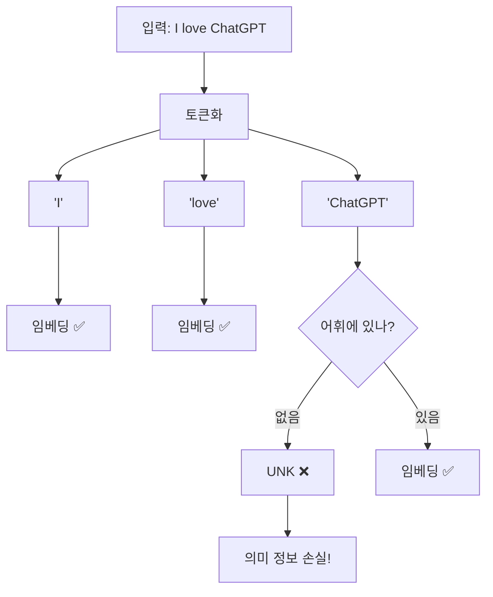
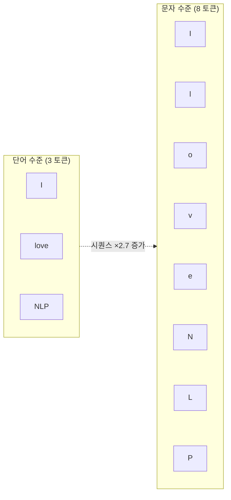
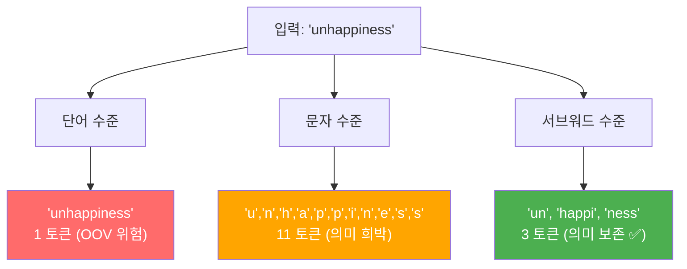
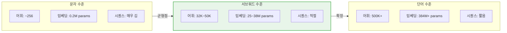
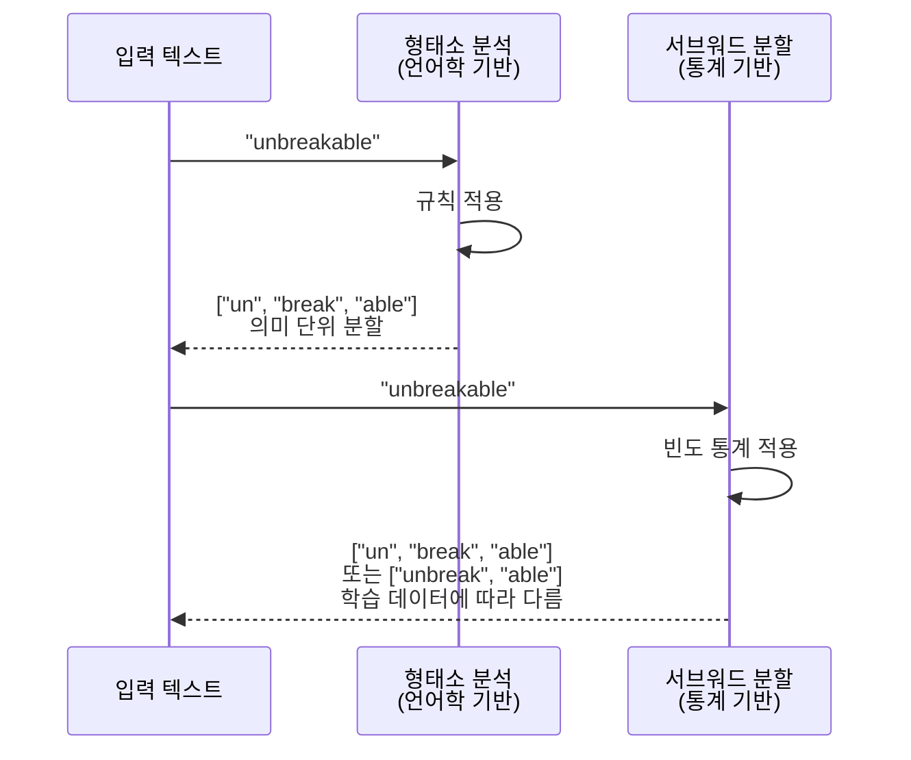

# 서브워드 토크나이제이션의 필요성

> 단어와 문자 사이의 황금 지점, 서브워드 토크나이제이션이 현대 NLP의 표준이 된 이유를 알아봅니다

## 개요

지금까지 우리는 트랜스포머 아키텍처의 내부 구조를 깊이 파고들었습니다. 어텐션 메커니즘, 위치 인코딩, 레이어 정규화까지 — 모델이 텍스트를 **어떻게 처리하는지**에 집중했죠. 이제 시선을 한 단계 앞으로 옮겨봅니다. 아무리 정교한 트랜스포머도 텍스트를 **어떻게 잘라서 넣느냐**에 따라 성능이 크게 갈립니다. 모델 아키텍처가 엔진이라면, 토크나이제이션은 연료의 품질을 결정하는 정제 과정인 셈이죠.

이 섹션에서는 [토큰화의 기초](02-ch2-텍스트-전처리-토큰화와-정규화/01-01-토큰화의-기초.md)에서 배운 단어 수준 토큰화의 한계를 극복하고, [FastText의 서브워드 임베딩](06-ch6-워드-임베딩-심화-glove와-fasttext/02-02-fasttext-서브워드-임베딩.md)에서 살짝 맛본 서브워드 개념을 본격적으로 파고듭니다. 단순히 "이런 게 있다"를 넘어, **왜 특정 어휘 크기가 최적인지**, **토크나이제이션이 모델 성능에 어떤 정량적 영향을 미치는지**까지 분석합니다.

**선수 지식**: Ch2의 토큰화 기초, Ch6의 FastText 서브워드 개념, Ch14의 트랜스포머 아키텍처 이해
**학습 목표**:
- 단어 수준 토큰화의 OOV 문제와 어휘 크기 폭발 문제를 정량적으로 분석할 수 있다
- 문자 수준 토큰화의 장단점을 트랜스포머 연산 비용과 연결지어 이해한다
- 서브워드 토크나이제이션이 두 극단의 균형점인 이유를 수학적으로 설명할 수 있다
- 형태소와 서브워드의 관계를 이해하고 차이를 구분할 수 있다
- 어휘 크기가 모델 파라미터 수와 추론 비용에 미치는 영향을 계산할 수 있다

## 왜 알아야 할까?

Ch14에서 트랜스포머의 내부 구조를 구현하면서, 입력이 이미 토큰 ID의 시퀀스라고 가정했던 걸 기억하시나요? `nn.Embedding(vocab_size, d_model)`에서 `vocab_size`를 그냥 숫자로 넣었죠. 하지만 이 숫자가 어떻게 결정되는지, 그리고 원본 텍스트가 어떤 과정을 거쳐 토큰 ID로 변환되는지는 다루지 않았습니다. **이제 그 빈칸을 채울 차례입니다.**

GPT, BERT, LLaMA — 현대 LLM의 이름을 하나라도 들어보셨다면, 이 모델들이 텍스트를 처리하는 **첫 번째 단계**가 바로 서브워드 토크나이제이션입니다. 아무리 정교한 트랜스포머 아키텍처를 설계해도, 입력 텍스트를 어떻게 쪼개느냐에 따라 모델 성능이 크게 달라지거든요.

실제로 GPT-2는 50,257개, BERT는 30,522개, LLaMA는 32,000개의 어휘(vocabulary)를 사용합니다. 이 숫자들은 우연이 아니라, 서브워드 토크나이제이션이라는 전략의 결과물이죠. 왜 100만 개도, 26개도 아닌 이 범위일까요?

더 실질적으로 말하면, 토크나이저 선택은 **비용에 직접 영향**을 줍니다. OpenAI API는 토큰 단위로 과금합니다. 같은 텍스트라도 토크나이저에 따라 토큰 수가 2~3배 차이 날 수 있고, 이는 곧 API 비용의 2~3배 차이를 의미합니다. 이 섹션에서 그 원리를 파헤쳐 보겠습니다.

> 📊 **그림 1**: 트랜스포머 파이프라인에서 토크나이제이션의 위치


## 핵심 개념

### 개념 1: 단어 수준 토큰화의 한계 — 어휘 폭발과 OOV 문제

> 💡 **비유**: 영어 사전을 상상해보세요. "love", "loved", "loving", "lovingly", "lovable", "loveliness"... 하나의 어근에서 파생된 단어가 수십 개입니다. 모든 변형을 사전에 넣으려면 사전이 끝없이 두꺼워지고, 그래도 신조어("unlovable"?)는 빠질 수밖에 없죠. 이것이 바로 단어 수준 토큰화의 딜레마입니다.

단어 수준(Word-level) 토큰화는 공백과 구두점을 기준으로 텍스트를 분리하는 가장 직관적인 방법입니다. 하지만 두 가지 근본적인 문제가 있습니다.

**문제 1: 어휘 크기 폭발(Vocabulary Explosion)**

영어만 해도 고유 단어가 수십만 개에 달하고, 한국어는 교착어 특성상 조사와 어미 변형까지 합치면 수백만 개의 어절이 가능합니다. 이 모든 단어에 고유한 임베딩 벡터를 할당하면 임베딩 행렬이 거대해지죠.

**문제 2: OOV(Out-of-Vocabulary) 문제**

학습 데이터에 없던 단어가 등장하면 `<UNK>` 토큰으로 대체됩니다. "ChatGPT"라는 단어가 학습 데이터에 없었다면? 모델은 이 단어의 의미를 전혀 파악할 수 없습니다.

> 📊 **그림 2**: 단어 수준 토큰화의 OOV 문제



```run:python
# 단어 수준 토큰화의 OOV 문제를 체험해봅시다
vocabulary = {"I", "love", "natural", "language", "processing", "is", "great"}

sentences = [
    "I love natural language processing",      # 모든 단어가 어휘에 존재
    "I love ChatGPT",                          # ChatGPT가 OOV
    "NLP is great",                            # NLP가 OOV
    "preprocessing is great",                  # preprocessing이 OOV
]

for sent in sentences:
    tokens = sent.split()
    result = []
    oov_count = 0
    for token in tokens:
        if token.lower() in {v.lower() for v in vocabulary}:
            result.append(token)
        else:
            result.append("<UNK>")
            oov_count += 1
    print(f"입력: {sent}")
    print(f"결과: {result}  (OOV: {oov_count}개)")
    print()
```

```output
입력: I love natural language processing
결과: ['I', 'love', 'natural', 'language', 'processing']  (OOV: 0개)

입력: I love ChatGPT
결과: ['I', 'love', '<UNK>']  (OOV: 1개)

입력: NLP is great
결과: ['<UNK>', 'is', 'great']  (OOV: 1개)

입력: preprocessing is great
결과: ['<UNK>', 'is', 'great']  (OOV: 1개)
```

"preprocessing"은 "pre" + "processing"으로 분해하면 의미를 파악할 수 있는데, 단어 수준 토큰화에서는 이런 구성 정보를 전혀 활용하지 못합니다. 참 아깝죠?

> ⚠️ **흔한 오해**: "어휘를 크게 만들면 OOV 문제가 해결되지 않나요?" — 어휘를 10만, 100만으로 늘려도 신조어, 오타, 전문 용어는 계속 등장합니다. 게다가 어휘가 커지면 임베딩 행렬도 비례하여 커져서 메모리와 연산 비용이 급증합니다. GPT-2의 어휘 50,257개만 해도 임베딩 차원이 768이면 약 3,860만 개의 파라미터가 임베딩에만 필요하거든요.

### 개념 2: 문자 수준 토큰화 — OOV는 해결되지만...

> 💡 **비유**: 단어 사전 대신 알파벳 26자만으로 모든 영어를 표현하려는 시도입니다. 마치 레고 블록 26개로 모든 건물을 만들 수 있는 것처럼요. 분명 뭐든 만들 수는 있지만, 블록 하나하나는 너무 작아서 "이게 집인지 차인지" 구별하기가 어렵습니다.

문자 수준(Character-level) 토큰화는 텍스트를 개별 문자로 분리합니다. 영어라면 알파벳과 특수문자 약 256개면 모든 텍스트를 표현할 수 있으니, OOV 문제가 완전히 사라지죠.

하지만 트랜스포머 관점에서 심각한 문제가 있습니다. Ch14에서 배운 셀프 어텐션의 계산 복잡도를 떠올려보세요:

$$\text{Attention Complexity} = O(n^2 \cdot d)$$

여기서 $n$은 시퀀스 길이, $d$는 차원 수입니다. 문자 수준 토큰화는 시퀀스 길이 $n$을 5~10배 늘리므로, 어텐션 연산량이 **25~100배** 증가합니다. Ch14에서 구현한 트랜스포머가 이 부담을 감당하기 어려운 이유가 여기에 있죠.

> 📊 **그림 3**: 단어 vs 문자 수준 토큰화 시퀀스 길이 비교



```run:python
# 토큰화 방식에 따른 어텐션 연산량 비교
text = "I love natural language processing"

# 단어 수준
word_tokens = text.split()
word_n = len(word_tokens)

# 문자 수준
char_tokens = list(text.replace(" ", ""))
char_n = len(char_tokens)

# 시퀀스 길이 비율
ratio = char_n / word_n

# 어텐션 연산량 (O(n^2))은 시퀀스 길이의 제곱에 비례
attn_ratio = (char_n ** 2) / (word_n ** 2)

print(f"단어 수준: {word_tokens}")
print(f"  토큰 수: {word_n}")
print()
print(f"문자 수준: {char_tokens}")
print(f"  토큰 수: {char_n}")
print()
print(f"시퀀스 길이 비율: {ratio:.1f}x")
print(f"어텐션 연산량 비율: {attn_ratio:.1f}x (n²에 비례)")
print()
print("→ 문자 수준은 어텐션 연산량이 36배 증가!")
print("→ 트랜스포머의 컨텍스트 윈도우도 훨씬 빨리 소진됩니다")
```

```output
단어 수준: ['I', 'love', 'natural', 'language', 'processing']
  토큰 수: 5

문자 수준: ['I', 'l', 'o', 'v', 'e', 'n', 'a', 't', 'u', 'r', 'a', 'l', 'l', 'a', 'n', 'g', 'u', 'a', 'g', 'e', 'p', 'r', 'o', 'c', 'e', 's', 's', 'i', 'n', 'g']
  토큰 수: 30

시퀀스 길이 비율: 6.0x
어텐션 연산량 비율: 36.0x (n²에 비례)

→ 문자 수준은 어텐션 연산량이 36배 증가!
→ 트랜스포머의 컨텍스트 윈도우도 훨씬 빨리 소진됩니다
```

문자 수준 토큰화의 핵심 문제점을 정리하면:

| 문제 | 설명 | 트랜스포머에 미치는 영향 |
|------|------|----------------------|
| 긴 시퀀스 | 토큰 수 5~10배 증가 | 어텐션 $O(n^2)$ → 연산량 25~100배 증가 |
| 의미 희박 | 'l' 하나만으로는 의미 불명 | 임베딩이 의미를 담기 어려움 |
| 장거리 의존성 | 단어 의미 파악에 여러 토큰 필요 | 어텐션이 더 긴 거리를 커버해야 함 |
| 컨텍스트 낭비 | 같은 텍스트에 더 많은 토큰 소비 | 4K/8K 윈도우가 빠르게 소진 |

### 개념 3: 서브워드 — 두 극단의 황금 지점

> 💡 **비유**: 레고로 건물을 만든다고 생각해보세요. 개별 블록(문자)은 너무 작고, 완성된 건물(단어)은 유연하지 않습니다. 가장 좋은 방법은 "벽 패널", "지붕 블록", "창문 프레임" 같은 **중간 크기 부품**을 만들어두는 거예요. 자주 쓰는 부품은 하나의 단위로, 드물게 쓰는 조합은 작은 부품을 조립해서 만들 수 있죠. 이것이 서브워드 토크나이제이션의 핵심 아이디어입니다.

서브워드(Subword) 토크나이제이션은 자주 등장하는 단어는 그대로 유지하고, 드문 단어는 의미 있는 더 작은 조각으로 분해합니다. 예를 들어:

- `"annoyingly"` → `["annoying", "ly"]`
- `"preprocessing"` → `["pre", "processing"]`
- `"ChatGPT"` → `["Chat", "G", "PT"]`

> 📊 **그림 4**: 세 가지 토큰화 전략 비교



서브워드 토크나이제이션의 핵심 원리는 간단합니다:

1. **빈도 기반 분할**: 자주 등장하는 문자 조합은 하나의 토큰으로 유지
2. **적응적 분해**: 드문 단어는 더 작은 서브워드로 분해
3. **완전한 커버리지**: 최악의 경우에도 개별 문자/바이트로 분해 가능 → OOV 없음

이 전략 덕분에 현대 모델들은 30,000~50,000개의 적당한 어휘 크기로도 사실상 모든 텍스트를 표현할 수 있습니다.

### 개념 4: 어휘 크기의 정량적 트레이드오프

Ch14에서 트랜스포머를 구현할 때 `nn.Embedding(vocab_size, d_model)`을 사용했습니다. 이 한 줄의 코드가 품고 있는 파라미터 수를 정확히 계산해봅시다.

> 📊 **그림 5**: 어휘 크기에 따른 임베딩 파라미터 수와 시퀀스 효율



```run:python
# 어휘 크기가 모델에 미치는 정량적 영향 분석
d_model = 768  # GPT-2/BERT 기준 임베딩 차원

configs = [
    ("문자 수준", 256),
    ("BERT (WordPiece)", 30522),
    ("LLaMA (SentencePiece)", 32000),
    ("GPT-2 (BPE)", 50257),
    ("GPT-4 (tiktoken)", 100256),
    ("단어 수준 (가상)", 500000),
]

print(f"임베딩 차원: {d_model}")
print("=" * 70)
print(f"{'토크나이저':<25} {'어휘 크기':>10} {'임베딩 파라미터':>15} {'메모리(FP32)':>12}")
print("=" * 70)

for name, vocab_size in configs:
    params = vocab_size * d_model
    memory_mb = (params * 4) / (1024 * 1024)  # FP32 = 4 bytes
    print(f"{name:<25} {vocab_size:>10,} {params:>15,} {memory_mb:>10.1f} MB")

print("=" * 70)
print()
print("→ 어휘 500K는 임베딩만으로 1.4GB! 전체 GPT-2(124M)보다 3배 큰 임베딩")
print("→ 서브워드(32K~50K)는 임베딩 크기를 합리적으로 유지하면서 OOV를 제거")
```

```output
임베딩 차원: 768
======================================================================
토크나이저                     어휘 크기    임베딩 파라미터     메모리(FP32)
======================================================================
문자 수준                          256         196,608        0.8 MB
BERT (WordPiece)              30,522      23,440,896       89.5 MB
LLaMA (SentencePiece)         32,000      24,576,000       93.8 MB
GPT-2 (BPE)                  50,257      38,597,376      147.3 MB
GPT-4 (tiktoken)            100,256      77,006,848      294.0 MB
단어 수준 (가상)             500,000     384,000,000    1,464.8 MB
======================================================================

→ 어휘 500K는 임베딩만으로 1.4GB! 전체 GPT-2(124M)보다 3배 큰 임베딩
→ 서브워드(32K~50K)는 임베딩 크기를 합리적으로 유지하면서 OOV를 제거
```

GPT-2는 전체 파라미터가 약 1.24억 개인데, 만약 단어 수준 어휘 50만 개를 사용했다면 임베딩만으로 3.84억 개 — 모델 전체보다 3배 큰 파라미터가 필요합니다. 서브워드의 30K~50K 어휘가 왜 합리적인지 숫자로 확인할 수 있죠.

### 개념 5: 형태소와 서브워드의 관계

> 💡 **비유**: 형태소가 언어학자가 분석한 "공식 부품 목록"이라면, 서브워드는 데이터에서 자동으로 발견한 "자주 쓰이는 부품 목록"입니다. 둘이 겹치는 경우가 많지만, 서브워드는 순전히 통계적으로 결정되기 때문에 때때로 언어학적으로 어색한 분할이 나오기도 합니다.

**형태소(Morpheme)**는 의미를 가진 최소 언어 단위입니다:
- `"unhappiness"` → `"un"` (부정) + `"happy"` (행복) + `"ness"` (명사화)

**서브워드(Subword)**는 통계적 빈도에 기반한 분할입니다:
- `"unhappiness"` → `"un"` + `"happi"` + `"ness"` (BPE 결과 예시)

> 📊 **그림 6**: 형태소 분석 vs 서브워드 분할



둘의 핵심 차이점:

| 특성 | 형태소 분석 | 서브워드 토크나이제이션 |
|------|-----------|---------------------|
| 기반 | 언어학 규칙 | 통계적 빈도 |
| 언어 의존성 | 언어별 규칙 필요 | 언어 무관 |
| 분할 결과 | 의미 단위 보장 | 의미 단위와 유사하나 보장 없음 |
| 구현 복잡도 | 높음 (언어마다 다른 분석기) | 낮음 (동일 알고리즘) |
| 현대 NLP 활용 | 보조적 | 주류 |

흥미로운 점은 서브워드 알고리즘이 충분한 데이터로 학습하면 **형태소 경계와 상당히 일치하는 분할**을 학습한다는 것입니다. "un-", "-ing", "-tion" 같은 접두사/접미사가 자주 등장하니 자연스럽게 하나의 서브워드로 묶이게 되죠.

## 실습: 직접 해보기

세 가지 토큰화 방식을 직접 구현하고, 트랜스포머 관점에서의 효율성까지 분석해봅시다.

```python
import re
from collections import Counter

class TokenizerAnalysis:
    """세 가지 토큰화 방식의 비교 분석 도구"""
    
    def __init__(self):
        # 간단한 서브워드 어휘 (실제로는 BPE 등으로 학습)
        self.subword_vocab = [
            "un", "re", "pre", "dis",          # 접두사
            "ing", "tion", "ness", "able",      # 접미사
            "ly", "ment", "ful", "less",        # 접미사
            "process", "happi", "break",        # 어근
            "love", "nat", "ural", "lang",      # 자주 쓰이는 조각
            "uage", "the", "is", "a",           # 단어/조각
            "chat", "gpt", "transform",         # 기술 용어
            "er", "ed", "es", "s",              # 굴절 접미사
        ]
        # 긴 서브워드 우선 매칭을 위해 길이순 정렬
        self.subword_vocab.sort(key=len, reverse=True)
    
    def word_tokenize(self, text):
        """단어 수준 토큰화"""
        return re.findall(r'\b\w+\b', text.lower())
    
    def char_tokenize(self, text):
        """문자 수준 토큰화"""
        return [ch for ch in text.lower() if ch.isalnum()]
    
    def subword_tokenize(self, text):
        """간이 서브워드 토큰화 (탐욕적 최장 매칭)"""
        tokens = []
        for word in re.findall(r'\b\w+\b', text.lower()):
            i = 0
            while i < len(word):
                matched = False
                for sw in self.subword_vocab:
                    if word[i:i+len(sw)] == sw:
                        tokens.append(sw)
                        i += len(sw)
                        matched = True
                        break
                if not matched:
                    tokens.append(word[i])  # 문자 단위 폴백
                    i += 1
        return tokens
    
    def compare(self, text):
        """세 방식을 비교하여 출력"""
        word_tok = self.word_tokenize(text)
        char_tok = self.char_tokenize(text)
        sub_tok = self.subword_tokenize(text)
        
        print(f"입력: '{text}'")
        print(f"  단어 수준: {word_tok} ({len(word_tok)} 토큰)")
        print(f"  문자 수준: {char_tok} ({len(char_tok)} 토큰)")
        print(f"  서브워드:  {sub_tok} ({len(sub_tok)} 토큰)")
        
        # 트랜스포머 관점의 효율성 분석
        if len(word_tok) > 0:
            char_attn = (len(char_tok) ** 2) / (len(word_tok) ** 2)
            sub_attn = (len(sub_tok) ** 2) / (len(word_tok) ** 2)
            print(f"  어텐션 비용 (단어 대비): 문자={char_attn:.1f}x, 서브워드={sub_attn:.1f}x")
        print()


# 비교 실행
analyzer = TokenizerAnalysis()

test_sentences = [
    "unhappiness",
    "preprocessing",
    "natural language processing",
    "transformer is unbreakable",
]

for sent in test_sentences:
    analyzer.compare(sent)
```

## 더 깊이 알아보기

### BPE의 놀라운 기원: 데이터 압축에서 NLP로

서브워드 토크나이제이션의 대표 알고리즘인 BPE(Byte Pair Encoding)는 원래 **데이터 압축 알고리즘**이었습니다. 1994년 Philip Gage가 발표한 이 알고리즘은 파일에서 가장 자주 등장하는 바이트 쌍을 새로운 바이트로 대체하여 데이터를 압축하는 방식이었죠.

이 오래된 압축 기법을 NLP에 가져온 사람은 에든버러 대학의 **Rico Sennrich**입니다. 2015년, 그와 동료들은 "Neural Machine Translation of Rare Words with Subword Units"라는 논문에서 BPE를 기계 번역의 토크나이제이션에 적용했습니다. 핵심 통찰은 간단했어요: "단어를 구성하는 더 작은 단위(서브워드)를 학습하면, 학습 데이터에 없던 단어도 처리할 수 있다"는 것이었죠.

이 논문은 WMT 2015 번역 태스크에서 영어-독일어 번역을 1.1 BLEU, 영어-러시아어 번역을 1.3 BLEU 향상시켰고, 이후 사실상 모든 현대 NLP 모델의 표준 토크나이제이션 방법이 되었습니다. 압축 알고리즘이 AI의 언어 이해를 혁신한 셈이죠!

### 한국어와 서브워드: 교착어의 도전

한국어는 서브워드 토크나이제이션에 특별한 도전을 제시합니다. "먹었습니다"라는 한 어절에 어근("먹-"), 시제 선어말어미("-었-"), 종결어미("-습니다")가 모두 들어있거든요. 영어의 "ate"가 하나의 토큰이 되는 것과 대조적이죠. 

더 흥미로운 점은, 한국어 서브워드 토크나이저가 자소(초성·중성·종성) 수준으로 분해하느냐, 음절 수준으로 분해하느냐에 따라 성능이 달라진다는 것입니다. 예를 들어 "먹었습니다"를:
- 음절 수준: `["먹", "었", "습", "니", "다"]` (5 토큰)
- 자소 수준: `["ㅁ", "ㅓ", "ㄱ", "ㅇ", "ㅓ", "ㅆ", ...]` (14+ 토큰)

KoBERT, KoGPT 같은 한국어 모델들은 이 트레이드오프를 각각 다른 방식으로 해결했는데, 이는 토크나이저 선택이 단순한 전처리가 아니라 **모델 설계의 핵심 결정**임을 보여줍니다.

### 토크나이제이션과 API 비용: 실전 관점

LLM API를 사용할 때 토크나이제이션은 직접적으로 비용에 영향을 미칩니다. 같은 한국어 문장이라도 토크나이저에 따라 토큰 수가 크게 다릅니다:

- GPT-4의 tiktoken: 한국어 1글자 ≈ 2~3 토큰
- Claude의 토크나이저: 한국어 1글자 ≈ 1~2 토큰

1000자짜리 한국어 프롬프트가 모델에 따라 1,500 토큰이 될 수도, 3,000 토큰이 될 수도 있는 거죠. 프로덕션 환경에서 토크나이저 효율은 곧 비용 효율입니다.

## 흔한 오해와 팁

> ⚠️ **흔한 오해**: "서브워드 분할은 항상 형태소와 일치한다" — 아닙니다. 서브워드는 순전히 통계 기반이라서, 학습 데이터의 분포에 따라 언어학적으로 어색한 분할이 나올 수 있습니다. 예를 들어 "transformers"가 "trans" + "formers"가 아니라 "transform" + "ers"로 분할될 수도, "tr" + "ansformers"로 분할될 수도 있죠. 그래도 일관성 있게 분할되기만 하면 모델은 잘 학습합니다.

> 💡 **알고 계셨나요?**: Google의 SentencePiece는 공백을 특수 문자 "▁"(U+2581)로 대체하여 처리합니다. 이 덕분에 중국어, 일본어처럼 공백이 없는 언어도 동일한 알고리즘으로 처리할 수 있죠. 언어에 구애받지 않는 "language-agnostic" 토크나이제이션의 핵심 아이디어입니다.

> 🔥 **실무 팁**: 어휘 크기는 모델 성능에 큰 영향을 미칩니다. 너무 작으면(8K) 시퀀스가 길어져 학습이 느리고, 너무 크면(200K) 임베딩 행렬이 비대해집니다. 실무에서는 **32K~64K가 가장 널리 쓰이는 범위**이며, 다국어 모델은 더 큰 어휘(100K+)를 사용하는 경향이 있습니다. GPT-4가 어휘를 100K으로 늘린 것도 다국어 지원 강화를 위한 선택입니다.

## 핵심 정리

| 개념 | 설명 |
|------|------|
| 단어 수준 토큰화 | 공백 기준 분할. 직관적이지만 OOV와 어휘 폭발 문제 |
| 문자 수준 토큰화 | 개별 문자 분할. OOV 없지만 시퀀스가 길고 어텐션 $O(n^2)$ 비용 급증 |
| 서브워드 토크나이제이션 | 빈도 기반의 중간 단위 분할. 30K~50K 어휘로 OOV 없이 효율적 |
| OOV (Out-of-Vocabulary) | 어휘에 없는 단어 → `<UNK>`로 대체되어 정보 손실 |
| 형태소 vs 서브워드 | 형태소는 언어학 규칙 기반, 서브워드는 통계 기반. 결과가 유사할 수 있으나 보장 없음 |
| 어휘 크기 트레이드오프 | 작으면 시퀀스 길어짐(연산 비용 증가), 크면 임베딩 파라미터 증가. 현대 모델은 30K~100K 사용 |
| 임베딩 파라미터 수 | vocab_size × d_model. 어휘 50K, 차원 768이면 약 3,860만 개 |

## 다음 섹션 미리보기

서브워드 토크나이제이션이 왜 필요한지 이해했으니, 다음 섹션 [BPE(Byte Pair Encoding) 알고리즘](15-ch15-서브워드-토크나이제이션/02-02-bpebyte-pair-encoding-알고리즘.md)에서는 가장 널리 쓰이는 서브워드 알고리즘인 BPE의 동작 원리를 단계별로 파헤칩니다. 빈도수가 가장 높은 바이트 쌍을 반복적으로 병합하는 과정을 직접 손으로 따라가보고, Python으로 구현해볼 거예요.

## 참고 자료

- [Hugging Face Tokenizer Summary](https://huggingface.co/docs/transformers/tokenizer_summary) - 세 가지 서브워드 알고리즘(BPE, WordPiece, Unigram)의 동작 원리를 예시와 함께 상세히 설명
- [Neural Machine Translation of Rare Words with Subword Units (Sennrich et al., 2016)](https://arxiv.org/abs/1508.07909) - BPE를 NLP에 최초로 적용한 기념비적 논문
- [karpathy/minbpe](https://github.com/karpathy/minbpe) - Andrej Karpathy의 최소 BPE 구현. 학습 목적의 깔끔한 코드
- [Hugging Face LLM Course - Chapter 6: Tokenizers](https://huggingface.co/learn/llm-course/chapter6/1) - BPE, Unigram, WordPiece 알고리즘 차이를 실습과 함께 학습
- [Google SentencePiece](https://github.com/google/sentencepiece) - 언어 독립적 서브워드 토크나이제이션 라이브러리
- [OpenAI Tokenizer](https://platform.openai.com/tokenizer) - GPT 모델의 토크나이저를 직접 체험하며 토큰 분할 결과를 확인