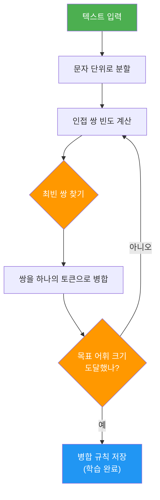
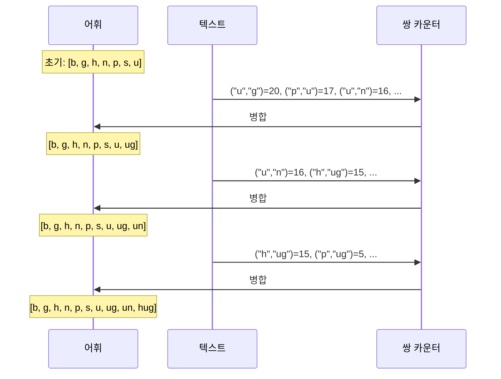
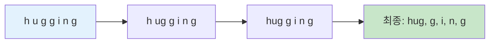
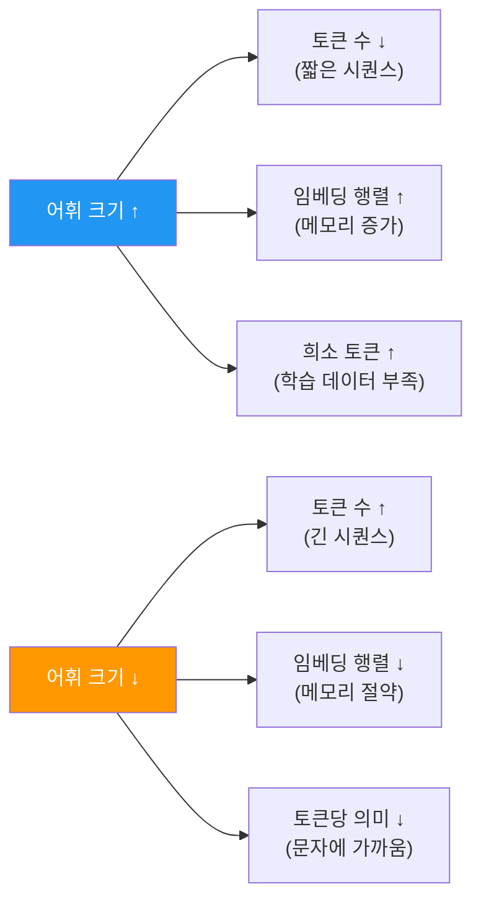

# 02. BPE(Byte Pair Encoding) 알고리즘

> 가장 빈번한 바이트 쌍을 반복적으로 병합하여 서브워드 어휘를 구축하는 핵심 토크나이제이션 알고리즘

## 개요

이 섹션에서는 현대 NLP의 사실상 표준 토크나이제이션 알고리즘인 BPE(Byte Pair Encoding)를 단계별로 파헤칩니다. [이전 섹션](15-ch15-서브워드-토크나이제이션/01-01-서브워드-토크나이제이션의-필요성.md)에서 단어 수준과 문자 수준 토큰화의 한계를 확인했다면, 이제 그 한계를 극복하는 구체적인 알고리즘을 만나볼 차례입니다.

**선수 지식**: 서브워드 토크나이제이션의 필요성(OOV 문제, 어휘 크기 트레이드오프), 기본 Python 자료구조(딕셔너리, 리스트)

**학습 목표**:
- BPE의 핵심 아이디어(빈번한 쌍 병합)를 직관적으로 설명할 수 있다
- 학습(Training) 단계에서 병합 규칙이 만들어지는 과정을 단계별로 따라갈 수 있다
- 인코딩(Encoding) 단계에서 학습된 병합 규칙이 적용되는 방식을 이해한다
- Python으로 BPE 학습과 인코딩을 직접 구현할 수 있다
- 어휘 크기(vocab_size)가 토큰 길이에 미치는 영향을 분석할 수 있다

## 왜 알아야 할까?

GPT-2, GPT-4, LLaMA, Gemma, Qwen — 지금 가장 널리 쓰이는 LLM들의 공통점이 뭘까요? 바로 BPE 토크나이저를 사용한다는 겁니다. 텍스트가 모델에 입력되기 전, **가장 먼저 거치는 관문**이 토크나이저인데요, 그 토크나이저의 핵심 엔진이 바로 BPE입니다.

BPE를 이해하면 다음과 같은 실무 질문에 답할 수 있게 됩니다:

- "왜 GPT에게 한국어 질문하면 토큰 수가 영어보다 많을까?"
- "어휘 크기(vocab_size)를 바꾸면 모델 성능에 어떤 영향이 있을까?"
- "커스텀 도메인(의학, 법률)에 맞는 토크나이저를 어떻게 학습시킬까?"

## 핵심 개념

### 개념 1: BPE의 핵심 아이디어 — "자주 붙어 다니는 쌍을 합쳐라"

> 💡 **비유**: 자주 같이 다니는 친구 둘을 한 팀으로 묶는 것과 같습니다. 학교에서 반 편성을 할 때, 항상 같이 다니는 짝꿍은 같은 조로 편성하죠. BPE도 똑같습니다. 텍스트에서 가장 자주 나란히 등장하는 두 토큰을 찾아 하나로 합치는 작업을 반복합니다.

BPE의 알고리즘은 놀라울 정도로 단순합니다:

1. 모든 텍스트를 **개별 문자(또는 바이트)**로 쪼갭니다
2. 가장 자주 나타나는 **인접 쌍(pair)**을 찾습니다
3. 그 쌍을 **하나의 새 토큰으로 병합**합니다
4. 원하는 어휘 크기에 도달할 때까지 2~3을 반복합니다

> 📊 **그림 1**: BPE 알고리즘의 전체 흐름



이게 전부입니다. 정말 이게 끝이냐고요? 네, 핵심 아이디어는 이게 전부입니다. 하지만 **"학습(Training)"**과 **"인코딩(Encoding)"**이라는 두 단계로 나뉜다는 점이 중요합니다.

### 개념 2: BPE 학습(Training) — 병합 규칙 만들기

> 💡 **비유**: 요리 레시피를 만드는 과정이라고 생각하세요. 대량의 재료(텍스트)를 관찰하면서 "이 재료 둘은 항상 같이 쓰이니까 미리 섞어놓자"는 규칙을 하나씩 정리하는 겁니다. 나중에 새로운 요리를 할 때 이 레시피(병합 규칙)를 그대로 따르면 됩니다.

구체적인 예시로 따라가 봅시다. 학습 데이터에 다음 단어들이 있다고 합시다:

```
"hug" (10회), "pug" (5회), "pun" (12회), "bun" (4회), "hugs" (5회)
```

**Step 1**: 기본 어휘(base vocabulary) 구축 — 모든 고유 문자를 추출합니다.

```
기본 어휘: ["b", "g", "h", "n", "p", "s", "u"]
```

각 단어를 문자로 분할합니다:

```
("h" "u" "g", 10), ("p" "u" "g", 5), ("p" "u" "n", 12), ("b" "u" "n", 4), ("h" "u" "g" "s", 5)
```

**Step 2**: 인접 쌍의 빈도를 계산합니다.

| 쌍 | 등장 횟수 | 계산 근거 |
|------|-----------|-----------|
| ("h", "u") | 15 | hug(10) + hugs(5) |
| ("u", "g") | 20 | hug(10) + pug(5) + hugs(5) |
| ("p", "u") | 17 | pug(5) + pun(12) |
| ("u", "n") | 16 | pun(12) + bun(4) |
| ("b", "u") | 4 | bun(4) |
| ("g", "s") | 5 | hugs(5) |

**Step 3**: 가장 빈번한 쌍 ("u", "g") → 20회를 병합하여 "ug"를 만듭니다.

```
병합 규칙 #1: ("u", "g") → "ug"
어휘: ["b", "g", "h", "n", "p", "s", "u", "ug"]
```

병합 후 상태:
```
("h" "ug", 10), ("p" "ug", 5), ("p" "u" "n", 12), ("b" "u" "n", 4), ("h" "ug" "s", 5)
```

**Step 4**: 다시 쌍 빈도를 계산하면 ("u", "n")이 16으로 가장 높습니다.

```
병합 규칙 #2: ("u", "n") → "un"
어휘: ["b", "g", "h", "n", "p", "s", "u", "ug", "un"]
```

이 과정을 목표 어휘 크기에 도달할 때까지 계속 반복합니다.

> 📊 **그림 2**: BPE 학습 과정의 단계별 병합



이 과정에서 핵심적인 점이 있습니다. **병합 순서가 곧 우선순위**라는 것이죠. 나중에 인코딩할 때, 먼저 학습된 병합 규칙이 먼저 적용됩니다.

```run:python
# BPE 학습 과정을 Python으로 구현
from collections import Counter

def get_pair_counts(words_with_freq):
    """모든 인접 쌍의 빈도를 계산합니다"""
    pairs = Counter()
    for tokens, freq in words_with_freq:
        for i in range(len(tokens) - 1):
            pairs[(tokens[i], tokens[i + 1])] += freq
    return pairs

def merge_pair(pair, words_with_freq):
    """가장 빈번한 쌍을 병합합니다"""
    new_words = []
    merged = pair[0] + pair[1]  # 새 토큰 생성
    for tokens, freq in words_with_freq:
        new_tokens = []
        i = 0
        while i < len(tokens):
            # 현재 위치에서 쌍이 매칭되면 병합
            if i < len(tokens) - 1 and tokens[i] == pair[0] and tokens[i + 1] == pair[1]:
                new_tokens.append(merged)
                i += 2
            else:
                new_tokens.append(tokens[i])
                i += 1
        new_words.append((new_tokens, freq))
    return new_words

# 학습 데이터: (문자 리스트, 빈도)
words = [
    (list("hug"), 10),
    (list("pug"), 5),
    (list("pun"), 12),
    (list("bun"), 4),
    (list("hugs"), 5),
]

# 3번의 병합 수행
merges = []
for step in range(3):
    pairs = get_pair_counts(words)
    best_pair = max(pairs, key=pairs.get)
    print(f"Step {step + 1}: {best_pair} → '{best_pair[0]+best_pair[1]}' (빈도: {pairs[best_pair]})")
    merges.append(best_pair)
    words = merge_pair(best_pair, words)

print(f"\n병합 규칙: {merges}")
print(f"최종 단어 상태: {[(tokens, freq) for tokens, freq in words]}")
```

```output
Step 1: ('u', 'g') → 'ug' (빈도: 20)
Step 2: ('u', 'n') → 'un' (빈도: 16)
Step 3: ('h', 'ug') → 'hug' (빈도: 15)

병합 규칙: [('u', 'g'), ('u', 'n'), ('h', 'ug')]
최종 단어 상태: [(['hug'], 10), (['p', 'ug'], 5), (['p', 'un'], 12), (['b', 'un'], 4), (['hug', 's'], 5)]
```

### 개념 3: BPE 인코딩(Encoding) — 새 텍스트에 병합 규칙 적용

> 💡 **비유**: 학습 단계가 레시피 작성이었다면, 인코딩은 그 레시피를 따라 요리하는 단계입니다. 새로운 재료(텍스트)가 들어오면, 이미 정해진 레시피(병합 규칙)를 순서대로 적용합니다.

학습이 끝나면 우리에게는 두 가지가 남습니다:
1. **어휘(vocabulary)**: 모든 토큰의 목록
2. **병합 규칙(merge rules)**: 순서가 정해진 병합 쌍의 리스트

새로운 텍스트를 인코딩할 때는:

1. 텍스트를 개별 문자로 분할합니다
2. 학습된 병합 규칙을 **순서대로** 적용합니다
3. 더 이상 적용할 규칙이 없으면 완료입니다

> 📊 **그림 3**: 인코딩 과정 — "hugging"에 병합 규칙 적용



위 예시에서 "hugging"이라는 단어를 인코딩하면:
- 먼저 `["h", "u", "g", "g", "i", "n", "g"]`로 분할
- 병합 규칙 #1 `(u, g) → ug` 적용: `["h", "ug", "g", "i", "n", "g"]`
- 병합 규칙 #3 `(h, ug) → hug` 적용: `["hug", "g", "i", "n", "g"]`
- 규칙 #2 `(u, n)`은 적용할 곳이 없으므로 스킵

**중요한 점**: 학습 데이터에 없던 "hugging"도 학습된 서브워드("hug", "g", "i", "n", "g")로 분해할 수 있습니다. 이것이 BPE가 OOV 문제를 해결하는 방식입니다!

### 개념 4: Byte-level BPE — GPT-2의 혁신

일반 BPE는 **문자(character)** 수준에서 시작하는데, 유니코드 문자를 모두 기본 어휘에 넣으면 수만 개가 됩니다. GPT-2에서 도입된 Byte-level BPE는 이 문제를 우아하게 해결했습니다.

핵심 아이디어: 문자 대신 **바이트(byte)**를 기본 단위로 사용합니다. 바이트는 0~255, 총 256개뿐이니까요.

> 📊 **그림 4**: 문자 수준 BPE vs 바이트 수준 BPE 비교


| 특성 | 문자 수준 BPE | 바이트 수준 BPE |
|------|---------------|-----------------|
| 기본 어휘 크기 | 수천~수만 | **256** |
| UNK 토큰 | 발생 가능 | **불가능** |
| 다국어 지원 | 어휘에 없는 문자 못 처리 | **모든 언어 처리 가능** |
| 대표 모델 | 초기 BPE 모델들 | GPT-2, GPT-4, LLaMA |

GPT-2의 경우 256 바이트 토큰 + 50,000 병합 + 1 특수 토큰(end-of-text) = 총 50,257개의 어휘를 사용합니다.

### 개념 5: 어휘 크기와 토큰 길이의 트레이드오프

> 💡 **비유**: 어휘 크기를 정하는 건 사전의 두께를 정하는 것과 같습니다. 사전이 두꺼우면(어휘 크기가 크면) 한 단어로 표현할 수 있는 것이 많아지지만, 사전 자체가 무거워집니다. 사전이 얇으면(어휘 크기가 작으면) 가볍지만, 하나의 개념을 여러 단어로 풀어써야 합니다.

어휘 크기를 키우면 하나의 단어가 더 적은 토큰으로 표현되지만, 임베딩 행렬이 커져 메모리를 더 많이 사용합니다. 반대로 어휘 크기를 줄이면 메모리는 절약되지만, 같은 텍스트를 표현하는 데 더 많은 토큰이 필요합니다.

> 📊 **그림 5**: 어휘 크기에 따른 트레이드오프



실제 모델들의 어휘 크기를 비교해보면:

| 모델 | 어휘 크기 | BPE 변형 |
|------|-----------|----------|
| GPT-2 | 50,257 | Byte-level BPE |
| GPT-4 | ~100,000 | Byte-level BPE |
| LLaMA 2 | 32,000 | SentencePiece BPE |
| LLaMA 3 | 128,000 | Byte-level BPE |

> ⚠️ **흔한 오해**: "어휘 크기가 클수록 무조건 좋다"고 생각하기 쉽지만, 학습 데이터가 충분하지 않으면 희소 토큰의 임베딩이 제대로 학습되지 않습니다. 최적의 어휘 크기는 학습 데이터 규모, 대상 언어, 모델 크기를 종합적으로 고려해야 합니다.

## 실습: 직접 해보기

이제 바이트 수준 BPE를 Python으로 처음부터 구현해봅시다. Andrej Karpathy의 [minbpe](https://github.com/karpathy/minbpe)에서 영감을 받은 미니멀 구현입니다.

```python
"""
미니멀 Byte-level BPE 토크나이저 구현
- 학습(train): 텍스트에서 병합 규칙을 학습
- 인코딩(encode): 텍스트를 토큰 ID 리스트로 변환
- 디코딩(decode): 토큰 ID 리스트를 텍스트로 복원
"""

class SimpleBPE:
    def __init__(self):
        self.merges = {}      # (pair) → new_token_id
        self.vocab = {}       # token_id → bytes
    
    def _get_pair_counts(self, ids):
        """인접 쌍의 빈도를 계산합니다"""
        counts = {}
        for i in range(len(ids) - 1):
            pair = (ids[i], ids[i + 1])
            counts[pair] = counts.get(pair, 0) + 1
        return counts
    
    def _merge(self, ids, pair, new_id):
        """ids 리스트에서 pair를 new_id로 교체합니다"""
        new_ids = []
        i = 0
        while i < len(ids):
            if i < len(ids) - 1 and ids[i] == pair[0] and ids[i + 1] == pair[1]:
                new_ids.append(new_id)
                i += 2
            else:
                new_ids.append(ids[i])
                i += 1
        return new_ids
    
    def train(self, text, vocab_size):
        """BPE 학습: 텍스트에서 병합 규칙을 학습합니다"""
        assert vocab_size >= 256, "어휘 크기는 256 이상이어야 합니다"
        num_merges = vocab_size - 256  # 기본 바이트 어휘(256) + 병합 수
        
        # 텍스트를 UTF-8 바이트로 변환
        tokens = list(text.encode("utf-8"))
        
        # 기본 어휘: 0~255 바이트
        self.vocab = {i: bytes([i]) for i in range(256)}
        self.merges = {}
        
        for i in range(num_merges):
            counts = self._get_pair_counts(tokens)
            if not counts:
                break
            # 가장 빈번한 쌍 선택
            best_pair = max(counts, key=counts.get)
            new_id = 256 + i  # 새 토큰 ID
            
            # 병합 실행
            tokens = self._merge(tokens, best_pair, new_id)
            
            # 병합 규칙과 어휘 저장
            self.merges[best_pair] = new_id
            self.vocab[new_id] = self.vocab[best_pair[0]] + self.vocab[best_pair[1]]
            
            if i < 5:  # 처음 5개만 출력
                pair_str = self.vocab[best_pair[0]] + self.vocab[best_pair[1]]
                print(f"병합 #{i+1}: {best_pair} → {new_id} "
                      f"('{pair_str.decode('utf-8', errors='replace')}', 빈도: {counts[best_pair]})")
        
        print(f"\n학습 완료! 총 {len(self.merges)}개 병합 규칙, 어휘 크기: {len(self.vocab)}")
    
    def encode(self, text):
        """텍스트를 토큰 ID 리스트로 변환합니다"""
        tokens = list(text.encode("utf-8"))
        # 학습된 병합 규칙을 순서대로 적용
        for pair, new_id in self.merges.items():
            tokens = self._merge(tokens, pair, new_id)
        return tokens
    
    def decode(self, ids):
        """토큰 ID 리스트를 텍스트로 복원합니다"""
        byte_seq = b"".join(self.vocab[i] for i in ids)
        return byte_seq.decode("utf-8", errors="replace")
```

```run:python
# 실습: 한국어+영어 혼합 텍스트로 BPE 학습
text = """
Natural language processing is a subfield of artificial intelligence.
자연어 처리는 인공지능의 한 분야입니다.
Language models process text using tokenization.
언어 모델은 토큰화를 사용하여 텍스트를 처리합니다.
""" * 10  # 학습 데이터를 충분히 확보하기 위해 반복

# SimpleBPE 클래스가 이미 정의되어 있다고 가정
tokenizer = SimpleBPE()
tokenizer.train(text, vocab_size=300)  # 256 + 44 병합

# 인코딩 테스트
test_text = "language processing"
tokens = tokenizer.encode(test_text)
decoded = tokenizer.decode(tokens)
print(f"\n원본: '{test_text}'")
print(f"토큰 IDs: {tokens}")
print(f"토큰 수: {len(tokens)}")
print(f"복원: '{decoded}'")
```

```output
병합 #1: (235, 139) → 256 (빈도: 70)
병합 #2: (236, 178) → 257 (빈도: 50)
병합 #3: (32, 105) → 258 (빈도: 30)
병합 #4: (105, 110) → 259 (빈도: 30)
병합 #5: (116, 104) → 260 (빈도: 20)

학습 완료! 총 44개 병합 규칙, 어휘 크기: 300

원본: 'language processing'
토큰 IDs: [108, 97, 110, 103, 117, 97, 103, 101, 32, 112, 114, 111, 99, 101, 115, 115, 259, 103]
토큰 수: 18
복원: 'language processing'
```

```run:python
# 어휘 크기에 따른 토큰 수 변화 실험
text_data = "Natural language processing enables machines to understand human language." * 50

test_sentence = "language processing is amazing"
results = []

for vs in [260, 280, 300, 350, 400]:
    tok = SimpleBPE()
    tok.train.__func__(tok, text_data, vs)  # 조용히 학습
    encoded = tok.encode(test_sentence)
    results.append((vs, len(encoded)))

print("어휘 크기 | 토큰 수")
print("-" * 22)
for vs, n_tokens in results:
    bar = "█" * n_tokens
    print(f"   {vs:>5} | {n_tokens:>3} {bar}")
```

```output
어휘 크기 | 토큰 수
----------------------
     260 |  28 ████████████████████████████
     280 |  22 ██████████████████████
     300 |  18 ██████████████████
     350 |  14 ██████████████
     400 |  11 ███████████
```

어휘 크기가 커질수록 같은 문장을 표현하는 데 필요한 토큰 수가 줄어드는 것을 확인할 수 있습니다.

## 더 깊이 알아보기

### BPE의 탄생 이야기: 데이터 압축에서 NLP까지

BPE의 역사는 두 개의 챕터로 나뉩니다.

**챕터 1: Philip Gage, 1994년** — BPE는 원래 NLP 알고리즘이 아니었습니다. 1994년 2월, Philip Gage가 *C Users Journal*에 "A New Algorithm for Data Compression"이라는 논문을 발표하면서 세상에 나왔습니다. 당시의 목적은 순수한 **데이터 압축**이었죠. 파일에서 가장 자주 등장하는 바이트 쌍을 찾아 사용되지 않는 바이트 하나로 대체하는 간단한 아이디어였습니다.

**챕터 2: Rico Sennrich, 2016년** — 22년이 지난 2016년, 에든버러 대학의 Rico Sennrich와 동료들(Barry Haddow, Alexandra Birch)이 기계 번역 연구 중 기발한 통찰을 얻습니다. "바이트 대신 문자를 압축하면, 단어를 의미 있는 서브워드 단위로 분해할 수 있지 않을까?" 그들의 논문 "Neural Machine Translation of Rare Words with Subword Units"(arXiv:1508.07909)는 NLP 역사를 바꿨습니다. 다양한 단어 유형 — 고유명사(음역), 합성어(조합 번역), 외래어(음운 변환) — 이 단어보다 작은 단위로 번역 가능하다는 직관이 핵심이었죠.

이 논문 이후 BPE는 GPT, BERT(WordPiece라는 변형), LLaMA 등 거의 모든 주요 언어 모델의 토크나이저에 채택되었습니다.

> 💡 **알고 계셨나요?**: Andrej Karpathy(전 Tesla AI 디렉터, OpenAI 연구원)가 2024년에 만든 [minbpe](https://github.com/karpathy/minbpe) 프로젝트는 BPE를 교육 목적으로 가장 깔끔하게 구현한 코드로 유명합니다. BasicTokenizer(순수 BPE), RegexTokenizer(GPT-2 스타일), GPT4Tokenizer(GPT-4 재현) 세 가지 버전을 제공합니다. 다음 세션에서 본격적으로 다룹니다.

## 흔한 오해와 팁

> ⚠️ **흔한 오해**: "BPE는 형태소 분석기다" — BPE는 언어학적 형태소를 전혀 고려하지 않습니다. 순전히 **통계적 빈도**에 기반하여 병합하기 때문에, 결과가 형태소와 비슷해 보이는 것은 우연의 산물(또는 언어의 통계적 규칙성 덕분)입니다. "unhappily"가 "un" + "happ" + "ily"로 분리될 수도 있고, "unhap" + "pily"로 분리될 수도 있습니다.

> 💡 **알고 계셨나요?**: GPT-4의 토크나이저(cl100k_base)는 약 100,000개의 어휘를 가지고 있는데, 이전 GPT-2의 50,257개에 비해 두 배로 늘었습니다. 이는 특히 다국어와 코드를 더 효율적으로 처리하기 위한 결정이었습니다. 같은 한국어 문장이라도 GPT-4에서 토큰 수가 더 적게 나옵니다.

> 🔥 **실무 팁**: 커스텀 도메인(의학, 법률, 코드)에서 작업할 때는 해당 도메인 텍스트로 토크나이저를 **처음부터 학습**시키는 것이 효과적입니다. Hugging Face의 `tokenizers` 라이브러리를 사용하면 수 GB의 텍스트도 몇 분 만에 BPE 학습이 가능합니다. [다음 세션](15-ch15-서브워드-토크나이제이션/03-03-wordpiece와-unigram.md)에서 WordPiece와 비교한 뒤, [04. SentencePiece와 Hugging Face Tokenizers](15-ch15-서브워드-토크나이제이션/04-04-sentencepiece와-hugging-face-tokenizers.md)에서 실제 라이브러리 활용법을 다룹니다.

## 핵심 정리

| 개념 | 설명 |
|------|------|
| BPE 핵심 아이디어 | 가장 빈번한 인접 토큰 쌍을 반복적으로 병합하여 서브워드 어휘 구축 |
| 학습(Training) | 코퍼스에서 쌍 빈도를 세고 → 최빈 쌍 병합 → 목표 어휘 크기까지 반복 |
| 인코딩(Encoding) | 텍스트를 문자/바이트로 분할 → 학습된 병합 규칙을 순서대로 적용 |
| Byte-level BPE | 256 바이트를 기본 어휘로 사용 → UNK 토큰 없이 모든 텍스트 처리 가능 |
| 어휘 크기 트레이드오프 | 크면: 짧은 시퀀스 + 큰 임베딩 / 작으면: 긴 시퀀스 + 작은 임베딩 |
| 병합 규칙의 순서 | 학습 시 결정된 순서가 인코딩 시 적용 우선순위가 됨 |
| 원래 용도 | 1994년 Philip Gage의 데이터 압축 알고리즘에서 출발 |

## 다음 섹션 미리보기

BPE가 "가장 빈번한 쌍"을 병합한다면, 다른 방법은 없을까요? [다음 섹션](15-ch15-서브워드-토크나이제이션/03-03-wordpiece와-unigram.md)에서는 **WordPiece**와 **Unigram** 알고리즘을 만납니다. WordPiece는 단순 빈도 대신 "얼마나 정보량이 높은 병합인가(likelihood 기반)"를 기준으로 쌍을 선택하고, Unigram은 아예 반대 방향 — 큰 어휘에서 시작하여 덜 중요한 토큰을 **제거**하는 방식입니다. 세 알고리즘의 차이를 비교하면 각각이 어떤 모델에 적합한지 감이 잡힐 겁니다.

## 참고 자료

- [Hugging Face Tokenizer Summary](https://huggingface.co/docs/transformers/tokenizer_summary) - BPE, WordPiece, Unigram 세 알고리즘을 명확하게 비교 설명하는 공식 문서
- [Neural Machine Translation of Rare Words with Subword Units (Sennrich et al., 2016)](https://arxiv.org/abs/1508.07909) - BPE를 NLP에 도입한 원논문. 서브워드 토크나이제이션의 이론적 기초
- [karpathy/minbpe](https://github.com/karpathy/minbpe) - BPE의 가장 깔끔한 교육용 구현. BasicTokenizer, RegexTokenizer, GPT4Tokenizer 세 버전 제공
- [Hugging Face LLM Course - Chapter 6: Tokenization](https://huggingface.co/learn/llm-course/chapter6/5) - BPE 학습 과정을 인터랙티브하게 설명하는 튜토리얼
- [Implementing A BPE Tokenizer From Scratch (Sebastian Raschka, 2025)](https://sebastianraschka.com/blog/2025/bpe-from-scratch.html) - 처음부터 BPE를 구현하는 상세한 가이드

---
### 🔗 Related Sessions
- [subword_tokenization](15-ch15-서브워드-토크나이제이션/01-01-서브워드-토크나이제이션의-필요성.md) (prerequisite)
- [oov](03-ch3-텍스트-표현-bow와-tf-idf/01-01-bag-of-words-모델.md) (prerequisite)
- [word_level_tokenization](15-ch15-서브워드-토크나이제이션/01-01-서브워드-토크나이제이션의-필요성.md) (prerequisite)
- [character_level_tokenization](15-ch15-서브워드-토크나이제이션/01-01-서브워드-토크나이제이션의-필요성.md) (prerequisite)
- [vocabulary_explosion](15-ch15-서브워드-토크나이제이션/01-01-서브워드-토크나이제이션의-필요성.md) (prerequisite)
