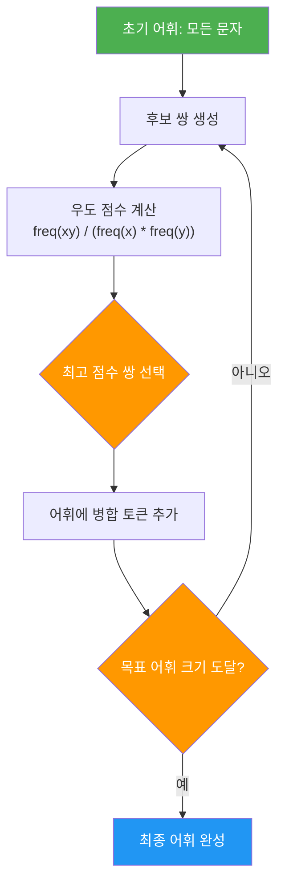
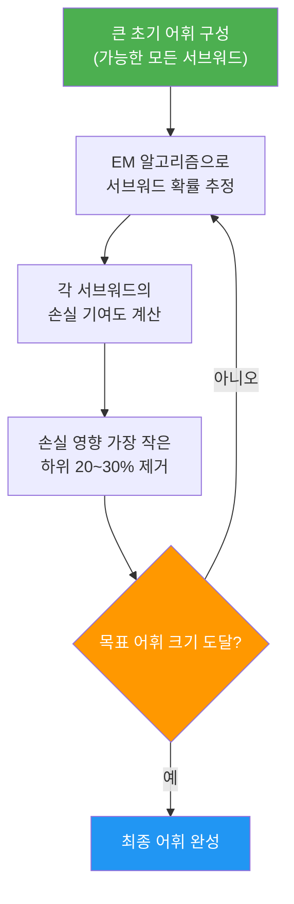

# WordPiece와 Unigram

> BPE의 변형인 WordPiece와 완전히 다른 접근의 Unigram — 서브워드 토크나이제이션의 나머지 두 축을 깊이 이해합니다.

## 개요

[이전 세션](15-ch15-서브워드-토크나이제이션/02-02-bpebyte-pair-encoding-알고리즘.md)에서 BPE의 핵심 원리를 배웠습니다. "가장 빈번한 쌍을 병합한다"는 직관적이고 강력한 아이디어였죠. 하지만 서브워드 토크나이제이션의 세계에는 BPE만 있는 게 아닙니다. BERT가 채택한 **WordPiece**는 BPE의 빈도 기반 병합을 **우도(likelihood) 기반**으로 한 단계 발전시켰고, Google의 **Unigram** 모델은 아예 반대 방향에서 출발합니다 — 큰 어휘에서 시작해 하나씩 **삭제**해 나가는 하향식(top-down) 접근이죠.

세 알고리즘이 서로 다른 철학을 가지고 있지만, 결국 같은 목표를 향합니다: **의미 있는 서브워드 단위를 자동으로 찾아내는 것**. 이번 세션에서 그 차이와 공통점을 꼼꼼히 파헤쳐 보겠습니다.

**선수 지식**: [BPE 알고리즘](15-ch15-서브워드-토크나이제이션/02-02-bpebyte-pair-encoding-알고리즘.md)(병합 규칙, 빈도 기반 점수), 기본 확률 개념(조건부 확률, 우도, 로그 확률)

**학습 목표**:
- WordPiece의 우도 기반 병합 점수가 BPE의 빈도 기반 점수와 어떻게 다른지 수식으로 설명할 수 있다
- WordPiece의 탐욕적 최장 일치(Greedy Longest-Match) 인코딩 방식을 구현할 수 있다
- Unigram의 하향식 삭제 전략과 EM 알고리즘 기반 학습 과정을 이해한다
- 비터비(Viterbi) 알고리즘을 활용한 Unigram 인코딩과 서브워드 정규화(subword regularization)를 설명할 수 있다
- BPE, WordPiece, Unigram 세 알고리즘의 학습/인코딩 차이를 종합적으로 비교할 수 있다

## 왜 알아야 할까?

BERT, GPT, T5 — 이 세 모델은 각각 다른 토크나이저를 씁니다. BERT는 **WordPiece**, GPT는 **BPE**, T5는 **Unigram**이죠. 이전 세션에서 BPE를 배웠으니, 이제 나머지 둘을 이해하면 현대 LLM의 토크나이제이션 전략을 **완전하게** 조망할 수 있게 됩니다.

특히 이런 실무 질문에 답할 수 있게 됩니다:

- "BERT의 토크나이저에서 `##`이 붙는 토큰은 뭘까?" → WordPiece의 접두사 표기
- "같은 단어를 매번 다르게 토큰화할 수 있다고?" → Unigram의 서브워드 정규화
- "세 알고리즘 중 어떤 걸 선택해야 할까?" → 각각의 장단점과 적합한 상황

[다음 세션](15-ch15-서브워드-토크나이제이션/04-04-sentencepiece와-hugging-face-tokenizers.md)에서 SentencePiece와 Hugging Face Tokenizers를 다루기 전에, 그 내부에서 돌아가는 알고리즘을 먼저 확실히 이해해 둡시다.

## 핵심 개념

### 개념 1: WordPiece — BPE의 "똑똑한 사촌"

> 💡 **비유**: BPE가 "자주 같이 다니는 친구를 같은 팀으로 묶는 것"이라면, WordPiece는 "같이 다닐 때 **시너지가 가장 큰** 친구를 묶는 것"입니다. 단순히 빈도만 보는 게 아니라, 따로 있을 때 대비 같이 있을 때의 가치를 계산하는 거죠. 회사에서 프로젝트 팀을 짤 때, 단순히 친한 사람끼리가 아니라 협업 시너지가 가장 큰 조합을 찾는 것과 같습니다.

WordPiece는 2012년 Google이 일본어/한국어 음성 인식을 위해 개발한 알고리즘입니다. BPE와 전체 흐름이 매우 비슷하지만, **병합 점수 계산 방식**에서 결정적인 차이가 있습니다.

**BPE의 병합 점수**:
$$\text{score}(x, y) = \text{freq}(xy)$$

그냥 두 토큰이 나란히 등장하는 횟수, 즉 빈도수입니다.

**WordPiece의 병합 점수**:
$$\text{score}(x, y) = \frac{\text{freq}(xy)}{\text{freq}(x) \times \text{freq}(y)}$$

분자는 BPE와 같은 동시 등장 빈도인데, 분모에 각 토큰의 개별 빈도를 곱해서 나눕니다. 이게 왜 중요할까요?

예를 들어 학습 말뭉치에서 `th`가 1000번, `e`가 5000번, `the`가 900번 등장한다고 합시다:

- BPE 점수: `freq(the) = 900` → 높은 점수
- WordPiece 점수: `900 / (1000 × 5000) = 0.00018` → 낮은 점수

`t`, `h`, `e`가 워낙 흔한 글자라서 `the`가 자주 나타나는 건 당연한 거거든요. WordPiece는 이런 "뻔한 조합"에 낮은 점수를 주고, 대신 **개별적으로는 드물지만 같이 나타나면 의미 있는 조합**에 높은 점수를 줍니다.

> 📊 **그림 1**: WordPiece 병합 학습 과정



실제로 이 점수를 계산해 보겠습니다:

```run:python
# BPE vs WordPiece 병합 점수 비교
corpus_freq = {
    'l': 800, 'o': 1200, 'w': 600,
    'lo': 400, 'ow': 350, 'low': 200,
    'n': 900, 'e': 2500, 'w': 600,
    'ne': 150, 'ew': 80, 'new': 50,
    'un': 120, 'u': 300,
}

pairs_to_compare = [
    ('l', 'o', 'lo', 400, 800, 1200),   # 흔한 글자의 조합
    ('n', 'e', 'ne', 150, 900, 2500),    # 흔한 글자의 조합
    ('u', 'n', 'un', 120, 300, 900),     # 덜 흔한 글자의 조합
]

print("=" * 65)
print(f"{'쌍':<8} {'BPE 점수':>10} {'WordPiece 점수':>18}  해석")
print("=" * 65)

for x, y, xy, freq_xy, freq_x, freq_y in pairs_to_compare:
    bpe_score = freq_xy
    wp_score = freq_xy / (freq_x * freq_y)
    print(f"({x},{y}){'':<3} {bpe_score:>10,}   {wp_score:>16.6f}  ", end="")
    print(f"freq({x})={freq_x}, freq({y})={freq_y}")

print("=" * 65)
print("\nBPE는 (l,o)를 가장 먼저 병합 → 빈도가 높으니까")
print("WordPiece는 (u,n)을 가장 먼저 병합 → 시너지가 크니까")
```

```output
=================================================================
쌍          BPE 점수     WordPiece 점수  해석
=================================================================
(l,o)          400           0.000417  freq(l)=800, freq(y)=1200
(n,e)          150           0.000067  freq(n)=900, freq(y)=2500
(u,n)          120           0.000444  freq(u)=300, freq(y)=900
=================================================================

BPE는 (l,o)를 가장 먼저 병합 → 빈도가 높으니까
WordPiece는 (u,n)을 가장 먼저 병합 → 시너지가 크니까
```

결과를 보면, BPE는 단순히 동시 등장 빈도가 높은 `(l, o)`를 먼저 병합하지만, WordPiece는 개별 빈도 대비 시너지가 큰 `(u, n)`을 먼저 병합합니다. 이 차이가 누적되면 최종 어휘 구성에 꽤 큰 차이를 만들어내게 되죠.

> 💡 **알고 계셨나요?**: WordPiece의 병합 점수 공식은 통계학에서 **점별 상호정보량(PMI, Pointwise Mutual Information)**과 같은 형태입니다. 두 사건이 독립일 때의 기대 빈도 대비 실제 동시 등장 빈도가 얼마나 높은지를 측정하는 것이죠. BPE가 "빈도"를 보는 반면, WordPiece는 "상관성"을 보는 셈입니다.

**`##` 접두사 표기법**

WordPiece의 또 다른 특징은 **단어 내부 서브워드에 `##` 접두사**를 붙이는 것입니다. 단어의 첫 번째 토큰은 그대로 쓰고, 이후 이어지는 토큰에만 `##`을 붙입니다:

- `embedding` → `['em', '##bed', '##ding']`
- `unhappily` → `['un', '##happi', '##ly']`
- `tokenization` → `['token', '##ization']`

이 표기법 덕분에 토큰만 봐도 "이 토큰이 단어의 시작인지, 중간인지"를 알 수 있습니다. BPE에서는 이런 구분이 없어서 별도의 공백 토큰(`Ġ`)을 사용하는 반면, WordPiece는 `##`으로 깔끔하게 처리하죠.

> ⚠️ **흔한 오해**: "WordPiece가 BPE보다 무조건 좋은 알고리즘이다"라고 생각하기 쉽지만, 꼭 그렇지는 않습니다. WordPiece는 학습 과정에서 더 많은 계산이 필요하고(각 토큰의 개별 빈도까지 추적해야 하므로), 결과적으로 학습 속도가 더 느립니다. GPT, LLaMA 같은 최신 LLM들이 BPE를 선택한 이유이기도 하죠.

### 개념 2: WordPiece 인코딩 — 탐욕적 최장 일치

> 💡 **비유**: 사전에서 단어를 찾을 때를 떠올려 보세요. "토크나이저"라는 단어를 모른다면, 일단 "토크나이저" 전체를 사전에서 찾아봅니다. 없으면 "토크나이"를 찾고, 그래도 없으면 "토크나"를 찾고... 이런 식으로 **가능한 가장 긴 매치**를 찾는 전략, 이것이 바로 WordPiece의 인코딩 방식입니다.

BPE의 인코딩은 학습 때 만든 병합 규칙을 순서대로 적용하는 방식이었습니다. 반면 WordPiece의 인코딩은 병합 규칙의 순서와 상관없이, 어휘 사전에서 **가장 긴 매치를 탐욕적으로 찾아가는** 방식입니다.

**WordPiece 인코딩 알고리즘**:

1. 입력 단어의 처음부터 시작
2. 어휘에 있는 가장 긴 접두사(prefix)를 찾음
3. 그 접두사를 토큰으로 추출
4. 나머지 부분에 대해 `##` 접두사를 붙여 2~3을 반복
5. 끝까지 분할되면 완료. 매치가 없으면 `[UNK]` 토큰 처리

> 📊 **그림 2**: WordPiece 인코딩 — 탐욕적 최장 일치


Python으로 직접 구현해 봅시다:

```python
class SimpleWordPiece:
    """WordPiece 인코딩의 핵심 로직을 구현한 교육용 클래스"""

    def __init__(self, vocab: set):
        """
        Args:
            vocab: WordPiece 어휘 사전 (##접두사 포함)
                   예: {'un', '##happi', '##ly', '##happy', 'happy', ...}
        """
        self.vocab = vocab

    def tokenize(self, word: str) -> list[str]:
        """탐욕적 최장 일치(Greedy Longest-Match) 인코딩"""
        tokens = []
        start = 0

        while start < len(word):
            end = len(word)
            found = False

            # 가장 긴 매치를 찾기 위해 끝에서부터 줄여나감
            while start < end:
                substr = word[start:end]

                # 단어 시작이 아니면 ## 접두사 붙이기
                if start > 0:
                    substr = "##" + substr

                if substr in self.vocab:
                    tokens.append(substr)
                    found = True
                    break

                end -= 1

            if not found:
                tokens.append("[UNK]")
                return tokens  # 매치 실패 시 전체를 [UNK] 처리

            start = end

        return tokens

    def encode_sentence(self, sentence: str) -> list[str]:
        """문장 단위 토큰화 (공백 기준 단어 분리 후 각 단어 인코딩)"""
        all_tokens = []
        for word in sentence.strip().split():
            all_tokens.extend(self.tokenize(word.lower()))
        return all_tokens
```

실제로 동작을 확인해 보겠습니다:

```run:python
# SimpleWordPiece 동작 확인
class SimpleWordPiece:
    def __init__(self, vocab):
        self.vocab = vocab

    def tokenize(self, word):
        tokens = []
        start = 0
        while start < len(word):
            end = len(word)
            found = False
            while start < end:
                substr = word[start:end]
                if start > 0:
                    substr = "##" + substr
                if substr in self.vocab:
                    tokens.append(substr)
                    found = True
                    break
                end -= 1
            if not found:
                return ["[UNK]"]
            start = end
        return tokens

# BERT 스타일의 예시 어휘
vocab = {
    'un', 'play', 'happy', 'embed', 'token',
    '##ing', '##ed', '##ly', '##tion', '##ize',
    '##happi', '##happy', '##ding', '##bed',
    'the', 'a', 'is', 'deep', 'learn',
}

wp = SimpleWordPiece(vocab)

test_words = ['unhappily', 'embedding', 'tokenization', 'playing', 'deeply']

print("WordPiece 인코딩 결과:")
print("-" * 50)
for word in test_words:
    tokens = wp.tokenize(word)
    print(f"  {word:<18} → {tokens}")

print()
print("어휘에 없는 단어:")
unknown = wp.tokenize("xyz")
print(f"  {'xyz':<18} → {unknown}")
```

```output
WordPiece 인코딩 결과:
--------------------------------------------------
  unhappily          → ['un', '##happi', '##ly']
  embedding          → ['embed', '##ding']
  tokenization       → ['token', '##ize', '##tion']
  playing            → ['play', '##ing']
  deeply             → ['deep', '##ly']

어휘에 없는 단어:
  xyz                → ['[UNK]']
```

BPE 인코딩과의 핵심 차이를 정리하면:

| 특성 | BPE 인코딩 | WordPiece 인코딩 |
|------|-----------|-----------------|
| **방식** | 병합 규칙을 순서대로 적용 | 어휘에서 최장 매치 탐색 |
| **규칙 의존** | 병합 순서가 중요 | 어휘 목록만 필요 |
| **시간 복잡도** | O(n x R) — R은 규칙 수 | O(n x m) — m은 최대 토큰 길이 |
| **결정론적** | 예 | 예 |

> 🔥 **실무 팁**: Hugging Face의 `transformers` 라이브러리에서 BERT 토크나이저를 로드하면 WordPiece가 내부적으로 동작합니다. `tokenizer.tokenize("embedding")`을 호출하면 `['em', '##bed', '##ding']`처럼 `##` 접두사가 붙은 결과를 확인할 수 있습니다. [다음 세션](15-ch15-서브워드-토크나이제이션/04-04-sentencepiece와-hugging-face-tokenizers.md)에서 실제 라이브러리 사용법을 다룰 예정입니다.

### 개념 3: Unigram 모델 — 하향식 삭제 전략

> 💡 **비유**: BPE와 WordPiece가 빈 방에 가구를 하나씩 **추가**해서 인테리어를 완성하는 방식이라면, Unigram은 모든 가구가 가득 찬 방에서 필요 없는 것을 하나씩 **빼는** 방식입니다. 미켈란젤로가 "대리석에서 불필요한 부분을 깎아내면 조각이 나온다"고 했던 것처럼요. 가능한 모든 서브워드를 모아놓고, 가치가 낮은 것부터 제거합니다.

Unigram 모델은 2018년 Google의 Taku Kudo가 제안한 알고리즘으로, BPE/WordPiece와는 근본적으로 다른 접근법을 취합니다.

**BPE/WordPiece (상향식, Bottom-Up)**:
- 시작: 문자 단위의 작은 어휘
- 과정: 쌍을 병합하며 어휘 **추가**
- 종료: 목표 크기에 도달하면 멈춤

**Unigram (하향식, Top-Down)**:
- 시작: 가능한 모든 서브워드를 포함하는 큰 어휘
- 과정: 손실 기여도가 낮은 서브워드 **삭제**
- 종료: 목표 크기에 도달하면 멈춤

> 📊 **그림 3**: Unigram 모델 학습 과정 — 하향식 삭제



**학습 과정을 단계별로 따라가 봅시다:**

**1단계: 초기 어휘 구성**

Unigram은 먼저 학습 데이터에서 가능한 서브워드를 최대한 많이 수집합니다. 보통 BPE로 큰 어휘를 먼저 만들거나, 빈도가 높은 부분 문자열을 모두 추출합니다. 예를 들어 목표 어휘가 8,000개라면 초기 어휘를 100만 개 정도로 시작할 수 있습니다.

**2단계: 서브워드 확률 추정 (E-step)**

각 서브워드에 확률을 부여합니다. Unigram 모델의 핵심 가정은 **각 서브워드가 독립적**이라는 것입니다:

$$P(\mathbf{x}) = \prod_{i=1}^{n} P(x_i)$$

단어 `x`를 서브워드 `x_1, x_2, ..., x_n`으로 분할했을 때, 전체 확률은 각 서브워드 확률의 곱입니다. 로그를 취하면 합이 되죠:

$$\log P(\mathbf{x}) = \sum_{i=1}^{n} \log P(x_i)$$

**3단계: 손실 기여도 계산 (M-step)**

각 서브워드를 어휘에서 제거했을 때, 전체 말뭉치의 로그 우도(log-likelihood)가 얼마나 감소하는지를 계산합니다. 이것이 해당 서브워드의 "가치"를 나타냅니다:

$$\text{loss}(x_i) = -\sum_{\text{word} \in \text{corpus}} \log P_{\text{best}}(\text{word} \mid V \setminus \{x_i\})$$

손실 기여도가 작은 서브워드 = 빠져도 별 영향 없는 서브워드 = 제거 대상

**4단계: 반복 삭제**

손실 기여도가 가장 작은 하위 20~30%를 한 번에 삭제하고, 2단계로 돌아가 확률을 재추정합니다. 이 과정을 목표 어휘 크기에 도달할 때까지 반복합니다.

> ⚠️ **흔한 오해**: "하나씩 삭제하면 너무 느리지 않나?"라고 생각할 수 있는데, 맞습니다! 그래서 실제로는 하위 20~30%를 **한꺼번에** 삭제합니다. 단, 개별 문자(single character)는 절대 삭제하지 않습니다 — 어떤 입력이든 인코딩할 수 있어야 하니까요.

이 과정을 코드로 확인해 봅시다:

```run:python
import math

# Unigram 학습 과정 시뮬레이션 (간소화 버전)
# 초기 어휘와 빈도
initial_vocab = {
    'h': 120, 'a': 200, 'p': 150, 'y': 80,
    'ha': 95, 'ap': 70, 'pp': 65, 'py': 60,
    'hap': 50, 'app': 45, 'ppy': 40,
    'happ': 35, 'appy': 30,
    'happy': 25,
    'u': 100, 'n': 110,
    'un': 90, 'unh': 20,
    'l': 130, 'i': 160,
    'ly': 55, 'il': 25, 'ily': 15,
}

total = sum(initial_vocab.values())
probs = {k: v / total for k, v in initial_vocab.items()}

# 각 서브워드의 손실 기여도 계산 (간소화)
print("서브워드별 확률과 손실 기여도:")
print("-" * 55)
print(f"{'서브워드':<10} {'빈도':>6} {'확률':>10} {'손실 기여도':>12}")
print("-" * 55)

losses = {}
for token, freq in sorted(initial_vocab.items(), key=lambda x: -x[1]):
    prob = probs[token]
    # 손실 기여도 = 빈도 × 로그 확률 (절대값이 클수록 중요)
    loss = freq * abs(math.log(prob))
    losses[token] = loss
    print(f"  {token:<8} {freq:>6} {prob:>10.4f} {loss:>12.2f}")

# 하위 30% 제거 대상
sorted_by_loss = sorted(losses.items(), key=lambda x: x[1])
cutoff = int(len(sorted_by_loss) * 0.3)
to_remove = sorted_by_loss[:cutoff]

print(f"\n하위 30% 제거 대상 ({cutoff}개):")
for token, loss in to_remove:
    # 개별 문자는 보호
    if len(token) == 1:
        print(f"  {token:<8} → 보호 (개별 문자)")
    else:
        print(f"  {token:<8} → 제거 (손실 기여도: {loss:.2f})")
```

```output
서브워드별 확률과 손실 기여도:
-------------------------------------------------------
서브워드      빈도       확률   손실 기여도
-------------------------------------------------------
  a          200     0.1099       484.56
  i          160     0.0879       389.15
  p          150     0.0824       378.13
  l          130     0.0714       344.18
  h          120     0.0659       327.33
  n          110     0.0604       309.13
  u          100     0.0549       290.26
  ha          95     0.0522       281.10
  un          90     0.0494       271.02
  y           80     0.0440       251.37
  ap          70     0.0385       228.50
  pp          65     0.0357       216.50
  py          60     0.0330       204.56
  ly          55     0.0302       192.33
  hap         50     0.0275       179.20
  app         45     0.0247       166.77
  ppy         40     0.0220       153.17
  happ        35     0.0192       138.80
  appy        30     0.0165       123.01
  happy       25     0.0137       107.52
  il          25     0.0137       107.52
  unh         20     0.0110        90.39
  ily         15     0.0082        72.16

하위 30% 제거 대상 (6개):
  ily      → 제거 (손실 기여도: 72.16)
  unh      → 제거 (손실 기여도: 90.39)
  happy    → 제거 (손실 기여도: 107.52)
  il       → 제거 (손실 기여도: 107.52)
  appy     → 제거 (손실 기여도: 123.01)
  happ     → 제거 (손실 기여도: 138.80)
```

흥미로운 결과죠? `happy` 같은 완전한 단어도 손실 기여도가 낮으면 초기 라운드에서 제거될 수 있습니다. 대신 `ha`, `pp`, `py` 같은 짧고 빈번한 서브워드들이 살아남게 됩니다. 이것이 Unigram의 철학입니다 — **말뭉치 전체를 가장 잘 설명하는 서브워드 집합을 찾는 것**.

### 개념 4: Unigram 인코딩 — 비터비 알고리즘과 서브워드 정규화

> 💡 **비유**: 서울에서 부산까지 가는 길이 여러 개 있다고 생각해 보세요. BPE와 WordPiece는 항상 "정해진 한 가지 경로"만 안내하는 네비게이션입니다. 하지만 Unigram은 가능한 모든 경로와 각 경로의 비용(확률)을 보여주고, 그중 **최적 경로**를 추천합니다. 게다가 훈련할 때는 가끔 일부러 "차선 경로"를 택해서 다양한 경험을 쌓게 해주기도 합니다(서브워드 정규화).

**비터비(Viterbi) 알고리즘을 이용한 인코딩**

BPE와 WordPiece는 하나의 단어에 대해 항상 같은 토큰화 결과를 돌려줍니다. 하지만 Unigram에서는 하나의 단어를 분할하는 방법이 **여러 가지**이고, 각각에 확률이 할당됩니다.

예를 들어 `"unagi"`라는 단어를 생각해 봅시다:

| 분할 방식 | 로그 확률 |
|-----------|----------|
| `[u, n, a, g, i]` | -15.2 |
| `[un, a, gi]` | -8.7 |
| `[un, agi]` | -7.1 |
| `[una, gi]` | -9.3 |
| `[unagi]` | -5.8 |

이 중 최적의 분할(가장 높은 확률)을 효율적으로 찾는 것이 **비터비 알고리즘**입니다. 모든 가능한 분할을 일일이 계산하면 조합이 기하급수적으로 늘어나지만, 비터비는 **동적 프로그래밍**으로 이를 O(n x m) 시간에 해결합니다(n은 단어 길이, m은 최대 서브워드 길이).

> 📊 **그림 4**: Unigram 인코딩 — 비터비 알고리즘으로 최적 분할 탐색


Python으로 비터비 기반 Unigram 인코더를 구현해 보겠습니다:

```python
import math
from typing import Optional


class SimpleUnigram:
    """비터비 알고리즘 기반 Unigram 인코더 (교육용)"""

    def __init__(self, vocab_with_scores: dict[str, float]):
        """
        Args:
            vocab_with_scores: {서브워드: 로그확률} 딕셔너리
                예: {'un': -2.1, 'happi': -3.5, 'ly': -1.8, ...}
        """
        self.vocab = vocab_with_scores
        self.max_token_len = max(len(t) for t in self.vocab)

    def encode(self, word: str) -> list[str]:
        """비터비 알고리즘으로 최적 분할을 찾는다"""
        n = len(word)

        # best_score[i] = word[:i]까지의 최적 로그 확률
        best_score = [-float('inf')] * (n + 1)
        best_score[0] = 0.0

        # best_edge[i] = 위치 i에서 끝나는 최적 토큰의 시작 위치
        best_edge: list[Optional[int]] = [None] * (n + 1)

        # 전방 탐색: 각 위치에서 가능한 서브워드 확인
        for end in range(1, n + 1):
            for start in range(max(0, end - self.max_token_len), end):
                substr = word[start:end]
                if substr in self.vocab:
                    score = best_score[start] + self.vocab[substr]
                    if score > best_score[end]:
                        best_score[end] = score
                        best_edge[end] = start

        # 역추적: 최적 경로 복원
        tokens = []
        pos = n
        while pos > 0:
            start = best_edge[pos]
            if start is None:
                return ["[UNK]"]
            tokens.append(word[start:pos])
            pos = start

        tokens.reverse()
        return tokens

    def encode_with_all_paths(self, word: str, top_k: int = 3):
        """가능한 분할 경로와 확률을 보여주는 디버그용 메서드"""
        # 단순 재귀 구현 (교육용 — 실제로는 비효율적)
        results = []
        self._enumerate(word, 0, [], 0.0, results)
        results.sort(key=lambda x: -x[1])  # 확률 높은 순
        return results[:top_k]

    def _enumerate(self, word, start, current, score, results):
        if start == len(word):
            results.append((list(current), score))
            return
        for end in range(start + 1,
                         min(start + self.max_token_len + 1, len(word) + 1)):
            substr = word[start:end]
            if substr in self.vocab:
                current.append(substr)
                self._enumerate(word, end, current,
                                score + self.vocab[substr], results)
                current.pop()
```

**서브워드 정규화(Subword Regularization)**

여기서 Unigram만의 독보적인 기능이 등장합니다. BPE와 WordPiece는 같은 입력에 대해 항상 동일한 토큰화를 반환하는 **결정적(deterministic)** 방식입니다. 하지만 Unigram은 여러 분할 후보와 그 확률을 알고 있으므로, 확률에 비례해 **다른 분할을 샘플링**할 수 있습니다.

왜 이게 유용할까요? 모델 학습 시 같은 단어가 매번 다른 방식으로 토큰화되면, 모델은 특정 토큰화에 과적합(overfitting)하지 않고 **더 강건한 표현**을 학습합니다. 이것을 **서브워드 정규화(Subword Regularization)**라고 부릅니다. 데이터 증강(data augmentation)의 토큰 수준 버전이라고 생각하면 됩니다.

```python
# 서브워드 정규화의 효과 예시
# 같은 단어 "unhappy"가 학습 중 다양하게 토큰화됨

# Epoch 1: ['un', 'happy']        ← 최적 분할
# Epoch 2: ['u', 'n', 'happy']    ← 확률적 샘플링
# Epoch 3: ['un', 'hap', 'py']    ← 또 다른 분할
# Epoch 4: ['un', 'happy']        ← 다시 최적 분할

# → 모델이 다양한 분할 패턴에 노출되어 더 강건해짐
```

> 💡 **알고 계셨나요?**: T5, ALBERT, XLNet 등이 Unigram 기반 토크나이저(SentencePiece)를 사용합니다. 이 모델들이 BPE 기반 모델에 비해 형태론적으로 복잡한 언어(한국어, 일본어, 터키어 등)에서 상대적으로 좋은 성능을 보이는 이유 중 하나로, Unigram의 확률적 인코딩이 꼽히기도 합니다.

### 개념 5: 세 알고리즘 종합 비교 — BPE vs WordPiece vs Unigram

> 💡 **비유**: 세 알고리즘을 요리에 비유하면 이렇습니다. **BPE**는 재료를 하나씩 추가하며 레시피를 만드는 "자유 요리"이고, **WordPiece**는 재료 궁합을 따져가며 추가하는 "과학적 요리"이고, **Unigram**은 모든 재료를 올려놓고 불필요한 것을 빼는 "감산의 요리"입니다. 어떤 방법이든 맛있는 요리(좋은 어휘)가 나올 수 있죠.

이제 세 알고리즘의 핵심 차이를 한눈에 비교해 봅시다:

| 특성 | BPE | WordPiece | Unigram |
|------|-----|-----------|---------|
| **접근 방향** | 상향식 (병합) | 상향식 (병합) | 하향식 (삭제) |
| **학습 기준** | 빈도 (가장 빈번한 쌍) | 우도 (가장 시너지 큰 쌍) | 손실 (가장 불필요한 것 제거) |
| **인코딩 방식** | 병합 규칙 순서대로 적용 | 탐욕적 최장 일치 | 비터비 (최적 경로) |
| **결정론적** | 예 | 예 | 아니오 (확률적 샘플링 가능) |
| **서브워드 정규화** | 불가 (BPE-dropout 변형 존재) | 불가 | 가능 (핵심 기능) |
| **접두사 표기** | 없음 (공백 처리 별도) | `##` (단어 내부 토큰) | 없음 (SentencePiece 기반) |
| **대표 모델** | GPT-2/3/4, LLaMA, Gemma | BERT, DistilBERT | T5, ALBERT, XLNet |
| **학습 속도** | 빠름 | 보통 | 느림 (초기 어휘가 큼) |
| **제안 시기** | 2015 (Sennrich et al.) | 2012 (Schuster et al.) | 2018 (Kudo) |

> 📊 **그림 5**: BPE vs WordPiece vs Unigram 종합 비교


**그래서 어떤 알고리즘을 선택해야 할까?**

실무에서 이 선택은 보통 **사용하려는 모델 아키텍처**에 의해 결정됩니다:

- **BERT 계열 모델을 파인튜닝한다면** → WordPiece (이미 학습된 토크나이저 사용)
- **GPT 계열이나 최신 LLM을 활용한다면** → BPE (사실상 업계 표준)
- **다국어 처리나 형태소가 복잡한 언어라면** → Unigram (SentencePiece를 통해)
- **처음부터 토크나이저를 학습한다면** → 목적에 따라 선택, 최근 추세는 BPE

> 🔥 **실무 팁**: 커스텀 토크나이저를 학습할 때, 세 알고리즘 모두 시도해 보고 다운스트림 태스크 성능으로 최종 선택하는 것을 권장합니다. [다음 세션](15-ch15-서브워드-토크나이제이션/04-04-sentencepiece와-hugging-face-tokenizers.md)에서 SentencePiece 라이브러리를 사용해 세 알고리즘 모두를 간단히 학습시키는 방법을 다룰 예정입니다.

마지막으로, 세 알고리즘이 같은 단어를 어떻게 다르게 토큰화하는지 직접 비교해 봅시다:

```python
# 세 알고리즘의 토큰화 결과 비교 (개념적 예시)

word = "tokenization"

# BPE: 학습된 병합 규칙을 순서대로 적용
# 규칙 1: t+o→to, 규칙 2: k+e→ke, 규칙 3: to+ke→toke, ...
bpe_result = ['token', 'ization']

# WordPiece: 어휘에서 최장 매치를 탐욕적으로 탐색
# 'tokenization' 없음 → 'tokeniz' 없음 → ... → 'token' 있음!
# 나머지 'ization' → '##ization' 있음!
wp_result = ['token', '##ization']

# Unigram: 비터비로 최적 확률 분할 탐색
# P('token') × P('ization') = -3.2 + -4.1 = -7.3
# P('token') × P('iz') × P('ation') = -3.2 + -2.8 + -3.5 = -9.5
# → 첫 번째 분할이 더 높은 확률 → 선택
unigram_result = ['token', 'ization']

# 서브워드 정규화 시 (Unigram만 가능):
# 같은 단어라도 학습 중에는 다른 분할이 샘플링될 수 있음
unigram_sampled = ['to', 'ken', 'iza', 'tion']  # 확률적 샘플
```

## 정리

이번 세션에서 배운 핵심을 되짚어 봅시다:

**WordPiece**:
- BPE와 같은 상향식 병합이지만, **우도 기반 점수**(PMI)를 사용하여 "뻔한 조합"보다 "의미 있는 조합"을 우선 병합
- 인코딩 시 **탐욕적 최장 일치**로 어휘에서 가장 긴 서브워드를 먼저 매칭
- **`##` 접두사**로 단어 내부 토큰을 표시
- [Ch16에서 배울 BERT](16-ch16-bert의-이해/01-01-bert의-핵심-아이디어.md)의 토크나이저로 사용됨

**Unigram**:
- 큰 어휘에서 시작해 불필요한 서브워드를 **하향식으로 삭제**하는 반대 접근
- **EM 알고리즘**으로 서브워드 확률을 추정하고, 손실 기여도가 낮은 것부터 제거
- **비터비 알고리즘**으로 최적 분할을 효율적으로 탐색
- **서브워드 정규화**라는 독보적 기능 — 학습 시 다양한 분할을 샘플링하여 모델 강건성 향상

**세 알고리즘의 공통점**:
- 모두 **서브워드** 단위로 텍스트를 분할한다는 동일한 목표
- 어휘 크기를 사전에 지정하고, 그 크기에 맞는 최적 어휘를 자동으로 학습
- 미등록어(OOV) 문제를 근본적으로 해결

[다음 세션](15-ch15-서브워드-토크나이제이션/04-04-sentencepiece와-hugging-face-tokenizers.md)에서는 이 세 알고리즘을 실제로 구현한 라이브러리인 **SentencePiece**와 **Hugging Face Tokenizers**를 실습합니다. 이론에서 실전으로 넘어가는 순간이니, 기대해 주세요!
