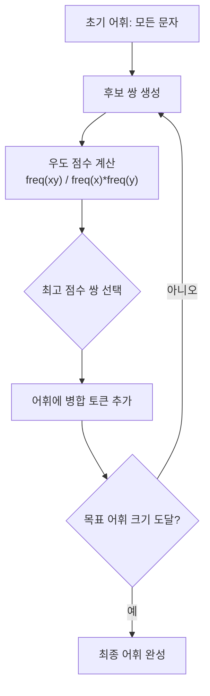
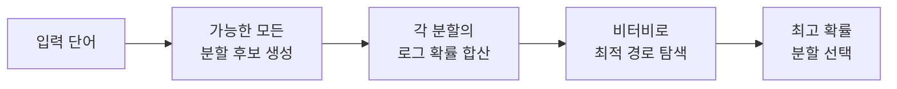
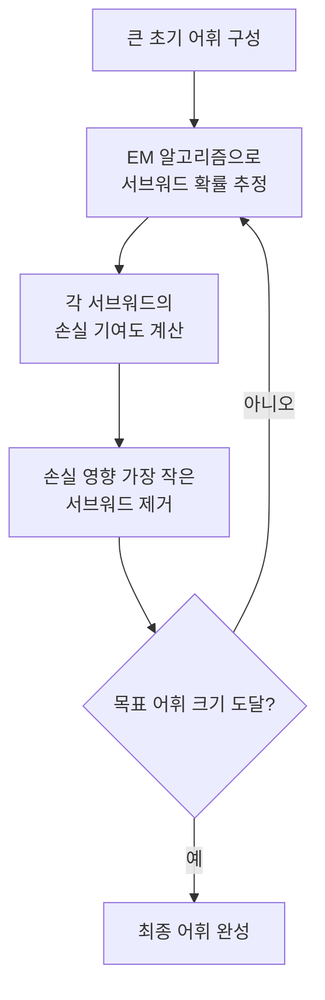
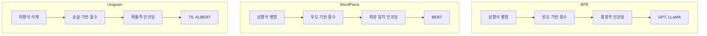

파일이 생성되었습니다. 세션 15.3의 주요 내용:

- **WordPiece**: 우도 기반 병합 점수(freq(xy)/freq(x)×freq(y))와 탐욕적 최장 일치 인코딩, `##` 접두사

> 📊 **그림 2**: WordPiece 인코딩 — 탐욕적 최장 일치

> 📊 **그림 1**: WordPiece 병합 학습 과정

- **Unigram**: 하향식 삭제, 비터비 알고리즘, 서브워드 정규화(다중 토큰화)

> 📊 **그림 4**: Unigram 인코딩 — 비터비 알고리즘

> 📊 **그림 3**: Unigram 모델 학습 과정 — 하향식 삭제

- **3대 알고리즘 종합 비교표**: 접근 방향, 학습 기준, 인코딩 방식, 대표 모델

> 📊 **그림 5**: BPE vs WordPiece vs Unigram 비교

- Mermaid 다이어그램 5개, `run:python` 블록 3개, 실습 코드 2개(SimpleWordPiece, SimpleUnigram)