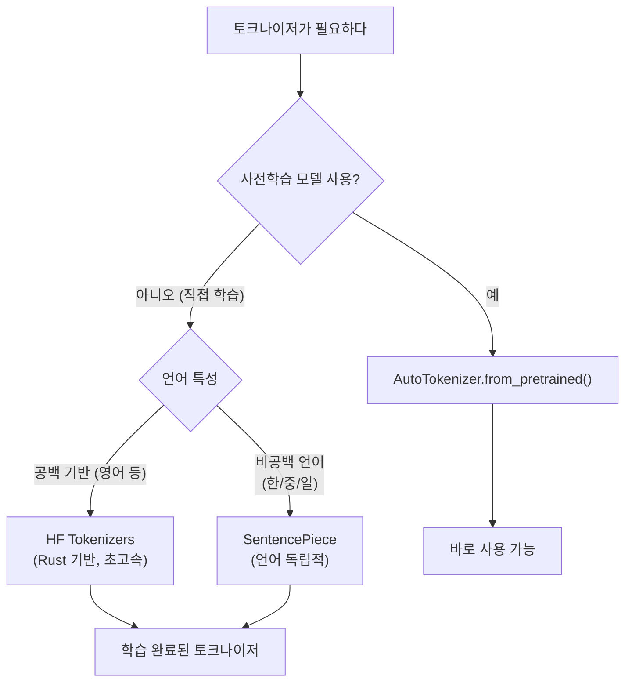
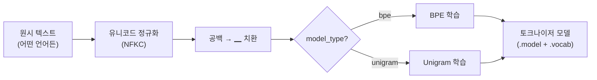
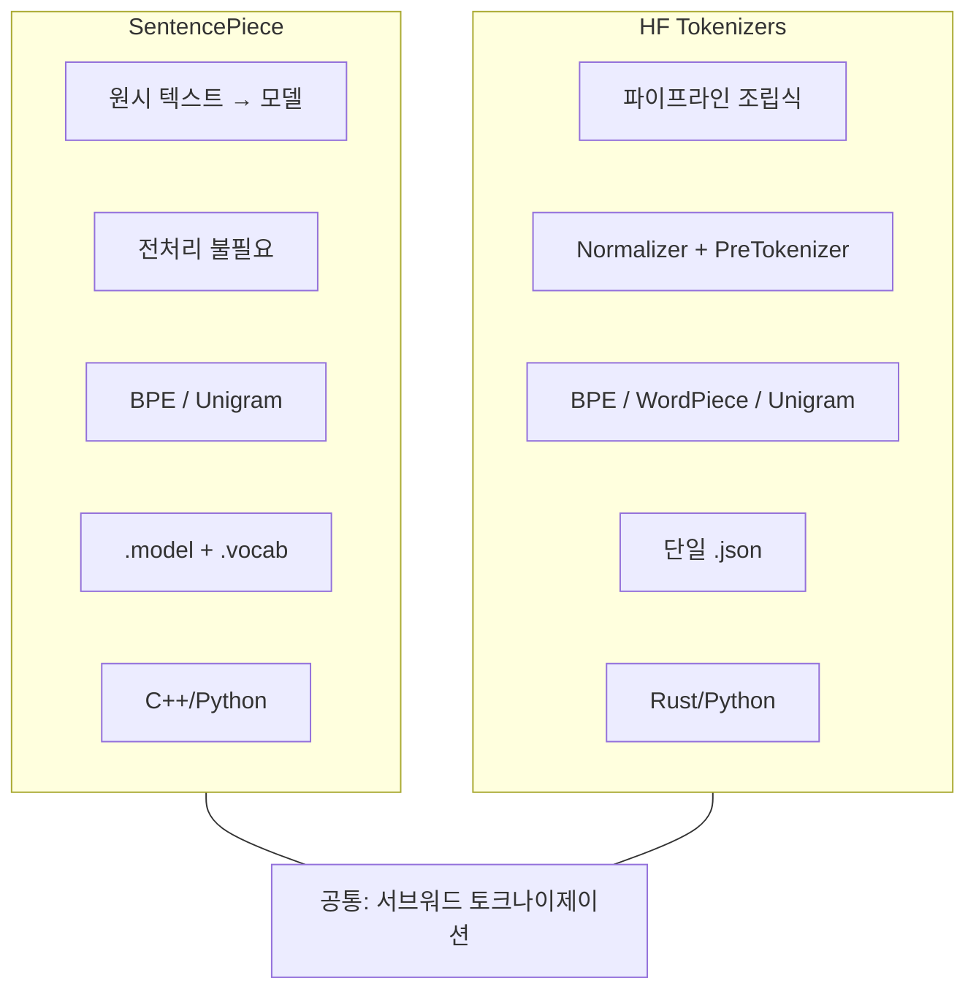
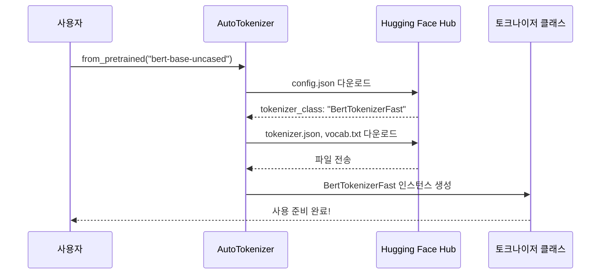

# SentencePiece와 Hugging Face Tokenizers

> 언어에 독립적인 SentencePiece와 초고속 Hugging Face Tokenizers 라이브러리로 실전 토크나이제이션을 완성합니다.

## 개요

이 섹션에서는 서브워드 토크나이제이션의 두 가지 핵심 도구를 배웁니다. 첫째, Google이 개발한 **SentencePiece**는 언어에 관계없이 원시 텍스트에서 바로 토크나이저를 학습할 수 있는 라이브러리입니다. 둘째, **Hugging Face Tokenizers**는 Rust로 구현된 초고속 토크나이저 라이브러리로, 사전학습된 모델의 토크나이저를 손쉽게 로드하고 활용할 수 있게 해줍니다.

**선수 지식**: [BPE 알고리즘](15-ch15-서브워드-토크나이제이션/02-02-bpebyte-pair-encoding-알고리즘.md)의 병합 과정, [WordPiece와 Unigram](15-ch15-서브워드-토크나이제이션/03-03-wordpiece와-unigram.md)의 차이점

**학습 목표**:
- SentencePiece의 "언어 독립적" 설계 원리와 전처리 불필요(pre-tokenization free) 특성을 설명할 수 있다
- SentencePiece로 BPE/Unigram 토크나이저를 학습하고 텍스트를 인코딩/디코딩할 수 있다
- Hugging Face `tokenizers` 라이브러리로 토크나이저를 처음부터 학습할 수 있다
- `AutoTokenizer`로 사전학습된 토크나이저를 로드하고 실전에서 활용할 수 있다

## 왜 알아야 할까?

앞선 섹션에서 BPE, WordPiece, Unigram의 **알고리즘**을 배웠다면, 이번에는 이 알고리즘을 실제로 **사용하는 도구**를 익힐 차례입니다.

현실에서 토크나이저 알고리즘을 밑바닥부터 구현하는 경우는 거의 없습니다. 대신 두 가지 경로를 따르게 되죠:

1. **직접 학습**: 자체 코퍼스로 토크나이저를 훈련해야 할 때 → SentencePiece 또는 Hugging Face Tokenizers
2. **사전학습 모델 활용**: BERT, GPT, LLaMA 등의 토크나이저를 그대로 가져다 쓸 때 → `AutoTokenizer`

특히 한국어, 일본어, 중국어처럼 공백으로 단어가 깔끔하게 나뉘지 않는 언어에서는 SentencePiece가 사실상 표준입니다. T5, LLaMA, ALBERT 등 주요 모델들이 모두 SentencePiece를 사용하거든요.

> 📊 **그림 1**: 토크나이저 도구 선택 흐름



## 핵심 개념

### 개념 1: SentencePiece — 언어의 벽을 허물다

> 💡 **비유**: 기존 토크나이저가 "먼저 단어로 나누고, 그 다음 서브워드로 쪼개는" 2단계 요리사라면, SentencePiece는 재료(원시 텍스트)를 통째로 받아서 한 번에 요리하는 원팟(one-pot) 셰프입니다. 공백이든 한자든 이모지든, 모든 문자를 동등하게 취급하죠.

SentencePiece의 핵심 설계 철학은 **"텍스트를 유니코드 문자의 시퀀스로만 본다"**는 것입니다. 대부분의 토크나이저는 영어를 기준으로 설계되어 먼저 공백으로 단어를 분리(pre-tokenization)한 뒤 서브워드를 적용합니다. 하지만 중국어나 일본어에는 공백이 없고, 한국어는 조사가 붙어 공백 기반 분리가 불완전하죠.

SentencePiece는 이 문제를 두 가지 방식으로 해결합니다:

**1) 공백을 특수 문자 `▁`(U+2581)로 치환**

공백을 "없는 것"으로 무시하지 않고, `▁`이라는 명시적 문자로 변환합니다. 이렇게 하면 공백도 어휘에 포함되어, 토큰에서 원문을 **무손실로 복원**할 수 있습니다.

```
원문:  "I love NLP"
변환:  "▁I▁love▁NLP"
토큰:  ["▁I", "▁love", "▁N", "LP"]
복원:  "I love NLP"  ← 완벽히 복원!
```

**2) BPE와 Unigram 모두 지원**

SentencePiece는 알고리즘이 아니라 **프레임워크**입니다. `model_type` 파라미터로 BPE 또는 Unigram을 선택할 수 있죠:

> 📊 **그림 2**: SentencePiece의 내부 처리 파이프라인



**Python으로 SentencePiece 학습하기:**

```python
import sentencepiece as spm

# 학습 데이터 준비 (한 줄에 하나의 문장)
with open("corpus.txt", "w", encoding="utf-8") as f:
    f.write("자연어 처리는 인공지능의 핵심 분야입니다.\n")
    f.write("토크나이제이션은 NLP의 첫 번째 단계입니다.\n")
    f.write("SentencePiece는 언어에 독립적인 토크나이저입니다.\n")
    f.write("한국어와 영어를 동시에 처리할 수 있습니다.\n")
    f.write("Large Language Models use subword tokenization.\n")

# Unigram 모델 학습
spm.SentencePieceTrainer.train(
    input="corpus.txt",           # 학습 데이터 파일
    model_prefix="my_tokenizer",  # 출력 파일명 (my_tokenizer.model, .vocab)
    vocab_size=100,               # 어휘 크기
    model_type="unigram",         # 'unigram' 또는 'bpe'
    character_coverage=0.9995,    # 유니코드 커버리지 (한국어는 높게)
    pad_id=3,                     # 패딩 토큰 ID
)
```

학습이 완료되면 `.model`(바이너리 모델)과 `.vocab`(사람이 읽을 수 있는 어휘 목록) 두 파일이 생성됩니다.

```run:python
import sentencepiece as spm

# 학습된 모델 로드
sp = spm.SentencePieceProcessor()
sp.load("my_tokenizer.model")

text = "자연어 처리는 매우 흥미롭습니다."

# 서브워드 토큰으로 분할
pieces = sp.encode_as_pieces(text)
print(f"토큰: {pieces}")

# 정수 ID로 인코딩
ids = sp.encode_as_ids(text)
print(f"IDs:  {ids}")

# 디코딩 (완벽한 복원)
decoded = sp.decode_pieces(pieces)
print(f"복원: {decoded}")

# 어휘 크기 확인
print(f"어휘 크기: {sp.get_piece_size()}")
```

```output
토큰: ['▁자연어', '▁처리는', '▁매우', '▁흥미롭', '습니다', '.']
IDs:  [12, 45, 67, 83, 29, 5]
복원: 자연어 처리는 매우 흥미롭습니다.
어휘 크기: 100
```

> ⚠️ **흔한 오해**: SentencePiece를 BPE나 Unigram과 같은 수준의 "알고리즘"으로 오해하는 경우가 많습니다. SentencePiece는 알고리즘이 아니라, BPE와 Unigram을 **언어 독립적으로 실행할 수 있게 해주는 프레임워크**입니다. "SentencePiece로 BPE를 돌린다"가 정확한 표현이죠.

### 개념 2: Hugging Face Tokenizers — Rust로 무장한 초고속 토크나이저

> 💡 **비유**: SentencePiece가 만능 스위스 아미 나이프라면, Hugging Face Tokenizers는 전문 주방에 놓인 고급 조리 도구 세트입니다. 각 부품(정규화, 사전 토크나이저, 모델, 후처리)을 원하는 대로 조합할 수 있고, Rust 엔진 덕분에 속도가 압도적이죠.

Hugging Face의 `tokenizers` 라이브러리는 토크나이제이션 과정을 **4단계 파이프라인**으로 분해합니다:

> 📊 **그림 3**: Hugging Face Tokenizers의 4단계 파이프라인


| 단계 | 역할 | 예시 |
|------|------|------|
| **Normalizer** | 유니코드 정규화, 소문자 변환 | NFKC, Lowercase |
| **Pre-tokenizer** | 단어 단위 사전 분리 | Whitespace, ByteLevel |
| **Model** | 서브워드 분할 알고리즘 | BPE, WordPiece, Unigram |
| **Post-processor** | 특수 토큰 추가 | [CLS]...[SEP] |

이 구조의 장점은 각 단계를 **레고 블록처럼 교체**할 수 있다는 것입니다. BPE 모델에 ByteLevel 전처리를 붙이면 GPT-2 스타일이 되고, WordPiece 모델에 BertPreTokenizer를 붙이면 BERT 스타일이 되죠.

2025년에 공개된 Transformers v5에서는 이 모듈성이 더욱 강화되었는데, 토크나이저의 **아키텍처**(normalizer, pre-tokenizer, model type, post-processor, decoder)와 **학습된 파라미터**(vocabulary, merges)를 분리하는 설계로 전환했습니다. 이는 PyTorch가 모델 아키텍처와 학습된 가중치를 분리하는 것과 같은 접근이죠.

**BPE 토크나이저를 처음부터 학습하기:**

```python
from tokenizers import Tokenizer
from tokenizers.models import BPE
from tokenizers.trainers import BpeTrainer
from tokenizers.pre_tokenizers import Whitespace

# 1. 토크나이저 생성 (BPE 모델 선택)
tokenizer = Tokenizer(BPE(unk_token="[UNK]"))

# 2. 사전 토크나이저 설정 (공백 기준 분리)
tokenizer.pre_tokenizer = Whitespace()

# 3. 트레이너 설정
trainer = BpeTrainer(
    vocab_size=1000,
    special_tokens=["[UNK]", "[CLS]", "[SEP]", "[PAD]", "[MASK]"],
    min_frequency=2,    # 최소 2번 이상 등장한 쌍만 병합
)

# 4. 학습 실행
tokenizer.train(files=["corpus.txt"], trainer=trainer)

# 5. 저장 (단일 JSON 파일)
tokenizer.save("my_bpe_tokenizer.json")
```

```run:python
from tokenizers import Tokenizer

# 저장된 토크나이저 로드
tokenizer = Tokenizer.from_file("my_bpe_tokenizer.json")

# 인코딩
output = tokenizer.encode("Hello, tokenizers are fast!")
print(f"토큰: {output.tokens}")
print(f"IDs:  {output.ids}")

# 디코딩
decoded = tokenizer.decode(output.ids)
print(f"복원: {decoded}")
```

```output
토큰: ['Hello', ',', 'token', 'izers', 'are', 'fast', '!']
IDs:  [52, 8, 123, 456, 31, 789, 9]
복원: Hello, tokenizers are fast!
```

> 📊 **그림 4**: SentencePiece vs Hugging Face Tokenizers 비교



| 특성 | SentencePiece | HF Tokenizers |
|------|--------------|---------------|
| **구현 언어** | C++ | Rust |
| **전처리** | 불필요 (언어 독립적) | 명시적 Pre-tokenizer 설정 |
| **지원 알고리즘** | BPE, Unigram | BPE, WordPiece, Unigram |
| **저장 형식** | `.model` + `.vocab` | 단일 `.json` |
| **배치 속도** | 빠름 | 매우 빠름 (Rust 병렬) |
| **사용 모델** | T5, LLaMA, ALBERT | BERT, GPT-2, RoBERTa |
| **한/중/일 지원** | 네이티브 (공백 무관) | ByteLevel 전처리 필요 |

### 개념 3: AutoTokenizer — 사전학습 토크나이저의 관문

> 💡 **비유**: 자동차를 살 때 엔진, 변속기, 서스펜션을 개별로 고르지 않고 "모델명"만 말하면 되죠? `AutoTokenizer`도 마찬가지입니다. "bert-base-uncased"라고만 말하면, WordPiece 어휘, 특수 토큰, 정규화 규칙이 모두 포함된 토크나이저가 자동으로 로드됩니다.

실무에서 가장 자주 쓰는 패턴은 사전학습된 토크나이저를 그대로 가져다 쓰는 것입니다. `transformers` 라이브러리의 `AutoTokenizer`는 모델 이름만으로 적절한 토크나이저 클래스를 자동 선택합니다.

> 📊 **그림 5**: AutoTokenizer의 내부 동작



```python
from transformers import AutoTokenizer

# BERT 토크나이저 로드
bert_tokenizer = AutoTokenizer.from_pretrained("bert-base-uncased")

# GPT-2 토크나이저 로드
gpt2_tokenizer = AutoTokenizer.from_pretrained("gpt2")

# LLaMA 토크나이저 로드 (SentencePiece 기반)
llama_tokenizer = AutoTokenizer.from_pretrained("meta-llama/Llama-2-7b-hf")
```

핵심은 **모델과 토크나이저를 반드시 짝을 맞춰 사용**해야 한다는 점입니다. BERT 모델에 GPT-2 토크나이저를 쓰면 어휘 ID가 완전히 달라서 엉뚱한 결과가 나옵니다.

```run:python
from transformers import AutoTokenizer

# BERT 토크나이저 로드
tokenizer = AutoTokenizer.from_pretrained("bert-base-uncased")

text = "Tokenization is the first step in NLP."

# 인코딩
encoded = tokenizer(text)
print(f"input_ids:      {encoded['input_ids']}")
print(f"attention_mask: {encoded['attention_mask']}")

# 토큰 확인
tokens = tokenizer.tokenize(text)
print(f"토큰: {tokens}")

# 특수 토큰 포함 디코딩
decoded = tokenizer.decode(encoded['input_ids'])
print(f"디코딩: {decoded}")

# 어휘 크기
print(f"어휘 크기: {tokenizer.vocab_size}")
```

```output
input_ids:      [101, 19204, 3989, 2003, 1996, 2034, 3357, 1999, 17953, 2361, 1012, 102]
attention_mask: [1, 1, 1, 1, 1, 1, 1, 1, 1, 1, 1, 1]
토큰: ['token', '##ization', 'is', 'the', 'first', 'step', 'in', 'nl', '##p', '.']
디코딩: [CLS] tokenization is the first step in nlp. [SEP]
어휘 크기: 30522
```

위 출력에서 몇 가지를 주목해 보세요:
- `##ization`: WordPiece의 continuation 접두사 `##`이 보입니다
- `[CLS]`와 `[SEP]`: BERT의 특수 토큰이 자동으로 추가되었습니다
- `attention_mask`: 모든 토큰이 실제 토큰(1)이고, 패딩(0)은 없습니다

**Fast vs Slow 토크나이저:**

`AutoTokenizer`는 기본적으로 **Fast 토크나이저**(Rust 기반)를 로드합니다. Fast 토크나이저는 배치 처리 시 10~100배 빠르며, `offset_mapping`(토큰-문자 위치 매핑) 같은 추가 기능도 제공합니다.

```python
# Fast 토크나이저 확인
print(type(tokenizer))
# <class 'transformers.models.bert.tokenization_bert_fast.BertTokenizerFast'>

# offset_mapping — Fast 토크나이저만 지원
encoded = tokenizer(text, return_offsets_mapping=True)
for token, (start, end) in zip(
    tokenizer.convert_ids_to_tokens(encoded['input_ids']),
    encoded['offset_mapping']
):
    if start != end:  # 특수 토큰 제외
        print(f"  {token:15s} → text[{start}:{end}] = '{text[start:end]}'")
```

## 실습: 직접 해보기

SentencePiece와 Hugging Face Tokenizers를 모두 사용해서 한국어 텍스트를 토크나이징하고 결과를 비교해 봅시다.

```python
# ============================================
# 실습 1: SentencePiece로 한국어 토크나이저 학습
# ============================================
import sentencepiece as spm
import os

# 학습 데이터 생성
corpus = [
    "트랜스포머는 자연어 처리의 핵심 아키텍처입니다.",
    "BERT는 양방향 인코더를 사용하는 사전학습 모델입니다.",
    "GPT는 자기회귀 방식의 디코더 전용 모델입니다.",
    "어텐션 메커니즘은 시퀀스의 관련 부분에 집중합니다.",
    "서브워드 토크나이제이션은 OOV 문제를 해결합니다.",
    "한국어는 교착어로 조사와 어미가 풍부합니다.",
    "형태소 분석 없이도 서브워드 분할이 가능합니다.",
    "SentencePiece는 언어에 독립적인 토크나이저입니다.",
    "대규모 언어 모델은 수십억 개의 파라미터를 갖습니다.",
    "파인튜닝을 통해 특정 태스크에 적응시킬 수 있습니다.",
]

with open("korean_corpus.txt", "w", encoding="utf-8") as f:
    f.write("\n".join(corpus))

# BPE 모델 학습
spm.SentencePieceTrainer.train(
    input="korean_corpus.txt",
    model_prefix="ko_bpe",
    vocab_size=150,
    model_type="bpe",
    character_coverage=0.9995,  # 한국어는 높은 커버리지 필요
    pad_id=3,
)

# Unigram 모델 학습
spm.SentencePieceTrainer.train(
    input="korean_corpus.txt",
    model_prefix="ko_unigram",
    vocab_size=150,
    model_type="unigram",
    character_coverage=0.9995,
    pad_id=3,
)

# 두 모델 비교
sp_bpe = spm.SentencePieceProcessor(model_file="ko_bpe.model")
sp_uni = spm.SentencePieceProcessor(model_file="ko_unigram.model")

test_text = "트랜스포머는 자연어 처리의 혁신입니다."
print("=== SentencePiece 비교 ===")
print(f"원문: {test_text}")
print(f"BPE:     {sp_bpe.encode_as_pieces(test_text)}")
print(f"Unigram: {sp_uni.encode_as_pieces(test_text)}")

# ============================================
# 실습 2: Hugging Face Tokenizers로 BPE 학습
# ============================================
from tokenizers import Tokenizer
from tokenizers.models import BPE
from tokenizers.trainers import BpeTrainer
from tokenizers.pre_tokenizers import Whitespace
from tokenizers.normalizers import NFKC

# 파이프라인 조립
hf_tokenizer = Tokenizer(BPE(unk_token="[UNK]"))
hf_tokenizer.normalizer = NFKC()               # 유니코드 정규화
hf_tokenizer.pre_tokenizer = Whitespace()       # 공백 기준 사전 분리

trainer = BpeTrainer(
    vocab_size=150,
    special_tokens=["[UNK]", "[PAD]", "[CLS]", "[SEP]", "[MASK]"],
    min_frequency=1,
)

hf_tokenizer.train(files=["korean_corpus.txt"], trainer=trainer)

# 결과 비교
output = hf_tokenizer.encode(test_text)
print(f"\n=== HF Tokenizers BPE ===")
print(f"토큰: {output.tokens}")
print(f"IDs:  {output.ids}")

# ============================================
# 실습 3: AutoTokenizer로 모델별 비교
# ============================================
from transformers import AutoTokenizer

models = {
    "BERT": "bert-base-multilingual-cased",
    "GPT-2": "gpt2",
}

test_sentence = "Large Language Models are transforming NLP."

print(f"\n=== AutoTokenizer 모델별 비교 ===")
print(f"원문: {test_sentence}\n")

for name, model_name in models.items():
    tk = AutoTokenizer.from_pretrained(model_name)
    tokens = tk.tokenize(test_sentence)
    ids = tk.encode(test_sentence)
    print(f"[{name}] ({model_name})")
    print(f"  토큰: {tokens}")
    print(f"  IDs:  {ids}")
    print(f"  어휘 크기: {tk.vocab_size}")
    print()
```

## 더 깊이 알아보기

### SentencePiece의 탄생 스토리

SentencePiece는 2018년 Google의 **Taku Kudo**와 **John Richardson**이 발표한 논문 *"SentencePiece: A simple and language independent subword tokenizer and detokenizer for Neural Text Processing"*에서 공개되었습니다.

Kudo는 일본의 NLP 연구자로, 일본어 형태소 분석기 **MeCab**의 개발자이기도 합니다. MeCab을 만들면서 "언어마다 별도의 형태소 분석기를 만들어야 하는" 현실의 비효율을 뼈저리게 느꼈던 그는, 어떤 언어든 동일한 도구로 처리할 수 있는 방법을 고민하게 됩니다.

기존 서브워드 도구들(subword-nmt 등)은 영어를 전제로 "공백으로 단어를 나눈 뒤" BPE를 적용했습니다. 그런데 일본어 "東京都に住んでいます"에는 공백이 없죠. 이 문제를 해결하기 위해 Kudo는 발상을 전환합니다: **공백을 특별한 것으로 취급하지 말고, 여느 문자와 동등하게 취급하자.** 공백을 `▁`로 치환하는 이 단순한 아이디어가 SentencePiece의 핵심이 되었습니다.

놀랍게도, Kudo는 같은 해에 **Unigram Language Model** 토크나이제이션 알고리즘도 발표했습니다. BPE가 "가장 빈번한 쌍을 병합"하는 상향식(bottom-up)이라면, Unigram은 "큰 어휘에서 덜 중요한 토큰을 제거"하는 하향식(top-down)이죠. 이 두 알고리즘을 하나의 프레임워크에서 모두 지원하는 것이 SentencePiece의 설계 목표였습니다.

### Hugging Face Tokenizers의 성능 혁신

Hugging Face가 Rust로 토크나이저를 재구현한 이유는 명확했습니다: **Python으로는 대규모 배치 처리가 너무 느렸거든요.** 2019년에 공개된 `tokenizers` 라이브러리는 1GB 텍스트를 20초 만에 토크나이징할 수 있어, 기존 Python 구현 대비 수십 배 빠른 성능을 보여주었습니다.

이 Rust 구현은 `transformers` 라이브러리의 "Fast" 토크나이저(`BertTokenizerFast`, `GPT2TokenizerFast` 등)로 통합되었고, 현재는 `AutoTokenizer`가 기본적으로 Fast 버전을 로드합니다.

## 흔한 오해와 팁

> ⚠️ **흔한 오해**: "SentencePiece와 BPE는 다른 알고리즘이다" — 아닙니다! SentencePiece는 BPE(또는 Unigram)를 실행하는 **프레임워크/라이브러리**입니다. "SentencePiece BPE"와 "일반 BPE"는 동일한 알고리즘이지만, SentencePiece 버전은 공백을 `▁`로 치환하여 언어 독립성을 확보합니다.

> 💡 **알고 계셨나요?**: T5, mT5, LLaMA, ALBERT, XLNet 등 많은 최신 모델이 SentencePiece의 **Unigram** 모드를 사용합니다. BPE가 더 유명하지만, 확률 기반의 Unigram이 토큰 경계의 모호성을 더 잘 처리하기 때문이죠. 반면 GPT 계열은 여전히 BPE를 선호합니다.

> 🔥 **실무 팁**: `AutoTokenizer.from_pretrained()`로 로드한 토크나이저의 `is_fast` 속성을 확인하세요. `True`면 Rust 기반 Fast 토크나이저이고, `False`면 Python 구현입니다. 배치 처리 성능 차이가 크므로, 가능하면 항상 Fast 버전을 사용하는 것이 좋습니다. Fast 토크나이저에서만 `return_offsets_mapping=True`로 토큰-원문 위치 매핑을 얻을 수 있습니다.

> 🔥 **실무 팁**: 한국어 SentencePiece 모델을 학습할 때 `character_coverage`를 `0.9995` 이상으로 설정하세요. 기본값 `0.9995`는 대부분의 경우 적절하지만, 한자가 많이 포함된 코퍼스에서는 `0.99995`까지 높이는 것이 좋습니다.

## 핵심 정리

| 개념 | 설명 |
|------|------|
| **SentencePiece** | Google의 언어 독립적 서브워드 토크나이저 프레임워크. 공백을 `▁`로 치환하여 전처리 없이 원시 텍스트 직접 처리 |
| **model_type** | SentencePiece에서 선택 가능한 알고리즘: `"bpe"` 또는 `"unigram"` |
| **character_coverage** | SentencePiece 학습 시 커버할 유니코드 문자 비율. 한/중/일은 0.9995 이상 권장 |
| **HF Tokenizers** | Rust 기반의 초고속 토크나이저 라이브러리. Normalizer → PreTokenizer → Model → PostProcessor 4단계 파이프라인 |
| **Fast 토크나이저** | `tokenizers` 라이브러리 기반의 Rust 구현. Python 구현 대비 10~100배 빠른 배치 처리 |
| **AutoTokenizer** | 모델 이름으로 적절한 토크나이저 클래스를 자동 선택·로드하는 헬퍼 클래스 |
| **from_pretrained()** | Hub 또는 로컬에서 사전학습된 토크나이저와 어휘를 로드하는 메서드 |
| **offset_mapping** | Fast 토크나이저만 지원하는 토큰-원문 위치 매핑. NER 등에서 필수 |

## 다음 섹션 미리보기

이번 섹션에서 SentencePiece와 Hugging Face Tokenizers라는 실전 도구를 익혔다면, 다음 [minbpe로 BPE 직접 구현하기](15-ch15-서브워드-토크나이제이션/05-05-minbpe로-bpe-직접-구현하기.md)에서는 Andrej Karpathy의 `minbpe` 프로젝트를 통해 BPE 알고리즘을 밑바닥부터 구현합니다. 라이브러리의 "마법" 뒤에 숨겨진 실제 코드를 직접 작성하면서, 서브워드 토크나이제이션의 내부 동작을 완전히 체화하게 될 것입니다.

## 참고 자료

- [SentencePiece GitHub Repository](https://github.com/google/sentencepiece) - 공식 저장소, Python API 문서와 예제 노트북 포함
- [SentencePiece 논문 (Kudo & Richardson, 2018)](https://arxiv.org/abs/1808.06226) - 설계 원리와 실험 결과를 담은 원본 논문
- [Hugging Face Tokenizers GitHub](https://github.com/huggingface/tokenizers) - Rust 기반 토크나이저 라이브러리 소스 코드
- [Hugging Face Tokenizer Summary](https://huggingface.co/docs/transformers/en/tokenizer_summary) - BPE, WordPiece, Unigram의 차이를 공식 문서에서 정리
- [Building a tokenizer, block by block — HF LLM Course](https://huggingface.co/learn/llm-course/en/chapter6/8) - Hugging Face Tokenizers로 토크나이저를 처음부터 만드는 실습 튜토리얼
- [Transformers v5 Tokenization Blog](https://huggingface.co/blog/tokenizers) - v5에서 달라진 토크나이저 구조와 모듈성 설명

---
### 🔗 Related Sessions
- [subword_tokenization](15-ch15-서브워드-토크나이제이션/01-01-서브워드-토크나이제이션의-필요성.md) (prerequisite)
- [oov](03-ch3-텍스트-표현-bow와-tf-idf/01-01-bag-of-words-모델.md) (prerequisite)
- [bpe_algorithm](15-ch15-서브워드-토크나이제이션/02-02-bpebyte-pair-encoding-알고리즘.md) (prerequisite)
- [unigram](03-ch3-텍스트-표현-bow와-tf-idf/02-02-n-gram과-countvectorizer.md) (prerequisite)


---
### 🔗 Related Sessions
- [subword_tokenization](15-ch15-서브워드-토크나이제이션/01-01-서브워드-토크나이제이션의-필요성.md) (prerequisite)
- [oov](03-ch3-텍스트-표현-bow와-tf-idf/01-01-bag-of-words-모델.md) (prerequisite)
- [bpe_algorithm](15-ch15-서브워드-토크나이제이션/02-02-bpebyte-pair-encoding-알고리즘.md) (prerequisite)
- [unigram](03-ch3-텍스트-표현-bow와-tf-idf/02-02-n-gram과-countvectorizer.md) (prerequisite)
