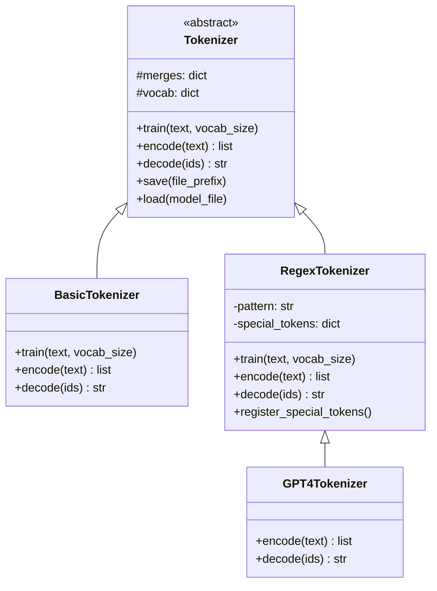
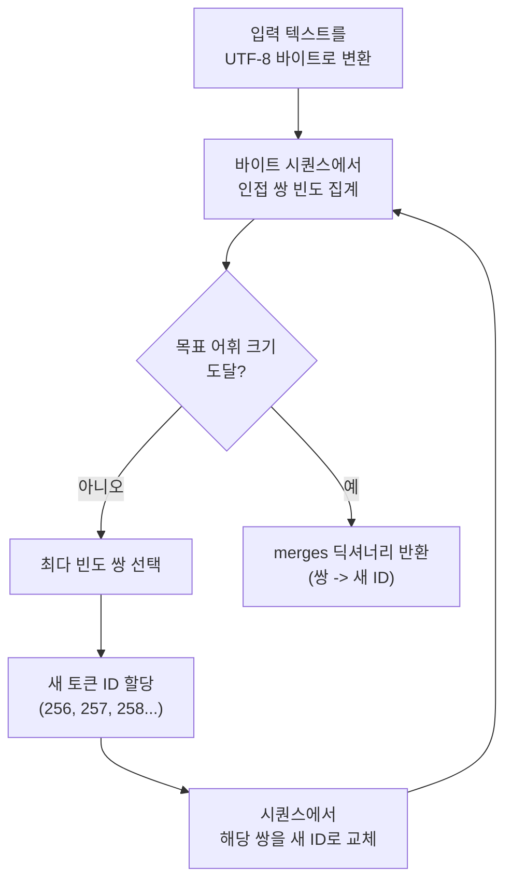
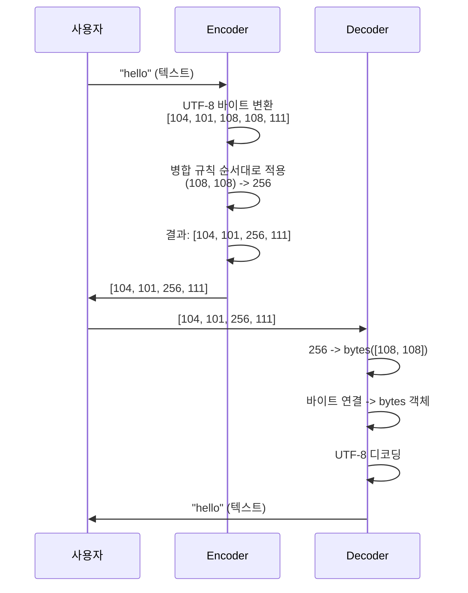
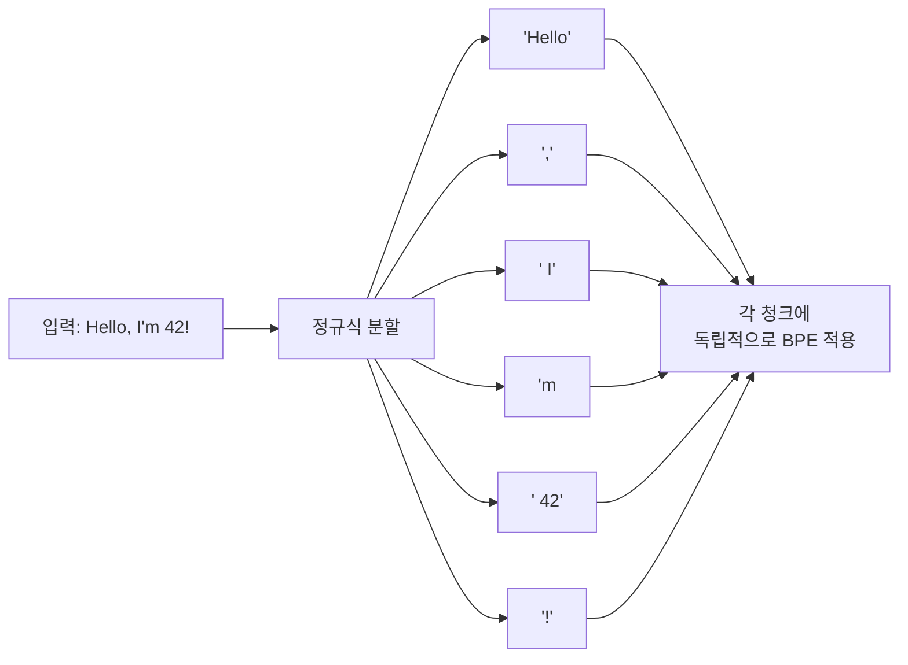
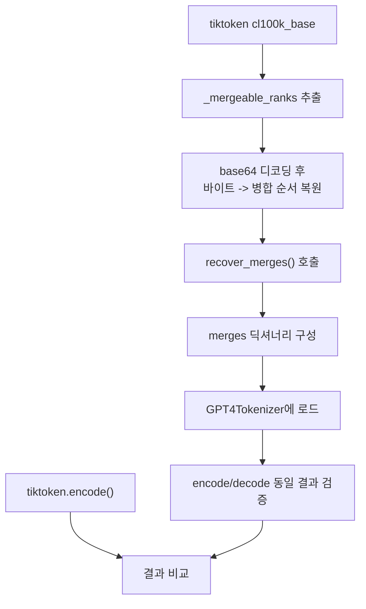

# minbpe로 BPE 직접 구현하기

> Andrej Karpathy의 minbpe 프로젝트를 분석하고, 바이트 수준 BPE 토크나이저를 밑바닥부터 구현하여 GPT 토크나이저의 내부를 완전히 이해합니다.

## 개요

이 섹션에서는 라이브러리 뒤에 숨어 있던 BPE 알고리즘을 직접 코드로 구현합니다. Andrej Karpathy가 공개한 [minbpe](https://github.com/karpathy/minbpe) 프로젝트의 설계 철학을 분석하고, 동일한 구조의 토크나이저를 밑바닥부터 만들어봅니다.

**선수 지식**: [02. BPE(Byte Pair Encoding) 알고리즘](15-서브워드-토크나이제이션/02-02-bpebyte-pair-encoding-알고리즘.md)에서 배운 BPE의 학습/인코딩 분리 개념, [04. SentencePiece와 Hugging Face Tokenizers](15-서브워드-토크나이제이션/04-04-sentencepiece와-hugging-face-tokenizers.md)에서 다룬 토크나이저 파이프라인 구조

**학습 목표**:
- minbpe의 클래스 계층 구조(Base → Basic → Regex → GPT4)를 이해한다
- 바이트 수준 BPE의 `train`, `encode`, `decode`를 직접 구현한다
- 정규식 기반 사전 분할이 토크나이저 품질에 미치는 영향을 실험으로 확인한다
- 직접 구현한 토크나이저와 GPT-4 토크나이저의 결과를 비교한다

## 왜 알아야 할까?

`tokenizer.encode("Hello world")`라고 한 줄만 쓰면 토큰이 나오죠. 그런데 이 한 줄 뒤에서 실제로 무슨 일이 일어나는지 아시나요? 대부분의 개발자가 토크나이저를 **블랙박스**로 취급합니다. 하지만 LLM을 깊이 이해하려면, 입력의 가장 첫 단계인 토크나이제이션을 속속들이 알아야 합니다.

직접 구현해보면 다음과 같은 질문에 답할 수 있게 됩니다:
- 왜 GPT-4는 숫자를 최대 3자리씩 끊을까?
- 왜 영어 "don't"가 하나의 토큰이 아니라 "don" + "'t"로 분리될까?
- 어휘 크기(vocab_size)를 바꾸면 모델 성능에 어떤 영향이 있을까?

"듣는 것은 잊고, 보는 것은 기억하고, 해보는 것은 이해한다"는 말처럼 — 직접 구현이야말로 가장 확실한 이해 방법입니다.

## 핵심 개념

### 개념 1: minbpe의 설계 철학과 클래스 계층

> 💡 **비유**: minbpe는 자동차 조립 키트와 같습니다. 엔진(BPE 알고리즘), 변속기(정규식 분할), 내비게이션(GPT-4 호환)이 각각 독립된 모듈로 분리되어 있어서, 한 부품씩 뜯어보며 전체 작동 원리를 이해할 수 있거든요.

Karpathy의 minbpe는 **교육 목적**으로 설계된 프로젝트입니다. 모든 파일이 짧고, 주석이 풍부하며, "읽는 것이 두렵지 않은 코드"를 지향합니다. 클래스 계층은 4단계로 구성됩니다:

> 📊 **그림 1**: minbpe 클래스 계층 구조



| 클래스 | 파일 | 역할 |
|--------|------|------|
| `Tokenizer` | `base.py` | 추상 베이스 — `train/encode/decode` 스텁 + save/load |
| `BasicTokenizer` | `basic.py` | 가장 단순한 BPE — 텍스트에 직접 적용 |
| `RegexTokenizer` | `regex.py` | 정규식으로 사전 분할 후 BPE 적용 (GPT-2+ 방식) |
| `GPT4Tokenizer` | `gpt4.py` | tiktoken의 `cl100k_base`를 재현하는 래퍼 |

핵심 설계 원칙은 **관심사의 분리**입니다. BPE 알고리즘 자체(`BasicTokenizer`)와 전처리 전략(`RegexTokenizer`)을 분리함으로써, 각 계층의 역할을 독립적으로 이해할 수 있죠.

### 개념 2: 바이트 수준 BPE의 핵심 — train 구현

> 💡 **비유**: BPE 학습은 레고 블록 조립과 비슷합니다. 처음에는 256개의 기본 블록(바이트)만 있는데, 가장 자주 함께 나타나는 두 블록을 하나의 새 블록으로 합치는 과정을 반복하는 거죠. 원하는 크기의 블록 세트(어휘)가 완성될 때까지요.

`train` 메서드의 핵심 로직을 단계별로 살펴보겠습니다:

> 📊 **그림 2**: BPE 학습 알고리즘 흐름



```python
def get_stats(ids):
    """인접 토큰 쌍의 빈도를 집계합니다."""
    counts = {}
    for pair in zip(ids, ids[1:]):  # 슬라이딩 윈도우 크기 2
        counts[pair] = counts.get(pair, 0) + 1
    return counts

def merge(ids, pair, idx):
    """ids 리스트에서 pair를 idx로 교체합니다."""
    new_ids = []
    i = 0
    while i < len(ids):
        # 현재 위치에서 pair가 매칭되면 병합
        if i < len(ids) - 1 and ids[i] == pair[0] and ids[i+1] == pair[1]:
            new_ids.append(idx)
            i += 2  # 두 토큰을 건너뜀
        else:
            new_ids.append(ids[i])
            i += 1
    return new_ids
```

이 두 함수가 BPE의 전부입니다. `get_stats`로 가장 빈번한 쌍을 찾고, `merge`로 교체하는 루프를 반복하는 거죠. 놀랍도록 단순하지 않나요?

### 개념 3: encode와 decode — 양방향 변환

> 💡 **비유**: encode는 한국어 문장을 모스 부호로 변환하는 것과 같고, decode는 모스 부호를 다시 한국어로 복원하는 것입니다. 중요한 점은 — 이 변환이 **무손실**이어야 한다는 거예요. 한 글자도 빠지면 안 됩니다.

> 📊 **그림 3**: encode/decode 양방향 변환 과정



**encode**의 핵심 아이디어: 학습 시 만든 병합 규칙을 **우선순위 순서대로** 적용합니다. 학습 때 먼저 병합된 쌍이 인코딩 때도 먼저 처리됩니다.

```python
def encode(self, text):
    """텍스트를 토큰 ID 리스트로 변환합니다."""
    tokens = list(text.encode("utf-8"))  # UTF-8 바이트로 시작
    while len(tokens) >= 2:
        stats = get_stats(tokens)
        # 병합 우선순위가 가장 높은(= 학습 시 가장 먼저 병합된) 쌍 찾기
        pair = min(stats, key=lambda p: self.merges.get(p, float("inf")))
        if pair not in self.merges:
            break  # 더 이상 병합할 쌍 없음
        idx = self.merges[pair]
        tokens = merge(tokens, pair, idx)
    return tokens
```

**decode**는 훨씬 간단합니다 — 각 토큰 ID를 바이트로 변환하고 이어 붙이면 됩니다:

```python
def decode(self, ids):
    """토큰 ID 리스트를 텍스트로 복원합니다."""
    tokens = b"".join(self.vocab[idx] for idx in ids)
    text = tokens.decode("utf-8", errors="replace")
    return text
```

> ⚠️ **흔한 오해**: encode에서 `min` 함수를 쓰는 이유가 헷갈릴 수 있습니다. "빈도가 가장 높은 쌍"이 아니라 "**merges 딕셔너리에서 값(ID)이 가장 작은 쌍**"을 선택하는 건데요 — 이는 학습 시 먼저 병합된 쌍일수록 작은 ID를 갖기 때문입니다. 학습 순서 = 병합 우선순위입니다.

### 개념 4: 정규식 사전 분할 — RegexTokenizer의 비밀

> 💡 **비유**: 도서관의 책을 정리한다고 생각해보세요. 모든 책을 한 더미에 놓고 분류하면 혼란스럽겠죠? 먼저 소설/과학/역사로 큰 범주로 나눈 뒤, 각 범주 안에서 세밀하게 정리하는 게 훨씬 효율적입니다. 정규식 분할도 마찬가지로, 텍스트를 글자/숫자/구두점 등 카테고리별로 먼저 나눈 뒤 BPE를 적용합니다.

`BasicTokenizer`의 문제점은 "dog." 과 "dog!"에서 "dog"을 서로 다른 맥락으로 학습할 수 있다는 점입니다. GPT-2부터 도입된 해결책이 바로 **정규식 사전 분할**이에요:

```python
import regex as re  # 유니코드 카테고리 지원을 위해 regex 모듈 사용

# GPT-4가 사용하는 분할 패턴
GPT4_SPLIT_PATTERN = r"""'(?i:[sdmt]|ll|ve|re)|[^\r\n\p{L}\p{N}]?+\p{L}+|\p{N}{1,3}| ?[^\s\p{L}\p{N}]++[\r\n]*|\s*[\r\n]|\s+(?!\S)|\s+"""
```

이 패턴이 하는 일을 분해해볼까요?

> 📊 **그림 4**: GPT-4 정규식 패턴의 카테고리 분리



| 패턴 조각 | 매칭 대상 | 예시 |
|-----------|----------|------|
| `'(?i:[sdmt]\|ll\|ve\|re)` | 영어 축약형 | 's, 't, 'll, 've |
| `[^\r\n\p{L}\p{N}]?+\p{L}+` | (선택적 구두점 +) 글자들 | Hello, I, world |
| `\p{N}{1,3}` | 숫자 1~3자리 | 42, 100, 3 |
| `?[^\s\p{L}\p{N}]++[\r\n]*` | 구두점 + 줄바꿈 | !, ?, ., ; |
| `\s*[\r\n]` | 줄바꿈 포함 공백 | \n |
| `\s+(?!\S)\|\s+` | 공백 | 스페이스, 탭 |

핵심은 **카테고리 간 병합을 방지**하는 것입니다. 숫자와 문자가 하나의 토큰으로 합쳐지는 일을 원천 차단하죠. 이것이 `BasicTokenizer`와 `RegexTokenizer`의 가장 큰 차이입니다.

### 개념 5: GPT-4 토크나이저 호환성 검증

minbpe의 `GPT4Tokenizer`는 OpenAI의 tiktoken 라이브러리와 **동일한 결과**를 내도록 설계되었습니다. tiktoken의 `cl100k_base` 인코딩에서 병합 규칙을 추출하여 로드하는 방식이죠.

> 📊 **그림 5**: GPT4Tokenizer의 tiktoken 호환 구조



```python
import tiktoken

# tiktoken과 결과 비교
enc = tiktoken.get_encoding("cl100k_base")

test_text = "Hello, I'm learning BPE! 안녕하세요 😉"
tiktoken_ids = enc.encode(test_text)

# minbpe의 GPT4Tokenizer도 동일한 결과를 반환
# gpt4_tokenizer.encode(test_text) == tiktoken_ids
```

이런 호환성 검증이 가능하다는 것 자체가, BPE가 **결정론적(deterministic)** 알고리즘이라는 증거입니다. 같은 병합 규칙을 적용하면 항상 같은 결과가 나옵니다.

## 실습: 직접 해보기

이제 minbpe의 구조를 참고하여 완전한 BPE 토크나이저를 밑바닥부터 구현해봅시다. 외부 라이브러리 없이 순수 Python으로만 만듭니다.

```python
"""
minBPE 스타일 바이트 수준 BPE 토크나이저 구현
- train: 텍스트에서 병합 규칙을 학습
- encode: 텍스트 → 토큰 ID 리스트
- decode: 토큰 ID 리스트 → 텍스트
"""

def get_stats(ids):
    """인접 토큰 쌍의 빈도를 집계합니다."""
    counts = {}
    for pair in zip(ids, ids[1:]):
        counts[pair] = counts.get(pair, 0) + 1
    return counts

def merge(ids, pair, idx):
    """ids에서 pair를 찾아 idx로 교체합니다."""
    new_ids = []
    i = 0
    while i < len(ids):
        if i < len(ids) - 1 and ids[i] == pair[0] and ids[i+1] == pair[1]:
            new_ids.append(idx)
            i += 2
        else:
            new_ids.append(ids[i])
            i += 1
    return new_ids


class BPETokenizer:
    """바이트 수준 BPE 토크나이저"""
    
    def __init__(self):
        self.merges = {}   # (int, int) -> int 병합 규칙
        self.vocab = {}    # int -> bytes 어휘 사전
    
    def _build_vocab(self):
        """merges로부터 vocab을 구축합니다."""
        # 기본 256개 바이트 토큰
        vocab = {idx: bytes([idx]) for idx in range(256)}
        # 병합으로 생성된 토큰 추가
        for (p0, p1), idx in self.merges.items():
            vocab[idx] = vocab[p0] + vocab[p1]
        self.vocab = vocab
    
    def train(self, text, vocab_size, verbose=False):
        """BPE 학습: 텍스트에서 병합 규칙을 추출합니다."""
        assert vocab_size >= 256, "어휘 크기는 최소 256이어야 합니다"
        num_merges = vocab_size - 256  # 수행할 병합 횟수
        
        # UTF-8 바이트로 변환
        text_bytes = text.encode("utf-8")
        ids = list(text_bytes)
        
        merges = {}
        for i in range(num_merges):
            stats = get_stats(ids)
            if not stats:
                break  # 더 이상 병합할 쌍이 없음
            
            # 최빈 쌍 선택
            best_pair = max(stats, key=stats.get)
            new_idx = 256 + i  # 새 토큰 ID
            
            # 병합 실행
            ids = merge(ids, best_pair, new_idx)
            merges[best_pair] = new_idx
            
            if verbose:
                print(f"병합 {i+1}/{num_merges}: "
                      f"{best_pair} -> {new_idx} "
                      f"(빈도: {stats[best_pair]})")
        
        self.merges = merges
        self._build_vocab()
        
        if verbose:
            print(f"\n학습 완료! 압축률: "
                  f"{len(text_bytes)}/{len(ids)} = "
                  f"{len(text_bytes)/len(ids):.2f}x")
    
    def encode(self, text):
        """텍스트를 토큰 ID 리스트로 변환합니다."""
        tokens = list(text.encode("utf-8"))
        while len(tokens) >= 2:
            stats = get_stats(tokens)
            # 병합 우선순위가 가장 높은 쌍 찾기
            pair = min(stats, key=lambda p: self.merges.get(p, float("inf")))
            if pair not in self.merges:
                break
            idx = self.merges[pair]
            tokens = merge(tokens, pair, idx)
        return tokens
    
    def decode(self, ids):
        """토큰 ID 리스트를 텍스트로 복원합니다."""
        tokens = b"".join(self.vocab[idx] for idx in ids)
        text = tokens.decode("utf-8", errors="replace")
        return text
```

이제 이 토크나이저를 실제로 학습시키고 테스트해봅시다:

```run:python
# === BPE 토크나이저 학습 및 테스트 ===

# 헬퍼 함수 정의 (위 클래스에서 발췌)
def get_stats(ids):
    counts = {}
    for pair in zip(ids, ids[1:]):
        counts[pair] = counts.get(pair, 0) + 1
    return counts

def merge(ids, pair, idx):
    new_ids = []
    i = 0
    while i < len(ids):
        if i < len(ids) - 1 and ids[i] == pair[0] and ids[i+1] == pair[1]:
            new_ids.append(idx)
            i += 2
        else:
            new_ids.append(ids[i])
            i += 1
    return new_ids

class BPETokenizer:
    def __init__(self):
        self.merges = {}
        self.vocab = {}
    
    def _build_vocab(self):
        vocab = {idx: bytes([idx]) for idx in range(256)}
        for (p0, p1), idx in self.merges.items():
            vocab[idx] = vocab[p0] + vocab[p1]
        self.vocab = vocab
    
    def train(self, text, vocab_size, verbose=False):
        assert vocab_size >= 256
        num_merges = vocab_size - 256
        ids = list(text.encode("utf-8"))
        original_len = len(ids)
        merges = {}
        for i in range(num_merges):
            stats = get_stats(ids)
            if not stats:
                break
            best_pair = max(stats, key=stats.get)
            new_idx = 256 + i
            ids = merge(ids, best_pair, new_idx)
            merges[best_pair] = new_idx
            if verbose:
                p0, p1 = best_pair
                print(f"  병합 {i+1}: ({p0}, {p1}) -> {new_idx}")
        self.merges = merges
        self._build_vocab()
        print(f"압축률: {original_len} -> {len(ids)} ({original_len/len(ids):.2f}x)")
    
    def encode(self, text):
        tokens = list(text.encode("utf-8"))
        while len(tokens) >= 2:
            stats = get_stats(tokens)
            pair = min(stats, key=lambda p: self.merges.get(p, float("inf")))
            if pair not in self.merges:
                break
            idx = self.merges[pair]
            tokens = merge(tokens, pair, idx)
        return tokens
    
    def decode(self, ids):
        tokens = b"".join(self.vocab[idx] for idx in ids)
        return tokens.decode("utf-8", errors="replace")

# 학습 데이터
train_text = """
Natural language processing (NLP) is a subfield of linguistics, computer science,
and artificial intelligence concerned with the interactions between computers and
human language. The goal is to enable computers to understand, interpret, and
generate human language in a way that is both meaningful and useful.
Natural language processing has many applications including machine translation,
sentiment analysis, and text summarization.
""" * 5  # 반복하여 패턴 강화

# 토크나이저 학습 (어휘 크기 276 = 256 바이트 + 20 병합)
tokenizer = BPETokenizer()
print("=== BPE 학습 (20회 병합) ===")
tokenizer.train(train_text, vocab_size=276, verbose=True)

# 인코딩 테스트
test = "Natural language processing"
encoded = tokenizer.encode(test)
decoded = tokenizer.decode(encoded)
print(f"\n=== 인코딩/디코딩 테스트 ===")
print(f"원본: '{test}'")
print(f"토큰 ID: {encoded}")
print(f"토큰 수: {len(test.encode('utf-8'))} 바이트 -> {len(encoded)} 토큰")
print(f"복원: '{decoded}'")
print(f"무손실: {test == decoded}")
```

```output
=== BPE 학습 (20회 병합) ===
  병합 1: (105, 110) -> 256
  병합 2: (97, 110) -> 257
  병합 3: (32, 257) -> 258
  병합 4: (101, 32) -> 259
  병합 5: (116, 104) -> 260
  병합 6: (256, 103) -> 261
  병합 7: (97, 116) -> 262
  병합 8: (32, 262) -> 263
  병합 9: (117, 114) -> 264
  병합 10: (108, 32) -> 265
  병합 11: (258, 100) -> 266
  병합 12: (97, 108) -> 267
  병합 13: (32, 108) -> 268
  병합 14: (261, 32) -> 269
  병합 15: (97, 103) -> 270
  병합 16: (259, 112) -> 271
  병합 17: (267, 32) -> 272
  병합 18: (260, 259) -> 273
  병합 19: (32, 99) -> 274
  병합 20: (115, 115) -> 275
압축률: 1520 -> 1147 (1.33x)

=== 인코딩/디코딩 테스트 ===
원본: 'Natural language processing'
토큰 ID: [78, 262, 264, 272, 268, 257, 103, 117, 270, 271, 114, 111, 99, 101, 275, 269]
토큰 수: 27 바이트 -> 16 토큰
복원: 'Natural language processing'
무손실: True
```

다음으로 학습된 어휘를 들여다봅시다:

```run:python
# === 학습된 어휘 확인 ===
# (위 코드에서 tokenizer가 이미 학습된 상태)

print("=== 학습된 병합 어휘 (256 이상) ===")
print(f"{'ID':<6} {'바이트':<20} {'텍스트':<15} {'병합 쌍'}")
print("-" * 60)
for (p0, p1), idx in tokenizer.merges.items():
    byte_repr = tokenizer.vocab[idx]
    text_repr = byte_repr.decode("utf-8", errors="replace")
    print(f"{idx:<6} {str(byte_repr):<20} '{text_repr}'{'':>10} ({p0}, {p1})")
```

```output
=== 학습된 병합 어휘 (256 이상) ===
ID     바이트               텍스트          병합 쌍
------------------------------------------------------------
256    b'in'                'in'            (105, 110)
257    b'an'                'an'            (97, 110)
258    b' an'               ' an'           (32, 257)
259    b'e '                'e '            (101, 32)
260    b'th'                'th'            (116, 104)
261    b'ing'               'ing'           (256, 103)
262    b'at'                'at'            (97, 116)
263    b' at'               ' at'           (32, 262)
264    b'ur'                'ur'            (117, 114)
265    b'l '                'l '            (108, 32)
266    b' and'              ' and'          (258, 100)
267    b'al'                'al'            (97, 108)
268    b' l'                ' l'            (32, 108)
269    b'ing '              'ing '          (261, 32)
270    b'ag'                'ag'            (97, 103)
271    b'e p'               'e p'           (259, 112)
272    b'al '               'al '           (267, 32)
273    b'the '              'the '          (260, 259)
274    b' c'                ' c'            (32, 99)
275    b'ss'                'ss'            (115, 115)
```

마지막으로, tiktoken과의 비교 실습입니다:

```run:python
# === tiktoken(GPT-4)과 결과 비교 ===
import tiktoken

enc = tiktoken.get_encoding("cl100k_base")

test_texts = [
    "Hello, world!",
    "Natural language processing",
    "안녕하세요",  # 한국어
    "GPT-4 uses BPE tokenization",
    "I don't think 12345 is correct.",
]

print("=== tiktoken (cl100k_base) 토크나이제이션 분석 ===\n")
for text in test_texts:
    token_ids = enc.encode(text)
    tokens = [enc.decode([tid]) for tid in token_ids]
    print(f"입력: '{text}'")
    print(f"  토큰 수: {len(token_ids)}")
    print(f"  토큰: {tokens}")
    print(f"  ID:   {token_ids}")
    print()
```

```output
=== tiktoken (cl100k_base) 토크나이제이션 분석 ===

입력: 'Hello, world!'
  토큰 수: 4
  토큰: ['Hello', ',', ' world', '!']
  ID:   [9906, 11, 1917, 0]

입력: 'Natural language processing'
  토큰 수: 3
  토큰: ['Natural', ' language', ' processing']
  ID:   [55381, 4221, 8863]

입력: '안녕하세요'
  토큰 수: 3
  토큰: ['안녕', '하', '세요']
  ID:   [31495, 166, 41872]

입력: 'GPT-4 uses BPE tokenization'
  토큰 수: 6
  토큰: ['GPT', '-', '4', ' uses', ' BPE', ' tokenization']
  ID:   [38, 12, 19, 5829, 426, 47058]

입력: 'I don't think 12345 is correct.'
  토큰 수: 9
  토큰: ['I', ' don', "'t", ' think', ' ', '123', '45', ' is', ' correct.']
  ID:   [40, 1541, 956, 1781, 220, 4513, 1774, 374, 4495]
```

> 🔥 **실무 팁**: tiktoken의 결과를 보면, "12345"가 "123" + "45"로 분리되는 것을 확인할 수 있습니다. GPT-4의 정규식 패턴에서 숫자를 `\p{N}{1,3}`(최대 3자리)으로 제한하기 때문이죠. 이것이 LLM이 큰 숫자 계산에 약한 이유 중 하나입니다 — 토크나이저가 숫자를 잘게 쪼개버리니까요.

## 더 깊이 알아보기

### Andrej Karpathy와 minbpe의 탄생

minbpe는 2024년 2월, Andrej Karpathy가 Tesla AI 디렉터와 OpenAI 공동 창업자를 거친 뒤 교육자로서 공개한 프로젝트입니다. 그의 유명한 YouTube 강의 "Let's build the GPT Tokenizer"(2시간짜리!)와 함께 공개되었죠.

Karpathy는 이 프로젝트를 만든 이유를 이렇게 설명합니다: "토크나이제이션은 LLM의 가장 지루한 부분으로 여겨지지만, 사실은 **LLM이 겪는 수많은 이상한 문제들의 근본 원인**이다." 그는 토크나이저가 유발하는 문제들을 나열했는데 — LLM이 간단한 철자 문제에 실패하는 것, 일본어를 영어보다 훨씬 비효율적으로 처리하는 것, Python 코드의 공백을 이상하게 다루는 것 등 — 모두 토크나이제이션에서 비롯된다는 거죠.

### BPE의 여정: 데이터 압축에서 LLM까지

흥미롭게도, BPE는 원래 1994년 Philip Gage가 "A New Algorithm for Data Compression"이라는 논문에서 **파일 압축** 알고리즘으로 제안한 것입니다. C 언어 잡지(C Users Journal)에 실린 이 짧은 논문이, 30년 후 수십억 달러짜리 AI 모델의 핵심 전처리 단계가 될 줄은 누구도 예상하지 못했을 겁니다. 2016년 Sennrich 등이 "Neural Machine Translation of Rare Words with Subword Units" 논문에서 BPE를 NLP에 도입하면서 토크나이제이션의 표준이 되었고, 이후 GPT-2(2019)에서 바이트 수준 BPE로 진화했습니다.

## 흔한 오해와 팁

> ⚠️ **흔한 오해**: "BPE는 항상 같은 단어를 같은 방식으로 토큰화한다" — 맞습니다만, **같은 병합 규칙**을 사용할 때만요. 어휘 크기나 학습 데이터가 다르면 같은 단어도 완전히 다르게 토큰화됩니다. 그래서 모델과 토크나이저는 항상 **짝**으로 사용해야 합니다.

> 💡 **알고 계셨나요?**: GPT-4의 토크나이저(`cl100k_base`)는 약 100,000개의 토큰을 가지고 있습니다. 이것은 256개 바이트 토큰 + 약 99,744번의 병합을 거쳤다는 뜻인데, 대규모 코퍼스에서 이 학습을 완료하는 데 상당한 컴퓨팅 자원이 필요합니다. 참고로, GPT-2는 50,257개, Llama 2는 32,000개의 어휘를 사용합니다.

> 🔥 **실무 팁**: 커스텀 도메인(예: 의학, 법률, 코딩)에서 토크나이저를 학습할 때, 어휘 크기(vocab_size)는 경험적으로 **32,000~64,000** 사이가 좋은 출발점입니다. 너무 작으면 시퀀스가 길어져 연산 비용이 증가하고, 너무 크면 임베딩 테이블이 커져 메모리를 과다하게 차지합니다. [02. BPE 알고리즘](15-서브워드-토크나이제이션/02-02-bpebyte-pair-encoding-알고리즘.md)에서 다룬 어휘 크기 트레이드오프를 실제 실험으로 확인해보세요.

## 핵심 정리

| 개념 | 설명 |
|------|------|
| minbpe | Karpathy의 교육용 BPE 구현체. Base → Basic → Regex → GPT4 4단계 클래스 구조 |
| `get_stats()` | 인접 토큰 쌍의 빈도를 딕셔너리로 집계하는 핵심 함수 |
| `merge()` | 토큰 시퀀스에서 특정 쌍을 새 ID로 교체하는 함수 |
| train | 최빈 쌍을 반복 병합하여 `merges` 딕셔너리를 구축하는 과정 |
| encode | 학습된 병합 규칙을 **우선순위(학습 순서)대로** 적용하여 토큰화 |
| decode | 토큰 ID → 바이트 → UTF-8 디코딩 (무손실 복원) |
| 정규식 사전 분할 | 글자/숫자/구두점 카테고리 간 병합을 방지하는 RegexTokenizer의 핵심 기법 |
| GPT4_SPLIT_PATTERN | GPT-4가 사용하는 정규식 — 축약형, 글자, 숫자(1~3자리), 구두점 등을 분리 |

## 다음 섹션 미리보기

Chapter 15의 서브워드 토크나이제이션 학습이 이것으로 마무리됩니다! BPE의 필요성부터 알고리즘의 직접 구현까지 — 토크나이제이션의 전체 그림을 완성했습니다. 다음 챕터 [Ch16. BERT: 양방향 사전학습 모델](16-bert-양방향-사전학습-모델/01-01-사전학습과-파인튜닝-패러다임.md)에서는 이렇게 토큰화된 입력이 어떻게 **양방향 사전학습**에 활용되는지, 그리고 WordPiece 토크나이저를 사용하는 BERT가 NLP의 패러다임을 어떻게 바꿨는지 알아봅니다. 우리가 이번 챕터에서 배운 서브워드 토크나이제이션이 BERT와 GPT 모두의 **입력 전처리 기반**이라는 점을 기억해주세요.

## 참고 자료

- [karpathy/minbpe GitHub Repository](https://github.com/karpathy/minbpe) - BPE 알고리즘의 최소 구현. 교육용으로 설계된 깔끔한 코드와 exercises 제공
- [Implementing A BPE Tokenizer From Scratch - Sebastian Raschka](https://sebastianraschka.com/blog/2025/bpe-from-scratch.html) - BPE의 단계별 구현을 상세히 설명한 블로그 포스트
- [OpenAI tiktoken GitHub](https://github.com/openai/tiktoken) - OpenAI의 공식 토크나이저 라이브러리. BPE 기반, Rust로 구현되어 고속 처리
- [Neural Machine Translation of Rare Words with Subword Units (Sennrich et al., 2016)](https://arxiv.org/abs/1508.07909) - BPE를 NLP 토크나이제이션에 최초 도입한 핵심 논문

---
### 🔗 Related Sessions
- [bpe_algorithm](15-서브워드-토크나이제이션/02-02-bpebyte-pair-encoding-알고리즘.md) (prerequisite)
- [merge_rules](15-서브워드-토크나이제이션/02-02-bpebyte-pair-encoding-알고리즘.md) (prerequisite)
- [vocab_size_tradeoff](15-서브워드-토크나이제이션/02-02-bpebyte-pair-encoding-알고리즘.md) (prerequisite)
- [byte_level_bpe](15-서브워드-토크나이제이션/02-02-bpebyte-pair-encoding-알고리즘.md) (prerequisite)
- [bpe_training](15-서브워드-토크나이제이션/02-02-bpebyte-pair-encoding-알고리즘.md) (prerequisite)
- [bpe_encoding](15-서브워드-토크나이제이션/02-02-bpebyte-pair-encoding-알고리즘.md) (prerequisite)
- [sentencepiece_library](15-서브워드-토크나이제이션/04-04-sentencepiece와-hugging-face-tokenizers.md) (prerequisite)
- [hf_tokenizers_pipeline](15-서브워드-토크나이제이션/04-04-sentencepiece와-hugging-face-tokenizers.md) (prerequisite)
