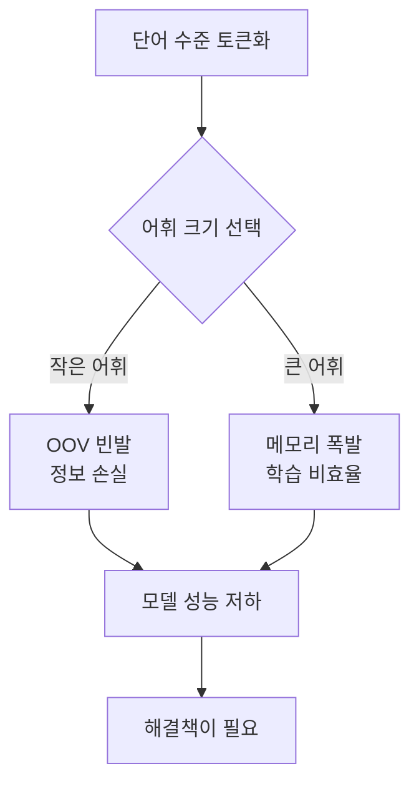
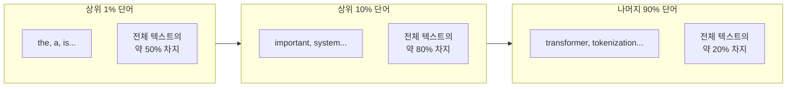
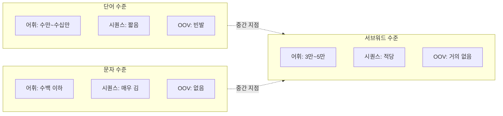
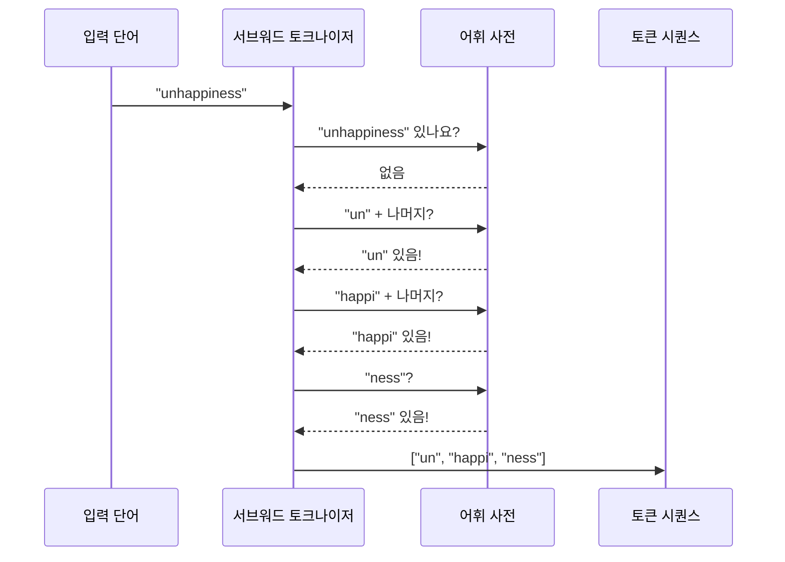
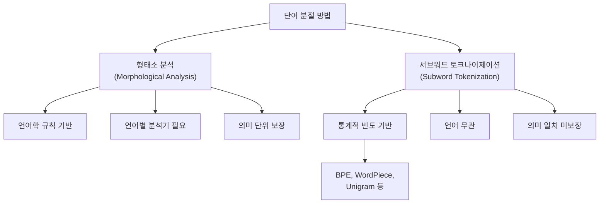

# 서브워드 토크나이제이션의 필요성

> 단어 수준과 문자 수준 토큰화의 한계를 분석하고, 서브워드 토크나이제이션이 왜 현대 NLP의 표준이 되었는지 이해합니다.

## 개요

앞선 챕터에서 트랜스포머 아키텍처를 직접 구현해봤습니다. 멀티헤드 어텐션, 포지셔널 인코딩, 인코더-디코더 구조까지 — 모델의 "엔진"은 완성했죠. 그런데 한 가지 빠뜨린 것이 있습니다. 엔진이 아무리 강력해도 **연료를 어떻게 넣느냐**에 따라 성능이 완전히 달라진다는 점입니다. 트랜스포머에게 연료란 바로 **토큰**, 즉 입력 텍스트를 어떤 단위로 쪼개서 모델에 넣어주느냐의 문제입니다. 이번 챕터에서는 그 핵심 전략인 서브워드 토크나이제이션을 깊이 파고듭니다.

이 섹션에서는 토큰화 전략의 세 가지 극단 — 단어 수준, 문자 수준, 그리고 그 사이의 서브워드 수준 — 을 비교합니다. 각 접근법의 장단점을 코드로 직접 확인하고, 서브워드 토크나이제이션이 왜 GPT, BERT 등 거의 모든 현대 언어 모델의 표준이 되었는지 그 이유를 파헤칩니다.

**선수 지식**: [토큰화의 기초](02-텍스트-전처리-토큰화와-정규화/01-01-토큰화의-기초.md)에서 배운 토큰화 개념, [FastText 서브워드 임베딩](06-워드-임베딩-심화-glove와-fasttext/02-02-fasttext-서브워드-임베딩.md)에서 다룬 서브워드 개념의 기초

**학습 목표**:
- 단어 수준 토큰화의 OOV(미등록어) 문제와 어휘 폭발 문제를 설명할 수 있다
- 문자 수준 토큰화의 시퀀스 길이 폭발 문제를 이해한다
- 서브워드 토크나이제이션이 두 극단의 최적 균형점인 이유를 논증할 수 있다
- 형태소 분석과 서브워드 토크나이제이션의 근본적 차이를 구분할 수 있다

## 왜 알아야 할까?

여러분이 만든 번역 모델에 "ChatGPT"라는 단어가 입력되었다고 상상해보세요. 학습 데이터에 이 단어가 없었다면? 단어 수준 토큰화는 이걸 `<UNK>`(알 수 없음)으로 처리해버립니다. 의미 있는 출력은 기대할 수 없죠.

반대로 모든 가능한 단어를 어휘 사전에 넣으면 어떨까요? 영어만 해도 수백만 개의 단어 형태가 존재하고, 한국어는 조사와 어미 변화까지 고려하면 그 수가 기하급수적으로 늘어납니다. 메모리와 학습 효율 면에서 현실적이지 않죠.

서브워드 토크나이제이션은 이 딜레마에 대한 우아한 해답입니다. GPT-4, Claude, BERT, T5 — 현대의 거의 모든 언어 모델이 이 전략을 사용합니다. 이것을 이해하지 못하면 트랜스포머 모델의 입력이 어떻게 구성되는지, 왜 토큰 수가 단어 수와 다른지, 왜 특정 언어에서 모델 성능이 떨어지는지를 설명할 수 없습니다.

## 핵심 개념

### 개념 1: 단어 수준 토큰화와 OOV 문제

> 💡 **비유**: 도서관에 "인공지능 개론"이라는 책은 있지만, "생성형 AI 개론"은 없다고 해봅시다. 사서가 "그런 책은 없습니다"라고 답하는 것이 OOV 문제입니다. 제목의 각 단어("생성형", "AI", "개론")는 다른 책에서 본 적이 있는데도, 정확히 그 조합의 책이 없다는 이유로 아예 도움을 줄 수 없는 거죠.

단어 수준 토큰화(word-level tokenization)는 공백이나 구두점을 기준으로 텍스트를 분리합니다. 직관적이지만 두 가지 심각한 문제가 있습니다.

**문제 1: OOV(Out-of-Vocabulary) 문제**

학습 데이터에 없던 단어를 만나면 `<UNK>` 토큰으로 대체됩니다. 신조어, 오타, 전문 용어, 외래어 — 실제 세계의 텍스트에는 항상 새로운 단어가 등장합니다.

```run:python
# 단어 수준 토큰화의 OOV 문제 시뮬레이션
vocabulary = {"나는", "오늘", "학교에", "갔다", "공부를", "했다"}

def word_tokenize(text, vocab):
    """단어 수준 토큰화 — 어휘에 없으면 <UNK> 처리"""
    tokens = text.split()
    result = []
    oov_count = 0
    for token in tokens:
        if token in vocab:
            result.append(token)
        else:
            result.append("<UNK>")  # 미등록어 처리
            oov_count += 1
    return result, oov_count

# 학습 때 본 문장
text1 = "나는 오늘 학교에 갔다"
tokens1, oov1 = word_tokenize(text1, vocabulary)
print(f"입력: {text1}")
print(f"토큰: {tokens1} (OOV: {oov1}개)")

# 새로운 단어가 포함된 문장
text2 = "나는 어제 카페에서 코딩했다"
tokens2, oov2 = word_tokenize(text2, vocabulary)
print(f"\n입력: {text2}")
print(f"토큰: {tokens2} (OOV: {oov2}개)")
```

```output
입력: 나는 오늘 학교에 갔다
토큰: ['나는', '오늘', '학교에', '갔다'] (OOV: 0개)

입력: 나는 어제 카페에서 코딩했다
토큰: ['나는', '<UNK>', '<UNK>', '<UNK>'] (OOV: 3개)
```

4개 토큰 중 3개가 `<UNK>`가 되어 문장의 의미가 거의 사라졌습니다.

**문제 2: 어휘 폭발(Vocabulary Explosion)**

OOV를 줄이려면 어휘 사전을 키워야 하는데, 자연어의 어휘 크기는 본질적으로 무한에 가깝습니다.

> 📊 **그림 1**: 단어 수준 토큰화의 두 가지 딜레마



### 개념 2: 지프의 법칙과 어휘 크기의 딜레마

> 💡 **비유**: 음악 차트를 생각해보세요. 상위 10곡이 전체 스트리밍의 절반을 차지하고, 나머지 수백만 곡이 나머지 절반을 나눠 가집니다. 단어 빈도도 마찬가지입니다. "the", "a", "is" 같은 소수의 단어가 텍스트의 대부분을 차지하고, 대다수의 단어는 드물게 나타납니다.

이 현상을 **지프의 법칙(Zipf's Law)**이라고 합니다. 단어의 빈도는 그 순위에 반비례합니다:

$$f(r) \propto \frac{1}{r^s}$$

- $f(r)$: 순위 $r$인 단어의 빈도
- $s$: 지프 지수 (자연어에서 대략 1에 가까움)

이 법칙의 실질적 의미는 무엇일까요? 어휘 사전의 크기를 2배로 늘려도 커버리지는 조금밖에 늘지 않는다는 것입니다. **꼬리가 너무 길기** 때문이죠.

> 📊 **그림 2**: 지프의 법칙 — 빈도와 순위의 관계



```run:python
from collections import Counter
import math

# 영어 텍스트 빈도 시뮬레이션 (지프 분포)
words = []
vocab_size = 10000
for rank in range(1, vocab_size + 1):
    # 지프 법칙에 따른 빈도 생성
    freq = int(100000 / rank)
    words.extend([f"word_{rank}"] * max(freq, 1))

total = len(words)
counter = Counter(words)
sorted_freqs = sorted(counter.values(), reverse=True)

# 다양한 어휘 크기에서의 커버리지 분석
for vocab_limit in [100, 1000, 5000, 10000]:
    covered = sum(sorted_freqs[:vocab_limit])
    coverage = covered / total * 100
    print(f"어휘 {vocab_limit:>6,}개 → 커버리지 {coverage:.1f}%")
```

```output
어휘    100개 → 커버리지 44.2%
어휘  1,000개 → 커버리지 73.9%
어휘  5,000개 → 커버리지 92.3%
어휘 10,000개 → 커버리지 100.0%
```

어휘를 100개에서 1,000개로 10배 늘려도 커버리지는 30%p밖에 증가하지 않습니다. 이것이 바로 단어 수준 토큰화가 직면하는 구조적 한계입니다.

### 개념 3: 문자 수준 토큰화 — 반대쪽 극단

> 💡 **비유**: 레고 블록 하나하나를 사용하면 어떤 모양이든 만들 수 있습니다. OOV 문제는 완전히 사라지죠. 하지만 에펠탑 모형을 1×1 블록만으로 조립해야 한다면? 시간도 오래 걸리고, 조립 과정에서 전체 모양을 파악하기도 어렵습니다.

문자 수준 토큰화(character-level tokenization)는 텍스트를 개별 문자로 분리합니다. 어휘 크기가 극도로 작아지지만(영어 기준 약 256개), 다른 문제가 생깁니다.

```run:python
def char_tokenize(text):
    return list(text)

def word_tokenize_simple(text):
    return text.split()

text = "Transformers revolutionized NLP"

word_tokens = word_tokenize_simple(text)
char_tokens = char_tokenize(text)

print(f"원문: {text}")
print(f"단어 토큰 ({len(word_tokens)}개): {word_tokens}")
print(f"문자 토큰 ({len(char_tokens)}개): {char_tokens}")
print(f"\n시퀀스 길이 비율: 문자/단어 = {len(char_tokens)/len(word_tokens):.1f}배")
```

```output
원문: Transformers revolutionized NLP
단어 토큰 (3개): ['Transformers', 'revolutionized', 'NLP']
문자 토큰 (31개): ['T', 'r', 'a', 'n', 's', 'f', 'o', 'r', 'm', 'e', 'r', 's', ' ', 'r', 'e', 'v', 'o', 'l', 'u', 't', 'i', 'o', 'n', 'i', 'z', 'e', 'd', ' ', 'N', 'L', 'P']
시퀀스 길이 비율: 문자/단어 = 10.3배
```

시퀀스 길이가 10배 이상 길어집니다. 트랜스포머의 셀프 어텐션은 시퀀스 길이의 제곱($O(n^2)$)에 비례하는 연산량을 가지므로, 이는 **100배 이상의 연산 비용 증가**를 의미합니다. 게다가 개별 문자는 의미를 거의 담고 있지 않아, 모델이 문자 조합에서 의미를 재구성해야 하는 추가적인 부담이 생깁니다.

> 📊 **그림 3**: 토큰화 수준별 트레이드오프



### 개념 4: 서브워드 토크나이제이션 — 두 세계의 최적 균형

> 💡 **비유**: 요리에 비유하면, 단어 수준은 완성된 요리만 메뉴에 올리는 것이고, 문자 수준은 소금 한 알갱이부터 시작하는 것입니다. 서브워드는 "반조리 식재료"를 사용하는 것과 같습니다. "볶음밥"을 통째로 외울 필요도 없고, "ㅂ, ㅗ, ㄲ, ㅡ, ㅁ, ㅂ, ㅏ, ㅂ"까지 쪼갈 필요도 없이, "볶음" + "밥" 정도로 분리하면 새로운 조합("볶음면", "비빔밥")에도 유연하게 대응할 수 있죠.

서브워드 토크나이제이션은 **자주 등장하는 단어는 그대로 유지하고, 드문 단어는 의미 있는 조각으로 분리**합니다.

```python
# 서브워드 토크나이제이션의 핵심 아이디어
# "unhappiness" → ["un", "happiness"]  (자주 쓰이는 접두사 + 어근)
# "tokenization" → ["token", "ization"]  (어근 + 접미사)
# "ChatGPT" → ["Chat", "G", "PT"]  (빈도 기반 분리)
```

서브워드의 세 가지 핵심 이점:

1. **OOV 해소**: 모든 단어를 알려진 서브워드 조합으로 표현 가능
2. **적절한 어휘 크기**: 보통 30,000~50,000개로 충분
3. **의미 보존**: 문자보다 큰 단위이므로 부분적 의미를 담을 수 있음

```run:python
# 서브워드 토크나이제이션 간단 시뮬레이션
subword_vocab = {
    "un": 0, "happi": 1, "ness": 2, "happy": 3,
    "token": 4, "ize": 5, "ization": 6,
    "re": 7, "play": 8, "ing": 9, "ed": 10,
}

def simple_subword_tokenize(word, vocab):
    """탐욕적 최장 일치 서브워드 분리"""
    tokens = []
    i = 0
    while i < len(word):
        # 가장 긴 매칭 서브워드 찾기
        best_match = None
        for end in range(len(word), i, -1):
            candidate = word[i:end].lower()
            if candidate in vocab:
                best_match = candidate
                break
        if best_match:
            tokens.append(best_match)
            i += len(best_match)
        else:
            tokens.append(word[i])  # 단일 문자로 폴백
            i += 1
    return tokens

test_words = ["unhappiness", "tokenization", "replaying"]
for word in test_words:
    tokens = simple_subword_tokenize(word, subword_vocab)
    print(f"{word:>15} → {tokens}")
```

```output
  unhappiness → ['un', 'happi', 'ness']
  tokenization → ['token', 'ization']
      replaying → ['re', 'play', 'ing']
```

학습 데이터에서 "unhappiness"라는 단어를 본 적이 없더라도, "un", "happi", "ness"라는 조각은 다른 단어에서 충분히 학습되어 있기 때문에 의미를 추론할 수 있습니다.

> 📊 **그림 4**: 서브워드 토크나이제이션의 핵심 전략



### 개념 5: 형태소 분석 vs 서브워드 토크나이제이션

> 💡 **비유**: 형태소 분석은 언어학 교수가 문법 규칙에 따라 단어를 분해하는 것이고, 서브워드 토크나이제이션은 통계학자가 빈도 데이터만 보고 패턴을 찾는 것입니다. 교수는 "un-happi-ness"가 접두사-어근-접미사임을 알지만, 통계학자는 그저 "un"과 "happi"와 "ness"가 자주 나타나는 조합이라는 것만 압니다.

이 구분은 중요합니다. 형태소(morpheme)는 **의미를 가진 최소 언어 단위**로, 언어학적 지식에 기반합니다. 반면 서브워드는 **통계적 빈도에 기반한 분절 단위**로, 언어학적 의미와 반드시 일치하지 않습니다.

```python
# 형태소 분석 vs 서브워드 토크나이제이션 비교
comparisons = [
    ("unbelievable", 
     ["un", "believe", "able"],      # 형태소 분석
     ["un", "believ", "able"]),      # 서브워드 (BPE 예시)
    
    ("preprocessing",
     ["pre", "process", "ing"],      # 형태소 분석
     ["pre", "processing"]),         # 서브워드 (빈도에 따라 다름)
    
    ("transformer",
     ["trans", "form", "er"],        # 형태소 분석
     ["transform", "er"]),           # 서브워드 ("transform"이 빈번)
]

print(f"{'단어':<18} {'형태소 분석':<30} {'서브워드(BPE)':<25}")
print("-" * 73)
for word, morphs, subwords in comparisons:
    print(f"{word:<18} {str(morphs):<30} {str(subwords):<25}")
```

> 📊 **그림 5**: 형태소 분석 vs 서브워드 토크나이제이션 비교



핵심적인 차이는 **언어 독립성**입니다. 형태소 분석은 각 언어마다 별도의 규칙과 사전이 필요하지만, 서브워드 토크나이제이션은 어떤 언어의 텍스트든 동일한 알고리즘으로 처리할 수 있습니다. 이것이 다국어 모델(multilingual model)에서 서브워드가 사실상 유일한 선택지인 이유입니다.

## 실습: 직접 해보기

세 가지 토큰화 전략을 직접 구현하고, 다양한 텍스트에서 어떤 차이가 나는지 종합적으로 비교해봅시다.

```python
from collections import Counter
import re

class TokenizationComparator:
    """세 가지 토큰화 전략 비교기"""
    
    def __init__(self, corpus):
        # 코퍼스에서 단어 빈도 기반 어휘 구축
        all_words = re.findall(r'\b\w+\b', corpus.lower())
        self.word_freq = Counter(all_words)
        
        # 단어 수준: 상위 N개만 어휘로 사용
        self.word_vocab_size = 1000
        self.word_vocab = set(
            w for w, _ in self.word_freq.most_common(self.word_vocab_size)
        )
        
        # 문자 수준: 모든 고유 문자
        self.char_vocab = set(corpus)
        
        # 서브워드: 간단한 빈도 기반 서브워드 어휘
        self.subword_vocab = self._build_subword_vocab(all_words, max_vocab=3000)
    
    def _build_subword_vocab(self, words, max_vocab=3000):
        """빈도 기반 서브워드 어휘 구축 (단순화된 버전)"""
        subword_freq = Counter()
        for word in words:
            # 다양한 길이의 서브스트링 빈도 카운트
            for length in range(2, min(len(word) + 1, 8)):
                for start in range(len(word) - length + 1):
                    sub = word[start:start + length]
                    subword_freq[sub] += 1
        
        # 빈도 상위 서브워드 선택
        vocab = set(w for w, _ in subword_freq.most_common(max_vocab))
        # 개별 문자도 포함 (폴백용)
        vocab.update(set(''.join(words)))
        return vocab
    
    def word_tokenize(self, text):
        """단어 수준 토큰화"""
        words = re.findall(r'\b\w+\b', text.lower())
        tokens = []
        oov = 0
        for w in words:
            if w in self.word_vocab:
                tokens.append(w)
            else:
                tokens.append("<UNK>")
                oov += 1
        return tokens, oov
    
    def char_tokenize(self, text):
        """문자 수준 토큰화"""
        return list(text), 0
    
    def subword_tokenize(self, text):
        """서브워드 토큰화 (탐욕적 최장 일치)"""
        words = re.findall(r'\b\w+\b', text.lower())
        tokens = []
        for word in words:
            i = 0
            while i < len(word):
                best = None
                for end in range(min(i + 7, len(word)), i, -1):
                    candidate = word[i:end]
                    if candidate in self.subword_vocab:
                        best = candidate
                        break
                if best:
                    tokens.append(best)
                    i += len(best)
                else:
                    tokens.append(word[i])
                    i += 1
        return tokens, 0
    
    def compare(self, text):
        """세 전략 비교 출력"""
        print(f"입력: \"{text}\"\n")
        
        w_tok, w_oov = self.word_tokenize(text)
        c_tok, c_oov = self.char_tokenize(text)
        s_tok, s_oov = self.subword_tokenize(text)
        
        print(f"{'전략':<12} {'토큰 수':>8} {'OOV':>5}  샘플")
        print("-" * 65)
        print(f"{'단어 수준':<12} {len(w_tok):>8} {w_oov:>5}  {w_tok[:6]}...")
        print(f"{'문자 수준':<12} {len(c_tok):>8} {c_oov:>5}  {c_tok[:10]}...")
        print(f"{'서브워드':<12} {len(s_tok):>8} {s_oov:>5}  {s_tok[:8]}...")
        print(f"\n어휘 크기 — 단어: {len(self.word_vocab):,} | "
              f"문자: {len(self.char_vocab)} | "
              f"서브워드: {len(self.subword_vocab):,}")


# 테스트용 코퍼스
corpus = """
Natural language processing is a subfield of artificial intelligence.
Transformers have revolutionized the field of NLP since 2017.
The attention mechanism allows models to focus on relevant parts.
Pre-trained language models like BERT and GPT use subword tokenization.
Tokenization is the first step in any NLP pipeline.
Word embeddings capture semantic relationships between words.
Neural networks learn representations from large text corpora.
"""

comp = TokenizationComparator(corpus)

# 학습 데이터에 있는 문장
comp.compare("The attention mechanism is important")
print("\n" + "=" * 65 + "\n")

# 학습 데이터에 없는 단어가 포함된 문장  
comp.compare("Multimodal transformerization enables cross-lingual understanding")
```

이 코드를 실행하면, 학습 데이터에 없는 단어("transformerization", "multimodal", "cross-lingual")에 대해 단어 수준은 `<UNK>`를 반환하지만, 서브워드 수준은 알려진 조각으로 분해하여 의미를 보존하는 것을 확인할 수 있습니다.

## 더 깊이 알아보기

### 서브워드 토크나이제이션의 탄생 이야기

서브워드 토크나이제이션의 역사는 의외의 곳에서 시작됩니다. 1994년, Philip Gage라는 프로그래머가 C/C++ Users Journal에 **데이터 압축** 알고리즘으로 BPE(Byte Pair Encoding)를 발표했습니다. 원래 목적은 파일 크기를 줄이는 것이었죠.

20년이 지난 2016년, 에든버러 대학의 Rico Sennrich와 동료들은 기계 번역에서 희귀 단어 문제를 해결하기 위해 이 압축 알고리즘을 NLP에 적용했습니다. 논문 제목은 "Neural Machine Translation of Rare Words with Subword Units"로, 이 논문은 현대 NLP의 토크나이제이션 패러다임을 완전히 바꿔놓았습니다. 2026년 현재 인용 수가 10,000회를 넘기며, NLP 역사상 가장 영향력 있는 논문 중 하나로 자리잡았습니다.

재미있는 점은, BPE의 핵심 아이디어 — "가장 빈번한 쌍을 반복적으로 병합" — 가 정보 이론의 관점에서 보면 **엔트로피를 줄이는 과정**과 동일하다는 것입니다. 자주 함께 나타나는 기호를 하나로 합치면, 전체 메시지를 표현하는 데 필요한 기호 수가 줄어듭니다. 이것이 압축 알고리즘이 토크나이저로 자연스럽게 전환될 수 있었던 이유입니다.

### 지프의 법칙을 발견한 언어학자

지프의 법칙은 하버드 대학의 언어학자 George Kingsley Zipf가 1935년에 발표한 것으로 알려져 있지만, 실제로 이 패턴을 처음 관찰한 것은 프랑스의 속기사 Jean-Baptiste Estoup(1916년)이었습니다. Zipf는 이 현상에 "최소 노력의 원칙(Principle of Least Effort)"이라는 설명을 붙였는데, 화자는 적은 수의 단어를 반복 사용하려 하고, 청자는 더 다양한 단어를 원하며, 이 두 힘의 균형이 멱법칙 분포를 만든다는 것입니다.

## 흔한 오해와 팁

> ⚠️ **흔한 오해**: "서브워드 토크나이제이션은 형태소 분석과 같다" — 서브워드는 통계적 빈도에 기반하며, 언어학적 형태소 경계와 우연히 일치할 때도 있지만 그것이 보장되지 않습니다. 예를 들어 BPE는 "unhappy"를 "un" + "happy"로 분리할 수도 있지만, "unh" + "appy"로 분리할 수도 있습니다. 학습 데이터의 빈도에 따라 달라지죠.

> 💡 **알고 계셨나요?**: GPT-4의 토크나이저(cl100k_base)는 약 100,000개의 서브워드 어휘를 사용합니다. BERT는 약 30,000개, GPT-2는 약 50,000개를 사용하죠. 어휘 크기가 크다고 반드시 더 좋은 것은 아닙니다 — 모델 크기, 학습 데이터량, 지원 언어 수에 따라 최적점이 다릅니다.

> 🔥 **실무 팁**: 토큰 수 ≠ 단어 수입니다. API 비용 계산이나 컨텍스트 길이 제한을 고려할 때, 영어는 대략 1단어 ≈ 1.3토큰, 한국어는 1음절 ≈ 1~2토큰 정도로 추정하면 됩니다. Hugging Face의 토크나이저로 정확한 토큰 수를 미리 확인하는 습관을 들이세요.

## 핵심 정리

| 개념 | 설명 |
|------|------|
| OOV 문제 | 단어 수준 토큰화에서 학습 데이터에 없는 단어를 처리할 수 없는 문제 |
| 어휘 폭발 | OOV를 줄이기 위해 어휘 크기를 키우면 메모리와 학습 비용이 급증하는 현상 |
| 지프의 법칙 | 단어 빈도가 순위에 반비례하는 멱법칙 분포. 어휘 확장의 수확 체감을 설명 |
| 문자 수준 토큰화 | OOV 없지만 시퀀스 길이 폭발, 개별 문자에 의미 부족 |
| 서브워드 토크나이제이션 | 빈번한 단어는 유지, 드문 단어는 조각으로 분리하는 중간 전략 |
| 형태소 vs 서브워드 | 형태소는 언어학 규칙 기반, 서브워드는 통계적 빈도 기반 — 언어 독립성이 핵심 차이 |

## 다음 섹션 미리보기

서브워드 토크나이제이션의 필요성을 이해했으니, 이제 가장 대표적인 알고리즘인 **BPE(Byte Pair Encoding)**의 구체적인 작동 원리를 살펴볼 차례입니다. [BPE 알고리즘](15-서브워드-토크나이제이션/02-02-bpebyte-pair-encoding-알고리즘.md)에서는 바이트 쌍을 반복적으로 병합하여 어휘를 구축하는 학습 과정과, 구축된 어휘로 새로운 텍스트를 인코딩하는 과정을 코드로 직접 구현합니다.

## 참고 자료

- [Neural Machine Translation of Rare Words with Subword Units (Sennrich et al., 2016)](https://aclanthology.org/P16-1162/) - 서브워드 토크나이제이션을 NLP에 도입한 기념비적 논문. BPE를 기계 번역에 적용한 원문
- [Hugging Face — Tokenizer Summary](https://huggingface.co/docs/transformers/tokenizer_summary) - BPE, WordPiece, Unigram 등 주요 서브워드 알고리즘을 한눈에 비교하는 공식 문서
- [Zipf's word frequency law in natural language: A critical review and future directions (PMC)](https://pmc.ncbi.nlm.nih.gov/articles/PMC4176592/) - 지프의 법칙에 대한 체계적 리뷰 논문. 자연어 빈도 분포의 이론적 배경
- [subword-nmt GitHub Repository](https://github.com/rsennrich/subword-nmt) - Sennrich의 BPE 원본 구현. 서브워드 토크나이제이션의 레퍼런스 코드
- [A Comprehensive Guide to Subword Tokenisers (Towards Data Science)](https://towardsdatascience.com/a-comprehensive-guide-to-subword-tokenisers-4bbd3bad9a7c/) - BPE, WordPiece, Unigram의 작동 원리를 시각적으로 설명한 블로그