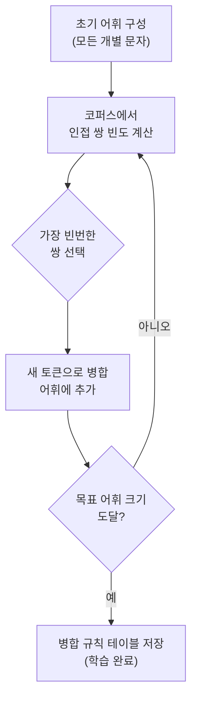
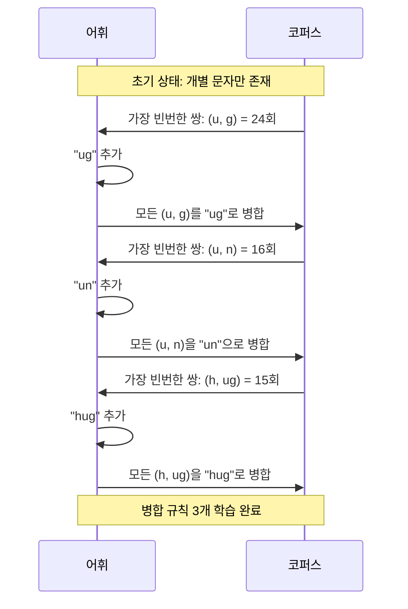
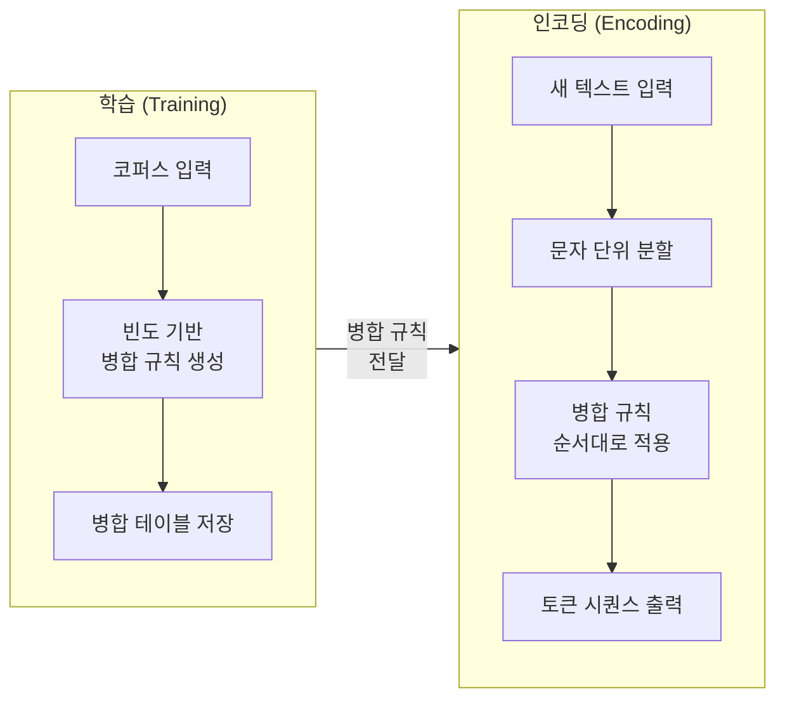
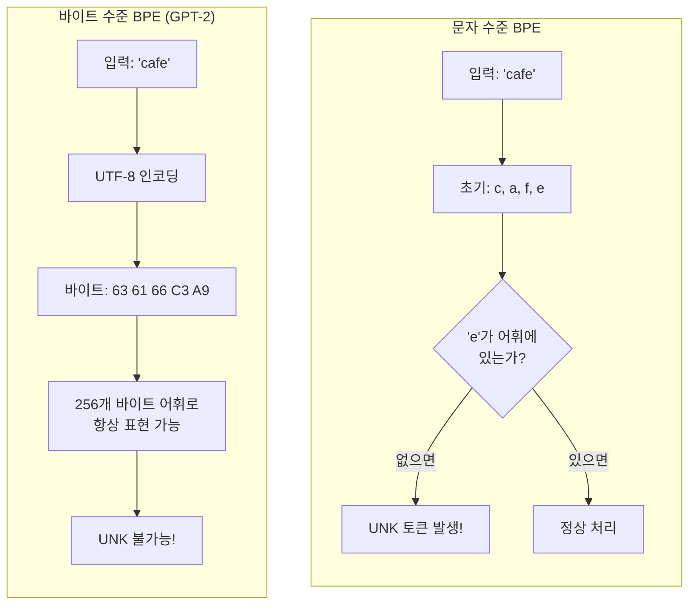
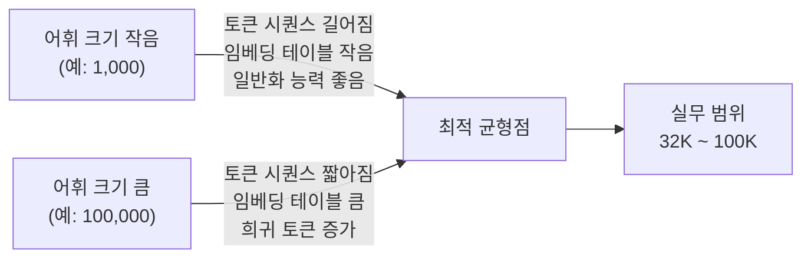

# 02. BPE(Byte Pair Encoding) 알고리즘

> 가장 빈번한 바이트 쌍을 반복 병합하여 서브워드 어휘를 구축하는 BPE 알고리즘의 원리와 구현

## 개요

이 섹션에서는 현대 LLM 토크나이저의 핵심인 BPE(Byte Pair Encoding) 알고리즘을 깊이 있게 살펴봅니다. BPE가 어떻게 빈도 기반으로 서브워드 어휘를 학습하고, 새로운 텍스트를 인코딩하는지 단계별로 이해합니다.

**선수 지식**: [이전 섹션](15-서브워드-토크나이제이션/01-01-서브워드-토크나이제이션의-필요성.md)에서 배운 OOV 문제, 서브워드 토크나이제이션의 필요성, 지프의 법칙

**학습 목표**:
- BPE 알고리즘의 학습(training)과 인코딩(encoding) 두 단계를 명확히 구분할 수 있다
- 병합 규칙(merge rules)이 어떻게 생성되고 적용되는지 직접 구현할 수 있다
- 바이트 수준 BPE(Byte-level BPE)가 왜 GPT-2의 혁신이었는지 설명할 수 있다
- 어휘 크기(vocabulary size)에 따른 트레이드오프를 분석할 수 있다

## 왜 알아야 할까?

GPT-2, GPT-4, LLaMA, RoBERTa — 이 모델들의 공통점이 뭘까요? 바로 BPE 토크나이저를 사용한다는 겁니다. 여러분이 ChatGPT에 한 문장을 입력하면, 그 문장이 모델에 들어가기 전에 **가장 먼저** 거치는 관문이 BPE 토크나이제이션이에요.

BPE는 단순히 전처리 기법이 아닙니다. 어휘 크기를 어떻게 설정하느냐에 따라 모델의 학습 비용, 추론 속도, 심지어 다국어 성능까지 달라집니다. 실무에서 커스텀 토크나이저를 학습하거나, 모델의 토큰 사용량을 최적화할 때 BPE의 원리를 이해하는 것은 필수적이죠.

## 핵심 개념

### 개념 1: BPE의 핵심 아이디어 — "가장 인기 있는 커플을 합치자"

> 💡 **비유**: 회사에서 자주 함께 일하는 두 사람을 아예 한 팀으로 묶는 것과 같습니다. "김 대리"와 "이 대리"가 항상 붙어다니면, 그냥 "김이팀"이라고 부르는 게 효율적이죠. BPE도 마찬가지예요 — 텍스트에서 가장 자주 나란히 등장하는 두 토큰을 찾아서 하나로 합칩니다. 이걸 원하는 어휘 크기에 도달할 때까지 반복하는 거예요.

BPE 알고리즘의 핵심은 놀라울 정도로 단순합니다:

1. 모든 문자(또는 바이트)로 시작하는 초기 어휘를 만든다
2. 코퍼스에서 **가장 빈번한 인접 토큰 쌍**을 찾는다
3. 그 쌍을 하나의 새 토큰으로 **병합**한다
4. 원하는 어휘 크기에 도달할 때까지 2-3을 반복한다

> 📊 **그림 1**: BPE 알고리즘의 전체 흐름



이 과정에서 생성되는 **병합 규칙(merge rules)**이 BPE의 핵심 산출물입니다. 학습이 끝나면 이 규칙 테이블이 저장되고, 새로운 텍스트를 토큰화할 때 동일한 순서로 적용됩니다.

### 개념 2: BPE 학습(Training) — 단계별 실행

> 💡 **비유**: 레고 블록을 조립하는 것과 비슷합니다. 처음에는 가장 작은 1x1 블록(개별 문자)만 있어요. 그런데 "빨간 1x1 블록 옆에 파란 1x1 블록"이 엄청 자주 나타나면, 아예 "빨파 2x1 블록"을 새로 만드는 거죠. 그다음엔 이 2x1 블록과 다른 블록의 조합 중 가장 빈번한 것을 또 합칩니다.

구체적인 예시로 살펴볼게요. 코퍼스에 다음 단어들이 있다고 합시다:

| 단어 | 빈도 | 초기 토큰 분할 |
|------|------|---------------|
| hug | 10 | h u g |
| pug | 5 | p u g |
| pun | 12 | p u n |
| bun | 4 | b u n |
| hugs | 5 | h u g s |
| bugs | 4 | b u g s |

**Step 1**: 모든 인접 쌍의 빈도를 센다

| 쌍 | 등장 단어 | 총 빈도 |
|----|----------|---------|
| (h, u) | hug(10) + hugs(5) | 15 |
| (u, g) | hug(10) + pug(5) + hugs(5) + bugs(4) | **24** |
| (p, u) | pug(5) + pun(12) | 17 |
| (u, n) | pun(12) + bun(4) | 16 |
| (b, u) | bun(4) + bugs(4) | 8 |
| (g, s) | hugs(5) + bugs(4) | 9 |

**Step 2**: 가장 빈번한 쌍 `(u, g)` → 새 토큰 `"ug"` 생성

```
어휘: [b, g, h, n, p, s, u, ug]
코퍼스: (h ug, 10), (p ug, 5), (p u n, 12), (b u n, 4), (h ug s, 5), (b ug s, 4)
```

**Step 3**: 다시 빈도 계산 → `(u, n)` 빈도 16 → 새 토큰 `"un"`

```
어휘: [b, g, h, n, p, s, u, ug, un]
코퍼스: (h ug, 10), (p ug, 5), (p un, 12), (b un, 4), (h ug s, 5), (b ug s, 4)
```

**Step 4**: `(h, ug)` 빈도 15 → 새 토큰 `"hug"`

```
어휘: [b, g, h, n, p, s, u, ug, un, hug]
코퍼스: (hug, 10), (p ug, 5), (p un, 12), (b un, 4), (hug s, 5), (b ug s, 4)
```

> 📊 **그림 2**: BPE 병합 과정의 시각화



이렇게 학습된 병합 규칙은 **순서가 중요합니다**. 인코딩할 때 반드시 학습된 순서대로 적용해야 하거든요.

```run:python
# BPE 학습 과정을 직접 구현해 봅시다
from collections import defaultdict

# 코퍼스: 단어와 빈도
word_freqs = {"hug": 10, "pug": 5, "pun": 12, "bun": 4, "hugs": 5, "bugs": 4}

# 각 단어를 문자 단위로 분할
splits = {word: list(word) for word in word_freqs}

def get_stats(splits, word_freqs):
    """모든 인접 쌍의 빈도를 계산 (minbpe 컨벤션)"""
    pair_freqs = defaultdict(int)
    for word, freq in word_freqs.items():
        split = splits[word]
        for i in range(len(split) - 1):
            pair = (split[i], split[i + 1])
            pair_freqs[pair] += freq
    return pair_freqs

def merge(pair, splits, word_freqs):
    """가장 빈번한 쌍을 병합 (minbpe 컨벤션)"""
    a, b = pair
    new_token = a + b
    for word in word_freqs:
        split = splits[word]
        new_split = []
        i = 0
        while i < len(split):
            if i < len(split) - 1 and split[i] == a and split[i + 1] == b:
                new_split.append(new_token)
                i += 2
            else:
                new_split.append(split[i])
                i += 1
        splits[word] = new_split
    return new_token

# 3번 병합 수행
merges = []
for step in range(3):
    stats = get_stats(splits, word_freqs)
    best_pair = max(stats, key=stats.get)
    new_token = merge(best_pair, splits, word_freqs)
    merges.append((best_pair, new_token))
    print(f"Step {step+1}: {best_pair} → '{new_token}' (빈도: {stats[best_pair]})")

print(f"\n병합 규칙: {merges}")
print(f"최종 분할: {dict(splits)}")
```

```output
Step 1: ('u', 'g') → 'ug' (빈도: 24)
Step 2: ('u', 'n') → 'un' (빈도: 16)
Step 3: ('h', 'ug') → 'hug' (빈도: 15)

병합 규칙: [(('u', 'g'), 'ug'), (('u', 'n'), 'un'), (('h', 'ug'), 'hug')]
최종 분할: {'hug': ['hug'], 'pug': ['p', 'ug'], 'pun': ['p', 'un'], 'bun': ['b', 'un'], 'hugs': ['hug', 's'], 'bugs': ['b', 'ug', 's']}
```

### 개념 3: BPE 인코딩(Encoding) — 학습된 규칙의 적용

학습과 인코딩은 **별개의 과정**입니다. 학습은 코퍼스에서 병합 규칙을 만드는 것이고, 인코딩은 이미 학습된 규칙을 새로운 텍스트에 적용하는 것이죠.

> 💡 **비유**: 사전을 만드는 것(학습)과 사전을 찾아보는 것(인코딩)의 차이입니다. 사전은 한 번만 만들면 되지만, 찾아보는 건 매번 해야 하죠.

인코딩 절차:
1. 입력 텍스트를 개별 문자로 분할
2. 학습된 병합 규칙을 **순서대로** 적용
3. 더 이상 적용할 규칙이 없으면 종료

> 📊 **그림 3**: BPE 학습 vs 인코딩 비교



예를 들어, 위에서 학습한 병합 규칙 `[(u,g)→ug, (u,n)→un, (h,ug)→hug]`으로 새 단어를 인코딩해 볼까요?

- `"bug"` → `[b, u, g]` → 규칙1 적용 → `[b, ug]` ✅
- `"thug"` → `[t, h, u, g]` → 규칙1 적용 → `[t, h, ug]` → 규칙3 적용 → `[t, hug]`
  - 여기서 `t`는 초기 어휘에 없으면 `[UNK]`가 됩니다!
- `"unhug"` → `[u, n, h, u, g]` → 규칙1 적용 → `[u, n, h, ug]` → 규칙2 적용 → `[un, h, ug]` → 규칙3 적용 → `[un, hug]`

> ⚠️ **흔한 오해**: "BPE 인코딩은 가장 긴 매칭을 먼저 적용한다" — 아닙니다! BPE는 **학습된 순서대로** 병합 규칙을 적용합니다. 가장 먼저 학습된 규칙(가장 빈번했던 쌍)이 가장 먼저 적용되죠. 이것이 WordPiece의 최대 길이 우선 매칭과 다른 점입니다.

### 개념 4: 바이트 수준 BPE — GPT-2의 혁신

기본 BPE는 문자(character) 수준에서 시작합니다. 하지만 이러면 문제가 있어요. 학습 코퍼스에 없던 유니코드 문자(이모지 🎉, 한국어 '안녕', 아랍어 مرحبا)를 만나면 `[UNK]` 토큰이 되어버립니다.

GPT-2(Radford et al., 2019)는 이 문제를 **바이트 수준 BPE**로 해결했습니다. 핵심 아이디어는 간단해요:

- 텍스트를 문자가 아닌 **UTF-8 바이트** 스트림으로 변환
- 기본 어휘 = 256개 바이트값 (0x00 ~ 0xFF)
- 어떤 문자든 UTF-8 바이트로 표현할 수 있으므로, **`[UNK]` 토큰이 원리적으로 불가능**

> 📊 **그림 4**: 문자 수준 BPE vs 바이트 수준 BPE



```run:python
# 바이트 수준 BPE의 핵심: UTF-8 인코딩
text = "café 한국어 🎉"
utf8_bytes = text.encode('utf-8')

print(f"원본 텍스트: '{text}'")
print(f"UTF-8 바이트: {list(utf8_bytes)}")
print(f"바이트 수: {len(utf8_bytes)}")
print(f"문자 수: {len(text)}")
print(f"\n각 문자의 바이트 표현:")
for char in text:
    byte_repr = char.encode('utf-8')
    print(f"  '{char}' → {list(byte_repr)} ({len(byte_repr)}바이트)")
```

```output
원본 텍스트: 'café 한국어 🎉'
UTF-8 바이트: [99, 97, 102, 195, 169, 32, 237, 149, 156, 234, 181, 173, 236, 150, 180, 32, 240, 159, 142, 137]
바이트 수: 20
문자 수: 10

각 문자의 바이트 표현:
  'c' → [99] (1바이트)
  'a' → [97] (1바이트)
  'f' → [102] (1바이트)
  'é' → [195, 169] (2바이트)
  ' ' → [32] (1바이트)
  '한' → [237, 149, 156] (3바이트)
  '국' → [234, 181, 173] (3바이트)
  '어' → [236, 150, 180] (3바이트)
  ' ' → [32] (1바이트)
  '🎉' → [240, 159, 142, 137] (4바이트)
```

GPT-2는 여기에 한 가지 트릭을 더 추가했어요. **정규 표현식 기반 사전 분할(pre-tokenization)**입니다. 문자, 숫자, 구두점 등 카테고리 경계를 넘는 병합을 방지하여, `"dog."`에서 `"g."`같은 무의미한 병합이 일어나지 않게 합니다.

### 개념 5: 어휘 크기와 토큰 길이의 트레이드오프

어휘 크기(vocabulary size)는 BPE에서 가장 중요한 하이퍼파라미터입니다. 어휘가 크면 토큰 시퀀스가 짧아지지만 임베딩 테이블이 커지고, 어휘가 작으면 그 반대가 되죠.

> 📊 **그림 5**: 어휘 크기에 따른 트레이드오프



주요 모델들의 어휘 크기를 비교해 볼까요?

| 모델 | 어휘 크기 | 토크나이저 |
|------|----------|----------|
| GPT-2 | 50,257 | 바이트 수준 BPE |
| GPT-4 | ~100,000 | 바이트 수준 BPE (tiktoken) |
| LLaMA 2 | 32,000 | SentencePiece BPE |
| LLaMA 3 | 128,256 | tiktoken BPE |

> 🔥 **실무 팁**: 어휘 크기를 늘리면 영어 텍스트의 토큰 수는 줄어들지만, 한국어·중국어·일본어 같은 비라틴 언어에서의 효율은 어휘 내 해당 언어 토큰 비율에 크게 좌우됩니다. LLaMA 3가 어휘를 32K에서 128K로 늘린 주된 이유 중 하나가 다국어 지원 개선이었어요.

## 실습: 직접 해보기

이제 BPE를 처음부터 구현해 봅시다. 학습과 인코딩을 모두 포함한 완전한 `SimpleBPE` 클래스를 만들어요. 함수 이름은 Andrej Karpathy의 `minbpe` 컨벤션(`get_stats`, `merge`)을 따릅니다.

```python
from collections import defaultdict

class SimpleBPE:
    """BPE 토크나이저의 핵심 로직을 구현한 교육용 클래스"""
    
    def __init__(self):
        self.merges = []          # 학습된 병합 규칙 리스트
        self.vocab = set()        # 전체 어휘
        self.word_freqs = {}      # 단어별 빈도
    
    def _get_stats(self, splits):
        """코퍼스에서 모든 인접 토큰 쌍의 빈도를 계산 (minbpe: get_stats)"""
        pair_freqs = defaultdict(int)
        for word, freq in self.word_freqs.items():
            tokens = splits[word]
            for i in range(len(tokens) - 1):
                pair = (tokens[i], tokens[i + 1])
                pair_freqs[pair] += freq
        return pair_freqs
    
    def _merge(self, pair, splits):
        """특정 쌍을 코퍼스 전체에서 병합 (minbpe: merge)"""
        a, b = pair
        new_token = a + b
        for word in self.word_freqs:
            tokens = splits[word]
            new_tokens = []
            i = 0
            while i < len(tokens):
                # 현재 위치에서 쌍이 매칭되면 병합
                if i < len(tokens) - 1 and tokens[i] == a and tokens[i + 1] == b:
                    new_tokens.append(new_token)
                    i += 2
                else:
                    new_tokens.append(tokens[i])
                    i += 1
            splits[word] = new_tokens
        return new_token
    
    def train(self, corpus: dict, num_merges: int):
        """
        BPE 학습: 코퍼스에서 병합 규칙을 학습
        
        Args:
            corpus: {단어: 빈도} 딕셔너리
            num_merges: 수행할 병합 횟수
        """
        self.word_freqs = corpus
        self.merges = []
        
        # 초기 어휘: 코퍼스에 등장하는 모든 개별 문자
        splits = {word: list(word) for word in corpus}
        self.vocab = set()
        for word in corpus:
            for char in word:
                self.vocab.add(char)
        
        print(f"초기 어휘 크기: {len(self.vocab)}")
        print(f"초기 어휘: {sorted(self.vocab)}\n")
        
        # num_merges번 병합 반복
        for step in range(num_merges):
            stats = self._get_stats(splits)
            if not stats:
                print(f"  더 이상 병합할 쌍이 없습니다. (Step {step+1})")
                break
            
            # 가장 빈번한 쌍 선택
            best_pair = max(stats, key=stats.get)
            best_freq = stats[best_pair]
            
            # 병합 수행
            new_token = self._merge(best_pair, splits)
            self.merges.append(best_pair)
            self.vocab.add(new_token)
            
            print(f"  Step {step+1}: '{best_pair[0]}' + '{best_pair[1]}'"
                  f" → '{new_token}' (빈도: {best_freq})")
        
        print(f"\n최종 어휘 크기: {len(self.vocab)}")
        print(f"학습된 병합 규칙 {len(self.merges)}개")
        return self.merges
    
    def encode(self, text: str) -> list:
        """
        학습된 병합 규칙으로 텍스트를 토큰 시퀀스로 변환
        
        Args:
            text: 인코딩할 문자열
        Returns:
            토큰 리스트
        """
        # 1단계: 개별 문자로 분할
        tokens = list(text)
        
        # 2단계: 학습된 순서대로 병합 규칙 적용
        for (a, b) in self.merges:
            new_tokens = []
            i = 0
            while i < len(tokens):
                if i < len(tokens) - 1 and tokens[i] == a and tokens[i + 1] == b:
                    new_tokens.append(a + b)
                    i += 2
                else:
                    new_tokens.append(tokens[i])
                    i += 1
            tokens = new_tokens
        
        return tokens


# === 실습 실행 ===
# 더 풍부한 코퍼스로 학습
corpus = {
    "low": 5, "lower": 2, "newest": 6,
    "widest": 3, "new": 2, "wide": 3,
}

bpe = SimpleBPE()
print("=" * 50)
print("BPE 학습 시작")
print("=" * 50)
merges = bpe.train(corpus, num_merges=10)

# 인코딩 테스트
print("\n" + "=" * 50)
print("인코딩 테스트")
print("=" * 50)
test_words = ["newest", "lower", "widening", "slow"]
for word in test_words:
    tokens = bpe.encode(word)
    print(f"  '{word}' → {tokens}")
```

이 코드를 실행하면 BPE가 `"es"`, `"est"`, `"ne"`, `"new"` 같은 서브워드를 자동으로 학습하는 것을 볼 수 있습니다. `"widening"`처럼 학습 코퍼스에 없던 단어도 학습된 서브워드 조합으로 분해되는 것이 BPE의 장점이에요.

## 더 깊이 알아보기

### BPE의 두 번의 탄생

BPE는 **두 번 태어난** 알고리즘입니다.

**첫 번째 탄생: 데이터 압축 (1994)**

Philip Gage는 1994년 *C Users Journal*에 "A New Algorithm for Data Compression"이라는 논문을 발표했습니다. 당시 그의 목표는 LZW(Lempel-Ziv-Welch) 알고리즘에 필적하는 간단한 압축 알고리즘을 만드는 것이었어요. 핵심 아이디어는 순수했습니다 — 파일에서 가장 자주 나타나는 바이트 쌍을 찾아 사용되지 않는 바이트 값으로 대체하고, 이 치환 테이블을 파일 앞에 기록하면 됩니다.

재미있는 점은, Gage의 원래 알고리즘은 **바이트(byte)** 수준에서 작동했다는 겁니다. "Byte Pair Encoding"이라는 이름이 바로 여기서 왔어요. 하지만 NLP에 처음 적용될 때는 문자(character) 수준으로 바뀌었다가, GPT-2에서 다시 바이트 수준으로 돌아왔죠 — 이름값을 제대로 한 셈입니다.

**두 번째 탄생: NLP 토크나이제이션 (2016)**

에든버러 대학의 Rico Sennrich와 동료들은 신경 기계 번역(NMT)에서 희귀 단어 문제로 고민하고 있었습니다. 번역 모델이 학습 데이터에 없는 단어를 만나면 속수무책이었거든요. Sennrich는 Gage의 압축 알고리즘을 NLP에 적용하면 이 문제를 우아하게 해결할 수 있다는 것을 깨달았습니다.

그의 논문 "Neural Machine Translation of Rare Words with Subword Units"(ACL 2016)는 NLP의 풍경을 바꿔놓았습니다. 이 논문은 2025년 기준으로 1만 회 이상 인용되었으며, 사실상 모든 현대 LLM의 토크나이저가 BPE 또는 그 변형을 사용하고 있습니다.

> 💡 **알고 계셨나요?**: Sennrich의 BPE 구현은 GitHub에 `subword-nmt`라는 이름으로 공개되어 있습니다. 단 몇 백 줄의 Python 코드로, 이 작은 도구가 NLP 역사의 물줄기를 바꾼 셈이죠. 더 최근에는 Andrej Karpathy가 `minbpe`라는 교육용 BPE 구현을 공개하여, LLM 토크나이저의 내부를 공부하기 좋은 자료가 되고 있습니다. 이 섹션의 함수 이름(`get_stats`, `merge`)도 `minbpe`의 컨벤션을 따른 것인데, [직접 구현 실습](15-서브워드-토크나이제이션/05-05-직접-구현-minbpe로-bpe-만들기.md)에서 이 라이브러리를 더 자세히 다룹니다.

## 흔한 오해와 팁

> ⚠️ **흔한 오해**: "BPE는 형태소 분석과 같다" — BPE는 순수하게 **통계 기반**입니다. 언어학적 지식이 전혀 들어가지 않아요. `"unhappiness"`를 `["un", "happiness"]`로 깔끔하게 분리하는 것이 아니라, 코퍼스 빈도에 따라 `["un", "happ", "iness"]`처럼 비형태소적 분할이 일어날 수 있습니다. 이것은 버그가 아니라, 통계적 최적화의 결과입니다.

> 💡 **알고 계셨나요?**: GPT-2의 어휘 크기가 50,257인 이유가 궁금하셨나요? 256(바이트) + 1(특수 토큰 `<|endoftext|>`) + 50,000(BPE 병합) = 50,257입니다. 깔끔한 숫자가 아닌 이유가 바로 이 계산 때문이에요.

> 🔥 **실무 팁**: 커스텀 토크나이저를 학습할 때 어휘 크기 선택이 고민된다면, 32,000 ~ 50,000 사이에서 시작하세요. 다국어 지원이 필요하면 64K 이상을 고려하되, 어휘가 커질수록 임베딩 레이어 파라미터가 `vocab_size × d_model`만큼 증가한다는 점을 잊지 마세요. LLaMA 3가 128K 어휘를 선택한 것은 충분한 학습 데이터와 컴퓨팅 자원이 뒷받침되었기 때문입니다.

> ⚠️ **흔한 오해**: "어휘 크기가 클수록 항상 좋다" — 그렇지 않습니다. 어휘가 너무 크면 희귀 토큰의 임베딩이 충분히 학습되지 않아 오히려 성능이 떨어질 수 있어요. 학습 데이터 양과 어휘 크기 사이의 균형이 중요합니다.

## 핵심 정리

| 개념 | 설명 |
|------|------|
| BPE 핵심 원리 | 가장 빈번한 인접 토큰 쌍을 반복적으로 병합하여 서브워드 어휘 구축 |
| 학습(Training) | 코퍼스에서 빈도 기반으로 병합 규칙 테이블을 생성하는 과정 |
| 인코딩(Encoding) | 학습된 병합 규칙을 **순서대로** 새 텍스트에 적용하는 과정 |
| 병합 규칙(Merge Rules) | BPE의 핵심 산출물, 학습 순서가 곧 적용 우선순위 |
| 바이트 수준 BPE | UTF-8 바이트를 기본 단위로 사용 → UNK 토큰 원천 제거 (GPT-2) |
| 사전 분할(Pre-tokenization) | 정규식으로 카테고리 경계를 먼저 분리, 무의미한 병합 방지 |
| 어휘 크기 트레이드오프 | 크면 짧은 시퀀스/큰 임베딩, 작으면 긴 시퀀스/작은 임베딩 |
| 핵심 함수 (minbpe 컨벤션) | `get_stats`(쌍 빈도 계산), `merge`(쌍 병합) |

## 다음 섹션 미리보기

BPE는 "가장 빈번한 쌍을 합치자"는 **추가(addition)** 방식입니다. 다음 섹션 [WordPiece와 Unigram](15-서브워드-토크나이제이션/03-03-wordpiece와-unigram.md)에서는 완전히 다른 접근법을 만나게 됩니다. WordPiece는 빈도 대신 **우도(likelihood)**를 기준으로 병합하고, Unigram은 아예 반대로 큰 어휘에서 시작하여 **제거(subtraction)** 방식으로 최적 어휘를 찾습니다. 세 알고리즘의 철학적 차이를 비교하면 서브워드 토크나이제이션의 전체 그림이 완성될 거예요.

## 참고 자료

- [Neural Machine Translation of Rare Words with Subword Units (Sennrich et al., 2016)](https://arxiv.org/abs/1508.07909) - BPE를 NLP에 도입한 원조 논문, 서브워드 토크나이제이션의 시작점
- [Byte-Pair Encoding tokenization - Hugging Face NLP Course](https://huggingface.co/learn/llm-course/en/chapter6/5) - BPE 학습과 인코딩의 단계별 설명과 Python 구현
- [minbpe - Andrej Karpathy](https://github.com/karpathy/minbpe) - GPT-4 토크나이저의 핵심인 BPE를 최소한의 코드로 구현한 교육용 라이브러리
- [Implementing A BPE Tokenizer From Scratch - Sebastian Raschka (2025)](https://sebastianraschka.com/blog/2025/bpe-from-scratch.html) - BPE를 밑바닥부터 구현하는 상세 튜토리얼
- [subword-nmt - Rico Sennrich](https://github.com/rsennrich/subword-nmt) - Sennrich의 공식 BPE 구현, 연구 및 실무에서 널리 사용

---
### 🔗 Related Sessions
- [subword_tokenization](15-서브워드-토크나이제이션/01-01-서브워드-토크나이제이션의-필요성.md) (prerequisite)
- [subword_tokenization](15-서브워드-토크나이제이션/01-01-서브워드-토크나이제이션의-필요성.md) (prerequisite)
- [oov_problem](15-서브워드-토크나이제이션/01-01-서브워드-토크나이제이션의-필요성.md) (prerequisite)
- [oov_problem](15-서브워드-토크나이제이션/01-01-서브워드-토크나이제이션의-필요성.md) (prerequisite)
- [vocabulary_explosion](15-서브워드-토크나이제이션/01-01-서브워드-토크나이제이션의-필요성.md) (prerequisite)
- [vocabulary_explosion](15-서브워드-토크나이제이션/01-01-서브워드-토크나이제이션의-필요성.md) (prerequisite)
- [zipfs_law_tokenization](15-서브워드-토크나이제이션/01-01-서브워드-토크나이제이션의-필요성.md) (prerequisite)
