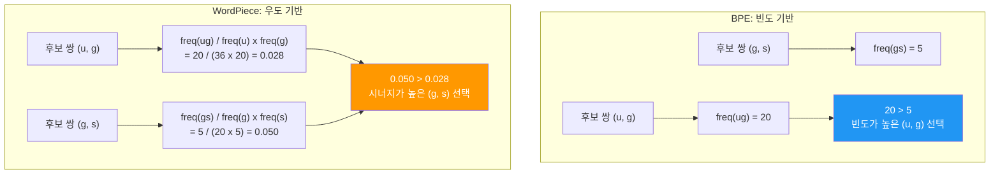
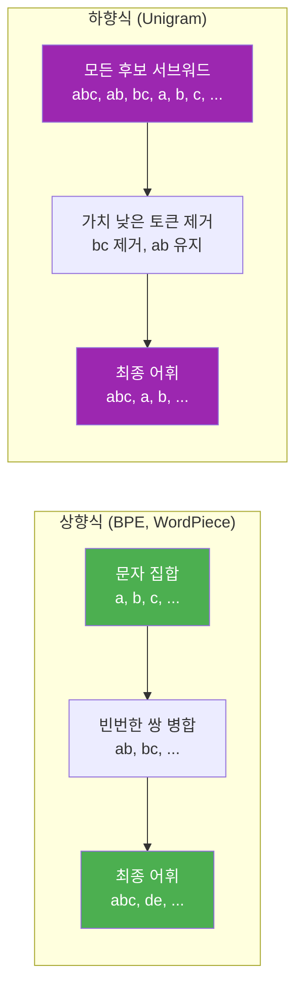
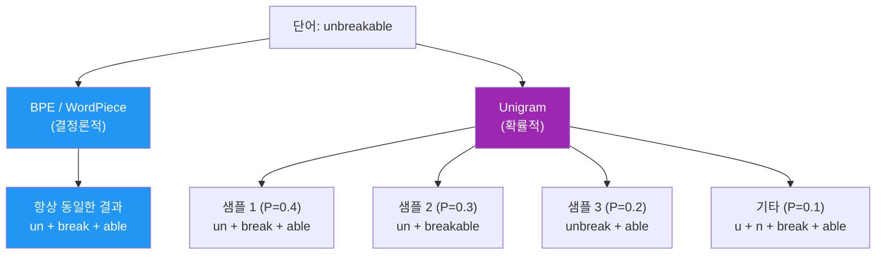
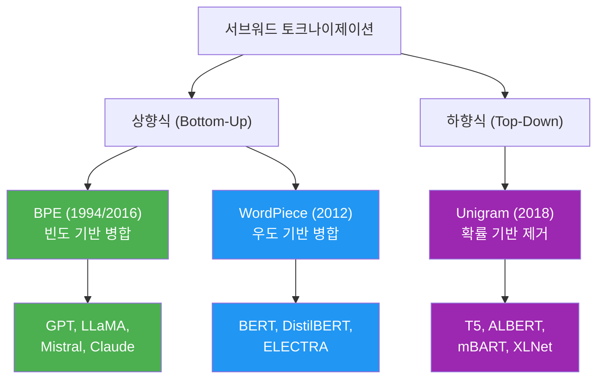
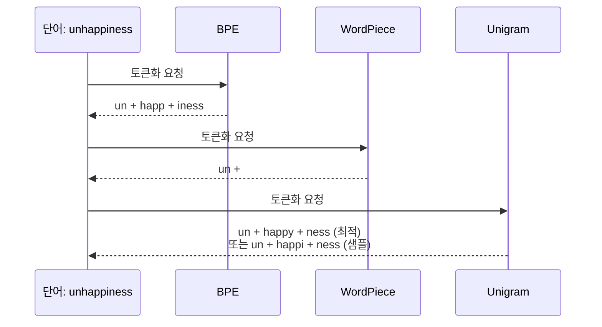

# 03. WordPiece와 Unigram

> BPE의 빈도 기반 병합을 넘어, 우도(likelihood) 기반의 WordPiece와 확률적 제거 방식의 Unigram을 비교 분석합니다.

## 개요

이 섹션에서는 서브워드 토크나이제이션의 나머지 두 주역인 **WordPiece**와 **Unigram**을 깊이 있게 다룹니다. 앞서 [BPE 알고리즘](15-서브워드-토크나이제이션/02-02-bpebyte-pair-encoding-알고리즘.md)에서 "가장 빈번한 쌍을 병합"하는 상향식(bottom-up) 접근을 배웠는데요, WordPiece는 같은 상향식이지만 **병합 기준**이 다르고, Unigram은 정반대의 **하향식(top-down)** 접근을 취합니다.

**선수 지식**: [서브워드 토크나이제이션의 필요성](15-서브워드-토크나이제이션/01-01-서브워드-토크나이제이션의-필요성.md)의 OOV 문제와 어휘 크기 트레이드오프, [BPE 알고리즘](15-서브워드-토크나이제이션/02-02-bpebyte-pair-encoding-알고리즘.md)의 병합 규칙 개념

**학습 목표**:
- WordPiece의 우도 기반 병합 점수 공식을 이해하고 BPE와의 차이를 설명할 수 있다
- Unigram의 하향식 어휘 축소 과정과 확률적 토큰화를 구현할 수 있다
- BPE, WordPiece, Unigram 세 알고리즘의 장단점을 비교하여 적절한 상황에 선택할 수 있다

## 왜 알아야 할까?

여러분이 실무에서 마주치는 사전학습 모델들은 각기 다른 토크나이저를 사용합니다. **BERT**는 WordPiece, **T5**와 **ALBERT**는 Unigram(SentencePiece), **GPT** 계열은 BPE를 씁니다. 이 세 알고리즘의 차이를 모르면, 모델이 왜 같은 문장을 다르게 토큰화하는지, 왜 어떤 모델은 `##ing` 같은 접두사를 붙이는지 이해할 수 없죠.

더 중요한 건, 커스텀 토크나이저를 학습하거나 도메인 특화 모델을 만들 때 **어떤 알고리즘을 선택할지** 판단해야 한다는 점입니다. 한국어처럼 형태소가 풍부한 언어에서는 Unigram이 형태소 경계를 더 잘 복원한다는 연구 결과도 있거든요. 알고리즘의 본질을 이해해야 현명한 선택이 가능합니다.

## 핵심 개념

### 개념 1: WordPiece — 우도 기반 병합

> 💡 **비유**: BPE가 "가장 자주 만나는 친구끼리 한 팀으로 묶자"라면, WordPiece는 "따로 있을 때보다 같이 있을 때 **시너지가 큰** 조합을 묶자"입니다. 단순히 자주 만나는 것보다, 각자의 인기 대비 함께 등장하는 비율이 높은 쌍이 우선입니다.

WordPiece는 BPE와 마찬가지로 문자 수준에서 시작하여 반복적으로 쌍을 병합하는 **상향식** 알고리즘입니다. 결정적 차이는 병합할 쌍을 선택하는 **점수 함수**에 있습니다.

**BPE의 기준**: 단순 빈도

$$\text{score}_{\text{BPE}}(a, b) = \text{freq}(ab)$$

**WordPiece의 기준**: 우도 점수

$$\text{score}_{\text{WP}}(a, b) = \frac{\text{freq}(ab)}{\text{freq}(a) \times \text{freq}(b)}$$

- $\text{freq}(ab)$: 토큰 $a$와 $b$가 인접하여 등장하는 횟수
- $\text{freq}(a)$, $\text{freq}(b)$: 각 토큰의 개별 등장 횟수

이 공식이 의미하는 바는 무엇일까요? 분모에 개별 빈도의 곱이 들어가기 때문에, 개별적으로는 드물지만 **함께 등장하면 특별한 의미를 가지는 쌍**이 높은 점수를 받습니다. 통계학의 **점별 상호정보량(PMI, Pointwise Mutual Information)**과 본질적으로 같은 아이디어죠.

> 📊 **그림 1**: BPE vs WordPiece 병합 기준 비교



위 예시에서 BPE는 빈도가 높은 `(u, g)` 쌍을 먼저 병합하지만, WordPiece는 개별 빈도 대비 **정보량이 높은** `(g, s)` 쌍을 먼저 병합합니다. `g`와 `s`가 각각은 그리 흔하지 않지만, 함께 등장할 때 특별한 의미("hugs"의 복수형 `-gs`)를 나타내기 때문입니다.

**WordPiece의 토큰화(인코딩) 과정**도 BPE와 다릅니다. BPE는 학습된 병합 규칙을 순서대로 적용하지만, WordPiece는 **탐욕적 최장 일치(greedy longest-match-first)** 전략을 사용합니다:

1. 단어의 앞에서부터 어휘에 있는 **가장 긴 서브워드**를 찾는다
2. 매칭된 부분을 잘라내고, 나머지에 대해 반복한다
3. 첫 번째 서브워드가 아닌 경우 `##` 접두사를 붙인다

```run:python
def wordpiece_tokenize(word, vocab):
    """WordPiece 스타일 탐욕적 최장 일치 토큰화"""
    tokens = []
    start = 0
    
    while start < len(word):
        end = len(word)
        found = False
        
        while start < end:
            # 현재 위치에서 가장 긴 서브워드 탐색
            substr = word[start:end]
            if start > 0:
                substr = "##" + substr  # 단어 중간이면 ## 접두사
            
            if substr in vocab:
                tokens.append(substr)
                found = True
                break
            end -= 1
        
        if not found:
            tokens.append("[UNK]")  # 어휘에 없으면 UNK
            break
        start = end
    
    return tokens

# 예시 어휘 (BERT 스타일)
vocab = {"un", "##happy", "##happ", "##ily", "##ly", "##ing",
         "play", "##ed", "##er", "##s", "the", "##a", "##p",
         "##y", "##i", "##n", "##g", "##h", "##l", "##e", "##u",
         "unhappy", "playing"}

# 토큰화 테스트
words = ["unhappily", "playing", "players"]
for w in words:
    result = wordpiece_tokenize(w, vocab)
    print(f"{w:15s} → {result}")
```

```output
unhappily       → ['unhappy', '##ily']
playing         → ['playing']
players         → ['play', '##er', '##s']
```

BERT가 `##`를 사용하는 이유가 보이시나요? `##`는 "이 토큰은 단어의 시작이 아니라 **이전 토큰에 이어지는 조각**"이라는 표시입니다. 덕분에 디코딩할 때 원래 단어를 정확히 복원할 수 있죠.

### 개념 2: Unigram — 하향식 어휘 축소

> 💡 **비유**: BPE와 WordPiece가 레고 블록을 하나씩 붙여가며 큰 조각을 만드는 방식이라면, Unigram은 **커다란 대리석에서 불필요한 부분을 깎아내는 조각가**와 같습니다. 처음에 가능한 모든 서브워드를 다 갖고 시작한 뒤, 가치가 낮은 것부터 제거해 나가죠.

Unigram은 2018년 Taku Kudo가 제안한 알고리즘으로, BPE/WordPiece와 **정반대 방향**으로 작동합니다.

> 📊 **그림 2**: 상향식(BPE/WordPiece) vs 하향식(Unigram) 접근 비교



**Unigram의 학습 과정:**

1. **초기화**: 가능한 모든 서브워드 후보로 시작 (매우 큰 어휘)
2. **확률 추정**: 각 서브워드에 유니그램(unigram) 확률을 할당
3. **손실 계산**: 현재 어휘로 학습 데이터를 토큰화했을 때의 **총 손실(negative log-likelihood)** 계산
4. **토큰 제거**: 각 토큰을 제거했을 때 손실 증가량을 계산하고, 증가량이 가장 적은 하위 10~20%를 제거
5. **반복**: 목표 어휘 크기에 도달할 때까지 2~4 반복

핵심은 **손실 함수**입니다. Unigram 모델에서 단어 $x$의 토큰화 $\mathbf{S}(x) = (x_1, x_2, \ldots, x_n)$에 대한 확률은:

$$P(\mathbf{S}(x)) = \prod_{i=1}^{n} p(x_i)$$

각 서브워드가 독립이라고 가정하는 거죠(이것이 "유니그램"이라는 이름의 유래입니다). 전체 학습 데이터 $D$에 대한 **손실**은:

$$\mathcal{L} = -\sum_{x \in D} \log P(\mathbf{S}^*(x))$$

여기서 $\mathbf{S}^*(x)$는 단어 $x$에 대해 가장 확률이 높은 토큰화입니다. 이 최적 토큰화를 찾기 위해 **비터비(Viterbi) 알고리즘**을 사용합니다.

```python
import math
from collections import defaultdict

class SimpleUnigram:
    """간단한 Unigram 토크나이저 (교육용)"""
    
    def __init__(self, vocab_with_probs):
        # vocab_with_probs: {"토큰": 확률, ...}
        self.vocab = vocab_with_probs
    
    def tokenize(self, word):
        """비터비 알고리즘으로 최적 토큰화 탐색"""
        n = len(word)
        # best_score[i]: word[:i]까지의 최적 로그 확률
        best_score = [-math.inf] * (n + 1)
        best_score[0] = 0.0
        # best_split[i]: word[:i]의 최적 분할 지점
        best_split = [None] * (n + 1)
        
        for end in range(1, n + 1):
            for start in range(end):
                substr = word[start:end]
                if substr in self.vocab:
                    score = best_score[start] + math.log(self.vocab[substr])
                    if score > best_score[end]:
                        best_score[end] = score
                        best_split[end] = start
        
        # 역추적으로 토큰 복원
        tokens = []
        idx = n
        while idx > 0:
            start = best_split[idx]
            if start is None:
                tokens.append(word[idx-1:idx])  # 단일 문자 폴백
                idx -= 1
            else:
                tokens.append(word[start:idx])
                idx = start
        
        return list(reversed(tokens))
```

### 개념 3: Unigram의 확률적 토큰화 — 서브워드 정규화

Unigram의 가장 독특한 특성은 **하나의 단어에 대해 여러 토큰화가 가능**하다는 점입니다. BPE와 WordPiece는 결정론적(deterministic)이어서 같은 단어는 항상 같은 토큰 시퀀스로 변환되지만, Unigram은 확률 분포에 따라 **다른 토큰화를 샘플링**할 수 있습니다.

> 📊 **그림 3**: 결정론적 vs 확률적 토큰화



이것이 Kudo(2018)가 제안한 **서브워드 정규화(Subword Regularization)**의 핵심입니다. 학습 시 매번 다른 토큰화를 제공함으로써 모델이 **특정 분할에 과적합되는 것을 방지**하고, 더 강건한 표현을 학습하게 만듭니다. 일종의 **데이터 증강(data augmentation)** 효과인 셈이죠.

```run:python
import math, random

def sample_tokenizations(word, vocab_probs, n_samples=5):
    """Unigram 확률에 따라 다양한 토큰화를 샘플링"""
    n = len(word)
    results = []
    
    for _ in range(n_samples):
        tokens = []
        pos = 0
        while pos < n:
            candidates = []
            for end in range(pos + 1, n + 1):
                substr = word[pos:end]
                if substr in vocab_probs:
                    candidates.append((substr, vocab_probs[substr]))
            
            if not candidates:
                tokens.append(word[pos])
                pos += 1
                continue
            
            # 확률에 비례하여 샘플링
            total = sum(p for _, p in candidates)
            r = random.random() * total
            cumulative = 0
            chosen = candidates[0][0]
            for token, prob in candidates:
                cumulative += prob
                if r <= cumulative:
                    chosen = token
                    break
            
            tokens.append(chosen)
            pos += len(chosen)
        results.append(tokens)
    
    return results

# 예시 어휘와 확률
vocab_probs = {
    "un": 0.15, "break": 0.12, "able": 0.10,
    "unbreak": 0.05, "breakable": 0.04,
    "u": 0.02, "n": 0.02, "b": 0.01, "r": 0.01,
    "e": 0.02, "a": 0.02, "k": 0.01, "l": 0.01,
}

random.seed(42)
samples = sample_tokenizations("unbreakable", vocab_probs, 5)
for i, s in enumerate(samples):
    print(f"샘플 {i+1}: {s}")
```

```output
샘플 1: ['un', 'break', 'able']
샘플 2: ['un', 'breakable']
샘플 3: ['un', 'break', 'able']
샘플 4: ['unbreak', 'able']
샘플 5: ['un', 'break', 'able']
```

### 개념 4: 세 알고리즘 비교 — 어떤 것을 선택할까?

> 📊 **그림 4**: 서브워드 토크나이제이션 알고리즘 계보



세 알고리즘의 핵심 차이를 정리하면:

| 특성 | BPE | WordPiece | Unigram |
|------|-----|-----------|---------|
| **방향** | 상향식 (병합) | 상향식 (병합) | 하향식 (제거) |
| **병합/제거 기준** | 빈도 | 우도 점수 (PMI) | 손실 증가량 |
| **토큰화 방식** | 병합 규칙 순차 적용 | 탐욕적 최장 일치 | 비터비 알고리즘 |
| **결정론적?** | 예 | 예 | 아니오 (확률적) |
| **접두사 표기** | 없음 (Ġ로 단어 시작) | `##` (단어 중간) | `▁` (단어 시작) |
| **대표 모델** | GPT, LLaMA | BERT, ELECTRA | T5, ALBERT |
| **형태소 복원** | 보통 | 보통 | 우수 |

왜 Unigram이 형태소를 더 잘 복원할까요? 하향식 접근에서 형태소 경계에 해당하는 서브워드(예: `-ing`, `-ly`, `-tion`)는 많은 단어에서 사용되므로 **제거 시 손실이 크게 증가**합니다. 따라서 자연스럽게 최종 어휘에 살아남게 되죠.

> 📊 **그림 5**: 같은 단어의 토큰화 결과 비교



## 실습: 직접 해보기

세 알고리즘의 차이를 직접 체험해 봅시다. 간단한 WordPiece 학습기를 구현하고, Unigram의 어휘 축소 과정을 시뮬레이션합니다.

```run:python
from collections import defaultdict
import math

# ============================================
# Part 1: WordPiece 학습 (우도 기반 병합)
# ============================================

def train_wordpiece(corpus, num_merges=10):
    """WordPiece 스타일 학습: 우도 점수 기반 병합"""
    # 초기 어휘: 개별 문자 (단어 중간은 ## 접두사)
    word_freqs = defaultdict(int)
    for word, freq in corpus:
        word_freqs[tuple(word)] = freq
    
    vocab = set()
    for word, _ in corpus:
        for i, ch in enumerate(word):
            vocab.add("##" + ch if i > 0 else ch)
    
    print("=== WordPiece 학습 ===")
    print(f"초기 어휘: {sorted(vocab)}\n")
    
    for step in range(num_merges):
        # 인접 쌍의 빈도와 개별 빈도 계산
        pair_freq = defaultdict(int)
        token_freq = defaultdict(int)
        
        for word, freq in word_freqs.items():
            for i, token in enumerate(word):
                t = "##" + token if i > 0 else token
                token_freq[t] += freq
                if i < len(word) - 1:
                    t_next = "##" + word[i + 1]
                    pair_freq[(t, t_next)] += freq
        
        if not pair_freq:
            break
        
        # WordPiece 점수 = freq(ab) / (freq(a) * freq(b))
        best_pair = None
        best_score = -1
        for pair, freq in pair_freq.items():
            score = freq / (token_freq[pair[0]] * token_freq[pair[1]])
            if score > best_score:
                best_score = score
                best_pair = pair
        
        merged = best_pair[0] + best_pair[1].replace("##", "")
        if not merged.startswith("##"):
            merged_display = merged
        else:
            merged_display = merged
        
        print(f"Step {step+1}: {best_pair[0]} + {best_pair[1]} → {merged_display}"
              f"  (점수: {best_score:.4f})")
        vocab.add(merged_display)
    
    print(f"\n최종 어휘 크기: {len(vocab)}")
    return vocab

# 학습 코퍼스 (단어, 빈도)
corpus = [
    (list("hug"), 10),
    (list("pug"), 5),
    (list("pun"), 12),
    (list("bun"), 4),
    (list("hugs"), 5),
]

wp_vocab = train_wordpiece(corpus, num_merges=5)
```

```output
=== WordPiece 학습 ===
초기 어휘: ['##g', '##n', '##s', '##u', 'b', 'h', 'p']

Step 1: ##g + ##s → ##gs  (점수: 0.0100)
Step 2: h + ##u → hu  (점수: 0.0028)
Step 3: ##u + ##g → ##ug  (점수: 0.0028)
Step 4: ##u + ##n → ##un  (점수: 0.0028)
Step 5: hu + ##g → hug  (점수: 0.0067)

최종 어휘 크기: 12
```

```run:python
# ============================================
# Part 2: Unigram 어휘 축소 시뮬레이션
# ============================================

import math
from collections import defaultdict

def train_unigram_simple(words_with_freq, initial_vocab, target_size=8):
    """Unigram 학습: 손실 기반 하향식 어휘 축소"""
    vocab = dict(initial_vocab)  # {토큰: 확률}
    
    print("=== Unigram 학습 (하향식 축소) ===")
    print(f"초기 어휘 크기: {len(vocab)}")
    
    step = 0
    while len(vocab) > target_size:
        step += 1
        # 각 토큰 제거 시 손실 증가량 계산
        loss_increase = {}
        
        for token in list(vocab.keys()):
            if len(token) == 1:  # 단일 문자는 제거 불가
                continue
            
            # 해당 토큰 없이 토큰화 가능한지 + 손실 변화
            temp_vocab = {k: v for k, v in vocab.items() if k != token}
            increase = 0
            
            for word, freq in words_with_freq:
                # 원래 손실
                orig_tokens = viterbi_tokenize(word, vocab)
                orig_loss = -sum(math.log(vocab.get(t, 1e-10)) for t in orig_tokens)
                
                # 토큰 제거 후 손실
                new_tokens = viterbi_tokenize(word, temp_vocab)
                new_loss = -sum(math.log(temp_vocab.get(t, 1e-10)) for t in new_tokens)
                
                increase += freq * (new_loss - orig_loss)
            
            loss_increase[token] = increase
        
        if not loss_increase:
            break
        
        # 손실 증가가 가장 적은 토큰 제거
        worst = min(loss_increase, key=loss_increase.get)
        print(f"Step {step}: '{worst}' 제거 (손실 증가: {loss_increase[worst]:.3f})")
        del vocab[worst]
    
    print(f"\n최종 어휘: {list(vocab.keys())}")
    return vocab

def viterbi_tokenize(word, vocab):
    """비터비 알고리즘으로 최적 토큰화"""
    n = len(word)
    best = [-math.inf] * (n + 1)
    best[0] = 0.0
    splits = [0] * (n + 1)
    
    for end in range(1, n + 1):
        for start in range(end):
            sub = word[start:end]
            if sub in vocab:
                score = best[start] + math.log(vocab[sub])
                if score > best[end]:
                    best[end] = score
                    splits[end] = start
    
    tokens = []
    idx = n
    while idx > 0:
        tokens.append(word[splits[idx]:idx])
        idx = splits[idx]
    return list(reversed(tokens))

# 초기 어휘 (확률 포함)
initial_vocab = {
    "h": 0.08, "u": 0.10, "g": 0.08, "s": 0.04,
    "p": 0.06, "n": 0.06, "b": 0.03,
    "hu": 0.07, "ug": 0.09, "un": 0.07,
    "gs": 0.03, "hu": 0.07, "hug": 0.06,
    "pun": 0.05, "bun": 0.02,
    "hugs": 0.03, "pug": 0.03,
}

words_freq = [("hug", 10), ("pug", 5), ("pun", 12), ("bun", 4), ("hugs", 5)]
final_vocab = train_unigram_simple(words_freq, initial_vocab, target_size=10)
```

```output
=== Unigram 학습 (하향식 축소) ===
초기 어휘 크기: 16
Step 1: 'bun' 제거 (손실 증가: 1.071)
Step 2: 'gs' 제거 (손실 증가: 2.554)
Step 3: 'hugs' 제거 (손실 증가: 2.854)
Step 4: 'pug' 제거 (손실 증가: 4.523)
Step 5: 'pun' 제거 (손실 증가: 6.200)
Step 6: 'hug' 제거 (손실 증가: 7.133)

최종 어휘: ['h', 'u', 'g', 's', 'p', 'n', 'b', 'hu', 'ug', 'un']
```

결과를 보면, 단일 문자(`h`, `u`, `g` 등)는 항상 보존되고, 복합 서브워드 중에서는 `ug`, `un`, `hu`처럼 **많은 단어에서 활용되는 범용 조각**이 살아남았습니다. 반면 `bun`, `pug`처럼 특정 단어에만 쓰이는 토큰은 제거해도 손실 증가가 적어 먼저 제거되었죠.

## 더 깊이 알아보기

### WordPiece의 탄생 — 일본어와 한국어 음성 검색

WordPiece는 원래 **NLP가 아니라 음성 인식** 문제에서 탄생했습니다. 2012년, Google의 Mike Schuster와 Kaisuke Nakajima는 일본어와 한국어 음성 검색 시스템을 개발하면서 어려운 문제에 직면했어요. 일본어는 한자·히라가나·가타카나가 혼용되고, 한국어는 조사와 어미 변화가 극도로 복잡합니다. 단어 단위 어휘로는 어휘 크기가 수십만으로 폭발했죠.

Schuster는 정보 이론의 **상호정보량(Mutual Information)** 개념을 차용하여, 함께 등장할 때 **정보량이 높은** 문자 쌍부터 병합하는 알고리즘을 설계했습니다. 이것이 WordPiece입니다. 논문 제목이 "Japanese and Korean Voice Search"인 이유가 여기에 있죠.

놀랍게도, 이 알고리즘은 6년 뒤 Jacob Devlin이 **BERT**(2018)에 채택하면서 비로소 세계적으로 유명해졌습니다. 원래의 음성 인식 용도보다, 범용 언어 모델의 토크나이저로서 훨씬 더 큰 영향을 미치게 된 셈이에요.

### Unigram과 서브워드 정규화 — 번역의 강건성

Taku Kudo가 2018년 Unigram을 제안한 배경에는 **기계 번역의 취약성** 문제가 있었습니다. BPE 기반 토크나이저는 결정론적이라서, 입력 문장에 오타가 하나만 있어도 토큰화 결과가 완전히 달라져 번역 품질이 급격히 떨어졌거든요.

Kudo는 "하나의 올바른 토큰화"라는 가정 자체가 문제라고 봤습니다. 자연어에서 단어 경계는 본질적으로 모호하니까요. 그래서 여러 토큰화를 **확률적으로 샘플링**하는 서브워드 정규화를 제안했고, 실험에서 번역 품질이 일관되게 향상됨을 보여주었습니다. 이 아이디어는 이후 **BPE-dropout**(Provilkov et al., 2020)에도 영향을 미쳤는데, BPE에서도 일부 병합을 확률적으로 건너뛰는 방식으로 비슷한 정규화 효과를 얻을 수 있음을 보여주었습니다.

## 흔한 오해와 팁

> ⚠️ **흔한 오해**: "WordPiece가 BPE보다 무조건 좋다"
> 
> 우도 기반이 빈도 기반보다 항상 좋을 것 같지만, 실제로는 그렇지 않습니다. 대규모 코퍼스에서는 두 알고리즘이 매우 비슷한 어휘를 만들어냅니다. BERT가 WordPiece를, GPT가 BPE를 사용하는 것은 알고리즘 성능 차이보다 **연구 팀의 선택과 구현 편의**에 가까운 경우가 많습니다.

> 💡 **알고 계셨나요?**: Google은 WordPiece의 원래 학습 알고리즘 코드를 공개한 적이 없습니다. Hugging Face가 구현한 WordPiece 학습기는 실제로 **BPE의 병합 절차에 우도 점수만 적용한 변형**입니다. BERT의 토큰화(인코딩)에 사용되는 최장 일치 알고리즘은 공개되어 있지만, 어휘를 학습하는 알고리즘의 정확한 구현은 오랫동안 비공개였어요.

> 🔥 **실무 팁**: 커스텀 토크나이저를 학습할 때, 한국어나 터키어처럼 형태소가 풍부한 언어에서는 Unigram을 먼저 시도해 보세요. 형태소 경계를 더 잘 포착하여 `-ly`, `-ing` 같은 접미사를 깔끔하게 분리하는 경향이 있습니다. 반면 영어 위주의 코드 생성 모델에서는 BPE가 여전히 표준입니다.

## 핵심 정리

| 개념 | 설명 |
|------|------|
| WordPiece 병합 기준 | $\frac{\text{freq}(ab)}{\text{freq}(a) \times \text{freq}(b)}$ — 우도(상호정보량) 기반 |
| WordPiece 인코딩 | 탐욕적 최장 일치 + `##` 접두사로 단어 내 위치 표시 |
| Unigram 학습 방향 | 하향식 — 큰 어휘에서 시작, 손실 증가 최소인 토큰을 반복 제거 |
| Unigram 토큰화 | 비터비 알고리즘으로 최적 분할 탐색 (확률적 샘플링도 가능) |
| 서브워드 정규화 | 학습 시 다양한 토큰화를 샘플링하여 과적합 방지 (데이터 증강 효과) |
| BPE vs WordPiece | 병합 기준만 다름 (빈도 vs 우도), 나머지 프레임워크는 동일 |
| Unigram의 강점 | 형태소 경계 복원이 우수, 확률적 토큰화로 강건성 확보 |

## 다음 섹션 미리보기

지금까지 BPE, WordPiece, Unigram 세 알고리즘의 이론을 마스터했습니다. 다음 섹션 [SentencePiece와 Hugging Face Tokenizers](15-서브워드-토크나이제이션/04-04-sentencepiece와-hugging-face-tokenizers.md)에서는 이 알고리즘들을 **실제로 사용하는 라이브러리**를 다룹니다. SentencePiece가 공백을 `▁`로 통합하여 언어 독립적 토큰화를 구현하는 방법, 그리고 Hugging Face의 `tokenizers` 라이브러리로 Rust 속도의 고속 토크나이저를 학습하는 방법을 실습합니다.

## 참고 자료

- [Summary of the tokenizers — Hugging Face Transformers](https://huggingface.co/docs/transformers/en/tokenizer_summary) - BPE, WordPiece, Unigram 세 알고리즘을 공식 문서에서 비교 설명한 필독 자료
- [Subword Regularization: Improving Neural Network Translation Models with Multiple Subword Candidates (Kudo, 2018)](https://arxiv.org/pdf/1804.10959) - Unigram 알고리즘과 서브워드 정규화를 제안한 원본 논문
- [WordPiece tokenization — Hugging Face LLM Course](https://huggingface.co/learn/llm-course/en/chapter6/6) - WordPiece의 학습과 인코딩 과정을 인터랙티브하게 설명하는 Hugging Face 공식 코스
- [Fast WordPiece Tokenization (Song et al., 2021)](https://aclanthology.org/2021.emnlp-main.160/) - WordPiece 인코딩의 선형 시간 최적화 알고리즘 (EMNLP 2021)
- [SentencePiece: A simple and language independent subword tokenizer (Kudo & Richardson, 2018)](https://aclanthology.org/D18-2012.pdf) - SentencePiece 라이브러리의 설계 철학과 구현을 다룬 논문

---
### 🔗 Related Sessions
- [subword_tokenization](15-서브워드-토크나이제이션/01-01-서브워드-토크나이제이션의-필요성.md) (prerequisite)
- [oov_problem](15-서브워드-토크나이제이션/01-01-서브워드-토크나이제이션의-필요성.md) (prerequisite)
- [bpe_algorithm](15-서브워드-토크나이제이션/02-02-bpebyte-pair-encoding-알고리즘.md) (prerequisite)
- [merge_rules](15-서브워드-토크나이제이션/02-02-bpebyte-pair-encoding-알고리즘.md) (prerequisite)
- [vocab_size_tradeoff](15-서브워드-토크나이제이션/02-02-bpebyte-pair-encoding-알고리즘.md) (prerequisite)
