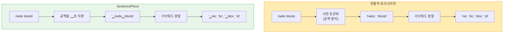
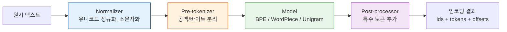
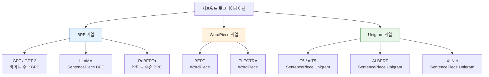
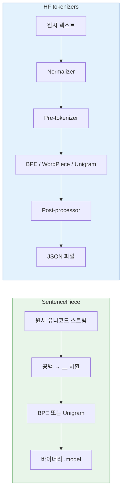

# SentencePiece와 Hugging Face Tokenizers

> 언어에 독립적인 토크나이제이션 라이브러리와 Rust 기반 초고속 토크나이저를 마스터합니다

## 개요

이 섹션에서는 서브워드 토크나이제이션의 **실전 도구** 두 가지를 다룹니다. 앞서 [BPE](15-서브워드-토크나이제이션/02-02-bpebyte-pair-encoding-알고리즘.md), [WordPiece, Unigram](15-서브워드-토크나이제이션/03-03-wordpiece와-unigram.md) 알고리즘의 원리를 직접 구현해 보았다면, 이번에는 그 알고리즘들을 **프로덕션 수준**으로 감싸고 있는 라이브러리를 배웁니다.

**선수 지식**: [서브워드 토크나이제이션의 필요성](15-서브워드-토크나이제이션/01-01-서브워드-토크나이제이션의-필요성.md), [BPE 알고리즘](15-서브워드-토크나이제이션/02-02-bpebyte-pair-encoding-알고리즘.md), [WordPiece와 Unigram](15-서브워드-토크나이제이션/03-03-wordpiece와-unigram.md)의 작동 원리
**학습 목표**:
- SentencePiece의 "언어 독립적" 설계 철학과 ▁(메타 심볼) 기반 공백 처리를 이해한다
- SentencePiece로 커스텀 토크나이저를 학습하고 인코딩/디코딩한다
- Hugging Face `tokenizers` 라이브러리의 모듈형 파이프라인 구조를 파악한다
- `AutoTokenizer`로 사전학습 토크나이저를 로드하고 실무에 활용한다

## 왜 알아야 할까?

앞 세션에서 BPE와 Unigram을 직접 구현해 봤는데요, 실전에서 그 코드를 그대로 쓸 수 있을까요? 솔직히 말하면, **아닙니다**. 수만~수십만 어휘를 다루고, 초당 수백만 토큰을 처리해야 하는 프로덕션 환경에서는 최적화된 라이브러리가 필수거든요.

현재 NLP/LLM 생태계에서 토크나이제이션을 담당하는 양대 라이브러리가 바로 **SentencePiece**와 **Hugging Face tokenizers**입니다. T5, LLaMA, ALBERT 같은 모델은 SentencePiece를, BERT, GPT-2, 최신 Hugging Face 모델들은 `tokenizers` 라이브러리를 사용하죠. 어떤 LLM을 파인튜닝하든, 어떤 NLP 태스크를 하든 이 두 라이브러리 중 하나는 반드시 만나게 됩니다.

## 핵심 개념

### 개념 1: SentencePiece — 언어의 벽을 허문 토크나이저

> 💡 **비유**: 전통적인 토크나이저가 "먼저 띄어쓰기로 단어를 나누고, 그다음 서브워드로 쪼개는" **2단계 요리사**라면, SentencePiece는 재료를 통째로 받아서 한 번에 요리하는 **원스톱 셰프**입니다. 영어든, 일본어든, 태국어든 — 재료가 뭐든 같은 주방에서 같은 방식으로 처리하죠.

기존 토크나이저들의 치명적 문제가 있었습니다. 영어처럼 띄어쓰기가 명확한 언어에서는 "단어를 공백으로 먼저 분리"하는 **사전 토큰화(pre-tokenization)** 가 잘 작동했지만, 중국어·일본어·태국어처럼 공백이 없거나 불규칙한 언어에서는 이 접근이 근본적으로 깨지거든요.

SentencePiece는 이 문제를 우아하게 해결합니다. 입력 텍스트를 **공백 포함 원시 유니코드 스트림**으로 취급하고, 공백 문자를 특수 메타 심볼 **▁** (U+2581, LOWER ONE EIGHTH BLOCK)로 치환합니다.

> 📊 **그림 1**: 전통적 토크나이저 vs SentencePiece의 처리 방식



핵심 차이를 보세요. 전통 방식은 공백 정보를 분리 과정에서 **잃어버리지만**, SentencePiece는 ▁ 심볼 덕분에 "이 토큰 앞에 공백이 있었다"는 정보를 **보존**합니다. 그래서 토큰을 다시 합칠 때 원본 텍스트를 **완벽하게 복원**할 수 있죠 — 이걸 **무손실 역토큰화(lossless detokenization)** 라고 합니다.

SentencePiece의 핵심 API를 살펴보겠습니다:

```python
import sentencepiece as spm

# 토크나이저 학습 — 단 한 줄!
spm.SentencePieceTrainer.train(
    input='corpus.txt',           # 원시 텍스트 파일
    model_prefix='my_tokenizer',  # 출력: my_tokenizer.model + my_tokenizer.vocab
    vocab_size=8000,              # 어휘 크기
    model_type='bpe',             # 'bpe' | 'unigram' | 'char' | 'word'
    character_coverage=0.9995,    # 문자 커버리지 (CJK는 0.9995, 영어는 1.0)
)
```

학습이 끝나면 `.model`과 `.vocab` 두 파일이 생성됩니다. 이제 이 모델로 인코딩/디코딩을 해볼까요?

```run:python
import sentencepiece as spm

# 학습된 모델 로드
sp = spm.SentencePieceProcessor(model_file='my_tokenizer.model')

# 텍스트 → 서브워드 토큰
text = "Natural language processing is amazing"
pieces = sp.encode_as_pieces(text)
print(f"서브워드: {pieces}")

# 텍스트 → 정수 ID
ids = sp.encode_as_ids(text)
print(f"토큰 ID: {ids}")

# 정수 ID → 원본 텍스트 (무손실 복원!)
decoded = sp.decode_ids(ids)
print(f"복원: '{decoded}'")
print(f"원본과 동일? {text == decoded}")
```

```output
서브워드: ['▁Natural', '▁language', '▁processing', '▁is', '▁amaz', 'ing']
토큰 ID: [1012, 523, 1847, 27, 3891, 116]
복원: 'Natural language processing is amazing'
원본과 동일? True
```

`character_coverage` 파라미터가 특히 중요한데요, 한국어·중국어·일본어처럼 문자 종류가 많은 언어에서는 **0.9995**로 설정하여 희귀 문자를 UNK로 처리하고, 영어처럼 문자 집합이 작은 언어에서는 **1.0**으로 모든 문자를 커버합니다.

### 개념 2: Hugging Face tokenizers — Rust가 가져온 속도 혁명

> 💡 **비유**: SentencePiece가 "올인원 블렌더"라면, Hugging Face `tokenizers`는 **레고 블록**입니다. 정규화, 사전 토큰화, 모델, 후처리를 각각 독립된 블록으로 조합하여 원하는 파이프라인을 자유롭게 만들 수 있거든요.

Hugging Face의 `tokenizers` 라이브러리는 **Rust로 구현**되어 Python에서 호출됩니다. 왜 Rust일까요? 순수 Python 토크나이저 대비 **배치 처리 시 최대 43배 빠르고**, 일반적인 워크로드에서도 4~8배 빠릅니다. 1GB 텍스트를 20초 이내에 토큰화할 수 있을 정도죠.

> 📊 **그림 2**: Hugging Face tokenizers의 모듈형 파이프라인



이 라이브러리의 가장 큰 강점은 **모듈성**입니다. 각 단계를 독립적으로 교체할 수 있어요:

```python
from tokenizers import Tokenizer
from tokenizers.models import BPE
from tokenizers.trainers import BpeTrainer
from tokenizers.pre_tokenizers import Whitespace
from tokenizers.normalizers import NFD, Lowercase, StripAccents
from tokenizers import normalizers

# 1. 모델 초기화
tokenizer = Tokenizer(BPE(unk_token="[UNK]"))

# 2. 정규화 파이프라인 조합 (레고처럼!)
tokenizer.normalizer = normalizers.Sequence([
    NFD(),           # 유니코드 정규화
    Lowercase(),     # 소문자 변환
    StripAccents(),  # 악센트 제거
])

# 3. 사전 토큰화 설정
tokenizer.pre_tokenizer = Whitespace()

# 4. 트레이너 설정
trainer = BpeTrainer(
    vocab_size=30000,
    special_tokens=["[UNK]", "[CLS]", "[SEP]", "[PAD]", "[MASK]"]
)

# 5. 학습
tokenizer.train(files=["corpus.txt"], trainer=trainer)

# 6. 저장 (JSON 형식!)
tokenizer.save("my_tokenizer.json")
```

SentencePiece가 바이너리 `.model` 파일을 쓰는 반면, HF tokenizers는 사람이 읽을 수 있는 **JSON** 형식으로 저장합니다. 디버깅할 때 큰 차이죠.

### 개념 3: AutoTokenizer — 사전학습 토크나이저 즉시 사용

> 💡 **비유**: 직접 토크나이저를 학습시키는 건 "밀가루부터 빵 만들기"에요. 하지만 대부분의 경우, 이미 구워진 빵(사전학습 토크나이저)을 사서 쓰는 게 훨씬 현명하죠. `AutoTokenizer`는 바로 그 **빵집**입니다.

실무에서 가장 많이 쓰는 패턴은 이미 학습된 토크나이저를 로드하는 것입니다. 이전 세션 [Hugging Face 생태계 소개](18-hugging-face-transformers-실습/01-01-hugging-face-생태계-소개.md)에서 배울 `from_pretrained` 패턴이 여기서도 동일하게 적용됩니다:

```run:python
from transformers import AutoTokenizer

# BERT 토크나이저 (WordPiece 기반)
bert_tok = AutoTokenizer.from_pretrained("bert-base-uncased")
print("BERT:", bert_tok.tokenize("unbelievable"))

# GPT-2 토크나이저 (바이트 수준 BPE)
gpt2_tok = AutoTokenizer.from_pretrained("gpt2")
print("GPT-2:", gpt2_tok.tokenize("unbelievable"))

# T5 토크나이저 (SentencePiece Unigram)
t5_tok = AutoTokenizer.from_pretrained("t5-small")
print("T5:", t5_tok.tokenize("unbelievable"))
```

```output
BERT: ['un', '##believable']
GPT-2: ['un', 'believ', 'able']
T5: ['▁un', 'believ', 'able']
```

같은 단어 "unbelievable"이 세 모델에서 완전히 다르게 토큰화되는 게 보이시죠? BERT의 `##` 접두사, GPT-2의 바이트 수준 처리, T5의 `▁` 메타 심볼 — 각각의 토크나이저 설계 철학이 토큰에 그대로 드러납니다.

> 📊 **그림 3**: 주요 모델별 토크나이저 계보



`AutoTokenizer`가 내부적으로 **Fast 토크나이저**와 **Slow 토크나이저**를 구분한다는 점도 알아두세요. 기본적으로 Rust 기반 Fast 버전이 로드되는데, 이게 배치 처리에서 최대 43배 빠릅니다:

```python
# Fast 토크나이저 (기본값 — Rust 기반)
fast_tok = AutoTokenizer.from_pretrained("bert-base-uncased")
print(type(fast_tok))  # BertTokenizerFast

# Slow 토크나이저 (순수 Python)
slow_tok = AutoTokenizer.from_pretrained("bert-base-uncased", use_fast=False)
print(type(slow_tok))  # BertTokenizer
```

Fast 토크나이저만의 특별한 기능 중 하나가 **오프셋 매핑(offset mapping)** 입니다. 각 토큰이 원본 텍스트의 어느 위치에서 왔는지 정확히 추적할 수 있어서, NER(개체명 인식)처럼 토큰과 원본 텍스트를 정렬해야 하는 태스크에서 아주 유용합니다.

### 개념 4: SentencePiece vs HF tokenizers — 어떤 걸 선택할까?

두 라이브러리의 핵심 차이를 이해하면 프로젝트에 맞는 도구를 고를 수 있습니다.

> 📊 **그림 4**: SentencePiece vs HF tokenizers 설계 비교



| 기준 | SentencePiece | HF tokenizers |
|------|---------------|---------------|
| **구현 언어** | C++ (Python 바인딩) | Rust (PyO3 바인딩) |
| **사전 토큰화** | 불필요 (원시 유니코드) | 모듈형으로 설정 |
| **공백 처리** | ▁ 메타 심볼 자동 | Pre-tokenizer에 위임 |
| **저장 형식** | 바이너리 `.model` | JSON (사람 읽기 가능) |
| **파이프라인** | 모놀리식 | 모듈형 (조합 자유) |
| **다국어** | 최고 (언어 무관) | 좋음 (Pre-tokenizer 의존) |
| **주요 모델** | T5, LLaMA, XLNet | BERT, GPT-2, RoBERTa |

선택 기준을 정리하면: **다국어/비영어 프로젝트**거나 T5·LLaMA 계열을 쓴다면 SentencePiece, **Hugging Face 생태계 안에서 작업**하거나 커스텀 파이프라인이 필요하면 HF tokenizers를 쓰시면 됩니다. 물론 실무에서는 둘 다 `AutoTokenizer`를 통해 투명하게 로드되므로 직접 선택해야 할 일이 적다는 것도 알아두세요.

## 실습: 직접 해보기

SentencePiece와 HF tokenizers 양쪽으로 커스텀 토크나이저를 학습하고, 같은 텍스트에 적용해 비교합니다.

```python
# ============================================
# 실습 1: SentencePiece로 커스텀 토크나이저 학습
# ============================================
import sentencepiece as spm
import os

# 샘플 코퍼스 생성
corpus_text = """
Natural language processing enables computers to understand human language.
Deep learning has revolutionized the field of NLP.
Transformers use self-attention mechanisms to process sequences in parallel.
Large language models like GPT and BERT have transformed how we interact with AI.
Tokenization is the first step in any NLP pipeline.
Subword tokenization balances vocabulary size and token granularity.
""".strip()

with open("sample_corpus.txt", "w") as f:
    f.write(corpus_text)

# SentencePiece BPE 모델 학습
spm.SentencePieceTrainer.train(
    input="sample_corpus.txt",
    model_prefix="sp_bpe",           # sp_bpe.model, sp_bpe.vocab 생성
    vocab_size=100,                   # 작은 코퍼스이므로 소규모 어휘
    model_type="bpe",                 # BPE 알고리즘 사용
    character_coverage=1.0,           # 영어니까 100% 커버
    pad_id=3,                         # 패딩 토큰 활성화
)

# 학습된 모델 로드 및 사용
sp = spm.SentencePieceProcessor(model_file="sp_bpe.model")

test_text = "Tokenization is important for NLP"
pieces = sp.encode_as_pieces(test_text)
ids = sp.encode_as_ids(test_text)
decoded = sp.decode_ids(ids)

print("=== SentencePiece BPE ===")
print(f"입력: {test_text}")
print(f"토큰: {pieces}")
print(f"ID:   {ids}")
print(f"복원: {decoded}")
print(f"어휘 크기: {sp.get_piece_size()}")

# ============================================
# 실습 2: HF tokenizers로 커스텀 BPE 학습
# ============================================
from tokenizers import Tokenizer
from tokenizers.models import BPE
from tokenizers.trainers import BpeTrainer
from tokenizers.pre_tokenizers import Whitespace

# 토크나이저 초기화
tokenizer = Tokenizer(BPE(unk_token="[UNK]"))
tokenizer.pre_tokenizer = Whitespace()

# 트레이너 설정
trainer = BpeTrainer(
    vocab_size=100,
    special_tokens=["[UNK]", "[CLS]", "[SEP]", "[PAD]", "[MASK]"],
)

# 학습
tokenizer.train(files=["sample_corpus.txt"], trainer=trainer)

# 인코딩
output = tokenizer.encode(test_text)

print("\n=== HF tokenizers BPE ===")
print(f"입력: {test_text}")
print(f"토큰: {output.tokens}")
print(f"ID:   {output.ids}")
print(f"어휘 크기: {tokenizer.get_vocab_size()}")

# 오프셋 매핑 (HF tokenizers만의 기능!)
print(f"\n오프셋 매핑:")
for token, (start, end) in zip(output.tokens, output.offsets):
    original = test_text[start:end]
    print(f"  '{token}' ← 원본[{start}:{end}] = '{original}'")

# ============================================
# 실습 3: 사전학습 토크나이저 비교
# ============================================
from transformers import AutoTokenizer

models = {
    "BERT (WordPiece)": "bert-base-uncased",
    "GPT-2 (BPE)": "gpt2",
    "T5 (SentencePiece)": "t5-small",
}

compare_text = "The transformer architecture revolutionized NLP"

print(f"\n=== 사전학습 토크나이저 비교 ===")
print(f"입력: '{compare_text}'\n")

for name, model_id in models.items():
    tok = AutoTokenizer.from_pretrained(model_id)
    tokens = tok.tokenize(compare_text)
    ids = tok.encode(compare_text)
    print(f"{name}:")
    print(f"  토큰({len(tokens)}개): {tokens}")
    print(f"  ID({len(ids)}개): {ids[:10]}{'...' if len(ids) > 10 else ''}")
    print()

# 정리
os.remove("sample_corpus.txt")
for f in ["sp_bpe.model", "sp_bpe.vocab"]:
    if os.path.exists(f):
        os.remove(f)
```

## 더 깊이 알아보기

### SentencePiece의 탄생 — Google의 다국어 고민

SentencePiece는 2018년 Google의 **Taku Kudo**와 **John Richardson**이 EMNLP에서 발표한 논문에서 시작되었습니다. Kudo는 이미 일본어 형태소 분석기 **MeCab**의 개발자로 유명했는데요, MeCab을 만들면서 "언어별로 다른 토크나이저를 만들어야 하는 건 근본적으로 잘못된 접근"이라는 확신을 갖게 됩니다.

당시 Google은 **Google Translate**에서 100개 이상의 언어를 지원하고 있었는데, 매번 새 언어를 추가할 때마다 해당 언어의 단어 분리 규칙을 새로 구현해야 했어요. 중국어에는 형태소 분석기, 태국어에는 사전 기반 분리기, 독일어에는 복합어 분해기… 이 모든 걸 하나의 통합 솔루션으로 대체한 게 바로 SentencePiece입니다.

핵심 아이디어는 놀라울 정도로 단순했습니다: **"공백도 그냥 문자의 하나로 취급하자."** 이 한 가지 결정이 언어 독립성이라는 거대한 목표를 달성하게 해준 거죠. 이후 SentencePiece는 T5, ALBERT, XLNet, 그리고 최근의 LLaMA까지 수많은 모델의 토크나이저로 채택되었습니다.

### Rust의 등장 — 속도가 문제였다

Hugging Face가 `tokenizers` 라이브러리를 **Rust**로 작성한 배경도 흥미롭습니다. 2019년, Hugging Face 팀은 대규모 코퍼스의 토큰화가 **학습 파이프라인의 병목**이 되는 것을 발견했습니다. Python의 GIL(Global Interpreter Lock) 때문에 멀티스레딩이 제한되었고, 수십 GB 텍스트를 처리하는 데 몇 시간이 걸렸거든요.

Anthony MOI가 Rust로 전체 토크나이저를 재구현하면서 상황이 극적으로 바뀌었습니다. **1GB 텍스트를 20초 이내에** 토큰화할 수 있게 되었고, 배치 처리에서는 Python 대비 최대 43배 빠른 성능을 달성했습니다. 이 작업의 성공이 Hugging Face가 Rust를 핵심 기술 스택으로 채택하는 계기가 되었다고 합니다.

## 흔한 오해와 팁

> ⚠️ **흔한 오해**: "SentencePiece와 HF tokenizers는 서로 경쟁 관계다"
> 
> 사실 둘은 **상호보완적**입니다. `AutoTokenizer.from_pretrained("t5-small")`을 호출하면, 내부적으로 SentencePiece 모델(`.spiece.model`)을 로드하면서 HF의 Fast 토크나이저 인터페이스로 감싸줍니다. 즉, SentencePiece가 "엔진"이고 HF tokenizers가 "차체"인 셈이죠.

> 💡 **알고 계셨나요?**: SentencePiece의 `enable_sampling=True` 옵션을 쓰면 같은 텍스트를 매번 **다르게 토큰화**할 수 있습니다. 이게 바로 [이전 세션](15-서브워드-토크나이제이션/03-03-wordpiece와-unigram.md)에서 배운 **서브워드 정규화**의 실전 적용인데요, 학습 시 토큰화의 다양성을 높여 모델의 강건성(robustness)을 개선하는 효과가 있습니다. T5 학습에서 실제로 이 기법을 사용했어요.

> 🔥 **실무 팁**: 파인튜닝할 때 **모델과 토크나이저는 반드시 짝을 맞춰야** 합니다. `bert-base-uncased` 모델에 `gpt2` 토크나이저를 쓰면 어휘 ID 매핑이 완전히 어긋나서 쓰레기 출력이 나옵니다. `AutoTokenizer.from_pretrained()`에 모델과 동일한 체크포인트 이름을 넣으면 자동으로 맞는 토크나이저가 로드되니, 이 패턴을 습관화하세요.

## 핵심 정리

| 개념 | 설명 |
|------|------|
| SentencePiece | 공백을 ▁로 치환하여 언어 독립적 토크나이제이션을 구현한 라이브러리 (C++) |
| ▁ 메타 심볼 | 공백 위치를 보존하여 무손실 역토큰화를 가능하게 하는 특수 문자 (U+2581) |
| HF tokenizers | Rust 기반 초고속 토크나이저. 모듈형 파이프라인 (Normalizer→Pre-tokenizer→Model→Post-processor) |
| Fast vs Slow | Rust 기반 Fast 토크나이저는 Python Slow 대비 배치 처리 최대 43배 빠름 |
| AutoTokenizer | `from_pretrained()`로 모델에 맞는 토크나이저를 자동 로드. 기본적으로 Fast 버전 사용 |
| 오프셋 매핑 | Fast 토크나이저가 제공하는 토큰↔원본 텍스트 위치 추적 기능 |
| 모델-토크나이저 일치 | 파인튜닝 시 모델과 토크나이저는 반드시 같은 체크포인트에서 로드해야 함 |

## 다음 섹션 미리보기

이번 세션에서 프로덕션 라이브러리를 마스터했으니, 다음 [minBPE로 BPE 직접 구현하기](15-서브워드-토크나이제이션/05-05-minbpe로-bpe-직접-구현하기.md)에서는 Andrej Karpathy의 **minBPE** 프로젝트를 분석하며 BPE의 내부 구현을 바닥부터 다시 들여다봅니다. 라이브러리의 추상화 뒤에 감춰진 바이트 수준 BPE의 진짜 모습을 코드 한 줄 한 줄 해부해 볼 예정입니다.

## 참고 자료

- [SentencePiece GitHub 리포지토리](https://github.com/google/sentencepiece) - 공식 소스코드, 설치 가이드, Python API 문서
- [Kudo & Richardson (2018), "SentencePiece: A simple and language independent subword tokenizer and detokenizer for Neural Text Processing"](https://aclanthology.org/D18-2012/) - SentencePiece 원논문 (EMNLP 2018)
- [Hugging Face tokenizers 공식 문서](https://huggingface.co/docs/tokenizers/index) - 모듈형 파이프라인 아키텍처와 API 레퍼런스
- [Hugging Face tokenizers GitHub](https://github.com/huggingface/tokenizers) - Rust 구현 소스코드와 벤치마크
- [Hugging Face Tokenizer Summary](https://huggingface.co/docs/transformers/tokenizer_summary) - BPE, WordPiece, Unigram의 차이를 실전 관점에서 정리
- [Hugging Face Course: Building a tokenizer, block by block](https://huggingface.co/learn/llm-course/en/chapter6/8) - HF tokenizers 라이브러리 실습 튜토리얼

---
### 🔗 Related Sessions
- [subword_tokenization](15-서브워드-토크나이제이션/01-01-서브워드-토크나이제이션의-필요성.md) (prerequisite)
- [bpe_algorithm](15-서브워드-토크나이제이션/02-02-bpebyte-pair-encoding-알고리즘.md) (prerequisite)
- [wordpiece_algorithm](15-서브워드-토크나이제이션/03-03-wordpiece와-unigram.md) (prerequisite)
- [unigram_algorithm](15-서브워드-토크나이제이션/03-03-wordpiece와-unigram.md) (prerequisite)
- [subword_regularization](15-서브워드-토크나이제이션/03-03-wordpiece와-unigram.md) (prerequisite)
