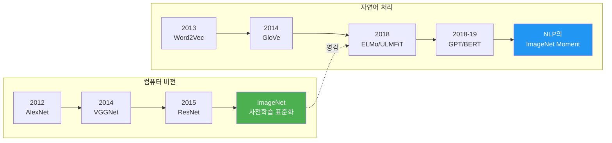
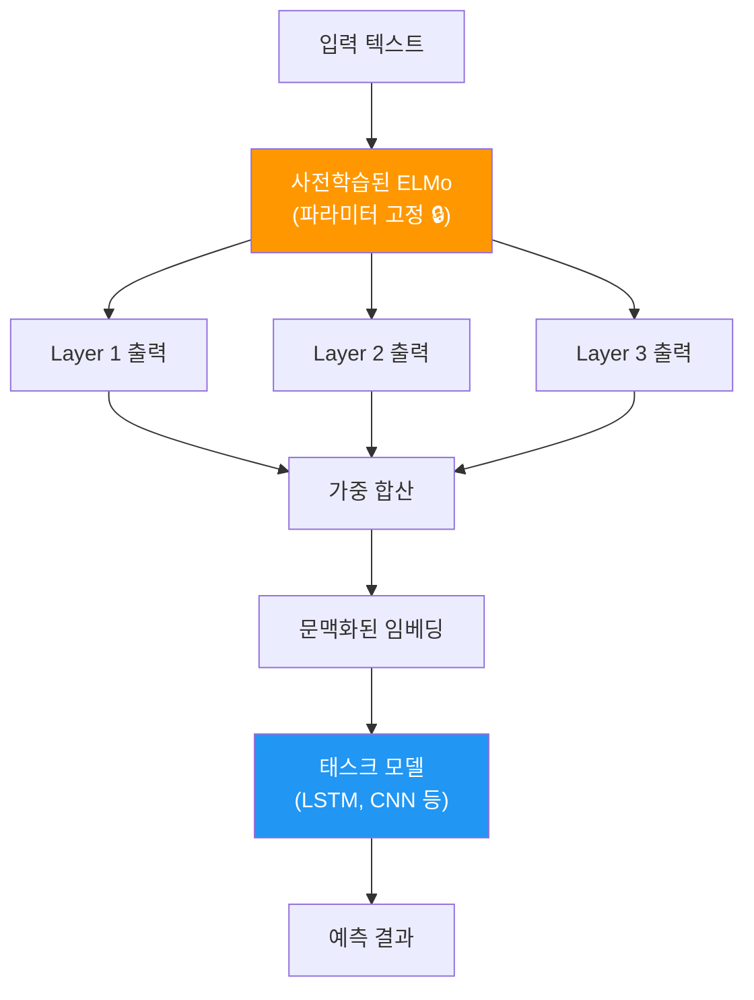
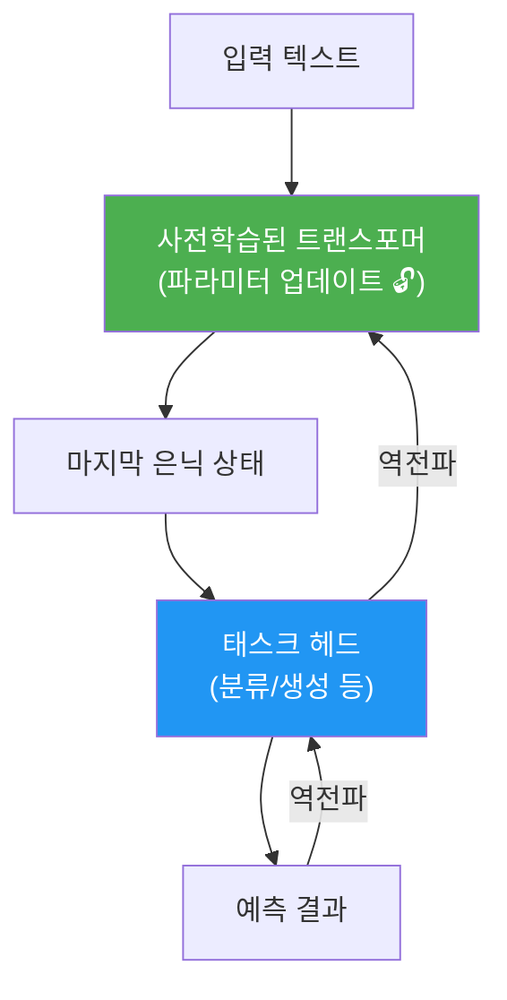
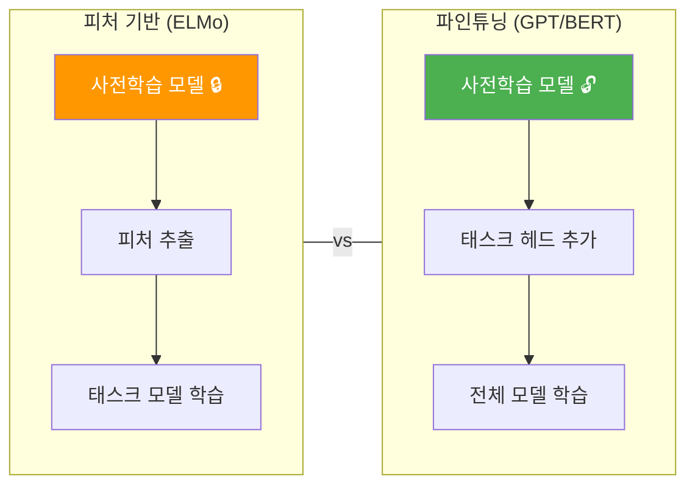
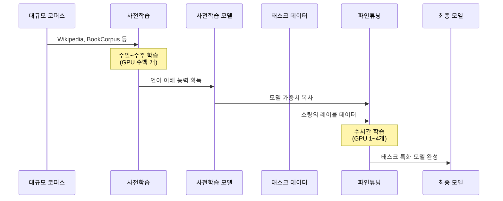

# 사전학습과 파인튜닝 패러다임

> NLP의 게임 체인저 — 사전학습과 파인튜닝이 어떻게 자연어 처리의 판도를 완전히 바꿨는지 알아봅니다

## 개요

이 섹션에서는 현대 NLP의 근간이 되는 **사전학습-파인튜닝(Pre-training & Fine-tuning) 패러다임**을 배웁니다. 왜 모델을 처음부터 학습시키는 대신 이미 학습된 모델을 가져다 쓰는 것이 혁명적이었는지, 그리고 피처 기반 접근법과 파인튜닝 접근법이 어떻게 다른지를 이해합니다.

**선수 지식**: [트랜스포머 아키텍처](13-ch13-트랜스포머-아키텍처-심층-분석/01-01-트랜스포머-아키텍처-전체-조망.md)의 기본 구조, [워드 임베딩](05-ch5-워드-임베딩-word2vec/01-01-분포-가설과-밀집-벡터-표현.md)의 개념

**학습 목표**:
- 전이학습(Transfer Learning)의 핵심 아이디어를 설명할 수 있다
- 피처 기반(Feature-based) vs 파인튜닝(Fine-tuning) 접근법의 차이를 구분할 수 있다
- ELMo → ULMFiT → GPT → BERT로 이어지는 발전 흐름을 이해할 수 있다
- Hugging Face로 두 접근법을 간단히 실험할 수 있다

## 왜 알아야 할까?

여러분이 "영화 리뷰 감성 분석" 모델을 만든다고 해볼게요. 학습 데이터가 1,000개뿐이라면 어떨까요? 과거에는 이 1,000개로 처음부터(from scratch) 모델을 학습해야 했습니다. 결과는? 참담하죠.

하지만 2018년, NLP에 일대 혁명이 일어납니다. **"먼저 거대한 텍스트로 언어 자체를 이해시키고, 그다음 내 태스크에 맞게 살짝 조정한다"** — 이 단순한 아이디어가 거의 모든 NLP 벤치마크를 갈아엎었거든요. ULMFiT은 단 100개의 레이블 데이터만으로도, 처음부터 학습한 모델이 10,000개로 달성한 성능을 따라잡았습니다.

이 패러다임을 이해하지 않고는 BERT, GPT, 그리고 현대 LLM 어느 것도 제대로 이해할 수 없습니다. 이번 섹션은 Ch16 전체의 **출발점**이자, 앞으로 배울 모든 사전학습 모델의 **사고방식**을 세우는 시간입니다.

## 핵심 개념

### 개념 1: 전이학습 — "언어의 세계관을 물려받다"

> 💡 **비유**: 전이학습은 **외국 유학**과 비슷합니다. 한국어를 완벽하게 익힌 사람이 일본어를 배우면, 문법 구조나 한자 지식이 도움이 되어 훨씬 빨리 습득하죠. 반면 아무 언어 경험 없이 일본어를 시작하면 모든 것을 처음부터 배워야 합니다. 전이학습은 "이미 배운 언어 지식"을 새로운 과제에 **전이(transfer)** 시키는 겁니다.

컴퓨터 비전(CV) 분야에서는 이미 2012년부터 **ImageNet**으로 사전학습한 모델을 다른 이미지 태스크에 활용하는 전이학습이 표준이었습니다. 수백만 장의 이미지로 "사물을 보는 눈"을 학습한 모델의 특징 추출 능력을 가져다 쓰는 거죠.

그런데 NLP에서는 이게 오랫동안 안 됐습니다. 왜일까요? 언어는 이미지보다 **추상적**이고, 문맥에 따라 의미가 달라지며, 태스크마다 요구하는 지식이 너무 다르다고 생각했기 때문입니다. [Word2Vec](05-ch5-워드-임베딩-word2vec/02-02-word2vec-cbow와-skip-gram.md)이나 [GloVe](06-ch6-워드-임베딩-심화-glove와-fasttext/01-01-glove-전역-벡터-표현.md)가 단어 수준의 전이학습을 제공했지만, 이건 "단어의 의미"만 전이할 뿐 "문장을 이해하는 능력"까지는 전이하지 못했습니다.

> 📊 **그림 1**: CV와 NLP에서의 전이학습 발전 타임라인



2018년, 드디어 NLP에도 이 **"ImageNet Moment"**가 찾아옵니다. 핵심 아이디어는 간단합니다:

1. **사전학습(Pre-training)**: 대규모 텍스트 코퍼스로 언어 모델을 학습 → "언어의 세계관" 확보
2. **파인튜닝(Fine-tuning)**: 학습된 모델을 특정 태스크에 맞게 미세 조정

### 개념 2: 피처 기반 접근법 — ELMo의 방식

> 💡 **비유**: 피처 기반 접근법은 **전문 통역사를 고용하는 것**과 같습니다. 통역사(사전학습 모델)는 이미 언어를 잘 알고 있고, 여러분의 팀(태스크 모델)은 통역사가 변환해준 정보를 받아서 의사결정만 합니다. 통역사 자체를 재교육하지는 않죠.

**ELMo(Embeddings from Language Models, 2018)**는 피처 기반 접근법의 대표 모델입니다. Allen Institute의 Matthew Peters 팀이 개발했는데, 핵심 아이디어는 이렇습니다:

1. 양방향 LSTM으로 대규모 코퍼스에서 **언어 모델을 사전학습**
2. 사전학습된 모델의 **각 레이어 출력을 추출**하여 새로운 벡터 표현 생성
3. 이 벡터를 기존 태스크 모델의 **추가 입력 피처**로 사용

> 📊 **그림 2**: 피처 기반 접근법 (ELMo 방식)



ELMo의 혁신은 **문맥화된 임베딩(contextualized embedding)**이었습니다. [Word2Vec](05-ch5-워드-임베딩-word2vec/02-02-word2vec-cbow와-skip-gram.md)에서 "bank"는 항상 같은 벡터였지만, ELMo에서는 "river bank"의 bank와 "bank account"의 bank가 **다른 벡터**를 갖습니다. 문맥에 따라 의미가 달라지니까요.

하지만 ELMo에는 한계가 있었습니다:
- 양방향이라고 했지만, 실제로는 **왼→오른 LSTM**과 **오른→왼 LSTM**을 따로 학습한 뒤 **단순 연결(concatenate)**
- 사전학습 모델은 고정하고 **피처만 추출** → 태스크에 맞게 모델 자체를 적응시키지 못함
- LSTM 기반이라 **장거리 의존성** 처리에 여전히 한계

```python
# ELMo 스타일의 피처 기반 접근법 (개념 코드)
# 사전학습 모델은 고정하고, 출력만 피처로 사용

import torch
import torch.nn as nn

class FeatureBasedModel(nn.Module):
    """피처 기반 접근법: 사전학습 모델 위에 태스크 모델을 얹는 방식"""
    
    def __init__(self, pretrained_dim, hidden_dim, num_classes):
        super().__init__()
        # 태스크에 특화된 분류기만 학습
        self.classifier = nn.Sequential(
            nn.Linear(pretrained_dim, hidden_dim),  # 사전학습 피처 → 은닉층
            nn.ReLU(),
            nn.Dropout(0.3),
            nn.Linear(hidden_dim, num_classes)       # 은닉층 → 분류 결과
        )
    
    def forward(self, pretrained_features):
        # pretrained_features: 사전학습 모델에서 추출한 고정 벡터
        return self.classifier(pretrained_features)

# 사전학습 피처 차원=768, 은닉층=256, 분류 클래스=2
model = FeatureBasedModel(pretrained_dim=768, hidden_dim=256, num_classes=2)
print(f"학습 가능한 파라미터: {sum(p.numel() for p in model.parameters()):,}개")
```

### 개념 3: 파인튜닝 접근법 — GPT와 BERT의 방식

> 💡 **비유**: 파인튜닝은 **경력직 채용** 후 **OJT(On-the-Job Training)**에 비유할 수 있습니다. 경력 10년의 개발자(사전학습 모델)를 채용한 뒤, 우리 회사의 코드 컨벤션과 도메인 지식을 짧게 교육(파인튜닝)합니다. 기존 역량은 유지하면서 새 환경에 적응하는 거죠. 신입을 처음부터 교육하는 것과는 차원이 다릅니다.

파인튜닝 접근법에서는 사전학습된 모델의 **파라미터 전체를 업데이트**합니다. 모델이 이미 알고 있는 언어 지식을 기반으로, 특정 태스크에 맞게 **모든 가중치를 미세 조정**하는 거죠.

> 📊 **그림 3**: 파인튜닝 접근법 (GPT/BERT 방식)



이 접근법을 처음 대규모로 성공시킨 것이 **OpenAI GPT(2018년 6월)**입니다. GPT는 트랜스포머 디코더를 12개 쌓아 대규모 텍스트로 사전학습한 뒤, 태스크에 맞는 작은 헤드(분류기)를 붙여 전체 모델을 파인튜닝했습니다.

그리고 2018년 10월, **BERT**가 등장합니다. BERT는 GPT의 파인튜닝 접근법을 채택하면서도, 양방향 문맥을 동시에 활용하는 **혁신적인 사전학습 방법(MLM)**을 도입합니다. 이에 대해서는 [다음 섹션](16-ch16-bert-양방향-사전학습-모델/02-02-bert의-아키텍처와-사전학습.md)에서 자세히 다룹니다.

### 개념 4: 두 접근법의 비교

두 방식의 차이를 정리해볼까요?

> 📊 **그림 4**: 피처 기반 vs 파인튜닝 접근법 비교



| 구분 | 피처 기반 (Feature-based) | 파인튜닝 (Fine-tuning) |
|------|--------------------------|----------------------|
| **대표 모델** | ELMo | GPT, BERT |
| **사전학습 모델** | 파라미터 고정 (frozen) | 파라미터 업데이트 |
| **태스크 적응** | 별도 태스크 모델 필요 | 헤드만 추가하면 됨 |
| **학습 비용** | 상대적으로 낮음 | 상대적으로 높음 |
| **성능** | 좋음 | 대부분 더 좋음 |
| **유연성** | 기존 아키텍처 활용 가능 | 사전학습 모델에 종속 |

흥미로운 점은, BERT 논문에서 저자들이 **두 가지 접근법을 모두 실험**했다는 것입니다. BERT의 피처 기반 사용(hidden state 추출)도 ELMo보다 뛰어났지만, 파인튜닝이 거의 모든 태스크에서 **더 높은 성능**을 보여줬습니다.

### 개념 5: 사전학습-파인튜닝 파이프라인

실제로 사전학습-파인튜닝이 어떤 흐름으로 진행되는지 전체 파이프라인을 살펴봅시다.

> 📊 **그림 5**: 사전학습-파인튜닝 전체 파이프라인



이 파이프라인의 핵심 장점은 **비용 분담**입니다:
- **사전학습**: 구글, OpenAI 같은 대형 기관이 한 번만 수행 (수십만 달러)
- **파인튜닝**: 개인이나 소규모 팀이 적은 비용으로 수행 (수십 달러)

즉, 여러분은 **사전학습의 비용을 내지 않고도** 그 혜택을 누릴 수 있습니다. 이것이 사전학습-파인튜닝 패러다임이 민주적인 이유이기도 합니다.

## 실습: 직접 해보기

BERT 모델로 **피처 기반 접근법**과 **파인튜닝 접근법**을 비교해봅시다. Hugging Face Transformers를 사용합니다.

```python
# 필요한 라이브러리 설치
# pip install transformers torch

import torch
import torch.nn as nn
from transformers import BertModel, BertTokenizer

# 💡 참고: 여기서는 BERT를 직접 다루는 첫 실습이므로
# BertModel, BertTokenizer처럼 BERT 전용 클래스를 사용합니다.
# 이후 세션에서는 더 범용적인 AutoModel, AutoTokenizer를 사용할 예정인데,
# Auto 클래스는 모델 이름만으로 적절한 아키텍처를 자동 선택해주어
# BERT뿐 아니라 다양한 모델에 동일한 코드를 적용할 수 있습니다.

# ===== 1. 모델과 토크나이저 로드 =====
tokenizer = BertTokenizer.from_pretrained("bert-base-uncased")
bert_model = BertModel.from_pretrained("bert-base-uncased")

# 예시 문장
sentences = [
    "The movie was absolutely fantastic!",
    "I hated every minute of this film."
]

# 토큰화
inputs = tokenizer(
    sentences,
    padding=True,          # 같은 길이로 패딩
    truncation=True,       # 최대 길이 초과 시 자르기
    return_tensors="pt"    # PyTorch 텐서 반환
)
```

```run:python
# ===== 2. 피처 기반 접근법 =====
# 사전학습 모델의 파라미터를 고정하고 출력만 사용

import torch
import torch.nn as nn

# BERT 출력 시뮬레이션 (실제로는 bert_model(**inputs))
# 여기서는 개념 이해를 위해 간단히 보여줍니다
pretrained_dim = 768
hidden_dim = 256
num_classes = 2

# 피처 기반: 분류기만 학습
feature_classifier = nn.Sequential(
    nn.Linear(pretrained_dim, hidden_dim),
    nn.ReLU(),
    nn.Linear(hidden_dim, num_classes)
)

# 학습 가능한 파라미터 수 비교
feature_params = sum(p.numel() for p in feature_classifier.parameters())
bert_params = 110_000_000  # BERT-base 파라미터 수 (약 1.1억)

print("=" * 50)
print("피처 기반 vs 파인튜닝 파라미터 비교")
print("=" * 50)
print(f"BERT-base 전체 파라미터:    {bert_params:>15,}개")
print(f"피처 기반 학습 파라미터:     {feature_params:>15,}개")
print(f"파인튜닝 학습 파라미터:      {bert_params + feature_params:>15,}개")
print(f"\n피처 기반은 전체의 {feature_params/bert_params*100:.2f}%만 학습!")
```

```output
==================================================
피처 기반 vs 파인튜닝 파라미터 비교
==================================================
BERT-base 전체 파라미터:        110,000,000개
피처 기반 학습 파라미터:             197,378개
파인튜닝 학습 파라미터:          110,197,378개

피처 기반은 전체의 0.18%만 학습!
```

```python
# ===== 3. 파인튜닝 접근법 =====
# 사전학습 모델의 파라미터도 함께 업데이트

from transformers import BertForSequenceClassification

# 파인튜닝용 모델: BERT + 분류 헤드
fine_tune_model = BertForSequenceClassification.from_pretrained(
    "bert-base-uncased",
    num_labels=2  # 긍정/부정 2클래스
)

# 파인튜닝: 전체 모델의 그래디언트 활성화 (기본값)
for param in fine_tune_model.parameters():
    param.requires_grad = True  # 모든 파라미터 학습 가능

# 피처 기반: BERT 파라미터 고정
bert_for_features = BertModel.from_pretrained("bert-base-uncased")
for param in bert_for_features.parameters():
    param.requires_grad = False  # BERT 파라미터 동결 🔒
```

```run:python
# ===== 4. 두 접근법의 핵심 차이 정리 =====
print("🔒 피처 기반 접근법:")
print("   - 사전학습 모델 파라미터: 고정 (requires_grad=False)")
print("   - 학습 대상: 분류기(head)만")
print("   - 장점: 빠른 학습, 적은 메모리")
print("   - 단점: 태스크에 대한 적응력 제한")
print()
print("🔓 파인튜닝 접근법:")
print("   - 사전학습 모델 파라미터: 업데이트 (requires_grad=True)")
print("   - 학습 대상: 전체 모델")
print("   - 장점: 높은 성능, 태스크 적응력")
print("   - 단점: 더 많은 계산 자원 필요")
```

```output
🔒 피처 기반 접근법:
   - 사전학습 모델 파라미터: 고정 (requires_grad=False)
   - 학습 대상: 분류기(head)만
   - 장점: 빠른 학습, 적은 메모리
   - 단점: 태스크에 대한 적응력 제한

🔓 파인튜닝 접근법:
   - 사전학습 모델 파라미터: 업데이트 (requires_grad=True)
   - 학습 대상: 전체 모델
   - 장점: 높은 성능, 태스크 적응력
   - 단점: 더 많은 계산 자원 필요
```

## 더 깊이 알아보기

### NLP의 "ImageNet Moment" — 2018년의 혁명

2018년은 NLP 역사에서 가장 드라마틱한 해였습니다. 불과 몇 달 사이에 전이학습의 3대 거인이 등장했거든요.

**2018년 1월 — ULMFiT의 등장**: Jeremy Howard와 Sebastian Ruder는 fast.ai에서 **ULMFiT(Universal Language Model Fine-tuning)**을 발표합니다. 3단계 전략 — 일반 언어 모델 사전학습 → 도메인 적응 → 태스크 파인튜닝 — 으로 6개 텍스트 분류 벤치마크에서 오류율을 **18~24% 감소**시켰습니다. 특히 **100개의 레이블 데이터만으로** 10,000개로 처음부터 학습한 모델과 동등한 성능을 달성했다는 점이 충격적이었죠.

ULMFiT이 도입한 핵심 기법들 — **차별적 학습률(discriminative fine-tuning)**, **점진적 해동(gradual unfreezing)**, **삼각 학습률 스케줄링** — 은 이후 모든 파인튜닝 방법론의 토대가 됩니다.

**2018년 2월 — ELMo**: Allen AI의 Matthew Peters 팀이 피처 기반의 ELMo를 발표합니다. 처음으로 "문맥에 따라 달라지는 임베딩"이라는 개념을 대중화시켰죠.

**2018년 6월 — OpenAI GPT**: OpenAI의 Alec Radford 팀이 트랜스포머 디코더를 이용한 **GPT(Generative Pre-trained Transformer)**를 발표합니다. 파인튜닝 접근법으로 12개 태스크 중 9개에서 SOTA를 달성합니다.

**2018년 10월 — BERT**: 구글의 Jacob Devlin 팀이 마침내 **BERT**를 발표합니다. 양방향 트랜스포머 인코더로 11개 NLP 태스크에서 SOTA를 휩쓸었고, 2019년에는 구글 검색 엔진에까지 적용됩니다.

Sebastian Ruder는 이 시기를 두고 **"NLP의 ImageNet Moment"**라고 불렀습니다. 컴퓨터 비전에서 ImageNet 사전학습이 표준이 된 것처럼, NLP에서도 사전학습-파인튜닝이 **새로운 표준**이 된 것입니다.

### 재미있는 이름의 유래

ELMo라는 이름은 세서미 스트리트(Sesame Street)의 캐릭터에서 따왔는데, 이후 BERT(역시 세서미 스트리트 캐릭터!), ERNIE(바이두), Big Bird, GROVER 등 NLP 모델에 세서미 스트리트 캐릭터 이름을 붙이는 전통이 생겨났습니다. 이건 ELMo가 시작한 거예요!

## 흔한 오해와 팁

> ⚠️ **흔한 오해**: "파인튜닝이 항상 피처 기반보다 낫다"라고 생각하기 쉽지만, 반드시 그렇지는 않습니다. 데이터가 극소량이거나, 사전학습 도메인과 태스크 도메인이 매우 다를 때는 피처 기반이 오히려 안정적일 수 있습니다. 파인튜닝은 과적합(overfitting) 위험이 더 높거든요.

> 💡 **알고 계셨나요?**: BERT 논문의 제목에서 "Deep Bidirectional"이라는 표현은 GPT를 의식한 것입니다. GPT가 단방향(왼→오른)으로만 학습하는 것과 달리, BERT는 양방향을 **동시에** 학습한다는 점을 강조한 거죠. 실제로 논문 내에서 GPT를 "unidirectional"이라고 여러 번 언급합니다.

> 🔥 **실무 팁**: 파인튜닝 시 학습률(learning rate)은 사전학습 때보다 **훨씬 작게** 설정해야 합니다. 일반적으로 `2e-5 ~ 5e-5` 범위가 좋습니다. 너무 큰 학습률을 쓰면 사전학습에서 배운 지식이 **catastrophic forgetting(파국적 망각)**으로 사라질 수 있어요. ULMFiT이 제안한 차별적 학습률 — 아래쪽 레이어일수록 더 작은 학습률 — 은 여전히 유효한 전략입니다.

## 핵심 정리

| 개념 | 설명 |
|------|------|
| **전이학습** | 한 태스크에서 학습한 지식을 다른 태스크에 활용하는 기법 |
| **사전학습** | 대규모 비지도 데이터로 범용 언어 표현을 학습하는 단계 |
| **파인튜닝** | 사전학습 모델을 특정 태스크에 맞게 전체 파라미터를 미세 조정 |
| **피처 기반** | 사전학습 모델을 고정하고 출력 벡터만 피처로 추출하여 사용 |
| **ELMo** | biLSTM 기반 피처 추출, 문맥화된 임베딩의 시초 |
| **ULMFiT** | NLP 파인튜닝 방법론의 원조, 차별적 학습률과 점진적 해동 제안 |
| **GPT** | 트랜스포머 디코더 + 파인튜닝, 단방향(자기회귀) 사전학습 |
| **BERT** | 트랜스포머 인코더 + 파인튜닝, 양방향(MLM) 사전학습 |

## 다음 섹션 미리보기

이제 사전학습-파인튜닝 패러다임의 전체 그림을 이해했습니다. 다음 섹션 [BERT의 아키텍처와 사전학습](16-ch16-bert-양방향-사전학습-모델/02-02-bert의-아키텍처와-사전학습.md)에서는 BERT가 **어떻게** 양방향 사전학습을 가능하게 했는지 — Masked Language Model(MLM)과 Next Sentence Prediction(NSP) — 그 구체적인 메커니즘을 파헤칩니다. GPT와의 결정적 차이가 바로 여기서 드러납니다.

## 참고 자료

- [BERT: Pre-training of Deep Bidirectional Transformers for Language Understanding](https://arxiv.org/abs/1810.04805) - Devlin et al.의 원본 BERT 논문. 피처 기반과 파인튜닝 두 접근법을 모두 실험한 결과 포함
- [The Illustrated BERT, ELMo, and co.](http://jalammar.github.io/illustrated-bert/) - Jay Alammar의 시각적 설명. ELMo에서 BERT까지의 발전을 직관적으로 이해하기 좋은 자료
- [Universal Language Model Fine-tuning for Text Classification (ULMFiT)](https://arxiv.org/abs/1801.06146) - Howard & Ruder의 ULMFiT 논문. NLP 전이학습의 포문을 연 핵심 논문
- [Hugging Face Transformers Fine-tuning Guide](https://huggingface.co/docs/transformers/training) - Hugging Face 공식 파인튜닝 가이드. Trainer API 사용법과 실전 예제
- [Stanford CS 224N: Natural Language Processing with Deep Learning](https://web.stanford.edu/class/cs224n/) - 사전학습 모델과 전이학습에 대한 학술적 깊이의 강의 자료

---
### 🔗 Related Sessions
- [lstm](09-ch9-lstm과-gru/01-01-lstm-장단기-메모리-네트워크.md) (prerequisite)
