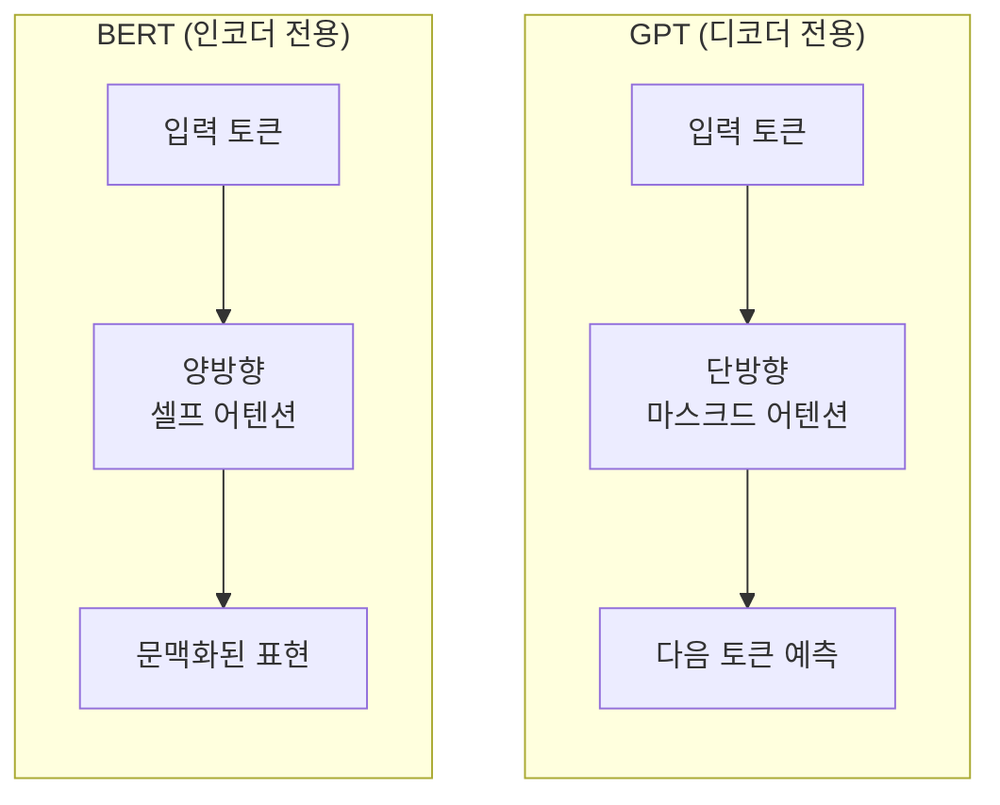
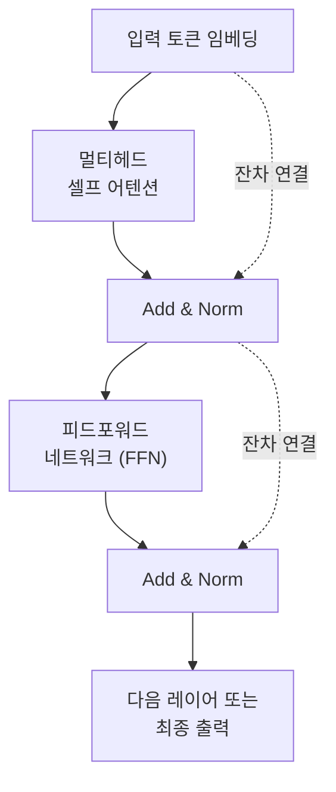
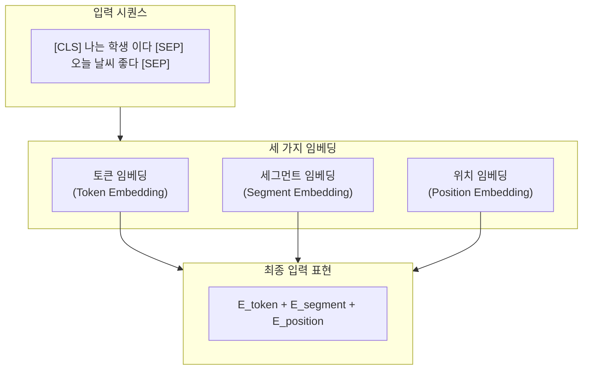
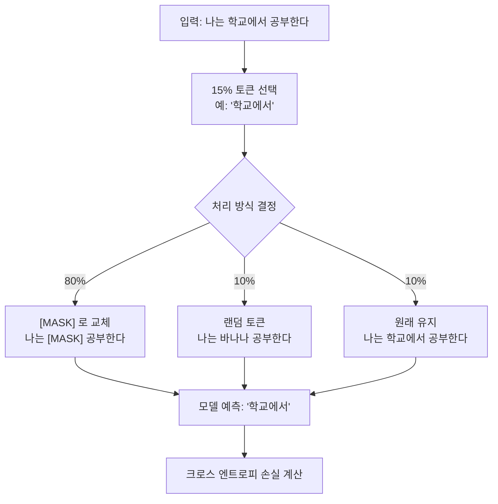
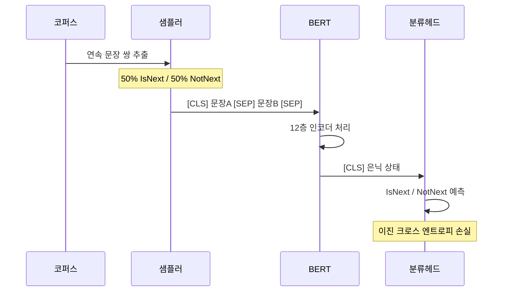
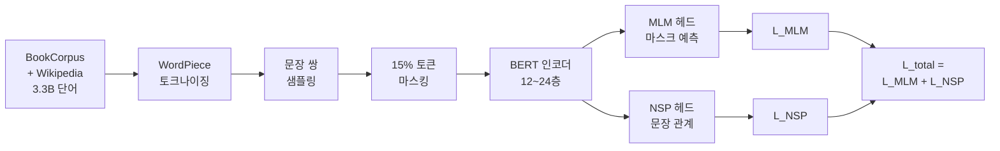

# BERT의 아키텍처와 사전학습

> 트랜스포머 인코더를 쌓아 올린 BERT의 구조와, 양방향 문맥을 학습하는 두 가지 사전학습 전략을 파헤칩니다.

## 개요

이 섹션에서는 BERT의 내부 아키텍처를 해부하고, MLM(Masked Language Modeling)과 NSP(Next Sentence Prediction)라는 두 가지 사전학습 목표가 어떻게 작동하는지 깊이 있게 살펴봅니다.

**선수 지식**: [사전학습과 파인튜닝 패러다임](16-ch16-bert-양방향-사전학습-모델/01-01-사전학습과-파인튜닝-패러다임.md)에서 배운 전이학습 개념, [트랜스포머 아키텍처 전체 조망](13-ch13-트랜스포머-아키텍처-심층-분석/01-01-트랜스포머-아키텍처-전체-조망.md)에서 다룬 인코더 구조

**학습 목표**:
- BERT가 트랜스포머 인코더만 사용하는 이유를 설명할 수 있다
- 입력 표현(토큰, 세그먼트, 위치 임베딩)의 구성과 역할을 이해한다
- MLM의 마스킹 전략(80/10/10 규칙)을 구체적으로 설명할 수 있다
- NSP 태스크의 목적과 한계를 분석할 수 있다

## 왜 알아야 할까?

[이전 섹션](16-ch16-bert-양방향-사전학습-모델/01-01-사전학습과-파인튜닝-패러다임.md)에서 "사전학습 → 파인튜닝" 패러다임이 NLP를 어떻게 바꿨는지 살펴봤죠. 그런데 BERT가 정확히 *어떻게* 양방향 문맥을 학습하는지 모르면, 파인튜닝할 때 왜 특정 레이어를 얼려야 하는지, 왜 입력에 `[CLS]`와 `[SEP]`를 붙여야 하는지 이해할 수 없습니다. BERT의 아키텍처와 사전학습 방법을 제대로 이해하면, 단순히 API를 호출하는 수준을 넘어 **모델의 행동을 예측하고 디버깅**할 수 있는 실력이 됩니다.

## 핵심 개념

### 개념 1: 인코더 전용 아키텍처 — 왜 디코더를 버렸을까?

> 💡 **비유**: 트랜스포머를 독해 시험과 작문 시험을 동시에 치르는 학생이라고 생각해보세요. GPT는 "작문 시험"(다음 단어 생성)에만 집중하고, BERT는 "독해 시험"(주어진 문맥 이해)에만 집중합니다. 독해에 집중하면 앞뒤 문맥을 **동시에** 볼 수 있다는 게 핵심이죠.

BERT는 [트랜스포머](13-ch13-트랜스포머-아키텍처-심층-분석/01-01-트랜스포머-아키텍처-전체-조망.md)의 **인코더 부분만** 사용합니다. 디코더를 제거한 이유는 단순합니다. 디코더에는 미래 토큰을 보지 못하게 하는 마스킹(causal mask)이 있어서, 왼쪽→오른쪽 방향으로만 정보가 흐릅니다. BERT의 목표는 양방향(bidirectional) 문맥을 모두 포착하는 것이므로, 이 제약이 있는 디코더는 필요 없었던 거죠.

> 📊 **그림 1**: BERT vs GPT 아키텍처 비교 — 인코더 전용 vs 디코더 전용



BERT는 두 가지 크기로 발표되었습니다:

| 모델 | 레이어 수 | 은닉 차원 | 어텐션 헤드 | 파라미터 수 |
|------|----------|----------|-----------|-----------|
| **BERT-Base** | 12 | 768 | 12 | 110M |
| **BERT-Large** | 24 | 1024 | 16 | 340M |

각 인코더 레이어는 [멀티헤드 어텐션](13-ch13-트랜스포머-아키텍처-심층-분석/03-03-멀티헤드-어텐션.md) → Add & Norm → [피드포워드 네트워크](13-ch13-트랜스포머-아키텍처-심층-분석/05-05-피드포워드-네트워크와-정규화.md) → Add & Norm 순서로 구성됩니다. 이 구조는 원래 "Attention Is All You Need" 논문의 인코더와 동일하지만, BERT는 이걸 **비지도 사전학습**에 사용한 것이 핵심적인 차이입니다.

> 📊 **그림 2**: 인코더 레이어 내부 구조 — 하나의 블록이 L번 반복



BERT-Base는 이 블록을 12번, BERT-Large는 24번 쌓아 올립니다. 중간 차원(FFN)은 은닉 차원의 4배(BERT-Base: 768 × 4 = 3,072)로, 여기서 비선형 변환이 일어나며 모델의 표현력을 높입니다.

```python
from transformers import BertConfig

# BERT-Base 설정 확인
config = BertConfig.from_pretrained("google-bert/bert-base-uncased")
print(f"레이어 수: {config.num_hidden_layers}")       # 12
print(f"은닉 차원: {config.hidden_size}")              # 768
print(f"어텐션 헤드: {config.num_attention_heads}")     # 12
print(f"중간 차원(FFN): {config.intermediate_size}")    # 3072
print(f"어휘 크기: {config.vocab_size}")                # 30522
```

### 개념 2: 입력 표현 — 세 가지 임베딩의 합

> 💡 **비유**: BERT에 텍스트를 넣는 과정을 택배 발송에 비유해볼까요? 택배 상자(토큰 임베딩)에 물건을 넣고, 발신자/수신자 스티커(세그먼트 임베딩)를 붙이고, 운송장 번호(위치 임베딩)를 기록하는 것과 같습니다. 세 가지 정보를 다 합쳐야 택배가 올바르게 배달되듯, BERT도 세 가지 임베딩을 합쳐야 입력을 올바르게 처리합니다.

BERT의 입력은 항상 `[CLS]`로 시작하고, 문장 끝에 `[SEP]`를 붙입니다. 문장 쌍이면 두 문장 사이에도 `[SEP]`가 들어갑니다.

> 📊 **그림 3**: BERT 입력 표현 — 세 가지 임베딩의 합



세 가지 임베딩의 역할을 구체적으로 살펴볼게요:

**1. 토큰 임베딩 (Token Embedding)**
[WordPiece 토크나이저](15-ch15-서브워드-토크나이제이션/03-03-wordpiece와-unigram.md)로 분할된 각 토큰을 768차원(BERT-Base 기준) 벡터로 변환합니다. 어휘 크기는 30,522개입니다.

**2. 세그먼트 임베딩 (Segment Embedding)**
입력이 문장 쌍일 때, 첫 번째 문장은 `A`, 두 번째 문장은 `B`로 구분합니다. 이 정보를 임베딩으로 인코딩하여 모델이 "이 토큰이 어느 문장에 속하는가?"를 알 수 있게 합니다.

**3. 위치 임베딩 (Position Embedding)**
원래 트랜스포머는 사인/코사인 함수를 사용했지만, BERT는 **학습 가능한(learnable) 위치 임베딩**을 사용합니다. 최대 512개 위치까지 지원하므로, 입력 시퀀스 길이는 512 토큰이 상한입니다.

```run:python
from transformers import BertTokenizer

tokenizer = BertTokenizer.from_pretrained("google-bert/bert-base-uncased")

# 단일 문장 입력
single = tokenizer("I love NLP")
print("단일 문장 토큰:", tokenizer.convert_ids_to_tokens(single["input_ids"]))
print("세그먼트 ID:  ", single["token_type_ids"])

# 문장 쌍 입력
pair = tokenizer("I love NLP", "BERT is great")
print("\n문장 쌍 토큰: ", tokenizer.convert_ids_to_tokens(pair["input_ids"]))
print("세그먼트 ID:  ", pair["token_type_ids"])
```

```output
단일 문장 토큰: ['[CLS]', 'i', 'love', 'nl', '##p', '[SEP]']
세그먼트 ID:   [0, 0, 0, 0, 0, 0]

문장 쌍 토큰:  ['[CLS]', 'i', 'love', 'nl', '##p', '[SEP]', 'bert', 'is', 'great', '[SEP]']
세그먼트 ID:   [0, 0, 0, 0, 0, 0, 1, 1, 1, 1]
```

세그먼트 ID가 문장 A는 `0`, 문장 B는 `1`로 구분되는 것을 확인할 수 있습니다. `[CLS]`와 첫 번째 `[SEP]`까지는 세그먼트 A에 속하고, 그 이후는 세그먼트 B에 속합니다.

### 개념 3: MLM(Masked Language Modeling) — 빈칸 채우기의 마법

> 💡 **비유**: MLM은 영어 시험의 "빈칸 채우기" 문제와 똑같습니다. "나는 ___에서 공부한다"라는 문장에서, 앞("나는")과 뒤("에서 공부한다")를 **모두 보고** 빈칸을 맞추는 거죠. GPT가 "나는 → 학교"처럼 왼쪽만 보고 다음 단어를 예측하는 것과 근본적으로 다릅니다.

MLM은 BERT의 핵심 사전학습 목표입니다. 입력 토큰의 **15%를 무작위로 선택**한 뒤, 선택된 토큰에 대해 다음 세 가지 중 하나를 적용합니다:

| 비율 | 처리 | 이유 |
|------|------|------|
| **80%** | `[MASK]`로 교체 | 모델이 마스킹된 토큰을 예측하도록 학습 |
| **10%** | 랜덤 토큰으로 교체 | 모델이 모든 위치를 의심하게 만듦 |
| **10%** | 원래 토큰 유지 | 실제 입력과의 불일치 완화 |

왜 100% `[MASK]`로 교체하지 않을까요? 파인튜닝 시에는 `[MASK]` 토큰이 입력에 없기 때문입니다. 사전학습과 파인튜닝 사이의 **분포 불일치(distribution mismatch)**를 줄이기 위한 전략이에요.

> 📊 **그림 4**: MLM 마스킹 전략 (80/10/10)



MLM 손실은 마스킹된 위치의 토큰에 대해서만 계산됩니다. 수식으로 표현하면:

$$L_{MLM} = -\sum_{i \in \mathcal{M}} \log P(x_i | \hat{x})$$

- $\mathcal{M}$: 마스킹된 토큰의 인덱스 집합
- $x_i$: 원래 토큰
- $\hat{x}$: 마스킹이 적용된 입력 시퀀스

이게 의미하는 바는, 모델이 양쪽 문맥을 모두 활용하여 빈칸에 들어갈 올바른 단어를 예측하도록 학습된다는 것입니다. 전체 시퀀스의 15%만 예측하기 때문에, GPT처럼 모든 토큰을 예측하는 방식보다 학습 효율은 떨어지지만, 양방향 문맥을 활용할 수 있다는 트레이드오프를 선택한 거죠.

```python
from transformers import BertForMaskedLM, BertTokenizer
import torch

tokenizer = BertTokenizer.from_pretrained("google-bert/bert-base-uncased")
model = BertForMaskedLM.from_pretrained("google-bert/bert-base-uncased")
model.eval()

# [MASK] 토큰 예측 실험
text = "The capital of France is [MASK]."
inputs = tokenizer(text, return_tensors="pt")

with torch.no_grad():
    outputs = model(**inputs)

# [MASK] 위치의 logits에서 상위 5개 토큰 추출
mask_idx = (inputs["input_ids"] == tokenizer.mask_token_id).nonzero(as_tuple=True)[1]
logits = outputs.logits[0, mask_idx, :]
top5 = torch.topk(logits, 5, dim=-1)

for score, idx in zip(top5.values[0], top5.indices[0]):
    token = tokenizer.decode(idx)
    print(f"  {token:12s} (score: {score:.2f})")
```

### 개념 4: NSP(Next Sentence Prediction) — 문장 관계 학습

> 💡 **비유**: NSP는 책의 페이지를 무작위로 섞어놓고 "이 두 페이지가 원래 연속된 페이지인가?"를 맞추는 게임입니다. 이를 통해 모델은 문장 간의 논리적 관계를 학습합니다.

NSP는 두 문장이 원래 연속된 문장인지(IsNext) 아닌지(NotNext)를 이진 분류하는 태스크입니다.

학습 데이터 구성:
- **50%**: 실제로 연속된 문장 쌍 → 레이블 `IsNext`
- **50%**: 무작위로 조합한 문장 쌍 → 레이블 `NotNext`

`[CLS]` 토큰의 최종 은닉 상태에 분류 헤드를 붙여서 이진 분류를 수행합니다.

> 📊 **그림 5**: NSP 학습 과정 — 문장 쌍의 연속성 판별



NSP 손실과 MLM 손실을 합산하여 최종 사전학습 손실을 구합니다:

$$L_{total} = L_{MLM} + L_{NSP}$$

> ⚠️ **흔한 오해**: NSP가 BERT 성능에 크게 기여한다고 생각하기 쉽지만, 후속 연구(RoBERTa, ALBERT 등)에서 NSP를 **제거해도 성능이 오히려 같거나 나아진다**는 것이 밝혀졌습니다. 최신 BERT 변형 모델(ModernBERT 등)은 대부분 NSP를 사용하지 않습니다.

### 개념 5: 사전학습 설정과 데이터

BERT는 두 가지 대규모 코퍼스로 사전학습되었습니다:

| 데이터셋 | 규모 | 설명 |
|---------|------|------|
| **BookCorpus** | 800M 단어 | 미출판 도서 11,038권 |
| **영어 Wikipedia** | 2,500M 단어 | 리스트/테이블/헤더 제외한 본문만 |

학습 설정:
- 배치 크기: 256 시퀀스
- 최대 시퀀스 길이: 512 토큰
- 학습률: 1e-4 (Adam, warmup 포함)
- 학습 기간: 1,000,000 스텝 (약 40 에폭)
- 하드웨어: BERT-Base는 4개 Cloud TPU에서 4일, BERT-Large는 16개 Cloud TPU에서 4일

> 📊 **그림 6**: BERT 사전학습 전체 파이프라인



## 실습: 직접 해보기

BERT의 입력 표현과 MLM 예측을 직접 실험해보겠습니다.

```run:python
from transformers import BertTokenizer, BertModel
import torch

# 토크나이저와 모델 로드
tokenizer = BertTokenizer.from_pretrained("google-bert/bert-base-uncased")
model = BertModel.from_pretrained("google-bert/bert-base-uncased")
model.eval()

# 문장 쌍 입력 구성
sentence_a = "BERT uses bidirectional attention."
sentence_b = "It can understand context from both sides."

# 토크나이징 — 세 가지 임베딩 요소 확인
encoded = tokenizer(sentence_a, sentence_b, return_tensors="pt")

print("=== BERT 입력 표현 분석 ===")
tokens = tokenizer.convert_ids_to_tokens(encoded["input_ids"][0])
print(f"토큰:       {tokens}")
print(f"입력 ID:    {encoded['input_ids'][0].tolist()}")
print(f"세그먼트 ID: {encoded['token_type_ids'][0].tolist()}")
print(f"어텐션 마스크: {encoded['attention_mask'][0].tolist()}")

# 모델 추론 — 은닉 상태 추출
with torch.no_grad():
    outputs = model(**encoded)

# [CLS] 토큰의 은닉 상태 (문장 쌍의 종합 표현)
cls_embedding = outputs.last_hidden_state[0, 0, :]
print(f"\n[CLS] 임베딩 차원: {cls_embedding.shape}")
print(f"[CLS] 임베딩 (처음 5개): {cls_embedding[:5].tolist()}")
print(f"전체 출력 shape: {outputs.last_hidden_state.shape}")
```

```output
=== BERT 입력 표현 분석 ===
토큰:       ['[CLS]', 'bert', 'uses', 'bid', '##ire', '##ction', '##al', 'attention', '.', '[SEP]', 'it', 'can', 'understand', 'context', 'from', 'both', 'sides', '.', '[SEP]']
입력 ID:    [101, 14324, 3594, 17163, 11263, 6553, 2389, 3086, 1012, 102, 2009, 2064, 3305, 6123, 2013, 2119, 4273, 1012, 102]
세그먼트 ID: [0, 0, 0, 0, 0, 0, 0, 0, 0, 0, 1, 1, 1, 1, 1, 1, 1, 1, 1]
어텐션 마스크: [1, 1, 1, 1, 1, 1, 1, 1, 1, 1, 1, 1, 1, 1, 1, 1, 1, 1, 1]

[CLS] 임베딩 차원: torch.Size([768])
[CLS] 임베딩 (처음 5개): [0.4315, 0.1228, -0.1917, -0.2465, 0.5123]
전체 출력 shape: torch.Size([1, 19, 768])
```

이제 MLM을 직접 실험해봅시다. 문맥에 따라 `[MASK]`에 어떤 단어가 예측되는지 확인합니다:

```run:python
from transformers import BertTokenizer, BertForMaskedLM
import torch

tokenizer = BertTokenizer.from_pretrained("google-bert/bert-base-uncased")
model = BertForMaskedLM.from_pretrained("google-bert/bert-base-uncased")
model.eval()

# 여러 문맥에서 [MASK] 예측 비교
sentences = [
    "The [MASK] chased the mouse.",        # 동물 문맥
    "I went to the [MASK] to buy groceries.",  # 장소 문맥
    "Python is a popular [MASK] language.",     # 프로그래밍 문맥
]

for sent in sentences:
    inputs = tokenizer(sent, return_tensors="pt")
    mask_idx = (inputs["input_ids"] == tokenizer.mask_token_id).nonzero(as_tuple=True)[1]

    with torch.no_grad():
        logits = model(**inputs).logits

    # 상위 3개 예측
    top3 = torch.topk(logits[0, mask_idx[0]], 3)
    predictions = [tokenizer.decode(idx.item()) for idx in top3.indices]
    print(f"입력: {sent}")
    print(f"  예측: {predictions}")
    print()
```

```output
입력: The [MASK] chased the mouse.
  예측: ['cat', 'dog', 'man']

입력: I went to the [MASK] to buy groceries.
  예측: ['store', 'market', 'shop']

입력: Python is a popular [MASK] language.
  예측: ['programming', 'computer', 'scripting']
```

BERT가 양쪽 문맥을 모두 활용하여 의미적으로 적절한 토큰을 예측하는 것을 볼 수 있습니다.

## 더 깊이 알아보기

### BERT 탄생 비화 — Google AI의 "한 방"

BERT는 2018년 10월 Jacob Devlin, Ming-Wei Chang, Kenton Lee, Kristina Toutanova가 Google AI Language 팀에서 발표했습니다. 논문 제목의 BERT는 사실 **"Bidirectional Encoder Representations from Transformers"**의 약자인데, 세서미 스트리트의 캐릭터 "Bert"와 이름이 같아 화제가 되었습니다(참고로 GPT 이전에 나온 모델 ELMo도 세서미 스트리트 캐릭터 이름이죠!).

BERT가 발표되었을 때, 당시 11개 NLP 벤치마크에서 동시에 최고 성능(SOTA)을 달성하며 학계를 놀라게 했습니다. 특히 SQuAD 2.0 질의응답 벤치마크에서 인간 수준을 처음으로 넘어선 것이 큰 반향을 일으켰습니다. 이 성과의 핵심은 "양방향 문맥을 어떻게 학습할 것인가"라는 질문에 MLM이라는 영리한 답을 제시한 것입니다.

### MLM의 기원 — Cloze 테스트

MLM의 아이디어는 1953년 Wilson Taylor가 제안한 **Cloze 테스트**(빈칸 채우기 테스트)에서 영감을 받았습니다. 70년 가까이 된 언어학 개념을 딥러닝에 적용한 것이죠. 논문에서도 이를 "masked language model"이라는 이름으로 명시적으로 언급하며, 빈칸 채우기라는 직관적인 아이디어가 강력한 사전학습 전략이 될 수 있음을 보여주었습니다.

### Whole Word Masking — 후속 개선

초기 BERT는 WordPiece 토큰 단위로 마스킹했지만, 이후 **Whole Word Masking(WWM)**이 도입되었습니다. 예를 들어 "playing"이 "play" + "##ing"으로 토큰화되면, 두 토큰을 같이 마스킹합니다. 한 토큰만 마스킹하면 나머지 토큰에서 답을 유추할 수 있어 학습이 너무 쉬워지는 문제가 있었거든요. 이 개선은 특히 중국어 BERT에서 큰 효과를 보였습니다.

## 흔한 오해와 팁

> ⚠️ **흔한 오해**: "BERT는 양방향 RNN처럼 왼쪽→오른쪽, 오른쪽→왼쪽 두 방향으로 읽는다." 이건 정확하지 않습니다! BERT는 **셀프 어텐션**으로 모든 토큰이 모든 토큰을 동시에 참조합니다. "양방향(bidirectional)"이라기보다는 "무방향(non-directional)"이 더 정확한 표현입니다. 방향이 있는 것이 아니라, 방향 제약 자체가 없는 겁니다.

> 💡 **알고 계셨나요?**: BERT 논문의 15%라는 마스킹 비율은 사실 휴리스틱한 선택이었습니다. 너무 적으면 학습이 비효율적이고, 너무 많으면 문맥 정보가 부족해집니다. 최근 연구(Wettig et al., 2023)에서는 모델 크기가 클수록 마스킹 비율을 **40%까지** 올려도 오히려 성능이 향상된다는 것을 보여주었습니다.

> 🔥 **실무 팁**: BERT의 최대 입력 길이는 512 토큰입니다. 긴 문서를 처리해야 한다면, (1) 문서를 512 토큰 이하로 잘라서 슬라이딩 윈도우 방식으로 처리하거나, (2) Longformer, BigBird 같은 긴 문맥 모델을 사용하세요. 무작정 512를 넘겨서 잘리는 실수는 NLP 초보자가 가장 흔히 겪는 문제입니다.

## 핵심 정리

| 개념 | 설명 |
|------|------|
| **인코더 전용 구조** | 트랜스포머 인코더만 사용, 양방향 셀프 어텐션으로 전체 문맥 참조 |
| **BERT-Base / Large** | 12층 768d 110M / 24층 1024d 340M 파라미터 |
| **입력 표현** | 토큰 임베딩 + 세그먼트 임베딩 + 위치 임베딩의 합 |
| **특수 토큰** | `[CLS]`(분류 표현), `[SEP]`(문장 구분), `[MASK]`(빈칸) |
| **MLM** | 15% 토큰 마스킹(80% [MASK] / 10% 랜덤 / 10% 유지) 후 예측 |
| **NSP** | 문장 쌍의 연속 여부를 이진 분류 (후속 연구에서 불필요함이 밝혀짐) |
| **학습 데이터** | BookCorpus(800M) + 영어 Wikipedia(2,500M) = 총 3.3B 단어 |
| **위치 임베딩** | 학습 가능한 임베딩, 최대 512 위치 |

## 다음 섹션 미리보기

BERT의 핵심 아키텍처와 사전학습 방법을 이해했으니, 다음 섹션 [BERT 변형 모델들](16-ch16-bert-양방향-사전학습-모델/03-03-bert-변형-모델들.md)에서는 BERT의 한계를 극복하기 위해 등장한 다양한 변형 모델들을 살펴봅니다. RoBERTa(NSP 제거 + 더 많은 데이터), ALBERT(파라미터 효율화), DistilBERT(경량화), 그리고 최신 ModernBERT까지 — BERT 이후 어떤 개선들이 이루어졌는지 비교 분석합니다.

## 참고 자료

- [BERT: Pre-training of Deep Bidirectional Transformers for Language Understanding (Devlin et al., 2019)](https://arxiv.org/abs/1810.04805) - BERT 원 논문. 아키텍처, MLM/NSP, 실험 결과를 모두 담고 있는 필수 논문
- [The Illustrated BERT, ELMo, and co. (Jay Alammar)](https://jalammar.github.io/illustrated-bert/) - BERT 아키텍처와 사전학습 과정을 시각적으로 탁월하게 설명한 블로그
- [Hugging Face BERT 공식 문서](https://huggingface.co/docs/transformers/en/model_doc/bert) - BertModel, BertForMaskedLM 등 API 레퍼런스와 사용 예제
- [Dive into Deep Learning — BERT 챕터](https://d2l.ai/chapter_natural-language-processing-pretraining/bert.html) - 수식과 코드를 함께 제공하는 상세한 BERT 교재
- [Should You Mask 15% in Masked Language Modeling? (Wettig et al., 2023)](https://aclanthology.org/2023.eacl-main.217/) - 마스킹 비율에 대한 최신 연구, 기존 15% 관행에 도전

---
### 🔗 Related Sessions
- [transfer_learning](16-ch16-bert-양방향-사전학습-모델/01-01-사전학습과-파인튜닝-패러다임.md) (prerequisite)
- [pre_training](16-ch16-bert-양방향-사전학습-모델/01-01-사전학습과-파인튜닝-패러다임.md) (prerequisite)
- [fine_tuning](16-ch16-bert-양방향-사전학습-모델/01-01-사전학습과-파인튜닝-패러다임.md) (prerequisite)


---
### 🔗 Related Sessions
- [transfer_learning](16-ch16-bert-양방향-사전학습-모델/01-01-사전학습과-파인튜닝-패러다임.md) (prerequisite)
- [pre_training](16-ch16-bert-양방향-사전학습-모델/01-01-사전학습과-파인튜닝-패러다임.md) (prerequisite)
- [fine_tuning](16-ch16-bert-양방향-사전학습-모델/01-01-사전학습과-파인튜닝-패러다임.md) (prerequisite)
