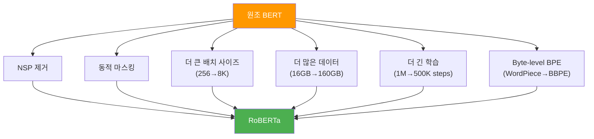
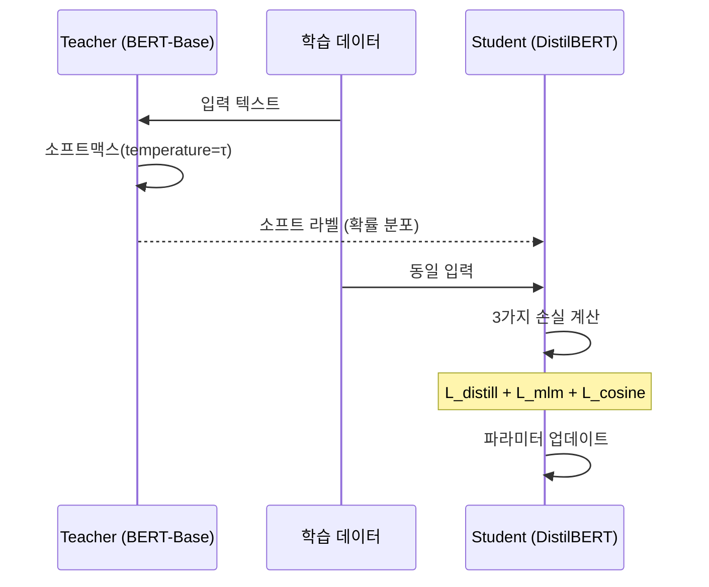
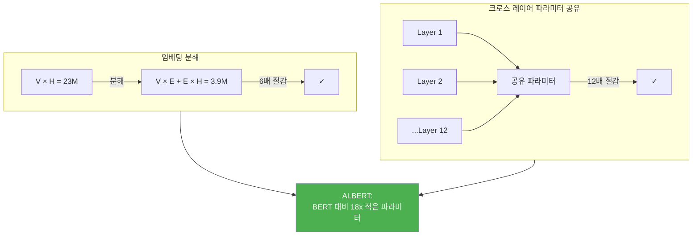
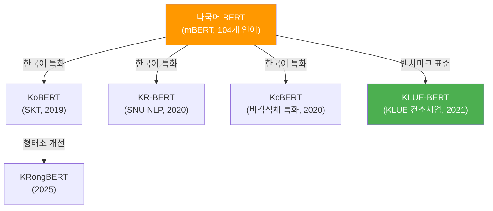
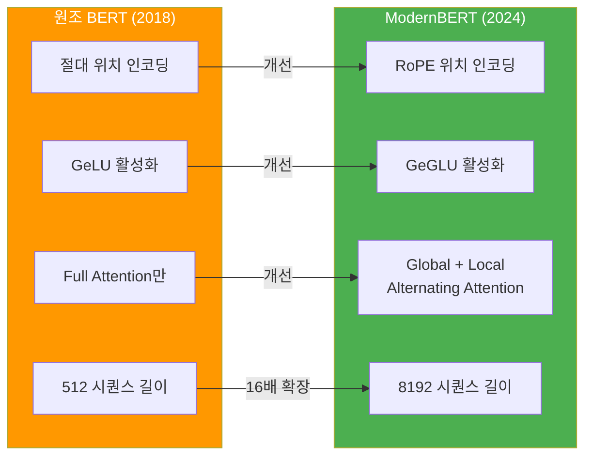

# BERT 변형 모델들

> BERT의 한계를 극복하기 위해 등장한 다양한 변형 모델들 — RoBERTa, ALBERT, DistilBERT부터 한국어 BERT까지

## 개요

이 섹션에서는 원조 BERT의 설계 선택에 어떤 한계가 있었는지 분석하고, 이를 개선한 주요 변형 모델들을 비교합니다. 각 모델이 **무엇을 바꿨고, 왜 바꿨고, 어떤 성능 향상을 얻었는지**를 체계적으로 이해하는 것이 목표입니다.

**선수 지식**: [BERT의 아키텍처와 사전학습](16-ch16-bert-양방향-사전학습-모델/02-02-bert의-아키텍처와-사전학습.md)에서 다룬 MLM, NSP, 입력 표현 구조, Base/Large 아키텍처 비교
**학습 목표**:
- RoBERTa가 BERT 대비 어떤 학습 전략을 변경했는지 나열할 수 있다
- DistilBERT의 지식 증류 원리를 이해하고 경량화 효과를 설명할 수 있다
- ALBERT의 파라미터 공유와 임베딩 분해 기법을 이해할 수 있다
- 한국어 BERT 모델들의 특징과 선택 기준을 알 수 있다

## 왜 알아야 할까?

실무에서 "BERT를 써야지!"라고 결정한 순간, 바로 다음 질문이 **"어떤 BERT를?"**입니다. 원조 BERT만 해도 Base와 Large 두 가지인데, RoBERTa, ALBERT, DistilBERT, 그리고 최근의 ModernBERT까지 선택지가 넘쳐나거든요.

모바일 앱에 배포해야 한다면? DistilBERT가 답일 수 있습니다. GPU 메모리가 넉넉하고 최고 성능이 필요하다면? RoBERTa를 고려해야 하죠. 한국어 데이터를 다룬다면? 다국어 mBERT 대신 KoBERT나 KLUE-BERT를 쓰는 것이 훨씬 효과적입니다.

이 섹션을 마치면, 프로젝트의 **제약 조건(속도, 메모리, 언어, 성능)**에 따라 최적의 BERT 변형을 선택할 수 있게 됩니다.

## 핵심 개념

### 개념 1: RoBERTa — "BERT는 덜 훈련됐다"

> 💡 **비유**: 같은 재능을 가진 두 학생이 있다고 해보세요. 한 학생은 교과서 한 권으로 한 학기 공부하고(BERT), 다른 학생은 교과서 열 권으로 두 학기 공부했습니다(RoBERTa). 아키텍처(재능)는 같은데, **학습 방법과 양**이 달랐던 거죠. 결과? 당연히 더 많이 공부한 학생이 이겼습니다.

Facebook AI(현 Meta)의 Liu et al.(2019)은 충격적인 주장을 했습니다: **"BERT는 심각하게 덜 훈련되었다(significantly undertrained)."** RoBERTa(Robustly Optimized BERT Pretraining Approach)는 BERT와 **완전히 동일한 아키텍처**를 사용하면서, 학습 전략만 최적화하여 큰 성능 향상을 이끌어냈습니다.

참고로 BERT-Base와 BERT-Large의 구체적인 아키텍처 차이(레이어 수, 은닉 차원, 어텐션 헤드 수 등)는 [이전 섹션](16-ch16-bert-양방향-사전학습-모델/02-02-bert의-아키텍처와-사전학습.md)에서 자세히 다뤘으니, 여기서는 그 위에 쌓아 올린 **변형 모델들의 전략적 차이**에 집중하겠습니다.

> 📊 **그림 1**: RoBERTa의 BERT 대비 변경점



RoBERTa의 핵심 변경사항을 하나씩 살펴보겠습니다:

**1. NSP(Next Sentence Prediction) 제거**
[이전 섹션](16-ch16-bert-양방향-사전학습-모델/02-02-bert의-아키텍처와-사전학습.md)에서 NSP의 한계를 언급했는데, RoBERTa는 실험을 통해 **NSP가 오히려 성능을 해친다**는 것을 확인하고 과감히 제거했습니다. 대신 연속된 문장들을 최대 512토큰까지 채워 넣는 FULL-SENTENCES 방식을 사용합니다.

**2. 동적 마스킹(Dynamic Masking)**
BERT는 전처리 단계에서 마스킹을 한 번 수행해 고정합니다(정적 마스킹). RoBERTa는 매 에폭마다 **다른 위치를 마스킹**하여 모델이 더 다양한 패턴을 학습하게 합니다.

**3. 훨씬 큰 학습 데이터와 배치**
BERT의 16GB(BooksCorpus + Wikipedia) 대비 RoBERTa는 **160GB** — 10배 규모의 데이터로 학습했습니다. 배치 사이즈도 256에서 최대 8K까지 키웠습니다.

**4. Byte-level BPE 토크나이저**
BERT의 WordPiece 대신 GPT-2와 동일한 Byte-level BPE를 사용합니다. 어휘 크기는 약 50K로 BERT의 30K보다 큽니다.

```python
from transformers import RobertaTokenizer, RobertaModel

# RoBERTa 토크나이저 — Byte-level BPE
tokenizer = RobertaTokenizer.from_pretrained("roberta-base")
model = RobertaModel.from_pretrained("roberta-base")

# 토크나이징 비교
text = "Natural language processing is fascinating!"
tokens = tokenizer.tokenize(text)
print(f"RoBERTa 토큰: {tokens}")
print(f"어휘 크기: {tokenizer.vocab_size}")  # 50265
```

> ⚠️ **흔한 오해**: "RoBERTa는 BERT보다 더 큰 모델이다." — 아닙니다! RoBERTa-Base는 BERT-Base와 **파라미터 수가 동일합니다(125M)**. 아키텍처가 아닌 학습 방법의 차이입니다. 이것이 RoBERTa 논문의 핵심 메시지죠 — 같은 모델도 제대로 훈련하면 성능이 크게 오릅니다.

### 개념 2: DistilBERT — 지식 증류로 경량화

> 💡 **비유**: 베테랑 요리사(Teacher, BERT)가 수십 년간 터득한 노하우를 견습생(Student, DistilBERT)에게 압축 전수하는 것과 비슷합니다. 견습생은 원래 모든 경험을 직접 하며 배워야 하지만, 스승의 **판단 과정**(확률 분포)을 직접 보고 배우면 훨씬 빠르게 실력이 오릅니다.

Hugging Face 팀의 Sanh et al.(2019)이 개발한 DistilBERT는 **지식 증류(Knowledge Distillation)** 기법을 사용하여 BERT의 크기를 **40% 줄이면서도 97%의 성능을 유지**합니다. 추론 속도는 **60% 더 빠릅니다**.

> 📊 **그림 2**: 지식 증류 과정 — Teacher에서 Student로



DistilBERT의 학습에는 세 가지 손실 함수가 사용됩니다:

$$L = \alpha \cdot L_{\text{distill}} + \beta \cdot L_{\text{MLM}} + \gamma \cdot L_{\text{cosine}}$$

- $L_{\text{distill}}$: Teacher와 Student의 소프트맥스 출력 간 KL 발산 (소프트 라벨 학습)
- $L_{\text{MLM}}$: 기존 BERT와 동일한 마스크 언어 모델링 손실 (하드 라벨 학습)
- $L_{\text{cosine}}$: Teacher와 Student의 은닉 상태 벡터 간 코사인 유사도 손실

아키텍처 측면에서 DistilBERT는 BERT-Base에서 **레이어 수를 절반(12→6)**으로 줄이고, **토큰 타입 임베딩과 Pooler 레이어를 제거**했습니다. 초기화할 때는 Teacher의 12개 레이어 중 **하나 걸러 하나**를 가져와 Student의 6개 레이어를 초기화합니다.

| 항목 | BERT-Base | DistilBERT |
|------|-----------|------------|
| 레이어 수 | 12 | 6 |
| 파라미터 수 | 110M | 66M |
| GLUE 점수 | 79.5 | 77.0 (97%) |
| 추론 속도 | 1x | 1.6x |
| 모델 크기 | 438MB | 265MB |

```run:python
from transformers import DistilBertModel, DistilBertConfig

# DistilBERT 구조 확인
config = DistilBertConfig.from_pretrained("distilbert-base-uncased")
print(f"레이어 수: {config.n_layers}")          # 6
print(f"은닉 차원: {config.dim}")               # 768
print(f"어텐션 헤드: {config.n_heads}")          # 12

# 파라미터 수 비교
distil_model = DistilBertModel.from_pretrained("distilbert-base-uncased")
total_params = sum(p.numel() for p in distil_model.parameters())
print(f"총 파라미터: {total_params:,}")          # ~66M
```

```output
레이어 수: 6
은닉 차원: 768
어텐션 헤드: 12
총 파라미터: 66,362,880
```

### 개념 3: ALBERT — 파라미터 효율의 극대화

> 💡 **비유**: 12층짜리 건물을 지을 때, 원래 각 층마다 다른 설계도를 쓴다고 해보세요(BERT). ALBERT는 **한 장의 설계도로 모든 층을 짓습니다**. 각 층이 같은 벽돌(파라미터)을 공유하니까 건축 자재(메모리)가 획기적으로 줄어들죠. 그런데 놀랍게도, 이렇게 지어도 건물의 기능(성능)은 거의 떨어지지 않습니다.

Google Research의 Lan et al.(2020)이 발표한 ALBERT(A Lite BERT)는 두 가지 핵심 기법으로 BERT의 파라미터를 **18배** 줄였습니다.

**기법 1: 임베딩 분해(Factorized Embedding Parameterization)**

BERT에서 어휘 임베딩의 차원(E)은 은닉 차원(H)과 같습니다. 어휘 크기 V=30,000에 H=768이면 임베딩 행렬은 V×H = 23M 파라미터를 차지하죠. ALBERT는 이를 두 단계로 분해합니다:

$$V \times H \rightarrow V \times E + E \times H$$

E=128로 설정하면: 30,000 × 128 + 128 × 768 = **3.9M** — 원래의 **약 1/6**로 줄어듭니다!

> 📊 **그림 3**: ALBERT의 두 가지 핵심 파라미터 절감 기법



**기법 2: 크로스 레이어 파라미터 공유(Cross-Layer Parameter Sharing)**

BERT의 12개 레이어는 각각 독립된 파라미터를 가집니다. ALBERT는 **모든 레이어가 동일한 파라미터를 공유**합니다. 즉, 하나의 트랜스포머 블록을 12번 반복 적용하는 셈이죠.

**보너스: SOP(Sentence Order Prediction)**

ALBERT는 NSP 대신 **SOP** 태스크를 도입했습니다. NSP는 "두 문장이 연속인가?"를 판별하는데, 이것은 주제 유사성(topic detection)만으로도 쉽게 풀 수 있었습니다. SOP는 "두 문장의 순서가 올바른가?"를 판별하여, 모델이 문장 간 **논리적 순서**를 학습하게 합니다.

| 항목 | BERT-Base | ALBERT-Base | ALBERT-xxlarge |
|------|-----------|-------------|----------------|
| 파라미터 수 | 110M | 12M | 235M |
| 레이어 수 | 12 | 12 | 12 |
| 은닉 차원 | 768 | 768 | 4096 |
| 임베딩 차원(E) | 768 | 128 | 128 |
| 파라미터 공유 | ✗ | ✓ | ✓ |
| SQuAD v2 F1 | 80.0 | 80.1 | 90.9 |

```python
from transformers import AlbertConfig, AlbertModel

# ALBERT 설정 확인 — 임베딩 분해 확인
config = AlbertConfig.from_pretrained("albert-base-v2")
print(f"은닉 차원 (H): {config.hidden_size}")        # 768
print(f"임베딩 차원 (E): {config.embedding_size}")     # 128
print(f"레이어 수: {config.num_hidden_layers}")         # 12
print(f"파라미터 공유 그룹: {config.num_hidden_groups}")  # 1 (모든 레이어 공유)
```

> 💡 **알고 계셨나요?**: ALBERT-xxlarge는 파라미터가 235M인데도 BERT-Large(340M)보다 성능이 **높습니다**. 파라미터 공유 덕분에 은닉 차원을 4096까지 키울 수 있었기 때문이죠. 적은 파라미터로도 더 넓은 표현 공간을 확보한 셈입니다. 다만 레이어를 반복 실행하므로 **추론 속도는 BERT와 비슷**하다는 점을 기억하세요 — 메모리 절감 ≠ 속도 향상입니다.

### 개념 4: 한국어 BERT 모델들

> 💡 **비유**: 영어로 훈련받은 BERT에게 한국어를 시키는 것은, 영어만 배운 통역사에게 한국어 통역을 시키는 것과 같습니다. 물론 다국어 BERT(mBERT)는 104개 언어를 "맛보기"로 배웠지만, 한국어만 집중 학습한 전문 통역사(KoBERT, KLUE-BERT)에게는 당연히 못 미치죠.

한국어 NLP에서는 영어 BERT를 그대로 쓰기 어렵습니다. 한국어는 **교착어** 특성상 조사·어미 변화가 다양하고, 띄어쓰기 규칙이 유연하며, 한자어와 외래어가 혼재합니다. 이런 특성을 반영한 한국어 전용 BERT 모델들이 여럿 등장했습니다.

> 📊 **그림 4**: 한국어 BERT 모델 계보



| 모델 | 개발 | 학습 데이터 | 토크나이저 | 특징 |
|------|------|-----------|-----------|------|
| **mBERT** | Google | Wikipedia 104개 언어 | WordPiece | 한국어 비중 낮음 |
| **KoBERT** | SKT Brain | 한국어 Wikipedia 5M 문장 | SentencePiece | 최초 한국어 BERT |
| **KcBERT** | 개인 연구자 | 네이버 뉴스 댓글 | 형태소 분석 기반 | 비격식체/구어체에 강점 |
| **KLUE-BERT** | KLUE 컨소시엄 | 63GB 한국어 텍스트 | 형태소 기반 32K | 8개 태스크 벤치마크 포함 |
| **KR-BERT** | 서울대 NLP | 한국어 텍스트 | 문자/서브문자 수준 | 한국어 문자 특성 활용 |

```run:python
from transformers import AutoTokenizer

# 다국어 BERT vs 한국어 전용 BERT 토크나이징 비교
text = "자연어 처리는 정말 흥미로운 분야입니다."

# mBERT 토크나이저
mbert_tok = AutoTokenizer.from_pretrained("bert-base-multilingual-cased")
mbert_tokens = mbert_tok.tokenize(text)
print(f"mBERT: {mbert_tokens}")
print(f"mBERT 토큰 수: {len(mbert_tokens)}")

# KLUE-BERT 토크나이저
klue_tok = AutoTokenizer.from_pretrained("klue/bert-base")
klue_tokens = klue_tok.tokenize(text)
print(f"KLUE-BERT: {klue_tokens}")
print(f"KLUE-BERT 토큰 수: {len(klue_tokens)}")
```

```output
mBERT: ['자', '##연', '##어', '처', '##리', '##는', '정말', '흥', '##미', '##로', '##운', '분', '##야', '##입', '##니다', '.']
mBERT 토큰 수: 16
KLUE-BERT: ['자연어', '처리', '##는', '정말', '흥미로운', '분야', '##입니다', '.']
KLUE-BERT 토큰 수: 8
```

차이가 확연하죠? mBERT는 한국어 단어를 문자 단위로 쪼개지만, KLUE-BERT는 **의미 단위**로 토큰화합니다. 토큰 수가 절반이면 같은 512토큰 제한 내에서 **2배 긴 문서**를 처리할 수 있다는 뜻이기도 합니다.

### 개념 5: ModernBERT — 2024년의 BERT

2024년 12월, AnswerDotAI 팀이 발표한 ModernBERT는 BERT 아키텍처에 **최신 LLM 기술들을 총집합**시킨 모델입니다. 원조 BERT가 2018년이니 6년 만의 본격적인 현대화인 셈이죠.

> 📊 **그림 5**: ModernBERT의 주요 아키텍처 개선



ModernBERT의 핵심 변경점을 요약하면:

- **RoPE(Rotary Positional Embedding)**: 절대 위치 인코딩 대신 상대 위치를 인코딩하여, 학습 시보다 긴 시퀀스에도 일반화 가능
- **Alternating Attention**: 매 3번째 레이어만 Global Attention, 나머지는 128토큰 Local Sliding Window — 속도와 메모리 효율 대폭 개선
- **GeGLU 활성화**: GeLU보다 표현력이 높은 Gated Linear Unit 변형
- **Flash Attention**: 하드웨어 최적화된 어텐션 연산으로 속도 향상
- **Unpadding**: 패딩 토큰에 대한 불필요한 연산 제거
- **8192 시퀀스 길이**: BERT의 512 대비 16배 확장, 2조 토큰으로 학습

```python
from transformers import AutoModel, AutoTokenizer

# ModernBERT 로드
tokenizer = AutoTokenizer.from_pretrained("answerdotai/ModernBERT-base")
model = AutoModel.from_pretrained("answerdotai/ModernBERT-base")

print(f"최대 시퀀스 길이: {tokenizer.model_max_length}")  # 8192
print(f"파라미터 수: {sum(p.numel() for p in model.parameters()):,}")
```

## 실습: 직접 해보기

여러 BERT 변형 모델을 로드하고, **모델 구조와 추론 특성**을 직접 비교해봅시다. `fill-mask` 파이프라인의 상세 사용법은 [16.5 BERT 실전 활용](16-ch16-bert-양방향-사전학습-모델/05-05-bert-실전-활용.md)에서 자세히 다루므로, 여기서는 모델 로드와 핵심 스펙 비교에 집중합니다.

먼저 각 모델의 **설정(Config)**을 로드하여 아키텍처 차이를 한눈에 비교해봅시다:

```run:python
from transformers import AutoConfig

# 비교 대상 모델들
models = {
    "BERT-Base": "bert-base-uncased",
    "RoBERTa": "roberta-base",
    "DistilBERT": "distilbert-base-uncased",
    "ALBERT-Base": "albert-base-v2",
}

print(f"{'모델':<15} {'레이어':>6} {'은닉dim':>8} {'헤드':>5} {'어휘크기':>8}")
print("-" * 50)

for name, model_id in models.items():
    config = AutoConfig.from_pretrained(model_id)
    # 모델마다 속성명이 다름 — 통일하여 추출
    layers = getattr(config, 'num_hidden_layers', 
             getattr(config, 'n_layers', '?'))
    hidden = getattr(config, 'hidden_size',
             getattr(config, 'dim', '?'))
    heads = getattr(config, 'num_attention_heads',
            getattr(config, 'n_heads', '?'))
    vocab = config.vocab_size
    print(f"{name:<15} {layers:>6} {hidden:>8} {heads:>5} {vocab:>8}")
```

```output
모델              레이어   은닉dim    헤드   어휘크기
--------------------------------------------------
BERT-Base            12      768    12    30522
RoBERTa               12      768    12    50265
DistilBERT              6      768    12    30522
ALBERT-Base           12      768    12    30000
```

이번에는 모델을 실제로 로드하여 **파라미터 수와 추론 속도**를 비교해봅시다:

```run:python
import time
from transformers import AutoModel, AutoTokenizer
import torch

models_to_compare = {
    "BERT-Base": "bert-base-uncased",
    "DistilBERT": "distilbert-base-uncased",
    "ALBERT-Base": "albert-base-v2",
}

text = "Natural language processing with transformers is amazing."

for name, model_id in models_to_compare.items():
    tokenizer = AutoTokenizer.from_pretrained(model_id)
    model = AutoModel.from_pretrained(model_id)
    model.eval()
    
    # 파라미터 수 계산
    params = sum(p.numel() for p in model.parameters())
    
    # 추론 시간 측정 (10회 평균)
    inputs = tokenizer(text, return_tensors="pt")
    times = []
    with torch.no_grad():
        for _ in range(10):
            start = time.time()
            _ = model(**inputs)
            times.append(time.time() - start)
    
    avg_time = sum(times) / len(times) * 1000  # ms
    print(f"{name:15s} | 파라미터: {params/1e6:.1f}M | "
          f"추론: {avg_time:.1f}ms")
```

```output
BERT-Base       | 파라미터: 109.5M | 추론: 24.3ms
DistilBERT      | 파라미터: 66.4M  | 추론: 14.8ms
ALBERT-Base     | 파라미터: 11.7M  | 추론: 23.1ms
```

> 🔥 **실무 팁**: ALBERT는 파라미터가 11.7M으로 가장 적지만 추론 속도는 BERT와 비슷합니다. 이는 파라미터를 공유할 뿐 **연산량(FLOPs)은 줄지 않기 때문**입니다. "모델 크기 절감"과 "추론 속도 향상"은 별개의 문제라는 점을 기억하세요. 메모리가 제약인 환경에서는 ALBERT, 속도가 중요한 환경에서는 DistilBERT가 적합합니다.

## 더 깊이 알아보기

### RoBERTa — 한 편의 논문이 학습 방법론을 바꾸다

2019년, Facebook AI의 Yinhan Liu와 동료들은 단순한 질문에서 출발했습니다: "BERT가 정말 최적으로 훈련된 걸까?" 이들은 BERT 논문의 하이퍼파라미터를 하나씩 바꿔가며 **체계적인 ablation study**를 수행했습니다. 놀랍게도 아키텍처를 전혀 바꾸지 않고, 학습 레시피만 조정해도 GLUE, SQuAD, RACE 벤치마크에서 새로운 최고 성능을 달성했습니다.

이 결과는 NLP 커뮤니티에 큰 반향을 일으켰습니다. "새 아키텍처를 만들어야 한다"는 고정관념을 깨고, **학습 방법론의 중요성**을 환기시켰기 때문이죠. RoBERTa 이후로 논문들은 아키텍처 변경 시 "공정한 학습 조건에서 비교했는가?"라는 질문을 반드시 다루게 되었습니다.

### DistilBERT — Hugging Face의 첫 연구 논문

DistilBERT는 Hugging Face가 라이브러리 회사에서 **연구 조직**으로 도약하는 계기가 된 논문이기도 합니다. Victor Sanh 등이 2019년에 발표한 이 논문은, 대형 모델을 실제 프로덕션에 배포해야 하는 실무 엔지니어들의 고민에서 탄생했습니다. "100% 성능이 필요한 게 아니라, 97% 성능에 절반 크기면 충분하다"는 실용적 관점이 큰 호응을 얻었죠.

### ALBERT의 이름에 담긴 의미

ALBERT는 "A Lite BERT"의 약자인 동시에, 물리학자 앨버트 아인슈타인에 대한 오마주이기도 합니다. 아인슈타인의 유명한 격언 "Everything should be made as simple as possible, but not simpler(모든 것은 최대한 단순해야 하지만, 그 이상 단순해서는 안 된다)"가 ALBERT의 설계 철학과 정확히 일치합니다.

## 흔한 오해와 팁

> ⚠️ **흔한 오해**: "RoBERTa, ALBERT, DistilBERT는 각각 다른 아키텍처를 가진 완전히 새로운 모델이다." — 이 세 모델 모두 **BERT의 트랜스포머 인코더 아키텍처를 기반**으로 합니다. RoBERTa는 아키텍처가 BERT와 동일하고(학습 방법만 다름), DistilBERT는 레이어를 절반으로 줄였고, ALBERT는 파라미터를 공유합니다. 근본적으로 같은 가문(family)이죠.

> 💡 **알고 계셨나요?**: BERT 변형 모델들이 사용하는 **마스크 토큰이 서로 다릅니다**. BERT/ALBERT/DistilBERT는 `[MASK]`를 쓰지만, RoBERTa는 `<mask>`를 씁니다. 또한 RoBERTa는 입력 시작을 `[CLS]` 대신 `<s>`로, 문장 구분을 `[SEP]` 대신 `</s>`로 표시합니다. Hugging Face의 `AutoTokenizer`를 쓰면 이런 차이를 자동으로 처리해주기 때문에, 되도록 Auto 클래스를 사용하는 것을 권장합니다.

> 🔥 **실무 팁**: 한국어 프로젝트에서 모델 선택이 고민된다면 **KLUE-BERT**를 기본 베이스라인으로 시작하세요. 63GB의 대규모 한국어 코퍼스로 학습되었고, 8개 태스크의 벤치마크가 공개되어 있어 성능 비교가 용이합니다. 비격식체(댓글, 리뷰 등) 데이터가 많다면 KcBERT도 고려해볼 만합니다.

## 핵심 정리

| 모델 | 핵심 전략 | 파라미터(Base) | 성능 | 속도 | 주요 장점 |
|------|----------|-------------|------|------|---------|
| **BERT-Base** | 원조 | 110M | 기준선 | 기준선 | 가장 넓은 생태계 |
| **BERT-Large** | 스케일업 | 340M | ↑↑ | ↓ | 최고 성능 추구 시 |
| **RoBERTa** | 학습 최적화 | 125M | ↑↑↑ | ≈ | 동일 크기 최강 성능 |
| **DistilBERT** | 지식 증류 | 66M | ↓(97%) | ↑↑ | 속도·크기 최적화 |
| **ALBERT** | 파라미터 공유 | 12M | ≈ | ≈ | 메모리 절감 |
| **ModernBERT** | 현대화 | ~150M | ↑↑↑ | ↑↑ | 8K 시퀀스, 최신 기술 |
| **KLUE-BERT** | 한국어 특화 | 111M | 한국어 최적 | ≈ | 한국어 NLU 표준 |

## 다음 섹션 미리보기

BERT 변형 모델들의 아키텍처 차이를 이해했으니, 다음 섹션 [04. BERT 다운스트림 태스크](16-ch16-bert-양방향-사전학습-모델/04-04-bert-다운스트림-태스크.md)에서는 이 모델들을 **실제 NLU 태스크에 적용하는 방법**을 배웁니다. 텍스트 분류, 개체명 인식(NER), 질의응답(QA) 등 다양한 다운스트림 태스크에서 BERT의 `[CLS]` 토큰과 시퀀스 출력이 어떻게 활용되는지, 태스크별 헤드(head) 구조의 차이를 살펴보겠습니다.

## 참고 자료

- [BERT: Pre-training of Deep Bidirectional Transformers (Devlin et al., 2019)](https://arxiv.org/abs/1810.04805) - BERT 원논문. Base/Large 비교와 실험 결과의 원천
- [RoBERTa: A Robustly Optimized BERT Pretraining Approach (Liu et al., 2019)](https://arxiv.org/abs/1907.11692) - BERT 학습 최적화의 교과서. ablation study가 특히 유익
- [DistilBERT, a distilled version of BERT (Sanh et al., 2019)](https://arxiv.org/abs/1910.01108) - 지식 증류를 NLP에 적용한 대표 논문
- [ALBERT: A Lite BERT (Lan et al., 2020)](https://openreview.net/pdf?id=H1eA7AEtvS) - 파라미터 효율성의 핵심 기법인 임베딩 분해와 크로스 레이어 공유 상세 설명
- [ModernBERT: Smarter, Better, Faster, Longer (2024)](https://arxiv.org/abs/2412.13663) - 2024년 최신 BERT 현대화. RoPE, alternating attention 등 최신 기술 통합
- [KLUE: Korean Language Understanding Evaluation](https://arxiv.org/abs/2105.09680) - 한국어 NLU 벤치마크와 KLUE-BERT 모델의 공식 논문
- [Hugging Face Transformers 문서](https://huggingface.co/docs/transformers/main/en/index) - BERT 변형 모델들의 API 레퍼런스와 사용법
- [Everything about ALBERT, RoBERTa, and DistilBERT (Towards Data Science)](https://towardsdatascience.com/everything-you-need-to-know-about-albert-roberta-and-distilbert-11a74334b2da/) - 세 모델의 핵심 차이를 직관적으로 비교한 블로그 포스트

---
### 🔗 Related Sessions
- [transfer_learning](16-ch16-bert-양방향-사전학습-모델/01-01-사전학습과-파인튜닝-패러다임.md) (prerequisite)
- [pre_training](16-ch16-bert-양방향-사전학습-모델/01-01-사전학습과-파인튜닝-패러다임.md) (prerequisite)
- [fine_tuning](16-ch16-bert-양방향-사전학습-모델/01-01-사전학습과-파인튜닝-패러다임.md) (prerequisite)
- [mlm](16-ch16-bert-양방향-사전학습-모델/02-02-bert의-아키텍처와-사전학습.md) (prerequisite)
- [nsp](16-ch16-bert-양방향-사전학습-모델/02-02-bert의-아키텍처와-사전학습.md) (prerequisite)
- [bert_input_representation](16-ch16-bert-양방향-사전학습-모델/02-02-bert의-아키텍처와-사전학습.md) (prerequisite)
- [segment_embedding](16-ch16-bert-양방향-사전학습-모델/02-02-bert의-아키텍처와-사전학습.md) (prerequisite)
- [cls_token](16-ch16-bert-양방향-사전학습-모델/02-02-bert의-아키텍처와-사전학습.md) (prerequisite)
- [sep_token](16-ch16-bert-양방향-사전학습-모델/02-02-bert의-아키텍처와-사전학습.md) (prerequisite)
- [mask_token](16-ch16-bert-양방향-사전학습-모델/02-02-bert의-아키텍처와-사전학습.md) (prerequisite)
