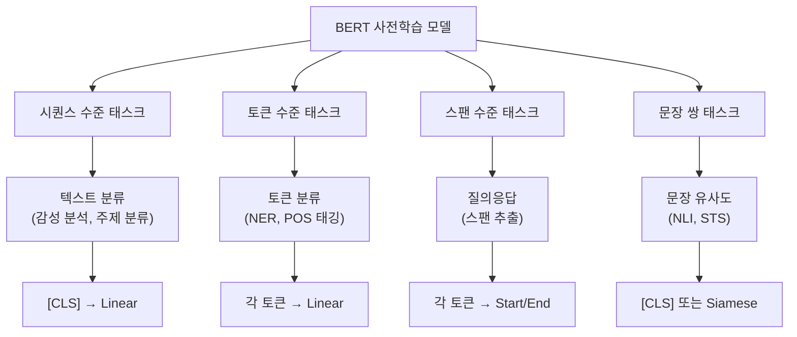
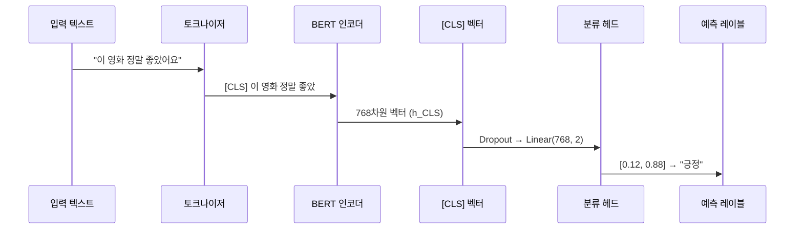
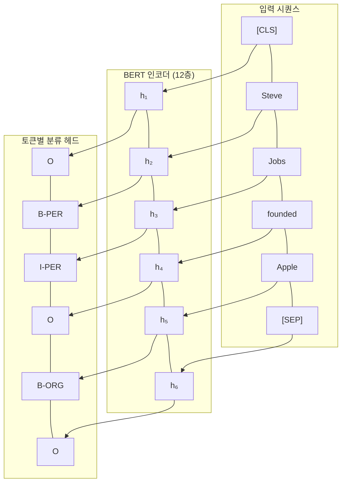
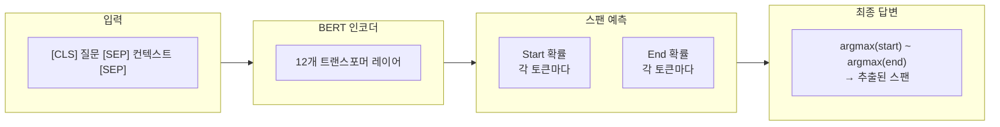
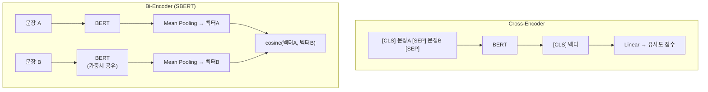

# BERT 다운스트림 태스크

> 하나의 사전학습 모델, 무한한 가능성 — BERT를 분류, NER, 질의응답, 문장 유사도에 적용하는 방법을 마스터합니다.

## 개요

이 섹션에서는 사전학습된 BERT 모델을 다양한 다운스트림 태스크(Downstream Task)에 적용하는 방법을 배웁니다. [앞서 BERT의 아키텍처와 사전학습](16-ch16-bert-양방향-사전학습-모델/02-02-bert의-아키텍처와-사전학습.md)에서 배운 `[CLS]` 토큰과 토큰별 출력 벡터가 태스크별로 어떻게 활용되는지, 그리고 각 태스크에 맞는 **헤드(Head)** 구조가 어떻게 설계되는지를 깊이 있게 다룹니다.

**선수 지식**: BERT의 인코더 아키텍처와 입력 표현(토큰/세그먼트/위치 임베딩), `[CLS]`/`[SEP]` 토큰의 역할, [BERT 변형 모델들](16-ch16-bert-양방향-사전학습-모델/03-03-bert-변형-모델들.md)의 특징

**학습 목표**:
- `[CLS]` 토큰 기반 시퀀스 분류 헤드의 구조와 원리를 설명할 수 있다
- 토큰 분류(NER) 헤드가 각 토큰에 레이블을 부여하는 방식을 이해할 수 있다
- 추출적 질의응답(Extractive QA)의 스팬 추출 메커니즘을 구현할 수 있다
- 문장 유사도 태스크에서 BERT를 활용하는 두 가지 접근법을 비교할 수 있다

## 왜 알아야 할까?

BERT가 NLP 세계를 뒤흔든 진짜 이유는 사전학습 자체가 아니라, **하나의 모델로 거의 모든 NLP 태스크를 해결**할 수 있다는 점이었습니다. 감성 분석, 개체명 인식, 질의응답, 문장 유사도 — 이전에는 각각 별도의 모델을 설계해야 했던 태스크들을 BERT 위에 간단한 **출력 헤드** 하나만 얹으면 최고 성능을 달성할 수 있게 되었거든요.

실무에서도 마찬가지입니다. 고객 리뷰를 긍정/부정으로 분류하고, 계약서에서 인명과 기관명을 추출하며, FAQ 시스템에서 답변 구간을 찾아주는 모든 작업이 "BERT + 태스크별 헤드"라는 동일한 패턴으로 해결됩니다. 이 패턴을 이해하면, 새로운 NLP 태스크를 만났을 때 어떤 헤드를 설계해야 하는지 직관적으로 판단할 수 있게 됩니다.

## 핵심 개념

### 개념 1: 다운스트림 태스크의 분류 체계

> 💡 **비유**: BERT를 **만능 스위스 아미 나이프**라고 생각해보세요. 칼날 본체(사전학습 모델)는 하나지만, 어떤 도구(헤드)를 펼치느냐에 따라 나무를 깎을 수도, 와인을 딸 수도, 가위질을 할 수도 있죠. BERT도 마찬가지입니다 — 동일한 인코더 위에 어떤 헤드를 얹느냐에 따라 분류, NER, QA 등 전혀 다른 태스크를 수행합니다.

BERT의 다운스트림 태스크는 **출력 단위**에 따라 크게 네 가지로 나뉩니다.

> 📊 **그림 1**: BERT 다운스트림 태스크의 분류 체계



핵심은 이겁니다. BERT 인코더의 **어떤 출력**을 **어떻게** 사용하느냐가 태스크를 결정합니다.

| 태스크 유형 | 사용하는 출력 | 헤드 구조 | 예시 |
|------------|-------------|----------|------|
| 시퀀스 분류 | `[CLS]` 토큰의 벡터 | Linear(768, num_classes) | 감성 분석, 스팸 탐지 |
| 토큰 분류 | 모든 토큰의 벡터 | Linear(768, num_labels) × N | NER, POS 태깅 |
| 스팬 추출 | 모든 토큰의 벡터 | Linear(768, 2) | 추출적 QA |
| 문장 쌍 | `[CLS]` 또는 풀링 | Linear 또는 코사인 유사도 | NLI, STS |

### 개념 2: 시퀀스 분류 — [CLS] 토큰의 힘

> 💡 **비유**: 도서관 사서가 책 전체를 읽은 뒤 한 줄 요약을 적어주는 것과 같습니다. BERT의 `[CLS]` 토큰은 셀프 어텐션을 통해 전체 입력 시퀀스의 정보를 응축한 **문장 대표 벡터**가 되거든요. 이 요약 벡터를 분류기에 넣으면 "이 문장은 긍정/부정" 같은 판단을 내릴 수 있습니다.

시퀀스 분류는 BERT의 가장 기본적인 다운스트림 태스크입니다. 입력 시퀀스 전체에 대해 **하나의 레이블**을 예측합니다.

> 📊 **그림 2**: 시퀀스 분류의 데이터 흐름



수학적으로 보면 매우 단순합니다:

$$\hat{y} = \text{softmax}(W \cdot h_{[\text{CLS}]} + b)$$

여기서:
- $h_{[\text{CLS}]}$ : BERT 마지막 층의 `[CLS]` 토큰 출력 벡터 (768차원)
- $W$ : 분류 헤드의 가중치 행렬 ($\text{num\_classes} \times 768$)
- $b$ : 바이어스 벡터

Hugging Face에서는 `BertForSequenceClassification`이 이 구조를 그대로 구현합니다:

```python
from transformers import BertForSequenceClassification, BertTokenizer
import torch

# 감성 분석용 2-클래스 분류 모델 로드
model = BertForSequenceClassification.from_pretrained(
    "bert-base-uncased",
    num_labels=2  # 긍정/부정
)
tokenizer = BertTokenizer.from_pretrained("bert-base-uncased")

# 입력 텍스트 토크나이즈
inputs = tokenizer(
    "This movie was absolutely fantastic!",
    return_tensors="pt",
    padding=True,
    truncation=True
)

# 순전파 — [CLS] → 분류 헤드
with torch.no_grad():
    outputs = model(**inputs)
    logits = outputs.logits  # shape: (1, 2)
    prediction = torch.argmax(logits, dim=-1)
```

> ⚠️ **흔한 오해**: "`[CLS]` 토큰은 원래부터 문장을 요약하도록 설계된 건가요?" — 사실 사전학습 직후의 `[CLS]` 벡터는 문장의 좋은 표현이 아닙니다. NSP 태스크용으로만 학습되었기 때문이죠. 파인튜닝 과정에서 분류 손실로 역전파가 일어나면서 비로소 태스크에 맞는 의미 있는 표현이 됩니다.

### 개념 3: 토큰 분류 — 개체명 인식(NER)

> 💡 **비유**: 형광펜으로 문서를 읽으며 중요한 단어마다 다른 색으로 표시하는 것과 같습니다. 사람 이름은 노랑, 기관명은 파랑, 장소는 초록… NER은 텍스트의 **각 토큰에 하나의 레이블**을 부여하는 작업입니다.

시퀀스 분류가 `[CLS]` 하나의 벡터만 사용했다면, 토큰 분류는 **모든 토큰의 출력 벡터**를 각각 분류기에 통과시킵니다.

> 📊 **그림 3**: NER에서 각 토큰이 독립적으로 분류되는 구조



각 토큰 $i$에 대한 예측은 다음과 같습니다:

$$\hat{y}_i = \text{softmax}(W \cdot h_i + b)$$

여기서 $h_i$는 $i$번째 토큰의 BERT 출력 벡터이고, 분류 헤드의 가중치 $W$는 **모든 토큰에 동일하게 공유**됩니다.

NER에서 주의할 점은 **BIO 태깅** 스키마입니다:
- **B-XXX**: 개체의 **시작**(Begin)
- **I-XXX**: 개체의 **내부**(Inside) — 연속되는 토큰
- **O**: 개체에 속하지 않음(Outside)

그리고 **서브워드 정렬** 문제가 있습니다. "Washington"이 `Wash`, `##ing`, `##ton`으로 분리될 때, 레이블은 어떻게 해야 할까요?

```python
from transformers import BertForTokenClassification, AutoTokenizer
import torch

# NER 레이블 정의
label_list = ["O", "B-PER", "I-PER", "B-ORG", "I-ORG", "B-LOC", "I-LOC"]

# 토큰 분류 모델 — 각 토큰에 레이블 예측
model = BertForTokenClassification.from_pretrained(
    "bert-base-uncased",
    num_labels=len(label_list)  # 7개 레이블
)
tokenizer = AutoTokenizer.from_pretrained("bert-base-uncased")

text = "Steve Jobs founded Apple in California"
inputs = tokenizer(text, return_tensors="pt", padding=True, truncation=True)

with torch.no_grad():
    outputs = model(**inputs)
    # outputs.logits shape: (1, seq_len, 7)
    predictions = torch.argmax(outputs.logits, dim=-1)

# 토큰과 예측 레이블 매핑
tokens = tokenizer.convert_ids_to_tokens(inputs["input_ids"][0])
```

서브워드 토큰을 원래 단어와 정렬하려면, 일반적으로 **첫 번째 서브워드 토큰의 레이블만 유효한 것으로 취급**하고 나머지 `##` 토큰은 `-100`으로 마스킹하여 손실 계산에서 제외합니다:

```python
# 서브워드 정렬 예시
word_ids = inputs.word_ids()  # [None, 0, 1, 1, 2, 3, 4, None]
# "Jobs"가 "Job", "##s"로 분리되면 word_id가 같음
# 첫 서브워드만 레이블 부여, 나머지는 -100

label_ids = []
previous_word_id = None
for word_id in word_ids:
    if word_id is None:
        label_ids.append(-100)  # 특수 토큰 무시
    elif word_id != previous_word_id:
        label_ids.append(true_labels[word_id])  # 첫 서브워드
    else:
        label_ids.append(-100)  # 연속 서브워드 무시
    previous_word_id = word_id
```

### 개념 4: 추출적 질의응답 — 스팬 추출

> 💡 **비유**: 오픈북 시험을 떠올려보세요. 교과서(컨텍스트)가 주어지고 질문을 받으면, 교과서에서 정답이 적힌 **시작점과 끝점에 밑줄**을 치는 겁니다. BERT 기반 QA도 정확히 이 방식으로 작동합니다 — 답을 직접 생성하는 게 아니라, 컨텍스트에서 답이 있는 **구간(span)**을 찾아냅니다.

추출적 QA는 독특한 헤드 구조를 가집니다. 각 토큰에 대해 "이 토큰이 답의 시작인가?"와 "이 토큰이 답의 끝인가?"를 각각 판단하는 **두 개의 벡터**를 학습합니다.

> 📊 **그림 4**: 추출적 QA의 스팬 추출 과정



수학적으로는 다음과 같습니다:

$$P_{\text{start}}(i) = \frac{e^{S \cdot h_i}}{\sum_j e^{S \cdot h_j}}, \quad P_{\text{end}}(i) = \frac{e^{E \cdot h_i}}{\sum_j e^{E \cdot h_j}}$$

여기서:
- $S$, $E$ : 학습 가능한 start/end 벡터 (768차원)
- $h_i$ : $i$번째 토큰의 BERT 출력
- 최종 답변 스팬: $\text{argmax}_i P_{\text{start}}(i)$부터 $\text{argmax}_j P_{\text{end}}(j)$까지

```run:python
from transformers import BertForQuestionAnswering, BertTokenizer
import torch

# SQuAD로 학습된 QA 모델
model = BertForQuestionAnswering.from_pretrained(
    "deepset/bert-base-cased-squad2"
)
tokenizer = BertTokenizer.from_pretrained(
    "deepset/bert-base-cased-squad2"
)

# 질문과 컨텍스트
question = "Who founded Apple?"
context = "Steve Jobs and Steve Wozniak founded Apple Computer in 1976 in a garage in Los Altos, California."

# 토크나이즈 — 질문 + [SEP] + 컨텍스트
inputs = tokenizer(question, context, return_tensors="pt")

with torch.no_grad():
    outputs = model(**inputs)
    # start_logits, end_logits: (1, seq_len)
    start_idx = torch.argmax(outputs.start_logits, dim=-1).item()
    end_idx = torch.argmax(outputs.end_logits, dim=-1).item()

# 스팬 추출
answer_tokens = inputs["input_ids"][0][start_idx:end_idx + 1]
answer = tokenizer.decode(answer_tokens)
print(f"질문: {question}")
print(f"답변: {answer}")
```

```output
질문: Who founded Apple?
답변: Steve Jobs and Steve Wozniak
```

### 개념 5: 문장 유사도 — 두 가지 접근법

> 💡 **비유**: 두 편의 에세이가 비슷한 주제를 다루는지 판단하는 두 가지 방법이 있습니다. 첫째, 두 에세이를 나란히 놓고 한 번에 읽으며 비교하는 방법(Cross-Encoding). 둘째, 각 에세이를 독립적으로 요약한 뒤 요약문끼리 비교하는 방법(Bi-Encoding). 정확도는 첫째가 높지만, 수천 편의 에세이를 비교해야 한다면 둘째가 훨씬 효율적이겠죠.

문장 유사도에는 두 가지 핵심 접근법이 있습니다:

> 📊 **그림 5**: Cross-Encoder vs Bi-Encoder 아키텍처 비교



**Cross-Encoder (교차 인코딩)**:
- 두 문장을 `[CLS] A [SEP] B [SEP]`로 이어붙여 BERT에 한 번에 입력
- `[CLS]` 벡터로 유사도/NLI 분류 → **정확도 높음**
- 단점: $N$개 문장 비교 시 $N^2$번 BERT를 실행해야 함 → **느림**

**Bi-Encoder (SBERT, Sentence-BERT)**:
- 각 문장을 독립적으로 BERT에 통과시켜 임베딩 벡터 생성
- 벡터 간 코사인 유사도로 비교 → **빠름** (벡터 사전 계산 가능)
- Nils Reimers와 Iryna Gurevych가 2019년 제안한 SBERT가 대표적

```python
from transformers import AutoModel, AutoTokenizer
import torch
import torch.nn.functional as F

# ===== 방법 1: Cross-Encoder 방식 =====
from transformers import BertForSequenceClassification

cross_model = BertForSequenceClassification.from_pretrained(
    "bert-base-uncased", num_labels=3  # entailment, neutral, contradiction
)
tokenizer = AutoTokenizer.from_pretrained("bert-base-uncased")

# 두 문장을 하나의 입력으로 결합
inputs = tokenizer(
    "A dog is running in the park.",
    "An animal is playing outside.",
    return_tensors="pt",
    padding=True,
    truncation=True
)
with torch.no_grad():
    logits = cross_model(**inputs).logits  # (1, 3)

# ===== 방법 2: Bi-Encoder (SBERT 스타일) =====
def mean_pooling(model_output, attention_mask):
    """토큰 벡터를 attention mask 기반으로 평균 풀링"""
    token_embeddings = model_output.last_hidden_state
    mask_expanded = attention_mask.unsqueeze(-1).float()
    return (token_embeddings * mask_expanded).sum(1) / mask_expanded.sum(1)

bi_model = AutoModel.from_pretrained("bert-base-uncased")

sentences = ["A dog is running in the park.", "An animal is playing outside."]
encoded = tokenizer(sentences, return_tensors="pt", padding=True, truncation=True)

with torch.no_grad():
    outputs = bi_model(**encoded)
    embeddings = mean_pooling(outputs, encoded["attention_mask"])
    embeddings = F.normalize(embeddings, p=2, dim=1)

# 코사인 유사도 계산
similarity = F.cosine_similarity(embeddings[0:1], embeddings[1:2])
```

실무에서는 **검색** 시나리오(수백만 문서 비교)에서 Bi-Encoder를, **재순위화**(상위 100개 정밀 비교)에서 Cross-Encoder를 조합하는 **Two-Stage Retrieval** 패턴이 표준입니다.

## 실습: 직접 해보기

Hugging Face의 `pipeline` API를 활용하여 네 가지 다운스트림 태스크를 한 번에 체험해봅시다.

```run:python
from transformers import pipeline

# 1. 감성 분류 (Sequence Classification)
classifier = pipeline("sentiment-analysis")
result = classifier("I absolutely loved this movie! The acting was superb.")
print("=== 감성 분류 ===")
print(f"레이블: {result[0]['label']}, 확신도: {result[0]['score']:.4f}")
```

```output
=== 감성 분류 ===
레이블: POSITIVE, 확신도: 0.9999
```

```run:python
from transformers import pipeline

# 2. 개체명 인식 (Token Classification / NER)
ner = pipeline("ner", aggregation_strategy="simple")
entities = ner("Elon Musk is the CEO of Tesla and SpaceX, based in Austin, Texas.")
print("=== 개체명 인식 ===")
for entity in entities:
    print(f"  {entity['word']:15s} → {entity['entity_group']:6s} (확신도: {entity['score']:.4f})")
```

```output
=== 개체명 인식 ===
  Elon Musk       → PER    (확신도: 0.9987)
  Tesla           → ORG    (확신도: 0.9993)
  SpaceX          → ORG    (확신도: 0.9988)
  Austin          → LOC    (확신도: 0.9991)
  Texas           → LOC    (확신도: 0.9996)
```

```python
from transformers import pipeline

# 3. 질의응답 (Extractive QA)
qa = pipeline("question-answering")
result = qa(
    question="When was the Transformer paper published?",
    context="The Transformer architecture was introduced in the paper "
            "'Attention Is All You Need' published in 2017 by Vaswani et al. "
            "It revolutionized natural language processing by replacing "
            "recurrent neural networks with self-attention mechanisms."
)
print("=== 질의응답 ===")
print(f"답변: {result['answer']}")
print(f"확신도: {result['score']:.4f}")
print(f"위치: [{result['start']}:{result['end']}]")

# 4. 문장 유사도 (Zero-shot Classification으로 대체 체험)
zero_shot = pipeline("zero-shot-classification")
result = zero_shot(
    "The stock market crashed due to inflation fears.",
    candidate_labels=["finance", "sports", "technology", "politics"]
)
print("\n=== 제로샷 분류 (유사도 기반) ===")
for label, score in zip(result['labels'], result['scores']):
    print(f"  {label:12s}: {score:.4f}")
```

## 더 깊이 알아보기

### BERT 논문의 11가지 태스크 — "하나의 모델로 다 이긴다"

2018년 Jacob Devlin이 BERT 논문을 발표했을 때, 학계에 가장 큰 충격을 준 것은 **GLUE 벤치마크 11개 태스크 중 8개에서 동시에 최고 성능**을 기록한 점이었습니다. 그 전까지 NLP에서는 각 태스크마다 별도의 아키텍처를 설계하는 것이 당연했거든요.

특히 SQuAD 1.1 질의응답에서 BERT는 인간 수준(F1 91.2)을 넘어서는 93.2의 F1 점수를 기록했습니다. 이때 Devlin은 BERT를 "왜 이렇게 잘 되는지 우리도 놀랐다"고 인터뷰에서 말한 적이 있는데, 이는 사전학습의 힘이 연구자들의 예상을 뛰어넘었음을 보여줍니다.

### SQuAD 데이터셋의 탄생

추출적 QA의 대표 벤치마크인 SQuAD(Stanford Question Answering Dataset)는 Pranav Rajpurkar가 Stanford에서 박사과정 중 만들었습니다. Wikipedia 문서에서 크라우드소싱으로 10만 개 이상의 질문-답변 쌍을 수집했는데, 답변이 반드시 컨텍스트 내의 연속 구간(span)이어야 한다는 규칙이 핵심이었습니다. 이 설계 덕분에 모델은 답을 "생성"할 필요 없이 "찾기"만 하면 되어, BERT 같은 인코더 전용 모델에 딱 맞는 태스크가 되었죠.

SQuAD 2.0에서는 "답이 없는 질문"도 추가되어, 모델이 "답할 수 없다"는 판단까지 내려야 합니다. 이 경우 BERT는 `[CLS]` 위치의 start/end 확률이 가장 높으면 "답 없음"으로 처리합니다.

## 흔한 오해와 팁

> ⚠️ **흔한 오해**: "BERT로 질의응답을 하면 답을 생성해주는 건가요?" — 아닙니다! BERT는 **인코더 전용** 모델이라 텍스트를 생성하지 못합니다. BERT 기반 QA는 주어진 컨텍스트에서 답에 해당하는 구간을 **추출**하는 것입니다. 텍스트 생성은 GPT 같은 디코더 기반 모델의 영역이에요. 이 차이는 [GPT 아키텍처](17-ch17-gpt-생성적-사전학습-모델/02-02-gpt-아키텍처-상세-분석.md)에서 자세히 다룹니다.

> 💡 **알고 계셨나요?**: BERT 논문에서 파인튜닝에 소요되는 시간은 대부분의 태스크에서 **Cloud TPU 기준 1시간 이내**, GPU로도 수 시간이면 충분했습니다. 사전학습에 4일(16 TPU)이 걸린 것에 비하면 파인튜닝은 거의 "공짜"에 가까운 셈이죠. 이 비대칭성이야말로 사전학습-파인튜닝 패러다임의 핵심 가치입니다.

> 🔥 **실무 팁**: NER에서 서브워드 정렬 문제를 처리할 때, Hugging Face의 `tokenizer(text, return_offsets_mapping=True)`를 활용하면 각 토큰이 원문의 어느 위치에 해당하는지 쉽게 알 수 있습니다. 이걸로 서브워드 토큰의 레이블을 원래 단어 단위로 병합할 때 실수를 크게 줄일 수 있어요.

> 🔥 **실무 팁**: 문장 유사도 태스크에서 순수 BERT의 `[CLS]` 벡터를 직접 코사인 유사도로 비교하면 성능이 매우 낮습니다. Reimers & Gurevych(2019)의 실험에서 GloVe 평균보다도 못한 결과가 나왔죠. 반드시 SBERT처럼 유사도 학습이 된 모델을 사용하거나, Cross-Encoder 방식을 써야 합니다.

## 핵심 정리

| 개념 | 설명 |
|------|------|
| 시퀀스 분류 | `[CLS]` 벡터 → Linear 헤드로 문장 전체에 레이블 부여 (감성 분석, 주제 분류) |
| 토큰 분류 (NER) | 각 토큰의 출력 벡터 → 동일한 Linear 헤드로 개별 레이블 예측, BIO 태깅 사용 |
| 추출적 QA | 각 토큰에 대해 start/end 확률 계산, 가장 높은 구간을 답으로 추출 |
| Cross-Encoder | 두 문장을 하나의 입력으로 결합 → 정확하지만 $O(N^2)$ 비용 |
| Bi-Encoder (SBERT) | 각 문장을 독립 인코딩 후 유사도 비교 → 빠르지만 상호작용 정보 손실 |
| 서브워드 정렬 | NER에서 `##` 토큰의 레이블을 첫 서브워드 기준으로 정렬, 나머지는 -100 마스킹 |
| 헤드(Head) | BERT 인코더 위에 얹는 태스크별 출력층, 대부분 1~2개의 Linear 레이어로 구성 |

## 다음 섹션 미리보기

이번 섹션에서 BERT의 다운스트림 태스크별 헤드 구조를 이론적으로 이해했다면, 다음 섹션 [Hugging Face로 BERT 사용하기](16-ch16-bert-양방향-사전학습-모델/05-05-hugging-face로-bert-사용하기.md)에서는 실제로 Hugging Face Transformers 라이브러리를 활용해 파인튜닝 전 과정을 실습합니다. `pipeline` API부터 `AutoModel`을 이용한 커스텀 추론, 그리고 실제 데이터셋으로 모델을 학습시키는 과정까지 체험해볼 거예요.

## 참고 자료

- [A Visual Guide to Using BERT for the First Time](https://jalammar.github.io/a-visual-guide-to-using-bert-for-the-first-time/) - BERT의 다운스트림 태스크 적용을 시각적으로 설명하는 필독 가이드
- [The Illustrated BERT, ELMo, and co.](https://jalammar.github.io/illustrated-bert/) - BERT 아키텍처와 파인튜닝 과정을 직관적 다이어그램으로 해설
- [Hugging Face BERT Documentation](https://huggingface.co/docs/transformers/model_doc/bert) - BertForSequenceClassification, BertForTokenClassification, BertForQuestionAnswering의 공식 API 문서
- [BERT: Pre-training of Deep Bidirectional Transformers (Devlin et al., 2019)](https://arxiv.org/abs/1810.04805) - BERT 원논문, Section 4에서 다운스트림 태스크 실험 결과 확인
- [Sentence-BERT: Sentence Embeddings using Siamese BERT-Networks](https://arxiv.org/abs/1908.10084) - SBERT 원논문, Bi-Encoder 아키텍처와 문장 유사도 학습 방법 제안
- [SentenceTransformers Documentation](https://sbert.net/) - Sentence Transformers 공식 문서, 최신 v5.x 기준 사용법과 사전학습 모델 목록

---
### 🔗 Related Sessions
- [cosine_similarity](03-ch3-텍스트-표현-bow와-tf-idf/05-05-문서-유사도와-검색.md) (prerequisite)
- [transfer_learning](16-ch16-bert-양방향-사전학습-모델/01-01-사전학습과-파인튜닝-패러다임.md) (prerequisite)
- [fine_tuning](16-ch16-bert-양방향-사전학습-모델/01-01-사전학습과-파인튜닝-패러다임.md) (prerequisite)
- [bert_input_representation](16-ch16-bert-양방향-사전학습-모델/02-02-bert의-아키텍처와-사전학습.md) (prerequisite)
- [segment_embedding](16-ch16-bert-양방향-사전학습-모델/02-02-bert의-아키텍처와-사전학습.md) (prerequisite)
- [cls_token](16-ch16-bert-양방향-사전학습-모델/02-02-bert의-아키텍처와-사전학습.md) (prerequisite)
- [sep_token](16-ch16-bert-양방향-사전학습-모델/02-02-bert의-아키텍처와-사전학습.md) (prerequisite)


---
### 🔗 Related Sessions
- [cosine_similarity](03-ch3-텍스트-표현-bow와-tf-idf/05-05-문서-유사도와-검색.md) (prerequisite)
- [transfer_learning](16-ch16-bert-양방향-사전학습-모델/01-01-사전학습과-파인튜닝-패러다임.md) (prerequisite)
- [fine_tuning](16-ch16-bert-양방향-사전학습-모델/01-01-사전학습과-파인튜닝-패러다임.md) (prerequisite)
- [bert_input_representation](16-ch16-bert-양방향-사전학습-모델/02-02-bert의-아키텍처와-사전학습.md) (prerequisite)
- [segment_embedding](16-ch16-bert-양방향-사전학습-모델/02-02-bert의-아키텍처와-사전학습.md) (prerequisite)
- [cls_token](16-ch16-bert-양방향-사전학습-모델/02-02-bert의-아키텍처와-사전학습.md) (prerequisite)
- [sep_token](16-ch16-bert-양방향-사전학습-모델/02-02-bert의-아키텍처와-사전학습.md) (prerequisite)
