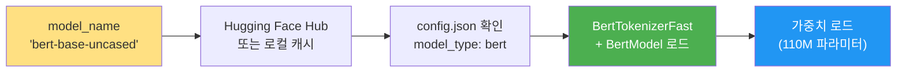
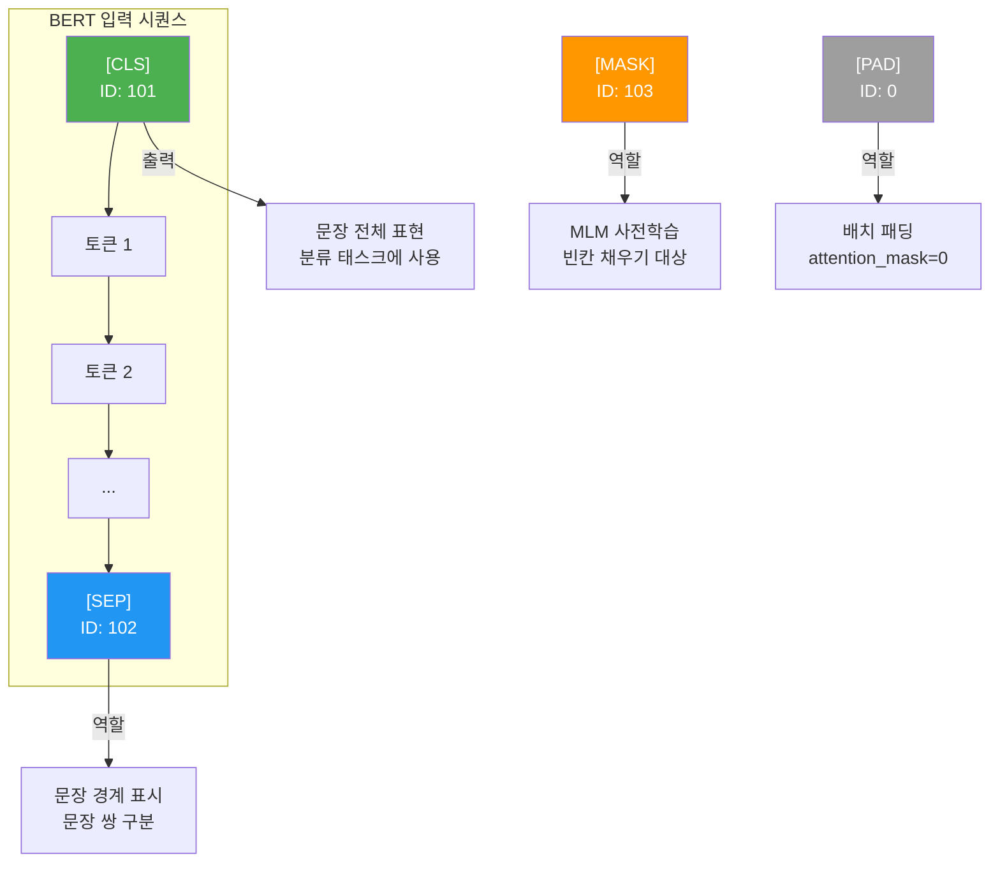
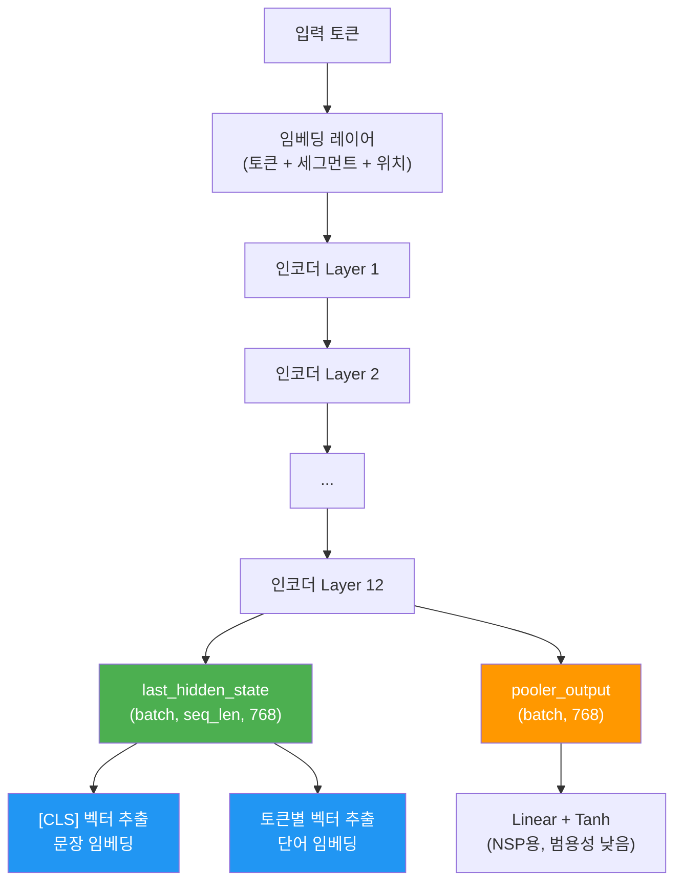
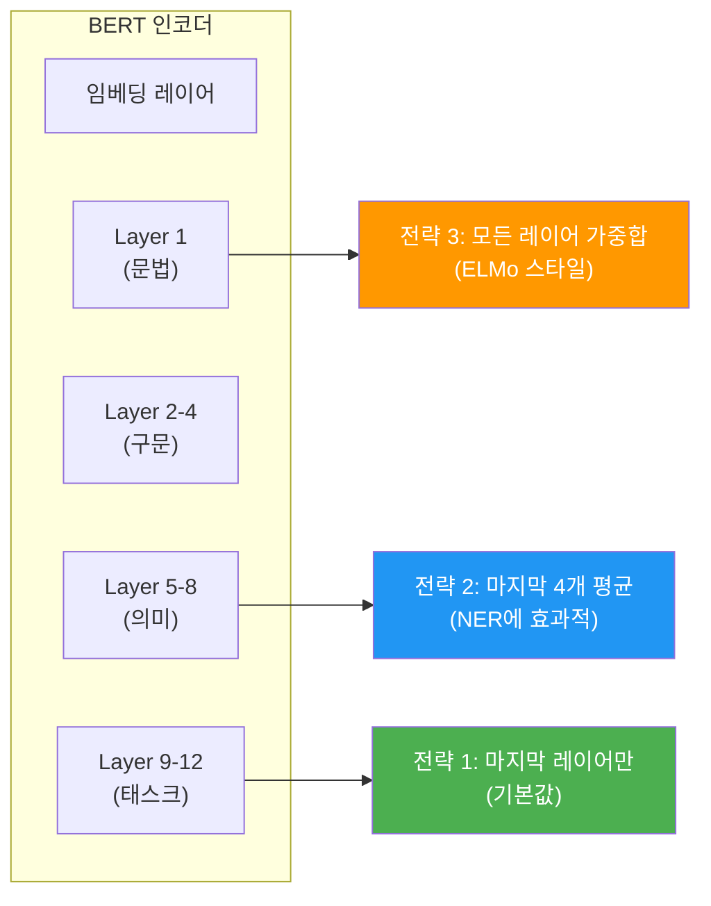

# 05. Hugging Face로 BERT 사용하기

> BERT를 직접 로드하고, 토큰화·추론·임베딩 추출까지 실전 워크플로를 완성합니다.

## 개요

이 섹션에서는 Hugging Face Transformers 라이브러리를 활용해 BERT 모델을 실제로 사용하는 방법을 처음부터 끝까지 다룹니다. 앞서 [BERT의 아키텍처](16-ch16-bert-양방향-사전학습-모델/02-02-bert의-아키텍처와-사전학습.md)와 [다운스트림 태스크](16-ch16-bert-양방향-사전학습-모델/04-04-bert-다운스트림-태스크.md)를 이론적으로 학습했다면, 이제는 코드로 직접 만져볼 차례입니다.

**선수 지식**: BERT의 입력 표현(토큰/세그먼트/위치 임베딩), MLM과 NSP의 개념, 다운스트림 태스크별 헤드 구조
**학습 목표**:
- BERT 모델과 토크나이저를 로드하고 토큰화 과정을 코드로 확인할 수 있다
- fill-mask 추론으로 BERT의 양방향 문맥 이해를 직접 체험할 수 있다
- BERT의 은닉 상태(hidden states)에서 임베딩을 추출하고 활용할 수 있다
- 토큰화 결과를 해석하고 특수 토큰의 역할을 코드로 확인할 수 있다

## 왜 알아야 할까?

BERT가 아무리 혁신적인 모델이라 해도, 실제로 코드에서 사용하지 못하면 이론에 불과합니다. 이 섹션은 앞선 4개 섹션에서 배운 BERT의 이론 — MLM, NSP, 양방향 인코딩, 다운스트림 태스크 — 을 **직접 손으로 확인하는 마무리 실습**입니다.

여기서는 BERT라는 특정 모델에 집중합니다. 토크나이저가 `[CLS]`, `[SEP]`, `[MASK]`를 어떻게 처리하는지, WordPiece 분리가 실제로 어떻게 일어나는지, 12개 레이어의 은닉 상태가 각각 어떤 정보를 담고 있는지를 코드로 확인하는 거죠. Hugging Face의 Auto 클래스나 Pipeline API를 체계적으로 다루는 것은 [Ch18. Hugging Face Transformers 생태계](18-ch18-hugging-face-transformers-생태계/01-01-hugging-face-생태계-개요.md)에서 본격적으로 진행하니, 여기서는 BERT를 빠르게 돌려보는 데 집중하겠습니다.

## 핵심 개념

### 개념 1: BERT 모델 로드하기

> 💡 **비유**: 모델 로드는 **도서관에서 특정 책을 대출하는 것**과 같습니다. 도서관(Hugging Face Hub)에 가서 책 제목(`"bert-base-uncased"`)을 말하면, 사서(Auto 클래스)가 알맞은 책을 찾아서 건네주죠. 한 번 빌린 책은 집(로컬 캐시)에 보관되니 다음에는 도서관에 갈 필요도 없습니다.

Hugging Face Transformers에서 BERT를 로드하는 가장 간단한 방법은 `AutoModel`과 `AutoTokenizer`를 사용하는 것입니다. 모델 이름을 넘기면 내부적으로 `config.json`을 확인하여 BERT에 맞는 클래스(`BertModel`, `BertTokenizerFast`)를 자동으로 선택합니다.

> 📊 **그림 1**: BERT 모델 로드 과정



```run:python
from transformers import AutoModel, AutoTokenizer

# 모델과 토크나이저를 한 쌍으로 로드
model_name = "bert-base-uncased"
tokenizer = AutoTokenizer.from_pretrained(model_name)
model = AutoModel.from_pretrained(model_name)

print(f"모델 타입: {type(model).__name__}")
print(f"토크나이저 타입: {type(tokenizer).__name__}")
print(f"모델 파라미터 수: {sum(p.numel() for p in model.parameters()):,}")
```

```output
모델 타입: BertModel
토크나이저 타입: BertTokenizerFast
모델 파라미터 수: 109,482,240
```

BERT에는 태스크별로 다른 모델 클래스가 있습니다. 각각 인코더 위에 다른 헤드가 부착되어 있죠:

| 모델 클래스 | 용도 | 출력 |
|------------|------|------|
| `AutoModel` | 기본 인코더 (임베딩 추출) | 은닉 상태 |
| `AutoModelForMaskedLM` | 마스크 채우기 (MLM) | 어휘별 로짓 |
| `AutoModelForSequenceClassification` | 시퀀스 분류 | 클래스별 로짓 |
| `AutoModelForTokenClassification` | 토큰 분류 (NER) | 토큰별 로짓 |
| `AutoModelForQuestionAnswering` | 질의응답 | start/end 로짓 |

> Auto 클래스의 내부 동작 원리와 모델 자동 매핑 메커니즘은 [Ch18. Auto 클래스 심화](18-ch18-hugging-face-transformers-생태계/03-03-auto-클래스와-모델-로드.md)에서 체계적으로 다룹니다. 여기서는 BERT를 빠르게 사용하는 데 집중하겠습니다.

### 개념 2: 토큰화 과정 — 텍스트를 숫자로 변환하기

> 💡 **비유**: 토큰화는 **통역사**의 역할입니다. 사람이 하는 말(텍스트)을 기계가 이해하는 언어(숫자 벡터)로 번역해주죠. 그런데 이 통역사는 단순히 단어를 번역하는 것이 아니라, 문장의 시작에 "[CLS]"라는 인사를 붙이고 끝에 "[SEP]"이라는 마침 표시를 붙이는 **프로토콜**도 함께 지켜줍니다.

BERT 토크나이저는 WordPiece 알고리즘을 기반으로 합니다. [서브워드 토크나이제이션](15-ch15-서브워드-토크나이제이션/03-03-wordpiece와-unigram.md)에서 배웠듯이, 자주 등장하는 단어는 그대로 유지하고, 드문 단어는 서브워드 조각으로 분리하는 방식이죠.

> 📊 **그림 2**: BERT 토큰화 파이프라인


토크나이저의 `__call__` 메서드는 이 모든 과정을 한 번에 처리해줍니다:

```run:python
from transformers import AutoTokenizer

tokenizer = AutoTokenizer.from_pretrained("bert-base-uncased")

# 단일 문장 토큰화
text = "Hugging Face makes NLP easy!"
encoded = tokenizer(text, return_tensors="pt")

print("=== 토큰화 결과 ===")
print(f"input_ids:      {encoded['input_ids'].tolist()}")
print(f"token_type_ids: {encoded['token_type_ids'].tolist()}")
print(f"attention_mask: {encoded['attention_mask'].tolist()}")

# 토큰 ID를 다시 문자열로 변환
tokens = tokenizer.convert_ids_to_tokens(encoded['input_ids'][0])
print(f"\n토큰 목록: {tokens}")
print(f"디코딩 결과: {tokenizer.decode(encoded['input_ids'][0], skip_special_tokens=True)}")
```

```output
=== 토큰화 결과 ===
input_ids:      [[101, 17662, 2227, 3084, 17953, 2361, 3733, 999, 102]]
token_type_ids: [[0, 0, 0, 0, 0, 0, 0, 0, 0]]
attention_mask: [[1, 1, 1, 1, 1, 1, 1, 1, 1]]

토큰 목록: ['[CLS]', 'hugging', 'face', 'makes', 'nl', '##p', 'easy', '!', '[SEP]']
디코딩 결과: hugging face makes nlp easy!
```

출력에서 주목할 점이 있습니다. "NLP"가 `nl`과 `##p`로 분리됐죠? `##` 접두사는 "이 토큰은 앞 토큰의 이어지는 조각"이라는 WordPiece의 표시입니다. 또한 `token_type_ids`는 모두 0인데, 이는 단일 문장이기 때문입니다. 문장 쌍을 입력하면 두 번째 문장의 토큰에는 1이 할당됩니다 — [BERT 입력 표현](16-ch16-bert-양방향-사전학습-모델/02-02-bert의-아키텍처와-사전학습.md)에서 배운 세그먼트 임베딩이 바로 이 역할을 하죠.

BERT 토크나이저에서 알아야 할 핵심 특수 토큰들을 정리해보겠습니다:

> 📊 **그림 3**: BERT 특수 토큰의 역할



```python
# 배치 토큰화 — 여러 문장을 동시에 처리
texts = ["BERT is powerful.", "NLP is fun!", "Short."]
batch_encoded = tokenizer(
    texts,
    padding=True,         # 가장 긴 문장에 맞춰 [PAD] 추가
    truncation=True,      # max_length 초과 시 자르기
    max_length=128,       # 최대 토큰 수
    return_tensors="pt"   # PyTorch 텐서로 반환
)

# padding이 적용된 attention_mask 확인
for i, text in enumerate(texts):
    mask = batch_encoded['attention_mask'][i].tolist()
    print(f"'{text}' → 유효 토큰 수: {sum(mask)}, 전체 길이: {len(mask)}")
```

### 개념 3: fill-mask로 MLM 체험하기

> 💡 **비유**: fill-mask는 **빈칸 채우기 시험**입니다. "서울은 한국의 ___이다"라는 문장에서 빈칸에 들어갈 단어를 맞히는 거죠. BERT는 이 빈칸 채우기를 수십억 개의 문장으로 연습했기 때문에, 문맥을 보고 가장 적절한 단어를 높은 확률로 예측합니다.

[BERT의 사전학습](16-ch16-bert-양방향-사전학습-모델/02-02-bert의-아키텍처와-사전학습.md)에서 배운 MLM(Masked Language Modeling)을 `pipeline` API로 간편하게 체험해볼 수 있습니다. BERT가 양방향 문맥을 정말 이해하는지, 코드로 직접 확인하는 거죠:

```run:python
from transformers import pipeline

# fill-mask 파이프라인으로 BERT의 MLM 능력 체험
fill_mask = pipeline("fill-mask", model="bert-base-uncased")

# [MASK] 토큰으로 빈칸 채우기
results = fill_mask("Natural language processing is a field of [MASK] intelligence.")

print("=== [MASK] 예측 결과 ===")
for r in results:
    print(f"  {r['token_str']:>15s}  (확률: {r['score']:.4f})")
```

```output
=== [MASK] 예측 결과 ===
       artificial  (확률: 0.8986)
           human  (확률: 0.0261)
         machine  (확률: 0.0197)
        military  (확률: 0.0065)
        business  (확률: 0.0064)
```

"artificial"이 89%의 확률로 1위를 차지했습니다. BERT가 양방향 문맥 — 앞의 "language processing"과 뒤의 "intelligence" — 을 모두 활용해 정확한 예측을 해냈죠. 이것이 바로 양방향 인코딩의 위력입니다.

한국어 BERT로도 시도해볼 수 있습니다:

```python
# 한국어 BERT로 MLM 체험
fill_mask_ko = pipeline("fill-mask", model="klue/bert-base")
results = fill_mask_ko("서울은 대한민국의 [MASK]이다.")

for r in results[:3]:
    print(f"  {r['token_str']:>10s}  (확률: {r['score']:.4f})")
```

> ⚠️ **흔한 오해**: BERT 기반 모델은 `[MASK]` 토큰을 사용하지만, RoBERTa 같은 모델은 `<mask>` 토큰을 씁니다. `pipeline`이 자동으로 올바른 마스크 토큰을 사용하므로 걱정할 필요는 없지만, `pipeline` 없이 직접 코딩할 때는 주의해야 합니다.

여기서는 BERT의 MLM 능력을 빠르게 확인하는 용도로 `pipeline`을 사용했습니다. 감성 분석, 번역, 요약 등 다양한 태스크에 `pipeline`을 활용하는 방법은 [Ch18. Pipeline API 활용](18-ch18-hugging-face-transformers-생태계/02-02-pipeline-api-활용.md)에서 체계적으로 다룹니다.

### 개념 4: 임베딩 추출 — BERT의 "이해"를 꺼내보기

> 💡 **비유**: BERT 모델은 12층(Base 기준)짜리 건물과 같습니다. 각 층마다 텍스트를 다른 관점에서 분석하죠. 1~4층은 문법과 구문을 파악하고, 5~8층은 의미를 이해하며, 9~12층은 태스크에 특화된 정보를 추출합니다. 임베딩 추출이란 이 건물의 **특정 층에서 분석 결과를 가져오는 것**입니다.

`AutoModel`은 태스크 헤드 없이 순수한 인코더 출력만 반환합니다. 이 출력이 바로 **문맥화된 임베딩(Contextualized Embedding)** — 같은 "bank"라는 단어도 "river bank"와 "bank account"에서 **완전히 다른 벡터**를 갖게 되는 핵심 기능이죠:

> 📊 **그림 4**: BERT 은닉 상태와 임베딩 추출 경로



`AutoModel`의 출력에는 두 가지 핵심 텐서가 있습니다:

- **`last_hidden_state`**: 마지막 인코더 레이어의 출력. 모든 토큰에 대해 768차원(Base 기준) 벡터를 제공. `(batch_size, sequence_length, hidden_size)` 형태
- **`pooler_output`**: `[CLS]` 토큰의 은닉 상태에 Linear + Tanh를 적용한 결과. `(batch_size, hidden_size)` 형태. 단, NSP에 최적화되어 있어 범용 임베딩으로는 부적합

```python
import torch
from transformers import AutoModel, AutoTokenizer

tokenizer = AutoTokenizer.from_pretrained("bert-base-uncased")
model = AutoModel.from_pretrained("bert-base-uncased")
model.eval()  # 추론 모드

# 텍스트 인코딩
text = "BERT creates contextualized embeddings."
inputs = tokenizer(text, return_tensors="pt")

# 추론 (기울기 계산 불필요)
with torch.no_grad():
    outputs = model(**inputs)

# 출력 구조 확인
print(f"last_hidden_state 크기: {outputs.last_hidden_state.shape}")
print(f"pooler_output 크기:     {outputs.pooler_output.shape}")

# [CLS] 토큰 벡터 (문장 표현)
cls_embedding = outputs.last_hidden_state[0, 0, :]  # 첫 번째 토큰
print(f"\n[CLS] 벡터 앞 5개 값: {cls_embedding[:5].tolist()}")

# 각 토큰의 벡터 확인
tokens = tokenizer.convert_ids_to_tokens(inputs['input_ids'][0])
for i, token in enumerate(tokens):
    vec = outputs.last_hidden_state[0, i, :]
    print(f"  {token:>20s} → 벡터 norm: {vec.norm():.4f}")
```

서브워드로 분리된 단어(예: "contextualized" → `context`, `##ual`, `##ized`)의 임베딩은 조각들의 벡터를 평균 내어 원래 단어의 임베딩을 근사할 수 있습니다.

### 개념 5: 다중 레이어 은닉 상태 활용

`output_hidden_states=True`를 설정하면 모든 레이어의 은닉 상태를 가져올 수 있습니다. BERT 원 논문에서도 태스크에 따라 다른 레이어 조합이 효과적이라고 보고했는데, 특히 NER에서는 마지막 4개 레이어를 연결(concatenate)하는 것이 좋다고 알려져 있습니다:

> 📊 **그림 5**: 레이어별 은닉 상태와 조합 전략



```python
import torch
from transformers import AutoModel, AutoTokenizer

tokenizer = AutoTokenizer.from_pretrained("bert-base-uncased")
model = AutoModel.from_pretrained(
    "bert-base-uncased",
    output_hidden_states=True  # 모든 레이어의 출력 반환
)
model.eval()

text = "The bank by the river was steep."
inputs = tokenizer(text, return_tensors="pt")

with torch.no_grad():
    outputs = model(**inputs)

# hidden_states: 13개 텐서 (임베딩 레이어 + 12개 인코더 레이어)
print(f"레이어 수: {len(outputs.hidden_states)}")  # 13
print(f"각 레이어 크기: {outputs.hidden_states[0].shape}")

# 전략 1: 마지막 레이어만 사용 (기본값)
last_layer = outputs.hidden_states[-1]

# 전략 2: 마지막 4개 레이어를 연결 (concat)
last_four = torch.cat(
    [outputs.hidden_states[i] for i in [-4, -3, -2, -1]],
    dim=-1
)  # (1, seq_len, 768*4=3072)

# 전략 3: 마지막 4개 레이어 평균
last_four_avg = torch.stack(
    [outputs.hidden_states[i] for i in [-4, -3, -2, -1]]
).mean(dim=0)  # (1, seq_len, 768)

print(f"마지막 레이어:     {last_layer.shape}")
print(f"마지막 4개 연결:   {last_four.shape}")
print(f"마지막 4개 평균:   {last_four_avg.shape}")
```

## 실습: 직접 해보기

이제 배운 내용을 종합하여, BERT 임베딩을 추출하고 **문장 유사도를 계산**하는 실습을 해보겠습니다:

```python
import torch
import torch.nn.functional as F
from transformers import AutoModel, AutoTokenizer

# ========================================
# 1. 모델과 토크나이저 로드
# ========================================
model_name = "bert-base-uncased"
tokenizer = AutoTokenizer.from_pretrained(model_name)
model = AutoModel.from_pretrained(model_name)
model.eval()

# ========================================
# 2. 문장 임베딩 추출 함수
# ========================================
def get_sentence_embedding(text, strategy="cls"):
    """
    BERT에서 문장 임베딩을 추출합니다.
    
    Args:
        text: 입력 문장
        strategy: "cls" (CLS 토큰) 또는 "mean" (평균 풀링)
    
    Returns:
        문장 임베딩 벡터 (768차원)
    """
    inputs = tokenizer(text, return_tensors="pt", truncation=True, max_length=512)
    
    with torch.no_grad():
        outputs = model(**inputs)
    
    if strategy == "cls":
        # [CLS] 토큰의 은닉 상태
        embedding = outputs.last_hidden_state[0, 0, :]
    elif strategy == "mean":
        # 모든 토큰의 평균 (패딩 토큰 제외)
        attention_mask = inputs['attention_mask'][0]
        token_embeddings = outputs.last_hidden_state[0]
        # 마스크를 확장하여 패딩 토큰을 0으로 만듦
        mask_expanded = attention_mask.unsqueeze(-1).expand(token_embeddings.size())
        sum_embeddings = (token_embeddings * mask_expanded).sum(dim=0)
        embedding = sum_embeddings / attention_mask.sum()
    
    return embedding

# ========================================
# 3. 문장 유사도 비교
# ========================================
sentences = [
    "The cat sat on the mat.",
    "A kitten was sitting on a rug.",
    "Dogs are loyal animals.",
    "Python is a programming language.",
]

# 모든 문장의 임베딩 추출
embeddings = [get_sentence_embedding(s, strategy="mean") for s in sentences]
embeddings = torch.stack(embeddings)

# 코사인 유사도 행렬 계산
similarity_matrix = F.cosine_similarity(
    embeddings.unsqueeze(0),  # (1, 4, 768)
    embeddings.unsqueeze(1),  # (4, 1, 768)
    dim=-1
)

# 결과 출력
print("=== 문장 유사도 행렬 ===")
print(f"{'':>5}", end="")
for i in range(len(sentences)):
    print(f"  S{i+1}  ", end="")
print()

for i in range(len(sentences)):
    print(f"S{i+1}  ", end="")
    for j in range(len(sentences)):
        print(f" {similarity_matrix[i][j]:.3f}", end=" ")
    print(f"  ← {sentences[i][:30]}...")

# ========================================
# 4. 가장 유사한 문장 쌍 찾기
# ========================================
print("\n=== 가장 유사한 문장 쌍 ===")
# 대각선(자기 자신)을 제외한 최대 유사도
mask = ~torch.eye(len(sentences), dtype=torch.bool)
masked_sim = similarity_matrix * mask.float()
max_idx = masked_sim.argmax()
i, j = max_idx // len(sentences), max_idx % len(sentences)
print(f"S{i.item()+1} ↔ S{j.item()+1}: {masked_sim[i][j]:.4f}")
print(f"  '{sentences[i.item()]}'")
print(f"  '{sentences[j.item()]}'")
```

## 더 깊이 알아보기

### Hugging Face의 탄생 — 챗봇에서 AI 허브로

Hugging Face는 2016년 뉴욕에서 Clément Delangue와 Julien Chaumond가 설립한 회사입니다. 처음에는 10대를 위한 **AI 챗봇 앱**을 만들었는데, 이 회사가 지금의 AI 생태계를 지배하는 "GitHub of AI"가 될 줄은 아무도 몰랐죠.

전환점은 2018년이었습니다. Thomas Wolf가 합류하면서 BERT와 GPT-2의 PyTorch 구현을 오픈소스로 공개했는데, 이것이 바로 `pytorch-pretrained-bert` — 지금의 Transformers 라이브러리의 전신입니다. 당시 BERT를 사용하려면 Google의 TensorFlow 코드를 직접 다뤄야 했는데, Hugging Face가 PyTorch 버전을 깔끔한 API로 제공하면서 커뮤니티에서 폭발적인 인기를 얻었습니다.

`from_pretrained()`라는 간결한 인터페이스는 Thomas Wolf의 핵심 설계 철학을 반영합니다. 그는 "연구자들이 모델을 실험하는 데 3일이 아닌 3분이 걸려야 한다"고 믿었거든요.

> 💡 **알고 계셨나요?**: 회사 이름 "Hugging Face"와 로고 🤗는 원래 챗봇 앱의 이름이었습니다. 포옹하는 이모지가 친근한 AI를 상징했는데, 피봇 후에도 브랜드가 너무 유명해져서 그대로 유지하게 됐죠. 2025년 기준 Hugging Face Hub에는 100만 개 이상의 모델이 등록되어 있습니다.

### `pooler_output`의 함정

BERT의 `pooler_output`은 `[CLS]` 토큰에 추가적인 Linear + Tanh 변환을 적용한 결과입니다. 이 레이어는 NSP(Next Sentence Prediction) 태스크를 위해 사전학습된 것인데, NSP 자체가 유용하지 않다는 것이 [RoBERTa 논문에서 밝혀졌기](16-ch16-bert-양방향-사전학습-모델/03-03-bert-변형-모델들.md) 때문에, `pooler_output`보다는 `last_hidden_state[0, 0, :]`를 직접 사용하거나, 모든 토큰의 평균(mean pooling)을 취하는 것이 문장 임베딩으로서 더 나은 결과를 줍니다.

## 흔한 오해와 팁

> ⚠️ **흔한 오해**: "BERT의 `pooler_output`이 곧 최적의 문장 임베딩이다." — 사실 `pooler_output`은 NSP 태스크에 최적화된 변환이 적용되어 있어서, 범용 문장 임베딩으로는 평균 풀링(mean pooling)이 더 효과적입니다. 전용 문장 임베딩이 필요하다면 Sentence-BERT(SBERT)를 사용하세요.

> 💡 **알고 계셨나요?**: `AutoTokenizer.from_pretrained()`은 기본적으로 **Fast 토크나이저**를 반환합니다. Fast 토크나이저는 Rust로 구현되어 Python 버전보다 최대 10~20배 빠릅니다. `word_ids()`, `char_to_token()` 같은 오프셋 매핑 기능도 Fast 토크나이저에서만 제공됩니다.

> 🔥 **실무 팁**: 추론 시에는 반드시 `model.eval()`과 `torch.no_grad()` 컨텍스트를 함께 사용하세요. `eval()`은 Dropout과 BatchNorm을 비활성화하고, `no_grad()`는 기울기 계산을 건너뛰어 메모리를 절약합니다. 이 두 가지를 빠뜨리면 동일한 입력에서도 다른 결과가 나올 수 있습니다.

> 🔥 **실무 팁**: 모델을 처음 로드할 때 Hugging Face Hub에서 가중치를 다운로드하므로 시간이 걸릴 수 있습니다. 이후에는 로컬 캐시(`~/.cache/huggingface/`)에서 로드되어 빠릅니다. 오프라인 환경에서는 `TRANSFORMERS_OFFLINE=1` 환경 변수를 설정하면 캐시만 사용합니다.

## 핵심 정리

| 개념 | 설명 |
|------|------|
| 모델 로드 | `AutoModel.from_pretrained("bert-base-uncased")`로 BERT 인코더 로드 |
| 토크나이저 | WordPiece 기반. `[CLS]`, `[SEP]` 자동 추가, `##` 서브워드 분리 |
| `last_hidden_state` | 마지막 인코더 레이어의 출력. `(batch, seq_len, 768)` 형태 |
| `pooler_output` | `[CLS]` + Linear + Tanh. NSP용으로 사전학습되어 범용성은 떨어짐 |
| fill-mask | `pipeline("fill-mask")`로 BERT의 MLM 능력을 간편하게 체험 |
| Mean Pooling | 모든 토큰 벡터의 평균. 범용 문장 임베딩으로 `pooler_output`보다 효과적 |
| `output_hidden_states` | 모든 레이어의 은닉 상태를 반환. 13개 텐서 (임베딩 + 12 레이어) |
| 레이어 조합 전략 | 마지막 레이어만 / 마지막 4개 연결 / 가중합 등 태스크에 따라 선택 |

## 다음 섹션 미리보기

이것으로 BERT 챕터가 마무리됩니다! BERT의 패러다임, 아키텍처, 변형 모델, 다운스트림 태스크, 그리고 실전 사용법까지 한 바퀴 돌았습니다. 다음 챕터 [Ch17. GPT: 생성적 사전학습 모델](17-ch17-gpt-생성적-사전학습-모델/01-01-자기회귀-언어-모델링.md)에서는 BERT와 대비되는 **자기회귀(Autoregressive)** 방식의 디코더 전용 모델인 GPT를 만나봅니다. BERT가 "빈칸 채우기의 달인"이었다면, GPT는 "이야기를 이어가는 작가"에 가깝습니다. 양방향 인코더(BERT)와 단방향 디코더(GPT), 이 두 갈래가 현대 LLM의 근간을 이루고 있죠.

## 참고 자료

- [Hugging Face Transformers 공식 문서 — BERT](https://huggingface.co/docs/transformers/en/model_doc/bert) - BERT 모델의 모든 클래스와 메서드를 상세히 문서화
- [Hugging Face Transformers Quickstart](https://huggingface.co/docs/transformers/en/quicktour) - pipeline과 Auto 클래스의 기초 사용법을 빠르게 익히는 공식 가이드
- [A Visual Guide to Using BERT for the First Time (Jay Alammar)](https://jalammar.github.io/a-visual-guide-to-using-bert-for-the-first-time/) - DistilBERT를 활용한 문장 분류 실습을 시각적으로 설명하는 튜토리얼
- [Hugging Face Fill-Mask Task](https://huggingface.co/tasks/fill-mask) - fill-mask 태스크의 개념 설명과 모델 비교

---
### 🔗 Related Sessions
- [mlm](16-ch16-bert-양방향-사전학습-모델/02-02-bert의-아키텍처와-사전학습.md) (prerequisite)
- [nsp](16-ch16-bert-양방향-사전학습-모델/02-02-bert의-아키텍처와-사전학습.md) (prerequisite)
- [bert_input_representation](16-ch16-bert-양방향-사전학습-모델/02-02-bert의-아키텍처와-사전학습.md) (prerequisite)
- [cls_token](16-ch16-bert-양방향-사전학습-모델/02-02-bert의-아키텍처와-사전학습.md) (prerequisite)
- [sep_token](16-ch16-bert-양방향-사전학습-모델/02-02-bert의-아키텍처와-사전학습.md) (prerequisite)
- [mask_token](16-ch16-bert-양방향-사전학습-모델/02-02-bert의-아키텍처와-사전학습.md) (prerequisite)
- [downstream_task](16-ch16-bert-양방향-사전학습-모델/04-04-bert-다운스트림-태스크.md) (prerequisite)
- [sequence_classification_head](16-ch16-bert-양방향-사전학습-모델/04-04-bert-다운스트림-태스크.md) (prerequisite)
- [roberta](16-ch16-bert-양방향-사전학습-모델/03-03-bert-변형-모델들.md) (prerequisite)
- [distilbert](16-ch16-bert-양방향-사전학습-모델/03-03-bert-변형-모델들.md) (prerequisite)
