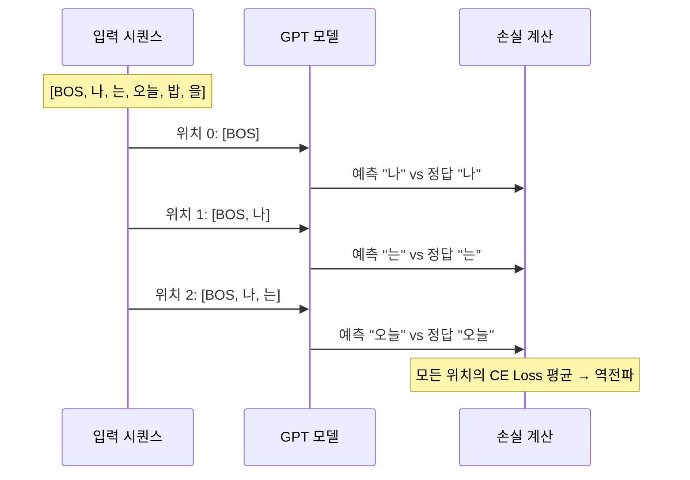
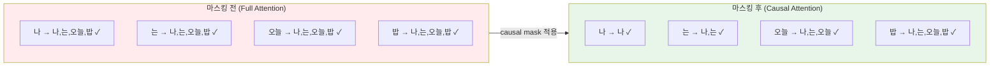
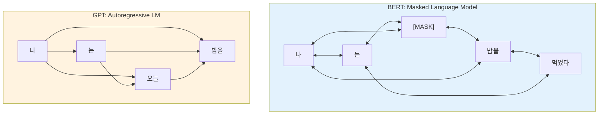
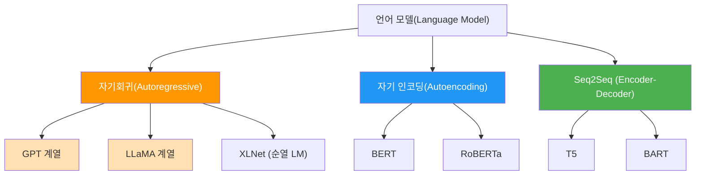

# 자기회귀 언어 모델링

> GPT의 핵심 원리 — 이전 토큰들로 다음 토큰을 예측하는 자기회귀(Autoregressive) 방식의 언어 모델링을 깊이 있게 이해합니다.

## 개요

이 섹션에서는 GPT 계열 모델의 근간이 되는 **자기회귀 언어 모델링(Autoregressive Language Modeling)**을 다룹니다. 단순히 "다음 단어 예측"이라는 직관적 설명을 넘어, 조건부 확률의 연쇄 법칙(chain rule)이 어떻게 언어 생성으로 이어지는지, 인과적 마스킹(causal masking)이 왜 필수인지, 그리고 이 구조가 실제 코드에서 어떻게 구현되는지까지 완전히 파헤칩니다.

**선수 지식**: 트랜스포머 아키텍처의 셀프 어텐션 메커니즘, 소프트맥스 함수, 임베딩 개념
**학습 목표**:
- 자기회귀 모델의 수학적 정의와 확률적 기반을 정확히 이해한다
- 인과적 마스킹의 원리와 구현 방법을 코드 레벨에서 파악한다
- 양방향(BERT) vs 단방향(GPT) 어텐션의 구조적 차이와 트레이드오프를 분석한다
- MiniGPT를 직접 구현하여 자기회귀 생성 파이프라인을 완성한다

## 왜 알아야 할까?

GPT-4, Claude, Gemini — 우리가 매일 사용하는 대형 언어 모델의 **생성 능력**은 모두 자기회귀 언어 모델링에서 출발합니다. ChatGPT가 유창한 문장을 한 토큰씩 스트리밍하는 그 순간, 내부에서는 자기회귀 확률 분포에서 반복 샘플링이 일어나고 있죠.

이 개념을 제대로 이해하지 않으면, temperature·top-k·top-p 같은 디코딩 파라미터가 왜 존재하는지, 왜 LLM이 "환각(hallucination)"을 일으키는지, 왜 프롬프트 엔지니어링이 효과적인지 — 이런 실전 질문에 답할 수 없습니다.

> 📊 **그림 1**: 자기회귀 모델의 순차적 예측 흐름


각 화살표 위의 조건부 확률 — 이것이 자기회귀 모델이 매 스텝마다 계산하는 것입니다. 모델은 **왼쪽에서 오른쪽으로만** 정보를 참조하면서, 한 번에 하나의 토큰을 생성합니다.

## 핵심 개념

### 개념 1: 자기회귀 분해 — 확률의 연쇄 법칙

> 💡 **비유**: 소설가가 원고를 쓴다고 상상해보세요. 이미 쓴 문장들을 다시 읽으면서 다음 문장을 정합니다. 미래에 쓸 내용을 미리 참고할 수는 없죠 — 아직 쓰지 않았으니까요. 자기회귀 모델도 정확히 이렇게 동작합니다.

언어 모델의 핵심 목표는 토큰 시퀀스 $x_1, x_2, \ldots, x_T$의 결합 확률(joint probability)을 추정하는 것입니다. 자기회귀 모델은 이를 **확률의 연쇄 법칙**으로 분해합니다:

$$P(x_1, x_2, \ldots, x_T) = \prod_{t=1}^{T} P(x_t \mid x_1, x_2, \ldots, x_{t-1})$$

- $x_t$: 시점 $t$의 토큰
- $x_{<t} = (x_1, \ldots, x_{t-1})$: 시점 $t$ 이전까지의 모든 토큰 (컨텍스트)
- $P(x_t \mid x_{<t})$: 컨텍스트가 주어졌을 때 다음 토큰의 조건부 확률

이 분해가 의미하는 바는 명확합니다 — 전체 시퀀스의 확률을 한 번에 계산하는 대신, **각 위치에서 "지금까지의 맥락을 고려한 다음 토큰 확률"을 순차적으로 곱합니다.**

중요한 점은 이 분해 자체에는 어떤 근사(approximation)도 없다는 것입니다. 확률의 연쇄 법칙은 수학적 항등식이니까요. 근사가 발생하는 지점은 각 조건부 확률 $P(x_t \mid x_{<t})$를 **신경망으로 파라미터화**할 때입니다.

```run:python
import numpy as np

# 자기회귀 분해 시뮬레이션
# 각 토큰의 조건부 확률이 주어졌을 때, 전체 시퀀스 확률 계산

sentence = ["나", "는", "오늘", "밥", "을", "먹었다"]
# 가상의 조건부 확률 (실제로는 모델이 출력)
cond_probs = [0.05, 0.72, 0.15, 0.31, 0.68, 0.22]

print("=== 자기회귀 확률 분해 ===\n")
joint_prob = 1.0
log_prob_sum = 0.0

for i, (token, prob) in enumerate(zip(sentence, cond_probs)):
    context = " ".join(sentence[:i]) if i > 0 else "<BOS>"
    joint_prob *= prob
    log_prob_sum += np.log(prob)
    print(f"P({token} | {context}) = {prob:.4f}")

print(f"\n결합 확률 P(문장) = {joint_prob:.8f}")
print(f"로그 확률 합 = {log_prob_sum:.4f}")
print(f"퍼플렉시티 = {np.exp(-log_prob_sum / len(sentence)):.2f}")
```

```output
=== 자기회귀 확률 분해 ===

P(나 | <BOS>) = 0.0500
P(는 | 나) = 0.7200
P(오늘 | 나 는) = 0.1500
P(밥 | 나 는 오늘) = 0.3100
P(을 | 나 는 오늘 밥) = 0.6800
P(먹었다 | 나 는 오늘 밥 을) = 0.2200

결합 확률 P(문장) = 0.00011215
로그 확률 합 = -9.0950
퍼플렉시티 = 4.56
```

여기서 **퍼플렉시티(Perplexity)**가 등장합니다. 이것은 모델이 각 토큰을 예측할 때 평균적으로 몇 개의 선택지를 놓고 고민하는지를 나타내는 지표인데요, 값이 낮을수록 모델이 확신을 가지고 예측한다는 뜻이죠. 4.56라는 것은 평균적으로 약 4~5개 후보 중 하나를 고르는 수준의 불확실성을 의미합니다.

### 개념 2: 학습 목표 — Cross-Entropy Loss와 Teacher Forcing

> 💡 **비유**: 자기회귀 모델의 학습은 빈칸 채우기 시험과 비슷합니다. 다만 일반 빈칸 채우기는 문장 중간 어디든 빈칸이 될 수 있지만, 자기회귀 학습은 항상 **"오른쪽 끝이 빈칸"**인 시험을 매 위치마다 치르는 셈입니다.

학습 시 최소화할 손실 함수는 **Cross-Entropy Loss**입니다:

$$\mathcal{L} = -\frac{1}{T} \sum_{t=1}^{T} \log P_\theta(x_t \mid x_{<t})$$

이것은 결국 **네거티브 로그 우도(Negative Log-Likelihood, NLL)**와 동일하며, 이를 최소화하는 것은 모델이 학습 데이터의 확률을 최대화하는 것(Maximum Likelihood Estimation)과 같습니다.

> 📊 **그림 2**: Teacher Forcing을 사용한 자기회귀 학습 과정



핵심은 **Teacher Forcing**이라는 기법입니다. 추론(inference) 때는 모델이 자신이 생성한 토큰을 다음 입력으로 사용하지만, 학습 때는 **항상 정답 토큰을 다음 입력으로 제공**합니다. 왜 그럴까요?

만약 학습 중에도 모델 자신의 예측을 사용한다면, 초기의 부정확한 예측이 이후 모든 예측에 연쇄적으로 영향을 주어 학습이 극도로 불안정해집니다. 이를 **노출 편향(exposure bias)**이라 부르며, Teacher Forcing은 이 문제를 우회하는 실용적 해법입니다.

그런데 여기서 중요한 효율성 트릭이 있습니다. 위 시퀀스 다이어그램을 보면 마치 각 위치를 순차적으로 처리하는 것 같지만, 실제로는 **인과적 마스킹 덕분에 모든 위치를 한 번의 forward pass로 병렬 처리**할 수 있습니다. 이것이 바로 다음에 다룰 핵심 개념입니다.

### 개념 3: 인과적 마스킹 — 미래를 가리는 기술

> 💡 **비유**: 시험지를 생각해보세요. 5번 문제를 풀 때 6번, 7번 답을 미리 볼 수 있다면 공정하지 않겠죠? 인과적 마스크는 각 위치에서 **자기 뒤에 오는 정보를 차단하는 가림막**입니다.

트랜스포머의 셀프 어텐션은 원래 모든 위치가 모든 위치를 참조할 수 있습니다. 하지만 자기회귀 모델에서는 **시점 $t$의 토큰이 시점 $t+1$ 이후의 토큰을 참조하면 안 됩니다** — 아직 생성되지 않은 미래 정보니까요.

이를 강제하는 것이 **인과적 마스크(Causal Mask)**, 또는 look-ahead mask입니다. 어텐션 스코어 행렬에서 **상삼각 부분을 $-\infty$로 설정**하여, 소프트맥스를 통과하면 해당 위치의 가중치가 0이 되게 만듭니다.

$$\text{Attention}(Q, K, V) = \text{softmax}\left(\frac{QK^T}{\sqrt{d_k}} + M\right)V$$

여기서 마스크 $M$은:

$$M_{ij} = \begin{cases} 0 & \text{if } i \geq j \\ -\infty & \text{if } i < j \end{cases}$$

> 📊 **그림 3**: 인과적 마스킹 전후의 어텐션 패턴 비교



```run:python
import numpy as np

def create_causal_mask(seq_len):
    """인과적 마스크 생성 — 상삼각을 -inf로 채움"""
    mask = np.zeros((seq_len, seq_len))
    for i in range(seq_len):
        for j in range(seq_len):
            if j > i:  # 미래 위치
                mask[i][j] = float('-inf')
    return mask

def softmax(x, axis=-1):
    """수치적으로 안정적인 소프트맥스"""
    e_x = np.exp(x - np.max(x, axis=axis, keepdims=True))
    return e_x / e_x.sum(axis=axis, keepdims=True)

# 4개 토큰 시퀀스에 대한 인과적 마스킹 시뮬레이션
tokens = ["나", "는", "오늘", "밥"]
seq_len = len(tokens)

# 랜덤 어텐션 스코어 (Q·K^T / sqrt(d_k))
np.random.seed(42)
attn_scores = np.random.randn(seq_len, seq_len) * 0.5

# 마스크 적용 전후 비교
mask = create_causal_mask(seq_len)
masked_scores = attn_scores + mask

print("=== 인과적 마스크 ===")
print(mask.astype(int))
print(f"\n(0 = 참조 가능, -inf = 차단)\n")

# 소프트맥스 적용
attn_weights = softmax(masked_scores)
print("=== 마스킹 후 어텐션 가중치 ===")
for i, tok in enumerate(tokens):
    weights_str = "  ".join(f"{tokens[j]}:{attn_weights[i][j]:.3f}" for j in range(seq_len))
    print(f"{tok}: [{weights_str}]")
```

```output
=== 인과적 마스크 ===
[[  0-inf-inf-inf]
 [  0   0-inf-inf]
 [  0   0   0-inf]
 [  0   0   0   0]]

(0 = 참조 가능, -inf = 차단)

=== 마스킹 후 어텐션 가중치 ===
나: [나:1.000  는:0.000  오늘:0.000  밥:0.000]
는: [나:0.414  는:0.586  오늘:0.000  밥:0.000]
오늘: [나:0.259  는:0.468  오늘:0.273  밥:0.000]
밥: [나:0.208  는:0.249  오늘:0.360  밥:0.183]
```

결과를 보면 패턴이 명확합니다 — "나"는 자기 자신만 참조하고, "는"은 "나"와 자기 자신만, "오늘"은 앞의 세 토큰만 참조합니다. 미래 토큰의 가중치는 정확히 0.000이죠. 이 **하삼각(lower-triangular) 패턴**이 인과적 어텐션의 핵심입니다.

> ⚠️ **흔한 오해**: "마스크를 0으로 설정하면 되는 거 아닌가요?" — 아닙니다! 어텐션 **스코어**(소프트맥스 입력)를 0으로 두면, 소프트맥스 후에도 여전히 양수 가중치가 남습니다. 반드시 $-\infty$(실제 구현에서는 `-1e9` 같은 매우 큰 음수)로 설정해야 소프트맥스 후 0이 됩니다.

### 개념 4: BERT vs GPT — 양방향 vs 단방향 어텐션의 트레이드오프

같은 트랜스포머 아키텍처에서 출발했지만, BERT와 GPT는 어텐션 마스킹 전략에서 갈라집니다. 이 선택이 모델의 능력과 한계를 결정짓는데요.

> 📊 **그림 4**: BERT(양방향) vs GPT(단방향) 어텐션 패턴



| 비교 항목 | BERT (양방향) | GPT (단방향) |
|-----------|-------------|-------------|
| **어텐션** | 모든 토큰이 모든 토큰 참조 | 왼쪽 → 오른쪽만 참조 |
| **학습 목표** | 마스킹된 토큰 복원 (15%) | 다음 토큰 예측 (100%) |
| **학습 신호 효율** | 입력의 15%만 손실 계산 | 모든 위치에서 손실 계산 |
| **강점** | 이해(NLU): 분류, QA, NER | 생성(NLG): 텍스트 생성, 대화 |
| **약점** | 자유 형식 텍스트 생성 어려움 | 빈칸 채우기 능력 떨어짐 |
| **대표 모델** | BERT, RoBERTa, ELECTRA | GPT-1/2/3/4, LLaMA |

왜 GPT가 생성에 유리할까요? 학습 과정 자체가 "이전 토큰들 → 다음 토큰"이라는 생성 패턴과 완벽히 일치하기 때문입니다. 반면 BERT는 문맥의 양쪽을 모두 보기 때문에 의미 이해에는 뛰어나지만, 왼쪽에서 오른쪽으로 순차 생성하는 것은 학습 방식과 맞지 않죠.

> 💡 **알고 계셨나요?**: GPT의 학습 신호 효율이 BERT보다 훨씬 높습니다. BERT는 입력 토큰의 15%만 마스킹하므로 한 배치에서 15%의 위치만 손실에 기여합니다. 반면 GPT는 **매 위치가 모두 다음 토큰 예측 문제**이므로 100%의 위치에서 학습 신호를 받습니다. 이것이 GPT 계열이 대규모 학습에서 효율적인 이유 중 하나입니다.

### 개념 5: 자기회귀 모델의 분류 체계

자기회귀 모델링은 GPT만의 전유물이 아닙니다. 더 넓은 시각에서 언어 모델의 분류 체계를 살펴보겠습니다.

> 📊 **그림 5**: 언어 모델 분류 — 자기회귀 모델의 위치



여기서 흥미로운 모델이 **XLNet**입니다. 순열 언어 모델링(Permutation LM)이라는 기법으로, 자기회귀의 장점(밀도 추정, 생성 능력)과 양방향 컨텍스트의 장점을 모두 취하려 했죠. 하지만 결국 스케일링 측면에서 순수 자기회귀 방식의 GPT 계열이 승리했습니다 — 단순함이 스케일링의 동반자라는 교훈을 남기며.

## 실습: MiniGPT 직접 구현하기

이론을 코드로 옮겨봅시다. PyTorch를 사용해 인과적 셀프 어텐션부터 자기회귀 텍스트 생성까지 완전한 MiniGPT를 구현합니다.

```python
import torch
import torch.nn as nn
import torch.nn.functional as F
import math

class CausalSelfAttention(nn.Module):
    """인과적 셀프 어텐션 — GPT의 핵심 빌딩 블록"""
    
    def __init__(self, d_model, n_heads, max_seq_len=512, dropout=0.1):
        super().__init__()
        assert d_model % n_heads == 0, "d_model은 n_heads로 나누어떨어져야 합니다"
        
        self.n_heads = n_heads
        self.d_head = d_model // n_heads
        
        # Q, K, V를 하나의 선형 변환으로 통합 (효율성)
        self.qkv_proj = nn.Linear(d_model, 3 * d_model)
        self.out_proj = nn.Linear(d_model, d_model)
        self.dropout = nn.Dropout(dropout)
        
        # 인과적 마스크를 버퍼로 등록 (학습 파라미터 아님)
        causal_mask = torch.triu(
            torch.ones(max_seq_len, max_seq_len) * float('-inf'),
            diagonal=1  # 상삼각 부분을 -inf로
        )
        self.register_buffer('causal_mask', causal_mask)
    
    def forward(self, x):
        B, T, C = x.shape  # 배치, 시퀀스 길이, 차원
        
        # Q, K, V 한 번에 계산 후 분리
        qkv = self.qkv_proj(x).reshape(B, T, 3, self.n_heads, self.d_head)
        qkv = qkv.permute(2, 0, 3, 1, 4)  # (3, B, n_heads, T, d_head)
        q, k, v = qkv[0], qkv[1], qkv[2]
        
        # 스케일드 닷-프로덕트 어텐션 + 인과적 마스크
        scale = math.sqrt(self.d_head)
        attn_scores = (q @ k.transpose(-2, -1)) / scale  # (B, n_heads, T, T)
        attn_scores = attn_scores + self.causal_mask[:T, :T]  # 마스크 적용
        
        attn_weights = F.softmax(attn_scores, dim=-1)
        attn_weights = self.dropout(attn_weights)
        
        # 가중합
        out = attn_weights @ v  # (B, n_heads, T, d_head)
        out = out.transpose(1, 2).reshape(B, T, C)  # 헤드 결합
        return self.out_proj(out)


class MiniGPTBlock(nn.Module):
    """GPT 트랜스포머 블록 — Pre-LayerNorm 구조"""
    
    def __init__(self, d_model, n_heads, dropout=0.1):
        super().__init__()
        self.ln1 = nn.LayerNorm(d_model)
        self.attn = CausalSelfAttention(d_model, n_heads, dropout=dropout)
        self.ln2 = nn.LayerNorm(d_model)
        # FFN: 4배 확장 후 축소 (GPT 관행)
        self.ffn = nn.Sequential(
            nn.Linear(d_model, 4 * d_model),
            nn.GELU(),  # GPT-2부터 GELU 활성화 사용
            nn.Linear(4 * d_model, d_model),
            nn.Dropout(dropout),
        )
    
    def forward(self, x):
        # Pre-LN 잔차 연결: LN → Attention → Add → LN → FFN → Add
        x = x + self.attn(self.ln1(x))
        x = x + self.ffn(self.ln2(x))
        return x


class MiniGPT(nn.Module):
    """최소한의 GPT 모델 — 학습과 자기회귀 생성 모두 지원"""
    
    def __init__(self, vocab_size, d_model=256, n_heads=4, n_layers=4,
                 max_seq_len=512, dropout=0.1):
        super().__init__()
        self.max_seq_len = max_seq_len
        
        # 토큰 임베딩 + 위치 임베딩 (학습 가능)
        self.token_emb = nn.Embedding(vocab_size, d_model)
        self.pos_emb = nn.Embedding(max_seq_len, d_model)
        self.drop = nn.Dropout(dropout)
        
        # 트랜스포머 블록 스택
        self.blocks = nn.ModuleList([
            MiniGPTBlock(d_model, n_heads, dropout) for _ in range(n_layers)
        ])
        
        # 최종 LayerNorm + 출력 헤드
        self.ln_f = nn.LayerNorm(d_model)
        self.head = nn.Linear(d_model, vocab_size, bias=False)
        
        # 가중치 공유: 토큰 임베딩 = 출력 헤드 (weight tying)
        self.head.weight = self.token_emb.weight
        
        # 파라미터 수 출력
        n_params = sum(p.numel() for p in self.parameters())
        print(f"MiniGPT: {n_params/1e6:.2f}M 파라미터")
    
    def forward(self, idx, targets=None):
        B, T = idx.shape
        assert T <= self.max_seq_len, f"시퀀스 길이 {T}가 최대 {self.max_seq_len} 초과"
        
        # 토큰 + 위치 임베딩
        pos = torch.arange(T, device=idx.device)
        x = self.drop(self.token_emb(idx) + self.pos_emb(pos))
        
        # 트랜스포머 블록 통과
        for block in self.blocks:
            x = block(x)
        
        # 출력 로짓
        logits = self.head(self.ln_f(x))  # (B, T, vocab_size)
        
        # 손실 계산 (targets가 있을 때만)
        loss = None
        if targets is not None:
            # logits[:, :-1]의 예측이 targets[:, 1:]과 매칭
            loss = F.cross_entropy(
                logits[:, :-1].reshape(-1, logits.size(-1)),
                targets[:, 1:].reshape(-1)
            )
        
        return logits, loss
    
    @torch.no_grad()
    def generate(self, idx, max_new_tokens, temperature=1.0, top_k=None):
        """자기회귀 텍스트 생성 — 한 토큰씩 순차 생성"""
        for _ in range(max_new_tokens):
            # 컨텍스트 윈도우 제한
            idx_cond = idx[:, -self.max_seq_len:]
            
            # Forward pass → 마지막 위치의 로짓만 사용
            logits, _ = self(idx_cond)
            logits = logits[:, -1, :] / temperature  # 온도 스케일링
            
            # Top-k 필터링 (선택)
            if top_k is not None:
                v, _ = torch.topk(logits, min(top_k, logits.size(-1)))
                logits[logits < v[:, [-1]]] = float('-inf')
            
            # 확률 분포에서 샘플링
            probs = F.softmax(logits, dim=-1)
            next_token = torch.multinomial(probs, num_samples=1)
            
            # 생성된 토큰을 시퀀스에 추가
            idx = torch.cat([idx, next_token], dim=1)
        
        return idx


# === 모델 생성 및 동작 확인 ===
vocab_size = 10000
model = MiniGPT(vocab_size=vocab_size, d_model=256, n_heads=4, n_layers=4)

# 더미 입력으로 학습 forward pass 테스트
dummy_input = torch.randint(0, vocab_size, (2, 32))  # 배치 2, 길이 32
logits, loss = model(dummy_input, targets=dummy_input)
print(f"\n출력 로짓 형상: {logits.shape}")
print(f"Cross-Entropy Loss: {loss.item():.4f}")
print(f"이론적 랜덤 CE Loss: {math.log(vocab_size):.4f}")  # -log(1/V)

# 자기회귀 생성 테스트
prompt = torch.randint(0, vocab_size, (1, 5))  # 시작 토큰 5개
generated = model.generate(prompt, max_new_tokens=10, temperature=0.8, top_k=50)
print(f"\n입력 길이: {prompt.shape[1]} → 생성 후: {generated.shape[1]}")
```

코드의 핵심 포인트들을 짚어보겠습니다:

1. **`register_buffer`로 마스크 등록**: 마스크는 학습 파라미터가 아니지만, 모델과 함께 GPU로 이동해야 합니다. `register_buffer`가 이를 보장합니다.

2. **Weight Tying**: 토큰 임베딩과 출력 헤드의 가중치를 공유합니다. 직관적으로, "토큰을 벡터로 변환"하는 것과 "벡터에서 토큰 확률을 산출"하는 것은 같은 의미 공간의 역연산이니까요. GPT-2, GPT-3 모두 이 기법을 사용하며, 파라미터 수를 크게 줄여줍니다.

3. **Pre-LayerNorm**: 원래 트랜스포머는 Post-LN(어텐션 후 정규화)이었지만, GPT-2부터 Pre-LN(어텐션 전 정규화)으로 바꿨습니다. 이것이 학습 안정성을 크게 개선했다는 것이 경험적으로 확인되었죠.

4. **Temperature와 Top-k**: 생성 시 `temperature`는 확률 분포의 날카로움을 조절하고, `top_k`는 상위 k개 토큰만 후보로 남깁니다. 이 두 파라미터가 "창의적 vs 보수적" 생성의 핵심 조절 장치입니다.

> 🔥 **실무 팁**: 실제 프로젝트에서 `temperature=0.0`(greedy decoding)은 결정적(deterministic) 출력이 필요할 때, `temperature=0.7~0.9`는 자연스러운 텍스트 생성에, `temperature > 1.0`은 창의적이지만 일관성이 떨어지는 출력에 사용합니다. 코드 생성에는 낮은 temperature, 스토리 작성에는 높은 temperature가 일반적입니다.

## 더 깊이 알아보기

### "Autoregressive"라는 이름의 유래

"자기회귀(Autoregressive)"라는 용어는 사실 딥러닝보다 훨씬 오래된 개념입니다. 1927년 영국 통계학자 **Udny Yule**이 태양 흑점의 주기를 분석하기 위해 제안한 시계열 모델에서 처음 등장했습니다. "Auto(자기)"+"Regressive(회귀)" — 즉, **자기 자신의 과거 값으로 현재를 회귀 예측**한다는 뜻이죠.

거의 100년이 지난 지금, 같은 원리가 언어 모델에 적용되고 있다는 게 놀랍지 않나요? Yule이 태양 흑점에 사용한 수식과 GPT가 토큰에 사용하는 수식은 본질적으로 같은 구조입니다 — 과거의 시퀀스로 미래를 예측한다는 것.

### GPT-1의 탄생 — "Improving Language Understanding by Generative Pre-Training"

2018년, OpenAI의 **Alec Radford**와 동료들은 한 가지 대담한 가설을 세웠습니다: "자기회귀 사전학습만으로도 다양한 NLP 태스크를 잘 수행할 수 있지 않을까?"

당시 NLP 커뮤니티는 BERT 스타일의 양방향 모델이 더 우월하다고 생각했습니다. 실제로 GPT-1의 성능은 이후 등장한 BERT에 밀렸고, 많은 연구자가 "단방향 모델은 한계가 있다"고 결론지었죠.

하지만 OpenAI는 다른 베팅을 했습니다: **스케일링**. GPT-2(1.5B), GPT-3(175B)로 모델을 키우면서 자기회귀 모델의 잠재력이 폭발적으로 드러났고, 결국 GPT-4와 ChatGPT가 AI 혁명을 촉발했습니다. 단순한 아이디어가 스케일을 만나면 어떤 일이 벌어지는지 — GPT 시리즈는 그 극적인 증거입니다.

## 흔한 오해와 팁

> ⚠️ **흔한 오해**: "자기회귀 모델은 학습할 때도 한 토큰씩 순차적으로 처리한다" — 아닙니다! **학습 시에는 Teacher Forcing + 인과적 마스킹 덕분에 전체 시퀀스를 병렬로 처리**합니다. 순차 생성은 **추론(inference) 때만** 발생합니다. 이 차이 때문에 학습은 빠르지만 추론(생성)은 느린 것이죠.

> 💡 **알고 계셨나요?**: GPT-3의 학습 데이터에 포함된 토큰 수는 약 3000억 개입니다. 자기회귀 학습에서는 이 모든 토큰의 모든 위치가 학습 신호를 제공하므로, 사실상 3000억 개의 "다음 토큰 예측 퀴즈"를 푼 셈입니다. BERT 방식이었다면 같은 데이터에서 약 450억 개(15%)의 신호만 얻었을 것입니다.

> 🔥 **실무 팁**: 자기회귀 모델의 추론 비용은 생성할 토큰 수에 비례합니다. 따라서 프롬프트를 잘 설계하여 **출력 길이를 줄이는 것**이 비용 최적화의 핵심입니다. "간결하게 답하세요", "JSON으로 답하세요" 같은 지시가 실제로 API 비용을 크게 절감합니다.

## 핵심 정리

| 개념 | 설명 |
|------|------|
| 자기회귀 분해 | $P(x_1,...,x_T) = \prod P(x_t \mid x_{<t})$ — 연쇄 법칙으로 결합 확률을 순차적 조건부 확률의 곱으로 분해 |
| 인과적 마스크 | 어텐션 스코어의 상삼각을 $-\infty$로 설정하여 미래 정보 참조 차단 |
| Teacher Forcing | 학습 시 정답 토큰을 입력으로 사용하여 안정적 학습 + 병렬 처리 가능 |
| Cross-Entropy Loss | $-\frac{1}{T}\sum \log P_\theta(x_t \mid x_{<t})$ — NLL과 동일, MLE 목표 |
| Weight Tying | 토큰 임베딩과 출력 헤드의 가중치를 공유하여 파라미터 절약 |
| Pre-LayerNorm | 어텐션/FFN 전에 LayerNorm 적용 — GPT-2부터 채택, 학습 안정성 향상 |
| BERT vs GPT | 양방향(이해) vs 단방향(생성) — 스케일링에서는 단방향이 승리 |

## 다음 섹션 미리보기

자기회귀 모델링의 원리를 이해했으니, 다음 섹션에서는 GPT가 이 원리를 **대규모 비지도 사전학습**에 어떻게 적용했는지 — 그리고 사전학습된 모델을 다양한 다운스트림 태스크에 **파인튜닝(fine-tuning)**하는 전략을 살펴봅니다. "왜 사전학습이 혁명적이었는지"가 더 명확해질 것입니다.

## 참고 자료

- [Improving Language Understanding by Generative Pre-Training (GPT-1 원논문, Radford et al., 2018)](https://cdn.openai.com/research-covers/language-unsupervised/language_understanding_paper.pdf) - 자기회귀 사전학습의 시작점. 모델 구조와 학습 목표 이해에 필수
- [The Illustrated GPT-2 (Jay Alammar)](https://jalammar.github.io/illustrated-gpt2/) - 자기회귀 생성과 인과적 마스킹을 시각적으로 이해하기 좋은 자료
- [Hugging Face NLP Course — Causal Language Modeling](https://huggingface.co/learn/nlp-course/chapter7/6) - 실습 코드와 함께 자기회귀 학습을 단계별로 안내
- [Attention Is All You Need (Vaswani et al., 2017)](https://arxiv.org/abs/1706.03762) - 트랜스포머 원논문. 인과적 마스킹의 원래 설명이 Decoder 파트에 있음
- [Language Models are Unsupervised Multitask Learners (GPT-2 논문)](https://cdn.openai.com/better-language-models/language_models_are_unsupervised_multitask_learners.pdf) - Pre-LN, Weight Tying 등 구현 세부사항과 스케일링의 효과