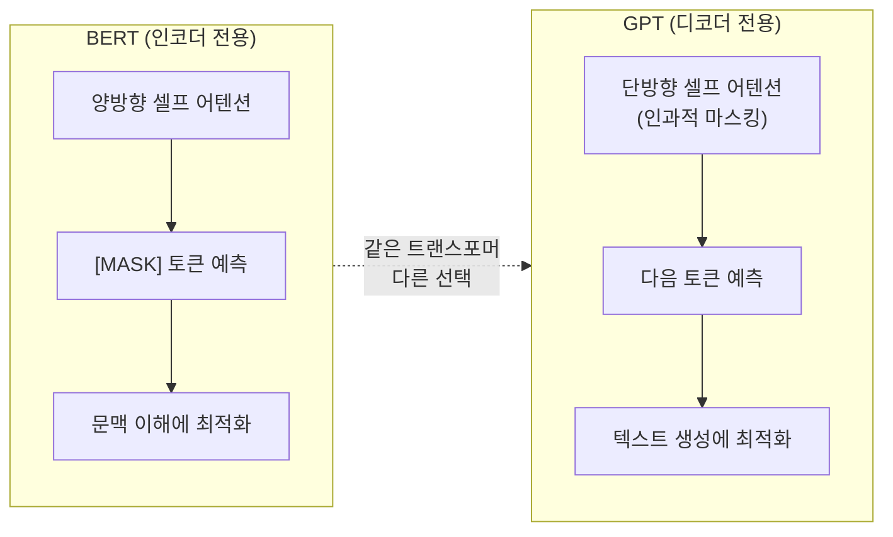
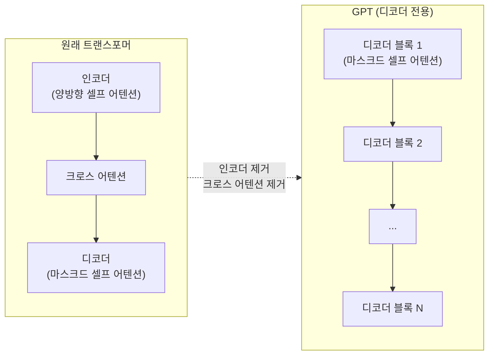
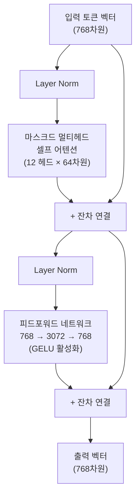
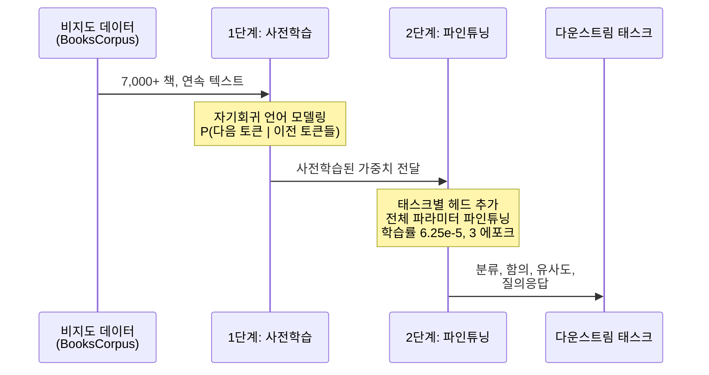
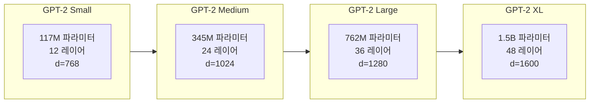
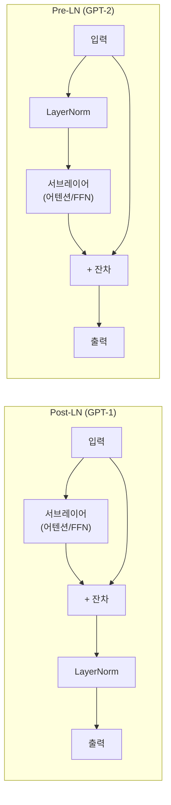

# 02. GPT 아키텍처 상세 분석

> 디코더 전용 트랜스포머의 내부 구조를 해부하고, GPT-1의 사전학습+파인튜닝 방식부터 GPT-2의 제로샷 학습까지 아키텍처 진화를 추적합니다.

## 개요

이 섹션에서는 GPT가 사용하는 디코더 전용 트랜스포머(Decoder-only Transformer)의 내부 구조를 층별로 분석합니다. [앞서 자기회귀 언어 모델링](17-ch17-gpt-생성적-사전학습-모델/01-01-자기회귀-언어-모델링.md)에서 배운 "다음 토큰 예측"이라는 학습 목표가 실제 아키텍처에서 어떻게 구현되는지, 그리고 GPT-1에서 GPT-2로 넘어가면서 "파인튜닝 없이도 다양한 태스크를 수행할 수 있다"는 제로샷 학습이 어떻게 가능해졌는지를 살펴봅니다.

**선수 지식**: 트랜스포머 아키텍처 기초([Ch13](13-ch13-트랜스포머-아키텍처-심층-분석/01-01-트랜스포머-아키텍처-전체-조망.md)), 셀프 어텐션과 인과적 마스킹 개념, [BERT 아키텍처](16-ch16-bert-양방향-사전학습-모델/02-02-bert-아키텍처-상세-분석.md) 기초
**학습 목표**:
- 인코더 전용(BERT)과 디코더 전용(GPT) 아키텍처의 구조적 차이와 태스크별 적합성을 판단할 수 있다
- 디코더 전용 트랜스포머의 구조를 인코더-디코더 트랜스포머와 비교하여 설명할 수 있다
- GPT-1의 12-레이어 아키텍처와 사전학습→파인튜닝 2단계 방식을 이해한다
- GPT-2의 모델 크기 확장과 제로샷 학습 전환의 의미를 설명할 수 있다
- 각 레이어(임베딩, 마스크드 셀프 어텐션, FFN, LayerNorm)의 역할을 코드로 구현할 수 있다

## 왜 알아야 할까?

ChatGPT, Claude, Gemini — 오늘날 대화하듯 사용하는 AI 모델들은 모두 GPT 스타일의 디코더 전용 아키텍처를 기반으로 합니다. 원래 트랜스포머는 인코더와 디코더를 모두 갖고 있었는데, GPT는 왜 디코더만 떼어냈을까요? 그리고 [Ch16에서 배운 BERT](16-ch16-bert-양방향-사전학습-모델/01-01-bert-개요와-핵심-아이디어.md)는 반대로 인코더만 사용했는데, 어떤 상황에서 어떤 아키텍처를 선택해야 할까요?

이 질문에 답하려면 GPT 아키텍처의 내부를 정확히 이해해야 합니다. 아키텍처를 모르고 LLM을 사용하는 것은 엔진을 모르고 차를 정비하는 것과 같거든요. 파인튜닝 전략, 프롬프트 엔지니어링, 심지어 효율적 추론까지 — 모든 실무 기술의 기반이 바로 이 아키텍처 이해에 있습니다.

## 핵심 개념

### 개념 0: 인코더 vs 디코더 — BERT와 GPT의 아키텍처 선택

> 💡 **비유**: BERT는 "시험 문제의 빈칸을 채우는 학생"이고, GPT는 "백지에서 에세이를 쓰는 작가"입니다. 빈칸 채우기는 앞뒤 맥락을 모두 볼 수 있어야 유리하고(양방향), 에세이 쓰기는 이미 쓴 내용만 보면서 다음 문장을 이어가야 합니다(단방향). 태스크의 성격에 따라 최적의 도구가 달라지는 거죠.

[Ch16에서 살펴본 BERT](16-ch16-bert-양방향-사전학습-모델/02-02-bert-아키텍처-상세-분석.md)는 인코더 전용(Encoder-only), GPT는 디코더 전용(Decoder-only) 아키텍처입니다. 같은 트랜스포머에서 출발했지만 서로 반대 방향을 선택한 것인데요, 이 차이가 각 모델의 강점과 적합한 태스크를 결정합니다.

> 📊 **그림 0**: BERT(인코더) vs GPT(디코더) 아키텍처 핵심 비교



두 아키텍처의 구조적 차이를 한눈에 정리하면 다음과 같습니다:

| 비교 항목 | BERT (인코더 전용) | GPT (디코더 전용) |
|-----------|-------------------|-------------------|
| **어텐션 방향** | 양방향 (모든 토큰 참조) | 단방향 (이전 토큰만 참조) |
| **학습 목표** | MLM (빈칸 채우기) + NSP | 자기회귀 (다음 토큰 예측) |
| **입력 처리** | 전체 문맥을 한 번에 인코딩 | 왼쪽→오른쪽 순차 생성 |
| **출력 방식** | 토큰별 표현 벡터 | 다음 토큰 확률 분포 |
| **파인튜닝** | 태스크별 헤드 추가 | GPT-1: 헤드 추가 / GPT-2+: 프롬프트 |
| **대표 크기** | BERT-Large: 340M | GPT-2 XL: 1.5B |

그렇다면 실무에서 어떤 아키텍처를 선택해야 할까요? 핵심은 **태스크의 성격**입니다:

| 태스크 유형 | 추천 아키텍처 | 이유 |
|-------------|-------------|------|
| **텍스트 분류** (감성 분석, 스팸 탐지) | BERT (인코더) | 전체 문맥 양방향 이해가 분류 정확도를 높임 |
| **개체명 인식 (NER)** | BERT (인코더) | 각 토큰의 앞뒤 문맥을 모두 봐야 정확한 태깅 가능 |
| **문장 유사도 / 검색** | BERT (인코더) | 문장을 고정 길이 벡터로 인코딩하는 데 최적 |
| **텍스트 생성** (글쓰기, 대화) | GPT (디코더) | 자기회귀 생성이 자연스러운 텍스트를 만듦 |
| **코드 생성** | GPT (디코더) | 코드의 순차적 특성이 자기회귀와 잘 맞음 |
| **범용 태스크** (질의응답, 요약, 번역) | GPT (디코더, 대형) | 충분한 스케일에서 제로/퓨샷으로 대부분 해결 |
| **문장 임베딩** | BERT (인코더) | 양방향 표현이 의미적으로 더 풍부 |

> ⚠️ **흔한 오해**: "GPT가 BERT보다 무조건 좋다"고 생각하기 쉽지만, 이는 **모델 크기가 극도로 커진 최근의 맥락**에서만 부분적으로 맞는 이야기입니다. 비슷한 파라미터 수에서 비교하면, 분류·NER·문장 유사도 같은 이해(understanding) 태스크에서는 여전히 BERT 스타일이 유리합니다. "생성이 필요하면 GPT, 이해가 필요하면 BERT"라는 기본 원칙은 지금도 유효합니다.

이 배경을 가지고, 이제 GPT가 선택한 디코더 전용 구조를 본격적으로 해부해봅시다.

### 개념 1: 디코더 전용 트랜스포머 — 인코더는 왜 버렸나?

> 💡 **비유**: 원래 트랜스포머는 "통역사 팀"이었습니다. 인코더라는 "듣기 전문가"가 원문을 이해하고, 디코더라는 "말하기 전문가"가 번역을 생성하는 2인 체제였죠. GPT는 이 중 "말하기 전문가"만 남기고 인코더를 잘라냈습니다. "충분히 똑똑한 말하기 전문가는 듣기도 혼자 할 수 있다"는 발상이었습니다.

[트랜스포머 아키텍처](13-ch13-트랜스포머-아키텍처-심층-분석/06-06-인코더와-디코더의-상호작용.md)에서 배웠듯이, 원래 트랜스포머(Vaswani et al., 2017)는 인코더-디코더 구조였습니다. 인코더가 입력 시퀀스를 양방향으로 분석하고, 디코더가 그 표현을 참조(크로스 어텐션)하면서 출력을 생성했죠.

GPT는 여기서 대담한 결정을 내립니다: **인코더와 크로스 어텐션을 완전히 제거**하고, 디코더 블록만 쌓아 올린 것입니다.

> 📊 **그림 1**: 원래 트랜스포머 vs. GPT 디코더 전용 구조



왜 이렇게 해도 되는 걸까요? 핵심은 **자기회귀 목표 함수**에 있습니다. GPT는 "이전 토큰들을 보고 다음 토큰을 예측"하는 것만 잘하면 되므로, 입력과 출력이 같은 시퀀스 안에서 처리됩니다. 별도의 인코더가 "입력을 이해"할 필요가 없는 거죠 — 디코더가 읽으면서 동시에 이해하고, 동시에 생성합니다.

디코더 전용 구조의 핵심 차이점:

| 구성 요소 | 원래 트랜스포머 디코더 | GPT 디코더 |
|-----------|---------------------|-----------|
| 마스크드 셀프 어텐션 | ✅ | ✅ |
| 크로스 어텐션 | ✅ (인코더 출력 참조) | ❌ (제거) |
| 피드포워드 네트워크 | ✅ | ✅ |
| 정규화 | Post-LN | Pre-LN (GPT-2부터) |

### 개념 2: GPT-1 아키텍처 — 12개 층의 해부학

> 💡 **비유**: GPT-1의 구조는 12층짜리 아파트와 비슷합니다. 1층 로비(임베딩 레이어)에서 단어가 벡터로 변환되어 입장하고, 각 층(디코더 블록)에서 "이전 단어들과의 관계"를 점점 더 추상적으로 학습합니다. 옥상(출력 헤드)에 도착하면 "다음에 올 단어"를 예측하게 되죠.

GPT-1(2018)의 구체적인 아키텍처 사양은 다음과 같습니다:

- **레이어 수**: 12개 디코더 블록
- **은닉 차원(d_model)**: 768
- **어텐션 헤드 수**: 12개 (각 64차원)
- **FFN 내부 차원**: 3,072 (768 × 4)
- **컨텍스트 길이**: 512 토큰
- **총 파라미터**: 약 1.17억(117M)개
- **어휘 크기**: 약 40,000 (BPE 토크나이저)

> 📊 **그림 2**: GPT-1 단일 디코더 블록의 내부 구조



여기서 주목할 점이 몇 가지 있는데요:

**GELU 활성화 함수**: 원래 트랜스포머는 ReLU를 사용했지만, GPT-1은 GELU(Gaussian Error Linear Unit)를 채택했습니다. GELU는 입력값이 음수일 때도 약간의 값을 통과시켜, ReLU의 "죽은 뉴런" 문제를 완화합니다.

**BPE 토크나이저**: 단어 수준이 아니라 [서브워드 토크나이제이션](15-ch15-서브워드-토크나이제이션/02-02-bpebyte-pair-encoding-알고리즘.md)을 사용하여, 미등록어(OOV) 문제를 해결했습니다.

```python
import torch
import torch.nn as nn
import torch.nn.functional as F
import math

class GPT1Config:
    """GPT-1 아키텍처 설정"""
    vocab_size: int = 40000    # BPE 어휘 크기
    n_layer: int = 12          # 디코더 블록 수
    n_head: int = 12           # 어텐션 헤드 수
    n_embd: int = 768          # 임베딩 차원
    block_size: int = 512      # 최대 시퀀스 길이
    dropout: float = 0.1       # 드롭아웃 비율
    
    def __init__(self, **kwargs):
        for k, v in kwargs.items():
            setattr(self, k, v)
        # FFN 내부 차원은 항상 4배
        self.n_inner = 4 * self.n_embd  # 3072
```

```run:python
# GPT-1의 파라미터 수를 계산해봅시다
vocab_size = 40000
n_layer = 12
n_embd = 768
n_head = 12
n_inner = 4 * n_embd  # 3072

# 임베딩 레이어
token_emb = vocab_size * n_embd     # 토큰 임베딩
pos_emb = 512 * n_embd              # 위치 임베딩

# 각 디코더 블록
attn_params = 4 * n_embd * n_embd   # Q, K, V 프로젝션 + 출력 프로젝션
ffn_params = 2 * n_embd * n_inner   # 두 개의 선형 레이어
ln_params = 4 * n_embd              # 두 개의 LayerNorm (각각 weight + bias)
block_params = attn_params + ffn_params + ln_params

# 총 파라미터
total = token_emb + pos_emb + n_layer * block_params + 2 * n_embd  # 최종 LN
print(f"토큰 임베딩: {token_emb:,}")
print(f"위치 임베딩: {pos_emb:,}")
print(f"디코더 블록 (×{n_layer}): {block_params:,} × {n_layer} = {n_layer * block_params:,}")
print(f"총 파라미터: {total:,}")
print(f"약 {total / 1e6:.1f}M 파라미터")
```

```output
토큰 임베딩: 30,720,000
위치 임베딩: 393,216
디코더 블록 (×12): 7,090,176 × 12 = 85,082,112
총 파라미터: 116,196,864
약 116.2M 파라미터
```

### 개념 3: GPT-1의 2단계 전략 — 사전학습 + 파인튜닝

> 💡 **비유**: GPT-1의 전략은 "일반교양 교육 → 전문 직업 훈련"과 같습니다. 먼저 방대한 책을 읽으며 언어 자체를 이해하고(사전학습), 그 다음 특정 직무에 맞게 짧은 훈련을 받는(파인튜닝) 2단계 방식입니다.

GPT-1의 혁신은 아키텍처 자체보다 **학습 전략**에 있었습니다. 2018년 이전까지 NLP 모델은 대부분 태스크별로 처음부터 학습했거든요. GPT-1은 이를 두 단계로 나눴습니다:

> 📊 **그림 3**: GPT-1의 2단계 학습 전략



**1단계 — 사전학습(Pre-training)**:
- **데이터**: BooksCorpus(7,000권 이상의 미출판 도서)
- **목표**: 자기회귀 언어 모델링 $L_1(\mathcal{U}) = \sum_i \log P(u_i \mid u_{i-k}, \ldots, u_{i-1}; \Theta)$
- **설정**: 100 에포크, 배치 크기 64, 시퀀스 길이 512

**2단계 — 파인튜닝(Fine-tuning)**:
- **핵심**: 선형 분류기 헤드를 추가하고, 사전학습된 모든 파라미터를 함께 업데이트
- **보조 목표**: 파인튜닝 시에도 언어 모델링 손실을 보조 목표로 유지 → 일반화 개선
- **설정**: 학습률 6.25e-5, 배치 크기 32, 대부분 3 에포크로 충분

$$L_3(\mathcal{C}) = L_2(\mathcal{C}) + \lambda \cdot L_1(\mathcal{C})$$

여기서 $L_2$는 태스크 분류 손실, $L_1$은 언어 모델링 손실, $\lambda$는 보조 손실의 가중치입니다. 파인튜닝 중에도 "언어를 잊지 않도록" 보조 목표를 유지한 것이 GPT-1의 영리한 전략이었습니다.

```python
class GPT1ForClassification(nn.Module):
    """GPT-1 파인튜닝: 사전학습 모델 + 분류 헤드"""
    
    def __init__(self, config, num_classes):
        super().__init__()
        self.transformer = GPT1Model(config)  # 사전학습된 모델
        self.classifier = nn.Linear(config.n_embd, num_classes)  # 분류 헤드
        self.lm_head = nn.Linear(config.n_embd, config.vocab_size)  # LM 헤드 유지
        self.lambda_aux = 0.5  # 보조 손실 가중치
        
    def forward(self, input_ids, labels=None):
        hidden = self.transformer(input_ids)  # (batch, seq_len, 768)
        
        # 마지막 토큰의 표현으로 분류
        cls_hidden = hidden[:, -1, :]  # (batch, 768)
        cls_logits = self.classifier(cls_hidden)  # (batch, num_classes)
        
        # 보조 언어 모델링 손실
        lm_logits = self.lm_head(hidden)  # (batch, seq_len, vocab_size)
        
        loss = None
        if labels is not None:
            cls_loss = F.cross_entropy(cls_logits, labels)
            # 보조 LM 손실 (자기회귀)
            shift_logits = lm_logits[:, :-1, :].contiguous()
            shift_labels = input_ids[:, 1:].contiguous()
            lm_loss = F.cross_entropy(
                shift_logits.view(-1, shift_logits.size(-1)),
                shift_labels.view(-1)
            )
            loss = cls_loss + self.lambda_aux * lm_loss
        
        return cls_logits, loss
```

### 개념 4: GPT-2로의 진화 — 크기의 마법과 제로샷 학습

> 💡 **비유**: GPT-1이 "고등학교를 졸업하고 직업 훈련을 받아야 일하는 사람"이었다면, GPT-2는 "대학원까지 마친 박식한 사람"에 가깝습니다. 충분히 많이 배우면 별도 훈련 없이도 새로운 일을 해낼 수 있다는 것이죠.

2019년 OpenAI는 GPT-2를 발표하면서 파격적인 주장을 합니다: **"언어 모델은 비지도 멀티태스크 학습기다(Language Models are Unsupervised Multitask Learners)."** 즉, 충분히 크고 다양한 데이터로 학습하면, 별도의 파인튜닝 없이도 다양한 태스크를 수행할 수 있다는 것입니다.

> 📊 **그림 4**: GPT-2 모델 변형별 규모 비교



GPT-2의 아키텍처 변경점을 정리하면:

| 항목 | GPT-1 | GPT-2 (XL) |
|------|-------|------------|
| 파라미터 수 | 117M | 1,542M (약 13배) |
| 레이어 수 | 12 | 48 |
| 은닉 차원 | 768 | 1,600 |
| 어텐션 헤드 | 12 | 25 |
| 컨텍스트 길이 | 512 | 1,024 |
| 어휘 크기 | ~40,000 | 50,257 |
| 학습 데이터 | BooksCorpus | WebText (800만 웹페이지) |
| LayerNorm 위치 | Post-LN | **Pre-LN** |
| 파인튜닝 | 필수 | **제로샷 가능** |

**아키텍처의 핵심 변경 — Pre-LN 구조**:

GPT-1은 서브레이어 *뒤에* LayerNorm을 적용(Post-LN)했지만, GPT-2부터는 서브레이어 *앞에* 적용(Pre-LN)합니다. 이 작은 변화가 학습 안정성을 크게 개선합니다. 특히 깊은 네트워크(48층!)에서 기울기가 더 안정적으로 흐르게 되죠.

> 📊 **그림 5**: Post-LN vs. Pre-LN 비교



**제로샷 학습의 핵심 아이디어**:

GPT-2는 태스크를 자연어로 "프롬프트"합니다. 예를 들어 번역이 필요하면 `translate English to French:` 같은 텍스트를 입력으로 넣는 것입니다. 모델이 충분히 다양한 웹 텍스트를 학습했기 때문에, 이런 패턴을 자연스럽게 이해할 수 있다는 발상이죠. 이것이 바로 오늘날 **프롬프트 엔지니어링**의 시초입니다.

```run:python
# GPT-1 vs GPT-2 아키텍처 비교 시각화
models = {
    "GPT-1":       {"params": 117,  "layers": 12, "d_model": 768,  "heads": 12, "ctx": 512},
    "GPT-2 Small": {"params": 117,  "layers": 12, "d_model": 768,  "heads": 12, "ctx": 1024},
    "GPT-2 Med":   {"params": 345,  "layers": 24, "d_model": 1024, "heads": 16, "ctx": 1024},
    "GPT-2 Large": {"params": 762,  "layers": 36, "d_model": 1280, "heads": 20, "ctx": 1024},
    "GPT-2 XL":    {"params": 1542, "layers": 48, "d_model": 1600, "heads": 25, "ctx": 1024},
}

print(f"{'모델':<14} {'파라미터(M)':>10} {'레이어':>6} {'d_model':>8} {'헤드':>4} {'컨텍스트':>8}")
print("-" * 56)
for name, spec in models.items():
    print(f"{name:<14} {spec['params']:>10,} {spec['layers']:>6} {spec['d_model']:>8} {spec['heads']:>4} {spec['ctx']:>8}")
    
print(f"\nGPT-2 XL은 GPT-1보다 약 {1542/117:.1f}배 큰 모델입니다.")
```

```output
모델             파라미터(M)   레이어   d_model   헤드   컨텍스트
--------------------------------------------------------
GPT-1                 117     12      768   12      512
GPT-2 Small           117     12      768   12    1,024
GPT-2 Med             345     24    1,024   16    1,024
GPT-2 Large           762     36    1,280   20    1,024
GPT-2 XL            1,542     48    1,600   25    1,024

GPT-2 XL은 GPT-1보다 약 13.2배 큰 모델입니다.
```

## 실습: 직접 해보기

GPT 스타일 디코더 블록을 처음부터 구현해봅시다. Pre-LN 구조(GPT-2 방식)를 사용합니다.

```python
import torch
import torch.nn as nn
import torch.nn.functional as F
import math

class CausalSelfAttention(nn.Module):
    """마스크드 멀티헤드 셀프 어텐션"""
    
    def __init__(self, n_embd, n_head, block_size, dropout=0.1):
        super().__init__()
        assert n_embd % n_head == 0
        self.n_head = n_head
        self.head_dim = n_embd // n_head
        
        # Q, K, V를 하나의 행렬로 계산 (효율적)
        self.c_attn = nn.Linear(n_embd, 3 * n_embd)
        # 출력 프로젝션
        self.c_proj = nn.Linear(n_embd, n_embd)
        self.attn_dropout = nn.Dropout(dropout)
        self.resid_dropout = nn.Dropout(dropout)
        
        # 인과적 마스크 (미래 토큰 차단)
        self.register_buffer(
            "bias",
            torch.tril(torch.ones(block_size, block_size))
            .view(1, 1, block_size, block_size)
        )
    
    def forward(self, x):
        B, T, C = x.size()  # 배치, 시퀀스 길이, 임베딩 차원
        
        # Q, K, V 한 번에 계산하고 분리
        qkv = self.c_attn(x)  # (B, T, 3*C)
        q, k, v = qkv.split(C, dim=2)
        
        # 멀티헤드로 reshape: (B, n_head, T, head_dim)
        q = q.view(B, T, self.n_head, self.head_dim).transpose(1, 2)
        k = k.view(B, T, self.n_head, self.head_dim).transpose(1, 2)
        v = v.view(B, T, self.n_head, self.head_dim).transpose(1, 2)
        
        # 스케일드 닷-프로덕트 어텐션
        att = (q @ k.transpose(-2, -1)) * (1.0 / math.sqrt(self.head_dim))
        # 인과적 마스크 적용 (미래 위치를 -inf로)
        att = att.masked_fill(self.bias[:, :, :T, :T] == 0, float('-inf'))
        att = F.softmax(att, dim=-1)
        att = self.attn_dropout(att)
        
        # 가중 합산
        y = att @ v  # (B, n_head, T, head_dim)
        y = y.transpose(1, 2).contiguous().view(B, T, C)
        y = self.resid_dropout(self.c_proj(y))
        return y


class FeedForward(nn.Module):
    """피드포워드 네트워크 (GELU 활성화)"""
    
    def __init__(self, n_embd, dropout=0.1):
        super().__init__()
        self.c_fc = nn.Linear(n_embd, 4 * n_embd)   # 확장 (×4)
        self.c_proj = nn.Linear(4 * n_embd, n_embd)  # 축소
        self.dropout = nn.Dropout(dropout)
    
    def forward(self, x):
        x = self.c_fc(x)
        x = F.gelu(x)       # GELU 활성화 (ReLU 대신)
        x = self.c_proj(x)
        x = self.dropout(x)
        return x


class GPTBlock(nn.Module):
    """GPT-2 스타일 디코더 블록 (Pre-LN)"""
    
    def __init__(self, n_embd, n_head, block_size, dropout=0.1):
        super().__init__()
        self.ln_1 = nn.LayerNorm(n_embd)  # Pre-LN: 어텐션 전
        self.attn = CausalSelfAttention(n_embd, n_head, block_size, dropout)
        self.ln_2 = nn.LayerNorm(n_embd)  # Pre-LN: FFN 전
        self.ffn = FeedForward(n_embd, dropout)
    
    def forward(self, x):
        # Pre-LN + 잔차 연결
        x = x + self.attn(self.ln_1(x))  # LayerNorm → 어텐션 → 잔차
        x = x + self.ffn(self.ln_2(x))   # LayerNorm → FFN → 잔차
        return x


class MiniGPT(nn.Module):
    """GPT-2 스타일 미니 모델"""
    
    def __init__(self, vocab_size=50257, n_embd=768, n_head=12,
                 n_layer=12, block_size=1024, dropout=0.1):
        super().__init__()
        self.block_size = block_size
        
        # 토큰 + 위치 임베딩
        self.wte = nn.Embedding(vocab_size, n_embd)   # 토큰 임베딩
        self.wpe = nn.Embedding(block_size, n_embd)    # 학습 가능한 위치 임베딩
        self.drop = nn.Dropout(dropout)
        
        # N개의 디코더 블록
        self.blocks = nn.ModuleList([
            GPTBlock(n_embd, n_head, block_size, dropout)
            for _ in range(n_layer)
        ])
        
        # 최종 LayerNorm + 언어 모델링 헤드
        self.ln_f = nn.LayerNorm(n_embd)
        self.lm_head = nn.Linear(n_embd, vocab_size, bias=False)
        
        # 가중치 공유: 토큰 임베딩 = LM 헤드
        self.wte.weight = self.lm_head.weight
        
        print(f"MiniGPT 생성: {sum(p.numel() for p in self.parameters()):,} 파라미터")
    
    def forward(self, idx, targets=None):
        B, T = idx.size()
        assert T <= self.block_size, f"시퀀스 길이 {T}가 최대 {self.block_size}을 초과"
        
        # 토큰 임베딩 + 위치 임베딩
        pos = torch.arange(0, T, dtype=torch.long, device=idx.device)
        tok_emb = self.wte(idx)        # (B, T, n_embd)
        pos_emb = self.wpe(pos)        # (T, n_embd)
        x = self.drop(tok_emb + pos_emb)
        
        # N개의 디코더 블록 통과
        for block in self.blocks:
            x = block(x)
        
        # 최종 정규화 + 다음 토큰 예측
        x = self.ln_f(x)
        logits = self.lm_head(x)       # (B, T, vocab_size)
        
        loss = None
        if targets is not None:
            loss = F.cross_entropy(
                logits.view(-1, logits.size(-1)),
                targets.view(-1)
            )
        
        return logits, loss
```

```run:python
# 미니 GPT 모델 생성 및 테스트
import torch
import torch.nn as nn
import torch.nn.functional as F
import math

# 소규모 모델로 테스트
torch.manual_seed(42)

# 간단한 설정 (실제 GPT-2보다 훨씬 작은 모델)
vocab_size = 1000
n_embd = 128
n_head = 4
n_layer = 4
block_size = 64

# 파라미터 수 계산
token_emb = vocab_size * n_embd
pos_emb = block_size * n_embd
per_block = (4 * n_embd * n_embd) + (2 * n_embd * 4 * n_embd) + (4 * n_embd)
total = token_emb + pos_emb + n_layer * per_block + 2 * n_embd

print(f"미니 GPT 모델 사양:")
print(f"  어휘 크기: {vocab_size}")
print(f"  임베딩 차원: {n_embd}")
print(f"  어텐션 헤드: {n_head}")
print(f"  디코더 블록: {n_layer}")
print(f"  컨텍스트 길이: {block_size}")
print(f"  예상 파라미터: ~{total:,}")
print(f"\n이것은 GPT-2 Small(117M)의 약 {117_000_000/total:.0f}분의 1 크기입니다.")
```

```output
미니 GPT 모델 사양:
  어휘 크기: 1000
  임베딩 차원: 128
  어텐션 헤드: 4
  디코더 블록: 4
  컨텍스트 길이: 64
  예상 파라미터: ~665,856
  
이것은 GPT-2 Small(117M)의 약 176분의 1 크기입니다.
```

## 더 깊이 알아보기

### GPT-1의 탄생 — "언어를 먼저 이해시키자"

2018년 6월, OpenAI의 Alec Radford와 동료들은 한 가지 불만을 갖고 있었습니다. 당시 NLP에서는 태스크마다 별도의 모델 아키텍처를 설계하는 것이 일반적이었거든요. 감성 분석에는 이 모델, 자연어 추론에는 저 모델... 이건 비효율적이라고 생각했습니다.

그들의 아이디어는 놀랍도록 단순했습니다: "먼저 책을 많이 읽히자(사전학습). 충분히 언어를 이해하면 어떤 태스크든 약간의 추가 훈련으로 잘할 수 있을 것이다." 이 접근법은 같은 시기 Google의 BERT와 함께 NLP의 패러다임을 완전히 바꿔놓았습니다.

흥미로운 점은 GPT-1의 학습 데이터 선택입니다. Radford 팀은 의도적으로 **미출판 도서(BooksCorpus)** 를 선택했습니다. 왜냐하면 책은 뉴스 기사나 위키피디아와 달리 **긴 문맥에서 일관된 서사**를 유지하기 때문입니다. 이 선택이 모델의 장거리 의존성 학습 능력에 결정적 영향을 미쳤죠.

### GPT-2와 "너무 위험한 AI" 논란

GPT-2가 2019년에 발표되었을 때, OpenAI는 이례적으로 **전체 모델을 공개하지 않겠다**고 선언했습니다. "너무 설득력 있는 가짜 텍스트를 생성할 수 있어 악용 가능성이 크다"는 이유였죠. 이는 AI 커뮤니티에서 큰 논란을 일으켰고, "오픈"이라는 이름과 맞지 않는다는 비판도 받았습니다.

결국 2019년 11월에 1.5B 전체 모델이 공개되었지만, 이 사건은 AI 안전성과 공개 정책에 대한 중요한 논의의 시발점이 되었습니다. GPT-2의 "Language Models are Unsupervised Multitask Learners"라는 논문 제목 자체가 하나의 선언이었던 셈입니다 — 파인튜닝의 시대가 저물고, 스케일링의 시대가 시작됨을 알린 것이죠.

## 흔한 오해와 팁

> ⚠️ **흔한 오해**: "GPT는 트랜스포머의 디코더를 그대로 가져온 것이다." 사실 GPT의 디코더 블록에는 원래 트랜스포머 디코더에 있던 **크로스 어텐션 레이어가 없습니다**. 마스크드 셀프 어텐션 + FFN으로만 구성되어 있어요. 따라서 "디코더 전용"이라기보다 "마스크드 셀프 어텐션 전용 트랜스포머"라고 부르는 것이 더 정확합니다.

> 💡 **알고 계셨나요?**: GPT-2 Small과 GPT-1은 파라미터 수가 거의 같습니다(둘 다 약 117M). 차이는 학습 데이터(BooksCorpus vs WebText)와 컨텍스트 길이(512 vs 1024), 그리고 LayerNorm 위치(Post vs Pre)뿐입니다. 같은 크기에서도 이 변화들이 상당한 성능 차이를 만들어냈습니다.

> 🔥 **실무 팁**: GPT 계열 모델을 사용할 때 Pre-LN 구조를 이해하면 학습 안정성 문제를 디버깅하는 데 큰 도움이 됩니다. 커스텀 모델을 학습할 때 발산(divergence) 문제가 생기면, Post-LN에서 Pre-LN으로 전환하는 것을 시도해보세요. 학습률을 워밍업 없이도 더 크게 잡을 수 있게 됩니다.

## 핵심 정리

| 개념 | 설명 |
|------|------|
| 인코더 vs 디코더 선택 | BERT(인코더)는 이해 태스크, GPT(디코더)는 생성 태스크에 최적. 태스크 성격에 따라 선택 |
| 디코더 전용 트랜스포머 | 인코더와 크로스 어텐션을 제거하고 마스크드 셀프 어텐션 블록만 쌓은 구조 |
| GPT-1 아키텍처 | 12 레이어, 768 차원, 12 헤드, 117M 파라미터, Post-LN |
| 2단계 학습 전략 | 비지도 사전학습(언어 모델링) → 지도 파인튜닝(태스크별 헤드 추가) |
| 보조 손실 $\lambda L_1$ | 파인튜닝 시 언어 모델링 손실을 보조 목표로 유지하여 일반화 개선 |
| GPT-2의 확장 | 최대 1.5B 파라미터, 48 레이어, Pre-LN 구조로 학습 안정성 확보 |
| Pre-LN vs Post-LN | 서브레이어 앞에 LayerNorm → 깊은 네트워크에서 기울기 안정성 향상 |
| 제로샷 학습 | 파인튜닝 없이 자연어 프롬프트로 태스크 수행 — 프롬프트 엔지니어링의 시초 |
| GELU 활성화 | ReLU 대신 사용, 음수 입력에도 약간의 값을 통과시켜 "죽은 뉴런" 문제 완화 |

## 다음 섹션 미리보기

GPT-1과 GPT-2의 아키텍처를 상세히 이해했으니, [다음 섹션](17-ch17-gpt-생성적-사전학습-모델/03-03-gpt-계열의-발전-gpt-2에서-gpt-4까지.md)에서는 GPT-3부터 GPT-4까지의 발전 과정을 추적합니다. 제로샷에서 퓨샷(few-shot) 학습으로, 그리고 모델 크기가 1750억 파라미터를 넘어서면서 나타나는 **창발적 능력(emergent abilities)**과 RLHF를 통한 정렬(alignment)까지 — 스케일링이 가져온 질적 변화를 살펴봅니다.

## 참고 자료

- [Improving Language Understanding by Generative Pre-Training (GPT-1 원논문, Radford et al., 2018)](https://cdn.openai.com/research-covers/language-unsupervised/language_understanding_paper.pdf) - GPT-1의 2단계 학습 전략과 아키텍처 설계 원리를 담은 원본 논문
- [The Illustrated GPT-2 (Jay Alammar)](https://jalammar.github.io/illustrated-gpt2/) - GPT-2의 디코더 전용 아키텍처를 시각적으로 설명하는 최고의 가이드
- [Language Models are Unsupervised Multitask Learners (GPT-2 논문, Radford et al., 2019)](https://cdn.openai.com/better-language-models/language_models_are_unsupervised_multitask_learners.pdf) - GPT-2의 제로샷 학습 패러다임을 소개한 논문
- [Hugging Face GPT-2 Documentation](https://huggingface.co/docs/transformers/model_doc/gpt2) - GPT-2 모델의 Hugging Face 구현체 공식 문서
- [karpathy/build-nanogpt](https://github.com/karpathy/build-nanogpt) - Andrej Karpathy의 GPT 구현 영상과 코드로, GPT 아키텍처를 처음부터 구축하는 과정을 보여줌