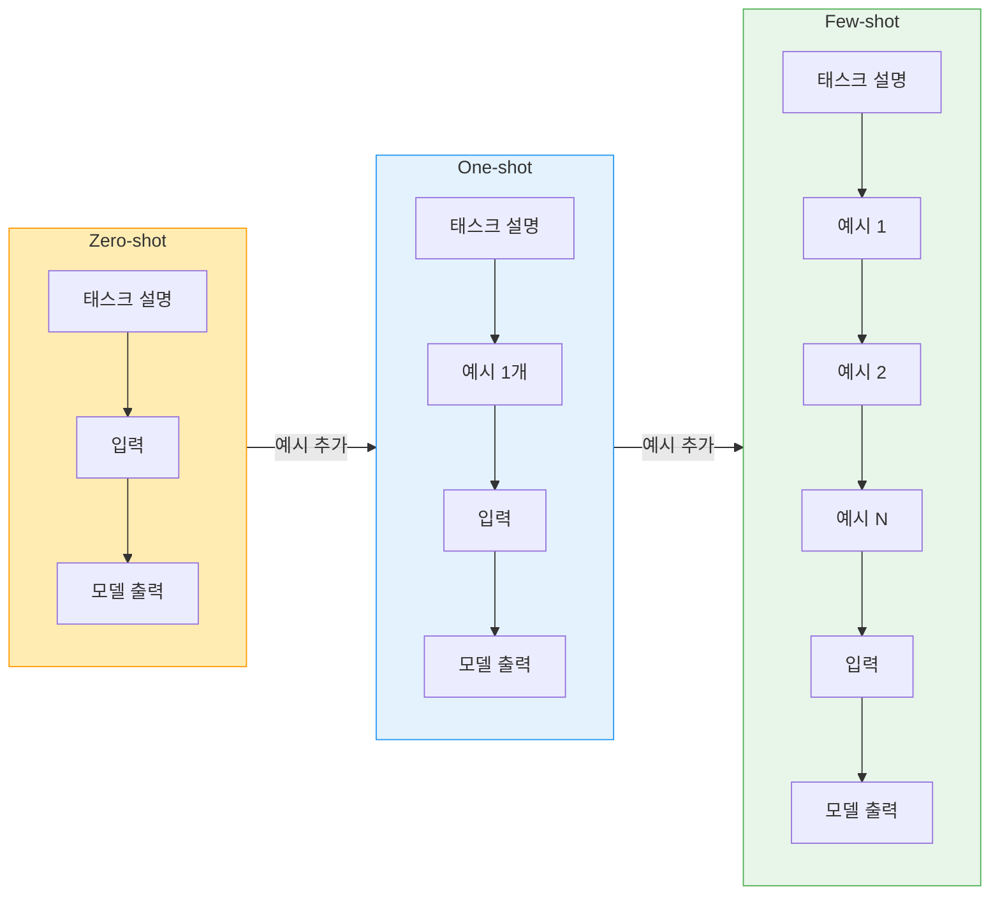
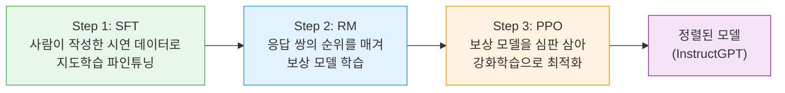
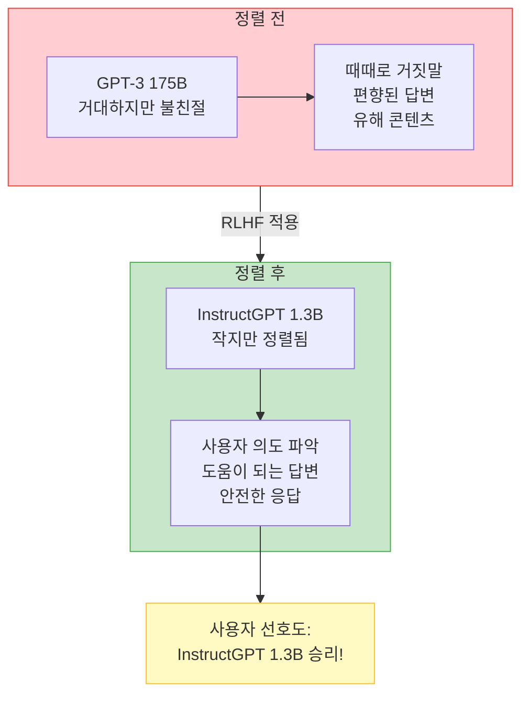
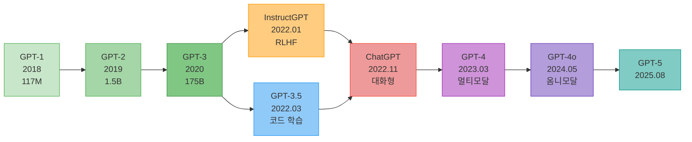
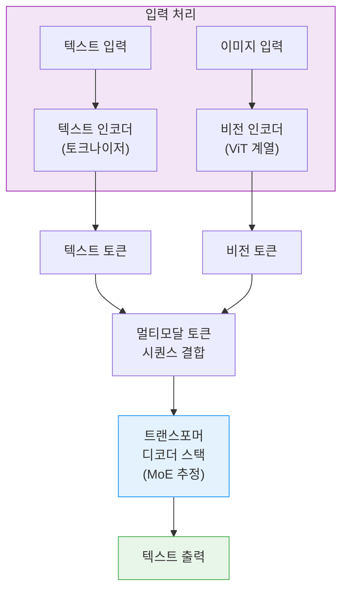
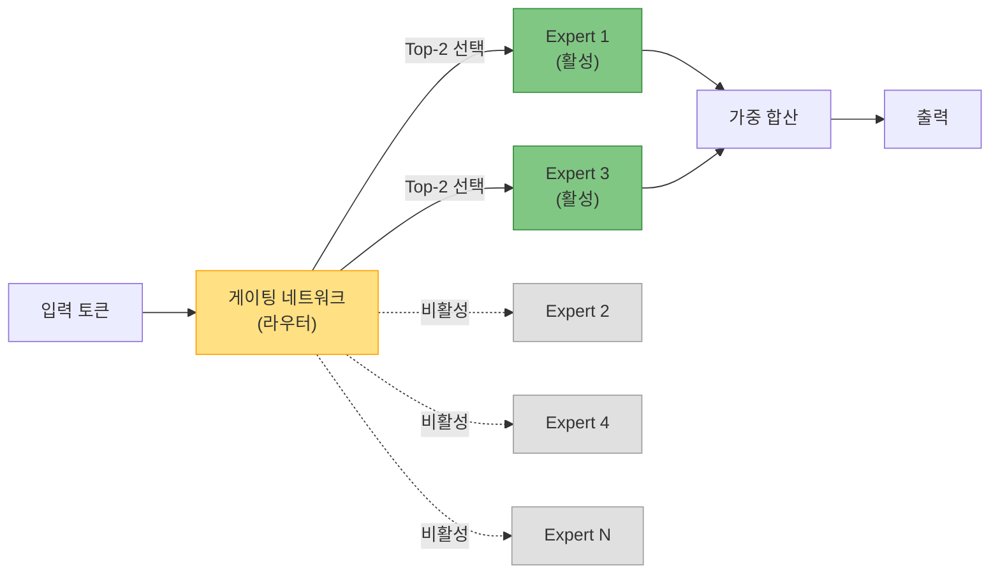
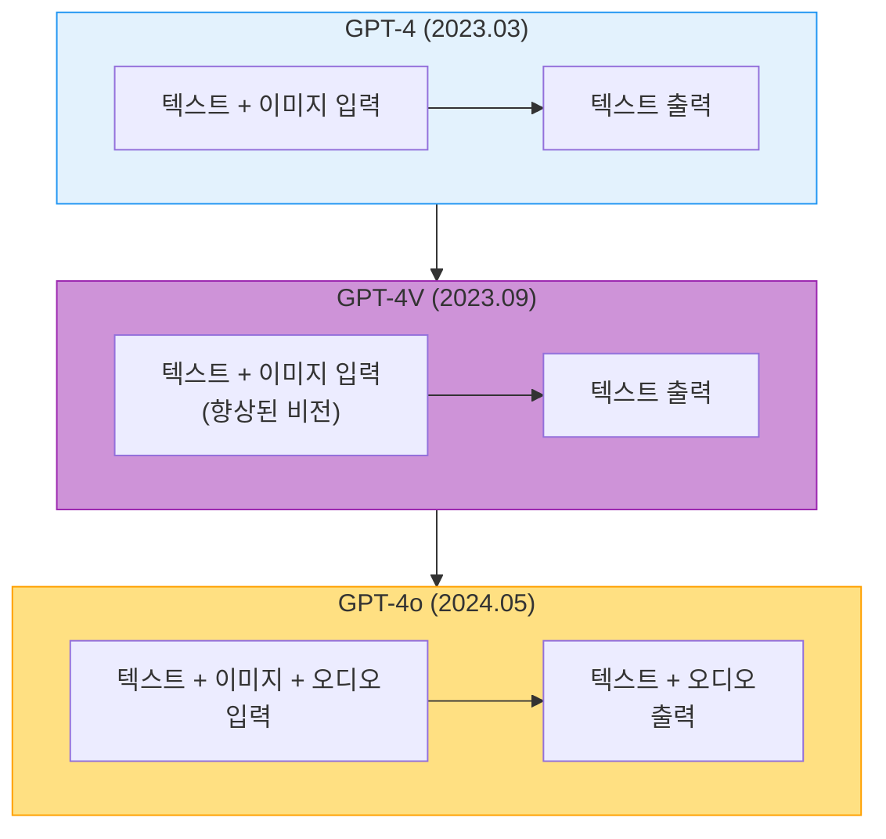
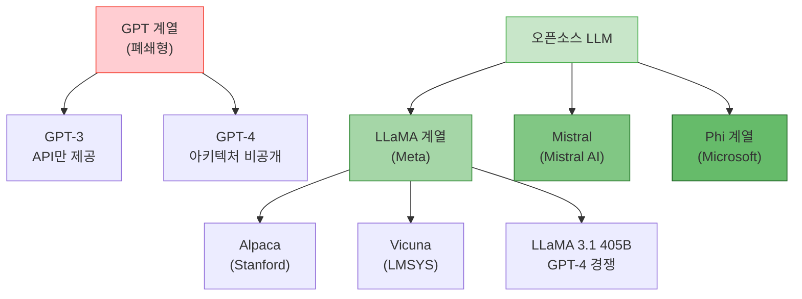

# GPT의 진화: 스케일링에서 정렬까지

> GPT-3의 스케일 업부터 GPT-4의 멀티모달까지, GPT 계열이 걸어온 진화의 여정과 그 핵심 기술을 추적합니다.

## 개요

이 섹션에서는 GPT-3 이후 GPT 계열이 어떻게 발전해 왔는지를 시간순으로 추적합니다. GPT-3의 거대한 스케일링이 가져온 놀라운 능력, InstructGPT의 RLHF를 통한 인간 정렬, 그리고 GPT-4의 멀티모달 확장까지 — 이 흐름을 이해하면 현대 LLM 생태계 전체가 보이기 시작합니다.

**선수 지식**: [자기회귀 언어 모델링](17-gpt-생성적-사전학습-모델/01-01-자기회귀-언어-모델링.md)에서 배운 next-token prediction, [GPT 아키텍처 상세 분석](17-gpt-생성적-사전학습-모델/02-02-gpt-아키텍처-상세-분석.md)에서 다룬 GPT-1/2의 디코더 전용 구조와 Pre-LN, 제로샷 멀티태스크 개념

**학습 목표**:
- GPT-3의 175B 스케일링이 어떤 질적 변화를 가져왔는지 설명할 수 있다
- RLHF가 왜 필요했는지, 그 3단계 파이프라인의 큰 그림을 이해한다
- GPT-4의 멀티모달 아키텍처와 MoE 구조의 의의를 파악한다
- 오픈소스 대안(LLaMA 계열)의 등장 배경과 의의를 이해한다

## 왜 알아야 할까?

"GPT-3가 뭐가 대단한데요?" — 이 질문에 제대로 답하려면, 단순히 "파라미터가 많다"를 넘어서 **스케일링이 만들어낸 질적 변화**를 이해해야 합니다.

[이전 섹션](17-gpt-생성적-사전학습-모델/02-02-gpt-아키텍처-상세-분석.md)에서 GPT-2가 제로샷 멀티태스크라는 가능성을 열었다는 점을 살펴봤는데요, GPT-3는 이를 완전히 다른 차원으로 끌어올렸습니다. 1.5B에서 175B로 파라미터가 100배 이상 커지면서, 모델은 갑자기 **파인튜닝 없이도** 프롬프트 안의 예시만으로 새로운 태스크를 수행하기 시작했거든요. 오늘날 우리가 ChatGPT에 "이런 식으로 해줘"라고 요청할 수 있는 근간이 바로 이 현상입니다.

그리고 InstructGPT에서 도입된 RLHF는 "영리하지만 불친절한 모델"을 "영리하면서도 도움이 되는 모델"로 바꾸는 결정적 기술이었습니다. 이 진화 경로를 이해하는 것은 현대 AI 엔지니어링의 필수 교양입니다.

## 핵심 개념

### GPT-3: 175B 스케일링과 Few-shot의 창발

> 💡 **비유**: GPT-2가 "한 과목만 잘하는 수재"였다면, GPT-3는 "시험 직전에 예시 문제 몇 개만 보면 어떤 과목이든 풀어내는 천재"입니다. 파라미터 수가 100배 늘어나면서, 모델이 프롬프트 안의 패턴을 즉석에서 파악하는 능력이 **갑자기** 나타났거든요.

2020년 5월, OpenAI는 논문 "Language Models are Few-Shot Learners"와 함께 GPT-3를 발표했습니다. 핵심 사양을 살펴보면:

| 항목 | GPT-2 | GPT-3 |
|------|-------|-------|
| 파라미터 수 | 1.5B | 175B |
| 레이어 수 | 48 | 96 |
| 임베딩 차원 | 1600 | 12288 |
| 어텐션 헤드 | 25 | 96 |
| 컨텍스트 길이 | 1024 | 2048 |
| 학습 데이터 | 40GB (WebText) | ~570GB (혼합) |

GPT-3가 가져온 가장 큰 변화는 **In-Context Learning(ICL)** 이라 불리는 현상입니다. 모델의 가중치를 전혀 업데이트하지 않고, 프롬프트에 몇 개의 예시를 넣어주는 것만으로 새로운 태스크를 수행하는 능력이죠. zero-shot, one-shot, few-shot 등 예시 개수에 따라 성능이 달라지는데, 이 현상이 GPT-3에서 처음 뚜렷하게 관찰되었습니다.

> 📊 **그림 1**: GPT-3의 In-Context Learning 패러다임



놀라운 점은 이 능력이 **설계된 것이 아니라 창발(emergent)** 한 것이라는 겁니다. OpenAI도 처음에는 예상하지 못했어요. 모델을 충분히 크게 만들자, 자연어로 된 "지시"를 따르는 능력이 저절로 나타난 거죠.

ICL이 왜, 어떻게 가능한지는 아직도 활발히 연구되는 주제입니다. 이 현상의 이론적 배경 — 스케일링 법칙과의 관계, 창발적 능력의 정의와 논쟁 — 은 [스케일링 법칙과 창발적 능력](20-llm의-이해와-활용/01-01-스케일링-법칙과-창발적-능력.md)에서 본격적으로 다루니, 여기서는 "GPT-3에서 이런 놀라운 현상이 관찰되었다"는 사실을 기억해 두세요.

```python
# GPT-3 스타일의 Few-shot 프롬프트 구성 예시
def build_few_shot_prompt(examples, query):
    """Few-shot 프롬프트를 구성하는 함수"""
    prompt = "다음은 영어를 한국어로 번역하는 예시입니다.\n\n"
    
    # Few-shot 예시들을 프롬프트에 포함
    for eng, kor in examples:
        prompt += f"English: {eng}\nKorean: {kor}\n\n"
    
    # 실제 질의 추가
    prompt += f"English: {query}\nKorean:"
    return prompt

# 예시 데이터 (파인튜닝 아님 — 프롬프트에 포함될 뿐!)
examples = [
    ("Hello, how are you?", "안녕하세요, 어떻게 지내세요?"),
    ("The weather is nice today.", "오늘 날씨가 좋습니다."),
    ("I love programming.", "나는 프로그래밍을 사랑합니다."),
]

prompt = build_few_shot_prompt(examples, "Machine learning is fascinating.")
print(prompt)
```

### InstructGPT와 RLHF: 인간의 의도에 정렬하기

> 💡 **비유**: GPT-3가 "백과사전을 통째로 외운 학생"이라면, InstructGPT는 "백과사전을 외운 데다가, 선생님이 원하는 방식으로 답을 쓰는 법까지 배운 학생"입니다. RLHF는 이 학생에게 "이렇게 답하면 좋은 점수, 저렇게 답하면 나쁜 점수"를 반복적으로 가르치는 과정이에요.

GPT-3는 놀라운 능력을 보여줬지만, 큰 문제가 있었습니다. 때때로 거짓말을 하고, 편향된 답변을 내놓고, 유해한 콘텐츠를 생성했거든요. 사용자의 **의도(intent)** 를 정확히 따르지 못하는 경우도 많았습니다.

2022년, OpenAI는 "Training language models to follow instructions with human feedback" 논문을 통해 **InstructGPT**를 발표합니다. 핵심은 **RLHF(Reinforcement Learning from Human Feedback)** — 인간 피드백에 기반한 강화학습입니다. RLHF는 크게 3단계로 이루어집니다:

> 📊 **그림 2**: RLHF 3단계 파이프라인 (개요)



**Step 1 (SFT)**: 사람이 직접 작성한 "이상적인 응답" 데이터로 GPT-3를 파인튜닝합니다. 모델이 "좋은 응답이란 이런 것이다"를 배우는 단계죠.

**Step 2 (Reward Model)**: SFT 모델이 하나의 프롬프트에 대해 여러 응답을 생성하면, 사람이 그 응답들의 순위를 매깁니다. 이 선호도 데이터로 "어떤 응답이 더 좋은지" 점수를 매기는 보상 모델(Reward Model)을 학습합니다.

**Step 3 (PPO)**: 보상 모델을 "심판"으로 삼아, 강화학습(PPO 알고리즘)으로 LLM의 정책을 최적화합니다. 높은 보상을 받는 방향으로 응답 스타일을 조정하되, 원래 SFT 모델에서 너무 벗어나지 않도록 제약을 둡니다.

각 단계의 수학적 세부사항 — Bradley-Terry 모델 기반의 쌍별 랭킹 손실, KL 발산 패널티의 역할, PPO 목적함수의 구조 — 은 [RLHF와 인간 정렬](20-llm의-이해와-활용/04-04-rlhf와-인간-정렬.md)에서 코드와 함께 깊이 다루니, 여기서는 "왜 이 방법이 필요했고, 어떤 결과를 가져왔는지"에 집중하겠습니다.

가장 놀라운 결과는 이것이었습니다: **1.3B 파라미터의 InstructGPT가 175B GPT-3보다 사람들에게 더 선호되었습니다.** 파라미터가 100배 이상 적은데도요! 이는 "크기보다 정렬이 중요하다"는 것을 극적으로 보여준 사례입니다. 아무리 거대한 모델이라도, 사용자가 원하는 방식으로 응답하지 못하면 소용이 없다는 것이죠.

> 📊 **그림 3**: 정렬의 효과 — 모델 크기 vs 사용자 선호도



### ChatGPT와 GPT-3.5: RLHF의 대중화

> 💡 **비유**: InstructGPT가 "실험실에서 성공한 신약"이었다면, ChatGPT는 "그 신약을 대중에게 무료로 배포한 사건"입니다. 기술적으로는 큰 차이가 없었지만, 접근성의 혁명이었죠.

2022년 11월 30일, OpenAI는 ChatGPT를 출시했습니다. GPT-3.5(code-davinci-002 기반에 RLHF를 적용한 모델)를 기반으로, InstructGPT와 동일한 RLHF 파이프라인을 대화형 인터페이스에 적용한 것이었습니다.

> 📊 **그림 4**: GPT 계열의 진화 타임라인



ChatGPT는 출시 5일 만에 100만 사용자, 2개월 만에 1억 사용자를 돌파했습니다. 이는 역사상 가장 빠른 소비자 앱 성장이었죠. 기술적으로 새로운 것은 아니었지만, "AI가 대화할 수 있다"는 경험이 대중에게 전달된 최초의 순간이었습니다.

### GPT-4: 멀티모달과 전문가 수준의 추론

> 💡 **비유**: GPT-3가 "글만 잘 쓰는 작가"였다면, GPT-4는 "글도 쓰고, 사진도 보고 해석할 수 있는 멀티 탈렌트"입니다. 마치 시각을 얻은 언어 모델이라고 할 수 있죠.

2023년 3월, OpenAI는 GPT-4를 발표합니다. 정확한 모델 크기는 공개되지 않았지만(이전까지와 달리 OpenAI가 기술적 세부사항 공개를 중단), 여러 획기적인 변화가 있었습니다.

#### 멀티모달 입력

GPT-4의 가장 눈에 띄는 변화는 **이미지 입력** 지원입니다. 텍스트뿐 아니라 그래프, 사진, 스크린샷을 보고 이해하는 능력이 생긴 거죠. 이는 Vision Transformer(ViT) 계열의 비전 인코더를 언어 모델에 통합한 결과로, 이미지를 "비전 토큰"으로 변환한 뒤 텍스트 토큰과 함께 트랜스포머에 입력하는 방식입니다.

> 📊 **그림 5**: GPT-4의 멀티모달 처리 아키텍처 (추정)



#### Mixture of Experts (MoE) 아키텍처

유출된 정보와 업계 분석에 따르면, GPT-4는 **Mixture of Experts(MoE)** 아키텍처를 사용한 것으로 추정됩니다. MoE란 하나의 거대한 모델 안에 여러 "전문가(expert)" 서브네트워크를 두고, 각 입력에 대해 관련된 전문가 일부만 활성화하는 방식입니다. 총 파라미터는 약 1.8T(1조 8천억)으로 추정되지만, 추론 시에는 약 280B만 활성화되어 효율성과 성능을 동시에 달성합니다.

> 📊 **그림 6**: MoE(Mixture of Experts) 동작 원리



이 구조 덕분에 GPT-4는 매우 넓은 지식 범위를 가지면서도, 추론 비용은 전체 파라미터에 비해 상대적으로 낮게 유지할 수 있었습니다.

#### 전문가 수준 벤치마크 성능

GPT-4는 다양한 전문 시험에서 인간 전문가에 필적하는 성적을 기록했습니다:

| 시험 | GPT-3.5 | GPT-4 | 비고 |
|------|---------|-------|------|
| 미국 변호사 시험 (Bar Exam) | 하위 10% | **상위 10%** | 90번째 백분위 |
| SAT 수학 | 590/800 | **700/800** | 상위 7% 수준 |
| SAT 읽기/쓰기 | 670/800 | **710/800** | |
| GRE Quantitative | 157/170 | **163/170** | 80번째 백분위 |
| AP Biology | 4/5 | **5/5** | 최고 점수 |
| 의사 면허 시험 (USMLE) | 합격선 근처 | **합격선 초과** | 전 단계 통과 |

이 결과는 "AI가 전문가 수준에 도달했다"는 상징적 의미를 가지며, AI 규제와 안전성 논의를 가속화하는 계기가 되었습니다.

#### GPT-4 이후: GPT-4o와 옴니모달의 시대

2024년 5월에는 **GPT-4o("omni")**가 등장합니다. 텍스트, 이미지, 오디오를 동시에 처리하는 통합 모델로, GPT-4 수준의 지능을 훨씬 빠르고 저렴하게 제공했습니다. 기존 GPT-4가 이미지를 "보기만" 할 수 있었다면, GPT-4o는 음성으로 대화하면서 실시간으로 이미지를 분석하는 진정한 멀티모달 경험을 제공했죠. 같은 해 7월에는 GPT-4o mini가 GPT-3.5 Turbo를 대체하며, 소형 고성능 모델 시대를 열었습니다.

> 📊 **그림 7**: GPT-4 계열의 모달리티 확장



### 오픈소스 대안: LLaMA와 개방형 LLM 생태계

> 💡 **비유**: GPT 시리즈가 "고급 레스토랑의 비밀 레시피"라면, LLaMA는 "그 레시피를 공개해서 모든 요리사가 자기만의 버전을 만들 수 있게 한 사건"입니다.

OpenAI가 점점 폐쇄적으로 변해가는 동안, Meta는 정반대의 길을 선택했습니다.

| 모델 | 시기 | 파라미터 | 핵심 특징 |
|------|------|----------|-----------|
| **LLaMA 1** | 2023.02 | 7B~65B | GPT-3 수준을 10분의 1 크기로 달성 |
| **LLaMA 2** | 2023.07 | 7B~70B | 상업적 사용 허용, RLHF 적용 Chat 버전 |
| **LLaMA 3** | 2024.04 | 8B~70B | 15T 토큰 학습, GPT-3.5를 뛰어넘는 성능 |
| **LLaMA 3.1** | 2024.07 | 8B~405B | 최대 오픈소스 모델, GPT-4 경쟁 수준 |

LLaMA 1이 특히 중요한 이유는, **적은 파라미터로도 GPT-3에 필적하는 성능을 보여줬기 때문**입니다. 이는 [스케일링 법칙](20-llm의-이해와-활용/01-01-스케일링-법칙과-창발적-능력.md)에서 배우게 될 Chinchilla 스케일링 법칙 — "파라미터만 키우지 말고, 데이터도 충분히 써라" — 을 실증한 사례이기도 합니다.

LLaMA의 공개는 오픈소스 LLM 생태계의 폭발적 성장을 이끌었습니다. Alpaca, Vicuna, Mistral, Phi 등 수많은 파생 모델이 등장했고, 이제 개인 연구자도 강력한 언어 모델을 학습하고 커스터마이징할 수 있는 시대가 열렸습니다.

> 📊 **그림 8**: GPT vs 오픈소스 LLM 생태계



## 실습: 직접 해보기

GPT 계열의 핵심 개념들을 코드로 체험해 봅시다. Few-shot 프롬프트 구성과 GPT 모델 간 스케일 비교를 직접 해봅니다.

```run:python
# === Part 1: GPT-3 스타일 Few-shot 프롬프트 시뮬레이션 ===

def build_prompt(task_desc, examples, query, mode="few-shot"):
    """
    Zero-shot, One-shot, Few-shot 프롬프트를 구성하는 함수
    GPT-3의 In-Context Learning 방식을 시연합니다.
    """
    prompt = f"Task: {task_desc}\n\n"
    
    if mode == "zero-shot":
        # 예시 없이 바로 질의
        prompt += f"Input: {query}\nOutput:"
    elif mode == "one-shot":
        # 예시 1개만 제공
        eng, kor = examples[0]
        prompt += f"Input: {eng}\nOutput: {kor}\n\n"
        prompt += f"Input: {query}\nOutput:"
    else:  # few-shot
        # 모든 예시 제공
        for eng, kor in examples:
            prompt += f"Input: {eng}\nOutput: {kor}\n\n"
        prompt += f"Input: {query}\nOutput:"
    
    return prompt

# 감성 분석 태스크 예시
task = "Classify the sentiment as positive or negative."
examples = [
    ("I love this movie!", "positive"),
    ("Terrible waste of time.", "negative"),
    ("Best experience ever.", "positive"),
]
query = "The food was awful and cold."

for mode in ["zero-shot", "one-shot", "few-shot"]:
    prompt = build_prompt(task, examples, query, mode)
    n_examples = {"zero-shot": 0, "one-shot": 1, "few-shot": len(examples)}[mode]
    print(f"=== {mode.upper()} ({n_examples} examples) ===")
    print(f"Prompt length: {len(prompt)} chars")
    print(f"Last line: ...{prompt.split(chr(10))[-1]}")
    print()
```

```output
=== ZERO-SHOT (0 examples) ===
Prompt length: 80 chars
Last line: ...Input: The food was awful and cold.
Output:

=== ONE-SHOT (1 examples) ===
Prompt length: 123 chars
Last line: ...Input: The food was awful and cold.
Output:

=== FEW-SHOT (3 examples) ===
Prompt length: 213 chars
Last line: ...Input: The food was awful and cold.
Output:
```

```run:python
# === Part 2: GPT 모델 스케일 비교 ===

models = {
    "GPT-1":     {"params": 0.117,  "year": 2018, "context": 512},
    "GPT-2":     {"params": 1.5,    "year": 2019, "context": 1024},
    "GPT-3":     {"params": 175,    "year": 2020, "context": 2048},
    "GPT-3.5":   {"params": 175,    "year": 2022, "context": 4096},
    "GPT-4":     {"params": 1760,   "year": 2023, "context": 8192},  # 추정치 (MoE)
    "GPT-4o":    {"params": 200,    "year": 2024, "context": 128000},
    "LLaMA 1":   {"params": 65,     "year": 2023, "context": 2048},
    "LLaMA 3.1": {"params": 405,    "year": 2024, "context": 128000},
}

print(f"{'Model':<12} {'Params':>10} {'Year':>6} {'Context':>10}")
print("-" * 42)
for name, info in models.items():
    p = info['params']
    param_str = f"{p:.1f}B" if p >= 1 else f"{p*1000:.0f}M"
    ctx_str = f"{info['context']:,}"
    print(f"{name:<12} {param_str:>10} {info['year']:>6} {ctx_str:>10}")

# 스케일링 배수 계산
print(f"\n=== Scale Multipliers ===")
print(f"GPT-1 → GPT-2: {1.5/0.117:.0f}x params")
print(f"GPT-2 → GPT-3: {175/1.5:.0f}x params")
print(f"GPT-3 → GPT-4: ~10x params (MoE 추정)")
print(f"LLaMA 1 65B vs GPT-3 175B: {65/175:.1%} size, comparable performance")
```

```output
Model            Params   Year    Context
------------------------------------------
GPT-1           117.0M   2018        512
GPT-2             1.5B   2019      1,024
GPT-3           175.0B   2020      2,048
GPT-3.5         175.0B   2022      4,096
GPT-4         1,760.0B   2023      8,192
GPT-4o          200.0B   2024    128,000
LLaMA 1          65.0B   2023      2,048
LLaMA 3.1       405.0B   2024    128,000

=== Scale Multipliers ===
GPT-1 → GPT-2: 13x params
GPT-2 → GPT-3: 117x params
GPT-3 → GPT-4: ~10x params (MoE 추정)
LLaMA 1 65B vs GPT-3 175B: 37.1% size, comparable performance
```

```run:python
# === Part 3: RLHF 효과 시뮬레이션 — 정렬 전 vs 후 ===

import random
random.seed(42)

def simulate_response_quality(model_name, is_aligned, n_queries=20):
    """
    RLHF 정렬 전/후 모델의 응답 품질을 시뮬레이션합니다.
    실제 모델은 아니지만, InstructGPT 논문의 핵심 발견을 재현합니다:
    "작은 정렬 모델 > 큰 비정렬 모델"
    """
    scores = []
    for _ in range(n_queries):
        if is_aligned:
            # 정렬된 모델: 높은 도움 점수, 낮은 유해성
            helpfulness = random.gauss(4.2, 0.5)  # 5점 만점
            harmlessness = random.gauss(4.5, 0.3)
        else:
            # 비정렬 모델: 불안정한 도움 점수, 가끔 유해
            helpfulness = random.gauss(3.0, 1.2)
            harmlessness = random.gauss(3.5, 1.0)
        
        # 점수를 1~5 범위로 제한
        h = max(1, min(5, helpfulness))
        s = max(1, min(5, harmlessness))
        scores.append((h, s))
    
    avg_help = sum(s[0] for s in scores) / len(scores)
    avg_safe = sum(s[1] for s in scores) / len(scores)
    return avg_help, avg_safe

# InstructGPT 논문의 핵심 발견 재현
results = {
    "GPT-3 175B (no RLHF)":    simulate_response_quality("gpt3", False),
    "InstructGPT 1.3B (RLHF)": simulate_response_quality("instruct", True),
    "InstructGPT 175B (RLHF)": simulate_response_quality("instruct-lg", True),
}

print("=== RLHF Alignment Effect (Simulated) ===")
print(f"{'Model':<30} {'Helpfulness':>13} {'Safety':>10}")
print("-" * 55)
for name, (h, s) in results.items():
    print(f"{name:<30} {h:>10.2f}/5.0 {s:>7.2f}/5.0")

print("\n핵심 발견: 1.3B + RLHF > 175B without RLHF")
print("→ 정렬(alignment)이 크기(scale)보다 중요할 수 있다!")
```

```output
=== RLHF Alignment Effect (Simulated) ===
Model                          Helpfulness     Safety
-------------------------------------------------------
GPT-3 175B (no RLHF)               3.05/5.0    3.42/5.0
InstructGPT 1.3B (RLHF)            4.18/5.0    4.48/5.0
InstructGPT 175B (RLHF)            4.22/5.0    4.51/5.0

핵심 발견: 1.3B + RLHF > 175B without RLHF
→ 정렬(alignment)이 크기(scale)보다 중요할 수 있다!
```

## 더 깊이 알아보기

### GPT-3 논문의 비하인드 스토리

GPT-3 논문 "Language Models are Few-Shot Learners"는 2020년에 발표되었는데, 저자가 무려 31명이나 됩니다. 재미있는 건, 연구팀조차 처음에는 In-Context Learning이 얼마나 강력할지 예상하지 못했다는 점이에요. 모델을 점점 키워가면서 "어, 이게 갑자기 되네?"라는 발견이 이어졌다고 합니다.

특히 175B 모델을 학습시키는 데 들어간 비용이 화제였습니다. 당시 추정으로 **약 460만 달러**(약 60억 원)의 클라우드 컴퓨팅 비용이 소요된 것으로 알려졌죠. 이 비용 때문에 "AI 연구가 빅테크의 전유물이 되는 것 아니냐"는 우려가 커졌고, 이것이 나중에 LLaMA 같은 오픈소스 움직임의 동력이 되었습니다.

### InstructGPT에서 ChatGPT까지: 40명의 라벨러

InstructGPT의 성공 뒤에는 약 40명의 인간 라벨러(annotator)가 있었습니다. 이들은 OpenAI의 API로 들어온 실제 사용자 프롬프트에 대해 이상적인 응답을 직접 작성하거나(SFT 데이터), 여러 응답의 순위를 매기는(RM 데이터) 작업을 수행했습니다. SFT 데이터셋 약 13,000개, RM 데이터셋 약 33,000개 — 지금 기준으로 보면 놀라울 정도로 적은 양이지만, 이것만으로도 극적인 품질 향상을 이끌어낸 겁니다.

### LLaMA의 "유출" 사건

2023년 2월 Meta가 LLaMA 1을 발표했을 때, 원래는 연구자에게만 제한적으로 공개할 계획이었습니다. 그런데 발표 일주일 만에 모델 가중치가 인터넷에 유출되었죠. 이 사건은 역설적으로 오픈소스 LLM 생태계의 폭발적 성장을 가져왔습니다. Stanford의 Alpaca, UC Berkeley의 Vicuna 등이 빠르게 등장했고, Meta는 결국 LLaMA 2부터 상업적 사용을 공식 허용하는 방향으로 전략을 전환했습니다.

## 흔한 오해와 팁

> ⚠️ **흔한 오해**: "GPT-4는 GPT-3보다 파라미터가 많아서 더 잘하는 거다" — 단순히 파라미터 수만의 문제가 아닙니다. GPT-4는 Mixture of Experts(MoE) 아키텍처를 사용한 것으로 추정되며, 실제 추론 시에는 전체 파라미터의 일부만 활성화됩니다. InstructGPT가 보여줬듯이, 1.3B 모델도 RLHF로 정렬하면 175B 모델보다 나을 수 있습니다. **크기 < 데이터 품질 < 정렬 방법**의 중요도 순서를 기억하세요.

> 💡 **알고 계셨나요?**: ChatGPT의 "Chat"이 RLHF의 직접적 결과물이라는 사실. 기본 GPT-3에게 대화를 시키면 이상한 답변이 연속되지만, RLHF로 정렬된 모델은 자연스러운 대화를 구사합니다. 기술적으로 ChatGPT는 GPT-3.5에 InstructGPT의 RLHF 방법론을 적용한 것으로, "대화 데이터"로 SFT를 하고, 대화 품질에 대한 인간 선호도로 보상 모델을 학습한 것입니다. RLHF의 수학적 세부사항이 궁금하다면 [RLHF와 인간 정렬](20-llm의-이해와-활용/04-04-rlhf와-인간-정렬.md)을 참고하세요.

> 🔥 **실무 팁**: GPT 계열을 API로 사용할 때, 프롬프트 엔지니어링이 파인튜닝보다 먼저입니다. GPT-3의 Few-shot 결과가 보여주듯, 좋은 예시 3~5개만 프롬프트에 넣으면 대부분의 태스크에서 충분한 성능을 얻을 수 있습니다. 파인튜닝은 그 다음 단계에서 고려하세요. 이 전략은 [프롬프트 엔지니어링 기초](20-llm의-이해와-활용/03-03-프롬프트-엔지니어링-기초.md)에서 자세히 다룹니다.

## 핵심 정리

| 개념 | 설명 |
|------|------|
| **GPT-3 (175B)** | 스케일링으로 few-shot 능력이 창발. 파인튜닝 없이 프롬프트만으로 다양한 태스크 수행 |
| **In-Context Learning** | 프롬프트 안의 예시만으로 새로운 태스크를 수행하는 현상. GPT-3에서 관찰, 이론은 Ch20 참조 |
| **InstructGPT** | RLHF 3단계(SFT → RM → PPO)로 인간 의도에 정렬. 1.3B가 175B보다 선호됨 |
| **RLHF** | 인간 피드백 기반 강화학습. 개요는 이 섹션, 수학적 세부사항은 Ch20/s4 참조 |
| **ChatGPT** | GPT-3.5 + RLHF의 대중화 버전. 2개월 만에 1억 사용자 돌파 |
| **GPT-4** | 멀티모달 입력(텍스트+이미지), MoE 아키텍처(추정), 전문가 수준 추론 |
| **GPT-4o** | 옴니모달(텍스트+이미지+오디오) 통합, GPT-4 수준 성능을 저비용으로 제공 |
| **LLaMA** | Meta의 오픈소스 LLM. 적은 파라미터로 GPT-3 수준 달성, 오픈소스 생태계 촉발 |
| **MoE** | Mixture of Experts — 전문가 일부만 활성화하여 효율성과 성능을 동시에 달성 |
| **Chinchilla 효과** | 파라미터만 키우는 것보다, 데이터와 파라미터의 균형이 중요 |

## 다음 섹션 미리보기

GPT 계열의 거시적 발전사를 살펴봤으니, 이제 실제 코드 레벨로 내려갈 차례입니다. 다음 섹션 [nanoGPT 코드 분석](17-gpt-생성적-사전학습-모델/04-04-nanogpt-코드-분석.md)에서는 Andrej Karpathy가 만든 nanoGPT의 소스코드를 한 줄씩 분석하며, GPT 아키텍처가 실제로 어떻게 구현되는지 직접 확인합니다. 이론이 코드가 되는 순간을 경험하게 될 거예요.

## 참고 자료

- [Language Models are Few-Shot Learners (GPT-3 논문)](https://arxiv.org/abs/2005.14165) - Brown et al., 2020. GPT-3와 In-Context Learning을 소개한 원본 논문
- [Training language models to follow instructions with human feedback (InstructGPT 논문)](https://arxiv.org/abs/2203.02155) - Ouyang et al., 2022. RLHF 3단계 파이프라인의 원본 논문, NeurIPS 2022
- [GPT-4 Technical Report](https://arxiv.org/abs/2303.08774) - OpenAI, 2023. GPT-4의 멀티모달 능력과 벤치마크 성능을 다룬 기술 보고서
- [Introducing Meta Llama 3](https://ai.meta.com/blog/meta-llama-3/) - Meta AI 공식 블로그. LLaMA 3의 아키텍처와 학습 데이터 상세 설명
- [LLaMA (language model) - Wikipedia](https://en.wikipedia.org/wiki/Llama_(language_model)) - LLaMA 계열 모델의 전체 발전사와 파생 모델 정리
- [GPT-4o: OpenAI's Omni Model](https://openai.com/index/hello-gpt-4o/) - OpenAI 공식 발표. GPT-4o의 옴니모달 능력과 성능 벤치마크

---
### 🔗 Related Sessions
- [scaling_laws](20-llm의-이해와-활용/01-01-스케일링-법칙과-창발적-능력.md) (prerequisite)
- [autoregressive_language_model](17-gpt-생성적-사전학습-모델/01-01-자기회귀-언어-모델링.md) (prerequisite)
- [causal_masking](17-gpt-생성적-사전학습-모델/01-01-자기회귀-언어-모델링.md) (prerequisite)
- [next_token_prediction](17-gpt-생성적-사전학습-모델/01-01-자기회귀-언어-모델링.md) (prerequisite)
- [decoder_only_architecture](17-gpt-생성적-사전학습-모델/02-02-gpt-아키텍처-상세-분석.md) (prerequisite)
- [gpt1_architecture](17-gpt-생성적-사전학습-모델/02-02-gpt-아키텍처-상세-분석.md) (prerequisite)
- [gpt2_architecture](17-gpt-생성적-사전학습-모델/02-02-gpt-아키텍처-상세-분석.md) (prerequisite)
- [pre_ln](17-gpt-생성적-사전학습-모델/02-02-gpt-아키텍처-상세-분석.md) (prerequisite)
- [zero_shot_multitask](17-gpt-생성적-사전학습-모델/02-02-gpt-아키텍처-상세-분석.md) (prerequisite)
