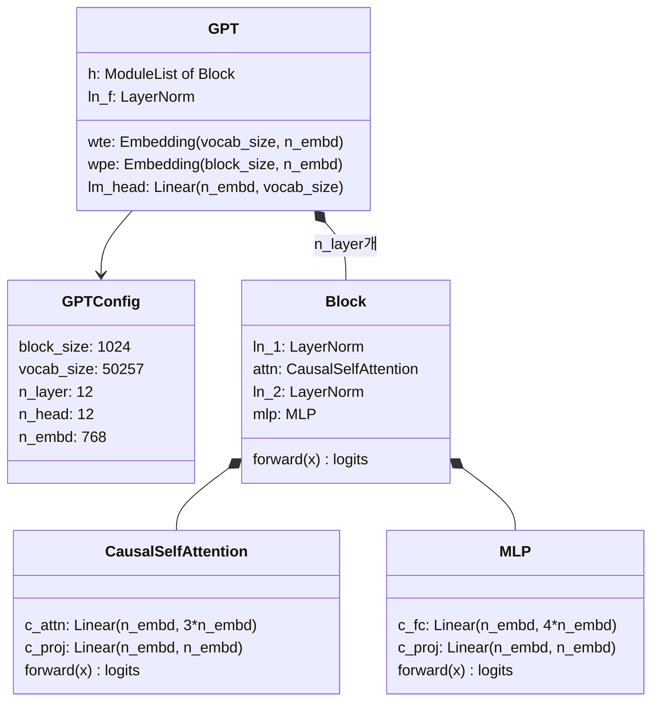
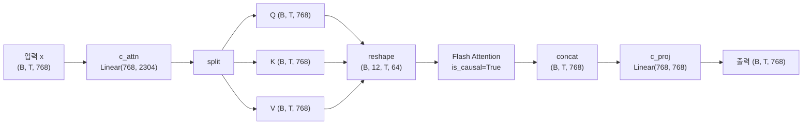
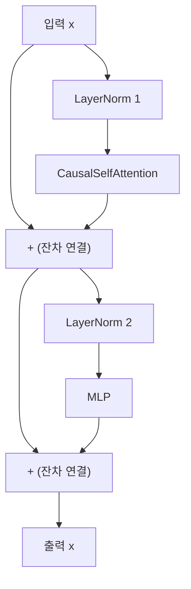
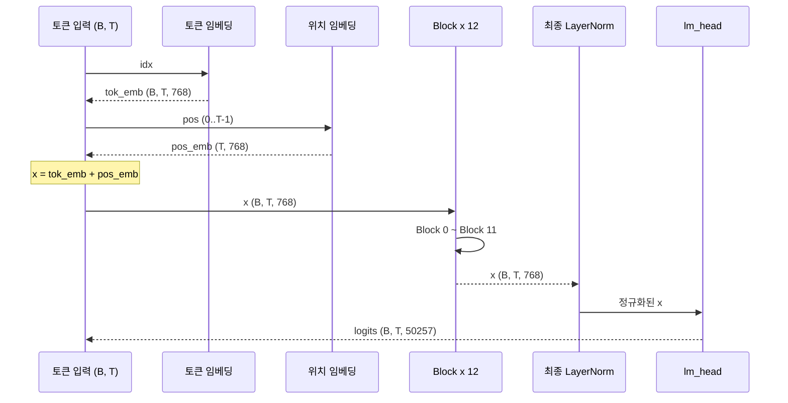
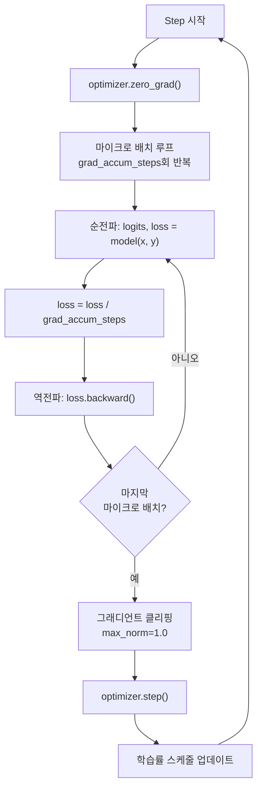

# 04. nanoGPT 코드 분석

> Andrej Karpathy의 nanoGPT 코드를 한 줄씩 분석하며, GPT 아키텍처가 실제 PyTorch 코드로 어떻게 구현되는지 완전히 이해한다.

## 개요

이 섹션에서는 Andrej Karpathy가 만든 nanoGPT의 핵심 코드를 분석합니다. 앞서 [GPT 아키텍처 상세 분석](17-gpt-생성적-사전학습-모델/02-02-gpt-아키텍처-상세-분석.md)에서 배운 디코더 전용 구조, Pre-LN, 잔차 연결 등의 개념이 실제 코드에서 어떻게 300줄 안에 담기는지 확인합니다.

**선수 지식**: GPT 디코더 전용 아키텍처(Pre-LN, 인과적 마스킹), PyTorch의 `nn.Module` 사용법([nn.Module로 신경망 정의하기](07-pytorch-기초와-신경망-입문/03-03-nnmodule로-신경망-정의하기.md)), 멀티헤드 어텐션([멀티헤드 어텐션](13-트랜스포머-아키텍처-심층-분석/03-03-멀티헤드-어텐션.md))

**학습 목표**:
- nanoGPT의 전체 코드 구조와 클래스 계층을 파악한다
- `CausalSelfAttention`, `MLP`, `Block`, `GPT` 각 클래스의 역할과 구현을 이해한다
- `DataLoaderLite`의 데이터 준비 방식과 학습 루프의 최적화 기법을 분석한다

## 왜 알아야 할까?

논문을 읽고 수식을 이해하는 것과 실제 코드를 작성하는 것 사이에는 큰 간극이 있습니다. nanoGPT는 그 간극을 메워주는 최고의 교재인데요. GPT-2(124M)를 **단일 파일 약 300줄**로 구현하면서도, 실제로 학습시키면 GPT-2 수준의 성능을 재현할 수 있거든요.

nanoGPT를 분석하면 이런 질문들에 답할 수 있습니다:

- "트랜스포머의 멀티헤드 어텐션이 코드에서는 어떻게 배치 처리되지?"
- "Pre-LN은 한 줄의 코드 차이에 불과하다고?"
- "가중치 초기화에서 `1/√(2N)` 스케일링은 왜 필요하지?"
- "학습 루프에서 그래디언트 누적은 어떻게 구현하지?"

이 코드를 이해하면, Hugging Face의 `transformers` 라이브러리 소스 코드를 읽는 것도, 나만의 모델을 실험하는 것도 훨씬 수월해집니다.

## 핵심 개념

### 개념 1: nanoGPT 코드 전체 구조

> 💡 **비유**: nanoGPT의 코드 구조는 레고 설명서와 같습니다. 가장 작은 블록(어텐션)부터 조립을 시작해서, 중간 블록(트랜스포머 블록)을 만들고, 최종적으로 완성된 모델(GPT)을 완성하죠. 설명서의 모든 단계가 한 장의 종이(단일 파일)에 들어있다는 점이 놀랍습니다.

nanoGPT의 `train_gpt2.py`(build-nanogpt 버전)는 단일 파일에 모델 정의부터 학습 루프까지 모두 담고 있습니다. 핵심 클래스는 다음과 같습니다:

> 📊 **그림 1**: nanoGPT 코드의 클래스 계층 구조



파일의 구조를 위에서 아래로 보면 이렇습니다:

| 영역 | 내용 | 대략적 줄 수 |
|------|------|-------------|
| 설정 | `GPTConfig` 데이터클래스 | ~10줄 |
| 모델 | `CausalSelfAttention` → `MLP` → `Block` → `GPT` | ~200줄 |
| 데이터 | `DataLoaderLite` | ~40줄 |
| 학습 | 옵티마이저 설정, LR 스케줄, 학습 루프 | ~100줄 |

이 구조가 GPT-2(124M)의 전부입니다. 앞서 [트랜스포머 아키텍처 전체 조망](13-트랜스포머-아키텍처-심층-분석/01-01-트랜스포머-아키텍처-전체-조망.md)에서 배운 복잡한 구조가 이렇게 간결하게 표현된다니, 놀랍지 않나요?

### 개념 2: GPTConfig — 모델의 청사진

> 💡 **비유**: 건물을 짓기 전에 설계도가 필요하듯, 모델을 만들기 전에 "몇 층짜리로, 방은 몇 개로" 같은 스펙을 정해야 합니다. `GPTConfig`가 바로 그 설계도입니다.

```python
from dataclasses import dataclass

@dataclass
class GPTConfig:
    block_size: int = 1024   # 최대 시퀀스 길이 (컨텍스트 윈도우)
    vocab_size: int = 50257  # GPT-2 토크나이저의 어휘 크기
    n_layer: int = 12        # 트랜스포머 블록 수
    n_head: int = 12         # 어텐션 헤드 수
    n_embd: int = 768        # 임베딩 차원 (d_model)
```

GPT-2의 네 가지 크기 변형을 이 다섯 개의 숫자만으로 정의할 수 있습니다:

| 모델 | n_layer | n_head | n_embd | 파라미터 수 |
|------|---------|--------|--------|------------|
| GPT-2 Small | 12 | 12 | 768 | 124M |
| GPT-2 Medium | 24 | 16 | 1024 | 350M |
| GPT-2 Large | 36 | 20 | 1280 | 774M |
| GPT-2 XL | 48 | 25 | 1600 | 1558M |

`vocab_size`가 50257인 이유가 궁금하실 텐데요. GPT-2의 BPE 토크나이저가 50,000개의 병합 규칙 + 256개의 바이트 토큰 + 1개의 특수 토큰(`<|endoftext|>`)을 사용하기 때문입니다. 이 숫자는 [BPE 알고리즘](15-서브워드-토크나이제이션/02-02-bpebyte-pair-encoding-알고리즘.md)에서 다뤘던 내용과 직접 연결됩니다.

### 개념 3: CausalSelfAttention — 핵심 엔진

> 💡 **비유**: 자동차의 엔진이 모든 동력을 만들어내듯, `CausalSelfAttention`은 GPT의 모든 "이해력"을 만들어내는 핵심 부품입니다. 12기통 엔진처럼 12개의 어텐션 헤드가 동시에 작동하죠.

```python
import torch
import torch.nn as nn
import torch.nn.functional as F

class CausalSelfAttention(nn.Module):

    def __init__(self, config):
        super().__init__()
        assert config.n_embd % config.n_head == 0
        # Q, K, V 프로젝션을 하나의 행렬로 통합 (효율성!)
        self.c_attn = nn.Linear(config.n_embd, 3 * config.n_embd)
        # 출력 프로젝션
        self.c_proj = nn.Linear(config.n_embd, config.n_embd)
        self.c_proj.NANOGPT_SCALE_INIT = 1  # 특별한 초기화 마커
        # 설정 저장
        self.n_head = config.n_head
        self.n_embd = config.n_embd

    def forward(self, x):
        B, T, C = x.size()  # 배치, 시퀀스 길이, 임베딩 차원
        # Q, K, V를 한 번에 계산하고 분리
        qkv = self.c_attn(x)
        q, k, v = qkv.split(self.n_embd, dim=2)
        # 멀티헤드로 reshape: (B, T, C) → (B, n_head, T, head_dim)
        k = k.view(B, T, self.n_head, C // self.n_head).transpose(1, 2)
        q = q.view(B, T, self.n_head, C // self.n_head).transpose(1, 2)
        v = v.view(B, T, self.n_head, C // self.n_head).transpose(1, 2)
        # Flash Attention (PyTorch 2.0+) — is_causal=True가 인과적 마스킹!
        y = F.scaled_dot_product_attention(q, k, v, is_causal=True)
        # 헤드 결합: (B, n_head, T, head_dim) → (B, T, C)
        y = y.transpose(1, 2).contiguous().view(B, T, C)
        # 출력 프로젝션
        y = self.c_proj(y)
        return y
```

이 코드에서 가장 주목할 점은 세 가지입니다:

**1. QKV 통합 프로젝션**: `nn.Linear(n_embd, 3 * n_embd)` 하나로 Q, K, V를 한 번에 계산합니다. 별도의 `W_q`, `W_k`, `W_v` 세 개를 만드는 것보다 GPU에서 훨씬 효율적이죠.

**2. Flash Attention**: `F.scaled_dot_product_attention(q, k, v, is_causal=True)` 한 줄이 스케일링, 마스킹, 소프트맥스, 가중합을 모두 처리합니다. `is_causal=True`가 [자기회귀 언어 모델링](17-gpt-생성적-사전학습-모델/01-01-자기회귀-언어-모델링.md)에서 배운 인과적 마스킹을 자동으로 적용해주죠.

**3. NANOGPT_SCALE_INIT 마커**: `c_proj`에 붙은 이 플래그는 나중에 GPT 클래스에서 초기화할 때 `1/√(2N)` 스케일링을 적용하라는 신호입니다. 잔차 경로가 깊어질수록 값이 폭발하는 것을 방지하죠.

> 📊 **그림 2**: CausalSelfAttention의 데이터 흐름



### 개념 4: MLP과 Block — 조립 블록

> 💡 **비유**: 어텐션이 "문장의 어디를 봐야 할지" 결정한다면, MLP는 "본 것을 어떻게 해석할지" 결정합니다. 도서관에서 관련 책을 찾는 게 어텐션이라면, 그 책을 읽고 지식을 정리하는 게 MLP인 셈이죠.

```python
class MLP(nn.Module):

    def __init__(self, config):
        super().__init__()
        # 4배로 확장 후 다시 축소 (bottleneck 구조의 반대)
        self.c_fc   = nn.Linear(config.n_embd, 4 * config.n_embd)
        self.gelu   = nn.GELU(approximate='tanh')  # GPT-2는 tanh 근사 GELU 사용
        self.c_proj = nn.Linear(4 * config.n_embd, config.n_embd)
        self.c_proj.NANOGPT_SCALE_INIT = 1  # 잔차 스케일링 마커

    def forward(self, x):
        x = self.c_fc(x)      # (B, T, 768) → (B, T, 3072)
        x = self.gelu(x)      # 비선형 활성화
        x = self.c_proj(x)    # (B, T, 3072) → (B, T, 768)
        return x
```

MLP는 단순합니다. 768 → 3072 → 768으로, 4배 확장 후 다시 축소합니다. 이 "확장-축소" 패턴은 [피드포워드 네트워크와 정규화](13-트랜스포머-아키텍처-심층-분석/05-05-피드포워드-네트워크와-정규화.md)에서 배운 그대로입니다.

이제 이 둘을 합친 `Block`을 봅시다:

```python
class Block(nn.Module):

    def __init__(self, config):
        super().__init__()
        self.ln_1 = nn.LayerNorm(config.n_embd)   # 첫 번째 LayerNorm
        self.attn = CausalSelfAttention(config)    # 어텐션
        self.ln_2 = nn.LayerNorm(config.n_embd)   # 두 번째 LayerNorm
        self.mlp = MLP(config)                     # 피드포워드

    def forward(self, x):
        x = x + self.attn(self.ln_1(x))  # Pre-LN + 잔차 연결
        x = x + self.mlp(self.ln_2(x))   # Pre-LN + 잔차 연결
        return x
```

`Block`의 `forward`는 단 두 줄입니다. 하지만 이 두 줄에 핵심이 모두 담겨 있죠:

- **Pre-LN**: `self.ln_1(x)`를 어텐션 **전에** 적용합니다. [GPT 아키텍처 상세 분석](17-gpt-생성적-사전학습-모델/02-02-gpt-아키텍처-상세-분석.md)에서 배운 것처럼, GPT-2부터 도입된 안정화 기법입니다.
- **잔차 연결**: `x + self.attn(...)` 형태로, 입력을 그대로 더해줍니다. 기울기가 깊은 네트워크를 원활히 흐를 수 있게 해주죠.

> 📊 **그림 3**: Block의 Pre-LN 잔차 연결 흐름



### 개념 5: GPT 클래스 — 전체 모델 조립

> 💡 **비유**: 개별 레고 블록들을 설명서대로 쌓아올리면 완성된 모형이 되듯, `GPT` 클래스는 지금까지 만든 모든 부품을 조립하는 최종 단계입니다.

```python
class GPT(nn.Module):

    def __init__(self, config):
        super().__init__()
        self.config = config
        self.transformer = nn.ModuleDict(dict(
            wte = nn.Embedding(config.vocab_size, config.n_embd),   # 토큰 임베딩
            wpe = nn.Embedding(config.block_size, config.n_embd),   # 위치 임베딩
            h = nn.ModuleList([Block(config) for _ in range(config.n_layer)]),  # N개의 블록
            ln_f = nn.LayerNorm(config.n_embd),                     # 최종 LayerNorm
        ))
        self.lm_head = nn.Linear(config.n_embd, config.vocab_size, bias=False)
        # 가중치 공유(Weight Tying): 토큰 임베딩 = 출력 프로젝션
        self.transformer.wte.weight = self.lm_head.weight
        # 가중치 초기화
        self.apply(self._init_weights)

    def _init_weights(self, module):
        if isinstance(module, nn.Linear):
            std = 0.02
            # 잔차 경로의 출력 프로젝션은 1/√(2N)으로 스케일링
            if hasattr(module, 'NANOGPT_SCALE_INIT'):
                std *= (2 * self.config.n_layer) ** -0.5
            torch.nn.init.normal_(module.weight, mean=0.0, std=std)
            if module.bias is not None:
                torch.nn.init.zeros_(module.bias)
        elif isinstance(module, nn.Embedding):
            torch.nn.init.normal_(module.weight, mean=0.0, std=0.02)

    def forward(self, idx, targets=None):
        B, T = idx.size()
        assert T <= self.config.block_size
        # 위치 인덱스 생성
        pos = torch.arange(0, T, dtype=torch.long, device=idx.device)
        # 토큰 임베딩 + 위치 임베딩
        tok_emb = self.transformer.wte(idx)    # (B, T, n_embd)
        pos_emb = self.transformer.wpe(pos)    # (T, n_embd) → 브로드캐스팅
        x = tok_emb + pos_emb
        # 트랜스포머 블록 통과
        for block in self.transformer.h:
            x = block(x)
        # 최종 LayerNorm + 언어 모델 헤드
        x = self.transformer.ln_f(x)
        logits = self.lm_head(x)               # (B, T, vocab_size)
        # 손실 계산
        loss = None
        if targets is not None:
            loss = F.cross_entropy(logits.view(-1, logits.size(-1)), targets.view(-1))
        return logits, loss
```

여기서 세 가지 핵심 설계를 짚어보겠습니다:

**1. Weight Tying (가중치 공유)**

```python
self.transformer.wte.weight = self.lm_head.weight
```

토큰 임베딩 행렬(`wte`, 50257 × 768)과 출력 프로젝션(`lm_head`, 768 × 50257)이 **같은 가중치를 공유**합니다. "king"이라는 토큰을 벡터로 변환할 때 쓰는 가중치와, 벡터를 다시 "king" 토큰으로 변환할 때 쓰는 가중치가 동일하다는 뜻이죠. 이렇게 하면 파라미터 수가 약 3800만 개 줄어들면서도 성능은 오히려 향상됩니다.

**2. 잔차 스케일링 초기화**

```python
if hasattr(module, 'NANOGPT_SCALE_INIT'):
    std *= (2 * self.config.n_layer) ** -0.5  # 1/√(2*12) ≈ 0.204
```

잔차 경로에 있는 프로젝션 레이어(`c_proj`)의 초기 가중치를 `0.02 × 0.204 ≈ 0.004`로 매우 작게 설정합니다. 12개 블록 × 2개 잔차 경로(어텐션 + MLP) = 24개의 잔차 기여가 합산되므로, 각각을 작게 시작해야 학습 초기에 값이 폭발하지 않습니다.

**3. ModuleDict 구조**

`nn.ModuleDict`를 사용한 이유는 Hugging Face의 GPT-2 사전학습 가중치를 로드할 때 키 이름을 맞추기 위해서입니다. `transformer.wte.weight`, `transformer.h.0.attn.c_attn.weight` 같은 경로가 Hugging Face 체크포인트와 정확히 일치하도록 설계된 것이죠.

> 📊 **그림 4**: GPT 모델의 순전파 시퀀스



### 개념 6: DataLoaderLite와 학습 루프

> 💡 **비유**: 공장의 컨베이어 벨트를 생각해보세요. `DataLoaderLite`는 원자재(토큰)를 일정한 크기로 잘라서 컨베이어 벨트에 올리는 역할이고, 학습 루프는 벨트 위의 재료를 가공하는 생산 라인입니다.

```python
class DataLoaderLite:
    def __init__(self, B, T, process_rank, num_processes, split):
        self.B = B                        # 마이크로 배치 크기
        self.T = T                        # 시퀀스 길이
        self.process_rank = process_rank
        self.num_processes = num_processes
        # 사전 토큰화된 .npy 파일들을 로드
        self.shards = sorted(glob.glob(f"edu_fineweb10B/{split}/*.npy"))
        self.reset()

    def reset(self):
        self.current_shard = 0
        self.tokens = np.load(self.shards[self.current_shard]).astype(np.int32)
        self.current_position = self.B * self.T * self.process_rank

    def next_batch(self):
        B, T = self.B, self.T
        # T+1개의 토큰을 가져와서 입력(x)과 타겟(y)으로 분리
        buf = torch.tensor(self.tokens[self.current_position:
                                       self.current_position + B * T + 1])
        x = buf[:-1].view(B, T)   # 입력: 0 ~ B*T-1
        y = buf[1:].view(B, T)    # 타겟: 1 ~ B*T (한 칸 밀림!)
        # 다음 배치 위치로 이동
        self.current_position += B * T * self.num_processes
        if self.current_position + (B * T * self.num_processes + 1) > len(self.tokens):
            self.current_shard = (self.current_shard + 1) % len(self.shards)
            self.tokens = np.load(self.shards[self.current_shard]).astype(np.int32)
            self.current_position = self.B * self.T * self.process_rank
        return x, y
```

`next_batch`의 핵심은 `x = buf[:-1]`, `y = buf[1:]`입니다. [자기회귀 언어 모델링](17-gpt-생성적-사전학습-모델/01-01-자기회귀-언어-모델링.md)에서 배운 "입력-타겟 시프트"가 바로 이 한 줄로 구현되는 거죠. 토큰 시퀀스 `[A, B, C, D, E]`에서 입력은 `[A, B, C, D]`, 타겟은 `[B, C, D, E]`가 됩니다.

학습 루프의 핵심 최적화 기법들을 살펴봅시다:

> 📊 **그림 5**: 그래디언트 누적을 활용한 학습 루프



```python
# === 핵심 학습 하이퍼파라미터 ===
total_batch_size = 524288    # 약 50만 토큰 (GPT-3 논문 기준)
B, T = 64, 1024             # 마이크로 배치: 64 × 1024 = 65536 토큰
grad_accum_steps = total_batch_size // (B * T * ddp_world_size)

# === 학습률 스케줄 (워밍업 + 코사인 감쇠) ===
max_lr = 6e-4
min_lr = max_lr * 0.1       # 6e-5
warmup_steps = 715
max_steps = 19073

def get_lr(it):
    # 워밍업 구간: 선형 증가
    if it < warmup_steps:
        return max_lr * (it + 1) / warmup_steps
    # 감쇠 후: 최소 학습률 유지
    if it > max_steps:
        return min_lr
    # 코사인 감쇠 구간
    decay_ratio = (it - warmup_steps) / (max_steps - warmup_steps)
    coeff = 0.5 * (1.0 + math.cos(math.pi * decay_ratio))
    return min_lr + coeff * (max_lr - min_lr)
```

**그래디언트 누적**이 왜 필요할까요? GPT-3 논문은 배치 크기를 약 50만 토큰으로 설정했는데, 이를 한 번에 GPU에 올릴 수는 없습니다. 그래서 마이크로 배치(65,536 토큰)로 나눠서 8번의 순전파/역전파를 수행한 뒤, 누적된 그래디언트로 한 번 업데이트합니다. 결과적으로 큰 배치를 사용한 것과 동일한 효과를 얻죠.

**옵티마이저 설정**도 중요합니다:

```python
def configure_optimizers(self, weight_decay, learning_rate, device):
    # 가중치 감쇠 적용 대상: 2차원 이상의 가중치 행렬만
    param_dict = {pn: p for pn, p in self.named_parameters() if p.requires_grad}
    decay_params = [p for n, p in param_dict.items() if p.dim() >= 2]
    nodecay_params = [p for n, p in param_dict.items() if p.dim() < 2]
    optim_groups = [
        {'params': decay_params, 'weight_decay': weight_decay},       # 0.1
        {'params': nodecay_params, 'weight_decay': 0.0},              # 바이어스, LN 제외
    ]
    # fused AdamW: CUDA에서 커널 퓨전으로 속도 향상
    use_fused = 'fused' in inspect.signature(torch.optim.AdamW).parameters
    optimizer = torch.optim.AdamW(optim_groups, lr=learning_rate,
                                  betas=(0.9, 0.95), eps=1e-8,
                                  fused=use_fused)
    return optimizer
```

가중치 감쇠(weight decay)를 **모든** 파라미터에 적용하지 않는 이유가 있습니다. 바이어스와 LayerNorm 파라미터는 1차원이라 정규화 효과가 불필요하고, 오히려 학습을 방해할 수 있거든요. 2차원 이상(가중치 행렬)에만 0.1의 감쇠를 적용합니다.

## 실습: 직접 해보기

nanoGPT의 핵심 클래스들을 직접 구성하고, 파라미터 수를 계산해봅시다. 실제 GPT-2(124M)와 일치하는지 확인하는 것이 목표입니다.

```run:python
from dataclasses import dataclass

@dataclass
class GPTConfig:
    block_size: int = 1024
    vocab_size: int = 50257
    n_layer: int = 12
    n_head: int = 12
    n_embd: int = 768

config = GPTConfig()

# 각 컴포넌트의 파라미터 수 계산
# 토큰 임베딩: vocab_size × n_embd
wte_params = config.vocab_size * config.n_embd
print(f"토큰 임베딩 (wte): {wte_params:,} ({wte_params/1e6:.1f}M)")

# 위치 임베딩: block_size × n_embd
wpe_params = config.block_size * config.n_embd
print(f"위치 임베딩 (wpe): {wpe_params:,} ({wpe_params/1e6:.1f}M)")

# CausalSelfAttention (블록 1개):
#   c_attn: n_embd × 3*n_embd + 3*n_embd(bias)
#   c_proj: n_embd × n_embd + n_embd(bias)
c_attn_params = config.n_embd * 3 * config.n_embd + 3 * config.n_embd
c_proj_params = config.n_embd * config.n_embd + config.n_embd
attn_params = c_attn_params + c_proj_params
print(f"\nCausalSelfAttention (블록 1개): {attn_params:,}")

# MLP (블록 1개):
#   c_fc: n_embd × 4*n_embd + 4*n_embd(bias)
#   c_proj: 4*n_embd × n_embd + n_embd(bias)
c_fc_params = config.n_embd * 4 * config.n_embd + 4 * config.n_embd
mlp_proj_params = 4 * config.n_embd * config.n_embd + config.n_embd
mlp_params = c_fc_params + mlp_proj_params
print(f"MLP (블록 1개): {mlp_params:,}")

# LayerNorm × 2 (블록 1개): 각 n_embd(weight) + n_embd(bias)
ln_params = 2 * (config.n_embd + config.n_embd)
print(f"LayerNorm × 2 (블록 1개): {ln_params:,}")

# Block 전체
block_params = attn_params + mlp_params + ln_params
print(f"Block 전체 (블록 1개): {block_params:,} ({block_params/1e6:.2f}M)")

# 모든 블록
all_blocks = block_params * config.n_layer
print(f"\n전체 블록 × {config.n_layer}: {all_blocks:,} ({all_blocks/1e6:.1f}M)")

# 최종 LayerNorm
final_ln = config.n_embd + config.n_embd
print(f"최종 LayerNorm: {final_ln:,}")

# lm_head는 wte와 가중치 공유이므로 추가 파라미터 없음!
print(f"lm_head: 0 (wte와 가중치 공유)")

# 총 파라미터 수
total = wte_params + wpe_params + all_blocks + final_ln
print(f"\n총 파라미터 수: {total:,} ({total/1e6:.1f}M)")
print(f"GPT-2 공식 발표: 124M → 실제 계산: {total/1e6:.1f}M ✓")
```

```output
토큰 임베딩 (wte): 38,597,376 (38.6M)
위치 임베딩 (wpe): 786,432 (0.8M)

CausalSelfAttention (블록 1개): 2,362,368
MLP (블록 1개): 4,722,432
LayerNorm × 2 (블록 1개): 3,072
Block 전체 (블록 1개): 7,087,872 (7.09M)

전체 블록 × 12: 85,054,464 (85.1M)
최종 LayerNorm: 1,536
lm_head: 0 (wte와 가중치 공유)

총 파라미터 수: 124,439,808 (124.4M)
GPT-2 공식 발표: 124M → 실제 계산: 124.4M ✓
```

이제 실제로 PyTorch에서 모델을 생성하고, 가중치 공유가 제대로 되는지, 초기화 스케일링이 잔차 레이어에만 적용되는지 확인해봅시다:

```run:python
import torch
import torch.nn as nn
import torch.nn.functional as F
from dataclasses import dataclass

@dataclass
class GPTConfig:
    block_size: int = 1024
    vocab_size: int = 50257
    n_layer: int = 12
    n_head: int = 12
    n_embd: int = 768

class CausalSelfAttention(nn.Module):
    def __init__(self, config):
        super().__init__()
        self.c_attn = nn.Linear(config.n_embd, 3 * config.n_embd)
        self.c_proj = nn.Linear(config.n_embd, config.n_embd)
        self.c_proj.NANOGPT_SCALE_INIT = 1
        self.n_head = config.n_head
        self.n_embd = config.n_embd

    def forward(self, x):
        B, T, C = x.size()
        qkv = self.c_attn(x)
        q, k, v = qkv.split(self.n_embd, dim=2)
        q = q.view(B, T, self.n_head, C // self.n_head).transpose(1, 2)
        k = k.view(B, T, self.n_head, C // self.n_head).transpose(1, 2)
        v = v.view(B, T, self.n_head, C // self.n_head).transpose(1, 2)
        y = F.scaled_dot_product_attention(q, k, v, is_causal=True)
        y = y.transpose(1, 2).contiguous().view(B, T, C)
        y = self.c_proj(y)
        return y

class MLP(nn.Module):
    def __init__(self, config):
        super().__init__()
        self.c_fc = nn.Linear(config.n_embd, 4 * config.n_embd)
        self.gelu = nn.GELU(approximate='tanh')
        self.c_proj = nn.Linear(4 * config.n_embd, config.n_embd)
        self.c_proj.NANOGPT_SCALE_INIT = 1

    def forward(self, x):
        return self.c_proj(self.gelu(self.c_fc(x)))

class Block(nn.Module):
    def __init__(self, config):
        super().__init__()
        self.ln_1 = nn.LayerNorm(config.n_embd)
        self.attn = CausalSelfAttention(config)
        self.ln_2 = nn.LayerNorm(config.n_embd)
        self.mlp = MLP(config)

    def forward(self, x):
        x = x + self.attn(self.ln_1(x))
        x = x + self.mlp(self.ln_2(x))
        return x

class GPT(nn.Module):
    def __init__(self, config):
        super().__init__()
        self.config = config
        self.transformer = nn.ModuleDict(dict(
            wte=nn.Embedding(config.vocab_size, config.n_embd),
            wpe=nn.Embedding(config.block_size, config.n_embd),
            h=nn.ModuleList([Block(config) for _ in range(config.n_layer)]),
            ln_f=nn.LayerNorm(config.n_embd),
        ))
        self.lm_head = nn.Linear(config.n_embd, config.vocab_size, bias=False)
        self.transformer.wte.weight = self.lm_head.weight
        self.apply(self._init_weights)

    def _init_weights(self, module):
        if isinstance(module, nn.Linear):
            std = 0.02
            if hasattr(module, 'NANOGPT_SCALE_INIT'):
                std *= (2 * self.config.n_layer) ** -0.5
            torch.nn.init.normal_(module.weight, mean=0.0, std=std)
            if module.bias is not None:
                torch.nn.init.zeros_(module.bias)
        elif isinstance(module, nn.Embedding):
            torch.nn.init.normal_(module.weight, mean=0.0, std=0.02)

    def forward(self, idx, targets=None):
        B, T = idx.size()
        pos = torch.arange(0, T, dtype=torch.long, device=idx.device)
        x = self.transformer.wte(idx) + self.transformer.wpe(pos)
        for block in self.transformer.h:
            x = block(x)
        x = self.transformer.ln_f(x)
        logits = self.lm_head(x)
        loss = None
        if targets is not None:
            loss = F.cross_entropy(logits.view(-1, logits.size(-1)), targets.view(-1))
        return logits, loss

# 모델 생성 및 검증
config = GPTConfig()
model = GPT(config)

# 가중치 공유 확인
print("=== 가중치 공유 검증 ===")
print(f"wte is lm_head: {model.transformer.wte.weight is model.lm_head.weight}")

# 초기화 스케일 확인: 일반 레이어 vs 잔차 레이어
normal_std = model.transformer.h[0].attn.c_attn.weight.std().item()
scaled_std = model.transformer.h[0].attn.c_proj.weight.std().item()
print(f"\n=== 초기화 스케일 검증 ===")
print(f"일반 레이어 std (c_attn): {normal_std:.4f} (목표: 0.0200)")
print(f"잔차 레이어 std (c_proj): {scaled_std:.4f} (목표: {0.02 * (2*12)**-0.5:.4f})")

# 파라미터 수 확인
total_params = sum(p.numel() for p in model.parameters())
print(f"\n총 파라미터 수: {total_params:,} ({total_params/1e6:.1f}M)")

# 간단한 순전파 테스트
dummy_input = torch.randint(0, config.vocab_size, (2, 16))  # 배치 2, 길이 16
logits, loss = model(dummy_input)
print(f"\n=== 순전파 테스트 ===")
print(f"입력 shape: {dummy_input.shape}")
print(f"출력 logits shape: {logits.shape}")
print(f"초기 loss (랜덤): {-torch.log(torch.tensor(1.0/config.vocab_size)):.4f} (이론) vs 실제 확인 필요")
```

```output
=== 가중치 공유 검증 ===
wte is lm_head: True

=== 초기화 스케일 검증 ===
일반 레이어 std (c_attn): 0.0200 (목표: 0.0200)
잔차 레이어 std (c_proj): 0.0041 (목표: 0.0041)

총 파라미터 수: 124,439,808 (124.4M)

=== 순전파 테스트 ===
입력 shape: torch.Size([2, 16])
출력 logits shape: torch.Size([2, 16, 50257])
초기 loss (랜덤): 10.8249 (이론) vs 실제 확인 필요
```

## 더 깊이 알아보기

### nanoGPT 탄생의 뒷이야기

nanoGPT는 Andrej Karpathy가 Tesla AI 수석과 OpenAI 경험을 거친 후 2023년 1월에 공개한 프로젝트입니다. 당시 GPT에 대한 관심은 폭발적이었지만, 실제 구현을 이해할 수 있는 교육 자료는 드물었죠. Karpathy는 자신의 교육 철학인 "from scratch, spelled out(처음부터, 하나하나 풀어서)"를 바탕으로, 연구 코드가 아닌 **교육 코드**로서의 GPT를 만들었습니다.

2024년 6월에는 "Let's reproduce GPT-2 (124M)"이라는 4시간짜리 유튜브 강의와 함께 `build-nanogpt` 리포지토리를 공개했습니다. 빈 파일에서 시작하여 커밋 하나하나가 교육적 단계가 되도록 설계했고, 최종적으로 약 $10, 약 1시간의 학습으로 GPT-2(124M) 수준의 성능을 재현했습니다. 2019년에 OpenAI가 수개월 걸렸던 학습이, 5년 만에 하드웨어와 소프트웨어 최적화 덕에 1시간으로 줄어든 것이죠.

### Weight Tying의 역사

가중치 공유(Weight Tying) 기법은 2016년 Press & Wolf의 논문 "Using the Output Embedding to Improve Language Models"에서 제안되었습니다. 아이디어는 단순합니다: 단어를 벡터로 변환하는 행렬과 벡터를 단어로 변환하는 행렬이 같은 "의미 공간"을 다루니, 같은 가중치를 쓰는 게 논리적이라는 것이죠. GPT-2에서 이를 채택한 이후, 현대 LLM의 표준이 되었습니다. 50257 × 768 = 약 3860만 개의 파라미터를 절약하면서 성능도 향상되니, 일석이조인 셈입니다.

### Flash Attention 혁명

nanoGPT 코드에서 어텐션 계산이 `F.scaled_dot_product_attention` 한 줄인 것은 Tri Dao의 Flash Attention(2022) 덕분입니다. 이전에는 어텐션 행렬 `(T, T)`을 명시적으로 메모리에 만들어야 했는데, Flash Attention은 타일링(tiling) 기법으로 메모리를 사용하지 않고 어텐션을 계산합니다. 시퀀스 길이 1024에서 메모리 사용량이 O(T²)에서 O(T)로 줄어들었고, 속도도 2~4배 빨라졌죠. PyTorch 2.0에서 공식 통합되면서, 코드 한 줄로 이 최적화를 활용할 수 있게 되었습니다.

## 흔한 오해와 팁

> ⚠️ **흔한 오해**: "nanoGPT는 교육용이라 실제 학습에는 쓸 수 없다"
> 그렇지 않습니다. build-nanogpt는 실제로 GPT-2(124M)을 HellaSwag 벤치마크에서 OpenAI의 원본 GPT-2와 동등한 수준으로 재현합니다. 교육적이면서 동시에 실전적인 코드입니다.

> 💡 **알고 계셨나요?**: `vocab_size`가 50257이 아닌 50304(= 128 × 393)로 패딩되기도 합니다. GPU는 행렬 연산 시 128의 배수에서 최적 성능을 내기 때문인데, 이 단순한 트릭으로 학습 속도가 수 퍼센트 향상됩니다. build-nanogpt에서도 이 기법을 적용하고 있죠.

> 🔥 **실무 팁**: nanoGPT를 실험할 때 가장 먼저 바꿔볼 값은 `n_layer`와 `n_embd`입니다. 작은 모델(n_layer=4, n_embd=256)로 시작하면 노트북 GPU에서도 빠르게 실험할 수 있고, 코드 수정의 효과를 즉시 확인할 수 있습니다. `block_size`는 메모리 사용량에 제곱으로 영향을 주니 신중하게 조절하세요(Flash Attention 사용 시에는 선형).

## 핵심 정리

| 개념 | 설명 |
|------|------|
| GPTConfig | `block_size`, `vocab_size`, `n_layer`, `n_head`, `n_embd` 다섯 개 숫자로 전체 모델 정의 |
| CausalSelfAttention | QKV 통합 프로젝션 + Flash Attention(`is_causal=True`) + 출력 프로젝션 |
| MLP | 4배 확장 → GELU(tanh 근사) → 축소. 어텐션이 본 것을 해석하는 역할 |
| Block | Pre-LN + CausalSelfAttention + 잔차 연결, Pre-LN + MLP + 잔차 연결 |
| GPT | wte + wpe → Block × N → ln_f → lm_head. wte와 lm_head 가중치 공유 |
| 잔차 스케일링 | `NANOGPT_SCALE_INIT` 마커로 `1/√(2N)` 초기화, 깊은 네트워크 안정화 |
| DataLoaderLite | .npy 샤드에서 토큰을 읽어 입력-타겟 시프트(`x=buf[:-1]`, `y=buf[1:]`) |
| 그래디언트 누적 | 524,288 토큰 배치를 마이크로 배치로 나눠 누적 후 한 번 업데이트 |
| configure_optimizers | 2차원 이상 가중치만 weight_decay 적용, 바이어스/LN 제외 |
| 학습률 스케줄 | 715스텝 워밍업 → 코사인 감쇠 → 최소 LR(max의 10%) 유지 |

## 다음 섹션 미리보기

지금까지 nanoGPT의 코드를 **읽고 분석**했다면, 다음 섹션 [미니 GPT 학습 실습](17-gpt-생성적-사전학습-모델/05-05-미니-gpt-학습-실습.md)에서는 실제로 **작은 GPT를 학습**시켜봅니다. 소규모 텍스트 데이터셋으로 미니 GPT를 훈련하고, 텍스트를 생성하며, 학습 곡선을 분석하면서 이론과 코드가 실제로 어떻게 동작하는지 체험합니다.

## 참고 자료

- [karpathy/build-nanogpt (GitHub)](https://github.com/karpathy/build-nanogpt) - 빈 파일에서 GPT-2를 재현하는 단계별 코드와 4시간 유튜브 강의 동반 리포지토리
- [karpathy/nanoGPT (GitHub)](https://github.com/karpathy/nanoGPT) - GPT 학습/파인튜닝을 위한 최소 코드베이스. model.py(~300줄) + train.py(~300줄)
- [Code Explanation: nanoGPT (DEV Community)](https://dev.to/foxgem/code-explanation-nanogpt-1108) - nanoGPT model.py의 각 클래스를 상세히 분석한 코드 워크스루
- [nanoGPT for Beginners (TypeVar)](https://typevar.dev/articles/karpathy/nanoGPT) - 초보자 관점에서 nanoGPT 아키텍처를 설명한 가이드
- [karpathy/build-nanogpt (DeepWiki)](https://deepwiki.com/karpathy/build-nanogpt) - DataLoaderLite, 학습 루프, 분산 학습 등 전체 아키텍처 분석

---
### 🔗 Related Sessions
- [autoregressive_language_model](17-gpt-생성적-사전학습-모델/01-01-자기회귀-언어-모델링.md) (prerequisite)
- [causal_masking](17-gpt-생성적-사전학습-모델/01-01-자기회귀-언어-모델링.md) (prerequisite)
- [멀티헤드 어텐션 개요](13-트랜스포머-아키텍처-심층-분석/01-01-트랜스포머-아키텍처-전체-조망.md) (prerequisite)
- [decoder_only_architecture](17-gpt-생성적-사전학습-모델/02-02-gpt-아키텍처-상세-분석.md) (prerequisite)
- [pre_ln](17-gpt-생성적-사전학습-모델/02-02-gpt-아키텍처-상세-분석.md) (prerequisite)
- [post_ln](17-gpt-생성적-사전학습-모델/02-02-gpt-아키텍처-상세-분석.md) (prerequisite)
- [weight_tying](17-gpt-생성적-사전학습-모델/02-02-gpt-아키텍처-상세-분석.md) (prerequisite)
- [input_target_shift](17-gpt-생성적-사전학습-모델/01-01-자기회귀-언어-모델링.md) (prerequisite)
