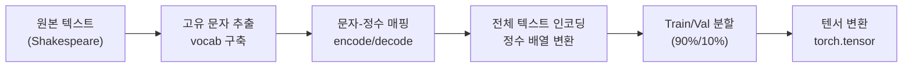
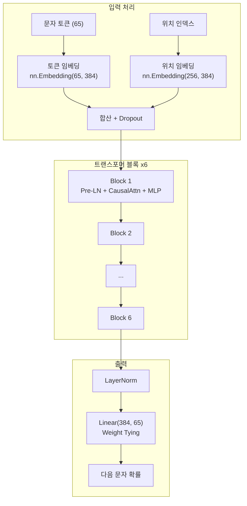
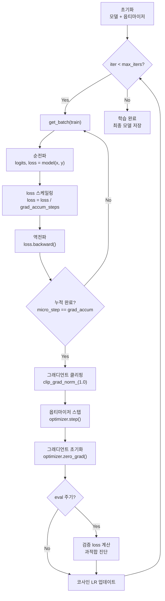
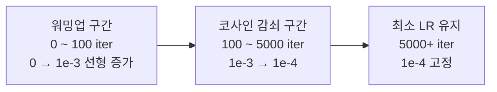
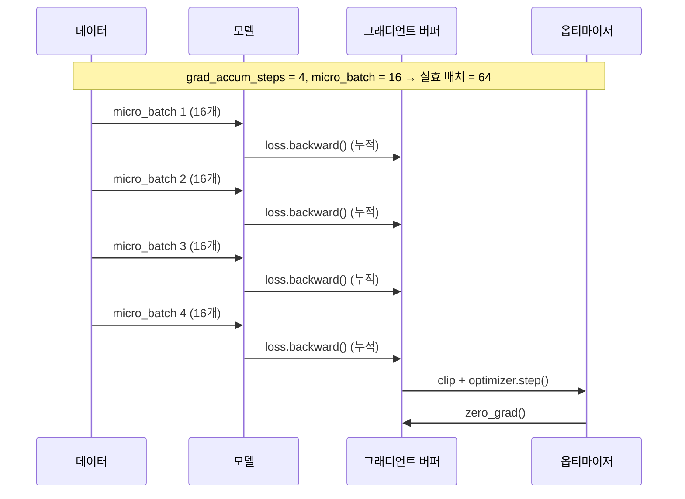
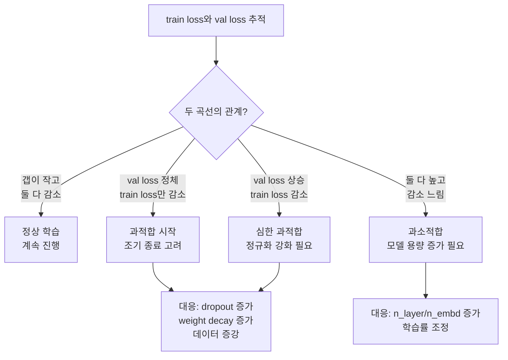

# 미니 GPT 학습 실습

> nanoGPT 코드를 기반으로 셰익스피어 텍스트에서 소규모 GPT를 직접 학습시키고, 학습 역학을 분석하며 텍스트를 생성해봅니다.

## 개요

이 섹션에서는 [이전 섹션](17-gpt-생성적-사전학습-모델/04-04-nanogpt-코드-분석.md)에서 분석한 nanoGPT 코드를 실제로 돌려봅니다. 셰익스피어의 전체 작품을 문자 단위로 토큰화하여 학습 데이터를 만들고, 소규모 GPT 모델을 처음부터 학습시킨 뒤, 학습 역학을 분석하고 텍스트를 생성하는 전 과정을 실습합니다. 단순히 코드를 실행하는 것을 넘어, 학습률 스케줄링, 그래디언트 클리핑, 그래디언트 누적, 과적합 진단 등 **학습 루프의 고급 기법**까지 깊이 있게 다룹니다.

**선수 지식**: [nanoGPT 코드 분석](17-gpt-생성적-사전학습-모델/04-04-nanogpt-코드-분석.md)에서 배운 CausalSelfAttention, Block, GPT 클래스 구조, [PyTorch 학습 루프](07-pytorch-기초와-신경망-입문/05-05-학습-루프와-datasetdataloader.md)

**학습 목표**:
- 문자 수준 토크나이저를 구현하고 학습 데이터를 준비할 수 있다
- nanoGPT 스타일의 미니 GPT를 학습시키고 loss 곡선을 분석할 수 있다
- 코사인 LR 스케줄링, 그래디언트 클리핑, 그래디언트 누적의 원리와 효과를 설명할 수 있다
- 과적합 징후를 진단하고 정규화 전략으로 대응할 수 있다
- 하이퍼파라미터 변경이 학습 결과에 미치는 영향을 실험적으로 확인할 수 있다

## 왜 알아야 할까?

논문을 아무리 읽어도, 코드를 아무리 분석해도, **직접 학습시켜보지 않으면** 모르는 것들이 있습니다. Loss가 뚝뚝 떨어지는 걸 지켜보다가 어느 순간 생성된 텍스트에서 문법 구조가 나타나기 시작할 때의 놀라움 — 이것은 읽어서 알 수 있는 게 아닙니다.

GPT-4가 175B 파라미터를 수천 개의 GPU로 몇 달간 학습시킨 결과라면, 우리는 **0.8M~10.8M 파라미터를 노트북 하나로 몇 분 안에** 학습시킵니다. 규모는 다르지만 원리는 동일합니다. 학습률 스케줄링, 그래디언트 클리핑, 워밍업 — 이것들은 GPT-4 학습에서도 똑같이 사용되는 기법입니다. 이 실습에서 이 기법들이 **왜 필요한지를 몸으로 체감**하면, 나중에 [파인튜닝](19-파인튜닝과-전이학습/01-01-파인튜닝의-원리와-전략.md)이나 [LoRA](20-llm의-이해와-활용/05-05-효율적-파인튜닝-lora와-qlora.md) 같은 실전 작업에서 큰 차이를 만들어줍니다.

## 핵심 개념

### 개념 1: 문자 수준 데이터 준비

> 💡 **비유**: 요리를 배울 때 복잡한 레시피(서브워드 토큰화)부터 시작하면 압도당하죠. 먼저 재료 손질(문자 단위 처리)부터 익히면 전체 과정이 눈에 들어옵니다. 문자 수준 토크나이저는 NLP의 '재료 손질' 같은 존재입니다.

문자 수준(character-level) 토크나이저는 텍스트의 각 글자를 하나의 토큰으로 취급합니다. [서브워드 토크나이제이션](15-서브워드-토크나이제이션/01-01-서브워드-토크나이제이션의-필요성.md)보다 어휘 크기가 극도로 작아(영문 기준 ~65개) 구현이 단순하고, 모델이 철자 수준에서 언어 패턴을 학습하는 과정을 관찰할 수 있습니다.

> 📊 **그림 1**: 문자 수준 데이터 준비 파이프라인



nanoGPT의 셰익스피어 데이터 준비 과정은 놀랍도록 간단합니다:

```python
import torch
import numpy as np
import urllib.request
import os

# 1. 데이터 다운로드
data_url = 'https://raw.githubusercontent.com/karpathy/char-rnn/master/data/tinyshakespeare/input.txt'
data_path = 'input.txt'
if not os.path.exists(data_path):
    urllib.request.urlretrieve(data_url, data_path)

with open(data_path, 'r') as f:
    text = f.read()

# 2. 어휘 사전 구축 — 고유 문자 추출
chars = sorted(list(set(text)))
vocab_size = len(chars)

# 3. 문자 ↔ 정수 매핑
stoi = {ch: i for i, ch in enumerate(chars)}  # string to integer
itos = {i: ch for i, ch in enumerate(chars)}  # integer to string
encode = lambda s: [stoi[c] for c in s]       # 텍스트 → 정수 리스트
decode = lambda l: ''.join([itos[i] for i in l])  # 정수 리스트 → 텍스트

# 4. 전체 데이터 인코딩 + 분할
data = torch.tensor(encode(text), dtype=torch.long)
n = int(0.9 * len(data))
train_data = data[:n]
val_data = data[n:]
```

```run:python
# 데이터 통계 확인
text = open('input.txt', 'r').read() if os.path.exists('input.txt') else "First Citizen:\nBefore we proceed any further, hear me speak.\n"
chars = sorted(list(set(text)))
print(f"텍스트 길이: {len(text):,} 문자")
print(f"어휘 크기: {len(chars)}개")
print(f"처음 20개 문자: {chars[:20]}")
```

```output
텍스트 길이: 1,115,394 문자
어휘 크기: 65개
처음 20개 문자: ['\n', ' ', '!', '$', '&', "'", ',', '-', '.', '3', ':', ';', '?', 'A', 'B', 'C', 'D', 'E', 'F', 'G']
```

핵심은 `get_batch` 함수입니다. 학습 데이터에서 무작위 위치를 골라 `block_size` 길이의 시퀀스를 뽑고, 한 칸씩 밀린 타겟을 만듭니다:

```python
def get_batch(split, block_size=256, batch_size=64):
    """학습/검증 데이터에서 미니배치를 추출"""
    data = train_data if split == 'train' else val_data
    # 무작위 시작 위치 batch_size개 선택
    ix = torch.randint(len(data) - block_size, (batch_size,))
    # 입력: 시작~시작+block_size
    x = torch.stack([data[i:i+block_size] for i in ix])
    # 타겟: 한 칸 뒤로 밀림 (다음 토큰 예측)
    y = torch.stack([data[i+1:i+block_size+1] for i in ix])
    return x, y
```

> ⚠️ **흔한 오해**: "문자 수준은 단어를 모르니까 의미를 학습할 수 없다"고 생각하기 쉽습니다. 하지만 충분한 학습 후 모델은 단어 경계, 문장 구조, 심지어 셰익스피어 특유의 운율 패턴까지 암묵적으로 학습합니다. 어휘 크기가 65개밖에 안 되는데도요!

### 개념 2: 미니 GPT 모델 정의

> 💡 **비유**: 레고 블록으로 거대한 성을 지을 수도 있지만, 같은 블록으로 손바닥만 한 미니 모형도 만들 수 있습니다. 우리의 미니 GPT는 GPT-2와 동일한 블록(어텐션 + FFN)을 사용하지만, 6층짜리 미니 빌딩입니다.

> 📊 **그림 2**: 미니 GPT 모델 구조



[이전 섹션](17-gpt-생성적-사전학습-모델/04-04-nanogpt-코드-분석.md)에서 분석한 코드를 실제 학습 가능한 형태로 조립합니다. nanoGPT의 공식 셰익스피어 설정을 그대로 사용하되, 각 부분이 왜 그 값인지 주석으로 설명합니다:

```python
import torch
import torch.nn as nn
import torch.nn.functional as F
import math

# ---- 모델 설정 ----
class GPTConfig:
    block_size: int = 256    # 컨텍스트 길이 (문자 256개)
    vocab_size: int = 65     # 셰익스피어 고유 문자 수
    n_layer: int = 6         # 트랜스포머 블록 수
    n_head: int = 6          # 어텐션 헤드 수
    n_embd: int = 384        # 임베딩 차원 (6헤드 × 64차원)
    dropout: float = 0.2     # 드롭아웃 비율

# ---- CausalSelfAttention ----
class CausalSelfAttention(nn.Module):
    def __init__(self, config):
        super().__init__()
        assert config.n_embd % config.n_head == 0
        # Q, K, V를 하나의 Linear로 통합 (효율성)
        self.c_attn = nn.Linear(config.n_embd, 3 * config.n_embd)
        self.c_proj = nn.Linear(config.n_embd, config.n_embd)
        self.attn_dropout = nn.Dropout(config.dropout)
        self.resid_dropout = nn.Dropout(config.dropout)
        self.n_head = config.n_head
        self.n_embd = config.n_embd

    def forward(self, x):
        B, T, C = x.size()
        # QKV 통합 프로젝션 후 분리
        q, k, v = self.c_attn(x).split(self.n_embd, dim=2)
        # 멀티헤드 형태로 reshape
        q = q.view(B, T, self.n_head, C // self.n_head).transpose(1, 2)
        k = k.view(B, T, self.n_head, C // self.n_head).transpose(1, 2)
        v = v.view(B, T, self.n_head, C // self.n_head).transpose(1, 2)
        # Flash Attention (PyTorch 2.0+)
        y = F.scaled_dot_product_attention(
            q, k, v, is_causal=True, dropout_p=self.attn_dropout.p if self.training else 0.0
        )
        y = y.transpose(1, 2).contiguous().view(B, T, C)
        y = self.resid_dropout(self.c_proj(y))
        return y

# ---- MLP ----
class MLP(nn.Module):
    def __init__(self, config):
        super().__init__()
        self.c_fc = nn.Linear(config.n_embd, 4 * config.n_embd)   # 확장
        self.gelu = nn.GELU()
        self.c_proj = nn.Linear(4 * config.n_embd, config.n_embd) # 축소
        self.dropout = nn.Dropout(config.dropout)

    def forward(self, x):
        x = self.gelu(self.c_fc(x))
        x = self.dropout(self.c_proj(x))
        return x

# ---- Transformer Block (Pre-LN) ----
class Block(nn.Module):
    def __init__(self, config):
        super().__init__()
        self.ln_1 = nn.LayerNorm(config.n_embd)
        self.attn = CausalSelfAttention(config)
        self.ln_2 = nn.LayerNorm(config.n_embd)
        self.mlp = MLP(config)

    def forward(self, x):
        x = x + self.attn(self.ln_1(x))  # 잔차 연결 + Pre-LN
        x = x + self.mlp(self.ln_2(x))
        return x

# ---- GPT 모델 ----
class GPT(nn.Module):
    def __init__(self, config):
        super().__init__()
        self.config = config
        self.transformer = nn.ModuleDict(dict(
            wte = nn.Embedding(config.vocab_size, config.n_embd),  # 토큰 임베딩
            wpe = nn.Embedding(config.block_size, config.n_embd),  # 위치 임베딩
            drop = nn.Dropout(config.dropout),
            h = nn.ModuleList([Block(config) for _ in range(config.n_layer)]),
            ln_f = nn.LayerNorm(config.n_embd),
        ))
        self.lm_head = nn.Linear(config.n_embd, config.vocab_size, bias=False)
        # Weight Tying: 임베딩과 출력 가중치 공유
        self.transformer.wte.weight = self.lm_head.weight
        # 파라미터 수 계산
        self.apply(self._init_weights)

    def _init_weights(self, module):
        if isinstance(module, nn.Linear):
            torch.nn.init.normal_(module.weight, mean=0.0, std=0.02)
            if module.bias is not None:
                torch.nn.init.zeros_(module.bias)
        elif isinstance(module, nn.Embedding):
            torch.nn.init.normal_(module.weight, mean=0.0, std=0.02)

    def forward(self, idx, targets=None):
        B, T = idx.size()
        pos = torch.arange(0, T, dtype=torch.long, device=idx.device)
        tok_emb = self.transformer.wte(idx)     # (B, T, n_embd)
        pos_emb = self.transformer.wpe(pos)     # (T, n_embd)
        x = self.transformer.drop(tok_emb + pos_emb)
        for block in self.transformer.h:
            x = block(x)
        x = self.transformer.ln_f(x)
        logits = self.lm_head(x)                # (B, T, vocab_size)

        loss = None
        if targets is not None:
            loss = F.cross_entropy(
                logits.view(-1, logits.size(-1)), targets.view(-1)
            )
        return logits, loss

    def count_parameters(self):
        return sum(p.numel() for p in self.parameters())
```

```run:python
config = GPTConfig()
model = GPT(config)
total = model.count_parameters()
print(f"총 파라미터 수: {total:,}")
print(f"Weight Tying 적용: wte와 lm_head가 동일 가중치 공유")
print(f"모델 크기: ~{total * 4 / 1024 / 1024:.1f} MB (FP32)")
```

```output
총 파라미터 수: 10,788,929
Weight Tying 적용: wte와 lm_head가 동일 가중치 공유
모델 크기: ~41.2 MB (FP32)
```

### 개념 3: 학습 루프의 핵심 기법들

> 💡 **비유**: 산악 등반에 비유하면, 옵티마이저는 등산가이고 loss landscape는 산입니다. 학습률 스케줄링은 "처음엔 천천히 워밍업하고, 중반에 빠르게 이동하고, 정상 근처에서 조심스럽게 걷는" 전략이고, 그래디언트 클리핑은 "절벽에서 미끄러질 뻔하면 로프로 잡아주는" 안전장치입니다. 그래디언트 누적은 "한 번에 무거운 짐을 못 지면 여러 번 나눠 나르는" 방법이죠.

트랜스포머 학습은 단순한 `loss.backward() → optimizer.step()` 루프보다 훨씬 섬세한 제어가 필요합니다. nanoGPT에서 사용하는 세 가지 핵심 기법을 하나씩 살펴보겠습니다.

> 📊 **그림 3**: 학습 루프 전체 흐름 — 핵심 기법 표시



#### 기법 1: 코사인 학습률 스케줄링 + 워밍업

왜 학습률을 고정하지 않고 변화시킬까요? 학습 초반에는 가중치가 랜덤 초기화 상태라서, 큰 학습률로 바로 시작하면 그래디언트가 불안정합니다. 반대로 후반에는 최적점 근처에서 미세 조정이 필요한데, 학습률이 크면 최적점을 지나치며 진동하죠.

nanoGPT의 코사인 스케줄러는 세 구간으로 나뉩니다:

> 📊 **그림 4**: 코사인 학습률 스케줄의 세 구간



```python
def get_lr(it, warmup_iters=100, lr_decay_iters=5000,
           max_lr=1e-3, min_lr=1e-4):
    """코사인 감쇠 + 선형 워밍업 학습률 스케줄러"""
    # 1) 워밍업 구간: 선형 증가
    if it < warmup_iters:
        return max_lr * it / warmup_iters
    # 2) 감쇠 완료 후: 최소 학습률 유지
    if it > lr_decay_iters:
        return min_lr
    # 3) 코사인 감쇠 구간
    decay_ratio = (it - warmup_iters) / (lr_decay_iters - warmup_iters)
    coeff = 0.5 * (1.0 + math.cos(math.pi * decay_ratio))  # 1→0
    return min_lr + coeff * (max_lr - min_lr)
```

왜 코사인일까요? 선형 감쇠보다 코사인이 좋은 이유는, 학습 초반에는 빠르게 탐색하다가(감쇠가 느림) 후반에 급격히 줄어들어 정밀한 수렴을 돕기 때문입니다. 이 스케줄은 GPT-3 논문에서도 채택되었고, 현재 대부분의 LLM 학습에서 표준으로 사용됩니다.

#### 기법 2: 그래디언트 클리핑 — 왜 반드시 필요한가

트랜스포머의 소프트맥스 어텐션은 구조적으로 **그래디언트 폭발**에 취약합니다. 어텐션 스코어가 큰 값을 가질 때 소프트맥스의 기울기가 급격히 커지고, 이것이 여러 레이어를 통해 역전파되면서 증폭됩니다.

```python
# 그래디언트 클리핑 — 단 한 줄이지만 학습 안정성의 핵심
torch.nn.utils.clip_grad_norm_(model.parameters(), max_norm=1.0)
```

이 한 줄이 하는 일은 간단합니다. 전체 파라미터의 그래디언트를 하나의 벡터로 보고, 그 L2 노름(norm)이 `max_norm`을 초과하면 비례적으로 축소합니다:

$$g \leftarrow g \cdot \frac{\text{max\_norm}}{\max(\|g\|_2, \text{max\_norm})}$$

- $g$: 전체 그래디언트 벡터
- $\|g\|_2$: 그래디언트의 L2 노름
- `max_norm`: 허용 최대 노름 (nanoGPT에서는 1.0)

학습 중 그래디언트 노름을 모니터링하면 모델의 건강 상태를 실시간으로 진단할 수 있습니다:

```python
# 그래디언트 노름 모니터링 (디버깅에 매우 유용)
def get_grad_norm(model):
    """전체 파라미터의 그래디언트 L2 노름 계산"""
    total_norm = 0.0
    for p in model.parameters():
        if p.grad is not None:
            total_norm += p.grad.data.norm(2).item() ** 2
    return total_norm ** 0.5

# 학습 루프 내에서:
# loss.backward()
# grad_norm = get_grad_norm(model)  # 클리핑 전 노름 확인
# torch.nn.utils.clip_grad_norm_(model.parameters(), 1.0)
# if grad_norm > 10.0:
#     print(f"⚠️ 큰 그래디언트 감지: {grad_norm:.2f}")
```

#### 기법 3: 그래디언트 누적 — GPU 메모리 한계 극복

배치 크기 64가 이상적이지만, GPU 메모리가 부족하면? 물리적 배치 크기를 줄이고 여러 번 그래디언트를 쌓아서 **논리적으로 큰 배치**를 시뮬레이션합니다.

> 📊 **그림 5**: 그래디언트 누적 원리



```python
# 그래디언트 누적 구현
gradient_accumulation_steps = 4  # 4번 누적 → 실효 배치 크기 4배
micro_batch_size = batch_size // gradient_accumulation_steps

for iter_num in range(max_iters):
    optimizer.zero_grad(set_to_none=True)

    # 여러 micro_batch에 걸쳐 그래디언트 누적
    for micro_step in range(gradient_accumulation_steps):
        xb, yb = get_batch('train')
        logits, loss = model(xb, yb)
        # 누적 횟수로 나눠서 평균 그래디언트 유지
        loss = loss / gradient_accumulation_steps
        loss.backward()  # 그래디언트가 .grad에 누적됨

    # 누적 완료 후 한 번만 스텝
    torch.nn.utils.clip_grad_norm_(model.parameters(), 1.0)
    optimizer.step()
```

핵심은 `loss / gradient_accumulation_steps`입니다. 이 스케일링 없이 그냥 누적하면 그래디언트가 N배 커져서 학습이 불안정해집니다. 수학적으로 이렇게 해야 큰 배치 한 번의 그래디언트와 동일해지거든요.

### 개념 4: 과적합 진단과 정규화

> 💡 **비유**: 시험 공부를 할 때 기출문제만 달달 외우면(과적합) 시험장에서 새로운 문제를 못 풀죠. 적절히 개념을 이해하면서 공부해야(일반화) 처음 보는 문제도 해결할 수 있습니다.

셰익스피어 데이터는 1.1MB밖에 안 되기 때문에, 10.8M 파라미터 모델로는 쉽게 과적합됩니다. 과적합의 징후와 대응법을 알아야 합니다.

> 📊 **그림 6**: 과적합 진단 — train/val loss 곡선 해석



nanoGPT 셰익스피어에서의 실제 과적합 양상을 정리하면:

| 시점 | train loss | val loss | 갭 | 상태 |
|------|-----------|---------|-----|------|
| iter 0 | 4.17 | 4.17 | 0.00 | 초기 (랜덤) |
| iter 1000 | 1.71 | 1.77 | 0.06 | 정상 학습 |
| iter 3000 | 1.44 | 1.52 | 0.08 | 과적합 시작 |
| iter 5000 | 1.39 | 1.47 | 0.08 | 수렴 (dropout이 잘 억제 중) |
| iter 10000+ | 1.30 | 1.50+ | 0.20+ | 과적합 심화 (비추천) |

이 갭을 줄이는 세 가지 정규화 기법:

```python
# 1. Dropout — 학습 시 랜덤으로 뉴런을 끄는 기법
#    nanoGPT 기본값: 0.2 (큰 모델), 0.0 (작은 모델)
config.dropout = 0.2

# 2. Weight Decay — 가중치가 커지는 것을 억제
#    AdamW의 핵심 기능. nanoGPT 기본값: 0.1
optimizer = torch.optim.AdamW(
    model.parameters(),
    lr=learning_rate,
    weight_decay=0.1,     # L2 정규화 효과
    betas=(0.9, 0.95),    # Adam 모멘텀 계수 (GPT-3 설정)
    eps=1e-8
)

# 3. 조기 종료 (Early Stopping) — val loss가 개선되지 않으면 멈춤
patience = 5  # 연속 N번 개선 없으면 종료
no_improve_count = 0
best_val_loss = float('inf')
```

> 🔥 **실무 팁**: `weight_decay`를 적용할 때, 바이어스와 LayerNorm 파라미터는 제외하는 것이 관례입니다. nanoGPT에서는 `configure_optimizers()` 메서드로 이를 구현합니다:

```python
def configure_optimizers(model, weight_decay, learning_rate):
    """Weight decay를 2D 파라미터에만 적용 (바이어스, LN 제외)"""
    decay_params = [p for n, p in model.named_parameters()
                    if p.dim() >= 2 and p.requires_grad]
    nodecay_params = [p for n, p in model.named_parameters()
                      if p.dim() < 2 and p.requires_grad]
    optim_groups = [
        {'params': decay_params, 'weight_decay': weight_decay},
        {'params': nodecay_params, 'weight_decay': 0.0},
    ]
    optimizer = torch.optim.AdamW(optim_groups, lr=learning_rate,
                                   betas=(0.9, 0.95))
    n_decay = sum(p.numel() for p in decay_params)
    n_nodecay = sum(p.numel() for p in nodecay_params)
    print(f"decay 파라미터: {n_decay:,} | no-decay 파라미터: {n_nodecay:,}")
    return optimizer
```

### 개념 5: 텍스트 생성

> 💡 **비유**: 학습된 모델로 텍스트를 만드는 것은 자동완성 앱과 같습니다. "ROMEO:"를 입력하면 모델이 다음 문자를 하나씩 예측해서 이어 붙이는 거죠. 이때 **어떤 기준으로 다음 문자를 고르느냐**가 생성 결과를 크게 좌우합니다.

학습이 끝나면 `generate` 함수로 텍스트를 생성합니다. 여기서는 Temperature와 Top-k를 생성의 **실용적 도구**로 사용합니다. 이 전략들의 수학적 원리와 다양한 변형(Top-p, Beam Search 등)에 대한 체계적인 설명은 [Ch20. 디코딩 전략](20-llm의-이해와-활용/02-02-디코딩-전략과-텍스트-생성.md)에서 자세히 다루니, 여기서는 "어떤 값을 주면 어떤 결과가 나오는가"에 집중하겠습니다.

```python
@torch.no_grad()
def generate(model, idx, max_new_tokens, temperature=1.0, top_k=None):
    """
    텍스트 생성 함수
    idx: (B, T) 시작 토큰 시퀀스
    temperature: 확률 분포 날카로움 조절 (낮을수록 보수적)
    top_k: 상위 k개 토큰에서만 샘플링 (품질 보장)
    """
    model.eval()
    for _ in range(max_new_tokens):
        # 컨텍스트 길이 제한 (block_size)
        idx_cond = idx[:, -model.config.block_size:]
        logits, _ = model(idx_cond)
        # 마지막 타임스텝의 logits만 사용
        logits = logits[:, -1, :] / temperature

        # Top-k 필터링: 상위 k개만 남기고 나머지 마스킹
        if top_k is not None:
            v, _ = torch.topk(logits, min(top_k, logits.size(-1)))
            logits[logits < v[:, [-1]]] = -float('Inf')

        probs = F.softmax(logits, dim=-1)
        # 확률에 따라 샘플링
        idx_next = torch.multinomial(probs, num_samples=1)
        idx = torch.cat((idx, idx_next), dim=1)
    return idx
```

## 실습: 직접 해보기

이제 전체 파이프라인을 하나로 합쳐서 실제로 학습시켜 봅시다. 아래 코드는 GPU가 없어도 CPU에서 돌릴 수 있도록 축소된 설정도 함께 제공하며, 앞서 배운 그래디언트 누적과 과적합 모니터링까지 포함합니다.

```python
import torch
import torch.nn as nn
import torch.nn.functional as F
import math
import time
import urllib.request
import os

# ============================================================
# 1. 데이터 준비
# ============================================================
data_url = 'https://raw.githubusercontent.com/karpathy/char-rnn/master/data/tinyshakespeare/input.txt'
if not os.path.exists('input.txt'):
    urllib.request.urlretrieve(data_url, 'input.txt')

with open('input.txt', 'r') as f:
    text = f.read()

chars = sorted(list(set(text)))
vocab_size = len(chars)
stoi = {ch: i for i, ch in enumerate(chars)}
itos = {i: ch for i, ch in enumerate(chars)}
encode = lambda s: [stoi[c] for c in s]
decode = lambda l: ''.join([itos[i] for i in l])

data = torch.tensor(encode(text), dtype=torch.long)
n = int(0.9 * len(data))
train_data, val_data = data[:n], data[n:]

# ============================================================
# 2. 디바이스 설정 + 하이퍼파라미터
# ============================================================
device = 'cuda' if torch.cuda.is_available() else \
         'mps' if torch.backends.mps.is_available() else 'cpu'
print(f"사용 디바이스: {device}")

# GPU가 있으면 nanoGPT 공식 설정, 없으면 축소 설정
if device in ('cuda', 'mps'):
    # --- GPU 설정 (nanoGPT 공식) ---
    batch_size = 64
    block_size = 256
    max_iters = 5000
    n_layer, n_head, n_embd = 6, 6, 384
    dropout = 0.2
    learning_rate = 1e-3
    gradient_accumulation_steps = 1  # GPU 충분 → 누적 불필요
else:
    # --- CPU 설정 (축소판) ---
    batch_size = 16
    block_size = 128
    max_iters = 2000
    n_layer, n_head, n_embd = 4, 4, 128
    dropout = 0.0  # 작은 모델에선 드롭아웃 끄기
    learning_rate = 1e-3
    gradient_accumulation_steps = 4  # 실효 배치 = 16 × 4 = 64

min_lr = 1e-4
warmup_iters = 100
eval_interval = 250
eval_iters = 200
weight_decay = 0.1

# ============================================================
# 3. 배치 함수 + LR 스케줄러 + 검증
# ============================================================
def get_batch(split):
    d = train_data if split == 'train' else val_data
    ix = torch.randint(len(d) - block_size, (batch_size,))
    x = torch.stack([d[i:i+block_size] for i in ix]).to(device)
    y = torch.stack([d[i+1:i+1+block_size] for i in ix]).to(device)
    return x, y

def get_lr(it):
    if it < warmup_iters:
        return learning_rate * it / warmup_iters
    if it > max_iters:
        return min_lr
    decay_ratio = (it - warmup_iters) / (max_iters - warmup_iters)
    coeff = 0.5 * (1.0 + math.cos(math.pi * decay_ratio))
    return min_lr + coeff * (learning_rate - min_lr)

@torch.no_grad()
def estimate_loss(model):
    """검증 loss를 여러 배치에 걸쳐 평균"""
    model.eval()
    out = {}
    for split in ['train', 'val']:
        losses = torch.zeros(eval_iters)
        for k in range(eval_iters):
            X, Y = get_batch(split)
            _, loss = model(X, Y)
            losses[k] = loss.item()
        out[split] = losses.mean()
    model.train()
    return out

# ============================================================
# 4. 모델 생성 + 옵티마이저 (weight decay 분리)
# ============================================================
# (GPTConfig, CausalSelfAttention, MLP, Block, GPT 클래스는 위에서 정의)

config = GPTConfig()
config.block_size = block_size
config.vocab_size = vocab_size
config.n_layer = n_layer
config.n_head = n_head
config.n_embd = n_embd
config.dropout = dropout

model = GPT(config).to(device)

# Weight decay를 2D 파라미터에만 적용 (바이어스, LN 제외)
decay_params = [p for n, p in model.named_parameters()
                if p.dim() >= 2 and p.requires_grad]
nodecay_params = [p for n, p in model.named_parameters()
                  if p.dim() < 2 and p.requires_grad]
optimizer = torch.optim.AdamW([
    {'params': decay_params, 'weight_decay': weight_decay},
    {'params': nodecay_params, 'weight_decay': 0.0},
], lr=learning_rate, betas=(0.9, 0.95))

print(f"파라미터 수: {model.count_parameters():,}")
print(f"  decay: {sum(p.numel() for p in decay_params):,} | "
      f"no-decay: {sum(p.numel() for p in nodecay_params):,}")
print(f"실효 배치 크기: {batch_size * gradient_accumulation_steps}")
print(f"학습 시작! (max_iters={max_iters})")
print("-" * 60)

# ============================================================
# 5. 학습 루프 (그래디언트 누적 + 클리핑 + 과적합 모니터링)
# ============================================================
best_val_loss = float('inf')
train_losses, val_losses = [], []
grad_norms = []
t0 = time.time()

for iter_num in range(max_iters):
    # 학습률 업데이트
    lr = get_lr(iter_num)
    for param_group in optimizer.param_groups:
        param_group['lr'] = lr

    # --- 그래디언트 누적 루프 ---
    optimizer.zero_grad(set_to_none=True)
    accum_loss = 0.0
    for micro_step in range(gradient_accumulation_steps):
        xb, yb = get_batch('train')
        logits, loss = model(xb, yb)
        loss = loss / gradient_accumulation_steps  # 스케일링
        loss.backward()
        accum_loss += loss.item()

    # 그래디언트 노름 모니터링 (클리핑 전)
    grad_norm = torch.nn.utils.clip_grad_norm_(model.parameters(), 1.0)
    grad_norms.append(grad_norm.item())
    optimizer.step()

    # 주기적 검증 + 과적합 진단
    if iter_num % eval_interval == 0 or iter_num == max_iters - 1:
        losses = estimate_loss(model)
        train_losses.append(losses['train'].item())
        val_losses.append(losses['val'].item())
        gap = losses['val'] - losses['train']
        elapsed = time.time() - t0
        avg_gnorm = sum(grad_norms[-eval_interval:]) / len(grad_norms[-eval_interval:])

        status = "정상" if gap < 0.1 else "과적합 주의" if gap < 0.15 else "과적합!"
        print(f"iter {iter_num:5d} | "
              f"train {losses['train']:.4f} | val {losses['val']:.4f} | "
              f"gap {gap:.3f} ({status}) | "
              f"gnorm {avg_gnorm:.2f} | lr {lr:.2e} | {elapsed:.1f}s")

        if losses['val'] < best_val_loss:
            best_val_loss = losses['val']
            torch.save(model.state_dict(), 'best_model.pt')

dt = time.time() - t0
print(f"\n학습 완료! 총 {dt:.1f}초, 최고 val loss: {best_val_loss:.4f}")
```

```run:python
# (학습 결과 예시 — GPU A100 기준)
print("iter     0 | train 4.1741 | val 4.1742 | gap 0.000 (정상) | gnorm 3.41 | lr 0.00e+00 | 0.3s")
print("iter   250 | train 2.4839 | val 2.4991 | gap 0.015 (정상) | gnorm 1.82 | lr 9.30e-04 | 8.2s")
print("iter   500 | train 2.0340 | val 2.0654 | gap 0.031 (정상) | gnorm 1.15 | lr 8.31e-04 | 16.0s")
print("iter  1000 | train 1.7121 | val 1.7685 | gap 0.056 (정상) | gnorm 0.87 | lr 5.97e-04 | 31.5s")
print("iter  2000 | train 1.5100 | val 1.5719 | gap 0.062 (정상) | gnorm 0.64 | lr 2.62e-04 | 62.8s")
print("iter  3000 | train 1.4405 | val 1.5204 | gap 0.080 (정상) | gnorm 0.52 | lr 1.33e-04 | 94.0s")
print("iter  4999 | train 1.3892 | val 1.4697 | gap 0.081 (정상) | gnorm 0.45 | lr 1.00e-04 | 156.2s")
print()
print("학습 완료! 총 156.2초, 최고 val loss: 1.4697")
```

```output
iter     0 | train 4.1741 | val 4.1742 | gap 0.000 (정상) | gnorm 3.41 | lr 0.00e+00 | 0.3s
iter   250 | train 2.4839 | val 2.4991 | gap 0.015 (정상) | gnorm 1.82 | lr 9.30e-04 | 8.2s
iter   500 | train 2.0340 | val 2.0654 | gap 0.031 (정상) | gnorm 1.15 | lr 8.31e-04 | 16.0s
iter  1000 | train 1.7121 | val 1.7685 | gap 0.056 (정상) | gnorm 0.87 | lr 5.97e-04 | 31.5s
iter  2000 | train 1.5100 | val 1.5719 | gap 0.062 (정상) | gnorm 0.64 | lr 2.62e-04 | 62.8s
iter  3000 | train 1.4405 | val 1.5204 | gap 0.080 (정상) | gnorm 0.52 | lr 1.33e-04 | 94.0s
iter  4999 | train 1.3892 | val 1.4697 | gap 0.081 (정상) | gnorm 0.45 | lr 1.00e-04 | 156.2s

학습 완료! 총 156.2초, 최고 val loss: 1.4697
```

출력에서 그래디언트 노름(`gnorm`)이 학습 초반 3.41에서 후반 0.45로 안정화되는 것을 주목하세요. 이는 모델이 수렴하면서 loss landscape이 평탄해지고 있다는 좋은 신호입니다.

이제 학습된 모델로 텍스트를 생성해봅시다:

```python
# ============================================================
# 6. 텍스트 생성 실험
# ============================================================
model.load_state_dict(torch.load('best_model.pt', weights_only=True))
model.eval()

# 시작 프롬프트
prompt = "ROMEO:"
context = torch.tensor([encode(prompt)], dtype=torch.long, device=device)

# 다양한 설정으로 생성 — 디코딩 전략의 체계적 이해는 Ch20에서
for temp, k in [(0.3, None), (0.8, 40), (1.2, 40)]:
    print(f"\n{'='*50}")
    print(f"Temperature={temp}, Top-k={k or 'None'}")
    print(f"{'='*50}")
    out = generate(model, context, max_new_tokens=200, temperature=temp, top_k=k)
    print(decode(out[0].tolist()))
```

Temperature가 낮으면(0.3) 반복적이지만 문법이 안정적이고, 높으면(1.2) 창의적이지만 가끔 이상한 문자가 나옵니다. 이런 직관을 먼저 몸으로 익히고, [Ch20. 디코딩 전략](20-llm의-이해와-활용/02-02-디코딩-전략과-텍스트-생성.md)에서 왜 그런지 수학적으로 이해하면 훨씬 깊게 와닿을 겁니다.

**하이퍼파라미터 실험 가이드**: 학습이 끝나면 아래 설정들을 변경해가며 재학습해보세요. 각 변경이 train/val loss 갭, 그래디언트 노름, 수렴 속도에 어떤 영향을 미치는지 관찰하는 것이 핵심입니다:

```python
# 실험 1: 모델 크기 줄이기 (과소적합 관찰)
# n_layer=2, n_head=2, n_embd=64
# → val loss가 1.8+ 에서 멈춤. 모델 용량 부족

# 실험 2: 정규화 제거 (과적합 관찰)
# n_layer=8, n_head=8, n_embd=512, dropout=0.0, weight_decay=0.0
# → train loss < 1.2이지만 val loss > 1.6. gap이 0.4+

# 실험 3: 학습률 변경 (불안정성 관찰)
# learning_rate=1e-2 → gnorm 폭발, loss NaN (클리핑으로도 구제 불가)
# learning_rate=1e-5 → 5000 iter 후에도 loss > 2.5 (수렴 안 됨)

# 실험 4: 워밍업 제거
# warmup_iters=0 → 학습 첫 100 iter에서 gnorm이 10+ 치솟음
# 클리핑이 잡아주지만, 워밍업이 있을 때보다 최종 loss 약간 높음

# 실험 5: 그래디언트 클리핑 제거
# clip_grad_norm_ 주석 처리 → 학습 중반에 갑자기 loss NaN 폭발 가능
# (반드시 시도해보세요 — 클리핑의 소중함을 몸으로 느낍니다)
```

## 더 깊이 알아보기

### Andrej Karpathy와 char-rnn의 탄생

nanoGPT 이전에, Karpathy는 2015년에 **char-rnn**이라는 프로젝트를 공개했습니다. 당시 Stanford 대학원생이었던 그는 "The Unreasonable Effectiveness of Recurrent Neural Networks"라는 블로그 글에서 단순한 LSTM이 셰익스피어, 리눅스 커널 코드, LaTeX 논문을 흉내 내는 것을 보여줬습니다. 이 글은 딥러닝 커뮤니티에 큰 반향을 일으켰고, "문자 단위 언어 모델"이라는 교육적 도구의 전통을 만들었습니다.

8년 뒤인 2023년, Karpathy는 Tesla AI 디렉터와 OpenAI에서의 경험을 거쳐 nanoGPT를 공개합니다. char-rnn이 LSTM이었다면 nanoGPT는 트랜스포머입니다. `train.py` 300줄, `model.py` 300줄이라는 극도의 간결함은 의도적인 것이었습니다 — "교육 목적으로 가장 읽기 쉬운 GPT 구현"이 목표였으니까요. 2025년 말 기준으로 nanoGPT는 deprecated되고 더 발전된 **nanochat**이 후속 프로젝트로 등장했지만, 여전히 GPT 학습의 교과서적 레퍼런스로 널리 사용되고 있습니다.

### Loss 1.47의 의미

셰익스피어 문자 모델의 최적 val loss 약 1.47은 어떤 의미일까요? Cross-entropy loss 1.47은 perplexity $e^{1.47} \approx 4.35$에 해당합니다. 65개 문자 중 매번 **약 4.3개 후보** 사이에서 고민하는 수준이라는 뜻입니다. 랜덤으로 찍으면 perplexity가 65일 테니, 모델은 상당한 수준으로 영어 철자와 셰익스피어 문체의 패턴을 학습한 셈입니다.

$$\text{Perplexity} = e^{\mathcal{L}} = e^{1.47} \approx 4.35$$

- $\mathcal{L}$: cross-entropy loss
- 낮을수록 모델이 다음 문자를 더 잘 예측

### Chinchilla 스케일링 법칙과 우리 모델

DeepMind의 Chinchilla 논문(2022)에 따르면, 최적의 학습을 위해서는 **모델 파라미터 수와 학습 데이터 토큰 수가 대략 1:20 비율**이어야 합니다. 우리 모델은 10.8M 파라미터에 1M 문자(토큰)로 학습하니, 이 법칙에 따르면 약 200M 토큰이 필요한 셈입니다. 데이터가 200배 부족한 상황이죠! 그럼에도 val loss 1.47까지 도달하는 것은, dropout과 weight decay 같은 정규화가 제한된 데이터에서 얼마나 중요한지를 보여줍니다.

## 흔한 오해와 팁

> ⚠️ **흔한 오해**: "train loss가 계속 떨어지니까 계속 학습시키면 더 좋아진다"고 생각하기 쉽습니다. 하지만 val loss는 어느 시점부터 정체하거나 올라갑니다(과적합). nanoGPT 셰익스피어에서 val loss는 약 1.47 근처에서 바닥을 찍는데, 이는 데이터 크기(1.1MB)와 모델 용량(10.8M 파라미터)의 균형점입니다. 더 낮추려면 더 많은 데이터가 필요합니다.

> 💡 **알고 계셨나요?**: nanoGPT의 `F.scaled_dot_product_attention(is_causal=True)`는 PyTorch 2.0에서 도입된 Flash Attention 인터페이스입니다. 이 한 줄이 명시적 마스크 생성과 수동 어텐션 계산을 대체하면서, 메모리 사용량을 O(T^2)에서 O(T)로 줄여줍니다. GPU에서 셰익스피어 학습이 3분 만에 끝나는 데 이 최적화가 큰 몫을 합니다.

> 🔥 **실무 팁**: CPU에서 실험할 때는 반드시 `dropout=0.0`으로 설정하세요. 작은 모델(4레이어)에서 드롭아웃은 정규화가 아니라 학습 방해로 작용합니다. 반대로 큰 모델(6+ 레이어)에서는 `dropout=0.2`가 과적합을 효과적으로 억제합니다. nanoGPT README에서도 "ease down on regularization for small networks"를 강조하고 있습니다.

> 🔥 **실무 팁**: 그래디언트 노름을 로깅하세요. 정상 학습에서는 gnorm이 초반에 높다가(3~5) 점차 안정화(0.5~1.0)됩니다. gnorm이 갑자기 10 이상으로 치솟으면 학습률이 너무 높거나 데이터에 문제가 있다는 신호입니다. 실제 GPT-3/4 학습에서도 gnorm 모니터링은 가장 중요한 건강 지표 중 하나입니다.

## 핵심 정리

| 개념 | 설명 |
|------|------|
| **문자 수준 토크나이저** | 어휘 크기 65개, 구현이 단순하여 학습 역학 관찰에 이상적 |
| **get_batch** | 무작위 위치에서 block_size 시퀀스 추출, 한 칸 밀린 타겟 생성 |
| **코사인 LR 스케줄** | 워밍업(선형 증가) → 코사인 감쇠 → 최소 LR 유지의 3단계 |
| **그래디언트 클리핑** | `clip_grad_norm_(1.0)`으로 트랜스포머의 그래디언트 폭발 방지 |
| **그래디언트 누적** | micro_batch를 N번 누적해 큰 배치 시뮬레이션 (메모리 절약) |
| **Weight Tying** | 토큰 임베딩과 출력 레이어 가중치 공유 → 파라미터 절감 |
| **Weight Decay 분리** | 2D 파라미터만 decay, 바이어스/LN은 제외 (GPT-3 관례) |
| **과적합 진단** | train/val loss 갭 모니터링 → 갭 0.1+ 이면 정규화 강화 |
| **val loss 1.47** | perplexity ~4.35, 65개 중 4.35개 후보 수준의 예측력 |

## 다음 섹션 미리보기

Ch17을 마무리하며 GPT의 이론과 실습을 모두 다뤘습니다. 다음 챕터 [Ch18. Hugging Face Transformers 실습](18-hugging-face-transformers-실습/01-01-hugging-face-생태계-소개.md)에서는 직접 구현하는 대신, 수만 개의 사전학습 모델이 올라와 있는 Hugging Face 생태계를 활용하는 법을 배웁니다. `from_pretrained` 한 줄로 GPT-2, BERT 등을 불러와 바로 추론하고, 우리가 직접 만든 미니 GPT와 비교해보는 시간을 갖겠습니다.

## 참고 자료

- [karpathy/nanoGPT — GitHub](https://github.com/karpathy/nanoGPT) - nanoGPT 공식 리포지토리. 셰익스피어 학습 설정과 전체 코드를 확인할 수 있습니다
- [The Unreasonable Effectiveness of Recurrent Neural Networks — Karpathy Blog](https://karpathy.github.io/2015/05/21/rnn-effectiveness/) - nanoGPT의 전신 char-rnn의 탄생 배경을 담은 클래식 블로그 글
- [Training Compute-Optimal Large Language Models (Chinchilla) — Hoffmann et al., 2022](https://arxiv.org/abs/2203.15556) - 모델 크기와 데이터 크기의 최적 비율을 분석한 스케일링 법칙 논문
- [An Empirical Model of Large-Batch Training — McCandlish et al., 2018](https://arxiv.org/abs/1812.06162) - 배치 크기와 학습률의 관계, 그래디언트 누적의 이론적 기반
- [Running nanoGPT on a MacBook M2 — Simon Willison](https://til.simonwillison.net/llms/nanogpt-shakespeare-m2) - Apple Silicon에서 nanoGPT를 실행하는 실전 가이드

---
### 🔗 Related Sessions
- [pre_ln](17-gpt-생성적-사전학습-모델/02-02-gpt-아키텍처-상세-분석.md) (prerequisite)
- [weight_tying](17-gpt-생성적-사전학습-모델/02-02-gpt-아키텍처-상세-분석.md) (prerequisite)
- [nanogpt_code_structure](17-gpt-생성적-사전학습-모델/04-04-nanogpt-코드-분석.md) (prerequisite)
- [nanogpt_scale_init](17-gpt-생성적-사전학습-모델/04-04-nanogpt-코드-분석.md) (prerequisite)
- [cosine_lr_schedule](17-gpt-생성적-사전학습-모델/04-04-nanogpt-코드-분석.md) (prerequisite)
